# Guía de la demo: Plataforma de cursos virtuales (LMS)

> Ruta `/demo/lms` (y su página de verificación `/demo/lms/verificar`) · Modo de acceso: **Con solicitud** · Tipo: **datos de ejemplo** en el navegador, con **IA real** solo en el tutor del curso (llama al servidor) · Plan del producto: [LMS / E-learning](Producto-lms-elearning.md)

**Resumen.** Es la plataforma de cursos de una academia ficticia de educación continua, Academia Quindé, con seis cursos en pesos colombianos. Muestra el recorrido completo de un alumno (catálogo, compra simulada con PSE, tarjeta o Nequi y cupones, lecciones con video simulado y subtítulos, notas, un tutor con IA que cita la lección y el minuto, evaluación final, ruta adaptativa, logros y certificados con QR verificable) y las vistas del instructor (analítica y riesgo de abandono, creación de cursos) y del administrador (ventas, cupones y certificados). Está pensada para academias, centros de formación y áreas de capacitación de empresas; se abre solo con un acceso aprobado.

**En esta página:** [Recorrido sugerido](#recorrido-sugerido-demo-comercial-de-5-minutos) · [Pantallas y funciones](#pantallas-y-funciones) · [Qué es real y qué es simulado](#qué-es-real-y-qué-es-simulado) · [Acceso](#acceso) · [Limitaciones conocidas](#limitaciones-conocidas)

*Vista inicial como alumno: encabezado de la academia con «Datos de ejemplo», selector de rol, secciones, cuatro cifras y el catálogo.*

> **Sobre las capturas.** El texto de las respuestas del tutor lo produjo el modelo simulado del entorno de pruebas (por eso empieza con «Respuesta simulada (mock de OpenAI)…»); con la clave real del proveedor lo redacta el modelo. La búsqueda en el material, las citas con lección y minuto y los avisos de modo sí son el comportamiento real. Las fechas de las clases en vivo y de las ventas se calculan con el día en que abres la demo (9 de octubre de 2026 en esta guía).

---

## Recorrido sugerido (demo comercial de 5 minutos)

El guion recorre lo que vive un alumno de punta a punta y termina mostrando lo que ve la academia. Empieza con los datos limpios: si alguien ya usó la demo en ese navegador, pulsa **Restablecer** (arriba a la derecha) y confirma con **Sí, restablecer**. El alumno de ejemplo ya está inscrito en «Excel para análisis de datos» (40 %) y terminó «Protección de datos personales (Ley 1581)».

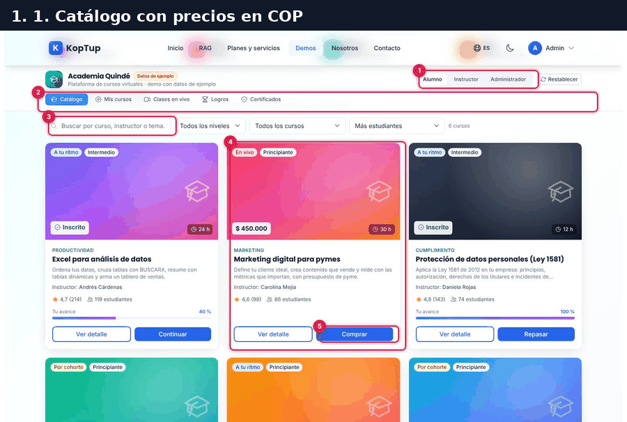

*Recorrido en 10 cuadros: catálogo, compra con cupón, pago aprobado, lección, tutor, evaluación no aprobada con refuerzo, evaluación aprobada, certificados, verificación y la venta en el panel del administrador.*

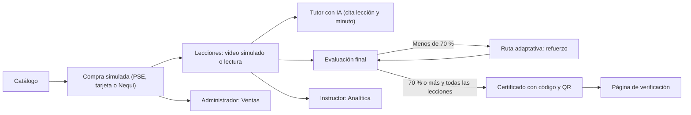

*El camino del alumno y dónde se refleja en las vistas del instructor y del administrador.*

### Paso 1. Catálogo: elige un curso

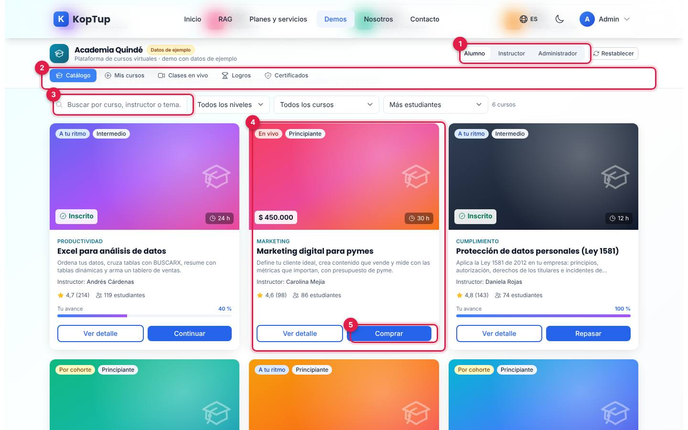

*Catálogo con los cursos inscritos (avance) y los disponibles (precio).*

1. **Ver como**: Alumno, Instructor o Administrador. Cambia las secciones y la vista; no pide iniciar sesión.
2. **Secciones del alumno**: Catálogo, Mis cursos, Clases en vivo, Logros y Certificados.
3. **Buscar y filtrar**: por curso, instructor o tema; nivel; todos, mis cursos o disponibles para comprar; orden por estudiantes, precio o calificación. Al lado dice cuántos cursos coinciden.
4. **Tarjeta del curso**: modalidad (en vivo, a tu ritmo o por cohorte), nivel, horas, precio con IVA (o «Inscrito»), categoría, instructor, calificación y estudiantes (datos de ejemplo). En los inscritos muestra **Tu avance**.
5. **Comprar** (o **Continuar** / **Repasar** si ya estás inscrito). **Ver detalle** abre la ficha del curso.

En la prueba se compró **Marketing digital para pymes** ($ 450.000, 30 h, Carolina Mejía).

### Paso 2. Compra simulada con cupón

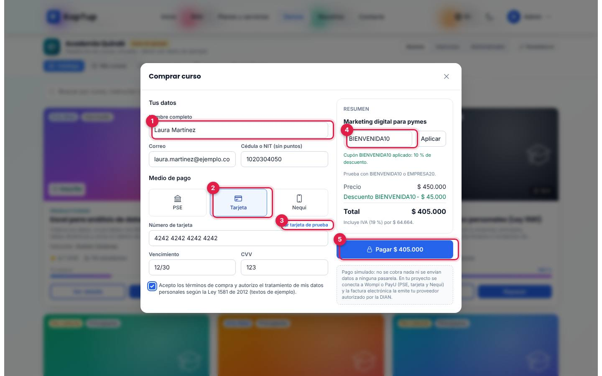

*Ventana «Comprar curso» con tarjeta de prueba y el cupón BIENVENIDA10 aplicado.*

1. **Tus datos**: nombre, correo y cédula o NIT. Vienen los del alumno de ejemplo; en la prueba se cambiaron a «Laura Martínez», `laura.martinez@ejemplo.co`. El nombre que pongas aquí pasa a tus certificados.
2. **Medio de pago**: PSE (con tipo de persona natural o jurídica), Tarjeta o Nequi (celular de 10 dígitos que empiece por 3).
3. **Usar tarjeta de prueba**: llena número, vencimiento y CVV de prueba. La demo valida el número de tarjeta, la fecha (MM/AA, no vencida) y el CVV.
4. **Cupón**: «Prueba con BIENVENIDA10 o EMPRESA20». Con el primero: «Cupón BIENVENIDA10 aplicado: 10 % de descuento». El resumen muestra precio, descuento, total y el IVA incluido (19 %, $ 64.664 en la prueba).
5. **Pagar $ 405.000**: exige aceptar los términos y la autorización de datos (Ley 1581, textos de ejemplo). Muestra «Validando la tarjeta (simulado)…» y, a los pocos segundos, **Pago aprobado (simulado)** con la referencia (`AQ-261009-1437`), la factura electrónica simulada (`FEQ-1437`), el medio («Tarjeta •••• 4242») y el total.

En la confirmación, **Descargar comprobante (PDF)** descarga `comprobante-AQ-261009-1437.pdf` (marcado «DOCUMENTO DE EJEMPLO… no es una factura electrónica») e **Ir al curso** abre la primera lección. La pantalla aclara que no se cobra nada ni se envía ningún correo.

Qué decir: «La venta es autoservicio: el alumno paga con el medio que usa en Colombia y entra al curso de inmediato».

### Paso 3. La lección: video simulado, subtítulos y notas

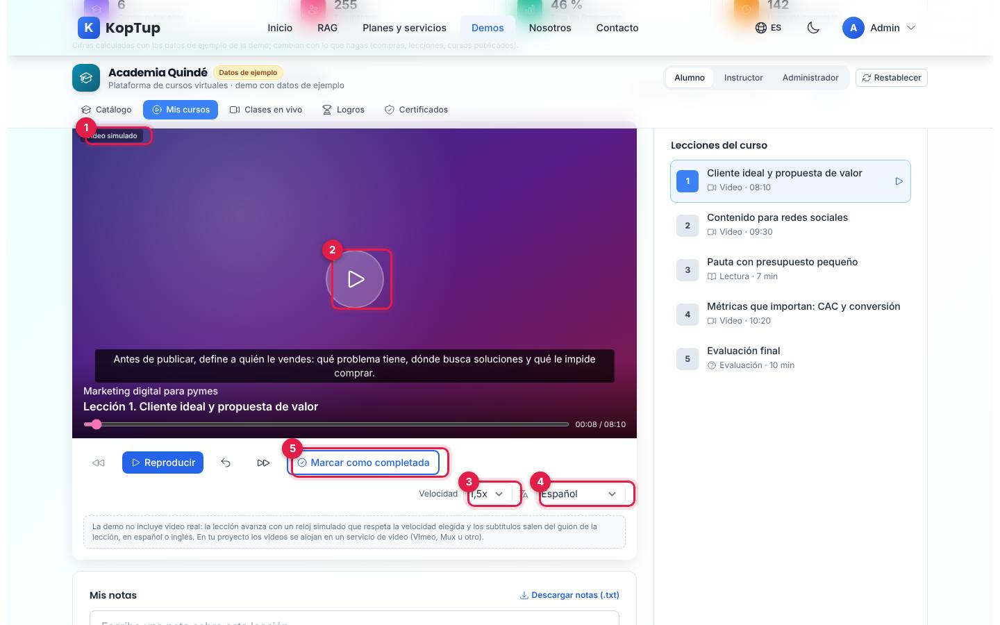

*Lección 1 del curso comprado, con subtítulos en español a velocidad 1,5x.*

1. **Video simulado**: no hay video real; un reloj avanza la lección y los subtítulos salen del guion. Abajo, el título de la lección y la barra de posición (`00:08 / 08:10` en la captura).
2. **Reproducir / Pausar** (también lección anterior, retroceder 10 segundos y lección siguiente).
3. **Velocidad**: 0,75x a 2x; el reloj la respeta.
4. **Subtítulos**: sin subtítulos, español o inglés.
5. **Marcar como completada** (en las lecturas, **Marcar como leída**): avisa «Lección completada: …», suma al avance y a los logros.

Debajo están **Mis notas** («Guardar nota en 00:08» guarda la nota con el minuto; cada nota lleva de vuelta a ese punto, se puede borrar y **Descargar notas (.txt)**) y, a la derecha, la lista de lecciones con su estado. El selector junto al título cambia de curso.

### Paso 4. Pregúntale al tutor con IA

Baja hasta **Tutor con IA** y toca una pregunta sugerida (en la prueba, «¿Cómo calculo el CAC?»).

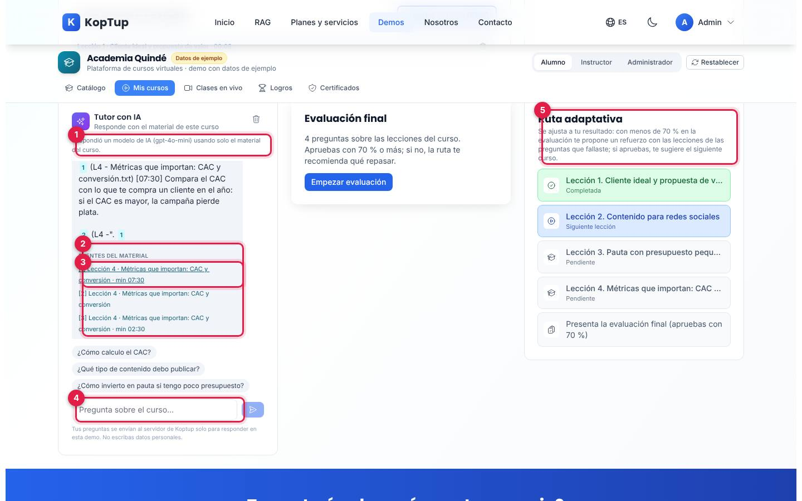

*Respuesta del tutor con sus fuentes y, a la derecha, la ruta adaptativa del curso.*

1. **Modo de la respuesta**: «Respondió un modelo de IA (…) usando solo el material del curso». Si el servidor no tiene IA configurada, si se agotó el cupo de IA de la demo o si el proveedor falla, lo dice y muestra los fragmentos; si no hay conexión con el servidor, busca en el material dentro del navegador y lo marca «Búsqueda local (sin IA)».
2. **Fuentes del material**: lección y minuto de cada fragmento (por ejemplo, «Lección 4 · Métricas que importan: CAC y conversión · min 07:30»).
3. **Ir a esa parte de la lección**: cada fuente es un enlace que abre la lección en ese minuto.
4. **Pregunta sobre el curso…**: preguntas libres. Debajo, el aviso «Tus preguntas se envían al servidor de Koptup solo para responder en esta demo. No escribas datos personales». El ícono de papelera limpia la conversación.
5. **Ruta adaptativa**: lecciones completadas, la siguiente y la evaluación final.

Qué decir: «El tutor no inventa: responde con el material del curso y te lleva al minuto exacto donde se explica».

### Paso 5. Evaluación final y ruta de refuerzo

Cambia de curso a **Excel para análisis de datos** con el selector de arriba, marca como hechas las lecciones 3 y 4 y pulsa **Empezar evaluación**. Son 4 preguntas; cada una se valida con **Validar respuesta** («¡Correcto!» o «Incorrecto. La respuesta correcta es: …») y se sigue con **Siguiente** hasta **Ver resultado**. En la prueba se contestaron mal dos a propósito.

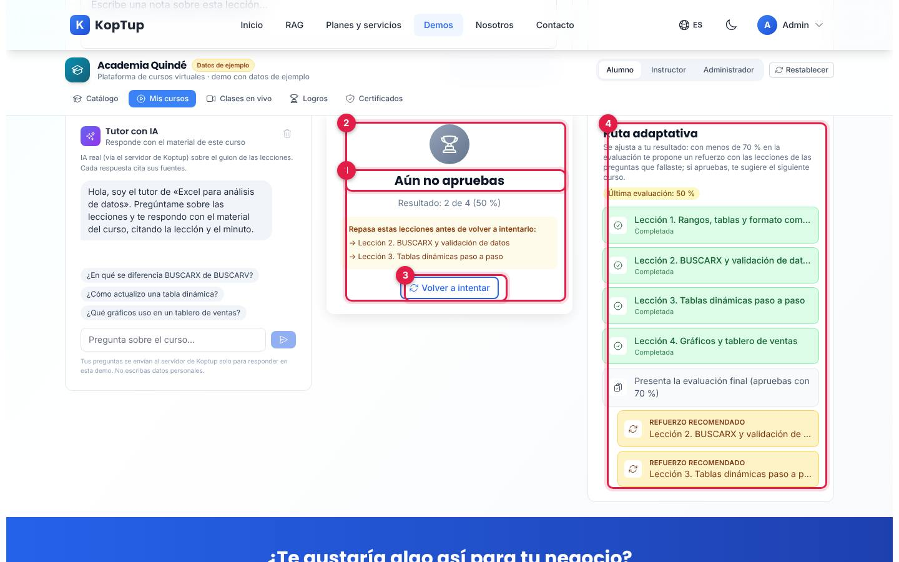

*Resultado de 2 de 4 (50 %) y la ruta adaptativa con el refuerzo recomendado.*

1. **Aún no apruebas**: «Resultado: 2 de 4 (50 %)». Se aprueba con 70 % o más.
2. **Repasa estas lecciones**: las lecciones de las preguntas falladas (BUSCARX y tablas dinámicas).
3. **Volver a intentar**: repite la evaluación; queda el mejor intento.
4. **Ruta adaptativa**: «Última evaluación: 50 %» y dos tarjetas **Refuerzo recomendado** con esas lecciones.

Al repetir con todas buenas: «¡Aprobaste! Resultado: 4 de 4 (100 %)», «Insignia desbloqueada: Genio del quiz», «Certificado AQ-2026-0200 emitido.» y **Ver certificado**. La ruta cambia a **Siguiente curso recomendado** («Finanzas para no financieros» en la prueba). Si faltan lecciones, en lugar del certificado dice «Te faltan N lecciones para obtener el certificado».

### Paso 6. El certificado y su verificación

Pulsa **Ver certificado** o abre **Certificados**.

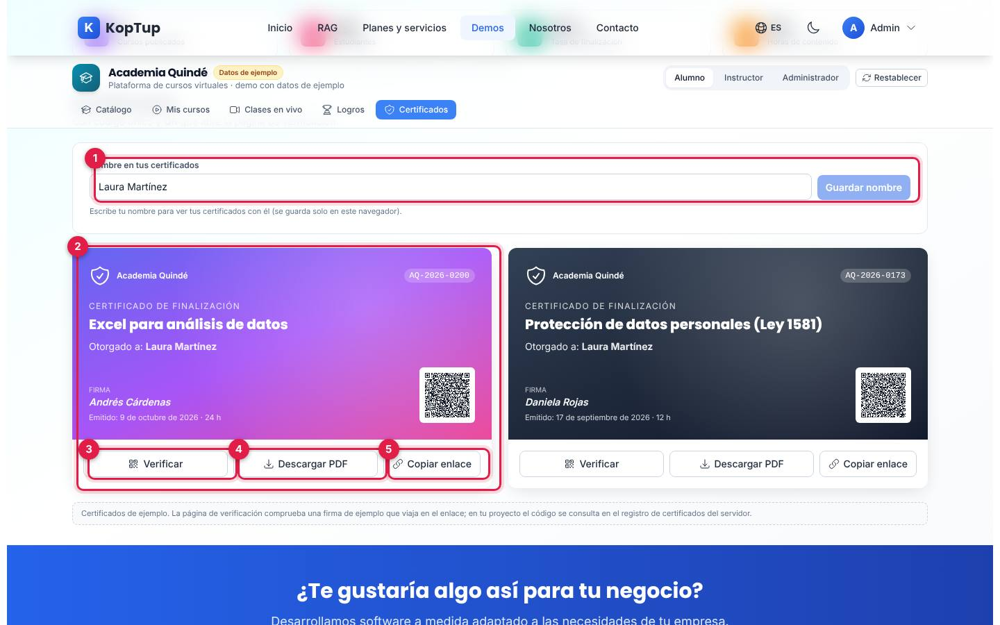

*El certificado recién emitido y el que ya traía el alumno de ejemplo.*

1. **Nombre en tus certificados**: cambia el nombre que aparece en todos tus certificados (**Guardar nombre**).
2. **Certificado**: academia, código único (`AQ-2026-0200`), curso, «Otorgado a», firma del instructor, fecha de emisión, horas y QR.
3. **Verificar**: abre en una pestaña nueva la página de verificación del QR.
4. **Descargar PDF**: `certificado-AQ-2026-0200.pdf`, con el QR y la marca «DOCUMENTO DE EJEMPLO».
5. **Copiar enlace**: copia el enlace de verificación («Enlace de verificación copiado»).

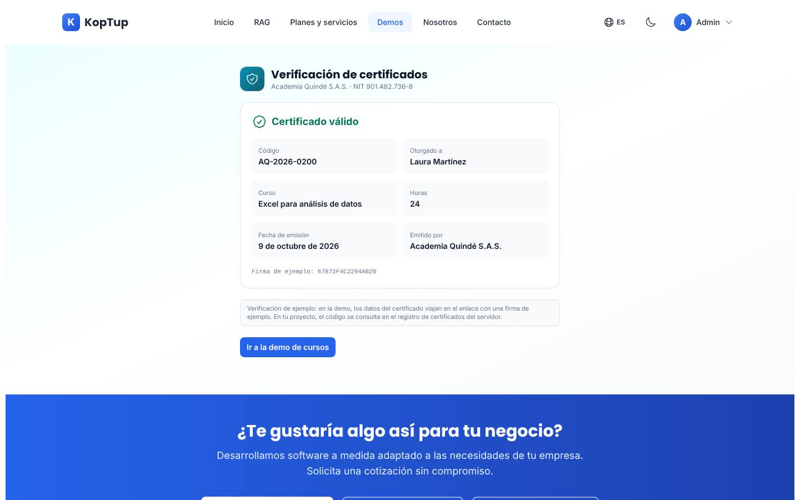

*`/demo/lms/verificar`: «Certificado válido» con código, nombre, curso, horas, fecha, emisor y la firma de ejemplo.*

La página dice **Certificado válido** cuando los datos del enlace coinciden con su firma, **Los datos no coinciden** si el enlace fue modificado y **Enlace incompleto o inválido** si falta información. La propia página aclara que es una verificación de ejemplo: en un proyecto real el código se consulta en el registro de certificados del servidor. Ver la [limitación 1](#limitaciones-conocidas) sobre quién puede abrirla.

Para cerrar, cambia a **Administrador**: en **Ventas** aparece tu compra al inicio de la tabla con la marca «tu compra» (ver [Administrador](#administrador)).

Qué decir: «Cada certificado tiene código y QR; quien lo reciba puede comprobar que es auténtico».

---

## Pantallas y funciones

### Encabezado y cifras

| Elemento | Qué hace |
|---|---|
| **Academia Quindé · Datos de ejemplo** | Al pasar el mouse por la insignia: academia ficticia; pagos, factura electrónica, correos y clases en vivo simulados; el tutor usa IA real sobre el material. |
| **Ver como** | Alumno, Instructor o Administrador. Al cambiar, abre la primera sección de ese rol. |
| **Restablecer** | Pide confirmación y borra compras, avances, notas, certificados nuevos, cupones y cursos creados en este navegador. |
| **Secciones** | Cambian según el rol (ver abajo). En escritorio el encabezado queda fijo al bajar. |
| **Cifras** | Cursos publicados (6), estudiantes (255), tasa de finalización (46 %) y horas de contenido (142), calculadas con los datos de ejemplo; cambian con lo que hagas (por ejemplo, al publicar un curso). |

### Alumno: Catálogo y ficha del curso

Ver el [paso 1](#paso-1-catálogo-elige-un-curso). Los seis cursos son: Excel para análisis de datos ($ 290.000), Marketing digital para pymes ($ 450.000), Protección de datos personales Ley 1581 ($ 320.000), Finanzas para no financieros ($ 890.000), Contabilidad básica para emprendedores ($ 350.000) y Servicio al cliente y ventas por WhatsApp ($ 240.000), todos con IVA incluido.

**Ver detalle** abre la ficha: precio («IVA incluido · pago único (simulado)»), qué aprenderás, requisitos, instructor con su perfil, calificación, temario por módulos con la duración y el tipo de cada lección, la política del certificado («se emite al completar todas las lecciones y aprobar la evaluación final con 70 % o más») y la nota «En la demo verás una versión resumida de 5 lecciones; el programa completo es de 40 horas». Termina con **Comprar por $ …**, **Empezar curso** o **Continuar curso**. Un curso creado con precio $ 0 muestra **Inscribirme gratis**.

### Alumno: Mis cursos

Ver los pasos [3](#paso-3-la-lección-video-simulado-subtítulos-y-notas), [4](#paso-4-pregúntale-al-tutor-con-ia) y [5](#paso-5-evaluación-final-y-ruta-de-refuerzo). Reúne el reproductor, las notas, la lista de lecciones, el tutor, la evaluación final y la ruta adaptativa del curso elegido. Si no tienes cursos: «Aún no tienes cursos. Compra o inscríbete en uno del catálogo».

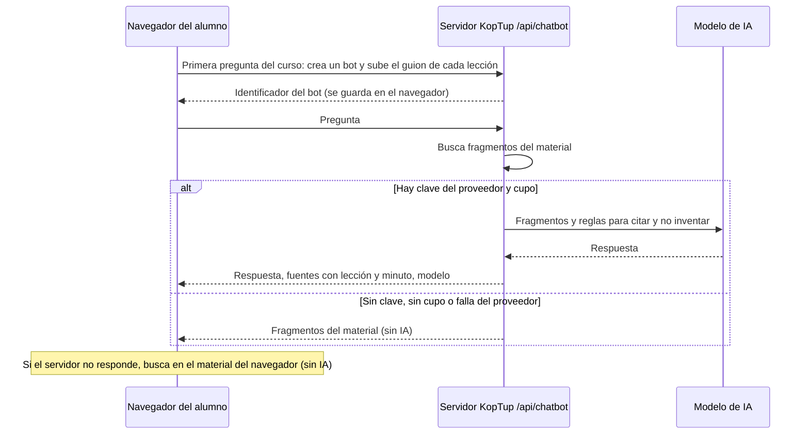

*Cómo responde el tutor: usa las mismas rutas del chatbot RAG del sitio.*

### Alumno: Clases en vivo

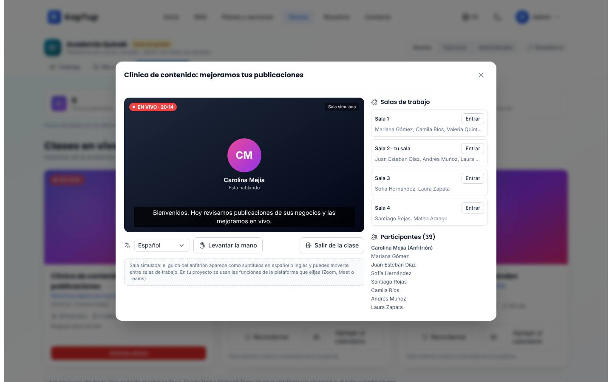

*Sala simulada de la clase en vivo, con subtítulos, salas de trabajo y participantes.*

- **Tres sesiones**: una «EN VIVO» (Clínica de contenido, del curso de marketing) y dos próximas (taller de flujo de caja y respuestas rápidas por WhatsApp), con anfitrión, inscritos, salas de trabajo, duración y «Empieza en …». Las fechas se calculan desde hoy.
- **Unirme ahora** abre la sala simulada: el anfitrión «Está hablando», los subtítulos salen de su guion (español o inglés), **Levantar la mano**, cuatro **salas de trabajo** con **Entrar** y **Volver a la principal**, y la lista de participantes. **Salir de la clase** registra la asistencia («Asistencia registrada en tu historial») y el botón pasa a **Volver a entrar**.
- **Recordarme** activa un recordatorio simulado («En tu proyecto llega por correo o WhatsApp 15 minutos antes»). **Agregar al calendario** descarga un archivo `.ics` (por ejemplo, `clase-live-finanzas.ics`).

### Alumno: Logros

- **Nivel y XP**: 50 XP por lección, 100 por evaluación aprobada (más 50 si es perfecta) y 200 por certificado; se sube de nivel cada 500 XP. El alumno de ejemplo empieza en nivel 2 con 700 XP; después del recorrido quedó en nivel 3 con 1.400 XP.
- **Racha de estudio** y **reto semanal** (completar 3 lecciones en 7 días, +150 XP).
- **Insignias** (6): Primer paso, Constancia, Genio del quiz, Curioso (3 preguntas al tutor), Buenos apuntes (3 notas) y Certificado.
- **Tabla de tu cohorte**: compañeros de ejemplo y tu puntaje real, marcado «(Tú)».

### Alumno: Certificados

Ver el [paso 6](#paso-6-el-certificado-y-su-verificación).

### Instructor: Analítica

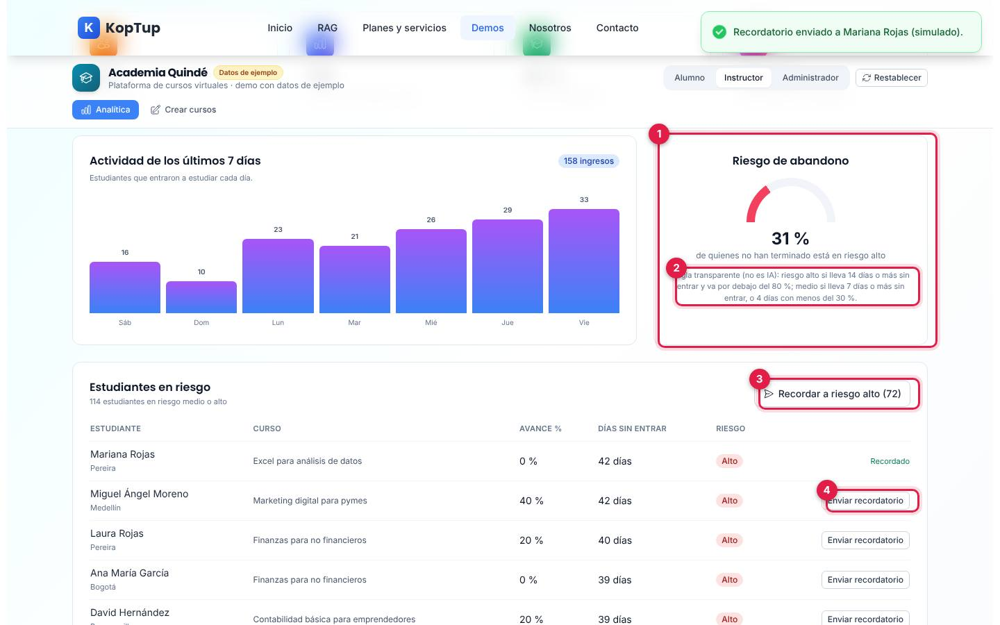

*Actividad de la semana, riesgo de abandono y estudiantes en riesgo, después de enviar un recordatorio.*

1. **Riesgo de abandono**: porcentaje de quienes no han terminado que está en riesgo alto (31 % en la prueba).
2. **Regla**: «Regla transparente (no es IA): riesgo alto si lleva 14 días o más sin entrar y va por debajo del 80 %; medio si lleva 7 días o más sin entrar, o 4 días con menos del 30 %».
3. **Recordar a riesgo alto (N)**: envío simulado a todos los de riesgo alto.
4. **Enviar recordatorio** por estudiante: «Recordatorio enviado a Mariana Rojas (simulado)» y la fila queda **Recordado**.

Arriba de la captura están el selector de curso (todos o uno), **Exportar estudiantes (CSV)** y las cifras (436 inscripciones, 157 activos en 7 días, 46 % de finalización, nota media 84/100). Más abajo, **Lecciones con más avance** y **Lecciones a reforzar** (porcentaje de inscritos que llegó a cada lección).

### Instructor: Crear cursos

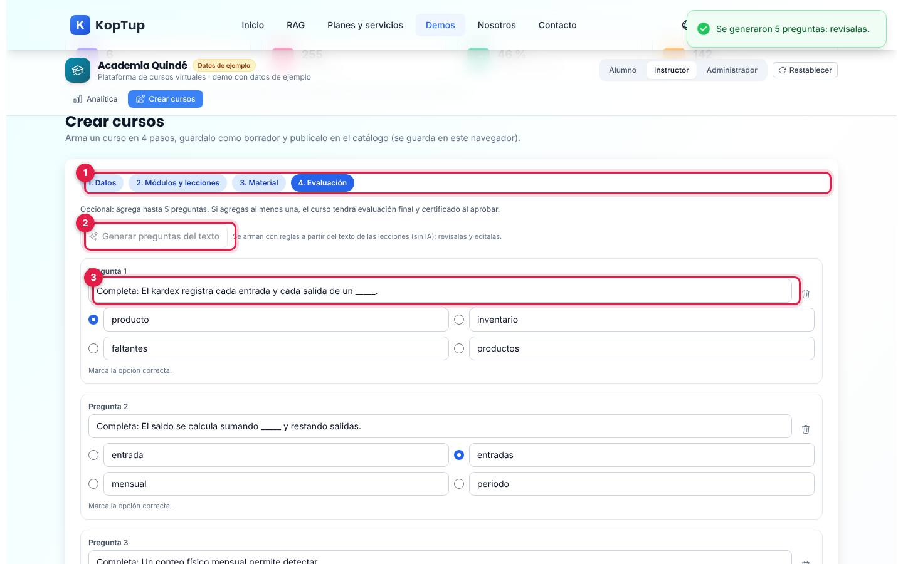

*Paso 4 del asistente con las preguntas generadas a partir del texto de la lección.*

1. **Cuatro pasos**: Datos (título, descripción, categoría, nivel, modalidad, horas y precio con IVA), Módulos y lecciones (título, tipo video o lectura, minutos y texto de la lección, que el tutor usa como material y el video simulado como subtítulos), Material (PDF, video, presentaciones o SCORM; en la demo solo se guardan el nombre y el tamaño) y Evaluación.
2. **Generar preguntas del texto**: arma hasta 5 preguntas de completar con las frases de las lecciones. «Se arman con reglas… (sin IA); revísalas y edítalas». Necesita al menos 4 frases.
3. **Preguntas**: cada una con 4 opciones y la correcta marcada; se pueden editar, quitar o agregar.
4. **Guardar y publicar** (o **Guardar borrador**): «Curso publicado: ya aparece en el catálogo». El catálogo pasa a 7 cursos.

En **Tus cursos creados** cada curso muestra estado (Borrador o Publicado), lecciones, precio, archivos y preguntas, con **Ver ficha**, **Editar**, **Publicar** / **Despublicar** y **Eliminar** (pide confirmación y borra también tu avance en ese curso). La demo valida título (5 o más caracteres), descripción (10 o más), horas (1 a 300), precio ($ 0 a $ 20.000.000) y que cada módulo tenga título y lecciones.

### Administrador

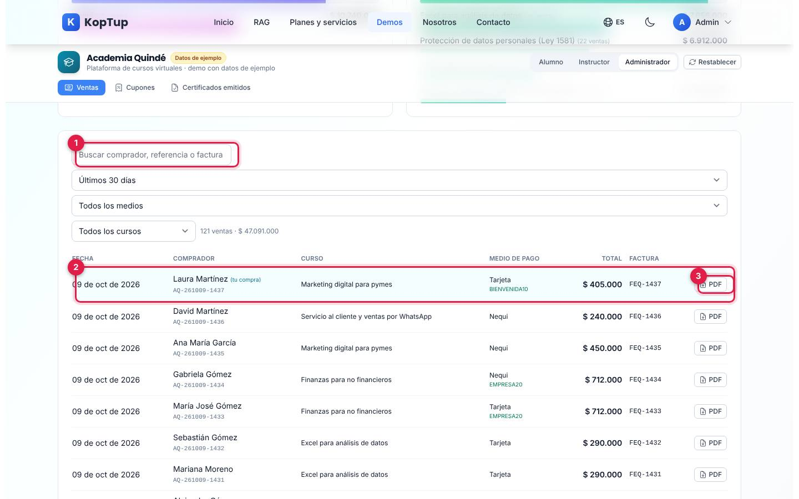

*Tabla de ventas: la compra hecha en el recorrido aparece primera con la marca «tu compra».*

1. **Buscar** por comprador, referencia o factura; filtros de período (30 días, 90 días o todo), medio de pago y curso, con el conteo y el total («121 ventas · $ 47.091.000» después de la compra).
2. **Tu compra**: fecha, comprador y referencia, curso, medio de pago y cupón, total y número de factura simulada.
3. **PDF**: descarga el comprobante de esa venta.

Además:

- **Ventas**: cifras de los últimos 30 días (ventas, inscripciones pagadas, ticket promedio y descuentos con cupón), ventas por medio de pago y por curso, **Ver N más** y **Exportar ventas (CSV)**. «Pagos y facturas electrónicas simulados».
- **Cupones**: BIENVENIDA10 (10 %), EMPRESA20 (20 %) y VERANO15 (15 %, inactivo), con sus usos (BIENVENIDA10 pasó de 72 a 73 con la compra). **Crear cupón** pide un código de 4 a 16 letras o números y un descuento de 5 % a 50 %; **Activar** / **Desactivar** cambia si funciona en el pago.
- **Certificados emitidos**: por curso, inscritos, certificados y tasa de finalización (200 en total después del recorrido), y la lista de los certificados emitidos en tu recorrido, con **Verificar**.

### En el celular

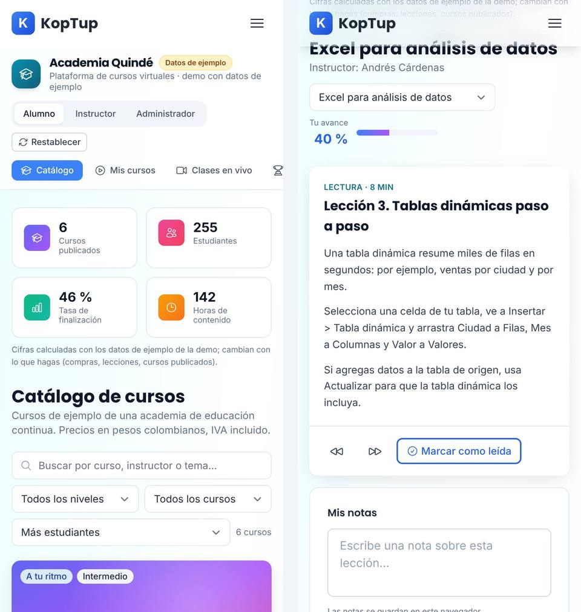

*La demo en un teléfono de 390 px: catálogo con filtros apilados y una lección de lectura.*

En el teléfono el encabezado deja de ser fijo, el selector de rol y **Restablecer** pasan debajo del nombre, las secciones se desplazan de lado, las cifras van de dos en dos y los cursos en una columna. La página no se desborda a lo ancho.

---

## Qué es real y qué es simulado

| Parte | Real o simulado | Detalle |
|---|---|---|
| Academia, cursos, instructores, estudiantes, reseñas y ventas de ejemplo | **Datos de ejemplo** | Academia Quindé es ficticia; las fechas se calculan con el día. |
| Tutor con IA | **IA real** | Llama al servidor de KopTup (`/api/chatbot`) con el guion de las lecciones; si no hay IA disponible lo dice, y sin conexión busca en el navegador. |
| Pago con PSE, tarjeta o Nequi, factura electrónica y correo de confirmación | **Simulados** | No se cobra nada ni se envían datos a una pasarela. El comprobante PDF no es una factura. |
| Validaciones del pago y cupones | **Reales (en el navegador)** | Tarjeta, vencimiento, CVV, celular, documento y cupones activos. |
| Video de las lecciones | **Simulado** | Reloj que respeta la velocidad; subtítulos desde el guion en español o inglés. |
| Avance, evaluación, ruta adaptativa, XP e insignias | **Reales (en el navegador)** | Se calculan con lo que haces. |
| Riesgo de abandono y preguntas generadas | **Reglas, no IA** | Lo dicen las propias pantallas. |
| Clases en vivo, recordatorios y asistencia | **Simulados** | No hay Zoom, Meet ni Teams; el archivo `.ics` sí se descarga. |
| Certificados y verificación | **Ejemplo** | El PDF y el QR se generan en el navegador; la verificación comprueba una firma de ejemplo que viaja en el enlace, sin consultar un registro en el servidor. |
| Dónde se guardan tus cambios | **Solo en este navegador** | `localStorage` (clave `koptup.lms.state`) durante 7 días; el identificador del bot del tutor, en `koptup.lms.tutorBots`. |

---

## Acceso

**Cómo lo ve un visitante.** La demo aparece en `/demo` como «LMS / E-learning» con la insignia «Requiere acceso» y los botones **Solicitar acceso** y **Ya tengo acceso: iniciar sesión**. Si alguien abre `/demo/lms` sin sesión, la web muestra en la misma dirección la pantalla de acceso:

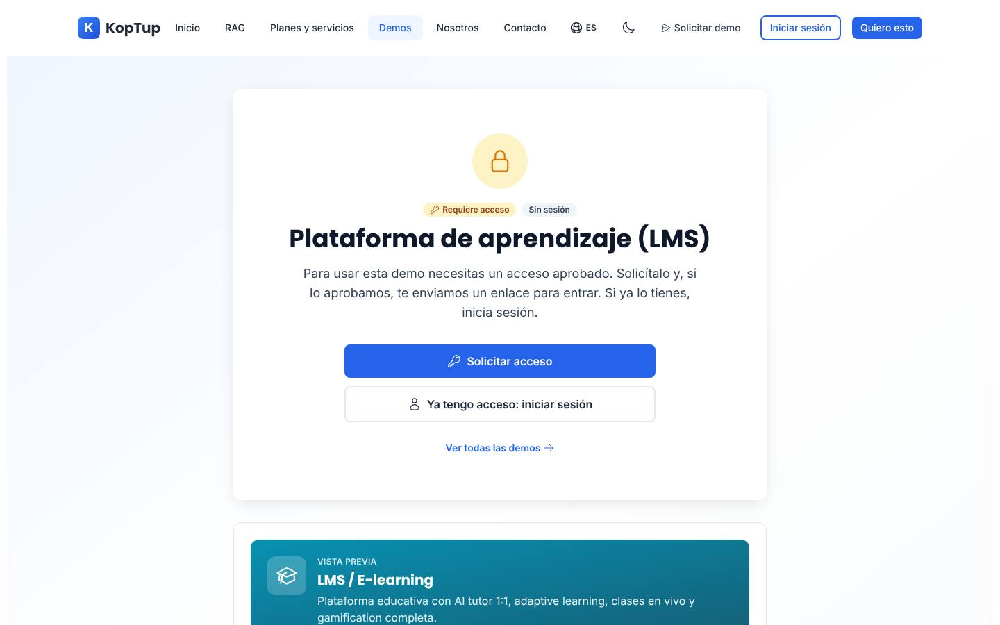

*Lo que ve un visitante sin sesión: «Requiere acceso», «Sin sesión», los botones para pedir la demo o iniciar sesión y, debajo, la vista previa del catálogo.*

- **Solicitar acceso** abre `/solicitar-demo?demos=lms` con la demo ya elegida.
- **Ya tengo acceso: iniciar sesión** lleva a `/login?redirect=%2Fdemo%2Flms` y, al entrar, vuelve a la demo.
- **Ver todas las demos** vuelve a `/demo`.
- Con sesión pero sin acceso, la misma pantalla dice «Sin acceso»; si el acceso venció o fue retirado, ofrece pedir más tiempo o solicitarlo de nuevo.
- La página de verificación `/demo/lms/verificar` está detrás del mismo control (ver la [limitación 1](#limitaciones-conocidas)).

**Cómo se concede.** La solicitud llega a **Admin › Solicitudes de demo** y la aprueban los roles **admin** o **sales**. Al aprobar se crea o se reutiliza la cuenta del prospecto, el acceso dura 14 días por defecto (se extiende o se revoca en **Admin › Accesos a demos**) y la persona recibe un correo con la decisión (con el enlace de activación si su cuenta es nueva). El equipo de KopTup (admin, manager, sales y developer) abre la demo sin solicitud. El modo de acceso se cambia en **Admin › Catálogo de demos**. Detalle en el [Manual del administrador](Doc-06-Manual-del-Administrador.md) y en [Flujos del visitante](Doc-04-Flujos-del-Visitante.md).

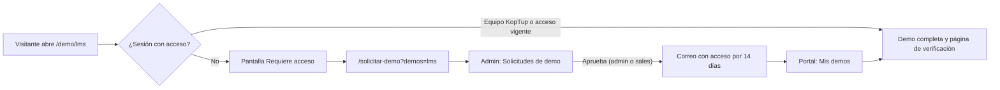

*Camino de un visitante hasta la demo.*

---

## Limitaciones conocidas

En el recorrido no aparecieron errores en la consola. Una prueba automática hizo clic en los controles visibles de la vista inicial y no encontró botones muertos: los únicos que «no cambiaron nada» fueron la pestaña ya activa y los selectores de filtro, que actúan al elegir una opción. Lo que sí conviene saber:

1. **El QR del certificado no sirve a un tercero sin acceso.** La página `/demo/lms/verificar` está bajo `/demo/lms`, así que el control de acceso la protege igual que a la demo: quien escanea el QR sin sesión (por ejemplo, un empleador) ve «Requiere acceso» en lugar de «Certificado válido». Solo la ven el equipo de KopTup y quien tenga acceso vigente a esta demo.
2. **La vista previa no coincide del todo.** La tarjeta del hub promete «quizzes auto-generados» junto al tutor con IA y «subtítulos multi-idioma»: las preguntas se generan con reglas («sin IA») y los subtítulos son solo en español e inglés. Las clases en vivo son una sala simulada.
3. **Los cambios viven solo en el navegador**, por 7 días. Compras, avances, notas, certificados, cupones y cursos creados no llegan a un servidor ni los ven otras personas; en otro equipo o navegador la demo vuelve a los datos de ejemplo.
4. **Los roles no tienen permisos**: cualquiera con acceso a la demo cambia a Instructor o Administrador con un clic.
5. **El nombre se cambia en todos los certificados.** Al cambiar el nombre en la compra o en «Nombre en tus certificados», también cambia en los certificados que ya existían (el de Ley 1581 pasó a «Laura Martínez» en la prueba).
6. **Etiquetas de velocidad redondeadas**: 0,75x se muestra como «0,8x» y 1,25x como «1,3x» en el selector del reproductor.
7. **Preguntas generadas con opciones casi iguales**: el generador por reglas puede proponer opciones como «entrada» y «entradas» en la misma pregunta. La pantalla pide revisarlas antes de publicar.
8. **Plurales en Logros**: «¿Cómo se calculan tus puntos?» dice «1 evaluaciones aprobadas» y «1 certificados» cuando hay uno solo.
9. **Filtros de Ventas en escritorio**: el buscador queda angosto y los selectores de período y medio de pago ocupan todo el ancho, uno debajo del otro.
