# Guía de la demo: Programa de fidelización

> Ruta `/demo/loyalty` · Modo de acceso: **Abierta** · Tipo: **datos de ejemplo** (todo corre en el navegador; no llama al servidor ni a un modelo de IA) · Plan del producto: [Loyalty y fidelización](Producto-loyalty-fidelizacion.md)

**Resumen.** Es el club de puntos de una droguería ficticia colombiana (Club Ceiba Verde, de Droguerías Ceiba Verde, con sedes en Bogotá, Medellín y Cali). Muestra las cuatro caras del programa: la **Caja** donde se inscribe al cliente y se suman puntos, la **App del miembro** donde canjea, la **Configuración** que ajusta el comercio (reglas, niveles, misiones, campañas, antifraude…) y los **Resultados** con el pasivo por puntos. Está pensada para gerentes de mercadeo y dueños de cadenas de retail; abre sin cuenta y lo que haces se guarda solo en tu navegador.

**En esta página:** [Recorrido sugerido](#recorrido-sugerido-demo-comercial-de-5-minutos) · [Pantallas y funciones](#pantallas-y-funciones) · [Qué es real y qué es simulado](#qué-es-real-y-qué-es-simulado) · [Acceso](#acceso) · [Limitaciones conocidas](#limitaciones-conocidas)

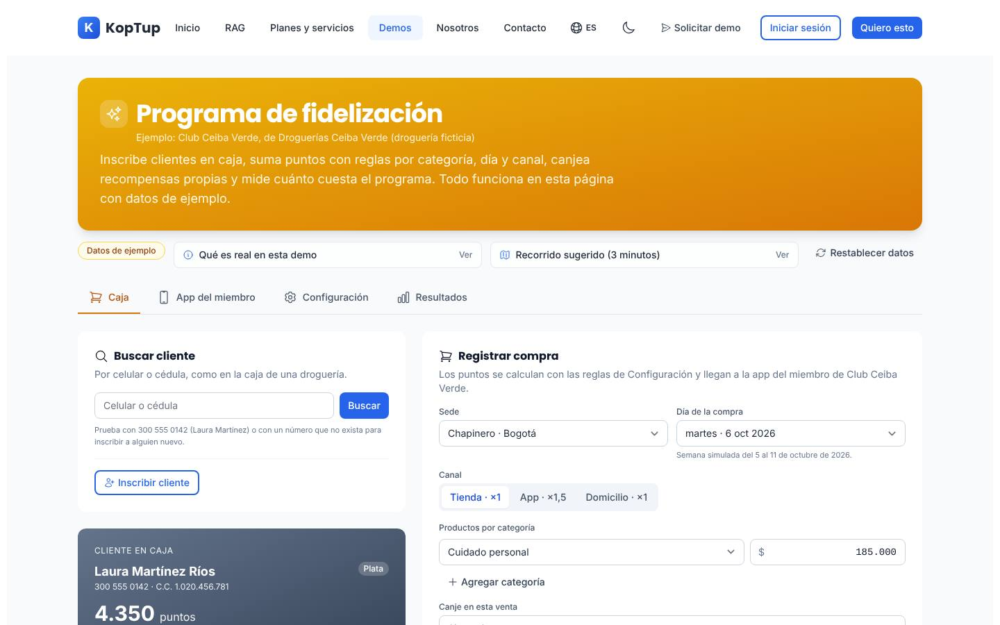

*Vista inicial: encabezado con la marca de ejemplo, la insignia «Datos de ejemplo», los paneles «Qué es real en esta demo» y «Recorrido sugerido», el botón «Restablecer datos» y las cuatro pestañas.*

---

## Recorrido sugerido (demo comercial de 5 minutos)

El guion sigue el **Recorrido sugerido (3 minutos)** que trae la propia demo (botón **Ver** del panel). Empieza con los datos limpios: si alguien ya usó la demo en ese navegador, pulsa **Restablecer datos** y confirma con **Sí, restablecer**.

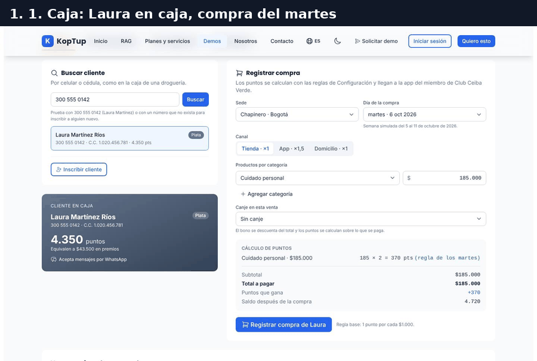

*Recorrido completo: dos compras de Laura en caja, subida a Oro, misiones y canje en la app, regla del día ×3, resultados y una campaña desde un segmento.*

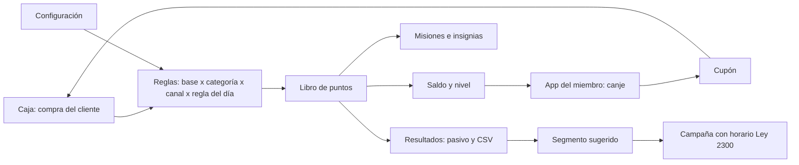

*Cómo se conectan las pestañas: todo sale del mismo libro de puntos, así que un cambio en una pestaña se ve al instante en las otras.*

### Paso 1. Caja: busca a Laura y registra la compra del martes

En la pestaña **Caja**, escribe `300 555 0142` en **Buscar cliente** y pulsa **Buscar**; luego elige a Laura en el resultado. La compra ya viene lista con $185.000 en Cuidado personal.

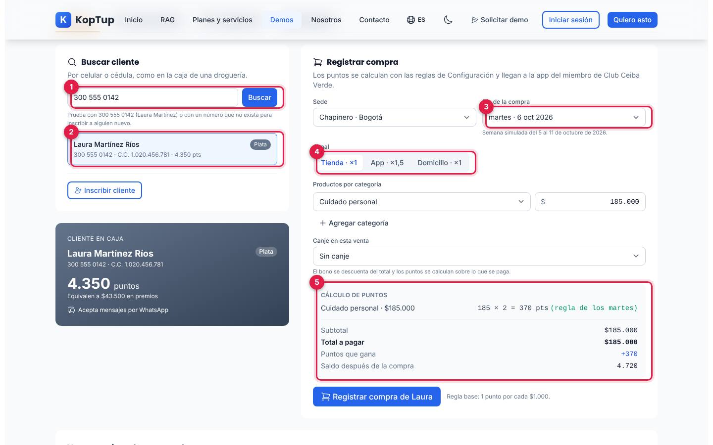

*Laura Martínez Ríos en caja (Plata, 4.350 puntos) y el cálculo en vivo de la compra.*

1. **Buscar cliente**: por celular o cédula, con al menos 3 dígitos. Si el número no existe, ofrece **Inscribir cliente nuevo**.
2. **Resultado**: nombre, nivel, celular, cédula y saldo. Al elegirlo, pasa a la tarjeta **Cliente en caja**.
3. **Día de la compra**: la demo simula la semana del 5 al 11 de octubre de 2026; por defecto es el martes 6.
4. **Canal**: Tienda ×1, App ×1,5 o Domicilio ×1 (los multiplicadores salen de Configuración).
5. **Cálculo de puntos**: `185 × 2 = 370 pts (regla de los martes)`, el total a pagar, los puntos que gana y el saldo después de la compra (4.720).

Pulsa **Registrar compra de Laura**: aparece «Venta V-0001 registrada · +370 puntos».

Qué decir: «El cajero no calcula nada: el sistema aplica la regla base y las promociones del día».

### Paso 2. Segunda compra: Laura sube a Oro

Cambia la línea a **Dermocosmética** por $420.000 y registra otra compra.

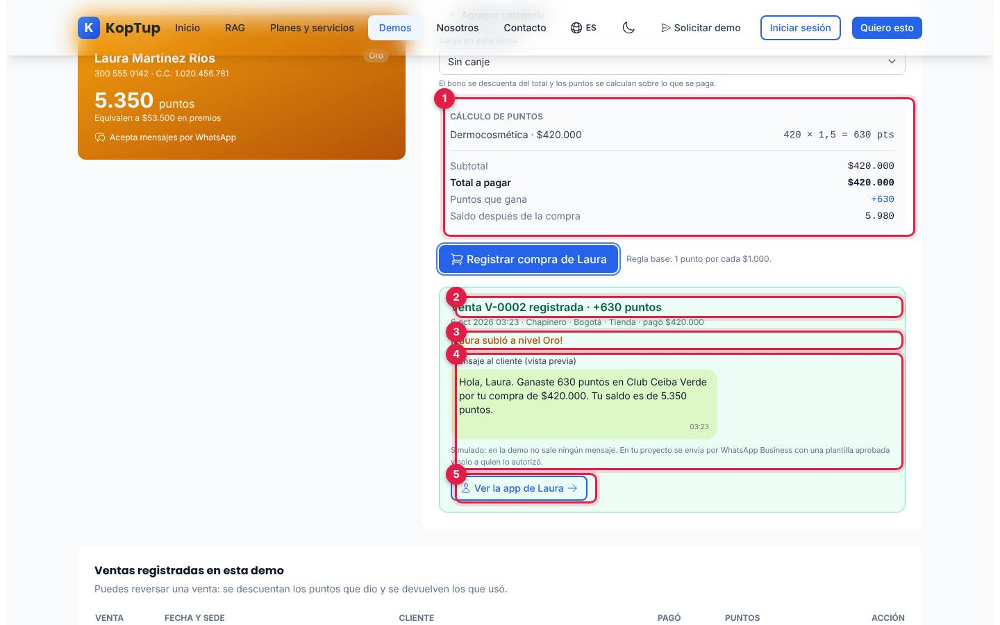

*Resultado de la venta V-0002: 630 puntos, subida a Oro y la vista previa del mensaje al cliente.*

1. **Cálculo**: Dermocosmética tiene multiplicador ×1,5, así que `420 × 1,5 = 630 pts`.
2. **Venta registrada** con fecha, sede, canal y lo que pagó.
3. **¡Laura subió a nivel Oro!**: sus puntos de compras de 2026 pasan de 3.110 a 4.110 y el umbral de Oro es 4.000.
4. **Mensaje al cliente (vista previa)**: el WhatsApp que recibiría («Hola, Laura. Ganaste 630 puntos…»). Es simulado: no sale ningún mensaje. Si el cliente no autorizó WhatsApp, la demo lo dice y no muestra mensaje.
5. **Ver la app de Laura**: salta a la pestaña App del miembro con ella seleccionada.

Debajo queda la tabla **Ventas registradas en esta demo**, con **Reversar** por venta (pide confirmar y descuenta los puntos que dio y devuelve los que usó).

### Paso 3. App del miembro: misiones y canje

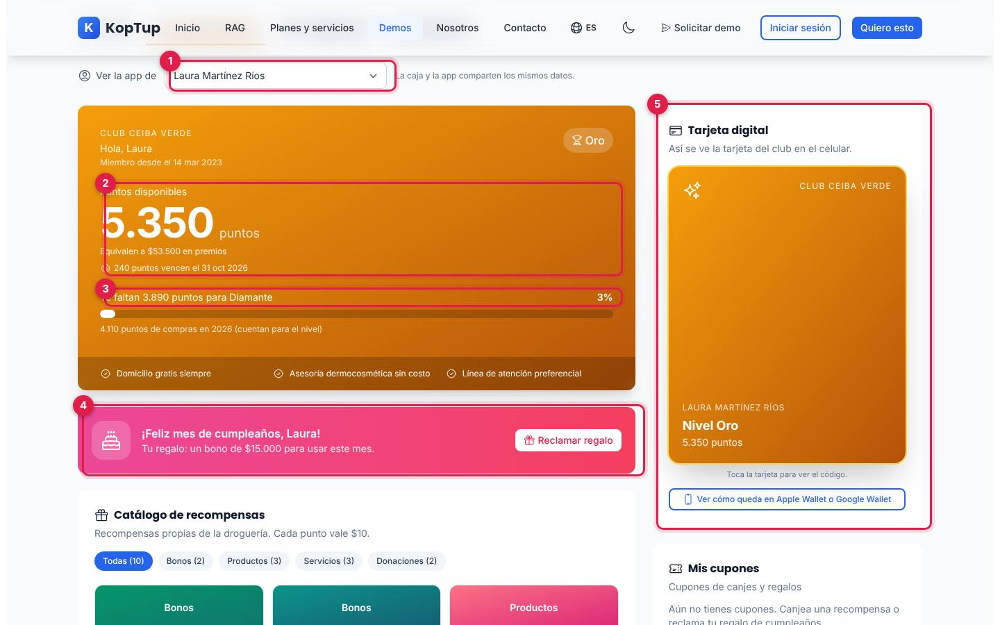

*La app de Laura después de las dos compras: 5.350 puntos y nivel Oro.*

1. **Ver la app de**: elige cualquiera de los miembros de ejemplo (o los que inscribas). «La caja y la app comparten los mismos datos».
2. **Puntos disponibles**, su valor en premios ($10 por punto) y los 240 puntos que vencen el 31 oct 2026.
3. **Progreso al siguiente nivel**: «Te faltan 3.890 puntos para Diamante».
4. **Regalo de cumpleaños**: Laura cumple en octubre; **Reclamar regalo** genera un cupón de $15.000.
5. **Tarjeta digital**: se gira al tocarla para mostrar el código de miembro; **Ver cómo queda en Apple Wallet o Google Wallet** abre una vista previa simulada del pase.

Baja a **Misiones del mes**: «Compra 2 veces este mes» y «Completa tu perfil» quedan listas; pulsa **Reclamar** en cada una (+300 y +50 puntos). Después ve al catálogo:

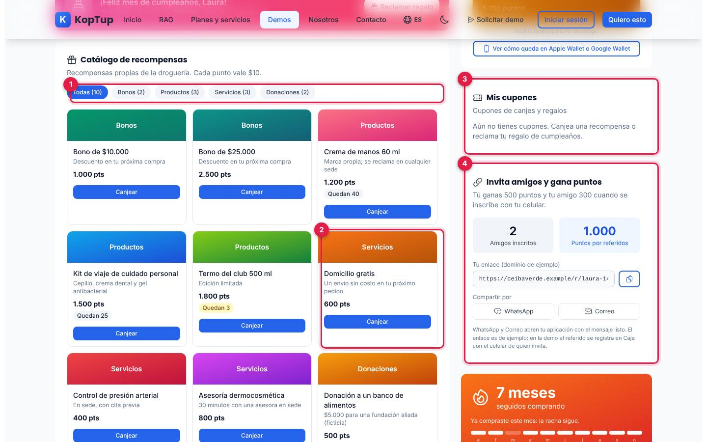

*Catálogo de recompensas propias de la droguería, cupones y programa de referidos.*

1. **Filtros**: Todas (10), Bonos, Productos, Servicios y Donaciones.
2. **Domicilio gratis** (600 puntos). Los productos muestran las unidades que quedan; si no te alcanza, el botón dice «Te faltan N pts».
3. **Mis cupones**: los cupones de canjes y regalos, con su estado (Vigente, Usado o Donado).
4. **Invita amigos y gana puntos**: amigos inscritos, puntos ganados, enlace de ejemplo con **Copiar** y botones **WhatsApp** y **Correo**, que sí abren tu aplicación con el mensaje listo.

Pulsa **Canjear** en Domicilio gratis y confirma con **Sí, canjear**:

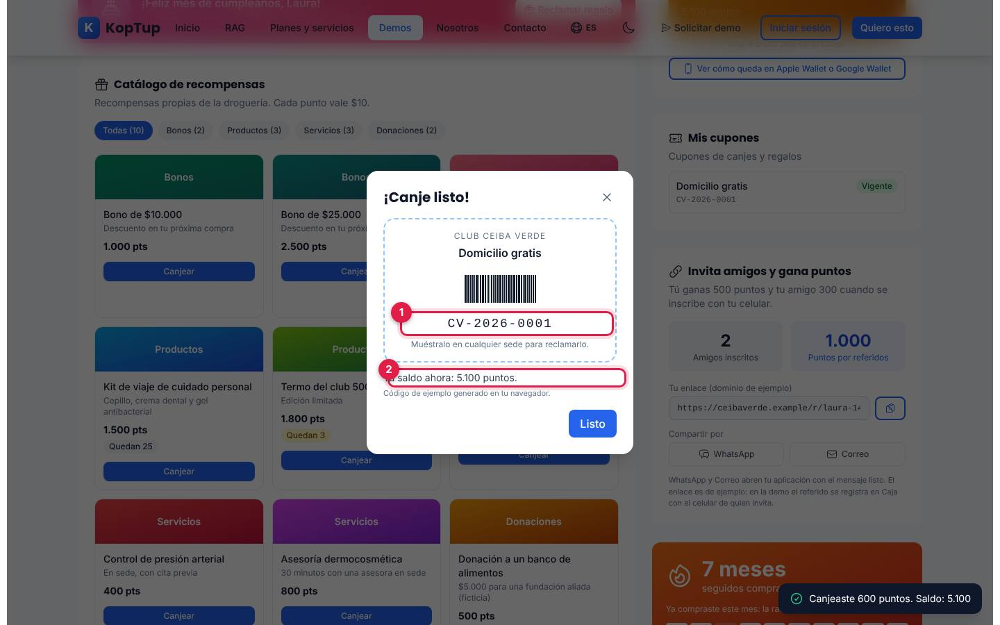

*Ventana «¡Canje listo!» con el cupón y el saldo nuevo.*

1. **Código del cupón** (`CV-2026-0001` en la prueba), generado en el navegador.
2. **Tu saldo ahora**: 5.100 puntos (5.700 − 600).

Qué decir: «El cliente canjea desde el celular y el cupón se usa en cualquier sede». Los bonos en pesos (y el regalo de cumpleaños) también se pueden usar en la Caja, en **Canje en esta venta**.

### Paso 4. Configuración: cambia la regla del día

Abre **Configuración** › **Puntos** y cambia el **Multiplicador** de la regla del día a ×3.

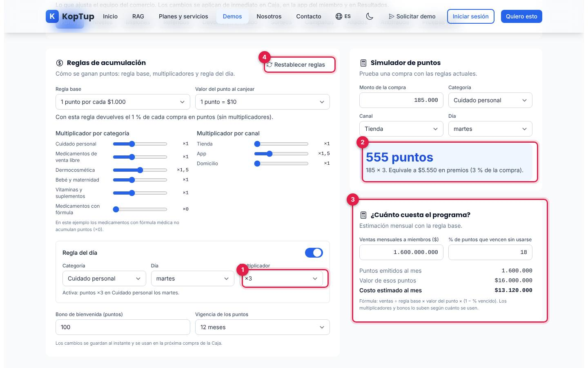

*Reglas de acumulación con la regla del día en ×3 y su efecto en el simulador.*

1. **Regla del día**: categoría, día y multiplicador, con un interruptor para apagarla. Queda activa al instante: «Activa: puntos ×3 en Cuidado personal los martes».
2. **Simulador de puntos**: la misma compra de $185.000 da ahora **555 puntos** (185 × 3), equivalentes a $5.550 en premios (3 % de la compra).
3. **¿Cuánto cuesta el programa?**: con ventas a miembros de $1.600.000.000 al mes y 18 % de puntos vencidos, el costo estimado es $13.120.000 al mes. La fórmula está escrita debajo.
4. **Restablecer reglas**: vuelve a las reglas de ejemplo.

Qué decir: «Antes de lanzar una promoción ves cuánto da y cuánto te cuesta».

### Paso 5. Resultados y una campaña desde un segmento

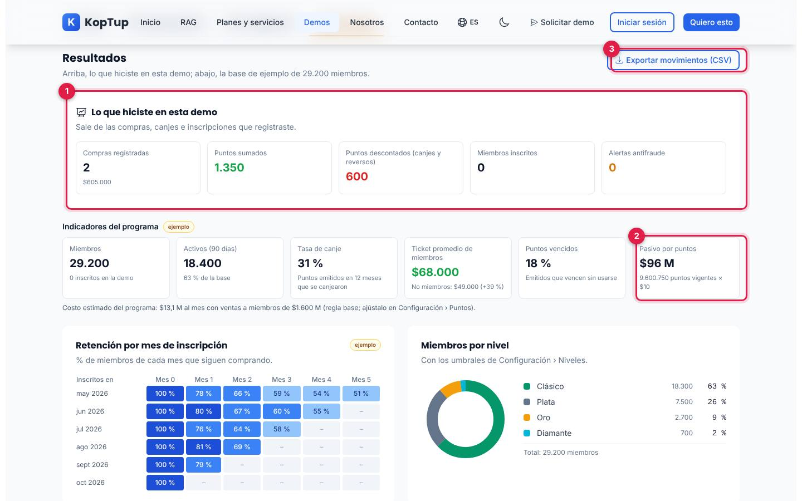

*Resultados: arriba lo que hiciste en la demo; abajo, los indicadores de la base de ejemplo.*

1. **Lo que hiciste en esta demo**: 2 compras ($605.000), 1.350 puntos sumados, 600 descontados, miembros inscritos y alertas antifraude.
2. **Pasivo por puntos**: $96 M, es decir 9.600.750 puntos vigentes × $10. Incluye los puntos que sumaste.
3. **Exportar movimientos (CSV)**: descarga `club-ceiba-verde-movimientos.csv` con fecha, hora, miembro, cédula, tipo, detalle, puntos, saldo y origen (Ejemplo o Demo).

Más abajo, en **Segmentos sugeridos**, pulsa **Crear campaña** en «En riesgo de irse». La demo abre **Configuración › Campañas** con el segmento ya elegido:

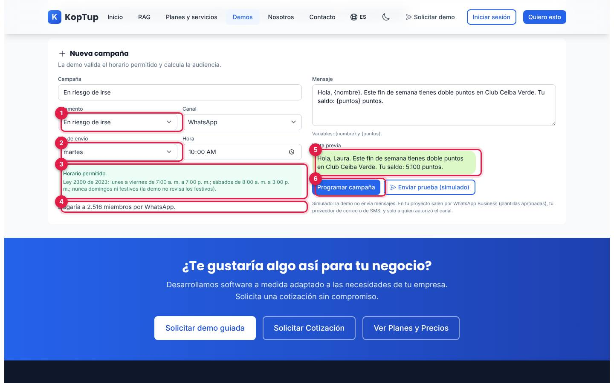

*Formulario «Nueva campaña» con el segmento elegido desde Resultados, programada un martes a las 10:00 a. m.*

1. **Segmento**: viene de Resultados (el nombre de la campaña queda igual al segmento; puedes cambiarlo).
2. **Día de envío** y **Hora**: si eliges domingo, la demo dice «Los domingos no se pueden enviar mensajes comerciales» y desactiva el botón.
3. **Horario permitido**: la regla de la Ley 2300 de 2023 (lunes a viernes de 7:00 a. m. a 7:00 p. m.; sábados de 8:00 a. m. a 3:00 p. m.; nunca domingos ni festivos; la demo no revisa los festivos).
4. **Audiencia**: «Llegaría a 2.516 miembros por WhatsApp» (miembros del segmento que autorizaron ese canal).
5. **Vista previa** del mensaje con las variables `{nombre}` y `{puntos}` reemplazadas.
6. **Programar campaña**: la agrega a la lista con el aviso «Campaña programada para 2.516 miembros». **Enviar prueba (simulado)** no envía nada.

Cierra con: «Todo lo que viste —reglas, niveles, canjes, campañas— lo configura tu equipo sin programar».

---

## Pantallas y funciones

### Encabezado y controles

Ver la [vista general](#guía-de-la-demo-programa-de-fidelización).

| Elemento | Qué hace |
|---|---|
| **Datos de ejemplo** | Insignia; al pasar el mouse dice que la marca, el NIT, las sedes, los miembros, las cédulas, los celulares, los aliados y las cifras son inventados. |
| **Qué es real en esta demo** | Panel plegable con lo que se calcula de verdad, lo simulado y cómo sería en un proyecto real. |
| **Recorrido sugerido (3 minutos)** | Panel plegable con los 5 pasos del guion (es una lista fija; no marca el avance). |
| **Restablecer datos** | Pide confirmación («¿Borrar tus compras, canjes y cambios de esta demo?») y vuelve a los datos de ejemplo. |
| **Pestañas** | Caja, App del miembro, Configuración y Resultados. |

### Caja

Ver los [pasos 1 y 2](#paso-1-caja-busca-a-laura-y-registra-la-compra-del-martes). Además:

- **Inscribir cliente** abre el formulario de inscripción:

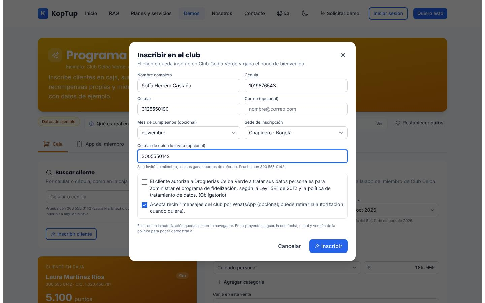

*Formulario de inscripción con un cliente nuevo invitado por Laura (300 555 0142).*

- Pide **nombre completo**, **cédula** (6 a 10 dígitos), **celular** (10 dígitos que empiecen por 3), correo y mes de cumpleaños opcionales, **sede** y el **celular de quien lo invitó** (opcional). Rechaza cédulas o celulares repetidos y referidos que no existan.
- La **autorización de tratamiento de datos (Ley 1581 de 2012)** es obligatoria: sin ella sale «Sin la autorización de tratamiento de datos no se puede inscribir». La autorización de mensajes por WhatsApp es opcional.
- Al inscribir: «Inscripción lista: Sofía Herrera Castaño ganó 100 puntos de bienvenida». Si hubo referido, quien invita gana 500 puntos y el nuevo 300 (valores de Configuración › Referidos).
- **Varias categorías** en una compra (hasta 5 líneas, con **Agregar categoría** y la papelera para quitar). Los medicamentos con fórmula no acumulan (×0).
- **Canje en esta venta**: bonos de $10.000 o $25.000 (si el saldo alcanza) o cupones vigentes del cliente. El bono se descuenta del total y los puntos se calculan sobre lo que se paga.
- Si los puntos del cliente están congelados por antifraude, no puede canjear y la tarjeta lo avisa.

### App del miembro

Ver el [paso 3](#paso-3-app-del-miembro-misiones-y-canje). Además del saldo, el catálogo y los cupones:

- **Misiones del mes**: cuatro retos con su avance (compras del mes, compras por app o a domicilio, amigos referidos y perfil completo) y la pista de cómo completarlos en la demo.
- **Racha**: meses seguidos comprando y los meses de 2026 con compra.
- **Insignias**: Primera compra, Cliente constante, Embajador, Corazón solidario y Nivel Oro, obtenidas o pendientes.
- **Ranking del mes**: apagado por privacidad; se activa en Configuración › Misiones y muestra un top 10 con nombre corto.
- **Tus movimientos**: el libro de puntos; «El saldo es la suma de estos movimientos». Las líneas hechas en la demo llevan la marca «demo» y **Ver los N movimientos** despliega todo.
- **Donaciones**: canjear «Donación a un banco de alimentos» o «Donación de útiles escolares» muestra «¡Gracias por tu donación!» (no se transfiere dinero).

### Configuración

Diez subpestañas. Los cambios se aplican de inmediato en Caja, en la app del miembro y en Resultados.

| Subpestaña | Qué puedes hacer |
|---|---|
| **Puntos** | Regla base (por defecto 1 punto por cada $1.000), valor del punto al canjear ($10), multiplicadores por categoría y por canal, regla del día, bono de bienvenida, vigencia de los puntos, simulador y costo del programa. Ver el [paso 4](#paso-4-configuración-cambia-la-regla-del-día). |
| **Niveles** | Umbrales de puntos en el año para Plata, Oro y Diamante, con el número de miembros en cada nivel; **Guardar niveles** valida que suban (Plata < Oro < Diamante). Regla para bajar de nivel tras N meses sin compras, con cuántos bajarían. |
| **Misiones** | Activar o pausar cada misión y cambiar su premio; crear una misión nueva (tipo, meta y premio) que aparece de inmediato en la app; interruptor del ranking. |
| **Referidos** | Puntos para quien invita y para el nuevo miembro, costo por referido y cifras de ejemplo. |
| **Devolución en saldo** | Simulador de cashback por nivel (0,5 %, 1 %, 1,5 % y 2 % de ejemplo) para comparar con los puntos; la Caja sigue acumulando puntos. |
| **Sorteos** | Aviso de que en Colombia los sorteos promocionales necesitan autorización de Coljuegos; **Sortear (simulado)** elige un ganador de una lista de nombres ficticios; formulario para crear un sorteo. |
| **Campañas** | Lista de campañas de ejemplo con **Pausar** y **Programar**, y el formulario de nueva campaña. Ver el [paso 5](#paso-5-resultados-y-una-campaña-desde-un-segmento). |
| **Aliados** | Comercios aliados (coalición) con los puntos que dan por cada $1.000 y los emitidos en el mes; **Agregar aliado** y quitar. Calcula cuánto paga cada aliado por sus puntos. |
| **Antifraude** | Reglas activas en la demo y alertas para revisar (ver abajo). |
| **Pruebas A/B** | Tres pruebas con resultados de ejemplo; **Finalizar y aplicar la ganadora** las cierra. |

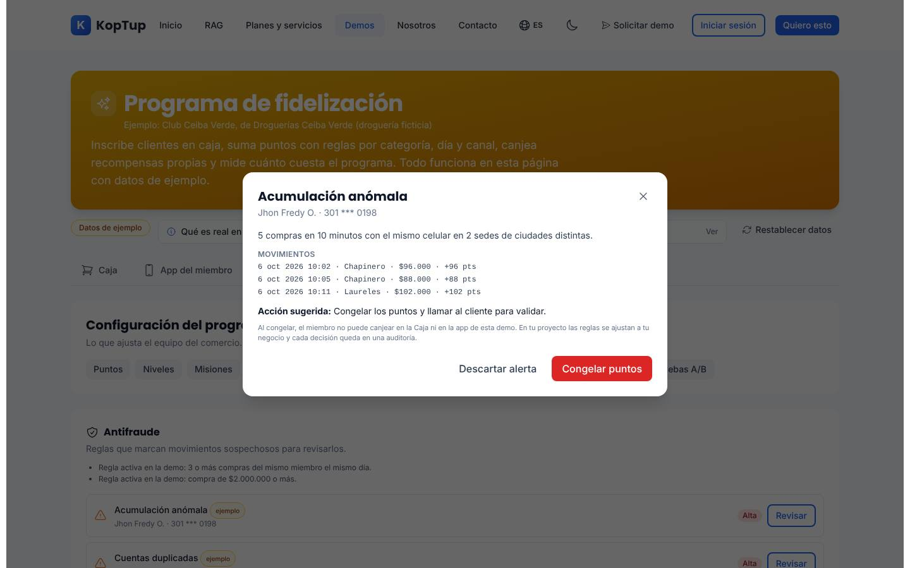

*Revisión de la alerta de ejemplo «Acumulación anómala»: movimientos, acción sugerida y las dos decisiones.*

- **Reglas activas en la demo**: 3 o más compras del mismo miembro el mismo día, y compras de $2.000.000 o más. Si registras una compra así en Caja, aparece una alerta «de tu demo» y la Caja avisa «Esta compra activó una regla antifraude».
- **Revisar** abre la evidencia y la acción sugerida. **Congelar puntos** impide que el miembro canjee en Caja y en la app; **Descartar alerta** la cierra.

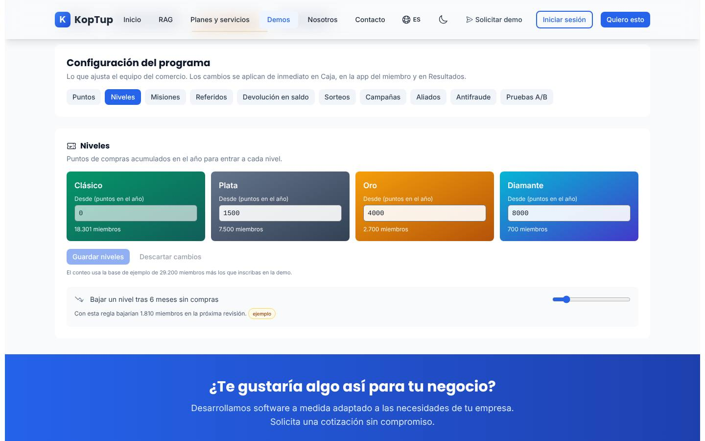

*Umbrales de nivel (0, 1.500, 4.000 y 8.000 puntos en el año) y la regla para bajar de nivel. El conteo de Clásico incluye a la persona inscrita en la demo.*

### Resultados

Ver el [paso 5](#paso-5-resultados-y-una-campaña-desde-un-segmento). Además de lo que hiciste y del pasivo:

- **Indicadores del programa** (marcados «ejemplo»): 29.200 miembros, activos a 90 días, tasa de canje, ticket promedio de miembros frente a no miembros y puntos vencidos.
- **Retención por mes de inscripción**: tabla de cohortes de mayo a octubre de 2026.
- **Miembros por nivel**: gráfico de anillo que se recalcula con los umbrales de Configuración › Niveles.
- **Recompensas más canjeadas** (últimos 30 días), que suma tus canjes («+N tuyos»).
- **Segmentos sugeridos**: VIP, En riesgo de irse, Cerca de subir de nivel e Inactivos, con la regla que los define, una acción sugerida y **Crear campaña**. «En esta demo no hay un modelo de IA».

### En el celular

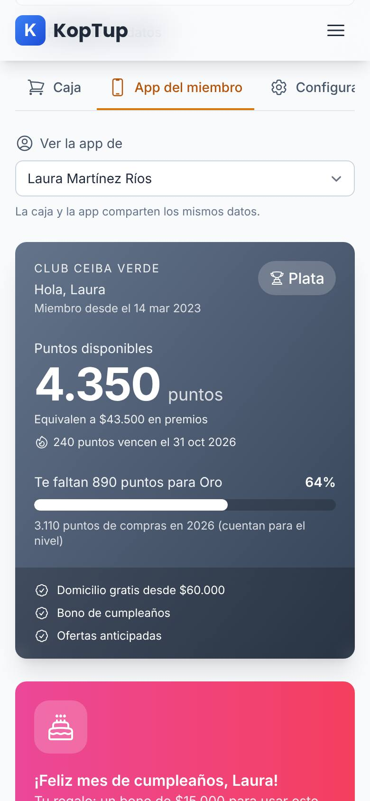

*La app del miembro en un teléfono (390 px).*

En el teléfono las tarjetas se apilan y la barra de pestañas se desplaza de lado (la última, Resultados, queda fuera de la vista hasta deslizarla). La página no se desborda a lo ancho.

---

## Qué es real y qué es simulado

| Parte | Real o simulado | Detalle |
|---|---|---|
| Marca, sedes, miembros, cédulas, celulares, aliados | **Datos de ejemplo** | Droguerías Ceiba Verde (NIT 901.555.214-1) y todo su club son ficticios. |
| Puntos de cada compra, saldo, niveles, misiones, referidos, canjes y cupones | **Real (en el navegador)** | Se calculan de verdad con las reglas de Configuración; el saldo es la suma del libro de puntos. |
| Reglas antifraude de la demo y congelamiento | **Real (en el navegador)** | Reglas simples (3 compras el mismo día, compras de $2.000.000 o más). Las cuatro alertas iniciales son de ejemplo. |
| Validación del horario de campañas (Ley 2300) | **Real (en el navegador)** | Revisa día y hora; no revisa festivos. |
| Simulador de puntos, costo del programa, pasivo y cashback | **Real (cálculo)** | Fórmulas a la vista; parten de supuestos de ejemplo. |
| Exportación CSV | **Real** | Se genera en el navegador con todos los movimientos. |
| Cifras de la base de 29.200 miembros, cohortes, resultados de misiones, pruebas A/B, aliados y referidos | **Datos de ejemplo** | Marcadas «ejemplo» en pantalla. |
| Segmentos sugeridos | **Reglas, no IA** | Recencia, frecuencia y nivel; tamaños de ejemplo. |
| WhatsApp, correo y SMS de campañas y compras | **Simulado** | Solo vista previa; no sale ningún mensaje. |
| Pase de Apple Wallet y Google Wallet | **Simulado** | Vista previa; no se genera el archivo del pase. |
| Sorteos | **Simulado** | El ganador sale de una lista de nombres ficticios. |
| Botones WhatsApp y Correo de «Invita amigos» | **Real** | Abren tu aplicación con el mensaje listo (el enlace es de un dominio de ejemplo). |
| Dónde se guardan tus cambios | **Solo en este navegador** | `localStorage`; no llegan a un servidor ni los ven otras personas. |

---

## Acceso

- **Cómo la ve un visitante:** la demo está en modo **Abierta** (`publico`): cualquiera entra a `/demo/loyalty` sin cuenta y sin pantalla de acceso. En el hub `/demo` aparece así:

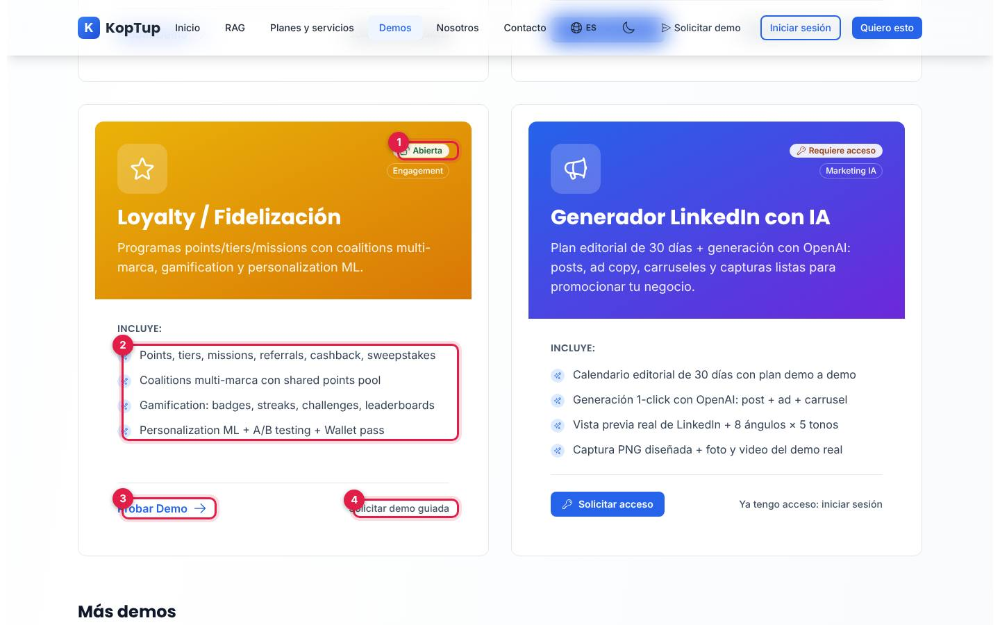

*Tarjeta «Loyalty / Fidelización» en el hub, vista por un visitante sin sesión.*

1. Insignia **Abierta** (junto a «Engagement»).
2. Lo que **Incluye** según la tarjeta (ver la [limitación 1](#limitaciones-conocidas)).
3. **Probar Demo** abre `/demo/loyalty`.
4. **Solicitar demo guiada** abre `/solicitar-demo?demos=loyalty`.

- **Cómo se solicita:** no hace falta solicitarla. Quien quiera una sesión con su propio caso usa **Solicitar demo guiada** (en la tarjeta o en el bloque azul al final de la demo, que también ofrece **Solicitar Cotización** y **Ver Planes y Precios**).
- **Cómo la controla el admin:** el modo sale del catálogo del servidor y se cambia en **Admin › Catálogo de demos** (`/admin/catalogo-demos`). Si se pasa a «Con solicitud» o «Solo por invitación», los visitantes verán la pantalla de acceso y los accesos se conceden en **Admin › Solicitudes de demo** y **Admin › Accesos a demos**; si se desactiva, el visitante ve que la demo está en mantenimiento y el equipo sigue entrando. Si el backend no responde, la demo sigue abierta porque así está en la tabla de respaldo. Detalle en el [Manual del administrador](Doc-06-Manual-del-Administrador.md) y en [Flujos del visitante](Doc-04-Flujos-del-Visitante.md).

---

## Limitaciones conocidas

1. **La tarjeta del hub promete más de lo que hace la demo.** Habla de «coalitions multi-marca con shared points pool», «personalization ML», «challenges, leaderboards» y «Wallet pass». La demo tiene aliados con cifras de ejemplo, segmentos por reglas («en esta demo no hay un modelo de IA»), el ranking apagado por defecto y solo una vista previa del pase.
2. **Los cambios viven solo en el navegador.** Si el prospecto cambia de equipo o borra los datos del sitio, vuelve a los datos de ejemplo; no hay espacio compartido con el vendedor.
3. **Fecha simulada, hora real.** Las compras quedan en la semana del 5 al 11 de octubre de 2026, pero con la hora del reloj de tu equipo (en la prueba, «6 oct 2026 03:20»).
4. **El recorrido sugerido no coincide del todo.** Dice que la misión «Compra 2 veces este mes» se completa con la segunda compra, pero Laura ya compró el 2 de octubre, así que queda lista con la primera. El panel del recorrido es una lista fija: no marca los pasos hechos.
5. **Campaña desde un segmento con texto genérico.** El nombre queda igual al segmento y el mensaje sigue siendo el de ejemplo («Este fin de semana tienes doble puntos…»), aunque el segmento sugiera otra acción (por ejemplo, «Bono de 300 puntos si compran en 15 días»). La vista previa usa el nombre y el saldo del miembro que tengas abierto en la app.
6. **Festivos sin revisar.** La validación de la Ley 2300 no considera festivos (lo dice la pantalla).
7. **Pruebas A/B de ejemplo.** «Finalizar y aplicar la ganadora» solo cambia una regla en la prueba del bono de bienvenida (queda en 300 puntos); las otras dos solo se marcan como finalizadas.
8. **Mensajes, pases y sorteos simulados**; los indicadores de la base de 29.200 miembros son fijos salvo lo que se recalcula con tus acciones y los umbrales de nivel.
