# Guía de la demo: Moderación de Contenido con IA

> Ruta `/demo/moderacion-contenido` · Modo de acceso: **Abierta** · Tipo: **datos de ejemplo** (todo corre en el navegador; no llama al servidor ni a un modelo de IA) · Plan del producto: [Moderación de contenido con IA](Producto-moderacion-contenido.md)

**Resumen.** Es la consola de un equipo de confianza y seguridad («trust & safety») de una plataforma ficticia: una cola priorizada de contenidos reportados (texto, imagen, video y audio) con su clasificación y su confianza, reglas por puntaje, apelaciones con SLA, registro de auditoría, reporte de transparencia, métricas por categoría y ejemplos de integración por API. Está pensada para plataformas con contenido de usuarios (redes sociales, juegos, citas, apps infantiles, fintech) y para sus responsables de moderación y cumplimiento. Todo son datos de ejemplo en el navegador: no se clasifica ningún contenido, no hay modelo de IA y al recargar la página vuelve al estado inicial.

**En esta página:** [Recorrido sugerido](#recorrido-sugerido-demo-comercial-de-5-minutos) · [Pantallas y funciones](#pantallas-y-funciones) · [Qué es real y qué es simulado](#qué-es-real-y-qué-es-simulado) · [Acceso](#acceso) · [Limitaciones conocidas](#limitaciones-conocidas)

*Vista inicial: encabezado con «Sistema activo» y el selector de vertical, la franja de bienestar del equipo, las nueve pestañas, las etiquetas de cumplimiento y el resumen operativo.*

---

## Recorrido sugerido (demo comercial de 5 minutos)

La idea que vende: «la IA ordena la cola por riesgo, el moderador decide con el contenido sensible desenfocado, las reglas se ajustan sin código y todo queda auditado». La demo no tiene botón de restablecer: si alguien ya la usó en esa pestaña, recarga la página y vuelve a los datos de ejemplo.

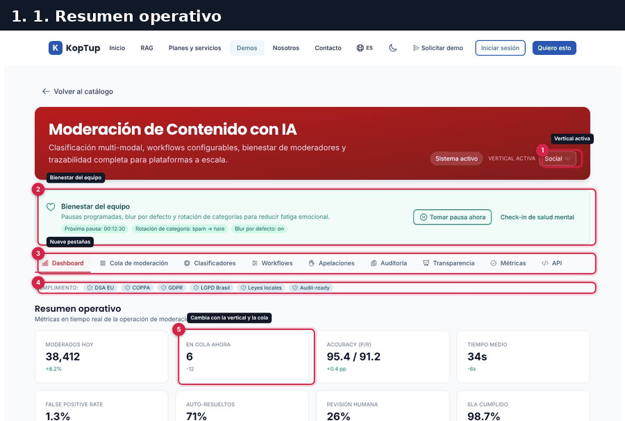

*Recorrido completo en 6 pasos: resumen, cola priorizada, decisión y cambio de vertical, reglas, apelaciones y auditoría.*

### Paso 1. El resumen operativo

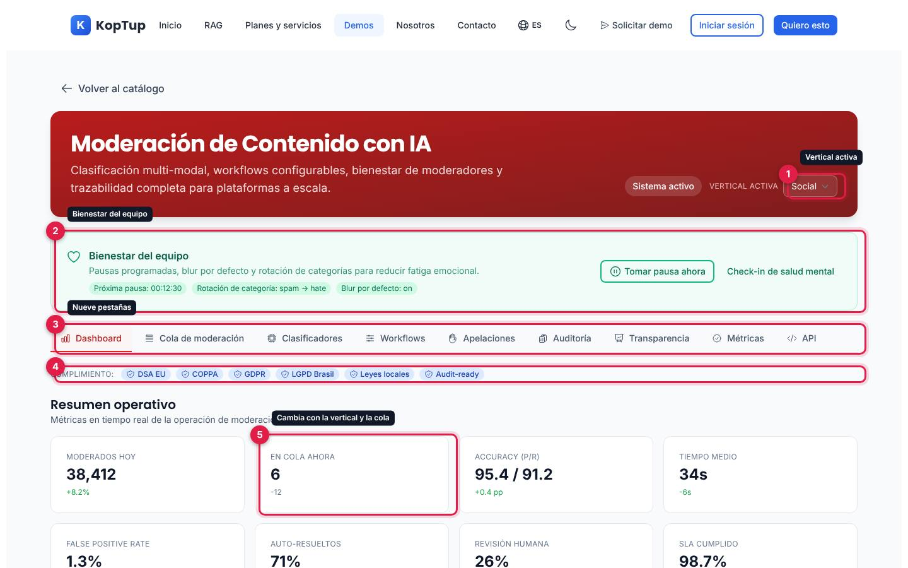

*Pestaña «Dashboard» con la vertical Social.*

1. **Vertical activa**: Social (por defecto), Gaming, Dating, Kids o Finanzas. Decide qué categorías entran a la cola (ver el paso 3).
2. **Bienestar del equipo**: el mensaje «Pausas programadas, blur por defecto y rotación de categorías para reducir fatiga emocional» con tres etiquetas fijas (próxima pausa 00:12:30, rotación spam → hate, blur por defecto on). Los botones **Tomar pausa ahora** y **Check-in de salud mental** no hacen nada.
3. **Nueve pestañas**: Dashboard, Cola de moderación, Clasificadores, Workflows, Apelaciones, Auditoría, Transparencia, Métricas y API.
4. **Cumplimiento**: etiquetas DSA EU, COPPA, GDPR, LGPD Brasil, Leyes locales y Audit-ready. Son solo etiquetas.
5. **En cola ahora**: el único indicador que cambia. Cuenta los casos de la cola que se ven con la vertical (y el filtro de tipo) elegidos: 6 en Social. Los otros siete (38,412 moderados hoy, accuracy 95.4 / 91.2, tiempo medio 34s, false positive rate 1.3 %, 71 % auto-resueltos, 26 % revisión humana y 98.7 % de SLA cumplido) y las variaciones debajo de cada uno son fijos.

Más abajo están las gráficas **Por mes** (retiros de contenido de febrero a mayo; ver la [limitación 4](#limitaciones-conocidas)) y **Por categoría** (las seis categorías más frecuentes).

Qué decir: «Esto es lo que ve el líder del equipo al empezar el turno: volumen, precisión, tiempos y cuánto se resuelve solo».

### Paso 2. La cola priorizada

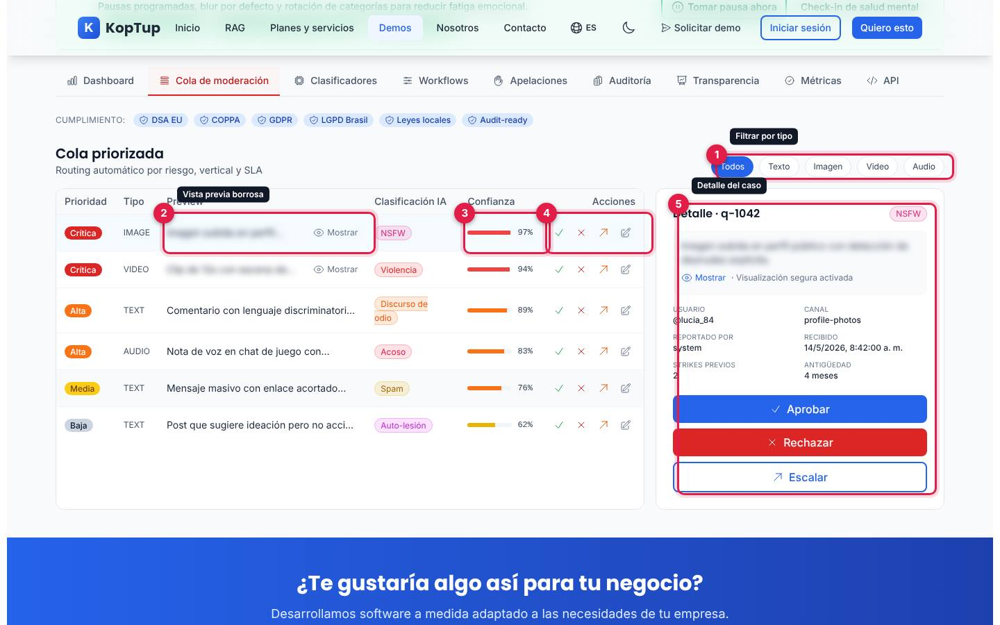

*Pestaña «Cola de moderación» con los seis casos de la vertical Social, ordenados de Crítica a Baja.*

1. **Filtrar por tipo**: Todos, Texto, Imagen, Video o Audio.
2. **Vista previa borrosa**: los casos marcados como sensibles (desnudez, violencia, seguridad infantil) aparecen desenfocados; **Mostrar** los revela y **Ocultar** los vuelve a tapar. La vista previa es una descripción en texto del contenido, no una imagen.
3. **Confianza** del clasificador: barra roja desde 90 %, naranja desde 75 % y amarilla por debajo.
4. **Acciones de la fila**: Aprobar (✓), Rechazar (✗), Escalar (↗) y Editar tag (lápiz, no hace nada).
5. **Detalle del caso**: número (`q-1042`), categoría, vista previa, usuario, canal, quién lo reportó (`system`, `user` o `partner`), fecha de recepción, strikes previos y antigüedad de la cuenta, con los botones grandes **Aprobar**, **Rechazar** y **Escalar**. Un clic en una fila la abre aquí.

La cola trae ocho casos de ejemplo:

| Caso | Tipo | Prioridad | Categoría | Confianza | Qué describe |
|---|---|---|---|---|---|
| q-1042 | Imagen | Crítica | NSFW | 97 % | Desnudez explícita en foto de perfil público |
| q-1044 | Video | Crítica | Violencia | 94 % | Clip de 12 s con agresión física |
| q-1047 | Imagen | Crítica | Seguridad infantil | 99 % | Imagen marcada por el detector de abuso infantil (CSAM) |
| q-1043 | Texto | Alta | Discurso de odio | 89 % | Comentario discriminatorio contra un grupo religioso |
| q-1046 | Audio | Alta | Acoso | 83 % | Nota de voz con insultos en un chat de juego |
| q-1045 | Texto | Media | Spam | 76 % | Mensaje masivo con enlace acortado de inversión |
| q-1048 | Texto | Media | Fraude | 71 % | Oferta de «duplicar» criptoactivos |
| q-1049 | Texto | Baja | Auto-lesión | 62 % | Publicación con ideación, con flujo de apoyo activo |

Qué decir: «El moderador no ve primero lo más viejo sino lo más grave, y lo sensible le llega desenfocado».

### Paso 3. Decidir y cambiar de vertical

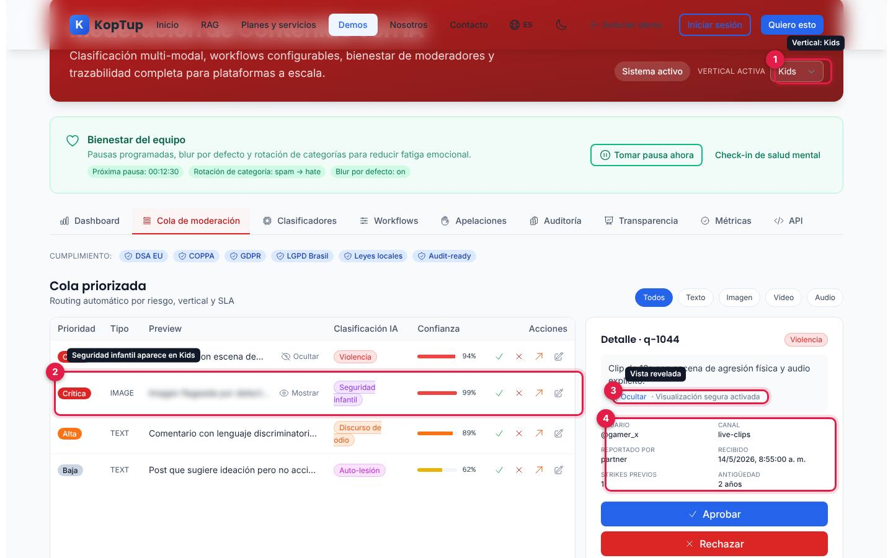

*Después de rechazar q-1042, con la vertical Kids y la vista previa de q-1044 revelada.*

Pulsa **Rechazar** en el detalle de q-1042: el caso sale de la cola y el detalle pasa al siguiente. Luego cambia la vertical a **Kids**:

1. **Vertical: Kids**. La cola muestra ahora 4 casos (serían 5 si no hubieras rechazado q-1042).
2. **q-1047 Seguridad infantil (99 %)**, que no aparece en Social. Su texto dice que se reportó automáticamente al NCMEC (es un texto de ejemplo).
3. **Ocultar · Visualización segura activada**: al revelar la vista previa en el detalle, también se revela en la fila (comparten el mismo estado).
4. **Datos del caso** q-1044: @gamer_x, canal `live-clips`, reportado por `partner`, 1 strike previo, cuenta de 2 años.

| Vertical | Categorías que entran a la cola | Casos de la cola inicial |
|---|---|---|
| Social | NSFW, Violencia, Discurso de odio, Spam, Acoso, Auto-lesión | 6 |
| Gaming | Acoso, Discurso de odio, Fraude, Spam | 4 |
| Dating | NSFW, Acoso, Fraude, Spam | 4 |
| Kids | Seguridad infantil, NSFW, Violencia, Discurso de odio, Auto-lesión | 5 |
| Finanzas | Fraude, Spam, Discurso de odio | 3 |

*La vertical solo filtra la cola (y por eso cambia «En cola ahora»); no cambia métricas, reglas ni clasificadores.*

Ten en cuenta que **Aprobar, Rechazar y Escalar hacen lo mismo**: quitan el caso de la cola. No queda registro en Auditoría ni cambian las métricas, salvo «En cola ahora».

Qué decir: «Cada plataforma tiene su política: en una app infantil la seguridad infantil y la autolesión pasan al frente».

### Paso 4. Reglas sin código (Workflows)

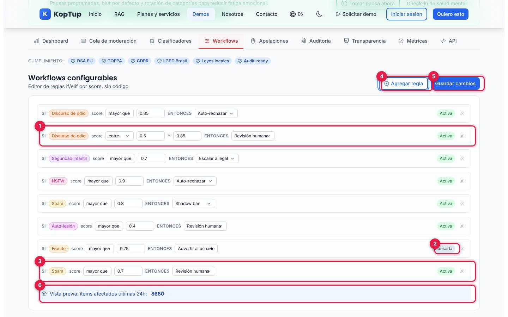

*Las siete reglas de ejemplo más una nueva, agregada con «Agregar regla».*

Cada regla dice «SI [categoría] score [mayor que / menor que / entre] [umbral] ENTONCES [acción]», y se puede pausar o borrar:

1. **Regla con rango**: si Discurso de odio está **entre** 0.5 y 0.85, **Revisión humana**. Con «entre» aparece un segundo umbral.
2. **Activa / Pausada**: la regla de Fraude viene pausada; un clic la cambia.
3. **Regla nueva**: siempre llega como «SI Spam score mayor que 0.7 ENTONCES Revisión humana». Puedes cambiar el operador, el umbral (de 0 a 1, de 0.05 en 0.05) y la acción, pero no la categoría. La X de la derecha la borra.
4. **Agregar regla**.
5. **Guardar cambios**: no hace nada (los cambios ya se ven en pantalla y se pierden al recargar).
6. **Vista previa: ítems afectados últimas 24h**: no es un cálculo sobre los casos; es el número de reglas activas × 1240 (7440 al inicio, 8680 con la regla nueva).

| Regla inicial | Entonces | Estado |
|---|---|---|
| Discurso de odio > 0.85 | Auto-rechazar | Activa |
| Discurso de odio entre 0.5 y 0.85 | Revisión humana | Activa |
| Seguridad infantil > 0.7 | Escalar a legal | Activa |
| NSFW > 0.9 | Auto-rechazar | Activa |
| Spam > 0.8 | Shadow ban | Activa |
| Auto-lesión > 0.4 | Revisión humana | Activa |
| Fraude > 0.75 | Advertir al usuario | Pausada |

*Acciones disponibles: Auto-rechazar, Revisión humana, Auto-aprobar, Shadow ban, Advertir al usuario y Escalar a legal. Las reglas no se aplican a la cola de la demo.*

Qué decir: «El equipo de políticas cambia umbrales sin pedirle nada a desarrollo».

### Paso 5. Apelaciones con SLA

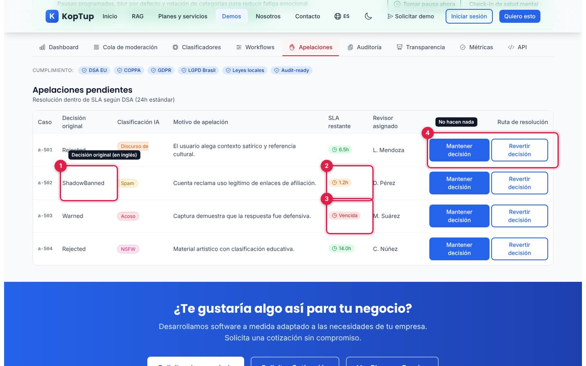

*Cuatro apelaciones pendientes con su SLA restante y su revisor.*

1. **Decisión original**: Rejected, ShadowBanned o Warned (sale en inglés).
2. **SLA restante en naranja** cuando faltan menos de 3 horas (a-502, 1.2h); en verde cuando falta más.
3. **Vencida** en rojo (a-503).
4. **Mantener decisión** y **Revertir decisión**: no hacen nada.

El subtítulo dice «Resolución dentro de SLA según DSA (24h estándar)». Cada fila trae el caso, la categoría, el motivo de la apelación (por ejemplo, «El usuario alega contexto satírico y referencia cultural») y el revisor asignado (L. Mendoza, D. Pérez, M. Suárez, C. Núñez).

### Paso 6. Registro de auditoría

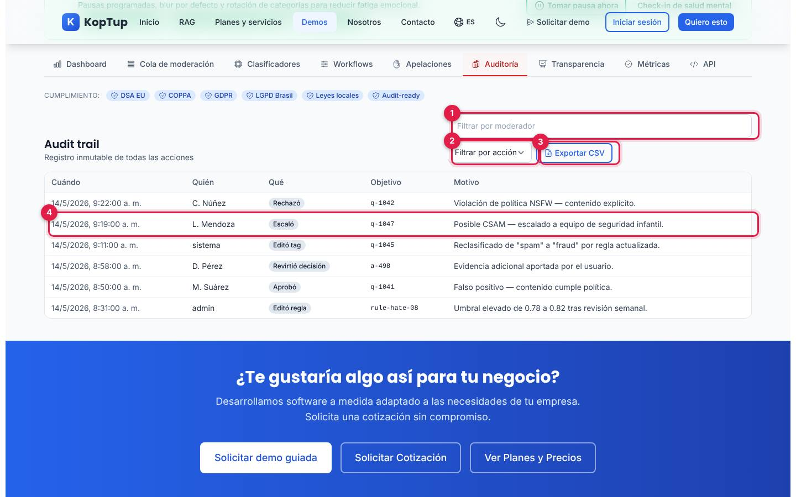

*Pestaña «Auditoría» («Audit trail») con sus seis registros de ejemplo.*

1. **Filtrar por moderador**: busca el texto en la columna «Quién» (por ejemplo, «Núñez»).
2. **Filtrar por acción**: Aprobó, Rechazó, Escaló, Editó tag, Mantuvo apelación, Revirtió decisión o Editó regla. «Mantuvo apelación» no tiene ningún registro, así que deja la tabla vacía.
3. **Exportar CSV**: no descarga nada.
4. **Un registro**: cuándo, quién, qué hizo, sobre qué caso y por qué; aquí, L. Mendoza escaló q-1047 al equipo de seguridad infantil.

Los registros son fijos: las decisiones que tomas en la cola no aparecen aquí. Las fechas (14 de mayo de 2026) se muestran en la hora local del navegador.

Qué decir: «Cada decisión queda con quién, cuándo y por qué; eso es lo que pide un regulador».

---

## Pantallas y funciones

Todo está en una sola página: el encabezado y la franja de bienestar quedan fijos arriba y debajo cambia el contenido de la pestaña elegida. La cola, la vertical y las reglas se conservan al cambiar de pestaña; los filtros de Clasificadores, Auditoría y API vuelven a su valor inicial.

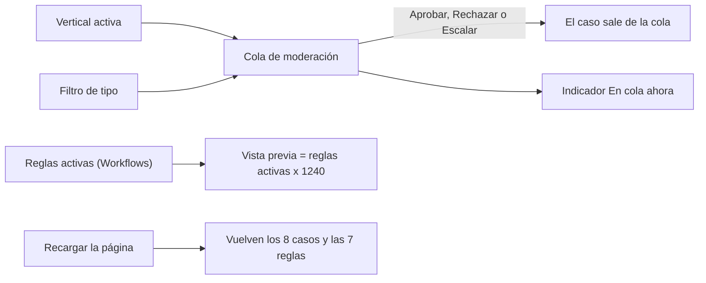

*Qué está conectado con qué en la demo. Nada más cambia: métricas, apelaciones, auditoría, transparencia y clasificadores son fijos.*

### Encabezado, bienestar y cumplimiento

- **Volver al catálogo** lleva al hub `/demo`.
- **Sistema activo** es una etiqueta fija.
- **Vertical activa** filtra la cola (ver el [paso 3](#paso-3-decidir-y-cambiar-de-vertical)).
- La franja **Bienestar del equipo** y las etiquetas de **Cumplimiento** se describen en el [paso 1](#paso-1-el-resumen-operativo); sus botones no hacen nada.

### Dashboard

Ver el [paso 1](#paso-1-el-resumen-operativo). «En cola ahora» es el único número vivo; las gráficas **Por mes** y **Por categoría** usan los mismos datos que Transparencia.

### Cola de moderación

Ver los pasos [2](#paso-2-la-cola-priorizada) y [3](#paso-3-decidir-y-cambiar-de-vertical). Si sacas todos los casos, la tabla muestra «—» y el detalle dice «Selecciona un ítem para ver detalle»; solo recargando vuelven.

### Clasificadores

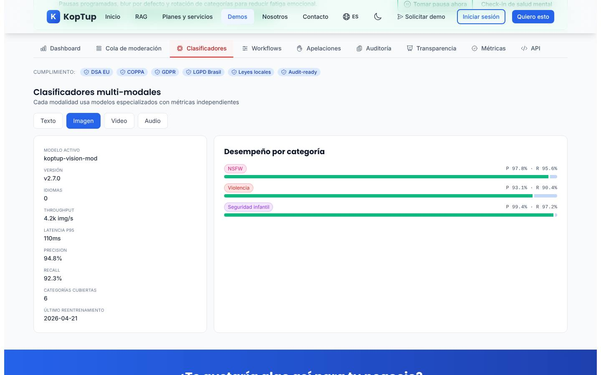

*Modalidad «Imagen»: ficha del modelo y desempeño por categoría.*

Elige la modalidad (Texto, Imagen, Video o Audio) y la página muestra la ficha del modelo y la precisión (P) y exhaustividad (R) por categoría. Los modelos son nombres de ejemplo:

| Modalidad | Modelo y versión | Idiomas | Capacidad | Latencia P95 | Precision / Recall | Categorías | Último reentrenamiento |
|---|---|---|---|---|---|---|---|
| Texto | koptup-text-mod v3.4.1 | 18 | 12.4k req/s | 42ms | 96.1 % / 91.8 % | 8 | 2026-05-02 |
| Imagen | koptup-vision-mod v2.7.0 | 0 | 4.2k img/s | 110ms | 94.8 % / 92.3 % | 6 | 2026-04-21 |
| Video | koptup-video-mod v1.9.3 | 0 | 820 clips/min | 1.8s | 92.0 % / 88.5 % | 5 | 2026-04-15 |
| Audio | koptup-audio-mod v1.4.0 | 12 | 2.1k min/h | 320ms | 89.3 % / 85.7 % | 4 | 2026-04-30 |

### Workflows

Ver el [paso 4](#paso-4-reglas-sin-código-workflows).

### Apelaciones

Ver el [paso 5](#paso-5-apelaciones-con-sla).

### Auditoría

Ver el [paso 6](#paso-6-registro-de-auditoría).

### Transparencia

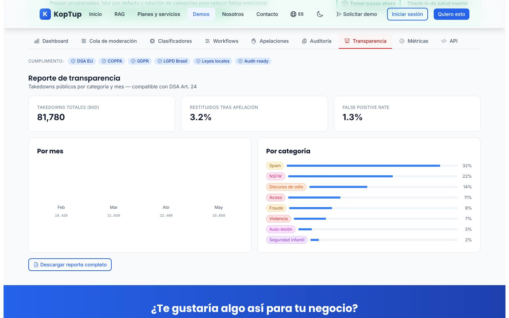

*Reporte de transparencia «compatible con DSA Art. 24», con la gráfica por mes sin barras.*

- **Indicadores**: 81,780 retiros de contenido en 90 días (la suma de los cuatro meses), 3.2 % restituidos tras apelación y 1.3 % de falsos positivos.
- **Por mes**: Feb 18.420, Mar 21.030, Abr 22.480 y May 19.850. Solo se ven el mes y la cifra (ver la [limitación 4](#limitaciones-conocidas)).
- **Por categoría**: las ocho categorías, de Spam (32 %) a Seguridad infantil (2 %).
- **Descargar reporte completo**: no hace nada.

### Métricas

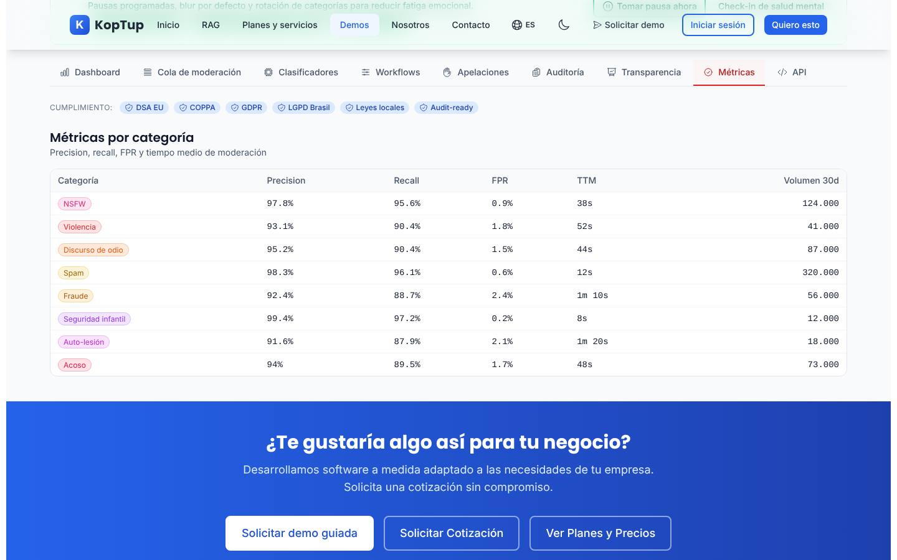

*Tabla fija con precisión, exhaustividad, tasa de falsos positivos, tiempo medio de moderación y volumen de 30 días.*

Por ejemplo, Spam: 98.3 % / 96.1 % / 0.6 % / 12s / 320,000; Seguridad infantil: 99.4 % / 97.2 % / 0.2 % / 8s / 12,000; Fraude: 92.4 % / 88.7 % / 2.4 % / 1m 10s / 56,000.

### API

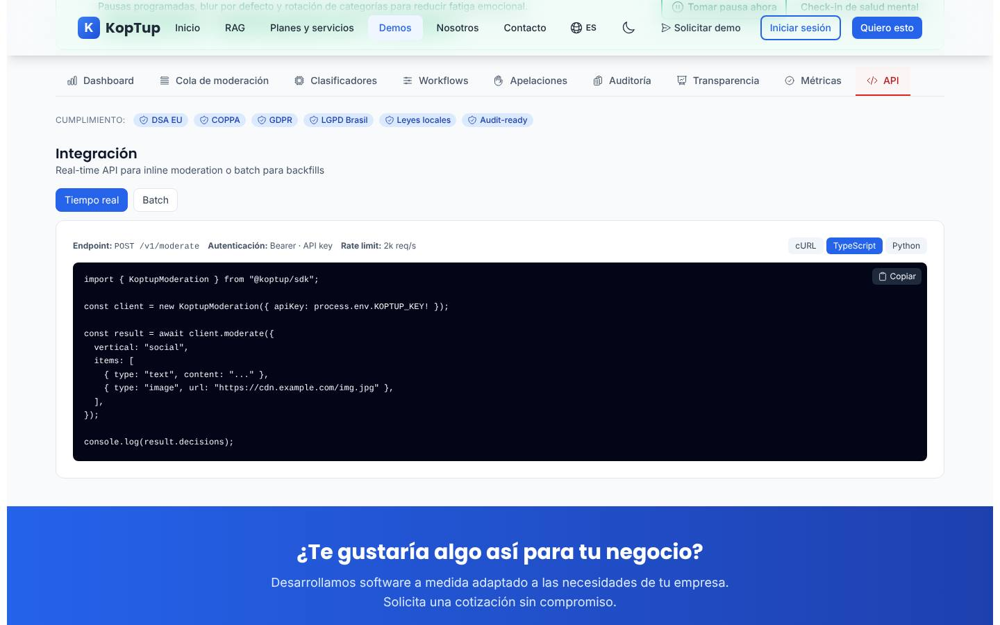

*Ejemplo en TypeScript de la llamada en tiempo real.*

- **Tiempo real** (`POST /v1/moderate`, «2k req/s») o **Batch** (`POST /v1/moderate/batch`, «5 jobs/min»), con autenticación «Bearer · API key».
- **cURL**, **TypeScript** o **Python** cambian el ejemplo.
- **Copiar** copia el ejemplo al portapapeles y dice «Copiado» un segundo y medio.

Los ejemplos son ilustrativos: el dominio `api.koptup.ai`, el SDK `@koptup/sdk` y el paquete `koptup` de Python no existen en `main`.

### En el celular

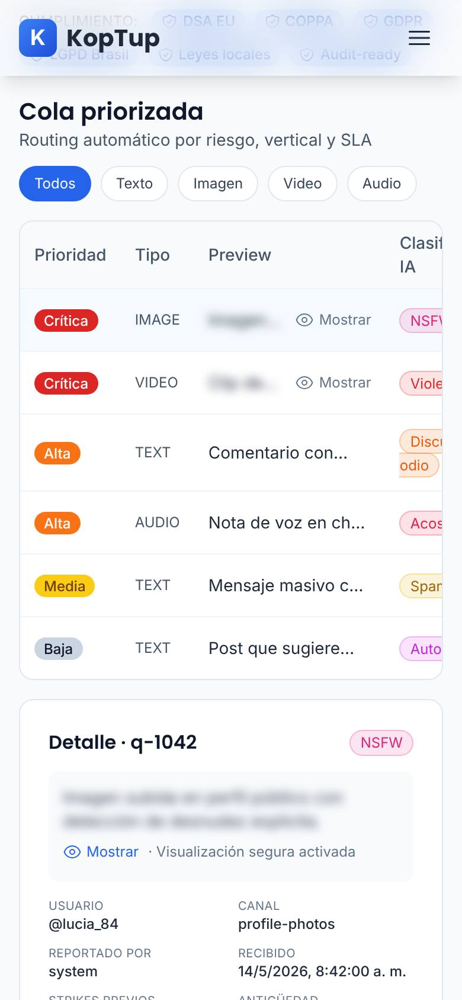

*La cola en un teléfono (390 px).*

Las pestañas se deslizan de lado, la tabla de la cola también (clasificación, confianza y acciones quedan a la derecha, fuera de vista) y el detalle del caso baja debajo de la tabla.

---

## Qué es real y qué es simulado

| Parte | Real o simulado | Detalle |
|---|---|---|
| Clasificación, confianza y prioridad | **Datos de ejemplo** | Ocho casos fijos; no hay modelo de IA ni forma de enviar contenido para clasificar. |
| Cola, filtros, vista borrosa y decisiones | **Funciona en el navegador** | Filtra, ordena por prioridad, revela y quita casos; las decisiones no se guardan en ningún lado. |
| Vertical activa | **Funciona en el navegador** | Solo filtra categorías de la cola. |
| Editor de reglas | **Funciona en el navegador** | Agrega, edita, pausa y borra reglas; no se aplican a nada y no se guardan. |
| Métricas, gráficas, clasificadores, apelaciones, auditoría y transparencia | **Fijos** | Cifras de ejemplo escritas en el código. |
| Bienestar, cumplimiento, exportar y descargar | **Solo de muestra** | Botones sin acción y etiquetas. |
| Ejemplos de API | **Ilustrativos** | No hay API de moderación publicada. |
| Servidor | **No se usa** | La página no hace ninguna petición. En el repositorio hay un módulo de backend `modules/moderation` con datos de ejemplo, pero no está conectado al servidor ni lo usa esta demo. |
| Dónde se guarda | **Solo en memoria** | Al recargar vuelve todo al inicio; no usa `localStorage`. |

---

## Acceso

- **Cómo la ve un visitante:** la demo está en modo **Abierta** (`publico`): cualquiera entra a `/demo/moderacion-contenido` sin cuenta y sin pantalla de acceso. En el hub `/demo` aparece así:

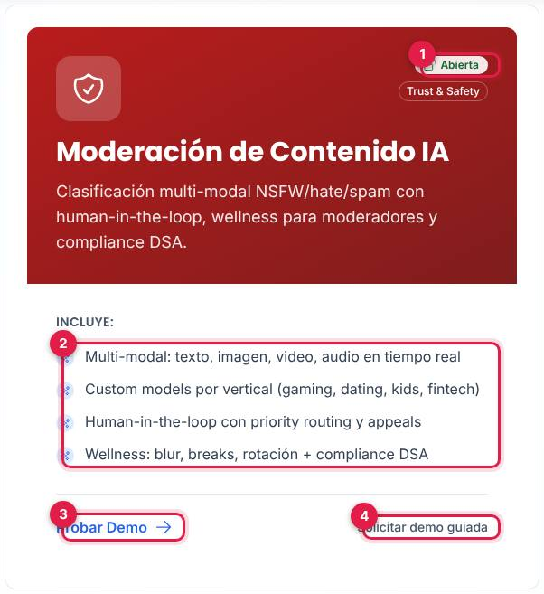

*Tarjeta «Moderación de Contenido IA» en el hub, vista por un visitante sin sesión.*

1. Insignia **Abierta** (junto a «Trust & Safety»).
2. Lo que **Incluye** según la tarjeta (ver la [limitación 1](#limitaciones-conocidas)).
3. **Probar Demo** abre `/demo/moderacion-contenido`.
4. **Solicitar demo guiada** abre `/solicitar-demo?demos=moderacion-contenido`.

- **Cómo se solicita:** no hace falta solicitarla. Quien quiera verla con su propio caso usa **Solicitar demo guiada** (en la tarjeta o en el bloque azul al final de la demo, que también ofrece **Solicitar Cotización** y **Ver Planes y Precios**).
- **Cómo la controla el admin:** el modo sale del catálogo del servidor (allí se llama «Moderación de contenido con IA») y se cambia en **Admin › Catálogo de demos** (`/admin/catalogo-demos`). Si se pasa a «Con solicitud» o «Solo por invitación», los visitantes verán la pantalla de acceso y los accesos se conceden en **Admin › Solicitudes de demo** y **Admin › Accesos a demos**; si se desactiva, el visitante ve que la demo está en mantenimiento y el equipo sigue entrando. Si el backend no responde, la demo sigue abierta porque así está en la tabla de respaldo. Detalle en el [Manual del administrador](Doc-06-Manual-del-Administrador.md) y en [Flujos del visitante](Doc-04-Flujos-del-Visitante.md).

---

## Limitaciones conocidas

1. **No hay IA aunque el nombre y la tarjeta la prometen.** La tarjeta del hub dice «Multi-modal: texto, imagen, video, audio en tiempo real» y «Custom models por vertical»; en la demo no se puede enviar ningún contenido, los puntajes y los modelos son textos fijos y la vertical solo filtra la cola. Además la página no tiene la insignia «Datos de ejemplo» y muestra «Sistema activo» y «Métricas en tiempo real», lo que puede hacer creer al visitante que ve un sistema en vivo.
2. **Botones que no hacen nada:** Tomar pausa ahora, Check-in de salud mental, Editar tag (lápiz de cada fila), Guardar cambios, Mantener decisión, Revertir decisión, Exportar CSV y Descargar reporte completo.
3. **Aprobar, Rechazar y Escalar dan el mismo resultado:** el caso sale de la cola sin dejar rastro en Auditoría ni en las métricas. Con la cola vacía no hay forma de reponerla salvo recargando.
4. **La gráfica «Por mes» no dibuja las barras** (en Dashboard y en Transparencia): las barras quedan con altura cero y solo se ven el mes y la cifra.
5. **Nada se guarda:** recargar la página devuelve la cola, la vertical y las reglas a su estado inicial.
6. **Las reglas no se aplican** a la cola y la «Vista previa» de ítems afectados es una multiplicación fija (reglas activas × 1240).
7. **Mezcla de inglés y formato inglés:** Dashboard, Preview, Accuracy (P/R), False positive rate, Audit trail, Takedowns, Shadow ban, las decisiones originales (Rejected, ShadowBanned, Warned), los tipos (IMAGE, TEXT…), quién reportó (`system`, `user`, `partner`) y cifras con punto decimal y coma de miles (95.4, 38,412), mientras las gráficas usan el formato del navegador (18.420).
8. **Datos que no cuadran:** la ficha de Imagen dice «Categorías cubiertas 6» pero lista 3, y la de Texto dice 8 pero lista 5; Imagen y Video muestran «Idiomas 0».
9. **Fechas en la hora local:** los casos y la auditoría (14 de mayo de 2026) se muestran con la zona horaria y el formato del navegador de quien la mira.
10. **Errores de hidratación en la consola (para desarrolladores):** con el navegador en español, React registra los errores #425, #418 y #423 porque las cifras de la gráfica se formatean distinto en el servidor y en el navegador; la página se vuelve a pintar sola y el visitante no lo nota.
11. **En el celular la cola se desliza de lado** y las acciones quedan fuera de vista hasta deslizar.
12. **Tres nombres para la misma demo:** «Moderación de Contenido IA» en el hub, «Moderación de Contenido con IA» en la página y «Moderación de contenido con IA» en el catálogo del admin y en el formulario de solicitud.
13. **«Ver Planes y Precios»** del bloque final lleva a `/services#planes-rag`, que abre en los planes RAG.
