# Guía de la demo: POS para retail y restaurantes

> Ruta `/demo/pos` · Modo de acceso: **Abierta** · Tipo: **datos de ejemplo** (todo corre en el navegador; sin backend ni IA) · Plan del producto: [POS retail](Producto-pos-retail.md)

**Resumen.** Es una caja registradora (punto de venta) completa para dos negocios ficticios colombianos: un minimercado (Mercado La Ceiba, tres sedes en Bogotá y Medellín) y un restaurante (Fogón Andino, tres sedes en Bogotá, Medellín y Cali). Vendes con lector de código de barras y balanza o por mesas con comandas a cocina, cobras con pago mixto, emites el documento equivalente POS de ejemplo, sigues vendiendo «sin internet» y cierras caja con reporte X y Z; además hay consola de sedes, inventario, traslados y empleados. Está pensada para dueños y administradores de tiendas, minimercados y restaurantes. Cualquier visitante la abre sin registrarse.

**En esta página:** [Recorrido sugerido](#recorrido-sugerido-demo-comercial-de-5-minutos) · [Pantallas y funciones](#pantallas-y-funciones) · [Qué es real y qué es simulado](#qué-es-real-y-qué-es-simulado) · [Acceso](#acceso) · [Limitaciones conocidas](#limitaciones-conocidas)

*Vista inicial: encabezado de la demo, insignia «Datos de ejemplo», los desplegables «Qué es real en esta demo» y «Recorrido sugerido (3 minutos)», la barra de la caja (tipo de negocio, sede, «En línea», turno) y la pestaña Venta con el catálogo y el ticket.*

---

## Recorrido sugerido (demo comercial de 5 minutos)

Este guion sigue los cinco pasos del desplegable **Recorrido sugerido (3 minutos)** que trae la propia demo (es una lista de ayuda: no marca los pasos como hechos). Empieza con los datos limpios: si alguien ya usó la demo en ese navegador, pulsa **Restablecer datos** y confirma con **Sí, restablecer**.

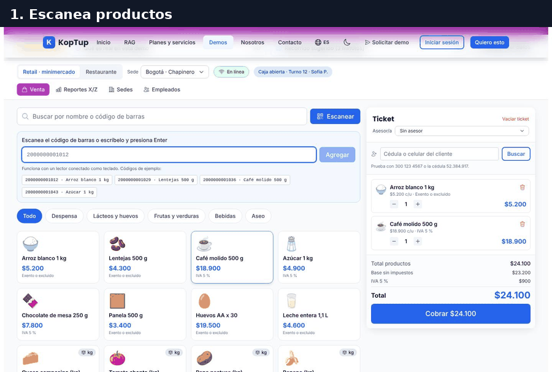

*Recorrido completo: escanear y pesar, cobro mixto, documento POS, venta sin internet, mesas, modificadores, cocina (KDS), reporte X y cierre Z.*

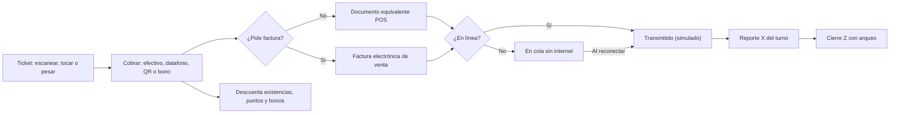

*Ciclo de una venta en la demo: cada flecha la hace la propia página al cobrar.*

### Paso 1. Retail: escanea y pesa

En **Retail · minimercado** (el modo inicial), sede Bogotá · Chapinero, pulsa **Escanear** y usa los códigos de ejemplo.

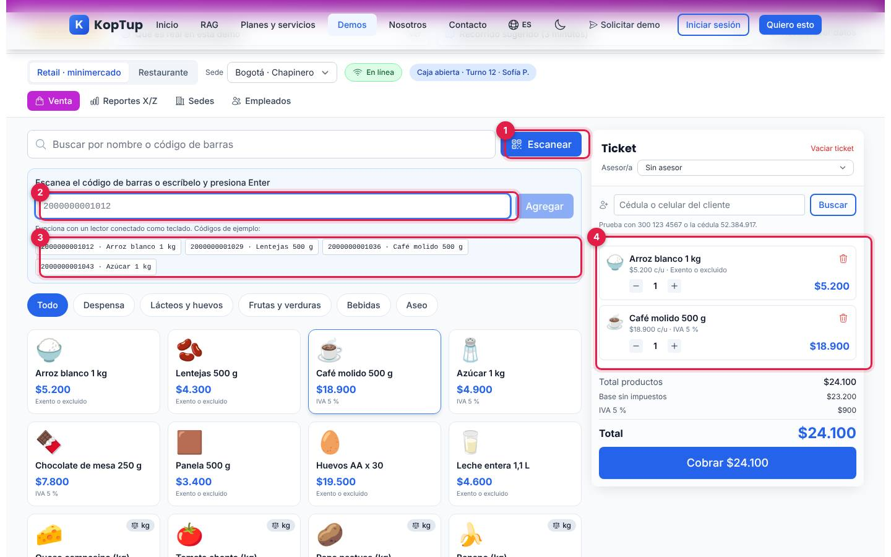

*Campo de escaneo abierto con los códigos de ejemplo; el arroz y el café ya están en el ticket.*

1. **Escanear** abre y cierra el campo de escaneo.
2. **Campo de código**: acepta un lector de código de barras real conectado como teclado (USB o Bluetooth) o un código escrito más Enter. Un código que no existe muestra «El código … no está en el catálogo». El buscador de arriba también agrega el producto si escribes un código de 8 a 14 dígitos y pulsas Enter.
3. **Códigos de ejemplo**: los cuatro primeros productos con código (arroz, lentejas, café y azúcar). Un clic equivale a escanearlos.
4. **Líneas del ticket**: cada producto con precio unitario, tarifa de impuesto, botones − y +, y la papelera para quitarlo.

Luego toca un producto **por kilo** (los que llevan la insignia «kg», por ejemplo Tomate chonto) y pulsa **Leer balanza (simulado)**:

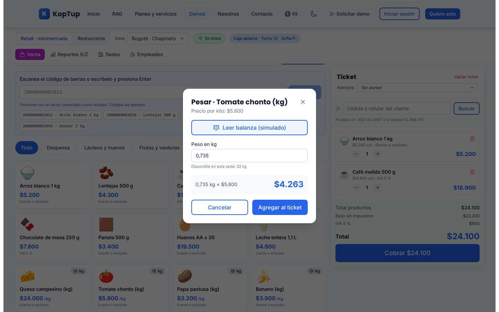

*Ventana «Pesar · Tomate chonto (kg)»: la balanza simulada leyó 0,735 kg y la demo calcula $4.263.*

Cada lectura de la balanza simulada da el siguiente peso de una lista fija (0,735 · 1,25 · 0,48 · 2,105 · 0,92 kg). También puedes escribir el peso a mano (entre 0,01 y 20 kg); la ventana muestra lo disponible en la sede y no deja agregar más de eso. **Agregar al ticket** suma la línea.

Qué decir: «El cajero no digita nada: escanea o pesa, y el precio sale con el impuesto correcto».

### Paso 2. Cliente frecuente, canje de puntos y cobro mixto

En el ticket escribe `300 123 4567` en **Cédula o celular del cliente** y pulsa **Buscar**. Aparece Valentina Rojas (5.420 puntos, nivel Oro). Pulsa **Canjear 500 pts (−$5.000)**. Si quieres, elige un **Asesor/a** (en la captura, Camila Ortiz) para que la venta le sume comisión.

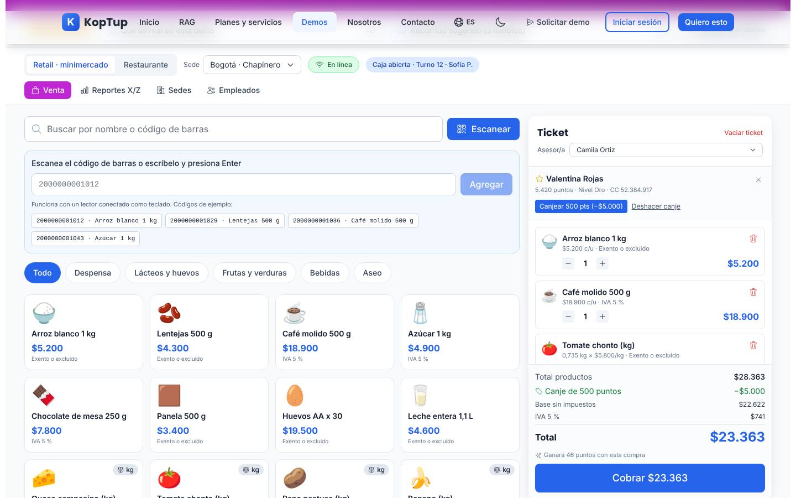

*Ticket con la cliente identificada, el canje de 500 puntos (−$5.000), la base sin impuestos, el IVA 5 % y «Ganará 46 puntos con esta compra».*

Pulsa **Cobrar $23.363**. En la ventana escribe `20000`, pulsa **Recibir efectivo**, cambia a **Tarjeta (datafono)** y pulsa **Cobrar en datafono** (sin monto: cobra lo que falta).

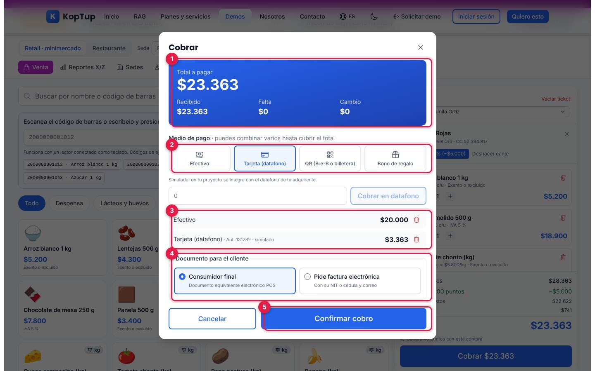

*Ventana «Cobrar» con dos pagos: $20.000 en efectivo y $3.363 con tarjeta (autorización simulada).*

1. **Total a pagar**, con lo **Recibido**, lo que **Falta** y el **Cambio**.
2. **Medio de pago**: Efectivo, Tarjeta (datafono), QR (Bre-B o billetera) o Bono de regalo. Se pueden combinar hasta cubrir el total. En efectivo aparecen botones rápidos («Exacto …» y valores redondeados) y la demo calcula el cambio. Datafono y QR esperan menos de un segundo y devuelven un código de autorización simulado. Los bonos de ejemplo son `BONO50` ($50.000) y `BONO20` ($20.000).
3. **Pagos parciales**: cada uno con su papelera para quitarlo.
4. **Documento para el cliente**: «Consumidor final» (documento equivalente electrónico POS) o «Pide factura electrónica» (tipo y número de documento, nombre y correo obligatorios).
5. **Confirmar cobro**: se activa cuando no falta nada. Registra la venta.

### Paso 2 (cont.). El documento equivalente POS

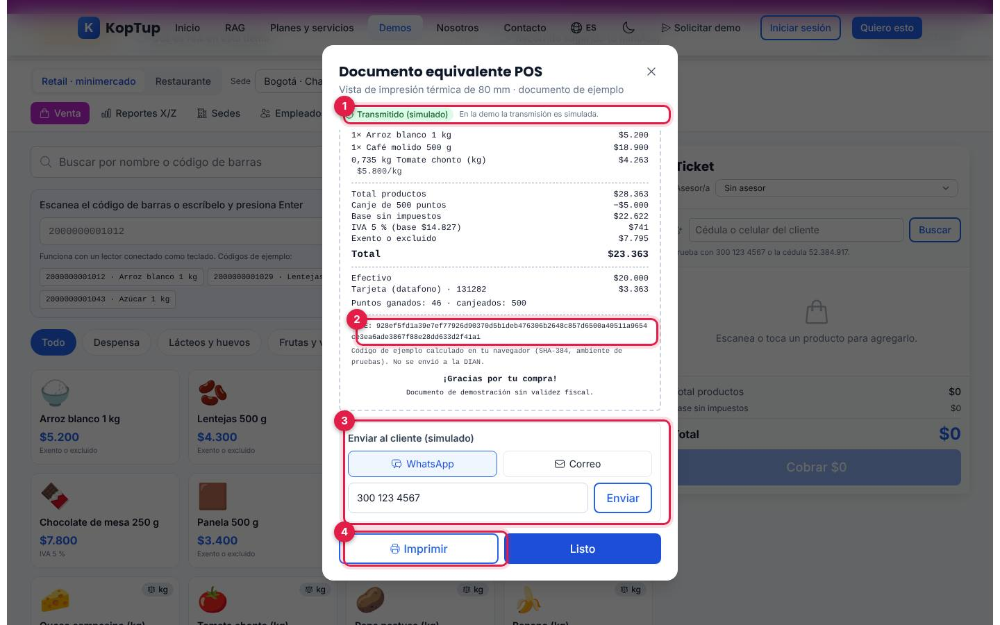

*Documento `LC1-4821` en vista de impresión térmica de 80 mm, con el CUDE de ejemplo al final.*

1. **Estado**: «Transmitiendo…» y, en poco más de un segundo, «Transmitido (simulado)».
2. **CUDE** (o CUFE si es factura): se calcula en tu navegador con SHA-384 en ambiente de pruebas y no se envía a la DIAN. El documento trae negocio, NIT, resolución de ejemplo, cajero, asesor, líneas, base, impuestos por tarifa, pagos, cambio y puntos ganados y canjeados.
3. **Enviar al cliente (simulado)**: por WhatsApp (trae el celular del cliente) o por correo. Responde «Listo: se enviaría a … Simulado: en la demo no sale ningún mensaje».
4. **Imprimir**: abre el diálogo de impresión del navegador solo con el recibo.

Qué decir: «Cobro mixto en segundos, documento electrónico con su código y recibo por WhatsApp sin papel».

### Paso 3. Sin internet: la caja sigue vendiendo

Pulsa **En línea** en la barra de la caja: cambia a **Sin internet**. Haz otra venta (en la prueba, agua y detergente con **Exacto $15.200**) y luego abre **Reportes X/Z**.

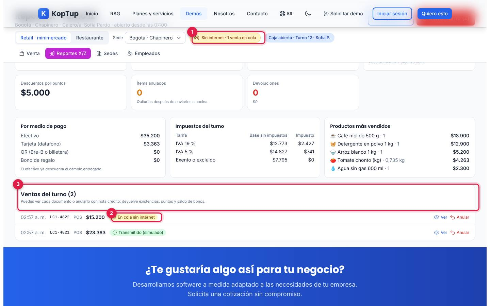

*Con el interruptor en «Sin internet · 1 venta en cola», el documento `LC1-4822` queda «En cola sin internet».*

1. **Interruptor de conexión**: es un botón de la demo; no corta tu internet. Muestra cuántas ventas hay en cola.
2. **En cola sin internet**: el documento se emitió y se guardó, pero no se ha «transmitido».
3. **Ventas del turno**: cada documento con su estado, **Ver** y **Anular**.

Pulsa otra vez el interruptor: dice «Sincronizando 1 venta…» y, en menos de dos segundos, la venta pasa a «Transmitido (simulado)». Sin conexión no se pueden registrar traslados entre sedes.

Qué decir: «Si se cae el internet, no se para la fila: los documentos se envían solos al volver».

### Paso 4. Restaurante: mesas, modificadores y cocina

Cambia a **Restaurante** (sede Bogotá · Usaquén). Aparecen las pestañas **Mesas** y **Cocina (KDS)**.

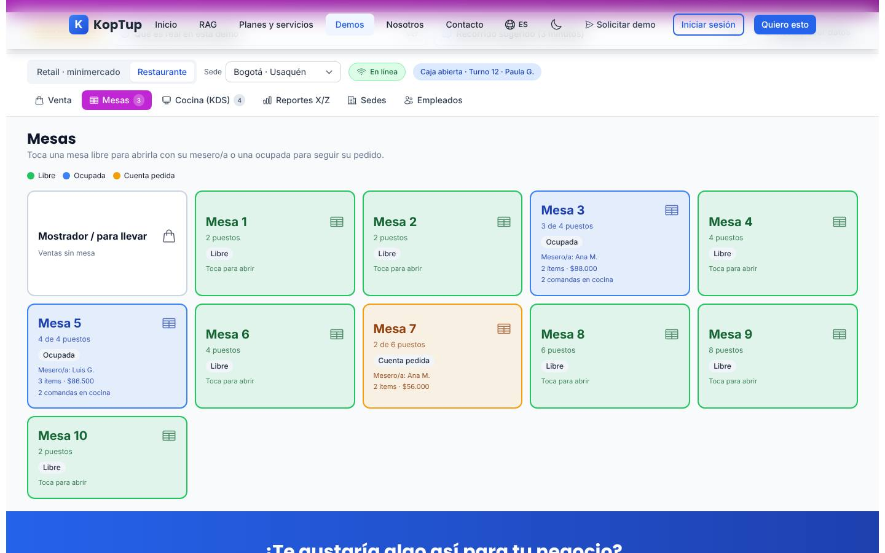

*Plano de 10 mesas más «Mostrador / para llevar»: libres en verde, ocupadas en azul (Mesa 3 y Mesa 5) y con cuenta pedida en naranja (Mesa 7).*

Toca **Mesa 1**, elige mesero/a y número de personas y pulsa **Abrir mesa**: vuelves a **Venta** con el ticket de esa mesa. Toca **Bandeja paisa**: se abre la ventana de modificadores (Media porción −$8.000, Aguacate +$4.000, Huevo frito +$3.000, Chicharrón extra +$7.000, Sin cebolla) y una **Nota para cocina**. Las bebidas preparadas tienen En leche +$1.500, Sin azúcar y Sin hielo. Agrega también una Limonada de coco y pulsa **Enviar a cocina (2)**: la demo crea una comanda para cocina y otra para bar. Luego abre **Cocina (KDS)**.

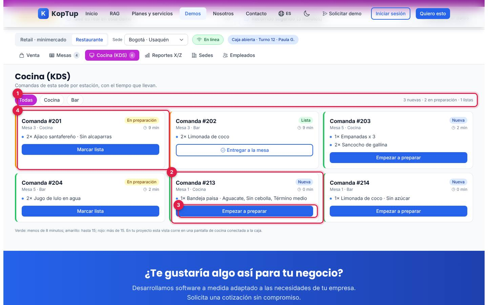

*Pantalla de cocina de la sede: las comandas de ejemplo de las mesas 3 y 5 y las dos nuevas de la Mesa 1 (#213 a cocina y #214 a bar).*

1. **Estación**: Todas, Cocina o Bar, con el conteo de nuevas, en preparación y listas.
2. **Comanda nueva** de la Mesa 1, con los modificadores y la nota («Aguacate, Sin cebolla, Término medio»).
3. **Botón de avance**: Empezar a preparar → Marcar lista → Entregar a la mesa (al entregarla desaparece).
4. **Color por tiempo**: borde verde con menos de 8 minutos, amarillo hasta 15 y rojo después. El tiempo corre con el reloj real.

Qué decir: «El mesero no corre a la cocina: la comanda llega sola, separada por estación, y se ve cuánto lleva esperando».

### Paso 5. Reporte X, cierre Z y sedes

Vuelve a **Retail · minimercado** y abre **Reportes X/Z**.

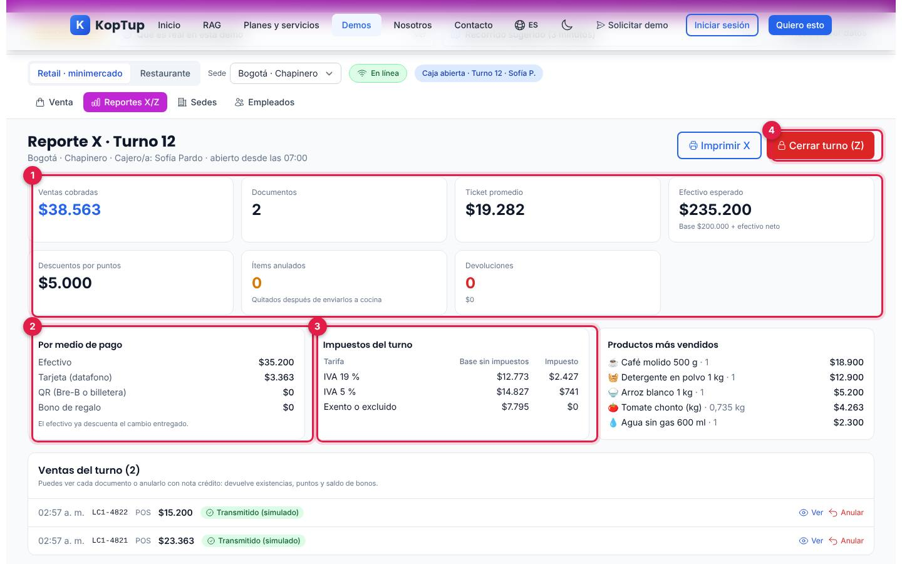

*Reporte X del turno 12 de Chapinero con las dos ventas del recorrido.*

1. **Totales del turno**: ventas cobradas ($38.563), documentos (2), ticket promedio, efectivo esperado (base $200.000 + efectivo neto), descuentos por puntos ($5.000), ítems anulados (quitados después de enviarlos a cocina) y devoluciones. En restaurante suma también las propinas.
2. **Por medio de pago**: efectivo (ya descuenta el cambio entregado), tarjeta, QR y bono.
3. **Impuestos del turno**: base e impuesto por tarifa (IVA 19 %, IVA 5 %, exento o excluido; INC 8 % en restaurante).
4. **Cerrar turno (Z)**: abre el arqueo. **Imprimir X** imprime el reporte.

En **Cerrar turno (Z)** escribe el efectivo contado (o pulsa **Usar el valor esperado**). La ventana dice si cuadra exacto, si sobra o si falta. En la prueba se contaron $233.200 frente a $235.200 esperados. **Cerrar y generar Z** muestra el reporte Z:

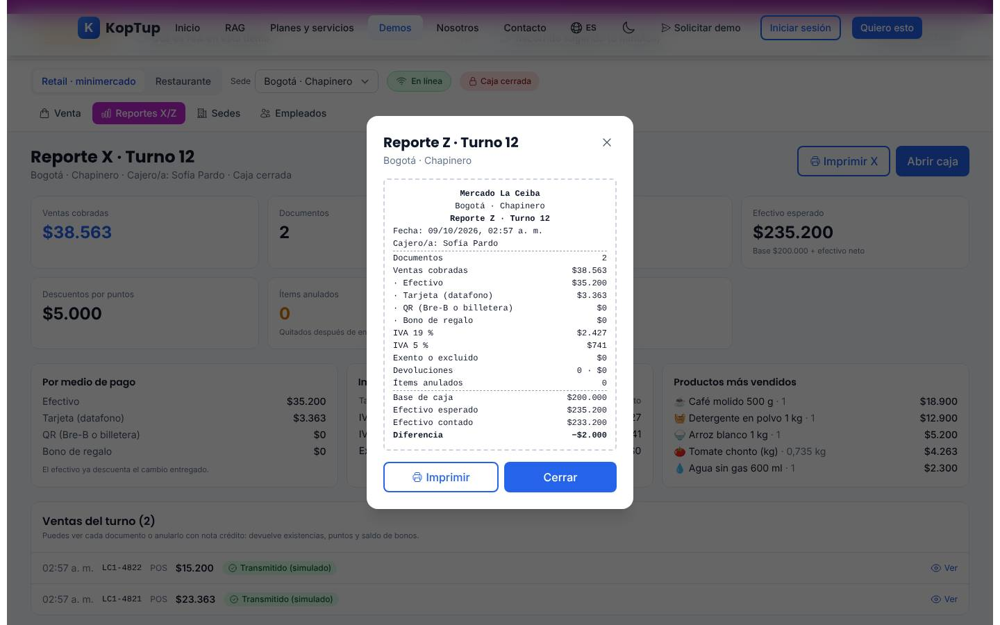

*Reporte Z del turno 12: documentos, ventas por medio de pago, impuestos, devoluciones, ítems anulados, base, efectivo esperado, contado y diferencia (−$2.000).*

La caja de esa sede queda **Caja cerrada**: la pestaña Venta muestra «La caja de esta sede está cerrada» y el botón **Abrir caja** (base sugerida $200.000 y cajero/a o supervisor/a de la sede); el turno nuevo toma el número siguiente. Termina en **Sedes** con un traslado (ver [Sedes](#sedes)).

Qué decir: «El cierre de caja deja de ser una hoja de cálculo: el sistema dice cuánto debería haber y cuánto falta».

---

## Pantallas y funciones

### Encabezado y barra de la caja

Ver la [vista general](#guía-de-la-demo-pos-para-retail-y-restaurantes).

| Elemento | Qué hace |
|---|---|
| **Datos de ejemplo** | Insignia; al pasar el mouse explica que negocios, NIT, sedes, personas, códigos de barras, existencias y cifras son inventados. |
| **Qué es real en esta demo** | Desplegable con lo que se calcula de verdad en el navegador y lo que es simulado (DIAN, datafono, QR, balanza, impresora, cajón, WhatsApp y correo). |
| **Recorrido sugerido (3 minutos)** | Desplegable con los 5 pasos del guion de arriba. No marca avances. |
| **Restablecer datos** | Pide confirmación y vuelve a los datos de ejemplo (borra ventas, cierres, clientes registrados, precios y traslados de los dos negocios). |
| **Retail · minimercado / Restaurante** | Cambia de negocio. Cada uno guarda su propia información. |
| **Sede** | Cambia la sede donde vendes («Ahora vendes en …»). El ticket vuelve al mostrador de esa sede. |
| **En línea / Sin internet** | Interruptor simulado; muestra las ventas en cola y la sincronización. Afecta a los dos negocios. |
| **Caja abierta · Turno N · nombre** | Estado del turno de la sede; en rojo «Caja cerrada». |
| **Pestañas** | Retail: Venta, Reportes X/Z, Sedes y Empleados. Restaurante: además Mesas (con el número de mesas abiertas) y Cocina (KDS) (con las comandas pendientes). |

### Venta

Ver los [pasos 1 y 2](#paso-1-retail-escanea-y-pesa).

- **Catálogo**: 16 productos por negocio, con buscador por nombre o código, categorías (Despensa, Lácteos y huevos, Frutas y verduras, Bebidas y Aseo; en restaurante Platos fuertes, Entradas, Bebidas y Postres), precio con impuestos incluidos y tarifa. Muestra «Quedan N» cuando las existencias de la sede llegan al mínimo y «Agotado» cuando no hay.
- **Hora feliz** (solo restaurante): botón que aplica −20 % a la cerveza nacional.
- **Combo** (restaurante): «Combo almuerzo: sancocho + jugo» se cobra como un ítem y se envía a cocina y a bar por separado.
- **Periféricos**: impresora térmica, lector, datafono, balanza (solo retail) y cajón monedero con botones **Probar** o **Abrir**. Solo muestran un aviso simulado; **Abrir campo** del lector abre el campo de escaneo.
- **Caja**: base, efectivo neto de ventas, efectivo esperado y **Cerrar turno (Z)** o **Abrir caja**.
- **Ticket**: en retail, selector **Asesor/a** (solo asesores en turno); en restaurante, mesa, personas, mesero/a y **Cambiar mesa**. **Vaciar ticket** borra las líneas.
- **Cliente frecuente**: búsqueda por cédula o celular (prueba con 300 123 4567 o la cédula 52.384.917). Si no existe, **Registrarlo** pide nombre, cédula (5 a 10 dígitos), celular (10 dígitos que empiezan por 3) y la autorización de datos (Ley 1581 de 2012). Niveles: Bronce, Plata desde 1.500 puntos y Oro desde 5.000; se gana 1, 1,5 o 2 puntos por cada $1.000 y se canjean bloques de 500 puntos por $5.000.
- **Restaurante**: **Enviar a cocina (N)** (solo lo que falta enviar; la línea muestra «Enviado: N»), **Pre-cuenta** (marca la mesa como «Cuenta pedida»; no genera documento) y **Liberar mesa sin consumo**. Al cobrar pide elegir la propina (Sin propina, 5 % o 10 % sugerida, sobre la base sin impuestos).

### Mesas

Ver el [paso 4](#paso-4-restaurante-mesas-modificadores-y-cocina). Las mesas 3, 5 y 7 llegan con pedidos de ejemplo en las tres sedes. Una mesa libre se abre con su mesero/a (solo meseros en turno) y el número de personas; una ocupada lleva a su ticket. **Mostrador / para llevar** es la venta sin mesa.

### Cocina (KDS)

Ver el [paso 4](#paso-4-restaurante-mesas-modificadores-y-cocina).

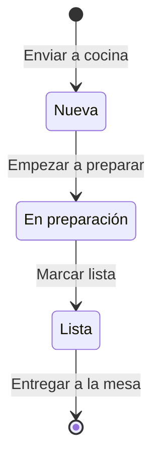

*Estados de una comanda en la pantalla de cocina.*

### Reportes X/Z

Ver el [paso 5](#paso-5-reporte-x-cierre-z-y-sedes). Además de los totales:

- **Productos más vendidos** del turno.
- **Ventas del turno**: hora, número, POS o Factura, total y estado. **Ver** abre el documento; **Anular** pide confirmación y crea una nota crédito de ejemplo (`NC1-101`…): devuelve existencias, puntos y saldo de bonos, y la venta queda «Anulada · NC…». Con el turno cerrado solo queda **Ver**.
- **Cierres Z de esta sesión**: lista de cierres con su diferencia y **Ver**.

### Sedes

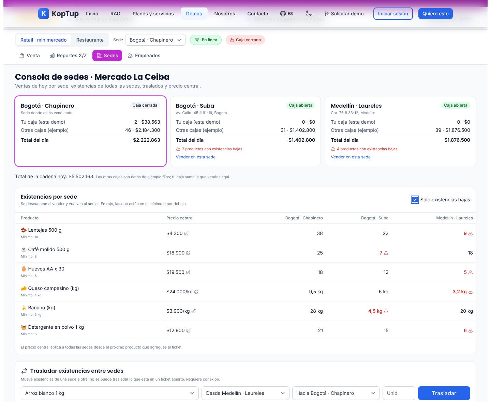

*Consola de Mercado La Ceiba después del traslado de 5 unidades de arroz de Medellín · Laureles a Bogotá · Chapinero, con el filtro «Solo existencias bajas» activo.*

- **Tarjetas por sede**: caja abierta o cerrada, «Tu caja (esta demo)» (lo que vendes aquí), «Otras cajas (ejemplo)» (cifras fijas), total del día, productos con existencias bajas y **Vender en esta sede**. Debajo, el total de la cadena.
- **Existencias por sede**: una columna por sede, en rojo con alerta las que están en el mínimo o por debajo, y **Solo existencias bajas**.
- **Precio central**: el lápiz permite cambiar el precio (entre $100 y $10.000.000) para todas las sedes; aplica a los productos que agregues después y queda marcado «Cambiado».
- **Trasladar existencias entre sedes**: producto, origen, destino y cantidad (enteros o kg). No deja trasladar sin conexión, entre la misma sede ni más de lo disponible (lo que está en un ticket abierto no cuenta). Debajo queda el historial de traslados.

### Empleados

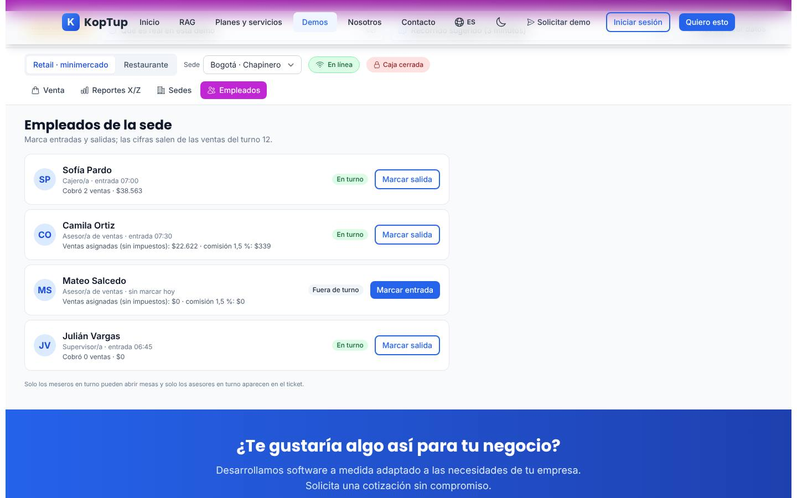

*Empleados de Chapinero: la cajera con sus 2 ventas, asesores con su comisión y el supervisor.*

Lista del personal de la sede con **Marcar entrada** y **Marcar salida** (hora real de Colombia) y cifras del turno: ventas cobradas por cajero/a, ventas asignadas y comisión del 1,5 % por asesor/a, mesas abiertas, cuentas cobradas y propinas por mesero/a y comandas pendientes de cocina o bar. Solo los meseros en turno pueden abrir mesas y solo los asesores en turno aparecen en el ticket.

### En el celular

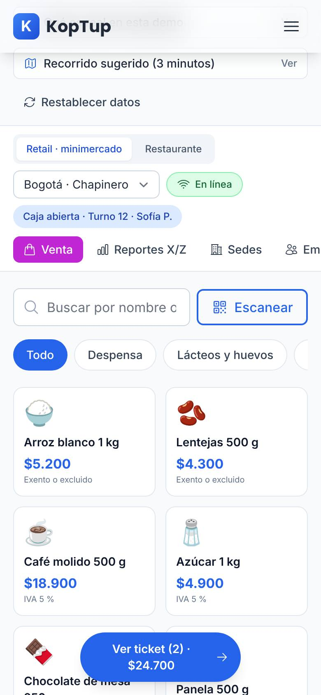

*La demo en un teléfono (390 px): la barra de la caja se apila, las pestañas se desplazan de lado y aparece el botón flotante «Ver ticket (2) · $24.700».*

En el teléfono el catálogo va en dos columnas y el ticket queda debajo; el botón flotante lleva hasta él. La barra de la caja deja de ser fija. La página no se desborda a lo ancho.

---

## Qué es real y qué es simulado

| Parte | Real o simulado | Detalle |
|---|---|---|
| Negocios, NIT, sedes, empleados, clientes, códigos de barras, existencias y cifras | **Datos de ejemplo** | Mercado La Ceiba y Fogón Andino son ficticios. |
| Cálculos de la venta | **Real (en el navegador)** | Impuestos incluidos en el precio (IVA 19 %, IVA 5 %, exento, INC 8 %), puntos, cambio, propina, existencias por sede, reportes X y Z, arqueo, comisiones y consola de sedes. |
| Lector de código de barras | **Real** | Funciona cualquier lector que escriba como teclado. |
| Balanza, datafono, QR, impresora térmica y cajón | **Simulados** | Avisos y lecturas fijas; el datafono y el QR devuelven un código inventado. |
| Impresión | **Real (navegador)** | **Imprimir** abre el diálogo de impresión del navegador con el recibo o el reporte. |
| Documento equivalente POS, factura electrónica y nota crédito | **Simulados** | CUDE o CUFE calculado con SHA-384 en el navegador, en ambiente de pruebas; nada se envía a la DIAN y el documento dice «sin validez fiscal». |
| Sin internet y sincronización | **Simulados** | Es un interruptor de la demo; no corta tu conexión. |
| Envío del recibo por WhatsApp o correo | **Simulado** | Solo muestra a dónde se enviaría. |
| Otras cajas de cada sede | **Datos de ejemplo fijos** | Solo «Tu caja» suma lo que vendes. |
| Dónde se guardan tus cambios | **Solo en este navegador** | `localStorage` del equipo; no llegan a un servidor ni los ven otras personas. La demo no llama al backend. |

---

## Acceso

**Cómo lo ve un visitante.** La demo es **Abierta**: en `/demo` su tarjeta («POS Punto de Venta», insignias «Abierta» y «Retail») tiene **Probar Demo** (abre `/demo/pos` directamente) y **Solicitar demo guiada** (`/solicitar-demo?demos=pos`). No hay pantalla de acceso ni hace falta cuenta. Al final de la página está el bloque «¿Te gustaría algo así para tu negocio?» con **Solicitar demo guiada** (`/solicitar-demo?demos=pos`), **Solicitar Cotización** (`/contact`) y **Ver Planes y Precios** (`/services#planes-rag`).

**Cómo se solicita una demo guiada y cómo la gestiona el admin.** La solicitud del formulario llega a **Admin › Solicitudes de demo** como cualquier otra. Como la demo es abierta, no hace falta conceder acceso para usarla; la solicitud sirve para agendar la demo guiada. Un admin puede cambiar el modo de acceso en **Admin › Catálogo de demos** (por ejemplo, a «Con solicitud»); entonces empezaría a mostrarse la pantalla de acceso. Detalle en el [Manual del administrador](Doc-06-Manual-del-Administrador.md) y en [Flujos del visitante](Doc-04-Flujos-del-Visitante.md).

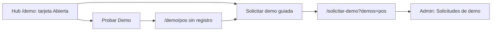

*Dos caminos: probarla de una vez o pedir una demo guiada.*

---

## Limitaciones conocidas

1. **La tarjeta del hub promete más que la demo.** Dice «Offline-first con CRDT sync y conflict resolution», «Multi-payment: efectivo, tarjeta, QR, wallets, BNPL, split», «facturación electrónica» y «hardware integrado». En la demo el modo sin internet es un interruptor simulado (no hay sincronización real ni manejo de conflictos), no hay pago a cuotas (BNPL), los documentos son de ejemplo sin transmisión y solo el lector de código de barras funciona de verdad.
2. **Los cambios viven solo en el navegador.** Otro equipo o navegador ve los datos de ejemplo; el vendedor no ve lo que hizo el prospecto. Las «otras cajas» de cada sede son cifras fijas.
3. **Hora real.** Documentos, turnos, marcaciones y tiempos de cocina usan la hora actual de Colombia; si haces la demo de madrugada, los documentos salen con esa hora (en la prueba, «02:55 a. m.»).
4. **Después del cierre Z el título sigue diciendo «Reporte X · Turno N»** hasta que abres la caja otra vez; las cifras son las del turno ya cerrado.
5. **Pre-cuenta no genera documento**: solo marca la mesa como «Cuenta pedida».
6. **Texto sin plural en la cocina**: el conteo muestra «1 listas».
7. **En escritorio a 1440 × 900**, al abrir la demo el botón **Cobrar** del ticket queda justo en el borde inferior de la pantalla; hay que bajar un poco. En el teléfono el ticket queda debajo del catálogo (se llega con el botón flotante «Ver ticket»).
8. **No encontramos botones muertos.** Los periféricos solo muestran avisos simulados, como lo dicen sus propios textos.
