# Guía de la demo: SaaS Boilerplate Multi-tenant

> Ruta `/demo/saas-boilerplate` · Modo de acceso: **Abierta** · Tipo: **datos de ejemplo** (todo corre en el navegador; no llama al servidor) · Plan del producto: [Plataforma SaaS multi-tenant](Producto-saas-multi-tenant.md)

**Resumen.** Es una vitrina técnica de lo que traería una plantilla para construir un SaaS B2B multiempresa: arquitectura de referencia, tres formas de aislar los datos de cada cliente («tenant»), autenticación empresarial, planes y cobro, panel interno con impersonación, webhooks, API, registros de auditoría, feature flags, internacionalización, observabilidad y equipos, repartidos en 12 pestañas. Está pensada para fundadores, CTO y equipos de producto que evalúan arrancar un SaaS sin construir esa base desde cero. Todo son datos y código de ejemplo: no se inicia sesión, no se cobra, no se envía ningún correo y nada se guarda.

**En esta página:** [Recorrido sugerido](#recorrido-sugerido-demo-comercial-de-5-minutos) · [Pantallas y funciones](#pantallas-y-funciones) · [Qué es real y qué es simulado](#qué-es-real-y-qué-es-simulado) · [Acceso](#acceso) · [Limitaciones conocidas](#limitaciones-conocidas)

*Vista inicial: encabezado con las insignias SaaS, B2B y Production-ready, el stack, la barra de pestañas y la pestaña «Arquitectura».*

---

## Recorrido sugerido (demo comercial de 5 minutos)

La idea que vende: «todo lo que un SaaS B2B necesita antes de su primera función de negocio (aislamiento por cliente, SSO y MFA, cobro, soporte y equipo) ya está resuelto». La demo no tiene botón de restablecer: recarga la página para volver al inicio. Cada pestaña olvida lo que hiciste en ella cuando cambias a otra.

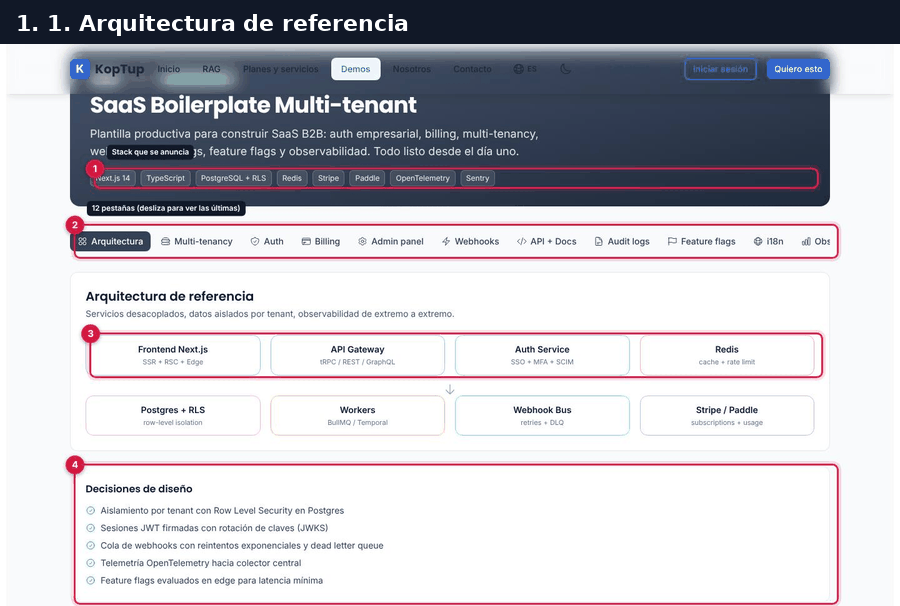

*Recorrido completo en 6 pasos: arquitectura, multi-tenancy, MFA, planes y pago, impersonación e invitaciones.*

### Paso 1. La arquitectura de referencia

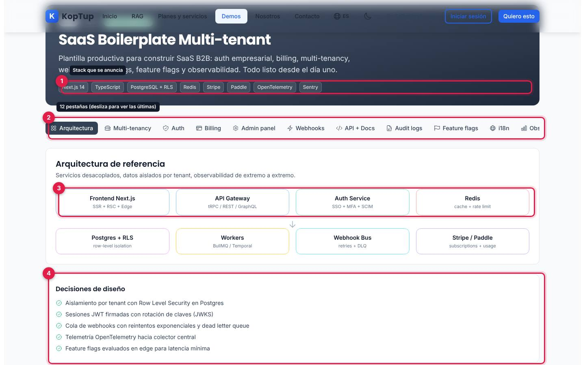

*Pestaña «Arquitectura», la que abre por defecto.*

1. **Stack que se anuncia**: Next.js 14, TypeScript, PostgreSQL + RLS, Redis, Stripe, Paddle, OpenTelemetry y Sentry.
2. **Barra de 12 pestañas**: Arquitectura, Multi-tenancy, Auth, Billing, Admin panel, Webhooks, API + Docs, Audit logs, Feature flags, i18n, Observability y Teams. En una pantalla de 1440 px las dos últimas quedan cortadas a la derecha: hay que deslizar la barra de lado.
3. **Diagrama de ocho piezas**: Frontend Next.js, API Gateway, Auth Service y Redis arriba; Postgres + RLS, Workers, Webhook Bus y Stripe / Paddle abajo. Es un dibujo fijo, sin interacción.
4. **Decisiones de diseño**: aislamiento por tenant con Row Level Security en Postgres, sesiones JWT con rotación de claves (JWKS), cola de webhooks con reintentos y dead letter queue, telemetría OpenTelemetry y feature flags evaluados en el edge.

Qué decir: «Esta es la base que normalmente toma meses; aquí está pensada desde el día uno».

### Paso 2. Elegir cómo se aíslan los datos de cada cliente

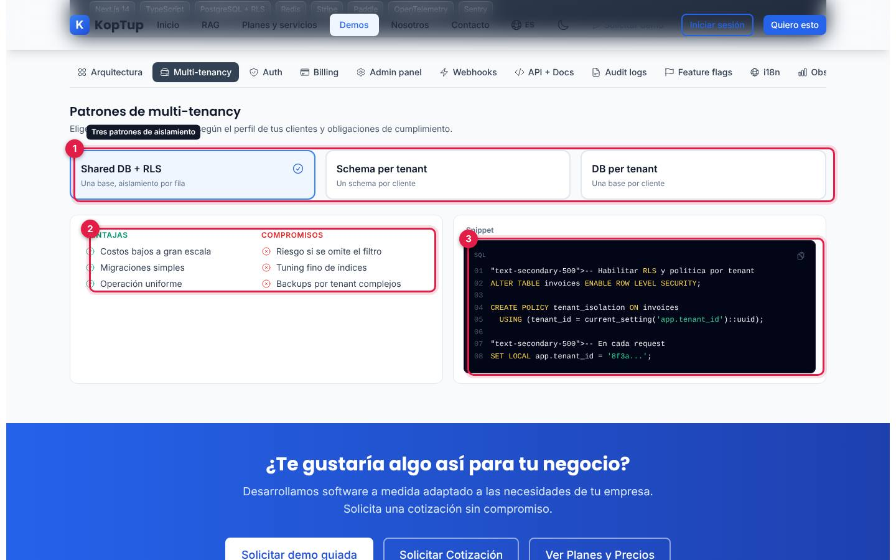

*Pestaña «Multi-tenancy» con el patrón «Shared DB + RLS» elegido.*

1. **Tres patrones**: un clic en cada tarjeta cambia lo de abajo.
2. **Ventajas y Compromisos** del patrón elegido.
3. **Snippet**: el código de ejemplo del patrón (SQL para RLS, TypeScript para los otros dos). Las líneas de comentario empiezan con un texto suelto `"text-secondary-500">` y el patrón «Schema per tenant» muestra el nombre interno del texto en lugar del código (ver la [limitación 3](#limitaciones-conocidas)).

| Patrón | En una frase | Ventajas | Compromisos |
|---|---|---|---|
| Shared DB + RLS | Una base, aislamiento por fila | Costos bajos a gran escala, migraciones simples, operación uniforme | Riesgo si se omite el filtro, ajuste fino de índices, backups por tenant complejos |
| Schema per tenant | Un schema por cliente | Aislamiento lógico fuerte, backups por tenant, migraciones por etapas | Conexiones por schema, migraciones más lentas, catálogo grande |
| DB per tenant | Una base por cliente | Aislamiento físico, cumplimiento estricto, restauración independiente | Costo operativo alto, pool de conexiones complejo, cambios de schema globales caros |

Qué decir: «Elegimos el aislamiento según tus clientes: compartido para escalar barato, una base por cliente para bancos o salud».

### Paso 3. Autenticación empresarial (MFA)

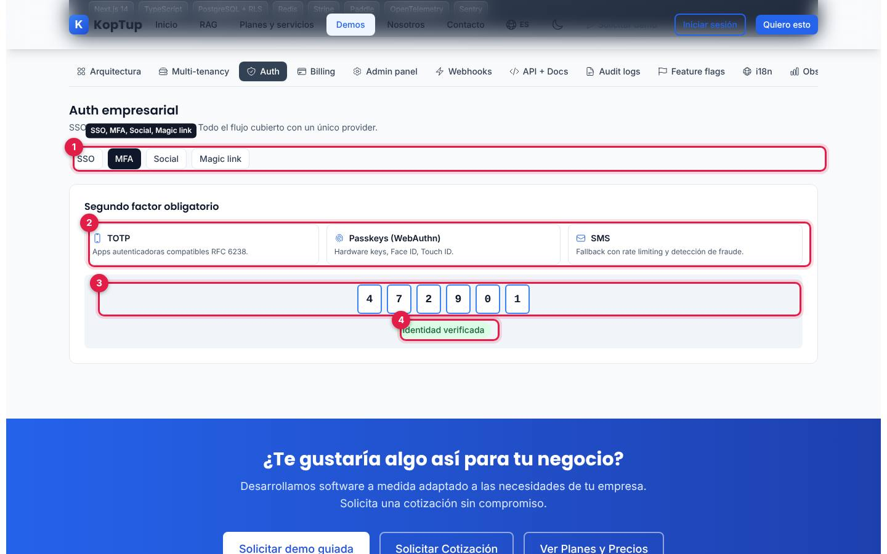

*Pestaña «Auth», método MFA, después de pulsar «Verificar».*

1. **Métodos**: SSO, MFA, Social y Magic link. Cambiar de método borra lo que hayas hecho en el anterior.
2. **Segundo factor**: TOTP (apps autenticadoras), Passkeys (WebAuthn: llaves físicas, Face ID, Touch ID) y SMS de respaldo.
3. **Casillas del código**: vacías hasta pulsar **Verificar**; entonces se llenan solas con 4 7 2 9 0 1. No hay que escribir nada.
4. **Identidad verificada**: el resultado simulado.

Los otros métodos:

- **SSO**: tarjetas SAML 2.0 («Conector genérico para Okta, Azure AD, Google Workspace, Ping»), OIDC y Aprovisionamiento SCIM, y un ejemplo de código del retorno de SAML.
- **Social**: botones Google, GitHub, Apple y Microsoft que no hacen nada.
- **Magic link**: tres pasos (escribe tu email, recibe un enlace firmado válido por 10 minutos, haz clic y queda la sesión activa), un campo de email y **Enviar código**, que muestra «Enlace enviado a tu correo» aunque el campo esté vacío. No se envía nada.

### Paso 4. Planes y pago simulado

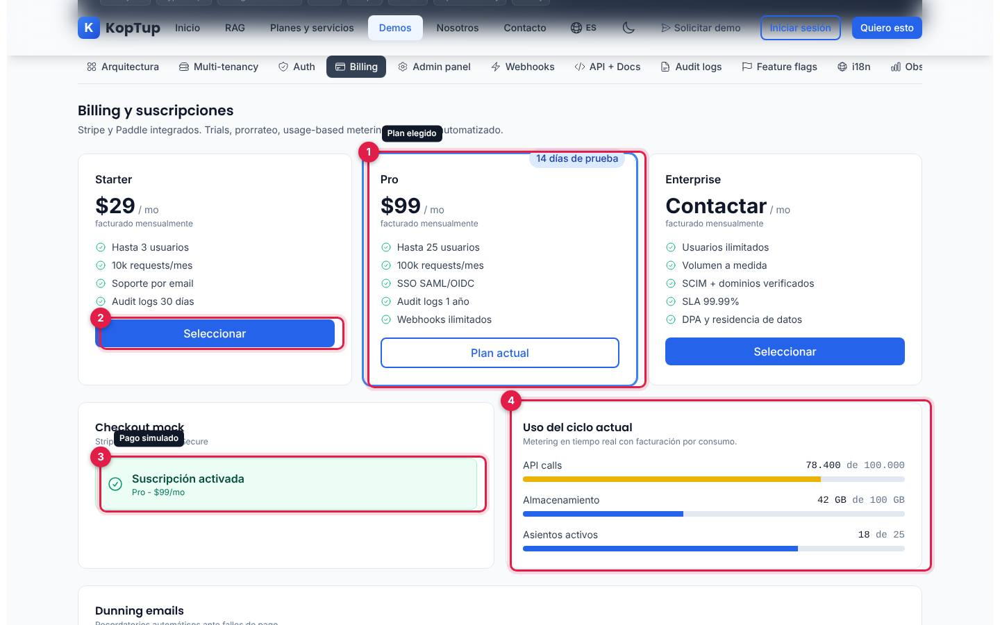

*Pestaña «Billing» después de pagar el plan Pro en el checkout de prueba.*

1. **Plan elegido**: Pro viene marcado como «Plan actual» y con la cinta «14 días de prueba».
2. **Seleccionar** cambia el plan elegido (y reinicia el checkout).
3. **Checkout mock** («Stripe Elements + 3D Secure»): email de facturación, tarjeta (sugiere 4242 4242 4242 4242), MM/AA y CVC. **Pagar y activar** muestra «Procesando pago seguro...» durante 1,4 segundos y luego «Suscripción activada» con el plan y el precio. No valida los campos ni cobra nada.
4. **Uso del ciclo actual**: API calls 78.400 de 100.000 (barra amarilla), almacenamiento 42 GB de 100 GB y 18 de 25 asientos activos. Son cifras fijas.

| Plan | Precio | Incluye |
|---|---|---|
| Starter | $29 / mo | Hasta 3 usuarios, 10k requests/mes, soporte por email, audit logs 30 días |
| Pro | $99 / mo | Hasta 25 usuarios, 100k requests/mes, SSO SAML/OIDC, audit logs 1 año, webhooks ilimitados |
| Enterprise | Contactar / mo | Usuarios ilimitados, volumen a medida, SCIM y dominios verificados, SLA 99.99 %, DPA y residencia de datos |

*Precios de ejemplo de la plantilla, en dólares; no son los precios de KopTup.*

Debajo está **Dunning emails**: los cuatro recordatorios ante un pago fallido (Día 0 «No pudimos cobrar tu suscripción», Día 3 «Recordatorio: actualiza tu método de pago», Día 7 «Tu acceso se suspenderá en 48 horas» y Día 14 «Suscripción cancelada»). Es una lista fija.

Qué decir: «Planes, prueba gratis, cobro por uso y cobranza de pagos fallidos vienen resueltos».

### Paso 5. Impersonar a un cliente para darle soporte

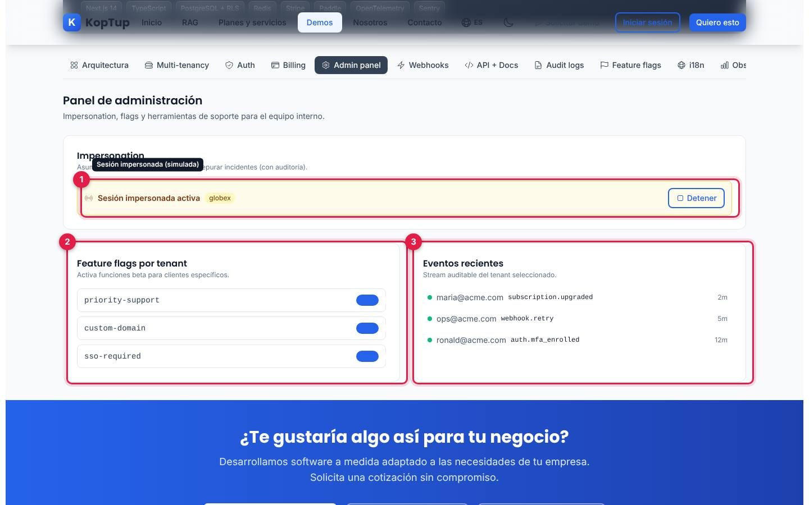

*Pestaña «Admin panel» con una sesión impersonada del tenant globex y el flag custom-domain encendido.*

Antes de la captura: elige el tenant (acme-corp, globex, initech o umbrella), escribe el **Motivo (obligatorio)** y pulsa **Impersonar**.

1. **Sesión impersonada activa** con el tenant elegido y el botón **Detener**, que vuelve al formulario. Es simulada: no se entra a ninguna cuenta y el motivo no se exige de verdad.
2. **Feature flags por tenant**: priority-support, custom-domain y sso-required, con interruptores que solo cambian de posición.
3. **Eventos recientes**: tres eventos fijos (subscription.upgraded, webhook.retry, auth.mfa_enrolled) que no cambian con el tenant elegido.

Qué decir: «Tu equipo de soporte ve lo que ve el cliente, con motivo y auditoría».

### Paso 6. Invitar al equipo

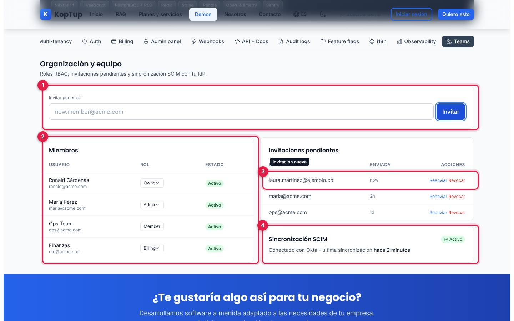

*Pestaña «Teams» después de invitar a laura.martinez@ejemplo.co.*

1. **Invitar por email**: escribe un correo y pulsa **Invitar**. Acepta cualquier texto que no esté vacío.
2. **Miembros**: Ronald Cárdenas (Owner), María Pérez (Admin), Ops Team (Member) y Finanzas (Billing), todos «Activo». El selector de rol (Owner, Admin, Member, Billing, Viewer) cambia, pero no tiene efecto en otra parte.
3. **Invitación nueva**: aparece primera en «Invitaciones pendientes», enviada «now». **Reenviar** y **Revocar** no hacen nada.
4. **Sincronización SCIM**: «Conectado con Okta - última sincronización hace 2 minutos», un texto fijo.

---

## Pantallas y funciones

Las 12 pestañas son independientes. Las que tienen algo que tocar lo guardan solo mientras sigas en ellas: al cambiar de pestaña vuelven a su estado inicial.

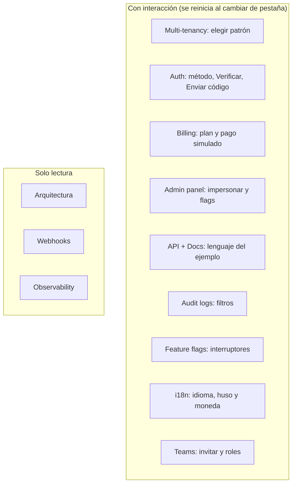

*Mapa de las pestañas. Ninguna llama al servidor.*

### Arquitectura

Ver el [paso 1](#paso-1-la-arquitectura-de-referencia).

### Multi-tenancy

Ver el [paso 2](#paso-2-elegir-cómo-se-aíslan-los-datos-de-cada-cliente).

### Auth

Ver el [paso 3](#paso-3-autenticación-empresarial-mfa).

### Billing

Ver el [paso 4](#paso-4-planes-y-pago-simulado).

### Admin panel

Ver el [paso 5](#paso-5-impersonar-a-un-cliente-para-darle-soporte).

### Webhooks

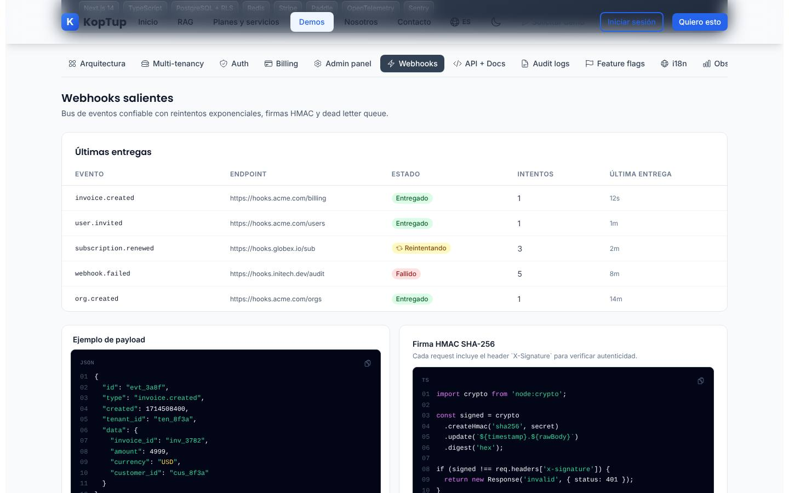

*Últimas entregas, ejemplo de payload y verificación de la firma.*

- **Últimas entregas**: cinco eventos fijos con su endpoint, estado, intentos y última entrega: invoice.created, user.invited y org.created **Entregado** (1 intento), subscription.renewed **Reintentando** (3 intentos, con el ícono girando) y webhook.failed **Fallido** (5 intentos).
- **Ejemplo de payload**: el JSON de un `invoice.created` con `tenant_id`.
- **Firma HMAC SHA-256**: cómo verificar el encabezado `X-Signature` en Node.

### API + Docs

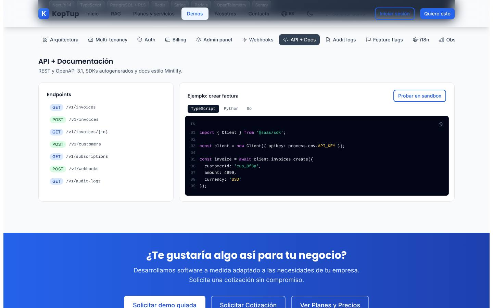

*Lista de endpoints y ejemplo «crear factura» en TypeScript.*

Siete endpoints de ejemplo (`/v1/invoices`, `/v1/customers`, `/v1/subscriptions`, `/v1/webhooks`, `/v1/audit-logs`) y el ejemplo **crear factura** en TypeScript, Python o Go. **Probar en sandbox** no hace nada y el SDK `@saas/sdk` es ilustrativo.

### Audit logs

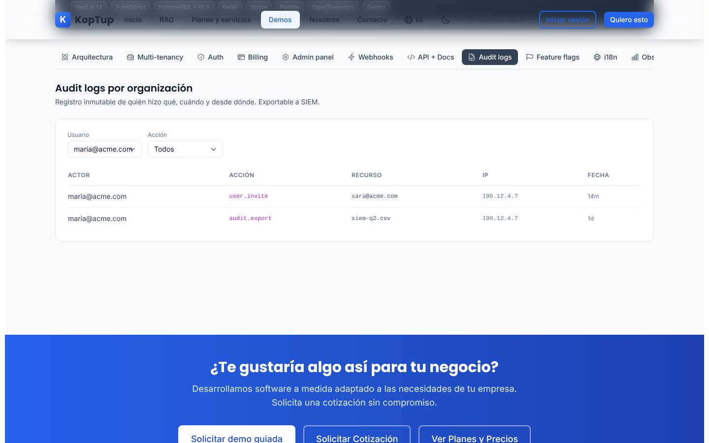

*Registro filtrado por el usuario maria@acme.com.*

Seis registros fijos con actor, acción, recurso, IP y hace cuánto. Se filtran por **Usuario** (ronald@acme.com, maria@acme.com, ops@acme.com, system) y por **Acción** (invoice.create, user.invite, flag.toggle, auth.login, subscription.renew, audit.export). El subtítulo dice «Exportable a SIEM», pero no hay botón de exportar.

### Feature flags

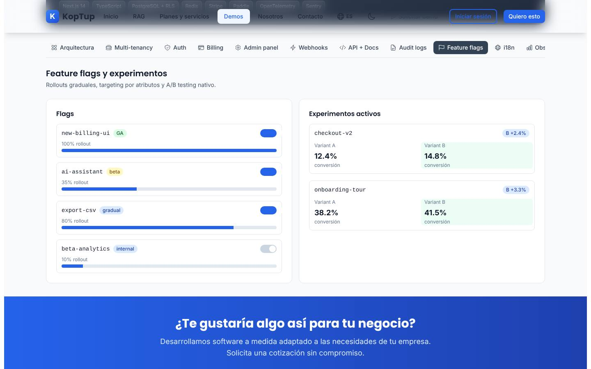

*Cuatro flags con su porcentaje de despliegue y dos experimentos A/B, con ai-assistant encendido.*

- **Flags**: new-billing-ui (GA, 100 %), ai-assistant (beta, 35 %), export-csv (gradual, 80 %) y beta-analytics (internal, 10 %). El interruptor cambia, el porcentaje no.
- **Experimentos activos**: checkout-v2 (A 12.4 %, B 14.8 %) y onboarding-tour (A 38.2 %, B 41.5 %), con la variante ganadora resaltada.

### i18n

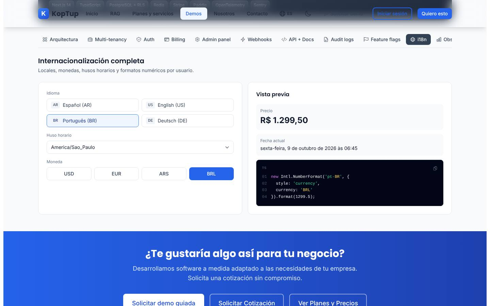

*Portugués de Brasil, hora de São Paulo y reales.*

Elige **Idioma** (Español AR, English US, Português BR, Deutsch DE), **Huso horario** (Buenos Aires, Nueva York, São Paulo, Berlín, Tokio) y **Moneda** (USD, EUR, ARS, BRL). La **Vista previa** formatea de verdad, con el navegador, el precio 1299.5 y la fecha y hora actuales (por ejemplo, «R$ 1.299,50» y «sexta-feira, 9 de outubro de 2026 às 06:45»), y el código de ejemplo se actualiza con lo elegido.

### Observability

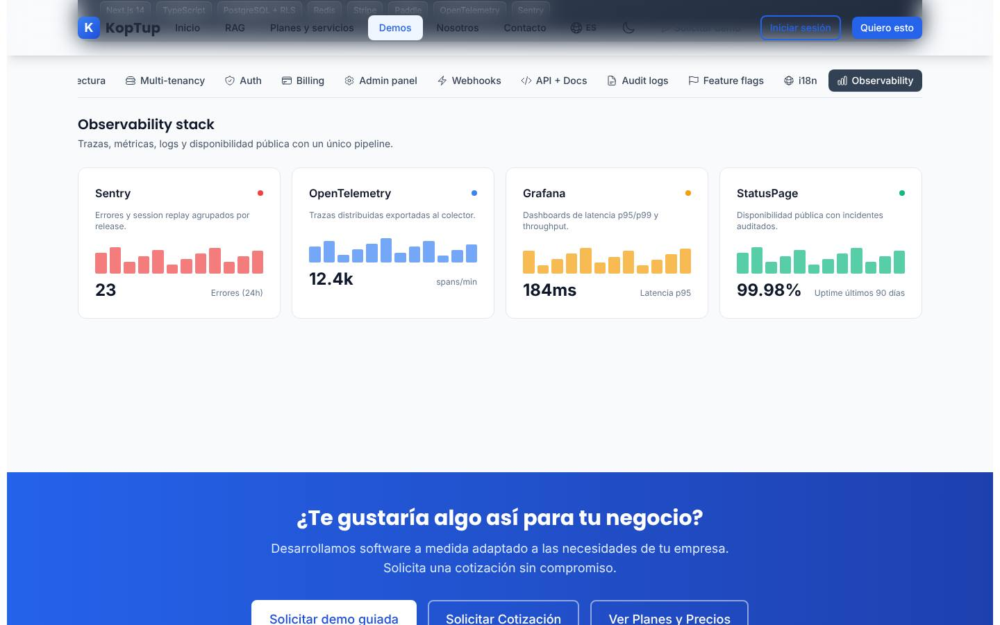

*Cuatro tarjetas con una mini gráfica decorativa.*

Sentry (23 errores en 24 h), OpenTelemetry (12.4k spans/min), Grafana (latencia p95 de 184ms) y StatusPage (99.98 % de disponibilidad en 90 días). Son cifras fijas.

### Teams

Ver el [paso 6](#paso-6-invitar-al-equipo).

### En el celular

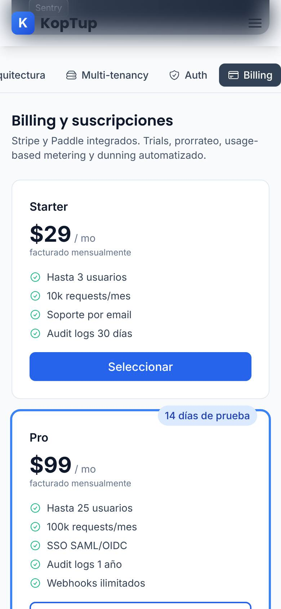

*La pestaña «Billing» en un teléfono (390 px).*

La barra de pestañas se desliza de lado y las tarjetas, tablas y bloques de código se apilan en una columna.

---

## Qué es real y qué es simulado

| Parte | Real o simulado | Detalle |
|---|---|---|
| Arquitectura, patrones de multi-tenancy y fragmentos de código | **Contenido de referencia** | Texto y código de ejemplo; nada se ejecuta. |
| SSO, MFA, inicio con redes sociales y magic link | **Simulados** | No hay inicio de sesión ni envío de códigos o enlaces. |
| Planes, checkout y uso | **Simulados** | No hay Stripe ni Paddle; el pago se «aprueba» siempre. |
| Impersonación, flags, roles e invitaciones | **Solo en la pantalla** | Cambian lo que ves y se pierden al cambiar de pestaña o recargar. |
| Vista previa de i18n | **Real, en el navegador** | Usa el formateo de números y fechas del navegador (`Intl`). |
| Webhooks, API, audit logs, experimentos y observabilidad | **Fijos** | Datos de ejemplo escritos en el código; empresas ficticias (acme, globex, initech). |
| Servidor | **No se usa** | La página no hace ninguna petición. En el repositorio hay un módulo de backend `modules/saas-platform` con datos de ejemplo, pero no está conectado al servidor ni lo usa esta demo. |
| Dónde se guarda | **En ningún lado** | No usa `localStorage`; recargar vuelve todo al inicio. |

---

## Acceso

- **Cómo la ve un visitante:** la demo está en modo **Abierta** (`publico`): cualquiera entra a `/demo/saas-boilerplate` sin cuenta y sin pantalla de acceso. En el hub `/demo` aparece así:

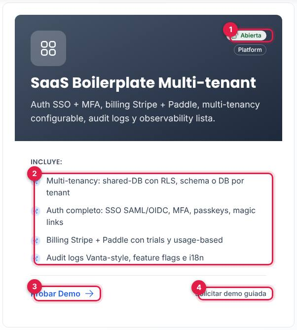

*Tarjeta «SaaS Boilerplate Multi-tenant» en el hub, vista por un visitante sin sesión.*

1. Insignia **Abierta** (junto a «Platform»).
2. Lo que **Incluye** según la tarjeta (ver la [limitación 1](#limitaciones-conocidas)).
3. **Probar Demo** abre `/demo/saas-boilerplate`.
4. **Solicitar demo guiada** abre `/solicitar-demo?demos=saas-boilerplate`.

- **Cómo se solicita:** no hace falta solicitarla. Quien quiera una sesión de arquitectura o una versión con su caso usa **Solicitar demo guiada** (en la tarjeta o en el bloque azul al final de la demo, que también ofrece **Solicitar Cotización** y **Ver Planes y Precios**).
- **Cómo la controla el admin:** el modo sale del catálogo del servidor (allí se llama «Plataforma SaaS multiempresa») y se cambia en **Admin › Catálogo de demos** (`/admin/catalogo-demos`). Si se pasa a «Con solicitud» o «Solo por invitación», los visitantes verán la pantalla de acceso y los accesos se conceden en **Admin › Solicitudes de demo** y **Admin › Accesos a demos**; si se desactiva, el visitante ve que la demo está en mantenimiento y el equipo sigue entrando. Si el backend no responde, la demo sigue abierta porque así está en la tabla de respaldo. Detalle en el [Manual del administrador](Doc-06-Manual-del-Administrador.md) y en [Flujos del visitante](Doc-04-Flujos-del-Visitante.md).

---

## Limitaciones conocidas

1. **Es una vitrina, no una plantilla que se entregue.** El encabezado dice «Production-ready» y «Todo listo desde el día uno», y la tarjeta del hub habla de «Auth completo» y «Billing Stripe + Paddle», pero la demo no ejecuta nada de eso: no hay backend, ni base de datos, ni pasarela de pago detrás. Tampoco tiene la insignia «Datos de ejemplo» que aclare que todo es simulado.
2. **No tiene el botón «Volver al catálogo»** que sí tienen otras demos; para volver al hub hay que usar el menú del sitio.
3. **Errores visibles en los bloques de código.** El resaltador de sintaxis rompe las líneas de comentario, que empiezan con el texto suelto `"text-secondary-500">` (en Multi-tenancy y en el ejemplo SAML de Auth). El patrón «Schema per tenant» muestra `demoSaas.tenancy.patterns.schemaPerTenant.snippet` en lugar del código, porque el texto contiene `${tenantId}` y la librería de traducciones lo toma como una variable (en la consola sale `FORMATTING_ERROR`). El ícono de copiar de los bloques es decorativo.
4. **Botones que no hacen nada:** Google, GitHub, Apple y Microsoft (Auth › Social), Probar en sandbox, Reenviar y Revocar.
5. **Sin validaciones:** Enviar código funciona con el email vacío, Pagar y activar con los campos vacíos, Impersonar sin el motivo «obligatorio», Invitar con cualquier texto y Verificar sin escribir el código.
6. **Cada pestaña se reinicia al salir de ella:** si invitas a alguien en Teams, pasas a Billing y vuelves, la invitación desapareció; lo mismo pasa con la impersonación, el pago y los interruptores.
7. **La barra de pestañas se esconde.** En 1440 px, Observability y Teams quedan cortadas a la derecha sin ninguna pista de que hay más; y al bajar por la página, la barra queda detrás del menú fijo del sitio, así que hay que volver arriba para cambiar de pestaña.
8. **Mucho inglés:** las pestañas (Auth, Billing, Admin panel, Audit logs, Feature flags, Observability, Teams), «Production-ready», «/ mo», «Checkout mock», «Variant A», «now», «2h», los nombres de eventos y acciones.
9. **Enterprise sin precio:** su tarjeta dice «Contactar / mo» y, si lo «pagas» en el checkout, la confirmación dice «Enterprise - Contactar/mo».
10. **Detalles de datos:** la diferencia de los experimentos se muestra como «B +2.4%» cuando son puntos porcentuales (14.8 % − 12.4 %); los precios están en dólares y la vista de i18n ofrece Argentina y Brasil pero no Colombia (ni `es-CO`, ni COP, ni la hora de Bogotá).
11. **Tres nombres para la misma demo:** «SaaS Boilerplate Multi-tenant» en el hub y en la página, «Plataforma SaaS multiempresa» en el catálogo del admin y en el formulario de solicitud, y «Plataforma SaaS multi-tenant» en el plan.
12. **«Ver Planes y Precios»** del bloque final lleva a `/services#planes-rag`, que abre en los planes RAG.
