# Guía de la demo: Extracción y monitoreo de datos

> Ruta `/demo/scraping` · Modo de acceso: **Abierta** · Tipo: **datos de ejemplo** (todo corre en el navegador: la extracción de precios con selectores CSS es real, pero sobre tres tiendas ficticias que genera la propia demo; las otras fuentes leen archivos de ejemplo; no llama al servidor ni a IA) · Plan del producto: [Extracción y monitoreo de datos](Producto-scraping-extraccion.md)

**Resumen.** Es el tablero de monitoreo de una empresa ficticia de Pereira («Suministros Demo del Café S.A.S.») con cuatro fuentes: un radar de contratación pública, los precios de tres tiendas de la competencia, la normativa de entidades que sigue y los documentos de sus proveedores. Muestra cómo se arma un extractor con clics, qué cambió desde ayer, qué alertas se disparan, cómo se descargan los datos y la ficha legal de cada fuente. Está pensada para gerentes comerciales, de compras o de licitaciones que necesitan enterarse a tiempo de lo que pasa afuera. Lleva la insignia «Datos de ejemplo», un recorrido guiado propio y guarda lo que hagas solo en tu navegador.

**En esta página:** [Recorrido sugerido](#recorrido-sugerido-demo-comercial-de-5-minutos) · [Pantallas y funciones](#pantallas-y-funciones) · [Qué es real y qué es simulado](#qué-es-real-y-qué-es-simulado) · [Acceso](#acceso) · [Limitaciones conocidas](#limitaciones-conocidas)

*Vista inicial: encabezado con «Datos de ejemplo» y «Extracción responsable», las siete pestañas, la lista «Mis fuentes», el recorrido sugerido y el resumen del radar de contratación.*

---

## Recorrido sugerido (demo comercial de 5 minutos)

La demo trae su propio **Recorrido sugerido** de cinco pasos (arriba del contenido, con el contador «0 de 5»); cada tarjeta lleva a la fuente y la pestaña que toca. El recorrido de esta guía sigue esos pasos y agrega uno para mostrar una actualización en vivo. La idea que vende: «te enteras primero de las licitaciones y de los cambios de precio, con datos que puedes usar y sin riesgos legales». La demo funciona con un reloj fijo: «hoy» es el **jueves 8 de octubre de 2026, 8:15 a. m.**

Antes de presentar, si la demo ya se usó en ese navegador, pulsa **Reiniciar demo** (abajo de «Mis fuentes») para volver a los datos de ejemplo.

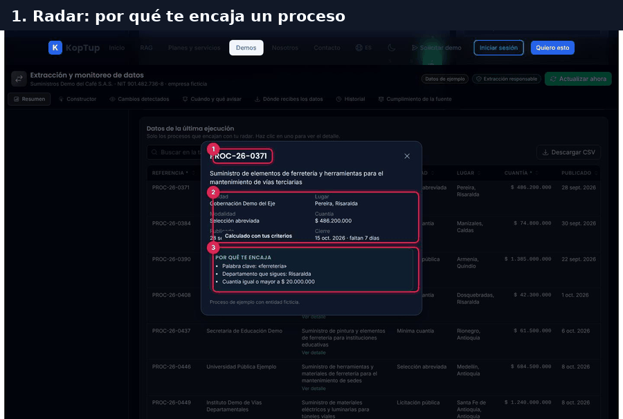

*Recorrido completo en seis cuadros: radar, constructor, cambios, actualización, entrega de datos y ficha legal.*

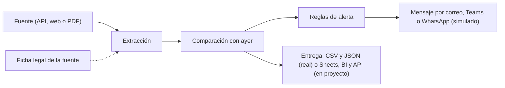

*El camino de los datos que cuenta la demo. Cada fuente tiene además su historial y su ficha de cumplimiento.*

### Paso 1. Radar de contratación: por qué te encaja un proceso

Con la fuente **Radar de contratación pública** abierta en **Resumen**, baja a «Datos de la última ejecución» y haz clic en cualquier fila.

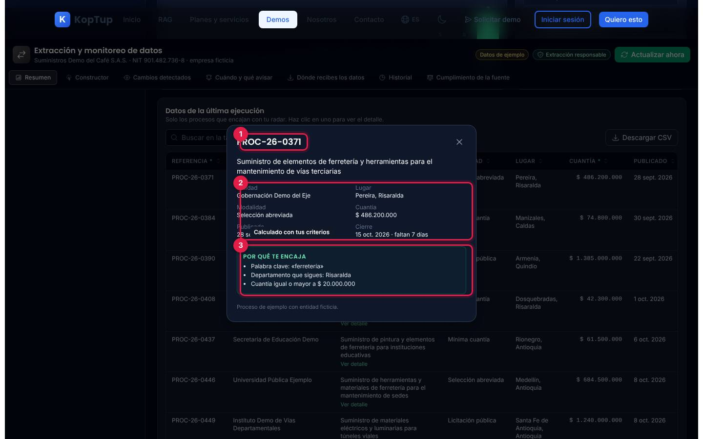

*Detalle del proceso PROC-26-0371 con las razones por las que entró al radar.*

1. **Referencia** del proceso (entidades y procesos ficticios).
2. **Datos del proceso**: entidad, lugar, modalidad, cuantía, fecha de publicación y cierre con los días que faltan («faltan 7 días»).
3. **Por qué te encaja**: la palabra clave que encontró («ferretería»), el departamento que sigues y la cuantía mínima. Se calcula con tus criterios de la pestaña [Constructor](#constructor).

Qué decir: «No es una lista de todo lo que se publica: solo lo que encaja con lo que vendes». La tabla muestra 9 de los 15 procesos del archivo de ejemplo del día.

### Paso 2. Crea un campo con un clic

Elige **Precios de la competencia** en «Mis fuentes» y abre **Constructor**. Con **Selección activa**, haz clic en «Envío gratis» de la tienda de ejemplo y luego pulsa **Guardar configuración**.

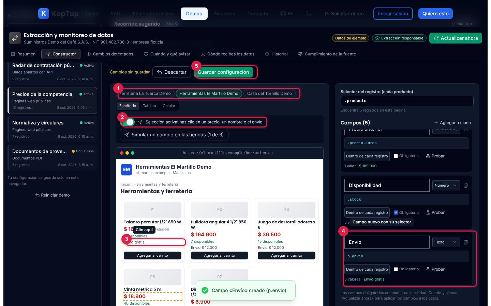

*El clic en «Envío gratis» creó el campo «Envío» con el selector `p.envio` y ya muestra 5 valores.*

1. **Tienda de ejemplo**: Ferretería La Tuerca Demo, Herramientas El Martillo Demo (la que abre) o Casa del Tornillo Demo. Debajo, el ancho de la vista previa: Escritorio, Tableta o Celular.
2. **Modo selección**: al pasar el mouse resalta el elemento con línea punteada; al hacer clic lo convierte en campo. Los enlaces de la página no navegan.
3. **Elemento elegido**: «Envío gratis».
4. **Campo nuevo**: nombre sugerido («Envío»), tipo, selector CSS, cuántos valores encontró y el primero de ellos.
5. **Guardar configuración**: aplica los campos en la próxima ejecución. Mientras no guardes, aparece «Cambios sin guardar» y **Descartar** vuelve a lo guardado.

Qué decir: «No hace falta programar: apuntas y haces clic. Si la tienda cambia su página, lo vemos en la calidad».

### Paso 3. Mira el cambio de precio

Abre **Cambios detectados**. La comparación es campo por campo entre la ejecución de ayer (7 oct., 6:05 a. m.) y la de hoy.

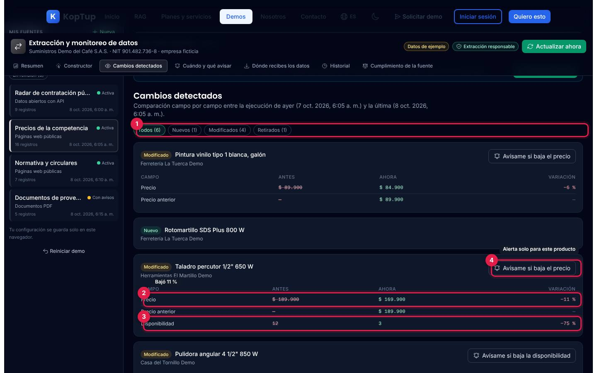

*Seis cambios en precios: uno nuevo, cuatro modificados y uno retirado. El taladro de Herramientas El Martillo Demo bajó 11 %.*

1. **Filtro por tipo**: Todos, Nuevos, Modificados y Retirados, con su número.
2. **Precio**: de $ 189.900 a $ 169.900, variación −11 %.
3. **Disponibilidad**: de 12 a 3 unidades (−75 %).
4. **Avísame si baja el precio**: crea una regla de alerta **solo para ese producto en esa tienda**; el botón pasa a «Alerta creada». En la disponibilidad aparece «Avísame si baja la disponibilidad».

Arriba aparece un aviso azul: «Hay cambios desde la última ejecución…», porque guardaste un campo nuevo en el paso 2. Eso lleva al paso 4.

### Paso 4. Simula un cambio y actualiza

Vuelve a **Constructor**, pulsa **Simular un cambio en las tiendas (1 de 3)** y luego **Actualizar ahora** (arriba a la derecha).

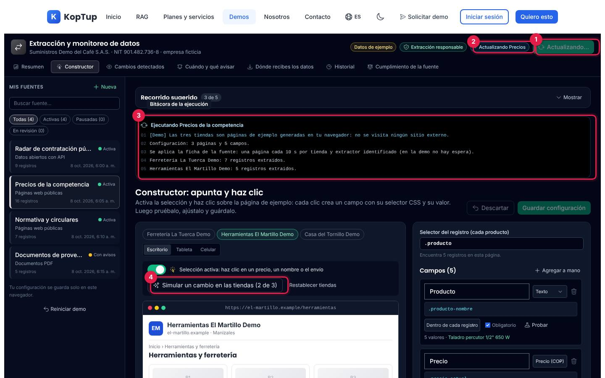

*La ejecución en curso: la bitácora aparece línea por línea.*

1. **Actualizando…**: el botón gira y queda bloqueado hasta terminar.
2. **Actualizando Precios**: insignia de la fuente que se está ejecutando.
3. **Bitácora**: una línea cada 0,4 segundos: aviso de que las tiendas son de ejemplo, configuración (3 páginas y 5 campos), la ficha de la fuente aplicada, registros por tienda, la comparación y el resultado. Al final, un aviso abajo: «Precios de la competencia: 16 registros y 7 cambios».
4. **Simular un cambio** (ahora «2 de 3»): cada clic aplica un cambio de ejemplo a las tiendas: (1) La Tuerca baja el taladro a $ 164.900, (2) Casa del Tornillo lo agota y (3) El Martillo publica la pintura vinilo. **Restablecer tiendas** los deshace.

Después de actualizar, **Cambios detectados** muestra 7 cambios: el taladro de La Tuerca (−8 %) y el envío del taladro de El Martillo («Envío $ 12.000» → «Envío gratis»), detectado gracias al campo que creaste.

### Paso 5. Descarga el CSV

Abre **Dónde recibes los datos** y pulsa **Descargar CSV**.

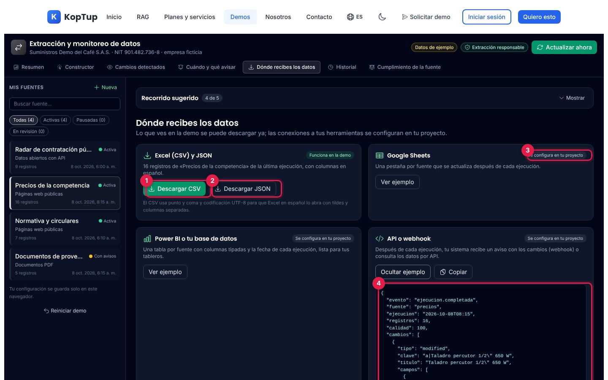

*Las cuatro formas de recibir los datos, con el ejemplo del aviso por API abierto.*

1. **Descargar CSV**: baja `koptup-demo-precios-2026-10-08.csv` con columnas en español (Tienda, Producto, Precio, Precio anterior, Disponibilidad y los campos que agregues), separado por punto y coma y en UTF-8 para que Excel en español lo abra bien.
2. **Descargar JSON**: los mismos registros en JSON.
3. **Se configura en tu proyecto**: Google Sheets, Power BI o base de datos y API o webhook. **Ver ejemplo** muestra cómo quedaría cada uno con tus datos (una hoja, las columnas con su tipo o el aviso).
4. **Ejemplo del aviso** (webhook): evento «ejecucion.completada» con la fuente, la hora, los registros, la calidad, hasta tres cambios y un registro de muestra. **Copiar** lo copia.

El CSV también se descarga desde la tabla del **Resumen**. Abajo, **Configurar alertas** lleva a «Cuándo y qué avisar».

### Paso 6. Revisa la ficha legal

Pulsa la insignia **Extracción responsable** del encabezado (o la pestaña **Cumplimiento de la fuente**).

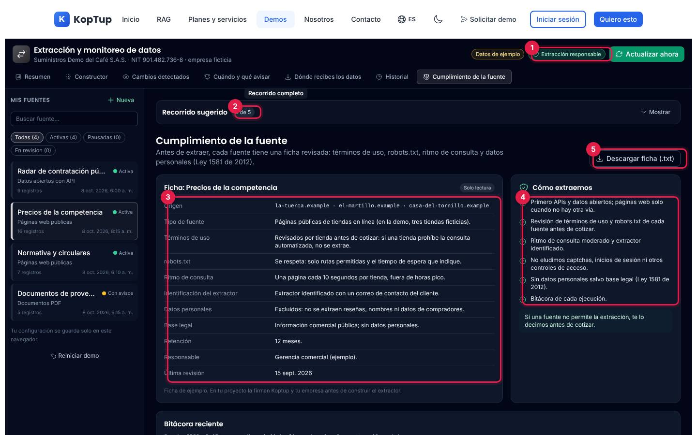

*Ficha de cumplimiento de la fuente de precios y el recorrido completo («5 de 5»).*

1. **Extracción responsable**: abre esta pestaña desde cualquier lugar.
2. **Recorrido sugerido**: con los cinco pasos hechos marca «5 de 5».
3. **Ficha de la fuente** (solo lectura): origen, tipo de fuente, términos de uso, robots.txt, ritmo de consulta, identificación del extractor, datos personales, base legal (Ley 1581 de 2012), retención, responsable y fecha de la última revisión.
4. **Cómo extraemos**: primero APIs y datos abiertos, revisión de términos y robots.txt antes de cotizar, ritmo moderado, «no eludimos captchas, inicios de sesión ni otros controles de acceso», sin datos personales salvo base legal y bitácora de cada ejecución.
5. **Descargar ficha (.txt)**: baja la ficha con las últimas ocho ejecuciones de la fuente (incluidas las tuyas).

Para cerrar: **Pide una extracción de prueba** (en el recorrido) abre `/contact?service=scraping-extraccion`; o el bloque azul del final, **Solicitar demo guiada**.

---

## Pantallas y funciones

### Encabezado y pestañas

Ver la [vista general](#guía-de-la-demo-extracción-y-monitoreo-de-datos). En escritorio, el encabezado se queda fijo arriba al bajar.

| Elemento | Qué hace |
|---|---|
| **Datos de ejemplo** | Al pasar el mouse: la empresa, las entidades, las tiendas, los proveedores y las cifras son ficticios; fecha de corte 8 oct. 2026. |
| **Extracción responsable** | Abre «Cumplimiento de la fuente». Desactivado en fuentes nuevas. |
| **Actualizar ahora** | Ejecuta la fuente abierta con tu configuración ([paso 4](#paso-4-simula-un-cambio-y-actualiza)). Desactivado si la fuente está pausada, si es una fuente nueva o mientras corre otra ejecución. |
| **Pestañas** | Resumen, Constructor, Cambios detectados, Cuándo y qué avisar, Dónde recibes los datos, Historial y Cumplimiento de la fuente. Se aplican a la fuente elegida. |

### Mis fuentes y Recorrido sugerido

- **Mis fuentes** (columna izquierda): las cuatro fuentes con su tipo (Datos abiertos con API, Páginas web públicas o Documentos PDF), estado (Activa, Con avisos, Con error, Pausada o En revisión), registros y hora de la última ejecución. Buscador y filtros Todas, Activas, Pausadas y En revisión. **+ Nueva** abre el [asistente de fuente nueva](#fuente-nueva). **Reiniciar demo** pide confirmación y borra todo lo que hiciste.
- **Recorrido sugerido**: cinco tarjetas (Radar de contratación, Crea un campo con un clic, Mira el cambio de precio, Descarga el CSV y Revisa la ficha legal). Un clic lleva al lugar exacto; cada una se marca con ✓ al hacerla. **Ocultar** lo reduce a una línea con el contador.

### Resumen

Común a las cuatro fuentes:

- **Aviso azul** con lo que es simulado en esa fuente.
- **Cinco indicadores**: registros, nuevos hoy, otros cambios, calidad (campos obligatorios completos o documentos validados) y última actualización (programada o manual).
- **Registros por ejecución (últimos 14 días)**: barras de una ejecución al día; la de hoy es tu última ejecución.
- **Alertas de hoy**: las reglas activas que se cumplen con la última ejecución. **Configurar** abre «Cuándo y qué avisar».
- **Datos de la última ejecución**: tabla con búsqueda, orden por columna (clic en el título) y **Descargar CSV**. El asterisco marca los campos obligatorios.
- **Pausar fuente** / **Reanudar**: una fuente pausada no se ejecuta ni con «Actualizar ahora».

| Fuente | Qué muestra la tabla | Acciones propias |
|---|---|---|
| Radar de contratación pública | 9 procesos que encajan (de 15 del día), con referencia, entidad, objeto, modalidad, lugar, cuantía, fechas, estado y palabra clave | Clic en una fila: detalle y «Por qué te encaja» ([paso 1](#paso-1-radar-de-contratación-por-qué-te-encaja-un-proceso)) |
| Precios de la competencia | 16 productos de las tres tiendas con tus campos | — |
| Normativa y circulares | 7 normas de cuatro entidades ficticias, con enlace al PDF de ejemplo | Enviar al asistente (ver abajo) |
| Documentos de proveedores | 5 documentos (RUT, certificados y una factura) con NIT, razón social, CIIU, confianza y estado | Corregir o Aprobar los que están en revisión (ver abajo) |

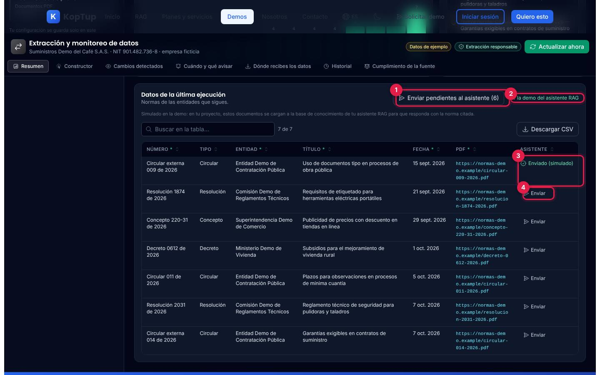

*Fuente «Normativa y circulares» con una norma ya enviada al asistente.*

1. **Enviar pendientes al asistente (6)**: marca todas como enviadas.
2. **Ver la demo del asistente RAG**: abre `/demo/chatbot`.
3. **Enviado (simulado)**: la norma queda marcada. No se carga nada en el asistente: es una marca en la demo.
4. **Enviar**: envía una sola norma.

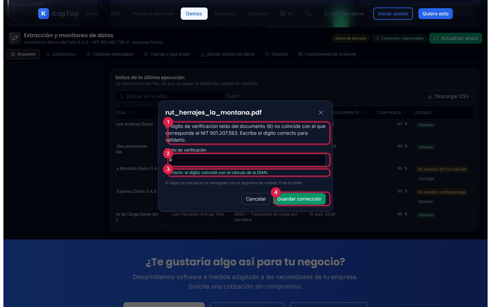

*Corrección del NIT de un RUT de ejemplo cuyo dígito de verificación no coincide.*

1. **Explicación**: el dígito leído del documento (6) no corresponde al NIT 901.207.583.
2. **Dígito de verificación**: escribe uno (de 0 a 9). Si no es el correcto, avisa «tampoco corresponde».
3. **Correcto**: el dígito coincide con el cálculo de la DIAN (módulo 11, hecho en tu navegador).
4. **Guardar corrección**: el documento pasa a «Revisado por una persona». Para el documento con confianza baja (62 %), el botón es **Aprobar**, después de revisarlo contra el PDF.

### Constructor

Cambia según la fuente:

| Fuente | Qué se configura |
|---|---|
| Precios de la competencia | El constructor por clic del [paso 2](#paso-2-crea-un-campo-con-un-clic): tienda, ancho de la vista previa, modo selección, simulación de cambios, **selector del registro** (`.producto`, cuántos registros encuentra) y la lista de campos. Cada campo tiene nombre, tipo (Texto, Número, Precio en COP, Enlace o Imagen), selector CSS, dónde se busca (dentro de cada registro o en toda la página), **Obligatorio** (cuenta para la calidad), **Probar** (resalta en verde lo que encuentra) y la papelera. **Agregar a mano** crea un campo vacío. Abajo, la vista previa de la extracción en **Tabla** o **JSON** y la nota de que la demo no usa IA. |
| Radar de contratación | Palabras clave (por defecto ferretería, herramientas, pintura, materiales eléctricos y tubería), departamentos (Risaralda, Caldas, Quindío, Antioquia y Valle del Cauca; el último sin marcar) y cuantía mínima ($ 20.000.000). A la derecha, «Con estos criterios encajan 9 de 15 procesos de hoy», con el motivo de los que no encajan. |
| Normativa y circulares | Entidades que sigues (cuatro ficticias) y una palabra clave opcional. A la derecha, qué normas se siguen. |
| Documentos de proveedores | Umbral de confianza (de 50 % a 99 %, por defecto 80 %), columnas a extraer («Representante legal» marcado como dato personal) y un RUT de ejemplo con los datos resaltados. |

En todas, los cambios se aplican en la próxima ejecución (aparece el aviso azul para pulsar **Actualizar ahora**).

**Prueba con tu HTML** (al final del constructor de precios): pulsa **Abrir**, pega el HTML de una página o pulsa **Usar un ejemplo** (un directorio de tres proveedores ficticios) y crea campos con clics, igual que en las tiendas. El HTML se procesa solo en el navegador: se quitan scripts, estilos, formularios y marcos, las imágenes no se descargan y se toman como máximo 300.000 caracteres. Se puede descargar el resultado como `koptup-demo-tu-html.csv`.

### Cambios detectados

Ver el [paso 3](#paso-3-mira-el-cambio-de-precio). Cada cambio dice si es nuevo, modificado o retirado y, si es modificado, la tabla campo, antes, ahora y variación. Los botones «Avísame…» aparecen en precios (precio o disponibilidad) y en el radar («Avísame antes del cierre»). Al pie, una nota sobre cómo se comparan los datos de esa fuente.

### Cuándo y qué avisar

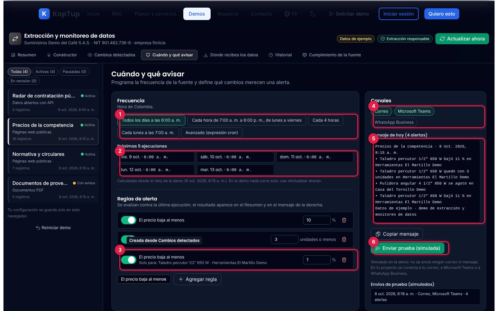

*Frecuencia, reglas y canales de la fuente de precios, con un envío de prueba hecho por correo y Teams.*

1. **Frecuencia**: todos los días a las 6:00 a. m. (por defecto), cada hora de 7 a. m. a 6 p. m. entre semana, cada 4 horas, cada lunes a las 7:00 a. m. o **Avanzado (expresión cron)**, que valida la expresión y explica el formato.
2. **Próximas 5 ejecuciones**: calculadas desde el reloj de la demo. Nada corre solo: hay que usar «Actualizar ahora».
3. **Reglas de alerta**: interruptor, valor y papelera. Esta regla se creó desde Cambios detectados y aplica «Solo para» un producto. **Agregar regla** suma una del tipo elegido.
4. **Canales**: Correo, Microsoft Teams y WhatsApp Business (se pueden elegir varios).
5. **Mensaje de hoy**: el texto que se enviaría con las alertas que se cumplen. **Copiar mensaje** lo copia.
6. **Enviar prueba (simulada)**: no envía nada; agrega una línea a «Envíos de prueba (simulados)» con la hora, los canales y el número de alertas.

| Fuente | Tipos de regla |
|---|---|
| Precios | El precio baja al menos X % · La disponibilidad baja a X unidades o menos |
| Radar | Proceso nuevo con cuantía desde $ X · Un proceso que encaja cierra en X días o menos |
| Normativa | Norma nueva que contenga una palabra (o cualquiera) |
| Documentos | Un documento queda en revisión |

### Dónde recibes los datos

Ver el [paso 5](#paso-5-descarga-el-csv). Solo «Excel (CSV) y JSON» lleva la etiqueta **Funciona en la demo**; Google Sheets, Power BI y API o webhook muestran un ejemplo y dicen **Se configura en tu proyecto**.

### Historial

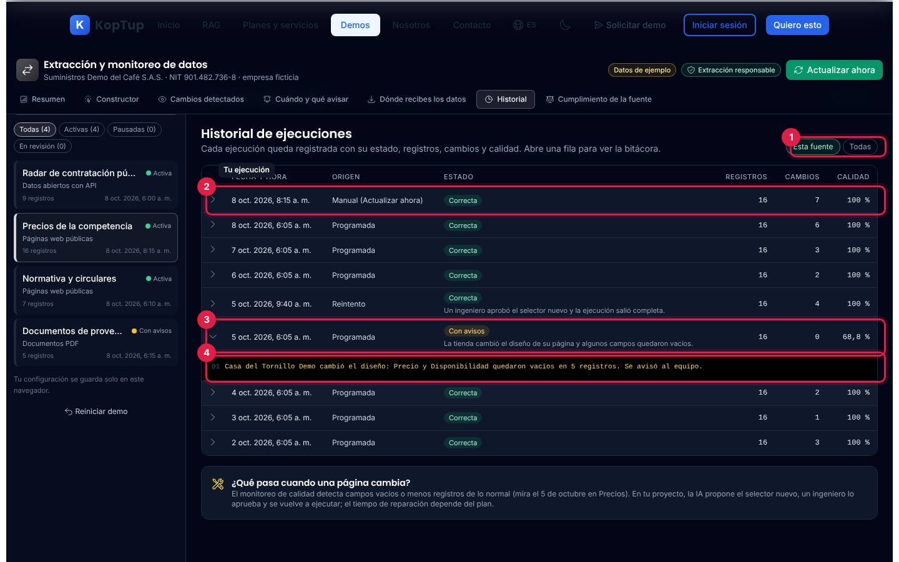

*Historial de la fuente de precios con la ejecución «Con avisos» del 5 de octubre abierta.*

1. **Esta fuente / Todas**: filtra por la fuente abierta o muestra las cuatro (con una columna más).
2. **Tu ejecución**: las que haces con «Actualizar ahora» aparecen como «Manual (Actualizar ahora)».
3. **Ejecución con avisos**: el 5 de octubre una tienda cambió el diseño de su página y la calidad bajó a 68,8 %; a las 9:40 a. m. un reintento salió completo.
4. **Bitácora**: la flecha de cada fila muestra sus líneas.

Abajo, «¿Qué pasa cuando una página cambia?» explica la reparación en un proyecto real. En el radar hay otro caso de ejemplo: el 3 de octubre la API no respondió y se reintentó a los 10 minutos.

### Cumplimiento de la fuente

Ver el [paso 6](#paso-6-revisa-la-ficha-legal). Cada fuente tiene su propia ficha: por ejemplo, la del radar dice que se consulta la API oficial de datos abiertos (Ley 1712 de 2014) y la de documentos que solo se extrae el nombre del representante legal si lo eliges (Ley 1581 de 2012). Abajo, «Bitácora reciente» lista las últimas ocho ejecuciones.

### Fuente nueva

**+ Nueva** abre un asistente de tres pasos: (1) nombre, tipo de fuente y dirección (una URL completa con `https://`, o la carpeta donde llegan los documentos); (2) los datos que necesitas, con sugerencias según el tipo y la opción de agregar otros; (3) frecuencia y dónde quieres recibir los datos. **Guardar fuente** la deja **en revisión**.

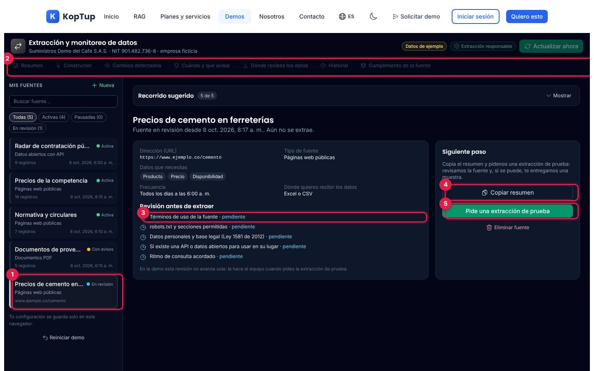

*Fuente «Precios de cemento en ferreterías» creada con el asistente.*

1. **La fuente nueva** aparece en «Mis fuentes» con el estado «En revisión».
2. **Pestañas y «Actualizar ahora»** quedan desactivados: la fuente no se extrae.
3. **Revisión antes de extraer**: términos de uso, robots.txt, datos personales, si hay API o datos abiertos y ritmo de consulta, todos «pendiente». En la demo esta revisión no avanza.
4. **Copiar resumen**: copia los datos de la fuente como solicitud.
5. **Pide una extracción de prueba**: abre `/contact?service=scraping-extraccion`. **Eliminar fuente** la borra.

La demo no visita la dirección que escribes. Se conservan como máximo las diez fuentes nuevas más recientes.

### En el celular

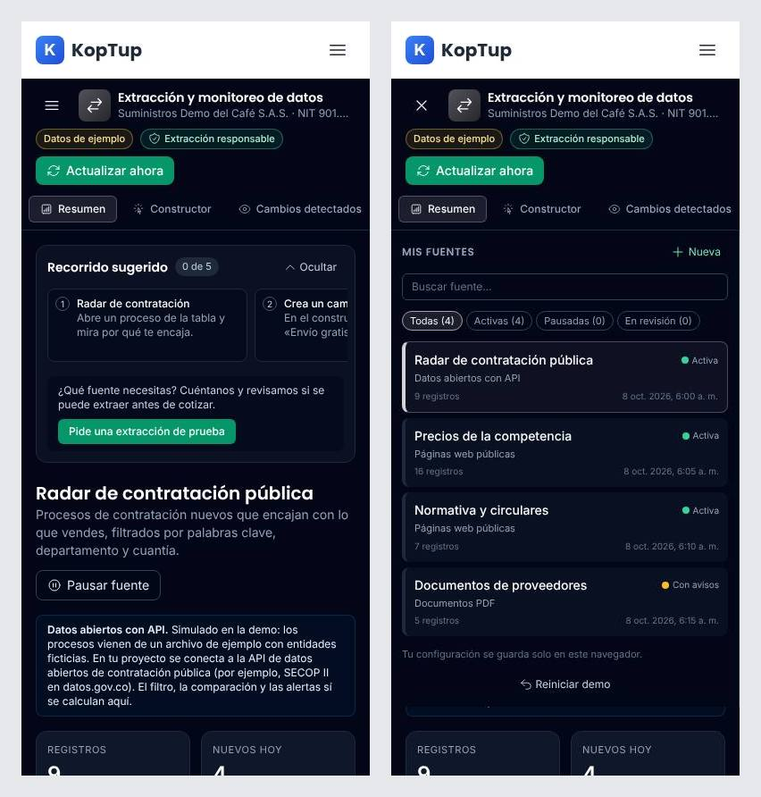

*A 390 px. Izquierda: la vista inicial. Derecha: «Mis fuentes» abierto con el botón de menú.*

El encabezado se acomoda en varias líneas, las pestañas se desplazan de lado y «Mis fuentes» se abre con el botón ☰ del encabezado de la demo (se cierra al elegir una fuente o con la X). Las tablas se deslizan de lado dentro de su recuadro; la página no se desborda a lo ancho.

---

## Qué es real y qué es simulado

| Parte | Real o simulado | Detalle |
|---|---|---|
| Empresa, entidades, procesos, tiendas, normas, proveedores, documentos e historial anterior | **Datos de ejemplo** | Escritos en el código de la página; las tiendas usan dominios `.example`, que no existen. |
| Extracción de precios | **Real, en el navegador** | Tus selectores CSS se aplican sobre el HTML de las tres tiendas ficticias que genera la demo. No se visita ningún sitio externo. |
| Radar, normativa y documentos | **Archivo de ejemplo** | Lo dice el aviso azul de cada fuente. El filtro del radar, el seguimiento por entidad y palabra clave, el dígito de verificación del NIT y el umbral de confianza **sí se calculan**. |
| Comparación con ayer, calidad, reglas de alerta y próximas ejecuciones (cron) | **Cálculo real** | Se hacen en el navegador con tu configuración. |
| Lectura de PDF (OCR) e IA | **No hay** | La demo lo aclara: en un proyecto, la lectura de PDF y la propuesta de selectores nuevos usarían IA con aprobación de un ingeniero. |
| Envío de alertas, Google Sheets, Power BI, API o webhook y envío al asistente RAG | **Simulado** | Muestran cómo quedaría; no se conectan a nada. |
| CSV, JSON, ficha (.txt) y «Prueba con tu HTML» | **Real** | Los archivos se generan en el navegador; el HTML pegado no sale del equipo. |
| Reloj | **Fijo** | 8 oct. 2026, 8:15 a. m. (hora de Colombia); cada ejecución manual queda registrada dos minutos después de la anterior. |
| Dónde quedan tus cambios | **Solo en ese navegador** | Se guardan en el almacenamiento local (`demo:scraping:v1`) y siguen ahí al volver; **Reiniciar demo** los borra. Otra persona, otro equipo o una ventana privada ve los datos de ejemplo. |

---

## Acceso

- **Cómo la ve un visitante:** la demo está en modo **Abierta** (`publico`): cualquiera entra a `/demo/scraping` sin cuenta y sin pantalla de acceso. En el hub `/demo` aparece así:

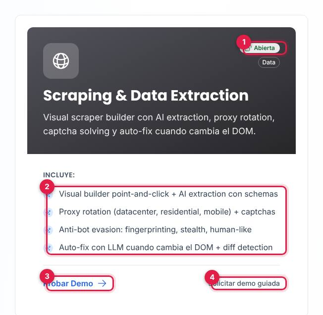

*Tarjeta «Scraping & Data Extraction» en el hub, vista por un visitante sin sesión.*

1. Insignia **Abierta** (junto a «Data»).
2. Lo que **Incluye** según la tarjeta (ver la [limitación 1](#limitaciones-conocidas)).
3. **Probar Demo** abre `/demo/scraping`.
4. **Solicitar demo guiada** abre `/solicitar-demo?demos=scraping`.

- **Cómo se solicita:** no hace falta solicitarla. Quien quiera una prueba con su propia fuente usa **Pide una extracción de prueba** (dentro de la demo) o **Solicitar demo guiada** (en la tarjeta o en el bloque azul al final de la demo, que también ofrece **Solicitar Cotización** y **Ver Planes y Precios**).
- **Cómo la controla el admin:** el modo sale del catálogo del servidor y se cambia en **Admin › Catálogo de demos** (`/admin/catalogo-demos`), donde figura como «Extracción de datos web». Si se pasa a «Con solicitud» o «Solo por invitación», los visitantes verán la pantalla de acceso y los accesos se conceden en **Admin › Solicitudes de demo** y **Admin › Accesos a demos**; si se desactiva, el visitante ve que la demo está «En mantenimiento» y el equipo de KopTup sigue entrando. Si el backend no responde, la demo sigue abierta porque así está en la tabla de respaldo. Detalle en el [Manual del administrador](Doc-06-Manual-del-Administrador.md) y en [Flujos del visitante](Doc-04-Flujos-del-Visitante.md).

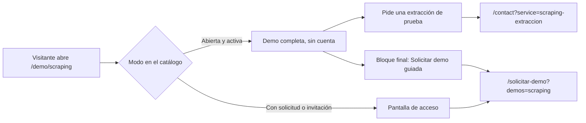

*Hoy la demo toma la rama de arriba; la pantalla de acceso solo aparece si el admin cambia el modo.*

---

## Limitaciones conocidas

En nuestra revisión no encontramos botones que no hagan nada: todos responden, y lo que es simulado lo dice en pantalla. Lo que conviene saber:

1. **La tarjeta del hub contradice a la demo.** Promete «proxy rotation», «captcha solving», «anti-bot evasion: fingerprinting, stealth» y extracción y reparación con IA, mientras la demo dice que no usa IA y que «no eludimos captchas, inicios de sesión ni otros controles de acceso». Además el nombre cambia según dónde se mire: «Scraping & Data Extraction» en el hub, «Extracción y monitoreo de datos» en la demo y «Extracción de datos web» en el catálogo del admin.
2. **Solo la fuente de precios extrae de verdad**, y sobre tiendas ficticias. El radar, la normativa y los documentos leen archivos de ejemplo (la demo lo avisa en cada fuente).
3. **Mensajes de alerta repetidos.** Si creas una alerta para un producto que ya cubre la regla general (por ejemplo, «Avísame si baja el precio» del taladro, que también cumple «baja al menos 10 %»), el mensaje de hoy y el Resumen muestran la misma línea dos veces.
4. **Las fuentes nuevas no avanzan.** Quedan «En revisión» para siempre, con las pestañas y «Actualizar ahora» desactivados; sirven para dejar el pedido y copiar el resumen.
5. **Doble punto en un texto:** el panel de una fuente nueva dice «Fuente en revisión desde 8 oct. 2026, 8:17 a. m.. Aún no se extrae.».
6. **Reloj fijo.** El «hoy» es el 8 de octubre de 2026 y nada se ejecuta solo con la frecuencia programada; cada ejecución manual queda registrada dos minutos después de la anterior (8:15, 8:17, 8:19…), no a la hora real.
7. **El estado vive en un solo navegador.** Lo que configures no lo ve otra persona ni otro equipo; en una ventana privada o con el almacenamiento bloqueado, la demo funciona pero no guarda.
8. **«Enviar al asistente» no conecta con la demo del chatbot:** el enlace abre `/demo/chatbot`, pero las normas no llegan allí.
