# Guía de la demo: Motor de reglas del auditor

> Ruta `/demo/sistema-experto` · Modo de acceso: **Solo por invitación** · Tipo: **backend real + datos de ejemplo** (el simulador corre en el navegador) · Plan del producto: [Motor de reglas del auditor](Demo-sistema-experto.md)

**Resumen.** Es la consola del motor de reglas que propone glosas en la auditoría de cuentas médicas. Muestra el estado real del servidor, deja activar o desactivar las 8 reglas y ajustar la tolerancia de tarifa, simula el efecto de esos cambios sobre un lote de 12 facturas de ejemplo antes de guardarlos y busca códigos CUPS. Está pensada para coordinadores de auditoría de firmas auditoras, pagadores e IPS; en el hub aparece como «Sistema experto de auditoría médica» y solo la abren las personas que invita un administrador.

**En esta página:** [Recorrido sugerido](#recorrido-sugerido-demo-comercial-de-5-minutos) · [Pantallas y funciones](#pantallas-y-funciones) · [Qué es real y qué es simulado](#qué-es-real-y-qué-es-simulado) · [Acceso](#acceso) · [Limitaciones conocidas](#limitaciones-conocidas)

*Encabezado de la demo con la insignia «Datos de ejemplo», el estado real del servidor («Servidor conectado») y las cinco pestañas.*

---

## Recorrido sugerido (demo comercial de 5 minutos)

La idea que vende: «tus reglas de auditoría, explicadas y probadas antes de activarlas». El recorrido cambia la configuración del servidor, que es **una sola y compartida**: al terminar, pulsa **Valores por defecto** y **Guardar en el servidor** para dejarla como estaba.

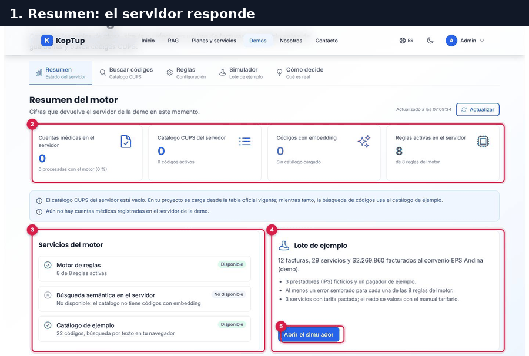

*Recorrido completo en 6 pasos: resumen, simulador, reglas, efecto de los cambios, guardado y búsqueda de códigos.*

### Paso 1. Resumen: el servidor responde

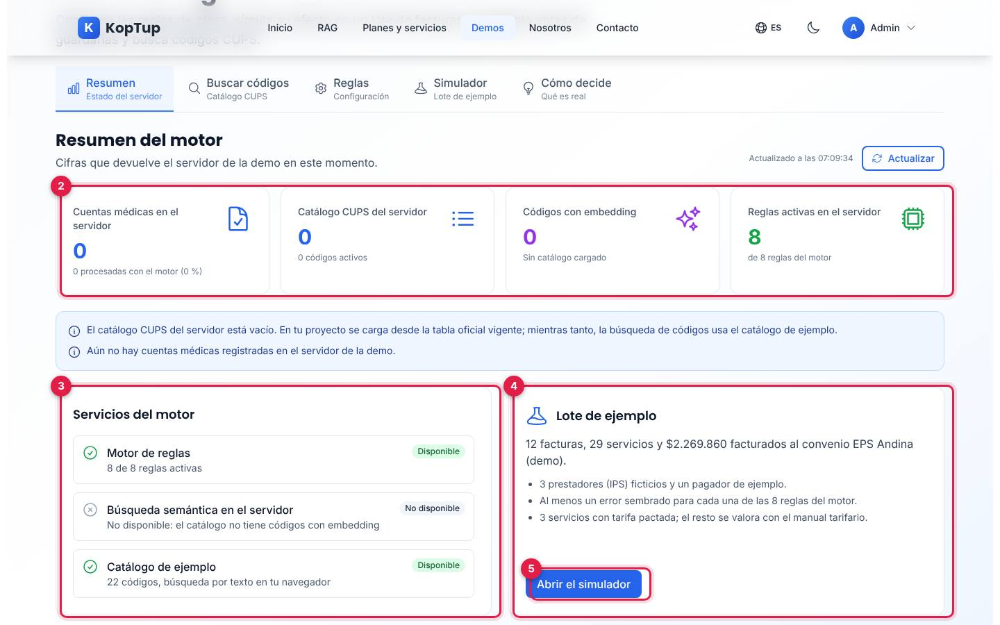

*Pestaña Resumen con las cifras que devuelve el servidor y el lote de ejemplo.*

1. **Estado del servidor**: «Servidor conectado» es el resultado real de la consulta (no es una insignia fija).
2. **Cifras del servidor**: cuentas médicas, catálogo CUPS, códigos con embedding y reglas activas (8 de 8). Arriba a la derecha, **Actualizar** vuelve a consultar y muestra la hora.
3. **Servicios del motor**: qué está disponible (motor de reglas, búsqueda semántica en el servidor, catálogo de ejemplo).
4. **Lote de ejemplo**: 12 facturas, 29 servicios y $2.269.860 facturados al convenio ficticio «EPS Andina (demo)».
5. **Abrir el simulador**: lleva a la pestaña Simulador.

### Paso 2. Simulador con la configuración guardada

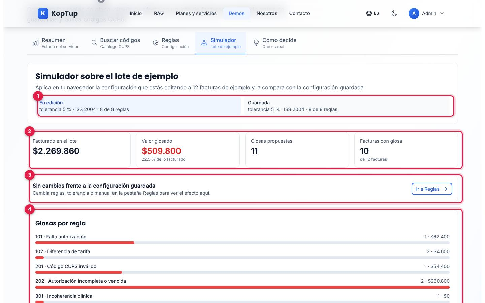

*El simulador aplica la configuración guardada al lote de ejemplo.*

1. **En edición / Guardada**: la configuración que estás editando y la que tiene el servidor (tolerancia, manual tarifario y reglas activas).
2. **Resultado**: facturado en el lote, valor glosado ($509.800, 22,5 %), glosas propuestas (11) y facturas con glosa (10 de 12).
3. **Sin cambios**: mientras no edites nada, lo dice y ofrece **Ir a Reglas**.
4. **Glosas por regla**: cuántas glosas y cuánto valor aporta cada una de las 8 reglas.

Qué decir: «Cada glosa sale de una regla explícita; la IA no decide glosas».

### Paso 3. Cambia reglas y tolerancia

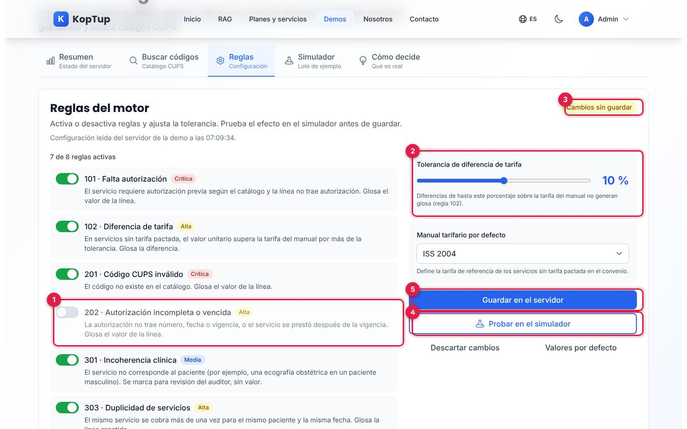

*Pestaña Reglas: se apagó la regla 202 y se subió la tolerancia al 10 %.*

1. **Interruptor de la regla 202** (Autorización incompleta o vencida), apagado. Cada regla muestra su severidad (Crítica, Alta, Media) y qué condición evalúa.
2. **Tolerancia de diferencia de tarifa**: deslizador de 0 a 20 %; en el ejemplo, 10 %.
3. **Cambios sin guardar**: la insignia avisa que hay diferencias con lo guardado.
4. **Probar en el simulador**: lleva al simulador con estos cambios, sin guardarlos.
5. **Guardar en el servidor**: guarda la configuración (solo se activa si hay cambios).

### Paso 4. Mira el efecto antes de guardar

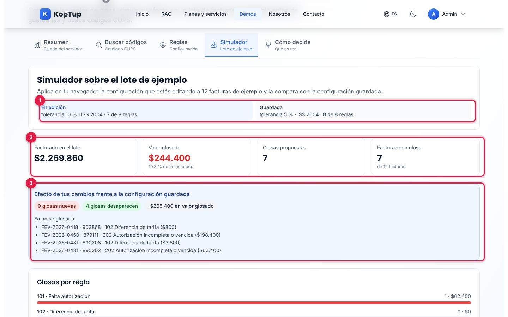

*El simulador compara la configuración en edición con la guardada.*

1. **En edición**: tolerancia 10 %, 7 de 8 reglas; **Guardada**: tolerancia 5 %, 8 de 8.
2. **Nuevo resultado**: valor glosado $244.400 (10,8 %), 7 glosas, 7 facturas con glosa.
3. **Efecto de tus cambios**: 0 glosas nuevas, 4 glosas desaparecen, −$265.400 en valor glosado, y la lista «Ya no se glosaría» con factura, código, regla y valor.

Qué decir: «Antes de activar una regla ves cuánto dinero mueve y en qué facturas».

### Paso 5. Guarda en el servidor

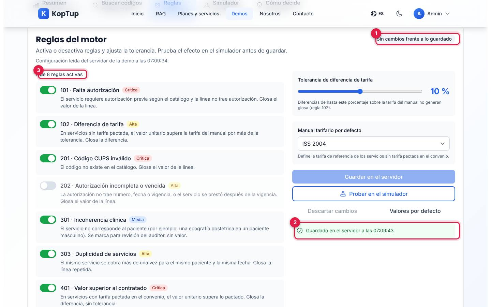

*Después de guardar, la configuración en edición y la guardada coinciden.*

1. La insignia vuelve a **Sin cambios frente a lo guardado**.
2. **Guardado en el servidor a las …** confirma el guardado.
3. **7 de 8 reglas activas**: ahora es la configuración del servidor para todas las personas que usan la demo.

Después de mostrarlo, pulsa **Valores por defecto** y otra vez **Guardar en el servidor** (tolerancia 5 %, ISS 2004, 8 de 8 reglas).

### Paso 6. Busca un código CUPS

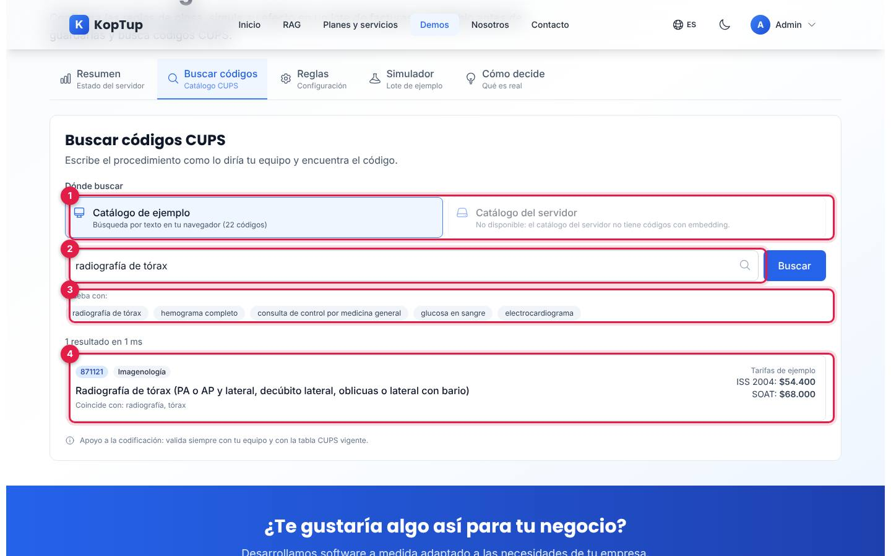

*Búsqueda de «radiografía de tórax» en el catálogo de ejemplo.*

1. **Dónde buscar**: «Catálogo de ejemplo» (22 códigos, búsqueda por texto en tu navegador) o «Catálogo del servidor» (búsqueda semántica con embeddings, solo si el catálogo del servidor tiene códigos vectorizados; si no, aparece deshabilitado).
2. **Procedimiento a buscar** y **Buscar**.
3. **Prueba con**: cinco ejemplos que buscan con un clic.
4. **Resultado**: código, categoría, descripción, palabras con las que coincidió, «Requiere autorización» si aplica, y tarifas de ejemplo ISS 2004 y SOAT.

---

## Pantallas y funciones

La demo tiene cinco pestañas. El borrador de reglas se conserva al cambiar de pestaña, pero se pierde al recargar la página.

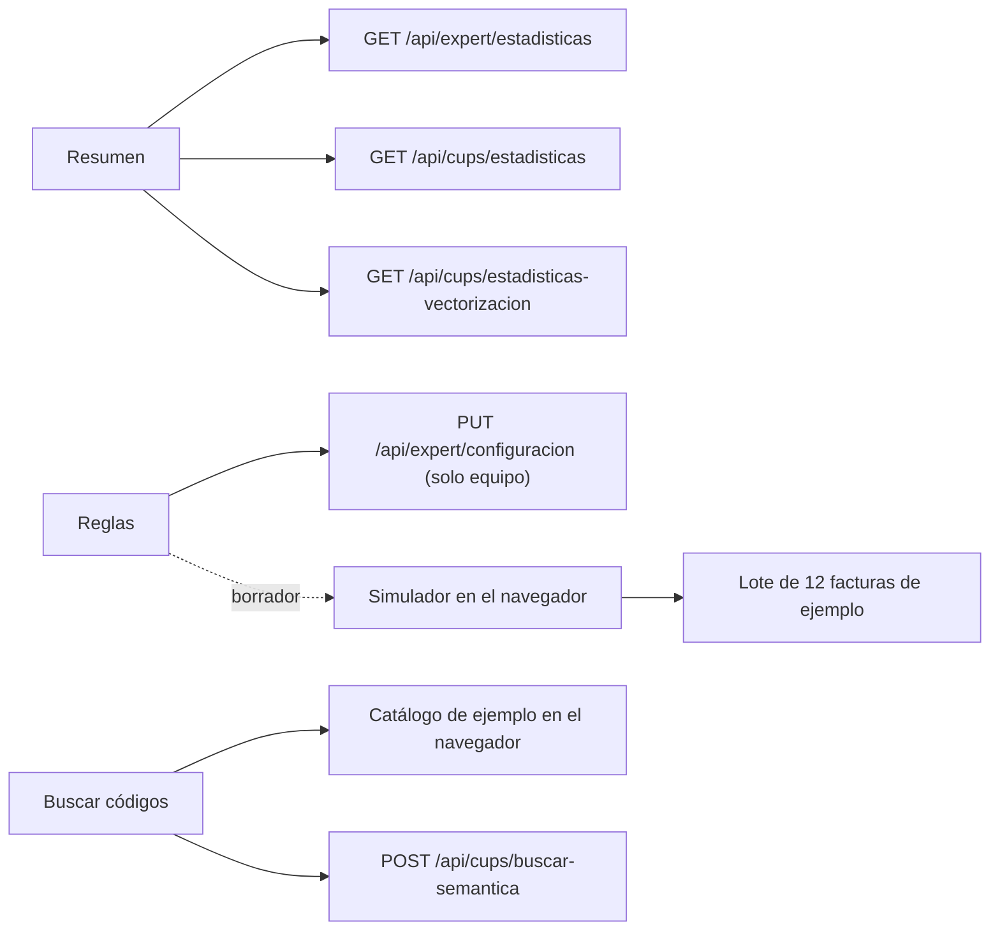

*Qué pestaña habla con el servidor y qué corre en el navegador.*

### Encabezado

**Volver a Auditoría de cuentas médicas** (lleva a `/demo/cuentas-medicas`), título «Motor de reglas del auditor», insignia **Datos de ejemplo** (al pasar el cursor explica que facturas, pacientes, prestadores, convenio y tarifas son ficticios) e insignia de **estado del servidor**: «Conectando con el servidor…», «Servidor conectado», «Sin sesión», «Sin acceso», «Límite de consultas», «Servidor no disponible» o «Error del servidor».

### Resumen

Ver el [paso 1](#paso-1-resumen-el-servidor-responde).

| Tarjeta | Qué cuenta |
|---|---|
| Cuentas médicas en el servidor | Cuentas registradas y cuántas se procesaron con el motor (ver limitación 1) |
| Catálogo CUPS del servidor | Códigos cargados y activos |
| Códigos con embedding | Porcentaje del catálogo vectorizado (para la búsqueda semántica) |
| Reglas activas en el servidor | Reglas activas de las 8 del motor |

Si el catálogo o las cuentas están vacíos, un aviso azul lo explica. Si el catálogo tiene códigos, aparece además «Catálogo del servidor por categoría».

### Buscar códigos

Ver el [paso 6](#paso-6-busca-un-código-cups). La búsqueda en el catálogo de ejemplo funciona aunque el servidor no responda; la del servidor muestra la similitud semántica de cada resultado y, si falla, un mensaje según la causa (sesión, acceso, límite de consultas, conexión).

### Reglas

Ver el [paso 3](#paso-3-cambia-reglas-y-tolerancia).

| Regla | Nombre | Severidad | Qué glosa |
|---|---|---|---|
| 101 | Falta autorización | Crítica | La línea completa |
| 102 | Diferencia de tarifa | Alta | La diferencia sobre la tarifa del manual, si supera la tolerancia |
| 201 | Código CUPS inválido | Crítica | La línea completa |
| 202 | Autorización incompleta o vencida | Alta | La línea completa |
| 301 | Incoherencia clínica | Media | Nada: la marca para revisión del auditor |
| 303 | Duplicidad de servicios | Alta | La línea repetida |
| 401 | Valor superior al contratado | Crítica | La diferencia con la tarifa pactada, sin tolerancia |
| 402 | Cantidad excede lo autorizado | Alta | Las unidades de más |

Además: **Manual tarifario por defecto** (ISS 2001, ISS 2004 o SOAT; define la tarifa de referencia de los servicios sin tarifa pactada), **Descartar cambios** (vuelve a lo guardado), **Valores por defecto** (tolerancia 5 %, ISS 2004, todas las reglas) y dos notas: «Dónde se guarda» (una sola configuración en memoria, compartida, que vuelve a los valores por defecto cuando el servidor se reinicia) y que los códigos 101, 102… son la numeración interna del motor.

### Simulador

Ver los [pasos 2 y 4](#paso-2-simulador-con-la-configuración-guardada). Más abajo está la lista de glosas:

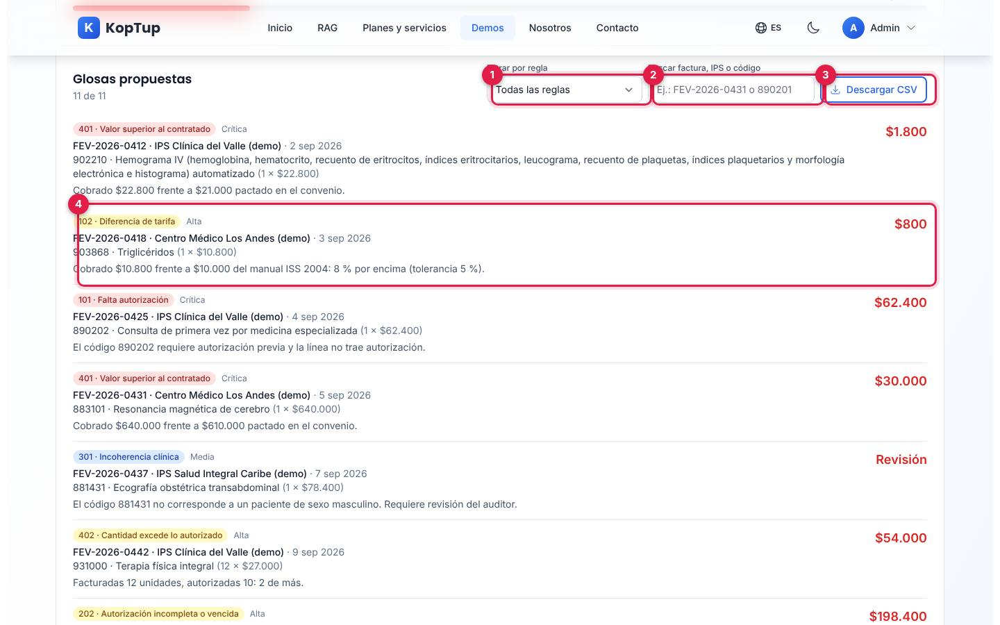

*Lista de glosas propuestas por el simulador, con filtros y descarga en CSV.*

1. **Filtrar por regla**: todas o una de las 8.
2. **Buscar factura, IPS o código**: por ejemplo «FEV-2026-0431» o «890201».
3. **Descargar CSV**: guarda `simulacion-motor-de-reglas.csv` con las glosas visibles (factura, IPS, línea, código, descripción, regla, severidad, valor y explicación).
4. **Cada glosa** trae la regla y su severidad, la factura, la IPS y la fecha, el servicio con cantidad y valor, la explicación con los valores comparados y el valor glosado («Revisión» cuando la regla no glosa valor). Las glosas que aparecen por tus cambios llevan la marca **Nueva**.

### Cómo decide

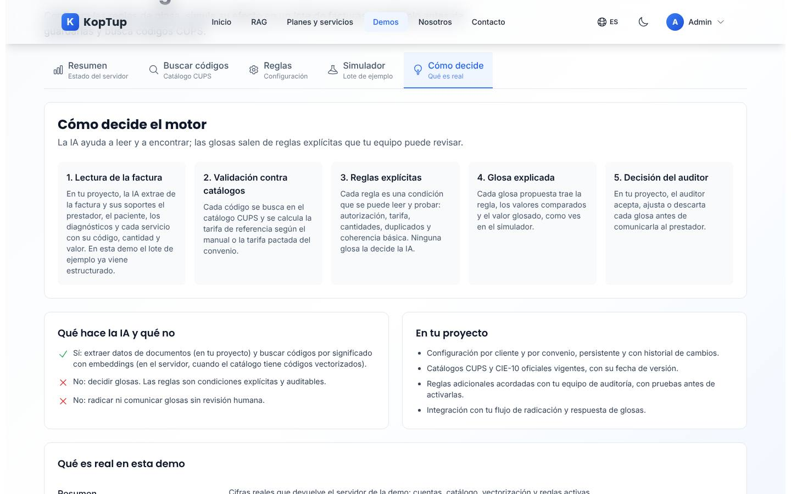

*Pestaña «Cómo decide»: los 5 pasos del motor, qué hace la IA y qué no, y lo que se construye en el proyecto.*

Explica los cinco pasos (lectura, validación contra catálogos, reglas explícitas, glosa explicada, decisión del auditor), qué hace la IA y qué no («No: decidir glosas»), qué se construye en el proyecto del cliente y una tabla «Qué es real en esta demo».

### Sin conexión con el servidor

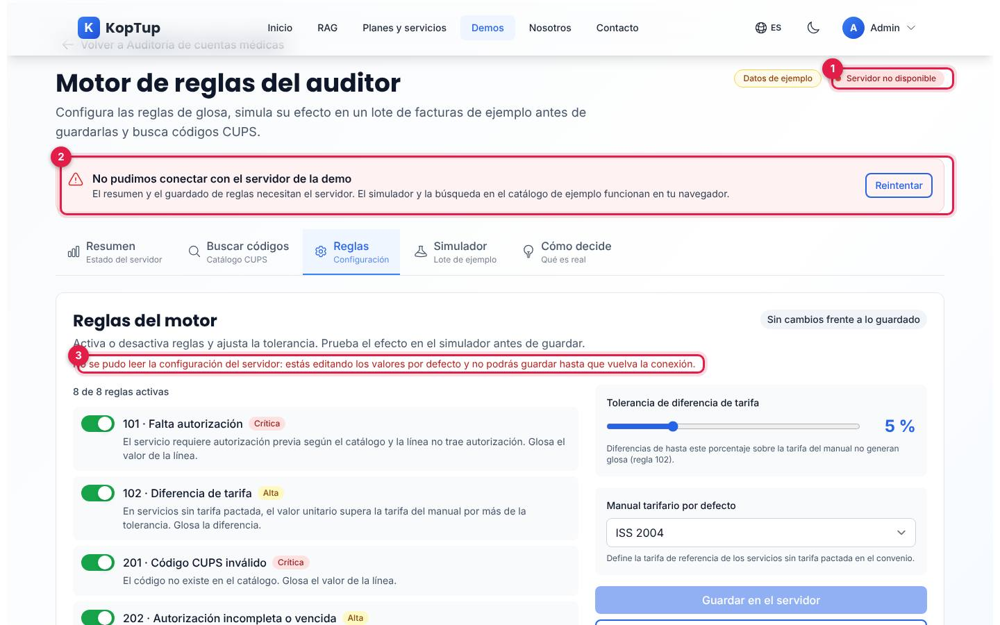

*Si el navegador no alcanza el servidor, la demo lo dice y sigue funcionando en lo que no depende de él.*

1. La insignia cambia a **Servidor no disponible**.
2. Un aviso explica qué necesita el servidor y ofrece **Reintentar**.
3. En Reglas: «No se pudo leer la configuración del servidor: estás editando los valores por defecto y no podrás guardar hasta que vuelva la conexión». El simulador y la búsqueda en el catálogo de ejemplo siguen funcionando.

### En el celular

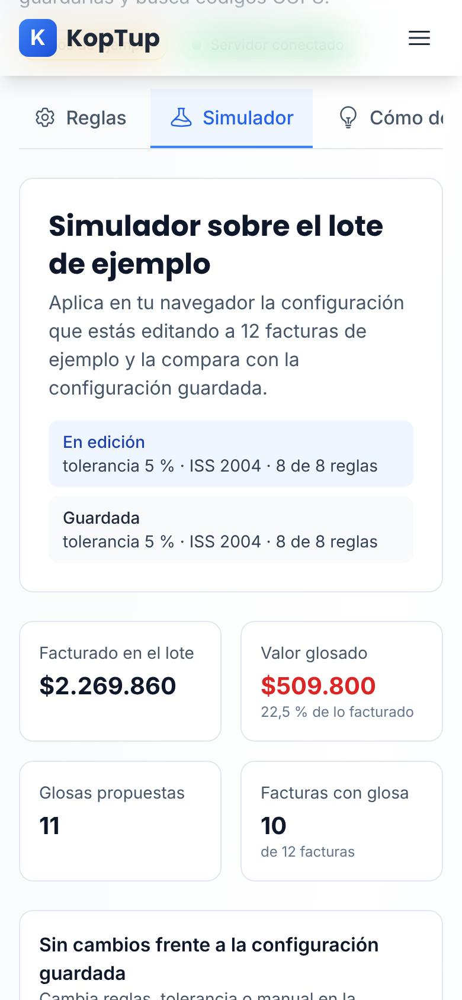

*La demo en un teléfono (390 px), pestaña Simulador.*

Las pestañas se desplazan de lado (sin la descripción pequeña), las tarjetas pasan a dos columnas o una, y los filtros del simulador se apilan.

---

## Qué es real y qué es simulado

| Parte | Real o simulado | Detalle |
|---|---|---|
| Estado del servidor y cifras del Resumen | **Backend real** | Consultas en vivo a `/api/expert` y `/api/cups`. |
| Configuración de reglas | **Backend real, en memoria** | Se lee y se guarda en el servidor; es una sola configuración compartida que se pierde al reiniciarlo. |
| Simulador | **Datos de ejemplo, en el navegador** | Aplica las 8 reglas a 12 facturas ficticias; no envía datos al servidor. Usa los mismos códigos, nombres y severidades que el motor del servidor. |
| Lote, convenio y tarifas | **Datos ficticios** | 3 IPS ficticias, convenio «EPS Andina (demo)», 3 servicios con tarifa pactada; las tarifas no son las oficiales de ningún manual. |
| Catálogo de ejemplo | **Datos de ejemplo** | 22 códigos CUPS reales con tarifas de ejemplo; búsqueda por texto en el navegador. |
| Búsqueda semántica | **IA real (embeddings), si hay catálogo** | Solo funciona si el catálogo del servidor tiene códigos vectorizados; en el entorno de capturas está vacío y aparece deshabilitada. |
| Lectura de facturas con IA | **No está en esta demo** | Se muestra en [Sistema experto para salud](Guia-Demo-cuentas-medicas.md). |

---

## Acceso

**Cómo lo ve un visitante.** En `/demo`, sección **Más demos**, están las dos demos de salud con la insignia «Solo por invitación»:

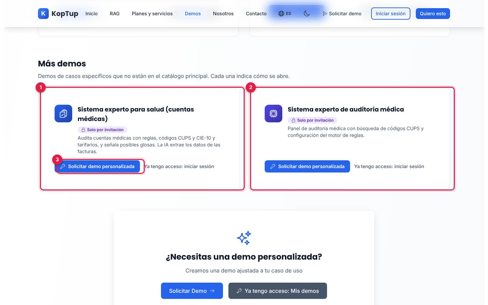

*Sección «Más demos» del hub, vista por un visitante sin sesión.*

1. Tarjeta de [Sistema experto para salud](Guia-Demo-cuentas-medicas.md) (`/demo/cuentas-medicas`).
2. Tarjeta de esta demo, con el nombre del catálogo «Sistema experto de auditoría médica».
3. **Solicitar demo personalizada** (y, sin sesión, **Ya tengo acceso: iniciar sesión**).

Si abre `/demo/sistema-experto` sin sesión o sin invitación, ve en la misma dirección la pantalla de acceso:

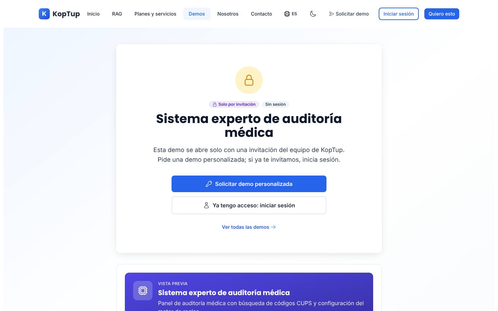

*Pantalla «Solo por invitación» para esta demo, con la vista previa de lo que incluye.*

- **Solicitar demo personalizada** abre `/solicitar-demo?demos=sistema-experto` con la demo elegida.
- **Ya tengo acceso: iniciar sesión** lleva a `/login` y vuelve a la demo.

**Cómo se concede.** Igual que en [Sistema experto para salud](Guia-Demo-cuentas-medicas.md#acceso): la solicitud llega a **Admin › Solicitudes de demo**, solo el rol **admin** puede aprobar demos «Solo por invitación», el acceso dura 14 días por defecto y se extiende o revoca en **Admin › Accesos a demos**. El equipo de KopTup (admin, manager, sales y developer) abre la demo sin invitación. **Guardar reglas** exige además rol admin, manager o sales: un prospecto invitado puede usar todo, pero al guardar ve «No se guardó: tu cuenta no tiene permiso para cambiar la configuración de esta demo». Más detalle en el [Manual del administrador](Doc-06-Manual-del-Administrador.md) y en [Flujos del visitante](Doc-04-Flujos-del-Visitante.md).

---

## Limitaciones conocidas

1. **«Cuentas médicas en el servidor» no cuenta las facturas de la otra demo.** Cuenta otro registro del servidor (cuentas médicas de `/api/cuentas`), así que auditar facturas en [Sistema experto para salud](Guia-Demo-cuentas-medicas.md) no lo cambia; en el entorno de capturas está en 0.
2. **Catálogo del servidor vacío.** En el entorno de capturas no hay códigos CUPS cargados ni vectorizados, así que la búsqueda semántica está deshabilitada y se usa el catálogo de ejemplo. Cargar y vectorizar el catálogo solo se puede hacer por la API (rutas de administrador); la demo no tiene pantalla para eso.
3. **Una sola configuración, compartida y temporal.** Lo que guarda una persona lo ven todas; se pierde al reiniciar el servidor; no hay historial ni configuración por cliente o convenio.
4. **El botón «Guardar en el servidor» se ve activo para un prospecto invitado**, pero el servidor rechaza el guardado (solo el equipo puede guardar) y la demo muestra el error.
5. **El simulador no llama al motor del servidor.** Las reglas se evalúan en el navegador con la misma numeración y severidades; el servidor no procesa el lote.
6. **No afecta a la otra demo.** Las reglas guardadas aquí no cambian la auditoría de [Sistema experto para salud](Guia-Demo-cuentas-medicas.md), que usa su propio tarifario; los números tampoco coinciden (aquí 202 es «Autorización incompleta o vencida» y allá «Diferencia de tarifa»).
7. **El botón de volver** lleva a `/demo/cuentas-medicas` (que en pantalla se llama «Sistema experto para salud», no «Auditoría de cuentas médicas»). Si la persona solo tiene invitación a esta demo, ese enlace la lleva a la pantalla de acceso de la otra.
8. **Nombres distintos.** En el hub y en la pantalla de acceso se llama «Sistema experto de auditoría médica»; dentro, «Motor de reglas del auditor».
9. **«Solicitar acceso» en el aviso «Tu cuenta no tiene acceso a esta demo»** lleva a `/contact` y no al formulario de solicitud de demos. Ese aviso solo aparece si el acceso vence con la demo abierta.
