# Guía de la demo: Sistema de Reservas

> Ruta `/demo/sistema-reservas` · Modo de acceso: **Abierta** · Tipo: **datos de ejemplo** (todo corre en el navegador; no llama al servidor ni guarda nada) · Plan del producto: [Sistema de reservas y agendamiento](Producto-sistema-reservas.md)

**Resumen.** Muestra la página de reservas de un centro de salud y bienestar sin nombre (cuatro servicios con duración y precio en pesos), un asistente de cuatro pasos para agendar una cita (fecha, hora, datos y confirmación) y un **Panel de Reservas** donde el negocio filtra las citas y les cambia el estado. Está pensada para consultorios, clínicas, spas y negocios que hoy agendan por cuaderno o WhatsApp. Es un prototipo visual: la reserva que hace el visitante no llega al panel, no se envía ningún correo y, al recargar, todo vuelve al estado inicial.

**En esta página:** [Recorrido sugerido](#recorrido-sugerido-demo-comercial-de-5-minutos) · [Pantallas y funciones](#pantallas-y-funciones) · [Qué es real y qué es simulado](#qué-es-real-y-qué-es-simulado) · [Acceso](#acceso) · [Limitaciones conocidas](#limitaciones-conocidas)

*Vista pública: encabezado naranja «Reserva tu Cita en Línea», los cuatro servicios con «Reservar ahora» y, debajo, el botón «Panel de Administración».*

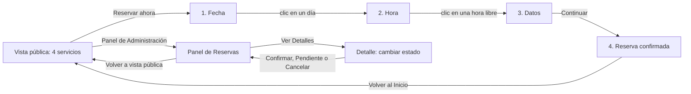

*Las tres vistas de la demo. Todo ocurre en la misma página `/demo/sistema-reservas`; la dirección no cambia.*

---

## Recorrido sugerido (demo comercial de 5 minutos)

La demo no trae un guion propio. Este recorrido muestra las dos caras del producto: la del cliente que agenda y la del negocio que administra. Empieza con la página recién cargada (si alguien ya la usó, recarga: no guarda nada).

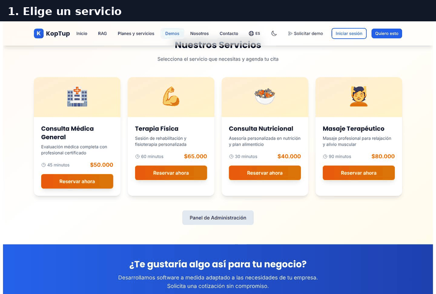

*Recorrido completo: servicio, fecha, hora, datos, confirmación, panel, detalle y cambio de estado.*

### Paso 1. El cliente elige un servicio

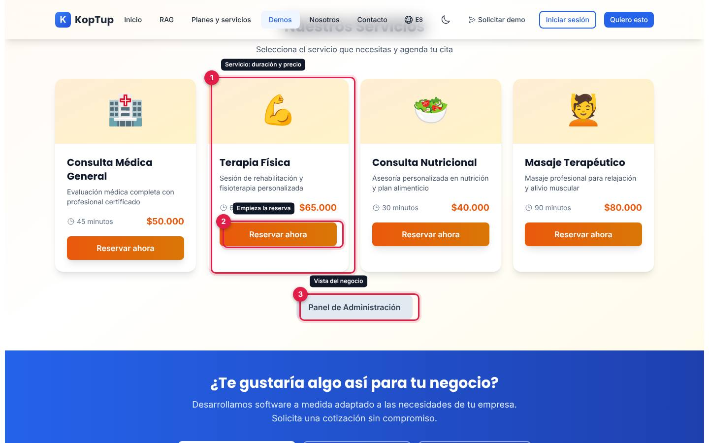

*Los cuatro servicios de ejemplo; se anota Terapia Física.*

1. **Tarjeta del servicio**: nombre, descripción, duración y precio. Los servicios son fijos: Consulta Médica General (45 minutos, $50.000), Terapia Física (60 minutos, $65.000), Consulta Nutricional (30 minutos, $40.000) y Masaje Terapéutico (90 minutos, $80.000).
2. **Reservar ahora**: abre el asistente de reserva con ese servicio.
3. **Panel de Administración**: lleva a la vista del negocio (paso 5). No pide contraseña.

Qué decir: «Tu cliente ve tus servicios con precio y duración, y agenda solo, sin llamar».

### Paso 2. Elige la fecha

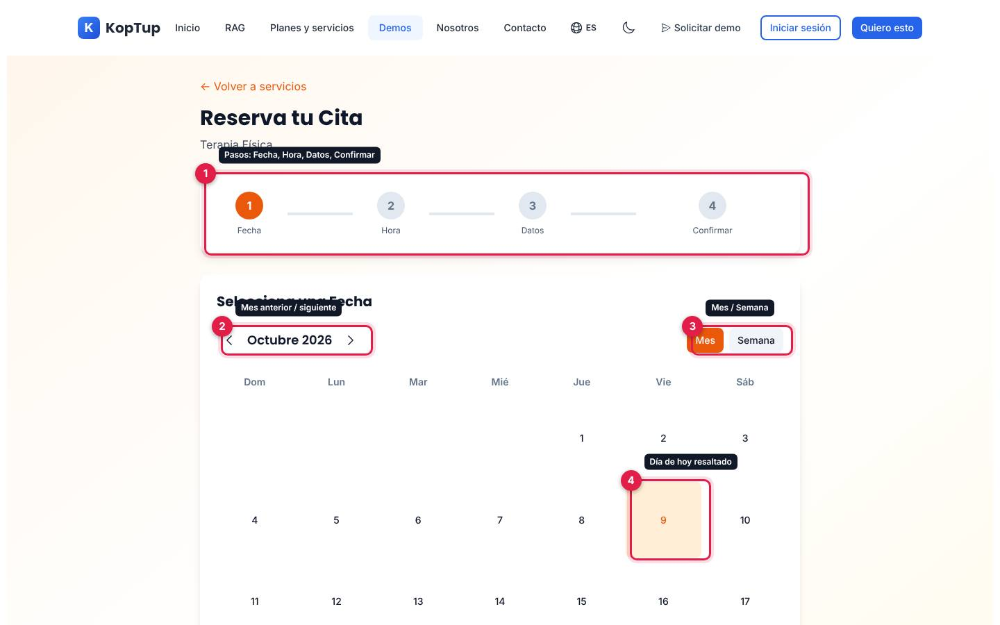

*Paso «Fecha» del asistente para Terapia Física, con el calendario de octubre de 2026.*

1. **Pasos**: Fecha, Hora, Datos y Confirmar. El paso actual va en naranja y los terminados llevan un chulo.
2. **Mes anterior y siguiente**: el calendario abre en el mes actual y las flechas cambian de mes.
3. **Mes / Semana**: dos botones de vista. «Semana» solo cambia el color del botón; el calendario sigue mostrando el mes (ver [Limitaciones](#limitaciones-conocidas)).
4. **Día de hoy** resaltado en naranja claro.

Un clic en cualquier día pasa de una vez al paso de la hora. Arriba, **← Volver a servicios** regresa a la vista pública.

### Paso 3. Elige la hora

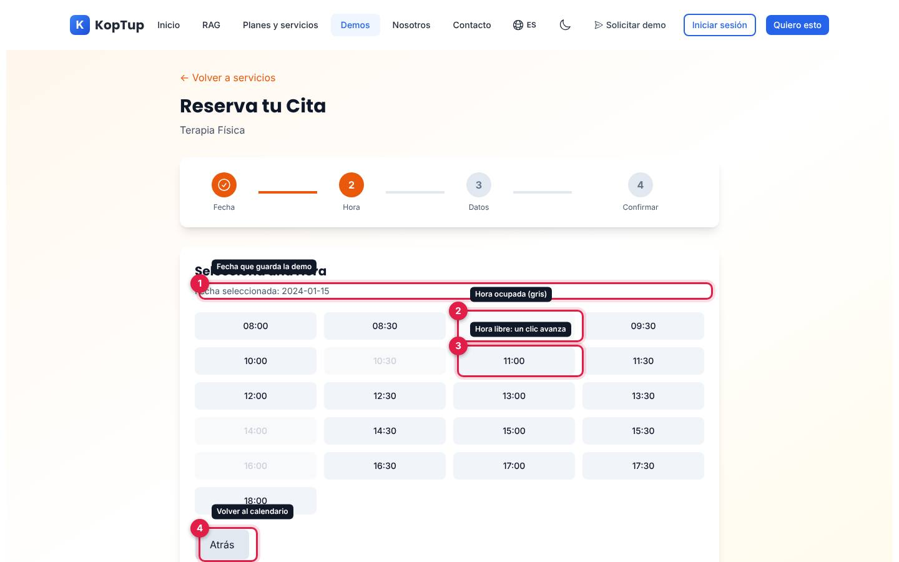

*Horas de 8:00 a. m. a 6:00 p. m. cada media hora; las grises están ocupadas.*

1. **Fecha seleccionada**: la demo muestra la fecha que guarda. Siempre sale en **enero de 2024** con el número de día que elegiste (aquí «2024-01-15», aunque se eligió el 15 de octubre de 2026). Es un error de la demo; conviene no detenerse en este texto durante una presentación.
2. **Hora ocupada**: 09:00, 10:30, 14:00 y 16:00 aparecen en gris y no se pueden elegir. Son las mismas para todos los días.
3. **Hora libre**: un clic la elige y avanza al paso de datos.
4. **Atrás**: vuelve al calendario.

Qué decir: «El cliente solo ve los horarios libres; no hay dobles reservas».

### Paso 4. Escribe sus datos y confirma

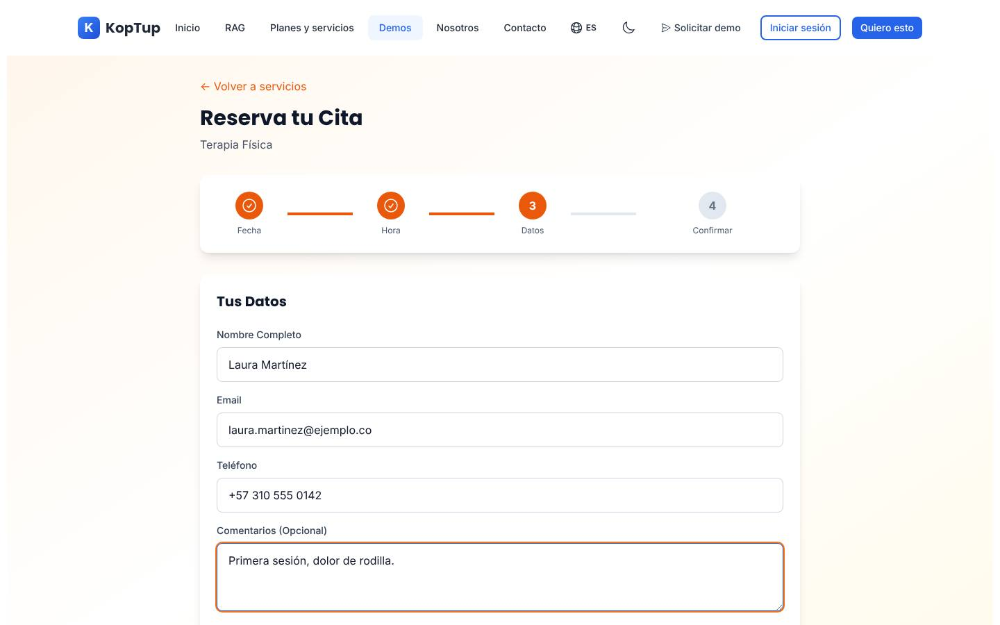

*Formulario «Tus Datos» con datos ficticios: Laura Martínez, laura.martinez@ejemplo.co, +57 310 555 0142 y un comentario.*

El formulario pide **Nombre Completo**, **Email**, **Teléfono** y **Comentarios (Opcional)**. **Atrás** vuelve a las horas y **Continuar** muestra la confirmación. La demo no valida los campos (se puede continuar con todo vacío) y no usa lo que escribas.

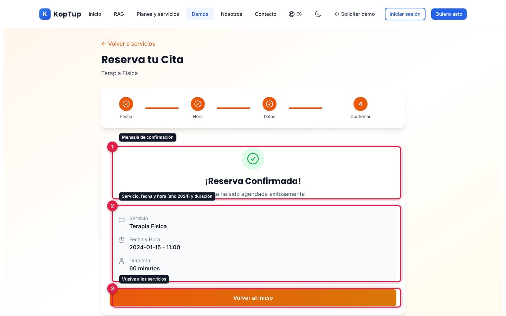

*Pantalla «¡Reserva Confirmada!» con el resumen de la cita.*

1. **Mensaje de confirmación**: «¡Reserva Confirmada! Tu cita ha sido agendada exitosamente». Aparece al instante; no se envía correo ni mensaje.
2. **Resumen**: servicio, fecha y hora (con el año 2024 del paso 3) y duración.
3. **Volver al Inicio**: regresa a los servicios.

### Paso 5. El negocio ve sus reservas

Desde la vista pública pulsa **Panel de Administración**.

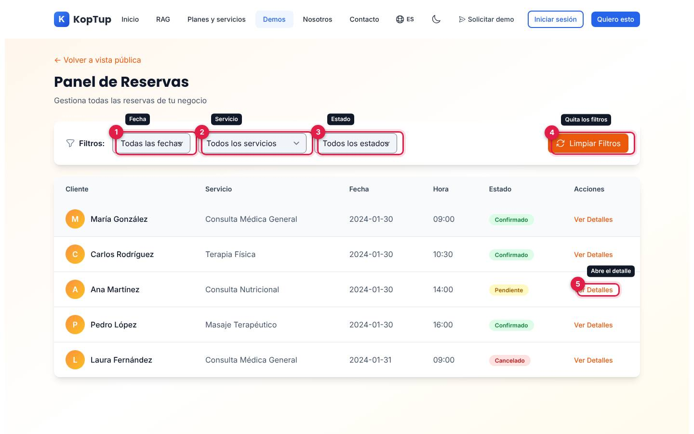

*Panel de Reservas con las cinco reservas de ejemplo.*

1. **Fecha**: Todas las fechas, Hoy, Esta semana o Este mes.
2. **Servicio**: uno de los cuatro servicios.
3. **Estado**: Confirmado, Pendiente o Cancelado.
4. **Limpiar Filtros**: vuelve a «todos» en los tres filtros.
5. **Ver Detalles**: abre la ficha de la reserva (aquí, la de Ana Martínez, pendiente).

La tabla trae cinco reservas fijas del 30 y 31 de enero de 2024: María González, Carlos Rodríguez, Ana Martínez, Pedro López y Laura Fernández. **La reserva que acabas de hacer no aparece**: el asistente y el panel no están conectados. Para la presentación, usa el filtro **Estado** (por ejemplo, «Cancelado» deja solo a Laura Fernández); los filtros de fecha «Hoy», «Esta semana» y «Este mes» siempre dejan la tabla vacía porque las reservas son de 2024.

### Paso 6. Abre una reserva y cámbiale el estado

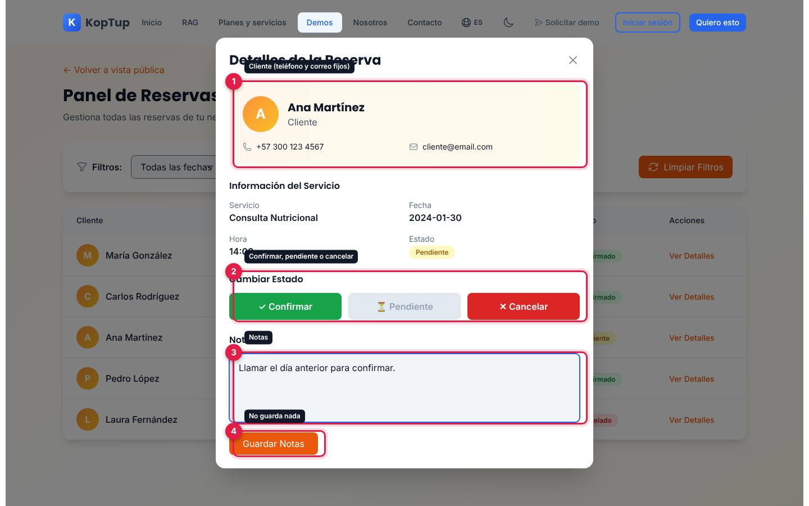

*Ventana «Detalles de la Reserva» de Ana Martínez con una nota escrita.*

1. **Cliente**: inicial, nombre, teléfono y correo. El teléfono (+57 300 123 4567) y el correo (cliente@email.com) son los mismos para todas las reservas.
2. **Cambiar Estado**: **✓ Confirmar**, **⏳ Pendiente** y **✕ Cancelar**. El botón del estado actual queda gris. Al pulsar otro, la ventana se cierra y la tabla muestra el nuevo estado (en el GIF, Ana Martínez pasa a «Confirmado»).
3. **Notas**: se puede escribir, pero no se guarda.
4. **Guardar Notas**: no hace nada. Al volver a abrir la reserva, la nota está vacía.

La ventana se cierra con la **X** de arriba a la derecha (la tecla Escape no la cierra).

Qué decir: «Tu equipo ve todas las citas en un solo lugar y las confirma o cancela con un clic».

---

## Pantallas y funciones

### Vista pública (servicios)

Ver la [vista general](#guía-de-la-demo-sistema-de-reservas) y el [paso 1](#paso-1-el-cliente-elige-un-servicio).

| Elemento | Qué hace |
|---|---|
| Encabezado «Reserva tu Cita en Línea» | Texto fijo con dos sellos: «Disponibilidad 24/7» y «Confirmación Instantánea». No son botones. |
| Tarjetas de servicio | Cuatro servicios fijos con ícono, descripción, duración y precio. |
| **Reservar ahora** | Abre el asistente con el servicio elegido, siempre desde el paso Fecha. |
| **Panel de Administración** | Cambia a la vista del negocio, sin inicio de sesión. |
| Bloque azul «¿Te gustaría algo así para tu negocio?» | Es común a todas las demos: **Solicitar demo guiada** (`/solicitar-demo?demos=sistema-reservas`), **Solicitar Cotización** (`/contact`) y **Ver Planes y Precios** (`/services#planes-rag`). |

### Asistente de reserva

Ver los [pasos 2 a 4](#paso-2-elige-la-fecha).

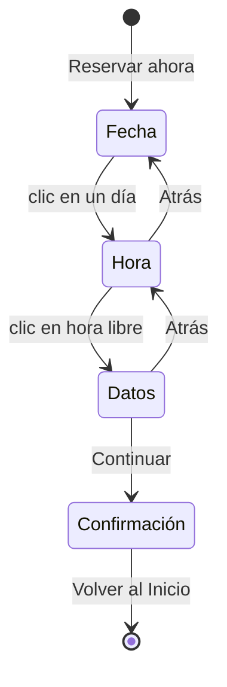

*Pasos del asistente. «← Volver a servicios» sale del asistente desde cualquier paso.*

- **Fecha**: calendario mensual que abre en el mes actual, con flechas para cambiar de mes y el día de hoy resaltado. Se puede elegir cualquier día, también los pasados y los domingos.
- **Hora**: 21 horarios de 08:00 a 18:00 cada 30 minutos. Cuatro salen ocupados siempre (09:00, 10:30, 14:00 y 16:00).
- **Datos**: nombre, email, teléfono y comentarios, sin validación.
- **Confirmación**: servicio, fecha y hora, y duración. No muestra el nombre ni el precio.

### Panel de Reservas

Ver los [pasos 5 y 6](#paso-5-el-negocio-ve-sus-reservas).

- **Filtros**: fecha, servicio y estado se combinan entre sí. Si ninguna reserva coincide, la tabla dice «No se encontraron reservas con los filtros seleccionados».
- **Tabla**: cliente (con su inicial), servicio, fecha, hora, estado con color (verde Confirmado, amarillo Pendiente, rojo Cancelado) y **Ver Detalles**.
- **Detalle**: datos del cliente, información del servicio, cambio de estado y notas.
- **← Volver a vista pública**: regresa a los servicios. Los filtros y los cambios de estado se mantienen mientras no recargues la página.

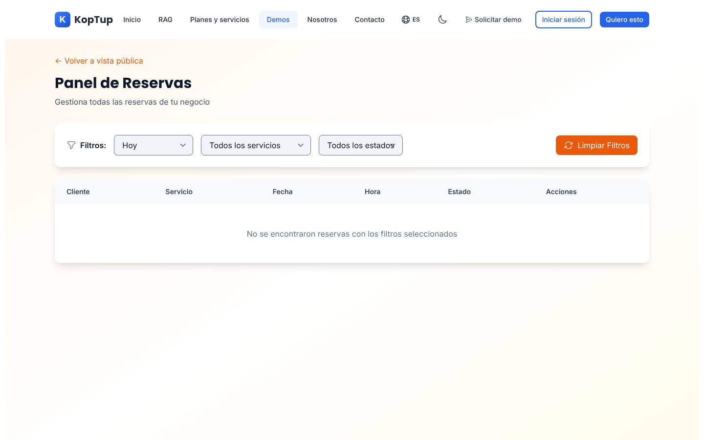

*Con el filtro «Hoy» la tabla queda vacía: las cinco reservas de ejemplo son de enero de 2024.*

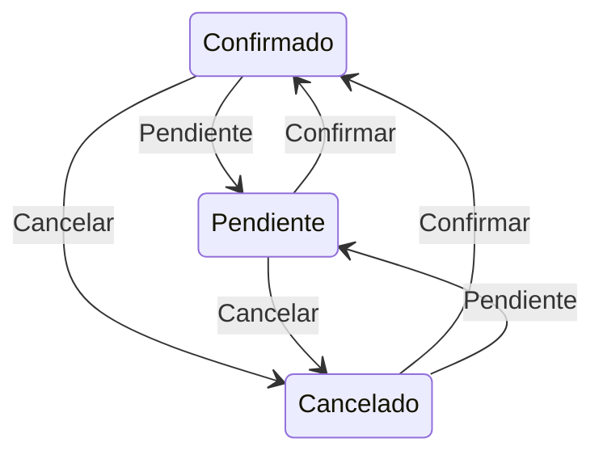

*Cualquier estado puede pasar a cualquiera de los otros dos desde el detalle. Los cambios se pierden al recargar.*

### En el celular

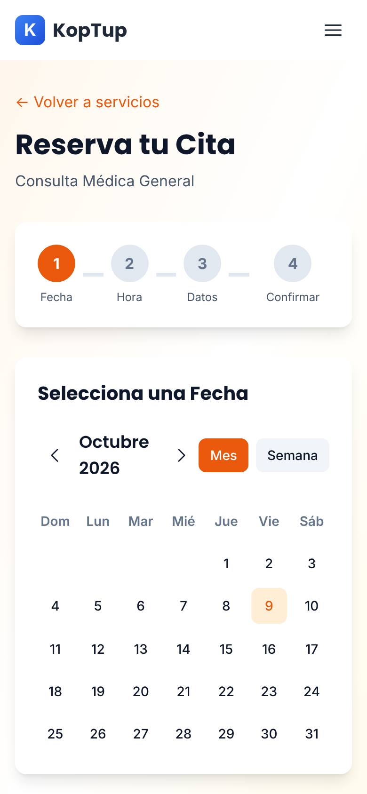

*El asistente en un teléfono (390 px), en el paso Fecha.*

Las tarjetas de servicio se apilan en una columna, el calendario ocupa todo el ancho y la tabla del panel se desplaza de lado dentro de su recuadro. La página no se desborda a lo ancho.

---

## Qué es real y qué es simulado

| Parte | Real o simulado | Detalle |
|---|---|---|
| Servicios, precios, duraciones y las cinco reservas del panel | **Datos de ejemplo** | Fijos en el código de la página. Las reservas son de enero de 2024. |
| Calendario y navegación entre meses | **Real (en el navegador)** | Muestra los meses reales, pero la fecha elegida se guarda como enero de 2024. |
| Horas ocupadas | **Simulado** | Siempre las mismas cuatro horas, sin importar el día ni el servicio. |
| Datos del cliente | **No se usan** | Se pueden escribir, pero no se validan, no se muestran en la confirmación ni llegan al panel. |
| «¡Reserva Confirmada!» | **Simulado** | No se crea ninguna reserva ni se envía correo, SMS o WhatsApp. |
| Filtros del panel y cambio de estado | **Real (en el navegador)** | Funcionan sobre las cinco reservas de ejemplo mientras la página está abierta. |
| Teléfono y correo del cliente en el detalle | **Simulado** | Los mismos para todas las reservas. |
| Notas | **No funciona** | «Guardar Notas» no hace nada. |
| Dónde se guardan los cambios | **En ninguna parte** | Solo en la memoria de la página: al recargar todo vuelve al estado inicial. La demo no llama al backend ni usa IA. |

---

## Acceso

**Cómo la ve un visitante.** La demo es **Abierta** (`publico`): cualquiera entra a `/demo/sistema-reservas` sin cuenta y sin pantalla de acceso. En el hub `/demo` aparece así:

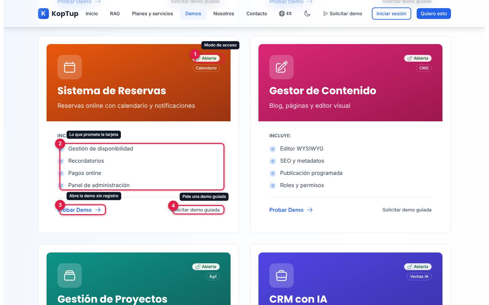

*Tarjeta «Sistema de Reservas» en el hub, vista por un visitante sin sesión.*

1. Insignia **Abierta** (junto a «Calendario»).
2. Lo que **Incluye** según la tarjeta: «Gestión de disponibilidad», «Recordatorios», «Pagos online» y «Panel de administración». Recordatorios y pagos no existen en la demo (ver la limitación 1).
3. **Probar Demo** abre `/demo/sistema-reservas`.
4. **Solicitar demo guiada** abre `/solicitar-demo?demos=sistema-reservas`.

**Cómo se solicita.** No hace falta solicitarla. Quien quiera verla con sus propios servicios usa **Solicitar demo guiada** (en la tarjeta o en el bloque azul del final de la demo, que también ofrece **Solicitar Cotización** y **Ver Planes y Precios**). La solicitud llega a **Admin › Solicitudes de demo** como cualquier otra.

**Cómo la controla el admin.** El modo sale del catálogo del servidor y se cambia en **Admin › Catálogo de demos**. Si se pasa a «Con solicitud» o «Solo por invitación», los visitantes verán la pantalla de acceso y los accesos se conceden en **Admin › Solicitudes de demo** y **Admin › Accesos a demos**; si se desactiva, el visitante ve que la demo está en mantenimiento y el equipo sigue entrando. Si el backend no responde, la demo sigue abierta porque así está en la tabla de respaldo de la web. Detalle en el [Manual del administrador](Doc-06-Manual-del-Administrador.md) y en [Flujos del visitante](Doc-04-Flujos-del-Visitante.md).

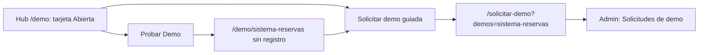

*Dos caminos: probarla de una vez o pedir una demo guiada.*

---

## Limitaciones conocidas

1. **Promete más de lo que hace.** La tarjeta del hub dice «Reservas online con calendario y notificaciones» e incluye «Recordatorios» y «Pagos online»; la descripción para buscadores de la página habla de «confirmaciones automáticas», «recordatorios por email/SMS», «Integración con Google Calendar» y «Multi-usuario». Nada de eso existe en la demo: no hay notificaciones, recordatorios, pagos, integración con calendarios ni usuarios.
2. **No dice que es una demo.** A diferencia de las demos revisadas, no tiene el rótulo «Datos de ejemplo» ni explica qué es real. El mensaje «¡Reserva Confirmada! Tu cita ha sido agendada exitosamente» puede hacer creer al visitante que de verdad pidió una cita.
3. **La fecha guardada siempre es de enero de 2024.** Elijas el mes que elijas, la reserva queda con fecha `2024-01-<día>`, y así sale en el paso Hora y en la confirmación.
4. **El botón «Semana» no hace nada útil**: cambia de color, pero el calendario sigue en vista de mes.
5. **El día resaltado como «hoy» se repite en todos los meses**: la demo compara solo el número del día (si hoy es 9, se resalta el 9 de cualquier mes).
6. **Se pueden elegir días pasados**, y las horas ocupadas son las mismas para todos los días y servicios.
7. **El formulario de datos no valida nada** y lo escrito no se usa: no aparece en la confirmación ni en el panel.
8. **La reserva del visitante no llega al panel.** El panel solo muestra las cinco reservas de ejemplo de 2024.
9. **Los filtros de fecha «Hoy», «Esta semana» y «Este mes» siempre dejan la tabla vacía**, porque todas las reservas son de 2024.
10. **«Guardar Notas» es un botón muerto**: no guarda la nota ni muestra ningún aviso.
11. **Todas las reservas muestran el mismo teléfono y el mismo correo** en el detalle.
12. **El panel no pide inicio de sesión** (en la demo es a propósito, pero vale aclararlo si alguien pregunta por roles o permisos).
13. **Nada se guarda.** Los cambios de estado se pierden al recargar la página.
14. **La ventana de detalle no se cierra con Escape**, solo con la X.
