# Guía de la demo: Telemedicina para IPS

> Ruta `/demo/telemedicina` · Modo de acceso: **Con solicitud** · Tipo: **datos de ejemplo** (todo corre en el navegador; no llama al servidor ni a un modelo de IA) · Plan del producto: [Plataforma de telemedicina para IPS](Producto-telemedicina.md)

**Resumen.** Recorre una jornada de teleconsulta en una IPS ficticia (IPS Altavista Salud, Bogotá) el jueves 8 de octubre de 2026, vista desde tres lados: el **paciente** llena su pre-consulta y acepta los consentimientos, la **profesional** (Dra. Patricia Vargas) atiende desde un consultorio virtual con sala de espera por prioridad, videoconsulta simulada, ficha, receta firmada y notas SOAP, y **facturación** cobra la cuota con una pasarela simulada y genera la factura y el RIPS (simulados). Está pensada para gerentes y directores médicos de IPS y clínicas; se abre solo con un acceso aprobado y lo que haces se guarda solo en tu navegador.

**En esta página:** [Recorrido sugerido](#recorrido-sugerido-demo-comercial-de-5-minutos) · [Pantallas y funciones](#pantallas-y-funciones) · [Qué es real y qué es simulado](#qué-es-real-y-qué-es-simulado) · [Acceso](#acceso) · [Limitaciones conocidas](#limitaciones-conocidas)

*Vista inicial: encabezado con las insignias «Datos de ejemplo» y «Video, mensajes, pagos y RIPS simulados», las seis pestañas, los cuatro indicadores, el recorrido sugerido (plegado) y el consultorio con la sala de espera.*

---

## Recorrido sugerido (demo comercial de 5 minutos)

La idea que vende: «del celular del paciente a la factura con RIPS, sin papel y sin saltarse los controles». El guion sigue el **Recorrido sugerido (5 pasos, menos de 5 minutos)** que trae la propia demo: al desplegarlo, cada paso es un botón que te lleva a la pestaña correcta. Si alguien ya usó la demo en ese navegador, empieza con **Restablecer** (arriba a la derecha).

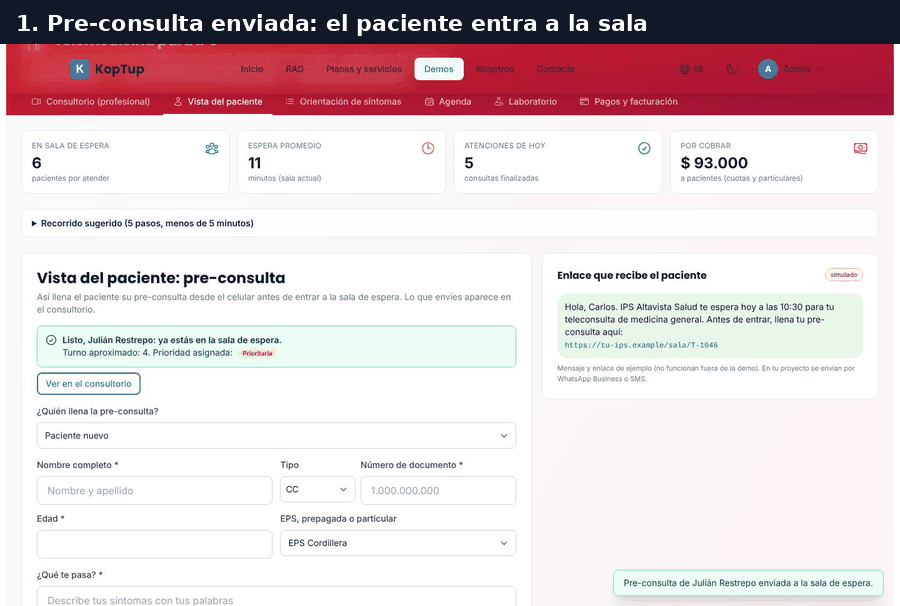

*Recorrido completo en 9 cuadros: pre-consulta, orientación de síntomas, derivación a urgencias, videoconsulta, receta, cierre, resumen, cobro y facturación del día.*

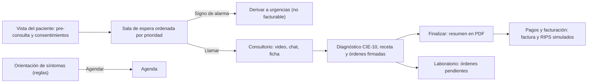

*Cómo se conectan las pestañas. La agenda queda aparte: las citas no entran a la sala de espera (ver la limitación 4).*

### Paso 1. El paciente llena su pre-consulta

Abre la pestaña **Vista del paciente**.

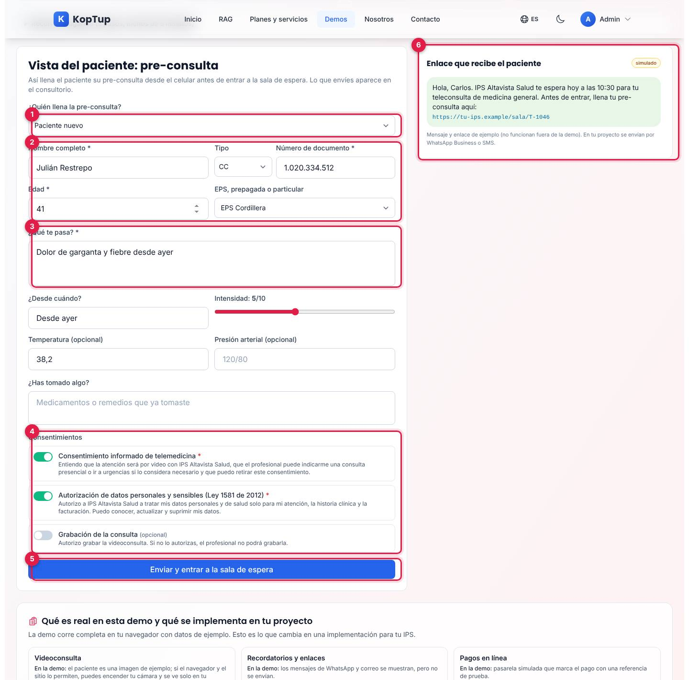

*Pre-consulta de un paciente nuevo (Julián Restrepo, fiebre y dolor de garganta) lista para enviar.*

1. **¿Quién llena la pre-consulta?**: «Paciente nuevo» o uno de los pacientes que ya están en la sala de espera (se carga su pre-consulta para actualizarla).
2. **Datos del paciente nuevo**: nombre (mínimo 3 letras), tipo de documento (CC, TI o CE), número (5 a 15 dígitos o puntos), edad y pagador (EPS Cordillera, EPS Sabana Vital, Horizonte Medicina Prepagada o Particular).
3. **¿Qué te pasa?** (obligatorio). Debajo: desde cuándo, intensidad de 1 a 10, temperatura y presión (opcionales) y qué ha tomado.
4. **Consentimientos**: el de telemedicina y la autorización de datos personales y sensibles (Ley 1581 de 2012) son obligatorios; el de **grabación** es opcional, y si el paciente no lo da, la profesional no podrá grabar la consulta.
5. **Enviar y entrar a la sala de espera**: se activa con el motivo, los datos y los dos consentimientos obligatorios.
6. **Enlace que recibe el paciente**: el mensaje de WhatsApp de ejemplo con el enlace a la pre-consulta (simulado; no se envía).

Al enviar aparece «Listo, Julián Restrepo: ya estás en la sala de espera. Turno aproximado: 4. Prioridad asignada: Prioritaria» y el botón **Ver en el consultorio**. La prioridad sale de las mismas reglas de la orientación de síntomas: si el motivo tiene un signo de alarma (dolor en el pecho, desmayo, sangrado abundante, riesgo de hacerse daño), además se le dice que vaya a urgencias o llame a la línea 123.

Qué decir: «El paciente llega a la consulta con sus datos, sus síntomas y sus consentimientos firmados; nadie le pregunta lo mismo dos veces».

### Paso 2. Orientación de síntomas por reglas

Abre **Orientación de síntomas** y pulsa dos ejemplos: primero «Dolor en el pecho y dificultad para respirar» y luego «Tos seca y fiebre de 38 °C».

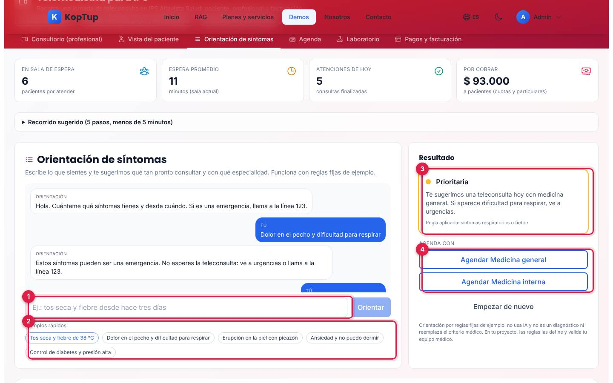

*Después de los dos ejemplos: el primero derivó a urgencias; el segundo sugiere agendar hoy con medicina general.*

1. **Caja de texto y Orientar**: escribe los síntomas con tus palabras (Enter también envía).
2. **Ejemplos rápidos**: cinco casos listos (tos y fiebre, dolor en el pecho, erupción en la piel, ansiedad e insomnio, control de diabetes y presión).
3. **Resultado**: prioridad sugerida (Signo de alarma, Prioritaria o No prioritaria), la recomendación y la **regla aplicada**.
4. **Agenda con**: un botón por especialidad sugerida; abre la pestaña **Agenda** con esa especialidad elegida.

Con un signo de alarma, el resultado no ofrece agendar: muestra «Signos de alarma: no esperes una teleconsulta» y «Línea de emergencias 123». Las reglas se evalúan en orden y gana la primera que coincide:

| Regla | Ejemplo de palabras | Prioridad | Sugiere |
|---|---|---|---|
| Dolor en el pecho o dificultad para respirar | dolor en el pecho, falta de aire | Signo de alarma | Urgencias o línea 123 |
| Desmayo, convulsión o pérdida de fuerza | desmayo, convulsión, cara caída | Signo de alarma | Urgencias o línea 123 |
| Sangrado abundante | sangrado abundante, vómito con sangre | Signo de alarma | Urgencias o línea 123 |
| Riesgo de hacerse daño | hacerme daño, quitarme la vida | Signo de alarma | Ayuda inmediata, línea 123 |
| Síntomas respiratorios o fiebre | fiebre, tos, garganta, gripa | Prioritaria | Medicina general o interna |
| Dolor de cabeza | cefalea, migraña | Prioritaria | Medicina general o interna |
| Dolor de oído | oído, otalgia | No prioritaria | Medicina general o pediatría |
| Síntomas de la piel | erupción, picazón, ronchas | No prioritaria | Dermatología |
| Salud mental | ansiedad, estrés, no puedo dormir | No prioritaria | Psicología |
| Control de enfermedad crónica | diabetes, glucosa, presión alta | No prioritaria | Medicina interna o general |
| Ninguna de las anteriores | — | No prioritaria | Medicina general |

Qué decir: «No es un diagnóstico ni usa IA: son reglas que define y valida tu equipo médico, y los signos de alarma nunca se quedan esperando una teleconsulta». La demo lo aclara debajo del resultado.

### Paso 3. La profesional deriva la alarma y llama al siguiente paciente

Abre **Consultorio (profesional)**. María González (dolor en el pecho opresivo) está de primera, en rojo, sin botón **Llamar**: solo **Derivar a urgencias**.

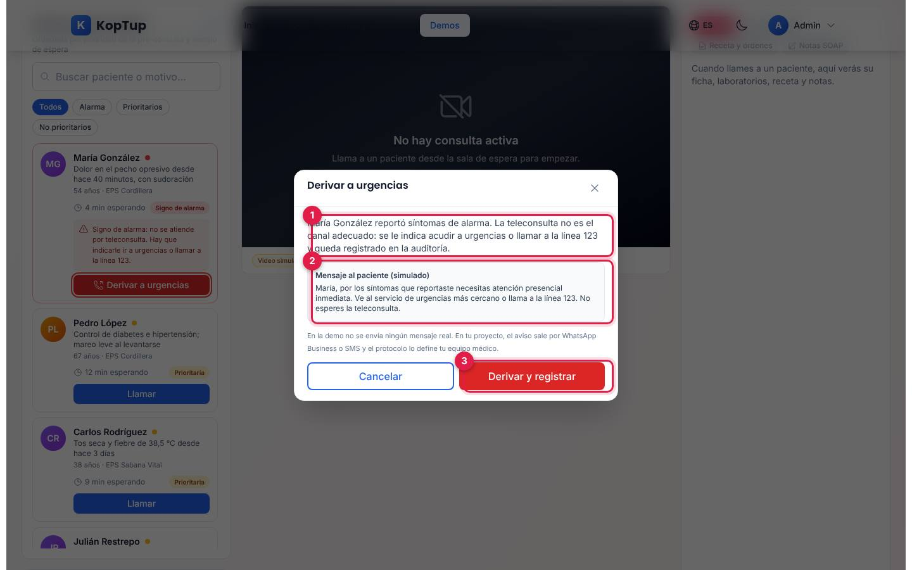

*Ventana «Derivar a urgencias» para María González.*

1. **Qué pasa**: la teleconsulta no es el canal adecuado; se le indica ir a urgencias o llamar a la línea 123 y queda en la auditoría.
2. **Mensaje al paciente (simulado)**: el texto que recibiría por WhatsApp o SMS (no se envía).
3. **Derivar y registrar**: la saca de la sala y crea la atención como «Derivación a urgencias», no facturable.

Luego pulsa **Llamar** en Carlos Rodríguez (tos seca y fiebre, EPS Sabana Vital). Escríbele un par de mensajes en el chat y pulsa el botón rojo de grabar.

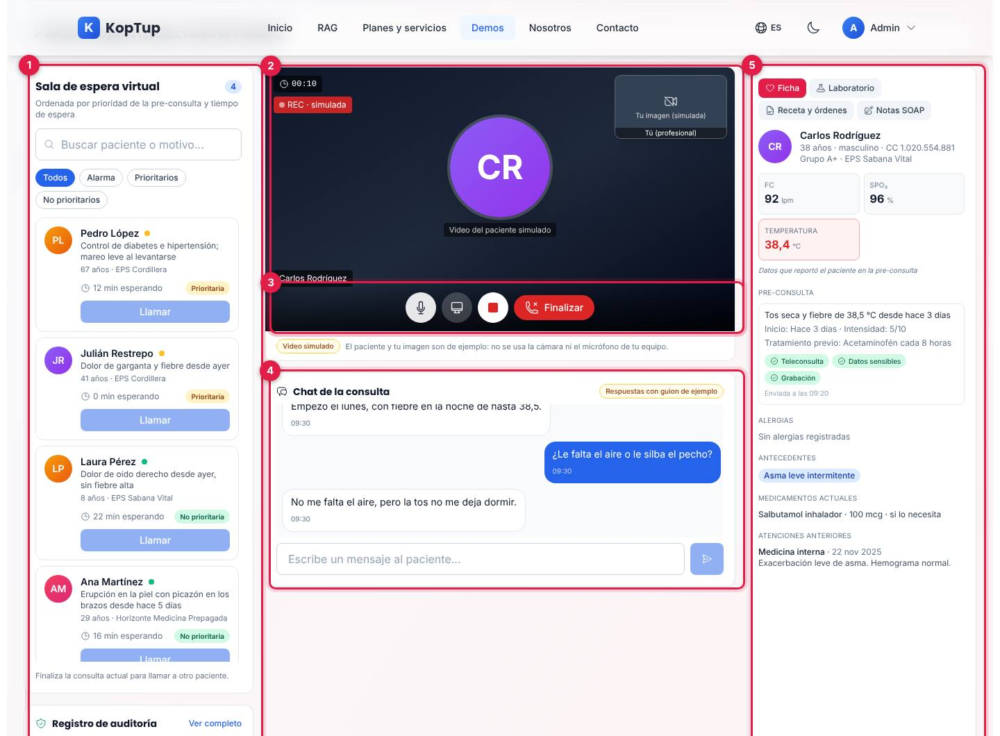

*Consulta en curso con Carlos Rodríguez: grabación simulada activa, chat con respuestas de guion y su ficha.*

1. **Sala de espera virtual**: ordenada por prioridad y luego por tiempo de espera; buscador y filtros (Todos, Alarma, Prioritarios, No prioritarios). Mientras hay una consulta abierta, los demás **Llamar** se desactivan («Finaliza la consulta actual para llamar a otro paciente»).
2. **Video simulado**: el paciente es un círculo con sus iniciales; arriba, el cronómetro y las insignias «REC · simulada», «Compartiendo pantalla (simulado)» o «Micrófono silenciado»; a la derecha, «Tu imagen (simulada)».
3. **Controles**: micrófono, compartir pantalla (simulado), grabar y **Finalizar**. Grabar solo funciona si el paciente lo autorizó en la pre-consulta; si no, avisa «El paciente no autorizó la grabación en la pre-consulta: no se puede grabar» y lo deja en la auditoría.
4. **Chat de la consulta**: cada mensaje que envías recibe, en un segundo, la siguiente respuesta del guion del paciente («Empezó el lunes, con fiebre en la noche de hasta 38,5», «No me falta el aire, pero la tos no me deja dormir»…). Cuando se acaba el guion responde «De acuerdo, gracias.».
5. **Panel de la consulta**: pestañas **Ficha**, **Laboratorio**, **Receta y órdenes** y **Notas SOAP**. La ficha muestra documento, edad, grupo sanguíneo, pagador, signos vitales (y de dónde salen), la pre-consulta con sus consentimientos, alergias, antecedentes, medicamentos actuales y atenciones anteriores.

Qué decir: «La profesional ve todo en una pantalla: quién sigue, por qué, qué autorizó el paciente y su historia».

### Paso 4. Diagnóstico, receta firmada, notas y cierre

En **Receta y órdenes**: busca «J06» y elige J06.9, pulsa **+ Acetaminofén**, marca Hemograma completo y Proteína C reactiva (PCR) y pulsa **Firmar receta y órdenes**.

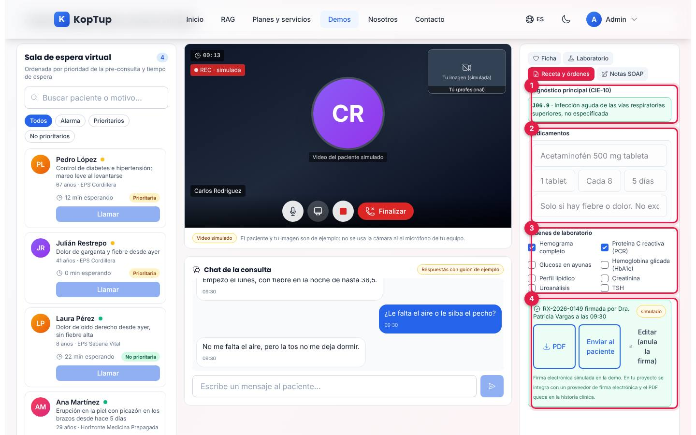

*Receta RX-2026-0149 firmada para Carlos Rodríguez, con dos órdenes de laboratorio.*

1. **Diagnóstico principal (CIE-10)**: buscador por código o nombre sobre un catálogo reducido de 22 diagnósticos; **Cambiar** lo borra para elegir otro.
2. **Medicamentos**: siete frecuentes con un clic (Acetaminofén, Ibuprofeno, Loratadina, Hidrocortisona, Salbutamol, Amoxicilina y Trimetoprim/sulfametoxazol) u **Otro** en blanco; nombre, dosis, frecuencia, duración e indicaciones se pueden editar. Si el paciente es alérgico (por ejemplo, Ana Martínez a las sulfas o Pedro López al ácido acetilsalicílico y los AINE), aparece «Alerta de alergia: el paciente es alérgico a… Cambia o quita el medicamento para poder firmar» y la firma se bloquea.
3. **Órdenes de laboratorio**: ocho exámenes (hemograma, PCR, glucosa, HbA1c, perfil lipídico, creatinina, uroanálisis y TSH).
4. **Firma**: «RX-2026-0149 firmada por Dra. Patricia Vargas a las…» con tres botones: **PDF** (descarga `RX-2026-0149.pdf` con la marca de documento de ejemplo), **Enviar al paciente** («Enviada (simulado)») y **Editar (anula la firma)**. Para firmar hacen falta el diagnóstico y al menos un medicamento u orden, sin alertas de alergia.

Después, en **Notas SOAP**, pulsa **Traer datos de la pre-consulta** (llena S y O con el motivo, el inicio, la intensidad, el tratamiento previo y los signos vitales reportados) y escribe el análisis (A) y el plan (P). Pulsa **Finalizar**: una ventana revisa que haya diagnóstico (obligatorio), que la receta esté firmada o no tenga medicamentos (obligatorio) y que las notas tengan análisis o plan (recomendado), y anticipa el cobro: «Se registrará la atención por $ 45.000 (EPS Sabana Vital). Paga el paciente: $ 5.200». **Finalizar y generar resumen**:

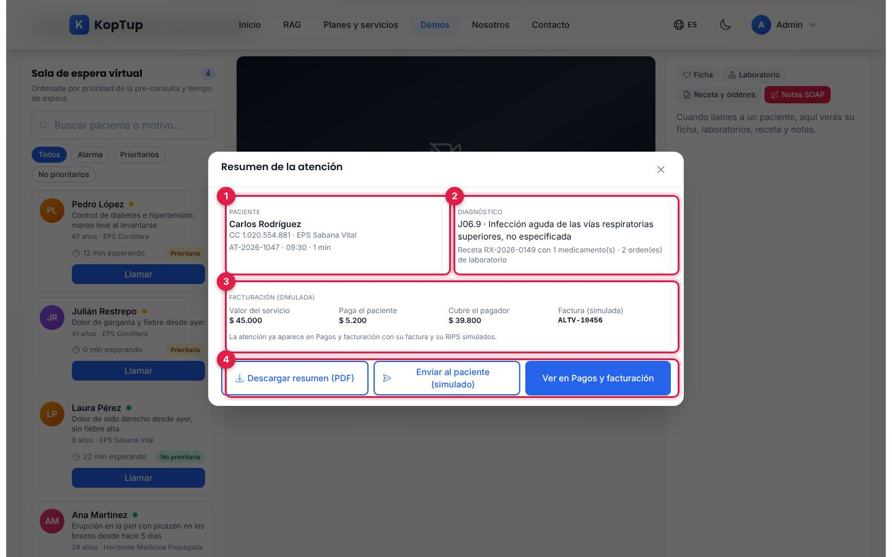

*Resumen de la atención AT-2026-1047.*

1. **Paciente**, número de atención, hora y duración.
2. **Diagnóstico**, receta y número de órdenes.
3. **Facturación (simulada)**: valor del servicio, lo que paga el paciente, lo que cubre el pagador y el número de factura (ALTV-10456).
4. **Descargar resumen (PDF)** (`resumen-atencion-AT-2026-1047.pdf`, con datos del paciente, registro SOAP, receta, órdenes y facturación), **Enviar al paciente (simulado)** y **Ver en Pagos y facturación**.

Qué decir: «El sistema no deja cerrar sin diagnóstico ni con una receta sin firmar, porque sin eso no hay factura ni RIPS».

### Paso 5. Cobro, factura y RIPS

**Ver en Pagos y facturación** abre la pestaña con la atención nueva de primera. Pulsa **Cobrar** en Carlos Rodríguez.

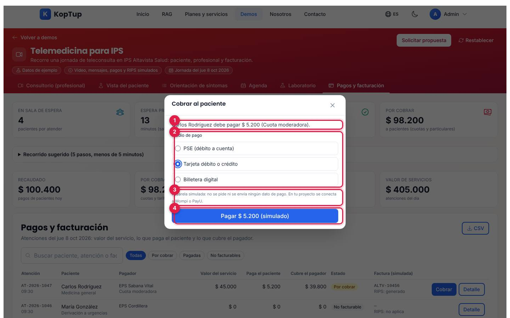

*Ventana «Cobrar al paciente» con la cuota moderadora de $ 5.200.*

1. **Qué paga y por qué**: «Carlos Rodríguez debe pagar $ 5.200 (Cuota moderadora)».
2. **Medio de pago**: PSE, tarjeta débito o crédito, o billetera digital.
3. **Pasarela simulada**: no se pide ni se envía ningún dato de pago.
4. **Pagar $ 5.200 (simulado)**: tras un segundo dice «Pago aprobado (simulado). Referencia SIM-…» y la fila pasa a **Pagado**.

Luego pulsa **Detalle** en la misma fila:

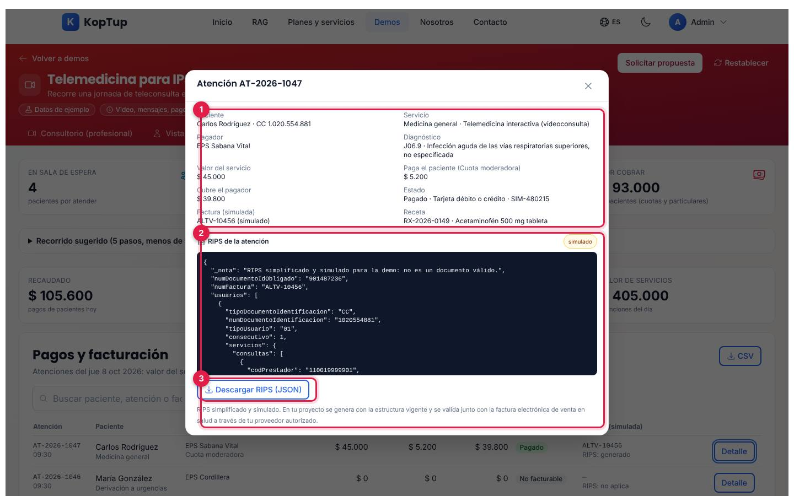

*Detalle de la atención AT-2026-1047 con su RIPS simulado.*

1. **Datos de la atención**: paciente, servicio, pagador, diagnóstico, valores, estado del pago (medio y referencia), factura simulada y receta.
2. **RIPS de la atención**: el JSON simplificado (prestador, factura, usuario, consulta con código CUPS, modalidad, diagnóstico sin punto, valor y cuota moderadora). Empieza con la nota «RIPS simplificado y simulado para la demo: no es un documento válido».
3. **Descargar RIPS (JSON)**: descarga `RIPS-ALTV-10456.json`.

Qué decir: «Cada consulta queda lista para radicar: con su factura y su RIPS, y lo que debe el paciente cobrado en línea».

---

## Pantallas y funciones

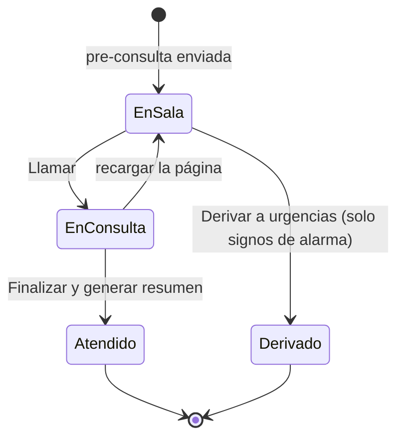

*Estados de un paciente en la demo. «Atendido» crea una atención por cobrar con factura y RIPS; «Derivado» crea una atención no facturable.*

### Encabezado e indicadores

- **Volver a demos**, título, insignias **Datos de ejemplo**, **Video, mensajes, pagos y RIPS simulados** y **Jornada del jue 8 oct 2026**.
- **Solicitar propuesta** abre `/contact?service=telemedicina` (el mismo destino tiene el botón **Quiero telemedicina para mi IPS** del final). **Restablecer** vuelve a los datos de ejemplo y borra lo que hiciste en ese navegador.
- Seis pestañas: Consultorio (profesional), Vista del paciente, Orientación de síntomas, Agenda, Laboratorio y Pagos y facturación.

| Indicador | Cómo se calcula |
|---|---|
| En sala de espera | Pacientes en espera (incluye los de signo de alarma sin derivar) |
| Espera promedio | Promedio de minutos de espera de la sala; sube un minuto por cada minuto real con la página abierta |
| Atenciones de hoy | Consultas finalizadas del día (las derivaciones no cuentan) |
| Por cobrar | Suma de lo que deben los pacientes en atenciones por cobrar |

La jornada arranca con 5 pacientes en sala (María González, alarma; Pedro López y Carlos Rodríguez, prioritarios; Laura Pérez, de 8 años, y Ana Martínez, no prioritarias) y 5 atenciones ya hechas en la mañana (3 pagadas y 2 por cobrar, $ 93.000).

### Consultorio (profesional)

Lo descrito en los [pasos 3 y 4](#paso-3-la-profesional-deriva-la-alarma-y-llama-al-siguiente-paciente): sala de espera, video, chat y panel de la consulta. Debajo de la sala está el **Registro de auditoría** con los últimos 8 eventos; **Ver completo** abre todos los de la sesión (hasta 300), con buscador y **CSV** (`auditoria-telemedicina-2026-10-08.csv`). Cada acción queda registrada con hora y actor (Sistema, Dra. Patricia Vargas, Paciente o Facturación): pre-consultas, orientaciones, citas, derivaciones, inicio y fin de consultas, grabación, diagnóstico, firma y envío de recetas, facturas, pagos y descargas.

### Vista del paciente

El formulario del [paso 1](#paso-1-el-paciente-llena-su-pre-consulta) y el mensaje de ejemplo con el enlace. El código trae también una tarjeta **Prueba tu cámara y micrófono**, pero en el sitio no aparece (ver la limitación 2).

### Orientación de síntomas

El chat y las reglas del [paso 2](#paso-2-orientación-de-síntomas-por-reglas). **Empezar de nuevo** borra el resultado y la conversación.

### Agenda

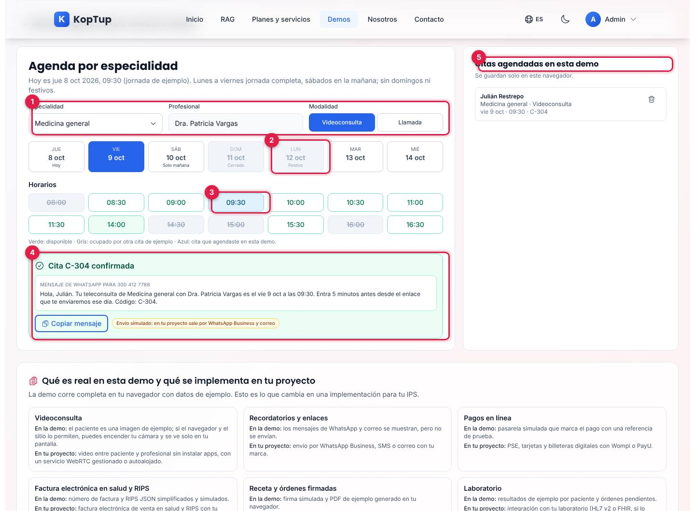

*Cita de medicina general agendada para el viernes 9 de octubre a las 09:30.*

1. **Especialidad, profesional y modalidad**: cinco especialidades con su profesional (Medicina general, Dra. Patricia Vargas; Pediatría, Dr. Andrés Mejía; Dermatología, Dr. Felipe Rojas; Medicina interna, Dra. Camila Ríos; Psicología, Ps. Iván Cárdenas) y **Videoconsulta** o **Llamada**.
2. **Siete días** desde hoy: el sábado dice «Solo mañana» y el domingo «Cerrado»; el lunes 12 de octubre aparece como **Festivo** (la demo trae los festivos de Colombia de 2026) y no se puede elegir.
3. **Horarios**: de lunes a viernes de 08:00 a 11:30 y de 14:00 a 16:30, cada 30 minutos; sábados de 08:00 a 11:30; hoy solo después de las 09:30. Verde: disponible; gris tachado: ocupado por otra cita de ejemplo; azul: tu cita.
4. **Confirmación**: al elegir un horario se piden nombre, celular (WhatsApp) y pagador, con el valor según el pagador (por ejemplo, «Cuota moderadora de ejemplo: $ 5.200. El resto ($ 45.000 en total) lo paga la EPS»). **Confirmar cita** muestra «Cita C-… confirmada» y el mensaje de WhatsApp que recibiría el paciente, con **Copiar mensaje** (el envío es simulado).
5. **Citas agendadas en esta demo**: la lista, con el botón para cancelar cada una (el horario vuelve a quedar libre).

| Especialidad | Particular | EPS (valor) | Prepagada (valor) |
|---|---|---|---|
| Medicina general | $ 65.000 | $ 45.000 | $ 58.000 |
| Pediatría | $ 95.000 | $ 62.000 | $ 80.000 |
| Dermatología | $ 120.000 | $ 78.000 | $ 98.000 |
| Medicina interna | $ 130.000 | $ 82.000 | $ 105.000 |
| Psicología | $ 90.000 | $ 55.000 | $ 75.000 |

*Tarifas de ejemplo. Con EPS el paciente paga una cuota moderadora de $ 5.200; con prepagada, un bono de $ 28.000; particular paga todo. El resto lo cubre el pagador.*

### Laboratorio

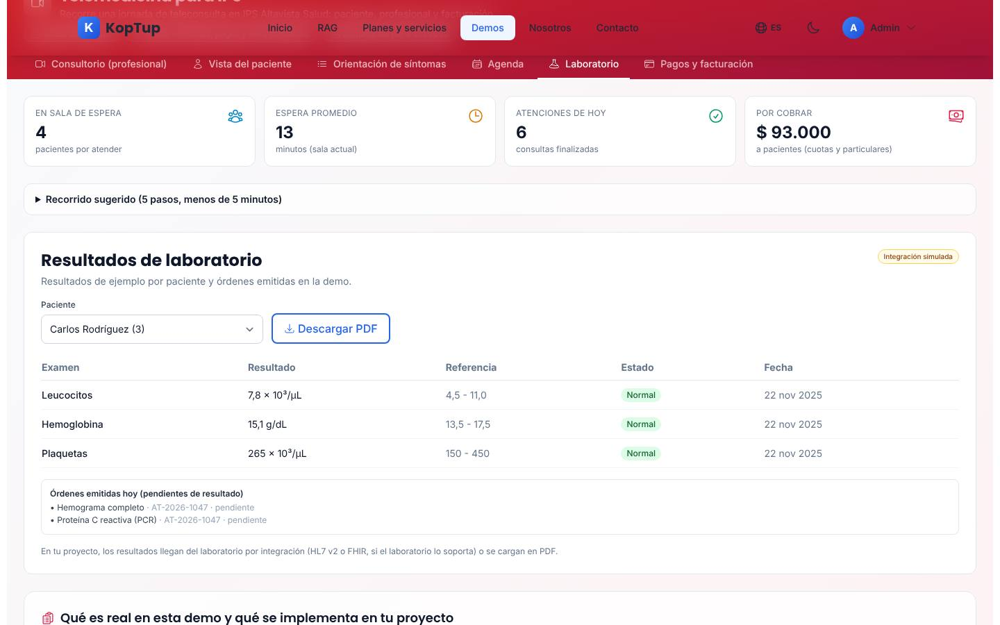

*Resultados de Carlos Rodríguez y las dos órdenes que se emitieron en su consulta.*

Elige el paciente (entre paréntesis, cuántos resultados tiene): la tabla muestra examen, resultado, referencia, estado (Normal, Alto, Bajo o Crítico) y fecha. Abre con Pedro López, que tiene la hemoglobina glicada, la glucosa y la microalbuminuria en «Alto». Debajo, **Órdenes emitidas hoy (pendientes de resultado)** con las órdenes firmadas en la demo. **Descargar PDF** descarga `laboratorio-<paciente>.pdf`. La integración con el laboratorio es simulada (insignia «Integración simulada»).

### Pagos y facturación

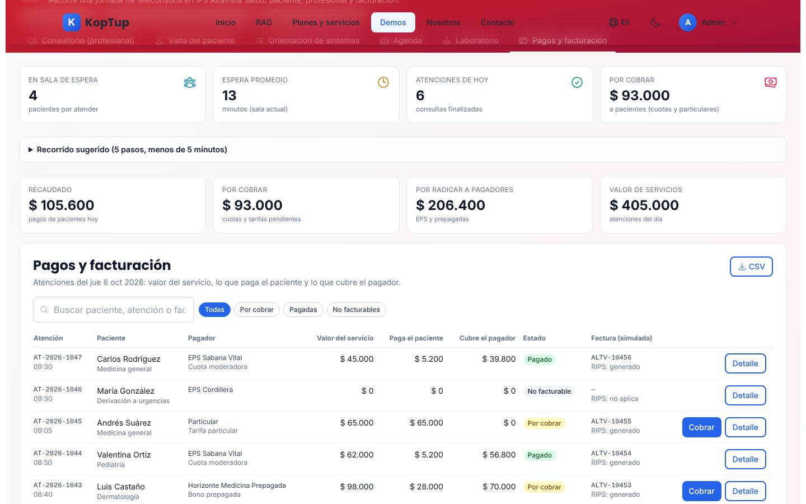

*Atenciones del día después del recorrido: la de Carlos Rodríguez ya está pagada y la derivación de María González no es facturable.*

- **Totales**: Recaudado (pagos de pacientes), Por cobrar, Por radicar a pagadores (EPS y prepagadas) y Valor de servicios. En cada fila, el valor del servicio = lo que paga el paciente + lo que cubre el pagador.
- **Buscar** por paciente, atención o factura y filtrar por Todas, Por cobrar, Pagadas o No facturables.
- **CSV** descarga `atenciones-2026-10-08.csv` (atención, fecha, paciente, servicio, pagador, diagnóstico, valores, estado, factura y RIPS).
- Por fila: **Cobrar** (solo si está por cobrar; ver el [paso 5](#paso-5-cobro-factura-y-rips)) y **Detalle** (con el RIPS; las derivaciones dicen «Las derivaciones a urgencias no generan factura ni RIPS en esta demo»).

### Qué es real en esta demo y nota final

Al final de la página, nueve tarjetas comparan «En la demo» y «En tu proyecto» (videoconsulta, recordatorios, pagos, factura electrónica en salud y RIPS, receta firmada, laboratorio, ficha, orientación de síntomas y auditoría) y una nota cita la Resolución 2654 de 2019 (telesalud y telemedicina) y la Ley 1581 de 2012, aclarando que la habilitación del servicio es responsabilidad de la IPS. Debajo, el bloque común de las demos: **Solicitar demo guiada** (`/solicitar-demo?demos=telemedicina`), **Solicitar Cotización** (`/contact`) y **Ver Planes y Precios** (`/services#planes-rag`).

### En el celular

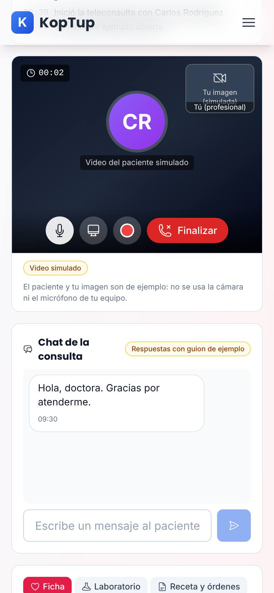

*Consulta en curso en un teléfono (390 px): al llamar a un paciente, la página baja sola hasta el video.*

Las pestañas se desplazan de lado, los indicadores quedan en dos columnas y el consultorio se apila: sala de espera, auditoría, video, chat y panel de la consulta.

---

## Qué es real y qué es simulado

| Parte | Real o simulado | Detalle |
|---|---|---|
| Pre-consulta, sala de espera por prioridad, consultas, derivaciones | **Funciona de verdad, en el navegador** | Con 5 pacientes de ejemplo; los pacientes nuevos que envíes entran a la sala. |
| Orientación de síntomas | **Reglas fijas** | Expresiones de palabras clave en el navegador; no hay IA ni diagnóstico. |
| Video, cámara, compartir pantalla y grabación | **Simulados** | El paciente es una imagen; no hay video ni audio (ver la limitación 2). |
| Chat con el paciente | **Simulado (guion)** | Respuestas fijas por paciente, en orden. |
| Alertas de alergia y controles de cierre | **Funcionan de verdad** | Bloquean la firma y el cierre según las reglas descritas. |
| Receta, resumen y laboratorio en PDF | **Real, con datos ficticios** | Se generan en el navegador con la marca «DOCUMENTO DE EJEMPLO… sin validez clínica ni legal»; la firma es simulada. |
| Agenda | **Funciona de verdad, en el navegador** | Con festivos de Colombia 2026 y horarios ocupados de ejemplo; el WhatsApp no se envía. |
| Pagos | **Simulados** | Pasarela de mentira; la referencia es `SIM-…`. |
| Factura y RIPS | **Simulados** | Número `ALTV-…` y un JSON simplificado que no es un RIPS válido. |
| CSV de atenciones y de auditoría, RIPS en JSON | **Real, con datos ficticios** | Se descargan desde el navegador. |
| IPS, pacientes, EPS, prepagada, profesionales, documentos y valores | **Ficticios** | Tarifas de ejemplo, no oficiales. |
| Dónde se guarda | **Navegador** | `localStorage` (`koptup:demo:telemedicina:v2`); no se envía nada a ningún servidor. |

---

## Acceso

**Cómo lo ve un visitante.** La demo aparece en `/demo` con la tarjeta «Telemedicina HIPAA», la insignia «Requiere acceso» y los botones **Solicitar acceso** y **Ya tengo acceso: iniciar sesión**. Si alguien abre `/demo/telemedicina` sin sesión, la web muestra en la misma dirección la pantalla de acceso:

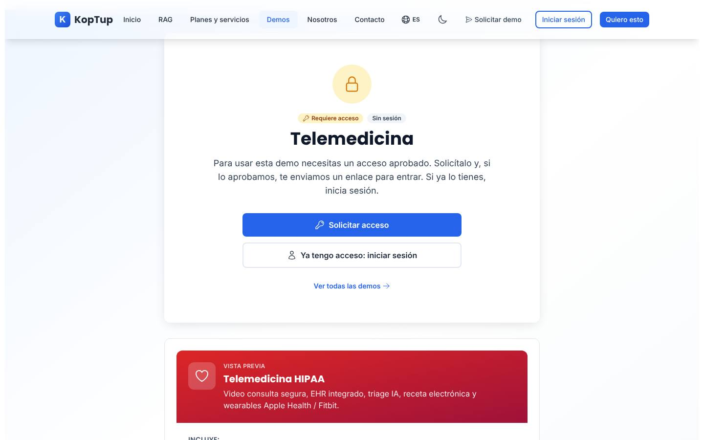

*Lo que ve un visitante sin sesión: «Requiere acceso», «Sin sesión» y los botones para pedir la demo o iniciar sesión. Debajo, una vista previa con el texto del catálogo.*

- **Solicitar acceso** abre `/solicitar-demo?demos=telemedicina` con la demo ya elegida.
- **Ya tengo acceso: iniciar sesión** lleva a `/login` y, al entrar, vuelve a la demo.
- **Ver todas las demos** vuelve a `/demo`.
- Con sesión pero sin acceso, la misma pantalla dice que la cuenta todavía no tiene acceso; si el acceso venció o fue retirado, ofrece pedir más tiempo o solicitarlo de nuevo.

**Cómo se concede.** La solicitud llega a **Admin › Solicitudes de demo**, donde la demo se llama «Telemedicina». Pueden aprobarla los roles **admin** y **sales**. Al aprobar, se crea o se reutiliza la cuenta del prospecto, el acceso dura 14 días por defecto (se extiende o se revoca en **Admin › Accesos a demos**) y la persona recibe un correo con la decisión (con el enlace de activación si su cuenta es nueva). El equipo de KopTup (admin, manager, sales y developer) abre la demo sin solicitud. Solo el admin cambia el modo de acceso, en **Admin › Catálogo de demos**. Detalle en el [Manual del administrador](Doc-06-Manual-del-Administrador.md) y en [Flujos del visitante](Doc-04-Flujos-del-Visitante.md).

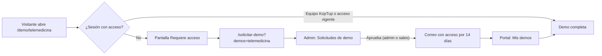

*Camino de un visitante hasta la demo.*

---

## Limitaciones conocidas

1. **La tarjeta del hub promete más de lo que hay.** Dice «Telemedicina HIPAA», «Video call HIPAA-compliant con WebRTC propio», «Triage IA», «EHR/EMR» e «Integración wearables… y farmacias». En la demo no hay video real, la orientación de síntomas son reglas fijas sin IA, y no hay wearables ni farmacias. La propia demo lo aclara en «Qué es real en esta demo».
2. **La cámara y el micrófono nunca se activan en el sitio.** El código permite encender tu cámara en la videoconsulta y trae una prueba de cámara y micrófono en la Vista del paciente, pero el sitio envía la cabecera `Permissions-Policy` con `camera=()` y `microphone=()`, así que el navegador lo bloquea: el botón de cámara y la tarjeta de prueba no aparecen, y el video muestra «Tu imagen (simulada)» con la nota «no se usa la cámara ni el micrófono de tu equipo».
3. **Toda consulta del consultorio se registra como Medicina general.** Al finalizar, la atención queda como medicina general con la tarifa de medicina general del pagador, aunque el paciente venga por la piel (Ana Martínez, que con prepagada quedaría en $ 58.000) o sea una niña de 8 años con dolor de oído.
4. **La agenda no está conectada con el consultorio.** Las citas agendadas solo quedan en la lista «Citas agendadas en esta demo»: no entran a la sala de espera ni a Pagos y facturación.
5. **«Línea de emergencias 123» no es un enlace.** En Orientación de síntomas parece un botón rojo, pero no hace nada al tocarlo (no abre el marcador del teléfono).
6. **El enlace de WhatsApp de la Vista del paciente es fijo.** Siempre dice «Hola, Carlos… te espera hoy a las 10:30…», sin importar quién llene la pre-consulta.
7. **El reloj vuelve a las 09:30 cada vez que se carga la página.** Las horas de las consultas, recetas y eventos salen de ese reloj; si recargas, los nuevos eventos pueden quedar con una hora anterior a los que ya estaban. La duración del resumen se redondea a minutos (mínimo 1 min), mientras la auditoría la muestra en minutos y segundos.
8. **Detalles de texto.** En la auditoría, la cita aparece con la fecha en formato técnico («el 2026-10-09 a las 09:30»). En el celular, dentro de la miniatura «Tu imagen (simulada)» el texto se monta sobre «Tú (profesional)». El «Turno aproximado» de la pre-consulta cuenta también a la paciente con signo de alarma, que no se atiende por teleconsulta.
9. **Los cambios viven solo en ese navegador.** Otra persona, otro equipo o una ventana privada ven los datos de ejemplo. Si recargas con una consulta abierta, el paciente vuelve a la sala de espera y se pierde lo que llevabas de esa consulta (receta, notas, chat).
10. **Los botones de contacto no preseleccionan bien el servicio.** **Solicitar propuesta** y **Quiero telemedicina para mi IPS** abren `/contact?service=telemedicina`, que muestra «Estás cotizando: telemedicina» con el nombre en minúscula; **Ver Planes y Precios** abre los planes RAG (`/services#planes-rag`), no un plan de telemedicina.
11. **Tres nombres para la misma demo:** «Telemedicina HIPAA» en el hub, «Telemedicina para IPS» en la página y «Telemedicina» en el catálogo del admin y en el formulario de solicitud.
