# Guía de la demo: Agente de voz con IA para call center

> Ruta `/demo/voice-ai` · Modo de acceso: **Con solicitud** · Tipo: **datos de ejemplo** (llamadas con guion fijo en el navegador; la voz la pone el propio navegador; no llama al servidor ni a un modelo de IA) · Plan del producto: [Voice AI para call center](Producto-voice-ai-callcenter.md)

**Resumen.** Muestra cómo atendería el teléfono un agente de voz con IA en cuatro llamadas de ejemplo en español (banca, salud, cobranza y pedidos): mientras la llamada avanza se ven la transcripción con los datos sensibles enmascarados, la intención, el sentimiento, las acciones que el agente ejecuta en los sistemas de la empresa y, cuando hace falta, la transferencia a un asesor con todo el contexto. Completan la demo las métricas de la jornada, el registro de llamadas y una campaña saliente de cobranza que respeta horarios y festivos de Colombia. Está pensada para gerentes de contact center, cobranza y agendamiento; se abre solo con un acceso aprobado y lo que haces se guarda solo en tu navegador.

**En esta página:** [Recorrido sugerido](#recorrido-sugerido-demo-comercial-de-5-minutos) · [Pantallas y funciones](#pantallas-y-funciones) · [Qué es real y qué es simulado](#qué-es-real-y-qué-es-simulado) · [Acceso](#acceso) · [Limitaciones conocidas](#limitaciones-conocidas)

*Vista inicial: encabezado con «Datos de ejemplo» y «Llamadas con guion», los cuatro escenarios (Banca seleccionado), la personalización y el inicio de la llamada.*

---

## Recorrido sugerido (demo comercial de 5 minutos)

La idea que vende: «el agente contesta, verifica, resuelve en tus sistemas y, si no puede, le pasa la llamada a una persona sin que el cliente repita nada». Todo está en una sola página, de arriba abajo. Si alguien ya usó la demo en ese navegador, empieza con **Restablecer** (arriba a la derecha). Usa un computador con altavoces: la demo habla con la voz de tu navegador.

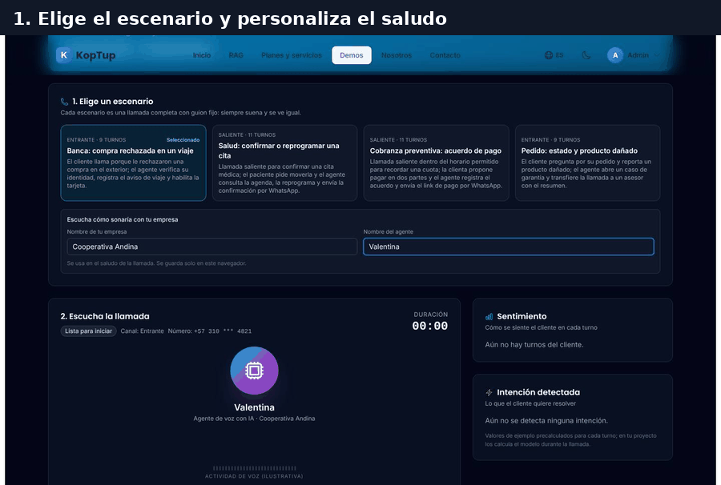

*Recorrido en 7 cuadros: escenario, llamada en curso, resumen, transcripción y flujo, transferencia, cumplimiento y métricas, y campaña saliente.*

### Paso 1. Elige el escenario y ponle el nombre del cliente

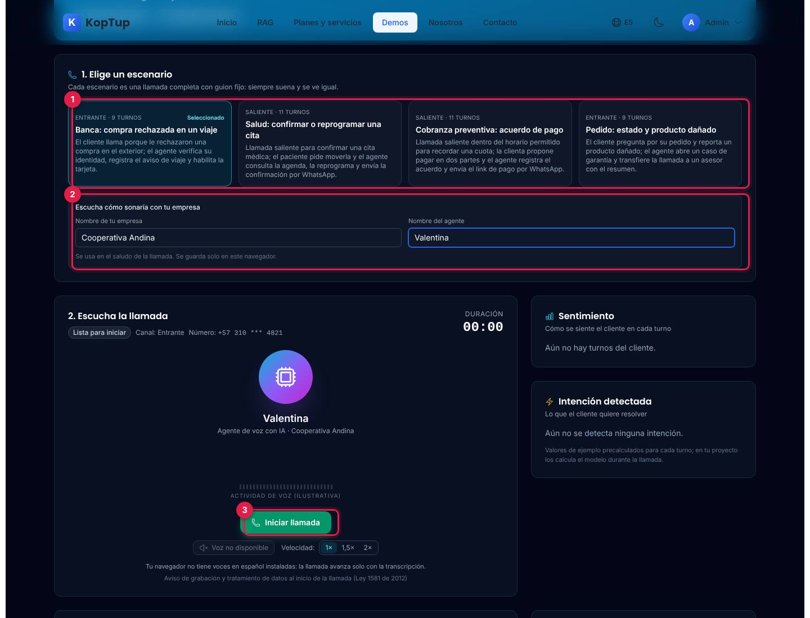

*Escenario «Banca» con la empresa y el agente personalizados.*

1. **Elige un escenario**: cuatro llamadas completas con guion fijo (siempre suenan y se ven igual):

| Escenario | Tipo | Turnos | Qué pasa |
|---|---|---|---|
| Banca: compra rechazada en un viaje | Entrante | 9 | El agente verifica la cédula, consulta movimientos, registra el aviso de viaje y habilita la tarjeta. Resuelve solo. |
| Salud: confirmar o reprogramar una cita | Saliente | 11 | Llama para confirmar una cita; el paciente pide moverla; el agente busca cupos, la reprograma y envía la confirmación por WhatsApp. Resuelve solo. |
| Cobranza preventiva: acuerdo de pago | Saliente | 11 | Recuerda una cuota dentro del horario permitido; la clienta propone pagar en dos partes; el agente registra el acuerdo y envía el link de pago. Resuelve solo. |
| Pedido: estado y producto dañado | Entrante | 9 | Consulta el pedido, abre un caso de garantía, pide fotos por WhatsApp y **transfiere** a un asesor con el resumen. |

2. **Escucha cómo sonaría con tu empresa**: el nombre de la empresa (hasta 40 caracteres) y el del agente (hasta 20; por defecto «Sofía») se usan en el saludo, en la transcripción y en el resumen. Se guardan solo en ese navegador.
3. **Iniciar llamada**: empieza el paso 2.

Qué decir: «Escriban el nombre de su empresa: así sonaría su agente».

### Paso 2. Escucha la llamada

Para una demo rápida, elige **Velocidad 2×** antes de iniciar. La captura está en pausa en el turno 5 (00:30), justo cuando el agente verifica la identidad.

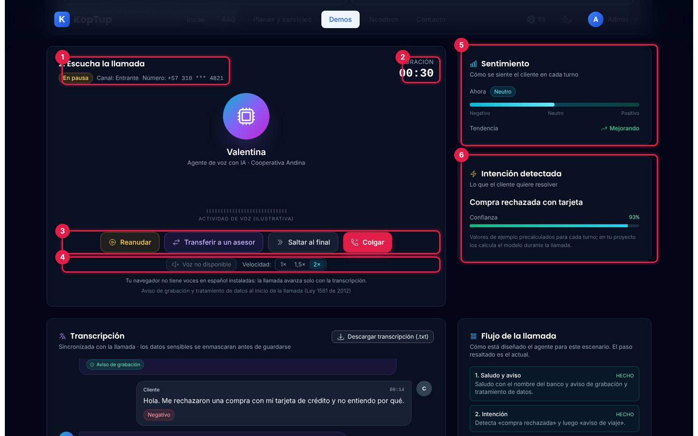

*Llamada de banca en pausa: la intención ya se detectó y el sentimiento va mejorando.*

1. **Estado y datos de la llamada**: Lista para iniciar, En curso, En pausa, Transferida a un asesor o Finalizada; canal (entrante o saliente) y número enmascarado.
2. **Duración**: el reloj de la llamada según el guion.
3. **Controles**: **Pausar** / **Reanudar**, **Transferir a un asesor**, **Saltar al final** y **Colgar**. Al terminar aparece **Repetir llamada**.
4. **Voz y velocidad**: activar o silenciar la voz y elegir 1×, 1,5× o 2×. Debajo, una nota dice qué voz se está usando. En el navegador de las capturas no había voces en español, por eso dice «Voz no disponible» y «Tu navegador no tiene voces en español instaladas: la llamada avanza solo con la transcripción»; en Chrome, Edge o Safari de escritorio normalmente sí hay.
5. **Sentimiento**: cómo se siente el cliente ahora (Negativo, Neutro o Positivo), en una barra, y la tendencia (Mejorando, Estable o Empeorando).
6. **Intención detectada**: lo que el cliente quiere resolver y la confianza (aquí, «Compra rechazada con tarjeta», 93 %). Son valores precalculados por turno; la propia tarjeta lo aclara.

En el centro, el círculo cambia de color y el texto dice «Habla Valentina» o «Habla el cliente»; la onda de voz es ilustrativa. El cliente suena con otra voz del navegador o con un tono más grave.

Qué decir: «Mientras habla, el supervisor ya sabe qué quiere el cliente y cómo está».

### Paso 3. Resumen, transcripción y acciones

Deja terminar la llamada (o pulsa **Saltar al final**). Aparece el resumen y se completa todo lo de abajo.

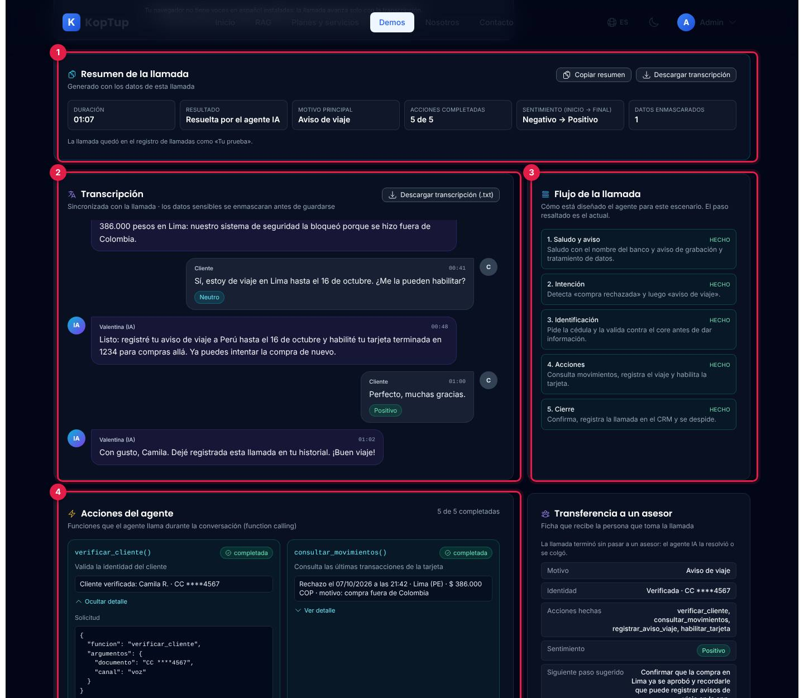

*Llamada de banca terminada: resuelta por el agente en 01:07, 5 de 5 acciones completadas.*

1. **Resumen de la llamada**: duración, resultado (Resuelta por el agente IA, Transferida a un asesor o Colgada antes de terminar), motivo principal, acciones completadas, sentimiento de inicio a fin y datos enmascarados. **Copiar resumen** lo copia como texto; **Descargar transcripción** baja el `.txt`. La llamada queda en el registro como «Tu prueba».
2. **Transcripción**: sincronizada con la llamada, con la hora de cada turno, el sentimiento de cada intervención del cliente y las marcas «Aviso de grabación» y «Dato enmascarado» (la cédula aparece como `CC ****4567`; en voz se lee completa, en la transcripción no). **Descargar transcripción (.txt)** baja `transcripcion-banca.txt`.
3. **Flujo de la llamada**: los pasos con que está diseñado el agente para ese escenario (Saludo y aviso, Identificación, Intención, Acciones, Cierre o Transferencia), cada uno «hecho», «en curso» o «pendiente».
4. **Acciones del agente** (function calling): cada función con su estado (pendiente, ejecutando…, completada o «no se ejecutó» si la llamada terminó antes) y su resultado, por ejemplo `habilitar_tarjeta()` → «Tarjeta ****1234 habilitada para compras en Perú hasta el 16/10/2026». **Ver detalle** muestra la solicitud en JSON, la respuesta y en qué sistema se conectaría en un proyecto (core bancario, agenda médica, cartera, pasarela de pagos, WhatsApp Business, CRM, tienda, mesa de ayuda o plataforma de contact center).

Qué decir: «No es solo una voz bonita: hace el trabajo en tus sistemas y deja la evidencia».

### Paso 4. Transferencia a un asesor con contexto

Elige **Pedido: estado y producto dañado**, pulsa **Iniciar llamada** y luego **Saltar al final**. Esta llamada termina transferida.

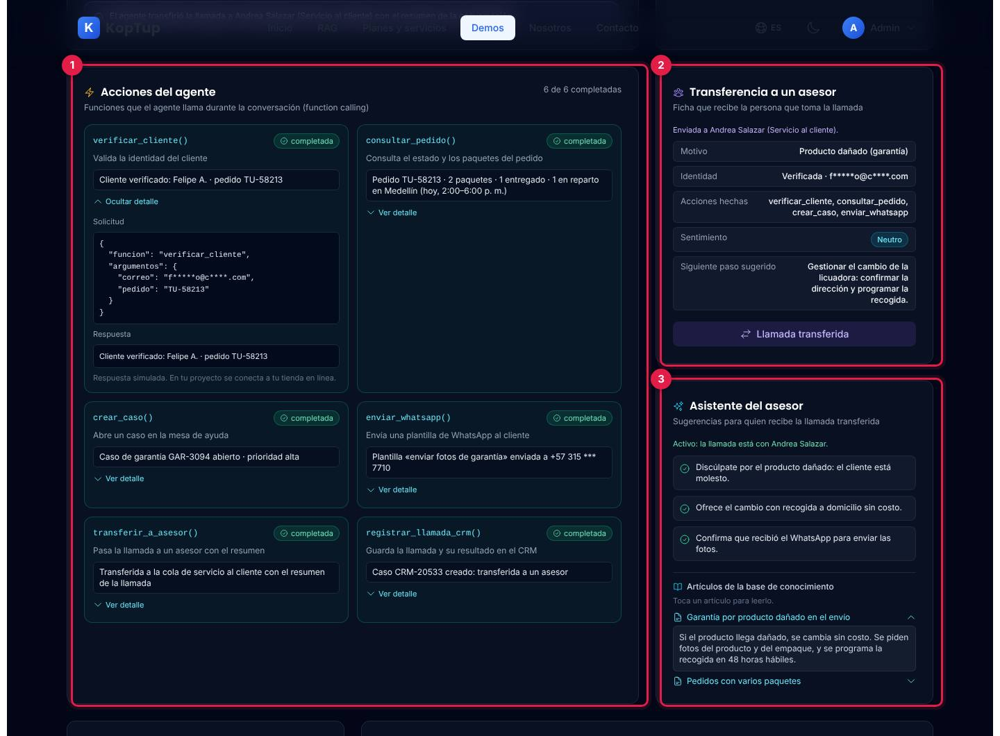

*Llamada de pedido transferida a Andrea Salazar (Servicio al cliente).*

1. **Acciones del agente**: las seis funciones completadas, de `verificar_cliente()` a `transferir_a_asesor()` y `registrar_llamada_crm()`.
2. **Transferencia a un asesor**: la ficha que recibe la persona: motivo, identidad verificada (con el correo enmascarado), acciones hechas, sentimiento y siguiente paso sugerido. Antes de transferir dice «Vista previa: esto recibiría el asesor si transfieres ahora»; el botón **Transferir a un asesor** solo funciona con la llamada en curso o en pausa.
3. **Asistente del asesor**: se activa cuando la llamada pasa a una persona («Activo: la llamada está con Andrea Salazar»): tres sugerencias y dos artículos de la base de conocimiento que se abren con un toque.

También puedes transferir a mano en cualquier escenario con **Transferir a un asesor** durante la llamada: la transcripción cierra con «Transferiste la llamada a … con el resumen de la conversación» y las acciones que faltaban quedan como «no se ejecutó».

Qué decir: «El asesor recibe la llamada sabiendo todo; el cliente no repite su cédula ni su problema».

### Paso 5. Cumplimiento y métricas

Elige **Cobranza preventiva**, iníciala y salta al final. Baja hasta **Cumplimiento** y **Métricas de la jornada**.

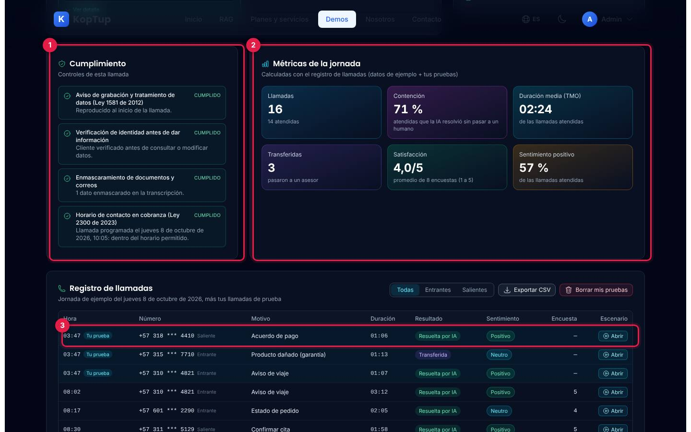

*Controles de la llamada de cobranza y métricas de la jornada con tres llamadas de prueba.*

1. **Cumplimiento**: aviso de grabación y tratamiento de datos (Ley 1581 de 2012), verificación de identidad antes de dar información, enmascaramiento de documentos y correos, y horario de contacto en cobranza (Ley 2300 de 2023). Cada control dice «cumplido», «pendiente» o «no aplica» (por ejemplo, el horario no aplica a una llamada entrante ni a una que no es de cobranza). En cobranza: «Llamada programada el jueves 8 de octubre de 2026, 10:05: dentro del horario permitido».
2. **Métricas de la jornada**: se calculan con el registro de llamadas (las 13 de ejemplo más tus pruebas).
3. **Tu prueba** en el registro: cada llamada que terminas queda arriba del registro y entra en las métricas.

| Métrica | Cómo se calcula | Con las 13 llamadas de ejemplo |
|---|---|---|
| Llamadas | Todas las del registro, y cuántas se atendieron (resueltas, transferidas o colgadas) | 13 (11 atendidas) |
| Contención | Atendidas que la IA resolvió sin pasar a un humano, sobre las atendidas | 73 % |
| Duración media (TMO) | Promedio de duración de las atendidas | 02:44 |
| Transferidas | Llamadas que pasaron a un asesor | 2 |
| Satisfacción | Promedio de la encuesta de 1 a 5 | 4,0/5 (8 encuestas) |
| Sentimiento positivo | Atendidas que terminaron con sentimiento positivo | 55 % |

*Con las tres pruebas de la captura (banca, pedido y cobranza) quedan 16 llamadas, 71 % de contención, 02:24 de TMO y 3 transferidas; tus pruebas no tienen encuesta.*

Qué decir: «Todo queda medido: cuánto resuelve solo, cuánto dura y cómo sale el cliente».

### Paso 6. Campaña saliente con reglas de horario

Baja hasta **Campaña saliente: recordatorio de pago** y pulsa **Simular campaña**: el marcador recorre los 14 contactos (programados entre el 8 y el 13 de octubre) en unos 5 segundos.

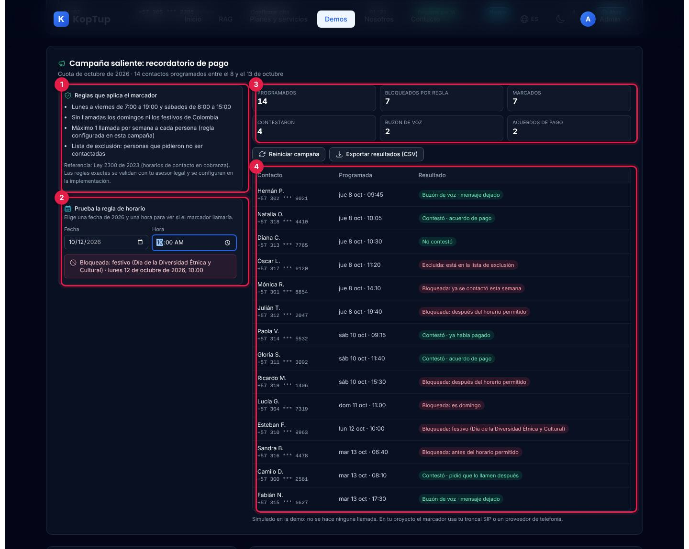

*Campaña terminada: 7 llamadas bloqueadas por regla y 2 acuerdos de pago; la prueba de horario muestra que el 12 de octubre es festivo.*

1. **Reglas que aplica el marcador**: lunes a viernes de 7:00 a 19:00 y sábados de 8:00 a 15:00; sin domingos ni festivos de Colombia; máximo una llamada por semana a cada persona; lista de exclusión. Con la referencia a la Ley 2300 de 2023 y la nota de validar las reglas con un asesor legal.
2. **Prueba la regla de horario**: elige una fecha de 2026 y una hora y la demo dice si el marcador llamaría o por qué no (domingo, festivo con su nombre, antes o después del horario). Viene con el domingo 11 de octubre a las 11:00.
3. **Indicadores**: programados, bloqueados por regla, marcados, contestaron, buzón de voz y acuerdos de pago.
4. **Contactos**: cada uno con su hora programada y el resultado: «Contestó · acuerdo de pago», «Buzón de voz · mensaje dejado», «No contestó», «Contestó · ya había pagado», «Contestó · pidió que lo llamen después» o el motivo del bloqueo (excluida, ya contactada esta semana, después del horario, domingo, festivo, antes del horario).

**Reiniciar campaña** la vuelve a dejar en espera y **Exportar resultados (CSV)** baja `campana-recordatorio-pago.csv`. Los resultados de los contactos permitidos son fijos; lo que decide la demo es si cada llamada se bloquea.

Qué decir: «El marcador no llama a quien no debe ni cuando no debe».

---

## Pantallas y funciones

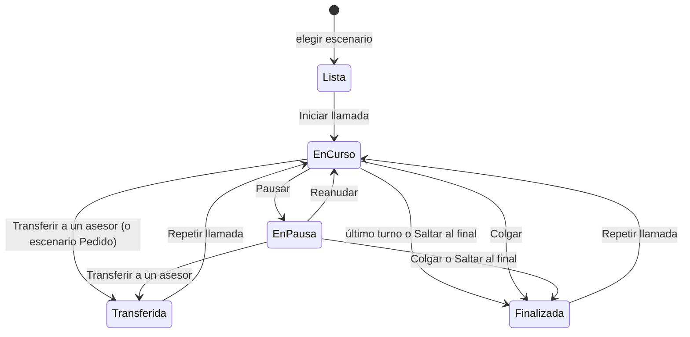

*Estados de la llamada. Al llegar a Finalizada o Transferida, la llamada se guarda en el registro como «Tu prueba» (resuelta, transferida o colgada).*

### Encabezado

**Volver a demos**, título, insignias **Datos de ejemplo** y **Llamadas con guion**, **Solicitar demo con tu guion** (abre `/contact?service=voice-ai-callcenter`; el botón del final hace lo mismo) y **Restablecer** (borra tus llamadas de prueba, la personalización, la voz elegida y la campaña simulada, y vuelve al escenario Banca).

### Escenario y llamada

Lo descrito en los [pasos 1 a 4](#paso-1-elige-el-escenario-y-ponle-el-nombre-del-cliente). Cada turno dura según su número de palabras (unas 2,6 palabras por segundo, mínimo 2 segundos), así que la llamada de banca dura 01:07 y la de pedido 01:13 a velocidad normal. Si la voz del navegador está activa, la llamada espera a que termine de hablar antes de pasar al siguiente turno. Cambiar de escenario reinicia la llamada.

### Transcripción, flujo, acciones, transferencia y asistente

Ver los [pasos 3 y 4](#paso-3-resumen-transcripción-y-acciones). Antes de iniciar, la transcripción dice «Pulsa «Iniciar llamada» para empezar.»; si cuelgas antes de terminar, cierra con «La llamada se colgó antes de terminar.».

### Registro de llamadas

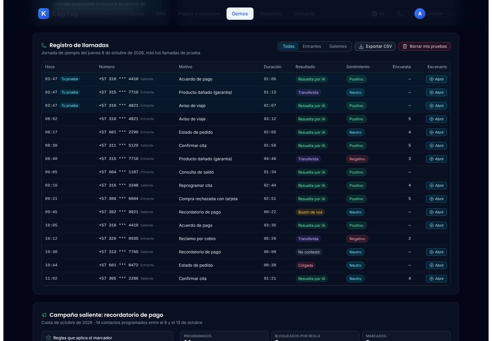

*Registro con tres llamadas de prueba arriba y las 13 de la jornada de ejemplo.*

- Jornada de ejemplo del jueves 8 de octubre de 2026 (7 entrantes y 6 salientes, de 08:02 a 11:02) más tus pruebas, marcadas «Tu prueba».
- Columnas: hora, número enmascarado y canal, motivo, duración, resultado (Resuelta por IA, Transferida, Colgada, Buzón de voz o No contestó), sentimiento, encuesta y escenario.
- Pestañas **Todas**, **Entrantes** y **Salientes**; **Exportar CSV** (`registro-llamadas-ejemplo.csv`, separado por punto y coma); **Borrar mis pruebas** (solo aparece si hay pruebas).
- **Abrir** carga el escenario de ejemplo de ese tipo de llamada y sube hasta la llamada. Dos filas no tienen escenario (Consulta de saldo y Reclamo por cobro), así que no tienen **Abrir**.

### Voz de la demo, implementación y glosario

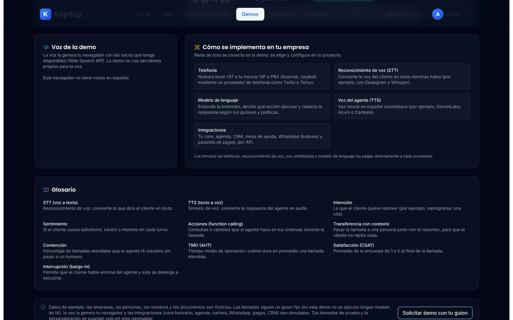

*Tarjetas del final de la página, en un navegador sin voces en español.*

- **Voz de la demo**: si el navegador tiene voces en español, permite elegir la voz del agente («Automática» elige la mejor, prefiriendo es-CO, luego español latinoamericano, de Estados Unidos, México y España). Si no hay, dice «Este navegador no tiene voces en español.».
- **Cómo se implementa en tu empresa**: telefonía (número +57, troncal SIP o PBX con un proveedor como Twilio o Telnyx), reconocimiento de voz (STT), modelo de lenguaje, voz del agente (TTS) e integraciones; los minutos de cada proveedor los paga el cliente directamente.
- **Glosario**: STT, TTS, intención, sentimiento, acciones (function calling), transferencia con contexto, contención, TMO, satisfacción (CSAT) e interrupción (barge-in).
- Nota final de datos de ejemplo y el bloque común de las demos: **Solicitar demo guiada** (`/solicitar-demo?demos=voice-ai`), **Solicitar Cotización** (`/contact`) y **Ver Planes y Precios** (`/services#planes-rag`).

### En el celular

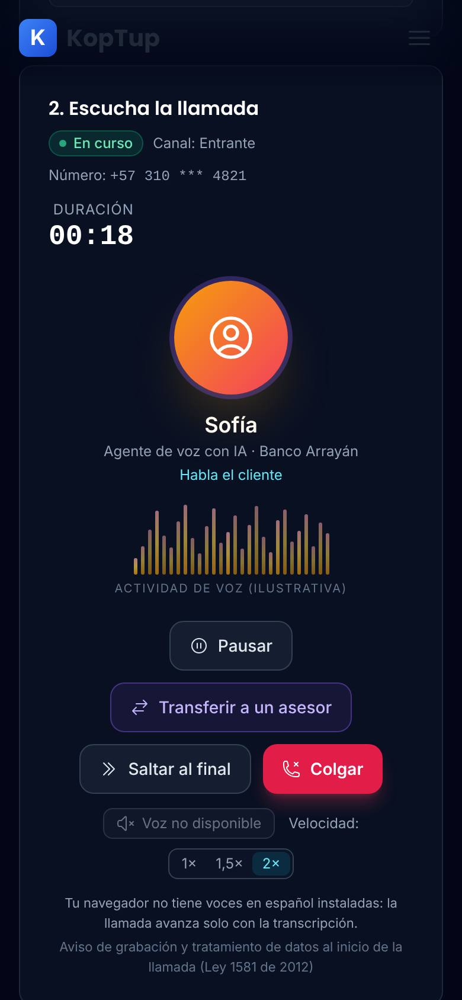

*Llamada de banca en curso en un teléfono (390 px), cuando habla el cliente.*

Todo se apila en una columna: escenarios, llamada, sentimiento, intención, transcripción, flujo, acciones, transferencia, asistente, cumplimiento, métricas, registro (con desplazamiento lateral) y campaña. Los controles de la llamada se acomodan en varias filas.

---

## Qué es real y qué es simulado

| Parte | Real o simulado | Detalle |
|---|---|---|
| Las cuatro llamadas | **Guion fijo** | Textos, turnos, intención, confianza y sentimiento están escritos de antemano; no hay reconocimiento de voz ni modelo de IA. |
| Voz | **Real, del navegador** | Síntesis de voz del navegador (Web Speech API) con las voces instaladas en el equipo; no usa servidores. Si no hay voces en español, la llamada avanza solo con texto. |
| Acciones del agente | **Simuladas** | Las respuestas de cada función son fijas; no se conecta a ningún sistema. |
| Transferencia y asistente del asesor | **Simulados** | Muestran la ficha y las sugerencias; no hay asesor ni cola real. |
| Enmascaramiento | **Datos ya enmascarados** | Los documentos, correos y números vienen enmascarados en el guion. |
| Reglas de horario, festivos, exclusión y frecuencia | **Funcionan de verdad** | Se calculan en el navegador con los festivos de Colombia de 2026. |
| Campaña saliente | **Simulada** | No se hace ninguna llamada; los resultados de los contactos permitidos son fijos. |
| Métricas | **Cálculo real sobre datos de ejemplo** | Con el registro de ejemplo más tus pruebas. |
| Transcripción `.txt`, resumen copiado y CSV | **Real, con datos ficticios** | Se generan en el navegador. |
| Empresas, personas, números y documentos | **Ficticios** | Banco Arrayán, IPS Monteclaro, Créditos Guadua y Casa Tucán. |
| Dónde se guarda | **Navegador** | `localStorage` (`koptup-demo-voice-ai-v1`): tus últimas 50 llamadas de prueba, la personalización, la voz, la velocidad y si la voz está activa. La campaña no se guarda. |

---

## Acceso

**Cómo lo ve un visitante.** La demo aparece en `/demo` con la tarjeta «Voice AI / Call Center», la insignia «Requiere acceso» y los botones **Solicitar acceso** y **Ya tengo acceso: iniciar sesión**. Si alguien abre `/demo/voice-ai` sin sesión, la web muestra en la misma dirección la pantalla de acceso:

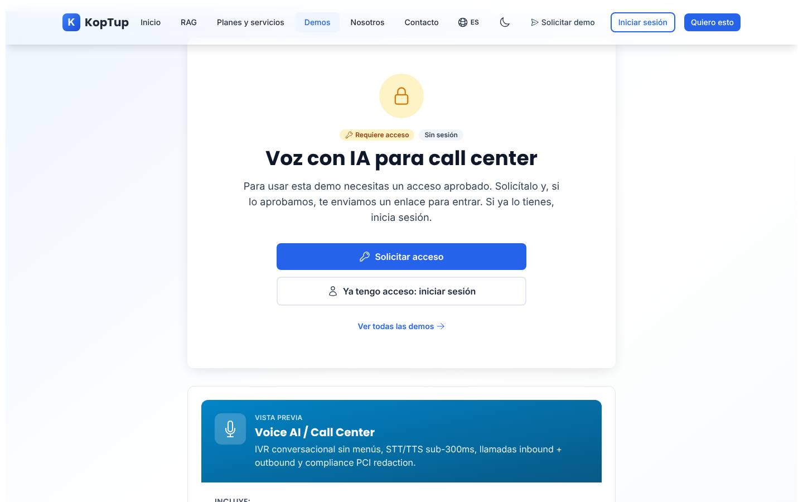

*Lo que ve un visitante sin sesión: «Requiere acceso», «Sin sesión» y los botones para pedir la demo o iniciar sesión. Debajo, una vista previa con el texto del catálogo.*

- **Solicitar acceso** abre `/solicitar-demo?demos=voice-ai` con la demo ya elegida.
- **Ya tengo acceso: iniciar sesión** lleva a `/login` y, al entrar, vuelve a la demo.
- **Ver todas las demos** vuelve a `/demo`.
- Con sesión pero sin acceso, la misma pantalla dice que la cuenta todavía no tiene acceso; si el acceso venció o fue retirado, ofrece pedir más tiempo o solicitarlo de nuevo.

**Cómo se concede.** La solicitud llega a **Admin › Solicitudes de demo**, donde la demo se llama «Voz con IA para call center». Pueden aprobarla los roles **admin** y **sales**. Al aprobar, se crea o se reutiliza la cuenta del prospecto, el acceso dura 14 días por defecto (se extiende o se revoca en **Admin › Accesos a demos**) y la persona recibe un correo con la decisión (con el enlace de activación si su cuenta es nueva). El equipo de KopTup (admin, manager, sales y developer) abre la demo sin solicitud. Solo el admin cambia el modo de acceso, en **Admin › Catálogo de demos**. Detalle en el [Manual del administrador](Doc-06-Manual-del-Administrador.md) y en [Flujos del visitante](Doc-04-Flujos-del-Visitante.md).

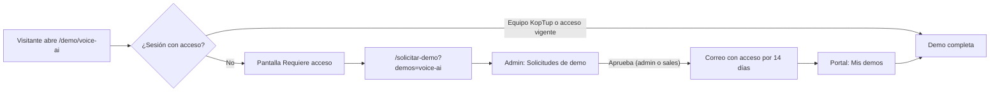

*Camino de un visitante hasta la demo.*

---

## Limitaciones conocidas

1. **No hay IA ni reconocimiento de voz.** Las llamadas siguen un guion fijo: no puedes hablarle al agente ni cambiar lo que responde; la intención, la confianza y el sentimiento están precalculados. La demo lo dice en la nota final («en esta demo no se ejecuta ningún modelo de IA»), pero el título «Agente de voz con IA» y la tarjeta del hub pueden hacer pensar lo contrario.
2. **La tarjeta del hub promete más de lo que hay.** Habla de «IVR conversacional sin menús», «STT/TTS sub-300ms», «STT streaming (Whisper, Deepgram, AssemblyAI)», «TTS realista (ElevenLabs, Cartesia, Play.ht) con barge-in» y «PCI redaction». En la demo la voz es la del navegador, no hay STT, no se puede interrumpir al agente y no hay datos de tarjeta que proteger (sí hay aviso de grabación, enmascaramiento y lista de exclusión).
3. **La voz depende del navegador.** Si el equipo no tiene voces en español (pasa en algunos Linux, navegadores sin voces o modos sin audio), el botón dice «Voz no disponible» y la llamada avanza solo con texto. Las capturas de esta página se tomaron así. Con voz, la calidad y el acento son los del sistema operativo, no una voz neural colombiana.
4. **Tus pruebas usan la hora real.** En el registro, «Tu prueba» muestra la hora actual de Bogotá (por ejemplo, 03:47), no una hora de la jornada de ejemplo del 8 de octubre, y siempre aparece arriba de la lista.
5. **«Abrir» no abre esa llamada.** En el registro, **Abrir** carga el escenario de ejemplo del mismo tipo: una fila «Estado de pedido · Resuelta por IA · 02:05» abre la llamada de pedido, que termina transferida y dura 01:13.
6. **La campaña es una sola y fija.** No se pueden agregar contactos ni cambiar reglas; la prueba de horario solo decide fechas de 2026 («La demo solo trae los festivos de 2026») y la regla de frecuencia solo afecta al contacto que ya trae una llamada previa esa semana. Al recargar la página, la campaña vuelve a «En espera».
7. **Los cambios viven solo en ese navegador.** Otra persona, otro equipo o una ventana privada ven los datos de ejemplo.
8. **Los botones de contacto no preseleccionan bien el servicio.** **Solicitar demo con tu guion** abre `/contact?service=voice-ai-callcenter`, que muestra «Estás cotizando: voice ai callcenter» y prellena «Hola, me interesa cotizar voice ai callcenter.» (el nombre técnico, sin formato). **Ver Planes y Precios** abre los planes RAG (`/services#planes-rag`).
9. **Tres nombres para la misma demo:** «Voice AI / Call Center» en el hub, «Agente de voz con IA para call center» en la página y «Voz con IA para call center» en el catálogo del admin y en el formulario de solicitud.
