# Guía de la demo: WMS & Logística inteligente

> Ruta `/demo/wms-logistica` · Modo de acceso: **Con solicitud** · Tipo: **datos de ejemplo** (prototipo visual en el navegador: datos fijos, sin backend ni IA, aunque algunos textos hablan de «ML» e «IA») · Plan del producto: [WMS y logística de bodegas](Producto-wms-logistica.md)

**Resumen.** Es un recorrido visual por un sistema de bodegas y transporte para un operador logístico ficticio con tres bodegas en Bogotá, Medellín y Barranquilla: mapa de ubicaciones (bins), recibo con escaneo, picking, conteo cíclico, cross-dock, transportadoras, app del conductor, ruteo, seguimiento de envíos, devoluciones y facturación 3PL. Sirve para mostrarle a un operador logístico o a un fabricante con bodega propia **cómo se vería** su operación en una sola pantalla. Casi todo es de solo lectura: los pocos botones que responden cambian un rótulo o agregan una fila, y nada se conecta entre pestañas. Se abre solo con un acceso aprobado.

**En esta página:** [Recorrido sugerido](#recorrido-sugerido-demo-comercial-de-5-minutos) · [Pantallas y funciones](#pantallas-y-funciones) · [Qué es real y qué es simulado](#qué-es-real-y-qué-es-simulado) · [Acceso](#acceso) · [Limitaciones conocidas](#limitaciones-conocidas)

*Vista inicial: encabezado con «Operación en vivo» y el interruptor «TMS integrado», las tres bodegas, las 11 pestañas y el mapa de bins de la bodega activa.*

---

## Recorrido sugerido (demo comercial de 5 minutos)

La demo no trae un guion propio ni una insignia de «Datos de ejemplo», así que conviene **decirlo al empezar**: «Es una maqueta navegable con datos de ejemplo; lo que ven es el diseño de pantallas que construiríamos con sus datos». El recorrido va en el orden físico de la mercancía: entra a la bodega, se ubica, se recoge, sale en ruta y, si vuelve, entra como devolución.

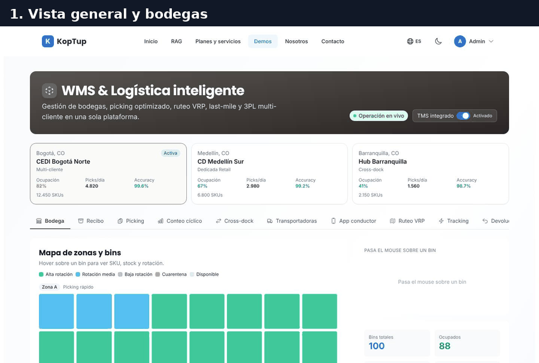

*Recorrido completo en siete cuadros: bodegas, mapa de bins, recibo, picking, ruteo, app del conductor y devoluciones.*

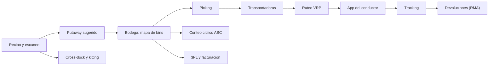

*El flujo que la demo cuenta con sus pestañas. Ojo: en la demo cada pestaña es independiente; lo que haces en una no cambia las demás.*

### Paso 1. Elige una bodega y recorre su mapa

En la parte superior, haz clic en una de las tres tarjetas de bodega; queda marcada como **Activa** y el mapa de la pestaña **Bodega** cambia de distribución. Luego pasa el mouse sobre cualquier cuadro del mapa.

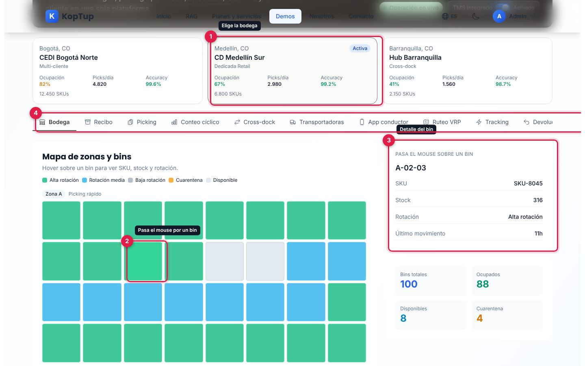

*CD Medellín Sur activa y el bin `A-02-03` con su detalle a la derecha.*

1. **Tarjeta de bodega**: ciudad, nombre, tipo (Multi-cliente, Dedicada Retail o Cross-dock), ocupación, picks por día, exactitud (accuracy) y número de SKU.
2. **Bin**: cada cuadro es una ubicación. Colores: verde alta rotación, azul rotación media, gris baja rotación, ámbar cuarentena y gris claro disponible.
3. **Detalle del bin**: código (`A-02-03`), SKU, stock, rotación y último movimiento. Si el bin está vacío dice «Bin vacío».
4. **Pestañas**: las 11 vistas de la demo. En pantallas angostas la barra se desplaza de lado (la última, «3PL & Billing», queda fuera de la vista a 1440 px).

Qué decir: «De un vistazo ve dónde está cada producto y qué tan lleno está cada pasillo».

### Paso 2. Recibo: escanea bultos y confirma la ubicación sugerida

Abre la pestaña **Recibo**. Escribe un código en **Scan-to-receive** (por ejemplo `BULTO-PO9821-001`) y pulsa **Escanear** o Enter. Luego pulsa **Confirmar** en la primera sugerencia de ubicación.

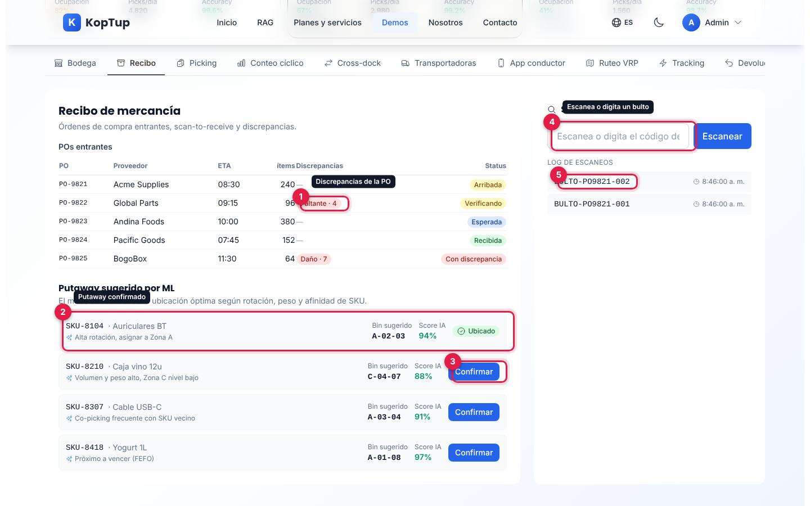

*Dos bultos escaneados y la primera sugerencia de putaway confirmada.*

1. **Discrepancias**: la tabla de órdenes de compra entrantes marca faltantes y daños (por ejemplo «Faltante · 4» en `PO-9822`).
2. **Ubicado**: la sugerencia confirmada cambia el botón por la marca «Ubicado».
3. **Confirmar**: las demás sugerencias muestran bin sugerido, «Score IA» y el motivo (alta rotación, peso y volumen, co-picking o FEFO).
4. **Escaneo**: acepta cualquier texto; no se valida contra las órdenes.
5. **Log de escaneos**: el más reciente arriba, con la hora; guarda los últimos 8.

Qué decir: «Al recibir, el sistema le dice al operario dónde guardar cada producto según su rotación y peso».

### Paso 3. Picking: elige la estrategia e inicia la ola

Abre **Picking**, elige una estrategia (Wave, Batch, Zone o Cluster) y pulsa **Iniciar wave**.

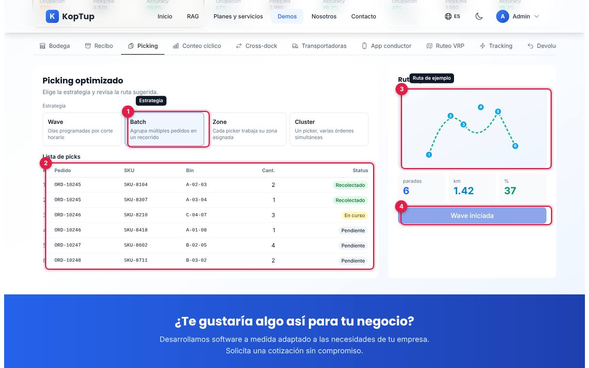

*Estrategia «Batch» elegida y la ola iniciada.*

1. **Estrategia**: cada tarjeta explica el método (olas por corte horario, varios pedidos en un recorrido, picker por zona o varias órdenes a la vez). Elegir una solo la resalta.
2. **Lista de picks**: seis líneas fijas con pedido, SKU, bin, cantidad y estado (Recolectado, En curso, Pendiente).
3. **Ruta optimizada**: dibujo de ejemplo con seis paradas y los valores fijos 6 paradas, 1.42 km y 37 %.
4. **Wave iniciada**: el botón cambia de texto y se desactiva. La lista y los estados no cambian.

### Paso 4. Ruteo VRP: re-optimiza las rutas

Abre **Ruteo VRP** y pulsa **Re-optimizar**.

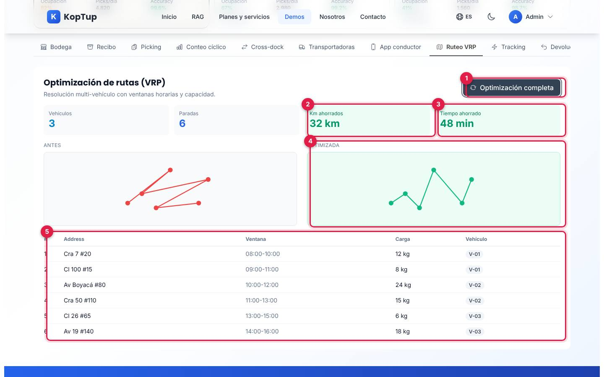

*Después de pulsar Re-optimizar aparecen los ahorros.*

1. **Optimización completa**: el botón cambia de texto al instante (no hay cálculo).
2. **Km ahorrados**: pasa de «— km» a «32 km» (valor fijo).
3. **Tiempo ahorrado**: pasa de «—» a «48 min» (valor fijo).
4. **Antes / Optimizada**: dos dibujos de ejemplo de la misma ruta.
5. **Paradas**: seis direcciones de Bogotá con ventana horaria, carga y vehículo asignado (`V-01` a `V-03`).

Qué decir: «Con ventanas horarias y capacidad de cada vehículo, el ruteo reduce kilómetros y tiempo». Si cambias de pestaña y vuelves, el ruteo vuelve a su estado inicial.

### Paso 5. App del conductor: prueba de entrega

Abre **App conductor** y pulsa **Capturar firma** (o **Tomar foto**).

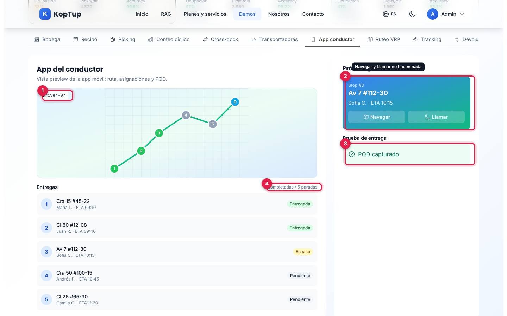

*Vista previa de la app móvil del conductor con la prueba de entrega marcada.*

1. **Ruta del conductor** (`Driver-07`): mapa dibujado con las paradas hechas en verde y la llegada (D).
2. **Próxima parada**: dirección, cliente y hora estimada. **Navegar** y **Llamar no hacen nada**.
3. **POD capturado**: la prueba de entrega queda marcada; no se abre la cámara ni un panel de firma.
4. **Entregas**: 2 completadas de 5 paradas, con su estado (Entregada, En sitio, Pendiente).

### Paso 6. Devoluciones: crea una RMA

Abre **Devoluciones**, escribe un número de pedido (por ejemplo `ORD-10247`), elige el motivo y pulsa **Crear RMA**.

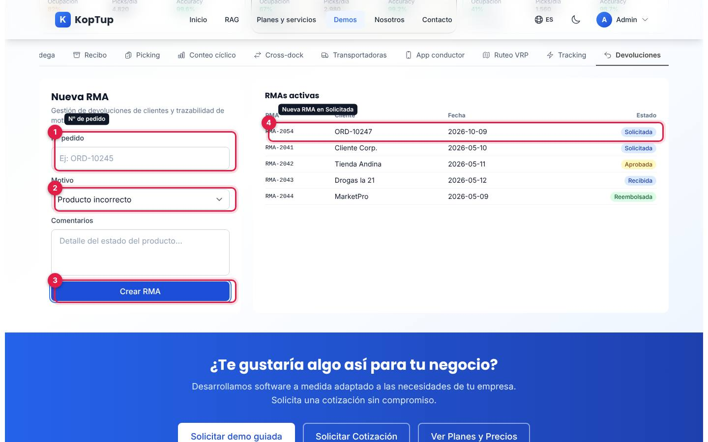

*La RMA nueva aparece arriba de la lista, en estado «Solicitada» con la fecha de hoy.*

1. **N° pedido**: obligatorio; si está vacío, el botón no hace nada.
2. **Motivo**: producto dañado, producto incorrecto, ya no lo necesita o defecto de fábrica.
3. **Crear RMA**: limpia el pedido y los comentarios.
4. **RMA nueva** (`RMA-2054` en la prueba): ojo, en la columna «Cliente» aparece el número de pedido que escribiste, y el motivo y los comentarios no se guardan en ninguna parte.

Para cerrar, muestra **3PL & Billing** (facturación por cliente) y **Transportadoras** (comparativa de operadores), descritas abajo.

---

## Pantallas y funciones

### Encabezado y bodegas

Ver la [vista general](#guía-de-la-demo-wms--logística-inteligente) y el [paso 1](#paso-1-elige-una-bodega-y-recorre-su-mapa).

| Elemento | Qué hace |
|---|---|
| **Operación en vivo** | Insignia con un punto verde que parpadea. Es decorativa: nada en la demo se actualiza solo. |
| **TMS integrado** | Interruptor «Activado / Desactivado». Solo cambia su propio estado; no cambia ninguna pantalla. |
| **Tarjetas de bodega** | CEDI Bogotá Norte (multi-cliente, 82 % de ocupación, 12.450 SKU), CD Medellín Sur (retail, 67 %, 6.800 SKU) y Hub Barranquilla (cross-dock, 41 %, 2.150 SKU). Al elegir una cambia el dibujo del mapa de bins; las demás pestañas muestran los mismos datos para las tres. |
| **Pestañas** | Bodega, Recibo, Picking, Conteo cíclico, Cross-dock, Transportadoras, App conductor, Ruteo VRP, Tracking, Devoluciones y 3PL & Billing. |
| **Bloque final** | «¿Te gustaría algo así para tu negocio?» con **Solicitar demo guiada** (`/solicitar-demo?demos=wms-logistica`), **Solicitar Cotización** (`/contact`) y **Ver Planes y Precios** (`/services#planes-rag`). Es común a todas las demos. |

### Bodega

Ver el [paso 1](#paso-1-elige-una-bodega-y-recorre-su-mapa).

- **Mapa de zonas y bins**: zona A (picking rápido), B (reserva) y C (voluminosos), cada una de 4 filas por 8 columnas, y la zona Q (cuarentena) con 4 bins. Son 100 bins por bodega.
- **Detalle al pasar el mouse**: código, SKU, stock, rotación y último movimiento.
- **Indicadores**: bins totales (100), ocupados (88), disponibles (8) y en cuarentena (4). Son los mismos números en las tres bodegas.

### Recibo

Ver el [paso 2](#paso-2-recibo-escanea-bultos-y-confirma-la-ubicación-sugerida).

- **POs entrantes**: cinco órdenes (`PO-9821` a `PO-9825`) con proveedor, hora de llegada, ítems, discrepancias y estado (Arribada, Verificando, Esperada, Recibida, Con discrepancia). Solo lectura.
- **Putaway sugerido por ML**: cuatro sugerencias con bin, «Score IA» y motivo; **Confirmar** las marca como «Ubicado». No hay modelo detrás: las sugerencias y los puntajes vienen escritos en la demo.
- **Scan-to-receive**: agrega el código al log con la hora. No cambia las órdenes.

### Picking

Ver el [paso 3](#paso-3-picking-elige-la-estrategia-e-inicia-la-ola). Cuatro estrategias, lista fija de seis picks, dibujo de la ruta y el botón **Iniciar wave**, que solo cambia de texto.

### Conteo cíclico

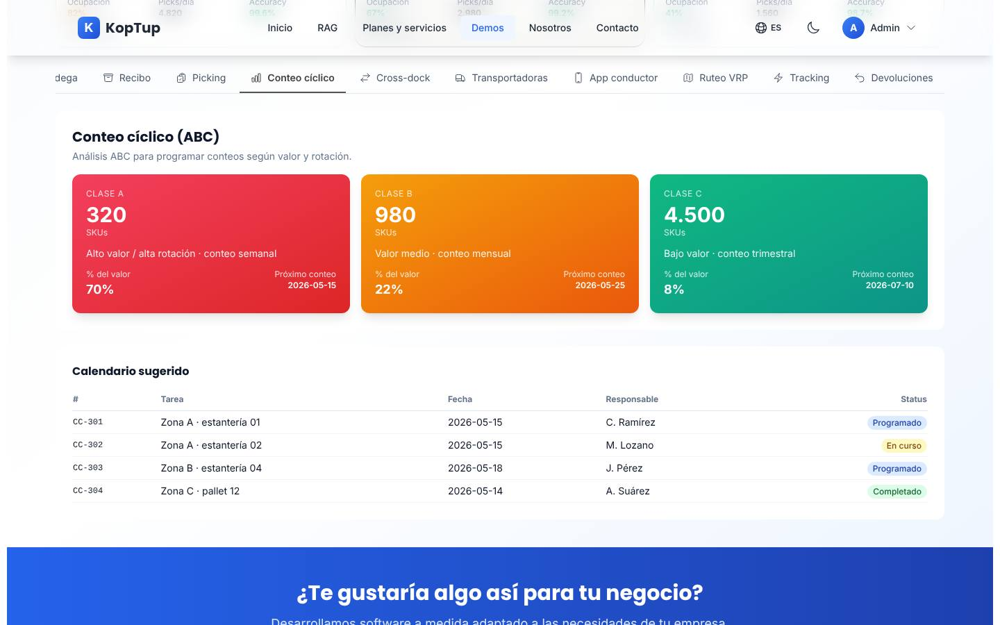

*Clasificación ABC y calendario sugerido de conteos.*

- **Clases A, B y C**: 320, 980 y 4.500 SKU; 70 %, 22 % y 8 % del valor; conteo semanal, mensual y trimestral, con la fecha del próximo conteo.
- **Calendario sugerido**: cuatro tareas (`CC-301` a `CC-304`) con zona, fecha, responsable y estado (Programado, En curso, Completado).
- Solo lectura. Las fechas son de mayo a julio de 2026, ya pasadas.

### Cross-dock

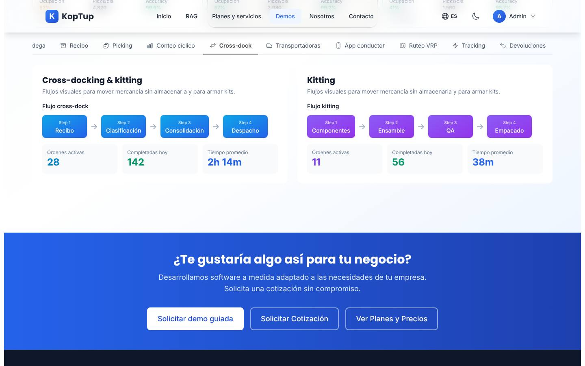

*Los dos flujos de cuatro pasos con sus indicadores.*

- **Flujo cross-dock**: Recibo → Clasificación → Consolidación → Despacho; 28 órdenes activas, 142 completadas hoy y 2 h 14 min de tiempo promedio.
- **Flujo kitting**: Componentes → Ensamble → QA → Empacado; 11 activas, 56 completadas y 38 min.
- Solo lectura; los pasos dicen «Step 1», «Step 2»… en inglés.

### Transportadoras

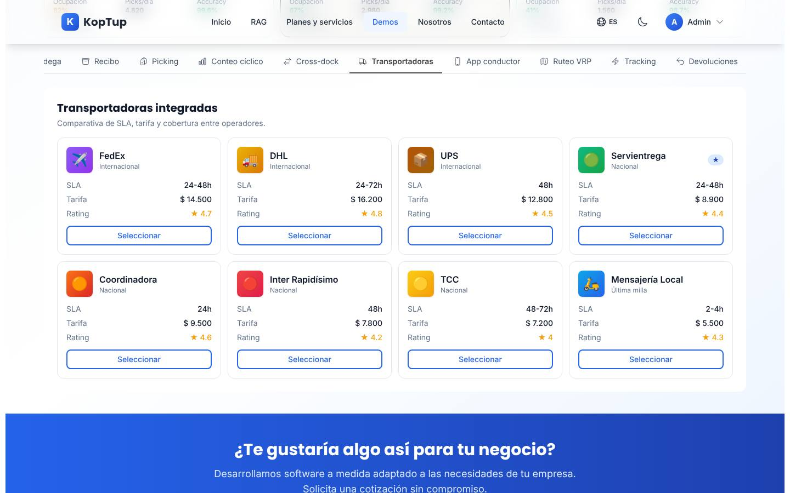

*Ocho operadores con SLA, tarifa, calificación y cobertura.*

- FedEx, DHL y UPS (internacionales), Servientrega (marcada como preferida con ★), Coordinadora, Inter Rapidísimo y TCC (nacionales) y Mensajería Local (última milla).
- **Seleccionar** no hace nada. No hay conexión con ninguna transportadora; las tarifas y calificaciones son de ejemplo. Las marcas se usan solo como ejemplo de integración.

### App conductor

Ver el [paso 5](#paso-5-app-del-conductor-prueba-de-entrega). Mapa dibujado, cinco entregas, próxima parada y prueba de entrega (firma o foto) que solo se marca como capturada.

### Ruteo VRP

Ver el [paso 4](#paso-4-ruteo-vrp-re-optimiza-las-rutas). Tres vehículos, seis paradas, antes y después, y **Re-optimizar**, que muestra ahorros fijos de 32 km y 48 min.

### Tracking

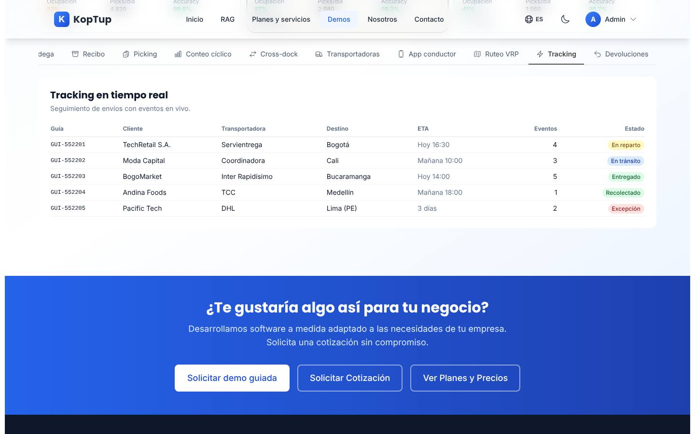

*Cinco guías con transportadora, destino, hora estimada, número de eventos y estado.*

Guías `GUI-552201` a `GUI-552205` hacia Bogotá, Cali, Bucaramanga, Medellín y Lima, con estados En reparto, En tránsito, Entregado, Recolectado y Excepción. Aunque el título dice «en tiempo real», es una tabla fija: no se puede abrir una guía ni ver sus eventos.

### Devoluciones

Ver el [paso 6](#paso-6-devoluciones-crea-una-rma). Formulario de RMA y lista de RMA activas (cuatro de ejemplo de mayo de 2026 más las que crees). Las RMA no cambian de estado.

### 3PL & Billing

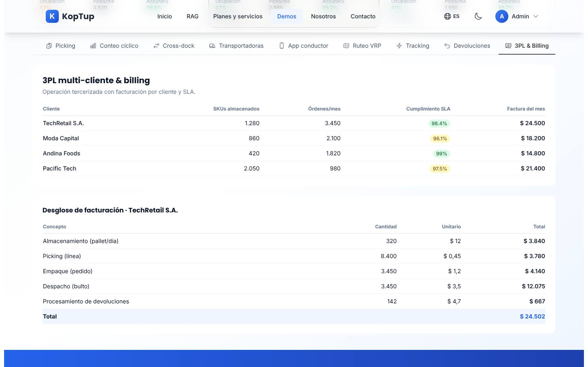

*Clientes del operador con su cumplimiento de SLA y el desglose de la factura de TechRetail S.A.*

- **Clientes**: TechRetail S.A., Moda Capital, Andina Foods y Pacific Tech, con SKU almacenados, órdenes por mes, cumplimiento de SLA (verde desde 98 %) y factura del mes.
- **Desglose de facturación de TechRetail S.A.**: almacenamiento por pallet al día, picking por línea, empaque por pedido, despacho por bulto y devoluciones, con cantidad, valor unitario y total.
- Solo lectura; no se puede elegir otro cliente. No se indica la moneda.

### En el celular

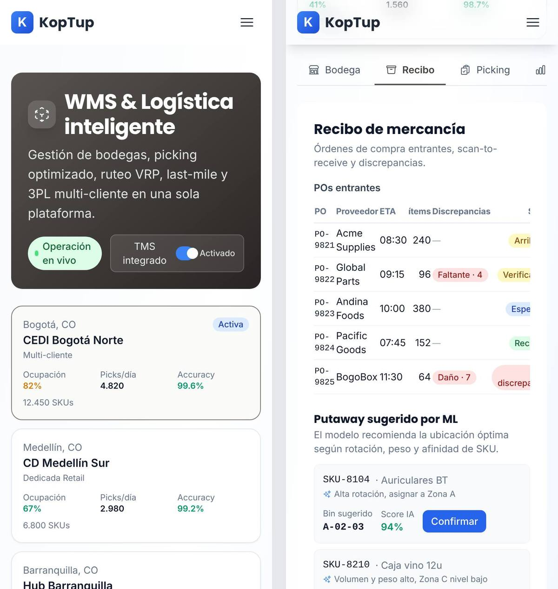

*A 390 px: el encabezado y las bodegas se apilan; las pestañas se desplazan de lado; las tablas se cortan y se desplazan horizontalmente.*

La página no se desborda a lo ancho, pero las tablas anchas (por ejemplo, POs entrantes) quedan cortadas y hay que deslizarlas. El detalle del bin depende de pasar el mouse: en nuestra prueba con pantalla táctil, tocar un bin no mostró su detalle.

---

## Qué es real y qué es simulado

| Parte | Real o simulado | Detalle |
|---|---|---|
| Bodegas, órdenes, SKU, transportadoras, clientes y cifras | **Datos de ejemplo** | Escritos en el código de la página; no hay base de datos ni servidor. |
| Mapa de bins | **Generado en el navegador** | Una fórmula fija reparte la rotación de los 100 bins según la bodega elegida; siempre sale igual. |
| «Putaway sugerido por ML» y «Score IA» | **Simulado** | Sugerencias y puntajes fijos; no hay modelo de ML ni IA. |
| Ruta optimizada, VRP y ahorros (32 km, 48 min) | **Simulado** | Dibujos y números fijos; no hay cálculo de rutas. |
| «Operación en vivo», «TMS integrado», «Tracking en tiempo real» | **Simulado** | Nada se actualiza solo; el interruptor del TMS no cambia nada más. |
| Escaneo, confirmar putaway, iniciar ola, POD y crear RMA | **Interacción visual** | Cambian un rótulo o agregan una fila en la pantalla; no se conectan con otras pestañas. |
| Transportadoras, cámara, firma, navegación y llamadas | **No conectado** | Los botones **Seleccionar**, **Navegar** y **Llamar** no hacen nada. |
| Dónde quedan tus cambios | **En ningún lado** | Viven solo mientras la página está abierta; al recargar vuelve todo al inicio. |

---

## Acceso

**Cómo lo ve un visitante.** La demo aparece en `/demo` con la tarjeta «WMS / Logística», la insignia «Requiere acceso» y los botones **Solicitar acceso** y **Ya tengo acceso: iniciar sesión**. Si alguien abre `/demo/wms-logistica` sin sesión, la web muestra en la misma dirección la pantalla de acceso:

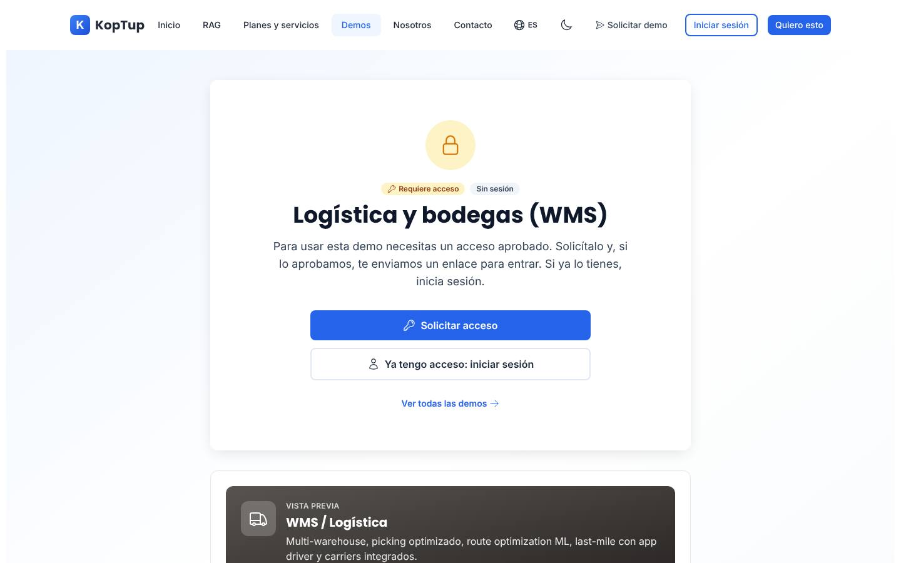

*Lo que ve un visitante sin sesión: «Requiere acceso», «Sin sesión», el nombre del catálogo «Logística y bodegas (WMS)» y los botones para pedir la demo o iniciar sesión. Debajo, una vista previa con el texto de la tarjeta del hub.*

- **Solicitar acceso** abre `/solicitar-demo?demos=wms-logistica` con esta demo ya elegida.
- **Ya tengo acceso: iniciar sesión** lleva a `/login?redirect=%2Fdemo%2Fwms-logistica` y, al entrar, vuelve a la demo.
- **Ver todas las demos** vuelve a `/demo`.
- Con sesión pero sin acceso, la misma pantalla dice que la cuenta todavía no tiene acceso; si el acceso venció o fue retirado, ofrece pedir más tiempo o solicitarlo de nuevo.

**Cómo se concede.** La solicitud llega a **Admin › Solicitudes de demo**. Pueden aprobarla los roles **admin** y **sales**. Al aprobar, se crea o se reutiliza la cuenta del prospecto, el acceso dura 14 días por defecto (se extiende o se revoca en **Admin › Accesos a demos**) y la persona recibe un correo con la decisión (con el enlace de activación si su cuenta es nueva). El equipo de KopTup (admin, manager, sales y developer) abre la demo sin solicitud. Solo el admin cambia el modo de acceso, en **Admin › Catálogo de demos**. Detalle en el [Manual del administrador](Doc-06-Manual-del-Administrador.md) y en [Flujos del visitante](Doc-04-Flujos-del-Visitante.md).

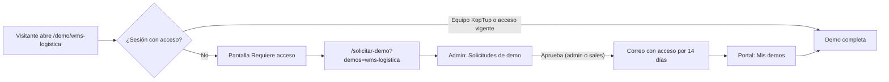

*Camino de un visitante hasta la demo.*

---

## Limitaciones conocidas

1. **Es una maqueta, no un WMS.** No hay inventario que se mueva: escanear no recibe nada, confirmar un putaway no ocupa el bin, iniciar la ola no cambia los picks y crear una RMA no afecta ninguna otra pantalla. Las pestañas no se conectan entre sí.
2. **Botones que no hacen nada**: **Seleccionar** en cada transportadora y **Navegar** y **Llamar** en la app del conductor. Al pasar el mouse cambian de color, así que parecen funcionar.
3. **Promete más de lo que hace.** El encabezado dice «Operación en vivo», la pestaña de tracking dice «en tiempo real» y el recibo habla de «ML» y «Score IA», pero todo es fijo. La tarjeta del hub y la vista previa hablan de «route optimization ML», «slotting ML» y transportadoras integradas, que la demo no tiene. Conviene aclararlo al presentarla.
4. **Sin rótulo de «Datos de ejemplo»** ni un guion propio, a diferencia de las demos ya revisadas. Las empresas de ejemplo mezclan nombres en inglés (Acme Supplies, Global Parts, Pacific Goods) y marcas reales de transportadoras.
5. **RMA con datos mal ubicados**: la columna «Cliente» de la RMA nueva muestra el número de pedido, y el motivo y los comentarios se pierden.
6. **Cifras que no cuadran**: las tres bodegas muestran el mismo mapa de 100 bins con 88 ocupados (88 %), aunque sus tarjetas dicen 82 %, 67 % y 41 % de ocupación y miles de SKU. En 3PL, la factura de TechRetail S.A. es $ 24.500 en la tabla y $ 24.502 en el desglose, y no se indica la moneda.
7. **Fechas fijas y pasadas**: conteos cíclicos y RMA de ejemplo de mayo de 2026; el tracking dice «Hoy» y «Mañana» sin fecha.
8. **Textos sin traducir**: «Status», «Address», «Step 1…», «Stop #3», «Kitting», «Accuracy» y la sigla «%» sin explicación en picking (37 %).
9. **No guarda nada**: al recargar se pierden escaneos, RMA y marcas. El ruteo vuelve a su estado inicial con solo cambiar de pestaña.
10. **En celular**, el detalle del bin depende del mouse y las tablas quedan cortadas (hay que deslizarlas).
11. **Error técnico en la consola**: con el navegador en español aparecen errores de hidratación de React (#425, #418 y #423) al cargar. La causa es que los números de las tarjetas de bodega se formatean con el idioma del navegador (`4.820`) y no coinciden con los del servidor (`4,820`); con el navegador en inglés no aparecen. No se nota a simple vista, pero obliga a React a volver a pintar la página.
