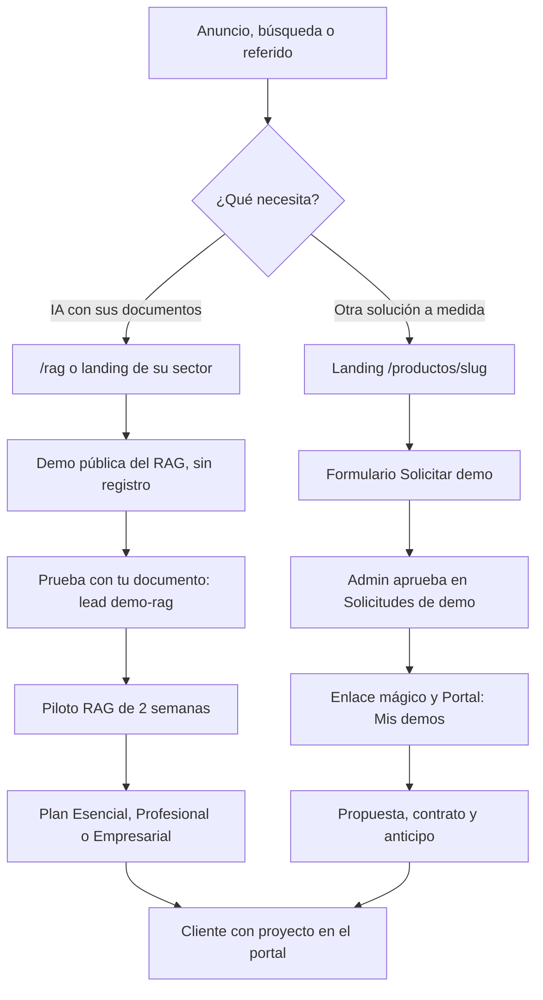

# KopTup: plan de producto

> **Estado al 8 de octubre de 2026:** ver [Estado del trabajo y próximos pasos](15-Estado-y-Proximos-Pasos.md).
>
> **¿Buscas cómo funciona el sitio hoy?** Ve a la [documentación](Doc-00-Indice.md) (manual del administrador, guías de las demos, API, datos y operación) y a los [diagramas de flujo](Doc-14-Diagramas-de-Flujo.md) del cliente, del administrador y técnicos.

Esta wiki es el **plan de producto de KopTup**: dónde está hoy el negocio y el software, qué se quiere vender, cómo se mueve un cliente interesado desde que descubre KopTup hasta que es cliente, y qué hay que construir en cada módulo, sección y producto para lograrlo. Está escrita para que el dueño pueda decidir y un equipo de desarrollo pueda ejecutar: cada página trae diagnóstico, plan, tareas con fase, prioridad y esfuerzo, y métricas de éxito.

El pedido que la originó: que KopTup sea **un producto adecuado, vendible y claro para cada cliente**; que los clientes puedan **solicitar demos** y que desde el **panel de administración** se les **dé acceso**; con un plan, un diagrama del flujo del cliente y todo documentado con diagramas y capturas.

*Mockup de **Portal › Mis demos**: así ve un prospecto las demos que el equipo le aprobó desde el panel de administración ([Portal del cliente](06-Portal-del-Cliente.md), [Sistema de demos](04-Sistema-de-Demos.md)).*

---

## Resumen ejecutivo

1. **KopTup es una empresa colombiana cuyo producto principal son los sistemas RAG:** IA que responde con los documentos de cada empresa y cita la fuente.
2. **Hoy el sitio en producción no lo dice:** se presenta como agencia genérica, con cifras sin respaldo y el RAG escondido entre 27 productos ([Diagnóstico](01-Diagnostico.md)).
3. **El reposicionamiento RAG ya está en `main`:** inicio, `/rag`, landings por sector, planes publicados, "Prueba con tu documento" y medición para anuncios. Falta configurar las variables en Railway y Vercel ([Reposicionamiento RAG](13-Reposicionamiento-RAG.md), [Estado y próximos pasos](15-Estado-y-Proximos-Pasos.md)).
4. **Embudo principal:** anuncio → `/rag` o landing del sector → demo pública sin registro → "Prueba con tu documento" (lead) → **Piloto RAG** de 2 semanas → plan **Esencial**, **Profesional** o **Empresarial**.
5. **Las 26 "Otras soluciones a medida"** se venden como proyecto, con landing propia `/productos/<slug>`; su suscripción queda en lista de espera ([Visión de producto](02-Vision-de-Producto.md)).
6. **Sistema de demos:** cada demo es `publico`, `solicitud` o `privado`; el prospecto la solicita, el equipo aprueba en **Admin › Solicitudes de demo** y el prospecto entra con un enlace mágico a **Portal › Mis demos**.
7. **El acceso, la autenticación y la autorización se deciden siempre en el servidor;** el código de acceso fijo que existe hoy se elimina.
8. **Antes de pautar hay que endurecer la base (Fase 0):** CI, pruebas, dependencias, autorización en servidor, topes de costo de IA y credenciales rotadas.
9. **Principios:** honestidad (sin cifras ni clientes inventados), demo con IA real y datos del cliente protegidos según la Ley 1581 de 2012.
10. **Roadmap en 6 fases:** Fase 0 — Endurecimiento → Fase 1 — Funnel y solicitud de demos → Fase 2 — Demos vendibles → Fase 3 — Propuestas y conversión → Fase 4 — Productos SaaS reales → Fase 5 — Escala ([Roadmap](12-Roadmap.md)).

---

## Cómo leer esta wiki

### Por dónde empezar

| Si eres… | Empieza por | Después |
|---|---|---|
| Dueño o gerente | Este resumen, [Visión de producto](02-Vision-de-Producto.md) y [Diagnóstico](01-Diagnostico.md) | [Roadmap](12-Roadmap.md), [Reposicionamiento RAG](13-Reposicionamiento-RAG.md) y las decisiones abiertas de [Comercial, marketing y legal](11-Comercial-Marketing-y-Legal.md) (sección 17) |
| Comercial | [Flujo del cliente](03-Flujo-del-Cliente.md) y [Sistemas RAG](Producto-chatbot-rag-ia.md) | [Panel de administración](05-Panel-de-Administracion.md) y [Comercial, marketing y legal](11-Comercial-Marketing-y-Legal.md) |
| Desarrollador | [Roadmap](12-Roadmap.md) y [Seguridad y calidad](10-Seguridad-y-Calidad.md) (Fase 0) | [Sistema de demos](04-Sistema-de-Demos.md), [Backend y API](09-Backend-y-API.md) y la página de la sección o del producto que vayas a tocar |
| Diseño y contenido | Principios de [Visión de producto](02-Vision-de-Producto.md) y [Plan por sección](07-Plan-por-Seccion.md) | [Landing de producto](Seccion-Landing-de-Producto.md), las páginas `Seccion-*` y los mockups |

### Convenciones

| Término | Significado |
|---|---|
| **Fases** | Fase 0 — Endurecimiento · Fase 1 — Funnel y solicitud de demos · Fase 2 — Demos vendibles · Fase 3 — Propuestas y conversión · Fase 4 — Productos SaaS reales · Fase 5 — Escala |
| **Etapas E1 a E7** | Las 7 fases de la especificación del reposicionamiento RAG. Se llaman "etapas" para no confundirlas con las fases del roadmap; todas pertenecen a la Fase 1 |
| **Prioridad** | P0 (bloqueante) · P1 (alta) · P2 (media) · P3 (baja) |
| **Esfuerzo** | Para 1 dev senior: S (≤ 2 días) · M (3–5 días) · L (1–2 semanas) · XL (más de 2 semanas) |
| **Modos de acceso** | `publico` (abierta, sin cuenta) · `solicitud` (vista previa y acceso aprobado) · `privado` (solo por invitación del admin) |
| **Hoy, producción, `main`** | Lo que está publicado en `www.koptup.com` |
| **La rama** | `rag-reposicionamiento`: la rama donde se hizo el reposicionamiento RAG; ya está fusionada en `main` |
| **Capturas** | `images/actual/`: producción. `images/despues/`: capturas reales de la rama `rag-reposicionamiento` terminada. `images/mockups/`: pantallas propuestas que aún no existen |
| **Metas numéricas** | Metas iniciales a validar con datos reales, no resultados actuales |
| **"Validar"** | Requiere decisión del dueño o concepto del contador o de un abogado |
| **Seguridad** | Por ser una wiki pública, solo se describe como tareas genéricas |

### Glosario mínimo

- **RAG:** del inglés *retrieval augmented generation*. La IA busca primero en los documentos de la empresa y responde con lo que encontró, citando la fuente.
- **Piloto RAG:** prueba pagada de 2 semanas con una fuente y hasta 100 documentos, que termina en un informe de precisión con 50 preguntas.
- **Lead:** un prospecto registrado con su origen, etapa, responsable y autorización de datos.
- **`DemoRequest` y `DemoGrant`:** la solicitud de demo y el acceso concedido a una demo, con vigencia.
- **Enlace mágico:** enlace de un solo uso, válido 72 horas, con el que el prospecto activa su cuenta.
- **Roles:** `admin`, `sales` (comercial), `prospect` (tiene demos), `client` (tiene proyecto), `manager` y `developer`.

---

## Mapa de páginas

### Estrategia

| Página | Qué encuentras |
|---|---|
| [01 · Diagnóstico](01-Diagnostico.md) | Estado actual del negocio, el producto, la ingeniería y la seguridad; fortalezas y brechas; capturas de producción |
| [02 · Visión de producto](02-Vision-de-Producto.md) | Qué es KopTup, para quién, propuesta de valor, modalidades, principios, criterios de "vendible y claro" y modelo de acceso a demos |
| [13 · Reposicionamiento RAG](13-Reposicionamiento-RAG.md) | La especificación del dueño, páginas nuevas, planes, "Prueba con tu documento", medición para anuncios y estado de la rama |

### Cliente y demos

| Página | Qué encuentras |
|---|---|
| [03 · Flujo del cliente](03-Flujo-del-Cliente.md) | El recorrido completo del prospecto: embudo RAG, solicitud y acceso a demos, diagramas, etapas, ramas alternativas y métricas |
| [04 · Sistema de demos](04-Sistema-de-Demos.md) | Especificación funcional y técnica: roles, modos de acceso, modelos, estados, API, control de acceso en servidor, notificaciones y jobs |
| [05 · Panel de administración](05-Panel-de-Administracion.md) | Solicitudes de demo, accesos, leads, catálogo de demos, métricas y el resto del panel |
| [06 · Portal del cliente](06-Portal-del-Cliente.md) | Lo que ve un prospecto (Mis demos, recorrido guiado) y un cliente (proyectos, facturas, entregables, mensajes) |

### Sitio

| Página | Ruta o contenido |
|---|---|
| [07 · Plan por sección](07-Plan-por-Seccion.md) | Vista general de todas las secciones del sitio |
| [Home](Seccion-Home.md) | `/` |
| [Servicios y precios](Seccion-Servicios-y-Precios.md) | `/services` (planes RAG y otras soluciones) |
| [Catálogo de demos](Seccion-Catalogo-de-Demos.md) | `/demo` |
| [Landing de producto](Seccion-Landing-de-Producto.md) | `/productos/<slug>` |
| [Contacto](Seccion-Contacto.md) | `/contact`, agenda y WhatsApp |
| [Nosotros](Seccion-Nosotros.md) | `/about` |
| [Landings SEO y de campaña](Seccion-Landings-SEO.md) | `/chatbots-ia`, `/soluciones-ia`, `/desarrollo-web-colombia` y relación con `/rag` |
| [Legal](Seccion-Legal.md) | `/privacy`, `/terms`, `/cookies` y autorizaciones |
| [Autenticación](Seccion-Autenticacion.md) | `/login`, `/register`, recuperación de contraseña y activación por enlace mágico |

### Productos

[08 · Catálogo de productos](08-Catalogo-de-Productos.md): vista consolidada de todos los productos, su estado y su prioridad.

**Producto principal**

| Página | Demo | Landing |
|---|---|---|
| [Sistemas RAG](Producto-chatbot-rag-ia.md) | `/demo/chatbot` (pública, con "Prueba con tu documento") | `/rag`, `/rag/salud`, `/rag/legal`, `/rag/soporte` |

**Otras soluciones a medida** (26, por área de negocio)

| Área | Producto | Demo |
|---|---|---|
| Ventas, marketing y atención | [CRM con IA](Producto-crm-ia.md) | `/demo/crm-ia` |
| Ventas, marketing y atención | [Helpdesk con IA](Producto-helpdesk-ia.md) | `/demo/helpdesk-ia` |
| Ventas, marketing y atención | [Voice AI para call center](Producto-voice-ai-callcenter.md) | `/demo/voice-ai` |
| Ventas, marketing y atención | [Programa de fidelización](Producto-loyalty-fidelizacion.md) | `/demo/loyalty` |
| Finanzas, talento humano y cumplimiento | [ERP modular](Producto-erp-modular.md) | `/demo/erp` |
| Finanzas, talento humano y cumplimiento | [Facturación electrónica](Producto-facturacion-electronica.md) | `/demo/facturacion-electronica` |
| Finanzas, talento humano y cumplimiento | [Gestión humana y nómina (HRMS)](Producto-hrms.md) | `/demo/hrms` |
| Finanzas, talento humano y cumplimiento | [Firma electrónica](Producto-firma-electronica.md) | `/demo/firma-electronica` |
| Comercio y logística | [Tienda en línea](Producto-ecommerce.md) | `/demo/ecommerce` |
| Comercio y logística | [POS retail](Producto-pos-retail.md) | `/demo/pos` |
| Comercio y logística | [WMS y logística](Producto-wms-logistica.md) | `/demo/wms-logistica` |
| Comercio y logística | [App de delivery](Producto-app-delivery.md) | `/demo/delivery` |
| Comercio y logística | [Sistema de reservas](Producto-sistema-reservas.md) | `/demo/sistema-reservas` |
| Datos, documentos y productividad | [Dashboard ejecutivo con IA](Producto-bi-dashboard.md) | `/demo/dashboard-ejecutivo` |
| Datos, documentos y productividad | [Gestor documental con IA](Producto-gestor-documental.md) | `/demo/gestor-documentos` |
| Datos, documentos y productividad | [Automatización de procesos con IA](Producto-automatizacion-workflows.md) | `/demo/automatizacion` |
| Datos, documentos y productividad | [Extracción y monitoreo de datos](Producto-scraping-extraccion.md) | `/demo/scraping` |
| Datos, documentos y productividad | [CMS headless](Producto-cms-headless.md) | `/demo/gestor-contenido` |
| Datos, documentos y productividad | [Gestión de proyectos](Producto-gestion-proyectos.md) | `/demo/control-proyectos` |
| Salud y educación | [Telemedicina para IPS](Producto-telemedicina.md) | `/demo/telemedicina` |
| Salud y educación | [Cursos virtuales (LMS)](Producto-lms-elearning.md) | `/demo/lms` |
| Equipos de tecnología | [Code review con IA](Producto-code-review-ia.md) | `/demo/code-review-ia` |
| Equipos de tecnología | [QA automatizado con IA](Producto-qa-automatizado-ia.md) | Sin demo propia (hoy apunta por error a la del chatbot) |
| Equipos de tecnología | [Plataforma SaaS multi-tenant](Producto-saas-multi-tenant.md) | `/demo/saas-boilerplate` |
| Equipos de tecnología | [VPN empresarial](Producto-vpn-empresarial.md) | Sin demo propia (hoy apunta por error a la del SaaS multi-tenant) |
| Equipos de tecnología | [Moderación de contenido con IA](Producto-moderacion-contenido.md) | `/demo/moderacion-contenido` |

**Demos fuera del catálogo actual**

| Página | Demo | Qué se decide |
|---|---|---|
| [Auditoría de cuentas médicas con IA](Demo-cuentas-medicas.md) | `/demo/cuentas-medicas` (`privado`) | Entra al catálogo como vertical de salud, presentada como "Sistema experto para salud" |
| [Motor de reglas del auditor](Demo-sistema-experto.md) | `/demo/sistema-experto` (`privado`) | Módulo de la auditoría de cuentas médicas, no producto propio |
| [Motor de contenido para LinkedIn](Demo-linkedin-ads.md) | `/demo/linkedin-ads` (`solicitud`) | Herramienta interna de marketing, no producto |

### Plataforma

| Página | Qué encuentras |
|---|---|
| [09 · Backend y API](09-Backend-y-API.md) | Decisión por módulo, componentes nuevos del sistema de demos, persistencia, jobs, configuración e inventario de la API |
| [10 · Seguridad y calidad](10-Seguridad-y-Calidad.md) | Fase 0: CI, pruebas, dependencias, seguridad (genérica), observabilidad, continuidad y rendimiento |
| [11 · Comercial, marketing y legal](11-Comercial-Marketing-y-Legal.md) | Posicionamiento, cliente ideal, ofertas de entrada, pipeline, precios, cobro, facturación, contratos, registro de decisiones y calendario de 90 días |

### Roadmap

| Página | Qué encuentras |
|---|---|
| [12 · Roadmap](12-Roadmap.md) | Las 6 fases con su alcance, dependencias, tareas consolidadas y calendario |

---

## Estado del trabajo

Al **8 de octubre de 2026**:

| Frente | Estado | Dónde |
|---|---|---|
| Plan de producto | Documentado en esta wiki. Todo lo que se describe como nuevo es **plan**: no está construido salvo que la página diga lo contrario | Esta wiki |
| Reposicionamiento RAG | **En `main`** (antes en la rama `rag-reposicionamiento`): las 7 etapas hechas (E1 SEO técnico, E2 inicio, E3 `/rag` y landings por sector, E4 precios, E5 coherencia con el paso del voseo a "tú", E6 "Prueba con tu documento" y E7 medición para anuncios) y la auditoría final. "Prueba con tu documento" queda apagada hasta configurarla en Railway | [Reposicionamiento RAG](13-Reposicionamiento-RAG.md) |
| Fase 0 — Endurecimiento | **En `main`:** CI y pruebas (Jest y Playwright), dependencias actualizadas, autorización en el servidor, propiedad de los bots del chatbot, topes de gasto de IA y secretos fuera del repositorio. Falta que el dueño rote las credenciales que estuvieron en el historial | [Seguridad y calidad](10-Seguridad-y-Calidad.md), [Backend y API](09-Backend-y-API.md) |
| Sistema de solicitud y acceso a demos | **En `main`:** solicitud, aprobación en el panel, enlace de activación, Mis demos, accesos con vigencia y catálogo con modo por demo. Cómo se usa: [Manual del administrador](Doc-06-Manual-del-Administrador.md) | [Sistema de demos](04-Sistema-de-Demos.md), [Panel de administración](05-Panel-de-Administracion.md), [Portal del cliente](06-Portal-del-Cliente.md) |
| Landings `/productos/<slug>` | Especificadas (plantilla, contenido por producto y mockup); sin construir | [Landing de producto](Seccion-Landing-de-Producto.md) |
| Decisiones del dueño | Abiertas: mantenimiento de la compra, pasarelas y cobro en USD, publicación de casos y otras | [Comercial, marketing y legal](11-Comercial-Marketing-y-Legal.md), sección 17 |

*`/rag`, hoy en `main`. Más capturas en la galería "Después" de [Reposicionamiento RAG](13-Reposicionamiento-RAG.md).*

**Próximos pasos:** la lista vigente está en [Estado y próximos pasos](15-Estado-y-Proximos-Pasos.md): volver a levantar el backend de producción, rotar credenciales, terminar el flujo de compra (propuestas y anticipo), revisar las 7 demos que faltan y el pulido de diseño y animaciones.

---

## El flujo del cliente en resumen

> [Ver diagrama como imagen](images/diagramas/Home-1.png)

El RAG tiene un embudo corto y público; las otras soluciones y las demos privadas de salud pasan por la solicitud y la aprobación. El recorrido completo, con ramas de expiración, extensión, rechazo y nutrición, está en [Flujo del cliente](03-Flujo-del-Cliente.md).

---

## Cómo se mantiene esta wiki

- **Fuente:** la carpeta `docs/wiki/` del repositorio. Las páginas son planas (la wiki de GitHub no admite subcarpetas de páginas); las imágenes viven en `docs/wiki/images/` (`actual/`, `mockups/` y `diagramas/`), y las fuentes HTML de los mockups en `images/mockups/src/`.
- **Publicación:** el workflow `wiki-sync` (`.github/workflows/wiki-sync.yml`) copia la carpeta a la wiki en cada cambio y convierte los enlaces `Pagina.md` al formato de la wiki.
- **Reglas de una wiki pública:** nunca se escriben contraseñas, cadenas de conexión, tokens, hosts internos ni datos personales; la seguridad se describe solo como tareas genéricas.
- **Estilo:** español claro, con "tú"; diagramas en Mermaid; enlaces entre páginas con `.md`.
