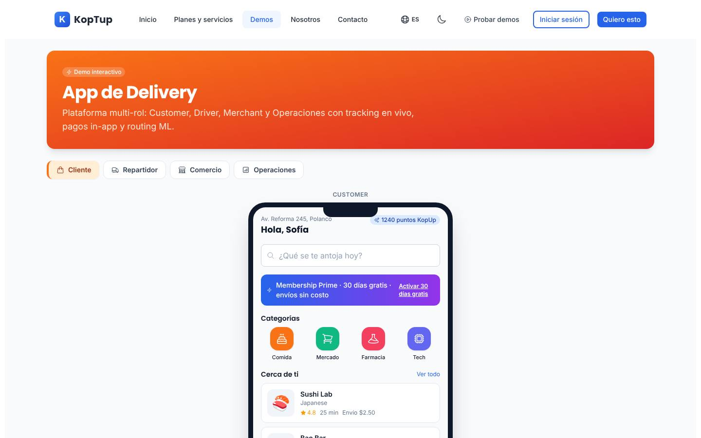
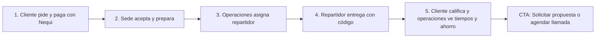

# App de delivery (canal propio de domicilios)

> Operaciones (`operations`) · Demo: `/demo/delivery` · Modo de acceso recomendado: `solicitud` · Prioridad: **P3** (con dos correcciones rápidas P1 en Fase 1) · Esfuerzo total: **XL** (≈ 5–6 semanas de 1 dev senior para dejar demo y landing vendibles; el producto real se estima aparte)

*Captura actual de `/demo/delivery` (pestaña Cliente). Ver también [Sistema de demos](04-Sistema-de-Demos.md), [Catálogo de productos](08-Catalogo-de-Productos.md) y [Roadmap](12-Roadmap.md). Productos relacionados: [Programa de fidelización](Producto-loyalty-fidelizacion.md), [POS retail](Producto-pos-retail.md), [WMS / logística](Producto-wms-logistica.md) y [Facturación electrónica](Producto-facturacion-electronica.md).*

> **Contexto de posicionamiento:** con el reposicionamiento de Koptup en sistemas RAG (ver [Visión de producto](02-Vision-de-Producto.md)), este producto queda dentro de **"Otras soluciones a medida"**. Es el de mayor esfuerzo de construcción entre las demos de operaciones, por eso su prioridad general es P3.

---

## Resumen

**Problema:** los restaurantes, droguerías y comercios con domicilios dependen de agregadores que cobran una comisión alta por pedido (comúnmente entre 15 % y 30 %) y se quedan con la relación con el cliente. Los que tienen repartidores propios los coordinan por WhatsApp y Excel, sin seguimiento, sin prueba de entrega y sin saber cuánto les cuesta cada domicilio.

**Para quién (cliente ideal en Colombia/LATAM):**
- Cadenas de restaurantes y comidas rápidas con 3–50 sedes.
- Droguerías y farmacias con domicilio propio.
- Supermercados y mercados regionales; licoreras.
- Distribuidoras de agua, gas y productos de consumo masivo con flota propia.
- Pastelerías, floristerías y tiendas de regalos con picos por fechas especiales.
- Empresas de mensajería urbana que necesitan despacho y seguimiento para sus clientes B2B.

**Propuesta de valor:** "Tu propio canal de domicilios: pedidos por web y WhatsApp, repartidores propios o tercerizados con seguimiento en vivo y prueba de entrega, sin comisión por pedido y con los datos de tus clientes en tu poder. Puedes seguir en los agregadores y sumar tu canal propio."

---

## Estado actual

| Aspecto | Estado | Evidencia |
|---|---|---|
| Demo | Existe. **Maqueta** 100 % en el navegador. No hay `fetch`, `axios` ni llamadas a `/api`; el avance del pedido y los temporizadores se simulan con `setInterval` | `apps/web/src/app/demo/delivery/page.tsx` (`'use client'`) |
| Pantallas | Encabezado y 4 pestañas, 3 de ellas dentro de un marco de teléfono (`PhoneFrame`). **Cliente:** inicio, menú del restaurante, carrito con propina y pago, seguimiento con mapa, chat con el repartidor. **Repartidor:** ganancias, próxima recogida, ruta con varias paradas, navegación, prueba de entrega (foto y firma), calificaciones, registro del repartidor. **Comercio:** KPIs, pedidos entrantes con cuenta regresiva, menú con agotados, analítica. **Operaciones:** KPIs, demanda por zona, tarifa dinámica, despacho, antifraude, pronóstico | `components/CustomerApp.tsx`, `DriverApp.tsx`, `MerchantApp.tsx`, `OpsApp.tsx`, `shared.tsx` (`PhoneFrame`, `MapPlaceholder`, `Kpi`, `fmt`) |
| Datos | Ambientados en Ciudad de México (Polanco, Roma, Condesa, Coyoacán, Av. Reforma) y en USD | `apps/web/messages/demos/delivery.es.json`, `fmt` en `shared.tsx` |
| Backend | Módulo en memoria `apps/backend/src/modules/delivery/` (pedidos y repartidores con direcciones de Bogotá y montos en COP; asigna el primer repartidor disponible) **no montado** en `apps/backend/src/index.ts` y sin tests; el frontend no lo usa | `delivery.service.ts`, `delivery.data.ts`, `delivery.types.ts` |
| i18n ES/EN | `apps/web/messages/demos/delivery.{es,en}.json` (262 líneas c/u), namespace `demoDelivery`. Texto fijo en el código: etiquetas "Customer", "Driver", "Merchant"; cocinas "Japanese", "Asian fusion", "Italian", "Healthy"; estados de despacho "On the way", "Pickup", "Delivered", "Assigned"; "Live"; descripciones del menú | `CustomerApp.tsx`, `OpsApp.tsx` |
| Tests | 1 smoke test (`__tests__/page.test.tsx`) que hoy no se ejecuta (ver [Seguridad y calidad](10-Seguridad-y-Calidad.md)) | |
| Tamaño | 1.011 líneas (CustomerApp 344, OpsApp 170, DriverApp 154, MerchantApp 150, shared 95, page 65, layout 22, test 11) | `wc -l` |
| SEO | Metadata `demo-delivery` en `apps/web/src/lib/seo-config.ts` y breadcrumb JSON-LD en `layout.tsx` | |
| CTA | Solo el `DemoCTA` genérico del layout de `/demo` (sin producto preseleccionado; "Ver Planes y Precios" → `/pricing`, que solo redirige) | `apps/web/src/components/demo/DemoCTA.tsx` |
| Catálogo | Mapeo correcto: offering `app-delivery` → demo `delivery` | `services-catalog.ts` |

**Lo que hace bien:** cuenta el negocio completo con 4 roles; el flujo del cliente se puede recorrer (inicio → menú → carrito con propina → seguimiento que avanza solo → chat con respuestas rápidas); el comercio tiene cuenta regresiva para aceptar o rechazar; la prueba de entrega exige foto y firma; el registro del repartidor muestra los pasos de verificación; el mapa simulado con pines y rutas se entiende a primera vista.

### Problemas detectados (con ruta)

1. **Ambientada en México:** dirección "Av. Reforma 245, Polanco", zonas Polanco/Roma/Condesa/Centro/Reforma/Coyoacán, navegación por "C. Schiller" y registro del repartidor con "Subir INE / DNI" (`delivery.es.json`). Un prospecto colombiano lo nota en el primer segundo.
2. **Precios en USD:** `fmt` (`shared.tsx`) muestra `$12.50`; envío $2.50; ganancias del repartidor $84.50/$612.20; ventas del comercio $1,284.
3. **Error de marca:** "puntos KopUp", "Wallet KopUp" y "KopUp Prime" (`customer.loyalty`, `customer.cart.cards.wallet`, `customer.membership.title`). Además, el banner "Membership Prime" recuerda a la suscripción de un agregador.
4. **Inglés y jerga visibles:** las etiquetas y estados citados en la tabla, más "Online · aceptando pedidos", "Drivers online", "Surge", "Top sellers", "Pickup múltiple", "Routing ML · 2 stops" y "Marcar 86" / "Agotado (86)" (jerga de cocina de EE. UU.).
5. **Las 4 apps no están conectadas:** el pedido pagado por el cliente no llega al comercio, ni al repartidor, ni a operaciones. Es justo el "momento wow" que debería vender el producto.
6. **Navegación engañosa:** los 4 restaurantes abren siempre el menú de "Sushi Lab"; las categorías, la búsqueda y "Ver todo" no hacen nada.
7. **Cálculos inconsistentes:** el listado muestra "Gratis" para un restaurante, pero el carrito cobra siempre $2.50 de envío; "Dividir pago" cambia el texto pero no el total; la propina por defecto es 10 %.
8. **Medios de pago no locales:** solo Visa, Mastercard y la billetera de marca. Faltan efectivo y datáfono contraentrega, Nequi, Daviplata y PSE (el pago contraentrega sigue siendo muy común en domicilios en Colombia).
9. **Botones sin acción:** llamar al repartidor, "Pasar" el pedido, "Confirmar entrega" (se habilita pero no hace nada), "Aplicar surge", "Reasignar" y "Revisar" en antifraude. El temporizador del comercio llega a 0 y el pedido sigue pendiente.
10. **Promesas de IA sin respaldo:** "routing ML", "Modelo: GBM v3.1" y "Forecast demanda" con porcentajes calculados con una fórmula fija (`z.load * 35 + i * 2`). La "tarifa dinámica" está pensada para un marketplace, no para el canal propio de una marca.
11. **KPIs escritos a mano** en todas las vistas (127 entregas activas, 84 repartidores, 22 min de ETA, 45 pedidos, hora pico 20:00).
12. **Textos del catálogo** (`apps/web/messages/offerings/app-delivery.es.json`): descripción de plantilla con voseo ("Comprala", "pagá", "por vos"); `idealPara` sin sentido ("Equipos pequeños que recién arrancan con entregas completadas"); "Reportes mensuales del tier" 1 vez en Profesional, 2 en Avanzado y 2 en Enterprise; el plan Avanzado promete "Compliance laboral de riders", "ML routing por demanda" y "Fraud + chargeback ML" sin definir alcance; el Básico ofrece "Stripe/Wompi" aunque Stripe no abre cuentas a empresas constituidas en Colombia.

---

## Qué falta para que sea vendible

- **Correcciones inmediatas:** Colombia en vez de México, COP en vez de USD y la marca del cliente en vez de "KopUp".
- **Un solo pedido que recorra las 4 apps** (cliente → comercio → operaciones → repartidor → cliente), visible en simultáneo en escritorio.
- **Modelo "marca propia con sedes"** como modo por defecto (es el cliente ideal); el marketplace multi-comercio queda como opción del plan Avanzado.
- **Pagos y operación local:** contraentrega, Nequi, Daviplata, PSE; direcciones colombianas; documentos del repartidor colombianos.
- **Calculadora de ahorro honesta** frente a la comisión de los agregadores.
- **Quitar promesas de IA** que no existen o mostrarlas como "plan Avanzado, a medida".
- **Recorrido guiado** de 5 pasos, badges "Incluido desde plan X" y CTA contextual.
- **Video** de 60–90 s del pedido viajando por las 4 apps (es la vista previa del modo `solicitud`).

---

## Plan detallado

### Landing `/productos/app-delivery`

Sigue la estructura común de [Landing de producto](Seccion-Landing-de-Producto.md):

1. **Hero:** "Tu propio canal de domicilios, sin comisión por pedido". Subtítulo: "Pedidos por web y WhatsApp, repartidores con seguimiento en vivo y prueba de entrega, y tus clientes en tu base de datos." CTA principal **"Solicitar demo"** y secundario "Agendar llamada".
2. **Calculadora de ahorro:** pedidos al mes × ticket promedio × comisión actual del agregador = lo que pagas hoy. Ahorro neto = comisión evitada − (costo de repartidores + pasarela + mapas + mantenimiento). Ejemplo: 1.000 pedidos × $45.000 × 25 % = $11,25 M al mes en comisiones. La calculadora no debe prometer ahorro sin restar el costo de los repartidores.
3. **¿Es para ti?** Sí, si haces más de 600 domicilios al mes, tienes o puedes tener repartidores propios o tercerizados y clientes que repiten. Todavía no, si haces pocos domicilios al mes: te conviene seguir solo con el agregador.
4. **Cómo funciona** (4 pasos): tu cliente pide por web o WhatsApp y paga → la sede acepta y prepara → el sistema asigna al repartidor más cercano → el cliente sigue el pedido con un enlace y recibe con código de entrega.
5. **Video de 60–90 s** "Un pedido de principio a fin en 4 pantallas" y **capturas** de las 4 apps.
6. **Módulos y plan en el que se incluyen** (tabla Básico / Profesional / Avanzado / Enterprise), aclarando "app web instalable (PWA) en Básico; apps nativas en tiendas desde Profesional".
7. **Integraciones:** Wompi o PayU (tarjetas, PSE, Nequi, Daviplata); efectivo y datáfono contraentrega; WhatsApp Business (pedidos y notificaciones); Google Maps Platform o Mapbox con normalización de direcciones colombianas; POS del restaurante o la droguería ([POS retail](Producto-pos-retail.md)); factura electrónica DIAN por proveedor tecnológico; operadores de última milla para picos de demanda; [Programa de fidelización](Producto-loyalty-fidelizacion.md).
8. **Planes y precios:** "Compra / a medida" en COP (y USD de referencia con `TRM_REFERENCIA = 3.300`); SaaS como **"Lista de espera"** (DECISIÓN 7).
9. **Preguntas frecuentes:** ¿Tengo que dejar Rappi u otros agregadores? (No, es un canal adicional) · ¿Mis clientes tienen que descargar una app? · ¿Cómo manejan las direcciones colombianas? · ¿Puedo usar repartidores propios, tercerizados o ambos? · ¿Qué obligaciones laborales tengo con los repartidores? (validarlo con tu abogado; el sistema guarda la documentación) · ¿Cuánto cuesta el mapa al mes? · ¿Cuánto tarda? (2–5 semanas en Básico).
10. **CTA final** con el formulario "Solicitar demo" con `app-delivery` preseleccionado.

### Demo interactiva (mejoras por pantalla/módulo)

| Pantalla / componente | Agregar | Quitar / corregir | Datos de ejemplo |
|---|---|---|---|
| Página y pestañas (`page.tsx`) | `DeliveryProvider` (contexto compartido con pedidos, repartidores y estado de cada sede) para que un mismo pedido viaje por las 4 apps. **"Modo historia"** en escritorio: las 4 vistas lado a lado y sincronizadas. Barra de demo con la marca del prospecto, aviso "Datos de ejemplo" y botón "Iniciar recorrido" | Subtítulo "Customer, Driver, Merchant… routing ML" → "Cliente, comercio, repartidor y operaciones conectados en tiempo real" | Marca ficticia "Restaurante Demo" con sedes Chapinero, Usaquén y Cedritos (Bogotá) |
| Formato y marco (`shared.tsx`) | Formateador COP (`es-CO`); `MapPlaceholder` con trazado de calles y nombres de barrios del preset | `fmt` en USD; etiquetas "Customer/Driver/Merchant" → "Cliente/Repartidor/Comercio" | — |
| Cliente › Inicio (`CustomerApp`, vista `home`) | Búsqueda y categorías funcionales; cada sede o comercio abre su propio menú; selector de dirección con formato colombiano y confirmación del pin | "Av. Reforma 245, Polanco"; "puntos KopUp" → puntos del club de la marca; "Membership Prime"; cocinas en inglés | "Calle 85 # 15-32, Chapinero"; 4 sedes a 8–25 min |
| Cliente › Menú y carrito (`restaurant`, `cart`) | Modificadores ("sin cebolla", término de la carne); nota para la sede; productos agotados en gris (los marca el Comercio); envío según la sede o la distancia; propina opcional en pesos para el repartidor; pagos Nequi, Daviplata, PSE, tarjeta, efectivo y datáfono | Envío fijo de $2.50; "Dividir pago" sin efecto; propina por defecto del 10 % | Bandeja paisa $38.900, Ajiaco santafereño $32.900, Arepa de choclo con queso $14.900, Limonada de coco $9.900; domicilio $5.900; propina $0 / $2.000 / $3.000 / $5.000 |
| Cliente › Seguimiento y chat (`tracking`, `chat`) | El estado avanza cuando el comercio y el repartidor actúan (con opción "avance automático" para la demo pública); **código de entrega de 4 dígitos**; vista previa del WhatsApp con el enlace de seguimiento; calificación al final | Botón de llamar sin acción → muestra "Llamada enmascarada (simulada)" | "Tu pedido llega en 18 min · Código 4821" |
| Comercio (`MerchantApp`) | El pedido del cliente entra con sonido y cuenta regresiva; al llegar a 0 se escala a operaciones; estados "En preparación" → "Listo para recoger"; "Agotar" se refleja en el menú del cliente; KPIs calculados del día | "Sushi Lab · Polanco"; "Marcar 86" → "Agotar"; KPIs fijos en USD | 3 pedidos en cola; ticket promedio $47.800; hora pico 7:30 p. m. |
| Operaciones (`OpsApp`) | Despacho con "Reasignar" que abre la lista de repartidores cercanos; alertas por pedido demorado; reporte de tiempos por etapa (aceptación, preparación, recogida, entrega) y % a tiempo; "Recargo por lluvia" (al cliente) o "Bono por lluvia" (al repartidor) que se aplica al siguiente pedido | Zonas de Ciudad de México; estados en inglés; "Live"; "Modelo: GBM v3.1"; "Forecast" → "Demanda esperada según histórico"; fraude → alertas por reglas | Zonas Chapinero, Usaquén, Suba, Teusaquillo, Kennedy, Fontibón; 42 pedidos activos; 18 repartidores; 31 min promedio |
| Repartidor (`DriverApp`) | Oferta del pedido recién aceptado por la sede; aceptar o rechazar con motivo; navegación con calles de Bogotá; "Confirmar entrega" pide el código de 4 dígitos (o foto + firma) y cierra el pedido en las 4 apps; ganancias en COP | "Pasar" sin acción; "Online"; "Pickup múltiple" → "Ruta con varias paradas"; "Routing ML" | Ganancias del día $96.000 (9 domicilios); "Gira a la derecha en la Calle 85" |
| Registro del repartidor (`DriverApp`, sección KYC) | Documentos de Colombia: cédula, licencia de conducción, SOAT, revisión técnico-mecánica, tarjeta de propiedad y planilla de seguridad social; fecha de vencimiento de cada uno con alerta | "Subir INE / DNI" | SOAT vence en 12 días (alerta amarilla) |
| Global | Banner "Solicita tu demo guiada" (cuando el modo sea `publico`); badge "Incluido desde plan X" en marketplace, rutas con varias paradas y pronóstico; CTA final contextual con `app-delivery` | `DemoCTA` genérico | — |

**Recorrido guiado (5 pasos, menos de 4 minutos):**

1. **Cliente** (Chapinero, Bogotá): pide una bandeja paisa y dos limonadas en la sede Chapinero, agrega "sin cebolla" y paga con Nequi (simulado). Recibe el WhatsApp con el enlace de seguimiento.
2. **Comercio:** el pedido entra con 45 s para aceptar; la sede lo acepta y lo marca "Listo para recoger" a los 14 min (tiempo acelerado en la demo).
3. **Operaciones:** el sistema propone al repartidor más cercano; el operador lo reasigna a otro con un clic y ve el pedido en el mapa.
4. **Repartidor:** acepta, sigue la ruta y confirma la entrega con el código 4821 que el cliente recibió por WhatsApp.
5. **Cierre:** el cliente califica con 5 estrellas; operaciones ve el pedido entregado en 32 min y el resumen "comisión que no pagaste en este pedido: $14.000". CTA "Solicitar propuesta" / "Agendar llamada".

### Acceso y solicitud de demo

- **Modo recomendado: `solicitud`.** Es una demo de 4 roles que necesita un guía para entenderse, el ticket es alto (setup desde $60 M) y la decisión involucra a operaciones, finanzas y a veces al dueño. Una sesión guiada permite calificar al prospecto (sedes, pedidos al mes, comisión actual, tipo de flota) antes de mostrarle la demo con su marca.
- **Mientras la demo sigue ambientada en México** (antes de la Fase 2), corregir de inmediato los textos de México, el USD y "KopUp" (tarea 1) o cambiar el modo a `solicitud` desde el admin para que no se vea abierta.
- **Qué ve el visitante antes de solicitar:** la landing con la calculadora de ahorro, 4–6 capturas (una por app y el "modo historia") y el **video de 60–90 s** del pedido recorriendo las 4 apps.
- **Qué obtiene al solicitar** (flujo de [Sistema de demos](04-Sistema-de-Demos.md)): sesión guiada de 30–45 min y acceso a la demo completa con su marca, su ciudad y hasta 30 productos de su menú, mediante un `DemoGrant` de **14 días** (extensible 7 días, porque suelen evaluar varias personas). Modo de la aprobación recomendado: **guiado**.
- **Prospecto aprobado** (Portal › Mis demos, ver [Portal del cliente](06-Portal-del-Cliente.md)): tarjeta "Canal de domicilios — demo para <Empresa>", días restantes, botones "Abrir demo", "Agendar llamada" y "Solicitar propuesta", y el resultado de la calculadora de ahorro que llenó en la sesión.
- **Revisión posterior:** cuando la demo esté pulida (fin de la Fase 2), comparar en `DemoEvent` la conversión de las demos `solicitud` frente a las `publico` del catálogo; si conviene, el admin cambia el modo sin desplegar.
- **Eventos `DemoEvent`:** abrió la demo, app visitada, uso del "modo historia", pasos del tour completados, pedido completado de punta a punta, tiempo en la demo y clic en cada CTA.

### Personalización por cliente

Sin código, desde **Admin › Solicitudes de demo › Aprobar** (o Admin › Demos › Personalizar). Se guarda en el `DemoGrant` (campo `personalizacion`). Ver [Panel de administración](05-Panel-de-Administracion.md).

| Campo | Efecto en la demo |
|---|---|
| Logo (subida), color primario y nombre de la marca | App del cliente, mensajes de WhatsApp, app del comercio |
| Modelo | "Marca propia con sedes" (por defecto) o "Marketplace de varios comercios" |
| Ciudad (preset) | Bogotá, Medellín, Cali, Barranquilla o Bucaramanga, con sus barrios en el mapa, las direcciones y la navegación |
| Sector (preset) | Restaurante, Droguería, Mercado, Licores y bebidas, Agua y gas, Pastelería y floristería |
| Sedes (hasta 5: nombre y barrio) | Selector de sede del cliente, app del comercio y mapa de operaciones |
| Menú o catálogo propio (CSV de hasta 30 filas: nombre, precio, categoría, imagen) | Reemplaza el del preset |
| Tarifa de domicilio (fija o por distancia) y medios de pago visibles | Carrito del cliente y ganancias del repartidor |
| Tipo de flota | Propia, tercerizada o mixta (cambia los textos de Operaciones y del registro del repartidor) |

**Implementación:** mover los datos de los 4 componentes a `fixtures/<ciudad>.ts` y `fixtures/<sector>.ts`. Se pueden reutilizar las direcciones de Bogotá y los montos en COP de `apps/backend/src/modules/delivery/delivery.data.ts`. La página lee la configuración de `GET /api/demo-access/delivery` (DECISIÓN 3). Imágenes en almacenamiento de objetos; CSV validado y saneado en el servidor.

### Producto real

**Alcance MVP — modalidad compra (Básico, 2–5 semanas; Profesional, 5–9 semanas):**
- **Cliente:** app web instalable (PWA) con menú o catálogo, modificadores, zonas de cobertura por polígono, tarifa fija o por distancia, programación de pedidos y seguimiento por enlace (sin instalar nada).
- **Pedidos por WhatsApp Business:** enlace al menú desde el chat y notificaciones de estado con plantillas aprobadas (bot conversacional en Profesional).
- **Pagos:** Wompi o PayU (tarjetas, PSE, Nequi, Daviplata), efectivo y datáfono contraentrega, conciliación diaria por repartidor.
- **Direcciones colombianas:** normalizar la nomenclatura ("Calle 100 # 15-32", "Transversal", "Diagonal", conjuntos y torres), geocodificar y pedir confirmación del pin; guardar en caché para no pagar el mapa dos veces.
- **Sede o comercio:** panel para aceptar y rechazar con motivo, tiempos de preparación, agotados y apertura y cierre.
- **Repartidor:** PWA con geolocalización, ofertas de pedido, navegación (enlace a Google Maps o Waze), prueba de entrega con código, foto o firma, y liquidación del día.
- **Despacho:** manual y automático por cercanía; reasignación; alertas por demora.
- **Reportes:** tiempos por etapa, % a tiempo, pedidos por sede y zona, costo por domicilio.
- **Factura electrónica DIAN** por proveedor tecnológico ([Facturación electrónica](Producto-facturacion-electronica.md)); en restaurantes, el impuesto al consumo según el régimen del cliente.
- **Profesional:** apps nativas para iOS y Android (cuentas de desarrollador a nombre del cliente), varias sedes y ciudades, integración con el POS, rutas con varias paradas, puntos con [Programa de fidelización](Producto-loyalty-fidelizacion.md).
- **Avanzado:** marketplace de varios comercios con liquidación a cada uno; optimización de rutas con un motor existente (p. ej. VROOM/OSRM o la API de optimización de rutas de Google) en vez de "ML propio".
- **Cumplimiento:** autorización de tratamiento de datos de clientes y repartidores, incluida la ubicación (Ley 1581); términos del servicio; documentación del repartidor con vencimientos. La reforma laboral de 2025 (Ley 2466) incluyó reglas para repartidores de plataformas digitales: el modelo de vinculación de cada cliente (propios, tercerizados o independientes) debe validarlo su abogado laboral; el sistema solo guarda la evidencia (afiliaciones, documentos, horas conectadas).
- **Seguridad:** autenticación y autorización en servidor por rol (cliente, sede, repartidor, operador), auditoría de reasignaciones y ajustes.
- **Base técnica:** reutilizar `DeliveryOrder`, `Driver`, los estados (`created → assigned → picked-up → in-transit → delivered | cancelled`) y `assignDriver` de `apps/backend/src/modules/delivery/`, migrándolos a Mongoose con `tenantId`; tiempo real con WebSockets o Server-Sent Events.

**SaaS (DECISIÓN 7):** hoy no hay base multi-tenant ni cobro recurrente, así que se muestra **"SaaS: lista de espera"**. No es candidato temprano: además del core multi-tenant y el cobro recurrente (Wompi/PayU en COP, Stripe en USD), exige apps de marca blanca por cliente en las tiendas, traslado del costo de mapas y mensajería por cliente, cobro por pedido y monitoreo en horas pico. Reevaluar en la Fase 5 si hay 3 o más clientes en modalidad compra.

**Paquete sugerido:** "Suite restaurantes" = App de delivery + [POS retail](Producto-pos-retail.md) + [Programa de fidelización](Producto-loyalty-fidelizacion.md).

### Planes y precios

Precios actuales del catálogo (`apps/web/src/lib/services-catalog.ts`, entrada `app-delivery`; COP):

| Plan | Compra: setup | Compra: mantenimiento/mes | SaaS: setup | SaaS: mes | Volumen incluido | Usuarios admin / usuarios finales / cuentas | Almacenamiento | Implementación | Costos del cliente al proveedor (USD/mes) |
|---|---|---|---|---|---|---|---|---|---|
| Básico | $60.000.000 | $5.400.000 | $2.900.000 | $1.990.000 | 1.000 pedidos/mes (1 ciudad) | 3 / 5.000 / 1 | 10 GB | 2–5 semanas | 150–500 (hosting, DB, Mapbox, pasarela, push) |
| Profesional | $153.000.000 | $13.600.000 | $6.900.000 | $4.890.000 | 20.000 pedidos/mes (10 ciudades) | 20 / 100.000 / 10 | 80 GB | 5–9 semanas | 600–2.500 (+ autoescalado, mapas Pro, Twilio) |
| Avanzado | $357.000.000 | $30.600.000 | $12.900.000 | $9.290.000 | 200.000 pedidos/mes (50 ciudades) | 60 / 500.000 / 50 | 400 GB | 9–14 semanas | 2.500–10.000 (+ Maps Platform enterprise, telefonía multipaís) |
| Enterprise | $765.000.000 | $59.500.000 | $0 (se muestra "Personalizado") | $16.790.000 | 2,5 M+ pedidos/mes (ciudades ilimitadas) | Ilimitado | Ilimitado | 12–20 semanas | 8.000–30.000 (+ OMS enterprise, ruteo y antifraude con ML) |

Horas de evolutivos incluidas por mes: 5 / 12 / 25 / 50. Soporte: correo 24 h hábiles / correo + WhatsApp 4 h / + Slack Connect 2 h / tickets con SLA 1 h. USD de referencia (TRM 3.300): setup Básico ≈ USD 18.180.

**Recomendaciones de claridad:**
1. **Cliente ideal en palabras simples:** Básico "1 marca, hasta 3 sedes en 1 ciudad, hasta 1.000 pedidos al mes"; Profesional "cadenas con varias sedes y ciudades"; Avanzado "marketplace o cadena nacional"; Enterprise "franquicias y operadores multipaís". Reemplazar las frases de plantilla de `idealPara` y `description`.
2. **Bullets sin jerga ni promesas indefinidas:** **Básico** "App web para tus clientes · Pedidos por WhatsApp · Pagos con PSE, Nequi, Daviplata, tarjeta y contraentrega · App web del repartidor con prueba de entrega · Seguimiento por enlace". **Profesional** "+ Apps en App Store y Google Play · Varias sedes y ciudades · Rutas con varias paradas · Conexión con tu POS · Soporte por WhatsApp". **Avanzado** "+ Marketplace de varios comercios · Optimización de rutas · Programa de puntos integrado · Gestión documental de repartidores". **Enterprise** "+ Franquicias con datos separados · Integración con ERP/OMS corporativo · Antifraude avanzado · Gerente de proyecto dedicado". Quitar "Compliance laboral de riders", "ML routing por demanda" y "Fraud + chargeback ML".
3. **Pasarelas:** reemplazar "Stripe/Wompi" por pasarelas colombianas y contraentrega; corregir el detalle de costos del Básico ("Hosting + DB + Mapbox + Stripe + push" → "… + pasarela local + push").
4. **Mantenimiento de compra incoherente:** 12 × $5,4 M = $64,8 M al año (108 % del setup Básico) y 2,7 veces la cuota SaaS ($1,99 M). Decisión común en [Catálogo de productos](08-Catalogo-de-Productos.md).
5. **SaaS → "Lista de espera"** hasta que se cumplan los requisitos de la sección anterior.
6. **Enterprise SaaS setup:** mostrar "Incluido" o "A convenir" en vez de "Personalizado" (hoy sale de `formatCOP(0)`).
7. **Mostrar el costo total a 12 meses junto a la calculadora de ahorro:** Básico en compra = $60 M + $64,8 M de mantenimiento + USD 150–500/mes de proveedores. El argumento de venta es el retorno frente a la comisión del agregador, calculado con honestidad.
8. Tuteo en vez de voseo en `app-delivery.es.json`.

Detalle de la política comercial común en [Catálogo de productos](08-Catalogo-de-Productos.md) y [Comercial, marketing y legal](11-Comercial-Marketing-y-Legal.md).

---

## Tareas

| # | Tarea | Fase | Prioridad | Esfuerzo | Criterio de aceptación |
|---|---|---|---|---|---|
| 1 | Corrección rápida del demo publicado: México → Bogotá (direcciones, zonas, navegación, documentos), USD → COP y "KopUp" → marca neutra | Fase 1 — Funnel y solicitud de demos | P1 | S | `grep` de "Polanco", "Reforma", "INE" y "KopUp" en `delivery.{es,en}.json` y en los componentes sin resultados; precios con formato `es-CO` |
| 2 | Reescribir `app-delivery.{es,en}.json` del catálogo: tuteo, `idealPara` y descripción reales, bullets sin duplicados ni promesas indefinidas, pasarelas colombianas | Fase 1 — Funnel y solicitud de demos | P1 | S | Sin voseo, sin "Reportes mensuales del tier" repetido, sin "Compliance laboral de riders" ni "ML" sin alcance |
| 3 | Registrar `DemoCatalogItem` `delivery` en modo `solicitud` (14 días, modo guiado, video y capturas) y CTA contextual | Fase 1 — Funnel y solicitud de demos | P2 | S | Sin grant, `/demo/delivery` muestra la vista previa y el botón "Solicitar acceso"; con grant activo abre la demo; verificado en servidor |
| 4 | Landing `/productos/app-delivery` con las 10 secciones y la calculadora de ahorro neto | Fase 1 — Funnel y solicitud de demos | P2 | M | Página publicada; la calculadora resta costo de repartidores, pasarela y mantenimiento; CTA con producto preseleccionado; SEO Lighthouse ≥ 90 |
| 5 | `DeliveryProvider` compartido: el pedido del cliente llega al comercio, a operaciones y al repartidor, y la entrega lo cierra en las 4 apps | Fase 2 — Demos vendibles | P1 | L | Un mismo número de pedido recorre las 4 apps; agotar un producto en Comercio lo deshabilita en el menú del cliente |
| 6 | "Modo historia" en escritorio con las 4 vistas sincronizadas lado a lado | Fase 2 — Demos vendibles | P2 | M | En pantallas ≥ 1.280 px se ven las 4 apps a la vez y reaccionan al mismo pedido |
| 7 | Cliente local: menú por sede, búsqueda y categorías funcionales, envío por sede, propina opcional en pesos, pagos Nequi/Daviplata/PSE/contraentrega, código de entrega | Fase 2 — Demos vendibles | P1 | M | Cada sede abre su menú; el envío del carrito coincide con el del listado; "Dividir pago" se elimina o calcula la parte por persona |
| 8 | Eliminar botones sin acción (llamar, pasar, confirmar entrega, aplicar recargo, reasignar, revisar) y escalar pedidos con temporizador vencido | Fase 2 — Demos vendibles | P1 | S | Checklist por app con 0 botones sin acción; un pedido sin respuesta en 45 s aparece como alerta en Operaciones |
| 9 | Quitar la jerga en inglés y las promesas de IA ("routing ML", "GBM v3.1", "Surge", "86") y pasar los textos fijos a i18n | Fase 2 — Demos vendibles | P2 | S | Ningún texto en inglés visible en modo ES; las 4 apps funcionan en ES y EN |
| 10 | Datasets por ciudad y sector en `fixtures/`, reutilizando los datos de Bogotá de `modules/delivery/delivery.data.ts`, con KPIs calculados | Fase 2 — Demos vendibles | P2 | M | 5 ciudades y 6 sectores; KPIs de Comercio y Operaciones calculados desde los pedidos del dataset |
| 11 | Recorrido guiado de 5 pasos y badges "Incluido desde plan X" | Fase 2 — Demos vendibles | P1 | M | Tour completable en < 4 min; plan mínimo de cada módulo coincide con `offering_appDelivery.tiers` |
| 12 | Personalización desde el `DemoGrant` (marca, modelo, ciudad, sector, sedes, menú CSV, tarifa, medios de pago, tipo de flota) | Fase 2 — Demos vendibles | P2 | M | Con grant personalizado la app del cliente muestra la marca, las sedes y el menú del prospecto; un CSV inválido muestra errores por fila |
| 13 | Video de 60–90 s del pedido recorriendo las 4 apps y 4–6 capturas (vista previa del modo `solicitud`) | Fase 2 — Demos vendibles | P1 | S | Video ≤ 90 s con subtítulos en la landing y en la vista previa del demo |
| 14 | Smoke test en CI y `CustomerApp.tsx` (344 líneas) dividido por vista | Fase 0 — Endurecimiento | P2 | S | `__tests__/page.test.tsx` pasa en CI; ningún componente del demo supera 200 líneas |
| 15 | Plantilla de propuesta de canal de domicilios en el `Quote` ampliado (alcance MVP, integraciones, cronograma, resultado de la calculadora de ahorro) | Fase 3 — Propuestas y conversión | P3 | S | El comercial genera la propuesta PDF en < 15 min con las cifras de ahorro del prospecto |

---

## Métricas de éxito

- Conversión landing → solicitud de demo ≥ 2 %.
- ≥ 50 % de los visitantes de la landing usan la calculadora de ahorro.
- ≥ 60 % de los visitantes de la landing reproducen al menos 30 s del video.
- ≥ 80 % de las sesiones guiadas completan un pedido de punta a punta en la demo (medido con `DemoEvent`).
- ≥ 25 % de las demos guiadas terminan en propuesta enviada en ≤ 21 días.
- 0 referencias a México, USD o "KopUp" en la demo desde el cierre de la Fase 1.
- Primer contrato o piloto de canal propio en los 6 meses siguientes a la Fase 2.
