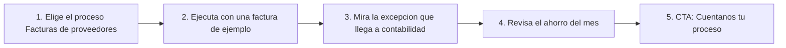

# Automatización de procesos con IA (offering `automatizacion-workflows`)

> Plataforma IA (`aiPlatform`) · Demo: `/demo/automatizacion` · Modo de acceso recomendado: `publico` (el flujo armado con los sistemas del prospecto va por `solicitud`) · Prioridad: **P2** · Esfuerzo total: **XL** (Fases 1–2 ≈ 4 a 5 semanas de 1 dev senior; el acelerador de la Fase 3 va aparte)

*Captura actual de `/demo/automatizacion`. Ver [Sistema de demos](04-Sistema-de-Demos.md), [Catálogo de productos](08-Catalogo-de-Productos.md) y [Roadmap](12-Roadmap.md).*

> **Contexto de posicionamiento:** con el reposicionamiento de Koptup en sistemas RAG (ver [Visión de producto](02-Vision-de-Producto.md)), este producto queda dentro de **"Otras soluciones a medida"**. Es el complemento más natural del producto principal: los flujos pueden **usar el asistente RAG** como un paso más (por ejemplo, "responder este correo con la política de devoluciones citando la fuente"). Por eso su prioridad es P2, por encima de otras demos secundarias.

---

## Resumen

**Problema:** en las pymes y medianas empresas colombianas la información pasa de un sistema a otro a mano: alguien descarga las facturas de proveedores del correo y las digita en Siigo o Alegra, alguien revisa la cartera vencida y escribe uno por uno por WhatsApp, alguien copia los contactos del formulario web al CRM. Son horas por semana, con errores de digitación y retrasos.

**Para quién (cliente ideal en Colombia/LATAM):**
- Empresas de 20 a 500 empleados (distribuidoras, comercializadoras, servicios, IPS y clínicas pequeñas, constructoras) con un ERP o software contable (Siigo, Alegra, SAP Business One) y procesos que dependen de correo, Excel y WhatsApp.
- Gerentes administrativos y financieros, jefes de cartera y líderes comerciales que no tienen un equipo de TI que integre los sistemas.
- Empresas que ya contrataron o evalúan un plan RAG y quieren que el asistente actúe dentro de sus procesos.

**Propuesta de valor:** "Automatizamos las tareas repetitivas entre tus sistemas (facturas, cobranza, leads) con pasos de IA que leen documentos y redactan en español. Lo diseñamos, lo implementamos y lo monitoreamos; tú solo revisas las excepciones."

**Diferenciación frente a Zapier, Make o n8n:** el cliente no compra "otra herramienta para aprender", compra **procesos funcionando**: conectores locales (Siigo, Alegra, Wompi, PayU, facturación electrónica DIAN, WhatsApp Business), IA en español con validación humana, instalación en la nube del cliente cuando lo exige (modalidad compra) y soporte en Colombia.

---

## Estado actual

| Aspecto | Estado | Evidencia |
|---|---|---|
| Demo | Existe. Editor visual oscuro con barra superior (entorno, nube/autoalojado, plantillas, "Ejecutar workflow"), paleta de 27 nodos, lienzo con 7 nodos, inspector con 4 pestañas (Parámetros, Auth, Retries, Test), 3 tarjetas (Uso del plan, Historial de versiones, Alertas y DLQ), tabla de ejecuciones y 4 ventanas (Marketplace de plantillas, Editor de código, SDK, Alertas) | `apps/web/src/app/demo/automatizacion/page.tsx` (657 líneas) y `components/` (`WorkflowCanvas.tsx`, `NodePalette.tsx`, `NodeInspector.tsx`, `ExecutionLogs.tsx`, `MarketplaceModal.tsx`, `CodeEditorModal.tsx`, `SdkModal.tsx`, `types.ts`) |
| Real o maqueta | **Maqueta.** "Ejecutar workflow" anima los nodos con `setTimeout` de 520 ms y agrega una ejecución con duraciones aleatorias (`handleRun` en `page.tsx`). Las salidas de "Test" vienen de `MOCK_PREVIEW` (`NodeInspector.tsx`). No hay llamadas a ningún backend: el único `fetch` es texto dentro del ejemplo de `SdkModal.tsx` | `page.tsx`, `NodeInspector.tsx`, `SdkModal.tsx` |
| Backend | Módulo en memoria `apps/backend/src/modules/automation/` (CRUD de `Workflow` y `Run`, `triggerRun` solo crea un registro "queued"; ~160 líneas) **no montado** en el servidor. No ejecuta nada | `automation.service.ts`, `automation.data.ts` |
| i18n ES/EN | Textos de la interfaz en `apps/web/messages/demos/automatizacion.{es,en}.json` (~7 KB). Quedan textos fijos en el código: "Credenciales cifradas (KMS)…" y "visualización backoff" (`NodeInspector.tsx`), disparadores "webhook POST", "manual run", "schedule cron" (`page.tsx`), "runs" (`ExecutionLogs.tsx`) | |
| Tests | Solo smoke test (`__tests__/page.test.tsx`, 11 líneas), que hoy no se ejecuta | |
| Tamaño | 1.928 líneas en total (`wc -l`) | |

### Problemas detectados (con ruta)

1. **Las flechas del lienzo se dibujan en el sentido equivocado.** `WorkflowCanvas.tsx` une los nodos en el orden del arreglo (`nodes[i]` con `nodes[i + 1]`), siempre del lado derecho al izquierdo. La segunda fila está ubicada de derecha a izquierda (`INITIAL_NODES` en `page.tsx`), así que la línea de "Resumen IA" a "Transform" cruza el lienzo en diagonal y las flechas de abajo apuntan al revés del orden de ejecución (se ve en la captura).
2. **En el celular la demo abre con dos ventanas encima.** `paletteOpen` e `inspectorOpen` empiezan en `true` y sus capas móviles (`lg:hidden fixed inset-0`) se muestran al cargar: lo primero que ve un prospecto en el teléfono es la paleta y el inspector tapando el lienzo.
3. **El inspector no se actualiza bien al cambiar de nodo.** El campo "Nombre" usa `defaultValue` en la misma posición, así que conserva el nombre del nodo anterior; y la salida de "Test" (`output`) se queda con el resultado del nodo previo (`NodeInspector.tsx`).
4. **La paleta promete arrastrar y soltar, pero no pasa nada.** Los ítems tienen `draggable` y cursor de agarre, pero el lienzo no recibe nada (`NodePalette.tsx`). Solo los nodos de código abren el editor.
5. **10 tipos de botón sin acción (más de 15 botones visibles):** "Promover a prod" (menú de entorno), "Upgrade" (Uso del plan), "Promover esta versión", "Reprocesar" de cada mensaje y "Purgar" (ventana de alertas), "Usar plantilla" (x6, `MarketplaceModal.tsx`), "Guardar" y "Ejecutar" (`CodeEditorModal.tsx`), "Ver docs completas" (`href="#"`, `SdkModal.tsx`) y el ojo de cada paso en `ExecutionLogs.tsx`.
6. **Datos de ejemplo ajenos al cliente colombiano:** el flujo "Onboarding cliente PRO" enriquece con un servicio de datos de EE. UU., notifica a Slack y asigna un "CSM". Nada de facturas, cartera, Siigo, DIAN o WhatsApp, que es lo que compra una pyme local.
7. **Cifras y nombres que no cuadran con el catálogo:** la tarjeta "Uso del plan" dice "Plan: Business" con 42.300 / 100.000 ejecuciones, pero los planes se llaman Básico, Profesional, Avanzado y Enterprise y sus límites son 10.000 / 250.000 / 2,5 M / 25 M ejecuciones (`quotaExec` en `page.tsx`, `quotas.planName` en el JSON).
8. **Prueba social inventada:** las plantillas muestran "12.4k instalaciones", "8.7k"… (`TEMPLATES` en `MarketplaceModal.tsx`) y la tarjeta del catálogo de demos anuncia "500+ integraciones" (`messages/demos/_catalog.es.json`, clave `demosExtra.automation`). La paleta tiene 27 nodos.
9. **Paquete de SDK inexistente:** la ventana SDK enseña a instalar `@platform/sdk`, que no es un paquete de Koptup (`SdkModal.tsx`).
10. **Jerga técnica y voseo:** "DLQ", "Retries", "backoff", "Promover a prod", "staging", "Self-hosted"; el prompt de ejemplo dice "Resumí… recomendá" (`NodeInspector.tsx`). Un gerente administrativo no entiende la pantalla sin un vendedor al lado.
11. **Textos del catálogo** (`messages/offerings/automatizacion-workflows.es.json`): descripción de plantilla ("Implementación a medida o suscripción SaaS mensual del producto…"), voseo ("Conectá", "automatizá", "Comprala", "pagá… por vos") y la viñeta **"Reportes mensuales del tier" duplicada** en Avanzado y en Enterprise.

**Lo que sí funciona y se conserva:** la estética del editor (se ve como una herramienta profesional), la animación de ejecución paso a paso, la tabla de ejecuciones con detalle por paso, el buscador de la paleta y el selector de modelo de IA en el nodo LLM.

---

## Qué falta para que sea vendible

- **Hablar de procesos, no de nodos:** "Facturas de proveedores a Siigo", "Cobranza por WhatsApp", "Leads al CRM" como plantillas con nombre de negocio.
- **Mostrar el ahorro:** horas al mes y errores evitados, calculados con los datos del ejemplo; es lo que justifica el precio.
- **Integraciones locales visibles:** Siigo, Alegra, facturación electrónica DIAN (XML UBL 2.1), Wompi, PayU, WhatsApp Business, Gmail/Outlook, Excel/Google Sheets.
- **Mostrar la excepción y el humano en el ciclo:** la factura que no cuadra con la orden de compra llega a contabilidad por WhatsApp; eso genera confianza.
- **Quitar lo que confunde o es falso:** entornos dev/staging/prod, SDK inexistente, instalaciones inventadas, "500+ integraciones".
- **Corregir los defectos visibles:** flechas, móvil, inspector.
- **Un paso siguiente claro:** "Cuéntanos un proceso y te lo mostramos armado en tu demo".
- **Precio entendible:** hoy el plan Básico de compra cuesta COP 49.000.000 por "10.000 ejecuciones/mes, HTTP, correo y Sheets", algo que el cliente compara con herramientas de USD 20 a 100 al mes. Hay que venderlo por **procesos implementados y operados**, no por ejecuciones.

---

## Plan detallado

### Landing `/productos/automatizacion-workflows`

1. **Hero:** "Automatiza las tareas repetitivas de tu empresa: facturas, cobranza y leads conectados a Siigo, Alegra y WhatsApp". Subtítulo: "Lo diseñamos, lo implementamos y lo monitoreamos. Tú revisas solo las excepciones". CTA principal **Solicitar demo**, secundarios **Probar la demo** (pública) y **Agendar llamada**.
2. **Video de 60–90 s:** llega un correo con una factura electrónica → la IA lee el XML → la factura queda registrada en el software contable → una factura que no cuadra llega a contabilidad por WhatsApp → el panel muestra "62 horas ahorradas este mes".
3. **Tres casos con antes y después** (tarjetas):
   - *Facturas de proveedores:* "Antes: 3 horas diarias digitando. Después: 10 minutos revisando excepciones".
   - *Cobranza:* "Recordatorios por WhatsApp con enlace de pago y conciliación automática al pagar".
   - *Leads:* "Cada contacto del sitio o de WhatsApp llega al CRM, asignado al comercial de su ciudad, en menos de un minuto".
4. **Calculadora de ahorro:** tareas al mes × minutos por tarea × costo de la hora → horas y COP ahorrados al mes; botón "Enviarme este cálculo" que crea un `Lead`.
5. **Integraciones** (nombres, sin logos hasta revisar el uso de marcas): software contable, facturación electrónica, pasarelas de pago, WhatsApp Business, correo, hojas de cálculo, CRM, y "tu asistente RAG de Koptup".
6. **Cómo trabajamos:** diagnóstico de 1 proceso (gratis, 1 hora) → piloto de 1 a 3 flujos en 2 a 4 semanas → operación con monitoreo y ajustes mensuales.
7. **Seguridad:** credenciales cifradas, bitácora de cada ejecución, aprobación humana en los pasos sensibles, instalación en la nube del cliente (compra) y tratamiento de datos conforme a la Ley 1581.
8. **Planes y precios** (compra; SaaS "lista de espera") y **FAQ:** ¿es como Zapier o Make? · ¿qué pasa si mi software contable cambia su API? · ¿necesito un programador en mi empresa? · ¿la IA puede equivocarse al leer una factura? (sí; por eso las diferencias van a revisión humana) · ¿cuánto cuesta la IA por ejecución?
9. **Bloque cruzado:** "¿Ya tienes o evalúas un asistente RAG? Conéctalo a tus procesos" → [Sistemas RAG](Producto-chatbot-rag-ia.md).

### Demo interactiva (mejoras por pantalla/módulo)

| Pantalla / componente | Hoy | Cambiar a |
|---|---|---|
| Barra superior (`page.tsx`) | "Plataforma de Automatización", "Workflow · Onboarding cliente PRO", selector dev/staging/prod, interruptor Cloud/Self-hosted, Plantillas, Ejecutar | Logo y nombre de la empresa ficticia (o del prospecto con acceso), **selector de proceso** (Facturas de proveedores · Cobranza por WhatsApp · Leads al CRM), botón **"Ejecutar con un ejemplo"** y banner "Solicita tu demo guiada" (modo `publico`). El entorno y el modo de despliegue pasan a una etiqueta informativa "Se instala en tu nube (plan compra)" |
| Paleta (`NodePalette.tsx`) | 27 nodos en inglés técnico (Webhook, Polling HTTP, DB CDC, Stripe charge, Salesforce…), arrastre que no funciona | **"Conectores disponibles"** agrupados por negocio: Entradas (correo, formulario web, WhatsApp, programación diaria), Sistemas (Siigo, Alegra, facturación electrónica, Wompi, PayU, CRM, Excel/Sheets), IA (leer documento, clasificar, redactar respuesta, preguntar al asistente RAG), Lógica (si/entonces, esperar, repetir). Cada conector con etiqueta del plan que lo incluye. Clic en un conector = agregar al final del flujo (sin arrastre) o quitar `draggable` |
| Lienzo (`WorkflowCanvas.tsx`) | 7 nodos en dos filas; aristas por orden del arreglo; flechas invertidas | Aristas explícitas (`edges[]` en `types.ts`) y diseño de izquierda a derecha con **rama de excepción** visible (por ejemplo "¿Coincide con la orden de compra?" → Sí / No). Al ejecutar, cada nodo muestra un resumen legible ("Factura FE-10234 de Papeles del Norte: $ 4.284.000") |
| Inspector (`NodeInspector.tsx`) | Pestañas Parámetros, Auth, Retries, Test; JSON técnico | Pestañas **Configuración**, **Datos de ejemplo** (entrada y salida en tabla, no JSON) y **Si falla** (reintentos y a quién avisar, en lenguaje simple). Reiniciar estado al cambiar de nodo (`key={selectedId}`). Prompt del nodo de IA en español neutro |
| Tarjeta "Uso del plan" | "Plan: Business", 100.000 ejecuciones, "Upgrade" sin acción | "Plan Profesional: 42.300 de 250.000 ejecuciones este mes" (coherente con el catálogo) + **"Ahorro del mes"**: horas ahorradas, tareas manuales evitadas, excepciones enviadas a revisión |
| Tarjeta "Historial de versiones" | Commits estilo git ("feat:", "chore:") | **"Historial de cambios"** con frases de negocio ("Se agregó la validación contra la orden de compra", Lucía, ayer) y "Volver a esta versión" con confirmación |
| Tarjeta "Alertas y DLQ" + ventana | "14 mensajes en DLQ", "Reprocesar", "Purgar" sin acción | **"Para revisar"**: 3 casos reales del ejemplo (factura sin orden de compra, plantilla de WhatsApp no aprobada, límite de solicitudes del software contable) con botón "Reintentar" que funciona en la sesión |
| Ejecuciones (`ExecutionLogs.tsx`) | IDs técnicos, disparadores en inglés, ojo sin acción | Columna "Qué pasó" en lenguaje de negocio, estados en español, el ojo abre los datos del paso |
| Marketplace (`MarketplaceModal.tsx`) | 6 plantillas genéricas con instalaciones inventadas, "Usar plantilla" sin acción | **"Plantillas para Colombia"**: las 3 del recorrido + "Conciliación de pagos Wompi", "Aviso de facturas por vencer", "Respuesta a correos con el asistente RAG". "Usar plantilla" carga el flujo en el lienzo. Sin contadores de instalaciones |
| Editor de código y SDK (`CodeEditorModal.tsx`, `SdkModal.tsx`) | En el pie y en la paleta; paquete inexistente | Mover a una sección **"Para equipos técnicos"** (plan Avanzado) con el texto "Si necesitas un conector que no está, lo construimos". Quitar `@platform/sdk` |
| Móvil | Paleta e inspector abiertos al cargar | Ambos cerrados por defecto bajo `lg`; botón flotante "Ver pasos" |

**Datos de ejemplo** (empresa ficticia "Distribuciones Guayacán S.A.S.", distribuidora de productos de aseo en Bogotá y Medellín; verificar en el RUES que el nombre no exista):

| Proceso | Pasos | Excepción que se muestra |
|---|---|---|
| Facturas de proveedores al software contable | Correo entrante a facturas@ con ZIP (XML UBL 2.1 + PDF) → IA extrae NIT, número, fecha, subtotal, IVA 19 % y total → compara con la orden de compra (hoja de cálculo) → registra la cuenta por pagar en Siigo o Alegra → registra el acuse de recibo (evento RADIAN) → resumen diario a tesorería | Factura de "Papeles del Norte S.A.S." por $ 4.284.000 contra una orden de $ 3.998.400 → tarea por WhatsApp a contabilidad |
| Cobranza por WhatsApp | Todos los días a las 8:00 → facturas vencidas → mensaje con plantilla aprobada y enlace de pago (Wompi: PSE, tarjeta, Nequi) → al confirmarse el pago, marca la factura y agradece → sin pago en 3 días, tarea al comercial | Cliente que responde "ya pagué por transferencia" → la IA lo detecta y pide el soporte a cartera |
| Leads al CRM | Formulario web o mensaje de WhatsApp → IA clasifica intención, ciudad y producto → crea el contacto en el CRM → asigna al comercial de la zona → respuesta inicial con el asistente RAG (catálogo y políticas, citando la fuente) | Mensaje de un cliente actual con una queja → se desvía a servicio al cliente, no a ventas |

**Recorrido guiado (5 pasos):**

> [Ver diagrama como imagen](images/diagramas/Producto-automatizacion-workflows-1.png)

1. Elegir "Facturas de proveedores" (preseleccionado). Una nota explica en una línea qué hace el flujo.
2. Pulsar "Ejecutar con un ejemplo": cada paso se ilumina y el inspector muestra los datos que la IA leyó del XML.
3. Ejecutar el segundo ejemplo (la factura que no cuadra) y ver la rama "No coincide" con el mensaje simulado de WhatsApp a contabilidad.
4. Ver la tarjeta "Ahorro del mes" y la tabla de ejecuciones con un reintento resuelto solo.
5. Cierre: "¿Qué proceso te quita más tiempo? Cuéntanos y lo armamos en tu demo" (abre "Solicitar demo" con el producto preseleccionado) o "Agendar llamada".

Eventos de uso (`DemoEvent`): `module_view` por proceso y pestaña; `key_action` = `run_example`, `open_exception`, `view_savings`, `use_template`; `cta_click` en el cierre.

### Acceso y solicitud de demo

- **Modo recomendado: `publico`.** La maqueta no tiene costo de IA ni datos sensibles, sirve como imán de búsquedas ("automatización de procesos Colombia", "automatizar facturas Siigo") y el comprador quiere explorarla solo. Se muestra el banner "Solicita tu demo guiada".
- **Lo que pasa por `solicitud`:** la **demo personalizada**. El prospecto describe un proceso en el formulario (campo "caso de uso"); el comercial lo aprueba y el equipo arma ese flujo en la demo con los sistemas del prospecto (personalización del `DemoGrant`) en 3 a 5 días hábiles.
- **Duración del acceso:** 14 días (valor por defecto de la DECISIÓN 3), extensible a 21 si hay piloto en negociación.
- **Antes de solicitar, el visitante ve:** la landing con el video de 60–90 s, 6 capturas (lienzo con el proceso de facturas, excepción, ahorro, plantillas, ejecuciones, vista móvil) y la demo pública completa.
- **El prospecto aprobado ve** (Portal › Mis demos): la demo con su logo, su software contable y su proceso como plantilla destacada; un resumen del ahorro estimado con sus cifras; y los botones "Solicitar propuesta" y "Agendar llamada".

### Personalización por cliente

Se configura sin código desde **Admin › Solicitudes de demo › Aprobar** (campo `customization` del `DemoGrant`: `logoUrl`, `sector`, `datasetKey`, más estos campos propios):

| Campo | Efecto en la demo |
|---|---|
| Nombre y logo de la empresa | Barra superior, remitente de los mensajes simulados, nombres de proveedores y clientes de ejemplo |
| Sector (comercio y distribución, servicios, salud, manufactura, construcción) | Elige el `datasetKey` con proveedores, montos y productos del sector |
| Software contable (Siigo, Alegra, SAP Business One, otro) | Nombre e ícono del conector en el lienzo |
| Canal de avisos (WhatsApp, Teams, Slack, correo) | Nodo de notificación y vista previa del mensaje |
| Proceso destacado (una de las plantillas o "flujo a medida") | Plantilla que abre por defecto. "Flujo a medida" carga un JSON preparado por el equipo (sin desplegar) |
| Volúmenes del prospecto (tareas al mes, minutos por tarea, costo de la hora) | Tarjeta "Ahorro del mes" con sus cifras |

En **Admin › Catálogo de demos** se administran el modo de acceso, el video, las capturas y la duración por defecto del `DemoCatalogItem` `automatizacion`.

### Producto real

**MVP para la modalidad compra (Básico y Profesional):**

| Módulo | Alcance |
|---|---|
| Orquestador | Motor de flujos con disparadores (correo, webhook, programación), reintentos y registro de ejecuciones. **No construir un motor desde cero:** evaluar Temporal (MIT) o Node-RED (Apache 2.0); n8n autoalojado solo para uso interno del cliente, revisando su licencia de uso sostenible, que limita ofrecerlo como servicio a terceros |
| Conectores Colombia | Siigo o Alegra (terceros, facturas, cuentas por pagar y cobrar), lectura de facturas electrónicas recibidas (XML UBL 2.1 dentro del ZIP) y eventos RADIAN a través del proveedor tecnológico del cliente, Wompi o PayU (enlaces de pago y confirmaciones), WhatsApp Business Cloud API (plantillas aprobadas por Meta), Gmail/Outlook, Excel 365/Google Sheets, CRM (HubSpot, Pipedrive o el [CRM con IA](Producto-crm-ia.md) de Koptup) |
| Pasos de IA | Extraer campos de PDF/XML, clasificar mensajes, redactar respuestas y consultar el asistente RAG; con umbral de confianza y envío a revisión humana por debajo del umbral |
| Bandeja de excepciones | Lista de casos para revisar, con aprobar/corregir/reintentar, y aviso por WhatsApp o Teams |
| Panel | Ejecuciones, errores, ahorro estimado (horas y COP), consumo de IA del mes |
| Seguridad | Credenciales cifradas, roles, bitácora de cambios y ejecuciones, autorización verificada en el servidor |
| Despliegue | Docker en la nube del cliente (AWS, Azure, GCP) o en la de Koptup en modalidad gestionada |
| Base existente | `apps/backend/src/modules/automation/` sirve solo como modelo de datos de partida (`Workflow`, `Run`); la ejecución real debe construirse sobre el orquestador elegido |

**SaaS:** sin base real, así que **"SaaS: lista de espera"** (DECISIÓN 7). Para habilitarlo (Fase 4): core multi-tenant y cobro recurrente (Wompi/PayU en COP, Stripe en USD), aislamiento de ejecuciones y secretos por cliente, medición de ejecuciones y de consumo de IA contra el plan, aplicaciones OAuth registradas y verificadas ante cada proveedor (Google, Microsoft, CRM), límites por cliente y monitoreo con alertas. **Recomendación:** no competir como plataforma de autoservicio contra Zapier o Make; ofrecer el SaaS como **"automatizaciones gestionadas"** (Koptup opera los flujos del cliente en su infraestructura multi-tenant y cobra por procesos activos).

### Planes y precios

Precios actuales del catálogo (`apps/web/src/lib/services-catalog.ts`, entrada `automatizacion-workflows`), en COP:

| Plan | Compra: setup único | Compra: mantenimiento mensual (opcional) | SaaS: setup | SaaS: cuota mensual | Volumen | Implementación |
|---|---|---|---|---|---|---|
| Básico | $49.000.000 | $4.500.000 | $2.900.000 | $1.690.000 | 10.000 ejecuciones/mes | 2–5 semanas |
| Profesional | $126.000.000 | $11.200.000 | $6.900.000 | $4.090.000 | 250.000 ejecuciones/mes | 5–9 semanas |
| Avanzado | $294.000.000 | $25.200.000 | $12.900.000 | $7.690.000 | 2,5 M ejecuciones/mes | 9–14 semanas |
| Enterprise | $630.000.000 | $49.000.000 | A convenir ("Personalizado") | $13.890.000 | 25 M+ ejecuciones/mes | 12–20 semanas |

| Plan | Usuarios admin | Cuentas | Almacenamiento | Horas de evolutivos/mes | Soporte | Costos del cliente (USD/mes) |
|---|---|---|---|---|---|---|
| Básico | 3 | 1 | 5 GB | 5 | Correo, 24 h hábiles | 80–300 (hosting, base de datos, IA opcional) |
| Profesional | 15 | 3 | 50 GB | 12 | Correo + WhatsApp, 4 h | 400–1.500 (hosting, IA, conectores premium) |
| Avanzado | 40 | 15 | 250 GB | 25 | + Slack Connect, 2 h | 1.500–6.000 (workers, mezcla de LLM, Temporal) |
| Enterprise | Ilimitados | Ilimitadas | Ilimitado | 50 | Tickets con SLA 1 h | 5.000–20.000 (iPaaS corporativo, bus de eventos, EDI) |

USD de referencia (TRM 3.300, "Otras soluciones a medida"): setup de compra ≈ USD 14.850 / 38.180 / 89.090 / 190.910; SaaS ≈ USD 510 / 1.240 / 2.330 / 4.210 al mes. Ciclos SaaS: semestral −10 %, anual −20 %.

**Qué incluye cada plan, en lenguaje de cliente:**
- **Básico:** "Automatizamos 1 a 3 procesos entre tu correo, hojas de cálculo y un sistema (por ejemplo, facturas al software contable), con avisos por correo o Slack".
- **Profesional:** "Hasta 10 procesos conectados a tu ERP o CRM, WhatsApp Business y almacenamiento en la nube, con reportes mensuales".
- **Avanzado:** "Procesos largos con aprobaciones y reintentos, decisiones con IA, servidores dedicados y bitácora completa para auditoría".
- **Enterprise:** "Integración con la plataforma corporativa de integración, intercambio EDI con grandes superficies, bus de eventos y equipo asignado (gerente de proyecto y líder técnico)".

**Recomendaciones de claridad:**
1. **Vender por procesos, no por ejecuciones:** agregar "hasta N procesos implementados" a cada plan (propuesta: 3 / 10 / 25 / a convenir) y dejar las ejecuciones como límite técnico secundario. Los números finales los decide el dueño.
2. **Corregir la incoherencia compra vs. SaaS:** el mantenimiento mensual de compra ($4.500.000 en Básico) es 2,7 veces la cuota SaaS ($1.690.000) del mismo plan, y el primer año de compra con mantenimiento ($103.000.000) cuesta más de 4 veces el primer año SaaS ($23.180.000). Mientras el SaaS esté en lista de espera, el cliente solo ve la opción cara. Revisar el mantenimiento (qué incluye además de las 5 horas) o mostrarlo como "bolsa de horas" opcional.
3. **Ofrecer una entrada de bajo riesgo**, análoga al Piloto RAG: "Piloto de automatización: 1 proceso en producción en 3 semanas, descontable si contratas en 30 días". Precio a definir por el dueño (referencia: Piloto RAG COP 3.900.000).
4. **Corregir `automatizacion-workflows.{es,en}.json`:** propuesta de valor en `tagline` y `description`, borrar las viñetas duplicadas "Reportes mensuales del tier", traducir jerga ("HTTP/REST steps", "Workers dedicados", "Temporal cluster", "iPaaS enterprise") y quitar el voseo.
5. **SaaS en "lista de espera"** y el precio de compra explicado como "implementación + licencia de uso indefinido en tu nube".
6. **Renombrar el producto** a "Automatización de procesos con IA" en el catálogo y la landing (el término "workflows" se queda en las palabras clave de SEO).

---

## Tareas

| # | Tarea | Fase | Prioridad | Esfuerzo | Criterio de aceptación |
|---|---|---|---|---|---|
| 1 | Reescribir `automatizacion-workflows.{es,en}.json` y la tarjeta `demosExtra.automation` de `messages/demos/_catalog.{es,en}.json`: propuesta de valor, sin voseo, sin viñetas duplicadas, sin "500+ integraciones" | Fase 1 — Funnel y solicitud de demos | P1 | S | Ninguna viñeta repetida; ninguna cifra que no se pueda demostrar en la demo; revisado por el dueño |
| 2 | Registrar `DemoCatalogItem` `automatizacion` con `accessMode: publico`, banner "Solicita tu demo guiada" y SaaS como "lista de espera" | Fase 1 — Funnel y solicitud de demos | P1 | S | El banner abre el formulario con el producto preseleccionado; la tabla pública no muestra cuota SaaS y "Anotarme" crea un `Lead` |
| 3 | Landing `/productos/automatizacion-workflows` con video, 3 casos, calculadora de ahorro, integraciones, planes y FAQ | Fase 1 — Funnel y solicitud de demos | P2 | M | La landing está en el sitemap; la calculadora crea un `Lead` con las cifras; el CTA lleva al formulario con el producto |
| 4 | Corregir el lienzo y el inspector: aristas explícitas en `types.ts` y `WorkflowCanvas.tsx`, diseño de izquierda a derecha, capas móviles cerradas al cargar, `key={selectedId}` en `NodeInspector` | Fase 2 — Demos vendibles | P1 | S | Ninguna flecha cruza un nodo ni apunta al revés; a 390 px de ancho el lienzo se ve al cargar; al cambiar de nodo el nombre y la salida cambian |
| 5 | Mover `INITIAL_NODES`, `INITIAL_RUNS`, `COMMITS`, `MOCK_PREVIEW` y `TEMPLATES` a un archivo de fixtures con los 3 procesos colombianos (facturas, cobranza, leads) de "Distribuciones Guayacán" | Fase 2 — Demos vendibles | P1 | M | El selector de proceso cambia nodos, datos del inspector, ejecuciones y excepciones; no quedan textos de ejemplo en inglés en la vista ES |
| 6 | Simplificar la interfaz: paleta "Conectores disponibles" por negocio, quitar entornos, SDK y contadores de instalaciones; mover el editor de código a "Para equipos técnicos"; conectar o eliminar todos los botones sin acción | Fase 2 — Demos vendibles | P1 | M | Ningún botón visible queda sin efecto (verificado con un test de interacción); sin términos "DLQ", "staging" ni "backoff" en la vista ES |
| 7 | Tarjetas "Uso del plan" coherente con el catálogo, "Ahorro del mes" y "Para revisar" con reintento funcional | Fase 2 — Demos vendibles | P2 | S | La tarjeta muestra un plan y un límite que existen en `services-catalog.ts`; "Reintentar" resuelve el caso en la sesión |
| 8 | Recorrido guiado de 5 pasos y eventos `DemoEvent` (`run_example`, `open_exception`, `view_savings`, `use_template`, `cta_click`) | Fase 2 — Demos vendibles | P2 | S | El recorrido se puede saltar y retomar; los eventos aparecen en el detalle del acceso en Admin |
| 9 | Personalización por `DemoGrant` (logo, sector, software contable, canal de avisos, proceso destacado, volúmenes) | Fase 2 — Demos vendibles | P2 | M | Al aprobar con "Alegra" y "Teams", el prospecto ve esos conectores y el ahorro con sus cifras |
| 10 | Grabar el video de 60–90 s y 6 capturas | Fase 2 — Demos vendibles | P2 | S | Archivos publicados en la landing y en el `DemoCatalogItem` |
| 11 | Plantilla de propuesta por procesos (n.º de procesos, conectores, volumen, horas de operación) y oferta de "Piloto de automatización" | Fase 3 — Propuestas y conversión | P2 | S | El comercial genera la propuesta desde Admin en menos de 15 minutos |
| 12 | Acelerador base para proyectos de compra: orquestador elegido (con revisión de licencias), conectores de software contable, Wompi y WhatsApp Cloud API, bandeja de excepciones y panel de ejecuciones | Fase 3 — Propuestas y conversión | P3 | L | Un flujo de facturas corre de punta a punta en un ambiente de prueba con una factura XML real anonimizada |
| 13 | Paso "Preguntar al asistente RAG" como complemento del plan RAG Profesional | Fase 4 — Productos SaaS reales | P3 | M | Un correo de prueba recibe un borrador de respuesta con la fuente citada y queda pendiente de aprobación humana |

---

## Métricas de éxito

| Métrica | Meta inicial |
|---|---|
| Visitantes de la demo pública que completan los 5 pasos | ≥ 35 % |
| Visitantes de la demo o la landing que usan la calculadora de ahorro | ≥ 15 % |
| Visitantes que solicitan la demo personalizada | ≥ 4 % |
| Prospectos aprobados que abren su demo personalizada en las primeras 72 h | ≥ 70 % |
| Demos personalizadas que pasan a propuesta o piloto | ≥ 25 % |
| Pilotos que pasan a contrato en 30 días | ≥ 50 % |

Páginas relacionadas: [Sistemas RAG](Producto-chatbot-rag-ia.md), [CRM con IA](Producto-crm-ia.md), [Facturación electrónica](Producto-facturacion-electronica.md), [Helpdesk con IA](Producto-helpdesk-ia.md), [Landing de producto](Seccion-Landing-de-Producto.md), [Panel de administración](05-Panel-de-Administracion.md).
