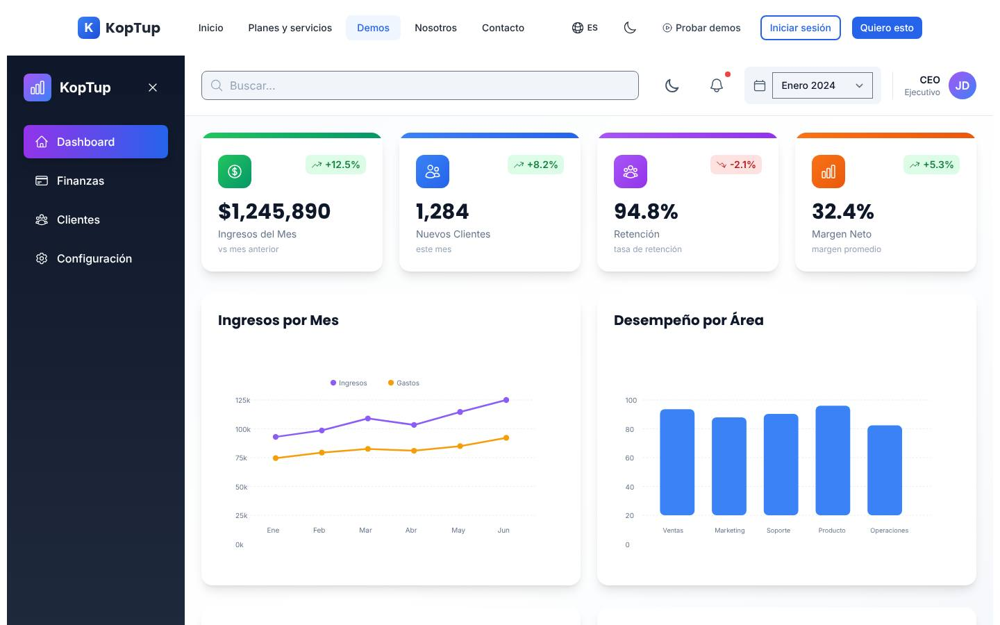
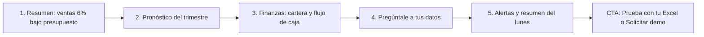

# Dashboard ejecutivo con IA

> Datos y analítica (hoy `aiPlatform` en el catálogo) · Demo: `/demo/dashboard-ejecutivo` · Modo de acceso recomendado: `publico` (versión con datos y marca del prospecto por `solicitud`) · Prioridad: **P2** · Esfuerzo total: **L** (≈ 2 semanas de 1 dev senior para dejar demo + landing vendibles; el producto real se estima aparte)

*Captura actual de `/demo/dashboard-ejecutivo` (vista Dashboard). Ver también [Sistema de demos](04-Sistema-de-Demos.md), [Catálogo de productos](08-Catalogo-de-Productos.md) y [Roadmap](12-Roadmap.md). Productos relacionados: [ERP modular](Producto-erp-modular.md), [Facturación electrónica](Producto-facturacion-electronica.md), [CRM con IA](Producto-crm-ia.md) y [Chatbot RAG](Producto-chatbot-rag-ia.md).*

> **Contexto de posicionamiento:** con el reposicionamiento de Koptup en sistemas RAG (ver [Visión de producto](02-Vision-de-Producto.md)), este producto queda dentro de **"Otras soluciones a medida"**. Aun así, es una de las demos más visibles del sitio: la enlazan el home (`apps/web/src/app/page.tsx`), el footer (`components/layout/Footer.tsx`), `/bienvenido-producthunt` y el calendario de la demo de LinkedIn Ads. Una demo floja aquí perjudica la marca entera, así que sus arreglos de credibilidad son P1 aunque el producto sea P2.

---

## Resumen

**Problema:** en la mayoría de PYMEs colombianas el informe de gerencia se arma a mano cada mes. Alguien exporta de Siigo o Alegra, cruza con el extracto del banco y las ventas de la tienda en línea, y lo pega en Excel. El informe llega tarde, cada área trae "su" número y nadie ve a tiempo que la cartera se está venciendo o que el margen se cae.

**Para quién (cliente ideal en Colombia/LATAM):**
- Comercializadoras y distribuidoras de 20–200 empleados con varias ciudades o líneas de producto.
- Cadenas de retail y franquicias (ventas por tienda, ticket promedio, inventario).
- IPS y clínicas privadas (facturación por EPS, glosas, cartera por pagador).
- Colegios y universidades privadas (matrículas, recaudo, deserción).
- Constructoras e inmobiliarias (ventas por proyecto, flujo de caja de obra).
- Gerentes generales y financieros, y juntas directivas que hoy reciben PDF estáticos.

**Propuesta de valor:** "Tus números de Siigo, Alegra, el banco y tus ventas en línea, en un tablero que se actualiza solo. Cada lunes recibes por WhatsApp un resumen en español que te dice qué cambió y por qué." La diferencia frente a Power BI o Looker Studio es que la implementación va incluida: Koptup conecta el software contable colombiano, define contigo los KPIs de tu sector y entrega resúmenes y alertas con IA. Además, el código es tuyo.

**Encaje con el reposicionamiento RAG:** el puente natural es **"Pregúntale a tus datos"** más el **resumen ejecutivo con IA**. Combinado con un asistente RAG sobre contratos y políticas, el discurso queda en "IA que responde con los documentos **y los números** de tu empresa". Se ofrece como complemento cuando un cliente RAG pide indicadores.

---

## Estado actual

| Aspecto | Estado | Evidencia |
|---|---|---|
| Demo | Existe. **Maqueta** 100 % en el navegador | `apps/web/src/app/demo/dashboard-ejecutivo/page.tsx` es `'use client'`. No hay `fetch`, `axios` ni llamadas a `/api`. Solo genera un PDF local (`jsPDF`) y un `.ics` |
| Pantallas | Menú lateral con 4 vistas: Dashboard, Finanzas, Clientes y Configuración. Además, una vista Notificaciones (desde la campana) y 5 modales: Reporte financiero (con PDF), Meta de ventas, Mantenimiento programado, Cliente nuevo y Calendario (.ics). También tiene búsqueda, selector de mes y modo oscuro | `renderDashboardView`, `renderFinanzasView`, `renderClientesView`, `renderConfiguracionView`, `renderNotificacionesView` en `page.tsx` |
| Contenido del Dashboard | 4 KPIs, gráfico de líneas de ingresos y gastos, barras de "Desempeño por área" (0–100), dona de distribución de ventas ("Producto A–D") y 3 "Insights inteligentes" | Arreglos `kpis`, `revenueData`, `performanceData`, `salesDistribution`, `insights` |
| Datos | Fijos en `page.tsx`: enero de 2024 y empresa por defecto "KopTup Tech Solutions" con NIT ficticio y datos de contacto de Koptup. Los clientes tienen nombres en inglés (TechCorp Solutions, CloudFirst Inc…) | Estado `company`, arreglos `transacciones` y `clientes` |
| Backend | Ninguno. No existe un módulo de BI o analítica en `apps/backend/src/modules/` | — |
| i18n ES/EN | Namespace `execDashboard` en `apps/web/messages/{es,en}.json` (141 claves cada uno). Quedan en español fijo: los insights, la notificación "Reunión de equipo programada", las viñetas del PDF, "Industria", los meses del gráfico y los nombres de áreas | `page.tsx` |
| Tests | Ninguno: no hay carpeta `__tests__`, aunque el código ya tiene `data-testid` (`exec-sidebar`, `exec-search-panel`, `exec-month-select`) | — |
| Tamaño | 1.992 líneas: `page.tsx` tiene 1.970 en un solo componente; `layout.tsx`, 22 | `wc -l` |
| SEO | Metadata `demo-dashboard-ejecutivo` en `apps/web/src/lib/seo-config.ts` y breadcrumb JSON-LD en `layout.tsx` | — |
| CTA | Solo el `DemoCTA` genérico del layout de `/demo`: "Solicitar Cotización" lleva a `/contact` sin producto preseleccionado y "Ver Planes y Precios" lleva a `/pricing`, que solo redirige | `apps/web/src/app/demo/layout.tsx`, `apps/web/src/components/demo/DemoCTA.tsx` |
| Catálogo | Mapeo correcto: offering `bi-dashboard` → demo `dashboard-ejecutivo` | `services-catalog.ts` |

**Lo que hace bien:** se ve "ejecutiva", limpia y moderna. La navegación es clara y la accesibilidad está cuidada: roles ARIA, Escape cierra los modales y se bloquea el scroll cuando hay un modal abierto. El PDF y el `.ics` se descargan de verdad. Además, ya existe un formulario de datos de la empresa en Configuración, que sirve de base para la personalización por prospecto.

### Problemas detectados (con ruta)

1. **Números que se contradicen** (`page.tsx`). El mismo mes tiene cuatro versiones de los ingresos:
   - Dashboard: "Ingresos del mes $1,245,890" y "Margen neto 32,4 %".
   - Finanzas: ingresos $526.500, gastos $538.400 y **balance −$11.900**, es decir, pérdida.
   - Reporte PDF (`handleDownloadPdf`): ingresos $2,450,000 y utilidad $600,000.
   - Gráfico de ingresos: valores de 85k a 125k.
2. **Formatos de moneda mezclados:**
   - KPIs y clientes usan formato estadounidense ("$1,245,890", "$450,000").
   - Las transacciones usan `toLocaleString('es-CO', COP)`.
   - Ninguna cifra dice si está en COP o USD.
   - Los montos no son realistas para una empresa: la nómina del mes figura en $450.000.
3. **Selector de mes decorativo:** `selectedDate` no filtra nada y solo ofrece enero a marzo de 2024. Una demo de 2026 muestra datos de hace más de dos años.
4. **La "IA" no existe:**
   - Los 3 "Insights inteligentes" son textos fijos.
   - No hay pronóstico, aunque la oferta lo vende ("Forecasting con IA") y la tarjeta del hub `/demo` promete "Proyecciones".
   - Tampoco hay preguntas en lenguaje natural ni detección de anomalías.
5. **Marca equivocada:**
   - El menú lateral dice "KopTup" y la empresa analizada es "KopTup Tech Solutions": el prospecto ve los números "de Koptup", no los de una empresa como la suya.
   - El usuario es "CEO · JD".
6. **Búsqueda falsa:** siempre muestra los mismos 3 accesos (Dashboard, Finanzas, Clientes). No busca clientes ni transacciones.
7. **Mensajes que restan confianza:**
   - La notificación "Mantenimiento programado" anuncia que el sistema no estará disponible.
   - "Meta de ventas alcanzada 🎉" lleva un emoji dentro de los textos de i18n.
   - "Reunión de equipo programada" no tiene relación con el producto.
8. **Gráficos SVG dibujados a mano** con coordenadas fijas:
   - El `strokeDasharray` de la dona está calculado a mano.
   - La etiqueta "0k" queda fuera de la grilla.
   - No tienen tooltips y no reaccionan a los datos.
9. **Efectos fuera de la demo:**
   - El modo oscuro escribe `localStorage.darkMode` y la clase `dark` en `<html>`, y no los limpia al salir, así que afecta al resto del sitio.
   - Las claves `company` y `darkMode` son genéricas y pueden chocar con otras demos.
10. **No se ve de dónde salen los datos.** El producto se vende por sus conectores (CSV, Google Sheets, Postgres, Siigo, SAP B1, HubSpot), pero la demo no muestra fuentes ni la hora de la última actualización.
11. **Textos del catálogo** (`apps/web/messages/offerings/bi-dashboard.es.json`):
    - Usan voseo ("Visualizá", "Lo entregamos…").
    - Tienen jerga que un gerente no entiende: "row-level security", "CDC", "Multi-warehouse federation", "Data lineage".
    - La categoría es `aiPlatform` ("Plataforma IA"), cuando el producto es de datos y analítica.
    - Los precios son idénticos, tupla por tupla, a los del chatbot RAG del catálogo viejo: no salen del esfuerzo real de este producto.

---

## Qué falta para que sea vendible

- **Un único "cliente ficticio" coherente por sector**, en COP y con fechas de 2026. Los números deben cuadrar entre Dashboard, Finanzas, Clientes y el PDF.
- **Mostrar el origen de los datos:** "Fuentes: Siigo · Extracto Bancolombia · Shopify · Google Sheets — actualizado hace 12 min".
- **IA visible y creíble:**
  - Resumen ejecutivo que cita cifras del propio dataset.
  - Pronóstico con banda de confianza.
  - Alertas por desvío.
  - "Pregúntale a tus datos" con preguntas sugeridas.
- **"Prueba con tu Excel":** el visitante carga un CSV o Excel de ventas y ve el tablero con sus propios números. Se procesa en el navegador, sin costo de IA. Es el mejor imán de prospectos de este producto.
- **Vista previa del "Resumen del lunes"** tal como llega por WhatsApp y por correo.
- **Etiquetas "Incluido desde plan X"** en pronóstico, alertas, anomalías y exportes programados.
- **Diferenciación** frente a Power BI y Looker Studio, en la landing y en la FAQ: implementación incluida, conectores colombianos, KPIs por sector, IA en español y código propio.
- **Prueba social:** hoy no hay casos. Mientras llegan, usar el tablero interno del funnel de Koptup (leads, demos, conversión con `DemoEvent`) como caso propio.
- **Precio entendible y una puerta de entrada pequeña** (ver [Planes y precios](#planes-y-precios)).
- **CTA contextual** "Solicitar demo guiada de Dashboard ejecutivo" en lugar del `DemoCTA` genérico.
- **Capturas y video** de 60–90 s.

---

## Plan detallado

### Landing `/productos/bi-dashboard`

Sigue la estructura común de [Landing de producto](Seccion-Landing-de-Producto.md):

1. **Hero:**
   - Título: "Los números de tu empresa en un solo tablero, explicados por IA".
   - Subtítulo: "Conectamos Siigo o Alegra, tu banco y tus ventas en línea. Cada lunes recibes por WhatsApp qué cambió y por qué."
   - CTA principal **"Solicitar demo"** y secundario "Agendar llamada", más los enlaces "Probar con datos de ejemplo" (abre `/demo/dashboard-ejecutivo`) y "Probar con tu Excel".
2. **Problemas que resuelve** (3 tarjetas):
   - El informe mensual se arma a mano y llega tarde.
   - Cada área trae un número distinto.
   - Nadie ve a tiempo que la cartera o el margen se deterioran.
3. **Cómo funciona** (3 pasos): conectamos tus fuentes sin que cambies de software → definimos contigo 10–15 indicadores → recibes tablero, alertas y resumen con IA.
4. **Capturas y video:**
   - Galería de 4: Resumen, Flujo de caja, Cartera por edades y Pregúntale a tus datos.
   - Video de 60–90 s con locución en español y subtítulos.
5. **Tableros por sector** (pestañas): Comercio y distribución · Salud (IPS) · Educación · Construcción · Servicios profesionales. Cada pestaña lista sus 6 KPIs típicos.
6. **Integraciones:**
   - Software contable: Siigo y Alegra (API), World Office y Helisa (exportes), SAP Business One.
   - Hojas de cálculo: Excel y Google Sheets.
   - Bases de datos: PostgreSQL, MySQL y SQL Server.
   - Ventas y marketing: HubSpot; Shopify, WooCommerce y VTEX; Google Analytics 4 y Meta Ads.
   - Bancos: extractos en CSV (Bancolombia, Davivienda, BBVA).
   - Facturación: XML de factura electrónica DIAN, como fuente de ventas y compras.
7. **Planes y precios:** "Compra / a medida" en COP, con USD de referencia a `TRM_REFERENCIA = 3.300`. SaaS como **"Lista de espera"** (DECISIÓN 7). Incluir el costo total a 12 meses.
8. **Preguntas frecuentes:**
   - ¿Por qué no usar Power BI?
   - ¿Tengo que cambiar mi software contable?
   - ¿Quién ve mis datos y dónde quedan?
   - ¿Cada cuánto se actualizan?
   - ¿Quién paga BigQuery y la IA?
   - ¿Se ve en el celular?
   - ¿Cuánto tarda? (2–5 semanas en Básico)
9. **CTA final:** formulario "Solicitar demo" con `bi-dashboard` preseleccionado.

### Demo interactiva (mejoras por pantalla/módulo)

| Pantalla / componente | Agregar | Quitar / corregir | Datos de ejemplo |
|---|---|---|---|
| Barra superior y menú lateral (`page.tsx`, `<aside id="exec-sidebar">`) | Logo y nombre de la empresa del prospecto. Insignia "Datos de ejemplo". Indicador de fuentes y última sincronización. Selector de período que **sí filtra** (mes, trimestre, año; enero–septiembre 2026). Botón "Iniciar recorrido" | "KopTup" como empresa. "CEO · JD" → "Gerencia general". Meses de 2024 | "Distribuidora Andina de Alimentos S.A.S." (verificar en el RUES que no exista) |
| Resumen (`renderDashboardView`) | KPIs derivados de un único dataset: Ventas del mes vs presupuesto, Margen bruto, Cartera vencida > 60 días, Días de caja, Ticket promedio. Gráfico de ventas vs presupuesto con **pronóstico a 3 meses (banda)**. Ventas por ciudad y por línea. Tarjeta "Resumen de la IA" con 3 hallazgos que citan cifras del dataset. Gráficos con librería y tooltips (Recharts o ECharts) | "Desempeño por área" (puntaje 0–100 sin significado). "Producto A/B/C/D". Insights fijos. Los 4 valores de ingresos distintos | Ventas $1.840 M COP (−6 % vs presupuesto). Margen bruto 27,4 %. Cartera > 60 días $312 M. Líneas: Lácteos, Granos, Aseo. Ciudades: Bogotá, Medellín, Cali, Barranquilla |
| Finanzas (`renderFinanzasView`) | Estado de resultados resumido vs presupuesto. **Flujo de caja a 13 semanas** con la semana del pago bimestral de IVA marcada. **Cartera por edades** (0–30, 31–60, 61–90, > 90) con los 5 clientes de mayor saldo vencido. "Movimientos relevantes" con montos realistas | Balance negativo que contradice el margen. Montos de juguete | Nómina $286 M, arriendo de bodegas $48 M, IVA bimestral $134 M con su fecha de vencimiento |
| Clientes (`renderClientesView`) | Ranking por ventas y margen. Segmentos simples: nuevos, recurrentes y en riesgo (compran menos que hace un año). Ciudad y vendedor asignado | Empresas en inglés. Valores con formato de EE. UU. | Supermercados regionales, tiendas de barrio agrupadas por distribuidor, cadenas de droguerías (nombres ficticios) |
| **Nuevo: Pregúntale a tus datos** (`components/AskData.tsx`) | Caja de pregunta con 6 preguntas sugeridas: "¿Por qué bajó el margen en agosto?", "¿Qué clientes compran menos que el año pasado?", "¿Cuánta caja tendré en 8 semanas?". Respuesta con cifra, mini-gráfico y "cómo lo calculé" | — | Respuestas **pregeneradas** en modo público. Con acceso aprobado, LLM real sobre el dataset de ejemplo con tope de preguntas |
| **Nuevo: Fuentes de datos** (`components/DataSources.tsx`) | Tarjetas de conectores (Siigo, Alegra, extracto bancario CSV, Shopify, Google Sheets, PostgreSQL) con estado y última sincronización. Botón **"Prueba con tu Excel"**: lectura en el navegador (SheetJS o Papaparse), mapeo de columnas fecha/cliente/producto/valor y reemplazo del dataset en memoria. Nada sale al servidor | — | Archivo de ejemplo descargable `ventas-ejemplo.xlsx` (12 meses, 3.000 filas) |
| Notificaciones (`renderNotificacionesView` y modales) | Convertir en **Alertas**: "Cartera > 90 días subió 18 %", "Cali 22 % bajo presupuesto", "Inventario de Granos cubre 9 días". Vista previa del **"Resumen del lunes"** por WhatsApp y por correo | "Mantenimiento programado", "Reunión de equipo", "Meta alcanzada 🎉", "Cliente nuevo: Empresa ABC" | Mensaje de WhatsApp de 5 líneas con 3 cifras y un enlace al tablero |
| Reporte PDF (`handleDownloadPdf`) | PDF generado **con las cifras del dataset vigente**, logo del prospecto y período elegido | Viñetas fijas en español dentro del código | — |
| Configuración (`renderConfiguracionView`) | Conservar el formulario de empresa. Agregar "Metas / presupuesto" editable (recalcula el cumplimiento) y "Destinatarios del resumen" | Modo oscuro global: dejarlo local a la demo. Claves de `localStorage` con prefijo `demo:bi:` | — |
| Global | Insignias "Incluido desde: Profesional" (pronóstico, alertas) y "Avanzado" (anomalías, exportes programados). Banner "Solicita tu demo guiada" (modo `publico`). CTA final contextual con `bi-dashboard`. Dividir `page.tsx` en `components/` y `fixtures/<sector>.ts` | `DemoCTA` genérico | — |

**Recorrido guiado (5 pasos, menos de 3 minutos):**

1. **Resumen:** "Septiembre: ventas $1.840 M COP, 6 % bajo el presupuesto". La IA explica que la caída viene de Cali y de la línea Lácteos.
2. **Pronóstico:** la banda a 3 meses muestra que, al ritmo actual, el trimestre cierra al 91 % de la meta.
3. **Finanzas:**
   - La cartera a más de 90 días suma $96 M y está concentrada en 3 clientes.
   - El flujo de caja marca la semana del pago de IVA como la de menor caja.
4. **Pregúntale a tus datos:** "¿Qué clientes compran menos que el año pasado?" → lista de 7 clientes con la variación y un mini-gráfico.
5. **Alertas y resumen del lunes:** vista del WhatsApp que recibe el gerente. Cierre con "Prueba con tu Excel" / "Solicitar demo guiada".

### Acceso y solicitud de demo

- **Modo recomendado: `publico`:**
  - La demo es una maqueta sin costo de servidor ni de IA.
  - Ya es de las más visitadas (home, footer, Product Hunt).
  - Tiene búsquedas con intención ("dashboard ejecutivo", "KPIs empresariales" en `seo-config.ts`).
  - Muestra el banner "Solicita tu demo guiada" (DECISIÓN 1).
- **"Prueba con tu Excel" sin registro:** el archivo se procesa en el navegador. Para **descargar el PDF con sus propios números** se pide email y la autorización de la Ley 1581, y el lead entra con origen `demo-bi` por el mismo canal del formulario de contacto.
- **Qué ve el visitante sin solicitar:** la landing con capturas y video de 60–90 s, y la demo completa con datos de ejemplo, tour y respuestas pregeneradas.
- **Qué obtiene al solicitar** (flujo de [Sistema de demos](04-Sistema-de-Demos.md)):
  - Sesión guiada de 30–45 min.
  - **Versión personalizada** con su logo, sector, ciudades, líneas y metas.
  - "Pregúntale a tus datos" con LLM real y cupo de 30 preguntas.
  - Vigencia: `DemoGrant` de **14 días**; 21 días si el prospecto comparte un export anonimizado de su software contable para armar un tablero piloto, lo que exige acuerdo de confidencialidad y registro del encargo de tratamiento de datos.
- **Prospecto aprobado** (Portal › Mis demos, ver [Portal del cliente](06-Portal-del-Cliente.md)): tarjeta "Dashboard ejecutivo — personalizado para <Empresa>" con días restantes y los botones "Abrir demo", "Agendar revisión de tus KPIs" y "Solicitar propuesta".
- **Eventos `DemoEvent`:**
  - Apertura de la demo, pasos del tour y vistas visitadas.
  - Preguntas hechas: solo la categoría, no el texto.
  - "Prueba con tu Excel": número de filas y columnas, nunca el contenido.
  - Descarga del PDF y clic en cada CTA.

### Personalización por cliente

Sin código, desde **Admin › Solicitudes de demo › Aprobar** (o Admin › Demos › Personalizar). Se guarda en `DemoGrant.personalizacion`. Ver [Panel de administración](05-Panel-de-Administracion.md).

| Campo | Efecto en la demo |
|---|---|
| Logo y color primario | Menú lateral, botones, PDF y vista previa del resumen por WhatsApp |
| Nombre de la empresa | Encabezado, PDF y firma del resumen |
| Sector (preset) | Carga el dataset y los KPIs del sector: Comercio/distribución, Salud (IPS: facturación por EPS, glosas, cartera por pagador), Educación (matrículas, recaudo, deserción), Construcción (ventas por proyecto, flujo de obra), Servicios profesionales (horas facturables, utilización) |
| Tamaño (ventas anuales aproximadas) | Escala todos los montos del dataset de forma coherente |
| Ciudades y líneas de negocio (hasta 5 de cada una) | Dimensiones de los gráficos y de las alertas |
| Metas del período | Presupuesto contra el que se mide el cumplimiento |
| Moneda (COP/USD) e idioma (es/en) | Formato de cifras y textos |

**Implementación:**
- Mover los arreglos de `page.tsx` a `fixtures/<sector>.ts`.
- Generar el dataset con un generador determinístico (semilla fija), para que todas las vistas salgan de los mismos datos y cuadren.
- Leer la configuración de la respuesta de `GET /api/demo-access/dashboard-ejecutivo` (DECISIÓN 3). En modo público se usa el preset por defecto.

### Producto real

**Alcance MVP — modalidad compra (Básico/Profesional, 4–9 semanas):**
- **Ingesta:**
  - Conectores Siigo y Alegra (API).
  - Google Sheets y carpeta de Excel/CSV en Drive o SharePoint.
  - PostgreSQL, MySQL y SQL Server.
  - Extractos bancarios en CSV.
  - XML de factura electrónica DIAN como fuente de ventas y compras.
  - Sincronización programada con registro de errores.
- **Modelo de datos:**
  - PostgreSQL en Básico; BigQuery opcional en Profesional.
  - Transformaciones con dbt Core (Apache 2.0) y una **capa semántica de KPIs**: una sola definición de "venta neta", "margen" y "cartera vencida" para toda la empresa.
- **Tableros:**
  - Next.js con ECharts o Recharts, marca del cliente y versión móvil.
  - Para autoservicio en Avanzado/Enterprise, evaluar Apache Superset embebido (Apache 2.0). Evitar dependencias cuya licencia impida entregar el código.
- **IA:**
  - Resumen ejecutivo semanal generado sobre **agregados**, no sobre datos personales.
  - Alertas por desvío (reglas más estadística).
  - Pronóstico con modelos de series de tiempo (Profesional en adelante).
  - "Pregúntale a tus datos" (Avanzado): texto a SQL, solo de lectura, sobre una lista blanca de vistas y con tope de costo por cliente.
- **Distribución:** correo, WhatsApp Business (plantilla aprobada por Meta), Slack o Teams, y exportes a PDF y Excel.
- **Seguridad y cumplimiento:**
  - Roles y filtros por área o sede, con autorización siempre en el servidor.
  - Inicio de sesión con Google o Microsoft (opcional) y auditoría de accesos.
  - Datos personales de clientes minimizados o seudonimizados en los tableros (Ley 1581).
- **Entrega:** código, manual de KPIs (diccionario de indicadores), capacitación y 30 días de acompañamiento.

**SaaS (DECISIÓN 7):** hoy no hay base multi-tenant ni cobro recurrente, así que se muestra **"SaaS: lista de espera"**. Para habilitarlo en la Fase 4 hace falta:
- Core multi-tenant compartido con el chatbot RAG.
- Conectores gestionados, con credenciales cifradas por cliente.
- Programador de sincronizaciones.
- Medición de filas procesadas contra el límite del plan.
- Aislamiento de datos por cliente (esquema o dataset propio).
- Cobro recurrente con Wompi o PayU (COP) y Stripe (USD).
- Copias de seguridad y acuerdo de encargo de tratamiento de datos.

**Dogfooding (Fase 5):** el tablero de métricas del funnel de Koptup (solicitudes, demos abiertas, conversión) se construye con este mismo producto y se convierte en el primer caso de estudio.

### Planes y precios

Precios actuales del catálogo (`apps/web/src/lib/services-catalog.ts`, entrada `bi-dashboard`; COP):

| Plan | Compra: setup | Compra: mantenimiento/mes | SaaS: setup | SaaS: mes | Volumen incluido | Usuarios admin / finales | Cuentas | Almacenamiento | Implementación | Costos del cliente al proveedor (USD/mes) |
|---|---|---|---|---|---|---|---|---|---|---|
| Básico | $46.000.000 | $4.200.000 | $2.900.000 | $1.590.000 | 100.000 filas/mes | 5 / 50 | 1 | 10 GB | 2–5 semanas | 50–200 (hosting, DB, LLM opcional) |
| Profesional | $117.000.000 | $10.400.000 | $6.900.000 | $3.790.000 | 1 M filas/mes | 25 / 500 | 1 | 80 GB | 5–9 semanas | 300–1.000 (BigQuery, LLM, monitoreo) |
| Avanzado | $273.000.000 | $23.400.000 | $12.900.000 | $7.090.000 | 25 M filas/mes | 75 / 5.000 | 5 | 500 GB | 9–14 semanas | 1.500–5.000 (warehouse enterprise, tiempo real) |
| Enterprise | $585.000.000 | $45.500.000 | $0 (se muestra "Personalizado") | $12.890.000 | 250 M+ filas/mes | Ilimitado | Ilimitado | Ilimitado | 12–20 semanas | 5.000–20.000 (multi-warehouse, CDC) |

- Horas de evolutivos incluidas por mes: 5 / 12 / 25 / 50.
- Soporte: correo 24 h hábiles / + WhatsApp 4 h / + Slack Connect 2 h / tickets con SLA de 1 h.
- Ciclos SaaS: semestral −10 %, anual −20 %.
- Referencia en USD con TRM 3.300: setup de compra ≈ USD 13.940 / 35.450 / 82.730 / 177.270; SaaS ≈ USD 480 / 1.150 / 2.150 / 3.910 al mes.

**Recomendaciones de claridad:**
1. **Falta una puerta de entrada pequeña.** El Básico pide $46 M de setup, 4,6 veces el RAG Esencial ($9,9 M), para lo que un gerente percibe como "un tablero". Se propone un **"Diagnóstico de datos" de 2 semanas**, análogo al Piloto RAG: una fuente conectada, un tablero de 10 KPIs, un resumen semanal y un informe de calidad de datos, a un precio en el rango del Piloto RAG y descontable si contrata en 30 días. El valor final lo decide el dueño.
2. **Mantenimiento de compra incoherente:**
   - 12 × $4,2 M = $50,4 M al año, el 110 % del setup Básico.
   - Es 2,6 veces la cuota SaaS ($1,59 M), que además incluye hosting.
   - Costo total a 12 meses del Básico: compra $96,4 M vs SaaS $22,0 M.
   - El dueño debe pasarlo a un % anual del setup (referencia de mercado: 15–25 %) o a una bolsa de horas, y decir qué incluye.
3. **SaaS → "Lista de espera"** hasta la Fase 4. Enterprise SaaS setup: mostrar "A convenir" en lugar de "Personalizado" (hoy sale de `formatCOP(0)`).
4. **Categoría:** pasar de `aiPlatform` a `data` ("Datos y analítica"), que es lo que el cliente busca.
5. **Bullets en lenguaje de cliente:**
   - **Básico:** "Hasta 2 fuentes (Siigo/Alegra, Excel o Google Sheets) · 1 tablero con 10–15 indicadores · Resumen semanal por correo · Acceso desde el celular".
   - **Profesional:** "+ Hasta 5 fuentes, incluido tu banco y tu tienda en línea · Pronóstico de ventas · Alertas por WhatsApp · Permisos por área o sede".
   - **Avanzado:** "+ Pregúntale a tus datos · Detección de anomalías · Informes automáticos en Excel y PowerPoint · Datos casi en tiempo real".
   - **Enterprise:** "+ Varias empresas del grupo · Inicio de sesión corporativo (SSO) · Gobierno de datos y auditoría · Gerente de proyecto dedicado".
6. Tuteo en lugar de voseo, y un `costoNote` explicado en pesos: "BigQuery y la IA cuestan entre USD 50 y 200 al mes en Básico (≈ $165.000–$660.000)".
7. Mostrar en la landing el costo total a 12 meses (setup + mantenimiento + costos estimados del proveedor) de Básico y Profesional.
8. Evaluar paquetes cruzados:
   - Con el [ERP modular](Producto-erp-modular.md), que ya lista "Tableros (vía BI)" como módulo.
   - Con [Facturación electrónica](Producto-facturacion-electronica.md), para tableros de ventas a partir de los XML DIAN.

Detalle de la política comercial común en [Catálogo de productos](08-Catalogo-de-Productos.md) y [Comercial, marketing y legal](11-Comercial-Marketing-y-Legal.md).

---

## Tareas

| # | Tarea | Fase | Prioridad | Esfuerzo | Criterio de aceptación |
|---|---|---|---|---|---|
| 1 | Arreglos de credibilidad inmediatos: quitar "KopTup" como empresa analizada, fechas de 2024, notificaciones de mantenimiento y reunión, y emoji; unificar todo en formato COP `es-CO` | Fase 2 — Demos vendibles | P1 | S | Ninguna cifra en formato `1,245,890`; ningún texto "KopTup" dentro del tablero; fechas de 2026 |
| 2 | Reescribir los textos del offering `bi-dashboard` (tuteo, bullets de cliente, sin jerga) y cambiar la categoría a `data`, en ES y EN | Fase 1 — Funnel y solicitud de demos | P1 | S | `bi-dashboard.{es,en}.json` sin voseo ni términos "CDC", "row-level", "lineage"; la tarjeta aparece en la categoría Datos |
| 3 | Definir con el dueño el "Diagnóstico de datos" (paquete de entrada) y el modelo de mantenimiento de la modalidad compra | Fase 1 — Funnel y solicitud de demos | P1 | S | Precio y alcance del diagnóstico publicados en la landing; mantenimiento anual ≤ al acordado y con "qué incluye" visible |
| 4 | Landing `/productos/bi-dashboard` con las 9 secciones de este plan | Fase 1 — Funnel y solicitud de demos | P1 | M | Página publicada; "Solicitar demo" abre el formulario con `bi-dashboard` preseleccionado; SEO Lighthouse ≥ 90 |
| 5 | Registrar el `DemoCatalogItem` `dashboard-ejecutivo` (`publico`, 14 días, video, capturas), el banner, el CTA contextual y los eventos `DemoEvent` | Fase 1 — Funnel y solicitud de demos | P1 | S | El admin cambia el modo sin desplegar; cada CTA registra un evento con `demoSlug=dashboard-ejecutivo` |
| 6 | Dataset único por sector (`fixtures/<sector>.ts` + generador con semilla) para las 5 industrias | Fase 2 — Demos vendibles | P1 | M | Test unitario: la suma de movimientos = ingresos del KPI = valor del PDF para el mismo período; 5 presets disponibles |
| 7 | Gráficos con librería (tooltips, ejes en millones de COP) y selector de período funcional | Fase 2 — Demos vendibles | P1 | M | Cambiar de período cambia KPIs, gráficos, Finanzas y PDF; ningún gráfico con coordenadas fijas |
| 8 | Vistas nuevas de Finanzas: flujo de caja a 13 semanas, cartera por edades y P&G vs presupuesto | Fase 2 — Demos vendibles | P2 | M | Las tres vistas usan el dataset del preset y cuadran con el Resumen |
| 9 | Módulo "Pregúntale a tus datos": 6 respuestas pregeneradas en público y LLM real con cupo de 30 preguntas por `DemoGrant` | Fase 2 — Demos vendibles | P2 | M | Sin grant, nunca se llama al LLM; con grant, la pregunta 31 muestra "cupo agotado" y el costo queda registrado por grant |
| 10 | "Prueba con tu Excel" en el navegador y PDF con sus números a cambio de email + consentimiento (lead `demo-bi`) | Fase 2 — Demos vendibles | P2 | M | Un archivo de 3.000 filas se procesa en < 3 s sin peticiones de red; el lead aparece en Admin con origen `demo-bi` |
| 11 | Alertas y vista previa del "Resumen del lunes" (WhatsApp y correo); PDF generado del dataset vigente | Fase 2 — Demos vendibles | P2 | S | El PDF y el resumen muestran las mismas cifras que el tablero para el período elegido |
| 12 | Tour guiado de 5 pasos, insignias "Incluido desde plan X", personalización desde el `DemoGrant` y aislamiento del modo oscuro y del `localStorage` | Fase 2 — Demos vendibles | P1 | M | Tour completable en < 3 min; con grant se ven logo, nombre y sector; salir de la demo no deja la clase `dark` en el sitio |
| 13 | 4 capturas y video de 60–90 s con locución en español y subtítulos | Fase 2 — Demos vendibles | P1 | S | Archivos en `docs/wiki/images/` y en la landing; video ≤ 90 s |
| 14 | Dividir `page.tsx` en componentes, pasar a i18n los textos fijos y agregar un smoke test que corra en CI | Fase 0 — Endurecimiento | P2 | S | `page.tsx` < 250 líneas; 0 textos en español fijos en el código; el test pasa en CI |
| 15 | Base real: conectores Siigo/Alegra/Sheets, capa semántica de KPIs y resumen semanal, sobre el core multi-tenant | Fase 4 — Productos SaaS reales | P3 | XL | Un cliente piloto recibe su tablero actualizado a diario y el resumen del lunes por WhatsApp durante 4 semanas seguidas |

---

## Métricas de éxito

- ≥ 50 % de los visitantes de la demo pública completan al menos 3 pasos del tour (medido con `DemoEvent`).
- ≥ 8 % de los visitantes de la demo usan "Prueba con tu Excel", y ≥ 30 % de ellos dejan su email para el PDF.
- Conversión landing → solicitud de demo ≥ 3 %.
- Aprobación de solicitudes en < 24 h hábiles, y ≥ 70 % de los prospectos aprobados abren su demo en las primeras 72 h.
- ≥ 25 % de las demos guiadas terminan en un "Diagnóstico de datos" o en una propuesta en ≤ 14 días.
- 0 cifras incoherentes entre vistas, verificado por el test de la tarea 6.
- Primer cliente (o el caso de dogfooding de Koptup publicado) en los 6 meses siguientes a la Fase 2.
