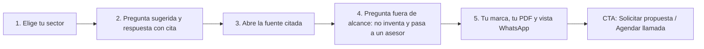

# Chatbot RAG con IA

> Plataforma IA (`aiPlatform`) · Demo: `/demo/chatbot` · Modo de acceso recomendado: `solicitud` (con vista previa pública en la landing) · Prioridad: **P0** · Esfuerzo total: **XL**

*Captura actual de `/demo/chatbot` (modo Playground). Ver también [Sistema de demos](04-Sistema-de-Demos.md), [Catálogo de productos](08-Catalogo-de-Productos.md) y [Roadmap](12-Roadmap.md).*

---

## Resumen

**Problema:** las empresas responden una y otra vez las mismas preguntas (horarios, requisitos, políticas, estado de trámites) por web y WhatsApp. Los bots de reglas se quedan cortos y los asistentes de IA genéricos se inventan respuestas.

**Para quién (cliente ideal en Colombia/LATAM):**
- IPS, clínicas y laboratorios: preguntas de pacientes sobre autorizaciones, preparación de exámenes y documentos requeridos.
- Instituciones educativas: admisiones, matrículas, calendario académico.
- Retail y e-commerce: envíos, cambios y devoluciones, garantías.
- Cooperativas, fintech y aseguradoras: requisitos de crédito, pólizas, PQRS.
- Áreas internas (RR. HH., mesa de ayuda TI): reglamentos y procedimientos.

**Propuesta de valor:** un asistente que responde **solo con la información de tus documentos**, cita la fuente de cada respuesta y pasa la conversación a un asesor cuando no sabe, en tu web y en WhatsApp. Lo compras con el código fuente o lo usas como servicio mensual.

Es el **producto insignia** de Koptup: es uno de los dos demos con backend real y es el producto elegido para estrenar el core SaaS en la Fase 4 (ver [Roadmap](12-Roadmap.md)).

---

## Estado actual

| Aspecto | Estado | Evidencia |
|---|---|---|
| Demo | Existe, con dos modos: **Playground** y **Builder** | `apps/web/src/app/demo/chatbot/page.tsx` (776 líneas), `components/builder/BuilderMode.tsx` |
| Real o maqueta | **Parcialmente real.** El chat llama al backend (`chatWithBot` en `components/builder/api.ts`) con búsqueda por palabras clave (tipo BM25) y OpenAI si hay proveedor configurado; si no, usa un modo extractivo. Pipeline, telemetría, fuentes conectadas y escenarios son simulados (`components/data.ts`) | `page.tsx` líneas 290–365, `components/data.ts` |
| Backend | Rutas reales en `apps/backend/src/routes/chatbot.routes.ts` (943 líneas): bots, documentos, URLs, chat, conversaciones y modelos. Estado en `Map` en memoria + volcado a `data/chatbots/state.json` en disco (`apps/backend/src/data/chatbot-store.ts`), que se pierde en cada despliegue en Railway | `chatbot.routes.ts`, `chatbot-store.ts` |
| Backend heredado | Segunda API "por sesión" (`/session`, `/upload`, `/message`) con modelo Mongo `Chatbot` y extracción de PDF real (`services/chatbot.service.ts`, `services/pdf.service.ts`). Solo la usa la página huérfana `/demo/chatbot/preview` (498 líneas) y los proxies `apps/web/src/app/api/chatbot/*` | `apps/web/src/hooks/useChatbot.ts` |
| i18n ES/EN | Sí: `apps/web/messages/demos/chatbot.{es,en}.json` (~28 KB cada uno). Pero los datos de ejemplo (fragmentos citados, pipeline) están en inglés y fijos en `data.ts`. El español usa voseo ("Hacé", "Vos", "Probá") | `messages/demos/chatbot.es.json` |
| Tests | Solo un smoke test (`__tests__/page.test.tsx`, 11 líneas) que hoy no se ejecuta (ver [Seguridad y calidad](10-Seguridad-y-Calidad.md)) | |
| Tamaño | 5.469 líneas en `apps/web/src/app/demo/chatbot/` (4.162 en `components/`) | `wc -l` |

### Problemas detectados (con ruta)

1. **El demo no le habla al cliente colombiano.** Las empresas de ejemplo son "Acme Corp / Globex / Umbrella" (`TENANTS` en `components/data.ts`) y los escenarios hablan de `payments-svc`, Snowflake, refresh tokens y grafos de servicios. Un gerente de una IPS o de un retail no se ve reflejado.
2. **El selector "Tenant" no hace nada:** el estado `tenant` de `page.tsx` solo se pasa a `TopBar` y no cambia datos, fuentes ni respuestas.
3. **Primero aparece una respuesta inventada:** `handleSend` (`page.tsx`) elige un escenario por expresión regular y muestra su respuesta prefabricada mientras llega la real. El prospecto lee una respuesta sobre "incidentes de payments-svc" a una pregunta que no tiene nada que ver y después la ve cambiar.
4. **Métricas simuladas presentadas como reales:** `StatsWidget` recibe *faithfulness*, alucinación, *cache hit* y *drift* que cambian al azar cada 4 s (`Math.random` en `page.tsx`). `PipelinePanel` muestra pasos (HyDE, reranker, "claude-sonnet-4.7") que el backend no ejecuta, aunque el paso 3 del tour dice "con tiempos y tokens reales" (`ux.onboarding.step3Body` en `chatbot.es.json`). Esto daña la credibilidad frente a un comprador técnico.
5. **Mensaje sobretécnico:** la barra lateral "19 capas de plataforma" (`Sidebar.tsx` + `CapabilityPanel.tsx`) y los tooltips ("cluster GPU activo", "RLS multi-tenant") hablan a ingenieros, no a quien compra.
6. **El widget "embebible" no funciona fuera del demo:** `LivePreview.tsx` carga un iframe a `/embed/chatbot/<botId>` y `EmbedCode.tsx` genera código con `/embed/chatbot/...`, `cdn.koptup.com/widget.js`, el paquete `@koptup/widget-react` y un webhook `/bots/<id>/webhook`. Ninguno existe en el repo. El enlace "Compartir micrositio" (`/chatbot/<id>` en `BuilderMode.tsx`) tampoco existe.
7. **PDF y DOCX no se leen en la ruta de bots:** `decodeBase64Text` en `chatbot.routes.ts` solo decodifica texto plano; un PDF se indexa como bytes basura. La ruta heredada sí usa `pdf.service.ts` y la dependencia `mammoth` está instalada.
8. **La ingesta de URLs existe en la API (`ingestBotUrls`) pero no hay campo en `ConfigPanel.tsx`.**
9. **Botones sin acción:** 👍, 👎 y "Regenerar" en `ChatPanel.tsx` no tienen `onClick`.
10. **SEO contradictorio:** la metadata `demo-chatbot` en `apps/web/src/lib/seo-config.ts` y el breadcrumb de `layout.tsx` dicen "Chatbot Médico con IA … Ley 100, CUPS, CIE-10", pero el demo es genérico y en inglés.
11. **Precio contradictorio:** `/chatbots-ia` y las FAQ de `apps/web/messages/es.json` dicen "desde $499 USD", mientras el catálogo arranca en $1.590.000 COP/mes (SaaS) o $46.000.000 COP (compra).
12. **Endurecimiento pendiente:** antes de abrir el demo a más tráfico hay que completar las tareas genéricas de la Fase 0 (autenticación y autorización en servidor, límites de costo y rate-limit en endpoints de IA). Ver [Seguridad y calidad](10-Seguridad-y-Calidad.md).

---

## Qué falta para que sea vendible

- **Datos por sector en español de Colombia**: 4 plantillas (Salud, Educación, Retail, Financiero) con documentos, preguntas y respuestas verosímiles.
- **Honestidad visible**: quitar respuestas provisionales y métricas al azar, y mostrar solo lo que el sistema hace de verdad (fuente citada, "no tengo esa información", paso a asesor).
- **Canal WhatsApp visible**: es lo primero que pregunta un comprador en Colombia. Hoy solo se ve el widget web.
- **Widget instalable de verdad**: ruta `/embed/chatbot/[botId]` y script funcional; sin eso el código de "Embed" es una promesa rota.
- **Persistencia real** (MongoDB y almacenamiento de archivos) y **cupo de IA por prospecto**.
- **Recorrido guiado de 5 pasos** que reemplace el `OnboardingTour` de 4 pasos con texto técnico.
- **Prueba social**: ningún caso publicado. Hace falta al menos un piloto documentado (Fase 5) y, mientras tanto, usar el propio bot en koptup.com como demostración en producción.
- **Precio claro**: definir qué es una "conversación", qué incluye el SaaS (¿consumo de IA incluido?) y retirar el "desde $499 USD".
- **Español neutro (tú)** en `offerings/chatbot-rag-ia.es.json` y `demos/chatbot.es.json`, sin voseo.

---

## Plan detallado

### Landing `/productos/chatbot-rag-ia`

Sigue la estructura común de [Landing de producto](Seccion-Landing-de-Producto.md):

1. **Hero:** "Un asistente que responde con tus documentos, en tu web y en WhatsApp". Subtítulo: "Cita la fuente de cada respuesta y pasa a un asesor cuando no sabe". CTA principal **Solicitar demo**, secundario **Agendar llamada**.
2. **Vista previa pública:** un widget en vivo entrenado **solo con información pública de Koptup** (catálogo, FAQ, planes), con cupo por visitante. Es la demostración en producción y sirve como lead magnet sin exponer el Builder.
3. **Video de 60–90 s:** elegir sector Salud → preguntar "¿Qué necesito para una resonancia con sedación?" → respuesta con cita → pregunta fuera de alcance → paso a asesor → vista WhatsApp → panel de preguntas frecuentes.
4. **Para quién es:** 4 tarjetas de sector con una pregunta típica cada una.
5. **Cómo funciona (3 pasos):** subes documentos → el asistente aprende → lo publicas en web/WhatsApp.
6. **Capturas (6):** chat con citas, fuente resaltada, Builder (marca), vista móvil/WhatsApp, panel de métricas, configuración de paso a asesor.
7. **Planes y precios:** tabla compra vs SaaS (ver abajo), con selector de modalidad y nota de costos de IA en COP.
8. **Seguridad y datos personales:** Ley 1581/2012, retención configurable, borrado, sin entrenar modelos con tus datos.
9. **FAQ:** ¿qué es una conversación?, ¿qué pasa si no sabe?, ¿funciona con WhatsApp?, ¿en cuánto tiempo está listo?, ¿quién paga la IA?, ¿puedo quedarme con el código?
10. **Unificar con `/chatbots-ia`:** esa página SEO existente debe enlazar a la landing nueva y usar los mismos precios (o redirigir con 301 cuando la landing esté indexada).

### Demo interactiva (mejoras por pantalla/módulo)

| Pantalla / componente | Hoy | Cambiar a |
|---|---|---|
| `TopBar.tsx` | Selector "Tenant" (Acme/Globex/Umbrella) sin efecto; selector de modelo GPT; idioma que recarga la página; insignia "Online · cluster GPU activo" | Selector **"Sector de ejemplo"** (Salud, Educación, Retail, Financiero) que cambia documentos, bienvenida, colores y preguntas sugeridas. Modelo como "Estándar / Avanzado" con costo estimado en COP por cada 1.000 conversaciones (visible solo para el prospecto aprobado). Quitar la insignia y el selector de idioma propio (usar el del sitio) |
| `ModeToggle.tsx` | "Playground / Builder" | **"Probar el asistente" / "Configurar el tuyo"** (el segundo solo con acceso aprobado) |
| Panel "Fuentes conectadas" (`CONNECTED_SOURCES`) | Notion 1.230 docs, Slack 45.120 mensajes, Confluence 854 páginas (inventado) | Lista real de documentos del sector o del prospecto, con número de fragmentos y fecha de carga traídos del backend |
| `Sidebar.tsx` + `CapabilityPanel.tsx` (19 capas) | Abierta por defecto, vocabulario de ingeniería | Mover a una pestaña colapsada **"Para tu equipo técnico"** con 6 bloques en lenguaje simple (ingesta, búsqueda, respuesta con citas, seguridad, métricas, integraciones) |
| `ChatPanel.tsx` | Respuesta provisional por regex; 👍/👎/Regenerar sin acción; escenarios "docs / multi-hop / code / SQL / graph" | Indicador "Buscando en tus documentos…" hasta la respuesta real. 5 preguntas sugeridas por sector (una debe quedar fuera de alcance a propósito). 👍/👎 registran `DemoEvent`. "Regenerar" vuelve a llamar al backend. Botón **"Hablar con un asesor"** que simula el paso a humano |
| `SourcePanel.tsx` | Muestra fragmento y puntaje | Mantener. Agregar nombre del documento, página y resaltado de la frase usada |
| `PipelinePanel.tsx` | Pasos simulados con modelos que no se usan | Mostrar solo los pasos reales devueltos por el backend (búsqueda → contexto → modelo → citas) con tiempos y tokens reales. Oculto por defecto en la vista comercial |
| `StatsWidget.tsx` | Métricas que cambian al azar | Sustituir por **métricas de la sesión real**: preguntas, % respondidas con fuente, % derivadas a asesor, costo estimado en COP |
| `OnboardingTour` (en `page.tsx`) | 4 pasos técnicos, se descarta con `localStorage` | Recorrido guiado de 5 pasos (abajo), con progreso que se registra como `DemoEvent` |
| `DeviceFrame.tsx` (vista móvil) | Marco de teléfono genérico | Agregar vista **"WhatsApp"** con burbujas y encabezado de tipo WhatsApp Business, con la marca del prospecto |
| Builder: `ConfigPanel.tsx` | Nombre, color, avatar/logo, bienvenida, prompt, tono, documentos | Mantener. Agregar campo de **URLs** (usa `ingestBotUrls`), aviso de privacidad Ley 1581 editable, horario de atención y correo/WhatsApp para el paso a asesor. Límite visible: 10 documentos de hasta 10 MB |
| Builder: `LivePreview.tsx` / `EmbedCode.tsx` | iframe a ruta inexistente; snippets de script, React y webhook que no funcionan | Crear `apps/web/src/app/embed/chatbot/[botId]/page.tsx` y un script de widget real. Mostrar solo los snippets que funcionan (script e iframe); React y webhook como "Plan Profesional, en implementación" |
| Builder: `TenantSelector.tsx` | Selector de bots del Builder, sin relación con una cuenta de usuario | Cada prospecto ve solo los bots de su cuenta (aislamiento por cuenta verificado en el servidor) |
| `/demo/chatbot/preview` | Página huérfana (498 líneas) con la API heredada | Eliminar junto con `hooks/useChatbot.ts` y los proxies `apps/web/src/app/api/chatbot/*`, o migrarlos a la API de bots |

**Datos de ejemplo por sector** (organizaciones ficticias; no usar nombres reales):

| Sector | Empresa ficticia | Documentos | Preguntas sugeridas |
|---|---|---|---|
| Salud | "IPS Salud Andina" | Portafolio de servicios, preparación de exámenes, derechos y deberes del paciente, política de citas | "¿Qué preparación necesito para una colonoscopia?", "¿Qué documentos llevo para una cita con autorización de mi EPS?", "¿Atienden urgencias pediátricas los domingos?" |
| Educación | "Instituto Técnico Altamar" | Reglamento estudiantil, calendario académico, costos de matrícula, becas | "¿Hasta cuándo puedo pagar la matrícula sin recargo?", "¿Qué requisitos tiene la beca por promedio?" |
| Retail / e-commerce | "Tienda Café Cumbre" | Política de envíos, cambios y devoluciones, garantías, medios de pago (PSE, tarjeta, contraentrega) | "¿Cuánto tarda un envío a Pasto?", "¿Puedo devolver un producto abierto?" |
| Financiero | "Cooperativa Avanza" | Requisitos de crédito de libre inversión, tasas vigentes (ejemplo), procedimiento de PQRS | "¿Qué necesito para pedir un crédito de libre inversión?", "¿Cómo radico una queja?" |

**Recorrido guiado (5 pasos) que debe ver todo prospecto:**

1. **Elige tu sector**: el bot se recarga con la plantilla del sector.
2. **Haz una pregunta sugerida**: la respuesta aparece con citas `[1]`, `[2]`.
3. **Abre la fuente**: `SourcePanel` muestra el documento y la frase exacta.
4. **Pregunta algo que no está en los documentos**: el bot dice que no tiene esa información y ofrece "Hablar con un asesor". Este es el momento que más convence a los compradores.
5. **Hazlo tuyo**: cambia logo y color, sube un PDF propio (solo con acceso aprobado), pregunta sobre él y mira la vista web y la vista WhatsApp. Al final aparece la tarjeta "Solicitar propuesta".

### Acceso y solicitud de demo

- **Modo recomendado: `solicitud`.** Motivos: cada mensaje consume IA real, el prospecto sube documentos que pueden tener datos personales (Ley 1581) y es el producto de mayor ticket, así que la solicitud filtra y califica leads. La exposición pública se cubre con el widget de Koptup en la landing (con cupo por visitante), no con el Builder.
- **Antes de solicitar, el visitante ve:** la landing, el video de 60–90 s, 6 capturas y el widget público de Koptup.
- **Duración del acceso:** 14 días por defecto (DECISIÓN 3); el admin puede extenderlo a 21–30 días en pilotos de plan Profesional o superior.
- **Al prospecto aprobado** (Portal › Mis demos) se le asigna:
  - un bot creado automáticamente al aprobar el `DemoGrant`, ya con su logo, color, nombre y la plantilla de su sector;
  - un cupo de demo, por ejemplo 300 mensajes con IA y 10 documentos de hasta 10 MB (configurable en `DemoCatalogItem`);
  - las dos vistas (web y WhatsApp) y el panel de métricas de su sesión;
  - modo **guiado** (sesión con un comercial de Koptup, recomendado para Avanzado o Enterprise) o **autoservicio**.
- **Al expirar:** se borran los documentos y las conversaciones del prospecto (aviso previo por email 3 días antes, junto con el CTA "Solicitar propuesta").
- El flujo completo de aprobación, enlace mágico y eventos está en [Sistema de demos](04-Sistema-de-Demos.md) y [Panel de administración](05-Panel-de-Administracion.md).

### Personalización por cliente

Se configura sin código desde **Admin › Solicitudes de demo › Aprobar** (sección "Personalización", guardada en el `DemoGrant`):

| Campo | Efecto en el demo |
|---|---|
| Nombre de la empresa | Encabezado del widget, mensaje de bienvenida, vista WhatsApp |
| Logo (PNG/JPG/WebP ≤ 500 KB, igual que `AVATAR_IMAGE_MAX_BYTES`) | Avatar del bot y encabezado |
| Color primario | Burbuja, encabezado y botones del widget |
| Sector (plantilla) | Documentos de ejemplo, preguntas sugeridas y tono |
| Documentos precargados | El comercial sube 1–3 PDF del cliente antes de la demo guiada (máximo efecto "wow") |
| Mensaje de bienvenida y tono | Formal (usted) o cercano (tú) |
| Contacto para paso a asesor | Email/WhatsApp que se muestra al derivar |

Al aprobar, el backend crea el bot con esos valores (`createBot` + `patchBot` en el servidor, no desde el navegador) y lo vincula al `DemoGrant`.

### Producto real

**Alcance MVP para la modalidad compra (planes Básico y Profesional):**

| Módulo | Alcance | Base existente |
|---|---|---|
| Ingesta | PDF, DOCX, TXT y URLs/sitemap; reindexación programada (Profesional) | `chatbot.routes.ts` (texto y URLs), `services/pdf.service.ts`, `mammoth` |
| Búsqueda | Híbrida: palabras clave (BM25 actual) + embeddings en un vector store (MongoDB Atlas Vector Search, para no sumar otra base) | `retrieve()` en `chatbot.routes.ts` |
| Respuesta | LLM (OpenAI hoy; opción Anthropic/Azure OpenAI), respuesta solo con fuentes, citas, "no sé" y umbral de confianza | `callOpenAI` en `chatbot.routes.ts` |
| Canales | Widget web real (script + iframe); **WhatsApp Business** (Meta Cloud API o Twilio, que ya se usa para notificaciones) desde Profesional | — |
| Paso a asesor | Notificación por email/WhatsApp y bandeja simple de conversaciones derivadas | Modelos `Conversation`/`Message` del backend |
| Panel del cliente | Conversaciones, preguntas sin respuesta, documentos, métricas (CSAT, temas frecuentes) | — |
| Integraciones típicas | HubSpot/Zoho (crear lead desde el chat), link de pago **Wompi/PayU** desde la conversación (Avanzado), agendamiento de citas (Salud), consulta de estado de pedido en Shopify/VTEX/WooCommerce (Retail) | — |
| Cumplimiento | Aviso de privacidad y consentimiento en el widget (Ley 1581/2012), retención configurable, exportar y borrar datos de un usuario | — |
| Entrega | Código fuente, despliegue en la nube del cliente (Docker), manual de operación y capacitación | — |

**Requisitos para ofrecer SaaS de verdad (DECISIÓN 7, Fase 4):** el chatbot es el primer producto con base real, así que es el piloto del core SaaS:
1. Core multi-tenant: `Organization` → usuarios con roles → bots; aislamiento por tenant en todas las consultas.
2. Medición de consumo: conversaciones/mes por tenant según el plan (5.000 / 25.000 / 100.000 / 500.000), alertas al 80 % y bloqueo o cobro de excedente.
3. Cobro recurrente: Wompi o PayU en COP, Stripe en USD; facturación electrónica de la suscripción.
4. Topes de costo de IA por tenant y monitoreo de gasto.
5. Alta autoservicio (crear cuenta → elegir plan → pagar → bot listo), copias de seguridad, monitoreo y SLA por plan.

Mientras la Fase 4 no esté lista, el SaaS se vende como **"Piloto hospedado"**: Koptup lo opera y cobra el setup y la cuota con factura manual. Ningún otro producto debe ofrecer SaaS antes que este.

### Planes y precios

Precios actuales del catálogo (`apps/web/src/lib/services-catalog.ts`, entrada `chatbot-rag-ia`), en COP:

| Plan | Compra: setup único | Compra: mantenimiento mensual (opcional) | SaaS: setup | SaaS: cuota mensual | Volumen | Implementación |
|---|---|---|---|---|---|---|
| Básico | $46.000.000 | $4.200.000 | $2.900.000 | $1.590.000 | 5.000 conversaciones/mes | 2–5 semanas |
| Profesional | $117.000.000 | $10.400.000 | $6.900.000 | $3.790.000 | 25.000 conversaciones/mes | 5–9 semanas |
| Avanzado | $273.000.000 | $23.400.000 | $12.900.000 | $7.090.000 | 100.000 conversaciones/mes | 9–14 semanas |
| Enterprise | $585.000.000 | $45.500.000 | A convenir (se muestra "Personalizado") | $12.890.000 | 500.000+ conversaciones/mes | 12–20 semanas |

| Plan | Usuarios admin | Usuarios finales | Almacenamiento | Horas de mantenimiento/mes | Soporte | Costos de IA e infraestructura que paga el cliente (USD/mes) |
|---|---|---|---|---|---|---|
| Básico | 3 | 1.000 | 5 GB | 5 | Email, 24 h hábiles | 80–250 |
| Profesional | 10 | 10.000 | 30 GB | 12 | Email + WhatsApp, 4 h | 400–1.200 |
| Avanzado | 30 | 100.000 | 150 GB | 25 | + Slack Connect, 2 h | 1.500–4.500 |
| Enterprise | Ilimitados | Ilimitados | Ilimitado | 50 | Tickets, 1 h crítico | 4.000–15.000 |

**Qué incluye cada plan, en lenguaje de cliente:**
- **Básico:** "Tu asistente en la web, entrenado con una fuente (PDF, Notion o tu sitio)."
- **Profesional:** "Web + WhatsApp, hasta 5 fuentes, paso a asesor y conexión con tu CRM."
- **Avanzado:** "Todos tus canales, flujos automáticos (citas, pagos, pedidos) y reportes para gerencia."
- **Enterprise:** "Varias marcas o unidades de negocio, inicio de sesión corporativo (SSO), auditoría y opción de modelo privado."

**Recomendaciones de claridad:**
1. **Definir "conversación"** en la tabla y en la FAQ (por ejemplo, una sesión de un usuario de hasta 24 h) y publicar el precio del excedente por cada 1.000 conversaciones.
2. **SaaS con IA incluida:** hoy el `costoNote` dice que el proveedor de IA factura directo al cliente. En un SaaS hospedado por Koptup eso confunde; conviene incluir el consumo de IA hasta el volumen del plan y dejar la facturación directa solo para la modalidad compra.
3. **Explicar el mantenimiento:** en compra Básico el mantenimiento ($4.200.000/mes, 5 h) cuesta 2,6 veces la cuota SaaS ($1.590.000/mes). Hay que aclarar qué incluye (horas, monitoreo, actualizaciones de modelos) o revisar el valor. Decisión comercial del dueño.
4. **Retirar "desde $499 USD"** de `/chatbots-ia`, del FAQ en `messages/es.json` y de su metadata; usar "desde $1.590.000 COP/mes (SaaS) o $46.000.000 COP (compra)".
5. **Ofrecer un piloto pagado de 30 días** (setup SaaS Básico, abonable si compra) como paso entre la demo y la propuesta.
6. Mostrar los costos de IA en COP aproximados (TRM de referencia) junto a los USD.

---

## Tareas

| # | Tarea | Fase | Prioridad | Esfuerzo | Criterio de aceptación |
|---|---|---|---|---|---|
| 1 | Persistir bots, documentos, fragmentos y conversaciones en MongoDB (y archivos en almacenamiento de objetos) en lugar de los `Map` y `data/chatbots/state.json` | Fase 0 — Endurecimiento | P0 | M | Tras redesplegar el backend, los bots y documentos de prueba siguen disponibles; hay test de integración que lo verifica |
| 2 | Exigir autenticación y autorización en servidor en todas las rutas del chatbot (aislamiento de bots por cuenta), con rate-limit y tope diario de costo de IA por cuenta y por visitante | Fase 0 — Endurecimiento | P0 | M | Un usuario solo ve y modifica sus bots; superar el cupo devuelve un mensaje claro; el gasto diario nunca supera el tope configurado |
| 3 | Registrar `/demo/chatbot` como `DemoCatalogItem` (`accessMode: solicitud`), proteger "Configurar el tuyo" con `GET /api/demo-access/chatbot` y crear el bot personalizado al aprobar el `DemoGrant` | Fase 1 — Funnel y solicitud de demos | P0 | M | Sin acceso, el Builder muestra el CTA "Solicitar demo"; con acceso, el prospecto encuentra su bot con su logo y su sector |
| 4 | Corregir la metadata `demo-chatbot` (`seo-config.ts`), el breadcrumb de `demo/chatbot/layout.tsx` y unificar precios en `/chatbots-ia` y en el FAQ de `messages/es.json` | Fase 1 — Funnel y solicitud de demos | P1 | S | No queda "desde $499 USD" en el repo; el título y la descripción del demo coinciden con lo que se ve |
| 5 | Landing `/productos/chatbot-rag-ia` con widget público de Koptup (cupo por visitante), video, capturas, planes y FAQ | Fase 1 — Funnel y solicitud de demos | P1 | M | La landing carga en menos de 2,5 s (LCP móvil) y el CTA abre el formulario con el producto preseleccionado |
| 6 | Plantillas por sector (Salud, Educación, Retail, Financiero) que reemplazan `TENANTS` y `SCENARIO_DATA`; selector "Sector de ejemplo" en `TopBar.tsx` | Fase 2 — Demos vendibles | P1 | L | Cambiar de sector cambia documentos, preguntas, bienvenida y colores; no quedan textos de ejemplo en inglés en la vista ES |
| 7 | Respuestas honestas: quitar la respuesta provisional por regex de `handleSend`, las métricas aleatorias de `StatsWidget` y los pasos simulados de `PipelinePanel`; mostrar solo datos reales del backend | Fase 2 — Demos vendibles | P1 | M | No hay `Math.random` en métricas visibles; toda respuesta mostrada viene del backend o de un escenario guionizado marcado como "ejemplo" |
| 8 | Ingesta real de PDF/DOCX en la ruta de bots (reusar `services/pdf.service.ts` y `mammoth`) y campo de URLs en `ConfigPanel.tsx` | Fase 2 — Demos vendibles | P1 | M | Un PDF de 20 páginas se indexa y el bot cita la página correcta en 3 de 3 preguntas de prueba |
| 9 | Ruta `/embed/chatbot/[botId]` y script de widget real; `EmbedCode.tsx` solo muestra snippets que funcionan; eliminar o implementar el micrositio `/chatbot/[id]` | Fase 2 — Demos vendibles | P1 | L | Pegar el snippet en una página HTML externa muestra el widget con la marca del bot y responde |
| 10 | Vista "WhatsApp" en `DeviceFrame.tsx` y sandbox de WhatsApp para prospectos aprobados | Fase 2 — Demos vendibles | P2 | M | El prospecto ve su bot con aspecto de WhatsApp; en el sandbox recibe respuestas en su teléfono |
| 11 | Recorrido guiado de 5 pasos (reemplaza `OnboardingTour`), botones 👍/👎/Regenerar funcionales y eventos `DemoEvent` | Fase 2 — Demos vendibles | P2 | S | Admin › Solicitudes muestra qué pasos completó cada prospecto y su feedback |
| 12 | Mover las "19 capas" a una pestaña colapsada "Para tu equipo técnico"; pasar los textos a español neutro (tú) | Fase 2 — Demos vendibles | P2 | S | La vista inicial no muestra jerga técnica; no hay voseo en `chatbot.es.json` ni en `chatbot-rag-ia.es.json` |
| 13 | Eliminar la página huérfana `/demo/chatbot/preview`, `hooks/useChatbot.ts` y los proxies `api/chatbot/*` (o migrarlos a la API de bots) | Fase 2 — Demos vendibles | P2 | S | El build no tiene rutas del chatbot heredado y no se rompe ningún enlace (se verifica con el sitemap) |
| 14 | Plantilla de propuesta del chatbot: alcance por plan, canales, volumen, costo de IA estimado en COP y cronograma | Fase 3 — Propuestas y conversión | P1 | S | El comercial genera la propuesta PDF desde Admin en menos de 10 minutos |
| 15 | Llevar el chatbot al core multi-tenant con medición de conversaciones y cobro recurrente (Wompi/PayU/Stripe) | Fase 4 — Productos SaaS reales | P1 | XL | Un cliente nuevo crea su cuenta, paga y publica su bot sin intervención de Koptup |

---

## Métricas de éxito

| Métrica | Meta inicial |
|---|---|
| Visitantes de la landing que solicitan demo | ≥ 4 % |
| Solicitudes aprobadas que abren la demo en 72 h | ≥ 70 % |
| Prospectos que completan los 5 pasos del recorrido | ≥ 50 % |
| Prospectos que suben al menos un documento propio | ≥ 40 % |
| Demos con IA que pasan a propuesta | ≥ 25 % |
| Propuestas aceptadas (compra o piloto) | ≥ 30 % |
| Costo de IA por demo aprobada | < USD 3 |
| Respuestas del recorrido guiado con fuente correcta | 100 % (prueba automática por sector) |

Páginas relacionadas: [QA automatizado con IA](Producto-qa-automatizado-ia.md) (hoy apunta por error a este demo), [Flujo del cliente](03-Flujo-del-Cliente.md), [Backend y API](09-Backend-y-API.md).
