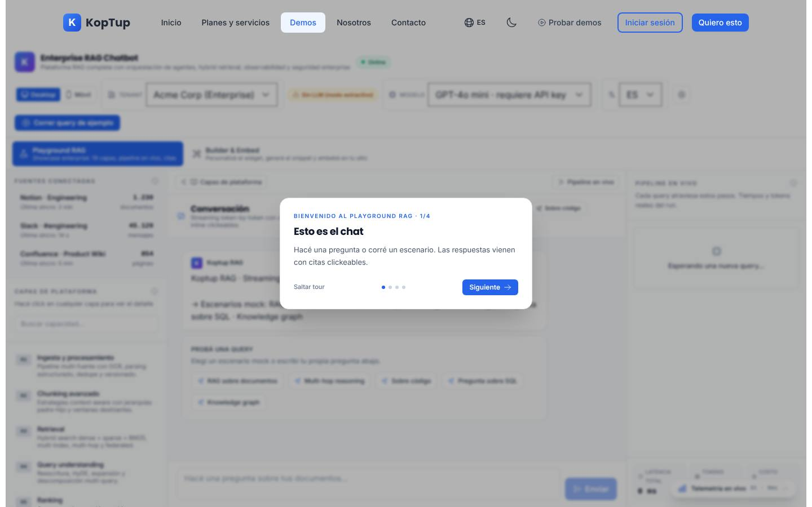
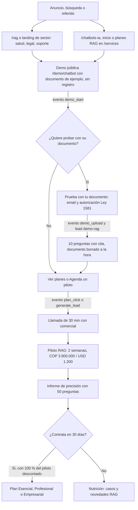
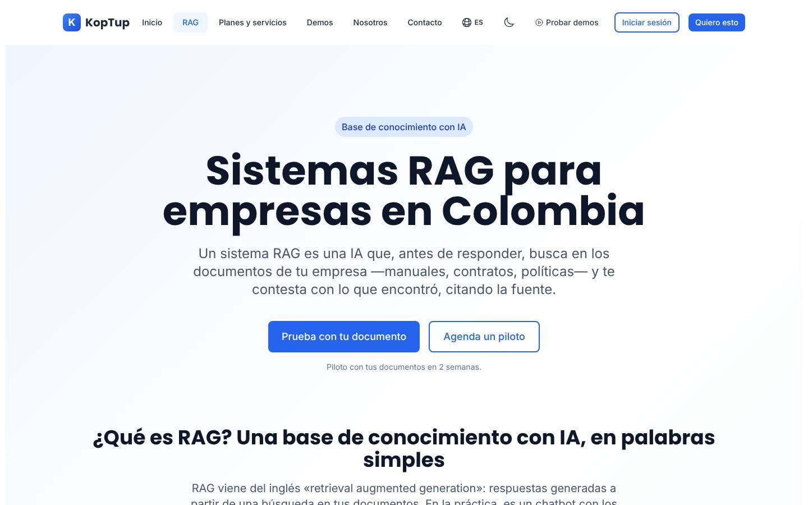
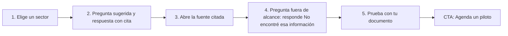
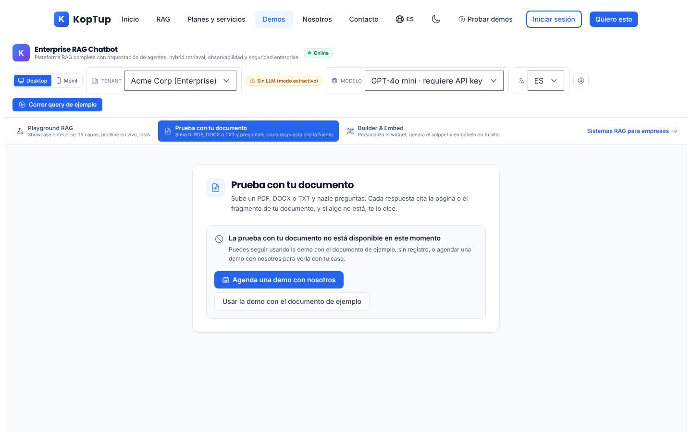
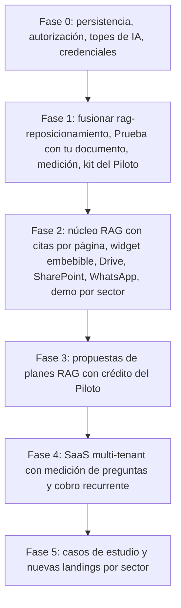

# Sistemas RAG (producto principal)

> Plataforma IA · **Producto principal de KopTup** · Demo: `/demo/chatbot` · Modo de acceso: `publico` (demo con documento de ejemplo, sin registro) + **"Prueba con tu documento"** (solo email y autorización Ley 1581) · Landing: `/rag`, `/rag/salud`, `/rag/legal`, `/rag/soporte` · Planes: `/services#planes-rag` · Prioridad: **P0** · Esfuerzo total: **XL**

*Captura actual de `/demo/chatbot` en producción (rama `main`). El nombre del archivo de esta página se conserva (`Producto-chatbot-rag-ia.md`, igual que el slug de la oferta del catálogo) para no romper los enlaces de la wiki. Qué cambia en el sitio y en qué va la implementación: [Reposicionamiento RAG](13-Reposicionamiento-RAG.md). Ver también [Flujo del cliente](03-Flujo-del-Cliente.md), [Sistema de demos](04-Sistema-de-Demos.md), [Backend y API](09-Backend-y-API.md), [Comercial, marketing y legal](11-Comercial-Marketing-y-Legal.md) y [Roadmap](12-Roadmap.md).*

---

## Resumen

**Qué es, en una frase:** una IA que responde con los documentos de cada empresa (manuales, contratos, políticas, protocolos, normas) y **cita la fuente** de cada respuesta. Si la respuesta no está en los documentos, dice "No encontré esa información" en lugar de inventarla.

**Problema que resuelve:** en casi todas las empresas el conocimiento vive repartido en PDF, carpetas compartidas y correos. Las personas preguntan una y otra vez lo mismo, buscan carpeta por carpeta o responden de memoria. Los asistentes de IA genéricos ayudan a redactar, pero no conocen los documentos internos y pueden inventar.

**Propuesta de valor:**

- **Responde con tus documentos, no de memoria.** Solo consulta lo que la empresa decide cargar.
- **Cada respuesta se puede verificar.** Trae la cita del documento (y, con el núcleo RAG de la Fase 2, la página exacta).
- **Se valida antes de comprar.** Demo sin registro, "Prueba con tu documento" y un **Piloto RAG de 2 semanas** con un informe de precisión de 50 preguntas.
- **Se actualiza cuando agregas o cambias documentos.** No hay que reentrenar ningún modelo.
- **Precio publicado** en COP y en USD fijos, y un equipo en Colombia.

**Por qué es el producto principal** (decisión del dueño, ver [Visión de producto](02-Vision-de-Producto.md)):

1. Es el único producto con **IA real funcionando** en el sitio y con backend propio (`apps/backend/src/routes/chatbot.routes.ts`).
2. Resuelve una necesidad que existe en todos los sectores, con una oferta de entrada barata (el Piloto) y **ingresos mensuales** (Esencial y Profesional).
3. Es la base del primer producto SaaS real de KopTup (Fase 4).

Las demás ofertas del catálogo pasan a **"Otras soluciones a medida"**. Varias se conectan con este producto como complemento (tutor del LMS, asistente de políticas de RR. HH., guías clínicas en telemedicina, consulta normativa en cuentas médicas).

---

## Para quién

| Sector | Documentos típicos | Preguntas de ejemplo | Landing |
|---|---|---|---|
| **Salud** (IPS, clínicas, laboratorios, aseguradoras) | Protocolos clínicos, normativa del sector, manuales tarifarios, contratos con EPS | "¿Qué preparación necesita una colonoscopia según nuestro protocolo?", "¿Qué dice el contrato sobre el plazo para responder una glosa?" | `/rag/salud` |
| **Legal** (áreas jurídicas, firmas, notarías) | Contratos, conceptos jurídicos internos, normativa | "¿Qué contratos con proveedores tienen cláusula de penalidad por retraso?", "¿Qué concepto interno tenemos sobre teletrabajo?" | `/rag/legal` |
| **Soporte** (mesas de ayuda, contact center, servicio al cliente) | Manuales de producto, políticas, base de conocimiento para agentes | "¿Cómo se configura el equipo modelo X?", "¿Cuál es la política de devoluciones de productos abiertos?" | `/rag/soporte` |
| **Recursos Humanos** | Reglamento interno, beneficios, procedimientos | "¿Cuántos días de vacaciones me corresponden?" | `/rag` (landing propia en Fase 5 si hay demanda) |
| **Educación, cooperativas y financiero, retail** | Reglamentos, requisitos de crédito, PQRS, envíos y garantías | "¿Qué necesito para pedir un crédito de libre inversión?" | `/rag` y `/chatbots-ia` |

**Comprador:** gerencia general, gerencia de operaciones o de servicio, jurídica o dirección médica. **Usuario técnico** que valida: TI o seguridad de la información (lee la sección de seguridad de `/rag`).

**Cliente ideal para el Piloto:** empresa de 50 a 1.000 empleados en Colombia o LATAM, con al menos 100 documentos de consulta frecuente y una persona dueña del contenido que pueda validar las 50 preguntas del informe.

---

## Estado actual

Evidencia en `main` (producción) y en la rama `rag-reposicionamiento`, que ya está terminada: lo que figura en su columna está hecho en la rama `rag-reposicionamiento` (pendiente de merge). Estado al 8 de octubre de 2026.

| Aspecto | En producción (`main`) | En la rama `rag-reposicionamiento` | Evidencia |
|---|---|---|---|
| Posicionamiento | La home dice "Transformamos tus ideas en soluciones tecnológicas"; el chatbot es una tarjeta más entre 27 | Home, `/rag`, landings por sector, "RAG" en el menú y en el footer | `src/components/home/HomeContent.tsx`, `src/app/rag/` (rama) |
| Precio | 4 niveles del catálogo viejo (compra y SaaS) y "desde $499 USD" en `/chatbots-ia` | **Planes RAG** en `/services#planes-rag` y en `/rag`; la tarjeta "Chatbot RAG con IA" se oculta del catálogo | `src/lib/rag-plans.ts`, `src/components/rag/RagPlans.tsx` (rama) |
| Demo | Existe, con dos modos: **Playground** y **Builder** (`page.tsx`, 776 líneas; `components/builder/BuilderMode.tsx`) | Tercer modo **"Prueba con tu documento"**, enlace a `/rag` y title "Demo RAG: prueba con tu documento": hecho en la rama `rag-reposicionamiento` (pendiente de merge). La subida queda apagada hasta configurarla en Railway | `apps/web/src/app/demo/chatbot/`, `components/upload/` (rama) |
| Real o maqueta | **Parcialmente real.** El chat llama al backend (`chatWithBot` en `components/builder/api.ts`), con búsqueda por palabras clave (tipo BM25) y OpenAI si hay clave; sin clave responde en modo extractivo. Pipeline, telemetría, fuentes conectadas y escenarios son simulados (`components/data.ts`) | Igual | `page.tsx` líneas 290–365, `components/data.ts` |
| Respuestas con fuente | El prompt de los bots de la demo no obligaba a responder solo con los documentos | **Resuelto:** reglas fijas que se agregan siempre al prompt (solo fragmentos, citas [1], [2]… y "No encontré esa información en los documentos cargados.") | `GROUNDING_RULES` y `NOT_FOUND_REPLY` en `chatbot.routes.ts` (rama) |
| Backend | Rutas reales en `chatbot.routes.ts` (943 líneas): bots, documentos, URLs, chat, conversaciones y modelos. Estado en `Map` en memoria y volcado a disco (`data/chatbot-store.ts`), que se pierde en cada despliegue | Igual para los bots (la persistencia es Fase 0). Nueva API `/api/demo-rag` para "Prueba con tu documento", con el pipeline compartido en `services/rag-pipeline.ts` | `chatbot.routes.ts`, `chatbot-store.ts`, `routes/demo-rag.routes.ts` (rama) |
| Ingesta de PDF y DOCX | La ruta de bots solo decodifica texto plano (`decodeBase64Text`); la ruta heredada sí usa `services/pdf.service.ts`, y `mammoth` está instalado | Resuelto para la demo: `/api/demo-rag` lee PDF por página (`pdf-parse`) y DOCX (`mammoth`). La ruta de bots del Builder sigue igual (Fase 2, tarea 11) | `services/demo-rag.service.ts` (rama), `chatbot.routes.ts` línea 155 |
| Backend heredado | Segunda API "por sesión" (`/session`, `/upload`, `/message`) con modelo Mongo `Chatbot`; solo la usa la página huérfana `/demo/chatbot/preview` (498 líneas) y los proxies `apps/web/src/app/api/chatbot/*` | Igual | `apps/web/src/hooks/useChatbot.ts` |
| Widget embebible | `LivePreview.tsx` y `EmbedCode.tsx` muestran un iframe a `/embed/chatbot/<botId>`, un script de CDN, un paquete React y un webhook que no existen en el repo | Igual (Fase 2) | `components/builder/` |
| Integraciones (Drive, SharePoint, WhatsApp, bases de datos, APIs) | No existen | `/rag` las presenta por plan (una fuente en Esencial, hasta 3 en Profesional, WhatsApp desde Profesional); **no hay código de conectores** | `messages/offerings/_rag-page.es.json` (rama) |
| SEO de la demo | Title "Chatbot Médico con IA para el Sector Salud" y breadcrumb de salud, aunque la demo es genérica | **Resuelto:** title "Demo RAG: prueba con tu documento" e imagen para redes con el mensaje RAG. El encabezado dentro de la demo sigue en inglés (tarea 15) | `seoConfig['demo-chatbot']` en `src/lib/seo-config.ts` |
| i18n ES/EN | Sí (`messages/demos/chatbot.{es,en}.json`, ~28 KB cada uno), con voseo ("Hacé", "Probá") y datos de ejemplo en inglés fijos en `data.ts` | Voseo corregido (commit `d2a4f66`); los datos de ejemplo en inglés siguen (Fase 2) | `messages/demos/chatbot.es.json` |
| Medición | No hay analítica | Hecho en la rama `rag-reposicionamiento` (pendiente de merge): banner de cookies, GA4, Google Ads, LinkedIn Insight y los 5 eventos, sin IDs reales configurados todavía | `src/lib/analytics.ts`, `src/components/consent/CookieBanner.tsx` (rama) |
| Tests | Un smoke test (`__tests__/page.test.tsx`, 11 líneas) que hoy no se ejecuta | Igual | [Seguridad y calidad](10-Seguridad-y-Calidad.md) |
| Tamaño | 5.469 líneas en `apps/web/src/app/demo/chatbot/` (4.162 en `components/`) | — | `wc -l` |

### Problemas detectados (con ruta)

| # | Problema | Estado |
|---|---|---|
| 1 | **La demo no le habla al comprador colombiano.** Las empresas de ejemplo son "Acme Corp / Globex / Umbrella" (`TENANTS` en `components/data.ts`) y los escenarios hablan de `payments-svc`, Snowflake y grafos de servicios | Pendiente (Fase 2, tarea 15) |
| 2 | **El selector "Tenant" no hace nada:** el estado `tenant` de `page.tsx` solo llega a `TopBar` | Pendiente (Fase 2, tarea 15) |
| 3 | **Primero aparece una respuesta prefabricada:** `handleSend` elige un escenario por expresión regular y lo muestra mientras llega la respuesta real | Pendiente (Fase 2, tarea 15) |
| 4 | **Métricas simuladas presentadas como reales:** `StatsWidget` cambia valores al azar cada 4 s y `PipelinePanel` muestra pasos y modelos que el backend no ejecuta | Pendiente (Fase 2, tarea 15) |
| 5 | **Mensaje sobretécnico:** "19 capas de plataforma" (`Sidebar.tsx`, `CapabilityPanel.tsx`) y tooltips para ingenieros | Pendiente (Fase 2, tarea 15) |
| 6 | **El widget embebible no funciona fuera de la demo** (ver tabla) y el micrositio `/chatbot/<id>` de `BuilderMode.tsx` tampoco existe | Pendiente (Fase 2, tarea 12) |
| 7 | **PDF y DOCX no se leen en la ruta de bots** | Para la demo, hecho en la rama `rag-reposicionamiento` (pendiente de merge) con `/api/demo-rag`. En la ruta de bots del Builder sigue pendiente (Fase 2, tarea 11) |
| 8 | **La ingesta de URLs existe en la API (`ingestBotUrls`) pero no hay campo en `ConfigPanel.tsx`** | Pendiente (Fase 2, tarea 17) |
| 9 | **Botones sin acción:** 👍, 👎 y "Regenerar" en `ChatPanel.tsx` | Pendiente (Fase 2, tarea 16) |
| 10 | **SEO contradictorio** de `/demo/chatbot` (metadata de "chatbot médico") | Resuelto en la rama (title "Demo RAG: prueba con tu documento") |
| 11 | **Precio contradictorio** ("desde $499 USD" frente al catálogo) | Resuelto en la rama en `/chatbots-ia`, la home, `/register`, `/services`, `llms.txt`, `/desarrollo-web-colombia` y `/bienvenido-producthunt` (auditoría final) |
| 12 | **El prompt no obligaba a responder solo con los documentos** | Resuelto en la rama (`GROUNDING_RULES`) |
| 13 | **`/rag` anuncia integraciones y widget que aún no tienen código.** Es correcto como oferta (se construyen en el proyecto de cada plan), pero deben existir antes de entregar el primer plan Esencial o Profesional | Pendiente (Fase 2, tareas 12–14) |
| 14 | **La sección de seguridad de `/rag` describe el almacenamiento actual** (servidor de KopTup). Cuando la Fase 0 mueva los datos a MongoDB y al almacenamiento de objetos, hay que actualizar ese texto | Pendiente (Fase 0, tarea 1) |
| 15 | **Endurecimiento pendiente:** antes de recibir tráfico pagado hay que completar las tareas genéricas de la Fase 0 (autenticación y autorización en servidor, límites de costo y rate-limit en endpoints de IA, rotación de credenciales). "Prueba con tu documento" ya tiene sus límites y su tope en la rama, pero el modo Builder & Embed y las preguntas libres del Playground siguen sin tope de costo | Pendiente (Fase 0, tareas 1–3) |
| 16 | **El encabezado de la demo sigue en inglés** ("Enterprise RAG Chatbot") y promete cosas que la demo no hace ("hybrid retrieval", "orquestación de agentes") | Pendiente (Fase 2, tarea 15) |

---

## Qué falta para que sea vendible

Lo que todavía impide vender el producto con pauta y entregar los planes que el sitio ya anuncia. Cada punto remite a su tarea.

1. **Que el reposicionamiento llegue a producción.** La home, `/rag`, las landings por sector y los planes RAG están hechos en la rama `rag-reposicionamiento` (pendiente de merge); producción sigue mostrando el chatbot como una tarjeta más con "desde $499 USD" (tarea 4).
2. **Encender "Prueba con tu documento".** Es el gancho de captación de la pauta y está hecho en la rama `rag-reposicionamiento` (pendiente de merge), pero queda apagado hasta configurar Redis, la clave de OpenAI y `DEMO_UPLOAD_ENABLED` en Railway (tarea 5). La ruta de bots del Builder todavía no lee PDF ni DOCX (tarea 11).
3. **Medir antes de pautar.** El banner de consentimiento, GA4, Google Ads, LinkedIn Insight y los 5 eventos están hechos en la rama `rag-reposicionamiento` (pendiente de merge); faltan los IDs reales y las conversiones en Google Ads y LinkedIn (tarea 6).
4. **Endurecer el backend antes de recibir tráfico pagado.** Persistencia real, autorización en servidor, aislamiento por cuenta, topes de costo de IA y credenciales rotadas (tareas 1–3).
5. **Una demo que le hable al comprador colombiano.** Plantillas por sector en español, sin respuesta prefabricada, sin métricas al azar ni pasos simulados (tareas 15 y 16).
6. **Kit de entrega del Piloto.** Orden de servicio, plan de 2 semanas, set de 50 preguntas, plantilla del informe de precisión, condiciones publicadas en `/terms#piloto` y enlace de pago (tarea 10 y [Comercial, marketing y legal](11-Comercial-Marketing-y-Legal.md)).
7. **Lo que venden Esencial y Profesional.** Widget embebible, conectores de Google Drive y SharePoint, canal de WhatsApp, permisos por rol y panel de métricas: `/rag` los anuncia, pero no hay código de conectores ni widget funcional fuera de la demo (tareas 11–14 y 19). Deben existir antes de entregar el primer plan.
8. **Definiciones contractuales claras:** qué es una "pregunta", una "fuente" y un "documento"; qué incluye el "soporte prioritario"; SLA base del plan Empresarial (recomendaciones de [Planes y precios](#planes-y-precios)).
9. **Prueba social verificable.** No hay casos ni testimonios, y no se inventan. El primer caso sale del informe de precisión de un Piloto real, con autorización escrita (tarea 24).
10. **Una demo coherente con `/rag`.** El title de `/demo/chatbot` ya está corregido en la rama (tarea 7), pero el encabezado de la demo sigue en inglés y promete "hybrid retrieval" y "orquestación de agentes" (tarea 15).

---

## Cómo se vende ahora

El camino de venta ya no pasa por "Solicitar demo" para este producto. La demo es **pública** y el siguiente paso es el **Piloto**.

> [Ver diagrama como imagen](images/diagramas/Producto-chatbot-rag-ia-1.png)

| Paso | Qué ve el visitante | Qué hace KopTup | Dónde vive |
|---|---|---|---|
| 1. Landing | `/rag` explica qué es RAG, casos por sector, cómo funciona, seguridad, cómo evita respuestas inventadas, integraciones, planes y FAQ. Las landings por sector son cortas: H1, 3 casos, enlace a `/rag` y CTA | Pauta en Google y LinkedIn hacia `/rag` o la landing del sector | `src/app/rag/`, `src/components/rag/` (rama) |
| 2. Demo pública | `/demo/chatbot` con un documento de ejemplo. No pide registro | Cupo por visitante y tope mensual de gasto | `apps/web/src/app/demo/chatbot/` |
| 3. "Prueba con tu documento" | Sube un PDF, DOCX o TXT y pregunta sobre él. Solo da su email y marca la autorización de datos | El email entra como **lead con origen `demo-rag`** por el mismo canal del formulario de contacto (en la rama, `services/lead.service.ts` guarda un `Contact` con `source = demo-rag` y avisa por email y WhatsApp; con el sistema de demos, un `Lead` con canal `demo_rag` en **Admin › Leads**). El comercial lo contacta en 1 día hábil | Etapa 6: hecho en la rama `rag-reposicionamiento` (pendiente de merge), API `/api/demo-rag` |
| 4. Agenda un piloto | Botones "Agenda un piloto" (en `/rag` va a `/contact`; en `/chatbots-ia` y en la tabla de planes va a `/contact?service=sistema-rag&plan=piloto`, con el plan prellenado) | Llamada de 30 min, alcance y orden de servicio | `/contact` (rama) |
| 5. Piloto RAG | Su propio asistente con una fuente y hasta 100 documentos, interfaz web con citas | Informe de precisión con 50 preguntas | Kit del Piloto (tarea 10) |
| 6. Plan | Propuesta del plan Esencial, Profesional o Empresarial con el crédito del Piloto | Implementación y operación mensual | [Panel de administración](05-Panel-de-Administracion.md) (propuestas, Fase 3) |

**Dónde entra el sistema de solicitud de demos** ([Sistema de demos](04-Sistema-de-Demos.md)): no es la puerta del producto RAG, pero lo acompaña. Sirve para la **demo guiada** (una sesión con un comercial), para dar a un prospecto calificado un **acceso ampliado** con más cupo y su marca (`DemoGrant`, Fase 2), y para las demos **privadas** de salud que se muestran desde `/rag/salud` ([Demo cuentas médicas](Demo-cuentas-medicas.md)).

---

## Plan detallado

El plan sigue las seis partes de la plantilla de producto: landing, demo interactiva, acceso, personalización, producto real y precios. La secuencia por fases está en [Plan por fases](#plan-por-fases).

### Landing `/rag` y landings por sector

Este producto no usa la plantilla `/productos/<slug>`: su landing es **`/rag`**, más tres landings cortas por sector. `/productos/chatbot-rag-ia` redirige a `/rag` (ver la tabla).

| Ruta | Qué es | Estado |
|---|---|---|
| `/rag` | Página principal del producto. Title "Sistemas RAG para empresas en Colombia \| KopTup". 9 secciones en este orden: qué es RAG (para un gerente), casos por sector, cómo funciona (documentos → índice → búsqueda → respuesta con cita), seguridad y privacidad (lo que el código hace hoy), cómo evitamos respuestas inventadas, integraciones, planes y precios, FAQ con `FAQPage` y CTA "Prueba con tu documento" / "Agenda un piloto". JSON-LD `Service` con cada plan como `Offer` | Hecha en la rama |
| `/rag/salud` | H1, 3 casos (protocolos clínicos, normativa del sector, auditoría de cuentas médicas), enlace a `/rag` y CTA. Enlaza la demo de cuentas médicas, que se presenta como **"Sistema experto para salud"** porque su código no usa búsqueda vectorial ([Demo cuentas médicas](Demo-cuentas-medicas.md)) | Hecha en la rama (incluye la nueva etiqueta de cuentas médicas) |
| `/rag/legal` | H1, 3 casos (contratos, conceptos jurídicos internos, normativa), enlace a `/rag` y CTA | Hecha en la rama |
| `/rag/soporte` | H1, 3 casos (manuales, políticas, base de conocimiento para agentes), enlace a `/rag` y CTA | Hecha en la rama |
| `/chatbots-ia` | Reescrita como "Chatbots RAG para WhatsApp y web": "Desde COP 9.900.000, o piloto de COP 3.900.000", "Se actualiza cuando agregas o cambias documentos", tiempos alineados con los planes, sin cifras sin respaldo | Hecha en la rama |
| `/soluciones-ia` | RAG pasa a ser la primera solución, con enlace a `/rag`; sin cifras sin respaldo | Hecha en la rama |
| `/services#planes-rag` | Los 4 planes arriba de todo; el catálogo queda debajo como "Otras soluciones a medida" | Hecha en la rama |
| Inicio | H1 "IA que responde con los documentos de tu empresa", botones "Probar la demo" y "Ver planes", el chatbot RAG como primera demo destacada | Hecha en la rama |
| `/productos/chatbot-rag-ia` | No se crea: redirige con 301 a `/rag` cuando existan las landings de producto ([Landing de producto](Seccion-Landing-de-Producto.md)) | Fase 1 |

**Palabras clave** (una intención por URL, ver [Landings SEO](Seccion-Landings-SEO.md)):

- Técnicas: "RAG", "retrieval augmented generation", "base de conocimiento con IA" → `/rag`.
- De problema: "chatbot con los documentos de la empresa" → `/chatbots-ia`; "buscar en contratos con IA" → `/rag/legal`; "asistente IA para manuales internos" → `/rag/soporte`.

*`/rag` en un build de la rama `rag-reposicionamiento` terminada (pendiente de merge; aún no está en producción). Más capturas en la galería "Después" de [Reposicionamiento RAG](13-Reposicionamiento-RAG.md).*

### Demo interactiva

Mejoras por pantalla (Fase 2), plantillas por sector y recorrido guiado.

| Pantalla / componente | Hoy | Cambiar a |
|---|---|---|
| `TopBar.tsx` | Selector "Tenant" (Acme/Globex/Umbrella) sin efecto; selector de modelo; insignia "Online · cluster GPU activo" | Selector **"Sector de ejemplo"** (Salud, Legal, Soporte, RR. HH.) que cambia documentos, bienvenida y preguntas sugeridas. Quitar la insignia y el selector de idioma propio (usar el del sitio) |
| `ModeToggle.tsx` | "Playground / Builder" en `main`. La rama agrega el tercer modo: "Playground RAG / Prueba con tu documento / Builder & Embed" (hecho, pendiente de merge) | **"Prueba el asistente" / "Prueba con tu documento" / "Configura el tuyo"** |
| Panel "Fuentes conectadas" (`CONNECTED_SOURCES`) | Notion, Slack y Confluence con cifras inventadas | Documentos reales del sector de ejemplo o del visitante, con páginas y hora de borrado |
| `Sidebar.tsx` + `CapabilityPanel.tsx` | "19 capas" abiertas por defecto | Pestaña colapsada **"Para tu equipo técnico"** con 6 bloques en lenguaje simple (ingesta, búsqueda, respuesta con citas, seguridad, métricas, integraciones), coherente con `/rag` |
| `ChatPanel.tsx` | Respuesta provisional por regex; 👍/👎/Regenerar sin acción | "Buscando en los documentos…" hasta la respuesta real; 5 preguntas sugeridas por sector (una fuera de alcance a propósito, para mostrar "No encontré esa información"); 👍/👎 y "Regenerar" funcionales |
| `SourcePanel.tsx` | Fragmento y puntaje | Nombre del documento, página y la frase usada resaltada |
| `PipelinePanel.tsx` | Pasos simulados | Solo los pasos reales (búsqueda → contexto → modelo → citas) con tiempos y tokens reales, oculto por defecto |
| `StatsWidget.tsx` | Métricas al azar | Métricas de la sesión: preguntas, % con fuente, % "no encontré" |
| `OnboardingTour` (en `page.tsx`) | 4 pasos técnicos con voseo | Recorrido de 5 pasos (abajo) en español con "tú" |
| `ui/DeviceFrame.tsx` | Marco de teléfono genérico | Vista **"WhatsApp"** con burbujas tipo WhatsApp Business |
| Builder: `LivePreview.tsx` / `EmbedCode.tsx` | Iframe a una ruta inexistente; snippets que no funcionan | Ruta `/embed/chatbot/[botId]` y script real; mostrar solo los snippets que funcionan |
| `/demo/chatbot/preview` | Página huérfana con la API heredada | Eliminar junto con `hooks/useChatbot.ts` y los proxies `api/chatbot/*` |

**Plantillas por sector** (organizaciones ficticias; verificar en el RUES que el nombre no exista antes de publicar):

| Sector | Organización ficticia | Documentos de ejemplo | Preguntas sugeridas |
|---|---|---|---|
| Salud | "IPS Salud Andina" | Portafolio de servicios, preparación de exámenes, derechos y deberes del paciente, política de citas | "¿Qué preparación necesito para una colonoscopia?", "¿Qué documentos llevo para una cita con autorización de mi EPS?" |
| Legal | "Jurídica Ejemplo S.A.S." | 3 contratos de proveedores de ejemplo, un concepto interno sobre teletrabajo, un resumen normativo | "¿Qué contratos vencen este año?", "¿Cuál es la penalidad por retraso en el contrato de transporte?" |
| Soporte | "Conecta Hogar (ejemplo)" | Manual del router, política de cambios, guía de diagnóstico para agentes | "¿Cómo reinicio el router de fábrica?", "¿Cuándo aplica un cambio de equipo?" |
| RR. HH. | "Empresa Ejemplo S.A.S." | Reglamento interno, manual de beneficios, política de vacaciones | "¿Cuántos días de vacaciones me corresponden?", "¿Cómo pido un auxilio educativo?" |

**Recorrido guiado de 5 pasos:**

> [Ver diagrama como imagen](images/diagramas/Producto-chatbot-rag-ia-2.png)

### Acceso y solicitud de demo

| Parte de la demo | Acceso | Límites |
|---|---|---|
| Playground con documento de ejemplo | `publico`: sin registro, indexable | Cupo por visitante y tope mensual de gasto de la demo |
| **"Prueba con tu documento"** | `publico` con **email + autorización Ley 1581** (sin cuenta) | PDF, DOCX o TXT de hasta 5 MB y 30 páginas; 10 preguntas por documento; 3 documentos por IP al día; documento y fragmentos borrados a la hora |
| Builder ("Configura el tuyo": marca, documentos, URLs, código para insertar) | Vista previa pública; guardar un bot propio exige un acceso (`DemoGrant`) | Cupo ampliado del grant (Fase 2) |
| Demo guiada | Por "Agenda un piloto" o por el formulario "Solicitar demo" cuando exista | Sesión con un comercial |

#### "Prueba con tu documento" (etapa 6: hecho en la rama rag-reposicionamiento, pendiente de merge)

- **Qué pide:** solo el email y una casilla **sin marcar** de autorización de tratamiento de datos (Ley 1581 de 2012) con enlace a `/privacy`. Nada más.
- **Lead:** el email se envía como lead con origen **`demo-rag`** por el mismo canal del formulario de contacto. Llega al equipo como hoy llegan los contactos (email y WhatsApp internos).
- **Límites:** 10 preguntas por documento y 3 documentos por IP al día. El cupo diario y el contador de gasto usan el Redis que ya tiene el proyecto (`REDIS_URL`). La función solo se enciende con `DEMO_UPLOAD_ENABLED=true`, Redis y `OPENAI_API_KEY`; si falta algo, queda apagada y muestra "Agenda una demo con nosotros".
- **Borrado:** el documento y su índice viven solo en la memoria del servidor y se borran a la hora (TTL de 1 hora). Nada queda en almacenamiento permanente.
- **Tope de gasto:** `DEMO_MONTHLY_BUDGET_USD` (por defecto 50). Al alcanzarlo, la subida se desactiva y aparece "Agenda una demo con nosotros" → `/contact`.
- **Citas:** cada respuesta cita la página o el fragmento del documento.
- **Aviso visible:** "No subas información confidencial en la demo".
- **Eventos:** `demo_upload` al subir el documento y `demo_start` en la primera pregunta (con consentimiento de cookies).

*"Prueba con tu documento" en la rama, con `DEMO_UPLOAD_ENABLED` apagada: así debe fallar mientras no esté configurada en Railway.*

El contrato del backend es la API propia **`/api/demo-rag`** de la rama (`GET /status`, `POST /documents`, `GET /documents/:docId`, `POST /documents/:docId/questions` y `DELETE /documents/:docId`), sin ticket ni cuenta: el email y la autorización viajan con el archivo. Detalle en [Backend y API](09-Backend-y-API.md), sección 3.7. Límites, variables y Ley 1581 en [Reposicionamiento RAG](13-Reposicionamiento-RAG.md).

El formulario "Solicitar demo" y los accesos con `DemoGrant` acompañan a este producto (demo guiada, acceso ampliado con la marca del prospecto y demos privadas de salud), pero no son su puerta de entrada. Ver [Cómo se vende ahora](#cómo-se-vende-ahora).

### Personalización por cliente

La personalización crece con el compromiso del prospecto. Nunca se cargan documentos confidenciales en una demo: para eso está el Piloto, con contrato y acuerdo de tratamiento de datos.

| Nivel | Quién lo activa | Qué se personaliza | Con qué documentos | Dónde queda |
|---|---|---|---|---|
| 1. Demo pública | El visitante, sin registro | **Sector de ejemplo** (Salud, Legal, Soporte, RR. HH.): documentos, bienvenida y preguntas sugeridas | Plantillas ficticias de la tabla de [Demo interactiva](#demo-interactiva) | Solo en el navegador |
| 2. "Prueba con tu documento" | El visitante, con email y autorización Ley 1581 | Sus propias preguntas sobre su archivo | Un PDF, DOCX o TXT suyo (≤ 5 MB, ≤ 30 páginas) | En memoria, borrado a la hora |
| 3. Acceso ampliado (Fase 2) | El comercial, desde **Admin › Solicitudes** o **Admin › Accesos** (`DemoGrant`) | Nombre del asistente, logo, colores, posición del widget, mensaje de bienvenida, tono e idiomas, más 5 preguntas sugeridas preparadas por el comercial | 3 a 10 documentos **públicos** del prospecto (portafolio, preguntas frecuentes o políticas publicadas en su sitio) | Bot persistido durante la vigencia del acceso (14 días por defecto) |
| 4. Piloto RAG (pagado) | Contrato firmado | Interfaz web con la marca del cliente | Una fuente y hasta 100 documentos reales, bajo acuerdo de encargado del tratamiento | Espacio aislado por cliente (tarea 10) |

**Qué ya existe en el código:** el Builder de la demo tiene los campos de marca que pide el nivel 3: `botName`, `welcome`, `placeholder`, `systemPrompt`, `primaryColor`, `accentColor`, `position`, `shape`, `avatar`, `tone`, `languages`, `openOnLoad` y `showBranding` (`components/builder/types.ts`), y un logo opcional (`avatarImage`, PNG, JPEG o WebP de hasta 500 KB, en `components/builder/widgetConfig.ts` y `ConfigPanel.tsx`). Hoy esa configuración vive solo en la pantalla y no se guarda.

**Qué falta:**

1. Guardar la configuración del bot en el servidor ligada al `DemoGrant` del prospecto y borrarla al expirar o revocar el acceso (tarea 17, depende de la persistencia de la tarea 1).
2. Un botón **"Preparar demo personalizada"** en el detalle de la solicitud o del acceso, que crea el bot con el logo y el sector del prospecto y lo deja listo en **Portal › Mis demos** ([Panel de administración](05-Panel-de-Administracion.md), [Portal del cliente](06-Portal-del-Cliente.md)).
3. Plantilla de **preguntas sugeridas por sector** editable desde **Admin › Catálogo de demos** (`onboardingSteps` y `keyActions` del `DemoCatalogItem`, ver [Sistema de demos](04-Sistema-de-Demos.md)).
4. En el Piloto: la marca del cliente en la interfaz web y en el informe de precisión, sin el distintivo "KopTup" si el cliente lo pide (`showBranding`).

### Producto real

Qué se entrega en cada plan, qué base existe y qué falta.

| Capacidad | Plan | Base existente | Qué falta | Fase |
|---|---|---|---|---|
| Interfaz web con citas | Piloto en adelante | Playground de la demo y `GROUNDING_RULES` | Un espacio aislado por cliente, con su marca | Fase 1 (tarea 10) |
| Carga manual de PDF, DOCX y TXT | Todos | `services/pdf.service.ts` (ruta heredada), `mammoth` instalado | Ingesta en la ruta de bots con número de página | Fase 1 para la demo (tarea 5), Fase 2 para el núcleo (tarea 11) |
| Búsqueda y citas por página | Todos | Búsqueda léxica tipo BM25 (`retrieve()` en `chatbot.routes.ts`), top 5 | Embeddings y búsqueda híbrida; citas con página | Fase 2 (tarea 11) |
| Informe de precisión (50 preguntas) | Piloto | — | Set de preguntas con respuesta esperada y script de evaluación | Fase 1 (tarea 10) |
| Widget web | Esencial en adelante | Snippets ilustrativos en el Builder | Ruta de inserción, script y dominios permitidos por bot | Fase 2 (tarea 12) |
| Google Drive y SharePoint | Esencial (1 fuente), Profesional (3) | — | Conectores de solo lectura con sincronización | Fase 2 (tarea 13) |
| WhatsApp | Profesional en adelante | Twilio ya se usa para notificaciones internas | Canal de WhatsApp Business para el asistente | Fase 2 (tarea 14) |
| Permisos por rol y panel de métricas | Profesional | Roles de usuario del sitio | Permisos por documento o colección; panel del cliente | Fase 2 (tarea 19) |
| Tope de preguntas y pregunta adicional | Esencial y Profesional | — | Contador por organización y facturación del excedente | Fase 4 (tarea 22); manual hasta entonces |
| Hosting multi-cliente | Esencial y Profesional | Railway (backend) y Vercel (web) | Núcleo multi-tenant | Fase 4 (tarea 21) |
| SSO, auditoría, on-premise y código fuente | Empresarial | — | Por proyecto, con guía de despliegue | Fase 4 (tarea 23) |

**Requisitos para entregar el primer Piloto** (antes de vender el primero con pauta):

1. Persistencia real y aislamiento por cliente (tareas 1 y 2).
2. Ingesta de PDF y DOCX con página (tarea 5, que también necesita la demo).
3. Kit del Piloto: orden de servicio, plan de 2 semanas, set de 50 preguntas e informe (tarea 10; coordinado con [Comercial, marketing y legal](11-Comercial-Marketing-y-Legal.md), tarea 5).
4. Acuerdo de tratamiento de datos (KopTup como encargado) y enlace de pago del Piloto ([Comercial, marketing y legal](11-Comercial-Marketing-y-Legal.md), tareas 5 y 8).

**Mientras no exista la Fase 4:** Esencial y Profesional se operan como instancias gestionadas por KopTup, con factura mensual manual y conteo de preguntas desde los registros. Es el primer producto con modalidad mensual real; ningún otro producto debe ofrecer SaaS antes que este (DECISIÓN 7).

### Planes y precios

Fuente única en el código de la rama: `apps/web/src/lib/rag-plans.ts` (montos) y `apps/web/messages/offerings/_rag-plans.{es,en}.json` (textos). Se muestran en `/services#planes-rag` y en `/rag`, y alimentan el JSON-LD `Service` con un `Offer` por plan.

| Plan | Pago inicial | Mensualidad | Plazo | Alcance | La mensualidad incluye |
|---|---|---|---|---|---|
| **Piloto RAG** | COP 3.900.000 / USD 1.200 (pago único) | — | 2 semanas | Una fuente, hasta 100 documentos, interfaz web con citas e informe de precisión con 50 preguntas de prueba | — |
| **Esencial** | Setup COP 9.900.000 / USD 2.990 | COP 1.490.000 / USD 450 | 3–4 semanas | Una fuente (Drive, SharePoint o carga manual), hasta 1.000 documentos, widget web y respuestas con cita | Hosting, IA hasta 3.000 preguntas al mes, actualización de documentos y soporte Lun–Vie |
| **Profesional** | Setup COP 24.900.000 / USD 7.490 | COP 2.990.000 / USD 890 | 6–8 semanas | Hasta 3 fuentes, hasta 10.000 documentos, web y WhatsApp, permisos por rol y panel de métricas | Hasta 15.000 preguntas al mes, soporte prioritario y revisión mensual de calidad |
| **Empresarial** | Desde COP 59.900.000 / USD 17.900 | Según SLA | 10–14 semanas | Fuentes ilimitadas, despliegue en la nube del cliente u on-premise, SSO, auditoría y código fuente incluido | Según SLA |

**Condiciones:**

- **IVA:** los precios en COP y en USD se publican **más IVA si aplica**. La clasificación tributaria de cada concepto la define el contador ([Comercial, marketing y legal](11-Comercial-Marketing-y-Legal.md)).
- **USD fijos:** los planes RAG no se convierten con TRM. El resto del catálogo ("Otras soluciones a medida") calcula su USD con una sola constante, `TRM_REFERENCIA = 3300`.
- **Pregunta adicional sobre el tope del plan:** COP 250 / USD 0,08.
- **WhatsApp:** las tarifas de Meta por mensajes se cobran aparte, **al costo**.
- **Descuento del Piloto:** si el cliente contrata un plan en los 30 días siguientes, se le descuenta el **100 %** del Piloto del setup. En la propuesta y en la factura aparece como descuento en el setup ("Crédito del Piloto RAG").
- **Qué se retira:** los 4 niveles del catálogo viejo de `chatbot-rag-ia` (compra y SaaS) y el "desde $499 USD". La oferta sigue existiendo en `services-catalog.ts` (la usan el sitemap y la ruta de la demo), pero se oculta del catálogo (`HIDDEN_IN_CATALOG` en `OfferingsCatalog.tsx`) y no se usa en propuestas, en `/register` ni en el panel.

**Recomendaciones de claridad** (decisiones del dueño, registrar en [Comercial, marketing y legal](11-Comercial-Marketing-y-Legal.md)):

1. **Definir "pregunta"** en la FAQ y en el contrato: una consulta de un usuario que recibe respuesta. Decidir si las respuestas "No encontré esa información" cuentan para el tope.
2. **Definir "fuente" y "documento":** una fuente es una carpeta de Drive, un sitio de SharePoint o la carga manual; un documento es un archivo, con un tamaño máximo por archivo.
3. **Precisar "soporte prioritario"** (tiempo de primera respuesta) frente al soporte Lun–Vie de Esencial.
4. **Empresarial:** publicar qué incluye el SLA base (disponibilidad, horario, tiempos de respuesta) aunque el precio sea a convenir.
5. **Publicar las condiciones del Piloto** (alcance, qué entrega el cliente, cómo se calcula el informe y el crédito) en `/terms#piloto`.

---

## Seguridad y privacidad

Lo que `/rag` dice en la rama (y debe seguir siendo cierto):

- Los documentos se procesan, fragmentan e indexan en el servidor de KopTup; las preguntas y respuestas quedan registradas allí.
- El proveedor de IA es **OpenAI** vía API, con **GPT-4o mini** por defecto. La clave del proveedor vive solo en el servidor.
- A OpenAI se envía lo necesario para cada respuesta: la pregunta, los fragmentos más relevantes (no el documento completo), las instrucciones del asistente y los últimos mensajes.
- Según la política vigente de la API de OpenAI, por defecto los datos enviados por API no se usan para entrenar modelos, y pueden conservarse hasta 30 días para detectar abusos. Si la política cambia, se actualiza la FAQ de `/rag`.
- En la demo pública ("Prueba con tu documento"), el archivo se procesa solo en la memoria del servidor; el documento, su índice y la conversación se borran una hora después de subirlo, y solo se guarda el email, con su autorización, y el tipo y la extensión del documento, no su contenido.
- No se prometen certificaciones.

Plan para reforzarlo (tareas genéricas, sin detalles de implementación sensibles):

- **Fase 0:** datos del chatbot en MongoDB y archivos en almacenamiento de objetos privado y cifrado; autenticación y autorización en servidor en todas las rutas; aislamiento de bots por cuenta; límites de costo y rate-limit en endpoints de IA; rotación de credenciales y dependencias actualizadas. Ver [Seguridad y calidad](10-Seguridad-y-Calidad.md).
- **Fase 1:** registro de la autorización (`ConsentRecord`), política de privacidad con transmisión internacional al proveedor de IA y borrado comprobable de los documentos de la demo ([Legal](Seccion-Legal.md)).
- **Fase 2:** permisos por rol sobre documentos (Profesional).
- **Fase 4:** aislamiento por organización probado en CI, bitácora de auditoría y SSO (Empresarial).

---

## Medición

| Evento | Cuándo | Parámetros (nunca datos personales) |
|---|---|---|
| `generate_lead` | Se envía con éxito el formulario de `/contact` | `lead_source`, `service`, `plan_id` si viene de un plan RAG |
| `demo_start` | Primera pregunta en la demo, en cada carga de la página | `demo_mode` (`sample`: documento de ejemplo; `upload`: documento propio) |
| `demo_upload` | Documento subido con éxito en "Prueba con tu documento" (el lead `demo-rag` lo registra el backend) | `file_type`, `pages` |
| `whatsapp_click` | Clic en el botón de WhatsApp de `/contact` | `link_location` |
| `plan_click` | Clic en el CTA de un plan RAG o de una tarjeta de "Otras soluciones a medida" | `plan_name`, `plan_id` (`piloto`, `esencial`, `profesional`, `empresarial`…), `plan_group`, `cta` |

Todo esto está hecho en la rama `rag-reposicionamiento` (pendiente de merge).

- Las etiquetas (GA4, Google Ads y LinkedIn Insight) solo se cargan si existen `NEXT_PUBLIC_GA_ID`, `NEXT_PUBLIC_GOOGLE_ADS_ID` y `NEXT_PUBLIC_LINKEDIN_PARTNER_ID`, y solo **después** de que el visitante acepta cookies en el banner.
- Conversiones sugeridas para pauta: `generate_lead` (principal) y `demo_upload` (secundaria) en Google Ads; `generate_lead` en LinkedIn.
- En el backend, el gasto de IA de "Prueba con tu documento" se mide contra `DEMO_MONTHLY_BUDGET_USD` con un contador mensual en Redis (hecho en la rama) y, con la pasarela de IA de la Fase 0, en `AiUsage` (`feature = demo_doc`).
- El embudo completo (landing → demo → lead `demo-rag` → piloto → plan) se ve en **Admin › Métricas** cuando exista el sistema de demos ([Panel de administración](05-Panel-de-Administracion.md)).

---

## Plan por fases

> [Ver diagrama como imagen](images/diagramas/Producto-chatbot-rag-ia-3.png)

### Fase 0 — Endurecimiento

- Persistir el chatbot en MongoDB y los archivos en almacenamiento de objetos (hoy el estado se pierde en cada despliegue).
- Autenticación y autorización en servidor en todas las rutas del chatbot, aislamiento de bots por cuenta, rate-limit con almacén compartido y topes de costo de IA (pasarela de IA de [Backend y API](09-Backend-y-API.md), tareas 4–6).
- Rotar credenciales y actualizar dependencias.
- **Por qué primero:** la pauta va a traer tráfico a una demo con IA real y a documentos de terceros.

### Fase 1 — Funnel y solicitud de demos (incluye el reposicionamiento RAG)

- **Revisar y fusionar la rama `rag-reposicionamiento`** (etapas 1–7 de la especificación del dueño, ver [Reposicionamiento RAG](13-Reposicionamiento-RAG.md)). Las 7 etapas están hechas en la rama (13 commits, pendiente de merge): SEO técnico, home, `/rag` y sectores, planes en `/services`, coherencia (incluidos la presentación de cuentas médicas y el paso del voseo a "tú"), "Prueba con tu documento" y medición.
- Encender "Prueba con tu documento" (hecho en la rama, con todos sus límites, lead `demo-rag` y Ley 1581) cuando Redis y la clave de OpenAI estén listos en Railway.
- Configurar los IDs de GA4, Google Ads y LinkedIn Insight (el banner y los 5 eventos están hechos en la rama) y crear las conversiones.
- Lead unificado y registro de la demo en el catálogo como `publico` (sistema de demos).
- Kit de entrega del Piloto.

### Fase 2 — Demos vendibles (incluye el producto entregable)

- Núcleo RAG compartido: ingesta real, fragmentos con página, embeddings, búsqueda híbrida y citas.
- **Widget embebible real** (lo que vende el plan Esencial).
- **Conectores Google Drive y SharePoint** y **canal WhatsApp** (lo que venden Esencial y Profesional).
- Demo honesta por sector, recorrido guiado, Builder con acceso y retiro de la API heredada.
- Permisos por rol y panel de métricas (Profesional).

### Fase 3 — Propuestas y conversión

- Plantillas de propuesta de los 4 planes con el crédito del Piloto, en COP o en USD fijos ([Panel de administración](05-Panel-de-Administracion.md), tarea 24).

### Fase 4 — Productos SaaS reales (SaaS multi-tenant con cobro)

- `Organization` y `tenantId` en todas las consultas, con pruebas de aislamiento.
- Medición de preguntas contra el tope del plan, alertas al 80 % y cobro de la pregunta adicional.
- Cobro recurrente: Wompi o PayU en COP y Stripe en USD, con factura electrónica.
- Requisitos del plan Empresarial: SSO, auditoría, despliegue en la nube del cliente u on-premise.

### Fase 5 — Escala

- Primer caso de estudio publicado (con autorización escrita y cifras del informe de precisión).
- Nuevas landings por sector según la demanda que muestre la pauta (por ejemplo, RR. HH. o educación) y contenido en inglés indexable.

---

## Tareas

| # | Tarea | Fase | Prioridad | Esfuerzo | Criterio de aceptación |
|---|---|---|---|---|---|
| 1 | Persistir bots, documentos, fragmentos y conversaciones en MongoDB y los archivos en almacenamiento de objetos, con migración desde el estado actual (= [Backend y API](09-Backend-y-API.md), tarea 10) | Fase 0 — Endurecimiento | P0 | M | Tras redesplegar el backend, los bots y documentos de prueba siguen disponibles; una prueba de integración lo verifica |
| 2 | Exigir autenticación y autorización en servidor en todas las rutas del chatbot, con aislamiento de bots por cuenta, rate-limit con almacén compartido y tope de costo de IA por visitante, por cuenta y mensual | Fase 0 — Endurecimiento | P0 | M | Un usuario solo ve y modifica sus bots; superar el cupo devuelve un mensaje claro; con el tope agotado no se llama al proveedor |
| 3 | Rotar las credenciales de los servicios que usa el chatbot y actualizar sus dependencias | Fase 0 — Endurecimiento | P0 | S | Lista de rotación firmada en el checklist de operación (sin valores); `npm audit --omit=dev` sin vulnerabilidades altas ni críticas |
| 4 | Revisar y fusionar en `main` la rama `rag-reposicionamiento` (las 7 etapas hechas en 13 commits; lint, build y `npm run check-titles` ya pasan en la rama) cuando el dueño lo apruebe | Fase 1 — Funnel y solicitud de demos | P0 | M | En producción la home muestra "IA que responde con los documentos de tu empresa"; `/rag`, `/rag/salud`, `/rag/legal` y `/rag/soporte` responden 200 y están en el sitemap; `/services#planes-rag` muestra los montos exactos de esta página |
| 5 | **Hecho en la rama `rag-reposicionamiento` (pendiente de merge); falta encenderlo en producción.** "Prueba con tu documento" (etapa 6, API `/api/demo-rag`): PDF, DOCX o TXT ≤ 5 MB y ≤ 30 páginas; email + autorización Ley 1581; lead `demo-rag` por el canal de contacto; 10 preguntas por documento; 3 documentos por IP al día; TTL de 1 hora; `DEMO_MONTHLY_BUDGET_USD`; `DEMO_UPLOAD_ENABLED`; citas con página o fragmento; aviso "No subas información confidencial en la demo" | Fase 1 — Funnel y solicitud de demos | P0 | M | Un PDF de 30 páginas queda listo en < 20 s y la respuesta cita la página correcta; a la hora el documento y su índice ya no existen; la pregunta 11 recibe un mensaje claro; con el tope agotado la subida se apaga y aparece "Agenda una demo con nosotros" |
| 6 | **Hecho en la rama `rag-reposicionamiento` (pendiente de merge); faltan los IDs reales y las conversiones.** Medición (etapa 7): banner de consentimiento con aceptar y rechazar; GA4, Google Ads y LinkedIn Insight solo con su variable y después de aceptar; eventos `generate_lead`, `demo_start`, `demo_upload`, `whatsapp_click` y `plan_click`; variables documentadas en el README | Fase 1 — Funnel y solicitud de demos | P0 | S | Sin aceptar no se carga ningún script de terceros (verificado en la pestaña de red); al aceptar, los 5 eventos llegan a la vista de depuración de GA4; las conversiones existen en Google Ads y LinkedIn |
| 7 | **Hecho en la rama `rag-reposicionamiento` (pendiente de merge).** Coherencia pendiente tras la etapa 5: title y description de `/demo/chatbot` que describan la demo RAG; restos de "$499" en `/desarrollo-web-colombia` y `/bienvenido-producthunt`; confirmar al fusionar que el paso del voseo a "tú" (ya hecho en la rama) sigue completo | Fase 1 — Funnel y solicitud de demos | P1 | S | Una búsqueda de "499" fuera de las demos da 0; el title de `/demo/chatbot` no menciona "médico"; una búsqueda de las formas de voseo de la especificación en `messages/` y `src/` da 0 |
| 8 | Lead unificado: el email de "Prueba con tu documento" crea o actualiza un `Lead` (canal `demo_rag`) con su `ConsentRecord` y aparece en **Admin › Leads** con los datos de uso (páginas, preguntas usadas), nunca con el contenido del documento | Fase 1 — Funnel y solicitud de demos | P1 | S | Un mismo email que llega por contacto y por la demo produce un solo Lead con 2 actividades; el panel muestra el origen |
| 9 | Registrar `/demo/chatbot` en el catálogo de demos como `publico` (`DemoCatalogItem`) con el banner "Solicita tu demo guiada" que lleva a "Agenda un piloto" | Fase 1 — Funnel y solicitud de demos | P1 | S | El catálogo lo muestra como público; el banner abre el formulario con `plan=piloto` y emite su evento |
| 10 | Kit de entrega del Piloto RAG: espacio aislado por cliente (una fuente, hasta 100 documentos, su marca), plan de 2 semanas, set de 50 preguntas con respuesta esperada y plantilla del informe de precisión | Fase 1 — Funnel y solicitud de demos | P0 | S | El primer Piloto se entrega en ≤ 10 días hábiles con un informe que muestra % de respuestas correctas con cita y % de "No encontré esa información" correctos |
| 11 | Núcleo RAG compartido: ingesta de PDF, DOCX, TXT y URL con límites, fragmentos con página, un solo modelo de embeddings, búsqueda híbrida y citas (= [Backend y API](09-Backend-y-API.md), tarea 16) | Fase 2 — Demos vendibles | P0 | L | Un set de evaluación de 50 preguntas con respuesta conocida da ≥ 90 % de citas correctas y corre en CI |
| 12 | Widget embebible real: ruta `/embed/chatbot/[botId]`, script del widget con la marca del bot y lista de dominios permitidos; `EmbedCode.tsx` solo muestra lo que funciona; eliminar o implementar el micrositio `/chatbot/[id]` | Fase 2 — Demos vendibles | P0 | L | Pegar el snippet en una página HTML externa autorizada muestra el widget y responde con cita; en un dominio no autorizado no carga |
| 13 | Conectores de solo lectura para Google Drive y SharePoint con sincronización programada, y API de consulta con clave por cliente | Fase 2 — Demos vendibles | P1 | L | Un documento nuevo en la carpeta conectada se puede consultar en ≤ 1 h; revocar el permiso detiene la sincronización; la API responde con las mismas citas que el widget |
| 14 | Canal WhatsApp Business para el asistente: respuestas con fuente, paso a un humano por enlace o número, y costo de Meta medido por cliente para cobrarlo al costo | Fase 2 — Demos vendibles | P1 | L | Una pregunta por WhatsApp recibe respuesta con fuente en < 10 s; el costo de Meta del mes aparece por cliente |
| 15 | Demo honesta y por sector: plantillas Salud, Legal, Soporte y RR. HH. en español; sin respuesta provisional por regex, sin métricas al azar ni pasos simulados; "19 capas" a la pestaña "Para tu equipo técnico" | Fase 2 — Demos vendibles | P1 | L | No hay `Math.random` en métricas visibles; cambiar de sector cambia documentos y preguntas; no quedan textos de ejemplo en inglés en la vista ES |
| 16 | Recorrido guiado de 5 pasos; 👍, 👎 y "Regenerar" funcionales con eventos de uso | Fase 2 — Demos vendibles | P2 | S | Completar el recorrido y el feedback quedan registrados y se ven en el panel |
| 17 | Builder con acceso: "Configura el tuyo" (marca, documentos y campo de URLs con `ingestBotUrls`) guarda solo con un `DemoGrant`, que amplía el cupo y crea el bot con el logo y el sector del prospecto; botón "Preparar demo personalizada" en el detalle de la solicitud y del acceso del panel; la configuración se borra al expirar o revocar el acceso | Fase 2 — Demos vendibles | P2 | M | Sin acceso el Builder es vista previa; con acceso el prospecto encuentra su bot con su marca en Mis demos; al revocar el acceso el bot y sus documentos ya no existen |
| 18 | Retirar la API heredada del chatbot, la página huérfana `/demo/chatbot/preview`, `hooks/useChatbot.ts` y los proxies `api/chatbot/*` (o migrarlos a la API de bots) | Fase 2 — Demos vendibles | P2 | S | El build no tiene rutas del chatbot heredado y no se rompe ningún enlace (verificado contra el sitemap) |
| 19 | Permisos por rol sobre documentos y panel de métricas del cliente (preguntas, % con fuente, "No encontré", temas y documentos más citados) para el plan Profesional | Fase 2 — Demos vendibles | P1 | M | Un usuario sin permiso sobre una colección no recibe citas de ella; el panel coincide con los registros del mes |
| 20 | Plantillas de propuesta de los 4 planes RAG con alcance, plazos, USD fijos y la línea "Crédito del Piloto RAG (100 %)" (= [Panel de administración](05-Panel-de-Administracion.md), tarea 24) | Fase 3 — Propuestas y conversión | P1 | S | Una propuesta del plan Profesional en USD muestra USD 7.490 + USD 890/mes; con un Piloto pagado en los últimos 30 días, el crédito aparece como descuento en el setup |
| 21 | Núcleo multi-tenant del RAG: `Organization`, `tenantId` en todas sus consultas y aprovisionamiento de un cliente nuevo (= [Backend y API](09-Backend-y-API.md), tarea 25) | Fase 4 — Productos SaaS reales | P1 | XL | Las pruebas de aislamiento entre 2 organizaciones pasan en CI; un cliente nuevo queda operativo sin cambios de código |
| 22 | Medición de preguntas contra el tope del plan (3.000 en Esencial, 15.000 en Profesional), alertas al 80 %, cobro de la pregunta adicional (COP 250 / USD 0,08) y cobro recurrente (Wompi o PayU en COP, Stripe en USD) con factura electrónica | Fase 4 — Productos SaaS reales | P1 | XL | La factura del mes coincide con el uso medido; superar el tope suma las preguntas adicionales al precio publicado |
| 23 | Requisitos del plan Empresarial: SSO, bitácora de auditoría de preguntas y accesos, guía de despliegue en la nube del cliente u on-premise y entrega del código fuente | Fase 4 — Productos SaaS reales | P2 | XL | Un despliegue en una nube limpia sigue la guía sin pasos manuales no documentados; el inicio de sesión funciona con un proveedor de identidad de prueba |
| 24 | Primer caso de estudio de un Piloto (con autorización escrita y cifras del informe de precisión) y nuevas landings por sector según la demanda de la pauta | Fase 5 — Escala | P2 | M | El caso está publicado con su fuente; ninguna cifra del sitio queda sin respaldo |

---

## Métricas de éxito

Son **metas iniciales a validar** con 8 semanas de pauta. No son resultados actuales.

| Métrica | Meta inicial |
|---|---|
| Visitantes de `/rag` y landings por sector que hacen una pregunta (`demo_start`) | ≥ 15 % |
| Visitantes de la demo que suben un documento (`demo_upload`, lead `demo-rag`) | ≥ 8 % |
| Leads `demo-rag` contactados en 1 día hábil | ≥ 90 % |
| Leads `demo-rag` y de contacto RAG que agendan una llamada | ≥ 15 % |
| Llamadas que compran el Piloto | ≥ 30 % |
| Pilotos vendidos en los primeros 90 días | ≥ 3 (igual que [Comercial, marketing y legal](11-Comercial-Marketing-y-Legal.md)) |
| Pilotos que pasan a un plan en 30 días | ≥ 50 % |
| Respuestas correctas con cita en el informe del Piloto | ≥ 90 %, y 100 % de "No encontré esa información" en preguntas fuera de alcance |
| Gasto de IA de la demo | Nunca por encima de `DEMO_MONTHLY_BUDGET_USD`; costo por lead `demo-rag` visible |

Páginas relacionadas: [Reposicionamiento RAG](13-Reposicionamiento-RAG.md), [Flujo del cliente](03-Flujo-del-Cliente.md), [Sistema de demos](04-Sistema-de-Demos.md), [Backend y API](09-Backend-y-API.md), [Servicios y precios](Seccion-Servicios-y-Precios.md), [Landings SEO](Seccion-Landings-SEO.md), [Demo cuentas médicas](Demo-cuentas-medicas.md), [QA automatizado con IA](Producto-qa-automatizado-ia.md) (antes apuntaba por error a esta demo).
