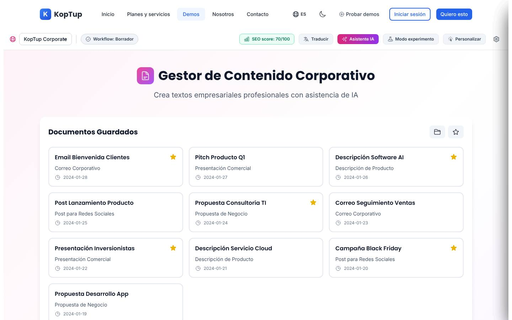
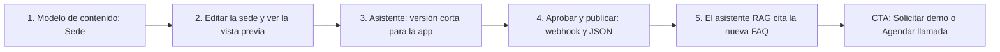

# CMS headless

> Engagement (`engagement`) · Demo: `/demo/gestor-contenido` · Modo de acceso recomendado: `publico` (tras rehacer la demo; el asistente de redacción con IA real solo con acceso aprobado por `solicitud`) · Prioridad: **P3** · Esfuerzo total: **L** (≈ 2 semanas de 1 dev senior para rehacer la demo como CMS y publicar la landing; el producto real se estima aparte)

*Captura actual de `/demo/gestor-contenido` (vista Plantillas). Ver también [Sistema de demos](04-Sistema-de-Demos.md), [Catálogo de productos](08-Catalogo-de-Productos.md) y [Roadmap](12-Roadmap.md). Productos relacionados: [Sistemas RAG](Producto-chatbot-rag-ia.md), [Ecommerce](Producto-ecommerce.md) y [Demo LinkedIn Ads](Demo-linkedin-ads.md).*

> **Contexto de posicionamiento:** con el reposicionamiento de Koptup en sistemas RAG (ver [Visión de producto](02-Vision-de-Producto.md)), este producto queda dentro de **"Otras soluciones a medida"**. Es un mercado con mucha oferta: CMS headless de código abierto sin licencia (Strapi, Payload, Directus), servicios en la nube (Contentful, Sanity) y WordPress. Por eso tiene prioridad **P3**.
>
> Además, **la demo actual no muestra un CMS headless**. Su núcleo es un generador de textos corporativos con IA ("Gestor de Contenido Corporativo — Crea textos empresariales profesionales con asistencia de IA"), con una capa de paneles "PRO" simulados alrededor. El mapeo `cms-headless` → `gestor-contenido` es **parcialmente incorrecto** y hay que corregirlo rehaciendo la demo, no cambiando de oferta.
>
> El puente con el producto principal: **el CMS como fuente de contenido del asistente RAG**. Lo que el equipo publica (preguntas frecuentes, políticas, fichas de servicio) sale a la web y a la app, y el asistente lo cita.

---

## Resumen

**Problema:** en empresas medianas, cambiar un texto o una foto del sitio web depende del proveedor o del desarrollador y tarda días. Además:
- El mismo contenido se copia a mano en la web, la app, las landing pages y los correos.
- Los sitios en WordPress con muchos plugins se vuelven lentos e inseguros.
- Las marcas con presencia en varios países o sedes no tienen un lugar central para publicar.

**Para quién (cliente ideal en Colombia/LATAM):**
- **Redes de clínicas o IPS con varias sedes:** servicios, médicos, horarios y preparación para exámenes.
- **Universidades e instituciones educativas:** programas, facultades, eventos y admisiones.
- **Constructoras e inmobiliarias:** proyectos, unidades disponibles y salas de ventas.
- **Retail y marcas con app:** catálogo editorial, promociones por ciudad y blog.
- **Agencias digitales** que necesitan un backend de contenido confiable para sus clientes.
- **Entidades públicas y sus contratistas:** sitios con requisitos de accesibilidad y transparencia (Res. 1519 de 2020 de MinTIC).

**Propuesta de valor:** "Tu equipo publica sin depender de desarrolladores. Un solo contenido sale a la web, la app y tu asistente de IA, en un sitio rápido, seguro y bien posicionado en Google. El código es tuyo y no pagas licencias."

---

## Estado actual

| Aspecto | Estado | Evidencia |
|---|---|---|
| Demo | Existe. **Parcial y de otro producto:** el núcleo es un redactor de textos con IA, no un CMS | `apps/web/src/app/demo/gestor-contenido/page.tsx` |
| Núcleo (real) | 5 plantillas (Correo corporativo, Presentación comercial, Descripción de producto, Post para redes, Propuesta de negocio), 10 "documentos guardados" fijos y editor de texto plano con campos `[placeholder]` editables. Las acciones de IA **reales** (mejorar, cambiar tono, ajustar longitud, 3 versiones) llaman al backend. Además: exportar TXT o PDF, copiar y vista previa como correo | `apps/web/src/services/contentManagerService.ts` → `/api/content/*` |
| Backend | 5 rutas POST montadas en `/api/content`, con `gpt-4o-mini` (o `OPENAI_MODEL`) y hasta 2.000–2.500 tokens por respuesta. **No existe almacenamiento de contenido**: no hay modelo de entradas, páginas ni tipos | `apps/backend/src/routes/content-manager.routes.ts`, `services/content-manager.service.ts` |
| Capa "PRO" (maqueta) | Selector de 5 sitios ("KopTup Corporate", "Blog KopTup", "Shop KopTup"…), workflow (Borrador → Revisión → Aprobado → Programado → Publicado), "SEO score", traducción, asistente IA, modo experimento A/B, personalización por segmento, *edge*/ISR, bloques, biblioteca de medios (DAM) y diagrama "headless multi-frontend" | `components/CmsProShared.tsx` (665 líneas), `CmsDrawers.tsx`, `CmsTopbar.tsx`, `CmsSidebar.tsx`, `CmsViews.tsx` |
| Lo que falta del CMS | Modelos de contenido (tipos y campos), listado de entradas y páginas, editor por bloques real, vista previa en el sitio, API de entrega (JSON) visible, publicación con webhook, roles | — |
| Datos | Plantillas y documentos guardados fijos en `page.tsx`, en español, con fechas de enero de 2024. Hay contenidos de "Black Friday" con emojis y precios en USD ("$9.99/mes"). Las métricas por sitio (`SITE_METRICS`) son fijas | `page.tsx`, `CmsProShared.tsx` |
| i18n ES/EN | `contentManager` (31 claves) y `demoCmsPro` (151) en `apps/web/messages/{es,en}.json`. Las plantillas, los documentos guardados, los errores y los `alert()` están en español fijo; los tonos son valores en español en el código (`'formal' \| 'técnico' \| 'persuasivo'`) | `page.tsx` |
| Tests | Ninguno | — |
| Tamaño | 2.130 líneas en la carpeta (`page.tsx` 1.002 + 5 componentes), más 133 del servicio del front y ≈ 630 del backend | `wc -l` |
| Nombres y SEO | Un producto con cuatro nombres y tres promesas distintas: ver la lista debajo de la tabla | `seo-config.ts`, `messages/es.json` |
| CTA | Solo el `DemoCTA` genérico del layout de `/demo` | `apps/web/src/components/demo/DemoCTA.tsx` |
| Catálogo | Offering `cms-headless` → demo `gestor-contenido`: la demo no demuestra la oferta (ver arriba) | `services-catalog.ts` |

Los cuatro nombres y sus promesas:
- **Oferta:** "CMS headless".
- **Home:** "CMS Avanzado".
- **Hub `/demo`:** "Gestor de Contenido — Blog, páginas y editor visual", que promete "Editor WYSIWYG", "SEO y metadatos", "Publicación programada" y "Roles y permisos".
- **Título de la demo:** "Gestor de Contenido Corporativo".
- **Metadata `demo-gestor-contenido`:** "Gestor de Contenido con IA | Emails y Documentos Médicos" (en la rama `rag-reposicionamiento`, "Gestor de Contenido Médico con IA").

**Lo que hace bien:**
- La IA de redacción funciona de verdad y da resultados útiles.
- Los campos `[placeholder]` editables en línea son una buena idea: sirven para plantillas de contenido.
- Exportar a PDF funciona.
- La barra superior y los paneles PRO nombran los conceptos correctos de un CMS moderno: varios sitios, workflow editorial, SEO técnico, traducción, experimentos, revalidación de caché.
- La capa PRO tiene i18n completo.

### Problemas detectados (con ruta)

1. **No demuestra lo que se vende.** Quien busca un CMS headless quiere ver cuatro cosas, y ninguna está:
   - cómo se modela el contenido;
   - cómo lo edita el equipo;
   - cómo sale por API;
   - cómo se ve publicado.
2. **Dos asistentes de IA distintos:**
   - El del editor es real.
   - El de la barra superior (`AiPanel` en `CmsProShared.tsx`) "escribe" letra por letra siempre el mismo texto (`outputBody`), sin importar lo que se le pida.
   - Si el prospecto prueba el segundo, descubre que es falso.
3. **Métricas inventadas:**
   - "SEO score" = 70 + longitud del texto / 50 (`seoScore` en `page.tsx`).
   - Tráfico y páginas por sitio fijos (`SITE_METRICS`).
   - Experimentos A/B con "significancia" fija.
4. **Marca equivocada:** los sitios de ejemplo son "KopTup Corporate", "Blog KopTup", "Shop KopTup"…; el prospecto no se ve reflejado.
5. **Botones muertos:**
   - Los 3 botones de formato de la barra del editor no tienen `onClick`.
   - Los "documentos guardados" no admiten guardar uno nuevo.
   - Los favoritos son fijos.
6. **Spanglish y jerga:** "Edge personalization", "Digital Asset Management", "A/B testing nativo", "Cache HIT (edge SFO)", "Motor: DeepL Pro + GPT-4o revisión", "Detección facial" (sin propósito claro y con implicaciones de privacidad).
7. **SEO equivocado:** la metadata habla de "emails y documentos médicos" e "informes médicos" para un producto que no es de salud.
8. **Textos del catálogo** (`apps/web/messages/offerings/cms-headless.es.json`):
   - Usan voseo ("Gestioná", "Comprala", "pagá").
   - La descripción es de plantilla.
   - "Reportes mensuales del tier" aparece **2 veces en Avanzado y 3 en Enterprise** (relleno para cuadrar `incluyeCount`).
   - Hay jerga: "GraphQL federado", "PIM/DAM", "Translation memory", "DXP", "Web vitals SLA aproximado".
9. **Precio difícil de defender:**
   - Los precios son idénticos, tupla por tupla, a los del gestor documental: no salen del esfuerzo de este producto.
   - Un Básico de $35 M de setup compite con CMS de código abierto sin licencia y con sitios administrables que el mercado local ofrece por una fracción de ese valor.

---

## Qué falta para que sea vendible

- **Rehacer la demo como CMS:**
  - modelos de contenido;
  - entradas;
  - editor por bloques;
  - vista previa en vivo de un **sitio de ejemplo**;
  - explorador de API con el JSON real de la entrada;
  - publicación con webhook.
- **Un solo asistente de IA** (el real) dentro del editor, con respuestas pregeneradas en modo público y con cupo cuando hay acceso aprobado.
- **El momento RAG:** publicar una pregunta frecuente y ver que el asistente ya la cita.
- **Decidir la base tecnológica** (Payload o Strapi, ver [Producto real](#producto-real)) y el empaquetado **"Sitio web + CMS"**: el cliente compra un sitio que su equipo puede editar, no "un CMS".
- **Nombre único** en oferta, home, hub, demo y SEO.
- **Precio coherente** con el esfuerzo real.
- **Capturas, video y CTA contextual.**

---

## Plan detallado

### Landing `/productos/cms-headless`

Sigue la estructura común de [Landing de producto](Seccion-Landing-de-Producto.md):

1. **Hero:**
   - Título: "Publica en tu web, tu app y tu asistente de IA desde un solo panel".
   - Subtítulo: "Tu equipo edita sin depender de desarrolladores; nosotros construimos un sitio rápido, seguro y tuyo, sin licencias."
   - CTA principal **"Solicitar demo"**, secundario "Agendar llamada" y enlace "Probar la demo".
2. **Problemas que resuelve** (3 tarjetas):
   - Cambios pequeños que esperan semanas al proveedor.
   - Sitio lento y lleno de plugins.
   - Contenido duplicado en la web, la app y los correos.
3. **Cómo funciona** (3 pasos): modelamos tu contenido (sedes, servicios, artículos, preguntas frecuentes) → tu equipo edita y aprueba → se publica en la web, la app y el asistente en segundos.
4. **Capturas y video:**
   - Galería de 4: Entradas, Editor con vista previa, Explorador de API, Publicación.
   - Video de 60–90 s.
5. **Casos por sector:**
   - Red de clínicas: sedes, servicios, médicos y preparación de exámenes.
   - Universidad: programas y eventos.
   - Inmobiliaria: proyectos y unidades.
   - Retail: catálogo editorial y promociones por ciudad.
6. **Integraciones:**
   - Frontends: Next.js, Astro y apps móviles.
   - Analítica y SEO: Google Analytics 4, Search Console, Tag Manager y Meta Pixel.
   - Formularios y correo: HubSpot, Brevo o Mailchimp, con consentimiento de la Ley 1581.
   - WhatsApp Business (botón de contacto).
   - Medios y búsqueda: Cloudinary o S3, y Algolia o Typesense.
   - Tiendas: Shopify, VTEX o WooCommerce (fichas editoriales).
   - Traducción automática revisada.
   - El [asistente RAG](Producto-chatbot-rag-ia.md).
7. **Calidad incluida:** Core Web Vitals en verde, SEO técnico (sitemap, schema, hreflang), accesibilidad WCAG 2.1 AA y, para entidades públicas, los lineamientos de la Res. 1519 de 2020.
8. **Planes y precios:** "Compra / a medida" en COP, con USD de referencia a `TRM_REFERENCIA = 3.300`. SaaS como **"Lista de espera"** (DECISIÓN 7).
9. **Preguntas frecuentes:**
   - ¿Qué es "headless" y por qué no WordPress?
   - ¿Mi equipo necesita saber programar?
   - ¿El código es mío y sin licencias?
   - ¿Cuánto cuestan el hosting y el CDN al mes?
   - ¿Migran mi contenido actual?
   - ¿Puedo tener varios idiomas o sedes?
   - ¿Cómo se conecta con mi asistente de IA?
10. **CTA final:** formulario "Solicitar demo" con `cms-headless` preseleccionado.

### Demo interactiva (mejoras por pantalla/módulo)

La demo se **reorganiza** alrededor del flujo de un CMS. Se reutilizan las piezas existentes donde encajan.

| Módulo | Agregar | Reutiliza | Quitar / corregir | Datos de ejemplo |
|---|---|---|---|---|
| Barra superior y sitios (`CmsTopbar.tsx`, `MultisitePanel`) | 3 canales de la empresa ficticia (Sitio web, Blog, App) con métricas coherentes. Insignia "Datos de ejemplo". Botón "Iniciar recorrido" | Selector de sitio y workflow | "KopTup Corporate/Blog/Shop", "SEO score" con fórmula, botón "Asistente IA" duplicado | "Red de Clínicas Montaña Azul" con 6 sedes (verificar en el RUES que no exista) |
| **Nuevo: Modelos de contenido** (`components/ContentModels.tsx`) | Tipos "Página", "Artículo", "Sede", "Servicio" y "Pregunta frecuente" con sus campos (texto, texto enriquecido, imagen, referencia, fecha, SEO). "Agregar campo" simulado | — | — | "Sede": nombre, dirección, ciudad, horario, teléfono de WhatsApp, foto, servicios (referencia) |
| **Nuevo: Entradas** (reemplaza "Documentos guardados") | Tabla con filtros por tipo, estado, idioma y autor. "Nueva entrada" que se guarda en `localStorage` con prefijo `demo:cms:` | Colores de estado `WORKFLOW_COLORS` | Las 10 plantillas de correos y pitch de 2024 | 18 entradas: 6 sedes, 5 servicios, 4 artículos, 3 preguntas frecuentes |
| Editor (`sidebarView === 'editor'`) | Editor **por bloques** (título, párrafo, imagen, botón, pregunta frecuente) con campos estructurados. Panel SEO con chequeos reales: largo del título y de la meta descripción, un solo H1, texto alternativo de imágenes, enlace interno. **Asistente de redacción** dentro del editor (mejorar, tono, longitud, versiones) | `BlocksPanel`, `contentService`, campos `[placeholder]` | Área de texto plano. Botones de formato sin acción. `AiPanel` falso | Entrada "Sede Chapinero" con horario y 4 servicios |
| **Nuevo: Vista previa en vivo** (`components/SitePreview.tsx`) | Panel con el sitio de ejemplo (componente React) que se actualiza al escribir; selector escritorio/móvil; tema con logo y color del prospecto | — | — | Página de la sede con mapa estático, horario y botón de WhatsApp |
| **Nuevo: Explorador de API** (reemplaza el diagrama `HeadlessPanel`) | Muestra la petición `GET /api/v1/entries?type=sede&locale=es` y el **JSON real** de la entrada editada. Pestaña GraphQL de ejemplo y fragmento de código para Next.js | `IsrPanel` (línea de tiempo de caché) | Diagrama estático con latencias y uptime inventados | — |
| Publicación y workflow (`WorkflowPanel`, `WorkflowDrawer`) | Enviar a revisión → aprobar → publicar. Al publicar, un "webhook" simulado registra "Sitio revalidado en 1,2 s" y la vista previa pasa a "Publicado". Programar publicación con fecha | Pasos del workflow | — | Aprobadora: "Coordinadora de comunicaciones" |
| Medios (`DamPanel`) | Biblioteca con imágenes libres de derechos, recortes por formato (web, móvil, redes) y texto alternativo sugerido por IA (pregenerado) | Panel actual | "Detección facial". "Digital Asset Management" → "Biblioteca de medios" | Fotos de fachada, consultorio y equipo |
| Idiomas (`I18nPanel`, `I18nDrawer`) | Estado de traducción por campo (ES, EN, PT) con traducción sugerida pregenerada | Panel actual | "Motor: DeepL Pro + GPT-4o revisión" | — |
| Avanzado (`AbPanel`, `EdgePanel`, `PersonalizationDrawer`, `TechConfigModal`) | Agrupar en "Funciones del plan Avanzado" con insignia, y marcar las cifras como de ejemplo | Paneles actuales | Términos en inglés ("Edge personalization", "Cache HIT") | — |
| **Nuevo: Puente RAG** (opcional) | En una "Pregunta frecuente" publicada, la etiqueta "Disponible para tu asistente" y un mini chat (pregenerado) que la cita | — | — | "¿Qué preparación necesito para una ecografía abdominal?" |
| Global | Banner "Solicita tu demo guiada". CTA contextual con `cms-headless`. Corregir la metadata (sin "médico"). Pasar a i18n plantillas y errores. Reemplazar `alert()` | — | `DemoCTA` genérico | — |

**Recorrido guiado (5 pasos, menos de 3 minutos):**

> [Ver diagrama como imagen](images/diagramas/Producto-cms-headless-1.png)

1. **Modelo:** ver el tipo "Sede" y sus campos. Así se entiende qué significa "headless": el contenido es estructurado y no depende del diseño.
2. **Editar:** cambiar el horario y la foto de "Sede Chapinero"; la vista previa web y móvil se actualiza al instante.
3. **Asistente:** pedir "versión más corta para la app" y aplicarla al campo de descripción.
4. **Publicar:** enviar a revisión, aprobar y publicar. El log del webhook muestra el sitio revalidado y el explorador de API, el JSON nuevo.
5. **Momento RAG:** publicar la pregunta frecuente sobre preparación de exámenes; el asistente la cita en su respuesta. Cierre con "Solicitar demo guiada".

### Acceso y solicitud de demo

- **Modo recomendado: `publico`, una vez rehecha la demo:**
  - Todo el flujo del CMS se simula en el navegador, sin costo de servidor.
  - El asistente de redacción responde con textos **pregenerados** para las entradas del recorrido.
  - Las llamadas reales a la IA de redacción solo se habilitan con acceso aprobado y cupo (30 generaciones por `DemoGrant`).
  - Banner "Solicita tu demo guiada" (DECISIÓN 1).
- **Mientras no se rehaga:** mantenerla pública, pero corregir de inmediato la metadata y los nombres, y sacarla de los destacados del home (`apps/web/src/app/page.tsx`) para no prometer un "CMS Avanzado" que la demo no muestra.
- **Qué ve el visitante antes de solicitar:** la landing con capturas y video de 60–90 s del recorrido, y la demo completa con datos de ejemplo.
- **Qué obtiene al solicitar** (flujo de [Sistema de demos](04-Sistema-de-Demos.md)):
  - Sesión guiada de 30 min.
  - Versión con su logo y color en el sitio de ejemplo.
  - El preset de su sector.
  - El asistente de redacción real con cupo.
  - Vigencia: `DemoGrant` de **14 días**.
  - Puede indicar la URL de su sitio actual para que el comercial prepare una propuesta de modelo de contenido. Es trabajo de preventa, no una importación automática.
- **Prospecto aprobado** (Portal › Mis demos, ver [Portal del cliente](06-Portal-del-Cliente.md)): tarjeta "CMS — personalizado para <Empresa>" con días restantes, cupo de IA usado y los botones "Abrir demo", "Agendar llamada" y "Solicitar propuesta".
- **Eventos `DemoEvent`:** apertura, pasos del tour, módulos visitados (modelos, entradas, API, publicación), generaciones de IA usadas, entradas creadas y clic en cada CTA.

### Personalización por cliente

Sin código, desde **Admin › Solicitudes de demo › Aprobar** (o Admin › Demos › Personalizar). Se guarda en `DemoGrant.personalizacion`. Ver [Panel de administración](05-Panel-de-Administracion.md).

| Campo | Efecto en la demo |
|---|---|
| Logo y colores | Tema del sitio de ejemplo en la vista previa y barra superior del CMS |
| Nombre de la empresa | Nombre de los canales ("Sitio web de <Empresa>") y del sitio de ejemplo |
| Sector (preset) | Carga los tipos de contenido, las entradas y la plantilla del sitio de ejemplo: Salud (sedes, servicios, médicos), Educación (programas, facultades, eventos), Inmobiliario (proyectos, unidades), Retail (categorías, promociones por ciudad), Medios (artículos, autores, secciones) |
| Idiomas | Idiomas activos en el panel de traducción |
| Cupo de IA | Número de generaciones reales permitidas (por defecto 30) |

**Implementación:**
- Cada preset vive en `fixtures/<sector>.ts`, con modelos, entradas y tema.
- La demo lee `GET /api/demo-access/gestor-contenido` (DECISIÓN 3); en modo público usa el preset de salud por defecto.
- Los nombres ficticios se verifican en el RUES.

### Producto real

**Base tecnológica recomendada: no construir un CMS desde cero.** Implementar sobre **Payload CMS** (licencia MIT, nativo de Next.js y compatible con MongoDB o PostgreSQL, el mismo stack de Koptup), o sobre Strapi Community (MIT). El valor que vende Koptup es otro:
- modelado de contenido;
- frontend a medida;
- integraciones;
- migración;
- capacitación;
- puente con el RAG.

En la modalidad compra se entrega el código sin licencias de terceros.

**Alcance MVP — modalidad compra:**
- **Básico (2–5 semanas):**
  - 1 sitio y hasta 8 tipos de contenido.
  - Editor por bloques, biblioteca de medios (S3 o Cloudinary) y roles administrador y editor.
  - Borrador y publicado, con vista previa.
  - SEO por entrada, sitemap y datos estructurados.
  - Formularios con consentimiento de la Ley 1581 hacia correo o CRM.
  - Frontend Next.js con revalidación al publicar.
  - Google Analytics 4 y Tag Manager, banner de cookies.
  - Migración desde WordPress (hasta 200 entradas) y capacitación.
- **Profesional (5–9 semanas):**
  - Web y app con el mismo contenido.
  - Workflow de aprobación y publicación programada.
  - Varios idiomas y webhooks.
  - Buscador (Algolia o Typesense).
  - Integración con HubSpot o Brevo y botón de WhatsApp Business.
  - **Asistente de redacción con IA**, reutilizando `apps/backend/src/services/content-manager.service.ts` con tope de costo por cliente.
- **Avanzado/Enterprise:**
  - Varios sitios o marcas.
  - Contenido por segmento y pruebas A/B.
  - Inicio de sesión corporativo (SSO) y auditoría.
  - Accesibilidad WCAG 2.1 AA verificada (y Res. 1519 de 2020 para entidades públicas).
  - CDN en varias regiones.
- **Puente RAG:** un webhook de publicación reindexa el contenido en el asistente RAG del cliente, así que lo que se publica en el CMS es lo que el asistente cita.
- **Seguridad:** autorización en el servidor, roles por tipo de contenido, auditoría de cambios, copias de seguridad y dependencias actualizadas.

**SaaS (DECISIÓN 7):** hoy no hay base multi-tenant ni cobro recurrente, así que se muestra **"SaaS: lista de espera"**. Antes de un SaaS multi-tenant, la alternativa realista es **"hosting y soporte gestionado"**: una instancia dedicada por cliente que opera Koptup, incluida en el mantenimiento con cobro recurrente por Wompi o PayU. Para un SaaS de verdad (Fase 4 o posterior) hacen falta:
- Payload multi-tenant con aislamiento por cliente.
- Aprovisionamiento automático.
- Medición de sitios y entradas contra el plan.
- Billing.
- CDN por cliente.

### Planes y precios

Precios actuales del catálogo (`apps/web/src/lib/services-catalog.ts`, entrada `cms-headless`; COP):

| Plan | Compra: setup | Compra: mantenimiento/mes | SaaS: setup | SaaS: mes | Volumen incluido | Usuarios admin / finales | Cuentas (sitios) | Almacenamiento | Implementación | Costos del cliente al proveedor (USD/mes) |
|---|---|---|---|---|---|---|---|---|---|---|
| Básico | $35.000.000 | $3.200.000 | $2.900.000 | $1.190.000 | 50.000 vistas/mes | 5 / N/A | 1 | 10 GB | 2–5 semanas | 50–200 (hosting, DB, CDN básico) |
| Profesional | $90.000.000 | $8.000.000 | $6.900.000 | $2.890.000 | 1 M vistas/mes | 20 / N/A | 3 | 80 GB | 5–9 semanas | 300–1.200 (CDN Pro, optimización de imágenes) |
| Avanzado | $210.000.000 | $18.000.000 | $12.900.000 | $5.490.000 | 25 M vistas/mes | 60 / N/A | 10 | 400 GB | 9–14 semanas | 1.500–5.000 (CDN multirregión, DAM, edge) |
| Enterprise | $450.000.000 | $35.000.000 | $0 (se muestra "Personalizado") | $9.890.000 | 250 M+ vistas/mes | Ilimitado / N/A | Ilimitado | Ilimitado | 12–20 semanas | 5.000–20.000 (CDN enterprise, DXP) |

- Horas de evolutivos incluidas por mes: 5 / 12 / 25 / 50.
- Soporte: correo 24 h hábiles / + WhatsApp 4 h / + Slack Connect 2 h / tickets con SLA de 1 h.
- Ciclos SaaS: semestral −10 %, anual −20 %.
- Referencia en USD con TRM 3.300: setup de compra ≈ USD 10.610 / 27.270 / 63.640 / 136.360; SaaS ≈ USD 360 / 880 / 1.660 / 3.000 al mes.

**Recomendaciones de claridad:**
1. **Reempaquetar como "Sitio web + CMS headless".** El cliente compra un sitio que su equipo puede editar. El Básico debería describir el sitio (número de plantillas de página, tipos de contenido, migración) y su precio debería reflejar el uso de una base de código abierto. Hoy es una copia de los precios del gestor documental. El valor final lo decide el dueño.
2. **Límites que el cliente entienda.** "Vistas/mes" casi no cuesta con CDN y no diferencia los planes. Usar en su lugar:
   - sitios o canales (1 / 3 / 10 / ilimitado);
   - idiomas;
   - tipos de contenido;
   - editores.
   Renombrar "Cuentas / tenants" a "Sitios o canales" y ocultar "Usuarios finales" (N/A).
3. **Mantenimiento de compra incoherente:**
   - 12 × $3,2 M = $38,4 M al año, el 110 % del setup Básico.
   - Es 2,7 veces la cuota SaaS.
   - Costo total a 12 meses del Básico: compra $73,4 M vs SaaS $17,2 M.
   - El dueño debe convertirlo en "hosting y soporte gestionado" con un precio mensual claro, o en un % anual del setup.
4. **SaaS → "Lista de espera"** (o "hosting gestionado"). Enterprise SaaS setup: mostrar "A convenir" en lugar de "Personalizado".
5. **Bullets en lenguaje de cliente y sin duplicados:**
   - **Básico:** "Sitio web a tu medida, rápido y seguro · Panel para editar páginas, blog y formularios · Imágenes optimizadas · SEO y Google Analytics · Capacitación de tu equipo".
   - **Profesional:** "+ Web y app con el mismo contenido · Aprobaciones antes de publicar · Publicación programada · Varios idiomas · Asistente de redacción con IA".
   - **Avanzado:** "+ Varios sitios o marcas · Contenido según el tipo de visitante · Pruebas A/B · Memoria de traducción".
   - **Enterprise:** "+ Inicio de sesión corporativo (SSO) · Auditoría de cambios · Acuerdo de nivel de servicio · Gerente de proyecto".
   - Quitar los "Reportes mensuales del tier" repetidos.
6. **Tuteo** en lugar de voseo, y una descripción específica en lugar de la de plantilla.
7. **Venta cruzada con RAG:** ofrecer "CMS + asistente RAG" (las preguntas frecuentes y políticas publicadas alimentan el asistente) como paquete para salud y educación.

Detalle de la política comercial común en [Catálogo de productos](08-Catalogo-de-Productos.md) y [Comercial, marketing y legal](11-Comercial-Marketing-y-Legal.md).

---

## Tareas

| # | Tarea | Fase | Prioridad | Esfuerzo | Criterio de aceptación |
|---|---|---|---|---|---|
| 1 | Límites de costo y de uso (*rate-limit*) en las funciones de IA de redacción, habilitadas solo con acceso aprobado o con tope diario global | Fase 0 — Endurecimiento | P0 | S | Al superar el tope, la API responde con un aviso claro sin llamar al proveedor; el gasto diario queda registrado |
| 2 | Corregir la metadata `demo-gestor-contenido` (sin "médico") y unificar el nombre en oferta, home, hub `/demo`, título de la demo y breadcrumb | Fase 1 — Funnel y solicitud de demos | P1 | S | Un solo nombre en los 5 lugares; `seo-config.ts` sin "médico" para esta demo |
| 3 | Reescribir los textos del offering `cms-headless` (tuteo, bullets de cliente, sin duplicados ni jerga) y renombrar "Cuentas / tenants" a "Sitios o canales" para este producto | Fase 1 — Funnel y solicitud de demos | P2 | S | `cms-headless.{es,en}.json` sin voseo ni "Reportes mensuales del tier"; el modal del catálogo muestra "Sitios o canales" |
| 4 | Decidir con el dueño el reempaquetado "Sitio web + CMS headless", la base tecnológica (Payload o Strapi), los límites y el precio | Fase 1 — Funnel y solicitud de demos | P2 | S | Decisión registrada en [Catálogo de productos](08-Catalogo-de-Productos.md); precios nuevos en `services-catalog.ts` |
| 5 | Sacar la demo de los destacados del home hasta que se rehaga; registrar el `DemoCatalogItem` `gestor-contenido` (`publico`, 14 días), el banner, el CTA contextual y los eventos | Fase 1 — Funnel y solicitud de demos | P2 | S | El home no enlaza a la demo antes de la tarea 7; el admin cambia el modo sin desplegar |
| 6 | Landing `/productos/cms-headless` con las 10 secciones de este plan | Fase 1 — Funnel y solicitud de demos | P3 | M | Página publicada; "Solicitar demo" abre el formulario con `cms-headless` preseleccionado |
| 7 | Rehacer la demo: Modelos de contenido, Entradas (con `localStorage` `demo:cms:`) y editor por bloques; retirar las plantillas de correos de 2024 | Fase 2 — Demos vendibles | P2 | L | Se puede crear una entrada "Sede", editarla por bloques y verla en la lista con su estado; 0 botones sin acción |
| 8 | Vista previa en vivo del sitio de ejemplo (escritorio/móvil) y explorador de API con el JSON de la entrada | Fase 2 — Demos vendibles | P2 | M | Cambiar un campo actualiza la vista previa y el JSON en < 300 ms |
| 9 | Publicación conectada al workflow: aprobar → publicar → log de webhook simulado → "Publicado"; programar con fecha | Fase 2 — Demos vendibles | P2 | S | El estado de la entrada cambia en la lista, la vista previa y la barra superior al mismo tiempo |
| 10 | Un solo asistente de IA dentro del editor (eliminar `AiPanel` falso), con respuestas pregeneradas en público y `contentService` real con cupo de 30 por `DemoGrant`; panel SEO con chequeos reales | Fase 2 — Demos vendibles | P2 | S | Sin grant no hay llamadas a `/api/content`; el panel SEO marca un título > 60 caracteres y una imagen sin texto alternativo |
| 11 | Presets por sector (salud, educación, inmobiliario, retail, medios) y personalización desde el `DemoGrant` (logo, colores, nombre, idiomas, cupo) | Fase 2 — Demos vendibles | P3 | M | Con grant, la vista previa usa el logo y los colores del prospecto; los 5 presets cargan modelos y entradas distintos |
| 12 | Tour guiado de 5 pasos (con el momento RAG pregenerado), 4 capturas y video de 60–90 s | Fase 2 — Demos vendibles | P2 | M | Tour completable en < 3 min; capturas y video publicados en la landing |
| 13 | Dividir `page.tsx`, pasar a i18n las plantillas, los errores y los tonos, reemplazar `alert()` y agregar un smoke test en CI | Fase 0 — Endurecimiento | P3 | S | `page.tsx` < 250 líneas; la demo en inglés no muestra textos en español; el test pasa en CI |
| 14 | Plantilla de propuesta "Sitio web + CMS" en el `Quote` ampliado (modelo de contenido, plantillas de página, migración, integraciones) | Fase 3 — Propuestas y conversión | P3 | S | El comercial genera la propuesta PDF en < 15 min desde el admin |
| 15 | Kit interno reutilizable "Sitio + CMS" sobre Payload (tipos base, frontend Next.js, SEO, formularios con consentimiento) con webhook hacia el asistente RAG | Fase 5 — Escala | P3 | L | Un proyecto nuevo arranca con el kit en ≤ 2 días; publicar una pregunta frecuente la reindexa en el RAG del cliente |

---

## Métricas de éxito

Son **metas** iniciales a validar con datos reales; no son resultados actuales.

- 0 menciones de "médico" o "emails" en el SEO de la demo, y un único nombre en todos los puntos de contacto (tarea 2).
- ≥ 40 % de los visitantes de la demo rehecha completan los 5 pasos del tour.
- Conversión landing → solicitud de demo ≥ 2 % (producto P3, tráfico menor).
- ≥ 25 % de las demos guiadas terminan en propuesta "Sitio web + CMS" en ≤ 14 días.
- ≥ 30 % de las propuestas de CMS incluyen el asistente RAG como complemento.
- Costo de IA de la demo pública = 0, gracias a las respuestas pregeneradas; costo por grant ≤ USD 1.
- Primer proyecto "Sitio web + CMS" firmado en los 6 meses siguientes a la Fase 2, entregado con el kit de la tarea 15.
