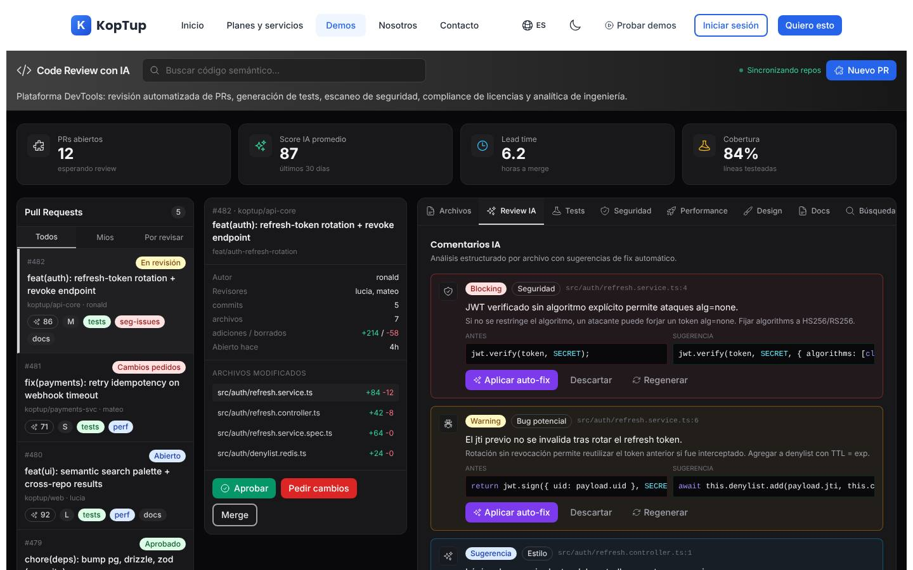
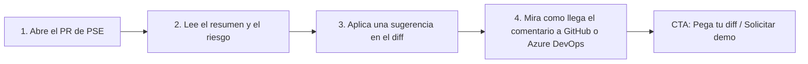

# Code review con IA

> DevTools (`devTools`) · Demo: `/demo/code-review-ia` · Modo de acceso recomendado: `publico` (la revisión real de un diff propio va por `solicitud`) · Prioridad: **P2** · Esfuerzo total: **L**

*Captura actual de `/demo/code-review-ia`. Ver [Sistema de demos](04-Sistema-de-Demos.md), [Catálogo de productos](08-Catalogo-de-Productos.md) y [Roadmap](12-Roadmap.md).*

---

## Resumen

**Problema:** en equipos de 5 a 100 desarrolladores, las revisiones de código se vuelven el cuello de botella: los PR esperan horas, los revisores senior se saturan y los errores de seguridad o de datos personales pasan a producción.

**Para quién (cliente ideal en Colombia/LATAM):**
- Casas de software y fábricas de desarrollo que entregan a clientes corporativos y necesitan demostrar calidad.
- Fintech, bancos, aseguradoras y empresas de salud que **no pueden enviar su código a un SaaS externo** y necesitan la revisión dentro de su infraestructura.
- Áreas de TI que reciben código de proveedores y quieren una revisión uniforme.

**Propuesta de valor:** "Una primera revisión en minutos en cada pull request, con comentarios en español, las reglas de tu equipo y alertas de seguridad y de datos personales. Se instala en tu nube; tu código no sale de tu infraestructura."

**Diferenciación frente a las herramientas SaaS globales** (que cobran por desarrollador en USD y procesan el código en sus servidores): despliegue propio o *air-gapped*, reglas locales (Ley 1581 de datos personales, montos en COP, cédula/NIT) y soporte en español.

---

## Estado actual

| Aspecto | Estado | Evidencia |
|---|---|---|
| Demo | Existe, visualmente cuidado: encabezado, 4 indicadores, lista de PR con filtros, panel de detalle del PR y **11 pestañas** (Archivos, Review IA, Tests, Seguridad, Performance, Design, Docs, Búsqueda, Refactor, Analítica, Compliance) | `apps/web/src/app/demo/code-review-ia/page.tsx` (345 líneas), `components/tabs.tsx` (572 líneas) |
| Real o maqueta | **Maqueta.** Todos los datos son constantes (`PRS`, `FILES`, `AI_COMMENTS` en `page.tsx`; `SEC_VULN`, `LICENSES`, `TESTS`, `PERF_METRICS`, `REFACTORS`, `SEARCH_RESULTS` en `tabs.tsx`). No hay `fetch` ni llamadas a IA | `page.tsx`, `tabs.tsx` |
| Backend | Módulo en memoria `apps/backend/src/modules/code-review/` (CRUD de PR y reseñas, ~180 líneas) **no montado** en el servidor. Su "revisión IA" (`runAiReview`) es una regla por cantidad de líneas agregadas, no usa IA | `code-review.service.ts` |
| i18n ES/EN | Textos de la interfaz en `apps/web/messages/demos/code-review-ia.{es,en}.json` (~7,5 KB). Los datos de ejemplo (títulos y descripciones de PR, código, tests) están en inglés y fijos en el código | |
| Tests | Solo smoke test (`__tests__/page.test.tsx`), que hoy no se ejecuta | |
| Tamaño | 950 líneas en total | `wc -l` |

### Problemas detectados (con ruta)

1. **Todos los PR muestran lo mismo:** al elegir el PR #478 "perf(reports): stream large CSV exports" se siguen viendo los archivos y comentarios del PR de autenticación, porque `FILES` y `AI_COMMENTS` son únicos para todos (`page.tsx`).
2. **Comentarios de IA incoherentes con el diff:** el comentario bloqueante `c1` critica una línea del código *anterior* que el propio diff ya corrige (el código nuevo ya restringe el algoritmo). Un comprador técnico lo nota en segundos.
3. **19 de 21 botones no hacen nada:** "Nuevo PR", "Aprobar", "Pedir cambios" y "Merge" (`page.tsx`); "Regenerar", "Ejecutar todos", "Agregar al PR", "Ver advisory", "Aplicar upgrade", "Descargar SBOM", "Ver en Figma", "Regenerar" (Docs), "Copiar", "Commitear al PR", "Abrir en IDE", "Aplicar refactor", "Preview PR", "Ver bundle" y "VS Code Marketplace" (`tabs.tsx`). Solo funcionan "Aplicar auto-fix" y "Descartar" en Review IA. El buscador del encabezado tampoco está conectado.
4. **Indicadores fijos:** "12 PRs abiertos", "87 score", "6.2 h", "84 %" son textos fijos en `StatCard`; la pestaña Analítica también.
5. **Filtro "Míos" fijo al usuario `ronald`** (`filteredPrs` en `page.tsx`).
6. **El panel de detalle del PR desaparece en pantallas menores a 1280 px** (`hidden xl:block`): en una laptop común no se ven Aprobar/Merge ni la lista de archivos.
7. **Promete más de lo que vende cada plan:** la tarjeta del catálogo de demos (`messages/demos/_catalog.es.json`, clave `codeReview`) anuncia "SAST + DAST + SCA + SBOM + license compliance" y "test generation", mientras el plan Básico incluye solo comentarios en PR y aviso en Slack. DAST ni siquiera es parte de una revisión de código.
8. **Demasiadas pestañas** (11) y algunas fuera de foco (Design, Compliance SLSA, Docs). Además la pestaña Tests se cruza con [QA automatizado con IA](Producto-qa-automatizado-ia.md).
9. **Usa la marca propia como cliente de ejemplo** (`koptup/api-core`, `koptup/payments-svc`): parece el repositorio interno de Koptup y no un caso del cliente.
10. **Resaltado de sintaxis casero:** `highlight()` en `tabs.tsx` arma HTML con expresiones regulares. Sirve para datos fijos, pero antes de mostrar código real hay que reemplazarlo por una librería que escape el contenido (Shiki o Prism).
11. **Textos del catálogo** (`messages/offerings/code-review-ia.es.json`): descripción de plantilla, viñeta "Reportes mensuales del tier" **duplicada** en Avanzado y Enterprise, y voseo ("Recibí", "Comprala", "pagá").

---

## Qué falta para que sea vendible

- **Una historia coherente:** 5 PR distintos, cada uno con sus archivos, sus comentarios y su puntaje.
- **Mostrar el resultado donde el cliente lo vive:** el comentario del bot dentro de un PR de GitHub, GitLab o Azure DevOps.
- **Comentarios en español y reglas locales** como diferenciador: datos personales en logs (Ley 1581), montos en COP con decimales flotantes, validación de cédula/NIT.
- **Que funcione al menos un botón de valor real:** "Pega tu diff" para prospectos aprobados, con revisión real por IA y cupo.
- **Menos pestañas** y alcance alineado con los planes.
- Mensaje de seguridad: "tu código no sale de tu infraestructura" (modalidad compra).
- Paquete DevTools con QA automatizado.

---

## Plan detallado

### Landing `/productos/code-review-ia`

1. **Hero:** "Una primera revisión en cada pull request, en minutos y en español". Subtítulo: "Se instala en tu nube; tu código no sale de tu infraestructura". CTA **Solicitar demo** y **Probar la demo** (pública).
2. **Video de 60–90 s:** se abre un PR → en 2 minutos aparece el comentario del bot en GitHub → el desarrollador aplica la sugerencia → el panel muestra el tiempo ahorrado.
3. **Ejemplos de comentarios reales** (capturas): dato personal en logs, monto en COP con `float`, consulta N+1, secreto en el código, dependencia con vulnerabilidad conocida.
4. **Cómo se instala:** GitHub App, webhook de GitLab o service hook de Azure DevOps → archivo de reglas en el repositorio → primer PR revisado el mismo día.
5. **Reglas de tu equipo:** ejemplo de archivo de configuración con 5 reglas en español.
6. **Privacidad:** despliegue propio, modelo a elección (OpenAI, Anthropic, Azure OpenAI o modelo privado), sin retención de código.
7. **Planes y precios** y FAQ: ¿reemplaza al revisor humano? (no, lo prepara), ¿qué lenguajes soporta?, ¿cuánto cuesta la IA por PR?, ¿funciona con Azure DevOps?
8. **Bloque cruzado:** paquete DevTools con QA automatizado.

### Demo interactiva (mejoras por pantalla/módulo)

| Pantalla / componente | Hoy | Cambiar a |
|---|---|---|
| Encabezado (`page.tsx`) | Buscador sin conexión, "Nuevo PR" sin acción, "Sincronizando repos" | Logo y nombre de la empresa ficticia (o del prospecto), botón **"Pega tu diff"** (activo solo con acceso aprobado; sin acceso abre "Solicitar demo") y banner "Solicita tu demo guiada" (modo `publico`) |
| `StatCard` x4 | Valores fijos | Calculados a partir de los datos de ejemplo: PR abiertos, hallazgos críticos esta semana, tiempo hasta la primera revisión, **horas de revisión ahorradas** |
| Lista de PR (barra izquierda) | 5 PR en inglés con repos `koptup/*`; filtro "Míos" fijo | 5 PR en español de la fintech ficticia "PagaYa" (abajo); filtros funcionales con un usuario de demo |
| Panel de detalle del PR | Oculto bajo 1280 px; Aprobar/Merge sin acción | Visible en todas las resoluciones (colapsable). Aprobar/Pedir cambios cambian el estado del PR en la sesión y registran un `DemoEvent` |
| Pestañas (11) | Archivos, Review IA, Tests, Seguridad, Performance, Design, Docs, Búsqueda, Refactor, Analítica, Compliance | **5 pestañas:** (1) **Resumen del PR**: qué cambia, riesgo y puntaje explicado; (2) **Comentarios IA**: en línea sobre el diff, con "Aplicar sugerencia" que actualiza el diff; (3) **Seguridad**: secretos, dependencias vulnerables, datos personales; (4) **Tests sugeridos**: enlace al demo de QA; (5) **Métricas del equipo**. Design, Docs, Búsqueda, Refactor y Compliance pasan a una sección "Enterprise" de la landing |
| `AIReviewTab` | Comentarios coherentes solo con el PR de autenticación | Comentarios por PR, con severidad, explicación en español, regla que lo originó ("Regla de tu equipo #3") y sugerencia aplicable |
| `DiffSideBySide` + `highlight()` | Resaltado casero con HTML | Comentarios anclados a la línea del diff; resaltado con una librería que escape el contenido |
| **Nueva vista "Así se ve en tu repositorio"** | No existe | Simulación de la conversación del PR en GitHub, GitLab y Azure DevOps con el comentario del bot (selector de plataforma) |
| `SecurityTab` | CVE reales mezclados con un hallazgo SAST del mismo PR y un DAST | Hallazgos del PR seleccionado: secreto detectado, dependencia con CVE (con versión corregida) y dato personal en logs; sin DAST |
| `AnalyticsTab` | Números y gráfico fijos | Métricas de ejemplo coherentes con los 5 PR + proyección "con 20 desarrolladores ahorras X horas al mes" (calculadora simple) |

**Datos de ejemplo** (fintech ficticia "PagaYa"; repos `pagaya/api-pagos`, `pagaya/app-web`, `pagaya/app-movil`):

| PR | Hallazgos principales de la IA |
|---|---|
| `feat(pse): integrar pago PSE con la pasarela en modo sandbox` | Falta idempotencia en el webhook de confirmación; no se valida la firma del evento de la pasarela |
| `fix(facturas): redondeo del IVA 19 % en COP` | Montos con `float` → usar enteros (centavos) o decimal; falta prueba con valores límite |
| `feat(kyc): validación de cédula y NIT` | Dígito de verificación del NIT mal calculado; el número de cédula se escribe en los logs (dato personal, Ley 1581) |
| `chore(deps): actualizar dependencias con vulnerabilidades` | 2 dependencias con CVE conocidos y versión corregida sugerida |
| `perf(reportes): exportar movimientos a CSV por streaming` | Consulta N+1 en el bucle; sugerencia de cursor por lotes |

**Recorrido guiado (4 pasos):**

> [Ver diagrama como imagen](images/diagramas/Producto-code-review-ia-1.png)

1. Abrir el PR "integrar pago PSE" (preseleccionado).
2. Leer el resumen: qué cambia, riesgo alto y por qué.
3. Ir al comentario bloqueante, leer la explicación en español y pulsar "Aplicar sugerencia": el diff se actualiza y el puntaje sube.
4. Ver "Así se ve en tu repositorio". Al final: "¿Quieres verlo con tu código? Pega tu diff" (requiere acceso) o "Solicitar demo".

### Acceso y solicitud de demo

- **Modo recomendado: `publico`.** La maqueta no tiene costo de IA, el comprador técnico quiere explorarla solo y le da valor SEO a la página. Se muestra el banner "Solicita tu demo guiada".
- **Lo que pasa por `solicitud`:** el botón **"Pega tu diff"** (revisión real con IA, hasta 300 líneas por diff y 10 revisiones por acceso) y la demo guiada sobre un repositorio de prueba del prospecto.
- **Duración del acceso:** 14 días.
- **El prospecto aprobado ve** (Portal › Mis demos): la maqueta con su logo y su stack, "Pega tu diff" activo con su cupo y un enlace para agendar la sesión de instalación de prueba (GitHub App en un repositorio de prueba, en modo guiado).
- **Aviso obligatorio en "Pega tu diff":** "No pegues secretos ni datos personales; el contenido se borra al terminar la revisión".

### Personalización por cliente

Desde **Admin › Solicitudes de demo › Aprobar** (personalización del `DemoGrant`):

| Campo | Efecto |
|---|---|
| Nombre y logo de la empresa | Encabezado y nombres de repos (`<empresa>/api`, `<empresa>/web`) |
| Stack principal (TypeScript, Java, .NET, Python, PHP) | Elige el set de PR de ejemplo en ese lenguaje (hay que preparar al menos TypeScript, Java y .NET, comunes en banca y corporativos de Colombia) |
| Plataforma de código (GitHub, GitLab, Bitbucket, Azure DevOps) | Vista "Así se ve en tu repositorio" |
| Reglas del equipo (hasta 5, texto libre) | Aparecen como reglas activas y la IA las cita en los comentarios de "Pega tu diff" |
| Idioma de los comentarios (español/inglés) | Idioma de explicaciones y sugerencias |

### Producto real

**MVP para la modalidad compra (Básico y Profesional):**

| Módulo | Alcance |
|---|---|
| Conectores | GitHub App (Básico: 1 repo); GitLab, Bitbucket y Azure DevOps (Profesional: multi-repo) |
| Motor de revisión | Recibe el evento del PR → obtiene el diff → lo divide por archivo → LLM con reglas del equipo → publica comentarios en línea y un resumen. Modelo configurable (OpenAI, Anthropic, Azure OpenAI para residencia de datos o modelo privado en Enterprise) |
| Reglas | Archivo de configuración en el repositorio (`.koptup-review.yml` o similar) con reglas en lenguaje natural, archivos ignorados y severidad mínima |
| Seguridad (Profesional) | Detección de secretos, análisis estático básico (Semgrep) y alertas de dependencias |
| Notificaciones e integraciones | Slack/Teams; Jira/Linear (Profesional) |
| Panel | Historial de revisiones, hallazgos por tipo, tiempo ahorrado, uso de IA por mes |
| Despliegue | Docker en la nube del cliente (AWS, Azure, GCP u on-premise); opción air-gapped en Enterprise |
| Base existente | `apps/backend/src/modules/code-review/` sirve solo como modelo de datos de partida (PR, reseña); la lógica de IA debe construirse |

**SaaS:** sin base real, así que **"SaaS: lista de espera"** (DECISIÓN 7). Para ofrecerlo: core multi-tenant y cobro recurrente de la Fase 4, GitHub App pública multi-organización, aislamiento estricto del código por tenant, política de no retención y medición de "PR analizados". En SaaS se compite de frente con herramientas globales que cobran por desarrollador; el diferencial de Koptup está en la modalidad compra (despliegue propio).

### Planes y precios

Precios actuales del catálogo (`services-catalog.ts`, entrada `code-review-ia`), en COP:

| Plan | Compra: setup único | Compra: mantenimiento mensual (opcional) | SaaS: setup | SaaS: cuota mensual | Volumen | Implementación |
|---|---|---|---|---|---|---|
| Básico | $35.000.000 | $3.200.000 | $2.900.000 | $1.190.000 | 200 PR analizados/mes | 2–5 semanas |
| Profesional | $90.000.000 | $8.000.000 | $6.900.000 | $2.890.000 | 3.000 PR analizados/mes | 5–9 semanas |
| Avanzado | $210.000.000 | $18.000.000 | $12.900.000 | $5.490.000 | 30.000 PR analizados/mes | 9–14 semanas |
| Enterprise | $450.000.000 | $35.000.000 | A convenir ("Personalizado") | $9.890.000 | 300.000+ PR analizados/mes | 12–20 semanas |

| Plan | Usuarios admin | Organizaciones/cuentas | Almacenamiento | Horas de mantenimiento/mes | Costos del cliente (USD/mes): IA, hosting, SAST/SCA |
|---|---|---|---|---|---|
| Básico | 5 | 1 | 5 GB | 5 | 80–300 |
| Profesional | 50 | 5 | 30 GB | 12 | 400–1.800 |
| Avanzado | 150 | 25 | 150 GB | 25 | 2.000–8.000 |
| Enterprise | Ilimitados | Ilimitadas | Ilimitado | 50 | 6.000–25.000 |

**Qué incluye cada plan, en lenguaje de cliente:**
- **Básico:** "Revisión automática de cada PR en un repositorio de GitHub, con aviso en Slack."
- **Profesional:** "Todos tus repositorios (GitHub, GitLab o Bitbucket), alertas de seguridad, tickets en Jira y extensión para VS Code."
- **Avanzado:** "Análisis profundo con modelos de razonamiento, reglas de seguridad propias, métricas de cobertura y de entrega."
- **Enterprise:** "Azure DevOps, integración con Sonar/Snyk/Checkmarx, opción sin conexión a internet (air-gapped), varias organizaciones y SSO."

**Recomendaciones de claridad:**
1. **Agregar "hasta N desarrolladores" a cada plan:** es la unidad con la que el mercado compara (por ejemplo 10 / 50 / 150 / ilimitados) y es más clara que "usuarios admin".
2. **Definir "PR analizado"** (¿cada push nuevo cuenta?) y el tamaño máximo por PR (líneas).
3. **Alinear el demo con los planes:** marcar en la UI qué pestaña o capacidad pertenece a cada plan ("Profesional", "Enterprise").
4. **Corregir `code-review-ia.es.json`:** propuesta de valor en `description`, borrar la viñeta duplicada "Reportes mensuales del tier", traducir jerga ("Slack notify", "Policy as code") y quitar el voseo.
5. **Quitar "SAST + DAST + SCA + SBOM"** de la tarjeta del catálogo de demos o moverlo explícitamente a Enterprise.
6. **SaaS en lista de espera** y precio de compra comunicado como "licencia de por vida + instalación en tu nube".
7. **Paquete DevTools** (Code Review + QA) con descuento en el setup.

---

## Tareas

| # | Tarea | Fase | Prioridad | Esfuerzo | Criterio de aceptación |
|---|---|---|---|---|---|
| 1 | Reescribir `code-review-ia.{es,en}.json` y la tarjeta `codeReview` de `_catalog.es.json`: propuesta de valor, sin duplicados, sin promesas fuera de plan, español neutro | Fase 1 — Funnel y solicitud de demos | P1 | S | Sin viñetas duplicadas; cada capacidad mencionada pertenece a un plan identificado |
| 2 | Registrar `DemoCatalogItem` `code-review-ia` con `accessMode: publico` y banner "Solicita tu demo guiada" | Fase 1 — Funnel y solicitud de demos | P1 | S | El banner aparece en el demo y abre el formulario con el producto preseleccionado |
| 3 | Marcar el SaaS como "lista de espera" para este producto | Fase 1 — Funnel y solicitud de demos | P1 | S | La tabla pública no muestra precio SaaS; "Anotarme" crea un `Lead` |
| 4 | Landing `/productos/code-review-ia` con video, ejemplos de comentarios, cómo se instala, privacidad, planes y FAQ | Fase 1 — Funnel y solicitud de demos | P2 | M | La landing está en el sitemap y su CTA lleva al formulario con el producto |
| 5 | Datos por PR: mover `PRS`, `FILES`, `AI_COMMENTS` y los datos de `tabs.tsx` a un archivo de fixtures en español (fintech "PagaYa"), con archivos y comentarios propios de cada PR | Fase 2 — Demos vendibles | P1 | M | Al cambiar de PR cambian archivos, comentarios, puntaje y hallazgos de seguridad; no hay textos de ejemplo en inglés en la vista ES |
| 6 | Reducir a 5 pestañas (Resumen, Comentarios IA, Seguridad, Tests sugeridos, Métricas) y conectar o eliminar los 19 botones sin acción | Fase 2 — Demos vendibles | P1 | M | Ningún botón visible queda sin efecto (verificado con un test de interacción) |
| 7 | Comentarios anclados en el diff con "Aplicar sugerencia" que actualiza el código; resaltado con una librería que escape el contenido | Fase 2 — Demos vendibles | P2 | M | Al aplicar una sugerencia el diff y el puntaje cambian; `highlight()` casero eliminado |
| 8 | Vista "Así se ve en tu repositorio" (GitHub, GitLab, Azure DevOps) | Fase 2 — Demos vendibles | P2 | S | El selector de plataforma cambia la simulación del PR con el comentario del bot |
| 9 | Panel de detalle visible en todas las resoluciones y modo claro/oscuro coherente con el sitio | Fase 2 — Demos vendibles | P2 | S | A 1024 px se ven Aprobar, Pedir cambios y la lista de archivos |
| 10 | "Pega tu diff": revisión real con IA para prospectos con `DemoGrant` activo, con cupo, límite de tamaño y borrado del contenido tras responder | Fase 2 — Demos vendibles | P2 | M | Sin acceso, el botón abre "Solicitar demo"; con acceso, un diff de 300 líneas recibe comentarios en menos de 60 s y el cupo se descuenta |
| 11 | Personalización por `DemoGrant` (logo, stack, plataforma, reglas del equipo, idioma) y sets de ejemplo en TypeScript, Java y .NET | Fase 2 — Demos vendibles | P3 | M | Al aprobar con stack Java, el prospecto ve PR de ejemplo en Java con sus reglas |
| 12 | Grabar el video de 60–90 s y 6 capturas | Fase 2 — Demos vendibles | P2 | S | Archivos publicados en la landing y en el `DemoCatalogItem` |
| 13 | Plantilla de propuesta (repos, desarrolladores, modelo de IA, despliegue, horas de mantenimiento) y paquete DevTools | Fase 3 — Propuestas y conversión | P2 | S | El comercial genera la propuesta desde Admin en menos de 15 minutos |
| 14 | Motor de revisión base reutilizable (GitHub App + reglas + publicación de comentarios) como acelerador para proyectos de compra | Fase 3 — Propuestas y conversión | P3 | L | Instalación en un repositorio de prueba en menos de 1 día, con comentarios en un PR real |

---

## Métricas de éxito

| Métrica | Meta inicial |
|---|---|
| Visitantes del demo público que completan los 4 pasos | ≥ 35 % |
| Visitantes del demo público que solicitan acceso ("Pega tu diff" o demo guiada) | ≥ 5 % |
| Prospectos aprobados que usan "Pega tu diff" al menos una vez | ≥ 60 % |
| Demos guiadas que pasan a propuesta | ≥ 25 % |
| Tiempo de la primera revisión en la instalación de prueba | < 2 minutos por PR |
| Comentarios de IA marcados como útiles por el prospecto | ≥ 70 % |

Páginas relacionadas: [QA automatizado con IA](Producto-qa-automatizado-ia.md), [Sistemas RAG](Producto-chatbot-rag-ia.md), [Landing de producto](Seccion-Landing-de-Producto.md), [Panel de administración](05-Panel-de-Administracion.md).
