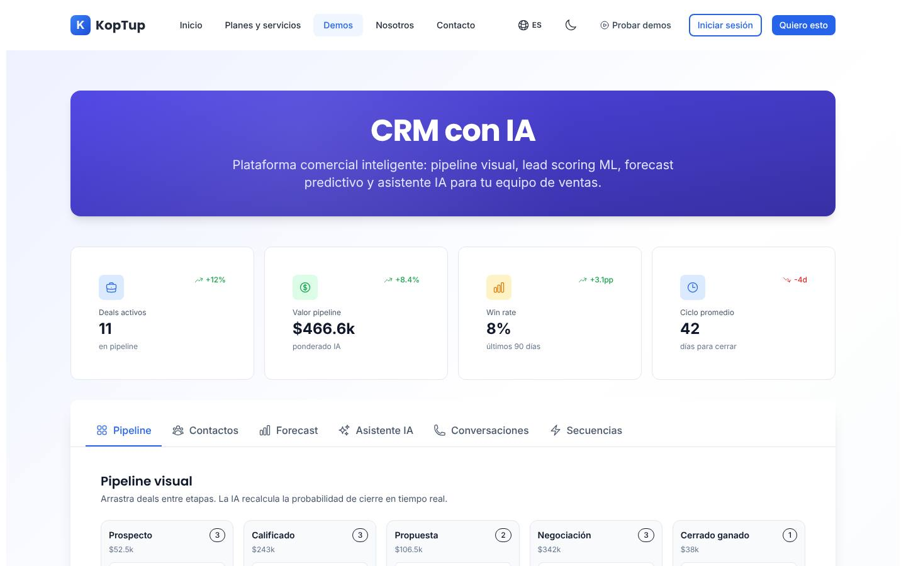
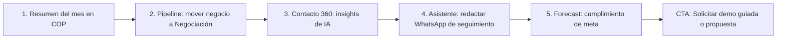

# CRM con IA

> Ventas (`sales`) · Demo: `/demo/crm-ia` · Modo de acceso recomendado: `publico` (versión personalizada por `solicitud`) · Prioridad: **P1** · Esfuerzo total: **XL** (≈ 4 semanas de 1 dev senior para dejar demo + landing vendibles; el producto real se estima aparte)

*Captura actual de `/demo/crm-ia` (pestaña Pipeline). Ver también [Sistema de demos](04-Sistema-de-Demos.md), [Catálogo de productos](08-Catalogo-de-Productos.md) y [Roadmap](12-Roadmap.md). Productos relacionados: [Helpdesk con IA](Producto-helpdesk-ia.md) y [Voice AI para call center](Producto-voice-ai-callcenter.md).*

---

## Resumen

**Problema:** en la mayoría de PYMEs colombianas el proceso comercial vive en Excel y en el WhatsApp personal de cada vendedor. Los leads se enfrían sin seguimiento, nadie sabe qué cotización está en qué punto y el gerente no puede decir cuánto se va a facturar el mes.

**Para quién (cliente ideal en Colombia/LATAM):**
- Distribuidoras y mayoristas con 5–30 vendedores en campo y por WhatsApp.
- Constructoras e inmobiliarias (salas de venta, seguimiento de separaciones).
- Colegios, universidades e institutos privados (admisiones y matrículas).
- Empresas de servicios B2B y software (ciclos de venta de 30–90 días).
- IPS y clínicas privadas con venta de planes o servicios particulares.

**Propuesta de valor:** "Tu proceso comercial en un solo lugar: WhatsApp y correo conectados, la IA te dice a quién llamar hoy y te redacta el mensaje, y el gerente ve el pronóstico del mes en pesos." A diferencia de un CRM de licencia por usuario en dólares, el código es del cliente, se adapta a su proceso y se integra con su facturación (Siigo/Alegra) cumpliendo la Ley 1581 de habeas data.

---

## Estado actual

| Aspecto | Estado | Evidencia |
|---|---|---|
| Demo | Existe. **Maqueta** 100 % en el navegador | `apps/web/src/app/demo/crm-ia/page.tsx` es `'use client'`; no hay `fetch`, `axios` ni llamadas a `/api` en la carpeta |
| Pantallas | 4 métricas + 6 pestañas (Pipeline, Contactos, Forecast, Asistente IA, Conversaciones, Secuencias) + modal Customer 360 (Timeline, Deals, Tickets, Archivos) | `page.tsx` (`MetricCard`, `PipelineBoard`, `ContactsTable`), `components/ForecastView.tsx`, `AssistantView.tsx`, `ConversationsView.tsx`, `SequencesView.tsx`, `Customer360Modal.tsx` |
| Datos | Fijos: 12 contactos de empresas de ficción anglosajona (Acme Corp, Globex, Initech, Wayne Enterprises, Stark Industries, Hooli…), valores en USD con formato `$85k`, fechas ISO crudas (`2026-05-12`) | `components/mockData.ts`, `formatCurrency` en `components/types.ts` |
| Backend | Módulo en memoria `apps/backend/src/modules/crm/` (deals, contactos, forecast ponderado por etapa, 233 líneas con test) **no montado** en `apps/backend/src/index.ts`; el frontend no lo usa | `crm.service.ts`, `crm.data.ts`, `crm.routes.ts` |
| i18n ES/EN | Textos de UI en `apps/web/messages/demos/crm-ia.{es,en}.json` (248 líneas c/u). Los datos de ejemplo están en español fijo dentro del código (`nextAction`, `topics`, `actionItems`, pasos de secuencia, "Outbound · Fintech Q2") | `mockData.ts`, `SequencesView.tsx` |
| Tests | 1 smoke test (`__tests__/page.test.tsx`) que hoy no se ejecuta (ver [Seguridad y calidad](10-Seguridad-y-Calidad.md)) | |
| Tamaño | 1.780 líneas (page 552 + 7 componentes) | `wc -l` |
| SEO | Metadata `demo-crm-ia` en `apps/web/src/lib/seo-config.ts` + breadcrumb JSON-LD en `layout.tsx` | |
| CTA | Solo el `DemoCTA` genérico del layout de `/demo`: título sin nombre de producto, "Solicitar Cotización" → `/contact` (sin producto preseleccionado) y "Ver Planes y Precios" → `/pricing` (solo redirige) | `apps/web/src/app/demo/layout.tsx`, `apps/web/src/components/demo/DemoCTA.tsx` |
| Catálogo | Mapeo correcto: offering `crm-ia` → demo `crm-ia` | `services-catalog.ts` |

**Lo que hace bien:** diseño limpio y coherente con la marca, buena estructura de pestañas, búsqueda y filtros por score funcionan, vista móvil con tarjetas, el modal Customer 360 cuenta bien la idea de "vista única del cliente", y el pipeline calcula el valor ponderado a partir de los datos.

### Problemas detectados (con ruta)

1. **Promete lo que no hace:** el subtítulo del pipeline dice "Arrastra deals entre etapas. La IA recalcula la probabilidad de cierre en tiempo real", pero `PipelineBoard` no tiene drag & drop.
2. **Botones muertos:** "Nuevo deal" (`page.tsx`), "Enviar" y las 4 "Acciones rápidas" (`AssistantView.tsx`), "Reproducir" y "Ver transcript" (`ConversationsView.tsx`) no hacen nada al hacer clic.
3. **IA simulada que se nota:** "Generar borrador" espera 1,2 s (`setTimeout`) y devuelve siempre el mismo correo, sin importar objetivo, tono ni el contexto escrito; la firma es un nombre propio fijo (`assistant.bodyDraft`).
4. **Números que juegan en contra:** "Win rate" se calcula como cerrados/total = 1/12 → **8 %** (con tendencia fija "+3.1pp"), mientras el comentario del modelo dice que el pipeline "supera meta en 12 %". Tendencias (+12 %, +8.4 %, −4d) y ciclo promedio (42) están escritos a mano en `page.tsx`.
5. **Forecast inconsistente** (`ForecastView.tsx`): todo el bloque está hardcodeado; la segunda serie del gráfico usa el dato `closed` pero la leyenda dice "Commit"; el ancho de "Distribución por etapa" es `value * 3` %; el eje no tiene unidad (410…810).
6. **Customer 360 igual para todos** (`Customer360Modal.tsx`): misma línea de tiempo y mismos 3 insights para cualquier contacto, "Deals totales: 4" mientras la pestaña Deals lista 3, valor de vida = `dealValue × 3.2`, pestaña Archivos siempre vacía.
7. **No es local:** USD, empresas de EE. UU., WhatsApp ausente de Pipeline/Contactos, sin NIT ni ciudad; spanglish visible ("Hot/Warm/Cold", "Win rate", "Forecast", "Owner", "Deals", "Talk ratio", "Action items").
8. **Embudo irreal:** no existe la etapa "Perdido" (el módulo de backend sí la tiene: `lost`).
9. **Muestra funciones de planes altos sin avisar:** el asistente de redacción y el forecast solo aparecen en el plan Avanzado (`offering_crmIa.tiers.avanzado.incluye`) y la "Inteligencia conversacional" (grabación y análisis de llamadas) no está en ningún plan.
10. **Textos del catálogo** (`apps/web/messages/offerings/crm-ia.es.json`): voseo rioplatense ("Cerrá", "Comprala", "pagá") para un mercado colombiano; descripción de plantilla genérica; el bullet "Reportes mensuales del tier" aparece 2 veces en Avanzado y 2 en Enterprise (relleno para cuadrar `incluyeCount`); `costoNote` dice USD 50–10.000/mes y el catálogo dice 80–20.000.

---

## Qué falta para que sea vendible

- Datos de ejemplo colombianos en COP, por sector, con un mismo "cliente ficticio" coherente en todas las pestañas.
- Que todo lo que se ve se pueda tocar (o que no se vea): drag & drop, crear negocio, enviar (simulado con aviso), acciones rápidas con respuesta.
- Un **recorrido guiado** de 5 pasos que cuente la historia en menos de 3 minutos.
- WhatsApp como protagonista: en Colombia el vendedor vive en WhatsApp.
- Etiqueta "Incluido desde plan X" en cada módulo, para que lo que se muestra coincida con lo que se cotiza.
- Mensaje de diferenciación frente a CRMs de licencia (HubSpot, Pipedrive, Zoho): código propio, sin costo por usuario, integración con Siigo/Alegra y cumplimiento de la Ley 1581. Debe estar en la landing y en la FAQ.
- Prueba social: hoy no hay casos. Mientras llegan, usar el propio funnel de Koptup como caso ("así gestionamos nuestros leads", ver Fase 5).
- Precio entendible: hoy el mantenimiento de la modalidad compra cuesta más al mes que la cuota SaaS (ver [Planes y precios](#planes-y-precios)).
- CTA contextual "Solicitar demo guiada de CRM con IA" con el producto preseleccionado, en lugar del `DemoCTA` genérico.
- Capturas y video de 60–90 s para la landing.

---

## Plan detallado

### Landing `/productos/crm-ia`

Sigue la estructura común de [Landing de producto](Seccion-Landing-de-Producto.md):

1. **Hero:** "CRM con IA para equipos que venden por WhatsApp". Subtítulo: "Pipeline visual, prioridad de leads con IA y mensajes de seguimiento redactados en segundos. El código es tuyo." CTA principal **"Solicitar demo"**, secundario "Agendar llamada" y enlace "Probar la demo interactiva" (abre `/demo/crm-ia`).
2. **Problemas que resuelve** (3 tarjetas): leads perdidos en WhatsApp personales; seguimiento que depende de la memoria del vendedor; gerente sin pronóstico confiable.
3. **Cómo funciona** (3 pasos): conectas tus canales → la IA califica y te dice a quién contactar → cierras y facturas (Siigo/Alegra).
4. **Capturas** (galería de 4: Pipeline, Contacto 360, Asistente IA, Forecast) y **video de 60–90 s** con locución en español y subtítulos.
5. **Módulos y plan en el que se incluyen** (tabla simple Básico / Profesional / Avanzado / Enterprise).
6. **Integraciones:** WhatsApp Business, Gmail/Outlook, Google Calendar, Siigo o Alegra, Wompi o PayU (link de pago de anticipo), formularios web, importación desde Excel.
7. **Planes y precios:** "Compra / a medida" con precios en COP; SaaS como **"Lista de espera"** (DECISIÓN 7).
8. **Preguntas frecuentes:** ¿Por qué no usar HubSpot o Pipedrive? · ¿El código es mío? · ¿Cuánto cuesta la IA al mes y quién la paga? · ¿Cómo cumplo la Ley 1581 con los datos de mis clientes? · ¿Puedo migrar desde Excel? · ¿Cuánto tarda la implementación? (2–5 semanas en Básico).
9. **CTA final** con el formulario "Solicitar demo" con `crm-ia` preseleccionado.

### Demo interactiva (mejoras por pantalla/módulo)

| Pantalla / componente | Agregar | Quitar / corregir | Datos de ejemplo |
|---|---|---|---|
| Encabezado y métricas (`page.tsx`, `MetricCard`) | Barra de demo con nombre de la empresa del prospecto, botón "Iniciar recorrido" y aviso "Datos de ejemplo" | Win rate = ganados / (ganados + perdidos) del período; tendencias calculadas o eliminadas | Meta del mes $480 M COP; 18 negocios activos; tasa de cierre 32 %; ciclo 38 días |
| Pipeline (`PipelineBoard`) | Drag & drop entre etapas (p. ej. `@dnd-kit`) que recalcule probabilidad y totales; en móvil, menú "Mover a…"; modal "Nuevo negocio" (empresa, valor, vendedor, fecha de cierre); etapa "Perdido" con motivo | Texto "Arrastra deals…" mientras no funcione; "deal" → "negocio" | Etapas: Prospecto, Calificado, Propuesta enviada, Negociación, Ganado, Perdido |
| Contactos (`ContactsTable`) | Columnas Ciudad, Canal preferido (WhatsApp/Correo) y Origen (Web, Feria, Referido); filtro por vendedor; botón "Importar Excel" (simulado) | "Hot/Warm/Cold" → "Caliente/Tibio/Frío"; fechas ISO → "hace 2 días" | 12–15 contactos con nombres colombianos, cargos reales (Gerente de compras, Directora administrativa), ciudades (Bogotá, Medellín, Cali, Barranquilla, Bucaramanga), NIT con formato `900.xxx.xxx-x` |
| Contacto 360 (`Customer360Modal`) | Timeline e insights generados desde los datos del contacto; mensajes de WhatsApp en la línea de tiempo; pestaña Archivos con una cotización PDF de ejemplo; botón "Crear factura en Siigo/Alegra" (simulado, ilustra la integración) | "Deals totales: 4" fijo; valor de vida `× 3.2` | "Propuesta v2 enviada por WhatsApp", "Anticipo pagado con link de Wompi" |
| Forecast (`ForecastView`) | Ejes en millones de COP; selector Mes/Trimestre; comentario de IA que nombre negocios reales del dataset | Leyenda equivocada (`closed` vs "Commit"); ancho `value * 3` | Meta trimestral $1.450 M COP para 3 vendedores |
| Asistente IA (`AssistantView`) | Plantillas distintas por objetivo × tono × canal (Correo / WhatsApp, con largo de WhatsApp); usar el campo "Contexto"; "Enviar" muestra aviso "Enviado (simulado)" y agrega el evento al timeline; respuestas para las 4 acciones rápidas | Firma con nombre propio fijo | Firma del vendedor ficticio del dataset |
| Conversaciones (`ConversationsView`) | Modal con transcripción de ejemplo y audio corto; badge "Complemento / plan Enterprise" | Botones sin acción | Llamada de 12 min con objeciones típicas (precio, plazo de implementación, forma de pago) |
| Secuencias (`SequencesView`) | Vista de solo lectura del flujo WhatsApp → correo → llamada; métricas calculadas | "Outbound · Fintech Q2" y cifras fijas (128, 62 %, 18 %) | "Seguimiento a cotizaciones B2B" |
| Global | Badge "Incluido desde: Profesional / Avanzado" en cada pestaña; banner "Solicita tu demo guiada" (modo `publico`); CTA final contextual con `crm-ia` | `DemoCTA` genérico | — |

**Recorrido guiado (5 pasos, menos de 3 minutos):**

> [Ver diagrama como imagen](images/diagramas/Producto-crm-ia-1.png)

1. **Resumen:** "Tu equipo tiene $1.120 M COP en juego este mes; 4 negocios calientes llevan 3 días sin seguimiento".
2. **Pipeline:** arrastrar un negocio de $86 M de "Propuesta enviada" a "Negociación"; la probabilidad sube a 70 % y cambia el valor ponderado de la columna.
3. **Contacto 360:** abrir el lead con score 92 y ver "Mejor canal: WhatsApp en la mañana", el historial y la cotización enviada.
4. **Asistente IA:** generar un WhatsApp de seguimiento con tono "Cercano", copiarlo y "enviarlo" (simulado).
5. **Forecast:** ver 84 % de cumplimiento de meta y la alerta de la IA ("2 negocios en riesgo por silencio del decisor"). Cierre con CTA "Solicitar demo guiada" / "Solicitar propuesta".

### Acceso y solicitud de demo

- **Modo recomendado: `publico`.** Es un producto con mucha búsqueda ("CRM con IA", "software CRM" ya están en `seo-config.ts`), la demo corre completa en el navegador (sin costo de IA ni datos reales) y funciona como imán de leads. Muestra el banner "Solicita tu demo guiada" (DECISIÓN 1).
- **Qué ve el visitante sin solicitar:** la landing con capturas y video de 60–90 s, y la demo interactiva completa con datos de ejemplo y el tour guiado.
- **Qué obtiene al solicitar** (flujo de [Sistema de demos](04-Sistema-de-Demos.md)): sesión guiada de 30 min con un comercial y una **versión personalizada** (logo, colores, nombre de su empresa, datos de su sector) mediante un `DemoGrant` de **14 días**. Si en el futuro el asistente usa un LLM real, solo se activa con grant vigente y con tope de uso por grant.
- **Prospecto aprobado** (Portal › Mis demos, ver [Portal del cliente](06-Portal-del-Cliente.md)): tarjeta "CRM con IA — personalizado para <Empresa>", días restantes, botones "Abrir demo", "Agendar llamada" y "Solicitar propuesta".
- **Eventos `DemoEvent` a registrar:** abrió la demo, pasos del tour completados, pestañas visitadas, tiempo en la demo, clic en cada CTA.

### Personalización por cliente

Sin código, desde **Admin › Solicitudes de demo › Aprobar** (o Admin › Demos › Personalizar), guardado en el `DemoGrant` (campo `personalizacion`). Ver [Panel de administración](05-Panel-de-Administracion.md).

| Campo | Efecto en la demo |
|---|---|
| Logo (subida) y color primario | Barra superior, botones y avatar de la empresa |
| Nombre de la empresa | Título "CRM de <Empresa>" y firma de los mensajes del asistente |
| Sector (preset) | Carga el dataset: Distribución/mayoristas, Inmobiliaria/constructora, Educación privada, Salud privada (IPS), Servicios B2B/software |
| Moneda (COP/USD) e idioma (es/en) | Formato de valores y textos |
| Nombres de 3 vendedores (opcional) | Responsables en pipeline y forecast |

**Implementación:** mover `components/mockData.ts` a `fixtures/<sector>.ts`; la página lee la configuración de la respuesta de `GET /api/demo-access/crm-ia` (DECISIÓN 3) y en modo público usa el sector por defecto. Los nombres de empresas ficticias se verifican en el RUES antes de publicarlos para no coincidir con empresas reales.

### Producto real

**Alcance MVP — modalidad compra (Básico/Profesional, 5–9 semanas):**
- Contactos y empresas (NIT, ciudad, origen), importación desde Excel/CSV, detección de duplicados.
- Pipeline configurable con drag & drop, motivos de pérdida, tareas y recordatorios.
- Bandeja de WhatsApp Business (API oficial de Meta, plantillas aprobadas) y sincronización con Gmail/Outlook.
- Prioridad de leads por reglas + IA (LLM con límite de costo por cliente).
- Asistente de redacción para correo y WhatsApp (plan Avanzado o complemento).
- Reportes: embudo, ganados/perdidos, por vendedor, pronóstico ponderado.
- **Integraciones típicas en Colombia:** Siigo o Alegra (crear tercero y factura al ganar; la factura electrónica DIAN sale por ese proveedor), Wompi o PayU (link de pago de anticipo), Google Calendar, formularios web y landing pages.
- Roles y permisos con autorización en servidor, auditoría, registro de la autorización de tratamiento de datos (Ley 1581) y baja de comunicaciones.
- **Base técnica:** reutilizar tipos y lógica de `apps/backend/src/modules/crm/` (Deal, Contact, forecast por etapa), migrándolos a Mongoose con autenticación, autorización y `tenantId`.

**SaaS (DECISIÓN 7):** hoy no hay base multi-tenant ni cobro recurrente, así que se muestra **"SaaS: lista de espera"**. Para habilitarlo (Fase 4): core multi-tenant compartido con el chatbot RAG, cobro recurrente con Wompi/PayU (COP) y Stripe (USD), aprovisionamiento automático de cuentas, medición de contactos y negocios contra los límites del plan, copias de seguridad por cliente y acuerdo de encargo de tratamiento de datos (Koptup como encargado).

**Dogfooding (Fase 5):** usar este CRM como base del módulo `Lead` del admin de Koptup. Da un primer caso de uso real y material para un caso de estudio.

### Planes y precios

Precios actuales del catálogo (`apps/web/src/lib/services-catalog.ts`, entrada `crm-ia`; COP):

| Plan | Compra: setup | Compra: mantenimiento/mes | SaaS: setup | SaaS: mes | Volumen incluido | Usuarios admin | Implementación | Costos del cliente al proveedor (USD/mes) |
|---|---|---|---|---|---|---|---|---|
| Básico | $56.000.000 | $5.100.000 | $2.900.000 | $1.890.000 | 2.000 contactos + 500 deals/mes | 5 | 2–5 semanas | 80–300 (hosting, DB, email, OpenAI) |
| Profesional | $144.000.000 | $12.800.000 | $6.900.000 | $4.590.000 | 15.000 contactos + 5k deals/mes | 30 | 5–9 semanas | 400–1.500 (+ WhatsApp, LLM) |
| Avanzado | $336.000.000 | $28.800.000 | $12.900.000 | $8.790.000 | 75.000 contactos + 25k deals/mes | 80 | 9–14 semanas | 1.500–5.500 (+ telefonía, DW) |
| Enterprise | $720.000.000 | $56.000.000 | $0 (se muestra "Personalizado") | $15.790.000 | 250k+ contactos + 100k deals/mes | Ilimitado | 12–20 semanas | 5.000–20.000 |

Horas de evolutivos incluidas por mes: 5 / 12 / 25 / 50. Soporte: correo 24 h hábiles / correo + WhatsApp 4 h / + Slack Connect 2 h / tickets con SLA 1 h.

**Recomendaciones de claridad:**
1. **Mantenimiento de compra incoherente:** 12 × $5,1 M = $61,2 M al año (109 % del setup Básico) y es 2,7 veces la cuota SaaS ($1,89 M), que además incluye hosting. Decisión del dueño: pasarlo a un % anual del setup (referencia de mercado 15–25 %) o a una bolsa de horas, y decir qué incluye (hosting sí/no, monitoreo, actualizaciones, horas de evolutivos).
2. **SaaS → "Lista de espera"** hasta la Fase 4: no mostrar la cuota SaaS como contratable hoy.
3. Enterprise SaaS setup: mostrar "Incluido" o "A convenir" en lugar de "Personalizado" (hoy sale de `formatCOP(0)`).
4. Bullets en lenguaje de cliente y sin duplicados. Propuesta: **Básico** "Hasta 5 usuarios y 2.000 contactos · Pipeline y tareas · Importación desde Excel · Prioridad de leads con IA · 1 buzón de Gmail/Outlook". **Profesional** "+ WhatsApp Business integrado · Varios buzones · Llamadas (Twilio) · Campañas por correo · Soporte por WhatsApp". **Avanzado** "+ Asistente que redacta correos y WhatsApp · Pronóstico de ventas · Secuencias automáticas · Cotizador". **Enterprise** "+ Inicio de sesión único (SSO) · Bodega de datos · Integración con marketing corporativo · Gerente de proyecto dedicado".
5. Tuteo ("tú") en vez de voseo, y una descripción específica en lugar de "Implementación a medida o suscripción SaaS mensual del producto…".
6. Mostrar en la landing el costo total a 12 meses (setup + mantenimiento + costos estimados del proveedor) para Básico y Profesional.
7. Evaluar un paquete "Suite de ventas y atención" (CRM + [Helpdesk con IA](Producto-helpdesk-ia.md) + [Voice AI](Producto-voice-ai-callcenter.md)): los planes ya se cruzan (el Profesional de Voice AI incluye "CRM con call logging").

Detalle de la política comercial común en [Catálogo de productos](08-Catalogo-de-Productos.md) y [Comercial, marketing y legal](11-Comercial-Marketing-y-Legal.md).

---

## Tareas

| # | Tarea | Fase | Prioridad | Esfuerzo | Criterio de aceptación |
|---|---|---|---|---|---|
| 1 | Reescribir textos del offering `crm-ia` (tuteo, descripción específica, bullets sin duplicados ni "tier", `costoNote` igual al rango del catálogo) en ES y EN | Fase 1 — Funnel y solicitud de demos | P1 | S | `crm-ia.{es,en}.json` sin voseo ni bullets repetidos; `costoNote` = USD 80–20.000 |
| 2 | Decidir el modelo de mantenimiento de la modalidad compra (% anual o bolsa de horas) y mostrar qué incluye | Fase 1 — Funnel y solicitud de demos | P1 | S | Mantenimiento anual ≤ al acordado por el dueño; "qué incluye" visible en landing y modal del catálogo |
| 3 | Landing `/productos/crm-ia` con las 9 secciones de este plan | Fase 1 — Funnel y solicitud de demos | P1 | M | Página publicada; CTA "Solicitar demo" abre el formulario con `crm-ia` preseleccionado; SEO Lighthouse ≥ 90 |
| 4 | Registrar `DemoCatalogItem` `crm-ia` (`publico`, 14 días, video, capturas), banner "Solicita tu demo guiada", CTA contextual y eventos `DemoEvent` | Fase 1 — Funnel y solicitud de demos | P1 | M | El admin cambia el modo sin desplegar; cada clic en CTA registra un evento con `demoSlug=crm-ia` |
| 5 | Datasets colombianos por sector en `fixtures/`, formateador COP, etapa "Perdido" y textos sin spanglish | Fase 2 — Demos vendibles | P1 | M | 5 sectores disponibles; ningún valor en USD en modo COP; ninguna empresa de ficción anglosajona |
| 6 | Corregir la coherencia de números (win rate, tendencias, leyenda del forecast, Customer 360 por contacto) | Fase 2 — Demos vendibles | P1 | S | Win rate = ganados/(ganados+perdidos); leyenda igual a las series; Customer 360 cambia según el contacto |
| 7 | Drag & drop en Pipeline (con alternativa "Mover a…" en móvil y teclado) y modal "Nuevo negocio" | Fase 2 — Demos vendibles | P1 | M | Mover una tarjeta actualiza etapa, probabilidad y totales; el negocio creado aparece en su columna |
| 8 | Eliminar botones muertos (Enviar, acciones rápidas, Reproducir, Ver transcript): darles respuesta simulada o retirarlos | Fase 2 — Demos vendibles | P1 | S | Checklist por pestaña con 0 botones sin acción |
| 9 | Asistente IA con plantillas por objetivo × tono × canal (correo/WhatsApp) que use el contexto escrito | Fase 2 — Demos vendibles | P2 | M | 5 objetivos × 4 tonos × 2 canales producen textos distintos; el contexto aparece en el borrador |
| 10 | Tour guiado de 5 pasos y badges "Incluido desde plan X" | Fase 2 — Demos vendibles | P1 | M | Tour completable en < 3 min; plan mínimo de cada pestaña coincide con `offering_crmIa.tiers` |
| 11 | Personalización desde el `DemoGrant` (logo, color, nombre, sector, moneda, vendedores) | Fase 2 — Demos vendibles | P2 | M | Con grant personalizado el prospecto ve su logo y nombre; sin grant se usa el preset por defecto |
| 12 | 4 capturas y video de 60–90 s con locución en español y subtítulos | Fase 2 — Demos vendibles | P1 | S | Archivos en `docs/wiki/images/` y en la landing; video ≤ 90 s |
| 13 | Smoke test del demo ejecutándose en CI y `page.tsx` dividido en componentes | Fase 0 — Endurecimiento | P2 | S | `__tests__/page.test.tsx` pasa en CI; `page.tsx` < 200 líneas |
| 14 | Plantilla de propuesta CRM en el `Quote` ampliado (alcance MVP, cronograma, plan, modalidad) | Fase 3 — Propuestas y conversión | P2 | S | El comercial genera la propuesta PDF de CRM en < 15 min desde el admin |
| 15 | Base real: módulo `crm` persistente en MongoDB, con autenticación, autorización y `tenantId`, más bandeja de WhatsApp Business | Fase 4 — Productos SaaS reales | P3 | XL | CRUD de contactos y negocios aislado por cliente; mensajes de WhatsApp entrantes aparecen en el timeline |

---

## Métricas de éxito

Son **metas** iniciales a validar con datos reales; no son resultados actuales.

- Conversión landing → solicitud de demo ≥ 3 %.
- ≥ 60 % de los visitantes de la demo pública completan al menos 3 pasos del tour (medido con `DemoEvent`).
- Aprobación de solicitudes en < 24 h hábiles.
- ≥ 70 % de los prospectos aprobados abren su demo personalizada en las primeras 72 h.
- ≥ 25 % de las demos guiadas terminan en propuesta enviada en ≤ 14 días.
- Primer contrato de CRM (o caso de estudio con el dogfooding de Koptup) en los 6 meses siguientes a la Fase 2.
- 0 botones sin acción y 0 datos incoherentes reportados en las sesiones guiadas.
