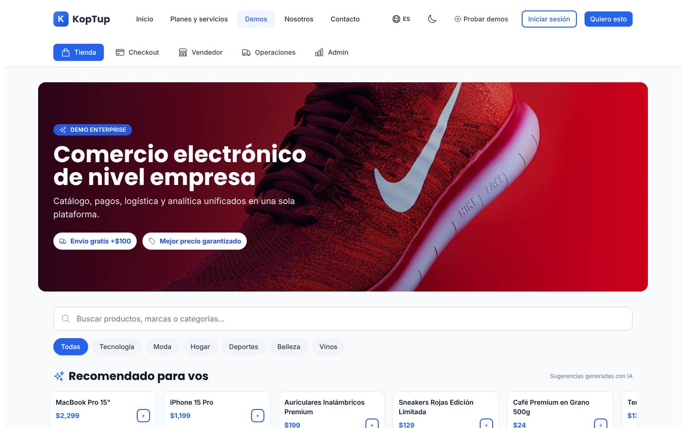
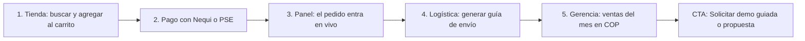

# Tienda en línea (e-commerce)

> Comercio (`commerce`) · Demo: `/demo/ecommerce` · Modo de acceso recomendado: `publico` (versión con productos y marca del prospecto por `solicitud`) · Prioridad: **P2** · Esfuerzo total: **XL** (≈ 5 semanas de 1 dev senior para dejar demo y landing vendibles; el producto real se estima aparte)

*Captura actual de `/demo/ecommerce` (vista Tienda). Ver también [Sistema de demos](04-Sistema-de-Demos.md), [Catálogo de productos](08-Catalogo-de-Productos.md) y [Roadmap](12-Roadmap.md). Productos relacionados: [Facturación electrónica](Producto-facturacion-electronica.md), [POS retail](Producto-pos-retail.md), [Programa de fidelización](Producto-loyalty-fidelizacion.md) y [WMS / logística](Producto-wms-logistica.md).*

> **Contexto de posicionamiento:** con el reposicionamiento de Koptup en sistemas RAG (ver [Visión de producto](02-Vision-de-Producto.md)), este producto queda dentro de **"Otras soluciones a medida"**. Su trabajo no debe frenar el funnel RAG; se ejecuta en la Fase 2 junto con las demás demos secundarias.

---

## Resumen

**Problema:** muchas marcas y distribuidoras colombianas venden por WhatsApp, Instagram o una tienda de plantilla que no habla con su inventario ni con su facturación. Los pedidos se digitan a mano en el ERP, el stock en línea no coincide con el de bodega, la factura electrónica se emite aparte y los pagos de PSE, Nequi o contraentrega se concilian en Excel.

**Para quién (cliente ideal en Colombia/LATAM):**
- Marcas de moda, calzado y cosmética con 2–20 tiendas físicas que quieren un solo inventario para la tienda física y la tienda en línea.
- Distribuidoras y mayoristas que necesitan un portal B2B con lista de precios por cliente, pedido mínimo y cupo de crédito.
- Droguerías, tiendas de café, mascotas o ferretería con catálogos de más de 1.000 referencias.
- Empresas que ya superaron Shopify, WooCommerce o Tiendanube y pagan apps y desarrollos sueltos para integrarse con su ERP.

**Para quién no:** un emprendimiento con menos de 100 pedidos al mes. Le conviene una plataforma de plantilla, y decirlo en la landing genera confianza.

**Propuesta de valor:** "Tu tienda en línea conectada con tu inventario, tu facturación electrónica y los medios de pago que usan tus clientes (PSE, Nequi, Daviplata, tarjetas y contraentrega). El código es tuyo y no pagas comisión por venta a la plataforma."

---

## Estado actual

| Aspecto | Estado | Evidencia |
|---|---|---|
| Demo | Existe. **Maqueta** 100 % en el navegador. No hay `fetch`, `axios` ni llamadas a `/api` | `apps/web/src/app/demo/ecommerce/page.tsx` (`'use client'`) y `components/` |
| Pantallas | Selector de 5 vistas: **Tienda** (hero, búsqueda con sugerencias, filtros por categoría, recomendados, vista rápida, vistos recientemente), **Checkout** (4 pasos: carrito, dirección, pago, confirmación), **Vendedor** (KPIs, pedidos en vivo, top productos, stock bajo, reglas de precio, modal "Crear producto"), **Operaciones** (bodegas, picking por olas, transportadoras, seguimiento de envíos, devoluciones) y **Admin** (KPIs, gráfico de 30 días, dona de categorías, "AI Insights", campañas, fraude, cumplimiento) | `StorefrontView.tsx`, `CheckoutView.tsx`, `VendorView.tsx`, `OperationsView.tsx`, `AdminView.tsx` |
| Ruta heredada | `/demo/ecommerce/admin`: panel antiguo con pestañas Dashboard, Products, Orders y Customers. No está enlazado desde la demo | `admin/page.tsx` (1.012 líneas) |
| Estado compartido | `CartProvider` comparte carrito y vista activa entre Tienda y Checkout. Vendedor, Operaciones y Admin no leen ese estado | `components/shared.tsx` |
| Datos | 24 productos fijos en **USD**, con marcas de terceros y fotos de Unsplash reutilizadas en ciclo. Pedidos, envíos y devoluciones con fechas fijas de mayo de 2026 | `components/products.ts`, constantes `MOCK_ORDERS`, `SHIPMENTS`, `RETURNS` |
| Backend | No existe módulo de e-commerce. Relacionados, en memoria y **no montados**: `apps/backend/src/modules/e-invoicing/` y `modules/pos/` | `apps/backend/src/index.ts` |
| i18n ES/EN | `apps/web/messages/demos/ecommerce.{es,en}.json` (256 líneas c/u). El namespace `demoEcommerce2` está en uso; `demoEcommercePro` (~4 KB) no lo usa ningún componente. La ruta heredada usa `demoEcommerce` y `adminPanel` y escribe sus datos en inglés directamente en el código | `grep demoEcommercePro` solo aparece en los JSON |
| Tests | **No tiene** carpeta `__tests__` (loyalty y delivery sí tienen smoke test) | |
| Tamaño | 2.789 líneas: 1.777 de la demo actual (page 94, layout 22 y 7 componentes) y 1.012 de la ruta heredada | `wc -l` |
| SEO | Metadata `demo-ecommerce` en `apps/web/src/lib/seo-config.ts` ("Plataforma E-commerce Completa… Demo funcional") y breadcrumb JSON-LD en `layout.tsx` | |
| CTA | Solo el `DemoCTA` genérico del layout de `/demo`: título sin producto, "Solicitar Cotización" → `/contact` sin producto preseleccionado y "Ver Planes y Precios" → `/pricing`, que solo redirige | `apps/web/src/app/demo/layout.tsx`, `apps/web/src/components/demo/DemoCTA.tsx` |
| Catálogo | Mapeo correcto: offering `ecommerce` → demo `ecommerce` | `services-catalog.ts` |

**Lo que hace bien:** es la demo de catálogo más completa visualmente. El carrito funciona de verdad (agregar, cantidades, quitar), hay cupones (`KOP10`/`KOP20`), stepper de checkout, métodos de pago latinoamericanos listados (PSE, Nequi, Daviplata, Wompi, Addi), número de pedido y CUFE simulado, pedidos que avanzan de estado en Vendedor, reglas de precio con interruptores, bodegas en Bogotá, Medellín y Cali y transportadoras nacionales. Es responsive y el botón flotante "Ir al checkout" con contador está bien resuelto.

### Problemas detectados (con ruta)

1. **Moneda e impuestos de EE. UU.:** `formatPrice` (`components/shared.tsx`) formatea con `en-US`/`USD`; `calcTotals` cobra "Impuestos (8%)" y $12 de envío por debajo de $100. Para un cliente colombiano: COP, IVA incluido en el precio al consumidor (19 % general) y envío gratis desde un monto en pesos.
2. **Marcas de terceros:** el hero (`HERO_PHOTO_ID`) muestra una zapatilla con el logo visible de una marca deportiva, y hay productos llamados "MacBook Pro 15"", "iPhone 15 Pro", "iPad Air" y "Zapatillas Runner Adidas" (`productNames` en el JSON). Es un riesgo de marca y distrae al prospecto.
3. **Fotos que no corresponden al producto:** `pid(i)` recicla 15 fotos. "Mat de Yoga" muestra las zapatillas rojas, "Lámpara LED" y "Set Skincare" muestran un reloj, "Perfume" muestra gafas de sol y "Set de Cocina" una botella de vino. La galería del modal (`ProductModal`, arreglo `thumbs`) muestra siempre audífonos, reloj y gafas, sin importar el producto.
4. **Afirmaciones que Koptup no puede sostener:** `AdminView` muestra "✓ PCI DSS, GDPR, DIAN, Habeas Data CO, ISO 27001" con el texto "Cumplimos con los estándares locales e internacionales", y "IA monitoreando en tiempo real" en fraude. El hero dice "Mejor precio garantizado". "Sugerencias generadas con IA" son solo los productos con insignia `bestseller`.
5. **Checkout que no se deja usar:** los campos de tarjeta tienen `value=""` y `onChange={() => {}}`, así que no se puede escribir en ellos. "Continuar" avanza sin validar la dirección, el bloque de mapa dice literalmente "Mapa de entrega (mock)" y "Confirmar pago" muestra "¡Pago confirmado!" sin simular la pasarela. Si el visitante no escribe correo, la confirmación muestra uno de ejemplo con nombre propio.
6. **Vistas desconectadas:** el pedido confirmado no aparece en "Pedidos en vivo" del Vendedor, "Guardar producto" cierra el modal sin crear nada, las reglas de precio no afectan el carrito y Operaciones y Admin son estáticos. Botones sin acción: "Comparar" en la tarjeta de producto (`onClick={() => {}}`) y "Abrir portal RMA".
7. **Números inconsistentes:** "Ventas hoy" suma pedidos de dos días distintos. Las tendencias (+12.4 %, +3.1 %, +0.4 pts), la conversión de 3.7 % y el "open rate" (`32 + idx * 4`) están escritos a mano. Los KPIs de Admin (revenue 384.720 USD, 12.480 clientes) no tienen relación con los de Vendedor.
8. **Spanglish y voseo:** "Checkout", "AOV", "Revenue", "GMV", "LTV", "CAC", "AI Insights", "Open rate", "Win-back", "Wave 1 (express)", "RMA" e insignias "NEW/TOP/ECO". Voseo en "Recomendado para vos", "Gestioná", "Arrastrá", "Volvé", "Elegí", "Pagá" y "Recuperá".
9. **Transportadoras internacionales con tarifa en USD** (FedEx $18.50, DHL $22.00) mezcladas con Servientrega, Coordinadora, Interrapidísimo y TCC (`CARRIERS` en `OperationsView.tsx`).
10. **Ruta heredada confusa:** `/demo/ecommerce/admin` duplica la vista Admin con datos en inglés ("John Doe", "Laptop Pro 15"") y USD, y muestra un banner para "configurar un código de administrador" que no tiene sentido en una maqueta sin datos reales.
11. **Textos del catálogo** (`apps/web/messages/offerings/ecommerce.es.json`): voseo ("Vendé", "Comprala", "usá"). El plan Básico ofrece "Pasarela Stripe o Wompi", pero Stripe no abre cuentas a empresas constituidas en Colombia (exige una entidad en un país soportado). `costoNote` cita "~2,9 % + $0,30 por transacción", que es la tarifa de Stripe en EE. UU. y no la de Wompi o PayU. Además, el Básico se dirige a "Emprendimientos y pymes que recién arrancan online" con un setup de $56 M (ver [Planes y precios](#planes-y-precios)).

---

## Qué falta para que sea vendible

- **Moneda y reglas locales:** COP, IVA incluido, envío en pesos, departamentos y ciudades colombianas (DIVIPOLA) y documento CC/NIT en el checkout.
- **Catálogo limpio por sector:** sin marcas de terceros, con fotos que correspondan y datasets por sector.
- **Un pedido que viaje por todas las vistas:** Tienda → Pago → Panel de la tienda → Logística → Gerencia. Hoy es lo que más falta para contar la historia.
- **Quitar lo que no se puede probar:** certificaciones, "IA en tiempo real" y "mejor precio garantizado".
- **Mostrar lo que diferencia a Koptup en Colombia:** PSE, Nequi, Daviplata y contraentrega; factura electrónica DIAN (con [Facturación electrónica](Producto-facturacion-electronica.md)); integración con Siigo/Alegra o el ERP del cliente; transportadoras nacionales; derecho de retracto y reversión del pago (Ley 1480 de 2011).
- **Posicionamiento honesto frente a plataformas de plantilla** (Shopify, WooCommerce, Tiendanube, VTEX): cuándo conviene una tienda a medida y cuándo no.
- **Recorrido guiado** de 5 pasos y etiqueta "Incluido desde plan X" en cada vista.
- **CTA contextual** "Solicitar demo de Tienda en línea" con el producto preseleccionado.
- **Capturas y video** de 60–90 s.
- **Precio coherente con el cliente ideal** (ver [Planes y precios](#planes-y-precios)).

---

## Plan detallado

### Landing `/productos/ecommerce`

Sigue la estructura común de [Landing de producto](Seccion-Landing-de-Producto.md):

1. **Hero:** "Tu tienda en línea conectada con tu inventario y tu facturación electrónica". Subtítulo: "Pagos con PSE, Nequi, Daviplata y tarjetas, envíos con transportadoras nacionales y factura DIAN automática. El código es tuyo y no pagas comisión por venta." CTA principal **"Solicitar demo"**, secundario "Agendar llamada" y enlace "Probar la demo interactiva" (`/demo/ecommerce`).
2. **¿Es para ti?** Dos columnas. *Sí, si…* tienes más de 300 referencias, varias bodegas o tiendas, precios B2B, un ERP que debe recibir los pedidos o más de 300 pedidos al mes. *Todavía no, si…* estás empezando: te recomendamos una plataforma de plantilla y te ayudamos a migrar cuando crezcas.
3. **Problemas que resuelve** (3 tarjetas): stock en línea que no coincide con la bodega; pedidos y facturas digitados a mano; pagos que no se concilian.
4. **Cómo funciona** (4 pasos): el catálogo y el inventario salen de tu ERP → el cliente paga con su medio preferido → se generan la factura electrónica y la guía de envío → ves ventas, recompras y carritos recuperados en un tablero.
5. **Capturas** (Tienda, Pago, Panel de la tienda, Logística, Gerencia) y **video de 60–90 s** con locución en español y subtítulos.
6. **Módulos y plan en el que se incluyen** (tabla Básico / Profesional / Avanzado / Enterprise).
7. **Integraciones:** Wompi, PayU, Mercado Pago o ePayco (tarjetas, PSE, Nequi, Daviplata); Addi (compra ahora, paga después); contraentrega; Siigo, Alegra o el ERP propio; proveedor tecnológico de factura electrónica DIAN; Servientrega, Coordinadora, Interrapidísimo, TCC o un agregador de envíos; WhatsApp Business; Google Merchant Center y catálogo de Meta; Mercado Libre (plan Profesional).
8. **Planes y precios:** "Compra / a medida" en COP (y USD de referencia con `TRM_REFERENCIA = 3.300`, como el resto de "Otras soluciones a medida"); SaaS como **"Lista de espera"** (DECISIÓN 7). Incluir el costo total a 12 meses.
9. **Preguntas frecuentes:** ¿Por qué no Shopify? · ¿El código es mío? · ¿Cobran comisión por venta? (No; solo la pasarela cobra la suya) · ¿Cómo se emite la factura electrónica? · ¿Cumple el derecho de retracto, la reversión del pago (Ley 1480) y la Ley 1581? · ¿Puedo migrar mi catálogo desde Excel, Shopify o WooCommerce? · ¿Cuánto tarda? (2–5 semanas en Básico) · ¿Quién paga el hosting?
10. **CTA final** con el formulario "Solicitar demo" con `ecommerce` preseleccionado.

### Demo interactiva (mejoras por pantalla/módulo)

| Pantalla / componente | Agregar | Quitar / corregir | Datos de ejemplo |
|---|---|---|---|
| Selector de vistas (`page.tsx`, `VIEWS`) | Barra superior con el nombre de la tienda del prospecto, aviso "Datos de ejemplo" y botón "Iniciar recorrido". Leer `?view=` en la URL para enlazar cada vista desde la landing | Renombrar: Tienda → "Tienda (tu cliente)", Checkout → "Pago", Vendedor → "Panel de la tienda", Operaciones → "Logística", Admin → "Gerencia" | — |
| Estado global (`components/shared.tsx`) | Ampliar `CartProvider` a un `StoreProvider` con productos, pedidos y reglas de precio, para que el pedido confirmado y el producto creado aparezcan en las demás vistas | `formatPrice` en USD → formateador COP (`es-CO`); `calcTotals` con IVA incluido y envío gratis desde $150.000; prefijo de pedido configurable (hoy `KOP-`) | Envío $9.900 (gratis desde $150.000) |
| Tienda (`StorefrontView.tsx`) | Fotos propias o libres de marca, una por producto y galería propia en `ProductModal`; stock por ciudad ("Disponible en Bogotá"); botón "Comparar" funcional o retirarlo | Hero con logo de terceros; productos con marcas registradas; "Mejor precio garantizado"; "Recomendado para vos" → "Recomendado para ti"; "Sugerencias generadas con IA" → "Basado en lo que viste" (usando `recentlyViewed`); insignias NEW/TOP/ECO → Nuevo / Más vendido / Eco | Preset "Mercado y gourmet": café de origen Huila 500 g $38.900, chocolate de mesa 70 % $14.900, panela orgánica 1 kg $8.900, prensa francesa $89.900 |
| Pago (`CheckoutView.tsx`) | Campos de tarjeta editables (estado local); validación de nombre, celular y dirección; selector de departamento y ciudad; "Tipo de documento" CC/NIT y casilla "Requiero factura a nombre de empresa"; métodos Contraentrega y Bancolombia; pantalla intermedia "Redirigiendo a la pasarela (simulado)"; confirmación con "Factura electrónica (simulada)", enlace a la representación gráfica de ejemplo y vista previa del WhatsApp de confirmación | "Mapa de entrega (mock)"; correo de ejemplo con nombre propio; emojis como logos de pago (usar logos según la guía de cada marca o solo texto); "Impuestos (8%)"; código postal como obligatorio | Cupón `BIENVENIDA10`; dirección "Calle 85 # 15-32, Bogotá" |
| Panel de la tienda (`VendorView.tsx`) | El pedido recién pagado entra arriba con indicador "Nuevo"; "Guardar producto" lo agrega a la Tienda; las reglas de precio activas se aplican en el carrito (p. ej. 10 % sobre $300.000); KPIs calculados del día | Deltas, conversión y "En vivo" escritos a mano; "AOV" → "Ticket promedio"; fechas de mayo de 2026 → relativas ("hace 12 min") | 8 pedidos de clientes ficticios en Bogotá, Medellín, Cali, Barranquilla y Bucaramanga |
| Logística (`OperationsView.tsx`) | Acción "Generar guía" (simulada) para el pedido del recorrido, con número de guía y seguimiento; devoluciones etiquetadas "Retracto (Ley 1480)", "Garantía" o "Cambio de talla"; "Abrir portal RMA" → modal de solicitud de devolución | FedEx y DHL; tarifas en USD; "Wave" → "Ola"; "RMA" → "Devoluciones" | Coordinadora $11.500, Servientrega $12.900, Interrapidísimo $9.800 (tarifas ilustrativas) |
| Gerencia (`AdminView.tsx`) | Ventas por canal (web, WhatsApp, tienda física) y por ciudad; embudo visita → carrito → pago; carritos abandonados recuperados; recomendaciones basadas en los datos del dataset | Insignias de certificación con "✓"; "IA monitoreando en tiempo real"; Revenue/GMV/LTV/CAC → Ventas, Valor bruto, Valor de vida del cliente, Costo de adquisición; tasas de apertura calculadas con fórmula fija | Ventas del mes $186 M COP; 2.140 pedidos; ticket promedio $86.900; 18 % de carritos recuperados |
| Ruta heredada (`admin/page.tsx`) | Redirigir `/demo/ecommerce/admin` a `/demo/ecommerce?view=admin` | Eliminar el archivo y los namespaces `demoEcommerce` y `demoEcommercePro` si no tienen otro uso | — |
| Global | Banner "Solicita tu demo guiada" (modo `publico`); badge "Incluido desde: Básico / Profesional / Avanzado" en cada vista; CTA final contextual con `ecommerce` | `DemoCTA` genérico | — |

**Recorrido guiado (5 pasos, menos de 3 minutos):**

1. **Tienda:** buscar "café", abrir la vista rápida y agregar "Café de origen Huila 500 g" y una prensa francesa. Aplicar el cupón `BIENVENIDA10`.
2. **Pago:** ver el IVA incluido y el envío gratis por pasar de $150.000, pagar con Nequi (simulado) y recibir el pedido `#TDA-1042`, la factura electrónica simulada y el WhatsApp de confirmación.
3. **Panel de la tienda:** el pedido aparece arriba como "Nuevo"; pasarlo a "Preparando". Crear un producto y verlo publicado en la Tienda.
4. **Logística:** generar la guía con una transportadora nacional y ver el seguimiento "En tránsito hacia Bogotá".
5. **Gerencia:** ver $186 M COP de ventas del mes, 18 % de carritos recuperados y la recomendación "Reponer café: quedan 9 días de inventario". Cierre con CTA "Solicitar demo guiada" / "Solicitar propuesta".

### Acceso y solicitud de demo

- **Modo recomendado: `publico`.** "Tienda online Colombia" y "plataforma ecommerce" son búsquedas de alto volumen (ya están en `seo-config.ts`), la demo corre completa en el navegador sin costo de IA ni datos reales y es la más vistosa del catálogo: funciona como imán de leads. Muestra el banner "Solicita tu demo guiada" (DECISIÓN 1).
- **Qué ve el visitante sin solicitar:** la landing con capturas y video de 60–90 s, y la demo interactiva completa con el preset por defecto y el recorrido guiado.
- **Qué obtiene al solicitar** (flujo de [Sistema de demos](04-Sistema-de-Demos.md)): una sesión guiada de 30 min y una **versión con su marca y hasta 30 de sus productos** (carga de CSV desde el admin), mediante un `DemoGrant` de **14 días**, extensible 7 días más.
- **Prospecto aprobado** (Portal › Mis demos, ver [Portal del cliente](06-Portal-del-Cliente.md)): tarjeta "Tienda en línea — personalizada para <Empresa>", días restantes y botones "Abrir demo", "Agendar llamada" y "Solicitar propuesta".
- **Eventos `DemoEvent`:** abrió la demo, cambio de vista, pasos del tour completados, pedido simulado completado, producto creado, tiempo en la demo y clic en cada CTA.

### Personalización por cliente

Sin código, desde **Admin › Solicitudes de demo › Aprobar** (o Admin › Demos › Personalizar). Se guarda en el `DemoGrant` (campo `personalizacion`). Ver [Panel de administración](05-Panel-de-Administracion.md).

| Campo | Efecto en la demo |
|---|---|
| Logo (subida) y color primario | Encabezado de la tienda, botones, hero y correo/WhatsApp de confirmación |
| Nombre de la tienda y prefijo de pedido | "Tienda <Empresa>", pedidos `#<PREFIJO>-1042` |
| Sector (preset) | Carga el dataset: Moda y calzado, Droguería y cuidado personal, Mercado y gourmet, Tecnología y hogar, Ferretería y B2B (con precios por volumen) |
| Productos propios (CSV de hasta 30 filas: nombre, precio, categoría, URL de imagen) | Reemplazan los productos del preset en Tienda, Panel y Gerencia |
| Ciudades de bodega | Bodegas y stock por ciudad en Tienda y Logística |
| Medios de pago y transportadoras visibles | Opciones del paso Pago y de Logística |
| Moneda (COP/USD) e idioma (es/en) | Formato de precios y textos |

**Implementación:** mover `PRODUCTS` de `components/products.ts` a `fixtures/<sector>.ts`. La página lee la configuración de la respuesta de `GET /api/demo-access/ecommerce` (DECISIÓN 3) y en modo público usa el preset por defecto. Las imágenes subidas van a almacenamiento de objetos (no al disco del servidor). El CSV se valida y sanea en el servidor antes de guardarlo. Los nombres ficticios de tiendas y productos se verifican para no coincidir con marcas registradas.

### Producto real

**Alcance MVP — modalidad compra (Básico/Profesional, 5–9 semanas):**
- Catálogo con variantes (talla, color), inventario por bodega, importación desde Excel/CSV y desde el ERP.
- Checkout con pasarela colombiana (Wompi, PayU, Mercado Pago o ePayco: tarjetas, PSE, Nequi, Daviplata), contraentrega y Addi. Los datos de tarjeta se capturan en los campos o el checkout alojado de la pasarela; la tienda no los almacena (esto reduce el alcance PCI DSS).
- IVA según el producto (19 % general, 5 % o excluido en algunos), cupones y reglas de precio, precios B2B por cliente (Profesional).
- Factura electrónica DIAN emitida por un proveedor tecnológico autorizado (Siigo, Alegra o el módulo de [Facturación electrónica](Producto-facturacion-electronica.md)), con NIT o cédula del comprador.
- Envíos: tarifas por ciudad, generación de guías con transportadoras nacionales o un agregador, y seguimiento por correo y WhatsApp.
- Cuentas de cliente, historial de pedidos, devoluciones con **derecho de retracto y reversión del pago** (Ley 1480 de 2011), PQR y términos y condiciones.
- Correos automáticos: confirmación, envío, carrito abandonado (Profesional) y solicitud de reseña.
- Panel de la tienda: pedidos, productos, inventario, clientes, reportes de ventas.
- Feeds para Google Merchant Center y catálogo de Meta; Mercado Libre en Profesional.
- Autorización de tratamiento de datos (Ley 1581) en registro y checkout, autenticación y autorización en servidor, auditoría de cambios de precio.
- **Decisión de arquitectura recomendada:** construir sobre un motor de comercio *headless* de código abierto con licencia permisiva (p. ej. Medusa o Saleor) en vez de desde cero, y usar la UI de esta demo (`StorefrontView`, `CheckoutView`) como base del frente en Next.js. El código sigue siendo del cliente y el MVP baja varias semanas.

**SaaS (DECISIÓN 7):** no hay base multi-tenant ni cobro recurrente, así que se muestra **"SaaS: lista de espera"**. Además, competir como SaaS genérico contra Shopify, Tiendanube o VTEX no es recomendable. Si en la Fase 5 hay al menos 3 clientes en modalidad compra, evaluar un SaaS vertical ("Portal B2B para distribuidoras integrado con Siigo/Alegra") sobre el core multi-tenant de la Fase 4: dominios propios con SSL por cliente, temas, cobro recurrente con Wompi/PayU (COP) y Stripe (USD), copias de seguridad por cliente y acuerdo de encargo de tratamiento de datos.

**Paquete sugerido:** "Suite retail" = Tienda en línea + [POS retail](Producto-pos-retail.md) + [Programa de fidelización](Producto-loyalty-fidelizacion.md) + [Facturación electrónica](Producto-facturacion-electronica.md), con inventario y clientes compartidos.

### Planes y precios

Precios actuales del catálogo (`apps/web/src/lib/services-catalog.ts`, entrada `ecommerce`; COP):

| Plan | Compra: setup | Compra: mantenimiento/mes | SaaS: setup | SaaS: mes | Volumen incluido | Usuarios admin / compradores | Almacenamiento | Implementación | Costos del cliente al proveedor (USD/mes) |
|---|---|---|---|---|---|---|---|---|---|
| Básico | $56.000.000 | $5.100.000 | $2.900.000 | $1.890.000 | 1.000 órdenes/mes | 3 / 5.000 | 10 GB | 2–5 semanas | 80–250 (hosting, DB, email, comisiones de pasarela) |
| Profesional | $144.000.000 | $12.800.000 | $6.900.000 | $4.590.000 | 10.000 órdenes/mes | 15 / 50.000 | 80 GB | 5–9 semanas | 400–1.200 (+ DB administrada, email Pro, Algolia) |
| Avanzado | $336.000.000 | $28.800.000 | $12.900.000 | $8.790.000 | 75.000 órdenes/mes (5 cuentas) | 40 / 250.000 | 400 GB | 9–14 semanas | 1.500–5.000 (+ multirregión, optimización de imágenes, antifraude) |
| Enterprise | $720.000.000 | $56.000.000 | $0 (se muestra "Personalizado") | $15.790.000 | 250.000+ órdenes/mes | Ilimitado | Ilimitado | 12–20 semanas | 5.000–18.000 (+ clúster de DB, PCI DSS) |

Horas de evolutivos incluidas por mes: 5 / 12 / 25 / 50. Soporte: correo 24 h hábiles / correo + WhatsApp 4 h / + Slack Connect 2 h / tickets con SLA 1 h. USD de referencia (TRM 3.300): setup Básico ≈ USD 16.970.

**Recomendaciones de claridad:**
1. **Cliente ideal del Básico:** un setup de $56 M para "emprendimientos que recién arrancan" está fuera de mercado. Cambiar `idealPara` a "Marcas y distribuidoras con más de 300 pedidos al mes que necesitan conectar la tienda con su inventario y su facturación". Decisión opcional del dueño: ofrecer aparte un paquete "Implementación sobre Shopify o WooCommerce" para quien todavía no necesita una tienda a medida.
2. **Pasarelas:** reemplazar "Pasarela Stripe o Wompi" por "Wompi, PayU, Mercado Pago o ePayco: tarjetas, PSE, Nequi y Daviplata" y dejar Stripe solo para ventas en USD con entidad en el exterior. Corregir `costoNote`: "Las comisiones de la pasarela (según su tarifa vigente en COP), el hosting y el correo transaccional los paga el cliente directamente al proveedor".
3. **Mantenimiento de compra incoherente:** 12 × $5,1 M = $61,2 M al año (109 % del setup Básico), y es 2,7 veces la cuota SaaS ($1,89 M), que además incluye hosting. Mismo problema en todos los planes y en todo el catálogo; decisión común en [Catálogo de productos](08-Catalogo-de-Productos.md) (porcentaje anual del setup o bolsa de horas, y qué incluye).
4. **SaaS → "Lista de espera"** hasta la Fase 4 (y ver la nota anterior sobre SaaS vertical).
5. **Enterprise SaaS setup:** mostrar "Incluido" o "A convenir" en vez de "Personalizado" (hoy sale de `formatCOP(0)`).
6. **Volumen en lenguaje de cliente:** "5.000 usuarios finales" → "hasta 5.000 cuentas de compradores registradas"; "1 cuenta" → "1 tienda (1 dominio)".
7. **Bullets por plan sin jerga:** **Básico** "Hasta 1.000 pedidos al mes · Catálogo con tallas y colores · PSE, Nequi, Daviplata y tarjetas · Factura electrónica conectada · Guías con transportadoras nacionales". **Profesional** "+ Varias pasarelas y contraentrega · Seguimiento automático de envíos · Correos de carrito abandonado · Integración con Siigo o Mercado Libre · Tablero de ventas". **Avanzado** "+ Buscador avanzado con filtros · Antifraude · Varias bodegas · Ventas B2B y B2C en la misma tienda · Segmentos de clientes". **Enterprise** "+ Varios países y monedas · Catálogos B2B privados · Intercambio electrónico con proveedores (EDI) · Gerente de proyecto dedicado".
8. **Tuteo** en vez de voseo en `ecommerce.es.json` ("Vende en línea…", "Cómprala…", "usa la suscripción…").
9. Mostrar en la landing el **costo total a 12 meses** de Básico y Profesional (setup + mantenimiento + costos estimados del proveedor).

Detalle de la política comercial común en [Catálogo de productos](08-Catalogo-de-Productos.md) y [Comercial, marketing y legal](11-Comercial-Marketing-y-Legal.md).

---

## Tareas

| # | Tarea | Fase | Prioridad | Esfuerzo | Criterio de aceptación |
|---|---|---|---|---|---|
| 1 | Quitar de la demo las afirmaciones no verificables (certificaciones con "✓", "IA monitoreando en tiempo real", "Mejor precio garantizado", "Sugerencias generadas con IA") y el hero y los productos con marcas registradas | Fase 1 — Funnel y solicitud de demos | P1 | S | Ninguna marca de terceros ni certificación visible en `/demo/ecommerce`; revisión hecha sobre las 5 vistas |
| 2 | Reescribir `ecommerce.{es,en}.json` del catálogo: tuteo, `idealPara` del Básico, pasarelas colombianas, `costoNote` corregido | Fase 1 — Funnel y solicitud de demos | P1 | S | Sin voseo; ningún bullet ofrece Stripe como pasarela por defecto; `costoNote` sin tarifas de EE. UU. |
| 3 | Eliminar la ruta heredada `admin/page.tsx` (redirección a `?view=admin`) y los namespaces `demoEcommerce`/`demoEcommercePro` sin uso | Fase 1 — Funnel y solicitud de demos | P2 | S | `/demo/ecommerce/admin` redirige; el bundle de i18n del demo baja ≥ 4 KB; el build pasa |
| 4 | Landing `/productos/ecommerce` con las 10 secciones de este plan | Fase 1 — Funnel y solicitud de demos | P2 | M | Página publicada; CTA "Solicitar demo" abre el formulario con `ecommerce` preseleccionado; SEO Lighthouse ≥ 90 |
| 5 | Registrar `DemoCatalogItem` `ecommerce` (`publico`, 14 días, video, capturas), banner, CTA contextual y eventos `DemoEvent` | Fase 1 — Funnel y solicitud de demos | P2 | S | El admin cambia el modo sin desplegar; cada clic en CTA y cada pedido simulado registran un evento con `demoSlug=ecommerce` |
| 6 | Formateador COP, IVA incluido, envío en pesos y datasets por sector en `fixtures/` con fotos que correspondan a cada producto | Fase 2 — Demos vendibles | P1 | M | 5 presets; ningún precio en USD en modo COP; cada producto con su propia foto y galería |
| 7 | Checkout local: campos editables y validados, departamento/ciudad, CC/NIT, contraentrega, pantalla de pasarela simulada y confirmación con factura y WhatsApp simulados | Fase 2 — Demos vendibles | P1 | M | Se puede escribir en todos los campos; no avanza con dirección vacía; la confirmación muestra el método elegido y el total con IVA |
| 8 | `StoreProvider` compartido: el pedido pagado aparece en Panel, Logística y Gerencia; el producto creado aparece en la Tienda; las reglas de precio afectan el carrito | Fase 2 — Demos vendibles | P1 | M | Recorrer las 5 vistas muestra el mismo pedido `#TDA-…` con el mismo total |
| 9 | Eliminar botones sin acción ("Comparar", "Abrir portal RMA") y números escritos a mano (tendencias, conversión, open rate); fechas relativas | Fase 2 — Demos vendibles | P2 | S | Checklist por vista con 0 botones sin acción; KPIs calculados desde el dataset |
| 10 | Traducir la jerga (Checkout, AOV, GMV, LTV, CAC, Wave, RMA, NEW/TOP/ECO) y quitar el voseo del demo | Fase 2 — Demos vendibles | P2 | S | `ecommerce.es.json` del demo sin voseo ni siglas en inglés visibles |
| 11 | Recorrido guiado de 5 pasos y badges "Incluido desde plan X" | Fase 2 — Demos vendibles | P1 | M | Tour completable en < 3 min; el plan mínimo de cada vista coincide con `offering_ecommerce.tiers` |
| 12 | Personalización desde el `DemoGrant`: logo, color, nombre, prefijo de pedido, sector y CSV de hasta 30 productos con imágenes en almacenamiento de objetos | Fase 2 — Demos vendibles | P2 | M | Con grant personalizado el prospecto ve su marca y sus productos; un CSV inválido muestra errores por fila y no se guarda |
| 13 | 5 capturas y video de 60–90 s con locución en español y subtítulos | Fase 2 — Demos vendibles | P2 | S | Archivos en `docs/wiki/images/` y en la landing; video ≤ 90 s |
| 14 | Smoke test del demo en CI y división de `StorefrontView.tsx` (413 líneas) en componentes | Fase 0 — Endurecimiento | P2 | S | `__tests__/page.test.tsx` pasa en CI; ningún componente del demo supera 250 líneas |
| 15 | Plantilla de propuesta de Tienda en línea en el `Quote` ampliado (alcance MVP, integraciones, cronograma, plan, modalidad) | Fase 3 — Propuestas y conversión | P3 | S | El comercial genera la propuesta PDF en < 15 min desde el admin |

---

## Métricas de éxito

- Conversión landing → solicitud de demo ≥ 2 % (búsquedas de alto volumen y menor intención que otros productos).
- ≥ 50 % de los visitantes de la demo pública completan un pedido simulado (medido con `DemoEvent`).
- ≥ 40 % de las solicitudes aprobadas cargan productos propios (CSV) en su demo personalizada.
- Aprobación de solicitudes en < 24 h hábiles.
- ≥ 20 % de las demos guiadas terminan en propuesta enviada en ≤ 14 días.
- 0 marcas de terceros, 0 certificaciones no verificadas y 0 botones sin acción en la demo publicada.
