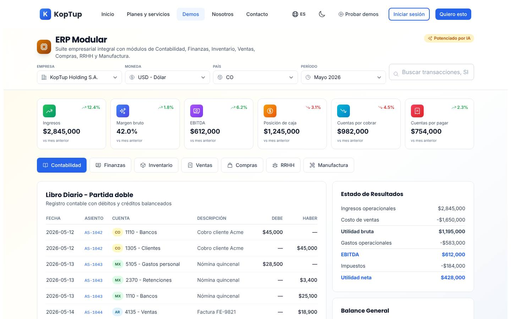
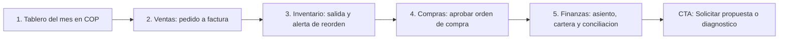

# ERP modular

> Finanzas (`finance`) · Demo: `/demo/erp` · Modo de acceso recomendado: `solicitud` · Prioridad: **P2** · Esfuerzo total: **XL** (≈ 4 semanas de 1 dev senior para dejar landing + demo vendibles; el producto real se estima aparte)

*Captura actual de `/demo/erp` (módulo Contabilidad). Ver también [Sistema de demos](04-Sistema-de-Demos.md), [Catálogo de productos](08-Catalogo-de-Productos.md) y [Roadmap](12-Roadmap.md). Productos relacionados: [Facturación electrónica](Producto-facturacion-electronica.md), [POS retail](Producto-pos-retail.md), [HRMS](Producto-hrms.md), [WMS / logística](Producto-wms-logistica.md) y [BI / dashboard ejecutivo](Producto-bi-dashboard.md).*

---

## Resumen

**Problema:** la PYME colombiana que crece (de 20 a 200 empleados, una o varias bodegas, varias razones sociales) termina con la contabilidad en un software contable, el inventario en Excel, las compras por correo y las aprobaciones por WhatsApp. Nadie ve el margen real ni la cartera vencida al día, y cada cierre de mes es manual.

**Para quién (cliente ideal en Colombia/LATAM):**
- Distribuidoras y comercializadoras con 1–5 bodegas (alimentos, tecnología, ferretería, insumos médicos).
- Manufactura liviana con lista de materiales y órdenes de producción (muebles, confección, alimentos procesados, plásticos).
- Grupos empresariales con 2–10 razones sociales que necesitan consolidar.
- Empresas que ya usan Siigo, Alegra o World Office para contabilidad y necesitan la parte operativa (inventario, compras, aprobaciones, producción) hecha a su medida.

**Propuesta de valor:** "Ventas, inventario, compras, producción y cartera en un solo sistema hecho a la medida de tu operación, conectado a tu contabilidad y a la facturación electrónica DIAN. El código es tuyo." Frente a un ERP de licencia (SAP Business One, Odoo Enterprise, Siigo Nube) la diferencia es el ajuste a procesos propios y la ausencia de costo por usuario.

---

## Estado actual

| Aspecto | Estado | Evidencia |
|---|---|---|
| Demo | Existe. **Maqueta** 100 % en el navegador | `apps/web/src/app/demo/erp/page.tsx` es `'use client'`; no hay `fetch`, `axios` ni llamadas a `/api` en la carpeta |
| Pantallas | Barra superior (Empresa, Moneda, País, Período, búsqueda) + 6 KPIs + 7 módulos en pestañas: Contabilidad, Finanzas, Inventario, Ventas, Compras, RRHH, Manufactura + modal de detalle de transacción | `page.tsx`, `components/AccountingFinance.tsx`, `components/InventorySales.tsx`, `components/PurchasesHrMfg.tsx`, `components/shared.tsx` (`DetailModal`) |
| Datos | Fijos y mezclados: un mismo libro diario con asientos de CO, MX y AR usando cuentas del PUC colombiano; montos pequeños pensados en USD (ingresos 2.845.000); empresas ficticias llamadas "KopTup Holding / KopTup Colombia SAS…" | `AccountingFinance.tsx` (`entries`), `messages/demos/erp.es.json` (`companies`) |
| Backend | Módulo en memoria `apps/backend/src/modules/erp/` (Invoice, Account, cartera por edades; 184 líneas con test) **no montado** en `apps/backend/src/index.ts`; el frontend no lo usa | `erp.service.ts`, `erp.types.ts`, `erp.routes.ts` |
| i18n ES/EN | Textos de UI en `apps/web/messages/demos/erp.{es,en}.json` (229 líneas c/u). Los datos de ejemplo (productos, empleados, proveedores, BOM) están fijos en español dentro de los componentes | `InventorySales.tsx`, `PurchasesHrMfg.tsx` |
| Tests | 1 smoke test (`__tests__/page.test.tsx`, 11 líneas) que hoy no se ejecuta (ver [Seguridad y calidad](10-Seguridad-y-Calidad.md)) | |
| Tamaño | 1.180 líneas (page 240 + 4 componentes 940) | `wc -l` |
| SEO | Metadata `demo-erp` en `apps/web/src/lib/seo-config.ts` + breadcrumb JSON-LD en `layout.tsx` | |
| CTA | Solo el `DemoCTA` genérico del layout de `/demo` ("Solicitar Cotización" → `/contact` sin producto preseleccionado; "Ver Planes y Precios" → `/pricing`, que solo redirige) | `apps/web/src/app/demo/layout.tsx`, `apps/web/src/components/demo/DemoCTA.tsx` |
| Catálogo | Mapeo correcto: offering `erp-modular` → demo `erp` | `services-catalog.ts` |

**Lo que hace bien:** se ve como un ERP de verdad: KPIs claros, partida doble balanceada (débitos = créditos), estado de resultados que cuadra (ingresos − costo − gastos = EBITDA − impuestos = utilidad neta), cartera por edades que suma lo mismo que el KPI, flujo de aprobación de órdenes de compra en 3 niveles, árbol de lista de materiales (BOM) desplegable y modal de detalle. Buena base visual.

### Problemas detectados (con ruta)

1. **Los filtros no filtran:** Empresa, País y Período (`page.tsx`) cambian solo el valor del `<select>`; la búsqueda (`search`) no se usa en ningún lado. Moneda solo cambia la etiqueta: `$2,845,000` en USD pasa a `COP 2,845,000` sin convertir (y con formato `en-US` en `shared.tsx` → `formatMoney`).
2. **Moneda por defecto USD con país CO** y el placeholder de búsqueda se corta en pantalla ("Buscar transacciones, SI…", visible en la captura).
3. **Flechas de KPI engañosas:** el ícono indica "bueno/malo" y no la dirección. "Cuentas por cobrar" sube 4,5 % pero muestra flecha hacia abajo en rojo; "Cuentas por pagar" baja 2,3 % y muestra flecha hacia arriba en verde (`kpis` en `page.tsx`).
4. **Error contable visible:** el inventario ofrece valoración **LIFO** (`InventorySales.tsx`), que no está permitida bajo NIIF (NIC 2) en Colombia; además el botón FIFO/LIFO no recalcula nada.
5. **Contabilidad multi-país incoherente:** asientos de México y Argentina con cuentas del PUC colombiano en el mismo libro; "Balance General" en lugar de "Estado de situación financiera"; "AR Aging / AP Aging" en inglés.
6. **Botones muertos:** "Aprobar / Rechazar" vacaciones y "Cargar factura" (`PurchasesHrMfg.tsx`), sugerencias MRP sin acción, el flujo de aprobación de OC no se puede avanzar. "Andrés López" aparece en vacaciones pero no en la lista de empleados.
7. **Módulos sueltos:** vender no descuenta inventario, la factura no genera asiento, la sugerencia MRP no crea una orden de compra. Justo lo que vende un ERP (la integración) no se ve.
8. **Promete más de lo que se cotiza:** RRHH, Manufactura/MRP, OCR de facturas y conciliación "con IA" no aparecen en los bullets de ningún plan (`apps/web/messages/offerings/erp-modular.es.json`); el hub de demos (`messages/_demos.es.json`) promete "Open Banking", "forecasting de demanda con ML" y "facturación DIAN/SAT/AFIP/SII/SUNAT".
9. **Marca confusa:** las empresas de ejemplo se llaman "KopTup …"; el prospecto no sabe si ve un producto o la contabilidad de Koptup.
10. **Textos del catálogo:** voseo ("Comprala", "pagá", "vos"), descripción de plantilla genérica, el bullet "Reportes mensuales del tier" repetido 2 veces en Avanzado y 3 en Enterprise, y el `costoNote` dice USD 30–8.000/mes mientras el catálogo dice USD 150–35.000.

---

## Qué falta para que sea vendible

- Un **flujo de punta a punta** que se pueda recorrer: cotización → pedido → factura electrónica → salida de inventario → asiento contable → recaudo y conciliación.
- Datos colombianos en COP, de **una sola empresa ficticia** coherente en todos los módulos, con presets por sector.
- Filtros que funcionen (o que no estén) y KPIs que se recalculen.
- Términos contables correctos para un contador colombiano (PUC, NIIF, promedio ponderado/PEPS, "Estado de situación financiera", "Cartera por edades").
- Etiquetas "Incluido desde plan X" en cada módulo y bullets del catálogo que nombren lo que la demo muestra.
- Mensaje honesto de alcance: qué hace Koptup (operación a la medida) y qué se integra (contabilidad en Siigo/Alegra/World Office o contabilidad propia en planes altos).
- Prueba social: no hay casos. Mientras llegan, ofrecer un **diagnóstico de procesos** de 2 horas como paso previo a la propuesta (ver [Comercial, marketing y legal](11-Comercial-Marketing-y-Legal.md)).
- Precio entendible (hoy el mantenimiento mensual de la compra es 2,7 veces la cuota SaaS) y tiempos de implementación realistas para un ERP.
- Capturas y video de 60–90 s para la landing, y CTA contextual "Solicitar demo de ERP".

---

## Plan detallado

### Landing `/productos/erp-modular`

Sigue la estructura común de [Landing de producto](Seccion-Landing-de-Producto.md):

1. **Hero:** "Tu operación completa en un solo sistema, hecho a tu medida". Subtítulo: "Ventas, inventario multi-bodega, compras con aprobaciones, producción y cartera, conectado a tu contabilidad y a la facturación electrónica DIAN." CTA principal **"Solicitar demo"**, secundario "Agendar llamada". Sin enlace a la demo abierta (modo `solicitud`).
2. **Problemas que resuelve** (3 tarjetas): inventario que no cuadra con la contabilidad; compras sin control ni aprobaciones; cierre de mes manual y cartera vencida que nadie ve.
3. **Cómo funciona** (4 pasos): diagnóstico de procesos → configuración de módulos y migración desde Excel/software actual → capacitación y salida en vivo por módulos → acompañamiento mensual.
4. **Módulos** (tarjetas con "Incluido desde"): Ventas y facturación · Inventario multi-bodega · Compras y aprobaciones · Cartera y tesorería · Contabilidad (integrada o propia) · Producción/MRP · Nómina (vía [HRMS](Producto-hrms.md)) · Tableros (vía [BI](Producto-bi-dashboard.md)).
5. **Capturas** (galería de 6: Tablero, Ventas, Inventario, Compras, Finanzas, Manufactura) y **video de 90 s** del flujo de punta a punta.
6. **Integraciones:** facturación electrónica DIAN (vía [Facturación electrónica](Producto-facturacion-electronica.md) y proveedor tecnológico autorizado), Siigo / Alegra / World Office, Wompi o PayU (links de pago y PSE), extractos bancarios (Excel/CSV), WhatsApp Business (envío de facturas y recordatorios de cartera), [POS](Producto-pos-retail.md) y [WMS](Producto-wms-logistica.md).
7. **Planes y precios:** "Compra / a medida" en COP con "desde"; SaaS como **"Lista de espera"** (DECISIÓN 7).
8. **Preguntas frecuentes:** ¿Reemplaza a mi software contable o se integra? · ¿Cumple NIIF y la facturación electrónica DIAN? · ¿Cuánto tarda la implementación? · ¿Cómo migro mis datos desde Excel/Siigo? · ¿El código es mío? · ¿Qué pasa si crezco a otra razón social o a otro país? · ¿Cuánto cuesta mantenerlo?
9. **CTA final** con el formulario "Solicitar demo" con `erp-modular` preseleccionado y campos extra opcionales: número de bodegas, razones sociales, software contable actual.

### Demo interactiva (mejoras por pantalla/módulo)

| Pantalla / componente | Agregar | Quitar / corregir | Datos de ejemplo |
|---|---|---|---|
| Barra superior (`page.tsx`) | Empresa del grupo que **filtra** todos los módulos; Período que recalcula KPIs; Moneda COP por defecto y USD con "TRM de referencia" fija y visible; búsqueda global que salta a SKU, asiento, cliente o empleado | Selector País (dejarlo solo en plan Enterprise como "Multi-país CO/MX/PE/CL"); "KopTup …" como nombre de empresas | Grupo ficticio "Comercial Nevado S.A.S." + "Nevado Logística S.A.S." (verificar en el RUES que no existan) |
| KPIs (`page.tsx`) | Flecha = dirección real; color = bueno/malo (separados); clic en KPI abre el módulo correspondiente | Valores en USD de 6 cifras | Ventas del mes $1.240 M COP, margen bruto 31 %, EBITDA $186 M, caja $412 M, cartera $638 M (de la cual $86 M vencida > 60 días), CxP $455 M |
| Contabilidad (`AccountingModule`) | Libro diario de **una** empresa con PUC; balance de prueba; "Estado de situación financiera"; filtro por centro de costo; asientos que nacen de ventas/compras del recorrido | Mezcla CO/MX/AR en un mismo libro; "Balance General" | Cuentas 1105 Caja, 1110 Bancos, 1305 Clientes, 1435 Mercancías, 2205 Proveedores, 2408 IVA por pagar, 2365 Retención en la fuente, 4135 Comercio al por mayor, 6135 Costo de ventas |
| Finanzas (`FinanceModule`) | Flujo de caja en millones de COP; "Cartera por edades" y "Cuentas por pagar por edades" con detalle por cliente; conciliación con botón "Aceptar sugerencia" que mueve el registro a conciliado; recordatorio de cobro por WhatsApp (simulado) | "AR Aging / AP Aging"; descripciones bancarias en inglés (WIRE, ACH) | Extracto de ejemplo con transferencias, PSE y consignaciones; clientes "Supermercados La Sabana", "Droguería Central" (ficticios) |
| Inventario (`InventoryModule`) | Método **promedio ponderado** (por defecto) y **PEPS** que recalculan el valor; kardex por SKU; traslado entre bodegas; alerta de reorden → "Crear orden de compra" | **LIFO**; productos de tecnología genéricos | 3 bodegas: Bogotá (Fontibón), Medellín (Itagüí), Barranquilla; 12 SKUs del sector elegido |
| Ventas (`SalesModule`) | Mini flujo **Cotización → Pedido → Remisión → Factura**; la factura muestra estado DIAN (simulado) y enlaza a la demo de [Facturación electrónica](Producto-facturacion-electronica.md); nota crédito por devolución | Columna "Estado DIAN/SAT" y clientes de 5 países; "Integración DIAN / SAT en tiempo real" | Facturas con prefijo de resolución (p. ej. `NEV-1001`), IVA 19 % y 5 %, retenciones |
| Compras (`PurchasesModule`) | Botón "Aprobar nivel" que avanza el flujo; recepción de factura del proveedor (XML) y **documento soporte** para proveedores no obligados a facturar; "Cargar factura" con archivo de ejemplo | OCR presentado como función base (mostrarlo como complemento) | Proveedores nacionales (empaques, transporte, materia prima) con NIT ficticio y DV correcto |
| RRHH (`HrModule`) | Badge "vía módulo HRMS"; aprobar/rechazar vacaciones funciona; nómina del mes en COP y estado de transmisión de nómina electrónica (simulado) | Empleados de 4 países; empleado en vacaciones que no está en la lista | 25 empleados, 3 áreas, salarios en COP |
| Manufactura (`ManufacturingModule`) | BOM con costo estándar por componente; OT que consume inventario al avanzar; sugerencia MRP → "Crear OC" que aparece en Compras | Laptop con "CPU M3" (no es manufactura local creíble) | "Mueble de cocina modular" o "Lote de 500 kg de café tostado" según preset |
| Global | Estado compartido entre módulos (un store, p. ej. `useReducer` + context) para que las acciones se reflejen en todos; badge "Incluido desde: Básico / Profesional / Avanzado" en cada pestaña; botón "Iniciar recorrido"; aviso "Datos de ejemplo"; botón "Volver" a la landing; CTA final "Solicitar propuesta" | `DemoCTA` genérico; badge "Potenciado por IA" global (marcar solo las funciones con IA como complemento) | — |

**Recorrido guiado (5 pasos, menos de 4 minutos):**

1. **Tablero:** "Comercial Nevado vendió $1.240 M este mes; tiene $86 M de cartera vencida a más de 60 días".
2. **Ventas:** convertir la cotización de "Supermercados La Sabana" en pedido y factura; la factura queda "Aceptada por la DIAN (simulado)".
3. **Inventario:** el stock de la bodega Bogotá baja; un SKU queda bajo el punto de reorden y aparece la sugerencia de compra.
4. **Compras:** crear la orden de compra desde la sugerencia y aprobarla en 2 niveles (Jefe de compras → Gerencia).
5. **Finanzas:** ver el asiento automático de la venta en el libro diario, el recaudo por PSE conciliado y el estado de resultados actualizado. Cierre con CTA "Solicitar propuesta" / "Agendar diagnóstico".

### Acceso y solicitud de demo

- **Modo recomendado: `solicitud`.** Es el producto de mayor ticket del catálogo (desde $60 M hasta $765 M), la decisión la toman gerencia y contabilidad juntas, y la demo solo convence con datos del sector del prospecto y con alguien que la explique. Una demo abierta con datos genéricos expone errores a contadores y no califica al lead.
- **Duración del acceso:** **21 días** (no 14), porque la evaluación involucra a 2–4 personas (gerente, contador, jefe de bodega); extensible 14 días desde el admin.
- **Qué ve el visitante antes de solicitar:** la landing con 6 capturas, video de 90 s del flujo de punta a punta, tabla de módulos por plan y FAQ. La ruta `/demo/erp` sin acceso redirige a la landing con el botón "Solicitar acceso" y lleva `noindex`.
- **Formulario:** el general de [Sistema de demos](04-Sistema-de-Demos.md) + campos opcionales: número de bodegas, razones sociales, software contable actual, sector.
- **Prospecto aprobado** (Portal › Mis demos, ver [Portal del cliente](06-Portal-del-Cliente.md)): tarjeta "ERP modular — personalizado para <Empresa>", días restantes, botón "Abrir demo", sesión guiada de 60 min ya agendada, botón "Invitar a mi contador" (comparte el acceso dentro del mismo `DemoGrant`, máximo 3 usuarios) y CTA "Solicitar propuesta".
- **Eventos `DemoEvent`:** módulos visitados, pasos del tour completados, acciones (crear OC, aprobar, facturar), tiempo total, invitados agregados, clic en CTA.

### Personalización por cliente

Sin código, desde **Admin › Solicitudes de demo › Aprobar** (o Admin › Demos › Personalizar), guardado en `DemoGrant.personalizacion`. Ver [Panel de administración](05-Panel-de-Administracion.md).

| Campo | Efecto en la demo |
|---|---|
| Logo y color primario | Barra superior, botones, representación gráfica de factura |
| Razón social (y empresas del grupo, hasta 3) | Nombre en el encabezado, selector Empresa y documentos |
| Sector (preset) | Dataset: Distribución y comercialización, Manufactura liviana, Alimentos y bebidas, Insumos médicos, Construcción y ferretería |
| Bodegas y ciudades (hasta 4) | Inventario, traslados y reportes |
| Plan cotizado (Básico / Profesional / Avanzado / Enterprise) | Muestra solo los módulos incluidos; el resto aparece bloqueado con "Disponible en plan X" |
| Software contable actual (Siigo / Alegra / World Office / Ninguno) | Muestra la tarjeta de integración correspondiente en Contabilidad |
| Moneda (COP / USD) e idioma (es / en) | Formato de valores y textos |

**Implementación:** mover los arreglos fijos de los componentes a `apps/web/src/app/demo/erp/fixtures/<sector>.ts`; la página lee la configuración de `GET /api/demo-access/erp` (DECISIÓN 3) y aplica el preset. Las razones sociales ficticias se verifican en el RUES antes de publicarse.

### Producto real

**Alcance MVP — modalidad compra (Profesional, 9–14 semanas reales):**
- **Ventas:** clientes con NIT y DV, listas de precios, cotización → pedido → remisión → factura, notas crédito/débito, cartera por edades y recordatorios.
- **Inventario:** multi-bodega, kardex, promedio ponderado, traslados, ajustes con aprobación, puntos de reorden, lectura de código de barras.
- **Compras:** solicitudes y órdenes de compra con aprobaciones por monto, recepción, factura del proveedor (XML) y documento soporte.
- **Tesorería básica:** recaudos, pagos, importación de extractos (Excel/CSV) y conciliación asistida.
- **Contabilidad:** dos rutas a decidir por cliente: **(a) integrada** (recomendada para Básico/Profesional): los movimientos se envían a Siigo, Alegra o World Office, que llevan PUC, NIIF, impuestos y exógena; **(b) propia** (Avanzado+): PUC, centros de costo, cierres, estados financieros NIIF y consolidación.
- **Producción (Avanzado):** BOM, órdenes de producción, consumo de materiales, costo estándar y MRP básico.
- **Integraciones típicas en Colombia:** facturación electrónica, notas y documento soporte vía [Facturación electrónica](Producto-facturacion-electronica.md) (proveedor tecnológico autorizado), nómina electrónica vía [HRMS](Producto-hrms.md), Wompi o PayU (links de pago, PSE), WhatsApp Business (envío de facturas y cobro), POS y e-commerce (Shopify/WooCommerce).
- **Transversal:** roles y permisos con autorización en servidor, auditoría de cambios, aprobaciones configurables, importación desde Excel, copias de seguridad.
- **Base técnica:** reutilizar tipos de `apps/backend/src/modules/erp/` (Invoice, Account, cartera por edades) como punto de partida, migrados a Mongoose con autenticación, autorización y `tenantId`. **Decisión del dueño:** evaluar construir sobre una base open source de ERP con localización colombiana y vender la personalización, en lugar de escribir contabilidad desde cero; reduce el riesgo y el tiempo de la ruta (b).

**SaaS (DECISIÓN 7):** no hay base multi-tenant ni cobro recurrente → **"SaaS: lista de espera"**. Para habilitarlo (Fase 4, después del core multi-tenant y de la facturación electrónica): aislamiento por empresa y por NIT, configuración de resoluciones y certificados por cliente, cobro recurrente Wompi/PayU (COP) y Stripe (USD), aprovisionamiento automático, medición de transacciones contra el plan, copias por cliente y acuerdo de encargo de tratamiento de datos.

### Planes y precios

Precios actuales del catálogo (`apps/web/src/lib/services-catalog.ts`, entrada `erp-modular`; COP):

| Plan | Compra: setup | Compra: mantenimiento/mes | SaaS: setup | SaaS: mes | Volumen incluido | Usuarios / empresas | Implementación (catálogo) | Costos del cliente al proveedor (USD/mes) |
|---|---|---|---|---|---|---|---|---|
| Básico | $60.000.000 | $5.400.000 | $2.900.000 | $1.990.000 | 1.500 transacciones/mes | 10 / 1 | 2–5 semanas | 150–500 (hosting, DB, DIAN, Wompi) |
| Profesional | $153.000.000 | $13.600.000 | $6.900.000 | $4.890.000 | 30.000 transacciones/mes | 50 / 5 | 5–9 semanas | 600–2.500 (+ bancos, DIAN Pro) |
| Avanzado | $357.000.000 | $30.600.000 | $12.900.000 | $9.290.000 | 250.000 transacciones/mes | 150 / 25 | 9–14 semanas | 2.500–10.000 (+ multi-país, auditoría) |
| Enterprise | $765.000.000 | $59.500.000 | $0 (se muestra "Personalizado") | $16.790.000 | 2,5 M+ transacciones/mes | Ilimitados | 12–20 semanas | 8.000–35.000 (+ SAP/Oracle, SOX/NIIF) |

Almacenamiento: 50 GB / 400 GB / 1,5 TB / ilimitado. Horas de evolutivos incluidas por mes: 5 / 12 / 25 / 50. Soporte: correo 24 h hábiles / + WhatsApp 4 h / + Slack Connect 2 h / tickets con SLA 1 h. Ciclos SaaS: semestral −10 %, anual −20 %.

**Recomendaciones de claridad:**
1. **Mantenimiento incoherente:** 12 × $5,4 M = $64,8 M al año (108 % del setup Básico) y es 2,7 veces la cuota SaaS ($1,99 M), que además incluye hosting. A 3 años, la compra Básica cuesta $254 M y el SaaS $75 M. Decisión del dueño: pasar el mantenimiento a un % anual del setup o a una bolsa de horas, y decir qué incluye (hosting sí/no, actualizaciones normativas DIAN, horas de evolutivos).
2. **Tiempos irreales:** un ERP con facturación DIAN no sale en 2–5 semanas. Permitir que cada offering sobrescriba `IMPL_SEMANAS_BY_TIER`; propuesta para ERP: 8–12 / 12–18 / 18–26 / 24–40 semanas, por fases de módulos.
3. **SaaS → "Lista de espera"** hasta la Fase 4.
4. **Bullets en lenguaje de cliente y alineados con la demo.** Propuesta: **Básico** "1 empresa, hasta 10 usuarios · Ventas y facturación electrónica · Inventario en 1 bodega · Cartera y links de pago Wompi/PSE · Integración con tu software contable". **Profesional** "+ Hasta 5 empresas y 5 bodegas · Compras con aprobaciones · Conciliación bancaria · POS/WMS conectados · Nómina electrónica (vía HRMS)". **Avanzado** "+ Contabilidad NIIF propia y consolidación · Producción y MRP · Tableros gerenciales · Intercambio electrónico con proveedores". **Enterprise** "+ Multi-país (CO/MX/PE/CL) · Integración SAP/Oracle · Auditoría continua · Gerente de proyecto dedicado".
5. Quitar "Reportes mensuales del tier" repetido, usar tuteo o usted en lugar de voseo y escribir una descripción propia (no "Implementación a medida o suscripción SaaS mensual del producto…").
6. Igualar el `costoNote` al rango del catálogo (USD 150–35.000) y explicar qué es cada costo.
7. Mostrar "desde $60 M + IVA" en la landing junto con el costo total a 12 meses, y ofrecer el **diagnóstico de procesos** como primer paso de bajo riesgo.

Detalle de la política comercial común en [Catálogo de productos](08-Catalogo-de-Productos.md) y [Comercial, marketing y legal](11-Comercial-Marketing-y-Legal.md).

---

## Tareas

| # | Tarea | Fase | Prioridad | Esfuerzo | Criterio de aceptación |
|---|---|---|---|---|---|
| 1 | Reescribir textos del offering `erp-modular` (tuteo, descripción propia, bullets sin duplicados y que nombren RRHH/Manufactura/IA según plan, `costoNote` = USD 150–35.000) en ES y EN, y textos del hub (`_demos.*.json`) sin promesas que la demo no cumple | Fase 1 — Funnel y solicitud de demos | P1 | S | `erp-modular.{es,en}.json` sin voseo ni bullets repetidos; cada módulo de la demo aparece en al menos un plan |
| 2 | Override de semanas de implementación por offering y nueva política de mantenimiento; SaaS como "Lista de espera" | Fase 1 — Funnel y solicitud de demos | P1 | S | El modal del catálogo muestra 8–12 semanas para ERP Básico y "SaaS: lista de espera" |
| 3 | Landing `/productos/erp-modular` con las 9 secciones de este plan | Fase 1 — Funnel y solicitud de demos | P1 | M | Página publicada; "Solicitar demo" abre el formulario con `erp-modular` preseleccionado y campos de bodegas/razones sociales |
| 4 | Registrar `DemoCatalogItem` `erp` en modo `solicitud` (21 días), redirección de `/demo/erp` sin acceso a la landing, `noindex` y CTA contextual | Fase 1 — Funnel y solicitud de demos | P1 | S | Sin grant, `/demo/erp` redirige a la landing; con grant vigente abre la demo; el acceso se verifica en servidor |
| 5 | Datasets colombianos por sector en `fixtures/` (5 presets), COP con formato `es-CO`, PUC coherente, una sola empresa ficticia | Fase 2 — Demos vendibles | P1 | M | Ningún asiento mezcla países; ningún nombre "KopTup" en los datos; montos en millones de COP |
| 6 | Barra superior funcional: Empresa y Período filtran, Moneda convierte con TRM visible, búsqueda global; KPIs con dirección y color separados | Fase 2 — Demos vendibles | P1 | M | Cambiar Período cambia los 6 KPIs; "Cuentas por cobrar +4,5 %" muestra flecha hacia arriba |
| 7 | Inventario: quitar LIFO, implementar promedio ponderado y PEPS que recalculan el valor, kardex y traslado | Fase 2 — Demos vendibles | P1 | S | El total valorizado cambia al cambiar de método; no existe la opción LIFO |
| 8 | Estado compartido entre módulos y flujo de punta a punta (pedido → factura → inventario → asiento → recaudo; MRP → OC → aprobación) | Fase 2 — Demos vendibles | P1 | L | Facturar en Ventas descuenta stock y crea el asiento visible en Contabilidad en la misma sesión |
| 9 | Eliminar botones muertos (vacaciones, cargar factura, aprobación de OC, sugerencias MRP) y corregir inconsistencias (empleado fuera de la lista, "Balance General", "AR/AP Aging") | Fase 2 — Demos vendibles | P1 | S | Checklist por módulo con 0 botones sin acción y 0 términos en inglés |
| 10 | Tour guiado de 5 pasos, badges "Incluido desde plan X", 6 capturas y video de 90 s | Fase 2 — Demos vendibles | P1 | M | Tour completable en < 4 min; capturas en `docs/wiki/images/` y en la landing |
| 11 | Personalización desde `DemoGrant` (logo, razón social, empresas del grupo, sector, bodegas, plan cotizado, software contable) e invitación a 2 usuarios adicionales | Fase 2 — Demos vendibles | P2 | M | Con grant personalizado el prospecto ve su marca y solo los módulos de su plan; el invitado entra con su propio enlace mágico |
| 12 | Smoke test ejecutándose en CI y división de `PurchasesHrMfg.tsx` (329 líneas) en un archivo por módulo | Fase 0 — Endurecimiento | P2 | S | `__tests__/page.test.tsx` pasa en CI; ningún componente del demo supera 250 líneas |
| 13 | Plantilla de propuesta ERP en el `Quote` ampliado (módulos, fases, plan, modalidad) + plantilla del diagnóstico de procesos | Fase 3 — Propuestas y conversión | P2 | M | El comercial genera propuesta y diagnóstico en PDF desde el admin en < 30 min |
| 14 | Base real: módulo `erp` persistente (ventas, inventario, compras) con autenticación, autorización y `tenantId`, integrado con la facturación electrónica y con Siigo/Alegra | Fase 4 — Productos SaaS reales | P3 | XL | Un cliente piloto factura y mueve inventario en producción; los movimientos llegan a su software contable |
| 15 | Caso de estudio del primer cliente ERP (antes/después en horas de cierre y cartera vencida) | Fase 5 — Escala | P3 | S | Caso publicado con autorización escrita del cliente |

---

## Métricas de éxito

- Conversión landing → solicitud de demo ≥ 2 % (ticket alto, menor volumen).
- ≥ 80 % de las solicitudes calificadas (empresa con NIT y más de 10 empleados) y aprobadas en < 24 h hábiles.
- ≥ 70 % de los prospectos aprobados abren la demo en las primeras 72 h y ≥ 50 % completan el tour.
- ≥ 1 invitado adicional (contador o jefe de bodega) en el 40 % de los accesos.
- ≥ 30 % de las demos guiadas terminan en diagnóstico o propuesta en ≤ 21 días.
- Primer contrato ERP (o piloto pagado) en los 6 meses siguientes a la Fase 2.
- 0 errores contables reportados por contadores en las sesiones guiadas (LIFO, mezcla de países, flechas invertidas).
