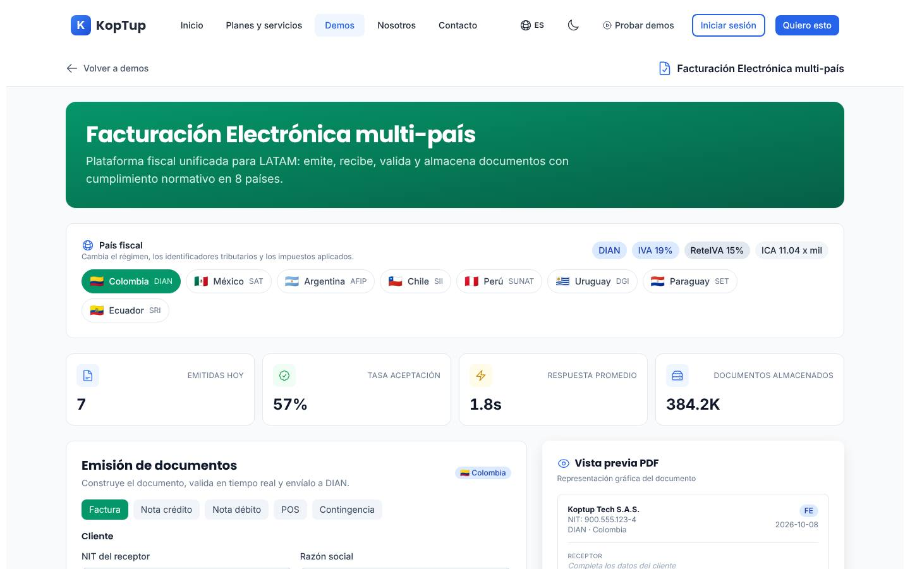
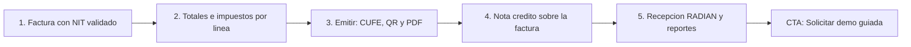

# Facturación electrónica

> Finanzas (`finance`) · Demo: `/demo/facturacion-electronica` · Modo de acceso recomendado: `publico` (versión personalizada por `solicitud`) · Prioridad: **P1** · Esfuerzo total: **L** (≈ 2 semanas de 1 dev senior para dejar landing + demo vendibles; el producto real se estima aparte)

*Captura actual de `/demo/facturacion-electronica` (selector de país, métricas y emisión). Ver también [Sistema de demos](04-Sistema-de-Demos.md), [Catálogo de productos](08-Catalogo-de-Productos.md) y [Roadmap](12-Roadmap.md). Productos relacionados: [ERP modular](Producto-erp-modular.md), [POS retail](Producto-pos-retail.md), [E-commerce](Producto-ecommerce.md), [HRMS](Producto-hrms.md) (nómina electrónica) y [Cuentas médicas](Demo-cuentas-medicas.md) (facturación en salud).*

---

## Resumen

**Problema:** la facturación electrónica DIAN es obligatoria, pero el software contable de bajo costo solo sirve si toda la operación vive dentro de él. Las empresas que facturan desde **su propio sistema** (e-commerce, plataforma de suscripciones, software de una IPS, ERP a la medida, app de domicilios) terminan copiando facturas a mano en otro portal, con errores de numeración, notas crédito mal hechas y proveedores cuyas facturas nadie acepta a tiempo.

**Para quién (cliente ideal en Colombia/LATAM):**
- Empresas con sistema propio o e-commerce que emiten de 2.000 a 500.000 documentos al mes.
- IPS, clínicas y laboratorios que deben facturar con los soportes RIPS del sector salud (sinergia directa con [Cuentas médicas](Demo-cuentas-medicas.md), el sistema con más backend real de Koptup).
- Casas de software que necesitan **incluir** facturación electrónica en su producto sin volverse proveedor tecnológico.
- Grupos con varias razones sociales, prefijos y resoluciones de numeración.

**Propuesta de valor (posicionamiento recomendado):** "Facturación electrónica DIAN **integrada a tu sistema**: tu software emite facturas, notas, documento soporte y documento equivalente POS por API, con un panel para tu contador, recepción de facturas de proveedores con eventos RADIAN y reportes listos." No competir contra el software contable de cuota baja ni contra la solución gratuita de la DIAN para bajo volumen: competir en **integración, volumen y sectores con reglas propias**.

> Koptup no es proveedor tecnológico autorizado por la DIAN. El producto opera a través de un proveedor tecnológico aliado (o del software propio del cliente habilitado ante la DIAN). Ningún texto debe decir "certificada DIAN".

---

## Estado actual

| Aspecto | Estado | Evidencia |
|---|---|---|
| Demo | Existe. **Maqueta** 100 % en el navegador | `apps/web/src/app/demo/facturacion-electronica/page.tsx` es `'use client'`; no hay `fetch`, `axios` ni llamadas a `/api` en la carpeta |
| Pantallas | Selector de 8 países · 4 métricas · Emisión (pestañas Factura / Nota crédito / Nota débito / POS / Contingencia, formulario de cliente, líneas, totales) + Vista previa PDF · Documentos emitidos (filtros, búsqueda, reenviar, anular) · Recepción de proveedores (OCR, validaciones, aprobar/rechazar) · Reportes (4 libros) · API y SDKs · White-label · Almacenamiento legal | `page.tsx`, `components/sections.tsx` (`DocumentsSection`, `ReceptionSection`, `ReportsSection`, `ApiSection`, `WhiteLabelSection`, `StorageSection`), `components/shared.tsx` (`EmissionSuccess`) |
| Datos | 7 documentos emitidos, 4 facturas de proveedores, 3 marcas white-label, reglas fiscales por país; montos en COP | `components/mockData.ts` (`MOCK_DOCS`, `MOCK_INCOMING`, `MOCK_BRANDS`, `FISCAL_RULES`) |
| Backend | Módulo en memoria `apps/backend/src/modules/e-invoicing/` (documentos, países, `emit` que genera un identificador falso; 185 líneas con test) **no montado** en `apps/backend/src/index.ts`; el frontend no lo usa. `reglas-facturacion` y `liquidacion` del backend son de cuentas médicas, no de factura electrónica | `e-invoicing.service.ts`, `e-invoicing.types.ts` |
| i18n ES/EN | `apps/web/messages/demos/facturacion-electronica.{es,en}.json` (318 líneas c/u, namespace `demoBilling`). Datos de ejemplo en español dentro de `mockData.ts` | |
| Tests | 1 smoke test (`__tests__/page.test.tsx`, 11 líneas) que hoy no se ejecuta | |
| Tamaño | 1.510 líneas (page 525 + `sections.tsx` 548 + `shared.tsx` 189 + `mockData.ts` 248) | `wc -l` |
| SEO | Metadata `demo-facturacion-electronica` en `apps/web/src/lib/seo-config.ts`; la descripción dice **"certificada DIAN"** | |
| CTA | Solo el `DemoCTA` genérico del layout de `/demo` | `apps/web/src/components/demo/DemoCTA.tsx` |
| Catálogo | Mapeo correcto: offering `facturacion-electronica` → demo `facturacion-electronica` | `services-catalog.ts` |

**Lo que hace bien:** es la demo más "tocable" del grupo financiero: se escribe un NIT y se valida en vivo, se agregan y quitan líneas, los totales se recalculan, el botón "Emitir" muestra los pasos (firma → validación → envío) y el documento aparece en la tabla con estado. La vista previa del PDF se actualiza mientras se escribe. Filtros y búsqueda de documentos funcionan.

### Problemas detectados (con ruta)

1. **Afirmación riesgosa:** `seo-config.ts` (`demo-facturacion-electronica`) dice "certificada DIAN". Koptup no tiene esa condición; hay que retirarla (riesgo comercial y de publicidad engañosa).
2. **Cálculo fiscal incorrecto para Colombia** (`page.tsx` → `totals`): el ICA se **suma** al total y la retención en la fuente se **resta**. En la factura colombiana el ICA no se cobra al comprador (es él quien puede practicar ReteICA) y las retenciones son informativas. Con las líneas de ejemplo el total sale $3.257.860 en lugar de $3.272.500 (subtotal + IVA). Un contador lo detecta en segundos. El badge "ReteIVA 15 %" se muestra pero no se calcula.
3. **"Anular" una factura** (`DocumentsSection`, webhook `invoice.voided`): en Colombia una factura aceptada no se anula; se emite una **nota crédito** que la referencia.
4. **Métricas que juegan en contra:** "Tasa de aceptación 57 %" por defecto (4 de 7 documentos aceptados) en un producto que vende cumplimiento; "Emitidas hoy" = aceptadas + 3 fijo; "1.8s" y "384.2K" fijos.
5. **Pestañas de emisión decorativas:** Nota crédito, Nota débito, POS y Contingencia muestran el mismo formulario de factura (`emissionTab` solo cambia el color del botón). Una nota crédito sin factura de referencia ni concepto no es creíble.
6. **Identificador y QR falsos:** el "CUFE" es un UUID con prefijo (`generateUuid` en `mockData.ts`), cuando el CUFE real es un hash SHA-384 de 96 caracteres; el QR es un patrón CSS. "Descargar PDF/XML" (`EmissionSuccess`) y los botones PDF/XML de la tabla no hacen nada.
7. **Validación de NIT superficial:** solo una expresión regular de 9–10 dígitos; no calcula el dígito de verificación.
8. **Recepción por OCR:** en Colombia la factura del proveedor llega como XML (con su PDF) al buzón; lo importante es validarla y registrar los eventos RADIAN (acuse de recibo, recibo del bien o servicio, aceptación expresa o reclamo), no leer una imagen.
9. **Promesas sin respaldo:** SDKs `@koptup/sdk`, Python y Go con paquetes que no existen (`ApiSection`); "8 países" cuando el catálogo solo ofrece multi-país CO/MX/PE/CL en Avanzado; white-label que no está en ningún plan, con marcas ("FacturaYa", "NubeFiscal", "BillSur") y dominios que podrían pertenecer a empresas reales.
10. **Exportaciones muertas:** los botones PDF/Excel/XML de los 4 libros (`ReportRow`) no descargan nada.
11. **Emisor fijo** "Koptup Tech S.A.S." en la vista previa: el prospecto ve la marca de Koptup en vez de la suya.
12. **Textos del catálogo:** voseo ("Emití", "Comprala", "pagá"), descripción de plantilla, "Reportes mensuales del tier" repetido 2 veces en Avanzado y 4 en Enterprise, `costoNote` USD 30–6.000 frente a USD 50–18.000 del catálogo.

---

## Qué falta para que sea vendible

- **Retirar "certificada DIAN"** y declarar el modelo: proveedor tecnológico aliado + integración Koptup.
- Cálculo fiscal correcto (IVA 19 % / 5 % / exento por línea, retenciones informativas, ICA fuera del total) revisado por un contador.
- Flujos propios para nota crédito, nota débito, documento equivalente POS, documento soporte y contingencia.
- Recepción con eventos RADIAN en lugar de OCR.
- Un artefacto que el prospecto se pueda llevar: **PDF de ejemplo con su logo** y XML de muestra.
- Posicionamiento claro (integración/API, volumen, sector salud) y planes que no compitan en precio con software de cuota baja.
- Prueba social: no hay casos. La facturación del sector salud (FEV + RIPS) conecta con el conocimiento real de [Cuentas médicas](Demo-cuentas-medicas.md) y es el mejor candidato a primer caso.
- CTA contextual "Solicitar demo de facturación electrónica", capturas y video de 60–90 s.

---

## Plan detallado

### Landing `/productos/facturacion-electronica`

Sigue la estructura común de [Landing de producto](Seccion-Landing-de-Producto.md):

1. **Hero:** "Factura electrónica DIAN desde tu propio sistema". Subtítulo: "Conecta tu e-commerce, ERP o software por API y emite facturas, notas, documento soporte y POS electrónico. Tu contador tiene su panel y tus proveedores quedan al día con RADIAN." CTA principal **"Solicitar demo"**, secundario "Agendar llamada" y enlace "Probar el simulador" (abre `/demo/facturacion-electronica`).
2. **Problemas que resuelve** (3 tarjetas): doble digitación entre tu sistema y el portal de facturación; notas crédito y numeración con errores; facturas de proveedores sin aceptar a tiempo.
3. **Cómo funciona** (4 pasos): tu sistema envía la venta por API → validamos y armamos el XML → el proveedor tecnológico aliado la transmite a la DIAN → tu cliente recibe PDF + XML por correo o WhatsApp.
4. **Documentos soportados** (tabla con "Incluido desde"): factura de venta, nota crédito, nota débito, documento equivalente POS, documento soporte, nómina electrónica (con [HRMS](Producto-hrms.md)), factura de salud con RIPS, eventos RADIAN.
5. **Capturas** (galería de 5: Emisión, Vista previa PDF, Documentos, Recepción RADIAN, Reportes) y **video de 60–90 s**.
6. **Para desarrolladores:** ejemplo de solicitud HTTP (sin SDKs inexistentes), webhooks de estado, ambiente de pruebas.
7. **Sector salud** (bloque propio): facturación con soportes RIPS y validaciones previas, enlazando a la oferta de cuentas médicas.
8. **Planes y precios:** "Compra / a medida" en COP; SaaS como **"Lista de espera"** (DECISIÓN 7).
9. **Preguntas frecuentes:** ¿Koptup es proveedor tecnológico? · ¿Puedo seguir usando mi software contable? · ¿Qué pasa si la DIAN no responde (contingencia)? · ¿Cuánto tarda la habilitación? · ¿Cuánto cuesta por documento? · ¿Cómo anulo una factura? (respuesta: con nota crédito) · ¿Cuántos años se guardan los documentos?
10. **CTA final** con el formulario "Solicitar demo" con `facturacion-electronica` preseleccionado y campos opcionales: documentos al mes, sistema de origen, sector.

### Demo interactiva (mejoras por pantalla/módulo)

| Pantalla / componente | Agregar | Quitar / corregir | Datos de ejemplo |
|---|---|---|---|
| Encabezado (`page.tsx`) | Aviso fijo "Simulación: nada se envía a la DIAN"; botón "Iniciar recorrido"; nombre y logo del emisor según personalización | Título "multi-país" y "cumplimiento normativo en 8 países" | Emisor ficticio "Servicios Andinos de Software S.A.S." (verificar en el RUES) |
| Selector de país | Colombia por defecto y única activa en modo público; MX, PE y CL como "Disponible en plan Avanzado" | Uruguay, Paraguay, Ecuador y Argentina (no están en ningún plan) | — |
| Métricas (`MetricCard`) | Calcularlas desde los documentos de la sesión: emitidos hoy, % aceptados, rechazos con motivo, documentos pendientes de evento RADIAN | 57 % de aceptación por defecto; "+3" fijo; "1.8s" y "384.2K" fijos | Dataset con 20 documentos: 18 aceptados, 1 rechazado (con motivo y corrección), 1 en proceso |
| Emisión: Factura | NIT con **cálculo del dígito de verificación**; búsqueda de cliente frecuente; IVA por línea (19 % / 5 % / exento / excluido); retenciones informativas por concepto (ReteFuente, ReteIVA 15 % del IVA, ReteICA por municipio); forma y medio de pago; prefijo y rango de resolución visibles | ICA sumado al total; retención restada del total | Líneas: "Licencia de software mensual" (IVA 19 %), "Soporte técnico 10 h" (IVA 19 %, ReteFuente servicios), "Capacitación" |
| Emisión: Nota crédito / Nota débito | Seleccionar la factura de referencia de la tabla; concepto (devolución, descuento, ajuste de precio, intereses); valor parcial o total | Formulario idéntico al de factura | NC por devolución parcial de $450.000 sobre `SAS-1045` |
| Emisión: POS | Documento equivalente electrónico POS para consumidor final (identificación `222222222222`) o con datos del comprador; enlace a la demo de [POS](Producto-pos-retail.md) | — | Tiquete de $86.400 |
| Emisión: Contingencia | Simular "DIAN no responde": numeración de contingencia y cola de envío posterior | — | 3 documentos en cola que se transmiten al "restablecer" |
| Resultado (`EmissionSuccess`) | Pasos en orden real (generar XML UBL 2.1 → firmar → enviar → validación DIAN → entrega al adquirente); CUFE de ejemplo SHA-384; QR real (librería `qrcode`); **descargar PDF de ejemplo con el logo del prospecto** y XML de muestra; "Enviar por correo/WhatsApp" (simulado) | UUID como CUFE; patrón CSS como QR; botones sin acción | — |
| Documentos (`DocumentsSection`) | Acción "Emitir nota crédito" en vez de "Anular"; detalle del rechazo con regla incumplida y botón "Corregir y reenviar"; PDF/XML descargables | "Anular"; "Reenviar" que convierte un rechazo en aceptado | Motivo de rechazo de ejemplo: "NIT del adquirente no coincide con el dígito de verificación" |
| Recepción (`ReceptionSection`) | Buzón de facturas de proveedores (XML + PDF); validación de CUFE y NIT; eventos RADIAN: acuse de recibo, recibo del bien o servicio, aceptación expresa o reclamo con motivo; contador de días para aceptación tácita; documento soporte para proveedores no obligados | OCR con % de confianza como función base | 5 facturas de proveedores (energía, internet, arriendo, papelería, transporte) |
| Reportes (`ReportsSection`) | Exportar CSV/Excel real (generado en el navegador) de libro de ventas, compras, IVA y retenciones del período | Botones PDF/Excel/XML muertos | Período "Octubre 2026" |
| API (`ApiSection`) | Ejemplo de solicitud HTTP genérica y JSON de respuesta; lista de webhooks (`invoice.accepted`, `invoice.rejected`, `credit_note.issued`, `reception.received`); etiqueta "Diseño de referencia" | SDKs TypeScript/Python/Go con paquetes inexistentes; `invoice.voided` | — |
| White-label (`WhiteLabelSection`) | Moverlo a un bloque "Para casas de software (Enterprise)" o retirarlo | Marcas y dominios con apariencia real | Si se conserva: dominios `*.example` |
| Almacenamiento (`StorageSection`) | Mantener; aclarar "conservación según la norma colombiana vigente" | Cifras fijas | — |
| Global | Preset de sector (ver Personalización); banner "Solicita tu demo guiada" (modo `publico`); CTA final contextual; división de `page.tsx` (525 líneas) en `EmissionForm`, `InvoicePreview` y `useInvoiceTotals` | `DemoCTA` genérico | — |

**Recorrido guiado (5 pasos, menos de 3 minutos):**

> [Ver diagrama como imagen](images/diagramas/Producto-facturacion-electronica-1.png)

1. **Factura:** escribir el NIT de un cliente frecuente; el dígito de verificación se valida y se autocompletan razón social, correo y ciudad.
2. **Totales:** cambiar una línea a IVA 5 % y ver el resumen (subtotal, IVA por tarifa, retenciones informativas, total a pagar).
3. **Emitir:** ver los pasos hasta "Aceptada (simulado)", el CUFE, el QR y descargar el PDF con el logo del prospecto.
4. **Nota crédito:** desde la tabla, "Emitir nota crédito" por devolución parcial; queda ligada a la factura.
5. **Recepción y reportes:** aceptar una factura de proveedor con los eventos RADIAN y exportar el libro de ventas en Excel. Cierre con CTA "Solicitar demo guiada" / "Agendar llamada".

### Acceso y solicitud de demo

- **Modo recomendado: `publico`.** "Facturación electrónica DIAN" es una de las búsquedas de software con más volumen en Colombia; el simulador corre completo en el navegador, sin costos de IA ni datos reales, y es un buen imán de leads. Banner "Solicita tu demo guiada" (DECISIÓN 1).
- **Qué ve el visitante sin solicitar:** la landing con capturas y video, y el simulador completo con el preset "Servicios" y el tour.
- **Qué obtiene al solicitar:** sesión de 45 min con un comercial y una persona técnica (la integración es el corazón de la venta) y una **versión personalizada** por 14 días (`DemoGrant`): su logo y razón social en el PDF, su sector, su prefijo de ejemplo y el sistema de origen en la pestaña API.
- **Prospecto aprobado** (Portal › Mis demos, ver [Portal del cliente](06-Portal-del-Cliente.md)): tarjeta "Facturación electrónica — <Empresa>", días restantes, "Abrir demo", "Descargar PDF de ejemplo", "Agendar sesión técnica" y "Solicitar propuesta".
- **Eventos `DemoEvent`:** documentos emitidos por tipo, PDF descargados, pasos del tour, pestaña API visitada, sector elegido, clic en CTA.

### Personalización por cliente

Sin código, desde **Admin › Solicitudes de demo › Aprobar** (o Admin › Demos › Personalizar), guardado en `DemoGrant.personalizacion`. Ver [Panel de administración](05-Panel-de-Administracion.md).

| Campo | Efecto en la demo |
|---|---|
| Logo, color y razón social del emisor | Vista previa y PDF descargable, encabezado |
| NIT del emisor (opcional, solo visible para el prospecto) | Vista previa y XML de muestra |
| Prefijo y rango de numeración de ejemplo | Numeración de documentos |
| Sector (preset) | Dataset de clientes, líneas y proveedores: Servicios profesionales, Comercio, Software/SaaS, Educación, **Salud (IPS con RIPS)** |
| Sistema de origen (e-commerce, ERP propio, software de salud, otro) | Ejemplo de la pestaña API y texto del paso "Cómo se conecta" |
| Países visibles (CO por defecto; MX/PE/CL si cotiza Avanzado) | Selector de país |

**Implementación:** mover `MOCK_DOCS`, `MOCK_INCOMING` y `SAMPLE_LINES` de `components/mockData.ts` a `fixtures/<sector>.ts`; la página lee la configuración de `GET /api/demo-access/facturacion-electronica` (DECISIÓN 3) y en modo público usa el preset "Servicios". El PDF de ejemplo se genera en el navegador con los datos personalizados.

### Producto real

**Alcance MVP — modalidad compra (Profesional, 6–10 semanas):**
- **Emisión por API y panel:** factura de venta, nota crédito, nota débito, documento soporte y documento equivalente electrónico POS; múltiples resoluciones y prefijos; validaciones previas (NIT con DV, totales, tarifas); representación gráfica personalizable; envío al adquirente por correo (XML + PDF) y WhatsApp.
- **Transmisión:** a través de un **proveedor tecnológico autorizado** con API y ambiente de pruebas (elegir un aliado en Fase 3; los costos del proveedor los paga el cliente, como ya dice el catálogo). Alternativa para clientes grandes: software propio del cliente habilitado ante la DIAN, con su certificado de firma digital.
- **Recepción:** buzón de facturas de proveedores, validación, eventos RADIAN y alertas de plazos.
- **Contingencia:** cola de reintentos y numeración de contingencia.
- **Reportes:** libros de ventas y compras, IVA y retenciones, exportables.
- **Integraciones típicas en Colombia:** e-commerce (Shopify, WooCommerce, VTEX), ERP del cliente (SAP Business One, World Office, ERP propio, [ERP modular](Producto-erp-modular.md)), [POS](Producto-pos-retail.md), Siigo/Alegra para la contabilidad, Wompi o PayU (link de pago en la factura), WhatsApp Business (envío), nómina electrónica vía [HRMS](Producto-hrms.md).
- **Sector salud (Avanzado):** factura con soportes RIPS y validaciones previas, reutilizando reglas y catálogos de [Cuentas médicas](Demo-cuentas-medicas.md).
- **Transversal:** autorización en servidor, llaves de API por cliente con límites de uso, auditoría, firma de webhooks, conservación de documentos.
- **Base técnica:** reutilizar tipos de `apps/backend/src/modules/e-invoicing/` (EDocument, estados `draft → signed → transmitted → accepted/rejected`, registro de países) migrados a Mongoose con `tenantId`. Las normas técnicas cambian con frecuencia: incluir en el mantenimiento las **actualizaciones de anexos técnicos de la DIAN** (verificar resoluciones vigentes con el proveedor tecnológico y un contador antes de cada versión).

**SaaS (DECISIÓN 7):** es el producto más natural para SaaS después del chatbot (API multi-cliente por naturaleza, cobro por documento), pero hoy no hay base multi-tenant ni cobro recurrente → **"SaaS: lista de espera"**. Para habilitarlo (Fase 4, segunda ola tras el chatbot): core multi-tenant, aislamiento por NIT, gestión de resoluciones por cliente, medición de documentos contra el plan, cobro Wompi/PayU (COP) y Stripe (USD), panel de consumo y acuerdo de encargo de tratamiento de datos.

### Planes y precios

Precios actuales del catálogo (`apps/web/src/lib/services-catalog.ts`, entrada `facturacion-electronica`; COP):

| Plan | Compra: setup | Compra: mantenimiento/mes | SaaS: setup | SaaS: mes | Volumen incluido | Usuarios / empresas (NIT) | Implementación (catálogo) | Costos del cliente al proveedor (USD/mes) |
|---|---|---|---|---|---|---|---|---|
| Básico | $49.000.000 | $4.500.000 | $2.900.000 | $1.690.000 | 200 facturas/mes | 3 / 1 | 2–5 semanas | 50–200 (hosting, DB, DIAN básico, email) |
| Profesional | $126.000.000 | $11.200.000 | $6.900.000 | $4.090.000 | 5.000 facturas/mes | 15 / 5 | 5–9 semanas | 300–1.200 (+ DIAN Pro, email Pro) |
| Avanzado | $294.000.000 | $25.200.000 | $12.900.000 | $7.690.000 | 50.000 facturas/mes | 40 / 25 | 9–14 semanas | 1.500–5.000 (+ multi-país, nómina) |
| Enterprise | $630.000.000 | $49.000.000 | $0 (se muestra "Personalizado") | $13.890.000 | 500.000+ facturas/mes | Ilimitados | 12–20 semanas | 5.000–18.000 (+ RADIAN, SAP/Oracle) |

Almacenamiento: 5 GB / 50 GB / 250 GB / ilimitado. Horas de evolutivos incluidas por mes: 5 / 12 / 25 / 50. Soporte: correo 24 h hábiles / + WhatsApp 4 h / + Slack Connect 2 h / tickets con SLA 1 h. Ciclos SaaS: semestral −10 %, anual −20 %.

**Recomendaciones de claridad:**
1. **El plan Básico está fuera de mercado:** $49 M de setup + $4,5 M/mes para 200 facturas al mes compite contra software contable en la nube de cuota baja y contra la solución gratuita de la DIAN. Propuesta: eliminar Básico como compra y reemplazarlo por **"Integración estándar"** (conector de 1 sistema de origen + panel), cotizado como proyecto, para clientes desde ~2.000 documentos/mes.
2. **Mantenimiento incoherente:** 12 × $4,5 M = $54 M al año (110 % del setup) y 2,7 veces la cuota SaaS. Pasarlo a % anual del setup o bolsa de horas, e incluir explícitamente las actualizaciones normativas DIAN.
3. **Cobro por volumen** cuando exista SaaS: cuota base + bolsa de documentos (el cliente entiende "precio por documento"), y mientras tanto mostrar "SaaS: lista de espera".
4. **Bullets en lenguaje de cliente.** Propuesta: **Integración estándar** "1 sistema conectado por API · Factura, nota crédito y nota débito · Envío por correo y WhatsApp · Panel para tu contador". **Profesional** "+ Hasta 5 NIT y varias resoluciones · Documento soporte y POS electrónico · Recepción de proveedores con RADIAN · Conector con tu ERP o e-commerce". **Avanzado** "+ Nómina electrónica · Facturación en salud con RIPS · Libros y reportes para auditoría · CO/MX/PE/CL". **Enterprise** "+ Adaptador SAP/Oracle · Alta disponibilidad · Gerente de proyecto dedicado".
5. Corregir el tagline ("Emití" → "Emite"), la descripción de plantilla, los bullets duplicados y el `costoNote` (USD 50–18.000).
6. Explicar en una línea quién paga qué: Koptup (desarrollo y soporte), proveedor tecnológico (transmisión por documento), cliente (certificado si usa software propio).

Detalle de la política comercial común en [Catálogo de productos](08-Catalogo-de-Productos.md) y [Comercial, marketing y legal](11-Comercial-Marketing-y-Legal.md).

---

## Tareas

| # | Tarea | Fase | Prioridad | Esfuerzo | Criterio de aceptación |
|---|---|---|---|---|---|
| 1 | Retirar "certificada DIAN" de `seo-config.ts` y de cualquier texto; aviso "Simulación: nada se envía a la DIAN" en la demo | Fase 1 — Funnel y solicitud de demos | P0 | S | Búsqueda de "certificad" en `apps/web` sin resultados en textos de facturación; aviso visible en la primera pantalla |
| 2 | Reescribir textos del offering y del hub (`_demos.*.json`): tuteo, posicionamiento "integrada a tu sistema", bullets sin duplicados, `costoNote` = USD 50–18.000, sin "8 países" ni SDKs | Fase 1 — Funnel y solicitud de demos | P1 | S | `facturacion-electronica.{es,en}.json` sin voseo ni bullets repetidos; ningún texto promete países o SDKs inexistentes |
| 3 | Decidir y publicar el re-empaquetado de planes ("Integración estándar" en lugar de Básico, mantenimiento con actualizaciones DIAN, SaaS en lista de espera) | Fase 1 — Funnel y solicitud de demos | P1 | S | Catálogo y landing muestran los planes aprobados por el dueño |
| 4 | Landing `/productos/facturacion-electronica` con las 10 secciones de este plan | Fase 1 — Funnel y solicitud de demos | P1 | M | Página publicada; "Solicitar demo" con `facturacion-electronica` preseleccionado y campos de volumen y sistema de origen |
| 5 | Registrar `DemoCatalogItem` (`publico`, 14 días para la versión personalizada), banner, CTA contextual y eventos `DemoEvent` | Fase 1 — Funnel y solicitud de demos | P1 | S | El admin cambia el modo sin desplegar; cada emisión y descarga de PDF registra un evento |
| 6 | Corregir el cálculo fiscal (IVA por tarifa, retenciones informativas, ICA fuera del total) y validarlo con un contador | Fase 2 — Demos vendibles | P1 | S | Con las líneas de ejemplo el total = subtotal + IVA; acta de revisión del contador adjunta a la tarea |
| 7 | Pestañas de emisión con flujo propio (NC/ND con factura de referencia y concepto, POS consumidor final, contingencia) y "Emitir nota crédito" en lugar de "Anular" | Fase 2 — Demos vendibles | P1 | M | Cada pestaña muestra campos distintos; no existe la acción "Anular" ni el webhook `invoice.voided` |
| 8 | NIT con dígito de verificación, CUFE de ejemplo SHA-384, QR real y descarga de PDF/XML de ejemplo | Fase 2 — Demos vendibles | P1 | M | Un NIT con DV errado se marca inválido; el PDF descargado abre y muestra QR legible |
| 9 | Métricas calculadas desde los documentos de la sesión y dataset con 90 % de aceptación y un rechazo explicado | Fase 2 — Demos vendibles | P1 | S | La tasa de aceptación inicial es ≥ 90 % y cambia al emitir; ningún valor fijo en `MetricCard` |
| 10 | Recepción con eventos RADIAN y documento soporte en lugar de OCR | Fase 2 — Demos vendibles | P2 | M | Se pueden registrar acuse, recibo y aceptación o reclamo por factura; el estado cambia en la tabla |
| 11 | Exportación real de libros (CSV/Excel) y API como "Diseño de referencia" (ejemplo HTTP, sin SDKs), white-label retirado o movido a Enterprise con dominios `.example` | Fase 2 — Demos vendibles | P2 | S | Los 4 libros descargan un archivo; no aparecen paquetes `@koptup/*` ni dominios con apariencia real |
| 12 | Presets de sector (incluido Salud con RIPS) y personalización desde `DemoGrant` (logo, razón social, prefijo, sistema de origen) | Fase 2 — Demos vendibles | P2 | M | Con grant personalizado el PDF muestra la marca del prospecto; el preset Salud muestra campos RIPS |
| 13 | Tour de 5 pasos, 5 capturas y video de 60–90 s; división de `page.tsx` y smoke test en CI | Fase 2 — Demos vendibles | P1 | M | Tour completable en < 3 min; `page.tsx` < 250 líneas; `__tests__/page.test.tsx` pasa en CI |
| 14 | Elegir proveedor tecnológico aliado (API, ambiente de pruebas, precio por documento) y plantilla de propuesta de integración | Fase 3 — Propuestas y conversión | P1 | M | Acuerdo firmado con un proveedor; propuesta tipo generada desde el `Quote` ampliado |
| 15 | Base real: módulo `e-invoicing` persistente con `tenantId`, llaves de API por cliente, conexión al ambiente de pruebas del proveedor y webhooks firmados | Fase 4 — Productos SaaS reales | P2 | XL | Un cliente piloto emite facturas de prueba aceptadas en el ambiente de habilitación desde su sistema |

---

## Métricas de éxito

Son **metas** iniciales a validar con datos reales; no son resultados actuales.

- Conversión landing → solicitud de demo ≥ 3 %.
- ≥ 50 % de los visitantes del simulador emiten al menos 1 documento y ≥ 30 % descargan el PDF de ejemplo.
- ≥ 40 % de las solicitudes vienen de empresas con más de 2.000 documentos/mes o del sector salud (posicionamiento correcto).
- Aprobación de solicitudes en < 24 h hábiles; ≥ 25 % de las demos guiadas terminan en propuesta en ≤ 14 días.
- Primer cliente piloto emitiendo en ambiente de habilitación en los 4 meses siguientes a la Fase 3.
- 0 errores fiscales reportados por contadores en las sesiones guiadas.
