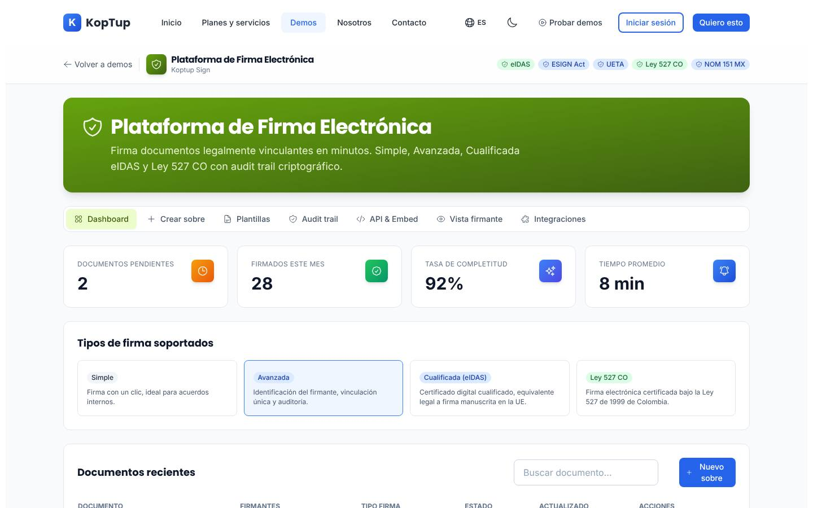
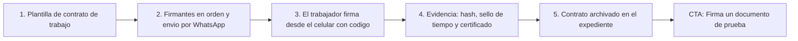

# Firma electrónica

> Seguridad (`security`) · Demo: `/demo/firma-electronica` · Modo de acceso recomendado: `publico` (la firma real de prueba y la versión personalizada van por solicitud) · Prioridad: **P2** (retirar las afirmaciones legales sin respaldo es **P1**) · Esfuerzo total: **L** para demo y landing; el MVP real es **XL** y se apoya en la firma de propuestas de la Fase 3

*Captura actual de `/demo/firma-electronica` (pestaña Dashboard). Las insignias eIDAS, ESIGN Act, UETA, Ley 527 CO y NOM 151 MX y el tipo de firma "Cualificada (eIDAS)" son afirmaciones legales que hoy nada respalda. Ver [Sistema de demos](04-Sistema-de-Demos.md), [Catálogo de productos](08-Catalogo-de-Productos.md) y [Roadmap](12-Roadmap.md). Relacionados: [Gestor documental](Producto-gestor-documental.md), [HRMS](Producto-hrms.md) (contratos laborales), [Telemedicina](Producto-telemedicina.md) (consentimientos y recetas) y [Facturación electrónica](Producto-facturacion-electronica.md).*

---

## Resumen

**Problema:** en muchas empresas colombianas los contratos laborales, otrosíes, consentimientos informados, contratos de arrendamiento, actas de entrega y autorizaciones de tratamiento de datos todavía se imprimen, se firman a mano y se escanean. Se pierden días en mensajería, no queda evidencia de quién firmó, cuándo y desde dónde, y los documentos terminan dispersos en correos y carpetas.

**Para quién:**
- Áreas de RRHH con alta rotación: BPO, retail, vigilancia, construcción, empresas de servicios temporales.
- IPS, clínicas y laboratorios: consentimientos informados y documentos clínicos.
- Inmobiliarias y administradoras: contratos de arrendamiento y actas de entrega.
- Cooperativas, fondos de empleados y aseguradoras: vinculación de asociados y clientes.
- Instituciones educativas: matrículas y autorizaciones de padres.

**Propuesta de valor:** "Envía, firma y archiva documentos en minutos desde el celular, con la evidencia que pide la ley colombiana: identidad verificada con código, sello de tiempo y certificado de evidencia. Integrada a tus sistemas y, si lo necesitas, instalada en tu propia infraestructura."

### Glosario (base para todos los textos del producto)

Estos términos deben revisarse con un abogado antes de publicarse y usarse igual en este demo, en el [Gestor documental](Producto-gestor-documental.md) y en [Telemedicina](Producto-telemedicina.md):

| Término | Qué es | Cómo lo ofrece Koptup |
|---|---|---|
| **Firma electrónica** | Método que identifica al firmante y es confiable y apropiado para el fin del documento (Ley 527 de 1999 y Decreto 2364 de 2012, compilado en el Decreto 1074 de 2015) | La plataforma la ofrece sola: código de un solo uso por email, SMS o WhatsApp, más la evidencia del proceso |
| **Firma digital** | Firma con un certificado digital emitido por una entidad de certificación digital (ECD) acreditada por ONAC (Ley 527 de 1999) | Integrando una ECD acreditada; la elige y la contrata el cliente |
| **Estampa cronológica** | Sello de tiempo emitido por una ECD (estándar RFC 3161) | Integrando la ECD |
| eIDAS (UE), ESIGN/UETA (EE. UU.), NOM-151 (México) | Marcos de otros países | No se mencionan en el sitio. Solo entran en un proyecto concreto que los exija y con un proveedor acreditado |

---

## Estado actual

| Aspecto | Estado | Evidencia |
|---|---|---|
| Demo | Existe, con 7 pestañas: Dashboard, Crear sobre (asistente de 4 pasos: Documento, Firmantes, Campos y Seguridad, más "Negociación previa"), Plantillas, Audit trail, API & Embed, Vista firmante e Integraciones | `apps/web/src/app/demo/firma-electronica/page.tsx` (`tabs`) y `components/Panels.tsx` |
| Real o maqueta | **Maqueta.** `MOCK_DOCS`, `TEMPLATES`, `AUDIT_EVENTS` e `INTEGRATIONS` son constantes y no hay `fetch`. El archivo subido no se lee | `page.tsx`, `Panels.tsx`, `apps/web/src/components/demo/FileDropZone.tsx` |
| Lo que funciona bien | Firmantes editables (agregar, quitar, rol, orden y modo paralelo, secuencial o condicional), arrastrar campos sobre la página, comentarios de negociación con aceptar y rechazar, búsqueda de documentos, modal de auditoría y "Copiar" en la pestaña de API. La línea de tiempo de auditoría ya usa IP y ciudades colombianas (Bogotá, Medellín) | `page.tsx`, `Panels.tsx` (`AUDIT_EVENTS`) |
| Backend | `apps/backend/src/modules/e-signature/`: sobres y firmantes **en memoria**; `sign()` marca al firmante como firmado y completa el sobre. **No está montado.** No guarda archivos, no calcula hash, no valida el orden de firma ni genera evidencia | `e-signature.service.ts`, `e-signature.types.ts` |
| i18n ES/EN | 185 claves en cada idioma, sin diferencias. Quedan fijos en el código: "Koptup Sign", "Acuerdo SaaS — Acme", "TLS", "env_003 · 3/3", la fecha "2026-05-14", los hashes y los nombres de `MOCK_DOCS` | `messages/demos/firma-electronica.{es,en}.json`, `Panels.tsx` (`SignerPanel`) |
| Tests | Un smoke test (`__tests__/page.test.tsx`) que hoy no se ejecuta (falta la configuración de Jest en `apps/web`) | `apps/web/package.json` |
| Tamaño | 1.092 líneas: `page.tsx` 621, `components/Panels.tsx` 438, `layout.tsx` 22 y el test 11. `page.tsx` es un único client component con unos 20 estados | `wc -l` |
| Coherencia con otros demos | El gestor documental (`demoDocsPro.sign` en `_demos.es.json`) define los niveles de otra forma ("Ley 527 CO: firma digital con certificado de entidad reconocida") que este demo ("firma electrónica certificada bajo la Ley 527") | `apps/web/messages/_demos.es.json` |

### Problemas detectados

1. **Afirmaciones legales sin respaldo**, que son el mayor riesgo comercial y legal del demo:
   - las insignias eIDAS, ESIGN Act, UETA y NOM 151 MX del encabezado;
   - el tipo "Cualificada (eIDAS)";
   - "Timestamp blockchain RFC 3161 — Activado, anclado en cadena pública", que mezcla dos cosas distintas y no existe.

   Lo mismo se repite en la tarjeta de `/demo` (`demosExtra.sign`) y en `seo-config.ts` ("firma digital… con validez legal").
2. **Conceptos colombianos confusos:** "Ley 527 CO" aparece como si fuera un tipo de firma, y el demo no distingue firma electrónica de firma digital.
3. **Consentimiento premarcado:** en Vista firmante, la casilla "Acepto los términos electrónicos y consiento firmar este documento" viene marcada (`defaultChecked` en `SignerPanel`). El consentimiento tiene que ser un acto activo del firmante.
4. **El asistente no cierra la historia:**
   - el documento subido no se muestra: la vista previa es "Página 1 de 3" con líneas grises y el estado `uploaded` nunca se lee;
   - "Enviar para firma" vuelve al Dashboard sin agregar el sobre a la lista;
   - todos los campos colocados se asignan al primer firmante (`signers[0]`).
5. **Métricas calculadas con fórmulas arbitrarias:** "Firmados este mes: 28" sale de 2 × 14, y "92 %" y "8 min" están fijos en `stats` (`page.tsx`).
6. **Unos 12 botones distintos sin acción:**
   - Recordar, Guardar borrador y Nueva plantilla;
   - Subir CSV y Vista previa lote;
   - Abrir documentación;
   - Descargar certificado (en la pestaña y en el modal);
   - Dibuja, Escribe y Sube imagen;
   - Firmar y continuar (en Vista firmante y en el embed);
   - Conectar (×8).
7. **No sirve para preparar sobres en el celular:** los campos se colocan con drag and drop HTML5 (`draggable`, `onDragStart`), que no responde al tacto.
8. **Integraciones pensadas para EE. UU.:** Salesforce, HubSpot, Pipedrive, Workday, Greenhouse, BambooHR, Slack y Google Drive. Faltan WhatsApp, Microsoft 365/SharePoint y los productos propios (HRMS, gestor documental).
9. **Ejemplos poco locales y jerga:** "NDA — Pharma Corp", "Acuerdo SaaS — Acme", pestañas "Dashboard", "Audit trail" y "API & Embed", el campo "Checkbox". Los dominios de ejemplo (`api.koptup.sign`, `sign.koptup.io`, `@koptup.io`) no coinciden con el dominio del sitio (`koptup.com`) y parecen servicios reales.
10. **Textos del catálogo** (`apps/web/messages/offerings/firma-electronica.es.json`):
    - la descripción es de plantilla y usa voseo;
    - "Reportes mensuales del tier" aparece 2 veces en Avanzado y 3 en Enterprise;
    - Profesional promete "KYC biométrico" sin proveedor definido;
    - Enterprise promete "eIDAS cualificada multi-país".
11. **El SaaS no tiene base real** (DECISIÓN 7).

---

## Qué falta para que sea vendible

- **Retirar las afirmaciones legales** y adoptar el glosario único, validado por un abogado.
- **Cerrar la historia del asistente:** que el documento subido se vea, que el sobre enviado aparezca en la lista, que el firmante reciba y firme, y que se pueda descargar el certificado de evidencia.
- **"Firma un documento de prueba" de verdad** (cuando exista el módulo de la Fase 3): el visitante recibe un código en su correo, firma un documento de ejemplo y descarga el PDF firmado con su certificado. Es el "momento ajá" equivalente a "Prueba con tu documento" de los [Sistemas RAG](Producto-chatbot-rag-ia.md).
- **Casos de uso colombianos:** contrato de trabajo, otrosí, consentimiento informado, contrato de arrendamiento, acta de entrega de dotación y autorización de tratamiento de datos (Ley 1581).
- **Integraciones locales:** envío del enlace por WhatsApp Business, archivo en Microsoft 365/SharePoint o Google Drive, conexión con el HRMS y el gestor documental, y API con webhooks.
- **Un diferencial claro:** en Colombia hay proveedores SaaS de firma con planes de entrada baratos. Koptup no debe competir por precio por firma. Su diferencial es integrar la firma en los procesos del cliente e instalarla en su propia infraestructura cuando los documentos no pueden salir de ella.

---

## Plan detallado

### Landing `/productos/firma-electronica`

1. **Hero:** "Firma contratos y consentimientos desde el celular, con validez en Colombia". Subtítulo: "Firma electrónica con código de verificación, sello de tiempo y certificado de evidencia. Integrada a tus sistemas o instalada en tu nube". CTA principal **Probar la demo**; cuando exista el módulo real, **Firma un documento de prueba**. Secundario: **Agendar llamada**.
2. **Video de 60–90 s** con el recorrido guiado de abajo.
3. **Casos de uso por sector** (5 tarjetas): RRHH, salud, inmobiliario, educación y compras.
4. **"¿Qué validez tiene?"**, con el glosario revisado por un abogado y un enlace a las normas.
5. **Cómo funciona (4 pasos):** subes el documento, eliges a los firmantes, ellos firman con un código desde el celular, y recibes el certificado de evidencia con el documento archivado.
6. **Integraciones:** WhatsApp, Microsoft 365, Google Drive, HRMS, gestor documental y API.
7. **Planes y precios:** compra y "SaaS: lista de espera".
8. **FAQ:**
   - ¿Tiene validez ante un juez?
   - ¿En qué se diferencian la firma electrónica y la firma digital?
   - ¿El firmante necesita crear una cuenta? (No.)
   - ¿Dónde se guardan los documentos?
   - ¿Se puede firmar desde WhatsApp?
   - ¿Qué costos de terceros hay por firma (SMS, estampa cronológica, verificación de identidad)?
9. **Bloque cruzado:** "Úsala en tu HRMS, en tu gestor documental o en telemedicina".

### Demo interactiva

Se reemplazan los datos por una empresa ficticia, **"Andina Servicios Temporales S.A.S."** (Bogotá), con 8 sobres de ejemplo: contrato de trabajo de un operario, otrosí de salario, acta de entrega de dotación, consentimiento informado de una IPS aliada, contrato de arrendamiento de bodega, autorización de tratamiento de datos, orden de compra y paz y salvo. Todos llevan la etiqueta "ejemplo".

| Pantalla actual | Mejoras | Qué quitar |
|---|---|---|
| Encabezado e insignias | Una sola nota: "Firma electrónica según la Ley 527 de 1999 y el Decreto 2364 de 2012 (Colombia)", con enlace al glosario. La marca viene del grant | eIDAS, ESIGN Act, UETA, NOM 151 MX y la marca fija "Koptup Sign" |
| Dashboard | Métricas calculadas desde la lista de sobres (pendientes, firmados, vencidos). "Recordar" muestra "Recordatorio enviado por email y WhatsApp" y registra el evento en la evidencia. La tarjeta "Tipos de firma" pasa a ser una ayuda que abre el glosario | La fórmula `signed * 14` y los valores fijos 92 % y 8 min |
| Crear sobre › Documento | Mostrar el PDF subido, solo en el navegador (sin enviarlo a ningún servidor), o la plantilla de ejemplo "Contrato individual de trabajo a término fijo" con variables {nombre}, {cédula}, {cargo} y {salario} | El marcador "Página 1 de 3" con líneas grises |
| Crear sobre › Firmantes | Validar email y celular; elegir el canal de envío de cada firmante (email o WhatsApp); orden visible. Ejemplo: Trabajador, Jefe de RRHH y Representante legal | — |
| Crear sobre › Campos | Asignar cada campo a un firmante, con un color por firmante; colocar campos con clic o toque además de arrastrar | La asignación fija al primer firmante |
| Crear sobre › Seguridad | Métodos: código por email (Básico), código por SMS o WhatsApp (Profesional), verificación de identidad con documento y selfie "con proveedor aliado" (Avanzado) y firma digital con certificado de una ECD "por integración" (Enterprise); estampa cronológica de una ECD | "Video grabado", "Biometría" genérica y el interruptor de blockchain |
| Crear sobre › Enviar | Agrega el sobre a la lista con estado "Enviado" y abre la Vista firmante | Volver al Dashboard sin ningún cambio |
| Vista firmante | Recorrido completo: leer el documento, marcar la casilla de consentimiento (desmarcada por defecto), validar el código de ejemplo mostrado en pantalla, firmar en un canvas táctil, ver la confirmación y descargar el PDF firmado y el certificado de evidencia de ejemplo | La casilla premarcada y los botones sin acción |
| Audit trail → **"Evidencia"** | Línea de tiempo del sobre recién firmado, hash SHA-256 del documento, sello de tiempo y descarga del certificado de evidencia (PDF de ejemplo) | "Timestamp blockchain" |
| Plantillas | Plantillas colombianas (contrato de trabajo, otrosí, consentimiento informado, arrendamiento, autorización de datos, acta de entrega). "Envío masivo" con un CSV de ejemplo descargable y vista previa de 20 contratos | "Acuerdo SaaS" y los contadores de uso inventados (por ejemplo, "219 usos"), o al menos marcarlos "ejemplo" |
| API & Embed → **"Para desarrolladores"** | Se mantiene. Dominios de ejemplo neutros (`api.ejemplo.com`). "Abrir documentación" lleva a la referencia de la API cuando exista, o se oculta | Los dominios `koptup.sign` y `koptup.io` y el paquete de ejemplo `@koptup/sign` |
| Integraciones | WhatsApp Business, Microsoft 365/SharePoint, Google Drive, HRMS de Koptup, Gestor documental de Koptup, API y webhooks, y CRM/ERP por API. "Conectar" abre una ficha con lo que hace cada integración | Workday, Greenhouse y BambooHR |

**Reglas generales:** todo botón visible hace algo o se oculta; los nombres de pestañas van en español ("Inicio", "Nuevo sobre", "Plantillas", "Evidencia", "Para desarrolladores", "Vista del firmante", "Integraciones"); `page.tsx` se divide en componentes por pantalla.

**Recorrido guiado (5 pasos):**

> [Ver diagrama como imagen](images/diagramas/Producto-firma-electronica-1.png)

1. Elegir la plantilla "Contrato de trabajo a término fijo" y completar los datos del trabajador.
2. Agregar firmantes en orden (trabajador y luego jefe de RRHH), con envío por WhatsApp.
3. Abrir la vista del firmante en el celular: aceptar, validar el código y firmar con el dedo.
4. Ver la evidencia (línea de tiempo, hash y sello de tiempo) y descargar el certificado.
5. Ver el contrato archivado en el expediente del trabajador (enlace al HRMS o al gestor documental). Al final, CTA "Firma un documento de prueba" o "Solicitar demo guiada".

### Acceso y solicitud de demo

- **Modo recomendado: `publico`**, igual que la semilla de [Sistema de demos](04-Sistema-de-Demos.md). Es una maqueta sin costo y atrae búsquedas como "firma electrónica Colombia". Lleva el banner "Solicita tu demo guiada".
- **Antes de entrar:** la landing con video de 60–90 s y 6 capturas.
- **"Firma un documento de prueba"** (pública desde la Fase 3): el visitante deja su email y la autorización Ley 1581, recibe el código y firma un documento de ejemplo fijo (no se suben archivos propios). Hay una firma por email y límites por IP y por día. El email entra como lead con origen "demo-firma".
- **Por solicitud** (`DemoGrant` de 14 días):
  - versión personalizada (logo, sector y plantillas);
  - cupo de **5 firmas reales** con documentos de ejemplo del sector;
  - en modo guiado, una sesión de 30 minutos en la que se arma el flujo con el documento tipo del prospecto.
- **El prospecto aprobado ve en Portal › Mis demos:**
  - la demo personalizada;
  - sus documentos de prueba firmados, con sus certificados;
  - la grabación de la sesión;
  - el CTA "Solicitar propuesta".

### Personalización por cliente

Se configura en **Admin › Solicitudes de demo › Aprobar**, en el campo `DemoGrant.customization = { logoUrl, sector, datasetKey }`:

| Campo | Efecto en el demo |
|---|---|
| Nombre y logo de la empresa | Encabezado, correo de invitación de ejemplo, vista del firmante y certificado de evidencia |
| Color principal | Botones y vista del firmante |
| Sector (`datasetKey`): `rrhh`, `salud`, `inmobiliario`, `educacion` o `compras` | Cambia los sobres de ejemplo, las plantillas y los roles de los firmantes |
| Canal preferido (email o WhatsApp) | Canal por defecto en el asistente y en los recordatorios |
| Documento tipo del prospecto (lo sube el comercial en el admin, no el prospecto) | Se usa como plantilla en la demo personalizada y se borra cuando vence el acceso |

### Producto real

**Base propia (Fase 3):** la aceptación de propuestas en `/propuesta/[token]` se construye como un **módulo de firma electrónica simple**: código de un solo uso por email, hash del documento, evidencia del proceso, PDF sellado y certificado de evidencia, todo guardado en MongoDB. Este módulo reemplaza a `modules/e-signature/` (en memoria). Así Koptup firma sus propias propuestas con su producto y tiene una demo real.

**MVP de la modalidad compra:**

| Módulo | Alcance |
|---|---|
| Sobres y documentos | Carga de PDF y DOCX (convertido a PDF), plantillas con variables, firmantes en orden (secuencial o paralelo), vencimiento y recordatorios |
| Firma | Firma manuscrita en pantalla o nombre escrito; código de un solo uso por email (Básico) y por SMS o WhatsApp (Profesional); consentimiento explícito |
| Evidencia | Hash SHA-256 antes y después, IP, dispositivo, hora y eventos; PDF final sellado por la plataforma; estampa cronológica de una ECD (opcional en Básico); certificado de evidencia descargable; verificación pública por código |
| Firma digital (Avanzado y Enterprise) | Integración con una ECD acreditada por ONAC, con certificados para los firmantes o certificado centralizado |
| Verificación de identidad (Profesional en adelante) | Documento y selfie con un proveedor especializado que contrata el cliente |
| Notificaciones | Email y WhatsApp Business |
| Integraciones | API REST y webhooks, Microsoft 365/SharePoint y Google Drive, HRMS y gestor documental de Koptup, CRM o ERP por API |
| Administración | Usuarios y roles, plantillas, reporte de firmas por mes, conservación y exportación de documentos |
| Entrega | Código, despliegue en la nube del cliente o en sus servidores, manual y capacitación |

**SaaS:** **"SaaS: lista de espera"** (DECISIÓN 7). Después del Chatbot RAG es un buen candidato para la Fase 4, porque es multicliente por naturaleza y su costo de operación por firma es bajo. Para ofrecerlo hace falta:
- el core multi-tenant y el cobro recurrente de la Fase 4, con paquetes de firmas;
- almacenamiento cifrado con retención configurable por tenant;
- contratos por volumen con la ECD y con el proveedor de SMS;
- términos del servicio de firma revisados por un abogado.

Antes de publicar un precio SaaS hay que compararlo con al menos 3 cotizaciones del mercado colombiano.

### Planes y precios

Precios actuales del catálogo (`services-catalog.ts`, entrada `firma-electronica`), en COP:

| Plan | Compra: setup único | Compra: mantenimiento mensual (opcional) | SaaS: setup | SaaS: cuota mensual | Volumen | Implementación |
|---|---|---|---|---|---|---|
| Básico | $35.000.000 | $3.200.000 | $2.900.000 | $1.190.000 | 100 firmas/mes | 2–5 semanas |
| Profesional | $90.000.000 | $8.000.000 | $6.900.000 | $2.890.000 | 2.000 firmas/mes | 5–9 semanas |
| Avanzado | $210.000.000 | $18.000.000 | $12.900.000 | $5.490.000 | 25.000 firmas/mes | 9–14 semanas |
| Enterprise | $450.000.000 | $35.000.000 | Personalizado | $9.890.000 | 500.000+ firmas/mes | 12–20 semanas |

| Plan | Usuarios admin | Firmantes | Cuentas | Almacenamiento | Horas de mantenimiento/mes | Costos del cliente (USD/mes) |
|---|---|---|---|---|---|---|
| Básico | 3 | 100 | 1 | 5 GB | 5 | 50–200 (hosting, base de datos, certificado digital, email) |
| Profesional | 15 | 5.000 | 5 | 50 GB | 12 | 300–1.000 (hosting, estampa cronológica, verificación de identidad) |
| Avanzado | 40 | 50.000 | 25 | 250 GB | 25 | 1.500–5.000 (PKI, HSM en la nube, verificación biométrica) |
| Enterprise | Ilimitados | Ilimitados | Ilimitadas | Ilimitado | 50 | 5.000–18.000 (PKI corporativa, HSM dedicado) |

**Qué incluye cada plan, en lenguaje de cliente:**
- **Básico:** "Hasta 100 firmas al mes con código por email, plantillas y certificado de evidencia. Pensado para el RRHH de una empresa mediana."
- **Profesional:** "Hasta 2.000 firmas, envío por WhatsApp, código por SMS, API para conectar tus sistemas y verificación de identidad con proveedor aliado."
- **Avanzado:** "Hasta 25.000 firmas, varios firmantes en orden, plantillas dinámicas, estampa cronológica y auditoría por documento."
- **Enterprise:** "Alto volumen, firma digital con certificados de una ECD acreditada, infraestructura dedicada y migración desde tu plataforma actual."

**Recomendaciones de claridad:**
1. **Mostrar el costo por firma** de cada opción. Con la cuota SaaS actual del Básico, cada firma sale a unos $11.900 (1.190.000 / 100), un valor que hay que contrastar con el mercado antes de abrir el SaaS.
2. **Vender la compra por lo que la diferencia:** "Tu propia plataforma de firma, integrada a tus procesos y sin pagar por documento".
3. **En Enterprise, cambiar "eIDAS cualificada multi-país"** por "Firma digital con ECD acreditada en Colombia; otros países, bajo proyecto".
4. **Corregir `firma-electronica.{es,en}.json`:**
   - quitar las viñetas duplicadas y el voseo;
   - "Upload PDF/Word" pasa a "Sube PDF o Word";
   - "CRM/ERP adapters" pasa a "Conexión con tu CRM o ERP".
5. **Explicar qué costos de terceros paga el cliente** (SMS, estampa cronológica, verificación de identidad) y a quién se los paga.
6. **Mostrar "SaaS: lista de espera"** con un botón para anotarse.

---

## Tareas

| # | Tarea | Fase | Prioridad | Esfuerzo | Criterio de aceptación |
|---|---|---|---|---|---|
| 1 | Retirar eIDAS, ESIGN, UETA, NOM 151, "Cualificada (eIDAS)" y "blockchain" del demo, de la tarjeta de `/demo` (`demosExtra.sign`), de `seo-config.ts` y del JSON de la oferta | Fase 1 — Funnel y solicitud de demos | P1 | S | Buscar "eIDAS", "blockchain", "NOM 151" y "UETA" en `apps/web` no devuelve textos visibles de este producto |
| 2 | Escribir el glosario legal (firma electrónica, firma digital, estampa cronológica), hacerlo revisar por un abogado y usarlo en firma, gestor documental (`demoDocsPro.sign`) y telemedicina | Fase 1 — Funnel y solicitud de demos | P1 | S | Hay una aprobación escrita del abogado y los tres demos usan las mismas claves i18n |
| 3 | Desmarcar por defecto la casilla de consentimiento en `SignerPanel` y deshabilitar "Firmar y continuar" hasta que se marque | Fase 1 — Funnel y solicitud de demos | P1 | S | Un test de componente verifica que el botón está deshabilitado con la casilla sin marcar |
| 4 | Reescribir `firma-electronica.{es,en}.json` y marcar el SaaS como "lista de espera" | Fase 1 — Funnel y solicitud de demos | P2 | S | Sin viñetas duplicadas ni voseo; la tabla pública no muestra precio SaaS y "Anotarme" crea un `Lead` |
| 5 | Landing `/productos/firma-electronica` con glosario, casos por sector, video, planes y FAQ | Fase 1 — Funnel y solicitud de demos | P2 | M | El CTA abre el demo, el formulario llega con el producto preseleccionado y la landing está en el sitemap |
| 6 | Cerrar la historia del asistente: vista previa del PDF en el navegador, sobre enviado agregado a la lista, campos por firmante y colocación con toque | Fase 2 — Demos vendibles | P2 | M | A 375 px de ancho se completa el asistente y el sobre nuevo aparece con estado "Enviado" |
| 7 | Vista del firmante funcional: código simulado, firma en canvas táctil y descarga de PDF y certificado de ejemplo | Fase 2 — Demos vendibles | P2 | M | El recorrido de 5 pasos se completa en un celular sin botones muertos |
| 8 | Datos colombianos: "Andina Servicios Temporales", 8 sobres, plantillas locales, integraciones locales y métricas calculadas | Fase 2 — Demos vendibles | P2 | M | No quedan "Acme", "Pharma Corp", Workday ni Greenhouse en la vista ES, y las métricas cambian al enviar un sobre |
| 9 | Dar acción simulada (o quitar) a los botones sin efecto y dividir `page.tsx` en componentes por pantalla | Fase 2 — Demos vendibles | P2 | M | En un recorrido manual, cada botón visible produce un cambio; ningún archivo del demo pasa de 300 líneas |
| 10 | Personalización por grant: logo, color, sector, canal y documento tipo (que se borra al vencer el acceso) | Fase 2 — Demos vendibles | P3 | M | Con un grant de sector `salud`, el demo muestra consentimientos informados y el logo del prospecto |
| 11 | Grabar el video de 60–90 s y las 6 capturas | Fase 2 — Demos vendibles | P2 | S | Los medios están publicados en la landing y en el `DemoCatalogItem` |
| 12 | Módulo real de firma electrónica simple para aceptar propuestas (`/propuesta/[token]`): código por email, hash, evidencia, PDF sellado y persistencia en MongoDB, en reemplazo de `modules/e-signature/` | Fase 3 — Propuestas y conversión | P1 | XL | Una propuesta aceptada genera un PDF firmado y un certificado verificable con un código público |
| 13 | "Firma un documento de prueba" pública y cupo de 5 firmas por grant, sobre el módulo de la tarea 12, con límites por IP y por día y lead con origen "demo-firma" | Fase 3 — Propuestas y conversión | P2 | M | Un visitante firma el documento de ejemplo y recibe el certificado; el lead aparece en Admin › Leads |
| 14 | Integrar una ECD acreditada (estampa cronológica y firma digital) en su ambiente de pruebas, como opción de los planes Avanzado y Enterprise | Fase 3 — Propuestas y conversión | P3 | L | Un sobre de prueba recibe la estampa cronológica de la ECD y el certificado la muestra |
| 15 | Llevar la firma al core multi-tenant con paquetes de firmas y cobro recurrente | Fase 4 — Productos SaaS reales | P3 | L | Una empresa nueva crea su cuenta, compra un paquete y envía su primer sobre sin ayuda de Koptup |

---

## Métricas de éxito

| Métrica | Meta inicial |
|---|---|
| Afirmaciones legales sin respaldo en el sitio | 0 (desde la Fase 1) |
| Visitantes del demo que completan el recorrido de 5 pasos | ≥ 30 % |
| Visitantes de la landing que completan "Firma un documento de prueba" | ≥ 5 % |
| Leads "demo-firma" que solicitan demo guiada o propuesta | ≥ 15 % |
| Propuestas de Koptup aceptadas con el módulo propio | 100 % desde la Fase 3 |
| Tiempo medio entre el envío y la firma en las propuestas propias | ≤ 48 horas |

Páginas relacionadas: [Gestor documental](Producto-gestor-documental.md), [HRMS](Producto-hrms.md), [Telemedicina](Producto-telemedicina.md), [Landing de producto](Seccion-Landing-de-Producto.md), [Panel de administración](05-Panel-de-Administracion.md) y [Comercial, marketing y legal](11-Comercial-Marketing-y-Legal.md).
