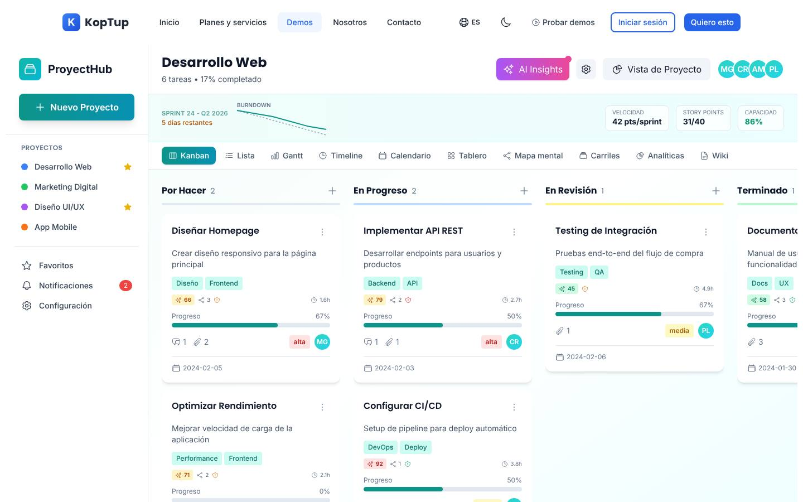
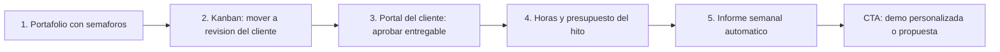
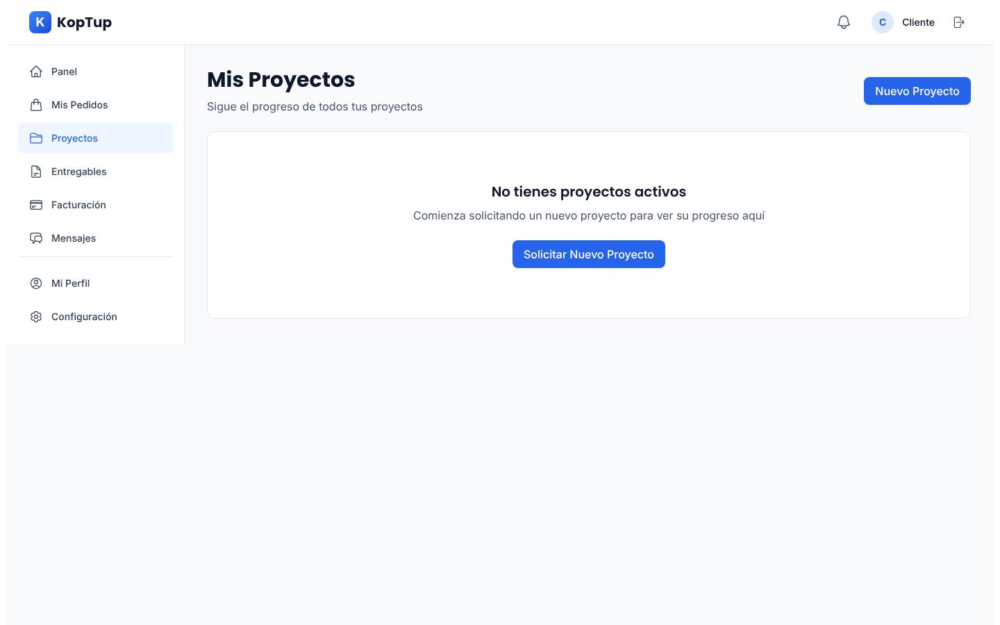

# Gestión de proyectos (con portal de cliente)

> Productividad (`productivity`) · Demo: `/demo/control-proyectos` · Modo de acceso recomendado: `publico` (versión con los proyectos, el sector y la marca del prospecto por `solicitud`) · Prioridad: **P2** (las correcciones de fechas son P1 en Fase 1 porque la demo está enlazada desde el inicio) · Esfuerzo total: **XL** (≈ 6–7 semanas de 1 dev senior para dejar landing + demo vendibles; las correcciones visibles de Fase 1 son S; el producto real se estima aparte)

*Captura actual de `/demo/control-proyectos` (vista Kanban). Ver también [Sistema de demos](04-Sistema-de-Demos.md), [Catálogo de productos](08-Catalogo-de-Productos.md) y [Roadmap](12-Roadmap.md). Productos relacionados: [Helpdesk IA](Producto-helpdesk-ia.md), [CRM con IA](Producto-crm-ia.md), [Automatización de workflows](Producto-automatizacion-workflows.md), [Gestor documental](Producto-gestor-documental.md), [Sistemas RAG](Producto-chatbot-rag-ia.md) y [Facturación electrónica](Producto-facturacion-electronica.md).*

> **Contexto de posicionamiento:** con el reposicionamiento de Koptup en sistemas RAG (ver [Visión de producto](02-Vision-de-Producto.md)), este producto queda dentro de **"Otras soluciones a medida"**. Como herramienta genérica de tareas compite con Trello, Asana, Monday o ClickUp, que cuestan entre USD 10 y 25 por usuario al mes. Solo es vendible si se presenta por lo que esas herramientas no traen: **un portal donde el cliente final ve el avance y aprueba**, flujos por sector (obra, agencia, consultoría) y conexión con horas, presupuesto y facturación. Koptup ya tiene esa base funcionando en su propio portal de clientes, lo que lo convierte en un buen candidato a SaaS después del chatbot RAG.

---

## Resumen

**Problema:** las empresas que venden proyectos (constructoras, agencias, consultoras, firmas de interventoría, casas de software) llevan el avance en Excel, en tableros sueltos y en varios grupos de WhatsApp. El cliente pregunta "¿cómo vamos?" todos los días, las aprobaciones se pierden en el correo y nadie sabe si el proyecto da plata hasta que termina.

**Para quién (cliente ideal en Colombia/LATAM):**
- Constructoras medianas y contratistas de obra con 3–30 frentes activos (bitácora, actas de avance, comités semanales, interventoría).
- Agencias de marketing, diseño y producción audiovisual con aprobaciones del cliente pieza por pieza.
- Consultoras, firmas de interventoría y de implementación de software que facturan por hitos u horas.
- Áreas de proyectos o PMO de empresas medianas que necesitan un portafolio con semáforos para gerencia.

**Para quién no (decirlo en la landing):** un equipo interno de 5 personas que solo necesita una lista de tareas; Trello o Asana gratis le bastan.

**Propuesta de valor:** "Tus proyectos al día y tu cliente informado sin perseguirlo por WhatsApp. Tareas, cronograma, horas y entregables en un solo lugar, con un portal con tu marca donde el cliente ve el avance, aprueba entregables y recibe el informe semanal. Hecho a la medida de cómo trabaja tu empresa."

---

## Estado actual

| Aspecto | Estado | Evidencia |
|---|---|---|
| Demo | Existe. **Maqueta** 100 % en el navegador: `'use client'`, sin `fetch`, `axios` ni llamadas a `/api` | `apps/web/src/app/demo/control-proyectos/page.tsx` |
| Pantallas | Barra lateral (marca "ProyectHub", "Nuevo Proyecto" con modal de plantillas, 4 proyectos, Favoritos, Notificaciones, Configuración) · encabezado "Desarrollo Web" con botón "AI Insights" (panel lateral), "Configurar proyecto" (modal: Automatizaciones, Dependencias, Ruta crítica, Recursos) y "Vista de Proyecto" (progreso, tareas atrasadas, estadísticas, calendario de vencimientos) · franja de sprint (burndown, velocidad, story points, capacidad) · **10 vistas**: Kanban, Lista, Gantt, Timeline, Calendario, Tablero, Mapa mental, Carriles, Analíticas y Wiki · modal de detalle de tarea (checklist, comentarios, adjuntos, historial) · panel de Integraciones | `page.tsx` y 16 componentes en `components/` (`SprintHeader`, `ViewSelector`, `AIInsightsDrawer`, `ProjectSettingsModal`, `TemplatesModal`, `IntegrationsPanel`, `GanttView`, `CalendarView`, `AnalyticsTab`, `WikiTab`, etc.) |
| Datos | 6 tareas de desarrollo web fijas en `page.tsx` con fechas de enero–febrero de **2024**; sprint "Sprint 24 - Q2 2026" y pronóstico "18 Jun / 25 Jun / 3 Jul" en el i18n; la "IA" se calcula con fórmulas sobre el id de la tarea | `page.tsx` (`tasks`), `taskHelpers.ts` (`getAiScore`, `getTaskMeta`), `control-proyectos.es.json` (`sprints`, `montecarlo`) |
| Backend | La demo no usa backend. **Pero Koptup sí tiene un sistema real de proyectos**: modelos `Project`, `Task`, `ProjectMember`, `Deliverable`, `Invoice` y `Message` en Mongo y rutas montadas en `/api/projects` (proyectos, miembros, tareas, estadísticas) que usa el portal del cliente `/dashboard/projects` | `apps/backend/src/models/Task.ts`, `Project.ts`, `ProjectMember.ts`, `apps/backend/src/routes/project.routes.ts`, `apps/web/src/lib/api.ts` |
| i18n ES/EN | `apps/web/messages/demos/control-proyectos.{es,en}.json` (317 líneas c/u, namespace `demoProjectsPro`) **más** el namespace `projectManager` (74 claves) dentro de `messages/es.json` y `en.json`, que se envía a todas las páginas del sitio. Texto fijo en el código: títulos "Board" y "Gantt", días "Dom…Sáb", "Español/English", tareas, personas y comentarios | `components/BoardView.tsx`, `GanttView.tsx`, `CalendarView.tsx`, `page.tsx` |
| Tests | **Ninguno** (no hay carpeta `__tests__`) | |
| Tamaño | 2.870 líneas (page 1.294; 16 componentes 1.445, el mayor `ProjectSettingsModal` con 266; `types.ts` 57; `taskHelpers.ts` 52; layout 22) | `wc -l` |
| SEO | Metadata `demo-control-proyectos` ("Gestión de Proyectos \| Software de Control y Seguimiento… Demo funcional") y breadcrumb JSON-LD "Control de Proyectos" | `apps/web/src/lib/seo-config.ts`, `layout.tsx` |
| Visibilidad | **Alta:** tarjeta "Gestión de Proyectos" en el inicio (`apps/web/src/app/page.tsx`), hub `/demo` y página `bienvenido-producthunt` | |
| CTA | Solo el `DemoCTA` genérico del layout de `/demo` | `apps/web/src/components/demo/DemoCTA.tsx` |
| Catálogo | Mapeo correcto (offering `gestion-proyectos` → demo `control-proyectos`), pero con **tres nombres**: "Gestión de proyectos" (catálogo), "Control de Proyectos" (breadcrumb) y "ProyectHub" (dentro de la demo) | `services-catalog.ts`, `layout.tsx`, `messages/es.json` (`projectManager.appName`) |

**Lo que hace bien:** es la demo más interactiva y pulida de este grupo. Se arrastran tareas entre columnas, se crean, duplican y eliminan; el checklist actualiza la barra de progreso; los comentarios se agregan; las notificaciones se marcan como leídas; se crea un proyecto desde una plantilla; las 8 vistas de tareas leen el mismo estado (un cambio en Kanban se ve en Lista o Calendario); el selector de vistas se adapta a celular (menú desplegable) y los modales de plantillas, configuración y "AI Insights" se cierran con Escape (`useModalClose`). El diseño transmite producto terminado.

### Problemas detectados (con ruta)

1. **Todo aparece atrasado:** las fechas son de 2024 (`dueDate: '2024-02-05'`, etc. en `page.tsx`), así que "Vista de Proyecto" muestra **5 tareas atrasadas** de 6 que "requieren atención inmediata". Al mismo tiempo, la franja dice "Sprint 24 - Q2 2026" y el pronóstico entrega el "25 de junio": tres fechas que se contradicen y que ya pasaron.
2. **Fechas corridas un día y calendario sin mes:** `CalendarView.tsx` y la vista de proyecto usan `new Date('2024-02-05').getDate()`, que interpreta la fecha en UTC; en Colombia (UTC−5) la tarea aparece el día anterior. El calendario no muestra mes ni año, compara solo el número del día y usa un desfase fijo de 2 casillas.
3. **Los proyectos de la barra lateral no hacen nada:** los botones no tienen `onClick`; el título es fijo (`projectManager.mainProject` = "Desarrollo Web"); los 4 proyectos comparten las mismas tareas, y Favoritos muestra para cada proyecto el mismo número de tareas activas y el progreso global.
4. **Controles sin efecto:** en Configuración, las casillas de notificaciones, "Vista predeterminada" e "Idioma"; el lápiz de editar proyecto; "Descargar" adjuntos; las páginas de la Wiki y "Abrir pizarra"; las 5 integraciones marcadas "Conectado" sin acción; el historial de cada tarea dice siempre "María G. creó esta tarea".
5. **"IA" que no es IA:** el puntaje "AI" de cada tarjeta es una fórmula sobre el id (`getAiScore`); dependencias, riesgo y horas también (`getTaskMeta`); el panel "AI Insights" (`AIInsightsDrawer.tsx`) muestra textos fijos ("Estimación IA: 8 días", "Simulación de 10.000 escenarios", OKR "Triplicar revenue ARR en 2026") con un punto rosado pulsante de "novedad". Un comprador técnico lo detecta y le resta credibilidad al resto.
6. **Demasiadas vistas y algunas vacías de contenido:** "Tablero" (`BoardView`) repite Kanban; "Mapa mental" y "Carriles" aportan poco; el Gantt (`GanttView.tsx`) ubica las barras por posición en la lista (`start = (i * 3) % 24`), sin fechas, sin eje y sin dependencias, y marca "Crítica" a toda tarea de prioridad alta; "Analíticas" (`AnalyticsTab.tsx`) son dibujos sin ejes ni números.
7. **IDs repetidos:** `addNewTask` y `duplicateTask` usan `id: tasks.length + 1` (y `addNewProject`, `projects.length + 1`). Si se elimina una tarea y luego se crea otra, el id se repite y React mezcla las tarjetas.
8. **Celular:** el arrastrar y soltar usa la API HTML5, que no funciona con el dedo; la barra lateral está oculta en celular (`hidden md:flex`) y no hay otro acceso a "Nuevo proyecto", Favoritos, Notificaciones ni Configuración.
9. **Marca confusa:** "ProyectHub" no es palabra en español ni en inglés; la página de Wiki dice "El proyecto Koptup busca consolidar todas las herramientas que un PM moderno necesita…", que mezcla la marca de Koptup con el producto que se vende.
10. **Solo habla a equipos de software:** "Implementar API REST", "Configurar CI/CD", PRs, "credenciales sandbox", "Permiso AWS", "Migrar logs a Datadog". Una constructora o una agencia no se ve reflejada, y no se muestra lo que diferencia a Koptup de Trello o Asana (portal del cliente, aprobaciones, horas y facturación).
11. **Inglés y jerga:** "AI Insights", "Story Points", "Burndown", "Velocity", "Cumulative Flow", "Control chart", "Lead time / Cycle time", "Board"; voseo en el i18n ("Elegí", "Conectá", "Empezá").
12. **Calendario de "Vista de Proyecto" aplastado:** usa `aspect-square`, que hoy no funciona por el plugin `@tailwindcss/aspect-ratio` (ver [WMS](Producto-wms-logistica.md), tarea 5).
13. **Textos del catálogo** (`apps/web/messages/offerings/gestion-proyectos.es.json`): voseo ("Controlá", "Comprala"), descripción de plantilla, `idealPara` sin sentido ("Equipos pequeños que recién arrancan con proyectos en simultáneo"), "Reportes mensuales del tier" 1 vez en Profesional, 1 en Avanzado y 2 en Enterprise, jerga ("ResourceManager por skill", "PPM portfolio management", "SSO + SCIM", "Tempo/Harvest tiempos"), "Jira/Linear sync" como función del plan Profesional (no es lo que pide una constructora) y **ningún plan menciona el portal del cliente**. El límite "Usuarios finales" figura como "N/A", aunque los invitados externos son justo el diferenciador; "Cuentas / tenants" no dice qué cuenta.

---

## Qué falta para que sea vendible

- **Fechas vivas:** que la demo siempre muestre un proyecto en curso, con 1–2 tareas atrasadas creíbles y no todas.
- **El diferenciador a la vista:** una vista **"Portal del cliente"** donde el cliente ve el avance, aprueba un entregable y comenta, y un informe semanal automático.
- **Escenarios por sector:** obra, agencia, consultoría y software, con nombres, estados y documentos de cada sector.
- **Menos es más:** 5 vistas que funcionen bien en lugar de 10; Gantt con fechas y dependencias reales; reportes con números.
- **IA honesta:** quitar los puntajes inventados; si se muestra IA, que sea el asistente RAG sobre los documentos del proyecto (actas, contratos, especificaciones), conectado con el producto principal de Koptup.
- **Un solo nombre** en catálogo, landing, demo y metadata.
- **Precio defendible** frente a herramientas de USD 10–25 por usuario: vender implementación a la medida + portal + integraciones, no "un Kanban".
- **Prueba social:** el caso más creíble hoy es el propio: "así gestionamos nuestros proyectos con clientes en Koptup".
- Capturas, video de 60–90 s y CTA contextual "Personalizar esta demo para mi empresa".

---

## Plan detallado

### Landing `/productos/gestion-proyectos`

Sigue la estructura común de [Landing de producto](Seccion-Landing-de-Producto.md):

1. **Hero:** "Tus proyectos al día y tu cliente informado, sin perseguirlo por WhatsApp". Subtítulo: "Tareas, cronograma, horas y entregables en un solo lugar, con un portal con tu marca donde tu cliente ve el avance y aprueba." CTA principal **"Solicitar demo personalizada"**; secundario "Agendar llamada"; enlace de texto "Probar la demo ahora" (modo `publico`).
2. **Problemas que resuelve** (3 tarjetas): "El avance vive en Excel y en cinco grupos de WhatsApp"; "Tu cliente pregunta '¿cómo vamos?' todos los días"; "No sabes si el proyecto da plata hasta que termina".
3. **Cómo funciona** (4 pasos): diagnóstico de 2 horas sobre cómo trabaja tu equipo → configuración de estados, plantillas por tipo de proyecto y portal con tu marca → migración de proyectos activos desde Excel, Trello o Asana → capacitación y acompañamiento mensual.
4. **Módulos con "Incluido desde":** Tablero, lista y calendario (Básico) · Tareas con checklist, comentarios y adjuntos (Básico) · Registro de horas (Básico) · Portal del cliente (Básico, hasta 10 invitados) · Cronograma con dependencias (Profesional) · Aprobación de entregables y actas (Profesional) · Facturación de hitos y horas (Profesional) · Portafolio con semáforos y presupuesto contra real (Avanzado) · Asistente IA sobre los documentos del proyecto (Avanzado, complemento basado en los [Sistemas RAG](Producto-chatbot-rag-ia.md)) · Inicio de sesión corporativo y conectores empresariales (Enterprise).
5. **Capturas** (galería de 6: Portafolio, Kanban, Cronograma, Portal del cliente, Horas y presupuesto, Informe semanal) y **video de 60–90 s**.
6. **Integraciones:** Google Workspace y Microsoft 365 (calendario, Drive/OneDrive, inicio de sesión), Slack y Teams, WhatsApp Business (avisos y aprobaciones), Siigo o Alegra (facturar hitos y horas; ver [Facturación electrónica](Producto-facturacion-electronica.md)), Wompi o PayU (enlace de pago del anticipo o del hito), GitHub/GitLab (solo equipos de software) y exportación a Power BI.
7. **Planes y precios:** "Compra / a medida" en COP con "desde"; SaaS como **"Lista de espera"** (DECISIÓN 7).
8. **Preguntas frecuentes:** ¿En qué se diferencia de Trello, Asana o Monday? · ¿Mi cliente tiene que pagar licencia para ver el avance? · ¿Puedo traer mis proyectos desde Excel o Trello? · ¿Sirve para obra (bitácora con fotos, actas, interventoría)? · ¿Se conecta con mi facturación? · ¿El código es mío? · ¿Dónde quedan mis datos?
9. **CTA final** con el formulario "Solicitar demo" con `gestion-proyectos` preseleccionado y campos extra opcionales: sector, número de proyectos activos, usuarios internos, herramienta actual.

### Demo interactiva (mejoras por pantalla/módulo)

| Pantalla / componente | Agregar | Quitar / corregir | Datos de ejemplo |
|---|---|---|---|
| Datos base (`page.tsx` → `fixtures/<sector>.ts`) | Fechas calculadas desde hoy (`hoy + n días`); 1 tarea atrasada, 2 por vencer y el resto en tiempo; ids únicos (contador o `crypto.randomUUID()`) | Fechas fijas de 2024; ids `length + 1` | Preset "Construcción": proyecto "Torre 2 — Conjunto Reservas del Río" (ficticio), tareas "Vaciado de placa piso 5", "Acta de avance de obra #7", "Pedido de acero de refuerzo", "Comité de obra semanal" |
| Barra lateral y encabezado | Clic en un proyecto cambia título, tareas y KPIs; portafolio con semáforo (en tiempo / en riesgo / atrasado); menú inferior en celular para Favoritos, Notificaciones y Configuración; nombre neutro del producto o la marca del prospecto | "ProyectHub"; título fijo "Desarrollo Web"; Favoritos con el progreso global | 3 proyectos por preset con avance distinto (72 %, 41 %, 15 %) |
| Franja de sprint (`SprintHeader.tsx`) | Mostrarla solo en el preset "Software"; en los demás, franja de **hito actual** (nombre, fecha, % de avance, presupuesto consumido) | "Sprint 24 - Q2 2026" fijo; "Story Points", "Velocity" en inglés | Hito "Estructura pisos 1 a 5 — vence en 9 días — 64 % — 58 % del presupuesto" |
| Vistas (`ViewSelector.tsx`) | Dejar 5: **Kanban**, **Lista**, **Calendario** (con mes, año y navegación), **Cronograma** (Gantt con fechas reales, eje temporal y flechas de dependencia fin-inicio) y **Reportes** (avance, horas contra presupuesto, tareas por estado, con números) | Tablero (duplica Kanban), Mapa mental, Carriles, Timeline (se integra en Cronograma), Wiki y pizarra | — |
| Kanban | Arrastrar y soltar compatible con el dedo (biblioteca accesible, p. ej. dnd-kit); columna "En revisión del cliente" que dispara la notificación al portal | — | Estados por preset: Obra "Programada / En ejecución / Revisión interventoría / Recibida" |
| Detalle de tarea | Historial real (registra los cambios de la sesión); adjunto de ejemplo descargable (PDF del acta); registro de horas en la tarea | "María G. creó esta tarea" en todas | Acta de avance #7 en PDF de una página con datos ficticios |
| **Portal del cliente** (nuevo) | Botón "Ver como cliente": vista con la marca del proyecto, avance por hito, fotos de avance, entregables para **Aprobar / Pedir cambios**, comentarios; la aprobación vuelve al tablero del equipo | — | Cliente ficticio "Fiduciaria del proyecto" o "Gerente de marca de Café La Montaña" (ficticio) |
| **Horas y presupuesto** (nuevo, dentro de Reportes) | Horas registradas contra presupuesto por proyecto; alerta de sobrecosto; botón "Facturar hito" con vista previa del enlace de pago y del envío a Siigo/Alegra (simulado) | — | Presupuesto del hito $180 M; ejecutado $104 M |
| Panel "AI Insights" (`AIInsightsDrawer.tsx`) | Reemplazar por **"Resumen de la semana"** calculado con los datos de la demo (tareas cerradas, atrasadas, próximos vencimientos) con etiqueta "Ejemplo"; tarjeta "Pregúntale a tus documentos" como complemento RAG del plan Avanzado | Puntaje "AI" en cada tarjeta (`getAiScore`), riesgo y dependencias inventados (`getTaskMeta`), Monte Carlo "10.000 escenarios", OKR de "revenue ARR", punto pulsante | Resumen: "Esta semana se cerraron 9 tareas; 1 atrasada: Pedido de acero (3 días)" |
| Configuración (sección `settings`) y `ProjectSettingsModal.tsx` | Que las preferencias funcionen o quitarlas; Automatizaciones con 3 reglas en lenguaje de cliente ("Si el cliente aprueba, mover a Recibida y avisar al equipo") | Casillas e "Idioma" sin efecto; lápiz de editar sin acción | — |
| Integraciones (`IntegrationsPanel.tsx`) | Mostrar como "Integraciones disponibles" con insignia de plan | "Conectado" en las 5 | Google Workspace, Microsoft 365, WhatsApp, Siigo, Alegra |
| Global | Aviso "Datos de ejemplo"; banner "¿La quieres con tus proyectos y tu marca? Solicita tu demo personalizada"; botón "Iniciar recorrido"; CTA final "Solicitar propuesta" | `DemoCTA` genérico | — |

**Recorrido guiado (5 pasos, menos de 3 minutos):**

> [Ver diagrama como imagen](images/diagramas/Producto-gestion-proyectos-1.png)

1. **Portafolio:** "Tienes 3 proyectos; Torre 2 va en riesgo: el pedido de acero lleva 3 días de atraso".
2. **Kanban:** mover "Acta de avance #7" a "Revisión del cliente"; aparece la notificación que recibirá el cliente.
3. **Portal del cliente:** cambiar a la vista del cliente, ver fotos y avance, y **aprobar** el acta con un comentario.
4. **Horas y presupuesto:** el hito "Estructura pisos 1 a 5" lleva 58 % del presupuesto con 64 % de avance; botón "Facturar hito" (simulado).
5. **Informe semanal:** vista previa del informe en PDF y del mensaje de WhatsApp que llega al cliente cada lunes. Cierre con CTA "Solicitar demo personalizada" / "Solicitar propuesta".

### Acceso y solicitud de demo

- **Modo recomendado: `publico`** con banner "Solicita tu demo guiada". Razones: ya está enlazada desde el inicio y desde la página de Product Hunt; los datos son genéricos y no sensibles; se entiende sin explicación; sirve como imán de leads y para posicionamiento en "software de gestión de proyectos". La **versión personalizada** (preset de su sector, su marca, el portal del cliente con su logo) va por `solicitud`.
- **Duración del acceso personalizado:** **14 días** (por defecto), con sesión guiada opcional de 30–45 min; extensible 7 días.
- **Qué ve el visitante antes de solicitar:** la demo completa con datos de ejemplo, más la landing con capturas y el video. La demo pública no pide registro.
- **Formulario:** el general de [Sistema de demos](04-Sistema-de-Demos.md) más sector, número de proyectos activos, usuarios internos y herramienta actual.
- **Prospecto aprobado** (Portal › Mis demos, ver [Portal del cliente](06-Portal-del-Cliente.md)): tarjeta "Gestión de proyectos — <Empresa>" con días restantes, botón "Abrir demo" (carga su preset y su marca), botón "Invitar a mi equipo" (hasta 3 usuarios) y CTA "Solicitar propuesta" / "Agendar llamada".
- **Eventos `DemoEvent`:** vistas abiertas, tareas movidas o creadas, portal del cliente abierto, aprobación realizada, pasos del recorrido completados, clic en banner y CTA.

### Personalización por cliente

Sin código, desde **Admin › Solicitudes de demo › Aprobar** (o Admin › Demos › Personalizar), guardado en `DemoGrant.personalizacion`. Ver [Panel de administración](05-Panel-de-Administracion.md).

| Campo | Efecto en la demo |
|---|---|
| Logo y color primario | Barra lateral, botones y **portal del cliente** |
| Nombre de la empresa | Encabezado, informe semanal y mensajes de ejemplo |
| Sector (preset) | Dataset completo: Construcción y obra civil · Agencia de marketing y diseño · Consultoría e interventoría · Equipo de software · Eventos y producción |
| Nombre del cliente final de ejemplo | Portal del cliente e informe semanal |
| Estados del tablero (hasta 6) | Columnas del Kanban y del reporte |
| Plan cotizado | Muestra solo los módulos incluidos; el resto aparece bloqueado con "Disponible en plan X" |
| Idioma (es / en) | Textos y formatos de fecha |

**Implementación:** mover las tareas, proyectos, notificaciones y textos de ejemplo a `apps/web/src/app/demo/control-proyectos/fixtures/<sector>.ts` con fechas relativas; la página lee la configuración de `GET /api/demo-access/control-proyectos` (DECISIÓN 3) cuando hay grant y usa el preset genérico cuando es pública.

### Producto real

*El portal de clientes de Koptup (`/dashboard/projects`) ya usa modelos y rutas reales de proyectos, tareas, miembros, entregables y facturas. Es la base natural del producto.*

**Alcance MVP — modalidad compra (plan Profesional; 8–12 semanas reales sobre la base existente):**
- **Proyectos y plantillas:** espacios, proyectos con cliente, responsable, fechas, presupuesto y estado; plantillas por tipo de proyecto.
- **Tareas:** estados configurables, responsables, fechas, prioridad, checklist, comentarios con menciones, adjuntos en almacenamiento de objetos, historial de cambios.
- **Vistas:** Kanban, lista, calendario y cronograma con dependencias fin-inicio.
- **Horas y presupuesto:** registro de horas por tarea, presupuesto por hito, alertas de sobrecosto.
- **Portal del cliente:** invitados externos sin costo de licencia, con permisos por proyecto: ver avance y fotos, aprobar o pedir cambios en entregables y actas, comentar y descargar informes.
- **Comunicación:** informe semanal automático (PDF, correo y WhatsApp Business con plantillas aprobadas por Meta), notificaciones por evento.
- **Facturación:** hitos facturables con enlace de pago Wompi o PayU (PSE, Nequi, tarjetas) y envío a Siigo o Alegra para emitir la factura electrónica.
- **Obra (preset construcción):** bitácora con fotos geolocalizadas desde el celular (app web progresiva) y actas de avance.
- **Transversal:** roles y permisos por proyecto con autorización en servidor, auditoría, importación desde Excel/CSV (Trello y Asana exportan CSV), copias de seguridad.
- **Base técnica:** reutilizar `Project`, `Task`, `ProjectMember`, `Deliverable`, `Invoice` y `Message` (`apps/backend/src/models/`) y las rutas `/api/projects`, ampliando estados (`Task.status` hoy es fijo: `todo | in_progress | review | completed | blocked`), dependencias, horas por tarea, invitados externos y `tenantId`.

**SaaS (DECISIÓN 7):** hoy no hay multi-tenant ni cobro recurrente → **"SaaS: lista de espera"**. Es el mejor candidato del catálogo para ser el **segundo SaaS** después del chatbot RAG, porque el modelo de datos ya existe y Koptup lo usa a diario. Requisitos (Fase 4): `tenantId` y aislamiento en todos los modelos anteriores, autorización por empresa y por rol de proyecto verificada en servidor, alta de cuenta en autoservicio, cobro recurrente por usuario con Wompi o PayU (COP) y Stripe (USD), invitados ilimitados o con cupo por plan, límites medidos (proyectos activos, almacenamiento), exportación completa de datos y copias por cliente.

### Planes y precios

Precios actuales del catálogo (`apps/web/src/lib/services-catalog.ts`, entrada `gestion-proyectos`; COP):

| Plan | Compra: setup | Compra: mantenimiento/mes | SaaS: setup | SaaS: mes | Volumen incluido | Usuarios admin / cuentas | Implementación (catálogo) | Costos del cliente al proveedor (USD/mes) |
|---|---|---|---|---|---|---|---|---|
| Básico | $35.000.000 | $3.200.000 | $2.900.000 | $1.190.000 | 25 proyectos activos | 10 / 1 | 2–5 semanas | 50–200 (hosting, base de datos, correo) |
| Profesional | $90.000.000 | $8.000.000 | $6.900.000 | $2.890.000 | 250 proyectos activos | 50 / 5 | 5–9 semanas | 300–1.000 (+ Slack/Teams, monitoreo) |
| Avanzado | $210.000.000 | $18.000.000 | $12.900.000 | $5.490.000 | 2.500 proyectos activos | 150 / 25 | 9–14 semanas | 1.500–5.000 (+ conectores Jira/Azure DevOps) |
| Enterprise | $450.000.000 | $35.000.000 | $0 (se muestra "Personalizado") | $9.890.000 | 25.000+ proyectos activos | Ilimitados | 12–20 semanas | 5.000–18.000 (+ PPM, BI, SSO/SCIM) |

Usuarios finales: "N/A" en todos los planes. Almacenamiento: 10 GB / 80 GB / 400 GB / ilimitado. Horas de evolutivos incluidas por mes: 5 / 12 / 25 / 50. Soporte: correo 24 h hábiles / + WhatsApp 4 h / + Slack Connect 2 h / tickets con SLA 1 h. Ciclos SaaS: semestral −10 %, anual −20 %. Referencia en USD con TRM 3.300: setup de compra ≈ USD 10.610 / 27.270 / 63.640 / 136.360; SaaS ≈ USD 360 / 880 / 1.660 / 3.000 al mes.

**Recomendaciones de claridad:**
1. **Frente al mercado:** 10 usuarios en Asana o Monday cuestan del orden de USD 100–250 al mes; el SaaS Básico de Koptup cuesta ≈ USD 360 al mes más setup, y la compra Básica equivale a varios años de esas licencias. No vender "un Kanban": vender **implementación a la medida + portal del cliente + integraciones**, y decirlo en la landing con una tabla "Herramienta genérica vs Koptup".
2. **Mantenimiento incoherente:** 12 × $3,2 M = $38,4 M al año (110 % del setup Básico) y es 2,7 veces la cuota SaaS ($1,19 M). A 3 años, la compra Básica cuesta $150,2 M y el SaaS $45,7 M. Aplicar la política común de mantenimiento (porcentaje anual del setup o bolsa de horas) de [Catálogo de productos](08-Catalogo-de-Productos.md).
3. **SaaS → "Lista de espera"** hasta la Fase 4. Para cuando exista, **decisión del dueño:** pasar a precio por usuario interno con invitados del cliente sin costo (referencia de mercado: USD 8–15 por usuario al mes) en lugar de 4 planes fijos.
4. **Bullets en lenguaje de cliente y con el diferenciador.** Propuesta: **Básico** "Hasta 10 usuarios y 25 proyectos activos · Tablero, lista y calendario · Tareas con responsables, fechas, checklist y comentarios · Registro de horas · Portal para tu cliente (hasta 10 invitados) · Avisos por correo". **Profesional** "+ Hasta 50 usuarios y 250 proyectos · Cronograma con dependencias · Plantillas por tipo de proyecto · Aprobación de entregables por el cliente · Avisos e informe semanal por WhatsApp · Google Workspace o Microsoft 365 · Facturación de hitos con Siigo o Alegra". **Avanzado** "+ Hasta 150 usuarios · Portafolio con semáforos y presupuesto contra real · Capacidad del equipo · Campos y estados a tu medida · Asistente IA sobre los documentos del proyecto". **Enterprise** "+ Usuarios ilimitados · Inicio de sesión corporativo (SSO) · Conectores con Azure DevOps, Jira o ServiceNow · Tableros en Power BI · Gerente de proyecto dedicado".
5. **Límites que se entiendan:** reemplazar "Usuarios finales: N/A" por **"Invitados del cliente"** (10 / 100 / 500 / ilimitados) y "Cuentas / tenants" por **"Espacios de trabajo"**.
6. **Tiempos:** con la base existente, el Básico puede salir en 4–6 semanas; ajustar el resto a 8–12 / 12–18 / 16–24 semanas mediante el override por offering.
7. Quitar "Reportes mensuales del tier" repetido, usar tuteo, descripción propia, `idealPara` real (p. ej. Básico: "Agencias, consultoras y contratistas con hasta 25 proyectos al mismo tiempo") y dar cifras en el `costoNote` (USD 50–18.000, como el catálogo).

Detalle de la política comercial común en [Catálogo de productos](08-Catalogo-de-Productos.md) y [Comercial, marketing y legal](11-Comercial-Marketing-y-Legal.md).

---

## Tareas

| # | Tarea | Fase | Prioridad | Esfuerzo | Criterio de aceptación |
|---|---|---|---|---|---|
| 1 | Fechas vivas: generar las fechas de tareas, sprint y pronóstico desde hoy; parsear fechas en hora local en `CalendarView.tsx` y en "Vista de Proyecto"; calendario con mes, año y navegación | Fase 1 — Funnel y solicitud de demos | P1 | S | Abrir la demo cualquier día muestra 1 tarea atrasada (no 5); una tarea con vencimiento el día 5 aparece el día 5 en Bogotá |
| 2 | Un solo nombre comercial ("Gestión de proyectos con portal de cliente") en catálogo, landing, demo (reemplaza "ProyectHub"), breadcrumb y metadata; textos del offering sin voseo, sin duplicados, con el portal del cliente en los bullets, en ES y EN | Fase 1 — Funnel y solicitud de demos | P1 | S | Ninguna aparición de "ProyectHub" ni de "Control de Proyectos"; `gestion-proyectos.{es,en}.json` sin bullets repetidos |
| 3 | Landing `/productos/gestion-proyectos` con las 9 secciones y la tabla "Herramienta genérica vs Koptup" | Fase 1 — Funnel y solicitud de demos | P1 | M | Página publicada; "Solicitar demo personalizada" abre el formulario con el producto preseleccionado y el campo sector |
| 4 | Registrar `DemoCatalogItem` `control-proyectos` en modo `publico` con banner "Solicita tu demo guiada" y CTA contextual; versión personalizada por solicitud con 14 días | Fase 1 — Funnel y solicitud de demos | P1 | S | La demo abre sin registro y muestra el banner; con grant carga el preset y la marca del prospecto, verificado en servidor |
| 5 | Proyectos de la barra lateral funcionales (cada proyecto con sus tareas y su avance), ids únicos en tareas y proyectos | Fase 2 — Demos vendibles | P1 | S | Cambiar de proyecto cambia título, tareas y KPIs; crear después de eliminar no duplica ids (prueba automatizada) |
| 6 | Reducir a 5 vistas (Kanban, Lista, Calendario, Cronograma con fechas y dependencias, Reportes con números) y retirar Tablero, Mapa mental, Carriles, Timeline, Wiki y pizarra | Fase 2 — Demos vendibles | P1 | M | El cronograma dibuja las barras según fechas reales con flechas de dependencia; cada reporte muestra ejes y valores |
| 7 | IA honesta: quitar `getAiScore`/`getTaskMeta` de las tarjetas y el contenido fijo de `AIInsightsDrawer.tsx`; reemplazar por "Resumen de la semana" calculado y tarjeta del complemento RAG | Fase 2 — Demos vendibles | P1 | S | Ningún número presentado como "IA" sale de una fórmula sobre el id; el resumen cambia al mover tareas |
| 8 | Presets por sector en `fixtures/` (construcción, agencia, consultoría, software, eventos) con estados, tareas y documentos propios | Fase 2 — Demos vendibles | P1 | M | Cambiar de preset cambia proyectos, estados, tareas y textos del portal; ningún término de software en el preset de construcción |
| 9 | Vista "Portal del cliente" (avance por hito, fotos, aprobar o pedir cambios, comentarios) e "Informe semanal" con vista previa de PDF y WhatsApp | Fase 2 — Demos vendibles | P1 | M | Aprobar en el portal mueve la tarea en el Kanban del equipo en la misma sesión |
| 10 | Controles sin efecto (Configuración, editar proyecto, Descargar, Integraciones "Conectado"); arrastrar y soltar táctil; menú de navegación en celular | Fase 2 — Demos vendibles | P2 | M | Checklist con 0 controles sin efecto; en un celular se mueve una tarea y se abren Notificaciones |
| 11 | Recorrido guiado de 5 pasos, aviso "Datos de ejemplo", 6 capturas y video de 60–90 s | Fase 2 — Demos vendibles | P1 | M | Recorrido completable en < 3 min; capturas en `docs/wiki/images/` y en la landing |
| 12 | Mover `projectManager` de `messages/es.json`/`en.json` a `messages/demos/control-proyectos.*.json`; traducir textos fijos ("Board", "Gantt", días); dividir `page.tsx` (1.294 líneas) y agregar smoke test | Fase 0 — Endurecimiento | P2 | M | `messages/es.json` sin el namespace `projectManager`; smoke test en CI; ningún archivo del demo supera 400 líneas |
| 13 | Plantilla de propuesta en el `Quote` ampliado (implementación, usuarios, invitados, integraciones) y diagnóstico de 2 h | Fase 3 — Propuestas y conversión | P2 | S | El comercial genera la propuesta en PDF desde el admin en < 20 min |
| 14 | Producto SaaS sobre la base existente: `tenantId` y aislamiento en `Project`, `Task`, `ProjectMember`, `Deliverable`, `Invoice`, `Message`; invitados externos; cobro recurrente por usuario | Fase 4 — Productos SaaS reales | P3 | XL | Dos empresas de prueba operan en la misma instalación sin ver datos entre sí (pruebas de autorización en servidor); cobro recurrente en sandbox de Wompi |
| 15 | Caso de estudio "Así gestionamos nuestros proyectos con clientes en Koptup" y primer caso de cliente externo | Fase 5 — Escala | P3 | S | Caso publicado con cifras (tiempo de respuesta al cliente, aprobaciones a tiempo) y autorización escrita |

---

## Métricas de éxito

Son **metas** iniciales a validar con datos reales; no son resultados actuales.

- ≥ 40 % de los visitantes de la demo pública pasan más de 90 s en ella y ≥ 30 % completan el recorrido.
- Clic en el banner "Solicita tu demo guiada" ≥ 3 % de las sesiones de la demo; conversión a solicitud enviada ≥ 1,5 %.
- ≥ 60 % de las solicitudes con sector "construcción", "agencia" o "consultoría" (señal de que el mensaje del portal funciona).
- ≥ 25 % de las demos personalizadas terminan en propuesta en ≤ 21 días.
- 0 tareas "atrasadas" falsas: la demo muestra exactamente 1 tarea atrasada cualquier día del año (prueba automatizada).
- Primer contrato en los 6 meses siguientes a la Fase 2; decisión sobre el segundo SaaS con al menos 20 empresas en la lista de espera.
