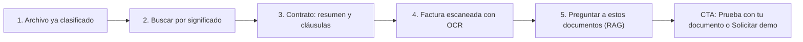

# Gestor documental con IA

> Datos (`data`) · Demo: `/demo/gestor-documentos` · Modo de acceso recomendado: `publico` en **modo muestra** (subir documentos propios y las funciones con costo de IA solo con acceso aprobado por `solicitud`) · Prioridad: **P1** · Esfuerzo total: **XL** (≈ 4–5 semanas de 1 dev senior para dejar demo + landing vendibles, incluido el endurecimiento del backend; el producto real se estima aparte)

*Captura actual de `/demo/gestor-documentos` en producción: muestra "Error al cargar documentos" con todos los contadores en 0. Ver también [Sistema de demos](04-Sistema-de-Demos.md), [Catálogo de productos](08-Catalogo-de-Productos.md) y [Roadmap](12-Roadmap.md). Productos relacionados: [Sistemas RAG](Producto-chatbot-rag-ia.md), [Firma electrónica](Producto-firma-electronica.md), [Facturación electrónica](Producto-facturacion-electronica.md) y [Gestión de proyectos](Producto-gestion-proyectos.md).*

> **Contexto de posicionamiento:** con el reposicionamiento de Koptup en sistemas RAG (ver [Visión de producto](02-Vision-de-Producto.md)), este producto queda formalmente en **"Otras soluciones a medida"**, pero es **el más cercano al producto principal**. La demo ya hace la mitad de un RAG:
> - sube PDF, DOCX y TXT;
> - extrae el texto;
> - genera resumen, etiquetas y entidades con IA;
> - calcula embeddings;
> - busca por significado y explica por qué coincide.
>
> Debe venderse como **"el archivo ordenado que alimenta tu asistente RAG"**: el RAG responde citando y el gestor documental organiza, versiona, retiene y controla quién ve qué. Por eso su prioridad es P1 y su backend es candidato a fusionarse con la ingesta del chatbot en un núcleo documental común (Fase 4).

---

## Resumen

**Problema:** en las empresas colombianas los contratos, las facturas, las hojas de vida, las actas y los soportes contables viven repartidos en carpetas compartidas, correos, WhatsApp y papel. Las consecuencias:
- Nadie encuentra la última versión.
- Los vencimientos de contratos se pasan.
- Los tiempos de retención no se cumplen.
- Responder a una auditoría, un requerimiento de la DIAN o de la Supersalud, o un proceso judicial toma días de búsqueda manual.

**Para quién (cliente ideal en Colombia/LATAM):**
- **IPS y clínicas:** anexos de historia clínica, consentimientos informados, soportes de facturación a EPS y respuestas a glosas.
- **Firmas de abogados y áreas jurídicas:** contratos, poderes, vencimientos y cláusulas de riesgo.
- **Constructoras e inmobiliarias:** escrituras, licencias, pólizas, actas de obra y planos.
- **Áreas contables y financieras:** facturas electrónicas (XML y PDF), soportes contables y certificados.
- **Recursos humanos:** hojas de vida, contratos laborales y afiliaciones.
- **Entidades públicas y sus contratistas:** radicación y tablas de retención documental (TRD).

**Propuesta de valor:** "Sube o reenvía tus documentos y el sistema los lee, los clasifica y te deja encontrarlos preguntando como hablas, con versiones, permisos y tiempos de retención en un solo lugar. Si lo conectas al asistente RAG, tu equipo obtiene respuestas que citan el documento y la página."

---

## Estado actual

| Aspecto | Estado | Evidencia |
|---|---|---|
| Demo | Existe. **Parcial:** el núcleo llama al backend real y la capa "PRO" es maqueta | `apps/web/src/app/demo/gestor-documentos/page.tsx` usa `useDocuments` (`apps/web/src/hooks/useDocuments.ts`), que llama a `/api/documents/*` |
| Funciones reales | Listar, subir (arrastrar o seleccionar), favoritos, recientes, papelera con restauración, carpetas, renombrar, mover, búsqueda por texto, **búsqueda semántica**, **"Explicar con IA"** y **"¿Por qué coincide?"** (`explain-similarity`) | `useDocuments.ts` (11 llamadas a la API) |
| Funciones maqueta ("PRO") | OCR, extracción de cláusulas, comparar versiones, marca de agua, retención y retención legal, e-discovery, cifrado, firma por niveles y 5 canales de ingesta | `components/OcrDrawer.tsx`, `ClausesDrawer.tsx`, `VersionsDiffModal.tsx`, `WatermarkToggle.tsx`, `RetentionPanel.tsx`, `RetentionBadges.tsx`, `EDiscoveryModal.tsx`, `EncryptionSettingsModal.tsx`, `SignatureMenu.tsx`, `UploadMenu.tsx` |
| Backend | 11 rutas montadas en `/api/documents`. El modelo Mongo `Document` guarda texto, etiquetas, resumen, entidades y `embedding`. El análisis usa `gpt-4o-mini` y los embeddings, `text-embedding-ada-002`. La extracción se hace con `pdf-parse`, `mammoth` y lectura de TXT/CSV. Los archivos van a S3 si está configurado; si no, al disco local del servidor (efímero en Railway) | `apps/backend/src/routes/document.routes.ts`, `controllers/document.controller.ts` (633 líneas), `models/Document.ts`, `services/document-ai.service.ts`, `services/embedding.service.ts` |
| Búsqueda semántica | Compara la consulta contra los embeddings de todos los documentos en la memoria del proceso. No hay índice vectorial | `searchDocumentsBySemantic` en `document.controller.ts` |
| OCR | **No hay OCR real:** un PDF escaneado no tiene capa de texto, así que queda sin resumen y sin búsqueda. El plan Básico promete "OCR básico Tesseract" | `uploadDocument` en `document.controller.ts` |
| Datos de ejemplo | **Ninguno precargado.** La vista inicial depende del estado del backend; en producción, error y contadores en 0 (captura de arriba) | — |
| i18n ES/EN | `docManager` (75 claves) en `apps/web/messages/{es,en}.json` y `demoDocsPro` (139) en `apps/web/messages/demos/gestor-documentos.{es,en}.json`. Los errores salen con `alert()` en español fijo | `page.tsx` (14 `alert`/`console.error`) |
| Tests | Ninguno, ni en el front ni en el backend de documentos | — |
| Tamaño | 2.386 líneas en la carpeta de la demo (`page.tsx` 1.317 + 11 componentes), más 283 del hook y ≈ 1.160 del backend | `wc -l` |
| SEO y nombres | La metadata `demo-gestor-documentos` dice "Gestor Documental Médico \| Organización de Archivos Clínicos" y afirma "Cumple normatividad de archivo clínico" (la rama `rag-reposicionamiento` lo conserva); el breadcrumb dice "Gestor Documental Médico". La demo se llama "DocuIA", la oferta "Gestor documental con IA" y el home "Gestor Documental" | `apps/web/src/lib/seo-config.ts`, `layout.tsx`, `page.tsx` |
| CTA | Solo el `DemoCTA` genérico del layout de `/demo` | `apps/web/src/components/demo/DemoCTA.tsx` |
| Catálogo | Mapeo correcto: offering `gestor-documental` → demo `gestor-documentos`. La semilla de [Sistema de demos](04-Sistema-de-Demos.md) lo marca como "Backend real: No"; debe corregirse a **"Parcial"** | `services-catalog.ts` |

**Lo que hace bien:** es una de las pocas demos con IA real. Con el backend funcionando, subir un contrato devuelve en segundos el resumen, las etiquetas y las entidades, y la búsqueda semántica encuentra documentos por significado y explica por qué. Además:
- La papelera se puede restaurar y la búsqueda por texto tiene *debounce*.
- La interfaz es moderna y la capa PRO tiene i18n completo.
- Los paneles PRO cuentan bien la historia "empresarial": retención por carpeta, retención legal, e-discovery y firma.

### Problemas detectados (con ruta)

1. **Primera impresión rota:** error de carga visible y lista vacía. Sin un corpus de ejemplo, el visitante no puede probar la búsqueda semántica sin subir algo propio.
2. **Controles decorativos:**
   - El selector BM25 / Dense / Hybrid de `DocsTopbar.tsx` no cambia nada: `searchMode` no se usa en la búsqueda.
   - Los filtros de tipo y fecha (`<select>` en `page.tsx`) no tienen `onChange`.
   - Los interruptores de Configuración (procesamiento automático, búsqueda semántica, etiquetado) no se guardan ni tienen efecto.
3. **Maquetas que contradicen el documento abierto:**
   - `OcrDrawer.tsx` muestra siempre la misma factura ("Koptup Solutions S.A.S.", $5.940.000), sea cual sea el archivo.
   - `ClausesDrawer.tsx` muestra siempre las mismas 4 cláusulas de un contrato fijo.
   - La "vista previa" es un esqueleto gris: nunca se ve el documento.
   - La marca de agua lleva un nombre y una fecha fijos en el código.
4. **Borrar pide un PIN** que el prospecto no conoce: confunde y no reemplaza a los permisos por rol.
5. **Promesas sin respaldo:**
   - La metadata afirma "Cumple normatividad de archivo clínico".
   - La oferta lista "ECM enterprise (Documentum/OpenText)", "SAP ArchiveLink adapter", "eDiscovery legal" y "Retención WORM" sin que exista nada de eso.
   - La firma habla de niveles "eIDAS" (norma europea) en lugar de los conceptos colombianos: firma electrónica (Decreto 2364 de 2012) y firma digital con certificado de una entidad acreditada ante ONAC.
6. **Enfoque mezclado:** el SEO es médico, la demo es genérica (retención de Contratos, Facturas, RRHH, Marketing) y la oferta es genérica.
7. **No escala al plan que se vende:** búsqueda lineal en memoria y modelo de embeddings antiguo frente a 50.000 documentos al mes en Profesional.
8. **Duplicación con el RAG:**
   - El chatbot tiene su propia ingesta (`apps/backend/src/routes/chatbot.routes.ts` + `data/chatbot-store`).
   - Conviven dos servicios de embeddings (`embedding.service.ts` y `embeddings.service.ts`).
9. **Textos del catálogo** (`apps/web/messages/offerings/gestor-documental.es.json`):
   - Usan voseo ("Ordená, buscá y firmá", "Comprala").
   - La descripción es de plantilla ("Implementación a medida o suscripción SaaS mensual del producto…").
   - "Reportes mensuales del tier" aparece como relleno en Profesional, Avanzado y Enterprise.
   - Hay siglas sin explicar: IDP, DLP, BPMN, WORM.
   - El `costoNote` dice OCR "USD 30–10.000/mes" y el catálogo dice USD 50–20.000.

---

## Qué falta para que sea vendible

- **Corpus de ejemplo precargado por sector:** 20–25 documentos ficticios en español (contratos, facturas electrónicas, actas, hojas de vida, licencias), con análisis y embeddings precalculados. Así la búsqueda semántica funciona desde el primer segundo.
- **Ver el documento:** visor PDF real con el fragmento encontrado resaltado.
- **OCR real** para documentos escaneados, al menos en el modo con acceso aprobado.
- **Retención explicada en lenguaje claro**, ligada a tablas de retención documental (TRD) de ejemplo y marcada como ilustrativa.
- **Puente explícito con el RAG:** botón "Preguntar a estos documentos" que abre el asistente y responde citando.
- **Endurecer y aislar el backend de la demo** antes de promocionarla (ver tareas de la Fase 0).
- **Quitar promesas no verificables**, unificar el nombre y poner insignias "Incluido desde plan X".
- **Precio coherente con los planes RAG** (ver [Planes y precios](#planes-y-precios)).
- **CTA contextual, capturas y video** de 60–90 s.

---

## Plan detallado

### Landing `/productos/gestor-documental`

Sigue la estructura común de [Landing de producto](Seccion-Landing-de-Producto.md):

1. **Hero:**
   - Título: "Encuentra cualquier documento de tu empresa en segundos, preguntando como hablas".
   - Subtítulo: "Súbelos o reenvíalos por correo: la IA los lee, los resume y los clasifica. Versiones, permisos y tiempos de retención en un solo lugar."
   - CTA principal **"Solicitar demo"**, secundario "Agendar llamada" y enlace "Probar con documentos de ejemplo".
2. **Problemas que resuelve** (3 tarjetas):
   - "¿Cuál es la última versión del contrato?"
   - Vencimientos y renovaciones que se pasan.
   - Auditorías y requerimientos que toman días.
3. **Cómo funciona** (3 pasos):
   1. **Entran los documentos:** carga web, buzón de correo de radicación, celular o escáner, Google Drive o SharePoint.
   2. **La IA los lee y organiza:** OCR, tipo de documento, fechas, NIT, partes y valores.
   3. **Encuentras, compartes y firmas** con permisos por carpeta.
4. **Capturas y video:**
   - Galería de 4: Archivo con carpetas y retención, Búsqueda por significado con fragmento resaltado, Visor con resumen y entidades, Factura escaneada con OCR.
   - Video de 60–90 s.
5. **Por sector** (pestañas). Las normas se citan como referencia y cada configuración la valida el archivista o asesor legal del cliente:
   - Salud: anexos de historia clínica y consentimientos (Res. 1995 de 1999 y Res. 839 de 2017).
   - Legal: contratos, vencimientos y cláusulas.
   - Contable: facturas electrónicas y soportes (conservación de libros y papeles del comerciante, Ley 962 de 2005).
   - Sector público: TRD y gestión de archivo (Ley 594 de 2000).
6. **Con tu asistente RAG:** bloque "Conecta tu archivo a un asistente que responde citando la fuente", con enlace a `/rag` y a los planes RAG.
7. **Integraciones:**
   - Google Drive, SharePoint y OneDrive.
   - Gmail y Outlook (buzón de radicación).
   - App de celular para escanear.
   - [Firma electrónica](Producto-firma-electronica.md).
   - Proveedores de factura electrónica DIAN (XML) y Siigo o Alegra (adjuntar soportes a comprobantes).
   - WhatsApp Business (recibir documentos de clientes).
   - Inicio de sesión con Google o Microsoft.
8. **Planes y precios:** "Compra / a medida" en COP, con USD de referencia a `TRM_REFERENCIA = 3.300`. SaaS como **"Lista de espera"** (DECISIÓN 7), con nota "candidato a SaaS junto con el RAG".
9. **Preguntas frecuentes:**
   - ¿Dónde quedan mis documentos y quién puede verlos?
   - ¿Funciona con documentos escaneados?
   - ¿Tiene validez legal un documento digitalizado? (Ley 527 de 1999, mensajes de datos).
   - ¿Cómo se manejan los datos sensibles de salud (Ley 1581)?
   - ¿Pueden migrar mis carpetas compartidas actuales?
   - ¿En qué se diferencia del asistente RAG y cómo se combinan?
   - ¿Cuánto cuestan el OCR y la IA al mes?
10. **CTA final:** formulario "Solicitar demo" con `gestor-documental` preseleccionado.

### Demo interactiva (mejoras por pantalla/módulo)

| Pantalla / componente | Agregar | Quitar / corregir | Datos de ejemplo |
|---|---|---|---|
| Carga inicial y estado vacío (`page.tsx`, `useDocuments`) | Corpus de ejemplo de solo lectura, cargado al entrar. Insignia "Datos de ejemplo". Si el backend falla: mensaje amable con botón "Reintentar" y corpus estático de respaldo | Texto crudo "Error al cargar documentos". Contadores en 0 | "Constructora Altos del Río S.A.S." con 24 documentos (verificar en el RUES que no exista) |
| Menú lateral y carpetas (`page.tsx`, `RetentionBadges.tsx`) | Nombre y logo del prospecto en lugar de "DocuIA". Carpetas por serie documental del preset con una insignia de retención legible ("Se conserva 10 años") | "DocuIA". Políticas `p3/p7/p10/perm` sin explicación | Contratos, Facturas de proveedores, Actas de comité, Licencias y pólizas, Hojas de vida |
| Barra de búsqueda (`DocsTopbar.tsx`) | Un solo buscador con "Buscar por significado" activado por defecto. Filtros **funcionales**: tipo, fecha, carpeta, etiqueta y entidad (NIT o persona). Preguntas sugeridas | Selector BM25 / Dense / Hybrid (jerga, y no hace nada); moverlo a "Configuración técnica" si se conserva | "Contratos que vencen este trimestre", "Facturas de Ferretería El Puente por más de $10 millones", "Acta donde se aprobó el presupuesto de 2026" |
| Resultados de búsqueda semántica | Fragmento resaltado. Relevancia en palabras ("Muy relevante") en vez del número. "¿Por qué este resultado?" con la explicación cacheada en modo público | Puntaje de similitud crudo | — |
| Visor del documento (`selectedDoc`) | **Visor PDF real** (PDF.js) con la página del fragmento. Resumen IA, entidades (NIT, fechas, valores, partes) e historial de versiones real (v1, v2) que alimenta `VersionsDiffModal.tsx`. Botón **"Preguntar a este documento"** (puente RAG) | Esqueleto gris. Marca de agua fija: debe usar el nombre del prospecto o "Visitante" y la fecha actual | Contrato de obra v1 y v2 con cambio en la cláusula de plazo |
| OCR (`OcrDrawer.tsx`) | Mostrar la extracción **del documento abierto**: precalculada para el corpus y real (Tesseract) con acceso aprobado. Para facturas electrónicas: NIT del emisor, CUFE, fecha, subtotal, IVA y total | La misma factura fija para todos los archivos | Factura escaneada de un proveedor de materiales con IVA del 19 % |
| Cláusulas (`ClausesDrawer.tsx`) | Solo en contratos. Cláusulas del contrato abierto: renovación automática, cláusula penal, terminación anticipada y confidencialidad, con fragmento y nivel de riesgo | Las 4 cláusulas fijas | 3 contratos del corpus con riesgos distintos |
| Retención (`RetentionPanel.tsx`) | TRD de ejemplo por serie con disposición final (conservar, eliminar, seleccionar). Retención legal sobre una carpeta. Nota visible "Tiempos ilustrativos: se configuran con la TRD de tu empresa" | Filas fijas sin fuente | — |
| E-discovery, cifrado y firma (`EDiscoveryModal.tsx`, `EncryptionSettingsModal.tsx`, `SignatureMenu.tsx`) | Renombrar e-discovery a "Paquete para auditoría o proceso legal" (exporta un ZIP simulado con índice CSV). Insignia "Plan Avanzado/Enterprise". La firma enlaza a la demo de [Firma electrónica](Producto-firma-electronica.md) y usa los conceptos colombianos (firma electrónica / firma digital) | Niveles "eIDAS" | — |
| Ingesta (`UploadMenu.tsx`) | Mantener los 5 canales como explicación. En modo público, "Subir" ofrece **"Prueba con tu documento"**: el flujo del RAG con email y Ley 1581, borrado a la hora. Con acceso aprobado, la subida va al espacio del prospecto | Subida directa sin acceso | Dirección ficticia de radicación `radicacion@altosdelrio.example` |
| Papelera y borrado | Confirmación normal; los permisos se validan en el servidor | Modal de PIN | — |
| Configuración (`renderSettingsView`) | Uso de almacenamiento y documentos del mes contra el límite del plan | Interruptores sin efecto (o hacerlos reales) | — |
| Global | Insignias "Incluido desde plan X". Banner "Solicita tu demo guiada". CTA contextual con `gestor-documental`. Reemplazar `alert()` por avisos de la interfaz. Dividir `page.tsx` | `DemoCTA` genérico | — |

**Recorrido guiado (5 pasos, menos de 3 minutos):**

> [Ver diagrama como imagen](images/diagramas/Producto-gestor-documental-1.png)

1. **Archivo clasificado:** 24 documentos de "Constructora Altos del Río" ya ordenados por carpeta, con etiquetas y tiempo de retención.
2. **Buscar por significado:** "contratos con renovación automática que vencen en 2026" devuelve 3 resultados con el fragmento resaltado y el porqué.
3. **Contrato:** resumen IA, partes, valor ($1.280 M COP) y fechas. Cláusulas de riesgo: la penal es del 20 %.
4. **Factura escaneada:** el OCR extrae NIT, CUFE y total; el documento se archiva en "Facturas de proveedores", que se conserva 10 años.
5. **Preguntar a estos documentos:** "¿Qué pólizas vencen antes de diciembre?" → respuesta del asistente RAG citando documento y página. Cierre con "Prueba con tu documento" / "Solicitar demo guiada".

### Acceso y solicitud de demo

- **Modo recomendado: `publico` en modo muestra:**
  - Corpus precargado de solo lectura.
  - Análisis, "Explicar" y "¿Por qué coincide?" precalculados y cacheados.
  - El único costo en vivo es el embedding de cada consulta, con límite de uso por visitante.
  - Así la demo sirve de imán SEO ("gestor documental", "gestión documental con IA") sin exponer costos.
  - Banner "Solicita tu demo guiada" (DECISIÓN 1).
- **Subir documentos propios sin registro:** se redirige a "Prueba con tu documento" del RAG: email + autorización Ley 1581, 3 documentos por IP al día y borrado a la hora. Es el mismo flujo que ya define la página [Sistemas RAG](Producto-chatbot-rag-ia.md).
- **Qué obtiene al solicitar** (flujo de [Sistema de demos](04-Sistema-de-Demos.md)):
  - Sesión guiada de 45 min.
  - **Espacio propio y aislado** (`DemoGrant`) con su marca y su preset de sector.
  - Cupo de 50 documentos y 200 consultas de IA, con OCR real.
  - Vigencia de **14 días**; al vencer o revocarse, los documentos se borran automáticamente y queda un evento de auditoría.
  - Advertencia visible: no subir historias clínicas ni datos sensibles reales; para salud se usa el corpus sintético.
- **Qué ve el visitante antes de solicitar:** la landing con capturas y video de 60–90 s, y la demo en modo muestra con el tour.
- **Prospecto aprobado** (Portal › Mis demos, ver [Portal del cliente](06-Portal-del-Cliente.md)): tarjeta "Gestor documental — <Empresa>" con días restantes, cupo usado (documentos y consultas) y los botones "Abrir demo", "Agendar llamada" y "Solicitar propuesta".
- **Eventos `DemoEvent`:**
  - Apertura, pasos del tour y documento abierto.
  - Búsquedas: solo el modo y la longitud, nunca el texto de la consulta.
  - Paneles OCR y cláusulas abiertos.
  - Documentos subidos: conteo y tamaño, sin contenido.
  - Clic en cada CTA.

### Personalización por cliente

Sin código, desde **Admin › Solicitudes de demo › Aprobar** (o Admin › Demos › Personalizar). Se guarda en `DemoGrant.personalizacion`. Ver [Panel de administración](05-Panel-de-Administracion.md).

| Campo | Efecto en la demo |
|---|---|
| Logo, color y nombre de la empresa | Reemplazan "DocuIA" en el menú lateral, la marca de agua y la dirección ficticia de radicación |
| Sector (preset) | Carga el corpus, las carpetas, las entidades a extraer y la TRD de ejemplo: Salud (IPS), Legal, Construcción e inmobiliario, Contable y financiero, Sector público |
| Series documentales (opcional, hasta 8) | Nombres de las carpetas que usa su empresa |
| Cupos del grant | Documentos y consultas de IA permitidas (por defecto 50 y 200) |
| Idioma (es/en) | Textos y corpus |

**Implementación:**
- El corpus de cada sector vive en `apps/backend/src/demo-fixtures/gestor-documentos/<sector>/`: PDF, metadatos, análisis y embeddings precalculados, generados una vez con un script.
- La demo pide `GET /api/demo-access/gestor-documentos` (DECISIÓN 3) para saber el preset y si hay grant.
- Las rutas de documentos filtran siempre por el espacio del grant o del corpus de ejemplo.
- Los nombres de empresas ficticias se verifican en el RUES.

### Producto real

**Alcance MVP — modalidad compra (Básico/Profesional, 4–9 semanas):**
- **Ingesta:** carga web, buzón de correo de radicación, captura desde el celular (PWA con cámara), sincronización con Google Drive y SharePoint/OneDrive, y API.
- **Procesamiento:**
  - Extracción de PDF, DOCX, XLSX e imágenes.
  - OCR con Tesseract en Básico y AWS Textract, Google Document AI o Azure Document Intelligence en Profesional.
  - Clasificación por tipo, extracción de entidades (NIT, cédula, CUFE, fechas, valores, partes) y resumen.
  - Tope de costo de IA por cliente.
- **Búsqueda:**
  - Texto completo más búsqueda semántica sobre un **índice vectorial** (MongoDB Atlas Vector Search o pgvector), con filtros por metadatos.
  - Los permisos se aplican antes de devolver resultados.
- **Organización:** carpetas o series documentales, metadatos, versiones, papelera, retención por TRD con disposición final, retención legal y alertas de vencimiento (contratos, pólizas, licencias).
- **Seguridad y cumplimiento:**
  - Roles por carpeta y enlaces para compartir con vencimiento.
  - Auditoría de accesos y cifrado en reposo.
  - Autorización siempre en el servidor.
  - Ley 1581 (datos sensibles de salud con controles reforzados) y Ley 527 de 1999 (mensajes de datos).
  - Firma electrónica (Decreto 2364 de 2012) mediante [Firma electrónica](Producto-firma-electronica.md).
- **Integraciones típicas en Colombia:** descarga de XML de factura electrónica desde el proveedor tecnológico o el buzón; Siigo o Alegra (adjuntar soportes a comprobantes); WhatsApp Business para recibir documentos de clientes.
- **Avanzado/Enterprise:**
  - Radicación con consecutivo y ventanilla única para entidades públicas, con TRD y cuadro de clasificación (SGDEA).
  - Flujos de aprobación y paquetes para auditoría.
  - Integración con el ERP o el archivo corporativo existente (en lugar de prometer Documentum, OpenText o SAP ArchiveLink).
- **Puente RAG:** el mismo núcleo de ingesta alimenta el asistente RAG del cliente. Consolidar `document.controller.ts`, `document-ai.service.ts` y la ingesta de `chatbot.routes.ts` en un **núcleo documental compartido**: extracción, OCR, fragmentación, embeddings con un modelo actual e índice vectorial.

**SaaS (DECISIÓN 7):** hoy no hay base multi-tenant ni cobro recurrente, así que se muestra **"SaaS: lista de espera"**. Al compartir el núcleo con el chatbot RAG, es **candidato natural a segundo producto SaaS** (Fase 4). Requisitos:
- Aislamiento por cliente: prefijo de almacenamiento, `tenantId` en cada consulta e índice vectorial por cliente.
- Medición de documentos al mes y de almacenamiento contra el plan.
- Cobro recurrente con Wompi o PayU (COP) y Stripe (USD).
- Copias de seguridad, región de los datos declarada y acuerdo de encargo de tratamiento de datos.

### Planes y precios

Precios actuales del catálogo (`apps/web/src/lib/services-catalog.ts`, entrada `gestor-documental`; COP):

| Plan | Compra: setup | Compra: mantenimiento/mes | SaaS: setup | SaaS: mes | Volumen incluido | Usuarios admin / finales | Cuentas | Almacenamiento | Implementación | Costos del cliente al proveedor (USD/mes) |
|---|---|---|---|---|---|---|---|---|---|---|
| Básico | $35.000.000 | $3.200.000 | $2.900.000 | $1.190.000 | 2.000 documentos/mes | 5 / 100 | 1 | 20 GB | 2–5 semanas | 50–250 (hosting, S3, OCR básico) |
| Profesional | $90.000.000 | $8.000.000 | $6.900.000 | $2.890.000 | 50.000 documentos/mes | 25 / 2.000 | 1 | 200 GB | 5–9 semanas | 300–1.500 (OCR avanzado, LLM de clasificación) |
| Avanzado | $210.000.000 | $18.000.000 | $12.900.000 | $5.490.000 | 500.000 documentos/mes | 75 / 25.000 | 5 | 1.000 GB | 9–14 semanas | 1.500–6.000 (almacenamiento por niveles, IDP) |
| Enterprise | $450.000.000 | $35.000.000 | $0 (se muestra "Personalizado") | $9.890.000 | 5 M+ documentos/mes | Ilimitado | Ilimitado | Ilimitado | 12–20 semanas | 5.000–20.000 (archivo de cumplimiento, DLP) |

- Horas de evolutivos incluidas por mes: 5 / 12 / 25 / 50.
- Soporte: correo 24 h hábiles / + WhatsApp 4 h / + Slack Connect 2 h / tickets con SLA de 1 h.
- Ciclos SaaS: semestral −10 %, anual −20 %.
- Referencia en USD con TRM 3.300: setup de compra ≈ USD 10.610 / 27.270 / 63.640 / 136.360; SaaS ≈ USD 360 / 880 / 1.660 / 3.000 al mes.

**Recomendaciones de claridad:**
1. **Choque con los planes RAG.** El RAG Esencial cuesta $9,9 M de setup + $1,49 M al mes e incluye hasta 1.000 documentos, citas, hosting y 3.000 preguntas al mes. El Gestor documental Básico pide $35 M de setup (3,5 veces más) por algo que el cliente percibe como parecido. El dueño debe elegir una de dos opciones:
   - **(a)** Venderlo como **complemento "Archivo documental"** sobre RAG Profesional o Empresarial (versiones, retención, permisos por carpeta, OCR, radicación), con precio incremental.
   - **(b)** Mantenerlo como plan propio, pero con un **"Piloto documental"** de 2 semanas (una serie documental, hasta 500 documentos, búsqueda e informe) análogo al Piloto RAG.
2. **Mantenimiento de compra incoherente:**
   - 12 × $3,2 M = $38,4 M al año, el 110 % del setup Básico.
   - Es 2,7 veces la cuota SaaS ($1,19 M).
   - Costo total a 12 meses del Básico: compra $73,4 M vs SaaS $17,2 M.
   - El dueño debe pasarlo a un % anual del setup o a una bolsa de horas, y decir qué incluye.
3. **SaaS → "Lista de espera"** hasta la Fase 4. Enterprise SaaS setup: mostrar "A convenir" en lugar de "Personalizado".
4. **Bullets en lenguaje de cliente, sin relleno ni marcas que no se integran:**
   - **Básico:** "Hasta 2.000 documentos al mes · Carga web y por correo · Lectura de escaneados (OCR) · Búsqueda por texto y por significado · Carpetas y permisos".
   - **Profesional:** "+ Hasta 50.000 documentos al mes · OCR avanzado para facturas y formularios · Sincronización con SharePoint o Google Drive · Firma electrónica · Alertas de vencimiento".
   - **Avanzado:** "+ Clasificación automática por tipo · Flujos de aprobación · Tiempos de retención por serie (TRD) · Conexión con tu asistente RAG".
   - **Enterprise:** "+ Radicación y ventanilla única · Paquetes para auditoría y procesos legales · Integración con tu ERP o archivo corporativo · Gerente de proyecto".
   - Quitar las menciones de "Documentum/OpenText", "SAP ArchiveLink" y "Reportes mensuales del tier".
5. **Un solo nombre:** "Gestor documental con IA" en la oferta, la demo (no "DocuIA"), el home y el SEO. Quitar "Médico" y "Cumple normatividad de archivo clínico" de la metadata; la variante de salud vive en la landing sectorial `/rag/salud`.
6. **`costoNote` alineado** con el catálogo (USD 50–20.000) y expresado también en pesos.

Detalle de la política comercial común en [Catálogo de productos](08-Catalogo-de-Productos.md) y [Comercial, marketing y legal](11-Comercial-Marketing-y-Legal.md).

---

## Tareas

| # | Tarea | Fase | Prioridad | Esfuerzo | Criterio de aceptación |
|---|---|---|---|---|---|
| 1 | Auditar y exigir autenticación y autorización en el servidor en el módulo de documentos, como en el resto de la API; separar los documentos por usuario o `DemoGrant`; reemplazar el PIN de borrado por permisos por rol | Fase 0 — Endurecimiento | P0 | M | Pruebas de integración: cada espacio solo ve y modifica sus propios documentos; las acciones de escritura exigen sesión o grant válido |
| 2 | Límites de costo y de uso (*rate-limit*) en las funciones de IA de documentos (análisis, embeddings, explicar), con tope diario configurable | Fase 0 — Endurecimiento | P0 | S | Al superar el tope, la API responde con un aviso claro y no llama al proveedor; el gasto diario queda registrado |
| 3 | Almacenamiento de objetos obligatorio en producción (S3, R2 o GCS) y borrado automático de los documentos de grants vencidos | Fase 0 — Endurecimiento | P0 | S | Ningún archivo queda en el disco del servidor; un grant revocado deja 0 documentos en ≤ 1 h |
| 4 | Corregir el error de carga en producción; estado de error amigable con "Reintentar" y respaldo estático | Fase 0 — Endurecimiento | P0 | S | La demo en producción muestra el corpus en < 2 s; con el backend caído muestra el respaldo, nunca "Error al cargar documentos" |
| 5 | Unificar el nombre y corregir el SEO (sin "Médico" ni "Cumple normatividad"); reescribir los textos del offering (tuteo, bullets de cliente, sin relleno, `costoNote` alineado) | Fase 1 — Funnel y solicitud de demos | P1 | S | `gestor-documental.{es,en}.json` sin voseo ni "tier"; metadata y breadcrumb sin afirmaciones de cumplimiento |
| 6 | Decidir con el dueño el empaquetado frente al RAG (complemento "Archivo documental" o plan propio + "Piloto documental") y el modelo de mantenimiento | Fase 1 — Funnel y solicitud de demos | P1 | S | Decisión registrada en [Catálogo de productos](08-Catalogo-de-Productos.md); la landing muestra la opción elegida y su precio |
| 7 | Landing `/productos/gestor-documental` con las 10 secciones de este plan y enlace cruzado desde `/rag` | Fase 1 — Funnel y solicitud de demos | P1 | M | Página publicada; "Solicitar demo" abre el formulario con `gestor-documental` preseleccionado; `/rag` enlaza a la landing |
| 8 | `DemoCatalogItem` `gestor-documentos` en `publico` (modo muestra), subida y OCR habilitados solo con `DemoGrant` y cupos, eventos `DemoEvent`; corregir "Backend real" en la semilla | Fase 1 — Funnel y solicitud de demos | P1 | M | Sin grant, "Subir" lleva a "Prueba con tu documento"; con grant, el documento 51 muestra "cupo agotado" |
| 9 | Corpus de ejemplo para 5 sectores (20–25 documentos ficticios cada uno) con análisis y embeddings precalculados | Fase 2 — Demos vendibles | P1 | M | La búsqueda "contratos que vencen este trimestre" devuelve ≥ 2 resultados correctos en cada sector sin llamar al LLM |
| 10 | Visor PDF real con fragmento resaltado; filtros funcionales; retirar el selector BM25/Dense/Hybrid de la vista principal | Fase 2 — Demos vendibles | P1 | M | Abrir un resultado muestra la página con el fragmento resaltado; los filtros cambian la lista |
| 11 | OCR y cláusulas ligados al documento abierto (precalculados en el corpus, Tesseract real con grant); marca de agua dinámica; retención con TRD de ejemplo y nota de "ilustrativo" | Fase 2 — Demos vendibles | P2 | M | Abrir dos facturas distintas muestra NIT y totales distintos; ningún dato fijo de "Koptup" en los paneles |
| 12 | Tour guiado de 5 pasos, botón "Preguntar a estos documentos" (puente al RAG) e insignias "Incluido desde plan X" | Fase 2 — Demos vendibles | P1 | M | Tour completable en < 3 min; el paso 5 muestra una respuesta con cita de documento y página |
| 13 | Personalización desde el `DemoGrant` (logo, nombre, sector, series, cupos), 4 capturas y video de 60–90 s | Fase 2 — Demos vendibles | P2 | M | Con grant se ve la marca del prospecto en lugar de "DocuIA"; capturas y video publicados en la landing |
| 14 | Tests del controlador de documentos (aislamiento, cupos, borrado) y smoke test de la demo ejecutándose en CI; `page.tsx` dividido y sin `alert()` | Fase 0 — Endurecimiento | P2 | S | Los tests pasan en CI; `page.tsx` < 300 líneas; 0 llamadas a `alert()` |
| 15 | Núcleo documental compartido con el chatbot RAG (ingesta, OCR, fragmentación, embeddings actuales, índice vectorial) con `tenantId` | Fase 4 — Productos SaaS reales | P2 | XL | El gestor documental y el chatbot RAG usan el mismo servicio de ingesta; búsqueda p95 < 1 s con 50.000 documentos por cliente |

---

## Métricas de éxito

Son **metas** iniciales a validar con datos reales; no son resultados actuales.

- 0 errores de carga visibles en la demo de producción (monitoreo diario) y búsqueda p95 < 2 s sobre el corpus de ejemplo.
- ≥ 50 % de los visitantes de la demo hacen al menos una búsqueda por significado, y ≥ 40 % completan 3 pasos del tour.
- Conversión landing → solicitud de demo ≥ 3 %.
- ≥ 30 % de los prospectos con acceso aprobado suben ≥ 5 documentos propios durante la vigencia.
- Costo de IA por grant ≤ USD 2 y costo diario del modo público dentro del tope configurado.
- ≥ 20 % de las oportunidades de gestor documental incluyen un plan RAG (venta cruzada).
- Primer contrato (o piloto documental pagado) en los 6 meses siguientes a la Fase 2.
