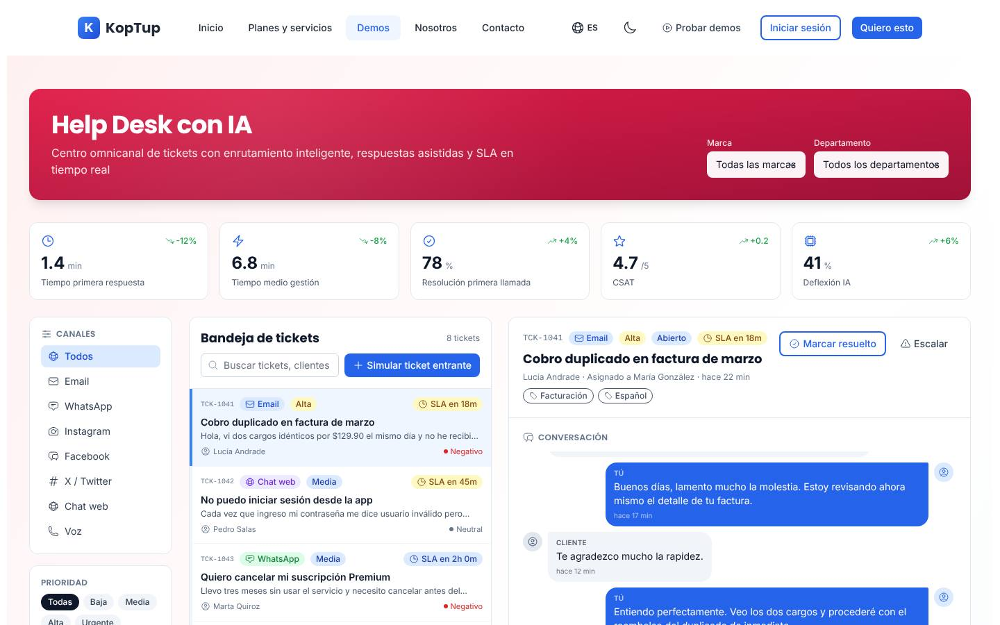
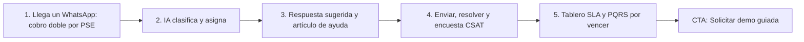

# Helpdesk con IA (mesa de ayuda)

> Soporte (`support`) · Demo: `/demo/helpdesk-ia` · Modo de acceso recomendado: `publico` (versión personalizada por `solicitud`) · Prioridad: **P1** · Esfuerzo total: **XL** (≈ 4 semanas de 1 dev senior para dejar demo + landing vendibles; el producto real se estima aparte)

*Captura actual de `/demo/helpdesk-ia` (bandeja de tickets y detalle). Ver también [Sistema de demos](04-Sistema-de-Demos.md), [Catálogo de productos](08-Catalogo-de-Productos.md) y [Roadmap](12-Roadmap.md). Productos relacionados: [CRM con IA](Producto-crm-ia.md), [Voice AI para call center](Producto-voice-ai-callcenter.md) y [Chatbot RAG con IA](Producto-chatbot-rag-ia.md).*

---

## Resumen

**Problema:** las áreas de servicio al cliente responden por WhatsApp, correo, Instagram y teléfono sin una bandeja única. Los casos se pierden, nadie mide tiempos de respuesta y las PQRS vencen sus términos legales, lo que termina en quejas ante la Superintendencia de Industria y Comercio (SIC) o la superintendencia del sector.

**Para quién (cliente ideal en Colombia/LATAM):**
- E-commerce y retail (pedidos, envíos, cambios y devoluciones, factura electrónica no recibida).
- Proveedores de internet y telecomunicaciones regionales (fallas, visitas técnicas).
- IPS, clínicas y laboratorios (autorizaciones, resultados, PQRS).
- Colegios y universidades (certificados, pagos de matrícula).
- Cooperativas, fintech y empresas de servicios con 5–80 agentes.

**Propuesta de valor:** "Todos tus canales en una sola bandeja; la IA clasifica, asigna y sugiere la respuesta con tu base de conocimiento, y tú controlas SLA y PQRS con términos en días hábiles." El código es del cliente y puede compartir la base de conocimiento con el [Chatbot RAG](Producto-chatbot-rag-ia.md).

---

## Estado actual

| Aspecto | Estado | Evidencia |
|---|---|---|
| Demo | Existe. **Maqueta** 100 % en el navegador, la más interactiva de las tres de atención | `apps/web/src/app/demo/helpdesk-ia/page.tsx` es `'use client'`; sin `fetch`, `axios` ni llamadas a `/api` |
| Pantallas | Cabecera con selector de marca y departamento · 5 métricas SLA · columna izquierda (canales, prioridad, base de conocimiento) · bandeja de tickets · detalle (conversación, respuestas sugeridas, respuesta, notas internas) · fila inferior (Auto-respuesta IA, Macros, CSAT) · modal de encuesta CSAT · animación de enrutamiento · avisos (toast) | Todo en `page.tsx` |
| Datos | Constantes en el mismo archivo: 8 tickets (`INITIAL_TICKETS`), 6 artículos (`KB_ARTICLES`), registro de auto-respuesta, CSAT por agente; marcas "Alpha Retail / Beta Telecom / Gamma Banking" | `page.tsx`, `apps/web/messages/demos/helpdesk-ia.es.json` |
| Backend | Módulo en memoria `apps/backend/src/modules/helpdesk/` (tickets, agentes, asignación; 191 líneas con test) **no montado** en `apps/backend/src/index.ts` | `helpdesk.service.ts`, `helpdesk.types.ts` |
| Base reutilizable | El backend real del chatbot RAG (`apps/backend/src/routes/chatbot.routes.ts`) sirve para base de conocimiento y respuestas sugeridas reales | Ver [Chatbot RAG](Producto-chatbot-rag-ia.md) |
| i18n ES/EN | UI en `helpdesk-ia.{es,en}.json` (240 líneas c/u). Fijos en código: notas internas en español ("Cliente VIP, dos reembolsos previos OK.") e intenciones del registro de auto-respuesta en inglés ("FAQ: password reset", "Shipping status", "Refund request", "Greeting") | `page.tsx` |
| Tests | 1 smoke test (`__tests__/page.test.tsx`) que hoy no se ejecuta | |
| Tamaño | 815 líneas: `page.tsx` monolítico de **782 líneas**, sin componentes separados | `wc -l` |
| SEO | Metadata `demo-helpdesk-ia` ("Helpdesk con IA \| Mesa de Ayuda y Tickets Omnicanal") | `apps/web/src/lib/seo-config.ts` |
| CTA | Solo el `DemoCTA` genérico del layout de `/demo` ("Solicitar Cotización" → `/contact` sin producto) | `apps/web/src/components/demo/DemoCTA.tsx` |
| Catálogo | Mapeo correcto: offering `helpdesk-ia` → demo `helpdesk-ia` | `services-catalog.ts` |

**Lo que hace bien:** los filtros por canal, prioridad, marca y departamento funcionan; la búsqueda funciona; se puede insertar una respuesta sugerida, usar un artículo de la base de conocimiento (con sugerencias según el asunto del ticket), agregar notas internas, marcar como resuelto, simular un ticket entrante con animación de enrutamiento, ver el SLA descontando y abrir la encuesta CSAT. Es la mejor base para un recorrido guiado.

### Problemas detectados (con ruta)

1. **Bug en el momento clave:** al "Enviar respuesta", el mensaje del agente aparece como "…" y se pierde el texto (`handleSendReply` guarda `key: '__draft__'`, que se pinta como `'…'`).
2. **Botones sin acción:** "Escalar" en el detalle y "Crear macro" en Macros.
3. **Auto-respuesta decorativa:** el interruptor y el umbral de confianza no cambian nada; el registro es fijo (`INITIAL_AUTOREPLY_LOG`) y con intenciones en inglés.
4. **Conversaciones incoherentes:** todos los tickets reutilizan los mismos mensajes genéricos (`messages.customer1` "llevo días esperando una respuesta…"), aunque el asunto sea "No puedo iniciar sesión" o "Cambiar dirección de envío".
5. **Datos de Chile, no de Colombia:** el ticket t8 dice "Voy a poner queja en SERNAC" (entidad chilena; en Colombia es la SIC); montos "$129.90" sin formato COP.
6. **Simulación pobre:** "Simular ticket entrante" clona el ticket 1 (mismo asunto "Cobro duplicado") y siempre asigna a la misma agente con las mismas habilidades.
7. **Métricas fijas:** primera respuesta 1.4, AHT 6.8, FCR 78 %, CSAT 4.7, deflexión 41 % escritos a mano; la etiqueta "Resolución primera llamada" no aplica a una mesa omnicanal ("Resolución en primer contacto"); la flecha de tendencia usa el mismo color en ambos casos.
8. **SLA sin calendario:** el SLA descuenta 1 minuto cada 30 s (tiempo acelerado sin avisarlo) y no considera horario hábil ni festivos.
9. **No hay PQRS**, que es lo que más pesa en Colombia para áreas de servicio reguladas.
10. **Canales desalineados con los planes:** el demo muestra Instagram y X/Twitter (no aparecen en ningún plan) y no muestra Messenger ni Telegram (sí están en Profesional); "Voz" corresponde al plan Avanzado ("IVR + voice AI").
11. **Nombre inconsistente:** "Help Desk con IA" (demo), "Helpdesk con IA" (catálogo), "Mesa de ayuda" (SEO).
12. **Textos del catálogo** (`apps/web/messages/offerings/helpdesk-ia.es.json`): voseo ("Atendé", "Comprala", "pagá"); "Reportes mensuales del tier" repetido 2 veces en Avanzado y 3 en Enterprise; "SSO + GDPR alineado" (el marco aplicable en Colombia es la Ley 1581 de 2012); `costoNote` dice USD 80–10.000/mes y el catálogo dice 80–20.000.
13. **Mantenibilidad:** un único componente cliente de 782 líneas, difícil de personalizar por sector.

---

## Qué falta para que sea vendible

- Corregir el bug de la respuesta enviada: hoy rompe el momento "wow" del recorrido.
- Conversaciones coherentes con cada asunto y datos colombianos (COP, SIC, transportadoras, factura electrónica, PSE).
- Un módulo **PQRS** con radicado y vencimiento en días hábiles: es el diferenciador local frente a Zendesk o Freshdesk.
- Que la auto-respuesta y las macros reaccionen a lo que el usuario cambia.
- Recorrido guiado de 5 pasos, con WhatsApp como canal principal.
- Etiqueta "Incluido desde plan X" en canales y módulos.
- CTA contextual y versión personalizada con los artículos de la base de conocimiento del prospecto.
- Capturas y video de 60–90 s; nombre comercial único en todo el sitio: **"Mesa de ayuda con IA (Helpdesk)"**.

---

## Plan detallado

### Landing `/productos/helpdesk-ia`

Estructura común de [Landing de producto](Seccion-Landing-de-Producto.md):

1. **Hero:** "Mesa de ayuda con IA: todos tus canales, una sola bandeja". Subtítulo: "La IA clasifica, asigna y sugiere la respuesta. Tú controlas SLA y PQRS sin hojas de cálculo." CTA **"Solicitar demo"** + "Agendar llamada" + "Probar la demo interactiva".
2. **Problemas** (3 tarjetas): mensajes perdidos entre WhatsApp, correo y redes; PQRS vencidas y quejas ante la SIC; agentes que responden lo mismo 50 veces al día.
3. **Cómo funciona:** llega el mensaje → la IA lo clasifica y lo asigna → el agente responde con la sugerencia → el cliente califica.
4. **Capturas** (bandeja, detalle con sugerencias, PQRS, tablero SLA/CSAT) y **video de 60–90 s**.
5. **Módulos por plan** (canales, IA, PQRS, base de conocimiento, CSAT, integraciones).
6. **Integraciones:** WhatsApp Business, Gmail/Outlook, chat web (widget del chatbot), Facebook Messenger e Instagram, Shopify/VTEX/WooCommerce (estado del pedido), Siigo/Alegra (consulta de facturas), Jira/Linear, CRM de Koptup o HubSpot.
7. **Planes y precios:** compra / a medida en COP; SaaS **"Lista de espera"** (DECISIÓN 7), señalando que es candidato prioritario para la Fase 4.
8. **FAQ:** ¿Qué diferencia tiene con Zendesk o Freshdesk? · ¿Cómo maneja los términos de las PQRS? · ¿La IA responde sola? ¿Puedo controlarlo? · ¿Mis datos quedan en Colombia / quién es el responsable del tratamiento? · ¿Cuánto cuesta la IA al mes? · ¿Se conecta con mi WhatsApp actual?
9. **CTA final** con formulario "Solicitar demo" con `helpdesk-ia` preseleccionado.

### Demo interactiva (mejoras por pantalla/módulo)

| Zona / módulo (`page.tsx`) | Agregar | Quitar / corregir | Datos de ejemplo |
|---|---|---|---|
| Cabecera (selector de marca y departamento) | Preset de empresa según sector; departamento "PQRS" | Marcas "Alpha/Beta/Gamma" | E-commerce "Tienda Moda Andina (ficticia)", ISP "Conecta Llanos (ficticia)", IPS "Clínica del Parque (ficticia)" — verificar en RUES que no existan |
| Métricas SLA | Métricas calculadas desde los tickets visibles; nuevas tarjetas "Tickets vencidos" y "PQRS por vencer"; ayuda (tooltip) que explique cada sigla | Valores fijos; "Resolución primera llamada" → "Resolución en primer contacto" | Primera respuesta 4 min, CSAT 4,6/5, 38 % resuelto por IA |
| Canales (izquierda) | WhatsApp primero; Messenger; badge de plan por canal | X/Twitter al final o fuera | — |
| Base de conocimiento | Artículos del sector; "Usar artículo" inserta texto limpio (sin "→ título:") | — | "Cómo solicitar un cambio o devolución", "Qué hacer si no recibiste tu factura electrónica", "Horarios de visita técnica" |
| Bandeja | Vistas "Mis tickets / Sin asignar / Por vencer"; badge "PQRS" con número de radicado; orden por vencimiento | — | 10–12 tickets por sector con nombres colombianos y números `+57 3xx` enmascarados |
| Detalle | Conversación propia por ticket; "Resumen IA del caso" y "Clasificación IA" (intención, sentimiento, prioridad sugerida con confianza); panel del cliente (pedido, factura, historial) enlazado al CRM; "Escalar" abre modal (nivel 2, supervisor, área) | Bug del mensaje "…"; "SERNAC" → "SIC"; "$129.90" → "$129.900" | "Me cobraron dos veces por PSE", "No me llegó la factura electrónica", "El pedido #88421 sigue en la transportadora" |
| Auto-respuesta IA | El umbral filtra en vivo el registro (por debajo del umbral pasa a "Escalada"); botón "Simular mensaje fuera de horario" | Intenciones en inglés | "Estado de pedido 96 % → Enviada", "Reembolso 62 % → Escalada" |
| Macros | "Crear macro" abre un constructor simple SI/ENTONCES con listas desplegables y agrega la regla | Contadores fijos sin contexto | "Si es PQRS tipo Queja → asignar a Calidad y fijar vencimiento" |
| CSAT | Agregar NPS; promedios calculados con las encuestas enviadas en la sesión | — | — |
| **Nuevo: PQRS** | Lista con tipo (Petición, Queja, Reclamo, Sugerencia, Felicitación), radicado, fecha de radicación, vencimiento en días hábiles con festivos de Colombia, estado y plantilla de respuesta formal; exportar CSV | — | Términos configurables (p. ej. 15 días hábiles para peticiones según la Ley 1755 de 2015; validar con el asesor legal de cada cliente) |
| Global | Banner "Solicita tu demo guiada"; CTA contextual; nombre "Mesa de ayuda con IA"; reloj del SLA con aviso "tiempo acelerado" | `DemoCTA` genérico | — |

**Recorrido guiado (5 pasos, menos de 3 minutos):**

1. **Mensaje entrante:** "Simular ticket" crea "Me cobraron dos veces por PSE" por WhatsApp.
2. **Clasificación y asignación:** la IA marca Facturación, sentimiento negativo, prioridad Alta y lo asigna a la agente con esa habilidad.
3. **Respuesta asistida:** abrir el ticket, ver el resumen del caso, insertar la sugerencia (94 %) y el artículo "Cómo emitir un reembolso".
4. **Cierre:** enviar (el texto aparece en la conversación), marcar resuelto y ver la vista previa de la encuesta CSAT.
5. **Control:** subir el umbral de auto-respuesta a 90 % y ver qué se escala; abrir PQRS y ver los casos que vencen en 2 días hábiles. CTA.

### Acceso y solicitud de demo

- **Modo recomendado: `publico`.** La demo corre completa en el navegador sin costo de IA, la búsqueda de "mesa de ayuda" y "sistema de tickets" es alta y es la demo más interactiva del grupo de atención: funciona como imán de leads. Muestra el banner "Solicita tu demo guiada" (DECISIÓN 1).
- **Qué ve el visitante sin solicitar:** landing con capturas y video de 60–90 s y la demo interactiva completa con el tour.
- **Qué obtiene al solicitar** (flujo de [Sistema de demos](04-Sistema-de-Demos.md)): sesión guiada de 30 min y una **versión personalizada** con su marca, su sector y hasta 6 artículos de su propia base de conocimiento, mediante un `DemoGrant` de **14 días**.
- **Fase 4:** "Demo con tus documentos": el prospecto aprobado sube 3–5 documentos y las respuestas sugeridas salen del backend RAG real, con tope de consultas por grant y borrado de los documentos al expirar.
- **Prospecto aprobado** (Portal › Mis demos): tarjeta "Mesa de ayuda con IA — <Empresa>", días restantes, "Abrir demo", "Agendar llamada", "Solicitar propuesta".
- **Eventos `DemoEvent`:** pasos del tour, tickets abiertos, respuesta enviada, umbral cambiado, vista PQRS abierta, clics en CTA.

### Personalización por cliente

Sin código, desde **Admin › Solicitudes de demo › Aprobar** (campo `personalizacion` del `DemoGrant`; ver [Panel de administración](05-Panel-de-Administracion.md)):

| Campo | Efecto en la demo |
|---|---|
| Logo y color primario | Cabecera, botones y firma de las respuestas |
| Nombre de la empresa y hasta 3 marcas | Selector de marca y saludo de las respuestas sugeridas |
| Sector (preset) | Dataset de tickets, artículos y macros: E-commerce/retail, Internet/telecom, Salud (IPS), Educación, Servicios financieros |
| Canales visibles | Activa/oculta WhatsApp, correo, chat web, Messenger, Instagram, voz según lo que use el prospecto |
| Nombres de agentes (hasta 4) | Asignaciones, notas y CSAT por agente |
| Artículos de la base de conocimiento (hasta 6: título + texto) | Reemplazan los artículos de ejemplo y alimentan las sugerencias |
| Términos de PQRS (días hábiles por tipo) | Cálculo de vencimientos en la vista PQRS |

**Implementación:** extraer constantes de `page.tsx` a `fixtures/<sector>.ts` y componentes (`Inbox`, `TicketDetail`, `AutoReplyPanel`, `MacrosPanel`, `CsatPanel`, `PqrsView`); la página lee la configuración de `GET /api/demo-access/helpdesk-ia` (DECISIÓN 3).

### Producto real

**Alcance MVP — modalidad compra (Básico/Profesional, 5–9 semanas):**
- Bandeja unificada: correo a ticket (Gmail/Outlook), widget web (reutilizando el del chatbot) y WhatsApp Business (API oficial de Meta).
- Tickets con estados, prioridades, etiquetas y SLA en horario hábil con calendario de festivos de Colombia.
- Asignación por reglas, habilidades y carga (round-robin); notas internas y menciones.
- Respuestas sugeridas y base de conocimiento con **RAG reutilizando el backend del chatbot** (`chatbot.routes.ts`), con límites de costo por cliente.
- Módulo PQRS: radicado, tipo, términos configurables en días hábiles, alertas de vencimiento, plantillas de respuesta formal y reporte exportable (insumo para reportes a superintendencias según el sector, p. ej. SmartSupervision de la Superfinanciera en Enterprise).
- Encuesta CSAT/NPS post-resolución y tablero de métricas.
- **Integraciones típicas en Colombia:** WhatsApp Business, Gmail/Outlook, Messenger/Instagram (Profesional), Shopify/VTEX/WooCommerce (estado del pedido), Siigo/Alegra (consulta de facturas electrónicas), Wompi/PayU (estado de pagos y reembolsos), Jira/Linear, CRM.
- Roles y permisos con autorización en servidor, auditoría, retención de datos y registro de autorización de tratamiento (Ley 1581).
- **Base técnica:** reutilizar `apps/backend/src/modules/helpdesk/` (Ticket, Agent, `assign`) migrado a Mongoose con autenticación y `tenantId`.

**SaaS (DECISIÓN 7):** hoy se muestra **"SaaS: lista de espera"**. Por compartir RAG, widget y canales con el chatbot, es el **segundo candidato** a SaaS en la Fase 4 (después del chatbot). Requisitos: core multi-tenant y cobro recurrente (Wompi/PayU en COP, Stripe en USD), alta autoservicio de WhatsApp por cliente (cada cliente con su propia cuenta de WhatsApp Business), medición de tickets/mes contra el plan, copias de seguridad por cliente, acuerdo de encargo de tratamiento de datos.

### Planes y precios

Precios actuales del catálogo (`apps/web/src/lib/services-catalog.ts`, entrada `helpdesk-ia`; COP):

| Plan | Compra: setup | Compra: mantenimiento/mes | SaaS: setup | SaaS: mes | Volumen incluido | Agentes (admin) / usuarios finales | Implementación | Costos del cliente al proveedor (USD/mes) |
|---|---|---|---|---|---|---|---|---|
| Básico | $46.000.000 | $4.200.000 | $2.900.000 | $1.590.000 | 500 tickets/mes | 5 / 2.000 | 2–5 semanas | 80–300 (hosting, DB, email, OpenAI) |
| Profesional | $117.000.000 | $10.400.000 | $6.900.000 | $3.790.000 | 10.000 tickets/mes | 30 / 25.000 | 5–9 semanas | 400–1.500 (+ WhatsApp, LLM) |
| Avanzado | $273.000.000 | $23.400.000 | $12.900.000 | $7.090.000 | 100.000 tickets/mes | 80 / 150.000 | 9–14 semanas | 1.500–6.000 (+ telefonía cloud) |
| Enterprise | $585.000.000 | $45.500.000 | $0 (se muestra "Personalizado") | $12.890.000 | 1M+ tickets/mes | Ilimitado | 12–20 semanas | 5.000–20.000 |

Almacenamiento: 10 / 80 / 400 GB / ilimitado. Horas de evolutivos por mes: 5 / 12 / 25 / 50.

**Recomendaciones de claridad:**
1. **Mantenimiento de compra:** 12 × $4,2 M = $50,4 M al año (110 % del setup Básico) y 2,6 veces la cuota SaaS ($1,59 M) que sí incluye hosting. Misma decisión transversal que en [CRM con IA](Producto-crm-ia.md#planes-y-precios): % anual del setup o bolsa de horas, explicando qué incluye.
2. **SaaS → "Lista de espera"** hasta la Fase 4, con la nota "candidato prioritario".
3. Enterprise SaaS setup: "Incluido" o "A convenir" en lugar de "Personalizado".
4. Bullets en lenguaje de cliente, sin duplicados. Propuesta: **Básico** "Hasta 5 agentes y 500 tickets/mes · Correo y chat web convertidos en tickets · Respuestas sugeridas con IA · SLA y encuesta de satisfacción". **Profesional** "+ WhatsApp, Messenger y Telegram · Módulo PQRS con términos en días hábiles · Portal de autoayuda · Conexión con Jira/Linear y tu CRM". **Avanzado** "+ Bandeja omnicanal única · Agente de voz e IVR (ver [Voice AI](Producto-voice-ai-callcenter.md)) · Análisis de calidad · Tableros CSAT/NPS". **Enterprise** "+ Gestión de turnos · Traspaso a BPO · Inicio de sesión único · Cumplimiento Ley 1581 con auditoría".
5. Cambiar "GDPR alineado" por "Ley 1581 de 2012 (habeas data)"; tuteo en vez de voseo; `costoNote` = USD 80–20.000.
6. Mostrar el costo total a 12 meses y el costo por agente/mes equivalente (es como compara el cliente con Zendesk o Freshdesk).
7. Paquete "Suite de atención" con [CRM](Producto-crm-ia.md) y [Voice AI](Producto-voice-ai-callcenter.md).

Política comercial común en [Catálogo de productos](08-Catalogo-de-Productos.md).

---

## Tareas

| # | Tarea | Fase | Prioridad | Esfuerzo | Criterio de aceptación |
|---|---|---|---|---|---|
| 1 | Reescribir textos del offering `helpdesk-ia` (tuteo, sin duplicados, Ley 1581 en vez de GDPR, `costoNote` correcto) y unificar el nombre "Mesa de ayuda con IA (Helpdesk)" en demo, SEO y catálogo | Fase 1 — Funnel y solicitud de demos | P1 | S | Un solo nombre comercial en `helpdesk-ia.{es,en}.json`, `seo-config.ts` y `pageTitle`; 0 bullets repetidos |
| 2 | Aplicar la decisión transversal del mantenimiento de compra (ver CRM) | Fase 1 — Funnel y solicitud de demos | P1 | S | Mantenimiento expresado según la política acordada y con "qué incluye" visible |
| 3 | Landing `/productos/helpdesk-ia` con las 9 secciones | Fase 1 — Funnel y solicitud de demos | P1 | M | Publicada; CTA abre el formulario con `helpdesk-ia` preseleccionado |
| 4 | `DemoCatalogItem` `helpdesk-ia` (`publico`, 14 días), banner, CTA contextual y eventos `DemoEvent` | Fase 1 — Funnel y solicitud de demos | P1 | S | Cambio de modo desde admin sin desplegar; eventos visibles en Admin › Solicitudes |
| 5 | Corregir el bug de la respuesta enviada que se muestra como "…" | Fase 2 — Demos vendibles | P1 | S | El texto enviado aparece en la conversación con hora "ahora" y el ticket pasa a "Pendiente" |
| 6 | Conversación propia por ticket y localización (SIC, COP, PSE, factura electrónica, `+57`) | Fase 2 — Demos vendibles | P1 | M | Cada ticket tiene mensajes acordes a su asunto; 0 referencias a SERNAC, RUT o CLP |
| 7 | "Escalar" y "Crear macro" funcionales; umbral de auto-respuesta que reclasifica el registro; "Simular ticket" con 5 variantes | Fase 2 — Demos vendibles | P1 | M | Mover el umbral cambia los resultados del registro; la macro creada aparece en la lista; 5 simulaciones distintas |
| 8 | Métricas calculadas desde los tickets y glosario de siglas | Fase 2 — Demos vendibles | P2 | S | Resolver un ticket actualiza las métricas; cada sigla tiene explicación |
| 9 | Vista PQRS con radicado, tipos y vencimiento en días hábiles con festivos de Colombia | Fase 2 — Demos vendibles | P1 | M | Vencimientos calculados excluyendo fines de semana y festivos 2026–2027; filtro "por vencer (≤ 3 días)" |
| 10 | Tour guiado de 5 pasos y badges "Incluido desde plan X" por canal y módulo | Fase 2 — Demos vendibles | P1 | M | Tour completable en < 3 min; badges coinciden con `offering_helpdeskIa.tiers` |
| 11 | Dividir `page.tsx` (782 líneas) en componentes y `fixtures/<sector>.ts`; el smoke test debe pasar en el CI de la Fase 0 | Fase 2 — Demos vendibles | P2 | M | `page.tsx` < 200 líneas; 5 sectores cargables; test verde en CI |
| 12 | Personalización desde el `DemoGrant` (logo, color, marcas, agentes, canales, 6 artículos, términos PQRS) | Fase 2 — Demos vendibles | P2 | M | Al aprobar con personalización, el prospecto ve su marca y sus artículos en las sugerencias |
| 13 | 4 capturas y video de 60–90 s | Fase 2 — Demos vendibles | P1 | S | Archivos en la landing y en `docs/wiki/images/`; video ≤ 90 s con subtítulos |
| 14 | "Demo con tus documentos": respuestas sugeridas desde el backend RAG para prospectos aprobados, con tope de consultas y borrado al expirar | Fase 4 — Productos SaaS reales | P2 | L | Con grant activo las sugerencias citan los documentos del prospecto; sin grant se usan fixtures; al expirar se eliminan los documentos |
| 15 | Base real del helpdesk multi-tenant (tickets, SLA, WhatsApp, PQRS) sobre el core SaaS | Fase 4 — Productos SaaS reales | P2 | XL | Un cliente piloto opera ≥ 30 días con WhatsApp y correo reales y aislamiento por cliente |

---

## Métricas de éxito

- Conversión landing → solicitud de demo ≥ 3 %.
- ≥ 60 % de los visitantes de la demo pública envían al menos una respuesta y resuelven un ticket (medido con `DemoEvent`).
- ≥ 40 % de las sesiones abren la vista PQRS (valida el diferenciador local).
- ≥ 70 % de los prospectos aprobados abren su demo personalizada en 72 h.
- ≥ 25 % de demos guiadas → propuesta enviada en ≤ 14 días.
- Primer cliente piloto de helpdesk (compra o SaaS temprano) en los 6 meses siguientes a la Fase 2.
