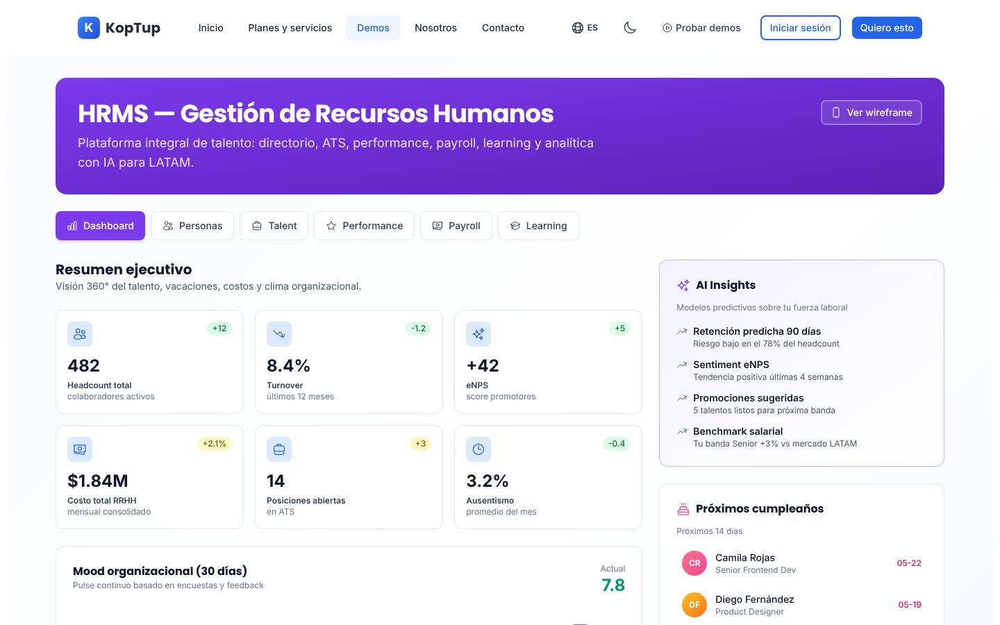
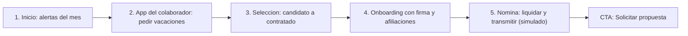

# Gestión Humana y Nómina (HRMS)

> Operaciones / talento humano (hoy clasificado por error como `sales`) · Demo: `/demo/hrms` · Modo de acceso recomendado: `solicitud` · Prioridad: **P3** · Esfuerzo total: **XL** (≈ 7–8 semanas de 1 dev senior para todo el plan de landing + demo; el mínimo de la Fase 1 son ≈ 1,5 semanas; el producto real se estima aparte)

*Captura actual de `/demo/hrms` (pestaña Dashboard). Ver también [Sistema de demos](04-Sistema-de-Demos.md), [Catálogo de productos](08-Catalogo-de-Productos.md) y [Roadmap](12-Roadmap.md). Productos relacionados: [ERP modular](Producto-erp-modular.md) (su pestaña RRHH debe apuntar a este producto), [LMS de e-learning](Producto-lms-elearning.md) (formación), [Firma electrónica](Producto-firma-electronica.md) (contratos) y [Sistemas RAG](Producto-chatbot-rag-ia.md) (asistente de políticas internas).*

---

## Resumen

**Problema:** en la PYME colombiana de 30 a 500 colaboradores la gestión humana vive en Excel, correo y WhatsApp: las vacaciones se piden por chat y nadie sabe el saldo real; cada mes alguien pierde horas haciendo certificados laborales y enviando desprendibles; los recargos nocturnos y dominicales, la PILA y la nómina electrónica se calculan a mano con riesgo de errores y sanciones; los contratos a término fijo vencen sin preaviso.

**Para quién (cliente ideal en Colombia/LATAM):**
- Empresas con operarios por turnos (manufactura, alimentos, logística, vigilancia, aseo) donde los recargos y la rotación pesan.
- Contact centers y empresas de servicios con selección masiva y alta rotación.
- Comercio con varias tiendas o sedes (comisiones, turnos de fin de semana).
- Grupos con 2–5 razones sociales que hoy llevan la nómina en un software contable y el resto del ciclo del colaborador en hojas de cálculo.

**Propuesta de valor:** "Todo el ciclo del colaborador en un solo lugar, del contrato firmado en línea a la nómina electrónica aceptada por la DIAN, con una app para que tu gente pida vacaciones, descargue su desprendible y su certificado laboral sin escribirle a Gestión Humana." A la medida de los procesos de la empresa e integrable con el software de nómina o contable que ya usa.

**Encaje con el reposicionamiento RAG:** en el sitio nuevo este producto pasa a **"Otras soluciones a medida"**. Su puente natural con el producto principal es el **asistente de políticas internas**: un RAG sobre el reglamento interno de trabajo, el manual de beneficios y las políticas de vacaciones que responde a los colaboradores citando el artículo. Es la forma más barata de mostrar valor de IA en este producto y de vender un plan RAG Esencial como complemento.

---

## Estado actual

| Aspecto | Estado | Evidencia |
|---|---|---|
| Demo | Existe. **Maqueta** 100 % en el navegador | `apps/web/src/app/demo/hrms/page.tsx` es `'use client'`; no hay `fetch`, `axios` ni llamadas a `/api` en la carpeta |
| Pantallas | Encabezado con botón "Ver wireframe" + 6 pestañas: **Dashboard** (6 KPIs, Mood organizacional 30 días, Compliance laboral por país, AI Insights, Próximos cumpleaños, Vacaciones pendientes), **Personas** (buscador, filtros por área y sede, 12 tarjetas paginadas de a 6, organigrama expandible, panel lateral de perfil), **Talent** (kanban ATS de 5 etapas con 8 candidatos + Onboarding/Offboarding con checklist), **Performance** (evaluación 360 de 5 preguntas, OKR, plan de sucesión, calendario de vacaciones), **Payroll** (corrida "Mayo 2026", conceptos, beneficios, encuestas), **Learning** (cursos obligatorios, recomendados y de cumplimiento) + modal "Self-service móvil" | `page.tsx`, `components/PerformanceTab.tsx`, `components/PayrollTab.tsx`, `components/LearningTab.tsx` |
| Datos | Fijos en el código. Empresa tecnológica multi-país (CO, MX, AR, PE) con correos `@koptup.io`; salarios en 4 monedas; fechas fijas de mayo–julio de 2026 | `page.tsx` (`people`, `candidates`, `vacations`), `PayrollTab.tsx` (`concepts`, `benefits`) |
| Backend | Módulo en memoria `apps/backend/src/modules/hrms/` (Employee, Candidate, `advanceCandidate`; 184 líneas con test) **no montado** en `apps/backend/src/index.ts`; el frontend no lo usa | `hrms.service.ts`, `hrms.types.ts`, `hrms.routes.ts` |
| i18n ES/EN | Textos de UI en `apps/web/messages/demos/hrms.{es,en}.json` (289 líneas c/u). OKR, beneficios, cursos, tareas de onboarding, nombres de documentos, "Mayo 2026" y "/ año" están fijos en español dentro de los componentes | `PerformanceTab.tsx`, `PayrollTab.tsx`, `LearningTab.tsx`, `page.tsx` |
| Tests | 1 smoke test (`__tests__/page.test.tsx`, 11 líneas) que hoy no se ejecuta (ver [Seguridad y calidad](10-Seguridad-y-Calidad.md)) | |
| Tamaño | 1.203 líneas (page 766 + 3 componentes 404 + layout 22 + test 11) | `wc -l` |
| SEO | Metadata `demo-hrms` en `apps/web/src/lib/seo-config.ts` + breadcrumb JSON-LD en `layout.tsx` ("HRMS / Gestión de Talento") | |
| CTA | Solo el `DemoCTA` genérico del layout de `/demo` (cotización sin producto preseleccionado) | `apps/web/src/app/demo/layout.tsx` |
| Catálogo | Mapeo de demo correcto (`hrms` → `hrms`), pero **categoría equivocada**: `category: 'sales'` y `categoryLabel: "Ventas"` | `services-catalog.ts` (entrada 16), `messages/offerings/hrms.es.json` |

**Lo que hace bien:** navegación clara por pestañas; el buscador y los filtros del directorio funcionan con paginación; el perfil lateral es completo (datos personales, empleo, compensación, documentos) y accesible (`role="dialog"`, `aria-modal`); organigrama desplegable; kanban de selección con puntaje de ajuste; onboarding/offboarding con checklist y barra de avance; evaluación 1–5 interactiva. Tiene buenos guiños colombianos que hay que conservar: PESV, SAGRILAFT, "Cédula.pdf", "Cesantías (CO)", "Retención en la fuente".

### Problemas detectados (con ruta)

1. **Monedas mezcladas y sin etiqueta:** el perfil muestra salarios en COP, MXN, ARS y Perú aparece como "USD" (`page.tsx`, cálculo de moneda en el panel de perfil); "Costo total RRHH $1.84M" sin moneda; beneficios tipo "$4,200 / año" y "Stock options $12,000" en dólares implícitos (`PayrollTab.tsx`, `benefits`).
2. **Números que no cuadran:** headcount 482 con 12 personas en el directorio; la corrida de nómina dice "482 empleados" pero el bruto es $2,140,000 (el de una persona); la suma de devengados da $2.292.000 y no $2.140.000 (`PayrollTab.tsx`); saldos de vacaciones imposibles: CO 15 causados − 7 tomados = saldo 12; MX 12 − 4 = 10; AR 14 − 8 = 14 (`PerformanceTab.tsx`, `accruals`).
3. **Fechas fijas ya vencidas:** "Próximos cumpleaños — próximos 14 días" filtra mayo y junio de 2026 (en la captura aparecen 05-22 y 05-19); vacaciones de junio–julio de 2026 "pendientes"; período de nómina "Mayo 2026"; cursos que vencían en junio siguen "En curso" (`page.tsx`, `PayrollTab.tsx`, `LearningTab.tsx`).
4. **"Rechazar" vacaciones hace lo mismo que "Aprobar":** ambos botones llaman `approveVacation` y la solicitud desaparece sin mensaje (`page.tsx`).
5. **Botones sin acción:** "Screening call IA", "Ver CV", "Ver todo" en documentos, "Inscribirse" a beneficios, "Lanzar pulse", "Enviar review", "Iniciar" curso y "Solicitar vacaciones" del modal móvil.
6. **La nómina no es colombiana:** no hay nómina electrónica (estado de transmisión, CUNE), ni PILA, ni auxilio de transporte, ni provisiones (prima, cesantías, intereses, vacaciones), ni aportes del empleador; "Cesantías" aparece como devengado mensual; formato `$1,820,000` (en-US). Justo lo que el plan Básico promete ("Nómina electrónica DIAN", "PILA/Aportes en Línea") no se ve.
7. **Spanglish:** pestañas "Talent / Performance / Payroll / Learning"; etapas "Sourced / Screening / Interview / Offer / Hired"; "Headcount", "Turnover", "Accrual", "Owner", "E-sign", "Benefits — Catálogo", "AI Insights"; cargos y áreas en inglés ("Senior Frontend Dev", "Tech", "People"); botón "Ver wireframe" (término interno de diseño) (`hrms.es.json`, `page.tsx`).
8. **Marca y perfil confusos:** correos `@koptup.io` y OKR como "Lanzar módulo Payroll MX" hacen pensar que es la nómina de Koptup. La empresa de ejemplo es una startup tecnológica, no la PYME colombiana con operarios y turnos que compraría esto.
9. **Ruido multi-país:** "Compliance laboral" por CO/MX/AR/PE en el tablero sin explicación; el hub (`messages/_demos.es.json`) promete "Payroll multi-país (CO, MX, AR)" y el plan Enterprise "CO/MX/PE".
10. **Cosas fuera de lugar:** "Encuestas & Pulse" dentro de Payroll (`PayrollTab.tsx`); "AI Insights" con predicciones que nadie puede verificar.
11. **Textos del catálogo** (`messages/offerings/hrms.es.json`): voseo ("Gestioná", "Comprala", "pagá"); descripción de plantilla genérica; "Reportes mensuales del tier" repetido 2 veces en Avanzado y 3 en Enterprise; el plan más barato promete lo más complejo (nómina electrónica + PILA); Profesional incluye "LMS de capacitación" (otro producto del catálogo) y una marca de bonos; "Talent + Comp + Performance"; `costoNote` dice USD 30–6.000/mes y el catálogo USD 50–18.000.

---

## Qué falta para que sea vendible

- **Una empresa colombiana coherente** en todas las pestañas (COP con formato `es-CO`, cargos y áreas en español, operarios con turnos, contratos a término fijo, aprendices SENA) y fechas relativas al día de hoy.
- **Una nómina que un jefe de nómina colombiano reconozca:** quincena, devengados y deducciones correctos, provisiones, aportes, PILA y nómina electrónica (simulada) con estado "Aceptada".
- **La app del colaborador funcionando:** pedir vacaciones, descargar desprendible y certificado laboral. Es lo que más horas ahorra y lo que mejor se entiende en 30 segundos.
- **Alertas de cumplimiento laboral** útiles (contratos por vencer, periodos de prueba, vacaciones acumuladas, exámenes ocupacionales, fechas de prima y cesantías) en lugar de "AI Insights" decorativos.
- **Mensaje honesto de alcance:** Koptup construye el portal y los flujos de gestión humana a la medida y se **integra** con el software de nómina existente; la nómina propia con transmisión DIAN se ofrece en planes altos o vía proveedor tecnológico.
- Español de cliente (sin "Talent/Payroll/Accrual"), textos del catálogo corregidos y categoría correcta.
- Prueba social: no hay casos. Mientras tanto, ofrecer un **diagnóstico de procesos de gestión humana** de 2 horas como paso previo a la propuesta.
- Capturas, video de 60–90 s y CTA contextual "Solicitar demo de Gestión Humana".

---

## Plan detallado

### Landing `/productos/hrms`

Estructura común de [Landing de producto](Seccion-Landing-de-Producto.md):

1. **Hero:** "Gestión humana sin Excel: del contrato a la nómina electrónica". Subtítulo: "Expediente digital, vacaciones y permisos desde el celular, selección, desempeño y nómina conectada a la DIAN y a la PILA. A la medida de tu empresa en Colombia." CTA principal **"Solicitar demo"**, secundario "Agendar llamada".
2. **Problemas que resuelve** (3 tarjetas): vacaciones y permisos por WhatsApp sin saldos claros; certificados y desprendibles que consumen horas del equipo; nómina en Excel con riesgo en recargos, PILA y nómina electrónica.
3. **Cómo funciona** (4 pasos): diagnóstico (procesos y software de nómina actual) → configuración y migración del expediente desde Excel → salida por módulos (primero el portal del colaborador) → acompañamiento mensual.
4. **Módulos** con etiqueta "Incluido desde": Expediente digital y organigrama · Vacaciones, permisos e incapacidades · App del colaborador (desprendibles, certificados) · Selección y onboarding con firma electrónica · Desempeño y objetivos · Formación (vía [LMS](Producto-lms-elearning.md)) · Nómina y nómina electrónica · Asistente IA de políticas internas (RAG).
5. **Capturas** (galería de 6: Inicio, Personas, App del colaborador, Selección, Nómina, Desempeño) y **video de 90 s** del recorrido guiado.
6. **Integraciones:** nómina electrónica DIAN (directa o vía proveedor tecnológico), operadores de PILA (archivo plano), bancos (archivo de dispersión de pagos), Siigo / Alegra / World Office (contabilización de la nómina), [Firma electrónica](Producto-firma-electronica.md), WhatsApp Business (desprendibles y avisos), Google Workspace / Microsoft 365 (inicio de sesión), relojes biométricos (opcional, turnos), [ERP modular](Producto-erp-modular.md).
7. **Planes y precios:** "Compra / a medida" en COP con "desde" y por rango de empleados; SaaS como **"Lista de espera"** (DECISIÓN 7).
8. **Preguntas frecuentes:** ¿Reemplaza mi software de nómina o se integra? · ¿Transmite la nómina electrónica a la DIAN? · ¿Cómo se actualiza con la reforma laboral y la reducción de jornada? · ¿Dónde quedan los datos de mis colaboradores y cómo se cumple la Ley 1581 de 2012? · ¿Mis colaboradores deben instalar una app? · ¿Cuánto tarda la implementación? · ¿El código es mío?
9. **CTA final** con el formulario "Solicitar demo" con `hrms` preseleccionado y campos extra opcionales: número de colaboradores, software de nómina actual, número de sedes, ¿hay operarios por turnos?

### Demo interactiva (mejoras por pantalla/módulo)

| Pantalla / componente | Agregar | Quitar / corregir | Datos de ejemplo |
|---|---|---|---|
| Encabezado (`page.tsx`) | Título "Gestión Humana y Nómina"; nombre y logo de la empresa del prospecto; botón "Iniciar recorrido"; aviso "Datos de ejemplo" | "HRMS — Gestión de Recursos Humanos"; botón "Ver wireframe" → "Ver app del colaborador" | Empresa ficticia "Alimentos Cordillera S.A.S." (verificar en el RUES que no exista) |
| Pestañas | Renombrar: Inicio · Personas · Selección · Desempeño · Nómina · Formación | "Dashboard / Talent / Performance / Payroll / Learning" | — |
| Inicio (Dashboard) | KPIs calculados del dataset (colaboradores activos, rotación, ausentismo con incapacidades, costo de nómina del mes en millones de COP, vacantes, eNPS); **Alertas de cumplimiento**: contratos a término fijo por vencer (preaviso de 30 días), periodos de prueba que terminan, colaboradores con más de 2 periodos de vacaciones acumulados, exámenes médicos ocupacionales pendientes, calendario de pagos (intereses de cesantías, cesantías, prima); encuesta de clima movida aquí desde Nómina | "Compliance laboral" por 4 países; "AI Insights" (o dejar una sola tarjeta marcada "Complemento IA"); cumpleaños y vacaciones con fechas fijas | 186 colaboradores en planta Funza + oficina Bogotá; costo de nómina $742 M; 6 contratos por vencer; cumpleaños calculados con la fecha actual |
| Personas | Cargos y áreas en español; tipo de contrato (indefinido, término fijo, obra o labor, aprendizaje SENA); EPS, fondo de pensiones, ARL y caja de compensación en el perfil (nombres ficticios o genéricos); documentos que abren un PDF de ejemplo; botón **"Generar certificado laboral"** (PDF con logo) | Correos `@koptup.io`; salarios en MXN/ARS/"USD"; ID del organigrama distintos a los del directorio | 30 personas visibles (paginadas) del total de 186; salarios desde 1 SMMLV + auxilio de transporte hasta $18 M |
| Selección (`talent`) | Etapas en español (Postulados, Filtro, Entrevista, Oferta, Contratado); botón "Mover a…" o arrastrar; "Ver CV" con hoja de vida de ejemplo; contratar → crea el onboarding | "Screening call IA" como función base (mostrarlo como complemento) | Vacantes: Operario de empaque (×12), Auxiliar de bodega, Analista de costos; fuentes: Computrabajo, elempleo, LinkedIn, referidos |
| Onboarding / Offboarding | Checklist colombiano: contrato firmado (enlace a [Firma electrónica](Producto-firma-electronica.md)), afiliaciones a EPS, pensión, ARL (antes de iniciar labores) y caja, examen médico de ingreso, dotación, inducción SG-SST; salida: liquidación de prestaciones, paz y salvo, examen de egreso, certificado laboral | "Owner", "E-sign"; tareas fijas en español fuera de i18n | 2 ingresos de operarios y 1 retiro por renuncia |
| Desempeño (`PerformanceTab.tsx`) | Ciclo con fecha relativa; "Enviar evaluación" muestra confirmación y actualiza el avance; objetivos del área de producción; calendario con nombre de mes y festivos colombianos | Saldos de vacaciones incoherentes (`accruals`); "Accrual"; filas por país | 15 días hábiles por año de servicio; saldo = causados − tomados |
| Nómina (`PayrollTab.tsx`) | Período "Quincena 1–15 de <mes actual>"; tabla por colaborador con desprendible; conceptos: salario, auxilio de transporte, horas extra y recargos (nocturno, dominical y festivo), comisiones; deducciones: salud 4 %, pensión 4 %, fondo de solidaridad pensional, retención en la fuente, libranzas; provisiones: prima, cesantías, intereses (12 %), vacaciones; aportes del empleador. Flujo **Liquidar → Aprobar → Transmitir a la DIAN (simulado)** con estado "Aceptada" y CUNE ficticio; botones "Generar archivo PILA", "Archivo de dispersión bancaria" y "Enviar asiento a Siigo/Alegra (simulado)" | Corrida de "482 empleados" con el bruto de una persona; "Cesantías" como devengado mensual; beneficios en dólares y "Stock options"; formato `$1,820,000` | 186 colaboradores; devengado quincenal $371 M; beneficios en COP: auxilio de alimentación, póliza de vida, medicina prepagada, día de la familia |
| Formación (`LearningTab.tsx`) | Fechas relativas; botón "Ver en la plataforma de formación" que abre la demo de [LMS](Producto-lms-elearning.md) | Vencimientos fijos de 2026 | Inducción y reinducción, SG-SST 50 horas, PESV, SAGRILAFT, Protección de datos personales |
| App del colaborador (modal) | Interactiva: "Solicitar vacaciones" crea la solicitud que aparece en Inicio; "Mi desprendible" abre el PDF; "Mi certificado laboral"; **"Pregúntale a Gestión Humana"** (asistente RAG sobre el reglamento interno de ejemplo, con cita del artículo) | Botón "Solicitar vacaciones" sin acción | Colaboradora "Camila Rojas", operaria de empaque, 12 días disponibles |
| Global | Estado compartido entre pestañas (contratar en Selección crea el onboarding; aprobar vacaciones descuenta el saldo); badges "Incluido desde: Básico / Profesional / Avanzado"; botón "Volver" a la landing; CTA final "Solicitar propuesta" | `DemoCTA` genérico | — |

**Recorrido guiado (5 pasos, menos de 4 minutos):**

> [Ver diagrama como imagen](images/diagramas/Producto-hrms-1.png)

1. **Inicio:** "Alimentos Cordillera tiene 186 colaboradores; 6 contratos a término fijo vencen este mes y 3 personas acumulan más de 2 periodos de vacaciones."
2. **App del colaborador:** Camila pide 5 días de vacaciones desde el celular; la solicitud aparece en Inicio y el jefe la aprueba; el saldo baja de 12 a 7.
3. **Selección:** mover al candidato a operario de empaque de "Entrevista" a "Contratado".
4. **Onboarding:** el contrato se firma en línea y el checklist de afiliaciones (EPS, pensión, ARL, caja) se completa.
5. **Nómina:** liquidar la quincena con recargos nocturnos, aprobar y ver la nómina electrónica "Aceptada (simulado)", el archivo PILA y el asiento contable. Cierre con CTA "Solicitar propuesta" / "Agendar diagnóstico".

### Acceso y solicitud de demo

- **Modo recomendado: `solicitud`.** Producto de ticket alto (desde $53 M en compra), con datos de nómina que solo convencen si se muestran con el tamaño y el sector del prospecto, y con una conversación necesaria sobre el software de nómina actual. Una demo abierta con datos genéricos no califica al lead y expone errores frente a jefes de nómina.
- **Duración del acceso:** **14 días** (valor por defecto), extensible 7 días desde el admin.
- **Modo:** **guiado** recomendado (sesión de 45 min con el jefe de gestión humana y el de nómina) y después autoservicio.
- **Qué ve el visitante antes de solicitar:** la landing con 6 capturas, el video de 90 s, la tabla de módulos por plan y las preguntas frecuentes. `/demo/hrms` sin acceso redirige a la landing con el botón "Solicitar acceso" y lleva `noindex`.
- **Formulario:** el general de [Sistema de demos](04-Sistema-de-Demos.md) + campos opcionales: número de colaboradores, software de nómina actual, sedes, ¿operarios por turnos?, ¿varias razones sociales?
- **Prospecto aprobado** (Portal › Mis demos, ver [Portal del cliente](06-Portal-del-Cliente.md)): tarjeta "Gestión Humana y Nómina — personalizada para <Empresa>", días restantes, botón "Abrir demo", sesión guiada agendada, botón "Abrir como colaborador" (vista de la app móvil en el celular por QR) y CTA "Solicitar propuesta".
- **Eventos `DemoEvent`:** pestañas visitadas, pasos del recorrido completados, acciones (aprobar vacaciones, contratar, liquidar nómina, generar certificado), apertura de la app del colaborador, preguntas al asistente de políticas, clic en CTA.

### Personalización por cliente

Sin código, desde **Admin › Solicitudes de demo › Aprobar** (o Admin › Demos › Personalizar), guardado en `DemoGrant.personalizacion`. Ver [Panel de administración](05-Panel-de-Administracion.md).

| Campo | Efecto en la demo |
|---|---|
| Logo y color primario | Encabezado, botones, desprendible y certificado laboral |
| Razón social | Encabezado, documentos, certificado laboral |
| Sector (preset) | Dataset: Manufactura y alimentos (turnos y recargos), Servicios / contact center (selección masiva), Comercio con tiendas (comisiones), Oficina / servicios profesionales |
| Número de colaboradores (rango) | Escala de KPIs, nómina y organigrama (50, 200, 500, 1.500) |
| Sedes y ciudades (hasta 4) | Filtros de Personas y reportes |
| Software de nómina actual (Siigo, Alegra, World Office, otro, ninguno) | En Nómina muestra "Integración con <software>" o "Nómina propia" |
| Plan cotizado | Muestra solo los módulos incluidos; el resto aparece bloqueado con "Disponible en plan X" |
| Idioma (es / en) | Textos de la interfaz |

**Implementación:** mover los arreglos fijos de `page.tsx` y de los componentes a `apps/web/src/app/demo/hrms/fixtures/<sector>.ts` y generar fechas relativas a la fecha actual; la página lee la configuración de `GET /api/demo-access/hrms` (DECISIÓN 3) y aplica el preset.

### Producto real

**Recomendación de alcance:** no empezar por un motor de nómina propio. Competir en nómina pura contra los proveedores locales consolidados es costoso y de alto riesgo regulatorio. El diferencial de Koptup es el **portal y los flujos de gestión humana a la medida**, integrados con la nómina que el cliente ya tiene, más el asistente RAG.

**Alcance MVP — modalidad compra (Profesional, 8–12 semanas reales):**
- **Expediente digital:** datos del colaborador, contratos, afiliaciones, documentos con vencimiento, organigrama, historial de cargos y salarios.
- **Vacaciones, permisos e incapacidades:** solicitudes y aprobaciones por jefe, saldos en días hábiles, festivos colombianos, incapacidades con soporte y seguimiento.
- **App/portal del colaborador** (web responsive, sin instalar): desprendibles, certificado laboral automático, solicitudes, actualización de datos, firma de documentos.
- **Selección y onboarding:** vacantes, postulados, entrevistas, oferta, contratación con firma electrónica y checklist de afiliaciones y exámenes.
- **Desempeño:** ciclos de evaluación configurables y objetivos.
- **Nómina:** dos rutas a decidir por cliente: **(a) integrada** (Básico/Profesional): novedades (horas extra, recargos, ausencias, comisiones) se envían al software de nómina actual por archivo o API; **(b) propia** (Avanzado+): liquidación, provisiones, PILA, nómina electrónica (documento soporte de pago de nómina y notas de ajuste) transmitida a la DIAN directamente o vía proveedor tecnológico, contabilización y dispersión bancaria.
- **Asistente de políticas internas (RAG):** responde sobre reglamento interno, beneficios y procedimientos citando el documento; reutiliza el núcleo de los [Sistemas RAG](Producto-chatbot-rag-ia.md).
- **Integraciones típicas en Colombia:** DIAN (nómina electrónica), operadores PILA, bancos (dispersión), Siigo / Alegra / World Office, WhatsApp Business, firma electrónica, Google/Microsoft (inicio de sesión), relojes biométricos.
- **Transversal:** roles (colaborador, jefe, gestión humana, nómina, administrador) con autorización en servidor; auditoría de cambios en salarios y datos sensibles; autorización de tratamiento de datos (Ley 1581 de 2012) en el primer ingreso; parámetros normativos editables (salario mínimo, auxilio de transporte, jornada, recargos) para absorber cambios como la reducción de jornada de la Ley 2101 de 2021 y la reforma laboral de 2025 sin desarrollo nuevo.
- **Base técnica:** partir de los tipos de `apps/backend/src/modules/hrms/` (Employee, Candidate, etapas) migrados a Mongoose con autenticación, autorización y `tenantId`. Multi-país solo en Enterprise y con socio local por país.

**SaaS (DECISIÓN 7):** no hay base multi-tenant ni cobro recurrente → **"SaaS: lista de espera"**. Para habilitarlo (Fase 4, después del core multi-tenant): aislamiento por empresa y por NIT, parámetros normativos por cliente, cobro recurrente Wompi/PayU (COP) y Stripe (USD) **por colaborador activo**, aprovisionamiento automático, copias de seguridad por cliente, cifrado de datos sensibles y acuerdo de transmisión/encargo de datos personales con cada cliente.

### Planes y precios

Precios actuales del catálogo (`apps/web/src/lib/services-catalog.ts`, entrada `hrms`; COP):

| Plan | Compra: setup | Compra: mantenimiento/mes | SaaS: setup | SaaS: mes | Colaboradores | Usuarios admin / empresas | Almacenamiento | Implementación (catálogo) | Costos del cliente al proveedor (USD/mes) |
|---|---|---|---|---|---|---|---|---|---|
| Básico | $53.000.000 | $4.800.000 | $2.900.000 | $1.790.000 | 50 | 3 / 1 | 10 GB | 2–5 semanas | 50–250 (hosting, DB, PILA, email) |
| Profesional | $135.000.000 | $12.000.000 | $6.900.000 | $4.290.000 | 1.500 | 20 / 5 | 80 GB | 5–9 semanas | 300–1.200 (+ nómina electrónica) |
| Avanzado | $315.000.000 | $27.000.000 | $12.900.000 | $8.190.000 | 12.000 | 60 / 25 | 400 GB | 9–14 semanas | 1.500–5.000 (multi-país CO/MX/PE) |
| Enterprise | $675.000.000 | $52.500.000 | $0 (se muestra "Personalizado") | $14.790.000 | 100.000+ | Ilimitados | Ilimitado | 12–20 semanas | 5.000–18.000 (conector SuccessFactors/Workday) |

Horas de evolutivos incluidas por mes: 5 / 12 / 25 / 50. Soporte: correo 24 h hábiles / + WhatsApp 4 h / + Slack Connect 2 h / tickets con SLA 1 h. Ciclos SaaS: semestral −10 %, anual −20 %. Referencia USD con la TRM 3.300 de la rama `rag-reposicionamiento` ("Otras soluciones a medida"): setup de compra ≈ USD 16.100 / 40.900 / 95.500 / 204.500.

**Recomendaciones de claridad:**
1. **Mantenimiento incoherente:** 12 × $4,8 M = $57,6 M al año (109 % del setup Básico) y 2,7 veces la cuota SaaS ($1,79 M), que además incluye hosting. A 3 años, la compra Básica cuesta $225,8 M y el SaaS $67,3 M. Decisión del dueño: pasar el mantenimiento a un % anual del setup o a una bolsa de horas, y decir qué incluye (hosting, actualizaciones normativas, horas de evolutivos).
2. **Escalones de colaboradores:** el salto de 50 a 1.500 deja fuera a la empresa típica (80–400 personas), que tendría que pagar el Profesional. Proponer rangos "hasta 50 / 51–300 / 301–1.500 / más de 1.500" o precio por colaborador activo al mes con un mínimo. Hoy el SaaS Básico equivale a $35.800 por colaborador al mes con el cupo lleno: validarlo contra el precio por empleado de las soluciones locales de nómina antes de publicarlo.
3. **Nivelar lo que promete cada plan:** el Básico no debería prometer nómina electrónica propia y PILA; debe decir "integración con tu software de nómina" o "nómina electrónica vía proveedor tecnológico (costo del proveedor aparte)".
4. **Tiempos realistas:** con migración del expediente y nómina, proponer 4–8 / 8–12 / 12–20 / 20–32 semanas (override por offering de `IMPL_SEMANAS_BY_TIER`).
5. **SaaS → "Lista de espera"** hasta la Fase 4.
6. **Bullets en lenguaje de cliente y alineados con la demo.** Propuesta: **Básico** "Hasta 50 colaboradores · Expediente digital y organigrama · Vacaciones y permisos desde el celular · Desprendibles y certificados laborales automáticos · Integración con tu software de nómina". **Profesional** "+ Hasta 300 colaboradores y 5 empresas · Selección y onboarding con firma electrónica · Evaluación de desempeño · Asistente IA de políticas internas · Nómina electrónica vía proveedor". **Avanzado** "+ Nómina propia con PILA y nómina electrónica · Turnos y recargos · Tableros de gestión humana · Integración contable y bancaria". **Enterprise** "+ Multi-país con socio local · Conector SAP SuccessFactors / Workday · SSO · Gerente de proyecto dedicado".
7. Cambiar `category: 'sales'` por `'operations'` (o crear una categoría "Gestión humana"), usar tuteo ("tú") en lugar de voseo, quitar "Reportes mensuales del tier" repetido, escribir una descripción propia e igualar el `costoNote` al rango del catálogo (USD 50–18.000).
8. Mostrar "desde $53 M + IVA" en la landing junto al costo total a 12 meses y ofrecer el **diagnóstico de procesos** como primer paso.

Política comercial común en [Catálogo de productos](08-Catalogo-de-Productos.md) y [Comercial, marketing y legal](11-Comercial-Marketing-y-Legal.md).

---

## Tareas

| # | Tarea | Fase | Prioridad | Esfuerzo | Criterio de aceptación |
|---|---|---|---|---|---|
| 1 | Reescribir el offering `hrms` en ES/EN (nombre "Gestión Humana y Nómina", tuteo, descripción propia, bullets nivelados sin duplicados, `costoNote` USD 50–18.000), cambiar `category` a `operations` y quitar del hub (`_demos.*.json`) "screening calls automáticas" y "payroll multi-país" | Fase 1 — Funnel y solicitud de demos | P1 | S | El producto aparece en la categoría Operaciones; `hrms.{es,en}.json` sin voseo ni bullets repetidos; el Básico no promete nómina electrónica propia |
| 2 | Registrar `DemoCatalogItem` `hrms` en modo `solicitud` (14 días), redirección de `/demo/hrms` sin acceso a la landing, `noindex` y campos extra del formulario | Fase 1 — Funnel y solicitud de demos | P1 | S | Sin grant, `/demo/hrms` redirige a la landing; con grant vigente abre la demo; el acceso se verifica en servidor |
| 3 | Landing `/productos/hrms` con las 9 secciones de este plan | Fase 1 — Funnel y solicitud de demos | P2 | M | Página publicada; "Solicitar demo" abre el formulario con `hrms` preseleccionado y el campo "número de colaboradores" |
| 4 | Dataset colombiano en `fixtures/` (4 presets), una sola empresa ficticia, COP con formato `es-CO`, cargos y áreas en español, fechas relativas a hoy, sin correos `@koptup.io` | Fase 2 — Demos vendibles | P2 | M | Headcount del KPI = total del dataset; ningún salario en otra moneda; "Próximos cumpleaños" se calcula con la fecha actual |
| 5 | Nómina colombiana simulada: quincena, devengados, deducciones, provisiones y aportes; flujo Liquidar → Aprobar → Transmitir (simulado) con CUNE ficticio; archivo PILA, dispersión y asiento contable de ejemplo; desprendible por colaborador | Fase 2 — Demos vendibles | P2 | M | Bruto = suma de devengados y neto = bruto − deducciones en todas las filas; el estado final es "Aceptada (simulado)" |
| 6 | Corregir errores: "Rechazar" vacaciones con su propia acción y mensaje, saldos de vacaciones = causados − tomados, botones sin acción conectados o retirados, encuestas movidas a Inicio | Fase 2 — Demos vendibles | P2 | S | Checklist por pestaña con 0 botones sin acción; rechazar muestra "Solicitud rechazada" y no descuenta saldo |
| 7 | Español de cliente: renombrar pestañas, etapas y etiquetas; mover a `hrms.{es,en}.json` los textos fijos de `PerformanceTab`, `PayrollTab`, `LearningTab` y `page.tsx` | Fase 2 — Demos vendibles | P2 | S | En ES no aparece "Talent", "Payroll", "Accrual", "Owner" ni "Headcount"; en EN no queda texto en español |
| 8 | App del colaborador interactiva: solicitar vacaciones (aparece en Inicio), desprendible y certificado laboral en PDF con logo | Fase 2 — Demos vendibles | P2 | M | La solicitud creada en la app aparece en Inicio en la misma sesión; el certificado se descarga con nombre, cargo, salario y fecha de ingreso |
| 9 | Alertas de cumplimiento laboral en Inicio (contratos por vencer, periodos de prueba, vacaciones acumuladas, exámenes ocupacionales, calendario de prima y cesantías) | Fase 2 — Demos vendibles | P3 | S | 5 tipos de alerta visibles, cada una con enlace a la persona o al proceso |
| 10 | Asistente "Pregúntale a Gestión Humana" en la app del colaborador, reutilizando el chatbot RAG con un reglamento interno de ejemplo | Fase 2 — Demos vendibles | P2 | M | A "¿Cuántos días de vacaciones me corresponden?" responde citando el artículo del reglamento de ejemplo |
| 11 | Recorrido guiado de 5 pasos, badges "Incluido desde plan X", 6 capturas y video de 90 s | Fase 2 — Demos vendibles | P2 | M | Recorrido completable en menos de 4 min; capturas en `docs/wiki/images/` y en la landing |
| 12 | Personalización desde `DemoGrant` (logo, razón social, sector, rango de colaboradores, sedes, software de nómina, plan cotizado) | Fase 2 — Demos vendibles | P3 | M | Con un grant personalizado el prospecto ve su marca, su sector y solo los módulos de su plan |
| 13 | Smoke test ejecutándose en CI y división de `page.tsx` (766 líneas) en un componente por pestaña | Fase 0 — Endurecimiento | P2 | S | `__tests__/page.test.tsx` pasa en CI; ningún archivo del demo supera 300 líneas |
| 14 | Documento de alcance del producto real: ruta de nómina (integrada vs propia), proveedor tecnológico de nómina electrónica y parámetros normativos | Fase 3 — Propuestas y conversión | P3 | S | Documento aprobado por el dueño antes de enviar la primera propuesta que incluya nómina |

---

## Métricas de éxito

Son **metas** iniciales a validar con datos reales; no son resultados actuales.

- **Interés:** ≥ 3 solicitudes de demo calificadas por trimestre (empresas de 50+ colaboradores) desde la landing.
- **Activación:** ≥ 60 % de los prospectos aprobados abre la demo en las primeras 72 h; ≥ 40 % completa el recorrido guiado; ≥ 30 % abre la app del colaborador.
- **Conversión:** ≥ 25 % de las demos guiadas termina en diagnóstico o propuesta; 1 cliente en los 6 meses siguientes a la Fase 2.
- **Calidad de la demo:** 0 inconsistencias numéricas reportadas por prospectos (bruto, neto, saldos); tiempo medio en la demo ≥ 6 min.
- **Venta cruzada:** ≥ 1 de cada 3 propuestas de gestión humana incluye el asistente RAG de políticas o el [LMS](Producto-lms-elearning.md).
