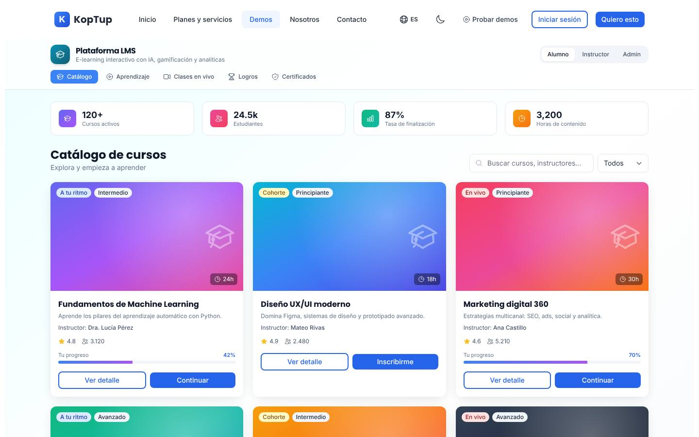
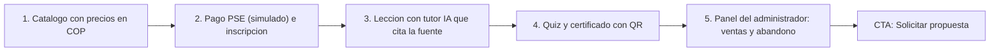

# Plataforma de cursos virtuales (LMS)

> Educación (`education`) · Demo: `/demo/lms` · Modo de acceso recomendado: `solicitud` (evaluar `publico` solo para la vista de alumno después de la Fase 2) · Prioridad: **P2** · Esfuerzo total: **XL** (≈ 8 semanas de 1 dev senior para landing + demo vendible; el producto real se estima aparte)

*Captura actual de `/demo/lms` (vista Alumno, Catálogo). Ver también [Sistema de demos](04-Sistema-de-Demos.md), [Catálogo de productos](08-Catalogo-de-Productos.md) y [Roadmap](12-Roadmap.md). Productos relacionados: [Sistemas RAG](Producto-chatbot-rag-ia.md) (tutor IA sobre el material del curso), [Gestión Humana y Nómina](Producto-hrms.md) (formación corporativa), [Facturación electrónica](Producto-facturacion-electronica.md) (venta de cursos) y [E-commerce](Producto-ecommerce.md).*

---

## Resumen

**Problema:** las academias y centros de educación continua en Colombia venden cursos por WhatsApp, cobran por transferencia, envían enlaces de Zoom a mano y emiten certificados en Word; no saben quién terminó ni quién abandonó. En las empresas, la capacitación obligatoria (SG-SST, protección de datos, SAGRILAFT, inducción) se controla en Excel y no hay evidencia lista para una auditoría o una visita de la ARL.

**Para quién (cliente ideal en Colombia/LATAM):**
- **Academias y educación continua** que venden cursos y diplomados (marketing, finanzas, idiomas, oficios, preparación de exámenes).
- **Empresas** de 100+ colaboradores con capacitación obligatoria y planes de formación por cargo.
- **Instituciones de educación superior e institutos de formación para el trabajo** que necesitan diplomados por cohortes e integrarse con su sistema académico.
- Gremios, cajas de compensación y fundaciones con programas de formación masiva.

**Propuesta de valor:** "Tu propia plataforma de cursos, con tu marca: vende con PSE y tarjeta, entrega certificados verificables con QR, mide quién avanza y quién está por abandonar, y dale a cada estudiante un tutor con IA que responde con el material de tu curso." A la medida, sin cobro por estudiante a un tercero y con el código del cliente.

**Encaje con el reposicionamiento RAG:** en el sitio nuevo este producto pasa a **"Otras soluciones a medida"**, pero es el que mejor muestra el producto principal: **el "Tutor IA" de la demo debe ser un RAG sobre el material del curso que cita la lección y el minuto**. Hoy responde frases al azar. Convertirlo es el cambio de mayor impacto de este plan y conecta el LMS con los planes RAG (el tutor se puede vender como complemento RAG Esencial).

---

## Estado actual

| Aspecto | Estado | Evidencia |
|---|---|---|
| Demo | Existe. **Maqueta** 100 % en el navegador | `apps/web/src/app/demo/lms/page.tsx` es `'use client'`; no hay `fetch`, `axios` ni llamadas a `/api` en la carpeta |
| Pantallas | Encabezado con selector de rol **Alumno / Instructor / Admin** + 4 estadísticas. Alumno: **Catálogo** (6 cursos, búsqueda, filtro por nivel, modal de detalle con temario y recursos), **Aprendizaje** (reproductor, lista de reproducción, notas, tutor IA, quiz de 3 preguntas, ruta adaptativa), **Clases en vivo** (3 sesiones), **Logros** (nivel, XP, racha, 6 insignias, tabla de clasificación), **Certificados** (2). Instructor y Admin: panel de analítica (4 KPIs, tendencia semanal, riesgo de abandono, módulos más vistos y a reforzar) | `page.tsx`, `components/CatalogGrid.tsx`, `PlayerPanel.tsx`, `QuizPanel.tsx`, `InstructorPanel.tsx`, `EngagementSections.tsx` |
| Datos | Fijos en el código: 6 cursos genéricos (Machine Learning, UX/UI, Marketing digital, Next.js, Liderazgo ágil, Ciberseguridad), mismo quiz y misma lista de reproducción para todos | `page.tsx` (`courses`, `playlist`, `quiz`), `messages/demos/lms.es.json` (`courses`, `tutorReplies`) |
| Backend | Módulo en memoria `apps/backend/src/modules/lms/` (Course, Enrollment, `enroll`; 197 líneas con test) **no montado** en `apps/backend/src/index.ts`; el frontend no lo usa | `lms.service.ts`, `lms.types.ts`, `lms.routes.ts` |
| i18n ES/EN | Textos de UI completos en `apps/web/messages/demos/lms.{es,en}.json` (242 líneas c/u). El quiz está fijo en español dentro de `page.tsx`; nombres de la tabla de clasificación sin tildes | `page.tsx` (`quiz`, `leaderboard`) |
| Tests | 1 smoke test (`__tests__/page.test.tsx`, 11 líneas) que hoy no se ejecuta (ver [Seguridad y calidad](10-Seguridad-y-Calidad.md)) | |
| Tamaño | 2.190 líneas (page 780 + 5 componentes 1.377 + layout 22 + test 11) | `wc -l` |
| SEO | Metadata `demo-lms` en `apps/web/src/lib/seo-config.ts` + breadcrumb JSON-LD en `layout.tsx` | |
| CTA | Solo el `DemoCTA` genérico del layout de `/demo` | `apps/web/src/app/demo/layout.tsx` |
| Catálogo | Mapeo correcto: offering `lms-elearning` → demo `lms` | `services-catalog.ts` (entrada 11) |

**Lo que hace bien:** es el más pulido de los demos de este grupo. El recorrido Catálogo → Ver detalle → Continuar → reproductor + quiz funciona de punta a punta; el quiz valida, muestra la respuesta correcta, suma puntaje y entrega insignia al 70 %; la búsqueda y el filtro por nivel funcionan; el temario muestra avance por módulo; el panel del instructor (riesgo de abandono, módulos débiles) es justo lo que pide un coordinador académico; gamificación y certificados son visualmente atractivos; la interfaz está completa en ES y EN.

### Problemas detectados (con ruta)

1. **"Admin" es igual a "Instructor":** ambos roles muestran el mismo `InstructorPanel` y ocultan la navegación (`page.tsx`, condición `role === 'instructor' || role === 'admin'`). No hay creación de cursos, gestión de usuarios, pagos, cupones ni certificados emitidos, que es lo que evalúa quien compra.
2. **Sin precios ni pagos:** el tagline del catálogo dice "cursos online con pagos, certificados y proctoring" y el Básico incluye "Stripe/Wompi para pagos", pero las tarjetas de `CatalogGrid.tsx` no tienen precio y "Inscribirme" entra directo al curso. El proctoring no aparece en ninguna pantalla.
3. **Tutor IA aleatorio:** responde una de 5 frases fijas elegida con `Math.random` (`PlayerPanel.tsx`), que hablan de "una clase Pedido y otra Factura" aunque el curso sea de Marketing (`tutorReplies` en `lms.es.json`). Los chips de sugerencia no envían la pregunta: `sendSuggestion` llama a `sendMessage` con el estado anterior del campo, que está vacío, y solo rellena la caja.
4. **Mismo contenido para todos los cursos:** misma lista de reproducción, el mismo quiz de Machine Learning (fijo en español en `page.tsx`, sin i18n) y la misma ruta adaptativa; en el temario cada módulo lista los mismos 3 recursos (`resources.slice(0, 3)`).
5. **Reproductor simulado:** degradado con botón de play; velocidad y subtítulos no cambian nada; el progreso sube 6 % una sola vez; el tipo de lección aparece en crudo ("video", "quiz", "reading") (`PlayerPanel.tsx`).
6. **Botones sin acción:** "Unirse" e "Inicia en" en clases en vivo (cuenta regresiva fija), "Verificar", "Descargar PDF" y "Compartir" en certificados; el QR es decorativo (`EngagementSections.tsx`).
7. **Cifras incoherentes:** "120+ cursos activos · 24.5k estudiantes · 3,200 horas de contenido" con 6 cursos; formatos mezclados ("24.5k", "3,200", "3.120") (`page.tsx`, `stats`).
8. **Certificados a nombre fijo:** el nombre del estudiante está escrito en el código (`CertificatesSection`), con fechas fijas; tabla de clasificación con nombres sin tilde ("Sofia", "Andres").
9. **Catálogo genérico tipo marketplace:** no muestra ni la academia colombiana que vende un diplomado ni la capacitación corporativa obligatoria; el prospecto no se ve reflejado.
10. **Textos del catálogo** (`messages/offerings/lms-elearning.es.json`): voseo ("Lanzá", "Comprala", "pagá"); "Zoom manual", "HRMS para certificaciones", "Talent Management adapter" (jerga interna); "Reportes mensuales del tier" repetido 2 veces en Avanzado y 3 en Enterprise; los costos del cliente mencionan solo Stripe; `costoNote` dice USD 50–20.000 y el catálogo USD 80–25.000. La grilla de precios es **idéntica** a la del chatbot antiguo ($46 M / $117 M / $273 M / $585 M): no se calculó para este producto. El hub (`messages/_demos.es.json`) promete "breakout rooms y subtítulos multi-idioma" y "quizzes auto-generados".

---

## Qué falta para que sea vendible

- **Tres caras del producto bien separadas:** Alumno (aprender y pagar), Instructor (crear el curso y ver analítica) y Administrador de la academia o empresa (ventas, inscripciones, asignaciones, certificados).
- **Venta de cursos simulada de punta a punta:** precio en COP, cupón, pago con PSE/tarjeta/Nequi (Wompi, simulado), factura electrónica (simulada) e inscripción automática.
- **Contenido coherente por curso** (lecciones, quiz y ruta propios) y datos de ejemplo del sector del prospecto.
- **Tutor IA con fuentes:** respuestas sobre el material del curso con "Fuente: Lección 2, minuto 03:12", primero simuladas y luego con el RAG real.
- **Certificado verificable de verdad:** PDF descargable con el nombre del prospecto y una página pública de verificación por QR.
- **Mensaje honesto:** qué es propio (plataforma, pagos, certificados, tutor) y qué se integra (Zoom/Meet/Teams para clases en vivo, servicio de video, proctoring como complemento).
- Precios propios del producto, textos del catálogo corregidos, capturas y video de 60–90 s.

---

## Plan detallado

### Landing `/productos/lms-elearning`

Estructura común de [Landing de producto](Seccion-Landing-de-Producto.md):

1. **Hero:** "Tu plataforma de cursos, con tu marca, cobrando en pesos". Subtítulo: "Vende cursos con PSE y tarjeta, entrega certificados verificables y dale a cada estudiante un tutor con IA que responde con tu propio material." CTA principal **"Solicitar demo"**, secundario "Agendar llamada".
2. **Tres casos** (pestañas o tarjetas): **Academias** (vender cursos y diplomados), **Empresas** (capacitación obligatoria con evidencia para auditoría), **Instituciones educativas** (diplomados por cohorte e integración académica).
3. **Problemas que resuelve:** cobros y matrículas por WhatsApp; certificados en Word sin verificación; nadie sabe quién va a abandonar.
4. **Cómo funciona** (4 pasos): diagnóstico (cursos, cómo cobras hoy, cuántos estudiantes) → configuración de marca y migración de los primeros cursos → lanzamiento con la primera cohorte → acompañamiento y analítica.
5. **Funciones** con "Incluido desde": catálogo y página de venta por curso · pagos Wompi/PayU con PSE, tarjeta y Nequi · lecciones en video, PDF y quiz · certificados con QR · clases en vivo (Zoom, Google Meet o Teams) · analítica y riesgo de abandono · tutor IA con fuentes (RAG) · asignaciones corporativas y reportes de cumplimiento · SCORM/xAPI · LTI 1.3 · proctoring (complemento).
6. **Capturas** (galería de 6: Catálogo con precios, Pago, Lección con tutor, Quiz, Certificado, Panel del administrador) y **video de 90 s**.
7. **Integraciones:** Wompi / PayU (PSE, tarjeta, Nequi), facturación electrónica DIAN (vía [Facturación electrónica](Producto-facturacion-electronica.md)), Zoom / Google Meet / Microsoft Teams, servicio de video (Vimeo, Mux u otro), WhatsApp Business (recordatorios y avisos de abandono), Google Workspace / Microsoft 365 (inicio de sesión), [Gestión Humana](Producto-hrms.md) (asignaciones por cargo), Moodle (migración de cursos).
8. **Planes y precios:** "Compra / a medida" en COP con "desde" y por estudiantes activos; SaaS como **"Lista de espera"** (DECISIÓN 7).
9. **Preguntas frecuentes:** ¿Puedo migrar mis cursos de Moodle, Teachable o Google Classroom? · ¿Cómo cobro y cómo facturo electrónicamente? · ¿Dónde se alojan los videos y cuánto cuesta? · ¿Los certificados son verificables? · ¿Qué hace el tutor IA y qué no? · ¿Sirve para la capacitación obligatoria de SG-SST? · ¿El código y los datos de los estudiantes son míos?
10. **CTA final** con el formulario "Solicitar demo" con `lms-elearning` preseleccionado y campos extra opcionales: tipo de organización (academia, empresa, institución educativa), número de estudiantes al año, ¿vendes cursos?, plataforma actual, ¿tienes contenido en SCORM o video?

### Demo interactiva (mejoras por pantalla/módulo)

| Pantalla / componente | Agregar | Quitar / corregir | Datos de ejemplo (preset "Academia") |
|---|---|---|---|
| Encabezado (`page.tsx`) | Nombre y logo de la academia o empresa del prospecto; selector de rol con 3 vistas distintas; botón "Iniciar recorrido"; aviso "Datos de ejemplo" | Admin igual a Instructor | "Academia Andina de Negocios" (ficticia, verificar en el RUES) |
| Estadísticas | Calculadas del dataset y con formato `es-CO` | "120+ cursos", "24.5k", "3,200" | 12 cursos publicados, 1.840 estudiantes, 71 % de finalización |
| Catálogo (`CatalogGrid.tsx`) | Precio en COP (o "Gratis para empleados" en el preset corporativo); imagen de portada; botón "Comprar" que abre el **checkout simulado**: resumen, cupón, PSE / tarjeta / Nequi (Wompi), confirmación, factura electrónica (simulada) e inscripción | "Inscribirme" que entra directo sin pago | "Diplomado en Finanzas para no financieros" $890.000; "Excel para análisis de datos" $290.000; "Marketing digital para PYMES" $450.000; cupón `BIENVENIDA10` |
| Detalle del curso (modal) | Temario real del curso con recursos distintos por módulo; requisitos; "Aprenderás"; instructor con foto genérica; política de certificación | Los mismos 3 recursos en todos los módulos | 5 módulos, 18 lecciones, 2 quizzes |
| Aprendizaje (`PlayerPanel.tsx`) | Video corto real (60 s, con derechos) con velocidad y subtítulos funcionando; botón "Marcar lección como completada" que mueve el progreso y la ruta; notas por lección guardadas en el navegador; tipos de lección traducidos | Progreso que sube 6 % una vez; "video/quiz/reading" en crudo | — |
| Tutor IA (`PlayerPanel.tsx`) | **Fase 2:** respuestas preparadas por curso con cita "Fuente: Lección 2 — Flujo de caja, minuto 03:12"; corregir los chips de sugerencia para que envíen la pregunta. **Fase 4:** conectado al RAG real sobre el PDF y la transcripción del curso | Respuestas al azar sobre "clase Pedido/Factura" | 3 preguntas sugeridas por curso ("¿Qué diferencia hay entre utilidad y flujo de caja?") |
| Quiz (`QuizPanel.tsx`) | Quiz por curso desde i18n/fixtures; resultado < 70 % activa la rama "Refuerzo" de la ruta adaptativa | Quiz de Machine Learning fijo en español en `page.tsx` | 5 preguntas por curso |
| Clases en vivo | Fecha y cuenta regresiva relativas; "Unirse" abre una sala simulada con aviso "Se integra con Zoom, Meet o Teams"; grabación disponible al terminar | Botones sin acción; "breakout rooms" como promesa | 3 sesiones esta semana |
| Logros | Nombres con tilde; "Tú" con el nombre del prospecto; reto semanal con fechas reales | — | — |
| Certificados | PDF descargable con logo, nombre del prospecto, horas y código; QR real que abre una página de verificación de ejemplo | Nombre fijo en el código; botones "Verificar / Descargar / Compartir" sin acción | Código `AAN-2026-0142` |
| Vista Instructor (`InstructorPanel.tsx`) | Mantener la analítica + **"Crear curso"** (asistente de 4 pasos: datos, módulos, subir video/PDF, quiz) e "Importar paquete SCORM" (simulado) | Gauge con valor fijo 32 | Curso en borrador "Contabilidad básica" |
| Vista Administrador (nueva) | Ventas del mes en COP, inscripciones, cupones, pagos por medio (PSE, tarjeta, Nequi), certificados emitidos, usuarios; en el preset corporativo: asignación por cargo y área, cumplimiento por área y exportación para auditoría | — | Ventas del mes $38,4 M; 64 inscripciones; preset corporativo: 92 % de cumplimiento en "SG-SST 50 horas" |
| Global | Estado compartido (comprar inscribe; completar lecciones cambia progreso, ruta y logros); badges "Incluido desde: Básico / Profesional / Avanzado"; botón "Volver" a la landing; CTA final "Solicitar propuesta" | `DemoCTA` genérico | — |

**Presets de datos:** (1) **Academia** (cursos con precio, cohortes, cupones); (2) **Capacitación corporativa** (cursos obligatorios: Inducción y reinducción, SG-SST 50 horas, Protección de datos personales (Ley 1581), SAGRILAFT, Servicio al cliente; asignados por cargo y con vencimiento); (3) **Institución educativa** (diplomados por cohorte, notas, integración académica simulada).

**Recorrido guiado (5 pasos, menos de 4 minutos):**

> [Ver diagrama como imagen](images/diagramas/Producto-lms-elearning-1.png)

1. **Catálogo:** "Academia Andina vende 12 cursos; el diplomado de finanzas cuesta $890.000."
2. **Pago:** comprar con el cupón `BIENVENIDA10` y PSE (simulado); llega la confirmación, la factura electrónica (simulada) y el curso aparece en "Mis cursos".
3. **Lección:** ver el video corto y preguntarle al tutor "¿Qué diferencia hay entre utilidad y flujo de caja?"; la respuesta cita la lección y el minuto.
4. **Quiz y certificado:** aprobar el quiz, descargar el certificado con el nombre del prospecto y escanear el QR para ver la página de verificación.
5. **Administrador:** ventas del mes, inscripciones por curso y lista de estudiantes en riesgo de abandono con botón "Enviar recordatorio por WhatsApp (simulado)". Cierre con CTA "Solicitar propuesta" / "Agendar llamada".

### Acceso y solicitud de demo

- **Modo recomendado: `solicitud`** en la Fase 1, con 14 días de acceso. Hoy la demo expone errores visibles (tutor al azar, Admin igual a Instructor, cifras infladas) y no muestra pagos. Después de la Fase 2, **evaluar `publico` solo para la vista de Alumno** como imán de leads y SEO ("plataforma de cursos virtuales Colombia"), manteniendo Instructor y Administrador detrás del acceso; decidirlo con datos de conversión de la Fase 1.
- **Duración del acceso:** **14 días**, extensible 7 días desde el admin.
- **Modo:** **autoservicio** con sesión guiada opcional de 30 min (las academias pequeñas prefieren probar solas; las empresas e instituciones piden la sesión).
- **Qué ve el visitante antes de solicitar:** la landing con los 3 casos, 6 capturas, el video de 90 s, la tabla de funciones por plan y las preguntas frecuentes. `/demo/lms` sin acceso redirige a la landing con el botón "Solicitar acceso" y lleva `noindex`.
- **Formulario:** el general de [Sistema de demos](04-Sistema-de-Demos.md) + campos opcionales: tipo de organización, estudiantes al año, ¿vendes cursos?, plataforma actual, contenido existente.
- **Prospecto aprobado** (Portal › Mis demos, ver [Portal del cliente](06-Portal-del-Cliente.md)): tarjeta "Plataforma de cursos — personalizada para <Organización>", días restantes, botón "Abrir demo", accesos directos "Ver como alumno / instructor / administrador", certificado de ejemplo con su nombre y CTA "Solicitar propuesta".
- **Eventos `DemoEvent`:** rol usado, cursos abiertos, checkout completado, preguntas al tutor, quiz aprobado, certificado descargado, curso creado en la vista Instructor, clic en CTA.

### Personalización por cliente

Sin código, desde **Admin › Solicitudes de demo › Aprobar** (o Admin › Demos › Personalizar), guardado en `DemoGrant.personalizacion`. Ver [Panel de administración](05-Panel-de-Administracion.md).

| Campo | Efecto en la demo |
|---|---|
| Logo y color primario | Encabezado, botones, portadas y certificado |
| Nombre de la organización | Encabezado, certificado, página de verificación |
| Caso (preset) | Academia, Capacitación corporativa o Institución educativa (catálogo, precios o asignaciones) |
| Hasta 3 cursos propios (título, descripción, precio) | Reemplazan cursos del preset en el catálogo |
| Documento propio para el tutor (opcional) | En Fase 4, el tutor responde con un PDF del prospecto usando "Prueba con tu documento" del chatbot RAG (mismos límites y borrado en 1 hora) |
| Medios de pago mostrados | PSE, tarjeta, Nequi, transferencia |
| Plan cotizado | Muestra solo las funciones incluidas; el resto con "Disponible en plan X" |
| Idioma (es / en) | Textos de la interfaz |

**Implementación:** mover `courses`, `playlist`, `quiz`, `leaderboard`, `certificates` y `liveSessions` de `page.tsx` a `apps/web/src/app/demo/lms/fixtures/<preset>.ts` con fechas relativas; la página lee la configuración de `GET /api/demo-access/lms` (DECISIÓN 3).

### Producto real

**Decisión de base técnica (antes de la primera propuesta):**
- **Academias y empresas** que quieren experiencia moderna, venta de cursos y marca propia → desarrollo propio en Next.js + backend Koptup (reutiliza autenticación, pagos y el núcleo RAG).
- **Instituciones educativas** que exigen SCORM completo, LTI e interoperabilidad académica → evaluar **Moodle** (muy usado en Colombia) como base y vender personalización, integración, tema visual y el tutor RAG como complemento. Reduce riesgo y tiempo.

**Alcance MVP — modalidad compra (Profesional, 8–12 semanas reales):**
- **Catálogo y venta:** página por curso, precios, cupones, pagos Wompi o PayU (PSE, tarjeta, Nequi), factura electrónica vía proveedor autorizado o [Facturación electrónica](Producto-facturacion-electronica.md), inscripción automática.
- **Contenido:** cursos con módulos y lecciones (video en servicio gestionado, PDF, texto), quizzes con banco de preguntas, progreso por lección.
- **Certificados:** PDF con plantilla de la marca, código único y página pública de verificación por QR.
- **Clases en vivo:** creación de reuniones en Zoom, Google Meet o Teams desde la plataforma y registro de asistencia.
- **Analítica:** avance por curso y estudiante, riesgo de abandono por inactividad, recordatorios por correo y WhatsApp Business.
- **Roles:** estudiante, instructor, administrador (y jefe de área en el caso corporativo), con autorización en servidor.
- **Corporativo:** asignación por cargo y área, cursos obligatorios con vencimiento, reportes de cumplimiento exportables, inicio de sesión con Google o Microsoft, integración con [Gestión Humana](Producto-hrms.md).
- **Tutor IA (complemento RAG):** responde con el material del curso y cita la lección; reutiliza el núcleo de los [Sistemas RAG](Producto-chatbot-rag-ia.md) y se cobra como plan RAG.
- **Profesional en adelante:** SCORM 1.2/2004 y xAPI; **Avanzado:** LTI 1.3, multi-sede, proctoring con proveedor externo.
- **Transversal:** autorización de datos personales (Ley 1581 de 2012) en el registro, términos de venta y retracto para cursos vendidos en línea, auditoría de calificaciones y certificados.
- **Base técnica:** partir de los tipos de `apps/backend/src/modules/lms/` (Course, Enrollment, `enroll`) migrados a Mongoose con autenticación, autorización y `tenantId`.

**SaaS (DECISIÓN 7):** no hay base multi-tenant ni cobro recurrente → **"SaaS: lista de espera"**. Por compartir el núcleo RAG con el chatbot, el tutor IA podría venderse como SaaS antes que el LMS completo. Para el LMS SaaS (Fase 4): aislamiento por academia, dominio propio por cliente, cobro recurrente Wompi/PayU (COP) y Stripe (USD) por estudiantes activos, medición de almacenamiento y minutos de video contra el plan, pagos de cursos a la cuenta del cliente (no de Koptup) y acuerdo de encargo de tratamiento de datos.

### Planes y precios

Precios actuales del catálogo (`apps/web/src/lib/services-catalog.ts`, entrada `lms-elearning`; COP):

| Plan | Compra: setup | Compra: mantenimiento/mes | SaaS: setup | SaaS: mes | Volumen incluido | Admin / estudiantes / sedes | Almacenamiento | Implementación (catálogo) | Costos del cliente al proveedor (USD/mes) |
|---|---|---|---|---|---|---|---|---|---|
| Básico | $46.000.000 | $4.200.000 | $2.900.000 | $1.590.000 | 1.000 inscripciones/mes | 5 / 500 / 1 | 50 GB | 2–5 semanas | 80–300 (hosting, DB, video básico, pagos) |
| Profesional | $117.000.000 | $10.400.000 | $6.900.000 | $3.790.000 | 20.000 inscripciones/mes | 30 / 20.000 / 5 | 400 GB | 5–9 semanas | 400–1.500 (+ video Pro, DRM, IA) |
| Avanzado | $273.000.000 | $23.400.000 | $12.900.000 | $7.090.000 | 200.000 inscripciones/mes | 80 / 150.000 / 25 | 2 TB | 9–14 semanas | 1.500–6.000 (+ CDN, en vivo, proctoring) |
| Enterprise | $585.000.000 | $45.500.000 | $0 (se muestra "Personalizado") | $12.890.000 | 2 M+ inscripciones/mes | Ilimitados | Ilimitado | 12–20 semanas | 5.000–25.000 (+ LTI 1.3, SCIM, video corporativo) |

Horas de evolutivos incluidas por mes: 5 / 12 / 25 / 50. Soporte: correo 24 h hábiles / + WhatsApp 4 h / + Slack Connect 2 h / tickets con SLA 1 h. Ciclos SaaS: semestral −10 %, anual −20 %. Referencia USD con la TRM 3.300 de la rama `rag-reposicionamiento`: setup de compra ≈ USD 13.900 / 35.500 / 82.700 / 177.300.

**Recomendaciones de claridad:**
1. **Recalcular la grilla:** hoy es idéntica a la del chatbot antiguo; el costo de construir un LMS (pagos, certificados, contenido, analítica) es distinto. Definirla con el alcance MVP de arriba y la decisión Moodle vs propio.
2. **Cobrar por lo que el cliente entiende:** "estudiantes activos al mes" (y horas de video almacenadas) en lugar de "inscripciones/mes"; hoy el Básico permite 500 estudiantes y 1.000 inscripciones, lo que confunde.
3. **Mantenimiento incoherente:** 12 × $4,2 M = $50,4 M al año (110 % del setup Básico) y 2,6 veces la cuota SaaS ($1,59 M). A 3 años, la compra Básica cuesta $197,2 M y el SaaS $60,1 M. Pasarlo a % anual o bolsa de horas y decir qué incluye.
4. **Pagos locales primero:** Wompi/PayU con PSE y Nequi en todos los planes; Stripe solo para cobros en USD.
5. **SaaS → "Lista de espera"** hasta la Fase 4; ofrecer el **tutor RAG** como complemento con los planes RAG.
6. **Bullets en lenguaje de cliente y alineados con la demo.** Propuesta: **Básico** "Hasta 500 estudiantes activos · Tu marca y dominio · Venta de cursos con PSE, tarjeta y Nequi · Certificados verificables con QR · Recordatorios por correo". **Profesional** "+ Hasta 5.000 estudiantes · Clases en vivo con Zoom, Meet o Teams · Analítica y alertas de abandono · SCORM/xAPI · Asignaciones corporativas · Tutor IA con tus materiales (complemento)". **Avanzado** "+ Multi-sede · LTI 1.3 · Proctoring con proveedor externo · Integración con Gestión Humana o sistema académico". **Enterprise** "+ SSO y aprovisionamiento automático · Video corporativo · Integración con SAP SuccessFactors / Workday Learning · Gerente de proyecto dedicado".
7. Tuteo ("tú") en lugar de voseo; quitar "Zoom manual", "HRMS para certificaciones", "Talent Management adapter" y "Reportes mensuales del tier" repetido; descripción propia; `costoNote` igual al catálogo (USD 80–25.000) explicando el costo del video.
8. Ofrecer una entrada de bajo riesgo: **"Lanza tu academia"** (plataforma configurada + 3 cursos migrados + primera cohorte acompañada) con precio cerrado.

Política comercial común en [Catálogo de productos](08-Catalogo-de-Productos.md) y [Comercial, marketing y legal](11-Comercial-Marketing-y-Legal.md).

---

## Tareas

| # | Tarea | Fase | Prioridad | Esfuerzo | Criterio de aceptación |
|---|---|---|---|---|---|
| 1 | Reescribir el offering `lms-elearning` en ES/EN (nombre "Plataforma de cursos virtuales (LMS)", tuteo, bullets de cliente sin duplicados ni jerga, Wompi/PSE, `costoNote` USD 80–25.000) y quitar del hub las promesas que la demo no cumple | Fase 1 — Funnel y solicitud de demos | P1 | S | `lms-elearning.{es,en}.json` sin voseo ni bullets repetidos; el hub solo menciona funciones visibles en la demo |
| 2 | Registrar `DemoCatalogItem` `lms` en modo `solicitud` (14 días, autoservicio), redirección a la landing sin acceso, `noindex` y campos extra del formulario | Fase 1 — Funnel y solicitud de demos | P1 | S | Sin grant, `/demo/lms` redirige a la landing; con grant vigente abre la demo; el acceso se verifica en servidor |
| 3 | Recalcular la grilla de precios del LMS y cambiar la métrica a "estudiantes activos/mes" (decisión del dueño) | Fase 1 — Funnel y solicitud de demos | P2 | S | La grilla del LMS deja de ser igual a la del chatbot; el modal del catálogo muestra estudiantes activos |
| 4 | Landing `/productos/lms-elearning` con los 3 casos y las secciones de este plan | Fase 1 — Funnel y solicitud de demos | P2 | M | Página publicada; "Solicitar demo" abre el formulario con `lms-elearning` preseleccionado y el campo "tipo de organización" |
| 5 | Corregir errores: chips del tutor que no envían, tipos de lección traducidos, estadísticas calculadas con formato `es-CO`, nombres con tilde, quiz movido a i18n | Fase 2 — Demos vendibles | P2 | S | Un clic en un chip envía la pregunta; en EN no aparece el quiz en español; las estadísticas coinciden con el dataset |
| 6 | Contenido por curso en `fixtures/` (3 presets): lecciones, recursos por módulo, quiz y ruta propios; el resultado del quiz alimenta la ruta adaptativa | Fase 2 — Demos vendibles | P2 | M | Dos cursos distintos muestran lecciones y quiz distintos; un puntaje < 70 % activa la rama "Refuerzo" |
| 7 | Checkout simulado: precio en COP, cupón, PSE/tarjeta/Nequi (Wompi, simulado), factura electrónica (simulada) e inscripción | Fase 2 — Demos vendibles | P2 | M | Comprar un curso lo agrega a "Mis cursos" y suma la venta en la vista Administrador en la misma sesión |
| 8 | Vistas por rol: Administrador nueva (ventas, inscripciones, cupones, certificados, asignaciones corporativas) e Instructor con "Crear curso" (asistente de 4 pasos) e "Importar SCORM" simulado | Fase 2 — Demos vendibles | P2 | L | Admin e Instructor muestran pantallas distintas; un curso creado en Instructor aparece en el catálogo como borrador |
| 9 | Tutor IA con fuentes simulado: respuestas por curso con cita de lección y minuto | Fase 2 — Demos vendibles | P1 | S | Cada respuesta del tutor muestra "Fuente: Lección X, minuto mm:ss" del curso abierto |
| 10 | Tutor IA conectado al RAG real sobre el PDF y la transcripción de un curso de ejemplo (reutiliza el chatbot RAG, con sus límites de costo) | Fase 4 — Productos SaaS reales | P2 | M | El tutor responde preguntas nuevas sobre el curso con cita verificable y respeta el tope de preguntas por sesión |
| 11 | Reproductor con video real corto y controles funcionales; "Marcar lección como completada" | Fase 2 — Demos vendibles | P3 | S | Velocidad y subtítulos cambian el video; completar una lección actualiza progreso, ruta y logros |
| 12 | Certificado verificable: PDF con el nombre del prospecto y página pública de verificación de ejemplo por QR | Fase 2 — Demos vendibles | P2 | S | El QR del PDF abre la página de verificación con el código y el nombre correctos |
| 13 | Recorrido guiado de 5 pasos, personalización desde `DemoGrant` (logo, organización, preset, cursos propios, medios de pago, plan), 6 capturas y video de 90 s | Fase 2 — Demos vendibles | P2 | M | Recorrido completable en menos de 4 min; con un grant personalizado el prospecto ve su marca y su preset |
| 14 | Smoke test ejecutándose en CI y salida de los datos fijos de `page.tsx` (780 líneas) a `fixtures/` | Fase 0 — Endurecimiento | P2 | S | `__tests__/page.test.tsx` pasa en CI; `page.tsx` queda por debajo de 400 líneas |
| 15 | Decisión de base técnica del producto real (Moodle vs propio) con una prueba de concepto de importación SCORM | Fase 3 — Propuestas y conversión | P2 | S | Documento con la decisión por tipo de cliente y la prueba de importación de un paquete SCORM documentada |

---

## Métricas de éxito

Son **metas** iniciales a validar con datos reales; no son resultados actuales.

- **Interés:** ≥ 4 solicitudes de demo calificadas por trimestre (academias con 300+ estudiantes al año o empresas con 100+ colaboradores).
- **Activación:** ≥ 60 % de los prospectos aprobados abre la demo en 72 h; ≥ 40 % completa el checkout simulado; ≥ 30 % prueba las 3 vistas (alumno, instructor, administrador); ≥ 50 % hace al menos una pregunta al tutor.
- **Conversión:** ≥ 20 % de las demos termina en propuesta; 1 cliente "Lanza tu academia" en los 6 meses siguientes a la Fase 2.
- **Venta cruzada RAG:** ≥ 1 de cada 3 propuestas de LMS incluye el tutor IA como plan RAG.
- **Si se abre la vista de Alumno como `publico`:** ≥ 2 % de los visitantes de la demo pasa a "Solicitar demo" de la vista completa.
