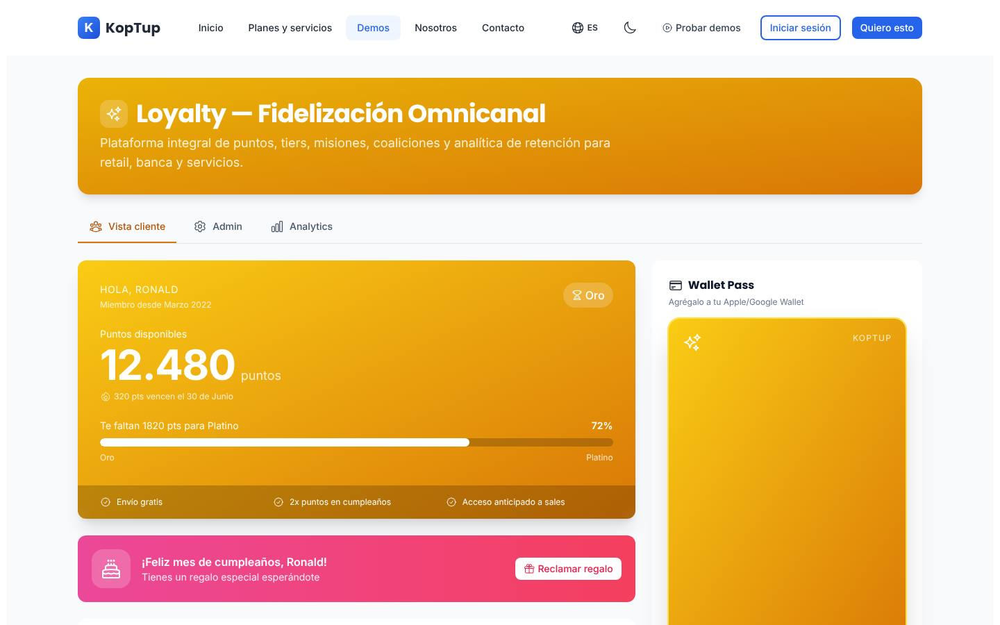
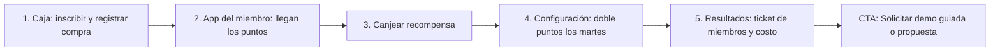

# Programa de fidelización

> Engagement (`engagement`) · Demo: `/demo/loyalty` · Modo de acceso recomendado: `publico` (versión con la marca y las recompensas del prospecto por `solicitud`) · Prioridad: **P2** · Esfuerzo total: **XL** (≈ 3–4 semanas de 1 dev senior para dejar demo y landing vendibles; el producto real se estima aparte)

*Captura actual de `/demo/loyalty` (pestaña Vista cliente). Ver también [Sistema de demos](04-Sistema-de-Demos.md), [Catálogo de productos](08-Catalogo-de-Productos.md) y [Roadmap](12-Roadmap.md). Productos relacionados: [POS retail](Producto-pos-retail.md), [Tienda en línea](Producto-ecommerce.md), [App de delivery](Producto-app-delivery.md) y [CRM con IA](Producto-crm-ia.md).*

> **Contexto de posicionamiento:** con el reposicionamiento de Koptup en sistemas RAG (ver [Visión de producto](02-Vision-de-Producto.md)), este producto queda dentro de **"Otras soluciones a medida"**. Es, sin embargo, buen candidato a segundo producto SaaS después del chatbot RAG (ver [Producto real](#producto-real)).

---

## Resumen

**Problema:** muchos comercios colombianos piden la cédula o el celular en caja y no hacen nada con ese dato. Usan tarjetas de sellos en papel o descuentos genéricos que regalan margen a quien igual iba a comprar, y no saben qué clientes dejaron de volver.

**Para quién (cliente ideal en Colombia/LATAM):**
- Cadenas de droguerías y farmacias de barrio con 3–50 puntos de venta.
- Supermercados y autoservicios regionales.
- Marcas de moda, calzado y cosmética con tiendas propias y tienda en línea.
- Restaurantes y cafeterías con varias sedes.
- Estaciones de servicio, tiendas de mascotas y veterinarias, ópticas.
- Cooperativas y cajas de compensación que quieren premiar el uso de sus servicios.

**Propuesta de valor:** "Tu propio club de clientes, con tu marca: puntos por compra en caja y en línea, niveles, canjes y campañas por WhatsApp. Los datos son tuyos y no de una coalición, y sabes cuánto te cuesta el programa antes de lanzarlo."

---

## Estado actual

| Aspecto | Estado | Evidencia |
|---|---|---|
| Demo | Existe. **Maqueta** 100 % en el navegador. No hay `fetch`, `axios` ni llamadas a `/api` | `apps/web/src/app/demo/loyalty/page.tsx` (`'use client'`) |
| Pantallas | Encabezado y 3 pestañas. **Vista cliente:** tarjeta de saldo y nivel, banner de cumpleaños, catálogo de recompensas con 5 filtros, misiones, *wallet pass* que gira, referidos, racha y ranking. **Admin:** 6 subpestañas (Puntos, Tiers, Misiones, Referidos, Cashback, Sorteos) y bloques fijos de campañas, coaliciones, fraude y pruebas A/B. **Analytics:** 6 KPIs, cohortes, distribución por nivel, top de recompensas y "Personalización con ML" | `page.tsx` (incluye `MemberView`, `WalletPass`, `RewardsCatalog`, `Missions`, `Referrals`, `StreakCard`, `Leaderboard`), `components/AdminView.tsx`, `components/AnalyticsView.tsx`, `components/shared.tsx` (`TIER_THEME`, `KpiBox`) |
| Datos | Escritos dentro de cada componente. Saldo fijo de 12.480 puntos, recompensas de marcas de terceros con valores en USD | `RewardsCatalog`, `Coalitions`, `TopRewards` |
| Backend | Módulo en memoria `apps/backend/src/modules/loyalty/` (miembros con nombres colombianos, recompensas, canje que valida saldo y recalcula el nivel por gasto) **no montado** en `apps/backend/src/index.ts` y sin tests; el frontend no lo usa. Relacionado: `modules/pos/` (también en memoria) | `loyalty.service.ts`, `loyalty.data.ts`, `loyalty.types.ts` |
| i18n ES/EN | `apps/web/messages/demos/loyalty.{es,en}.json` (297 líneas c/u), namespace `demoLoyalty`. Hay texto fijo en el código: misiones "Double Weekend", "Refer 3 Friends", "App-only Quest"; encabezados "Campaign", "Channels", "Reward"; meses `'Jan'`…`'Jun'`; horarios `'Sat 18:00'`; recomendaciones de ML en español fijo | `AdminView.tsx`, `AnalyticsView.tsx` |
| Tests | 1 smoke test (`__tests__/page.test.tsx`) que hoy no se ejecuta (ver [Seguridad y calidad](10-Seguridad-y-Calidad.md)) | |
| Tamaño | 1.229 líneas (page 504, AdminView 444, AnalyticsView 206, shared 42, layout 22, test 11) | `wc -l` |
| SEO | Metadata `demo-loyalty` en `apps/web/src/lib/seo-config.ts` y breadcrumb JSON-LD en `layout.tsx` | |
| CTA | Solo el `DemoCTA` genérico del layout de `/demo` (sin producto preseleccionado; "Ver Planes y Precios" → `/pricing`, que solo redirige) | `apps/web/src/components/demo/DemoCTA.tsx` |
| Catálogo | Mapeo correcto: offering `loyalty-fidelizacion` → demo `loyalty` | `services-catalog.ts` |

**Lo que hace bien:** es visualmente atractiva (tarjeta con gradiente por nivel, *wallet pass* que gira y muestra código de barras), cubre todas las mecánicas que un comprador espera ver (puntos, niveles, misiones, referidos, cashback, sorteos), los controles deslizantes de las reglas responden, el catálogo deshabilita los canjes sin saldo suficiente y la separación "lo que ve el cliente / lo que configura la empresa / lo que mide la gerencia" está bien planteada.

### Problemas detectados (con ruta)

1. **Marcas de terceros como recompensas y aliados:** Starbucks, Amazon, Netflix, Spotify, Uber, LiveNation y UNICEF en `RewardsCatalog`, y Starbucks, Avianca, Falabella, Rappi y Movistar como "Coaliciones de partners" en `Coalitions`. Sugiere alianzas que no existen y es un riesgo de marca.
2. **Moneda y escala de EE. UU.:** gift cards de "$10/$25", cashback "$48,210" y la regla base "1 punto por cada $1 gastado" (`admin.programs.points.baseHelp`). En pesos eso equivale a devolver el 100 % de la compra; lo usual en Colombia es 1 punto por cada $1.000.
3. **El canje no descuenta puntos:** `points` es una constante (12.480) en `MemberView`. Al canjear, el botón cambia a "¡Canjeado!" pero el saldo no baja.
4. **Botones sin acción:** "Reclamar regalo" (cumpleaños), "Reclamar" en misiones, Apple/Google Wallet, los 3 íconos de compartir referidos (sin etiqueta), "Añadir partner" y "Revisar" en fraude. El botón de copiar enlace cambia el ícono pero no copia al portapapeles.
5. **Filtro vacío:** la categoría "Productos" no tiene ninguna recompensa (todas son gift cards, experiencias o donaciones).
6. **Números incoherentes:** los niveles suman 29.200 miembros (`ProgramTiers`, `TierDonut`), pero "Miembros activos" dice 84.210 y la campaña "Double Points Weekend" apunta a 125k. "Top 10 del mes" muestra 7 filas, y la racha de 14 días pinta todas las barras iguales.
7. **Configuración sin efecto visible:** los controles de puntos, los umbrales de nivel (se pueden cruzar: Plata por encima de Oro) y los meses de degradación no muestran ninguna simulación. Referidos, Cashback y Sorteos son solo cifras, sin nada que configurar.
8. **Persona y marca fijas:** el saludo, el banner de cumpleaños, la tarjeta y el ranking usan un mismo nombre propio fijo; el *wallet pass* dice "KopTup" y "<Nivel> Member" (debería mostrar la marca del cliente) y el enlace de referidos usa el dominio de Koptup.
9. **Spanglish:** "Loyalty — Fidelización Omnicanal", "Tiers", "Wallet Pass", "Earning Rules", "Completion", "Uplift", "Breakage", "AOV", "LTV", "Engagement", "Double Points Weekend", "Birthday Auto-Trigger", "Point farming", "Multi-account", además de los textos fijos en inglés citados en la tabla.
10. **Falta el flujo más importante en Colombia: acumular en caja.** No hay vista de caja ni inscripción del cliente con autorización de tratamiento de datos (Ley 1581). Sin eso, el comprador no ve cómo funcionaría en su punto de venta.
11. **Promesas difíciles de sostener:** "Personalización con ML", "Detección de fraude en tiempo real", A/B testing y "Sorteos" sin advertencia (en Colombia los sorteos promocionales requieren autorización de Coljuegos).
12. **Textos del catálogo** (`apps/web/messages/offerings/loyalty-fidelizacion.es.json`): voseo ("Premiá", "Comprala", "pagá", "por vos"); descripción de plantilla ("Implementación a medida o suscripción SaaS mensual del producto…"); bullets genéricos ("POS retail", "Email basic"); "Reportes mensuales del tier" 1 vez en Profesional, 2 en Avanzado y 2 en Enterprise (relleno para cuadrar `incluyeCount`); `costoNote` dice USD 30–25.000/mes y el catálogo, 80–25.000.

---

## Qué falta para que sea vendible

- **La caja:** una vista donde el cajero busca al cliente por celular o cédula, lo inscribe con su autorización y registra la compra; los puntos llegan a la app del miembro.
- **Un saldo que se mueva:** compra → puntos → canje → saldo menor, coherente en todas las pestañas.
- **Recompensas propias del comercio** (bonos, productos, domicilio gratis), sin marcas de terceros.
- **Pesos colombianos y escala real** (1 punto por cada $1.000; valor del punto en pesos).
- **Simulador de costo del programa:** la primera pregunta de un gerente es "¿cuánto me cuesta?". Ver [Landing](#landing-productosloyalty-fidelizacion).
- **Cumplimiento visible:** Ley 1581 (autorización), Ley 2300 de 2023 (horarios de mensajes comerciales), términos y condiciones del programa, Coljuegos para sorteos y tratamiento contable de los puntos (NIIF 15).
- **La marca del cliente** en la tarjeta y el *wallet pass*: es el "momento wow" de la demo personalizada.
- **Recorrido guiado** de 5 pasos, badges "Incluido desde plan X" y CTA contextual.
- **Capturas y video** de 60–90 s.

---

## Plan detallado

### Landing `/productos/loyalty-fidelizacion`

Sigue la estructura común de [Landing de producto](Seccion-Landing-de-Producto.md):

1. **Hero:** "Tu club de clientes con tu marca: puntos en caja, en línea y por WhatsApp". Subtítulo: "Haz que tus clientes vuelvan y mide cuánto más compran los miembros. Sin pagar por pertenecer a una coalición." CTA principal **"Solicitar demo"**, secundario "Agendar llamada" y enlace "Probar la demo interactiva" (`/demo/loyalty`).
2. **Problemas que resuelve** (3 tarjetas): clientes que no vuelven y nadie lo nota; descuentos que regalan margen a todos; datos de clientes que no se usan.
3. **Cómo funciona** (4 pasos): el cajero inscribe al cliente con su celular → cada compra suma puntos → el cliente recibe un WhatsApp con su saldo y canjea → tú ves quién vuelve y cuánto más compra.
4. **Simulador de costo del programa** (calculadora en la página): ventas mensuales, % de ventas hechas por miembros, regla de acumulación, valor del punto y % de puntos que vencen sin usarse → costo mensual estimado y pasivo por puntos. Ejemplo: $400 M de ventas a miembros, 1 punto por cada $1.000 y punto de $10 → $4 M/mes (1 % de devolución); si vence el 20 %, el costo efectivo es $3,2 M.
5. **Capturas** (Caja, App del miembro, Configuración, Resultados) y **video de 60–90 s** con locución en español.
6. **Módulos y plan en el que se incluyen** (tabla Básico / Profesional / Avanzado / Enterprise).
7. **Integraciones:** el POS del cliente por API o el [POS retail](Producto-pos-retail.md) de Koptup; [Tienda en línea](Producto-ecommerce.md), Shopify, WooCommerce o VTEX; WhatsApp Business (API oficial); SMS y correo; Apple Wallet y Google Wallet; CRM (HubSpot en Profesional, [CRM con IA](Producto-crm-ia.md)).
8. **Cumplimiento:** autorización de tratamiento de datos (Ley 1581) en la inscripción; mensajes comerciales solo en los horarios que permite la Ley 2300 de 2023; términos y condiciones del programa (vigencia y vencimiento de puntos); sorteos con autorización de Coljuegos; reporte del pasivo por puntos para el contador (NIIF 15).
9. **Planes y precios:** "Compra / a medida" en COP (y USD de referencia con `TRM_REFERENCIA = 3.300`); SaaS como **"Lista de espera"** (DECISIÓN 7).
10. **Preguntas frecuentes:** ¿Cuánto me cuesta el programa? · ¿Funciona con mi POS actual? · ¿El cliente tiene que descargar una app? (No: WhatsApp, web y *wallet*) · ¿Los datos son míos? · ¿Cómo evito el fraude de puntos? · ¿Cuánto tarda? (2–5 semanas en Básico) · ¿Puedo empezar con una sola sede?
11. **CTA final** con el formulario "Solicitar demo" con `loyalty-fidelizacion` preseleccionado.

### Demo interactiva (mejoras por pantalla/módulo)

| Pantalla / componente | Agregar | Quitar / corregir | Datos de ejemplo |
|---|---|---|---|
| Encabezado y pestañas (`page.tsx`, `MainTab`) | Barra de demo con la marca del prospecto, aviso "Datos de ejemplo" y botón "Iniciar recorrido". Nuevo orden de pestañas: **Caja**, **App del miembro**, **Configuración**, **Resultados** | Título "Loyalty — Fidelización Omnicanal" → "Club <Marca>: programa de fidelización"; subtítulo con "banca" (no es el foco) | — |
| Estado global (nuevo `components/LoyaltyProvider.tsx`) | Contexto con miembro, saldo, transacciones y reglas, compartido por las 4 pestañas (igual que `CartProvider` en la demo de e-commerce) | Constantes sueltas (`points = 12480`, `tierProgress = 72`) | Saldo inicial 8.450 puntos; nivel Plata; 1.550 puntos para Oro |
| **Caja (nuevo `components/CashierView.tsx`)** | Buscar por celular o cédula; inscribir nuevo miembro con casilla obligatoria de autorización (Ley 1581); registrar compra (monto y categoría); mostrar puntos ganados con su multiplicador; aplicar un canje como descuento en la misma venta; vista previa del WhatsApp enviado | — | Compra de $185.000 en Cuidado personal (doble puntos los martes) → +370 puntos |
| App del miembro (`MemberView`, `WalletPass`) | Saldo que sube con la caja y baja con el canje; movimientos recientes; "Agregar a Wallet" abre una vista previa del pase con la marca; "Reclamar regalo" entrega un cupón con código | Nombre propio fijo → persona ficticia "Laura Martínez"; "KopTup" y "<Nivel> Member" en la tarjeta → marca del cliente y "Nivel Oro"; fecha de vencimiento fija → relativa | 320 puntos vencen en 21 días |
| Recompensas (`RewardsCatalog`) | Al canjear: modal con cupón (código y QR) y saldo actualizado; recompensas en las 4 categorías (Bonos, Productos, Experiencias, Donaciones) | Starbucks, Amazon, Netflix, Spotify, Uber, LiveNation, UNICEF; valores en USD; categoría "Productos" vacía | Preset droguería: Bono $10.000 (1.000 pts), Domicilio gratis (600 pts), Protector solar 50 ml (2.500 pts), Donación a una fundación local ficticia (500 pts) |
| Misiones, referidos, racha, ranking (`Missions`, `Referrals`, `StreakCard`, `Leaderboard`) | "Reclamar" suma los puntos; copiar usa `navigator.clipboard`; compartir abre WhatsApp con texto prellenado; etiquetas de texto en los íconos | Ranking público de clientes (apagado por defecto, por privacidad); "Top 10" con 7 filas; barras de racha todas iguales | Misión "Compra 2 veces este mes: +300 puntos" |
| Configuración › Puntos (`ProgramPoints`) | Regla base en COP; simulador "Una compra de $185.000 en Cuidado personal por la app da X puntos"; valor del punto en pesos | "1 punto por cada $1 gastado"; categorías de viajes (no aplica al preset) | 1 punto por cada $1.000; punto = $10; multiplicadores: cuidado personal ×2 los martes, app ×1,5 |
| Configuración › Niveles (`ProgramTiers`) | Validar que los umbrales queden en orden; mostrar cuántos miembros cambiarían de nivel con el umbral nuevo | "Tiers" → "Niveles"; nombres editables | Clásico 0, Plata 3.000, Oro 10.000, Diamante 30.000 puntos/año |
| Configuración › Misiones, Referidos, Cashback, Sorteos | 2–3 campos editables en cada subpestaña; aviso "Los sorteos promocionales requieren autorización de Coljuegos" | Nombres de misiones en inglés; cashback "$48,210" | Referido: 500 puntos para quien invita y 300 para el nuevo miembro |
| Campañas (`Campaigns`) | Vista previa del mensaje de WhatsApp; selector de horario que solo permite franjas legales (Ley 2300 de 2023); audiencia calculada desde la base | Encabezados "Campaign"/"Channels"; "Sat 18:00"; audiencias mayores que la base | "Doble puntos el fin de semana" a 6.200 miembros Plata y Oro |
| Aliados (`Coalitions`) | Solo en plan Enterprise, con marcas ficticias; "Añadir aliado" abre un formulario | Marcas reales | 3 aliados ficticios de la misma ciudad |
| Fraude y pruebas A/B (`Fraud`, `Experiments`) | "Revisar" abre el detalle de la alerta (miembro, transacciones, acción sugerida) | "en tiempo real", "Point farming", "Multi-account" → "Acumulación anómala", "Cuentas duplicadas" | "5 compras en 10 min con el mismo celular en 2 sedes" |
| Resultados (`AnalyticsView`) | KPIs coherentes con la base; ticket promedio de miembros vs no miembros; puntos vencidos; **pasivo por puntos vigentes en COP** | "Personalización con ML" → "Segmentos sugeridos" (reglas de recencia, frecuencia y monto); meses en inglés; "Breakage", "Engagement", "Uplift" | 29.200 miembros, 18.400 activos en 90 días; ticket miembro $68.000 vs $41.000; tasa de canje 31 %; pasivo $96 M |
| Global | Banner "Solicita tu demo guiada" (modo `publico`); badge "Incluido desde plan X" en Misiones, Referidos, Campañas y Resultados; CTA final contextual con `loyalty-fidelizacion` | `DemoCTA` genérico | — |

**Recorrido guiado (5 pasos, menos de 3 minutos):**

> [Ver diagrama como imagen](images/diagramas/Producto-loyalty-fidelizacion-1.png)

1. **Caja:** la cajera busca el celular de una clienta nueva, la inscribe con su autorización y registra una compra de $185.000 en Cuidado personal: +370 puntos (doble puntos de martes).
2. **App del miembro:** llega el WhatsApp "Ganaste 370 puntos en Club <Marca>"; el saldo sube y la barra de progreso hacia Oro avanza.
3. **Canje:** canjear "Domicilio gratis" (600 puntos); el saldo baja y aparece el cupón con código.
4. **Configuración:** cambiar la regla a "triple puntos los martes" y ver en el simulador cuántos puntos daría la misma compra y cuánto subiría el costo del programa.
5. **Resultados:** los miembros compran $68.000 por ticket frente a $41.000 de los no miembros; tasa de canje 31 %; pasivo por puntos de $96 M. Cierre con CTA "Solicitar demo guiada" / "Solicitar propuesta".

### Acceso y solicitud de demo

- **Modo recomendado: `publico`.** La demo corre en el navegador sin costo de IA ni datos reales, se entiende sin explicación (cualquier persona ha usado un programa de puntos) y la vista del miembro es muy visual, así que funciona bien como imán de leads. Muestra el banner "Solicita tu demo guiada" (DECISIÓN 1).
- **Qué ve el visitante sin solicitar:** la landing con el simulador de costo, capturas y video de 60–90 s, y la demo completa con el preset "Droguería" y el recorrido guiado.
- **Qué obtiene al solicitar** (flujo de [Sistema de demos](04-Sistema-de-Demos.md)): sesión guiada de 30 min en la que se llena el simulador con sus cifras, y una **versión con su marca** (logo y colores en la tarjeta y el *wallet pass*, nombre del club, sus recompensas) mediante un `DemoGrant` de **14 días**, extensible 7 días más.
- **Prospecto aprobado** (Portal › Mis demos, ver [Portal del cliente](06-Portal-del-Cliente.md)): tarjeta "Club <Marca> — demo personalizada", días restantes y botones "Abrir demo", "Agendar llamada" y "Solicitar propuesta".
- **Eventos `DemoEvent`:** abrió la demo, pestañas visitadas, pasos del tour completados, compra simulada en Caja, canje realizado, uso del simulador, tiempo en la demo y clic en cada CTA.

### Personalización por cliente

Sin código, desde **Admin › Solicitudes de demo › Aprobar** (o Admin › Demos › Personalizar). Se guarda en el `DemoGrant` (campo `personalizacion`). Ver [Panel de administración](05-Panel-de-Administracion.md).

| Campo | Efecto en la demo |
|---|---|
| Logo (subida) y colores por nivel | Tarjeta del miembro, *wallet pass*, encabezado y mensajes de WhatsApp |
| Nombre del club y de la "moneda" (puntos, estrellas, millas) | "Club <Marca>", "Tienes 8.450 estrellas" |
| Nombres y umbrales de los niveles | Barra de progreso, Configuración › Niveles y Resultados |
| Regla base y valor del punto | Puntos ganados en Caja y simulador de costo |
| Sector (preset) | Carga el dataset: Droguería, Supermercado, Moda, Restaurante, Estación de servicio, Mascotas |
| Recompensas propias (lista de hasta 15: nombre, puntos, categoría, imagen) | Reemplazan las del preset |
| Moneda (COP/USD) e idioma (es/en) | Formato de valores y textos |

**Implementación:** mover los datos de `page.tsx`, `AdminView.tsx` y `AnalyticsView.tsx` a `fixtures/<sector>.ts` (se pueden reutilizar los nombres colombianos de `apps/backend/src/modules/loyalty/loyalty.data.ts`). La página lee la configuración de `GET /api/demo-access/loyalty` (DECISIÓN 3) y en modo público usa el preset por defecto. Imágenes en almacenamiento de objetos, nunca en el disco del servidor.

### Producto real

**Alcance MVP — modalidad compra (Básico/Profesional, 4–8 semanas):**
- Inscripción de miembros por celular o cédula (en caja, web o WhatsApp) con registro de la autorización de tratamiento de datos y baja de comunicaciones.
- **Libro de puntos** inmutable: cada movimiento (acumular, canjear, vencer, ajustar, reversar) es una transacción con referencia a la venta; el saldo se calcula de ahí. El módulo actual solo guarda el saldo en el miembro, así que este es el cambio de modelo principal.
- Reglas de acumulación por monto, categoría, canal y campaña; niveles con subida y bajada; vencimiento de puntos.
- Catálogo de recompensas (bonos, productos, descuentos) y canje en caja con código o QR.
- API para el POS con llaves por sede e **idempotencia** (que una venta reenviada no sume dos veces), y conector para la tienda en línea.
- Portal web del miembro (PWA), *wallet pass* de Apple y Google, notificaciones por WhatsApp Business (plantillas aprobadas) y correo.
- Campañas segmentadas respetando los horarios de la Ley 2300 de 2023.
- Panel de administración, reportes (miembros activos, tasa de canje, ticket de miembros vs no miembros, puntos vencidos) y **reporte de pasivo por puntos** para la contabilidad (NIIF 15).
- Antifraude por reglas (acumulación anómala, cuentas duplicadas) y auditoría de ajustes manuales.
- Autenticación y autorización en servidor, roles por sede.
- **Integraciones típicas en Colombia:** POS del cliente o [POS retail](Producto-pos-retail.md); [Tienda en línea](Producto-ecommerce.md), Shopify o WooCommerce; WhatsApp Business; SMS; HubSpot (Profesional). Los sorteos (Avanzado) solo con la autorización de Coljuegos tramitada por el cliente.
- **Base técnica:** reutilizar tipos y reglas de `apps/backend/src/modules/loyalty/` (`Member`, `Reward`, `TIER_THRESHOLDS`, validación de saldo en `redeem`) migrándolos a Mongoose, con `PointsTransaction`, autenticación, autorización y `tenantId`.

**SaaS (DECISIÓN 7):** hoy no hay base multi-tenant ni cobro recurrente, así que se muestra **"SaaS: lista de espera"**. Fidelización es un buen candidato a **segundo producto SaaS** después del chatbot RAG (Fase 4): el libro de puntos es fácil de aislar por cliente, el valor es recurrente y se puede cobrar por miembros activos. Requisitos: core multi-tenant compartido con el chatbot RAG, cobro recurrente con Wompi/PayU (COP) y Stripe (USD), aprovisionamiento automático (club, marca, llaves de API), medición de miembros y transacciones contra los límites del plan, copias de seguridad por cliente y acuerdo de encargo de tratamiento de datos.

**Paquetes sugeridos:** "Suite retail" (con [Tienda en línea](Producto-ecommerce.md) y [POS retail](Producto-pos-retail.md)) y "Suite restaurantes" (con [App de delivery](Producto-app-delivery.md), cuyo plan Avanzado ya promete "Loyalty/cashback integrado").

### Planes y precios

Precios actuales del catálogo (`apps/web/src/lib/services-catalog.ts`, entrada `loyalty-fidelizacion`; COP):

| Plan | Compra: setup | Compra: mantenimiento/mes | SaaS: setup | SaaS: mes | Volumen incluido | Usuarios admin / cuentas | Almacenamiento | Implementación | Costos del cliente al proveedor (USD/mes) |
|---|---|---|---|---|---|---|---|---|---|
| Básico | $35.000.000 | $3.200.000 | $2.900.000 | $1.190.000 | 5.000 miembros + 10.000 transacciones/mes | 3 / 1 | 10 GB | 2–5 semanas | 80–300 (hosting, DB, email, SMS/push básico) |
| Profesional | $90.000.000 | $8.000.000 | $6.900.000 | $2.890.000 | 200.000 miembros + 1 M transacciones/mes | 20 / 5 | 80 GB | 5–9 semanas | 400–1.500 (+ SMS, WhatsApp masivo, LLM para segmentación) |
| Avanzado | $210.000.000 | $18.000.000 | $12.900.000 | $5.490.000 | 2 M miembros + 25 M transacciones/mes | 60 / 25 | 400 GB | 9–14 semanas | 1.500–6.000 (+ CDP, email enterprise) |
| Enterprise | $450.000.000 | $35.000.000 | $0 (se muestra "Personalizado") | $9.890.000 | 20 M+ miembros + 250 M+ transacciones/mes | Ilimitado | Ilimitado | 12–20 semanas | 5.000–25.000 (+ CDP enterprise, Salesforce/Dynamics, ML de abandono) |

Horas de evolutivos incluidas por mes: 5 / 12 / 25 / 50. Soporte: correo 24 h hábiles / correo + WhatsApp 4 h / + Slack Connect 2 h / tickets con SLA 1 h. USD de referencia (TRM 3.300): setup Básico ≈ USD 10.610.

**Recomendaciones de claridad:**
1. **Bullets en lenguaje de cliente y sin relleno.** Hoy: "POS retail", "Email basic", "Reportes mensuales del tier" repetido. Propuesta: **Básico** "1–3 sedes y hasta 5.000 miembros · Puntos por compra en caja · Catálogo de recompensas · WhatsApp y correo con el saldo · Reporte mensual". **Profesional** "+ Varias sedes · Conexión con tu tienda en línea · Campañas por WhatsApp · Integración con HubSpot · *Wallet* de Apple y Google". **Avanzado** "+ Niveles y misiones · Segmentos sugeridos · Campañas automáticas · Predicción de clientes en riesgo · Sorteos (con autorización de Coljuegos)". **Enterprise** "+ Coalición de varias marcas · CDP y CRM corporativos · Gerente de proyecto dedicado".
2. **Descripción específica** en lugar de "Implementación a medida o suscripción SaaS mensual del producto…", y tuteo en vez de voseo.
3. **`costoNote` coherente** con el catálogo: USD 80–25.000/mes (hoy dice 30–25.000).
4. **Mantenimiento de compra incoherente:** 12 × $3,2 M = $38,4 M al año (110 % del setup Básico) y 2,7 veces la cuota SaaS ($1,19 M). Decisión común en [Catálogo de productos](08-Catalogo-de-Productos.md).
5. **SaaS → "Lista de espera"** hasta la Fase 4; anunciarlo como "próximamente en suscripción" porque es candidato real.
6. **Enterprise SaaS setup:** mostrar "Incluido" o "A convenir" en vez de "Personalizado" (hoy sale de `formatCOP(0)`).
7. **Piloto pagado** (decisión del dueño): "Piloto de 60 días en 1–2 sedes" con precio de referencia similar al Piloto RAG (COP 3.900.000), descontable del setup si contratan en 30 días. Baja la barrera de entrada para cadenas que quieren probar.
8. Mostrar en la landing el **costo total a 12 meses** de Básico y Profesional junto al resultado del simulador de costo del programa.

Detalle de la política comercial común en [Catálogo de productos](08-Catalogo-de-Productos.md) y [Comercial, marketing y legal](11-Comercial-Marketing-y-Legal.md).

---

## Tareas

| # | Tarea | Fase | Prioridad | Esfuerzo | Criterio de aceptación |
|---|---|---|---|---|---|
| 1 | Reemplazar en la demo las marcas de terceros (recompensas y aliados) por recompensas propias del comercio y aliados ficticios | Fase 1 — Funnel y solicitud de demos | P1 | S | Ninguna marca real visible en `/demo/loyalty` |
| 2 | Reescribir `loyalty-fidelizacion.{es,en}.json` del catálogo: tuteo, descripción específica, bullets sin duplicados ni "tier", `costoNote` igual al rango del catálogo | Fase 1 — Funnel y solicitud de demos | P1 | S | Sin voseo ni bullets repetidos; `costoNote` = USD 80–25.000 |
| 3 | Landing `/productos/loyalty-fidelizacion` con las 11 secciones, incluido el simulador de costo del programa | Fase 1 — Funnel y solicitud de demos | P2 | M | Página publicada; el simulador calcula costo mensual y pasivo con los datos ingresados; CTA con producto preseleccionado; SEO Lighthouse ≥ 90 |
| 4 | Registrar `DemoCatalogItem` `loyalty` (`publico`, 14 días, video, capturas), banner, CTA contextual y eventos `DemoEvent` | Fase 1 — Funnel y solicitud de demos | P2 | S | El admin cambia el modo sin desplegar; la compra simulada y el canje registran eventos con `demoSlug=loyalty` |
| 5 | `LoyaltyProvider` con saldo y movimientos compartidos; el canje descuenta y la compra suma | Fase 2 — Demos vendibles | P1 | M | Tras canjear 600 puntos el saldo baja 600 en todas las pestañas; los movimientos aparecen en la app del miembro |
| 6 | Nueva pestaña **Caja** (`CashierView`): buscar o inscribir con autorización Ley 1581, registrar compra con multiplicadores y canje en la misma venta | Fase 2 — Demos vendibles | P1 | M | No se puede inscribir sin marcar la autorización; una compra de $185.000 en Cuidado personal un martes da 370 puntos con la regla del preset |
| 7 | COP y escala real (1 punto por cada $1.000, valor del punto) con datasets por sector en `fixtures/` y cifras coherentes entre pestañas | Fase 2 — Demos vendibles | P1 | M | 6 presets; la suma de miembros por nivel coincide con el total de Resultados; ningún valor en USD en modo COP |
| 8 | Simulador en Configuración › Puntos y validación de umbrales de nivel | Fase 2 — Demos vendibles | P2 | S | Cambiar un multiplicador cambia el resultado del simulador; no se pueden guardar umbrales desordenados |
| 9 | Eliminar botones sin acción (reclamar, wallet, compartir, copiar, añadir aliado, revisar) y llenar el filtro "Productos" | Fase 2 — Demos vendibles | P1 | S | Checklist por pestaña con 0 botones sin acción; cada filtro muestra al menos 2 recompensas |
| 10 | Traducir jerga y textos fijos en inglés a i18n (misiones, encabezados, meses, horarios, recomendaciones de segmentos) | Fase 2 — Demos vendibles | P2 | S | `grep` de "Campaign", "Reward", "Jan" y "Double Weekend" en el demo sin resultados; las 4 pestañas funcionan en ES y EN |
| 11 | Recorrido guiado de 5 pasos y badges "Incluido desde plan X" | Fase 2 — Demos vendibles | P1 | M | Tour completable en < 3 min; plan mínimo de cada módulo coincide con `offering_loyaltyFidelizacion.tiers` |
| 12 | Personalización desde el `DemoGrant` (logo, colores por nivel, nombre del club y de la moneda, niveles, regla, sector, recompensas propias) | Fase 2 — Demos vendibles | P2 | M | Con grant personalizado la tarjeta y el *wallet pass* muestran la marca del prospecto; sin grant se usa el preset por defecto |
| 13 | 4 capturas y video de 60–90 s | Fase 2 — Demos vendibles | P2 | S | Archivos en `docs/wiki/images/` y en la landing; video ≤ 90 s |
| 14 | Smoke test ejecutándose en CI y `page.tsx` dividido (cada subcomponente de `MemberView` en su archivo) | Fase 0 — Endurecimiento | P2 | S | `__tests__/page.test.tsx` pasa en CI; `page.tsx` < 150 líneas |
| 15 | Base SaaS de fidelización: libro de puntos multi-tenant en MongoDB con API para POS (llaves por sede, idempotencia), autorización en servidor y cobro por miembros activos | Fase 4 — Productos SaaS reales | P3 | XL | Dos clientes de prueba aislados; una venta reenviada con la misma referencia no duplica puntos; el saldo coincide con la suma del libro |

---

## Métricas de éxito

Son **metas** iniciales a validar con datos reales; no son resultados actuales.

- Conversión landing → solicitud de demo ≥ 3 %.
- ≥ 40 % de los visitantes de la landing usan el simulador de costo (evento propio).
- ≥ 60 % de los visitantes de la demo pública registran una compra en Caja y hacen un canje (medido con `DemoEvent`).
- ≥ 70 % de los prospectos aprobados abren su demo personalizada en las primeras 72 h.
- ≥ 25 % de las demos guiadas terminan en propuesta o piloto en ≤ 14 días.
- Primer piloto de 60 días firmado en los 4 meses siguientes a la Fase 2.
- 0 marcas de terceros y 0 botones sin acción en la demo publicada.
