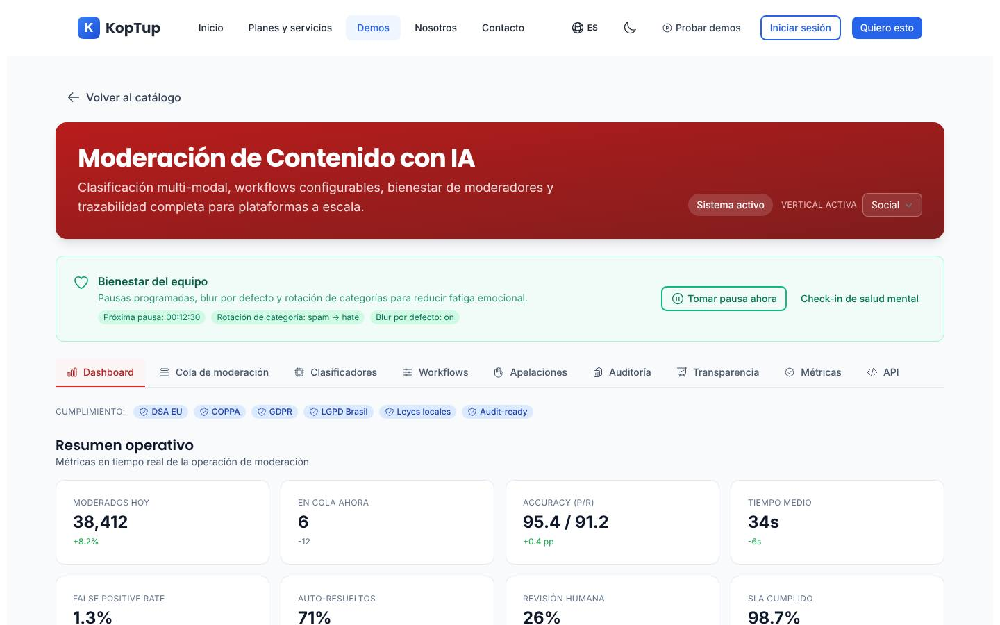
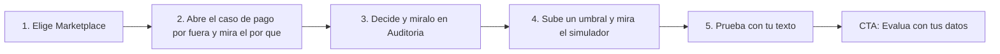

# Moderación de contenido con IA (offering `moderacion-contenido`)

> Seguridad (`security`) · Demo: `/demo/moderacion-contenido` · Modo de acceso recomendado: `publico` (la evaluación con datos del prospecto va por `solicitud`) · Prioridad: **P3** (la limpieza de afirmaciones no demostrables es **P1**) · Esfuerzo total: **XL** (Fases 1–2 ≈ 4 a 5 semanas de 1 dev senior)

*Captura actual de `/demo/moderacion-contenido`. Ver [Sistema de demos](04-Sistema-de-Demos.md), [Catálogo de productos](08-Catalogo-de-Productos.md) y [Roadmap](12-Roadmap.md).*

> **Contexto de posicionamiento:** con el reposicionamiento de Koptup en sistemas RAG (ver [Visión de producto](02-Vision-de-Producto.md)), este producto queda dentro de **"Otras soluciones a medida"**. Su puente con el producto principal son los **controles de seguridad del asistente RAG**: revisar las preguntas y las respuestas del asistente (insultos, datos personales, temas fuera de alcance) antes de mostrarlas. Esa pieza se construye primero, dentro del chatbot RAG, y es la base técnica de este producto.

---

## Resumen

**Problema:** las plataformas con contenido de usuarios (marketplaces, clasificados, medios con comentarios, apps de citas, comunidades de juegos y plataformas educativas) reciben estafas, ofertas de empleo falsas, insultos, contenido sexual, reseñas falsas e intentos de sacar la venta de la plataforma ("escríbeme por fuera"). Revisarlo todo a mano no escala; los filtros globales no entienden la jerga colombiana ni las estafas típicas de la región.

**Para quién (cliente ideal en Colombia/LATAM):**
- Marketplaces, portales de clasificados y de empleo (estafas, pagos por fuera, avisos prohibidos, reseñas falsas).
- Medios digitales con comentarios abiertos.
- Plataformas educativas, de juegos y comunidades con menores de edad.
- Billeteras digitales y fintech con chats entre usuarios o nombres y descripciones visibles.
- BPO y centros de contacto que operan moderación para terceros (Colombia es un centro regional de esta actividad) y necesitan herramienta, métricas y cuidado del equipo.
- Empresas que ya tienen o evalúan un asistente RAG y necesitan controles de seguridad sobre lo que entra y sale.

**Propuesta de valor:** "Moderación con IA que entiende el español de Colombia y LATAM: clasifica texto e imágenes según tus políticas, resuelve sola lo evidente y envía a tu equipo solo lo dudoso, con explicación, apelaciones y reportes."

**Diferenciación:** políticas y ejemplos locales (estafas de empleo, "préstamos gota a gota", pagos por fuera de la plataforma, jerga regional), reglas por umbral que el cliente controla, revisión humana con bienestar del moderador, instalación en la nube del cliente (modalidad compra) y soporte en español.

---

## Estado actual

| Aspecto | Estado | Evidencia |
|---|---|---|
| Demo | Existe y es la más coherente de las tres demos de su grupo. Encabezado con selector de vertical (Social, Gaming, Dating, Kids, Finanzas), banner de bienestar del equipo, distintivos de cumplimiento y **9 pestañas**: Dashboard, Cola de moderación, Clasificadores, Workflows, Apelaciones, Auditoría, Transparencia, Métricas y API. Respeta el modo claro/oscuro del sitio | `apps/web/src/app/demo/moderacion-contenido/page.tsx` (343 líneas), `components/QueueTab.tsx` (269), `WorkflowsTab.tsx` (176), `ReportTabs.tsx` (429), `Atoms.tsx` (129), `mockData.ts` (448) |
| Real o maqueta | **Maqueta.** Todo sale de `mockData.ts` (`QUEUE_ITEMS`, `APPEALS`, `AUDIT`, `DEFAULT_RULES`, `CLASSIFIER_STATS`, `METRICS_BY_CATEGORY`). Funciona en la sesión: filtros por tipo y vertical, orden por prioridad, desenfoque con "mostrar", resolver casos de la cola, editor de reglas, filtros de auditoría y copiar el ejemplo de API. No hay `fetch` ni llamadas a IA | `page.tsx`, `QueueTab.tsx`, `WorkflowsTab.tsx` |
| Backend | Módulo en memoria `apps/backend/src/modules/moderation/` (ítems y decisiones; ~170 líneas) **no montado** en el servidor. El puntaje de IA de un ítem nuevo es `Math.random()` | `moderation.service.ts` |
| i18n ES/EN | Textos en `apps/web/messages/demos/moderacion-contenido.{es,en}.json` (~7,5 KB). Los textos de ejemplo de `mockData.ts` están solo en español y fijos en el código; quedan valores sin traducir ("spam → hate", "on", tipos `TEXT/IMAGE`, reportante `system/user/partner`) | |
| Tests | Solo smoke test (`__tests__/page.test.tsx`, 11 líneas), que hoy no se ejecuta | |
| Tamaño | 1.827 líneas en total (`wc -l`) | |

### Problemas detectados (con ruta)

1. **Afirmaciones que no se pueden demostrar:** la pestaña Clasificadores presenta modelos propios ("koptup-text-mod v3.4.1", "koptup-vision-mod", "koptup-video-mod", "koptup-audio-mod") con precisión, cobertura, rendimiento y fecha de entrenamiento (`CLASSIFIER_STATS` en `mockData.ts`). Koptup no tiene esos modelos. Igual con las métricas de "Métricas" y "Transparencia".
2. **Distintivos de cumplimiento sin respaldo:** "DSA EU", "COPPA", "GDPR", "LGPD Brasil", "Leyes locales" y "Audit-ready" (`compliance` en `page.tsx` y JSON). No hay nada que los soporte y no mencionan las normas colombianas (Ley 1581 de 2012, Ley 1098 de 2006, Ley 679 de 2001).
3. **Caso de abuso sexual infantil en la cola de ejemplo:** el ítem `q-1047` dice que una imagen fue detectada por un detector de ese tipo de material y "reportada automáticamente" a una organización de EE. UU. (`QUEUE_ITEMS`). Es un tema que no debe aparecer como ejemplo en una demo pública y describe una integración que no existe.
4. **Aprobar, rechazar y escalar hacen lo mismo:** las tres acciones solo quitan el ítem de la cola (`resolveItem` en `page.tsx`); no piden motivo, no registran en Auditoría, no cambian métricas ni muestran confirmación. "Editar tag" no hace nada.
5. **Las reglas no afectan la cola:** el editor de `WorkflowsTab.tsx` cambia umbrales y acciones, pero la cola no cambia; la "vista previa de ítems afectados" es `reglas activas × 1240`. No se puede cambiar la categoría de una regla y toda regla nueva nace como "spam". "Guardar cambios" no hace nada.
6. **Ejemplos sin contenido:** la cola muestra descripciones ("Comentario con lenguaje discriminatorio…") en vez de ejemplos reales saneados; el comprador no ve qué detecta la IA ni por qué.
7. **API con dominio y SDK inexistentes:** el ejemplo usa `api.koptup.ai` (no es el dominio de Koptup) y paquetes `@koptup/sdk` y `koptup` que no existen (`codeSamples` en `Atoms.tsx`).
8. **Botones sin acción:** "Tomar pausa ahora" y "Check-in de salud mental" (banner de bienestar; "Próxima pausa: 00:12:30" es fijo), "Mantener decisión" y "Revertir decisión" en Apelaciones, "Exportar CSV" en Auditoría y "Descargar reporte completo" en Transparencia (`ReportTabs.tsx`).
9. **Verticales de otro mercado:** Social, Gaming, Dating, Kids, Finanzas, en inglés y sin marketplaces, clasificados, medios ni empleo, que son los compradores locales.
10. **Jerga en inglés:** "Accuracy (P/R)", "False positive rate", "Shadow ban", "Workflows", "score", "Audit-ready"; números con coma de miles ("38,412", "81,780").
11. **Textos del catálogo** (`messages/offerings/moderacion-contenido.es.json`): descripción de plantilla, voseo ("Filtrá", "Comprala", "pagá… por vos"), la viñeta **"Reportes mensuales del tier" duplicada** en Avanzado y **triplicada** en Enterprise; Enterprise promete "Cumplimiento DSA (UE) + COPPA". La tarjeta del catálogo de demos promete "Custom models por vertical" y "compliance DSA" (`_catalog.es.json`, clave `demosExtra.moderation`).

**Lo que sí funciona y se conserva:** la cola con prioridad, confianza y desenfoque por defecto; el panel de detalle (usuario, canal, antigüedad, faltas previas); el editor de reglas "Si categoría > umbral, entonces acción"; las apelaciones con tiempo de respuesta restante; la bitácora con filtros; el **banner de bienestar del moderador** (diferenciador real para BPO) y el diseño claro/oscuro.

---

## Qué falta para que sea vendible

- **Quitar lo que no es cierto:** modelos propios, métricas presentadas como reales, distintivos de cumplimiento, integración de reporte inexistente, dominio y SDK de la API.
- **Ejemplos locales y saneados** que muestren el valor: pagos por fuera, estafas de empleo, préstamos ilegales, reseñas falsas, insultos con jerga regional, contacto de un adulto con un menor (sin contenido explícito).
- **Explicación de cada decisión:** fragmento resaltado + política que aplica + confianza.
- **Que las reglas muevan la cola:** el comprador quiere ver qué pasa si sube el umbral.
- **Una prueba real y barata:** "Prueba con tu texto" (un comentario) en la demo pública y "Evalúa con tus datos" (lote anonimizado) por solicitud, con informe de precisión.
- **Precio entendible:** "ítems moderados al mes" está bien, pero falta decir cuántos moderadores incluye la consola y qué tipos de contenido (texto, imagen, audio, video) entran en cada plan.

---

## Plan detallado

### Landing `/productos/moderacion-contenido`

1. **Hero:** "Protege tu comunidad y tu marca con moderación que entiende el español de Colombia y LATAM". Subtítulo: "La IA resuelve lo evidente, tu equipo decide lo dudoso y tú controlas las reglas". CTA **Solicitar demo**, secundarios **Probar la demo** y **Agendar llamada**.
2. **"Prueba con tu texto"** en la misma landing: el visitante pega un comentario (hasta 500 caracteres) y ve categoría, confianza, fragmento resaltado y acción sugerida.
3. **Video de 60–90 s:** llega un aviso con "págame por fuera" → la IA oculta el teléfono y advierte al vendedor → un comentario dudoso va a la cola → el moderador decide con la explicación a la vista → el informe mensual muestra el tiempo ahorrado.
4. **Casos por tipo de plataforma** (tarjetas): marketplaces y clasificados, medios digitales, plataformas con menores, fintech y billeteras, BPO de moderación, controles del asistente RAG.
5. **IA + humanos:** umbrales, cola con prioridad, apelaciones, bitácora y cuidado del equipo (pausas, desenfoque por defecto, rotación de categorías).
6. **Datos y cumplimiento:** dónde se procesa el contenido, retención, Ley 1581 (datos personales), protocolo de protección de menores con escalamiento a las autoridades y a la línea de reporte Te Protejo, apoyo para documentar las políticas de la plataforma. Redactado como "te ayudamos a cumplir", nunca como certificación.
7. **Planes y precios** (compra; SaaS "lista de espera") y **FAQ:** ¿qué tan precisa es? (se mide con tus datos antes de comprometer cifras) · ¿puedo usar mis propias políticas? · ¿qué pasa con las imágenes? · ¿dónde quedan los datos? · ¿reemplaza a mi equipo? (no; reduce el volumen que revisa) · ¿cuánto cuesta la IA por ítem?
8. **Bloque cruzado:** [Chatbot RAG con IA](Producto-chatbot-rag-ia.md) ("controles de seguridad para tu asistente"), [Helpdesk con IA](Producto-helpdesk-ia.md) y [E-commerce](Producto-ecommerce.md) (reseñas y vendedores).

### Demo interactiva (mejoras por pantalla/módulo)

| Pantalla / componente | Hoy | Cambiar a |
|---|---|---|
| Encabezado (`page.tsx`) | Título genérico, "Sistema activo" fijo, selector de 5 verticales en inglés | Logo y nombre de la plataforma ficticia (o del prospecto), selector **"Tipo de plataforma"**: Marketplace y clasificados (por defecto), Medio digital, Plataforma educativa (menores), Fintech, Empleo. Banner "Solicita tu demo guiada" |
| Distintivos de cumplimiento | 6 distintivos sin respaldo | Una línea: "Diseñado para apoyar el cumplimiento de la Ley 1581 (datos personales) y de las normas de protección de menores" con enlace a la landing. Nada de "audit-ready" ni normas extranjeras salvo en Enterprise y con alcance explicado |
| Banner de bienestar | Botones sin acción, contador fijo | Contador real de la sesión; "Tomar pausa" oculta la cola 60 s con una pantalla de pausa; "Check-in" abre 3 preguntas y guarda la respuesta en la sesión. Mensaje: "Pensado para equipos y BPO de moderación" |
| Dashboard | KPIs fijos, números con coma | KPIs calculados a partir del conjunto de ejemplo (en cola, resueltos por IA, enviados a humanos, tiempo medio, apelaciones abiertas), con etiqueta **"Datos de ejemplo"** y formato es-CO |
| Cola de moderación (`QueueTab.tsx`) | 8 descripciones; aprobar/rechazar/escalar iguales; incluye el caso `q-1047` | 10 a 12 **ejemplos saneados en español** por tipo de plataforma (abajo). Cada caso muestra **"Por qué"**: fragmento resaltado, política y confianza. **Rechazar** pide motivo (lista de políticas) y acción (ocultar, advertir, suspender); **Escalar** pide a quién; cada decisión va a Auditoría, actualiza los KPIs y muestra confirmación. Imágenes: marcadores ilustrativos siempre desenfocados. Eliminar `q-1047` |
| Clasificadores (`ClassifiersTab`) | Modelos "koptup-*" con métricas inventadas | **"Cómo clasificamos"**: proveedores configurables (modelo de moderación de texto, LLM con tus políticas en español, servicio de análisis de imágenes), lista de categorías y políticas, y la frase "La precisión se mide con tus datos en la evaluación". Sin cifras de precisión fijas |
| Workflows (`WorkflowsTab.tsx`) | Reglas que no afectan la cola; vista previa = reglas × 1240 | **"Reglas"** en español ("Si *Estafa* tiene confianza mayor a 0,85, entonces *rechazar y avisar*"), con selector de categoría. **Simulador:** sobre 200 casos de ejemplo con puntaje, muestra cuántos se resuelven solos, cuántos van a revisión humana y cuántos falsos positivos habría; al cambiar un umbral la cola se reordena |
| Apelaciones | "Mantener decisión" y "Revertir decisión" sin acción | Ambos cambian el estado, registran en Auditoría y, si se revierte, el ítem vuelve como aprobado |
| Auditoría | Filtros funcionan; "Exportar" no | "Exportar CSV" descarga la bitácora de la sesión |
| Transparencia y Métricas | Cifras fijas, "Descargar reporte completo" sin acción | Una sola pestaña **"Informes"**: informe mensual de ejemplo (decisiones por categoría, tiempos, apelaciones revertidas) descargable en PDF, rotulado como ejemplo |
| API (`ApiTab`) | `api.koptup.ai`, SDK inexistentes | **"Integración"**: endpoint de ejemplo de la instalación del cliente (`https://moderacion.tu-empresa.com/v1/moderate`), webhook de decisiones y la nota "SDK a medida desde el plan Profesional". Sin paquetes inexistentes |
| **Nueva: "Prueba con tu texto"** | No existe | Caja de texto (500 caracteres) que llama a un endpoint real de clasificación con límites; muestra categoría, confianza, fragmento y acción sugerida según las reglas activas |

**Datos de ejemplo** (marketplace ficticio "Mercado Vecino" y medio ficticio "Diario La Ceiba"; verificar que los nombres no correspondan a plataformas existentes). Los textos son saneados: los insultos y datos de contacto se muestran enmascarados.

| Tipo de plataforma | Ejemplo (saneado) | Categoría | Acción sugerida |
|---|---|---|---|
| Marketplace | "Escríbeme al 3XX XXX XXXX y te lo dejo más barato, pagas por fuera" | Contacto o pago por fuera de la plataforma | Ocultar el teléfono y advertir al vendedor |
| Empleo | "Gana $ 3.000.000 semanales desde casa, solo envía $ 50.000 para el kit" | Estafa laboral | Rechazo automático y revisión de la cuenta |
| Clasificados | "Préstamos sin papeleo, cobro diario, sin centrales de riesgo" | Préstamo ilegal ("gota a gota") | Rechazo y escalamiento a cumplimiento |
| Marketplace | 5 reseñas de 5 estrellas iguales desde cuentas creadas hoy | Reseña falsa | Revisión humana |
| Medio digital | Comentario con un insulto regional enmascarado contra otro lector | Acoso | Revisión humana (depende del contexto) |
| Medio digital | Comentario que ataca a un grupo por su origen | Discurso de odio | Rechazo automático |
| Plataforma educativa | Un adulto le pide a un estudiante pasar a un chat privado | Protección de menores | Escalamiento inmediato al equipo de seguridad (sin contenido explícito) |
| Cualquiera | Foto de perfil con desnudez parcial (marcador desenfocado) | Contenido sexual | Rechazo automático |
| Cualquiera | Mensaje que expresa ideas de hacerse daño | Autolesión | Revisión prioritaria y mensaje con líneas de ayuda configurables |
| Fintech | Nombre de usuario que suplanta a la "Mesa de ayuda oficial" | Suplantación | Bloqueo del nombre y revisión |

**Recorrido guiado (5 pasos):**

1. Elegir "Marketplace y clasificados" (preseleccionado).
2. Abrir el caso "pago por fuera": ver el fragmento resaltado, la política y la confianza.
3. Aplicar "Ocultar teléfono y advertir" y verlo en Auditoría con el motivo.
4. En Reglas, subir el umbral de "Estafa" de 0,85 a 0,95 y ver en el simulador cuántos casos más irían a revisión humana.
5. Pegar un comentario propio en "Prueba con tu texto". Cierre: "¿Quieres medir la precisión con tus datos? Evalúa con tus datos" (abre "Solicitar demo") o "Agendar llamada".

Eventos de uso (`DemoEvent`): `module_view` por pestaña y tipo de plataforma; `key_action` = `open_case`, `decide_case`, `change_threshold`, `try_text`, `export_audit`; `cta_click`.

### Acceso y solicitud de demo

- **Modo recomendado: `publico`.** La maqueta saneada no tiene costo, el tema tiene búsquedas en la región ("moderación de contenido", "moderación de comentarios") y el comprador técnico quiere explorar solo. Se muestra el banner "Solicita tu demo guiada". Antes de publicar se hace la tarea 1 (quitar afirmaciones y el caso `q-1047`).
- **"Prueba con tu texto" en la demo pública:** con captcha Turnstile, límite por IP y por día, tope de gasto mensual común de las demos con IA y sin guardar el texto (solo la categoría y la fecha para métricas). Avisar: "No pegues datos personales".
- **Lo que pasa por `solicitud`:** la **evaluación con tus datos**. El prospecto sube un lote anonimizado (hasta 1.000 textos en CSV) con su etiqueta esperada; recibe un informe de precisión por categoría y la propuesta de reglas. Se borra a los 14 días.
- **Duración del acceso:** 14 días.
- **Antes de solicitar, el visitante ve:** la landing con el video de 60–90 s, 6 capturas (cola con explicación, decisión y auditoría, simulador de reglas, prueba con tu texto, informe mensual, bienestar del equipo) y la demo pública.
- **El prospecto aprobado ve:** la demo con su logo, su tipo de plataforma y sus políticas; la carga del lote y el informe de la evaluación; y los botones "Solicitar propuesta" y "Agendar llamada".

### Personalización por cliente

Desde **Admin › Solicitudes de demo › Aprobar** (`DemoGrant.customization`: `logoUrl`, `sector`, `datasetKey`, más estos campos):

| Campo | Efecto en la demo |
|---|---|
| Nombre y logo de la plataforma | Encabezado, nombres de canales ("comentarios de `<marca>`", "avisos") |
| Tipo de plataforma (marketplace, medio, educativa, fintech, empleo, BPO) | Elige el `datasetKey` con los ejemplos de la cola y las categorías activas |
| País y variante del español (Colombia, México, Perú, Chile, Argentina) | Ejemplos con la jerga de ese país |
| Políticas propias (hasta 8, texto corto) | Aparecen como motivos de rechazo y se usan en "Prueba con tu texto" del prospecto |
| Acciones disponibles (ocultar, advertir, suspender, escalar a legal) | Opciones del editor de reglas y de la cola |
| Lote de evaluación e informe | Se adjuntan en Mis demos |

En **Admin › Catálogo de demos** se administran el modo de acceso, el video, las capturas y el tope de uso de "Prueba con tu texto".

### Producto real

**MVP para la modalidad compra (Básico y Profesional):**

| Módulo | Alcance |
|---|---|
| API de moderación | Recibe texto (Básico) y texto + imagen (Profesional), responde categoría, confianza, fragmento y acción según reglas; modo en línea y por lotes; webhook de decisiones |
| Clasificación | Combinación de un modelo de moderación de texto, un LLM con las políticas del cliente en español y ejemplos locales, y un servicio de análisis de imágenes (por ejemplo, el de la nube que use el cliente). Listas propias de términos y patrones (teléfonos, enlaces, pagos por fuera) |
| Motor de reglas | Umbral por categoría, acciones (aprobar, ocultar, advertir, rechazar, escalar), reglas por canal |
| Consola de moderación | Cola con prioridad y explicación, decisiones con motivo, apelaciones con tiempo de respuesta, bitácora exportable, bienestar del equipo (pausas, desenfoque, rotación) |
| Informes | Decisiones por categoría, tiempos, revertidas en apelación, carga por moderador; informe mensual en PDF |
| Protección de menores | Protocolo de escalamiento y reporte a las autoridades y a Te Protejo; detección por coincidencia de huellas con proveedores especializados solo en Enterprise y bajo sus condiciones |
| Datos y seguridad | Retención configurable, cifrado, roles, autorización verificada en el servidor, límites de uso y de costo de IA por cliente; acuerdo de encargo de tratamiento de datos (Ley 1581) |
| Integraciones | Plataforma del cliente (API/webhook), Slack, Teams o correo para alertas, Zendesk o el [Helpdesk con IA](Producto-helpdesk-ia.md) para apelaciones |
| Base existente | `apps/backend/src/modules/moderation/` sirve solo como modelo de datos de partida (`ModerationItem`, `Decision`); el puntaje de IA debe construirse |

**SaaS:** sin base real, así que **"SaaS: lista de espera"** (DECISIÓN 7). Es un producto con forma natural de API (cobro por ítem), pero necesita el core multi-tenant y el cobro recurrente de la Fase 4 (Wompi/PayU en COP, Stripe en USD), medición de ítems por cliente, latencia garantizada, políticas de retención por cliente y acuerdo de encargo de tratamiento. **Ruta recomendada:** primero los **controles de seguridad del asistente RAG** como parte del SaaS del chatbot (Fase 4), y con esa base, una API de moderación por suscripción.

### Planes y precios

Precios actuales del catálogo (`apps/web/src/lib/services-catalog.ts`, entrada `moderacion-contenido`), en COP:

| Plan | Compra: setup único | Compra: mantenimiento mensual (opcional) | SaaS: setup | SaaS: cuota mensual | Volumen | Implementación |
|---|---|---|---|---|---|---|
| Básico | $46.000.000 | $4.200.000 | $2.900.000 | $1.590.000 | 25.000 ítems moderados/mes | 2–5 semanas |
| Profesional | $117.000.000 | $10.400.000 | $6.900.000 | $3.790.000 | 1 M ítems moderados/mes | 5–9 semanas |
| Avanzado | $273.000.000 | $23.400.000 | $12.900.000 | $7.090.000 | 25 M ítems moderados/mes | 9–14 semanas |
| Enterprise | $585.000.000 | $45.500.000 | A convenir ("Personalizado") | $12.890.000 | 250 M+ ítems moderados/mes | 12–20 semanas |

| Plan | Usuarios admin | Cuentas | Almacenamiento | Horas de evolutivos/mes | Soporte | Costos del cliente (USD/mes) |
|---|---|---|---|---|---|---|
| Básico | 3 | 1 | 10 GB | 5 | Correo, 24 h hábiles | 80–350 (hosting, moderación de texto e imagen) |
| Profesional | 20 | 5 | 80 GB | 12 | Correo + WhatsApp, 4 h | 500–2.000 (hosting, mezcla de LLM, imágenes, audio) |
| Avanzado | 60 | 25 | 400 GB | 25 | + Slack Connect, 2 h | 2.000–10.000 (moderación corporativa, flujo de Trust & Safety) |
| Enterprise | Ilimitados | Ilimitadas | Ilimitado | 50 | Tickets con SLA 1 h | 6.000–25.000 (multimodal, modelos propios, cumplimiento internacional) |

USD de referencia (TRM 3.300, "Otras soluciones a medida"): setup de compra ≈ USD 13.940 / 35.450 / 82.730 / 177.270; SaaS ≈ USD 480 / 1.150 / 2.150 / 3.910 al mes. Ciclos SaaS: semestral −10 %, anual −20 %.

**Qué incluye cada plan, en lenguaje de cliente:**
- **Básico:** "Moderación de textos con tus políticas, consola de revisión para 3 moderadores y API para conectar tu plataforma".
- **Profesional:** "Textos e imágenes, cola de revisión con prioridades, conexión con tu CMS o CRM y alertas a tu equipo".
- **Avanzado:** "Audio y video, reglas por canal, flujo completo de apelaciones y métricas por categoría".
- **Enterprise:** "Modelos ajustados con tus datos, operación con un BPO, cumplimiento de normas internacionales si operas fuera de Colombia y equipo asignado".

**Recomendaciones de claridad:**
1. **Decir qué tipos de contenido entra en cada plan** (texto / + imagen / + audio y video) en la primera línea de la tarjeta, y cuántos **moderadores** incluye la consola (los "usuarios admin" de hoy: 3 / 20 / 60 / ilimitados).
2. **Precio por ítem adicional** sobre el tope del plan (como el RAG: "pregunta adicional sobre el tope"), a definir por el dueño.
3. **Corregir la incoherencia compra vs. SaaS:** el mantenimiento de compra ($4.200.000 en Básico) es 2,6 veces la cuota SaaS ($1.590.000) y el primer año de compra con mantenimiento ($96.400.000) cuesta más de 4 veces el primer año SaaS ($21.980.000). Con el SaaS en lista de espera, el cliente solo ve la opción cara.
4. **Ofrecer la evaluación como entrada:** "Evaluación con tus datos" gratuita (1.000 textos) y un "Piloto de moderación" pagado de 2 a 4 semanas sobre un canal, descontable si contrata. Precio a definir por el dueño (referencia: Piloto RAG COP 3.900.000).
5. **Corregir `moderacion-contenido.{es,en}.json`:** propuesta de valor, sin voseo, sin viñetas repetidas, "Cumplimiento DSA (UE) + COPPA" solo en Enterprise y con la palabra "apoyo", traducir "Trust & Safety workflow", "BPO/outsourcing handoff", "Custom ML".
6. **Ajustar la tarjeta `demosExtra.moderation`** de `_catalog.{es,en}.json`: sin "Custom models por vertical" ni "compliance DSA" hasta que existan.

---

## Tareas

| # | Tarea | Fase | Prioridad | Esfuerzo | Criterio de aceptación |
|---|---|---|---|---|---|
| 1 | Limpieza de afirmaciones: quitar modelos "koptup-*" y sus métricas, distintivos de cumplimiento, el caso `q-1047`, el dominio y los SDK inexistentes de la API; rotular cifras como "Datos de ejemplo" | Fase 1 — Funnel y solicitud de demos | P1 | S | Una búsqueda en la carpeta de la demo y en `messages/` no encuentra "koptup-text-mod", "api.koptup.ai", "@koptup/sdk", "Audit-ready", "CSAM" ni "NCMEC" |
| 2 | Reescribir `moderacion-contenido.{es,en}.json` y la tarjeta `demosExtra.moderation` (propuesta de valor, sin voseo, sin viñetas repetidas, sin promesas fuera de plan) | Fase 1 — Funnel y solicitud de demos | P1 | S | Ninguna viñeta repetida; cada capacidad mencionada pertenece a un plan identificado |
| 3 | Registrar `DemoCatalogItem` `moderacion-contenido` con `accessMode: publico`, banner y SaaS como "lista de espera" | Fase 1 — Funnel y solicitud de demos | P2 | S | El banner abre el formulario con el producto preseleccionado; la tabla pública no muestra cuota SaaS |
| 4 | Landing `/productos/moderacion-contenido` con casos por tipo de plataforma, IA + humanos, datos y cumplimiento, planes y FAQ | Fase 1 — Funnel y solicitud de demos | P2 | M | La landing está en el sitemap y su CTA lleva al formulario con el producto |
| 5 | Nuevos datos de ejemplo saneados por tipo de plataforma (Marketplace, Medio, Educativa, Fintech, Empleo) y categorías locales (pago por fuera, estafa laboral, préstamo ilegal, reseña falsa, suplantación) en `mockData.ts` | Fase 2 — Demos vendibles | P1 | M | Cada tipo de plataforma muestra al menos 6 casos en español con fragmento resaltado y política; ningún insulto o dato de contacto sin enmascarar |
| 6 | Acciones diferenciadas en la cola (motivo, acción, escalamiento), registro en Auditoría, KPIs calculados y confirmación; apelaciones y exportación de la bitácora funcionales | Fase 2 — Demos vendibles | P1 | M | Rechazar un caso pide motivo, aparece en Auditoría con ese motivo y cambia los KPIs; "Exportar CSV" descarga la bitácora |
| 7 | Reglas con selector de categoría y simulador sobre 200 casos de ejemplo que reordena la cola | Fase 2 — Demos vendibles | P2 | M | Subir el umbral de "Estafa" a 0,95 cambia el número de casos en revisión humana y el orden de la cola |
| 8 | "Prueba con tu texto": endpoint de clasificación con captcha, límite por IP, tope de gasto mensual y sin guardar el texto | Fase 2 — Demos vendibles | P2 | M | Un comentario de prueba devuelve categoría, confianza y fragmento en menos de 3 s; superar el límite muestra "Solicita la evaluación con tus datos" |
| 9 | Unificar Transparencia y Métricas en "Informes" con PDF de ejemplo; "Integración" con endpoint de ejemplo de la instalación del cliente; bienestar funcional (pausa y check-in) | Fase 2 — Demos vendibles | P2 | S | El PDF se descarga rotulado como ejemplo; "Tomar pausa" oculta la cola 60 s |
| 10 | Recorrido guiado de 5 pasos y eventos `DemoEvent` (`open_case`, `decide_case`, `change_threshold`, `try_text`, `export_audit`, `cta_click`) | Fase 2 — Demos vendibles | P2 | S | Los eventos aparecen en el detalle del acceso en Admin |
| 11 | Personalización por `DemoGrant` (logo, tipo de plataforma, país, políticas propias, acciones) y carga del lote de evaluación con informe de precisión | Fase 2 — Demos vendibles | P3 | M | Un prospecto aprobado sube un CSV de 1.000 textos y recibe el informe por categoría en Mis demos; el lote se borra a los 14 días |
| 12 | Grabar el video de 60–90 s y 6 capturas | Fase 2 — Demos vendibles | P3 | S | Archivos publicados en la landing y en el `DemoCatalogItem` |
| 13 | Plantilla de propuesta (tipos de contenido, volumen, moderadores, políticas, retención) y oferta de "Piloto de moderación" | Fase 3 — Propuestas y conversión | P3 | S | El comercial genera la propuesta desde Admin en menos de 15 minutos |
| 14 | Controles de seguridad del asistente RAG (moderación de preguntas y respuestas) como módulo reutilizable | Fase 4 — Productos SaaS reales | P2 | M | El asistente RAG bloquea o reformula una pregunta con insultos o datos personales y registra el evento; el módulo se puede llamar por API |

---

## Métricas de éxito

| Métrica | Meta inicial |
|---|---|
| Afirmaciones no demostrables en la demo y el catálogo | 0 (al cerrar la Fase 1) |
| Visitantes de la demo pública que completan los 5 pasos | ≥ 35 % |
| Visitantes que usan "Prueba con tu texto" | ≥ 20 % |
| Visitantes que solicitan la evaluación con sus datos | ≥ 3 % |
| Evaluaciones entregadas en 5 días hábiles o menos | ≥ 90 % |
| Evaluaciones que pasan a propuesta o piloto | ≥ 25 % |
| Costo mensual de "Prueba con tu texto" | Dentro del tope de gasto de demos |

Páginas relacionadas: [Chatbot RAG con IA](Producto-chatbot-rag-ia.md), [Helpdesk con IA](Producto-helpdesk-ia.md), [E-commerce](Producto-ecommerce.md), [Seguridad y calidad](10-Seguridad-y-Calidad.md), [Landing de producto](Seccion-Landing-de-Producto.md), [Panel de administración](05-Panel-de-Administracion.md).
