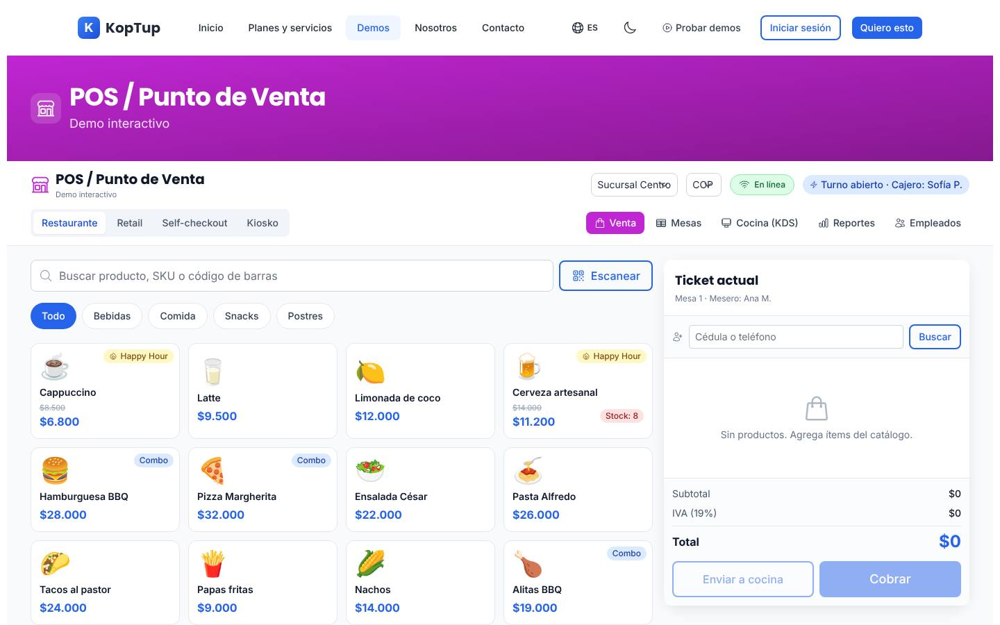
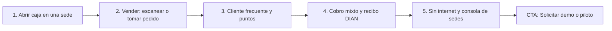

# POS retail

> Comercio (`commerce`) · Demo: `/demo/pos` · Modo de acceso recomendado: `publico` (versión personalizada por `solicitud`) · Prioridad: **P2** · Esfuerzo total: **L** (≈ 2–3 semanas de 1 dev senior para dejar landing + demo vendibles; el producto real se estima aparte)

*Captura actual de `/demo/pos` (modo Restaurante, pestaña Venta). Ver también [Sistema de demos](04-Sistema-de-Demos.md), [Catálogo de productos](08-Catalogo-de-Productos.md) y [Roadmap](12-Roadmap.md). Productos relacionados: [Facturación electrónica](Producto-facturacion-electronica.md), [ERP modular](Producto-erp-modular.md), [Loyalty / fidelización](Producto-loyalty-fidelizacion.md), [E-commerce](Producto-ecommerce.md), [App de delivery](Producto-app-delivery.md) y [WMS / logística](Producto-wms-logistica.md).*

---

## Resumen

**Problema:** las cadenas de tiendas y restaurantes con varias sedes manejan cada caja por separado: precios distintos por sucursal, inventario que no cuadra, cierres de caja en papel, promociones que no llegan a todas las sedes y ventas que se pierden cuando se cae el internet. El POS genérico de cuota mensual sirve para una tienda; deja de servir cuando la cadena necesita reglas propias o integrarse con su ERP y su tienda en línea.

**Para quién (cliente ideal en Colombia/LATAM):**
- Cadenas de retail de 3 a 50 sucursales (moda, calzado, tecnología, droguerías, ferreterías, minimercados).
- Restaurantes y cafés con varias sedes, cocina con pantalla (KDS) y domicilios.
- Franquicias que necesitan precios y promociones centralizados con reporte por franquiciado.
- Marcas con tienda en línea que necesitan un solo inventario entre tienda física y e-commerce.

**Propuesta de valor:** "Un POS que sigue vendiendo sin internet, con precios, promociones e inventario centralizados para todas tus sedes, documento electrónico DIAN en cada venta y conectado a tu tienda en línea y a tu ERP. El código es tuyo y se adapta a tu operación."

---

## Estado actual

| Aspecto | Estado | Evidencia |
|---|---|---|
| Demo | Existe. **Maqueta** 100 % en el navegador | `apps/web/src/app/demo/pos/page.tsx` es `'use client'`; no hay `fetch`, `axios` ni llamadas a `/api` en la carpeta |
| Pantallas | Barra con Sucursal, Moneda, En línea/Offline y turno · Modos Restaurante / Retail / Self-checkout / Kiosko · Pestañas Venta, Mesas, Cocina (KDS), Reportes, Empleados · Panel de hardware y caja · Modales: modificadores, cobro (pago dividido, propina, 5 medios), recibo térmico (envío por correo/WhatsApp/SMS), apertura/cierre de caja | `page.tsx`, `components/PosModals.tsx` (`ModifiersModal`, `CheckoutModal`, `ReceiptModal`), `components/PosTabs.tsx` (`TablesPanel`, `KdsPanel`, `ReportsPanel`, `EmployeesPanel`) |
| Datos | 16 productos de restaurante con precios en COP, 3 clientes de fidelización, 8 mesas, 3 órdenes de cocina, 4 empleados | `PRODUCTS`, `CUSTOMERS` en `page.tsx` |
| Backend | Módulo en memoria `apps/backend/src/modules/pos/` (órdenes, pagos, `charge`; 189 líneas con test) **no montado** en `apps/backend/src/index.ts`; el frontend no lo usa | `pos.service.ts`, `pos.types.ts`, `pos.routes.ts` |
| i18n ES/EN | `apps/web/messages/demos/pos.{es,en}.json` (249 líneas c/u, namespace `demoPos`). Productos y empleados fijos en español en `page.tsx` | |
| Tests | 1 smoke test (`__tests__/page.test.tsx`, 11 líneas) que hoy no se ejecuta | |
| Tamaño | 1.471 líneas (page **734** + `PosModals.tsx` 483 + `PosTabs.tsx` 254) | `wc -l` |
| SEO | Metadata `demo-pos` en `apps/web/src/lib/seo-config.ts` + breadcrumb JSON-LD en `layout.tsx` | |
| CTA | Solo el `DemoCTA` genérico del layout de `/demo` | `apps/web/src/components/demo/DemoCTA.tsx` |
| Catálogo | Offering `pos-retail` → demo `pos`: el mapeo es correcto, pero la demo abre en modo **Restaurante** con un menú de comida, mientras el offering se llama "POS retail" | `services-catalog.ts`, `page.tsx` (`useState<Mode>('restaurant')`) |

**Lo que hace bien:** es la demo de comercio más completa y la que mejor se siente como producto: agregar productos, modificadores con precio, happy hour, pago dividido con cambio, recibo térmico, enviar a cocina, KDS con estados y tiempos, mesas con estado, marcación de entrada/salida de empleados y búsqueda por nombre o código. El flujo venta → cobro → recibo funciona de principio a fin.

### Problemas detectados (con ruta)

1. **Retail que es restaurante:** los modos Retail, Self-checkout y Kiosko solo cambian el botón activo y ocultan la mesa; el catálogo, los impuestos y el flujo siguen siendo de restaurante (`page.tsx`). Un comerciante de retail no se ve reflejado.
2. **Impuesto equivocado para restaurantes:** `TAX_RATE = 0.19` (IVA 19 %) para todo. En Colombia los restaurantes suelen liquidar el impuesto nacional al consumo (INC 8 %), y en retail conviven tarifas de IVA 19 %, 5 % y bienes exentos o excluidos.
3. **Propina mal planteada:** 10 % preseleccionado en todos los modos (también retail) y calculado sobre el total con impuestos (`CheckoutModal`). En Colombia la propina es voluntaria y se debe preguntar al cliente (Ley 1935 de 2018).
4. **Selectores sin efecto:** Sucursal (la promesa central de "multi-sucursal"), Moneda (COP/USD/MXN sin conversión), el botón En línea/Offline (solo cambia el texto "Sincronización pendiente · 3 tickets") y "Escanear" no hacen nada.
5. **Recibo con documento incorrecto:** dice "DIAN · Factura electrónica aceptada" con un "CUFE" aleatorio (`ReceiptModal`). Una venta POS a consumidor final se soporta con el documento equivalente electrónico POS (identificado con CUDE), o con factura electrónica si el comprador la pide. La razón social, la dirección y el NIT del recibo están fijos en `receipt.*` y usan la marca "KopTup".
6. **Medios de pago poco locales:** "QR / PSE" (PSE es un pago en línea, no de mostrador) y "BNPL · 3 cuotas" (no está en ningún plan); faltan los nombres que el cliente reconoce (QR interoperable Bre-B, Nequi, Daviplata, datafono).
7. **Reportes y caja fijos:** el reporte X/Z (`ReportsPanel`) muestra ventas por $1.850.000 sin importar lo vendido en la sesión; "Imprimir X" y "Cerrar turno (Z)" no hacen nada; el efectivo esperado de caja es $720.000 fijo.
8. **Fidelización que falla en la primera prueba:** el campo "Cédula o teléfono" solo reconoce 3 códigos internos (`1010`, `2020`, `3030`) o 3 celulares, sin pista; el botón de canje dice "−10 %" para nivel Bronce pero aplica 5 %, y los puntos no se descuentan.
9. **Detalles de UI:** título duplicado (franja morada y barra superior dicen ambos "POS / Punto de Venta · Demo interactivo", visible en la captura); el texto de los selectores queda montado sobre la flecha ("Sucursal Centro", "COP"); montos con `toLocaleString()` sin locale.
10. **Promesas del hub sin respaldo** (`messages/_demos.es.json`): "Offline-first con CRDT sync y conflict resolution", "BNPL", "balanzas" y spanglish ("multi-payment", "split").
11. **Textos del catálogo:** voseo ("Comprala", "pagá"), descripción de plantilla, "Reportes mensuales del tier" repetido 2 veces en Avanzado y 3 en Enterprise; los costos mensuales del cliente mezclan "hardware POS (compra una vez)" con costos USD/mes, y el `costoNote` no da rango.

---

## Qué falta para que sea vendible

- Decidir el nombre y el alcance: recomendado **"POS para retail y restaurantes"** con dos presets que de verdad cambien catálogo, impuestos y flujo.
- Que la **multi-sucursal** se vea: cambiar de sede cambia inventario, precios y reportes, y existe una consola central.
- Que el modo sin internet funcione en la demo (es el argumento que más vende en Colombia).
- Recibo con el documento electrónico correcto y la marca del prospecto.
- Medios de pago y lenguaje locales; propina voluntaria solo en restaurante.
- Reportes y cierre de caja calculados con lo vendido en la sesión.
- Planes por número de sucursales, con el hardware separado y explicado.
- Prueba social: no hay casos. Proponer un **piloto en 1 sucursal** como paso previo a la propuesta de cadena.
- CTA contextual "Solicitar demo de POS", capturas y video de 60–90 s.

---

## Plan detallado

### Landing `/productos/pos-retail`

Sigue la estructura común de [Landing de producto](Seccion-Landing-de-Producto.md):

1. **Hero:** "El POS para cadenas que no pueden dejar de vender". Subtítulo: "Funciona sin internet, centraliza precios e inventario de todas tus sedes y emite el documento electrónico DIAN en cada venta." CTA principal **"Solicitar demo"**, secundario "Agendar llamada" y enlace "Probar el POS" (abre `/demo/pos`).
2. **Problemas que resuelve** (3 tarjetas): ventas perdidas cuando se cae el internet; precios y promociones distintos en cada sede; cierres de caja e inventario que no cuadran.
3. **Para tu tipo de negocio** (2 pestañas): Retail (código de barras, tallas y colores, devoluciones, inventario por sede) y Restaurantes (mesas, comandas a cocina, KDS, propina voluntaria, domicilios).
4. **Capturas** (galería de 6: Venta retail, Venta restaurante, Cobro, Recibo, KDS, Consola de sucursales) y **video de 60–90 s**.
5. **Hardware compatible** (sin vender hardware): tablet o PC, impresora térmica de 80 mm, lector de código de barras, cajón monedero, datafono del adquirente del cliente; aclarar que el hardware se compra aparte.
6. **Integraciones:** facturación electrónica DIAN (vía [Facturación electrónica](Producto-facturacion-electronica.md)), datafono integrado, QR Bre-B / Nequi / Daviplata (vía pasarela, p. ej. Wompi), Shopify / WooCommerce, [ERP modular](Producto-erp-modular.md) o Siigo/Alegra, WhatsApp Business (recibo), [Loyalty](Producto-loyalty-fidelizacion.md) y [App de delivery](Producto-app-delivery.md).
7. **Planes y precios:** "Compra / a medida" en COP por número de sucursales; SaaS como **"Lista de espera"** (DECISIÓN 7).
8. **Preguntas frecuentes:** ¿Qué pasa si se cae el internet? · ¿Qué documento DIAN se entrega al cliente? · ¿Funciona con mi datafono? · ¿Qué hardware necesito y cuánto cuesta? · ¿Se conecta con mi tienda en línea? · ¿Cuánto tarda abrir una nueva sede? · ¿El código es mío?
9. **CTA final** con el formulario "Solicitar demo" con `pos-retail` preseleccionado y campos opcionales: tipo de negocio, número de sedes, cajas por sede.

### Demo interactiva (mejoras por pantalla/módulo)

| Pantalla / componente | Agregar | Quitar / corregir | Datos de ejemplo |
|---|---|---|---|
| Encabezado y barra (`page.tsx`) | Un solo encabezado con nombre y logo del negocio; botón "Iniciar recorrido"; aviso "Datos de ejemplo" | Franja morada duplicada; texto de selectores montado sobre la flecha | — |
| Modos (`Mode`) | **Retail** y **Restaurante** como presets completos (catálogo, impuestos, pestañas visibles, propina); Retail por defecto porque el offering es "POS retail" | Self-checkout y Kiosko (retirar o mostrar como "Disponible en Enterprise" sin pantalla falsa) | Ver presets abajo |
| Sucursal | Cambiar de sede cambia stock, lista de precios y reportes; nueva pestaña **Consola central** (ventas de hoy por sede, top productos, alertas de stock, traslado entre sedes, promoción que se publica a todas) | Selector sin efecto | Sedes: Bogotá Chapinero, Bogotá Unicentro, Medellín El Poblado, Cali Chipichape |
| Moneda | Solo COP con formato `es-CO` en todo el demo (USD como opción del plan Enterprise multi-país) | COP/USD/MXN sin conversión | — |
| En línea / Sin internet | Al pasar a "Sin internet" las ventas siguen y quedan en una cola con contador; al volver, animación "Sincronizando 3 ventas" y los documentos pasan a "Transmitido" | Texto fijo "3 tickets" | — |
| Catálogo y búsqueda | En retail: "Escanear" abre un campo que acepta un código de barras de ejemplo y Enter agrega el producto; variantes talla/color; tarifa de impuesto por producto | Botón "Escanear" sin acción | Retail (tienda de moda): camiseta básica $39.900, jean slim $119.900, chaqueta impermeable $189.900, medias x3 $24.900, gorra $45.900, con tallas S–XL. Restaurante: bandeja paisa $38.000, ajiaco $32.000, arepa de huevo $9.000, empanadas x3 $10.500, jugo de lulo $8.000, tinto $3.500, cerveza nacional $9.000 |
| Ticket | Impuestos correctos por preset: IVA por producto en retail; INC 8 % en restaurante (validar con contador); devolución con nota crédito en retail | `TAX_RATE` 19 % fijo para todo | — |
| Fidelización | Pista "Prueba con 300 123 4567"; búsqueda por cédula o celular reales del dataset; canje que coincide con lo que dice el botón y descuenta puntos; enlace a [Loyalty](Producto-loyalty-fidelizacion.md) | Códigos internos `1010/2020/3030`; etiqueta −10 % que aplica 5 % | 5 clientes frecuentes con niveles Bronce / Plata / Oro |
| Cobro (`CheckoutModal`) | Medios: Efectivo, Tarjeta (datafono integrado), QR (Bre-B / Nequi / Daviplata), Bono o tarjeta regalo, Crédito de la casa; propina **solo en restaurante**, con pregunta explícita, opción 0 % y cálculo sobre el subtotal antes de impuestos (validar con contador) | "QR / PSE"; "BNPL · 3 cuotas"; propina preseleccionada en retail | Pago mixto: $50.000 en efectivo + saldo por QR |
| Recibo (`ReceiptModal`) | "Documento equivalente electrónico POS" con CUDE de ejemplo y QR real para consumidor final (`222222222222`), o "Factura electrónica" si se ingresa NIT; prefijo y resolución de ejemplo; razón social, dirección y NIT del negocio desde la personalización; envío por WhatsApp/correo (simulado) | "Factura electrónica aceptada" para toda venta; "CUFE" aleatorio; marca "KopTup" | — |
| Mesas y KDS (`TablesPanel`, `KdsPanel`) | Solo en preset Restaurante; al cobrar la mesa se libera y la orden sale del KDS; tiempos por estación (cocina, bar) | — | 10 mesas, 2 estaciones |
| Reportes (`ReportsPanel`) | Reporte X y Z calculados con las ventas de la sesión, por medio de pago y por sede; "Imprimir X" abre la vista térmica; "Cerrar turno (Z)" pide el arqueo | $1.850.000 y demás valores fijos | — |
| Caja | Apertura con base, arqueo por denominación, diferencia calculada contra lo vendido en efectivo | "Esperado $720.000" fijo | Base $200.000 |
| Empleados (`EmployeesPanel`) | Comisiones calculadas desde las ventas de cada cajero o mesero | Comisiones fijas | — |
| Global | Badges "Incluido desde plan X"; banner "Solicita tu demo guiada" (modo `publico`); CTA final contextual; dividir `page.tsx` (734 líneas) en `Catalog`, `Ticket`, `TopBar`, `useTicket` | `DemoCTA` genérico | — |

**Recorrido guiado (5 pasos, menos de 3 minutos):**

1. **Abrir caja:** elegir "Bogotá Chapinero" y abrir el turno con base de $200.000.
2. **Vender:** en Retail, escanear 3 productos y elegir talla; en Restaurante, tomar el pedido de la mesa 4 con modificadores y enviarlo a cocina (KDS).
3. **Cliente frecuente:** buscar por celular, ver nivel Oro y canjear puntos.
4. **Cobrar:** pago mixto efectivo + QR, ver el cambio y el documento equivalente electrónico POS con su QR; enviarlo por WhatsApp (simulado).
5. **Sin internet y consola:** cortar la conexión, vender un ticket más, reconectar y ver la sincronización; abrir la Consola central con ventas por sede y cerrar el turno con reporte Z. Cierre con CTA "Solicitar demo guiada" / "Solicitar piloto en 1 sede".

### Acceso y solicitud de demo

- **Modo recomendado: `publico`.** La demo es visual, se entiende en segundos, corre completa en el navegador (sin costos de IA ni datos reales) y la decide el dueño del negocio. Sirve como imán de leads para búsquedas como "POS para restaurantes" o "software POS multi-sucursal" (ya en `seo-config.ts`). Banner "Solicita tu demo guiada" (DECISIÓN 1).
- **Qué ve el visitante sin solicitar:** la landing con capturas y video, y la demo completa con los presets Retail y Restaurante y el tour.
- **Qué obtiene al solicitar:** sesión guiada de 30–45 min y una **versión personalizada** por 14 días (`DemoGrant`) con su logo, su catálogo (carga de CSV), sus sedes y sus medios de pago, pensada para mostrarla en una tablet en la tienda.
- **Prospecto aprobado** (Portal › Mis demos, ver [Portal del cliente](06-Portal-del-Cliente.md)): tarjeta "POS — <Negocio>", días restantes, "Abrir demo" (con aviso "Ábrelo en una tablet para la experiencia real"), "Agendar llamada", "Solicitar piloto en 1 sede" y "Solicitar propuesta".
- **Eventos `DemoEvent`:** preset elegido, ventas completadas, uso del modo sin internet, consola central abierta, pasos del tour, dispositivo (tablet/PC/móvil), clic en CTA.

### Personalización por cliente

Sin código, desde **Admin › Solicitudes de demo › Aprobar** (o Admin › Demos › Personalizar), guardado en `DemoGrant.personalizacion`. Ver [Panel de administración](05-Panel-de-Administracion.md).

| Campo | Efecto en la demo |
|---|---|
| Logo, color y nombre del negocio | Encabezado y recibo |
| Razón social, NIT y dirección para el recibo | Recibo térmico y documento POS de ejemplo |
| Tipo de negocio (preset) | Restaurante o café, Tienda de moda, Minimercado, Panadería, Ferretería, Droguería |
| Sedes (hasta 5, nombre y ciudad) | Selector de sucursal, consola central y reportes |
| Catálogo propio (CSV de hasta 40 productos: nombre, precio, categoría, tarifa de impuesto, código de barras opcional) | Reemplaza el catálogo del preset |
| Medios de pago visibles | Botones del modal de cobro |
| Programa de puntos (sí/no, niveles) | Panel de fidelización |

**Implementación:** mover `PRODUCTS`, `CUSTOMERS`, mesas y empleados de `page.tsx` a `apps/web/src/app/demo/pos/fixtures/<preset>.ts`; la página lee la configuración de `GET /api/demo-access/pos` (DECISIÓN 3) y en modo público usa el preset Retail. El CSV se valida en el admin (columnas, máximo 40 filas, precios numéricos) antes de guardarse.

### Producto real

**Alcance MVP — modalidad compra (Profesional, hasta 10 sedes, 8–12 semanas):**
- **POS web instalable (PWA)** para tablet o PC, **funcionamiento sin internet** (base local en el dispositivo y cola de sincronización) y reconexión segura.
- Catálogo con variantes, códigos de barras, listas de precios por sede, promociones y combos centralizados.
- Caja: apertura, arqueo, reportes X/Z, devoluciones con nota crédito, anulación de ítems con autorización de supervisor.
- **Documento electrónico en cada venta** (documento equivalente POS o factura electrónica) vía [Facturación electrónica](Producto-facturacion-electronica.md) y el proveedor tecnológico aliado, con modo contingencia cuando no hay conexión.
- Inventario por sede, traslados y alertas; clientes y puntos (básico, o [Loyalty](Producto-loyalty-fidelizacion.md) completo).
- **Paquete restaurante:** mesas, modificadores, comandas por estación, KDS, INC, propina voluntaria y domicilios ([App de delivery](Producto-app-delivery.md)).
- Consola central: ventas por sede y cajero, márgenes, productos top, auditoría.
- **Hardware:** impresora térmica (ESC/POS mediante un servicio local), lector de código de barras (modo teclado), cajón monedero por impresora, balanza en Avanzado.
- **Integraciones típicas en Colombia:** datafono integrado con el adquirente o agregador del cliente, QR Bre-B / Nequi / Daviplata vía pasarela (p. ej. Wompi), Shopify / WooCommerce (inventario unificado), [ERP modular](Producto-erp-modular.md) o Siigo/Alegra (contabilidad), WhatsApp Business (recibo), [WMS](Producto-wms-logistica.md) en Avanzado.
- **Transversal:** roles (cajero, supervisor, administrador de sede, gerente) con autorización en servidor, auditoría de anulaciones y descuentos, copias de seguridad.
- **Base técnica:** reutilizar tipos de `apps/backend/src/modules/pos/` (PosOrder, Payment, `charge`) migrados a Mongoose con `tenantId`, sede y terminal.

**SaaS (DECISIÓN 7):** el mercado de POS en Colombia se compra mayoritariamente por suscripción, pero hoy no hay base multi-tenant ni cobro recurrente → **"SaaS: lista de espera"**. Para habilitarlo (Fase 4): core multi-tenant, registro y bloqueo remoto de terminales, sincronización sin internet con resolución de conflictos probada, cobro por sede/terminal con Wompi/PayU (COP) y Stripe (USD), aprovisionamiento automático de sedes y soporte de hardware.

### Planes y precios

Precios actuales del catálogo (`apps/web/src/lib/services-catalog.ts`, entrada `pos-retail`; COP):

| Plan | Compra: setup | Compra: mantenimiento/mes | SaaS: setup | SaaS: mes | Volumen incluido | Usuarios / sucursales | Implementación (catálogo) | Costos del cliente al proveedor (USD/mes) |
|---|---|---|---|---|---|---|---|---|
| Básico | $46.000.000 | $4.200.000 | $2.900.000 | $1.590.000 | 1.000 ventas/mes | 3 / 1 | 2–5 semanas | 50–250 (hosting, DB, DIAN; + hardware una vez) |
| Profesional | $117.000.000 | $10.400.000 | $6.900.000 | $3.790.000 | 25.000 ventas/mes | 20 / 10 | 5–9 semanas | 300–1.200 (+ DIAN Pro, datafono) |
| Avanzado | $273.000.000 | $23.400.000 | $12.900.000 | $7.090.000 | 250.000 ventas/mes | 60 / 50 | 9–14 semanas | 1.500–5.000 (+ multi-país, precios centrales) |
| Enterprise | $585.000.000 | $45.500.000 | $0 (se muestra "Personalizado") | $12.890.000 | 2,5 M+ ventas/mes | Ilimitados | 12–20 semanas | 5.000–18.000 (+ SAP Retail, self-checkout, IA) |

Almacenamiento: 5 GB / 80 GB / 400 GB / ilimitado. Horas de evolutivos incluidas por mes: 5 / 12 / 25 / 50. Soporte: correo 24 h hábiles / + WhatsApp 4 h / + Slack Connect 2 h / tickets con SLA 1 h. Ciclos SaaS: semestral −10 %, anual −20 %.

**Recomendaciones de claridad:**
1. **El plan Básico no tiene comprador:** $46 M + $4,2 M/mes para 1 sede y 1.000 ventas al mes (≈ 33 al día) compite contra POS en la nube de cuota baja. Propuesta: planes por número de sedes, **Cadena (hasta 10)**, **Cadena grande (hasta 50)**, **Enterprise**, y un **Piloto en 1 sede** cotizado como primera fase de la cadena (no como plan aparte).
2. **Mantenimiento incoherente:** 12 × $4,2 M = $50,4 M al año (110 % del setup) y 2,6 veces la cuota SaaS. Pasarlo a % anual del setup o bolsa de horas y decir qué incluye (actualizaciones DIAN, soporte en horario de tienda, hosting sí/no).
3. **Soporte en horario comercial:** un POS vende fines de semana y festivos; el soporte "Lun–Vie 8AM–5PM" del Básico no sirve. Definir soporte de emergencia para caídas de caja desde el plan de entrada.
4. **Hardware aparte y explicado:** sacar "hardware POS (compra una vez)" del costo mensual en USD y mostrar una lista de hardware compatible con rango de precio de una sola vez.
5. **Bullets en lenguaje de cliente.** Propuesta: **Cadena** "Hasta 10 sedes y 20 cajas · Funciona sin internet · Documento electrónico DIAN en cada venta · Datafono y QR integrados · Inventario por sede · Puntos para clientes frecuentes · Sincronización con tu tienda en línea". **Cadena grande** "+ Hasta 50 sedes · Precios y promociones centralizados · Conexión con WMS · Tableros gerenciales". **Enterprise** "+ Sedes ilimitadas · Multi-país · Self-checkout y kioscos · Prevención de pérdidas con IA · Gerente de proyecto dedicado".
6. Renombrar a "POS para retail y restaurantes" (o separar el paquete restaurante), corregir voseo, descripción de plantilla, bullets duplicados y dar rango en el `costoNote`.
7. **SaaS → "Lista de espera"** hasta la Fase 4.

Detalle de la política comercial común en [Catálogo de productos](08-Catalogo-de-Productos.md) y [Comercial, marketing y legal](11-Comercial-Marketing-y-Legal.md).

---

## Tareas

| # | Tarea | Fase | Prioridad | Esfuerzo | Criterio de aceptación |
|---|---|---|---|---|---|
| 1 | Reescribir textos del offering y del hub (`_demos.*.json`): nombre "POS para retail y restaurantes", tuteo, bullets sin duplicados, `costoNote` con rango, sin "CRDT", "BNPL" ni spanglish | Fase 1 — Funnel y solicitud de demos | P1 | S | `pos-retail.{es,en}.json` sin voseo ni bullets repetidos; el hub no promete funciones que la demo no muestre |
| 2 | Re-empaquetar planes por número de sedes, piloto en 1 sede, hardware fuera del costo mensual, soporte de emergencia y SaaS en lista de espera | Fase 1 — Funnel y solicitud de demos | P1 | S | Catálogo y landing muestran los planes aprobados por el dueño y la lista de hardware compatible |
| 3 | Landing `/productos/pos-retail` con las 9 secciones de este plan | Fase 1 — Funnel y solicitud de demos | P1 | M | Página publicada; "Solicitar demo" con `pos-retail` preseleccionado y campos de tipo de negocio y sedes |
| 4 | Registrar `DemoCatalogItem` `pos` (`publico`, 14 días para la versión personalizada), banner, CTA contextual y eventos `DemoEvent` | Fase 1 — Funnel y solicitud de demos | P1 | S | El admin cambia el modo sin desplegar; cada venta completada y cada clic en CTA registra un evento |
| 5 | Presets Retail y Restaurante completos (catálogo, impuestos IVA por producto / INC 8 %, pestañas visibles, propina solo en restaurante); Retail por defecto; retirar Self-checkout/Kiosko o marcarlos Enterprise | Fase 2 — Demos vendibles | P1 | L | En Retail no aparecen Mesas, KDS ni propina; en Restaurante el ticket muestra INC; la tarifa la valida un contador |
| 6 | Multi-sucursal visible: el selector de sede cambia stock, precios y reportes; pestaña Consola central con ventas por sede y traslados | Fase 2 — Demos vendibles | P1 | M | Cambiar de sede cambia al menos stock y reportes; la consola suma las ventas de la sesión por sede |
| 7 | Modo sin internet funcional (cola de ventas, contador, sincronización al reconectar) | Fase 2 — Demos vendibles | P1 | S | Con "Sin internet" se pueden completar ventas; al reconectar el contador vuelve a 0 y los documentos pasan a "Transmitido" |
| 8 | Recibo con documento equivalente electrónico POS (CUDE de ejemplo, QR real, consumidor final) o factura con NIT; datos del negocio desde la personalización | Fase 2 — Demos vendibles | P1 | S | El recibo no dice "Factura electrónica" en una venta a consumidor final; no aparece la marca "KopTup" |
| 9 | Medios de pago colombianos (efectivo, datafono, QR Bre-B/Nequi/Daviplata, bono, crédito de la casa), propina voluntaria con opción 0 % sobre el subtotal y fidelización usable (pista de cliente de prueba, canje coherente, descuento de puntos) | Fase 2 — Demos vendibles | P2 | S | No aparecen "QR / PSE" ni "BNPL"; la propina no se preselecciona; el canje aplica el % que muestra el botón |
| 10 | Reportes X/Z, caja y comisiones calculados con las ventas de la sesión; "Imprimir X" y "Cerrar turno (Z)" funcionales | Fase 2 — Demos vendibles | P2 | S | Tras 3 ventas, el reporte X suma exactamente esas 3 ventas por medio de pago |
| 11 | Personalización desde `DemoGrant` (logo, negocio, preset, sedes, catálogo CSV de hasta 40 productos, medios de pago) | Fase 2 — Demos vendibles | P2 | M | El prospecto ve su catálogo cargado por CSV y su marca en el recibo; un CSV con columnas inválidas se rechaza en el admin |
| 12 | UI: un solo encabezado, selectores sin texto montado, formato `es-CO`, división de `page.tsx` (734 líneas) y smoke test en CI | Fase 0 — Endurecimiento | P2 | S | `page.tsx` < 250 líneas; `__tests__/page.test.tsx` pasa en CI; captura sin título duplicado |
| 13 | Tour guiado de 5 pasos, badges "Incluido desde plan X", 6 capturas y video de 60–90 s grabado en tablet | Fase 2 — Demos vendibles | P1 | M | Tour completable en < 3 min en tablet; capturas en `docs/wiki/images/` y en la landing |
| 14 | Plantilla de propuesta "Piloto en 1 sede" en el `Quote` ampliado (alcance, hardware sugerido, cronograma, criterios para pasar a cadena) | Fase 3 — Propuestas y conversión | P2 | S | El comercial genera la propuesta de piloto en PDF desde el admin en < 15 min |
| 15 | Base real: PWA sin internet + módulo `pos` persistente con `tenantId`, sede y terminal, documento POS vía facturación electrónica e impresión térmica | Fase 4 — Productos SaaS reales | P3 | XL | Una sede piloto vende 1 día completo con un corte de internet simulado sin perder ventas; todos los documentos quedan transmitidos |

---

## Métricas de éxito

- Conversión landing → solicitud de demo ≥ 3 %.
- ≥ 60 % de los visitantes de la demo completan al menos 1 venta y ≥ 30 % prueban el modo sin internet (medido con `DemoEvent`).
- ≥ 50 % de las solicitudes vienen de negocios con 3 o más sedes (posicionamiento correcto).
- Aprobación en < 24 h hábiles; ≥ 25 % de las demos guiadas terminan en propuesta o piloto en ≤ 14 días.
- Primer piloto en 1 sede firmado en los 4 meses siguientes a la Fase 2.
- 0 errores de impuestos o de documento DIAN reportados en las sesiones guiadas.
