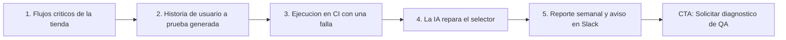

# QA automatizado con IA

> DevTools (`devTools`) · Demo: `/demo/chatbot` (**incorrecto**; propuesto: `/demo/qa-automatizado`) · Modo de acceso recomendado: `solicitud` · Prioridad: **P2** (corregir el mapeo es **P1**) · Esfuerzo total: **L**

*Esto es lo que ve hoy alguien interesado en QA automatizado al pulsar "Ver demo": el demo del chatbot RAG, que no tiene relación con pruebas de software. Ver [Sistema de demos](04-Sistema-de-Demos.md), [Catálogo de productos](08-Catalogo-de-Productos.md) y [Roadmap](12-Roadmap.md).*

---

## Resumen

**Problema:** los equipos de software en Colombia y LATAM (casas de software, fintech, e-commerce, áreas de TI de bancos y aseguradoras) despliegan con pruebas manuales o con suites E2E frágiles que nadie mantiene. Cada versión rompe algo en el checkout, el pago PSE o el registro, y se descubre en producción.

**Para quién:**
- Empresas de software y startups con 5–50 desarrolladores y sin equipo de QA dedicado.
- E-commerce y fintech con flujos críticos de pago (PSE, tarjeta, Nequi/Daviplata a través de pasarelas).
- Áreas de TI corporativas que tercerizan desarrollo y necesitan verificar cada entrega del proveedor.

**Propuesta de valor:** "Tus flujos críticos probados en cada despliegue. La IA escribe las pruebas a partir de tus historias de usuario en español, las repara cuando cambia la interfaz y te avisa en Slack o Teams antes de que el error llegue a producción." Se entrega como **suite E2E en tu repositorio** (compra) y, opcionalmente, **mantenida por Koptup** cada mes.

---

## Estado actual

| Aspecto | Estado | Evidencia |
|---|---|---|
| Demo | **No tiene demo propio.** `demoSlug: 'chatbot'` en la entrada `qa-automatizado-ia` del catálogo | `apps/web/src/lib/services-catalog.ts` (entrada 26) |
| Efecto en el sitio | El botón "Ver demo" de `OfferingsCatalog.tsx` lleva a `/demo/chatbot`, un asistente conversacional que no tiene nada que ver con pruebas | `apps/web/src/components/offerings/OfferingsCatalog.tsx` (enlace `/demo/${offering.demoSlug}`) |
| Real o maqueta | No existe ni maqueta | — |
| Backend | No existe módulo de QA en `apps/backend/src/modules/` ni rutas en `apps/backend/src/routes/` | `ls apps/backend/src/modules` |
| Código reutilizable | La pestaña **Tests** del demo de Code Review (`TestsTab` en `apps/web/src/app/demo/code-review-ia/components/tabs.tsx`) ya muestra pruebas unitarias, de integración y E2E con estados (aprobada, fallida, omitida); el componente `DiffSideBySide` sirve para mostrar la reparación de selectores | `tabs.tsx` |
| Textos del producto | `apps/web/messages/offerings/qa-automatizado-ia.es.json`: descripción de plantilla ("Implementación a medida o suscripción SaaS mensual del producto…"), viñetas en jerga ("Playwright runners", "Slack notify", "XRay enterprise"), la viñeta **"Reportes mensuales del tier" repetida dos veces** en Avanzado y en Enterprise, y voseo ("Generá", "Comprala", "pagá") | `qa-automatizado-ia.es.json` |
| i18n ES/EN | Solo los textos del catálogo (`.es` / `.en`) | — |
| Tests | No aplica (no hay demo) | — |
| Tamaño | 0 líneas de demo propio | — |

### Problemas detectados

1. **Mapeo de demo incorrecto** (`demoSlug: 'chatbot'`): es el error que más daña la confianza, porque el prospecto técnico concluye que el producto no existe.
2. **Descripción sin propuesta de valor:** no dice qué problema resuelve, para quién ni con qué resultado.
3. **Viñetas duplicadas y en jerga:** "Reportes mensuales del tier" aparece dos veces en Avanzado y en Enterprise.
4. **Se solapa con Code Review IA:** el demo de Code Review promete "generación automática de tests" (pestaña Tests). Falta separar los dos productos o venderlos juntos (ver [Code review con IA](Producto-code-review-ia.md)).
5. **El SaaS no tiene base real:** según la DECISIÓN 7 debe mostrarse como "SaaS: lista de espera".

---

## Qué falta para que sea vendible

- **Quitar ya el enlace al chatbot** (Fase 1) y mostrar "Demo guiada en vivo, bajo solicitud" con un video.
- **Una maqueta propia `/demo/qa-automatizado`** que cuente la historia en 5 pantallas, con una tienda colombiana ficticia como aplicación bajo prueba.
- **Mensaje claro:** resultado (menos errores en producción, despliegues más rápidos) en lugar de nombres de herramientas.
- **Oferta "suite gestionada":** en este producto el mantenimiento mensual es el valor principal (mantener las pruebas en verde), no un extra.
- **Ejemplos locales:** flujos de pago PSE y Wompi/PayU en modo sandbox, factura electrónica en el ambiente de habilitación, registro con cédula.
- **Paquete DevTools** con Code Review IA para no competir entre productos propios.
- Textos en español neutro (tú), sin duplicados.

---

## Plan detallado

### Landing `/productos/qa-automatizado-ia`

1. **Hero:** "Tus flujos críticos probados en cada despliegue". Subtítulo: "La IA escribe y mantiene pruebas E2E a partir de tus historias de usuario". CTA **Solicitar demo**, secundario **Agendar llamada**.
2. **Video de 60–90 s** (grabado sobre la maqueta): historia de usuario en español → prueba generada → ejecución en CI → falla en el checkout con captura y video → la IA propone reparar el selector → reporte semanal.
3. **Antes y después** con cifras de ejemplo, marcadas como ilustrativas hasta tener un caso real: "de 2 días de pruebas manuales por versión a 25 minutos automáticos".
4. **Cómo trabajamos (4 pasos):** diagnóstico de flujos críticos → suite inicial en tu repositorio → integración con tu CI → mantenimiento mensual.
5. **Qué probamos:** web (Chrome, Firefox, Safari), móvil web, APIs, pagos en sandbox, regresión visual.
6. **Integraciones:** GitHub Actions, GitLab CI, Bitbucket, Azure DevOps, Jira/Xray, Slack/Teams.
7. **Planes y precios** (compra; SaaS en lista de espera) y FAQ: ¿necesito un equipo de QA?, ¿en qué lenguaje quedan las pruebas? (Playwright + TypeScript), ¿quién mantiene las pruebas?, ¿se prueba contra producción? (no: staging/sandbox).
8. **Bloque cruzado:** "Combínalo con Code review con IA" (paquete DevTools).

### Demo interactiva

**Corto plazo (Fase 1):** en `services-catalog.ts`, cambiar `demoSlug: 'chatbot'` por `demoSlug: ''` en `qa-automatizado-ia`. `OfferingsCatalog.tsx` ya oculta "Ver demo" cuando `demoSlug` está vacío. La landing ofrece **"Demo guiada en vivo"**: sesión de 30 minutos donde un ingeniero de Koptup genera y ejecuta pruebas contra la tienda de ejemplo o contra el entorno de pruebas del prospecto.

**Fase 2: maqueta nueva `apps/web/src/app/demo/qa-automatizado/`** (con `messages/demos/qa-automatizado.{es,en}.json`, componentes por pantalla y no un único client component gigante):

| Pantalla | Contenido | Datos de ejemplo |
|---|---|---|
| 1. **Proyecto y flujos críticos** | Aplicación bajo prueba, entornos (staging), mapa de 8 flujos críticos con cobertura | Tienda ficticia "Café Cumbre": registro con cédula, inicio de sesión, búsqueda, carrito, pago PSE (sandbox), pago con tarjeta vía Wompi (sandbox), descarga de factura electrónica, devolución |
| 2. **Generar pruebas con IA** | Caja de texto con una historia de usuario en español → escenario en lenguaje natural (Dado/Cuando/Entonces) → código Playwright generado | "Como comprador quiero pagar con PSE y recibir mi factura por correo". Resultados pregenerados (fixtures); con acceso aprobado, generación real con cupo |
| 3. **Ejecuciones** | Lista de corridas por commit/rama (simula GitHub Actions): aprobadas, fallidas, inestables; detalle con pasos, captura, video y traza | 3 corridas: una en verde, una fallida en "Pagar con PSE" (el botón cambió de texto), una con prueba inestable |
| 4. **Auto-reparación** | Diff del selector roto y la propuesta de la IA (reusar `DiffSideBySide` de Code Review), con botones "Aceptar" y "Abrir PR" | `getByText('Pagar')` → `getByRole('button', { name: 'Pagar con PSE' })` |
| 5. **Regresión visual** | Antes/después con zonas resaltadas y umbral de diferencia | Banner de la home desplazado 40 px en móvil |
| 6. **Reportes** | Tendencia de éxito, flujos cubiertos, pruebas inestables, tiempo ahorrado, notificación de ejemplo en Slack/Teams, exportar PDF | Semana con 42 corridas, 96 % de éxito, 2 pruebas inestables |

Reglas: todo botón visible hace algo (o se oculta); los datos se marcan como "ejemplo"; el texto queda en español neutro.

**Recorrido guiado (5 pasos):**

> [Ver diagrama como imagen](images/diagramas/Producto-qa-automatizado-ia-1.png)

1. Ver los 8 flujos críticos y cuáles están cubiertos.
2. Escribir o elegir una historia de usuario y ver la prueba generada.
3. Abrir la corrida fallida: captura, video y paso exacto donde falló.
4. Aceptar la reparación propuesta por la IA y ver la corrida en verde.
5. Ver el reporte semanal y el aviso de Slack. Al final, CTA "Solicitar diagnóstico de QA".

### Acceso y solicitud de demo

- **Modo recomendado: `solicitud`.** El comprador es técnico y el producto se vende mejor en una sesión guiada (y la generación real de pruebas consume IA). Mientras no exista la maqueta, el único modo posible es la demo guiada en vivo.
- **Antes de solicitar, el visitante ve:** la landing, el video de 60–90 s y 6 capturas de la maqueta.
- **Duración del acceso:** 14 días.
- **El prospecto aprobado ve:** la maqueta completa y la generación real de pruebas (por ejemplo, 20 generaciones). En **modo guiado** se agenda una sesión donde Koptup ejecuta 3 pruebas contra el entorno de pruebas del prospecto (nunca contra producción y con autorización escrita).
- Si la solicitud llega con "Code review con IA" marcado, el admin aprueba los dos demos en el mismo `DemoGrant` (paquete DevTools).

### Personalización por cliente

Desde **Admin › Solicitudes de demo › Aprobar** (personalización del `DemoGrant`):

| Campo | Efecto |
|---|---|
| Nombre y logo de la empresa | Encabezado de la maqueta y del reporte PDF |
| Tipo de aplicación (e-commerce, banca/fintech, salud, SaaS B2B) | Cambia la app de ejemplo y sus flujos críticos (por ejemplo, fintech: apertura de cuenta, transferencia, extracto) |
| CI que usa el prospecto (GitHub, GitLab, Bitbucket, Azure DevOps) | Cambia logos y textos de la pantalla de Ejecuciones |
| Canal de avisos (Slack o Teams) | Cambia la notificación de ejemplo |
| URL del entorno de pruebas (solo modo guiado) | La usa el ingeniero de Koptup en la sesión; no se expone en el navegador |

### Producto real

**MVP para la modalidad compra:**

| Módulo | Alcance |
|---|---|
| Framework de pruebas | Playwright + TypeScript en el repositorio del cliente, con patrón de páginas, datos de prueba y configuración de entornos |
| Generación con IA | CLI o página interna que convierte historias de usuario (texto o tickets de Jira) en pruebas, con revisión humana antes de guardar |
| Auto-reparación | Cuando falla un selector, propone uno nuevo y abre un PR (nunca hace merge automático) |
| Ejecución | Pipelines para GitHub Actions o GitLab CI (Profesional: multi-CI, BrowserStack/Sauce Labs) |
| Reportes | Reporte HTML por corrida + panel con tendencia y pruebas inestables; avisos por Slack/Teams |
| Integraciones Colombia | Flujos de pago en sandbox de **Wompi/PayU/PSE**; verificación de envío de **factura electrónica** en el ambiente de habilitación de la DIAN (cuando el cliente factura desde su app); WhatsApp Business en modo prueba para flujos de notificación |
| Avanzado/Enterprise | Regresión visual, pruebas de contrato de API (Pact), rendimiento básico (k6), Jira/Xray, Azure DevOps/Jenkins |
| Entrega | Código, documentación, capacitación de 4 h y 30 días de acompañamiento |

**Servicio recomendado: "Suite gestionada".** El mantenimiento mensual de la compra se vende como "Koptup mantiene tus pruebas en verde": horas incluidas (5/12/25/50 según el plan), reparación de pruebas rotas en menos de 1 día hábil y reporte mensual.

**SaaS:** sin base real, así que **"SaaS: lista de espera"** (DECISIÓN 7). Para ofrecerlo haría falta el core multi-tenant y el cobro recurrente de la Fase 4, más una granja de navegadores propia o contratada, aislamiento de credenciales de prueba por cliente y medición de "test runs". No se recomienda antes de validar la demanda con ventas en modalidad compra.

### Planes y precios

Precios actuales del catálogo (`services-catalog.ts`, entrada `qa-automatizado-ia`), en COP:

| Plan | Compra: setup único | Compra: mantenimiento mensual (opcional) | SaaS: setup | SaaS: cuota mensual | Volumen | Implementación |
|---|---|---|---|---|---|---|
| Básico | $35.000.000 | $3.200.000 | $2.900.000 | $1.190.000 | 1.000 test runs/mes | 2–5 semanas |
| Profesional | $90.000.000 | $8.000.000 | $6.900.000 | $2.890.000 | 25.000 test runs/mes | 5–9 semanas |
| Avanzado | $210.000.000 | $18.000.000 | $12.900.000 | $5.490.000 | 250.000 test runs/mes | 9–14 semanas |
| Enterprise | $450.000.000 | $35.000.000 | A convenir ("Personalizado") | $9.890.000 | 2,5 M+ test runs/mes | 12–20 semanas |

| Plan | Usuarios admin | Proyectos/cuentas | Almacenamiento | Horas de mantenimiento/mes | Costos del cliente (USD/mes): IA, navegadores en la nube |
|---|---|---|---|---|---|
| Básico | 3 | 1 | 5 GB | 5 | 80–300 |
| Profesional | 20 | 5 | 50 GB | 12 | 400–1.800 |
| Avanzado | 60 | 25 | 250 GB | 25 | 2.000–8.000 |
| Enterprise | Ilimitados | Ilimitados | Ilimitado | 50 | 6.000–25.000 |

**Qué incluye cada plan, en lenguaje de cliente:**
- **Básico:** "Tus 5 a 10 flujos más críticos automatizados en GitHub, con aviso en Slack."
- **Profesional:** "Hasta 30 flujos, cualquier CI, navegadores y móviles en la nube, conexión con Jira y reporte de cobertura."
- **Avanzado:** "Pruebas que se reparan solas, regresión visual, contratos de API y rendimiento básico."
- **Enterprise:** "Azure DevOps/Jenkins, Xray, granja de dispositivos, métricas de entrega (DORA) y equipo asignado."

**Recomendaciones de claridad:**
1. **Medir por flujos críticos cubiertos** además de por test runs: un comprador entiende "30 flujos" mejor que "25.000 test runs". Definir "test run" (una ejecución de una prueba en un navegador).
2. **Quitar el SaaS** de la tabla pública y mostrar "SaaS: lista de espera" con botón para anotarse.
3. **Corregir `qa-automatizado-ia.es.json`:** reescribir `description` y `tagline` con la propuesta de valor, borrar la viñeta duplicada "Reportes mensuales del tier", reemplazar la jerga ("Slack notify" → "Avisos en Slack") y quitar el voseo.
4. **Paquete DevTools** (QA + Code Review) con descuento en el setup, porque comparten comprador y precios.
5. **Ofrecer un diagnóstico pagado** (por ejemplo, 2 semanas: 5 flujos automatizados, abonable a la compra) como puerta de entrada.

---

## Tareas

| # | Tarea | Fase | Prioridad | Esfuerzo | Criterio de aceptación |
|---|---|---|---|---|---|
| 1 | Cambiar `demoSlug: 'chatbot'` por `''` en `qa-automatizado-ia` (`services-catalog.ts`) y mostrar "Demo guiada en vivo" | Fase 1 — Funnel y solicitud de demos | P1 | S | Ninguna tarjeta de QA enlaza a `/demo/chatbot`; hay test unitario que valida que cada `demoSlug` corresponde a un demo de su categoría |
| 2 | Reescribir `qa-automatizado-ia.{es,en}.json`: tagline, descripción, viñetas sin jerga ni duplicados, español neutro | Fase 1 — Funnel y solicitud de demos | P1 | S | No hay viñetas duplicadas (verificado por script); un no técnico entiende qué recibe en cada plan |
| 3 | Marcar el SaaS como "lista de espera" para este producto (bandera en el catálogo + UI) | Fase 1 — Funnel y solicitud de demos | P1 | S | La tabla pública no muestra precio SaaS; el botón "Anotarme" crea un `Lead` con el producto |
| 4 | Landing `/productos/qa-automatizado-ia` con video, capturas, cómo trabajamos, planes y FAQ | Fase 1 — Funnel y solicitud de demos | P2 | M | El CTA abre el formulario con el producto preseleccionado; la landing aparece en el sitemap |
| 5 | Registrar `DemoCatalogItem` `qa-automatizado` (`accessMode: solicitud`, modo guiado por defecto) | Fase 1 — Funnel y solicitud de demos | P2 | S | El admin puede aprobar una demo guiada de QA y el prospecto la ve en Portal › Mis demos |
| 6 | Maqueta `/demo/qa-automatizado`: pantallas Proyecto, Generar, Ejecuciones, Auto-reparación, Regresión visual, Reportes, con la tienda ficticia "Café Cumbre" | Fase 2 — Demos vendibles | P2 | L | Las 6 pantallas funcionan en móvil y escritorio; ningún botón visible queda sin acción; textos en `messages/demos/qa-automatizado.{es,en}.json` |
| 7 | Reutilizar `TestsTab` y `DiffSideBySide` de Code Review en un paquete compartido de componentes DevTools | Fase 2 — Demos vendibles | P3 | S | Los dos demos importan los mismos componentes; sin código duplicado |
| 8 | Generación real de pruebas para prospectos aprobados (historia de usuario → Playwright) con cupo por `DemoGrant` | Fase 2 — Demos vendibles | P3 | M | Con acceso aprobado se generan hasta 20 pruebas; sin acceso se muestran ejemplos pregenerados |
| 9 | Grabar el video de 60–90 s y 6 capturas | Fase 2 — Demos vendibles | P2 | S | Archivos publicados en la landing y referenciados en el `DemoCatalogItem` |
| 10 | Plantilla de propuesta de QA (flujos críticos, CI, entornos, horas de mantenimiento) y oferta de diagnóstico pagado | Fase 3 — Propuestas y conversión | P2 | S | El comercial arma la propuesta desde Admin en menos de 15 minutos |
| 11 | Kit de entrega interno: plantilla de repositorio Playwright + pipelines de GitHub Actions/GitLab CI + reporte | Fase 3 — Propuestas y conversión | P2 | L | Un proyecto nuevo arranca con 5 flujos automatizados en menos de 3 días |
| 12 | Caso de estudio del primer cliente de QA (antes/después medido) | Fase 5 — Escala | P3 | S | Caso publicado con cifras reales y autorización del cliente |

---

## Métricas de éxito

| Métrica | Meta inicial |
|---|---|
| Clics de "Ver demo" de QA que terminan en `/demo/chatbot` | 0 (desde la Fase 1) |
| Visitantes de la landing que solicitan demo | ≥ 3 % |
| Demos guiadas realizadas sobre solicitudes aprobadas | ≥ 60 % |
| Diagnósticos pagados sobre demos guiadas | ≥ 20 % |
| Clientes de compra que contratan la suite gestionada | ≥ 70 % |
| Tiempo para tener 5 flujos automatizados en un cliente nuevo | ≤ 3 días hábiles |

Páginas relacionadas: [Code review con IA](Producto-code-review-ia.md), [Sistemas RAG](Producto-chatbot-rag-ia.md), [Landing de producto](Seccion-Landing-de-Producto.md), [Panel de administración](05-Panel-de-Administracion.md).
