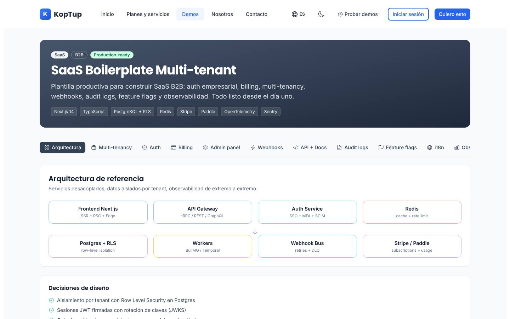
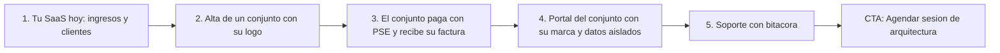

# Plataforma SaaS multi-tenant

> Categoría: Seguridad (`security`, **incorrecta**; propuesta: `devTools`) · Demo: `/demo/saas-boilerplate` · Modo de acceso recomendado: `publico` (versión personalizada y sesión de arquitectura por solicitud) · Prioridad: **P3** (corregir textos y afirmaciones es **P2**) · Esfuerzo total: **L** (sin contar el core multi-tenant de la Fase 4)

*Captura actual de `/demo/saas-boilerplate` (pestaña Arquitectura). Lo primero que ve el prospecto es la insignia "Production-ready" y una barra de 12 pestañas en la que la última ("Observability") queda cortada. Ver [Sistema de demos](04-Sistema-de-Demos.md), [Catálogo de productos](08-Catalogo-de-Productos.md) y [Roadmap](12-Roadmap.md). Relacionados: [Sistemas RAG](Producto-chatbot-rag-ia.md), el producto principal y el primero que estrena el core SaaS, y [VPN empresarial](Producto-vpn-empresarial.md), que hoy apunta por error a este mismo demo.*

---

## Resumen

**Problema:** muchas empresas colombianas tienen un software que funciona para un cliente, o para uso interno, y quieren venderlo por suscripción a muchos clientes. Por ejemplo, una casa de software con un sistema para IPS, una firma contable con su herramienta de conciliación o una administradora de propiedad horizontal con su app de conjuntos. Para pasar de "una instalación por cliente" a "un SaaS" les faltan piezas que no son su negocio: cuentas por empresa (tenants) con datos aislados, cobro recurrente en COP y USD, factura electrónica de cada cobro, usuarios y roles, y un panel para operar y dar soporte.

**Para quién:**
- Casas de software con un producto vertical que quieren venderlo por suscripción (salud, educación, propiedad horizontal, logística, contabilidad).
- Fundadores con un producto validado que necesitan pasar del prototipo a un producto que cobra.
- Áreas de TI corporativas que quieren ofrecer su plataforma a filiales, franquicias o aliados con los datos de cada uno separados.

**Propuesta de valor:** "Convierte tu software en un SaaS que cobra solo: cuentas por empresa con datos aislados, cobros recurrentes con tarjeta, PSE y Nequi, factura electrónica de cada cobro y un panel para operar y dar soporte." Cuando exista el core de la Fase 4 se añade: "Es la misma base sobre la que corre nuestro propio SaaS".

---

## Estado actual

| Aspecto | Estado | Evidencia |
|---|---|---|
| Demo | Existe, con 12 pestañas: Arquitectura, Multi-tenancy, Auth, Billing, Admin panel, Webhooks, API + Docs, Audit logs, Feature flags, i18n, Observability y Teams | `apps/web/src/app/demo/saas-boilerplate/page.tsx` (`TABS`) y `components/*Tab.tsx` |
| Real o maqueta | **Maqueta.** Todos los datos están fijos en los componentes y no hay `fetch` ni llamadas a la API. El "checkout" es un `setTimeout` de 1,4 s | `BillingTab.tsx` (`startCheckout`), `AdminTab.tsx` (`tenants`), `AuditTab.tsx` (`logs`), `WebhooksTab.tsx` (`events`) |
| Tipo de demo | Folleto técnico: diagrama de arquitectura, fragmentos de código SQL, TypeScript, Python y Go, y una comparativa de patrones de aislamiento. No muestra un SaaS funcionando, ni desde la vista del dueño ni desde la del cliente final | `OverviewTab.tsx`, `TenancyTab.tsx`, `ApiTab.tsx` |
| Lo que sí funciona | Cambio de pestañas, selector de patrón de aislamiento con ventajas y compromisos, conmutadores de funciones, filtros de la bitácora, invitación de miembros (se agrega a la lista), vista previa de formato de fecha y moneda | `TenancyTab.tsx`, `FlagsTab.tsx`, `AuditTab.tsx`, `TeamsTab.tsx`, `I18nTab.tsx` |
| Backend | `apps/backend/src/modules/saas-platform/`: tenants y planes **en memoria**, con cambio de plan que valida el límite de asientos. **No está montado** en el servidor. Sus datos de ejemplo usan USD y regiones de EE. UU. | `saas-platform.service.ts`, `saas-platform.data.ts` |
| i18n ES/EN | Completo para los textos del demo (226 claves en cada idioma) | `apps/web/messages/demos/saas-boilerplate.{es,en}.json` |
| Textos fuera de i18n | Insignias "SaaS", "B2B" y "Production-ready", el sufijo " / mo", "spans/min" y los correos de ejemplo | `page.tsx`, `BillingTab.tsx`, `ObservabilityTab.tsx`, `TeamsTab.tsx` |
| Tests | Un smoke test (`__tests__/page.test.tsx`) que hoy no se ejecuta, porque falta la configuración de Jest en `apps/web` | `apps/web/package.json` (`jest --passWithNoTests`) |
| Tamaño | 1.436 líneas: `page.tsx` 146, `layout.tsx` 22, 13 componentes (1.257) y el test (11) | `wc -l` |
| Catálogo | Entrada 18 de `services-catalog.ts`, con `category: 'security'` | `apps/web/src/lib/services-catalog.ts` |

### Problemas detectados

1. **Promete más de lo que hay:** la insignia "Production-ready" y la frase "Todo listo desde el día uno" (`pageSubtitle`) sugieren un producto terminado. Koptup todavía no tiene una base multi-tenant propia: llega en la Fase 4.
2. **Solo le habla al CTO:** hay SQL con Row Level Security, "tRPC / REST / GraphQL", "BullMQ / Temporal" y OpenTelemetry. El gerente o fundador que aprueba el gasto no ve su SaaS funcionando.
3. **No está pensado para Colombia:** los precios de ejemplo están en USD ($29 y $99), el cobro solo menciona Stripe y Paddle, el idioma por defecto es `es-AR`, las monedas son USD/EUR/ARS/BRL y entre las zonas horarias no está `America/Bogota` (`I18nTab.tsx`). No aparecen PSE, Nequi, Wompi, PayU ni la factura electrónica DIAN. Además, Stripe no abre cuentas a empresas constituidas solo en Colombia; hay que confirmarlo en cada propuesta.
4. **Empresas de ejemplo sacadas de la ficción anglosajona:** `acme-corp`, `globex`, `initech` y `umbrella` (`AdminTab.tsx`) y correos `@acme.com` en Teams y Audit logs. El backend añade Hooli, Pied Piper, Stark y Cyberdyne.
5. **Botones sin acción:** "Probar" en API + Docs, los cuatro botones de proveedores sociales en Auth, y "Reenviar" y "Revocar" en Teams.
6. **Navegación:** las 12 pestañas van en una sola barra horizontal. En escritorio la última queda cortada, en móvil hay que desplazarse para descubrirlas y no hay un orden de recorrido.
7. **Categoría equivocada:** `security` lo agrupa con firma electrónica y VPN, cuando es una plataforma de desarrollo (`devTools`).
8. **Textos del catálogo** (`apps/web/messages/offerings/saas-multi-tenant.es.json`):
   - la descripción es de plantilla ("Implementación a medida o suscripción SaaS mensual del producto…");
   - usa voseo ("Lanzá", "Comprala", "pagá");
   - la viñeta "Reportes mensuales del tier" está repetida en Avanzado y en Enterprise;
   - pone "Stripe billing" en el plan Básico;
   - vende el modelo de aislamiento (por fila, por schema o con base dedicada) como mejora de plan, cuando es una decisión de arquitectura.
9. **Mide en "requests":** el plan Básico dice "Hasta 10k requests/mes + 5 tenants". El comprador piensa en cuántos clientes y usuarios tendrá. Además, 10.000 peticiones al mes no alcanzan ni para un solo cliente activo.
10. **La modalidad SaaS no tiene sentido tal como está:** ofrece una "suscripción hospedada por Koptup" de una plataforma para construir SaaS. Lo que este cliente pagaría cada mes es la **operación gestionada** de su propio SaaS: hosting, monitoreo, actualizaciones y soporte.
11. **Otro producto usa este demo:** la oferta `vpn-empresarial` también apunta a `/demo/saas-boilerplate` (ver [VPN empresarial](Producto-vpn-empresarial.md)).

---

## Qué falta para que sea vendible

- **Un demo que cuente la historia del negocio** ("así se ve tu SaaS cobrando a cuatro clientes"), con la vista del dueño y la del cliente final. La parte técnica pasa a una sección aparte para el CTO.
- **Localización colombiana:** planes en COP, cobro con tarjeta, PSE y Nequi a través de Wompi o PayU, factura electrónica de cada cobro, `es-CO` y `America/Bogota`.
- **Quitar las afirmaciones sin respaldo** ("Production-ready") hasta que exista el core de la Fase 4. Después, presentar el producto como "la misma base de nuestro SaaS".
- **Prueba social:** hoy no hay ningún caso. El primero puede ser el propio SaaS RAG de Koptup (Fase 4).
- **Planes medidos por tenants y usuarios**, con precios claros y un "Diagnóstico de arquitectura SaaS" de precio fijo como puerta de entrada.
- **Textos del catálogo reescritos** en español neutro, sin duplicados ni jerga, y la categoría cambiada a `devTools`.

---

## Plan detallado

### Landing `/productos/saas-multi-tenant`

1. **Hero:** "Convierte tu software en un SaaS que cobra solo". Subtítulo: "Cuentas por empresa, cobros recurrentes en COP y USD, factura electrónica y panel de operación". CTA principal **Ver la demo** (es pública) y secundario **Agendar sesión de arquitectura**. Debajo, el enlace "Solicitar demo personalizada".
2. **Video de 60–90 s** sobre el demo rediseñado: el dueño ve sus ingresos del mes, da de alta un cliente nuevo con su logo, el cliente paga con PSE y recibe la factura, entra a su portal con su marca y, al final, soporte atiende un caso que queda en la bitácora.
3. **Para quién** (3 tarjetas): casa de software vertical, fundador con producto validado y TI corporativa con filiales.
4. **Qué incluye**, en lenguaje de negocio: cuentas por empresa, cobros y facturación, usuarios y roles, marca de cada cliente, panel de operación y soporte, API e integraciones.
5. **Cómo trabajamos (4 pasos):** diagnóstico de arquitectura (2 semanas), base multi-tenant con cobros, migración de tu producto y operación gestionada (opcional).
6. **"Para tu equipo técnico"** (sección plegable): modelos de aislamiento, stack, seguridad, API y webhooks. Aquí va el contenido actual de las pestañas técnicas.
7. **Planes y precios:** modalidad compra, con la columna SaaS reemplazada por "Operación gestionada" (ver abajo).
8. **FAQ:**
   - ¿El código es mío? (Sí, en la modalidad compra.)
   - ¿Puedo cobrar en dólares desde Colombia?
   - ¿Cómo se emite la factura electrónica de cada cobro?
   - ¿Qué pasa si un cliente no paga?
   - ¿Cuánto tarda migrar mi producto?
   - ¿En qué región quedan los datos?

### Demo interactiva

Las 12 pestañas se reorganizan en **6 pantallas** alrededor de un caso colombiano ficticio: **"ConjuntoApp"**, un software de administración de propiedad horizontal que se vende por suscripción a conjuntos residenciales. Los tenants de ejemplo son "Conjunto Altos de Suba" (Bogotá), "Edificio Laureles 70" (Medellín), "Condominio Campestre El Retiro" (Antioquia) y "Torres de Cañaveral" (Floridablanca). Todos los datos llevan la etiqueta "ejemplo".

| Pantalla nueva | Viene de | Qué agregar | Qué quitar |
|---|---|---|---|
| 1. **Tu SaaS hoy** (vista del dueño) | Nueva. `OverviewTab.tsx` pasa a la pantalla 6 | Ingresos recurrentes del mes en COP; clientes activos, en prueba y en mora; altas y bajas del mes; lista de tenants con plan, usuarios y estado | El diagrama de arquitectura como primera pantalla |
| 2. **Alta de un cliente** | `TenancyTab.tsx` + `AdminTab.tsx` | Asistente de 3 pasos: nombre del conjunto, subdominio (`altosdesuba.conjuntoapp.co`), plan, logo y color. Al terminar, el cliente aparece en la lista de la pantalla 1 | El selector de patrones de aislamiento (pasa a la pantalla 6) |
| 3. **Planes y cobros** | `BillingTab.tsx` | Planes de ejemplo en COP ("Conjunto pequeño", $149.000/mes; "Conjunto mediano", $290.000/mes; "Multiconjunto", a convenir). Checkout simulado con tarjeta, **PSE** y **Nequi** (Wompi en modo sandbox). Factura electrónica de ejemplo con CUFE ficticio y PDF. Cobro fallido con recordatorios por email y **WhatsApp** (días 0, 3 y 7) y suspensión. Consumo del plan (usuarios, almacenamiento) | Precios $29/$99 en USD, "Stripe Elements", sufijo " / mo" |
| 4. **Usuarios y accesos** | `TeamsTab.tsx` + `AuthTab.tsx` | Roles del dominio (Administrador del conjunto, Contador, Portería, Residente), invitación por email, inicio de sesión con Google o Microsoft y segundo factor. "Reenviar" y "Revocar" funcionan | Botones de proveedores sociales sin acción. SAML y SCIM dejan de ser lo primero y se marcan "plan Enterprise" |
| 5. **Portal del cliente** (vista del tenant) | Nueva | Selector "Ver como: Altos de Suba / Laureles 70" que cambia logo, colores y datos (cuotas, residentes, comunicados). Demostración de aislamiento: un enlace a un recurso de otro conjunto muestra "No tienes acceso a este recurso" | — |
| 6. **Operación y equipo técnico** | `AdminTab.tsx`, `AuditTab.tsx`, `FlagsTab.tsx`, `WebhooksTab.tsx`, `ApiTab.tsx`, `ObservabilityTab.tsx`, `I18nTab.tsx`, `OverviewTab.tsx` | Soporte con suplantación que exige motivo y queda en la bitácora; funciones activables por cliente; estado del servicio. Bloque técnico plegable con arquitectura, aislamiento, API, webhooks y localización (`es-CO`, COP, `America/Bogota`) | La insignia "Production-ready", los nombres de herramientas de observabilidad como protagonistas y `es-AR` por defecto |

**Reglas generales del rediseño:**
- El estado se comparte entre pantallas: una alta en la pantalla 2 aparece en la 1 y en la 5.
- Todo botón visible hace algo, o se oculta.
- Todos los textos visibles, incluidas las insignias, viven en `messages/demos/saas-boilerplate.{es,en}.json`.
- Las pestañas se reemplazan por un menú lateral en escritorio y un selector en móvil.

**Recorrido guiado (5 pasos):**

> [Ver diagrama como imagen](images/diagramas/Producto-saas-multi-tenant-1.png)

1. Ver el panel del dueño: ingresos del mes en COP, cuatro clientes, uno de ellos en mora.
2. Dar de alta "Torres de Cañaveral" con su logo y su plan.
3. Pagar el primer mes con PSE (simulado) y abrir la factura electrónica de ejemplo.
4. Entrar al portal del cliente nuevo, con su marca, y comprobar que no ve datos de otro conjunto.
5. Abrir una sesión de soporte con motivo y verla registrada en la bitácora. Al final, CTA "Agendar sesión de arquitectura".

### Acceso y solicitud de demo

- **Modo recomendado: `publico`**, igual que la semilla de [Sistema de demos](04-Sistema-de-Demos.md). Es una maqueta sin costo de operación y atrae búsquedas como "plataforma SaaS multi-tenant" o "cómo convertir mi software en SaaS". Lleva el banner "Solicita tu demo guiada".
- **Antes de entrar** (en la landing): video de 60–90 s y 6 capturas, una por pantalla.
- **Por solicitud** (con `DemoGrant` de 14 días): versión personalizada con el sector, el nombre y el logo del producto del prospecto, más una **sesión de arquitectura** de 45 minutos con un ingeniero (modo guiado). En ella se revisa el producto actual del prospecto y se recomienda el modelo de aislamiento.
- **El prospecto aprobado ve en Portal › Mis demos:**
  - la demo personalizada;
  - el agendamiento de la sesión y, después, su grabación;
  - un documento de 2 páginas, "Ruta para convertir tu producto en SaaS";
  - el CTA "Solicitar propuesta".

### Personalización por cliente

Se configura en **Admin › Solicitudes de demo › Aprobar**, en el campo `DemoGrant.customization = { logoUrl, sector, datasetKey }`:

| Campo | Efecto en el demo |
|---|---|
| Nombre y logo del producto del prospecto | Reemplazan "ConjuntoApp" en el encabezado, el checkout, la factura y el portal |
| Color principal | Tema del portal del cliente (pantalla 5) |
| Sector (`datasetKey`): `propiedad-horizontal`, `salud-ips`, `educacion`, `logistica` o `contable` | Cambia los tenants de ejemplo, los roles (en salud: Coordinador médico, Facturador, Recepción) y los datos del portal |
| Moneda principal (COP o USD) y pasarela (Wompi, PayU, Mercado Pago o Stripe) | Cambia los precios, los medios de pago y los logos del checkout |
| Planes del prospecto (hasta 3, con nombre y precio) | Reemplazan los planes de ejemplo de la pantalla 3 |

Todo se hace con formularios del admin, sin escribir código. Los conjuntos de datos por sector viven como fixtures versionados en el repositorio.

### Producto real

**MVP de la modalidad compra** (lo que se entrega en los planes Básico y Profesional):

| Módulo | Alcance |
|---|---|
| Cuentas por empresa (tenants) | Alta, suspensión y baja; subdominio por tenant; aislamiento de datos en **todas** las consultas, con un filtro obligatorio por tenant en la capa de datos y pruebas automáticas que lo verifican |
| Usuarios y roles | Invitaciones, roles configurables por tenant, inicio de sesión con email y contraseña o con Google/Microsoft. Segundo factor desde el plan Profesional |
| Planes y cobro recurrente | Catálogo de planes, prueba gratis, cambio de plan con prorrateo y suspensión por mora con reintentos. Cobro con tarjeta tokenizada vía **Wompi** o **PayU**; PSE y Nequi como pago de cada periodo. **Stripe** o **Paddle** para clientes en USD cuando la entidad del cliente lo permita |
| Factura electrónica | Factura de cada cobro emitida a través del proveedor tecnológico del cliente (**Siigo**, **Alegra** u otro con API) o con el módulo de [Facturación electrónica](Producto-facturacion-electronica.md) |
| Notificaciones | Email transaccional y **WhatsApp Business** (bienvenida, cobro y mora) |
| Marca por tenant | Logo y colores; dominio propio desde el plan Profesional |
| Panel de operación | Tenants, ingresos recurrentes, mora, soporte con suplantación auditada, bitácora y funciones por tenant |
| API y webhooks | API REST con llaves por tenant y webhooks firmados (Profesional) |
| Entrega | Código en el repositorio del cliente, documentación, despliegue en su nube, capacitación y 30 días de acompañamiento |

Avanzado y Enterprise agregan aislamiento por schema o con base de datos dedicada, SSO SAML/OIDC y SCIM, residencia de datos, API gateway con límites por plan y soporte con acuerdo de nivel de servicio.

**Coherencia con el core de Koptup:** el core multi-tenant y de cobro recurrente que se construye en la **Fase 4** para los [Sistemas RAG](Producto-chatbot-rag-ia.md) debe diseñarse como base reutilizable de este producto. Mientras no exista, cada proyecto de compra se construye a medida y la landing no promete una "base probada en producción".

**SaaS:** según la DECISIÓN 7, este producto **no** se ofrece como SaaS. La columna SaaS se reemplaza por **"Operación gestionada"**: Koptup hospeda, monitorea, actualiza y da soporte al SaaS del cliente a cambio de una cuota mensual. Para ofrecerla hacen falta:
- un acuerdo de nivel de servicio explícito (horario hábil o 24/7) con su herramienta de monitoreo y alertas;
- copias de seguridad probadas, con restauración por tenant;
- un procedimiento de gestión de incidentes;
- un contrato de encargado del tratamiento de datos (Ley 1581 de 2012).

### Planes y precios

Precios actuales del catálogo (`services-catalog.ts`, entrada `saas-multi-tenant`), en COP:

| Plan | Compra: setup único | Compra: mantenimiento mensual (opcional) | SaaS: setup | SaaS: cuota mensual | Volumen | Implementación |
|---|---|---|---|---|---|---|
| Básico | $60.000.000 | $5.400.000 | $2.900.000 | $1.990.000 | 10.000 requests/mes y 5 tenants | 2–5 semanas |
| Profesional | $153.000.000 | $13.600.000 | $6.900.000 | $4.890.000 | 1 M requests/mes y 50 tenants | 5–9 semanas |
| Avanzado | $357.000.000 | $30.600.000 | $12.900.000 | $9.290.000 | 25 M requests/mes y 200 tenants | 9–14 semanas |
| Enterprise | $765.000.000 | $59.500.000 | Personalizado | $16.790.000 | 250 M+ requests/mes, tenants ilimitados | 12–20 semanas |

| Plan | Usuarios admin | Usuarios finales | Tenants | Almacenamiento | Horas de mantenimiento/mes | Costos del cliente (USD/mes) |
|---|---|---|---|---|---|---|
| Básico | 5 | 1.000 | 5 | 20 GB | 5 | 80–300 (hosting, base de datos, pasarela, email) |
| Profesional | 30 | 100.000 | 50 | 200 GB | 12 | 400–1.500 (más autenticación premium) |
| Avanzado | 80 | 500.000 | 200 | 1.000 GB | 25 | 1.500–6.000 (autenticación empresarial, MFA, bitácoras) |
| Enterprise | Ilimitados | Ilimitados | Ilimitados | Ilimitado | 50 | 5.000–25.000 (multirregión y arquitectura de cumplimiento) |

**Qué incluye cada plan, en lenguaje de cliente:**
- **Básico:** "Tu producto listo para cobrar a tus primeros 5 clientes: cuentas separadas, cobro con tarjeta en COP, factura de cada cobro y panel básico."
- **Profesional:** "Hasta 50 clientes con su propia marca y dominio, inicio de sesión con Google o Microsoft, API, webhooks y bitácora."
- **Avanzado:** "Hasta 200 clientes, segundo factor obligatorio, datos separados por esquema o por región y límites de uso por plan."
- **Enterprise:** "Clientes ilimitados, base de datos dedicada para quien la exija, SSO corporativo por cliente y arquitectura preparada para auditorías SOC 2 o ISO 27001."

**Recomendaciones de claridad:**
1. **Medir por tenants y usuarios activos.** "Requests/mes" pasa a la letra pequeña.
2. **Reemplazar la columna SaaS por "Operación gestionada"**, con su propia cuota (puede partir de las cuotas SaaS actuales) y una lista clara de lo que incluye.
3. **Presentar el modelo de aislamiento como opción técnica** que se decide en el diagnóstico, no como mejora de plan.
4. **Ofrecer un "Diagnóstico de arquitectura SaaS"** de precio fijo (2 semanas, abonable a la compra). Hoy el salto a los $60 M del Básico no tiene un paso intermedio.
5. **Corregir `saas-multi-tenant.{es,en}.json`:**
   - tagline y descripción con propuesta de valor;
   - sin voseo y sin la viñeta duplicada;
   - "Stripe billing" pasa a "Cobro recurrente con tarjeta (Wompi, PayU o Stripe)".
6. **Cambiar `category: 'security'` por `'devTools'`.**

---

## Tareas

| # | Tarea | Fase | Prioridad | Esfuerzo | Criterio de aceptación |
|---|---|---|---|---|---|
| 1 | Reescribir `saas-multi-tenant.{es,en}.json` (tagline, descripción, viñetas por tenants y usuarios, sin voseo ni duplicados) y cambiar `category` a `devTools` en `services-catalog.ts` | Fase 1 — Funnel y solicitud de demos | P2 | S | Un script de verificación no encuentra viñetas duplicadas ni voseo, y la tarjeta aparece en la categoría DevTools |
| 2 | Quitar la insignia "Production-ready" y la frase "Todo listo desde el día uno"; pasar las insignias y el sufijo " / mo" a i18n | Fase 1 — Funnel y solicitud de demos | P2 | S | Ningún texto visible del demo queda fuera de `messages/demos/saas-boilerplate.*.json` y ninguno afirma que esté en producción |
| 3 | Reemplazar SaaS por "Operación gestionada" en la tabla pública de este producto (bandera en el catálogo y en la UI) | Fase 1 — Funnel y solicitud de demos | P2 | S | La tarjeta muestra "Operación gestionada" con su descripción y ningún texto ofrece "suscripción SaaS" para este producto |
| 4 | Registrar el `DemoCatalogItem` `saas-boilerplate` (`publico`, `offeringSlug: saas-multi-tenant`) y dejar a `vpn-empresarial` sin este demo | Fase 1 — Funnel y solicitud de demos | P1 | S | `/admin/catalogo-demos` muestra el ítem con una sola oferta asociada |
| 5 | Landing `/productos/saas-multi-tenant` con video, "Para quién", "Cómo trabajamos", sección técnica plegable, planes y FAQ | Fase 1 — Funnel y solicitud de demos | P2 | M | El CTA principal abre el demo, el secundario abre el formulario con el producto preseleccionado y la landing está en el sitemap |
| 6 | Rediseñar el demo en 6 pantallas con el caso "ConjuntoApp" y estado compartido entre pantallas | Fase 2 — Demos vendibles | P3 | L | El recorrido de 5 pasos se completa sin recargar; una alta en "Alta de un cliente" aparece en "Tu SaaS hoy" y en "Portal del cliente"; funciona a 375 px de ancho |
| 7 | Localizar el demo para Colombia: COP, `es-CO`, `America/Bogota`, tarjeta, PSE y Nequi vía Wompi (simulado), factura electrónica de ejemplo y avisos por WhatsApp | Fase 2 — Demos vendibles | P3 | M | No aparecen `es-AR`, ARS ni precios en USD por defecto, y el checkout muestra los tres medios de pago |
| 8 | Dar acción simulada (o quitar) a los botones sin efecto: "Probar" en API, proveedores sociales, "Reenviar" y "Revocar" | Fase 2 — Demos vendibles | P3 | S | En un recorrido manual, cada botón visible produce un cambio en pantalla |
| 9 | Personalización por grant: logo, color, sector (5 conjuntos de datos), moneda y pasarela, y planes del prospecto | Fase 2 — Demos vendibles | P3 | M | Con un grant de sector `salud-ips`, el demo muestra tenants, roles y datos de salud con el logo del prospecto |
| 10 | Grabar el video de 60–90 s y las 6 capturas del recorrido | Fase 2 — Demos vendibles | P3 | S | Los medios están publicados en la landing y referenciados en el `DemoCatalogItem` |
| 11 | Plantilla de propuesta y oferta "Diagnóstico de arquitectura SaaS" de precio fijo | Fase 3 — Propuestas y conversión | P3 | S | El comercial genera la propuesta desde Admin › Propuestas en menos de 15 minutos |
| 12 | Diseñar el core multi-tenant y de cobro de la Fase 4 como paquete reutilizable (tenants, roles, planes, cobro Wompi/PayU/Stripe, factura electrónica, panel de operación) | Fase 4 — Productos SaaS reales | P2 | XL | El chatbot RAG corre sobre el core y un segundo proyecto lo instala sin copiar código |
| 13 | Pruebas automáticas de aislamiento entre tenants en el core | Fase 4 — Productos SaaS reales | P1 | M | La suite de CI falla si una consulta devuelve datos de otro tenant, y corre en cada PR |
| 14 | Caso de estudio "Así construimos nuestro SaaS RAG sobre el core" y, después, el primer caso de cliente | Fase 5 — Escala | P3 | S | Caso publicado con cifras reales y, si es de un cliente, con su autorización |

---

## Métricas de éxito

| Métrica | Meta inicial |
|---|---|
| Visitantes del demo que completan el recorrido de 5 pasos | ≥ 25 % |
| Visitantes de la landing que agendan sesión de arquitectura o solicitan demo personalizada | ≥ 2 % |
| Sesiones de arquitectura que terminan en diagnóstico pagado | ≥ 25 % |
| Diagnósticos que pasan a compra | ≥ 40 % |
| Clientes de compra que contratan operación gestionada | ≥ 50 % |
| Tiempo hasta que un cliente cobra a sus primeros tenants (con el core de la Fase 4) | ≤ 5 semanas |

Páginas relacionadas: [Sistemas RAG](Producto-chatbot-rag-ia.md), [Facturación electrónica](Producto-facturacion-electronica.md), [VPN empresarial](Producto-vpn-empresarial.md), [Landing de producto](Seccion-Landing-de-Producto.md), [Panel de administración](05-Panel-de-Administracion.md) y [Roadmap](12-Roadmap.md).
