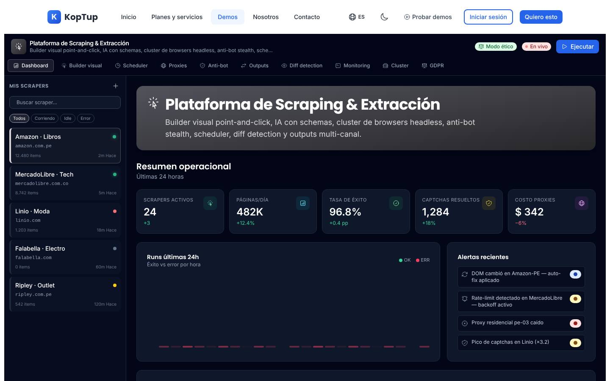
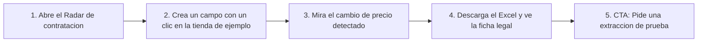

# Extracción y monitoreo de datos (offering `scraping-extraccion`)

> Datos (`data`) · Demo: `/demo/scraping` · Modo de acceso recomendado: `publico` (después de la limpieza de la Fase 1; la extracción de prueba con una fuente del prospecto va por `solicitud`) · Prioridad: **P3** (la limpieza de riesgos es **P1**) · Esfuerzo total: **XL** (Fases 1–2 ≈ 4 semanas de 1 dev senior; la limpieza urgente es S)

*Captura actual de `/demo/scraping`. Ver [Sistema de demos](04-Sistema-de-Demos.md), [Catálogo de productos](08-Catalogo-de-Productos.md) y [Roadmap](12-Roadmap.md).*

> **Contexto de posicionamiento:** con el reposicionamiento de Koptup en sistemas RAG (ver [Visión de producto](02-Vision-de-Producto.md)), este producto queda dentro de **"Otras soluciones a medida"**. Su puente con el producto principal es claro: **mantener actualizada la base de conocimiento del asistente RAG** con fuentes públicas (normativa, circulares, catálogos) y **convertir documentos en datos** (PDF de facturas, RUT, certificados). La demo actual vende otra cosa ("evasión anti-bot" sobre tiendas reales) y debe corregirse antes de mostrarse a clientes corporativos.

---

## Resumen

**Problema:** las empresas toman decisiones con datos que están dispersos en sitios web y documentos: procesos de contratación pública que nadie revisa a tiempo, precios de la competencia que se copian a mano a un Excel, cambios normativos que se enteran tarde, certificados y RUT de proveedores que alguien digita.

**Para quién (cliente ideal en Colombia/LATAM):**
- Empresas que venden al Estado y necesitan detectar a diario los procesos de contratación pública que les encajan.
- Comercio minorista, distribuidores y marcas que monitorean precios y disponibilidad en tiendas en línea (solo donde los términos de uso lo permiten o con acuerdo con la fuente).
- Áreas jurídicas, de cumplimiento y gremios que siguen normativa y circulares de entidades públicas.
- Equipos de compras y vinculación de proveedores que extraen datos de documentos (RUT, certificados de existencia y representación legal, facturas en PDF).

**Propuesta de valor:** "Datos de la web y de tus documentos, limpios, validados y a tiempo en tu Excel, Power BI o sistema, con alertas cuando algo cambia. Solo de fuentes permitidas y con revisión legal de cada fuente."

**Diferenciación:** servicio llave en mano (Koptup construye, opera y repara los extractores), IA para extraer campos aunque la página cambie, **extracción responsable** (APIs y datos abiertos primero, respeto de robots.txt y ritmo de consulta, sin datos personales salvo base legal según la Ley 1581) y conexión directa con el asistente RAG.

---

## Estado actual

| Aspecto | Estado | Evidencia |
|---|---|---|
| Demo | Existe. Encabezado con "Modo ético", "En vivo" y "Ejecutar"; **10 pestañas** (Dashboard, Builder visual, Scheduler, Proxies, Anti-bot, Outputs, Diff detection, Monitoring, Cluster, GDPR); barra lateral "Mis scrapers" con 5 extractores, buscador y filtros | `apps/web/src/app/demo/scraping/page.tsx` (206 líneas), `components/views.tsx` (745 líneas) |
| Real o maqueta | **Maqueta.** Extractores, proxies, workers, ejecuciones y diferencias son constantes (`PROXIES`, `WORKERS`, `RUNS`, `DIFF` en `views.tsx`; `scrapers` en `page.tsx`). "Ejecutar" solo repite 10 líneas de log cada 700 ms. No hay `fetch` ni llamadas a backend o IA | `page.tsx`, `views.tsx` |
| Backend | Módulo en memoria `apps/backend/src/modules/scraping/` (CRUD de `Scraper` y `Job`; `runScraper` solo crea un registro "queued"; ~165 líneas) **no montado** en el servidor. No descarga ni procesa páginas | `scraping.service.ts`, `scraping.data.ts` |
| i18n ES/EN | Textos en `apps/web/messages/demos/scraping.{es,en}.json` (~9,6 KB). Textos fijos en el código: "— run the scraper to stream logs —", "● LIVE / ○ IDLE", "jobs:", "pods", "$ 342.40 / mes", estados de ejecución `ok/partial/error` sin traducir (`views.tsx`) | |
| Tests | Solo smoke test (`__tests__/page.test.tsx`, 11 líneas), que hoy no se ejecuta | |
| Tamaño | 984 líneas en total (`wc -l`) | |

### Problemas detectados (con ruta)

1. **Riesgo legal y reputacional en el mensaje.** La pestaña "Anti-bot" se titula "Evasión anti-bot — Técnicas para evitar detección" y ofrece aleatorizar huellas del navegador, ocultar señales de automatización, "TLS / JA3 spoofing" y resolvedores de captchas (`antibot` en el JSON, `Antibot` en `views.tsx`). La tarjeta del catálogo de demos repite "Anti-bot evasion" y "captcha solving" (`_catalog.es.json`, clave `demosExtra.scraping`). Un área de cumplimiento corporativo descarta al proveedor al ver esto, y eludir controles de acceso de un sitio puede tener consecuencias legales (consultar con un abogado; ver Ley 1273 de 2009 de delitos informáticos).
2. **Marcas reales de terceros como objetivo:** los 5 extractores apuntan a tiendas en línea reales de la región (`scrapers` en `page.tsx`, `RUNS` en `views.tsx`, alertas del tablero y bitácora de auditoría), con mensajes como "Pico de captchas en …". Da a entender que Koptup extrae datos de esas empresas sin permiso.
3. **"Modo ético" se puede apagar.** El distintivo del encabezado es un interruptor (`setEthical`) que no cambia nada, y en la pestaña "GDPR" respetar robots.txt y el ritmo de consulta son interruptores (`Compliance` en `views.tsx`). Transmite justo el mensaje contrario al que se quiere vender.
4. **Ejemplo peruano en un sitio colombiano:** el constructor muestra un libro en una tienda de Perú con precio en soles ("S/ 129.90") y el log arranca con un proxy residencial de Perú.
5. **El gráfico principal del tablero no muestra las barras de éxito.** En "Runs últimas 24h" la altura en porcentaje de cada barra no tiene un contenedor con altura definida, así que solo se ven las líneas rojas de error (se ve vacío en la captura; `Dashboard` en `views.tsx`).
6. **"En vivo" siempre encendido:** el distintivo rojo con pulso aparece aunque no se esté ejecutando nada (`page.tsx`).
7. **Elegir otro extractor casi no cambia nada:** el tablero, las diferencias, la programación y los campos son los mismos para los 5; solo cambia el dominio en la vista previa del constructor.
8. **El constructor "point-and-click" no permite hacer clic:** el subtítulo dice "Apunta y haz clic sobre el preview para extraer campos", pero la vista previa es un dibujo sin acciones; "Probar selector", "Guardar" y "Nuevo scraper" (+) no hacen nada, y la vista previa de IA no cambia al editar el esquema.
9. **Filtro incompleto:** hay un extractor en estado "paused", pero los filtros solo ofrecen Todos, Corriendo, Idle y Error.
10. **Título repetido:** el encabezado y la tarjeta grande muestran el mismo título y subtítulo, que además es una lista de jerga ("Builder visual point-and-click, IA con schemas, cluster de browsers headless, anti-bot stealth…").
11. **Pestañas para ingenieros, no para compradores:** "Cluster Playwright en K8s", "Autoscaling HPA", pool de User-Agents, proxies por país. El comprador quiere ver datos y alertas, no infraestructura.
12. **Cumplimiento con marco equivocado:** la pestaña se llama "GDPR" (Unión Europea) y no menciona la Ley 1581 de 2012; los botones de derechos del titular son solo etiquetas.
13. **Formato numérico en inglés:** "1,284", "482K" y "$ 342" en una interfaz en español.
14. **Textos del catálogo** (`messages/offerings/scraping-extraccion.es.json`): descripción de plantilla, voseo ("Recolectá", "Comprala", "pagá… por vos"), viñeta **"Reportes mensuales del tier" duplicada** en Avanzado y Enterprise, y la nota de costos menciona "captcha solvers".

**Lo que sí funciona y se conserva:** el editor de campos (nombre, selector, tipo, requerido, agregar y borrar), los modos de programación con expresión cron, los disparadores por cambio (precio, stock, nuevo, retirado), la vista de diferencias antes/después, la selección de destinos y formatos, y la detección de datos personales y retención como concepto.

---

## Qué falta para que sea vendible

- **Cambiar el mensaje de "evadir" a "extraer de forma responsable"** y quitar marcas reales de terceros. Es lo primero, porque la demo es pública hoy.
- **Casos colombianos con valor claro:** radar de contratación pública, precios de competencia (tiendas ficticias), normativa para el asistente RAG y extracción de documentos.
- **Un constructor que sí se pueda tocar:** una página de ejemplo real (servida por Koptup) donde el visitante haga clic en el precio y aparezca el campo.
- **Ver el resultado donde el cliente lo usa:** hoja de cálculo, Power BI o alerta por correo/WhatsApp, no un log técnico.
- **Ficha legal de cada fuente:** términos de uso, robots.txt, base legal y datos personales excluidos. Es el diferenciador frente a extractores baratos.
- **Precio entendible:** hoy el Básico de compra cuesta COP 35.000.000 por "25.000 páginas/mes"; el cliente no piensa en páginas sino en **fuentes y frecuencia** ("3 fuentes, actualización diaria").

---

## Plan detallado

### Landing `/productos/scraping-extraccion`

1. **Hero:** "Los datos que necesitas de la web y de tus documentos, limpios y a tiempo en tu Excel o Power BI". Subtítulo: "Solo de fuentes permitidas, con revisión legal de cada fuente y alertas cuando algo cambia". CTA **Solicitar demo**, secundarios **Probar la demo** y **Agendar llamada**.
2. **Video de 60–90 s:** cada mañana llega un correo con 5 procesos de contratación nuevos que encajan con la empresa, resumidos por IA → un clic abre la hoja de cálculo → una alerta de precio de la competencia → el asistente RAG responde con una circular publicada ayer.
3. **Cuatro casos de uso** (tarjetas): *Radar de contratación pública*, *Precios y disponibilidad de la competencia*, *Normativa y circulares al día (para tu asistente RAG)*, *Documentos a datos (RUT, certificados, facturas en PDF)*.
4. **Extracción responsable** (sección propia): APIs y datos abiertos primero; revisión de términos de uso y robots.txt por fuente; ritmo de consulta moderado e identificación del extractor; sin datos personales salvo base legal (Ley 1581); bitácora de cada ejecución. Texto: "Si una fuente no permite la extracción, te lo decimos antes de cotizar".
5. **Cómo se entrega:** archivo diario (Excel/CSV), Google Sheets, base de datos para Power BI, API o webhook, alertas por correo, Teams o WhatsApp.
6. **Qué pasa cuando la página cambia:** monitoreo de calidad, la IA sugiere el ajuste y un ingeniero lo aprueba; tiempo de reparación por plan.
7. **Planes y precios** (compra; SaaS "lista de espera") y **FAQ:** ¿es legal extraer datos de la web? · ¿qué fuentes no hacen? · ¿con qué frecuencia se actualiza? · ¿qué pasa si la fuente cambia? · ¿puedo recibir los datos en Power BI? · ¿quién paga los proxies?
8. **Bloque cruzado:** [Chatbot RAG con IA](Producto-chatbot-rag-ia.md) ("conecta fuentes web a tu asistente") y [Dashboard ejecutivo](Producto-bi-dashboard.md) ("visualiza los datos extraídos").

### Demo interactiva (mejoras por pantalla/módulo)

| Pantalla / componente | Hoy | Cambiar a |
|---|---|---|
| Encabezado (`page.tsx`) | "Modo ético" como interruptor, "En vivo" siempre encendido, "Ejecutar"; tarjeta grande repite el título | Logo y nombre de la empresa ficticia (o del prospecto), sello fijo **"Extracción responsable"** (no interruptor) que abre la ficha legal de la fuente, "En vivo" solo durante una ejecución, botón **"Actualizar ahora"**, banner "Solicita tu demo guiada". Quitar la tarjeta grande repetida |
| Barra lateral "Mis scrapers" | 5 tiendas reales de la región | **"Mis fuentes"** con 4 extractores de ejemplo (abajo); filtro con "Pausado"; "+" abre el asistente "Nueva fuente en 3 pasos" (pegar URL → elegir campos → programar y destino) que termina en "Solicitar extracción de prueba" |
| Dashboard | KPIs fijos con captchas y costo de proxies; gráfico sin barras de éxito; alertas sobre marcas reales | **"Resumen"** por fuente seleccionada: registros nuevos hoy, cambios detectados, calidad de los datos (% de campos completos), última actualización. Gráfico de barras corregido. Alertas de negocio ("3 procesos nuevos por más de $ 500 millones en Antioquia", "El taladro bajó 11 % en la tienda B") |
| Builder visual | Dibujo de un libro con precio en soles; no se puede hacer clic | **Página de ejemplo real** de una ferretería ficticia servida por Koptup (por ejemplo `/demo/scraping/tienda-ejemplo`) en un iframe: clic sobre precio, nombre o stock crea el campo con su selector. Modo IA: el esquema se edita y la vista previa se recalcula con datos de ejemplo. Selector de modelo como "Modelo de IA: configurable" |
| Scheduler | Cron, concurrencia, reintentos, disparadores | **"Cuándo y qué avisar"**: frecuencia en palabras ("todos los días a las 6:00", "cada hora en horario laboral"), cron solo en "avanzado"; disparadores se conservan |
| Proxies, Anti-bot, Cluster | Tres pestañas de infraestructura y evasión | **Eliminar Anti-bot.** Proxies y Cluster se reemplazan por una tarjeta informativa "Infraestructura incluida en el plan" (capacidad por plan, sin tablas de IPs ni nodos) |
| Outputs | 5 destinos con valores técnicos de ejemplo (incluye una cadena de conexión de base de datos) | **"Dónde recibes los datos"**: Excel/CSV descargable (que se descargue de verdad con los datos de ejemplo), Google Sheets, Power BI, API/webhook, correo/Teams/WhatsApp. Sin cadenas de conexión ni identificadores técnicos en pantalla |
| Diff detection | Diferencias fijas de un libro en inglés | **"Cambios detectados"** por fuente: precio, stock, procesos nuevos o cerrados, con fecha y botón "Crear alerta" |
| Monitoring | Tabla de ejecuciones y log en inglés técnico | **"Historial"**: ejecuciones con estado en español, registros, duración y "calidad"; el log técnico queda plegado |
| GDPR | Interruptores de robots.txt, ritmo, datos personales y retención | **"Cumplimiento de la fuente" (Ley 1581)**: ficha por fuente (tipo de fuente, términos revisados, robots.txt, ritmo, base legal, datos personales excluidos, retención, responsable) en solo lectura; bitácora sin marcas reales |

**Datos de ejemplo** (empresa ficticia "Suministros Ferreteros del Café S.A.S."; verificar en el RUES que el nombre no exista):

| Fuente de ejemplo | Qué extrae | Resultado que se muestra |
|---|---|---|
| Radar de contratación pública (datos abiertos de SECOP II en datos.gov.co) | Procesos nuevos filtrados por códigos UNSPSC, departamento y cuantía; resumen por IA | 5 procesos de ejemplo de hoy, con entidad ficticia, objeto, cuantía en COP, fecha de cierre y "por qué te encaja" |
| Precios de competencia (3 ferreterías ficticias servidas por Koptup) | Producto, precio, precio anterior, stock, envío | "Taladro percutor 1/2 650 W: $ 189.900 → $ 169.900 (−11 %); stock 12 → 3; nuevo: envío gratis" |
| Normativa y circulares (páginas públicas de normativa) | Título, número, fecha, entidad, PDF | 2 resoluciones nuevas enviadas a la base del asistente RAG, con "Pregúntale al asistente" |
| Documentos a datos (RUT y certificados en PDF de proveedores ficticios) | NIT, razón social, representante legal, actividad económica, fecha | Tabla de 4 proveedores con campos validados y 1 documento enviado a revisión por baja confianza |

**Recorrido guiado (5 pasos):**

1. Abrir "Radar de contratación pública" (preseleccionado) y ver los procesos de hoy con su resumen.
2. Ir a "Precios de competencia", entrar al constructor y hacer clic en el precio de la tienda de ejemplo: aparece el campo con su valor.
3. Ver "Cambios detectados": el precio bajó 11 % y se generó una alerta simulada por correo/WhatsApp.
4. Descargar el Excel con los datos de ejemplo y abrir la ficha "Cumplimiento de la fuente".
5. Cierre: "¿Qué fuente necesitas? Pide una extracción de prueba" (abre "Solicitar demo" con el campo "fuente y datos que necesitas") o "Agendar llamada".

Eventos de uso (`DemoEvent`): `module_view` por fuente y pestaña; `key_action` = `create_field`, `view_change`, `download_excel`, `open_legal_sheet`, `new_source_wizard`; `cta_click`.

### Acceso y solicitud de demo

- **Modo recomendado: `publico`**, pero **solo después de la tarea 1** (quitar evasión y marcas reales). Hasta entonces, cambiar el `DemoCatalogItem` a `solicitud` para que la versión actual no quede indexada ni abierta.
- **Lo que pasa por `solicitud`:** la **extracción de prueba**. El prospecto indica la fuente y los campos; el equipo revisa términos de uso, robots.txt y datos personales **antes de aprobar** (motivo de rechazo estándar: "la fuente no permite extracción automatizada"). Si se aprueba, un ingeniero ejecuta una extracción acotada (hasta 1 fuente y 500 registros) y la entrega como archivo en **Portal › Mis demos** (como `Deliverable`). No requiere construir un extractor de autoservicio.
- **Duración del acceso:** 14 días.
- **Antes de solicitar, el visitante ve:** la landing con el video de 60–90 s, 6 capturas (radar de contratación, constructor con clic, cambios detectados, Excel resultante, ficha legal, vista móvil) y la demo pública.
- **El prospecto aprobado ve:** la demo con su logo y su sector, su fuente como extractor de ejemplo (si se preparó), el archivo de la extracción de prueba, la ficha legal de su fuente y los botones "Solicitar propuesta" y "Agendar llamada".

### Personalización por cliente

Desde **Admin › Solicitudes de demo › Aprobar** (`DemoGrant.customization`: `logoUrl`, `sector`, `datasetKey`, más estos campos):

| Campo | Efecto en la demo |
|---|---|
| Nombre y logo de la empresa | Encabezado, nombre del archivo descargable y remitente de las alertas |
| Sector (ventas al Estado, comercio minorista, jurídico y cumplimiento, compras) | Elige el `datasetKey` y la fuente que abre por defecto |
| Filtros del radar (códigos UNSPSC, departamentos, cuantía mínima) | Procesos de ejemplo filtrados con esos criterios |
| Productos a monitorear (hasta 10 nombres) | Catálogo de la tienda ficticia con esos productos |
| Destino preferido (Excel, Google Sheets, Power BI, API) | Pestaña "Dónde recibes los datos" abre en ese destino |
| Archivo de la extracción de prueba | Se adjunta como entregable visible en Mis demos |

En **Admin › Catálogo de demos** se cambia el `accessMode` (por ejemplo, a `solicitud` mientras se hace la limpieza), el video y las capturas.

### Producto real

**MVP para la modalidad compra (Básico y Profesional):**

| Módulo | Alcance |
|---|---|
| Revisión de fuentes | Ficha por fuente (términos de uso, robots.txt, API disponible, datos personales, base legal) firmada por Koptup y el cliente antes de construir. Política de uso aceptable que excluye eludir controles de acceso y recolectar datos personales sin base legal |
| Extractores | Conectores a APIs y datos abiertos (por ejemplo, la API de datos.gov.co para SECOP II); para páginas sin API, navegador sin interfaz (Playwright) con ritmo moderado e identificación; extracción con IA sobre un esquema (campos, tipos, validaciones) |
| Documentos | OCR y extracción con IA de PDF (RUT, certificados de existencia y representación legal, facturas), con umbral de confianza y revisión humana |
| Programación y cambios | Frecuencias, detección de cambios (nuevo, modificado, retirado) y alertas por correo, Teams o WhatsApp Business |
| Calidad y reparación | Métricas de campos completos y de volumen esperado; cuando una página cambia, la IA propone el nuevo selector y un ingeniero lo aprueba |
| Entrega | Excel/CSV, Google Sheets, base de datos para Power BI, API REST, webhook; conector a la base de conocimiento del asistente RAG |
| Operación | Cola de trabajos (por ejemplo BullMQ sobre Redis), almacenamiento con retención configurable, bitácora de ejecuciones, autorización verificada en el servidor |
| Base existente | `apps/backend/src/modules/scraping/` sirve solo como modelo de datos de partida (`Scraper`, `Job`) |

**SaaS:** sin base real, así que **"SaaS: lista de espera"** (DECISIÓN 7). Además del core multi-tenant y el cobro recurrente de la Fase 4 (Wompi/PayU en COP, Stripe en USD), un SaaS de extracción de autoservicio exige verificación de cada cliente, lista de fuentes permitidas y bloqueadas, revisión de cada fuente nueva, medición de páginas y de costos de proxies por cliente y una política de uso aceptable con suspensión. **Recomendación:** si se ofrece SaaS, que sea **"datos como servicio"** (Koptup opera las fuentes aprobadas y el cliente recibe los datos por suscripción), no un extractor de autoservicio.

### Planes y precios

Precios actuales del catálogo (`apps/web/src/lib/services-catalog.ts`, entrada `scraping-extraccion`), en COP:

| Plan | Compra: setup único | Compra: mantenimiento mensual (opcional) | SaaS: setup | SaaS: cuota mensual | Volumen | Implementación |
|---|---|---|---|---|---|---|
| Básico | $35.000.000 | $3.200.000 | $2.900.000 | $1.190.000 | 25.000 páginas/mes | 2–5 semanas |
| Profesional | $90.000.000 | $8.000.000 | $6.900.000 | $2.890.000 | 500.000 páginas/mes | 5–9 semanas |
| Avanzado | $210.000.000 | $18.000.000 | $12.900.000 | $5.490.000 | 10 M páginas/mes | 9–14 semanas |
| Enterprise | $450.000.000 | $35.000.000 | A convenir ("Personalizado") | $9.890.000 | 100 M+ páginas/mes | 12–20 semanas |

| Plan | Usuarios admin | Cuentas | Almacenamiento | Horas de evolutivos/mes | Soporte | Costos del cliente (USD/mes) |
|---|---|---|---|---|---|---|
| Básico | 2 | 1 | 10 GB | 5 | Correo, 24 h hábiles | 80–350 (hosting, proxies básicos, resolución de captchas) |
| Profesional | 10 | 5 | 80 GB | 12 | Correo + WhatsApp, 4 h | 500–2.000 (hosting, proxies residenciales, navegadores) |
| Avanzado | 40 | 25 | 400 GB | 25 | + Slack Connect, 2 h | 2.000–8.000 (proxies multipaís, granja de navegadores, LLM) |
| Enterprise | Ilimitados | Ilimitadas | Ilimitado | 50 | Tickets con SLA 1 h | 6.000–25.000 (proxies corporativos, clúster multirregión) |

USD de referencia (TRM 3.300, "Otras soluciones a medida"): setup de compra ≈ USD 10.610 / 27.270 / 63.640 / 136.360; SaaS ≈ USD 360 / 880 / 1.660 / 3.000 al mes. Ciclos SaaS: semestral −10 %, anual −20 %.

**Qué incluye cada plan, en lenguaje de cliente:**
- **Básico:** "Hasta 3 fuentes con actualización diaria, entregadas en Excel/CSV o por webhook".
- **Profesional:** "Hasta 10 fuentes, páginas que requieren navegador, alertas en Teams o Slack y una API para consultar tus datos".
- **Avanzado:** "Decenas de fuentes con controles de calidad, envío a tu bodega de datos (BigQuery o Snowflake) e infraestructura dedicada".
- **Enterprise:** "Operación a gran escala en varios países, flujo de datos en tiempo real, auditoría legal de fuentes y equipo asignado".

**Recomendaciones de claridad:**
1. **Vender por fuentes y frecuencia**, no por páginas: agregar "hasta N fuentes" (propuesta: 3 / 10 / 30 / a convenir) y dejar las páginas como límite técnico. Los números finales los decide el dueño.
2. **Quitar "captcha solver" de los costos del cliente** (`co(...)` de la entrada en `services-catalog.ts` y `costoNote` del JSON) y de la nota de costos; reemplazar por "infraestructura de navegación".
3. **Corregir la incoherencia compra vs. SaaS:** el mantenimiento de compra ($3.200.000 en Básico) es 2,7 veces la cuota SaaS ($1.190.000), y el primer año de compra con mantenimiento ($73.400.000) cuesta más de 4 veces el primer año SaaS ($17.180.000). Con el SaaS en lista de espera, el cliente solo ve la opción cara.
4. **Ofrecer una entrada de bajo riesgo:** "Extracción de prueba" gratuita (1 fuente, 500 registros) por `solicitud`, y un "Piloto de datos" pagado de 2 semanas para 1 a 3 fuentes, descontable si contrata. Precio a definir por el dueño.
5. **Corregir `scraping-extraccion.{es,en}.json`:** propuesta de valor, sin voseo, sin viñetas duplicadas, sin jerga ("Headless browsers managed", "CDC + reverse ETL", "Kafka stream output").
6. **Renombrar el producto** a "Extracción y monitoreo de datos" (la palabra "scraping" se queda en las palabras clave de SEO).

---

## Tareas

| # | Tarea | Fase | Prioridad | Esfuerzo | Criterio de aceptación |
|---|---|---|---|---|---|
| 1 | Limpieza urgente: eliminar la pestaña Anti-bot y sus textos, reemplazar las tiendas reales por fuentes de ejemplo ficticias o de datos abiertos, convertir "Modo ético" en sello fijo y quitar "Anti-bot evasion" y "captcha solving" de `_catalog.{es,en}.json` | Fase 1 — Funnel y solicitud de demos | P1 | S | Una búsqueda en `apps/web/src/app/demo/scraping/` y `messages/` no encuentra "evasión", "stealth", "spoofing" ni nombres de tiendas reales |
| 2 | Reescribir `scraping-extraccion.{es,en}.json` (propuesta de valor, sin voseo, sin duplicados, sin "captcha solvers") y renombrar a "Extracción y monitoreo de datos" | Fase 1 — Funnel y solicitud de demos | P1 | S | Ninguna viñeta repetida; nombre nuevo visible en el catálogo y en la demo |
| 3 | `DemoCatalogItem` `scraping`: `solicitud` hasta cerrar la tarea 1 y luego `publico` con banner; SaaS como "lista de espera" | Fase 1 — Funnel y solicitud de demos | P1 | S | El cambio de modo se hace desde Admin sin desplegar; la tabla pública no muestra cuota SaaS |
| 4 | Landing `/productos/scraping-extraccion` con 4 casos, sección "Extracción responsable", entrega, planes y FAQ | Fase 1 — Funnel y solicitud de demos | P2 | M | La landing está en el sitemap y su CTA abre el formulario con el campo "fuente y datos que necesitas" |
| 5 | Datos de ejemplo por fuente: mover `scrapers`, `fields`, `PROXIES`, `WORKERS`, `RUNS` y `DIFF` a fixtures con las 4 fuentes colombianas; COP y formato numérico es-CO | Fase 2 — Demos vendibles | P1 | M | Al cambiar de fuente cambian resumen, campos, cambios e historial; no hay "S/" ni números con coma de miles en la vista ES |
| 6 | Páginas de tiendas ficticias servidas por Koptup y constructor con clic real que crea campos; vista previa de IA que se recalcula | Fase 2 — Demos vendibles | P2 | M | Un clic sobre el precio en la tienda de ejemplo crea un campo con selector y valor correctos |
| 7 | Reducir a 6 pestañas (Resumen, Constructor, Cuándo y qué avisar, Dónde recibes los datos, Cambios detectados, Cumplimiento de la fuente); quitar Proxies y Cluster; conectar o eliminar "Probar selector", "Guardar" y "+" | Fase 2 — Demos vendibles | P1 | M | Ningún botón visible queda sin efecto (test de interacción); "Cumplimiento" menciona la Ley 1581 y no tiene interruptores |
| 8 | Corregir el gráfico del tablero, el distintivo "En vivo", el filtro "Pausado", el título repetido y los textos fijos en inglés | Fase 2 — Demos vendibles | P2 | S | Las barras de éxito se ven; "En vivo" solo aparece al ejecutar; no hay textos en inglés en la vista ES |
| 9 | Descarga real del Excel/CSV de ejemplo y ficha legal por fuente | Fase 2 — Demos vendibles | P2 | S | El archivo descargado abre en Excel con columnas en español y los datos de la fuente seleccionada |
| 10 | Recorrido guiado de 5 pasos y eventos `DemoEvent` (`create_field`, `view_change`, `download_excel`, `open_legal_sheet`, `cta_click`) | Fase 2 — Demos vendibles | P2 | S | Los eventos aparecen en el detalle del acceso en Admin |
| 11 | Personalización por `DemoGrant` (logo, sector, filtros del radar, productos, destino, archivo de la extracción de prueba) y procedimiento de extracción de prueba con revisión legal previa | Fase 2 — Demos vendibles | P2 | M | Un prospecto aprobado ve su archivo en Mis demos; cada aprobación tiene una ficha legal guardada |
| 12 | Grabar el video de 60–90 s y 6 capturas | Fase 2 — Demos vendibles | P3 | S | Archivos publicados en la landing y en el `DemoCatalogItem` |
| 13 | Plantilla de propuesta por fuentes (n.º de fuentes, frecuencia, destino, revisión legal) y oferta de "Piloto de datos" | Fase 3 — Propuestas y conversión | P3 | S | El comercial genera la propuesta desde Admin en menos de 15 minutos |
| 14 | Acelerador base: conector de datos abiertos de SECOP II, extractor con navegador e IA sobre esquema, detección de cambios y entrega a Sheets/CSV | Fase 3 — Propuestas y conversión | P3 | L | El radar de contratación corre a diario en un ambiente de prueba y envía un correo con los procesos nuevos |
| 15 | Conector "fuente web a base de conocimiento RAG" (normativa y circulares) | Fase 4 — Productos SaaS reales | P3 | M | Una resolución publicada en una fuente de prueba aparece en el asistente RAG con la fuente citada en menos de 24 h |

---

## Métricas de éxito

| Métrica | Meta inicial |
|---|---|
| Menciones de evasión o marcas reales en la demo y el catálogo | 0 (al cerrar la Fase 1) |
| Visitantes de la demo pública que completan los 5 pasos | ≥ 30 % |
| Visitantes que solicitan una extracción de prueba | ≥ 3 % |
| Solicitudes con fuente viable tras la revisión legal | ≥ 60 % |
| Extracciones de prueba entregadas en 5 días hábiles o menos | ≥ 90 % |
| Extracciones de prueba que pasan a propuesta o piloto | ≥ 25 % |

Páginas relacionadas: [Chatbot RAG con IA](Producto-chatbot-rag-ia.md), [Dashboard ejecutivo](Producto-bi-dashboard.md), [Gestor documental](Producto-gestor-documental.md), [Automatización de procesos con IA](Producto-automatizacion-workflows.md), [Landing de producto](Seccion-Landing-de-Producto.md), [Panel de administración](05-Panel-de-Administracion.md).
