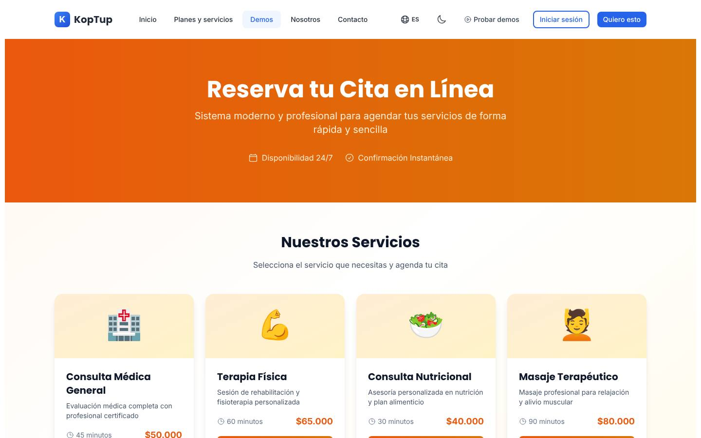
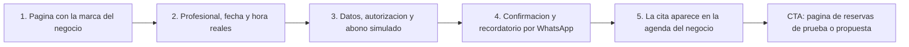

# Sistema de reservas y agendamiento

> Productividad (`productivity`) · Demo: `/demo/sistema-reservas` · Modo de acceso recomendado: `publico` (versión con la marca, los servicios y los profesionales del prospecto por `solicitud`) · Prioridad: **P2** (las correcciones visibles son P1 en Fase 1 porque la demo está enlazada desde el inicio y el footer) · Esfuerzo total: **XL** (≈ 6–7 semanas de 1 dev senior para dejar landing + demo vendibles; las correcciones de Fase 1 son S; el producto real se estima aparte)

*Captura actual de `/demo/sistema-reservas` (vista pública). Ver también [Sistema de demos](04-Sistema-de-Demos.md), [Catálogo de productos](08-Catalogo-de-Productos.md) y [Roadmap](12-Roadmap.md). Productos relacionados: [Telemedicina](Producto-telemedicina.md), [Sistemas RAG](Producto-chatbot-rag-ia.md), [Programa de fidelización](Producto-loyalty-fidelizacion.md), [POS retail](Producto-pos-retail.md), [CRM con IA](Producto-crm-ia.md) y [Facturación electrónica](Producto-facturacion-electronica.md).*

> **Contexto de posicionamiento:** con el reposicionamiento de Koptup en sistemas RAG (ver [Visión de producto](02-Vision-de-Producto.md)), este producto queda dentro de **"Otras soluciones a medida"**. Tiene una conexión natural con el producto principal: el **agendamiento por WhatsApp con un asistente** que responde las preguntas del negocio con sus propios documentos (precios, preparación para un procedimiento, políticas) y agenda la cita. Ese complemento es el argumento para no competir solo como "otra agenda en línea".

---

## Resumen

**Problema:** clínicas, centros de estética, canchas, academias y talleres pasan el día agendando por WhatsApp y por teléfono, con agendas en cuaderno o en Excel que se cruzan entre profesionales y sedes. Los clientes reservan y no llegan (las ausencias son una de las mayores fugas de ingresos de estos negocios), no hay abono anticipado y nadie mide la ocupación.

**Para quién (cliente ideal en Colombia/LATAM):**
- Clínicas odontológicas, de estética y de fisioterapia con 2 o más sedes y varios profesionales.
- IPS ambulatorias, laboratorios y centros de imágenes que agendan por profesional y por equipo (con [Telemedicina](Producto-telemedicina.md) para la consulta virtual).
- Centros deportivos, canchas sintéticas, academias y gimnasios con clases de cupo limitado.
- Cadenas de spa, peluquería y barbería; talleres y concesionarios con citas de servicio; salas, auditorios y coworking.

**Para quién no (decirlo en la landing):** un consultorio o una barbería independiente con una sola agenda; las herramientas de agenda en línea existentes (gratuitas o de bajo costo) le sirven. Koptup entra cuando hay varias sedes o profesionales, reglas propias (abonos, paquetes, recursos compartidos), marca propia o integración con los sistemas del negocio.

**Propuesta de valor:** "Tu agenda llena y sin ausencias. Reservas en línea con tu marca, abono anticipado con PSE, Nequi o tarjeta y recordatorios por WhatsApp con botón de confirmar, conectado a los calendarios de tus profesionales y a tus sistemas."

---

## Estado actual

| Aspecto | Estado | Evidencia |
|---|---|---|
| Demo | Existe. **Maqueta** 100 % en el navegador: un solo componente `'use client'`, sin `fetch`, `axios` ni llamadas a `/api` | `apps/web/src/app/demo/sistema-reservas/page.tsx` |
| Pantallas | 3 vistas controladas por el estado `view`: **Pública** (hero "Reserva tu Cita en Línea", 4 servicios con emoji, duración y precio, botón "Panel de Administración") · **Reserva en 4 pasos** (Fecha con calendario mensual y botones Mes/Semana; Hora con 21 franjas de 30 min entre 8:00 y 18:00, 4 ocupadas; Datos: nombre, email, teléfono, comentarios; Confirmación) · **Panel** (filtros por fecha, servicio y estado; tabla de reservas; modal de detalle con cambio de estado y notas) | `page.tsx` |
| Datos | 4 servicios fijos: consulta médica general $50.000, terapia física $65.000, consulta nutricional $40.000, masaje terapéutico $80.000, con emojis como imagen. 5 reservas del 30 y 31 de **enero de 2024**. Franjas ocupadas fijas (`occupiedSlots`) | `page.tsx` (`services`, `bookings`, `occupiedSlots`) |
| Backend | **Ninguno.** No hay módulo de reservas en `apps/backend/src/modules/` ni rutas relacionadas | búsqueda en `apps/backend/src` |
| i18n ES/EN | Namespace `reservations` (66 claves) dentro de `messages/es.json` y `en.json`, que se envían a todas las páginas del sitio; no existe `messages/demos/sistema-reservas.*.json`. Texto fijo en el código: servicios, descripciones, duraciones, precios, nombres de meses y días, la etiqueta "Email" y la etiqueta del teléfono | `page.tsx` |
| Tests | **Ninguno** (no hay carpeta `__tests__`) | |
| Tamaño | 962 líneas (page 940 + layout 22) | `wc -l` |
| SEO | Metadata `demo-sistema-reservas` promete "recordatorios por email/SMS", "Integración con Google Calendar", "Multi-usuario", "Ideal para consultorios, spas, restaurantes" y "Prueba gratis" | `apps/web/src/lib/seo-config.ts` |
| Visibilidad | **Alta:** tarjeta "Sistema de Reservas" en el inicio (`apps/web/src/app/page.tsx`), enlace "Sistema Reservas" en el footer (`apps/web/src/components/layout/Footer.tsx`), hub `/demo` y calendario del generador de LinkedIn Ads | |
| CTA | Solo el `DemoCTA` genérico del layout de `/demo` | `apps/web/src/components/demo/DemoCTA.tsx` |
| Catálogo | Mapeo correcto: offering `sistema-reservas` → demo `sistema-reservas`. Categoría con tres nombres: "Productividad" (catálogo), "Servicios" (inicio) y "Calendario" (hub) | `services-catalog.ts`, `messages/es.json` (`homePage.demos.reservations`, `demos.reservations`) |

**Lo que hace bien:** el flujo se entiende sin explicación (servicio → fecha → hora → datos → confirmación) y tiene indicador de pasos; muestra las dos caras del producto, la del cliente que reserva y la del negocio que administra; los filtros del panel funcionan sobre los datos; el cambio de estado en el modal de detalle funciona; se navega entre meses; precios en pesos y teléfono con +57.

### Problemas detectados (con ruta)

1. **Fecha equivocada en la confirmación:** al elegir un día, el código arma `` `2024-01-${day}` `` (`page.tsx`), sin importar el mes que se esté viendo. Quien navega a octubre de 2026 y elige el 15 recibe "2024-01-15 - 10:00".
2. **Calendario sin reglas:** se pueden elegir días pasados; el resaltado de "hoy" compara solo el número del día (`day === new Date().getDate()`) y aparece en cualquier mes; no hay festivos ni días de cierre.
3. **El botón "Semana" no hace nada:** `calendarView` solo cambia el estilo del botón; no existe una vista semanal.
4. **Disponibilidad irreal:** las mismas 4 franjas ocupadas para todos los días y servicios; franjas de 30 min aunque el masaje dure 90 (permite cruces); no se elige profesional, sede ni recurso, que es el corazón de un sistema de reservas.
5. **La reserva no se guarda:** los campos del paso Datos no tienen estado ni validación (se puede continuar vacío) y la confirmación no agrega nada al panel (`setBookings` no se llama al confirmar). El momento que más vende, ver la reserva aparecer en la agenda del negocio, no ocurre.
6. **Panel sin agenda:** solo una tabla; como las reservas son de enero de 2024, los filtros "Hoy", "Esta semana" y "Este mes" siempre salen vacíos; "Guardar Notas" no hace nada; no hay "asistió / no asistió" ni reprogramación.
7. **Sin autorización de tratamiento de datos (Ley 1581)** aunque pide nombre, correo y teléfono para servicios de salud, que implican datos sensibles; sin política de cancelación.
8. **Promesas sin demo:** el hub (`demos.reservations.features` en `messages/es.json`: "Recordatorios", "Pagos online"), el SEO ("recordatorios por email/SMS", "Integración con Google Calendar", "restaurantes", "Prueba gratis") y el catálogo (Básico: "Google Calendar 1 vía", "Email recordatorios", "Pasarela Stripe/Wompi") ofrecen pagos, recordatorios y sincronización que la demo no muestra.
9. **Negocio poco creíble:** consulta médica, nutrición y masaje en el mismo local, con emojis como imágenes; precios "$50.000" sin moneda; "Disponibilidad 24/7" y "Confirmación Instantánea" genéricos.
10. **Textos:** la etiqueta del teléfono se resuelve con `t('fullName').includes('Full') ? 'Phone' : 'Teléfono'`; "Email" está fijo; servicios, duraciones, meses y días están en español dentro del código, así que la versión en inglés queda mezclada; los botones de estado usan símbolos ("✓", "⏳", "✕") dentro del i18n.
11. **Código:** un componente de 940 líneas sin pruebas, con el i18n en el archivo global.
12. **Días del calendario aplastados:** usan `aspect-square`, que hoy no funciona por el plugin `@tailwindcss/aspect-ratio` (ver [WMS](Producto-wms-logistica.md), tarea 5).
13. **Textos del catálogo** (`apps/web/messages/offerings/sistema-reservas.es.json`): voseo ("Agendá", "Comprala", "pagá"); descripción de plantilla; `idealPara` sin sentido ("Equipos pequeños que recién arrancan con reservas con confirmación"); "Reportes mensuales del tier" **4 veces** en Enterprise (4 de sus 9 bullets), 1 en Profesional y 1 en Avanzado; "Pasarela Stripe/Wompi" y costos "Twilio + Stripe" (Stripe no está disponible para empresas constituidas en Colombia sin una entidad en el exterior); jerga ("Marketplace privado", "API GraphQL", "SIS/EHR adapter"); `costoNote` dice USD 20–6.000/mes mientras el catálogo dice USD 50–18.000; "Cuentas / tenants" no dice que aquí significa **sedes**.

---

## Qué falta para que sea vendible

- **Que funcione de verdad en el navegador:** fechas reales, días pasados y festivos bloqueados, y la reserva visible en la agenda del negocio al terminar.
- **Lo que hace distinto a un sistema de reservas:** elegir profesional, sede o recurso, con disponibilidad calculada según la duración del servicio.
- **Lo que reduce ausencias:** abono anticipado (simulado) con PSE, Nequi o tarjeta, recordatorio por WhatsApp con botón de confirmar o reprogramar y política de cancelación.
- **Agenda del negocio** por día y semana, por profesional, con "asistió / no asistió" e indicadores (ocupación, ausencias, ingresos).
- **Presets por sector** con datos colombianos creíbles (odontología, estética, canchas, salud ambulatoria, barbería) y sin emojis.
- **Cumplimiento visible:** autorización de datos (Ley 1581) y aviso de datos sensibles cuando aplica.
- **Coherencia** entre catálogo, SEO, hub y demo: no prometer nada que no se vea.
- **Una oferta de entrada clara:** "tu página de reservas de prueba con tu marca en 24 horas" como gancho comercial.
- Capturas, video de 60 s y CTA contextual "Quiero esta agenda para mi negocio".

---

## Plan detallado

### Landing `/productos/sistema-reservas`

Sigue la estructura común de [Landing de producto](Seccion-Landing-de-Producto.md):

1. **Hero:** "Tu agenda llena y sin ausencias". Subtítulo: "Reservas en línea con tu marca, abono anticipado con PSE o Nequi y recordatorios por WhatsApp, para todas tus sedes y profesionales." CTA principal **"Solicitar demo personalizada"** (propuesta: "Quiero ver mi página de reservas de prueba"); secundario "Agendar llamada"; enlace de texto "Probar la demo ahora" (modo `publico`).
2. **Problemas que resuelve** (3 tarjetas): "Se te va el día agendando por WhatsApp"; "Clientes que reservan y no llegan"; "Agendas por profesional y por sede que se cruzan".
3. **Cómo funciona** (4 pasos): diagnóstico de servicios, profesionales, sedes y reglas → configuración de tu página con tu marca y de los recordatorios → piloto de 2 semanas en una sede → todas las sedes y acompañamiento mensual.
4. **Módulos con "Incluido desde":** Página de reservas con tu marca y enlace para Instagram y WhatsApp (Básico) · Agenda por profesional y recurso (Básico) · Abonos en línea (Básico) · Confirmación por correo y sincronización con Google Calendar (Básico) · Recordatorios por WhatsApp con confirmar/reprogramar (Profesional) · Videollamada automática para citas virtuales (Profesional) · Lista de espera y políticas de cancelación (Profesional) · Multisede, franquicias y recursos compartidos (Avanzado) · Paquetes y membresías (Avanzado) · Agendamiento por WhatsApp con asistente IA (Avanzado, complemento basado en los [Sistemas RAG](Producto-chatbot-rag-ia.md)) · Integración con historia clínica (Enterprise).
5. **Capturas** (galería de 6: página de reservas, elección de profesional y hora, pago del abono, mensaje de WhatsApp, agenda semanal del negocio, indicadores) y **video de 60 s** del recorrido.
6. **Integraciones:** Google Calendar, Outlook/Microsoft 365 y Apple Calendar; WhatsApp Business Platform; Wompi, PayU o Mercado Pago (PSE, Nequi, Daviplata, tarjetas); Zoom o Google Meet; Siigo, Alegra o [Facturación electrónica](Producto-facturacion-electronica.md) para facturar el servicio; [CRM con IA](Producto-crm-ia.md) o HubSpot; [POS retail](Producto-pos-retail.md) y [Programa de fidelización](Producto-loyalty-fidelizacion.md); sistemas de historia clínica (Enterprise).
7. **Planes y precios:** "Compra / a medida" en COP con "desde"; SaaS como **"Lista de espera"** (DECISIÓN 7).
8. **Preguntas frecuentes:** ¿Puedo cobrar un abono para evitar ausencias? · ¿Los recordatorios por WhatsApp tienen costo? (sí: tarifas de Meta, cobradas al costo) · ¿Se sincroniza con el calendario de cada profesional? · ¿Puedo tener varias sedes con horarios distintos? · ¿Cómo cumple la Ley 1581? · ¿Sirve para salud? (sí para agendar; la historia clínica no se guarda aquí) · ¿Puedo usar mi dominio? · ¿El código es mío?
9. **CTA final** con el formulario "Solicitar demo" con `sistema-reservas` preseleccionado y campos extra opcionales: sector, número de sedes, número de profesionales, reservas al mes, cómo agenda hoy; y carga opcional del logo para la página de prueba.

### Demo interactiva (mejoras por pantalla/módulo)

**Estructura nueva:** dividir `page.tsx` en componentes (`PublicPage`, `BookingWizard`, `BusinessPanel`) con un estado compartido (`useReducer` + context) para que lo que reserva el cliente aparezca en el panel. Cambiar el botón "Panel de Administración" por un selector fijo **"Vista cliente / Vista negocio"**.

| Pantalla / componente | Agregar | Quitar / corregir | Datos de ejemplo |
|---|---|---|---|
| Datos base (`fixtures/<sector>.ts`) | Reservas semilla con fechas relativas a hoy (esta semana y la próxima); profesionales con horarios; sedes; festivos de Colombia calculados según la Ley Emiliani | Reservas de enero de 2024; `occupiedSlots` fijas | Preset "Odontología": "Clínica Dental Sonrisa Norte" (ficticia; verificar en el RUES), sedes Chapinero y Cedritos en Bogotá |
| Página pública | Encabezado con logo y nombre del negocio; selector de sede; servicios con ícono o foto de stock con licencia, "desde $" en COP, duración y abono; "Elegir profesional" o "El primero disponible" | Emojis como imagen; "Disponibilidad 24/7" y "Confirmación Instantánea"; botón "Panel de Administración" | Valoración $60.000 (30 min) · Limpieza dental $140.000 (45 min) · Blanqueamiento $650.000 (90 min, abono 30 %) · Control de ortodoncia $90.000 (20 min) |
| Paso Fecha | Calendario del mes con fechas reales; días pasados deshabilitados; festivos y cierres marcados; días sin cupo en gris; **vista semanal real** con franjas | Fecha armada como `2024-01-DD`; resaltado de "hoy" en todos los meses | Festivos visibles en el mes mostrado (p. ej. lunes 12 de octubre y lunes 2 y 16 de noviembre de 2026) |
| Paso Hora | Franjas calculadas con la duración del servicio + tiempo de alistamiento, el horario del profesional y las reservas existentes; zona horaria `America/Bogota`; "Quedan 2 cupos" en servicios por cupo (clases) | Mismas 4 horas ocupadas para todo | Lunes a viernes 7:00 a. m.–7:00 p. m., sábados 8:00 a. m.–1:00 p. m. |
| Paso Datos | Campos con estado y validación (nombre, celular colombiano de 10 dígitos, correo); autorización de tratamiento de datos obligatoria (Ley 1581) y aviso de datos sensibles en presets de salud; política de cancelación visible | Etiqueta del teléfono con `includes('Full')`; "Email" fijo | — |
| **Paso Pago** (nuevo) | Abono o pago total con pasarela **simulada** (PSE, Nequi, tarjeta) o "Pagar en el sitio", con aviso "Simulación: no se hace ningún cobro" | — | Abono de $42.000 (30 % de la limpieza) |
| Confirmación | Fecha legible ("jueves 15 de octubre de 2026, 10:00 a. m."), profesional, sede y dirección; botón "Añadir a mi calendario" (.ics); **vista previa del WhatsApp** de confirmación y del recordatorio 24 h antes con botones "Confirmar" / "Reprogramar"; vista previa del correo | Fecha en formato `2024-01-15` | Mensaje: "Hola Juliana, te esperamos mañana a las 10:00 a. m. en Sonrisa Norte Cedritos…" |
| Panel del negocio | **Agenda** por día y semana con una columna por profesional; la reserva nueva aparece resaltada; reprogramar arrastrando; marcar "Llegó" / "No asistió"; notas que se guardan; lista de espera; filtros con fechas reales | Solo tabla; "Guardar Notas" sin acción; filtros siempre vacíos | 3 profesionales: Dra. Laura Méndez (ortodoncia), Dr. Andrés Rojas (general), Paola Gómez (higienista) |
| **Indicadores** (nuevo, en el panel) | Ocupación de la semana, ausencias del mes, ingresos y abonos recibidos, servicios más reservados, reservas por canal (página, WhatsApp, teléfono) | — | Ocupación 78 %, ausencias 6 %, abonos $3,1 M en el mes (etiqueta "Datos de ejemplo") |
| Global | Aviso "Datos de ejemplo"; banner "¿La quieres con tu marca y tus servicios? Pide tu página de reservas de prueba"; botón "Iniciar recorrido"; CTA final "Solicitar propuesta" | `DemoCTA` genérico | — |

**Recorrido guiado (5 pasos, menos de 3 minutos):**

> [Ver diagrama como imagen](images/diagramas/Producto-sistema-reservas-1.png)

1. **Página pública:** elegir "Limpieza dental" en la sede Cedritos con la higienista Paola Gómez.
2. **Fecha y hora:** el calendario muestra el festivo como cerrado; elegir el jueves a las 10:00 a. m. entre las franjas que quedan.
3. **Datos y abono:** completar los datos, aceptar la autorización y pagar el abono de $42.000 con PSE (simulado).
4. **Confirmación:** ver el mensaje de WhatsApp de confirmación y el recordatorio que llegará 24 horas antes con "Confirmar" o "Reprogramar".
5. **Vista negocio:** la cita aparece resaltada en la agenda de Paola; marcar otra cita como "No asistió" y ver cómo cambian los indicadores. Cierre con CTA "Pide tu página de reservas de prueba" / "Solicitar propuesta".

### Acceso y solicitud de demo

- **Modo recomendado: `publico`** con banner "Solicita tu demo guiada". Razones: el producto tiene una cara pública por naturaleza (la página que usan los clientes del negocio); ya está enlazada desde el inicio y el footer; los datos son de ejemplo y no sensibles; se entiende en 3 minutos y atrae a muchos negocios pequeños y medianos como imán de leads.
- **Versión personalizada por `solicitud`: "tu página de reservas de prueba en 24 horas".** El prospecto envía logo, servicios y profesionales en el formulario; el admin la configura sin código y la aprueba. Duración: **14 días**, extensible 7. Es la herramienta comercial más fuerte del producto: el dueño del negocio la comparte con sus socios y la prueba con su propio celular.
- **Qué ve el visitante antes de solicitar:** la demo completa con datos de ejemplo, más la landing con capturas y el video de 60 s. La demo pública no pide registro.
- **Formulario:** el general de [Sistema de demos](04-Sistema-de-Demos.md) más sector, sedes, profesionales, reservas al mes, cómo agenda hoy y logo (opcional).
- **Prospecto aprobado** (Portal › Mis demos, ver [Portal del cliente](06-Portal-del-Cliente.md)): tarjeta "Reservas — <Negocio>" con días restantes, botones "Abrir mi página de reservas de prueba" y "Abrir panel del negocio", "Invitar a mi equipo" (hasta 3 usuarios) y CTA "Solicitar propuesta" / "Agendar llamada".
- **Eventos `DemoEvent`:** pasos del flujo completados, reservas creadas, cambio a "Vista negocio", presets usados, clic en banner y CTA; en la versión personalizada, número de reservas de prueba hechas por el equipo del prospecto.

### Personalización por cliente

Sin código, desde **Admin › Solicitudes de demo › Aprobar** (o Admin › Demos › Personalizar), guardado en `DemoGrant.personalizacion`. Ver [Panel de administración](05-Panel-de-Administracion.md).

| Campo | Efecto en la demo |
|---|---|
| Logo y color primario | Página pública, botones, mensajes de WhatsApp y correo de ejemplo |
| Nombre del negocio | Encabezado, confirmación y mensajes |
| Sector (preset) | Dataset completo: Odontología · Estética y spa · Canchas y centros deportivos · Salud ambulatoria (consulta y terapia física) · Barbería y peluquería |
| Servicios (hasta 6: nombre, duración, precio, abono) | Catálogo de la página pública y cálculo de franjas |
| Profesionales o recursos (hasta 4) | Selección en la reserva y columnas de la agenda |
| Sedes (hasta 3, con dirección) | Selector de sede y confirmación |
| Horario de atención | Disponibilidad y días cerrados |
| Cobro (abono, pago total o pago en el sitio) | Paso Pago |
| Canal de recordatorio (WhatsApp y/o correo) | Vistas previas en la confirmación |
| Plan cotizado | Muestra solo los módulos incluidos; el resto aparece bloqueado con "Disponible en plan X" |
| Idioma (es / en) | Textos, fechas y moneda |

**Implementación:** mover servicios, reservas, profesionales y horarios a `apps/web/src/app/demo/sistema-reservas/fixtures/<sector>.ts`; mover el namespace `reservations` a `messages/demos/sistema-reservas.{es,en}.json`; la página lee la configuración de `GET /api/demo-access/sistema-reservas` (DECISIÓN 3) cuando hay grant y usa el preset genérico cuando es pública. El logo subido por el prospecto se guarda con los demás archivos del grant, no en el repositorio.

### Producto real

**Alcance MVP — modalidad compra (plan Profesional; 8–12 semanas reales, porque no existe base):**
- **Catálogo y recursos:** servicios con duración, precio, abono y tiempo de alistamiento; profesionales, salas o equipos con horarios, excepciones, vacaciones y festivos de Colombia; sedes.
- **Motor de disponibilidad:** sin doble reserva (bloqueo transaccional de la franja), zona horaria `America/Bogota`, servicios por cupo (clases) y por recurso.
- **Reserva:** página pública con la marca del cliente y su dominio, widget embebible y enlace para Instagram y WhatsApp; datos mínimos, autorización de tratamiento de datos (Ley 1581) y consentimiento explícito cuando haya datos sensibles.
- **Pagos:** abono o pago total con Wompi o PayU (PSE, Nequi, Daviplata, tarjetas) con conciliación por webhook; reembolsos según la política de cancelación.
- **Comunicación:** confirmación y recordatorios por correo y por WhatsApp Business Platform (plantillas de utilidad aprobadas por Meta, con botones confirmar/reprogramar); SMS opcional.
- **Agenda del negocio:** día y semana por profesional, reprogramar, asistió/no asistió, lista de espera, notas.
- **Calendarios:** sincronización con Google Calendar y Outlook de cada profesional.
- **Reportes:** ocupación, ausencias, ingresos por servicio, profesional y sede.
- **Integraciones típicas en Colombia:** facturación electrónica del servicio a través de Siigo, Alegra o [Facturación electrónica](Producto-facturacion-electronica.md); CRM; POS; videollamada (Zoom/Meet) o [Telemedicina](Producto-telemedicina.md) para citas virtuales de salud.
- **Transversal:** roles (dueño, recepción, profesional) con autorización en servidor, auditoría, exportación de datos, copias de seguridad; apoyo al cliente con su política de tratamiento de datos y su aviso de privacidad.
- **No incluye:** historia clínica ni datos clínicos (eso es de su sistema de salud; se integra en Enterprise).

**SaaS (DECISIÓN 7):** no hay base multi-tenant ni cobro recurrente → **"SaaS: lista de espera"**. Es el producto donde el mercado más espera una suscripción mensual, así que es candidato a SaaS después del chatbot RAG y de [Gestión de proyectos](Producto-gestion-proyectos.md). Requisitos (Fase 4): multi-tenant con aislamiento por negocio, subdominio o dominio propio por cliente, alta en autoservicio con asistente de configuración, cobro recurrente con Wompi o PayU (COP) y Stripe (USD), número de WhatsApp por cliente (o compartido con plantillas de marca), medición de reservas y mensajes contra el plan, y acuerdo de encargo de tratamiento de datos.

**Complemento RAG (Fase 4, después del SaaS del chatbot):** agendamiento conversacional por WhatsApp: el asistente responde con los documentos del negocio (preparación para un procedimiento, precios, políticas) y consulta y crea la reserva con el motor de disponibilidad.

### Planes y precios

Precios actuales del catálogo (`apps/web/src/lib/services-catalog.ts`, entrada `sistema-reservas`; COP):

| Plan | Compra: setup | Compra: mantenimiento/mes | SaaS: setup | SaaS: mes | Volumen incluido | Usuarios admin / clientes finales / sedes | Implementación (catálogo) | Costos del cliente al proveedor (USD/mes) |
|---|---|---|---|---|---|---|---|---|
| Básico | $32.000.000 | $2.900.000 | $2.900.000 | $1.090.000 | 500 reservas/mes | 3 / 500 / 1 | 2–5 semanas | 50–200 (hosting, base de datos, correo, SMS básico) |
| Profesional | $81.000.000 | $7.200.000 | $6.900.000 | $2.590.000 | 8.000 reservas/mes | 15 / 10.000 / 5 | 5–9 semanas | 300–1.200 (+ correo Pro, mensajería, pasarela) |
| Avanzado | $189.000.000 | $16.200.000 | $12.900.000 | $4.990.000 | 60.000 reservas/mes | 40 / 75.000 / 25 | 9–14 semanas | 1.500–5.000 (multisede, comunicaciones omnicanal) |
| Enterprise | $405.000.000 | $31.500.000 | $0 (se muestra "Personalizado") | $8.890.000 | 500.000+ reservas/mes | Ilimitados | 12–20 semanas | 5.000–18.000 (multipaís, omnicanal, recuperación ante desastres) |

Almacenamiento: 5 GB / 50 GB / 250 GB / ilimitado. Horas de evolutivos incluidas por mes: 5 / 12 / 25 / 50. Soporte: correo 24 h hábiles / + WhatsApp 4 h / + Slack Connect 2 h / tickets con SLA 1 h. Ciclos SaaS: semestral −10 %, anual −20 %. Referencia en USD con TRM 3.300: setup de compra ≈ USD 9.700 / 24.550 / 57.270 / 122.730; SaaS ≈ USD 330 / 780 / 1.510 / 2.690 al mes.

**Recomendaciones de claridad:**
1. **Frente al mercado:** hay agendas en línea desde gratis hasta unas decenas de dólares al mes. El Básico de Koptup (≈ USD 330 al mes en SaaS o $32 M en compra) solo se justifica con varias sedes o profesionales, abonos, marca propia, WhatsApp e integraciones. La landing debe decirlo en una tabla "Agenda genérica vs Koptup" y orientar a los negocios de una sola agenda hacia otra solución (o hacia la lista de espera del SaaS).
2. **Mantenimiento incoherente:** 12 × $2,9 M = $34,8 M al año (109 % del setup Básico) y es 2,7 veces la cuota SaaS ($1,09 M). A 3 años, la compra Básica cuesta $136,4 M y el SaaS $42,1 M. Aplicar la política común de mantenimiento de [Catálogo de productos](08-Catalogo-de-Productos.md).
3. **SaaS → "Lista de espera"** hasta la Fase 4. Para cuando exista, **decisión del dueño:** precio por sede o por profesional activo, más mensajes de WhatsApp al costo, en lugar de 4 planes por volumen.
4. **Pasarelas correctas:** reemplazar "Stripe/Wompi" por **"Wompi o PayU (PSE, Nequi, tarjetas)"** en COP; Stripe solo para clientes que cobran en USD con entidad en el exterior.
5. **Bullets en lenguaje de cliente.** Propuesta: **Básico** "1 sede, 3 usuarios del negocio y hasta 500 reservas al mes · Página de reservas con tu marca y enlace para WhatsApp e Instagram · Agenda por profesional · Abonos en línea con PSE, Nequi o tarjeta · Confirmación y recordatorio por correo · Sincronización con Google Calendar". **Profesional** "+ Hasta 5 sedes y 8.000 reservas al mes · Recordatorios por WhatsApp con confirmar o reprogramar · Outlook y Apple Calendar · Videollamada automática · Lista de espera y políticas de cancelación · Conexión con tu CRM". **Avanzado** "+ Hasta 25 sedes y 60.000 reservas al mes · Franquicias y recursos compartidos (salas, equipos, canchas) · Paquetes y membresías · Reportes por sede · API para tus sistemas · Agendamiento por WhatsApp con asistente IA". **Enterprise** "+ Sedes ilimitadas · Integración con historia clínica · Disponibilidad desde tu ERP o sistema de RR. HH. · Gerente de proyecto dedicado · Soporte con SLA de 1 hora".
6. **Límites que se entiendan:** "Cuentas / tenants" → **"Sedes"**; "Usuarios finales" → **"Clientes registrados"**.
7. **Tiempos:** sin base existente, el primer cliente toma más que 2–5 semanas; ajustar a 6–8 / 8–12 / 12–18 / 16–24 semanas con el override por offering y bajarlos cuando exista el motor reutilizable.
8. Quitar los 4 "Reportes mensuales del tier" de Enterprise y los demás duplicados, usar tuteo, descripción propia, `idealPara` real (p. ej. Básico: "Clínicas, centros de estética y academias con una sede y hasta 3 profesionales") y `costoNote` con el rango del catálogo (USD 50–18.000) explicando que WhatsApp se cobra al costo según tarifas de Meta.
9. Unificar la categoría: "Agenda y reservas" en catálogo, inicio y hub (hoy "Productividad", "Servicios" y "Calendario").

Detalle de la política comercial común en [Catálogo de productos](08-Catalogo-de-Productos.md) y [Comercial, marketing y legal](11-Comercial-Marketing-y-Legal.md).

---

## Tareas

| # | Tarea | Fase | Prioridad | Esfuerzo | Criterio de aceptación |
|---|---|---|---|---|---|
| 1 | Correcciones visibles: fecha según el mes y año navegados (quitar `2024-01-`), días pasados bloqueados, "hoy" solo en el mes actual, reservas semilla con fechas relativas, la reserva confirmada aparece en el panel, validación mínima de datos, etiquetas de teléfono y correo por i18n | Fase 1 — Funnel y solicitud de demos | P1 | S | Elegir el 15 del mes siguiente confirma esa fecha exacta; la reserva nueva se ve en el panel; el filtro "Esta semana" nunca sale vacío |
| 2 | Textos del offering (pasarelas Wompi/PayU, sin los 4 duplicados de Enterprise, tuteo, `idealPara`, `costoNote` = USD 50–18.000) en ES y EN; hub y SEO sin promesas que la demo no muestra ("Prueba gratis", "SMS", "restaurantes"); categoría unificada | Fase 1 — Funnel y solicitud de demos | P1 | S | Ninguna función mencionada en hub, SEO o Básico está ausente de la demo; `sistema-reservas.{es,en}.json` sin bullets repetidos |
| 3 | Landing `/productos/sistema-reservas` con las 9 secciones y la tabla "Agenda genérica vs Koptup" | Fase 1 — Funnel y solicitud de demos | P1 | M | Página publicada; el formulario llega con el producto preseleccionado y los campos de sedes y profesionales |
| 4 | Registrar `DemoCatalogItem` `sistema-reservas` en modo `publico` con banner y la oferta "página de reservas de prueba" por solicitud (14 días) | Fase 1 — Funnel y solicitud de demos | P1 | S | La demo abre sin registro con banner; con grant carga la marca y los servicios del prospecto, verificado en servidor |
| 5 | Dividir `page.tsx` (940 líneas) en `PublicPage`, `BookingWizard` y `BusinessPanel` con estado compartido; mover `reservations` a `messages/demos/sistema-reservas.*.json`; smoke test | Fase 0 — Endurecimiento | P2 | M | `messages/es.json` sin el namespace `reservations`; smoke test en CI; ningún archivo del demo supera 300 líneas |
| 6 | Motor de disponibilidad simulado (profesionales, recursos, sedes, duración + alistamiento, horarios, festivos de Colombia, reservas existentes) y vista semanal real | Fase 2 — Demos vendibles | P1 | M | Un servicio de 90 min no deja reservar franjas que se crucen; los festivos aparecen cerrados; "Semana" muestra 7 días con franjas |
| 7 | Paso Pago simulado (abono, pago total, pago en el sitio), autorización Ley 1581 con aviso de datos sensibles, política de cancelación, confirmación con fecha legible, archivo .ics y vistas previas de WhatsApp y correo | Fase 2 — Demos vendibles | P1 | M | No se puede confirmar sin aceptar la autorización; el .ics abre en Google Calendar con la fecha y hora correctas |
| 8 | Panel del negocio: agenda día/semana por profesional, reprogramar arrastrando, "Llegó"/"No asistió", notas que se guardan, lista de espera e indicadores | Fase 2 — Demos vendibles | P1 | M | Marcar "No asistió" actualiza el indicador de ausencias; las notas persisten durante la sesión |
| 9 | Presets por sector (odontología, estética y spa, canchas, salud ambulatoria, barbería) en `fixtures/` con COP, nombres ficticios verificados y sin emojis | Fase 2 — Demos vendibles | P1 | M | Cambiar de preset cambia servicios, profesionales, horarios y textos; ningún emoji como imagen |
| 10 | Personalización desde `DemoGrant` (logo, color, negocio, servicios, profesionales, sedes, horario, cobro, recordatorio, plan) configurable desde el admin en < 15 min | Fase 2 — Demos vendibles | P1 | M | El comercial publica una página de reservas de prueba con la marca del prospecto en menos de 24 h desde la solicitud |
| 11 | Recorrido guiado de 5 pasos, aviso "Datos de ejemplo", 6 capturas y video de 60 s | Fase 2 — Demos vendibles | P1 | S | Recorrido completable en < 3 min; capturas en `docs/wiki/images/` y en la landing |
| 12 | Plantilla de propuesta en el `Quote` ampliado con calculadora por sedes, profesionales, reservas y mensajes de WhatsApp | Fase 3 — Propuestas y conversión | P2 | S | El comercial genera la propuesta en PDF con costo mensual estimado de WhatsApp en < 20 min |
| 13 | Base real: motor de reservas multi-tenant (servicios, recursos, disponibilidad sin doble reserva, Wompi/PayU con webhook, WhatsApp Business Platform, Google Calendar) con autorización en servidor | Fase 4 — Productos SaaS reales | P2 | XL | Un cliente piloto recibe reservas reales con abono durante 30 días sin dobles reservas ni pagos sin conciliar |
| 14 | Complemento RAG: agendamiento conversacional por WhatsApp sobre el motor de reservas y el chatbot RAG | Fase 4 — Productos SaaS reales | P2 | L | En una prueba con 50 conversaciones, ≥ 80 % de las citas solicitadas por WhatsApp quedan agendadas sin intervención humana |
| 15 | Caso de estudio del primer cliente (antes/después en ausencias y tiempo dedicado a agendar) | Fase 5 — Escala | P3 | S | Caso publicado con cifras reales y autorización escrita del cliente |

---

## Métricas de éxito

Son **metas** iniciales a validar con datos reales; no son resultados actuales.

- ≥ 35 % de las sesiones que empiezan una reserva en la demo pública la terminan, y ≥ 50 % de ellas pasan a "Vista negocio".
- Clic en el banner "Pide tu página de reservas de prueba" ≥ 3 % de las sesiones; conversión a solicitud enviada ≥ 2 %.
- ≥ 50 % de las solicitudes con 2 o más sedes o 4 o más profesionales (lead que justifica una solución a medida).
- Página de reservas de prueba publicada en < 24 h para el 90 % de las solicitudes aprobadas.
- ≥ 30 % de las demos personalizadas terminan en propuesta en ≤ 21 días.
- 0 fechas de 2024 y 0 reservas que no aparecen en el panel (prueba automatizada del flujo completo).
- Primer contrato en los 6 meses siguientes a la Fase 2; ≥ 30 negocios en la lista de espera del SaaS antes de decidir su construcción.
