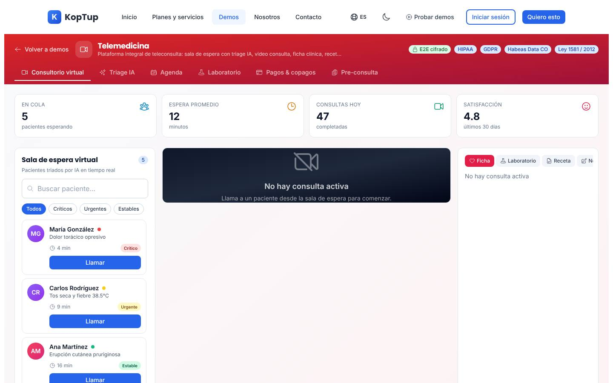
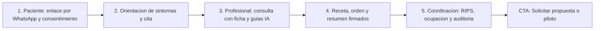

# Plataforma de telemedicina para IPS

> Salud (`healthcare`) · Demo: `/demo/telemedicina` · Modo de acceso recomendado: `solicitud` (con sesión guiada obligatoria) · Prioridad: **P2** · Esfuerzo total: **XL** (≈ 9 semanas de 1 dev senior para landing + demo vendible; el producto real se estima aparte)

*Captura actual de `/demo/telemedicina` (Consultorio virtual sin consulta activa). Ver también [Sistema de demos](04-Sistema-de-Demos.md), [Catálogo de productos](08-Catalogo-de-Productos.md) y [Roadmap](12-Roadmap.md). Relacionados: [Chatbot RAG](Producto-chatbot-rag-ia.md) (guías clínicas con IA y landing `/rag/salud`), [Demo de cuentas médicas](Demo-cuentas-medicas.md) (auditoría de lo facturado), [Facturación electrónica](Producto-facturacion-electronica.md) (factura en salud y RIPS), [Sistema de reservas](Producto-sistema-reservas.md) (agenda) y [Firma electrónica](Producto-firma-electronica.md).*

---

## Resumen

**Problema:** muchas IPS, consultorios y programas de crónicos en Colombia hacen "telemedicina" con videollamadas de WhatsApp o Meet, citas por teléfono, consentimientos que no quedan registrados, recetas enviadas como foto y cobros por transferencia. No hay trazabilidad para la habilitación del servicio, el registro de la atención queda incompleto y la facturación (cuota moderadora, copago, RIPS) se arma a mano después.

**Para quién (cliente ideal en Colombia/LATAM):**
- **IPS ambulatorias** de medicina general y especializada (5–80 profesionales) que quieren habilitar o formalizar la modalidad de telemedicina.
- **Salud mental** (psicología y psiquiatría), donde la teleconsulta tiene la mayor adopción.
- **Programas de crónicos** (hipertensión, diabetes, EPOC) con controles periódicos y seguimiento remoto.
- **Medicina laboral / prepagadas / redes de consultorios** que atienden pacientes en varias ciudades.

**Propuesta de valor:** "Teleconsulta con tu marca, desde el navegador y sin que el paciente instale nada: agenda con recordatorios por WhatsApp, consentimiento informado, registro de la atención, receta y órdenes firmadas, pago en línea y RIPS listos para facturar. Con auditoría de cada acceso." A la medida de la IPS e integrable con su historia clínica actual.

**Encaje con el reposicionamiento RAG:** en el sitio nuevo este producto queda en **"Otras soluciones a medida"**, pero comparte vertical con la landing `/rag/salud` y con la demo privada de [cuentas médicas](Demo-cuentas-medicas.md), donde Koptup sí tiene experiencia real en salud. El puente con el producto principal es un panel **"Guías clínicas con IA"** dentro de la consulta: un RAG sobre protocolos internos y guías de la IPS que responde con la fuente citada (apoyo documental, no diagnóstico). Así la telemedicina se vende como canal y el RAG como complemento.

---

## Estado actual

| Aspecto | Estado | Evidencia |
|---|---|---|
| Demo | Existe. **Maqueta** 100 % en el navegador | `apps/web/src/app/demo/telemedicina/page.tsx` es `'use client'`; no hay `fetch`, `axios` ni llamadas a `/api` en la carpeta |
| Pantallas | Cabecera con badges de cumplimiento + 4 KPIs + 6 pestañas: **Consultorio virtual** (sala de espera con 5 pacientes, filtros por prioridad, videollamada simulada con controles, chat, panel Ficha / Laboratorio / Receta / Notas, registro de auditoría), **Triage IA**, **Agenda**, **Laboratorio**, **Pagos & copagos**, **Pre-consulta** (formulario + editor de receta) | `page.tsx`, `components/TriagePanel.tsx`, `SchedulingPanel.tsx`, `LabBillingPanels.tsx`, `PreconsultForm.tsx`, `PrescriptionEditor.tsx`, `PatientRecordPanel.tsx` |
| Datos | Fijos: 5 pacientes con cédula/TI, EPS reales y signos "de wearable"; 8 resultados de laboratorio compartidos por todos; 4 cobros; fechas fijas de 2026 | `components/mockData.ts`, `LabBillingPanels.tsx` (`billing`), `PrescriptionEditor.tsx` (`rxHistory`) |
| Backend | Módulo en memoria `apps/backend/src/modules/telemedicine/` (Consultation, Prescription, `startSession`; 176 líneas con test) **no montado** en `apps/backend/src/index.ts`; el frontend no lo usa | `telemedicine.service.ts`, `telemedicine.types.ts`, `telemedicine.routes.ts` |
| i18n ES/EN | Textos de UI en `apps/web/messages/demos/telemedicina.{es,en}.json` (280 líneas c/u). Fijos en español en el código: recomendaciones del triage, respuestas del paciente en el chat, entradas de auditoría, "Modalidad", "Editor completo de receta disponible en la pestaña…", "Abrir editor" | `TriagePanel.tsx`, `page.tsx`, `SchedulingPanel.tsx` |
| Tests | 1 smoke test (`__tests__/page.test.tsx`, 11 líneas) que hoy no se ejecuta (ver [Seguridad y calidad](10-Seguridad-y-Calidad.md)) | |
| Tamaño | 1.680 líneas (page 622 + 8 archivos de componentes 1.025 + layout 22 + test 11) | `wc -l` |
| SEO | Metadata `demo-telemedicina` en `apps/web/src/lib/seo-config.ts` + breadcrumb JSON-LD en `layout.tsx` | |
| CTA | Solo el `DemoCTA` genérico del layout de `/demo` | `apps/web/src/app/demo/layout.tsx` |
| Catálogo | Mapeo correcto: offering `telemedicina` → demo `telemedicina` | `services-catalog.ts` (entrada 12) |

**Lo que hace bien:** es el más "operativo" de su grupo. La sala de espera con prioridades por color, búsqueda y filtros funciona; "Llamar" inicia cronómetro, chat y ficha del paciente; el **registro de auditoría** se llena con cada acción (llamar, silenciar, grabar, reservar, firmar), algo que valoran mucho los compradores de salud; la ficha muestra alergias, antecedentes, medicamentos y signos con alertas; la receta pide diagnóstico CIE-10, firma y envío; la agenda bloquea los horarios reservados; la pre-consulta exige los consentimientos antes de enviar; los datos son colombianos (CC/TI, EPS, pesos) y el modal de fin de consulta es accesible (`useModalClose`).

### Problemas detectados (con ruta)

1. **Afirmaciones de cumplimiento que no se pueden respaldar:** badges "E2E cifrado", "HIPAA", "GDPR", "Habeas Data CO" y "Ley 1581 / 2012" en la cabecera (`page.tsx`); "TLS 1.3 · AES-256" en la primera línea del log; "Receta firmada digitalmente (RSA-2048 + timestamp)" (`PrescriptionEditor.tsx`); el hub (`messages/_demos.es.json`) dice "Telemedicina HIPAA" y "Video call HIPAA-compliant con WebRTC propio". El mismo catálogo dice en Enterprise "certificación a cargo del cliente". Frente a un director médico o un abogado de una IPS esto resta credibilidad y es un riesgo comercial.
2. **Guion clínico riesgoso:** la paciente con "Dolor torácico opresivo" (`mockData.ts`) aparece como "Crítico" y se atiende por video; el triage responde "Consultar urgencias presencial / videoconsulta inmediata" (`TriagePanel.tsx`). Un médico espera ver la **derivación a urgencias / línea 123**, no una videollamada.
3. **Laboratorios iguales para todos:** `LAB_ROWS` es compartido, así que la niña de 8 años muestra troponina crítica y glucosa de 186 mg/dL en la pestaña Laboratorio de su consulta (`page.tsx`).
4. **Facturación con conceptos de EE. UU.:** "EOB / Explicación de beneficios", "Deducible", "YTD", "Gasto del año" (`LabBillingPanels.tsx`, `telemedicina.es.json`). No aparecen cuota moderadora, copago por régimen, atención particular, prepagada, factura electrónica de venta en salud ni RIPS. La fila B-7741 no cuadra: facturado $480.000 ≠ cubierto $384.000 + copago $30.000.
5. **Flujo de receta confuso:** la pestaña "Receta" de la consulta manda a la pestaña "Pre-consulta", donde vive el editor; hay que salir de la consulta para recetar (`page.tsx`).
6. **Marcas reales en los datos:** farmacia "Cruz Verde · Sucursal Chapinero" (`PrescriptionEditor.tsx`) y EPS reales (Sura, Sanitas, Compensar, Salud Total) en `mockData.ts`; sugieren integraciones o alianzas que no existen.
7. **Solo existe la vista del profesional:** no hay vista del paciente (enlace por WhatsApp, prueba de cámara, consentimiento, sala de espera, resumen) ni de la coordinación de la IPS (agenda de profesionales, ocupación, RIPS), que es quien compra.
8. **Videollamada poco creíble:** avatar con iniciales; el botón "Grabar" usa un ícono de campana (`BellAlertIcon`); el botón de cámara siempre dice "Cámara"; el paciente responde siempre "Entendido, doctor."; en la captura de escritorio el área de video aparece recortada (unos 130 px de alto, con el texto cortado; revisar `aspect-video` junto al plugin `@tailwindcss/aspect-ratio`) y la pestaña "Notas" queda oculta.
9. **"Triage IA" es un clasificador por palabras clave** (expresiones regulares en `TriagePanel.tsx`) presentado como IA; "Reservar ahora" abre la agenda sin la especialidad sugerida.
10. **Agenda irreal:** 7 días seguidos con los mismos horarios, incluidos domingos y festivos; fechas con el idioma del navegador (`toLocaleDateString(undefined, …)` en `SchedulingPanel.tsx`); "Te enviamos los detalles por correo" sin WhatsApp.
11. **Detalles:** signos vitales "Wearable · Apple Health" en todas las fichas (`PatientRecordPanel.tsx`), poco realista para el paciente promedio; KPIs fijos (12 min, 47 consultas, 4.8); el actor del log ("Dr. González") tiene el mismo apellido que la primera paciente.
12. **Textos del catálogo** (`messages/offerings/telemedicina.es.json`): voseo; "eRX integrado", "Lab HL7 básico", "Wearables (Apple Health/Fitbit)" como funciones de Profesional; **"Cumplimiento HABEAS DATA" solo en Avanzado** (la Ley 1581 es obligatoria en todos los planes); "Arquitectura alineada con HIPAA"; "Reportes mensuales del tier" repetido 2 veces en Avanzado y 4 en Enterprise; `costoNote` USD 50–10.000 vs catálogo USD 150–30.000.

---

## Qué falta para que sea vendible

- **Honestidad regulatoria:** retirar sellos que no se pueden demostrar y hablar de "diseñada para" la Resolución 2654 de 2019 (telesalud y telemedicina) y la Ley 1581 de 2012, dejando claro que la habilitación del servicio es de la IPS.
- **Guion clínico revisado por un médico:** signos de alarma que derivan a urgencias, laboratorios por paciente, recomendaciones prudentes.
- **Las tres vistas que usa una IPS:** Paciente, Profesional de salud y Coordinación.
- **Facturación colombiana:** particular con pago en línea, EPS con cuota moderadora o copago, prepagada; factura electrónica en salud y RIPS (simulados).
- **Datos ficticios** de IPS, EPS y farmacias, y fechas relativas.
- **Un detalle "real"**: la vista propia del visitante con su cámara (opcional, con permiso del navegador) hace que la videollamada deje de verse como un dibujo.
- Prueba social: la experiencia de Koptup en salud (cuentas médicas y auditoría) como respaldo, capturas y video de 60–90 s, y una oferta de entrada de bajo riesgo ("Piloto de telemedicina").

---

## Plan detallado

### Landing `/productos/telemedicina`

Estructura común de [Landing de producto](Seccion-Landing-de-Producto.md):

1. **Hero:** "Teleconsulta con tu marca, lista para facturar". Subtítulo: "Agenda con recordatorios por WhatsApp, videoconsulta desde el navegador, consentimiento informado, receta y órdenes firmadas, pago en línea y RIPS. Para IPS y consultorios en Colombia." CTA principal **"Solicitar demo"**, secundario "Agendar llamada".
2. **Problemas que resuelve** (3 tarjetas): videollamadas por WhatsApp sin trazabilidad; consentimientos y registros incompletos ante una visita de habilitación; facturación y RIPS armados a mano después de la consulta.
3. **Cómo funciona para el paciente** (4 pasos ilustrados): recibe el enlace por WhatsApp → prueba su cámara y firma el consentimiento → espera en la sala virtual → recibe resumen, receta y órdenes en PDF.
4. **Cómo funciona para la IPS:** agenda y profesionales → consulta con ficha y guías → facturación y RIPS → tablero de coordinación y auditoría.
5. **Funciones** con "Incluido desde": agenda y recordatorios · videoconsulta sin app · consentimiento informado · registro de la atención con CIE-10 · receta, órdenes e incapacidades firmadas · pagos en línea (Wompi/PayU) · factura electrónica en salud y RIPS · integración con laboratorio · guías clínicas con IA (RAG) · interoperabilidad con la historia clínica existente.
6. **Capturas** (galería de 6: vista Paciente en celular, Sala de espera, Consulta, Receta, Pagos y RIPS, Coordinación) y **video de 90 s**.
7. **Normativa y seguridad** (bloque sobrio, sin sellos): para qué normas está diseñada, qué es responsabilidad de la IPS (habilitación del servicio), cómo se protegen los datos sensibles, dónde se alojan y cuánto tiempo se conservan.
8. **Integraciones:** WhatsApp Business, Wompi / PayU (PSE, tarjeta, Nequi), facturación electrónica en salud (vía proveedor autorizado o [Facturación electrónica](Producto-facturacion-electronica.md)), laboratorios (HL7 v2 o FHIR cuando el laboratorio lo soporte), historia clínica existente de la IPS, Google Calendar / Microsoft 365, MIPRES (Avanzado), [cuentas médicas y auditoría](Demo-cuentas-medicas.md).
9. **Planes y precios:** "Compra / a medida" en COP con "desde" y costo por consulta; SaaS como **"Lista de espera"** (DECISIÓN 7); enlace a `/rag/salud` para el complemento de guías con IA.
10. **Preguntas frecuentes:** ¿Sirve para habilitar la modalidad de telemedicina? · ¿El paciente necesita instalar algo? · ¿Se integra con mi historia clínica actual? · ¿Cómo se manejan los datos sensibles y la Ley 1581? · ¿Se puede grabar la consulta? · ¿Cómo se generan los RIPS y la factura? · ¿Cuánto cuesta cada consulta en infraestructura? · ¿El código es mío?
11. **CTA final** con el formulario "Solicitar demo" con `telemedicina` preseleccionado y campos extra: tipo de prestador, número de profesionales, especialidades, ¿ya tiene habilitada la modalidad de telemedicina?, software de historia clínica actual.

### Demo interactiva (mejoras por pantalla/módulo)

| Pantalla / componente | Agregar | Quitar / corregir | Datos de ejemplo |
|---|---|---|---|
| Cabecera (`page.tsx`) | Selector de vista **Paciente / Profesional / Coordinación IPS**; nombre y logo de la IPS del prospecto; aviso "Datos de ejemplo"; una sola etiqueta sobria "Diseñada para Res. 2654 de 2019 y Ley 1581 de 2012"; botón "Iniciar recorrido" | Badges "E2E cifrado", "HIPAA", "GDPR"; "TLS 1.3 · AES-256" en el log | "IPS Vida Integral" (ficticia; verificar en el REPS y el RUES que no exista) |
| KPIs | Calculados del estado de la demo y distintos por vista | Valores fijos 12 / 47 / 4.8 | En cola 4, espera promedio 9 min, consultas hoy 31, satisfacción 4,7 |
| Sala de espera | Signos de alarma: el paciente con dolor torácico muestra el banner "Derivar a urgencias / línea 123" con botón "Derivar" (queda en auditoría) en vez de "Llamar"; motivo de consulta y tipo de usuario (EPS, particular, prepagada) | EPS reales; espera fija | 5 pacientes; EPS ficticias ("EPS Andina", "Salud Plena Prepagada") |
| Videollamada | Vista propia con la cámara del visitante (opcional, `getUserMedia` con permiso, nada se envía a un servidor); ícono de grabación correcto y aviso "Grabación solo con consentimiento"; etiquetas de cámara encendida/apagada; "Tú (profesional)" | Ícono de campana para "Grabar"; área de video recortada | — |
| Panel de la consulta (Ficha / Laboratorio / Receta / Notas) | Laboratorios **por paciente**; editor de **receta, órdenes, incapacidad y remisión dentro de la consulta**; notas SOAP con buscador CIE-10; panel **"Guías clínicas (IA)"** con respuestas citadas sobre un protocolo de ejemplo; "Finalizar" genera el **resumen de la atención** en PDF, la línea de RIPS (simulada) y la encuesta al paciente | Envío a la pestaña Pre-consulta para recetar; "Wearable · Apple Health" en todas las fichas (dejarlo solo en el preset de crónicos) | Carlos Rodríguez, 38 años, tos y fiebre: J06.9; acetaminofén y orden de hemograma |
| Chat de la consulta | Respuestas del paciente según guion; adjuntar foto (dermatología) simulada | "Entendido, doctor." siempre | — |
| Registro de auditoría | Mantener; "Ver completo" con filtro y exportación de ejemplo; actor con nombre del profesional | Mismo apellido que la paciente | "Dra. Patricia Vargas" |
| Orientación de síntomas (ex "Triage IA", `TriagePanel.tsx`) | Renombrar a "Orientación de síntomas"; textos en i18n; banner de urgencia con la línea 123 para signos de alarma; "Reservar" abre la agenda con la especialidad sugerida; aviso "Orientación, no diagnóstico" visible | Presentarlo como IA mientras sea por reglas | 4 ejemplos (los actuales) con respuestas revisadas por médico |
| Agenda (`SchedulingPanel.tsx`) | Días hábiles y festivos colombianos; fechas con `es-CO`; tarifa particular o cuota moderadora según tipo de usuario; confirmación por WhatsApp (simulada) y correo | Domingos con los mismos horarios; "Modalidad" fija | 5 especialidades; medicina general $65.000 particular |
| Laboratorio (`LabPanel`) | Resultados del paciente activo; "Descargar PDF" con resultado de ejemplo; etiqueta "Integración con laboratorio (plan Profesional+)" | Badges "FHIR R4 / HL7 v2.5" como hecho consumado | Hemograma y PCR de Carlos |
| Pagos (`BillingPanel`) | Renombrar "Pagos y facturación"; columnas: servicio, tipo de usuario, valor, cuota moderadora o copago, pagado por, estado, **factura electrónica + RIPS (simulado)**; botón "Pagar" con Wompi/PSE simulado | "EOB", "Deducible", "YTD"; fila que no cuadra | 4 atenciones del mes con sumas exactas |
| Pre-consulta (`PreconsultForm.tsx`) | Texto corto del consentimiento informado de telemedicina; autorización expresa para datos sensibles; se usa dentro de la vista Paciente | Editor de receta en esta pestaña | — |
| Vista Paciente (nueva) | Mensaje de WhatsApp simulado con el enlace → prueba de cámara y micrófono → consentimiento → pre-consulta → sala de espera con turno → consulta → resumen, receta y órdenes en PDF + encuesta; diseñada para celular (QR desde el portal) | — | Paciente "Carlos Rodríguez" |
| Vista Coordinación IPS (nueva) | Agenda de profesionales y ocupación, inasistencias, tiempo de espera, consultas por especialidad, facturación y RIPS del mes, satisfacción, accesos a historias clínicas | — | 12 profesionales, ocupación 78 %, inasistencia 9 % |
| Global | Estado compartido entre vistas (lo que el paciente llena aparece en la ficha; finalizar actualiza Coordinación); badges "Incluido desde plan X"; botón "Volver" a la landing; CTA final "Solicitar propuesta" o "Piloto de telemedicina" | `DemoCTA` genérico | — |

**Presets de datos:** (1) **IPS ambulatoria** (medicina general y 4 especialidades); (2) **Salud mental** (psicología y psiquiatría, sesiones de 50 min, escalas de tamizaje); (3) **Programa de crónicos** (hipertensión y diabetes, controles periódicos, cifras de tensión y glucometrías reportadas por el paciente); (4) **Medicina laboral** (exámenes y seguimiento a trabajadores).

**Recorrido guiado (5 pasos, menos de 5 minutos):**

1. **Paciente:** Carlos recibe el enlace por WhatsApp (simulado), prueba la cámara y acepta el consentimiento de telemedicina.
2. **Orientación de síntomas:** "tos seca y fiebre de 38 °C" → urgente → cita de medicina general hoy. Contraste: "dolor en el pecho" muestra la derivación a urgencias y la línea 123.
3. **Profesional:** la doctora llama a Carlos desde la sala de espera, revisa antecedentes y pregunta al panel "Guías clínicas (IA)"; la respuesta cita el protocolo de ejemplo.
4. **Cierre de la consulta:** diagnóstico CIE-10, receta y orden de hemograma firmadas; "Finalizar" genera el resumen de la atención y el paciente lo recibe.
5. **Coordinación:** la atención aparece en el tablero con su línea de RIPS y factura (simuladas), la ocupación del día y el registro de auditoría. Cierre con CTA "Solicitar propuesta" / "Piloto de telemedicina".

### Acceso y solicitud de demo

- **Modo recomendado: `solicitud`, con la primera sesión guiada obligatoria.** Es un producto de salud con contenido clínico que debe explicarse (qué es simulado, qué responsabilidades son de la IPS) y lo compra un comité (director médico, TI, calidad/habilitación, financiero). No es `privado` porque está en el catálogo y debe captar leads; sí debe evitar que cualquier visitante interprete el guion clínico sin contexto.
- **Duración del acceso:** **21 días**, extensible 14 días desde el admin; hasta 3 usuarios por `DemoGrant` (botón "Invitar a mi director médico / coordinador").
- **Filtro en la aprobación:** el admin prioriza prestadores con NIT y servicio de salud; rechaza con motivo los perfiles no calificados (p. ej., trabajos académicos) y les ofrece el video.
- **Qué ve el visitante antes de solicitar:** la landing con las 6 capturas, el video de 90 s, el bloque de normativa y seguridad, las funciones por plan y las preguntas frecuentes. `/demo/telemedicina` sin acceso redirige a la landing con el botón "Solicitar acceso" y lleva `noindex`.
- **Formulario:** el general de [Sistema de demos](04-Sistema-de-Demos.md) + tipo de prestador, número de profesionales, especialidades, ¿tiene habilitada la modalidad de telemedicina?, software de historia clínica actual.
- **Prospecto aprobado** (Portal › Mis demos, ver [Portal del cliente](06-Portal-del-Cliente.md)): tarjeta "Telemedicina — personalizada para <IPS>", días restantes, sesión guiada agendada, botones "Abrir como profesional", "Abrir como coordinación" y "Abrir como paciente" (con QR para el celular), invitación a 2 usuarios más y CTA "Solicitar propuesta" / "Piloto de telemedicina".
- **Eventos `DemoEvent`:** vistas usadas, pasos del recorrido completados, consulta iniciada y finalizada, receta firmada, uso del panel de guías IA, pago simulado, vista Paciente abierta en celular, invitados agregados, clic en CTA.

### Personalización por cliente

Sin código, desde **Admin › Solicitudes de demo › Aprobar** (o Admin › Demos › Personalizar), guardado en `DemoGrant.personalizacion`. Ver [Panel de administración](05-Panel-de-Administracion.md).

| Campo | Efecto en la demo |
|---|---|
| Logo y color primario | Cabecera, vista Paciente, mensajes de WhatsApp simulados, PDF de resumen y receta |
| Nombre de la IPS y ciudad/sedes | Cabecera, documentos, agenda |
| Preset | IPS ambulatoria, Salud mental, Programa de crónicos o Medicina laboral (pacientes, motivos, especialidades) |
| Especialidades (hasta 6) y profesionales ficticios | Agenda, sala de espera, vista Coordinación |
| Tipos de usuario y convenios (ficticios) | Particular, EPS, prepagada; tarifas y cuotas en Pagos y Agenda |
| Protocolo propio para "Guías clínicas (IA)" (opcional) | Con la función "Prueba con tu documento" del chatbot RAG (mismos límites, borrado en 1 hora); si no, protocolo de ejemplo |
| Plan cotizado | Muestra solo las funciones incluidas; el resto con "Disponible en plan X" |
| Idioma (es / en) | Textos de la interfaz |

**Implementación:** mover `INITIAL_QUEUE`, `LAB_ROWS` (indexado por paciente), `billing`, `rxHistory` y las especialidades a `apps/web/src/app/demo/telemedicina/fixtures/<preset>.ts` con fechas relativas; la página lee la configuración de `GET /api/demo-access/telemedicina` (DECISIÓN 3).

### Producto real

**Alcance MVP — modalidad compra (Profesional, 10–16 semanas reales):**
- **Agenda y citas:** especialidades, profesionales, sedes, festivos; recordatorios por WhatsApp Business, SMS o correo; reprogramación y cancelación por el paciente.
- **Videoconsulta desde el navegador** (sin instalar app) sobre un servicio de video gestionado o una solución WebRTC autoalojada; sala de espera, prueba de conexión, chat y archivos; grabación solo con consentimiento.
- **Consentimiento informado de telemedicina** y autorización de datos sensibles con evidencia (fecha, hora, versión del texto).
- **Registro de la atención:** motivo, antecedentes, examen, diagnóstico CIE-10, plan, plantillas por especialidad; conservación según la norma de historia clínica, o integración con la historia clínica que la IPS ya tiene.
- **Documentos clínicos:** receta, órdenes, incapacidades y remisiones en PDF con firma electrónica del profesional (ver [Firma electrónica](Producto-firma-electronica.md)); MIPRES en Avanzado.
- **Pagos y facturación:** particulares con Wompi o PayU (PSE, tarjeta, Nequi); cuotas moderadoras y copagos; factura electrónica de venta en salud con RIPS vía proveedor autorizado o [Facturación electrónica](Producto-facturacion-electronica.md); envío a [cuentas médicas](Demo-cuentas-medicas.md) para auditoría.
- **Coordinación:** ocupación, inasistencias, tiempos de espera, productividad y satisfacción.
- **Auditoría** de cada acceso y cambio en la información clínica.
- **Guías clínicas con IA (complemento RAG):** reutiliza el núcleo del [Chatbot RAG](Producto-chatbot-rag-ia.md) sobre los protocolos de la IPS, con fuente citada y aviso de apoyo documental.
- **Integraciones típicas en Colombia:** WhatsApp Business, Wompi/PayU, proveedor de facturación electrónica en salud, laboratorios (HL7 v2 o FHIR cuando el laboratorio lo soporte), historia clínica existente, Google Calendar / Microsoft 365, MIPRES.
- **Matriz normativa a validar con un asesor de salud antes de la primera propuesta:** Ley 1419 de 2010 y Resolución 2654 de 2019 (telesalud y telemedicina), Resolución 3100 de 2019 (habilitación; la habilitación del servicio es responsabilidad de la IPS), Resolución 1995 de 1999 y sus modificaciones (historia clínica y su conservación), Ley 2015 de 2020 (historia clínica electrónica interoperable), Ley 1581 de 2012 (datos sensibles) y la normativa vigente de RIPS como soporte de la factura electrónica en salud.
- **Base técnica:** partir de `apps/backend/src/modules/telemedicine/` (Consultation, Prescription, `startSession`) migrado a Mongoose con autenticación, autorización por rol (paciente, profesional, coordinación, administrador) y `tenantId`; cifrado en tránsito y en reposo, copias de seguridad y registro de accesos.

**SaaS (DECISIÓN 7):** no hay base multi-tenant ni cobro recurrente → **"SaaS: lista de espera"**. Para habilitarlo (Fase 4): aislamiento estricto de datos clínicos por IPS, acuerdo de transmisión/encargo de datos sensibles con cada cliente, decisión documentada de dónde se alojan los datos, disponibilidad con SLA, medición de minutos de video y consultas contra el plan, y cobro recurrente Wompi/PayU (COP) y Stripe (USD).

### Planes y precios

Precios actuales del catálogo (`apps/web/src/lib/services-catalog.ts`, entrada `telemedicina`; COP):

| Plan | Compra: setup | Compra: mantenimiento/mes | SaaS: setup | SaaS: mes | Volumen incluido | Admin / pacientes / sedes | Almacenamiento | Implementación (catálogo) | Costos del cliente al proveedor (USD/mes) |
|---|---|---|---|---|---|---|---|---|---|
| Básico | $56.000.000 | $5.100.000 | $2.900.000 | $1.890.000 | 300 consultas/mes | 5 / 500 / 1 | 30 GB | 2–5 semanas | 150–500 (hosting, DB, video WebRTC, email) |
| Profesional | $144.000.000 | $12.800.000 | $6.900.000 | $4.590.000 | 5.000 consultas/mes | 30 / 20.000 / 5 | 400 GB | 5–9 semanas | 600–2.500 (+ video gestionado, IA, WhatsApp) |
| Avanzado | $336.000.000 | $28.800.000 | $12.900.000 | $8.790.000 | 50.000 consultas/mes | 80 / 150.000 / 25 | 1,5 TB | 9–14 semanas | 2.500–10.000 (+ DB con requisitos de cumplimiento, video empresarial) |
| Enterprise | $720.000.000 | $56.000.000 | $0 (se muestra "Personalizado") | $15.790.000 | 500.000+ consultas/mes | Ilimitados | Ilimitado | 12–20 semanas | 8.000–30.000 (multi-región, video premium) |

Horas de evolutivos incluidas por mes: 5 / 12 / 25 / 50. Soporte: correo 24 h hábiles / + WhatsApp 4 h / + Slack Connect 2 h / tickets con SLA 1 h. Ciclos SaaS: semestral −10 %, anual −20 %. Referencia USD con la TRM 3.300 de la rama `rag-reposicionamiento`: setup de compra ≈ USD 17.000 / 43.600 / 101.800 / 218.200.

**Recomendaciones de claridad:**
1. **Mantenimiento incoherente:** 12 × $5,1 M = $61,2 M al año (109 % del setup Básico) y 2,7 veces la cuota SaaS ($1,89 M). A 3 años, la compra Básica cuesta $239,6 M y el SaaS $70,9 M. Pasarlo a % anual o bolsa de horas y decir qué incluye.
2. **Ley 1581 y seguridad en todos los planes:** hoy "Cumplimiento HABEAS DATA" aparece solo en Avanzado, lo que sugiere que los planes inferiores no cumplen. HIPAA solo como nota de Enterprise ("si atiendes pacientes en EE. UU.").
3. **Hablar en costo por consulta:** el SaaS Básico con el cupo lleno equivale a unos $6.300 por consulta en plataforma; es la cifra que un gerente de IPS compara.
4. **Tiempos realistas:** con consentimientos, plantillas clínicas, facturación y RIPS, proponer 6–10 / 10–16 / 16–24 / 24–36 semanas (override por offering de `IMPL_SEMANAS_BY_TIER`).
5. **SaaS → "Lista de espera"** hasta la Fase 4.
6. **Bullets en lenguaje de IPS y alineados con la demo.** Propuesta: **Básico** "Hasta 300 teleconsultas al mes · Agenda con recordatorios por WhatsApp · Videoconsulta sin app · Consentimiento informado y registro de la atención · Receta y órdenes en PDF firmadas · Pagos en línea con PSE y tarjeta". **Profesional** "+ Hasta 5.000 consultas y 5 sedes · Factura electrónica en salud y RIPS · Integración con laboratorio · Tablero de coordinación · Guías clínicas con IA (complemento)". **Avanzado** "+ Integración con tu historia clínica (HL7/FHIR) · Convenios con EPS y prepagadas · MIPRES · Auditoría avanzada". **Enterprise** "+ Multi-sede nacional o multi-país · SSO · Integración con tu sistema hospitalario · SLA de 1 h · Gerente de proyecto dedicado".
7. Quitar "eRX", "Lab HL7 básico" y "Wearables" de Profesional (dejar wearables como opción del preset de crónicos), tuteo o usted en lugar de voseo, quitar "Reportes mensuales del tier" repetido, descripción propia y `costoNote` igual al catálogo (USD 150–30.000).
8. Ofrecer una entrada de bajo riesgo: **"Piloto de telemedicina"** (1 especialidad, 1 sede, 4–6 semanas, precio cerrado) que se descuenta si contratan, con la misma lógica del Piloto RAG.

Política comercial común en [Catálogo de productos](08-Catalogo-de-Productos.md) y [Comercial, marketing y legal](11-Comercial-Marketing-y-Legal.md).

---

## Tareas

| # | Tarea | Fase | Prioridad | Esfuerzo | Criterio de aceptación |
|---|---|---|---|---|---|
| 1 | Retirar afirmaciones de cumplimiento no respaldadas (badges HIPAA/GDPR/E2E, "TLS 1.3 · AES-256", "RSA-2048", "Telemedicina HIPAA" del hub) y reescribir el offering `telemedicina` en ES/EN (Ley 1581 en todos los planes, sin "eRX"/"Wearables", tuteo, sin duplicados, `costoNote` USD 150–30.000) | Fase 1 — Funnel y solicitud de demos | P1 | S | Una búsqueda de "HIPAA", "E2E", "RSA-2048" y "AES-256" en la demo, en `telemedicina.*.json` y en `_demos.*.json` no devuelve resultados (salvo la nota de Enterprise) |
| 2 | Registrar `DemoCatalogItem` `telemedicina` en modo `solicitud` (21 días, guiado por defecto, hasta 3 usuarios), redirección a la landing sin acceso, `noindex` y campos extra del formulario | Fase 1 — Funnel y solicitud de demos | P1 | S | Sin grant, `/demo/telemedicina` redirige a la landing; con grant vigente abre la demo; el acceso se verifica en servidor |
| 3 | Landing `/productos/telemedicina` con el bloque de normativa y seguridad y enlaces cruzados a `/rag/salud` y a cuentas médicas | Fase 1 — Funnel y solicitud de demos | P2 | M | Página publicada; "Solicitar demo" abre el formulario con `telemedicina` preseleccionado y el campo "tipo de prestador" |
| 4 | Revisión del guion clínico por un médico asesor: signos de alarma con derivación a urgencias y línea 123, recomendaciones del triage, diagnósticos y medicamentos de ejemplo | Fase 2 — Demos vendibles | P1 | S | Acta de revisión archivada; la paciente con dolor torácico muestra el banner de derivación y no el botón "Llamar" |
| 5 | Datos de ejemplo coherentes: laboratorios por paciente, EPS/IPS/farmacia ficticias, sumas de cobros exactas, KPIs calculados, fechas relativas | Fase 2 — Demos vendibles | P1 | S | La niña de 8 años no muestra troponina; cada fila de Pagos cumple valor = cubierto + cuota/copago; no aparecen marcas reales |
| 6 | Pagos y facturación colombianos: particular con Wompi/PSE simulado, EPS con cuota moderadora o copago, prepagada; factura electrónica en salud y RIPS simulados | Fase 2 — Demos vendibles | P2 | M | No aparecen "EOB", "Deducible" ni "YTD"; finalizar una consulta crea su línea con factura y RIPS (simulados) |
| 7 | Vista Paciente: WhatsApp simulado → prueba de cámara y micrófono → consentimiento → pre-consulta → sala de espera → resumen y receta en PDF; optimizada para celular | Fase 2 — Demos vendibles | P2 | M | El recorrido del paciente se completa en un celular en menos de 2 min y lo que llena aparece en la ficha del profesional |
| 8 | Vista Coordinación IPS: agenda de profesionales y ocupación, inasistencias, tiempos de espera, facturación y RIPS del mes, satisfacción, accesos | Fase 2 — Demos vendibles | P2 | M | La consulta finalizada en la vista Profesional se refleja en Coordinación en la misma sesión |
| 9 | Consulta: receta, órdenes, incapacidad y remisión dentro de la consulta; notas SOAP con buscador CIE-10; resumen de la atención al finalizar; íconos y etiquetas correctos; arreglar la altura del video y la pestaña Notas oculta | Fase 2 — Demos vendibles | P2 | M | Se puede recetar sin salir del Consultorio; el área de video mantiene 16:9 en escritorio; el botón "Grabar" muestra un ícono de grabación |
| 10 | "Orientación de síntomas" (ex Triage IA) y Agenda: textos a i18n, banner de urgencia, especialidad preseleccionada, días hábiles y festivos, fechas `es-CO`, confirmación por WhatsApp simulada | Fase 2 — Demos vendibles | P2 | S | En EN no quedan textos en español; la agenda no ofrece domingos ni festivos; "Reservar" llega con la especialidad sugerida |
| 11 | Panel "Guías clínicas (IA)" en la consulta reutilizando el chatbot RAG con un protocolo de ejemplo y aviso de apoyo documental | Fase 2 — Demos vendibles | P2 | M | Una pregunta sobre el protocolo devuelve respuesta con la sección citada y el aviso "No reemplaza el criterio médico" |
| 12 | Recorrido guiado de 5 pasos, badges "Incluido desde plan X", 6 capturas y video de 90 s | Fase 2 — Demos vendibles | P2 | M | Recorrido completable en menos de 5 min; capturas en `docs/wiki/images/` y en la landing |
| 13 | Personalización desde `DemoGrant` (logo, IPS, preset, especialidades, convenios ficticios, tarifas, protocolo propio, plan cotizado) | Fase 2 — Demos vendibles | P3 | M | Con un grant personalizado el prospecto ve su marca, su preset y solo las funciones de su plan |
| 14 | Smoke test ejecutándose en CI y textos fijos de `page.tsx`, `TriagePanel.tsx` y `SchedulingPanel.tsx` movidos a i18n | Fase 0 — Endurecimiento | P2 | S | `__tests__/page.test.tsx` pasa en CI; ninguna cadena visible en español queda fuera de `telemedicina.{es,en}.json` |
| 15 | Matriz normativa del producto real y textos de consentimiento revisados por un asesor jurídico de salud; definición del "Piloto de telemedicina" | Fase 3 — Propuestas y conversión | P1 | S | Documento aprobado por el dueño y el asesor antes de enviar la primera propuesta; piloto con alcance y precio cerrado publicado en el catálogo |

---

## Métricas de éxito

- **Interés:** ≥ 3 solicitudes de demo calificadas por trimestre de prestadores con NIT (IPS, consultorios, programas de crónicos).
- **Activación:** ≥ 80 % de los aprobados asiste a la sesión guiada; ≥ 50 % abre la vista Paciente en un celular; ≥ 40 % invita a un segundo usuario de su IPS.
- **Conversión:** ≥ 25 % de las demos guiadas termina en propuesta; 1 "Piloto de telemedicina" en los 6 meses siguientes a la Fase 2.
- **Credibilidad:** 0 observaciones de prospectos sobre afirmaciones de cumplimiento o errores clínicos en la demo.
- **Venta cruzada:** ≥ 1 de cada 3 propuestas de telemedicina incluye las guías clínicas con IA (plan RAG) o la auditoría de cuentas médicas.
