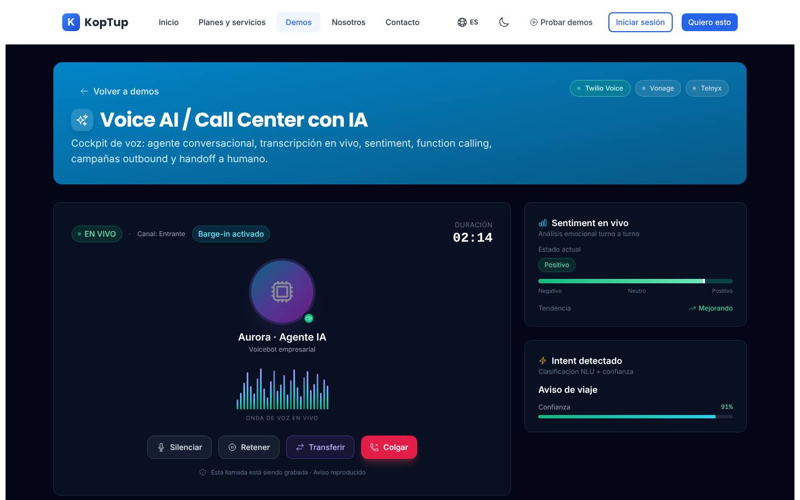
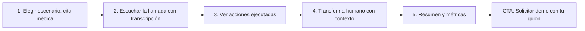

# Voice AI para call center (agente de voz con IA)

> Voz IA (`voice`) · Demo: `/demo/voice-ai` · Modo de acceso recomendado: `solicitud` (landing con audio y video públicos) · Prioridad: **P2** · Esfuerzo total: **XL** (≈ 5 semanas de 1 dev senior para dejar demo con audio + landing vendibles; el producto real se estima aparte)

*Captura actual de `/demo/voice-ai` (cockpit de llamada). Ver también [Sistema de demos](04-Sistema-de-Demos.md), [Catálogo de productos](08-Catalogo-de-Productos.md) y [Roadmap](12-Roadmap.md). Productos relacionados: [Helpdesk con IA](Producto-helpdesk-ia.md), [CRM con IA](Producto-crm-ia.md) y [Sistemas RAG](Producto-chatbot-rag-ia.md).*

---

## Resumen

**Problema:** los call centers y las empresas con alto volumen de llamadas pagan agentes para atender llamadas repetitivas (confirmar citas, estado de pedido, bloqueo de tarjeta, recordatorios de pago), tienen colas largas en horas pico y pierden las llamadas fuera de horario.

**Para quién (cliente ideal en Colombia/LATAM):** Colombia es un polo de BPO y contact center (Bogotá, Medellín, Barranquilla, Cali).
- BPO y contact centers que quieren automatizar el primer nivel.
- IPS, clínicas y laboratorios: confirmación y reprogramación de citas para reducir inasistencias.
- Bancos, cooperativas y fintech: bloqueo/desbloqueo de tarjetas, saldos, avisos de viaje.
- Empresas de cobranza y servicios: recordatorios y acuerdos de pago (respetando la Ley 2300 de 2023).
- Proveedores de internet, e-commerce y logística: estado de pedido o de servicio.

**Propuesta de valor:** "Un agente de voz que contesta 24/7 en español colombiano natural, resuelve las llamadas repetitivas conectándose a tus sistemas y pasa a un humano con todo el contexto cuando hace falta." Se integra con la PBX existente (Asterisk/Issabel o troncal SIP) y con el CRM o helpdesk del cliente.

---

## Estado actual

| Aspecto | Estado | Evidencia |
|---|---|---|
| Demo | Existe. **Maqueta** 100 % en el navegador, **sin audio** | `apps/web/src/app/demo/voice-ai/page.tsx` es `'use client'`; sin `fetch`, `axios`, `<audio>` ni micrófono |
| Pantallas | Cabecera con proveedores de telefonía · Llamada activa ("Aurora", onda, silenciar/retener/transferir/colgar/simular) · Sentimiento en vivo · Intención detectada · Transcripción en vivo · Stack de voz (STT, TTS, idioma, barge-in) · Function calling (4 funciones) · Handoff a humano · Agent Assist · Cola de llamadas (entrantes/salientes) · Campaña outbound · Compliance · Analytics | `page.tsx`, `components/parts.tsx` (`TranscriptTurn`, `SentimentGauge`, `ProviderGroup`, `ComplianceRow`, `KpiCard`) |
| Datos | Fijos: 8 turnos de conversación bancaria, colas con números `+56`, `+51`, `+54` (Chile, Perú, Argentina), saldo en CLP, documento "RUT", idioma "Español (CL)" | `components/types.ts`, `apps/web/messages/demos/voice-ai.es.json` |
| Onda de voz | Animación CSS (`animate-pulse`), no reacciona a ningún sonido | `components/Waveform.tsx` |
| Backend | Módulo en memoria `apps/backend/src/modules/voice-ai/` (llamadas, transcripciones, `startCall`; 167 líneas con test) **no montado**; sus datos ya usan `+57` y el agente se llama "Aria" (en el demo es "Aurora") | `voice-ai.service.ts`, `voice-ai.data.ts` |
| Base reutilizable | El backend ya integra Twilio para notificaciones por WhatsApp del formulario de contacto (experiencia con el proveedor) | Ver [Backend y API](09-Backend-y-API.md) |
| i18n ES/EN | UI en `voice-ai.{es,en}.json` (243 líneas c/u); números de teléfono y datos de tarjeta fijos en código | `types.ts`, `page.tsx` |
| Tests | 1 smoke test (`__tests__/page.test.tsx`) que hoy no se ejecuta | |
| Tamaño | 879 líneas (page 557 + 3 componentes) | `wc -l` |
| SEO | Metadata `demo-voice-ai` ("Voice AI \| Agentes de Voz con IA para Call Center", promete "IVR inteligente") | `apps/web/src/lib/seo-config.ts` |
| CTA | Botón "Volver a demos" + `DemoCTA` genérico del layout ("Solicitar Cotización" → `/contact` sin producto) | `page.tsx`, `apps/web/src/components/demo/DemoCTA.tsx` |
| Catálogo | Mapeo correcto: offering `voice-ai-callcenter` → demo `voice-ai` | `services-catalog.ts` |

**Lo que hace bien:** estética de "cockpit" muy lograda; el reloj corre; la transcripción aparece por turnos; sentimiento, tendencia e intención se actualizan con cada turno; las funciones pasan a "completado" cuando el turno que las invoca aparece; transferir muestra el aviso y la ficha de contexto; silenciar y retener detienen la onda; cubre bien el alcance funcional (inbound, outbound, handoff, assist, compliance, analytics).

### Problemas detectados (con ruta)

1. **Un producto de voz que no se escucha:** no hay ningún audio. La onda es decorativa (`Waveform.tsx`). Es la brecha más grande para vender.
2. **Datos de otros países:** números `+56/+51/+54` (`types.ts`), "RUT 18.234.567-9", saldo "$1.245.300 CLP", seguro "+$8.900 CLP/mes", idioma "Español (CL)" (`voice-ai.es.json`). Un prospecto colombiano no se identifica.
3. **Contradicción de cumplimiento:** el turno 1 se marca "PCI redactado", pero en el turno 5 el cliente dice nombre propio y número de documento completos sin enmascarar (`turns.t5`). Además usa un nombre y apellido propios como cliente de ejemplo: reemplazarlos por unos claramente ficticios.
4. **Cambio de idioma que confunde:** el agente pasa al inglés a mitad de la llamada ("Could you confirm your full name, please?", `turns.t4`) presentado como "code-switching"; para un banco colombiano resta credibilidad.
5. **No es determinista:** la transcripción avanza con `Math.random()` en `page.tsx` y las marcas de tiempo se recalculan con la duración (`TranscriptTurn`: `totalDur - (TURNS.length - index) * 10`), así que cambian mientras se mira. Cada visita es distinta: imposible hacer un video o capturas consistentes.
6. **Empieza a mitad de llamada:** se carga en 02:12 con 4 turnos ya visibles, sin explicar qué está pasando.
7. **Estados equivocados:** la insignia de estado queda verde y pulsando aunque la llamada haya terminado ("Finalizada"); las funciones que aún no se invocan dicen "ejecutando…" (`functions.running`) en lugar de "pendiente".
8. **Controles que no cambian nada visible:** elegir STT, TTS, telefonía o idioma solo cambia etiquetas (y la latencia mostrada); cambiar la voz TTS no se puede oír. Para un comprador de negocio, elegir proveedores es ruido técnico.
9. **Cumplimiento con marco extranjero:** "Consentimiento GDPR" y "DNC list". En Colombia aplica la Ley 1581 de 2012 (autorización y aviso de grabación) y, para cobranza y ofertas comerciales, la Ley 2300 de 2023 (horarios y frecuencia de contacto). La campaña "Cobranza preventiva mayo" no muestra ninguna ventana horaria.
10. **Sin vista de IVR o flujo**, aunque el SEO y el plan Profesional prometen "IVR".
11. **Desalineado con los planes:** campañas salientes con marcador predictivo y function calling no aparecen en ningún plan; "Voces premium clonadas" (Avanzado) no menciona el consentimiento de la persona cuya voz se clona.
12. **Jerga en inglés sin explicar:** Sentiment, Intent, Function calling, Handoff, Agent Assist, Barge-in, Containment, AHT, FCR.
13. **Cifras fijas** en campaña (1.284 contactados, 47,6 %) y analytics (CSAT 4.7, AHT 2:48, FCR 82 %, contención 64 %, 3.412 llamadas).
14. **Textos del catálogo** (`apps/web/messages/offerings/voice-ai-callcenter.es.json`): nombre en inglés ("Voice AI para call center"), voseo ("Comprala", "pagá"), "Reportes mensuales del tier" repetido 2 veces en Avanzado y 3 en Enterprise.

---

## Qué falta para que sea vendible

- **Audio real**: 3–4 llamadas de ejemplo en español colombiano, con transcripción sincronizada. Sin esto no hay venta.
- Escenarios locales elegibles (banca, salud, cobranza, pedidos) con datos colombianos enmascarados.
- Un recorrido determinista de 5 pasos, apto para grabar el video de la landing.
- Cumplimiento colombiano visible: Ley 1581 (aviso y autorización), Ley 2300 (horarios), enmascaramiento de tarjetas y documentos.
- Vista del flujo de la llamada (IVR/agente) para explicar cómo se diseña el bot.
- Mensaje de costos claro: el cliente paga proveedores por minuto además de Koptup; mostrar costo estimado por minuto.
- Una oferta de entrada para una venta de ticket alto: **piloto de 1 caso de uso** (precio a definir por el dueño, abonable al setup).
- Nombre comercial en español: **"Agente de voz con IA para call center"**.

---

## Plan detallado

### Landing `/productos/voice-ai-callcenter`

Estructura común de [Landing de producto](Seccion-Landing-de-Producto.md):

1. **Hero:** "Un agente de voz con IA que atiende tus llamadas 24/7". Subtítulo: "Habla en español natural, resuelve las consultas repetitivas conectado a tus sistemas y pasa a un humano con todo el contexto." **Reproductor de audio** de 30 s visible en el hero. CTA **"Solicitar demo"** + "Agendar llamada".
2. **Escúchalo** (2–3 muestras de audio con transcripción): confirmación de cita médica, desbloqueo de tarjeta, recordatorio de pago.
3. **Problemas:** colas en horas pico; llamadas fuera de horario perdidas; agentes dedicados a tareas repetitivas.
4. **Cómo funciona** (diagrama simple): llamada → agente IA (entiende, consulta tus sistemas, responde) → transferencia a humano si hace falta → resumen en tu CRM/helpdesk.
5. **Capturas** del cockpit y **video de 60–90 s** con audio.
6. **Casos de uso por sector** (salud, banca, cobranza, e-commerce, servicios públicos).
7. **Integraciones:** número local `+57` vía Twilio/Telnyx o troncal SIP de operador, PBX Asterisk/Issabel, CRM, helpdesk, Google Calendar o agenda médica, WhatsApp (confirmaciones), Wompi/PayU (link de pago tras la llamada).
8. **Cumplimiento:** Ley 1581 (aviso de grabación y autorización), Ley 2300 (horarios de contacto), enmascaramiento de datos sensibles, retención de grabaciones configurable.
9. **Planes, costo por minuto estimado y piloto** (SaaS: lista de espera). **FAQ:** ¿Suena robótico? · ¿Entiende acentos colombianos? · ¿Qué pasa si no entiende? · ¿Cuánto cuesta por minuto? · ¿Se conecta con mi PBX? · ¿Es legal grabar las llamadas?
10. **CTA final:** "Solicitar demo" con `voice-ai-callcenter` preseleccionado.

### Demo interactiva (mejoras por pantalla/módulo)

| Módulo (`page.tsx` / `components/`) | Agregar | Quitar / corregir | Datos de ejemplo |
|---|---|---|---|
| **Nuevo: pantalla de inicio** | "Elige un escenario": Banca (desbloqueo por viaje), Salud (confirmar/reprogramar cita), Cobranza preventiva (acuerdo de pago + link por WhatsApp), Estado de pedido | Arranque automático a mitad de llamada (02:12) | 4 escenarios con 60–120 s de audio cada uno |
| Llamada activa | Reproductor `<audio>` real (play/pausa, velocidad 1x/1,5x); onda generada desde el audio (Web Audio `AnalyserNode`); insignia gris al finalizar | Insignia verde fija; onda decorativa | Audio TTS en español colombiano generado una sola vez y guardado como archivo estático (p. ej. `apps/web/public/demos/voice-ai/<escenario>.mp3`) |
| Transcripción en vivo | Sincronizada con el tiempo del audio (resalta el turno que suena); tiempos fijos por turno; enmascaramiento visible ("CC ****4567", "tarjeta ****1234") | `Math.random()`; tiempos recalculados; turno en inglés; documento sin enmascarar | Transcripciones con tiempos en `fixtures/<escenario>.ts` |
| Sentimiento e intención | Derivados de la línea de tiempo del audio; nombres en español ("Sentimiento", "Intención") | Spanglish | Intenciones: "Confirmar cita", "Reprogramar cita", "Acuerdo de pago" |
| Function calling → "Acciones del agente" | Estados pendiente → ejecutando → completado sincronizados; detalle desplegable con la consulta y respuesta (para el comprador técnico) | "ejecutando…" en funciones no invocadas | `consultar_agenda`, `reprogramar_cita`, `enviar_whatsapp_confirmacion`, `generar_link_pago` |
| Handoff y Agent Assist | Ficha que recibe el humano: resumen IA de la llamada, intención, datos verificados, siguiente paso sugerido | LTV sin moneda | Valores en COP |
| Stack de voz | Moverlo a "Configuración avanzada" (plegado); en su lugar, selector de **2–3 voces** (femenina/masculina, es-CO) que cambia el audio de verdad (A/B) | Selector de proveedores como protagonista | — |
| Cola de llamadas | Números `+57` enmascarados (`+57 300 *** 8830`); estado y resultado por llamada | `+56/+51/+54` | Mezcla de Bogotá (601) y celulares |
| Campaña outbound | Ventana permitida "L–V 7:00–19:00, sáb 8:00–15:00, sin domingos ni festivos (Ley 2300)" — validar el texto con asesoría legal antes de publicarlo; evento "Llamada bloqueada: fuera de horario"; "Lista de exclusión" en vez de "DNC" | Cifras fijas sin contexto | "Recordatorio de pago — cuota de octubre": 1.284 contactos, 612 conectados, 203 acuerdos |
| Compliance → "Cumplimiento" | Ley 1581 (aviso de grabación reproducido y autorización registrada), Ley 2300 (horarios y frecuencia), enmascaramiento de tarjetas y documentos, retención de grabaciones | "Consentimiento GDPR", "Opt-in vigente hasta 2026-12-31" | — |
| Analytics | Resumen post-llamada (duración, resultado, acciones); KPIs con explicación (Contención = % resuelto sin humano) | Siglas sin explicar | — |
| **Nuevo: "Flujo de la llamada"** | Diagrama de nodos de solo lectura: saludo → identificación → intención → acción → cierre o transferencia | — | El flujo del escenario elegido |
| Global | Badges "Incluido desde plan X"; CTA "Escucha cómo sonaría con tu empresa → Solicitar demo"; glosario | `DemoCTA` genérico | — |

**Recorrido guiado (5 pasos, unos 3 minutos con audio):**

> [Ver diagrama como imagen](images/diagramas/Producto-voice-ai-callcenter-1.png)

1. **Escenario:** elegir "Confirmación de cita médica" (IPS ficticia).
2. **Escuchar:** 90 s de llamada con transcripción sincronizada, intención y sentimiento cambiando en vivo.
3. **Acciones:** ver `consultar_agenda` → `reprogramar_cita` → `enviar_whatsapp_confirmacion` completarse al ritmo del audio.
4. **Transferencia:** pulsar "Transferir a humano" y ver la ficha con resumen IA y sugerencias de Agent Assist.
5. **Resultado:** resumen post-llamada y métricas del día. CTA "Solicitar demo con tu guion".

### Acceso y solicitud de demo

- **Modo recomendado: `solicitud`.** Motivos: (1) es una venta consultiva de ticket alto (setup desde $53 M COP) que casi siempre requiere una llamada; (2) la prueba con llamada real consume minutos de telefonía, STT, TTS y LLM (el catálogo estima USD 300–50.000/mes según plan), así que necesita control de costos y de abuso por prospecto; (3) lo que más vende al público es escuchar, y eso se resuelve en la landing.
- **Qué ve el visitante antes de solicitar:** landing con 2–3 muestras de audio, video de 60–90 s, capturas del cockpit y la vista previa del recorrido (DECISIÓN 2).
- **Qué ve el prospecto aprobado** (Portal › Mis demos, ver [Portal del cliente](06-Portal-del-Cliente.md)): el cockpit completo con los 4 escenarios, el escenario de su sector con el saludo personalizado con el nombre de su empresa, y "Agendar llamada" / "Solicitar propuesta o piloto". `DemoGrant` de **14 días** (valor por defecto), extensible desde el admin.
- **Fase 4:** "Llamada de prueba": el prospecto aprobado llama a un número sandbox o usa una llamada desde el navegador; tope de minutos por grant (p. ej. 10), corte automático y registro del costo de cada demo.
- **Eventos `DemoEvent`:** escenario elegido, porcentaje de audio escuchado, transferencia probada, vista de flujo abierta, clics en CTA.

### Personalización por cliente

Sin código, desde **Admin › Solicitudes de demo › Aprobar** (campo `personalizacion` del `DemoGrant`; ver [Panel de administración](05-Panel-de-Administracion.md)):

| Campo | Efecto en la demo |
|---|---|
| Logo, color primario y nombre de la empresa | Cabecera y textos del cockpit |
| Nombre del agente de voz | Etiqueta y saludo ("Hola, soy Sofía de <Empresa>") |
| Sector / escenario principal | Escenario que se abre por defecto (banca, salud, cobranza, pedidos) |
| Voz (femenina/masculina) | Muestra de audio usada |
| Saludo personalizado | Botón de admin "Generar audio personalizado": genera solo el saludo (10–15 s) con TTS y lo guarda para ese grant, con tope de costo por grant |
| Hasta 3 preguntas frecuentes del prospecto | Se muestran como texto en la vista "Flujo de la llamada" (no se genera audio nuevo por cada una) |

**Implementación:** mover `TURNS`, `INBOUND`, `OUTBOUND` de `components/types.ts` a `fixtures/<escenario>.ts` con tiempos de inicio y fin por turno; la página lee la configuración de `GET /api/demo-access/voice-ai` (DECISIÓN 3) y solo carga el cockpit completo si el servidor confirma el acceso.

### Producto real

**Alcance MVP — modalidad compra (Básico, 1 caso de uso, 4–6 semanas):**
- Agente de voz entrante para 1–2 casos de uso (p. ej. confirmación de citas o estado de pedido) con número local `+57` (Twilio/Telnyx) o troncal SIP conectada a la PBX del cliente (Asterisk/Issabel).
- STT y TTS en español con voces naturales; LLM con function calling a 2–3 APIs del cliente; interrupción del usuario (barge-in).
- Transferencia a cola humana con resumen del caso.
- Grabación, transcripción y resumen de cada llamada; enmascaramiento de tarjetas y documentos antes de guardar.
- Aviso de grabación y registro de autorización de tratamiento (Ley 1581); retención configurable.
- Panel de llamadas y métricas (contención, duración media, transferencias, CSAT por encuesta).
- **Integraciones típicas en Colombia:** CRM y helpdesk (crear contacto/ticket desde la llamada), Google Calendar o agenda médica, WhatsApp Business (confirmación tras la llamada), Wompi/PayU (link de pago enviado por WhatsApp).
- **Profesional:** campañas salientes con ventanas horarias de la Ley 2300, lista de exclusión, detección de contestador, IVR multi-línea.
- **Avanzado:** voz de marca (clonación solo con consentimiento escrito de la persona), análisis de calidad, varios idiomas.
- **Base técnica:** reutilizar `apps/backend/src/modules/voice-ai/` (Call, Transcript, `startCall`) migrado a Mongoose con autenticación, `tenantId` y webhooks de telefonía protegidos (ver [Seguridad y calidad](10-Seguridad-y-Calidad.md)).

**SaaS (DECISIÓN 7):** se muestra **"SaaS: lista de espera"**. Requisitos adicionales a los del core multi-tenant y cobro recurrente: medición por minuto con saldo prepagado y recargas (Wompi/PayU), aprovisionamiento de números por cliente, controles antifraude de telefonía (destinos internacionales bloqueados por defecto, topes diarios), almacenamiento de grabaciones con retención por cliente y objetivos de latencia por llamada.

### Planes y precios

Precios actuales del catálogo (`apps/web/src/lib/services-catalog.ts`, entrada `voice-ai-callcenter`; COP):

| Plan | Compra: setup | Compra: mantenimiento/mes | SaaS: setup | SaaS: mes | Volumen incluido | Usuarios admin | Implementación | Costos del cliente al proveedor (USD/mes) |
|---|---|---|---|---|---|---|---|---|
| Básico | $53.000.000 | $4.800.000 | $2.900.000 | $1.790.000 | 1.000 minutos/mes | 3 | 2–5 semanas | 300–1.000 (Twilio Voice + STT + TTS + OpenAI) |
| Profesional | $135.000.000 | $12.000.000 | $6.900.000 | $4.290.000 | 30.000 minutos/mes | 20 | 5–9 semanas | 1.500–5.000 (Twilio + Deepgram + ElevenLabs Pro + LLM) |
| Avanzado | $315.000.000 | $27.000.000 | $12.900.000 | $8.190.000 | 250.000 minutos/mes | 60 | 9–14 semanas | 5.000–18.000 (telefonía enterprise, voces premium, multi-país) |
| Enterprise | $675.000.000 | $52.500.000 | $0 (se muestra "Personalizado") | $14.790.000 | 2,5M+ minutos/mes | Ilimitado | 12–20 semanas | 15.000–50.000 (PBX/SIP enterprise, clonación de voz) |

Almacenamiento: 5 / 80 / 400 GB / ilimitado. Horas de evolutivos por mes: 5 / 12 / 25 / 50.

**Recomendaciones de claridad:**
1. **Costo por minuto:** los call centers compran por minuto. El catálogo estima USD 300–1.000/mes para 1.000 minutos en Básico (USD 0,30–1,00 por minuto, incluidos costos fijos). Validar la estimación con una calculadora por proveedor y mostrar "costo de proveedores estimado por minuto" junto a cada plan.
2. **Mantenimiento de compra:** 12 × $4,8 M = $57,6 M al año (109 % del setup Básico) y 2,7 veces la cuota SaaS. Aplicar la decisión transversal descrita en [CRM con IA](Producto-crm-ia.md#planes-y-precios).
3. **Oferta de entrada:** "Piloto de 4–6 semanas con 1 caso de uso y 1 línea", con precio fijo definido por el dueño y abonable al setup si se compra el plan.
4. **SaaS → "Lista de espera"** hasta la Fase 4; Enterprise SaaS setup como "A convenir".
5. Bullets en lenguaje de cliente, sin duplicados. Propuesta: **Básico** "1 línea y hasta 1.000 minutos/mes · 1 caso de uso (p. ej. citas) · Voz natural en español · Transcripción y resumen de cada llamada · Transferencia a humano". **Profesional** "+ Varias líneas y menú IVR · Registro en tu CRM y tickets en tu helpdesk · WhatsApp después de la llamada · Campañas salientes con horarios de la Ley 2300". **Avanzado** "+ Voz de marca (con consentimiento) · Análisis de calidad · Enmascaramiento de tarjetas y documentos · Varios idiomas". **Enterprise** "+ Integración con PBX/SIP corporativo · Gestión de turnos y calidad · Multi-país y contingencia".
6. Renombrar a "Agente de voz con IA para call center", tuteo en vez de voseo.
7. Paquete "Suite de atención" con [Helpdesk con IA](Producto-helpdesk-ia.md) y [CRM con IA](Producto-crm-ia.md): el plan Profesional ya promete ambas integraciones.

Política comercial común en [Catálogo de productos](08-Catalogo-de-Productos.md) y aspectos legales en [Comercial, marketing y legal](11-Comercial-Marketing-y-Legal.md).

---

## Tareas

| # | Tarea | Fase | Prioridad | Esfuerzo | Criterio de aceptación |
|---|---|---|---|---|---|
| 1 | Reescribir textos del offering (nombre en español, tuteo, sin duplicados, consentimiento para clonar voz, Ley 1581/2300) | Fase 1 — Funnel y solicitud de demos | P1 | S | `voice-ai-callcenter.{es,en}.json` sin voseo ni bullets repetidos; nombre "Agente de voz con IA para call center" |
| 2 | Landing `/productos/voice-ai-callcenter` con reproductor de 2–3 muestras de audio y video | Fase 1 — Funnel y solicitud de demos | P1 | M | Audio reproducible en móvil y escritorio; CTA abre el formulario con el producto preseleccionado |
| 3 | `DemoCatalogItem` `voice-ai` en modo `solicitud` con vista previa pública y verificación de acceso en servidor | Fase 1 — Funnel y solicitud de demos | P1 | S | Sin grant se ve la vista previa y el CTA; con grant activo se carga el cockpit completo |
| 4 | Validar la estimación de costos de proveedores y publicar el costo estimado por minuto por plan | Fase 1 — Funnel y solicitud de demos | P2 | S | Tabla de costo por minuto revisada por el dueño y visible en la landing |
| 5 | Producir audio de 4 escenarios en español colombiano + transcripciones con tiempos (`fixtures/<escenario>.ts`) | Fase 2 — Demos vendibles | P1 | M | 4 archivos de 60–120 s; cada turno tiene inicio/fin; sin datos personales reales |
| 6 | Reproductor sincronizado: transcripción, intención, sentimiento y acciones siguen al audio; quitar `Math.random()`; onda desde el audio | Fase 2 — Demos vendibles | P1 | M | Dos reproducciones seguidas muestran exactamente lo mismo; pausar el audio congela todo |
| 7 | Pantalla "Elige un escenario" y estados correctos (insignia "Finalizada" gris, acciones "pendiente") | Fase 2 — Demos vendibles | P1 | S | La demo no arranca a mitad de llamada; 0 acciones marcadas "ejecutando" sin haberse invocado |
| 8 | Localización: `+57` enmascarados, COP, cédula enmascarada, "Español (CO)", sin cambio a inglés, nombres ficticios | Fase 2 — Demos vendibles | P1 | S | 0 referencias a RUT, CLP, `+56/+51/+54`; ningún documento completo visible |
| 9 | Cumplimiento Colombia: Ley 1581 (aviso + autorización), Ley 2300 (ventana horaria y evento bloqueado), lista de exclusión | Fase 2 — Demos vendibles | P1 | S | La campaña muestra la ventana horaria y al menos un intento bloqueado fuera de horario; 0 menciones a GDPR/DNC |
| 10 | Vista "Flujo de la llamada" y "Stack de voz" plegado con selector A/B de 2–3 voces audibles | Fase 2 — Demos vendibles | P2 | M | Cambiar de voz cambia el audio; el flujo coincide con el escenario elegido |
| 11 | Tour guiado de 5 pasos, glosario de siglas y badges "Incluido desde plan X" | Fase 2 — Demos vendibles | P1 | S | Tour completable en ~3 min; cada sigla explicada; badges coinciden con `offering_voiceAiCallcenter.tiers` |
| 12 | Personalización desde el `DemoGrant` (logo, nombre del agente, escenario, voz) y acción de admin "Generar audio personalizado" con tope de costo | Fase 2 — Demos vendibles | P2 | M | El prospecto aprobado escucha el saludo con el nombre de su empresa; el costo por grant queda registrado |
| 13 | Plantilla de propuesta de piloto (1 caso de uso, 4–6 semanas) en el `Quote` ampliado | Fase 3 — Propuestas y conversión | P2 | S | El comercial genera la propuesta de piloto en < 15 min con alcance, cronograma y costos de proveedores |
| 14 | Llamada de prueba real para prospectos aprobados (número sandbox o navegador), con tope de minutos por grant y registro de costo | Fase 4 — Productos SaaS reales | P2 | L | Un prospecto con grant completa una llamada real; al llegar al tope la llamada se corta; sin grant no hay acceso |
| 15 | Base real: módulo `voice-ai` persistente con telefonía, transcripción, resumen y medición por minuto, multi-tenant | Fase 4 — Productos SaaS reales | P3 | XL | Piloto con 1 cliente: ≥ 500 llamadas reales, contención medida y grabaciones enmascaradas |

---

## Métricas de éxito

Son **metas** iniciales a validar con datos reales; no son resultados actuales.

- ≥ 40 % de los visitantes de la landing reproducen al menos una muestra de audio.
- Conversión landing → solicitud de demo ≥ 2 % (ticket alto, menor volumen).
- ≥ 70 % de los prospectos aprobados abren el cockpit en las primeras 72 h y escuchan al menos 1 escenario completo.
- ≥ 30 % de las demos guiadas terminan en propuesta de piloto.
- Primer piloto pagado firmado en los 6 meses siguientes a la Fase 2.
- Costo de demos con llamada real (Fase 4) dentro del tope definido por grant en el 100 % de los casos.
