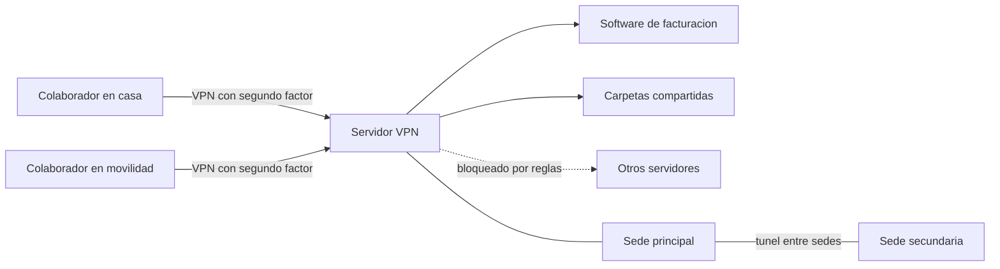
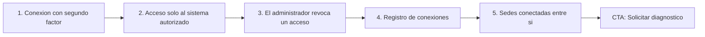

# VPN empresarial

> Seguridad (`security`) · Demo: `/demo/saas-boilerplate` (**incorrecto**; propuesto: sin demo interactiva, con landing de caso de estudio y demo guiada en laboratorio) · Modo de acceso recomendado: `solicitud` (demo guiada en vivo) · Prioridad: **P1** · Esfuerzo total: **M**

*Esto es lo que ve hoy quien pulsa "Ver demo" en la tarjeta de VPN empresarial: el demo de la [Plataforma SaaS multi-tenant](Producto-saas-multi-tenant.md) (Stripe, tenants, feature flags), que no tiene nada que ver con acceso remoto. Y la VPN es el único producto del catálogo que Koptup ya entregó a un cliente real. Ver [Sistema de demos](04-Sistema-de-Demos.md), [Catálogo de productos](08-Catalogo-de-Productos.md) y [Roadmap](12-Roadmap.md).*

---

## Resumen

**Problema:** en muchas pymes y operadores administrativos del sector salud, el equipo trabaja desde casa o en varias sedes y necesita entrar al software de facturación, a las carpetas compartidas o al ERP que está en la oficina. Es común resolverlo con herramientas de escritorio remoto sin control central o con contraseñas compartidas, sin saber quién se conectó ni poder cortar un acceso a tiempo. Cuando se manejan datos sensibles, como los de salud, eso es además un riesgo frente a la Ley 1581 de 2012.

**Para quién:**
- IPS, clínicas, laboratorios y operadores administrativos de EPS con personal en trabajo remoto.
- Firmas contables y jurídicas cuyo software y archivos están en un servidor de la oficina.
- Empresas con 2 a 10 sedes que necesitan conectarlas entre sí.
- Empresas de 10 a 200 colaboradores en esquema híbrido.

**Propuesta de valor:** "Tu equipo trabajando desde casa con acceso seguro a los sistemas de la empresa. Implementamos una VPN con segundo factor y conectamos tus sedes a precio fijo y con soporte incluido. Cada persona entra con su propio usuario y tú puedes dar de baja un acceso en un clic. Ya lo hicimos para un operador administrativo del sector salud en Bogotá."

**Cambio de enfoque:** este producto no es software para "comprar o suscribir". Es un **servicio de implementación** con un **servicio administrado mensual** opcional, y su mejor argumento de venta es el caso real.

---

## Estado actual

| Aspecto | Estado | Evidencia |
|---|---|---|
| Demo | **No tiene demo propio.** La entrada 27 del catálogo dice `demoSlug: 'saas-boilerplate'` | `apps/web/src/lib/services-catalog.ts` |
| Efecto en el sitio | "Ver demo" de `OfferingsCatalog.tsx` lleva a `/demo/saas-boilerplate`, que habla de cobros con Stripe, tenants y feature flags | `apps/web/src/components/offerings/OfferingsCatalog.tsx` (enlace `/demo/${offering.demoSlug}`) |
| Caso real | `/about` cuenta el proyecto "SoSalud — VPN empresarial corporativa": tercero administrador de Nueva EPS, VPN para el trabajo remoto seguro del equipo administrativo, con IPsec/WireGuard, conexión entre sedes, endurecimiento y 2 meses de soporte. Inversión total publicada: COP 3.500.000. No tiene página propia y la tarjeta de VPN no lo enlaza | `apps/web/src/app/about/page.tsx` (`caseStudies` y `timeline`) |
| Asociación errónea | En `/about`, la vertical de salud dice "integración HL7/FHIR y HIPAA. Caso reciente: SoSalud", pero el proyecto fue una VPN | `about/page.tsx` (`verticals`); ver [Nosotros](Seccion-Nosotros.md) |
| Backend | No aplica: es infraestructura y servicio. No existe ni hace falta un módulo en `apps/backend` | — |
| Textos del producto | `vpn-empresarial.es.json`: la descripción es de plantilla ("Comprala como software (te entregamos el código)"), aunque una VPN se configura y no es código que se entregue; voseo; "Reportes mensuales del tier" repetida en Avanzado y Enterprise; Enterprise promete ZTNA (Zscaler/Cloudflare), SIEM (Splunk/Sentinel), EDR/XDR y DLP | `apps/web/messages/offerings/vpn-empresarial.es.json` |
| Precios | El plan Básico en compra cuesta COP 21.000.000, 6 veces el único proyecto vendido (COP 3.500.000 con soporte incluido) | `services-catalog.ts` y `about/page.tsx` |
| i18n ES/EN | Solo los textos del catálogo | — |
| Tests | No aplica | — |
| Tamaño | 0 líneas de demo propio | — |

### Problemas detectados

1. **Mapeo de demo incorrecto.** Es más grave aquí que en cualquier otro producto, porque es el único con un cliente real: el prospecto concluye que la VPN no existe.
2. **El caso real no se aprovecha:** no aparece en la tarjeta ni en el detalle de la oferta, y en `/about` se mezcla con HL7/FHIR y HIPAA.
3. **Modelo de venta equivocado:** se presenta como software en "compra" (con entrega de código) o "SaaS", cuando en realidad es implementación más operación.
4. **Precios desalineados con la realidad:** nada explica el salto de COP 3,5 M (proyecto real) a COP 21 M (plan de entrada).
5. **Promesas fuera de alcance:** ZTNA empresarial, SIEM corporativo, EDR/XDR, DLP y "backbone multi-país" exigen alianzas con fabricantes y un centro de operaciones de seguridad que Koptup no tiene hoy.
6. **Métrica poco clara:** "usuarios concurrentes" no le dice nada a un gerente. Él piensa en "cuántas personas trabajan remoto" y "cuántas sedes tengo".
7. **Costos del cliente por revisar:** USD 50–250 al mes para 25 usuarios parece alto frente a lo que cuesta un servidor VPN pequeño; hay que validarlo con el costo real del caso.
8. **Autorización pendiente:** publicar el nombre de SoSalud, su logo y el monto exige autorización escrita del cliente (ver [Nosotros](Seccion-Nosotros.md)).

---

## Qué falta para que sea vendible

- **Quitar ya el demo equivocado** (Fase 1) y reemplazarlo por "Ver caso" y "Solicitar diagnóstico".
- **Un caso de estudio** con contexto, solución (diagrama), resultado y, si el cliente lo autoriza, testimonio.
- **Reposicionar el producto como servicio:** "Implementación de acceso remoto seguro" en paquetes de precio fijo, más un "Servicio administrado" mensual opcional.
- **Una puerta de entrada:** diagnóstico gratuito de 30 minutos y, más adelante, una autoevaluación de 8 preguntas.
- **Evidencia visual:** diagrama de arquitectura, capturas anonimizadas de la consola de administración y un video corto grabado en un laboratorio.
- **Un alcance acotado** a lo que Koptup entrega; el resto se ofrece "con aliado especializado, bajo proyecto".

---

## Plan detallado

### Landing `/productos/vpn-empresarial`

Nombre comercial propuesto: **"Acceso remoto seguro (VPN empresarial)"**.

1. **Hero:** "Tu equipo trabajando desde casa, con acceso seguro a los sistemas de la empresa". Subtítulo: "Implementamos una VPN con segundo factor y conectamos tus sedes. Precio fijo y soporte incluido". CTA principal **Solicitar diagnóstico**, secundario **Agendar llamada**.
2. **Caso destacado**, con el componente `CaseStudyCard` compartido con la home y `/about`:
   - **Contexto:** equipo administrativo de un operador del sector salud que necesitaba trabajar de forma remota y segura.
   - **Qué hicimos:** VPN para el trabajo remoto, conexión entre sedes y endurecimiento de la configuración.
   - **Resultado:** entrega con 2 meses de soporte incluidos.
   - El nombre aparece solo si `authorized = true` y el monto solo si `amountPublic = true` en `lib/company.ts`. Sin autorización: "Operador administrativo del sector salud, Bogotá".
3. **Diagrama "Así queda tu red"** (ver abajo), en imagen para la landing.
4. **Qué incluye**, en lenguaje de negocio:
   - un acceso por persona con segundo factor;
   - baja inmediata de un acceso;
   - sedes conectadas entre sí;
   - cada grupo llega solo a los sistemas que le corresponden;
   - registro de conexiones;
   - endurecimiento del servidor;
   - manual y capacitación;
   - soporte.
5. **Cómo trabajamos (4 pasos):** diagnóstico (1–2 días), diseño y propuesta a precio fijo, piloto con 2–3 usuarios, y despliegue con soporte (2 meses incluidos).
6. **Autoevaluación** "¿Tu equipo trabaja remoto de forma segura?" (Fase 2): 8 preguntas, un resultado y el CTA.
7. **Paquetes y precios**, más el servicio administrado (ver abajo).
8. **FAQ:**
   - ¿Tengo que comprar equipos?
   - ¿Funciona con mi proveedor de internet?
   - ¿Qué pasa si alguien pierde el portátil?
   - ¿Me ayuda a cumplir la Ley 1581 con datos de salud? (Es una medida de seguridad, no una certificación.)
   - ¿Puedo ver quién se conectó?
   - ¿Qué pasa cuando termina el soporte?
9. **Bloque cruzado** para el sector salud: enlace a `/rag/salud` y a [Telemedicina](Producto-telemedicina.md).

**Diagrama "Así queda tu red":**

### Demo interactiva

**Corto plazo (Fase 1):** en `services-catalog.ts`, cambiar `demoSlug: 'saas-boilerplate'` por `demoSlug: ''` en `vpn-empresarial`. `OfferingsCatalog.tsx` ya oculta "Ver demo" cuando `demoSlug` está vacío. En su lugar, la tarjeta muestra "Ver caso", que lleva a la landing.

**Fase 2: demo guiada en vivo, en laboratorio** (30 minutos por videollamada). Koptup mantiene un laboratorio reproducible de una IPS ficticia, "IPS Vida Sana", con sede Chapinero y sede Kennedy, 3 usuarios ficticios y un "software de facturación" de ejemplo. No se usan datos ni configuraciones reales de ningún cliente.

| Momento de la sesión | Qué ve el prospecto |
|---|---|
| 1. Conexión | Una colaboradora en casa abre la app de VPN en su portátil, ingresa su código de segundo factor y queda conectada |
| 2. Acceso por permisos | Entra al software de facturación, pero no puede llegar al servidor de historias clínicas porque su grupo no tiene permiso |
| 3. Baja de un acceso | El administrador revoca el acceso de un usuario y la conexión de esa persona se cae en el momento |
| 4. Registro | Se ven las conexiones del día: quién, desde dónde y cuánto tiempo |
| 5. Sedes | Desde la sede Kennedy se abre una carpeta del servidor de la sede Chapinero |

**Recorrido guiado (5 pasos):**

**Medios (Fase 2):** un video de 60–90 s grabado sobre el laboratorio y 4 capturas anonimizadas de la consola. Es preferible a construir una maqueta.

**Descartado por ahora:** una maqueta `/demo/acceso-remoto` con una consola simulada. Solo se hace si los diagnósticos muestran que los prospectos la piden (P3).

### Acceso y solicitud de demo

- **Modo recomendado: `solicitud`.** No hay demo abierta en `/demo`. La "demo" es una sesión guiada con un ingeniero, que hay que agendar.
- **Registro en el sistema de demos:** un `DemoCatalogItem` `vpn-laboratorio` sin ruta de demo, en modo guiado. Al aprobarlo, la sesión aparece en Portal › Mis demos con su fecha y sus materiales. Es la misma solución propuesta para [QA automatizado con IA](Producto-qa-automatizado-ia.md); se coordina con [Sistema de demos](04-Sistema-de-Demos.md), cuya semilla hoy no asigna demo a esta oferta.
- **Campos adicionales del formulario "Solicitar demo"** cuando el producto es VPN:
  - número de personas que trabajan remoto;
  - número de sedes;
  - sistemas a los que deben acceder;
  - si maneja datos de salud u otros datos sensibles;
  - proveedor de internet o router actual (opcional).
- **Antes de solicitar, el visitante ve:** la landing con el caso, el diagrama, el video del laboratorio (Fase 2) y la autoevaluación.
- **Duración del acceso:** 7 días, que cubren la sesión y la consulta de los materiales.
- **El prospecto aprobado ve en Portal › Mis demos:**
  - la fecha y el enlace de la sesión;
  - después de la sesión, su grabación;
  - el **informe de diagnóstico** (PDF de 2–3 páginas: situación actual, riesgos principales, arquitectura propuesta y paquete recomendado);
  - el CTA "Solicitar propuesta".

### Personalización por cliente

Aquí no hay demo que personalizar. Lo que se adapta a cada prospecto es la **sesión de laboratorio** y el **informe de diagnóstico**. Se configura en **Admin › Solicitudes de demo › Aprobar**:

| Campo | Efecto |
|---|---|
| Nombre de la empresa | Encabezado del informe y del correo de invitación |
| Sector: `salud`, `contable-juridico`, `multisede` o `generico` | Elige la plantilla del informe y el guion de la sesión. Por ejemplo, en salud el sistema de ejemplo es "historia clínica y facturación"; en contable, el software contable instalado en un servidor local |
| Personas remotas y número de sedes | Paquete recomendado en el informe y número de sedes del diagrama |
| Notas del ingeniero | Hallazgos y recomendaciones del informe |

Las credenciales, llaves y configuraciones de los clientes nunca se guardan en el repositorio, en la wiki ni en el admin.

### Producto real

**MVP del paquete de implementación:**

| Componente | Alcance |
|---|---|
| Diagnóstico | Inventario de personas, sedes, sistemas y equipos de red; matriz de accesos (quién entra a qué) |
| Servidor VPN | WireGuard, o IPsec cuando el equipo de la sede lo exige, en un servidor del cliente o en un servidor en la nube; endurecimiento del sistema operativo |
| Identidad | Un usuario por persona con segundo factor (TOTP). Integración con Google Workspace o Microsoft 365 en el paquete Sedes |
| Segmentación | Reglas para que cada grupo llegue solo a sus sistemas |
| Sedes | Túnel entre sedes, con el router existente si es compatible o con un equipo pequeño dedicado |
| Equipos | Instalación en Windows, macOS, Android e iOS, con una guía de una página para el colaborador |
| Registros y alertas | Registro de conexiones y alertas básicas. En el paquete Sedes, centralización en Wazuh o Elastic |
| Entrega | Documentación de la red, procedimiento de altas y bajas, capacitación al administrador y 2 meses de soporte |

**Integraciones típicas en Colombia:** las que importan aquí son de identidad (Google Workspace, Microsoft 365) y el software que el cliente ya usa en su servidor: programas contables como Siigo o World Office en versión local, software de historia clínica y facturación en salud, o un ERP. DIAN, pasarelas de pago y WhatsApp no aplican a este producto.

**Servicio administrado mensual** (reemplaza la modalidad SaaS):
- monitoreo de disponibilidad;
- actualizaciones de seguridad cada mes;
- altas y bajas de usuarios en 1 día hábil;
- revisión trimestral de accesos;
- informe mensual.

Es un servicio y no un software multicliente, así que **no depende del core de la Fase 4**. Para ofrecerlo hace falta:
- un procedimiento de soporte con tiempos de respuesta;
- una herramienta de monitoreo;
- acceso administrativo al entorno del cliente controlado, documentado y revocable;
- un contrato con acuerdo de nivel de servicio y anexo de tratamiento de datos (Ley 1581).

**Fuera del alcance propio:** ZTNA empresarial, SIEM corporativo, EDR/XDR y DLP. Se ofrecen solo "con aliado especializado, bajo proyecto" y salen de las viñetas públicas.

### Planes y precios

Precios actuales del catálogo (`services-catalog.ts`, entrada `vpn-empresarial`), en COP:

| Plan | Compra: setup único | Compra: mantenimiento mensual (opcional) | SaaS: setup | SaaS: cuota mensual | Volumen | Implementación |
|---|---|---|---|---|---|---|
| Básico | $21.000.000 | $1.900.000 | $2.900.000 | $690.000 | 25 usuarios concurrentes | 2–5 semanas |
| Profesional | $54.000.000 | $4.800.000 | $6.900.000 | $1.690.000 | 200 usuarios concurrentes | 5–9 semanas |
| Avanzado | $126.000.000 | $10.800.000 | $12.900.000 | $3.290.000 | 1.500 usuarios concurrentes | 9–14 semanas |
| Enterprise | $270.000.000 | $21.000.000 | Personalizado | $5.890.000 | 25.000+ usuarios concurrentes | 12–20 semanas |

| Plan | Usuarios admin | Cuentas | Almacenamiento | Horas de mantenimiento/mes | Costos del cliente (USD/mes) |
|---|---|---|---|---|---|
| Básico | 3 | 1 | 5 GB | 5 | 50–250 (servidores VPN y certificados) |
| Profesional | 15 | 5 | 30 GB | 12 | 300–1.500 (multirregión y SIEM básico) |
| Avanzado | 50 | 25 | 150 GB | 25 | 2.000–8.000 (backbone empresarial y SIEM corporativo) |
| Enterprise | Ilimitados | Ilimitadas | Ilimitado | 50 | 6.000–25.000 (ZTNA, SIEM, EDR/XDR, DLP) |

**Referencia real:** proyecto SoSalud, COP 3.500.000 de inversión total con 2 meses de soporte incluidos (dato publicado en `/about`).

**Estructura recomendada** (propuesta para validar con el dueño antes de publicarla):

| Paquete | Para quién | Incluye | Implementación (precio fijo, más IVA) | Servicio administrado (opcional) |
|---|---|---|---|---|
| **Esencial** | Hasta 25 personas, 1 sede | VPN con segundo factor, endurecimiento, instalación en equipos, guía y 2 meses de soporte | Desde COP 3.500.000, tomando como referencia el caso real | Desde COP 690.000/mes (la cuota SaaS Básico actual) |
| **Sedes** | Hasta 100 personas y 3 sedes | Lo de Esencial, más túnel entre sedes, permisos por grupo, inicio de sesión con Google o Microsoft y registros centralizados | A cotizar tras el diagnóstico; definir un rango con el dueño | Desde COP 1.690.000/mes |
| **Corporativo** | Más de 100 personas o más de 3 sedes, con requisitos de auditoría | Lo de Sedes, más alta disponibilidad, revisión de accesos y SIEM con aliado | A convenir | A convenir |

**Recomendaciones de claridad:**
1. **Retirar "compra (te entregamos el código)" y "SaaS"** para este producto. Se reemplazan por "Implementación" y "Servicio administrado", con una bandera de modelo de servicio en el catálogo.
2. **Recalibrar los precios con el caso real.** El salto de COP 3,5 M a COP 21 M no tiene explicación para el comprador.
3. **Medir por personas con acceso y por sedes**, no por "usuarios concurrentes".
4. **Retirar de las viñetas públicas** ZTNA, SIEM corporativo, EDR/XDR, DLP y "backbone multi-país".
5. **Revisar y explicar los costos del cliente** (servidor, dominio, licencias si las hay) con valores reales.
6. **Reescribir `vpn-empresarial.{es,en}.json`:** español neutro, sin duplicados, con el nombre comercial nuevo.

---

## Tareas

| # | Tarea | Fase | Prioridad | Esfuerzo | Criterio de aceptación |
|---|---|---|---|---|---|
| 1 | Cambiar `demoSlug: 'saas-boilerplate'` por `''` en `vpn-empresarial` y mostrar "Ver caso" y "Solicitar diagnóstico" en la tarjeta | Fase 1 — Funnel y solicitud de demos | P1 | S | Ninguna tarjeta de VPN enlaza a `/demo/saas-boilerplate`, y un test unitario valida que cada `demoSlug` corresponde a un demo de su producto |
| 2 | Obtener la autorización escrita de SoSalud (nombre, logo, monto y testimonio) y registrar `authorized` y `amountPublic` en `lib/company.ts` | Fase 1 — Funnel y solicitud de demos | P1 | S | La autorización queda archivada y el sitio muestra el nombre solo si `authorized = true` |
| 3 | Reescribir `vpn-empresarial.{es,en}.json` como servicio: nombre "Acceso remoto seguro (VPN empresarial)", paquetes, sin voseo ni duplicados y sin ZTNA, SIEM corporativo ni EDR | Fase 1 — Funnel y solicitud de demos | P1 | S | Un script no encuentra viñetas duplicadas ni voseo, y ninguna viñeta promete productos de terceros sin aliado |
| 4 | Recalibrar los precios con el dueño (paquetes Esencial, Sedes y Corporativo más servicio administrado) y mostrar "Implementación" y "Servicio administrado" en lugar de compra y SaaS (bandera de modelo en el catálogo) | Fase 1 — Funnel y solicitud de demos | P1 | M | La tarjeta muestra "Implementación desde…" y "Servicio administrado desde…", y ningún texto dice "te entregamos el código" para este producto |
| 5 | Landing `/productos/vpn-empresarial` con caso destacado, diagrama, qué incluye, cómo trabajamos, paquetes, FAQ y CTA "Solicitar diagnóstico" | Fase 1 — Funnel y solicitud de demos | P1 | M | La landing está en el sitemap, el CTA abre el formulario con VPN preseleccionada y el caso respeta las banderas de autorización |
| 6 | Campos condicionales para VPN en el formulario "Solicitar demo" (personas remotas, sedes, sistemas, datos sensibles) | Fase 1 — Funnel y solicitud de demos | P2 | S | La solicitud llega a Admin › Solicitudes de demo con esos campos visibles |
| 7 | Corregir `/about`: quitar la asociación de SoSalud con HL7/FHIR y HIPAA (coordinado con [Nosotros](Seccion-Nosotros.md)) | Fase 1 — Funnel y solicitud de demos | P2 | S | En `/about`, SoSalud solo aparece asociado a la VPN |
| 8 | Laboratorio de demostración reproducible ("IPS Vida Sana": 2 sedes virtuales, 3 usuarios ficticios y un sistema de ejemplo) que se levanta con un script | Fase 2 — Demos vendibles | P2 | M | El laboratorio se crea y se destruye con un comando en menos de 30 minutos y no contiene datos ni configuraciones de clientes |
| 9 | Grabar el video de 60–90 s y 4 capturas anonimizadas de la consola en el laboratorio | Fase 2 — Demos vendibles | P2 | S | Los medios están publicados en la landing y ninguno muestra direcciones, nombres ni llaves reales |
| 10 | `DemoCatalogItem` `vpn-laboratorio` (sin ruta, `solicitud`, modo guiado) para que la demo guiada aparezca en Mis demos con su fecha y sus materiales | Fase 2 — Demos vendibles | P2 | S | Un prospecto aprobado ve la sesión, la grabación y el informe en Portal › Mis demos |
| 11 | Plantillas del informe de diagnóstico por sector (salud, contable y jurídico, multisede, genérico) | Fase 2 — Demos vendibles | P2 | S | El ingeniero genera un informe completo en menos de 1 hora |
| 12 | Autoevaluación "¿Tu equipo trabaja remoto de forma segura?" (8 preguntas) que crea un lead | Fase 2 — Demos vendibles | P3 | M | Al terminarla se muestran el resultado y el CTA, y se crea un `Lead` con origen "autoevaluacion-vpn" |
| 13 | Kit de implementación interno: scripts de servidor, plantillas de configuración, checklist de endurecimiento y guía del colaborador | Fase 3 — Propuestas y conversión | P2 | M | Un proyecto Esencial se completa en 5 días hábiles de trabajo o menos |
| 14 | Plantilla de propuesta a precio fijo y contrato del servicio administrado con anexo de tratamiento de datos | Fase 3 — Propuestas y conversión | P2 | S | El comercial arma la propuesta desde Admin › Propuestas en menos de 15 minutos |
| 15 | Página de caso `/casos/<slug>` del proyecto (con nombre o anónima, según la autorización), con contexto, arquitectura, resultado y testimonio | Fase 5 — Escala | P2 | S | El caso está publicado, enlazado desde la landing, `/about` y la home, y respeta las banderas de autorización |

---

## Métricas de éxito

| Métrica | Meta inicial |
|---|---|
| Clics de "Ver demo" de VPN que terminan en `/demo/saas-boilerplate` | 0 (desde la Fase 1) |
| Visitantes de la landing que solicitan diagnóstico | ≥ 3 % |
| Diagnósticos que pasan a propuesta | ≥ 50 % |
| Propuestas aceptadas | ≥ 30 % |
| Clientes de implementación que contratan el servicio administrado | ≥ 50 % |
| Tiempo calendario de una implementación Esencial | ≤ 2 semanas |

Páginas relacionadas: [Plataforma SaaS multi-tenant](Producto-saas-multi-tenant.md), [Nosotros](Seccion-Nosotros.md), [Home](Seccion-Home.md), [Landing de producto](Seccion-Landing-de-Producto.md), [Panel de administración](05-Panel-de-Administracion.md) y [Comercial, marketing y legal](11-Comercial-Marketing-y-Legal.md).
