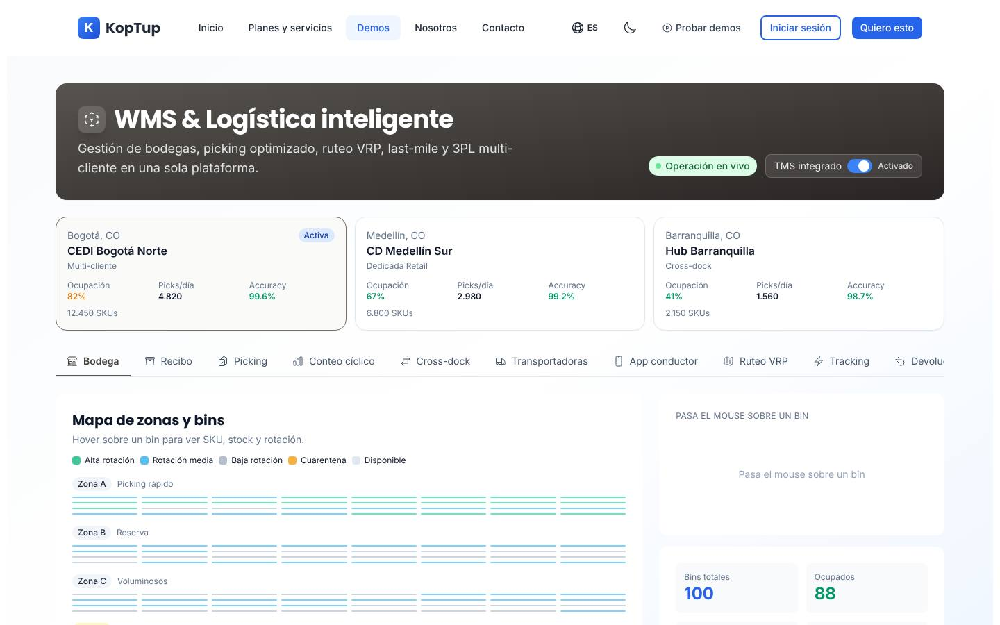
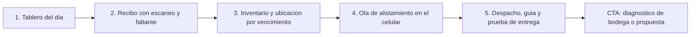

# WMS y logística de bodegas

> Operaciones (`operations`) · Demo: `/demo/wms-logistica` · Modo de acceso recomendado: `solicitud` · Prioridad: **P3** (la landing y el modo `solicitud` son P1 en Fase 1 porque cuestan poco y captan leads de alto valor) · Esfuerzo total: **XL** (≈ 7–8 semanas de 1 dev senior para dejar landing + demo vendibles; el producto real se estima aparte)

*Captura actual de `/demo/wms-logistica` (pestaña Bodega). En la captura, el "Mapa de zonas y bins" se ve como rayas delgadas en lugar de una cuadrícula: es un defecto de estilos que se explica en los problemas detectados. Ver también [Sistema de demos](04-Sistema-de-Demos.md), [Catálogo de productos](08-Catalogo-de-Productos.md) y [Roadmap](12-Roadmap.md). Productos relacionados: [ERP modular](Producto-erp-modular.md), [POS retail](Producto-pos-retail.md), [E-commerce](Producto-ecommerce.md), [App de delivery](Producto-app-delivery.md) y [Facturación electrónica](Producto-facturacion-electronica.md).*

> **Contexto de posicionamiento:** con el reposicionamiento de Koptup en sistemas RAG (ver [Visión de producto](02-Vision-de-Producto.md)), este producto queda dentro de **"Otras soluciones a medida"**. Tiene el ticket más alto de operaciones, pero también uno de los mayores esfuerzos de construcción y compite con proveedores de WMS ya establecidos. Por eso su prioridad general es P3: se publica la landing con demo por solicitud para captar y calificar demanda, y el producto se construye cuando haya un cliente piloto.

---

## Resumen

**Problema:** en muchas bodegas de Colombia el inventario se lleva en Excel o en el módulo de inventario del software contable, que sabe *cuánto* hay pero no *dónde* está. El resultado: conteos que no cuadran, productos vencidos que nadie vio, pedidos despachados incompletos o equivocados, alistamiento en papel, guías de transportadora hechas a mano en el portal de cada operador y ninguna medición de productividad ni del costo por pedido.

**Para quién (cliente ideal en Colombia/LATAM):**
- Comercios electrónicos y marcas propias con 300 a 20.000 pedidos al mes que ya no caben en la trastienda (moda, cosméticos, suplementos, hogar).
- Distribuidoras de consumo masivo, ferretería y repuestos con 1 a 5 bodegas y rutas propias.
- Droguerías, distribuidores farmacéuticos y de insumos médicos que necesitan lotes, vencimientos (FEFO) y trazabilidad para el INVIMA.
- Operadores logísticos (3PL) pequeños y medianos que guardan mercancía de varios clientes y necesitan cobrarles por servicio.

**Para quién no (decirlo en la landing):** una tienda con una sola persona despachando 20 pedidos al día; le basta un inventario simple. Un gran CEDI con SAP EWM o Manhattan ya instalado; a ese cliente Koptup le vende integraciones, no un WMS.

**Propuesta de valor:** "Cada unidad ubicada y cada pedido despachado a tiempo. Recibo con lector de código de barras, ubicaciones, alistamiento guiado desde el celular y guías de las transportadoras nacionales, conectado a tu ERP y a tu tienda en línea. Hecho a la medida de tu bodega y con el código a tu nombre."

---

## Estado actual

| Aspecto | Estado | Evidencia |
|---|---|---|
| Demo | Existe. **Maqueta** 100 % en el navegador: `'use client'`, sin `fetch`, `axios` ni llamadas a `/api` en la carpeta | `apps/web/src/app/demo/wms-logistica/page.tsx`, `components/views.tsx` |
| Pantallas | Encabezado con insignia "Operación en vivo" e interruptor "TMS integrado" · selector de 3 bodegas (CEDI Bogotá Norte, CD Medellín Sur, Hub Barranquilla) con ocupación, picks/día y exactitud · **11 pestañas**: Bodega (mapa de 100 ubicaciones en zonas A/B/C y cuarentena), Recibo (órdenes de compra entrantes, escaneo, ubicación sugerida), Picking (4 estrategias, lista y ruta), Conteo cíclico (ABC), Cross-dock y kitting, Transportadoras (8), App conductor (ruta y prueba de entrega), Ruteo VRP (antes/después), Tracking (5 guías), Devoluciones (RMA) y 3PL y facturación | `views.tsx`: `WarehouseView`, `ReceivingView`, `PickingView`, `CycleCountView`, `CrossDockView`, `CarriersView`, `DriverView`, `RoutesView`, `TrackingView`, `ReturnsView`, `TplView` |
| Datos | Arreglos fijos dentro de los componentes; el mapa se genera con una fórmula pseudoaleatoria por bodega (`buildBins` en `components/shared.ts`). Proveedores con nombres en inglés (Acme Supplies, Global Parts, Pacific Goods); SKUs de sectores mezclados (audífonos, vino, cable USB-C, yogur); fechas fijas de mayo de 2026 | `views.tsx` (`POS`, `PUTAWAY`, `PICKS`), `page.tsx` (RMA iniciales), `shared.ts` (`WAREHOUSES`) |
| Backend | Módulo en memoria `apps/backend/src/modules/wms/` (bodegas y picks con estados `pending → picking → packed → shipped`, `completePick`; 165 líneas, incluido un test de 23) **no montado** en `apps/backend/src/index.ts`; el frontend no lo usa | `wms.service.ts`, `wms.types.ts`, `wms.routes.ts`, `__tests__/wms.test.ts` |
| i18n ES/EN | `apps/web/messages/demos/wms-logistica.{es,en}.json` (326 líneas c/u, namespace `demoWms`). Texto fijo en el código: "PO", "Status" (3 tablas), "Address", "Step", "Kitting", "Stop #3", "km", "%", "Total", nombres de clientes y descripciones de SKU. Números con `toLocaleString()` sin locale (cambian según el navegador) | `views.tsx` |
| Tests | 1 smoke test (`__tests__/page.test.tsx`, 11 líneas) que hoy no se ejecuta (ver [Seguridad y calidad](10-Seguridad-y-Calidad.md)) | |
| Tamaño | 1.279 líneas (views 871, page 285, shared 90, layout 22, test 11) | `wc -l` |
| SEO | Metadata `demo-wms-logistica` en `apps/web/src/lib/seo-config.ts` y breadcrumb JSON-LD en `layout.tsx` | |
| CTA | Solo el `DemoCTA` genérico del layout de `/demo` ("Solicitar Cotización" → `/contact` sin producto preseleccionado; "Ver Planes y Precios" → `/pricing`, que solo redirige) | `apps/web/src/components/demo/DemoCTA.tsx` |
| Visibilidad | Aparece en el hub `/demo` solo como demo "extra" (`buildExtra('wms', …)` en `apps/web/src/app/demo/page.tsx`) y en el calendario de publicaciones del generador de LinkedIn Ads. No aparece en el inicio | |
| Catálogo | Mapeo correcto: offering `wms-logistica` → demo `wms-logistica` | `services-catalog.ts` |

**Lo que hace bien:** cubre el ciclo completo de una operación logística (entrada, almacenamiento, salida, transporte, posventa y cobro 3PL) y usa el vocabulario correcto que reconoce un jefe de bodega (FEFO, ABC, wave/batch/zone/cluster, cross-dock, prueba de entrega). El contexto es colombiano: ciudades, transportadoras nacionales (Servientrega, Coordinadora, TCC) y direcciones con nomenclatura local ("Cra 15 #45-22"). Varias interacciones funcionan: cambiar de bodega cambia el mapa y los KPIs, el escáner registra códigos, se confirma una ubicación, se crea una devolución y se captura la prueba de entrega.

### Problemas detectados (con ruta)

1. **El mapa de ubicaciones se ve roto** (visible en la captura): las celdas salen como rayas en lugar de cuadros. La causa es global: `apps/web/tailwind.config.js` carga el plugin `@tailwindcss/aspect-ratio`, que desactiva las clases nativas `aspect-square` y `aspect-video` de Tailwind 3. Ningún archivo usa las clases del plugin (`aspect-w-*`), y 14 archivos del sitio usan las nativas, entre ellos esta demo, `sistema-reservas` y `control-proyectos`.
2. **El detalle de una ubicación solo aparece con el mouse** (`onMouseEnter` en `WarehouseView`). En celular o tableta, que son los equipos que se usan en una bodega, no se puede ver nada.
3. **Nada está conectado:** escanear un código no lo compara con la orden de compra; confirmar una ubicación no cambia el mapa; cambiar la estrategia de picking no cambia la lista; "Iniciar wave" solo deshabilita el botón; las pestañas (salvo Bodega) muestran lo mismo en las tres bodegas.
4. **Botones sin acción:** el interruptor "TMS integrado" solo cambia su propia etiqueta; "Seleccionar" transportadora; "Navegar" y "Llamar" en la app del conductor; "Re-optimizar" solo muestra cifras fijas ("32 km", "48 min"). La clave `putaway.override` ("Cambiar") existe en el i18n, pero no hay botón para cambiar la ubicación sugerida.
5. **Error en devoluciones:** `submitRma` (`page.tsx`) guarda el número de pedido en la columna Cliente (`client: rmaOrder.trim()`), descarta el motivo y los comentarios, y los estados de las devoluciones no se pueden cambiar.
6. **Moneda y cifras confusas:** las tarifas de transportadoras están en pesos (`$ 14.500`), pero la facturación 3PL (`TplView`) usa valores pensados en dólares sin decirlo; leídos como pesos son absurdos ($0,45 por línea de picking y $24.502 al mes por todo un cliente). Los KPIs de la ruta de picking usan las etiquetas literales "km" y "%", aunque `picking.distance`, `picking.savings` y `picking.estTime` existen en el i18n sin usarse.
7. **Promesas que la maqueta no cumple:** la insignia pulsante "Operación en vivo", "Putaway sugerido por ML" y "Score IA" se presentan como tiempo real e inteligencia artificial, pero son valores fijos.
8. **Fechas vencidas:** los "próximos conteos" y las tareas de conteo son de mayo de 2026; hoy (octubre de 2026) aparecen como futuros cuando ya pasaron.
9. **Faltan las pantallas centrales de un WMS:** inventario por SKU, lote y vencimiento (kardex); lista de pedidos de salida; empaque y verificación; impresión de etiquetas y guías; tablero general del día.
10. **11 pestañas al mismo nivel**, sin un orden de lectura ni recorrido: un gerente de operaciones no sabe por dónde empezar.
11. **Transportadoras:** FedEx, DHL y UPS aparecen primero, con emojis como logo; las tarifas no aclaran que son de ejemplo.
12. **Nombres de ejemplo sin verificar:** "Drogas la 21", "Andina Foods", "BogoMarket", "TechRetail S.A." y "Moda Capital" deben confirmarse como ficticios (consulta en el RUES) o reemplazarse.
13. **Textos del catálogo** (`apps/web/messages/offerings/wms-logistica.es.json`): voseo ("Controlá", "Comprala", "pagá", "por vos"); descripción de plantilla genérica; `idealPara` sin sentido ("Equipos pequeños que recién arrancan con pedidos despachados"); "Reportes mensuales del tier" 1 vez en Profesional, 2 en Avanzado y 2 en Enterprise (relleno porque `INCLUYE_COUNT_BY_TIER` en `services-catalog.ts` obliga a un número fijo de bullets); "RFID readers" ya en Profesional; "Marketplaces (ML/Amazon)" en lugar de los canales que usa el cliente colombiano; `costoNote` dice USD 50–6.000/mes mientras el catálogo dice USD 80–20.000. El texto del hub (`demosExtra.wms`) mezcla inglés: "Multi-warehouse", "route optimization ML", "slotting ML", "app driver". La etiqueta de límites "Cuentas / tenants" no dice que aquí significa **bodegas**.

---

## Qué falta para que sea vendible

- **Un recorrido de punta a punta** que se pueda seguir en 4 minutos: orden de compra → recibo con escaneo → ubicación → stock → pedido → ola de alistamiento → empaque → guía → seguimiento → prueba de entrega → cobro 3PL.
- **Las pantallas que un comprador de WMS busca primero:** inventario por ubicación, lote y vencimiento, y lista de pedidos con su estado.
- **Datos coherentes** de una sola empresa ficticia colombiana, en COP, con fechas relativas a hoy y presets por sector (e-commerce, consumo masivo, farmacéutico, repuestos, 3PL).
- **Que funcione en celular**: el alistamiento se hace con terminal Android o con el teléfono, no con mouse.
- **Honestidad:** "Datos de ejemplo" en lugar de "Operación en vivo"; reglas de ubicación explicadas (rotación, peso, FEFO) en lugar de "ML".
- **Mensaje y alcance claros:** qué se conecta (ERP, tienda en línea, transportadoras, impresoras y lectores) y qué no hace el WMS (no factura; la factura sale del ERP o del facturador electrónico).
- **Prueba social:** no hay casos. Mientras llegan, ofrecer un **diagnóstico de bodega** (visita de un día o videollamada con recorrido) como primer paso de bajo riesgo. Ver [Comercial, marketing y legal](11-Comercial-Marketing-y-Legal.md).
- **Precio entendible y tiempos realistas** (ver Planes y precios), con SaaS como lista de espera.
- **Capturas y video** de 60–90 s para la landing, y CTA contextual "Solicitar demo de WMS".

---

## Plan detallado

### Landing `/productos/wms-logistica`

Sigue la estructura común de [Landing de producto](Seccion-Landing-de-Producto.md):

1. **Hero:** "Tu bodega bajo control: cada unidad ubicada, cada pedido despachado a tiempo". Subtítulo: "Recibo con lector de código de barras, ubicaciones, alistamiento guiado desde el celular y guías de las transportadoras nacionales, conectado a tu ERP y a tu tienda en línea." CTA principal **"Solicitar demo"**; secundarios "Agendar llamada" y "Pedir diagnóstico de bodega". Sin enlace directo a la demo (modo `solicitud`).
2. **Problemas que resuelve** (3 tarjetas): "El inventario del sistema no cuadra con la estantería"; "Pedidos incompletos, equivocados o tarde"; "No sabes qué se vence ni cuánto te cuesta cada despacho".
3. **Cómo funciona** (4 pasos): diagnóstico de bodega (distribución, SKUs, volumen, sistemas) → configuración de ubicaciones, carga de productos e integraciones → piloto de 2 semanas en una zona o una línea de productos → salida en vivo y acompañamiento mensual.
4. **Módulos con "Incluido desde":** Recibo y ubicación (Básico) · Inventario, lotes y vencimientos (Básico) · Alistamiento y empaque (Básico) · Despacho con 1 transportadora (Básico) o varias (Profesional) · Conteo cíclico y devoluciones (Profesional) · Ruteo de flota propia y app del conductor (Avanzado) · Facturación de servicios 3PL (Avanzado) · Cadena de frío con sensores (Avanzado) · EDI con proveedores y gestión de patio (Enterprise).
5. **Capturas** (galería de 6: Tablero del día, Recibo con escaneo, Inventario por ubicación, Alistamiento en el celular, Despacho con guía, Facturación 3PL) y **video de 90 s** del recorrido.
6. **Integraciones:** ERP o software contable (Siigo, Alegra, World Office, SAP Business One); tiendas en línea y marketplaces (Shopify, WooCommerce, VTEX, Mercado Libre); transportadoras (Servientrega, Coordinadora, Interrapidísimo, TCC, Envía, Deprisa; por API cuando el operador la ofrece o mediante un agregador de envíos); lectores de código de barras, terminales Android e impresoras de etiquetas; WhatsApp Business para avisar al cliente final que su pedido salió; facturación electrónica a través del ERP o de [Facturación electrónica](Producto-facturacion-electronica.md).
7. **Planes y precios:** "Compra / a medida" en COP con "desde"; SaaS como **"Lista de espera"** (DECISIÓN 7).
8. **Preguntas frecuentes:** ¿Funciona con mis lectores e impresoras actuales? · ¿Qué pasa si se cae el internet en la bodega? · ¿Se conecta con Siigo, Alegra o SAP? · ¿Maneja lotes, vencimientos y cadena de frío? · ¿Puedo empezar con una bodega y crecer? · ¿Cuánto tarda la implementación? · ¿El código es mío? · ¿Quién factura, el WMS o mi ERP?
9. **CTA final** con el formulario "Solicitar demo" con `wms-logistica` preseleccionado y campos extra opcionales: número de bodegas, pedidos al mes, SKUs activos, sistema actual (Excel, ERP, otro WMS), canales de venta y transportadoras que usa.

### Demo interactiva (mejoras por pantalla/módulo)

**Estructura nueva:** pasar de 11 pestañas sueltas a **5 áreas** con subpestañas, en el orden en que se mueve la mercancía: **Tablero** · **Entradas** (Recibo, Ubicación, Cross-dock) · **Inventario** (Mapa de bodega, Inventario por SKU, Conteo cíclico) · **Salidas** (Pedidos, Alistamiento, Empaque, Despacho) · **Transporte y posventa** (Transportadoras, Ruteo, App del conductor, Seguimiento, Devoluciones, Facturación 3PL). Un solo estado compartido (p. ej. `useReducer` + context) para que cada acción se refleje en las demás pantallas.

| Pantalla / componente | Agregar | Quitar / corregir | Datos de ejemplo |
|---|---|---|---|
| Encabezado y selector de bodegas (`page.tsx`) | Aviso fijo "Datos de ejemplo"; botón "Iniciar recorrido"; la bodega elegida filtra **todas** las pantallas; insignia "Incluido desde: plan X" en cada área | Insignia pulsante "Operación en vivo"; interruptor "TMS integrado" (reemplazarlo por la insignia de plan en Ruteo); "Accuracy" en inglés | Empresa ficticia "Logística Sabana S.A.S." (verificar en el RUES) con CEDI Funza (Cundinamarca), bodega Itagüí y bodega Barranquilla |
| **Tablero** (nuevo) | KPIs del día con meta: pedidos recibidos/despachados, exactitud de inventario, pedidos a tiempo, pendientes por alistar, ocupación; clic en un KPI abre la pantalla correspondiente | — | 1.240 pedidos hoy, 96,8 % a tiempo, 99,4 % de exactitud, 182 pendientes antes del corte de las 3:00 p. m. |
| Mapa de bodega (`WarehouseView`) | Cuadrícula de ubicaciones con clic/toque (no solo hover); buscador por SKU que resalta su ubicación; ubicación con lote y vencimiento | Clases que dependen del plugin de aspect ratio (ver tarea 5) | Nomenclatura real de ubicación: `A-03-02-B` (zona, pasillo, módulo, nivel) |
| **Inventario por SKU** (nuevo) | Tabla de existencias por SKU, ubicación, lote y vencimiento; kardex de movimientos; alerta "vence en menos de 30 días"; traslado entre bodegas | — | 15 SKUs del preset (p. ej. e-commerce de cuidado personal: "Shampoo sin sal 400 ml", "Crema corporal 250 g", lote y fecha de vencimiento) |
| Recibo (`ReceivingView`) | Orden de compra con líneas esperadas; el escaneo (con códigos precargados para el recorrido) suma unidades a cada línea y detecta faltantes, sobrantes y SKU equivocado; botón "Cerrar recibo" que actualiza el inventario; escaneo con la cámara del celular | Columnas "PO" y "Status" en inglés; proveedores en inglés | Proveedores nacionales ficticios (fabricante de empaques, laboratorio cosmético, importador) con NIT y DV correctos |
| Ubicación sugerida (dentro de Recibo) | Regla explicada en lenguaje simple ("Alta rotación → zona A, cerca del despacho"; "Vence primero → sale primero"); botón **Cambiar** ubicación (la clave ya existe) | "Putaway sugerido por ML" y "Score IA" | — |
| **Pedidos** (nuevo) | Lista de pedidos por canal (tienda en línea, Mercado Libre, mayoristas) con corte horario y estado; botón "Liberar ola" | — | Pedidos con ciudades de destino reales (Bogotá, Cali, Bucaramanga, Pereira) |
| Alistamiento (`PickingView`) | Cambiar la estrategia reordena la lista y la ruta; "Iniciar ola" avanza estados uno a uno; **vista celular** del alistador (escanea ubicación y producto) | Etiquetas literales "km" y "%" (usar `picking.distance` y `picking.savings`); "Wave/Batch/Zone/Cluster" sin traducción (dejar el término técnico entre paréntesis) | Ola de las 10:00 a. m. con 12 pedidos y 31 líneas |
| **Empaque y despacho** (nuevo, junto a Transportadoras) | Verificación por escaneo, peso y dimensiones; selección de transportadora por costo y tiempo al destino; **etiqueta de guía** imprimible (simulada) | FedEx/DHL/UPS primero y emojis como logos; botón "Seleccionar" sin acción | Tarifas en COP marcadas "de ejemplo": Bogotá → Cali 2 kg, 1–2 días |
| Conteo cíclico (`CycleCountView`) | Fechas relativas a hoy; registrar un conteo y ver la diferencia contra el sistema y el ajuste con aprobación | Fechas fijas de mayo de 2026 | Clase A semanal, B mensual, C trimestral |
| Cross-dock y kitting (`CrossDockView`) | Mover como subpestaña de Entradas; un ejemplo de kit coherente con el preset | "Step" y "Kitting" fijos en inglés | Kit "Ancheta de fin de año" o "Kit de bienvenida" |
| Ruteo y app del conductor (`RoutesView`, `DriverView`) | Mapa con fondo real de la ciudad (imagen estática o mapa embebido), "Re-optimizar" que reordena las paradas, botones de la app que cambian el estado; marcar como "plan Avanzado" | "Stop #3" en inglés; KPIs fijos que aparecen al hacer clic | 3 vehículos y 18 paradas en el norte de Bogotá con ventanas horarias |
| Seguimiento (`TrackingView`) | Clic en una guía muestra la línea de tiempo de eventos; vista previa del mensaje de WhatsApp al cliente final | — | Las guías del recorrido aparecen aquí al despacharlas |
| Devoluciones (`ReturnsView`) | Corregir el guardado (pedido y cliente por separado, motivo y comentarios); cambiar estados; reingreso al inventario o a cuarentena | El número de pedido en la columna Cliente | Motivos: producto averiado, referencia equivocada, desistimiento (retracto del comprador en línea) |
| Facturación 3PL (`TplView`) | Valores en COP con tarifario visible por cliente (almacenamiento por posición, línea alistada, pedido empacado, devolución); "Generar prefactura" que exporta el detalle para el facturador | Montos en dólares sin símbolo | 3 clientes ficticios del 3PL con totales mensuales entre $18 M y $64 M |

**Recorrido guiado (5 pasos, menos de 4 minutos):**

1. **Tablero:** "CEDI Funza tiene 182 pedidos por alistar antes del corte de las 3:00 p. m. y 99,4 % de exactitud de inventario".
2. **Recibo:** escanear la orden de compra del laboratorio; el sistema detecta 4 unidades faltantes y deja el recibo con novedad.
3. **Inventario:** el producto recibido se ubica por regla (vence primero, sale primero) y aparece en el inventario con su lote y fecha de vencimiento.
4. **Alistamiento:** liberar la ola de las 10:00 a. m.; ver la ruta dentro de la bodega y la vista del alistador en el celular.
5. **Despacho:** empacar, elegir la transportadora más conveniente para Cali, imprimir la guía y ver la entrega con foto y firma. Cierre con CTA "Pedir diagnóstico de bodega" / "Solicitar propuesta".

### Acceso y solicitud de demo

- **Modo recomendado: `solicitud`.** Es un producto de ticket alto (desde $56 M en compra), la decisión la toman el gerente de operaciones y el de TI juntos, y la demo convence solo con datos de su sector y con alguien que la explique. Una demo abierta con datos genéricos no califica al lead y expone el producto ante competidores.
- **Duración del acceso:** **14 días** (valor por defecto) con una **sesión guiada de 45–60 min** agendada al aprobar; extensible 14 días más desde el admin si hay diagnóstico de bodega en curso.
- **Qué ve el visitante antes de solicitar:** la landing con 6 capturas, el video de 90 s, la tabla de módulos por plan y las preguntas frecuentes. `/demo/wms-logistica` sin acceso redirige a la landing con el botón "Solicitar acceso" y lleva `noindex`.
- **Formulario:** el general de [Sistema de demos](04-Sistema-de-Demos.md) más los campos opcionales de la landing (bodegas, pedidos al mes, SKUs, sistema actual, canales, transportadoras).
- **Prospecto aprobado** (Portal › Mis demos, ver [Portal del cliente](06-Portal-del-Cliente.md)): tarjeta "WMS — personalizado para <Empresa>", días restantes, botón "Abrir demo", fecha de la sesión guiada, botón "Invitar a mi equipo" (hasta 3 usuarios en el mismo `DemoGrant`, típicamente jefe de bodega y TI) y CTA "Pedir diagnóstico de bodega" / "Solicitar propuesta".
- **Eventos `DemoEvent`:** áreas y subpestañas visitadas, pasos del recorrido completados, acciones (escanear, cerrar recibo, liberar ola, generar guía, crear devolución), tiempo total, invitados agregados, clic en CTA.

### Personalización por cliente

Sin código, desde **Admin › Solicitudes de demo › Aprobar** (o Admin › Demos › Personalizar), guardado en `DemoGrant.personalizacion`. Ver [Panel de administración](05-Panel-de-Administracion.md).

| Campo | Efecto en la demo |
|---|---|
| Logo y color primario | Encabezado, botones, etiqueta de guía y prefactura 3PL |
| Nombre de la empresa | Encabezado, documentos y mensajes de WhatsApp de ejemplo |
| Sector (preset) | Dataset completo: E-commerce y marcas propias · Consumo masivo y distribución · Farmacéutico e insumos médicos (lotes, vencimientos, cadena de frío) · Repuestos y ferretería · Operador logístico 3PL multicliente |
| Bodegas (hasta 3: nombre y ciudad) | Selector de bodegas, mapa, inventario y tablero |
| Transportadoras que usa (selección múltiple) | Tarjetas de transportadoras y comparación en Despacho |
| Canales de venta (tienda en línea, Mercado Libre, mayoristas) | Origen de los pedidos en la pantalla Pedidos |
| Plan cotizado | Muestra solo las áreas incluidas; el resto aparece bloqueado con "Disponible en plan X" |
| Idioma (es / en) | Textos y formato de números |

**Implementación:** mover los arreglos fijos de `views.tsx`, `page.tsx` y `shared.ts` a `apps/web/src/app/demo/wms-logistica/fixtures/<sector>.ts` con fechas calculadas desde hoy; la página lee la configuración de `GET /api/demo-access/wms-logistica` (DECISIÓN 3) y aplica el preset. Los nombres de empresas ficticias se verifican en el RUES antes de publicarse.

### Producto real

**Alcance MVP — modalidad compra (plan Profesional; 12–20 semanas reales):**
- **Maestros:** productos con código de barras, unidades de empaque, lotes, vencimientos y seriales; bodegas y ubicaciones (zona, pasillo, módulo, nivel); clientes del 3PL.
- **Entradas:** recibo contra orden de compra o aviso de despacho del proveedor, con escaneo, novedades (faltante, sobrante, averiado) y evidencia fotográfica; ubicación dirigida por reglas configurables (rotación, peso, FEFO). Las reglas se presentan como reglas; la sugerencia con modelos de IA queda como evolución posterior y solo con datos históricos del cliente.
- **Inventario:** existencias en línea por ubicación, kardex, traslados, ajustes con aprobación, cuarentena, conteo cíclico ABC.
- **Salidas:** pedidos desde ERP y tienda en línea, olas por corte horario, alistamiento guiado en **app web progresiva para Android** (escáner por cámara o terminal con lector), modo sin conexión con sincronización, empaque con verificación, etiquetas en impresoras térmicas (ZPL).
- **Despacho:** generación de guías con al menos 2 transportadoras nacionales, seguimiento de estados, aviso al cliente final por WhatsApp, prueba de entrega para flota propia, devoluciones con reingreso.
- **Reportes:** exactitud de inventario, pedidos a tiempo y completos, productividad por alistador, ocupación y costo por pedido.
- **Integraciones típicas en Colombia:** Siigo, Alegra, World Office o SAP Business One (productos, órdenes de compra, pedidos y remisiones; **la factura electrónica la emite el ERP o el facturador**, ver [Facturación electrónica](Producto-facturacion-electronica.md)); Shopify, WooCommerce, VTEX y Mercado Libre; transportadoras por API o agregador de envíos; WhatsApp Business Platform; trazabilidad de lotes para los requisitos del INVIMA (farmacéutico y alimentos); manifiesto electrónico de carga en el RNDC solo si la empresa está habilitada como transportadora (plan Avanzado o superior).
- **Transversal:** roles y permisos con autorización en servidor, auditoría de movimientos, importación desde Excel, copias de seguridad, API documentada.
- **Base técnica:** usar `apps/backend/src/modules/wms/` (tipos `Warehouse` y `Pick` y su máquina de estados) solo como punto de partida, migrado a Mongoose con autenticación, autorización y `tenantId`. **Decisión del dueño:** evaluar construir sobre un módulo de inventario open source con soporte de ubicaciones y vender la personalización y las integraciones, en lugar de escribir el núcleo de inventario desde cero.

**SaaS (DECISIÓN 7):** no hay base multi-tenant ni cobro recurrente → **"SaaS: lista de espera"**. Para habilitarlo (Fase 4, después del core multi-tenant del chatbot RAG): aislamiento por empresa y por cliente 3PL, cobro recurrente con Wompi o PayU (COP) y Stripe (USD), aprovisionamiento automático de bodegas y usuarios, medición de pedidos contra el límite del plan, app de alistamiento distribuible sin instalación por cliente, monitoreo y copias por cliente, y acuerdo de encargo de tratamiento de datos.

### Planes y precios

Precios actuales del catálogo (`apps/web/src/lib/services-catalog.ts`, entrada `wms-logistica`; COP):

| Plan | Compra: setup | Compra: mantenimiento/mes | SaaS: setup | SaaS: mes | Volumen incluido | Usuarios admin / bodegas | Implementación (catálogo) | Costos del cliente al proveedor (USD/mes) |
|---|---|---|---|---|---|---|---|---|
| Básico | $56.000.000 | $5.100.000 | $2.900.000 | $1.890.000 | 1.000 órdenes/mes | 5 / 1 | 2–5 semanas | 80–300 (hosting, base de datos, escáner en la nube, correo) |
| Profesional | $144.000.000 | $12.800.000 | $6.900.000 | $4.590.000 | 20.000 órdenes/mes | 30 / 5 | 5–9 semanas | 400–1.500 (+ APIs de transportadoras, mapas) |
| Avanzado | $336.000.000 | $28.800.000 | $12.900.000 | $8.790.000 | 200.000 órdenes/mes | 80 / 25 | 9–14 semanas | 1.500–6.000 (+ multi-país, IoT cadena de frío) |
| Enterprise | $720.000.000 | $56.000.000 | $0 (se muestra "Personalizado") | $15.790.000 | 2,5 M+ órdenes/mes | Ilimitados | 12–20 semanas | 5.000–20.000 (+ SAP EWM, IoT, gestión de patio) |

Almacenamiento: 20 GB / 200 GB / 1.000 GB / ilimitado. Horas de evolutivos incluidas por mes: 5 / 12 / 25 / 50. Soporte: correo 24 h hábiles / + WhatsApp 4 h / + Slack Connect 2 h / tickets con SLA 1 h. Ciclos SaaS: semestral −10 %, anual −20 %. Referencia en USD con TRM 3.300 (regla de "Otras soluciones a medida"): setup de compra ≈ USD 16.970 / 43.640 / 101.820 / 218.180.

**Recomendaciones de claridad:**
1. **Mantenimiento incoherente:** 12 × $5,1 M = $61,2 M al año (109 % del setup Básico) y es 2,7 veces la cuota SaaS ($1,89 M), que además incluye hosting. A 3 años, la compra Básica cuesta $239,6 M y el SaaS $70,9 M. Decisión del dueño: pasar el mantenimiento a un porcentaje anual del setup o a una bolsa de horas, y decir qué incluye (hosting sí/no, actualizaciones, horas de evolutivos). Es la misma política para todo el catálogo ([Catálogo de productos](08-Catalogo-de-Productos.md)).
2. **Tiempos irreales:** un WMS con app de alistamiento e integraciones no sale en 2–5 semanas. Permitir que cada offering sobrescriba `IMPL_SEMANAS_BY_TIER`; propuesta: 8–12 / 12–20 / 20–30 / 26–40 semanas, por fases (entradas e inventario primero, salidas y despacho después).
3. **SaaS → "Lista de espera"** hasta la Fase 4.
4. **Bullets en lenguaje de cliente y alineados con la demo.** Propuesta: **Básico** "1 bodega, hasta 1.000 pedidos al mes y 5 usuarios · Recibo y despacho con lector de código de barras · Ubicaciones, lotes y vencimientos · Alistamiento guiado en el celular · Guías de 1 transportadora · Carga de productos desde Excel". **Profesional** "+ Hasta 5 bodegas y 20.000 pedidos al mes · Conexión con tu ERP (Siigo, Alegra, SAP Business One) · Pedidos de tu tienda en línea y Mercado Libre · Varias transportadoras con comparación de costo y tiempo · Conteo cíclico y devoluciones". **Avanzado** "+ Hasta 25 bodegas y 200.000 pedidos al mes · Ruteo de flota propia y app del conductor con prueba de entrega · Facturación de servicios 3PL por cliente · Sensores de temperatura para cadena de frío · Tableros en Power BI · RFID opcional". **Enterprise** "+ Bodegas ilimitadas y varios países · Integración con SAP EWM u Oracle · Intercambio electrónico con proveedores (EDI) · Gestión de patio y citas de muelle · Gerente de proyecto dedicado".
5. Quitar "Reportes mensuales del tier" repetido (permitir que `incluyeCount` varíe por offering), usar tuteo y escribir una descripción propia (no "Implementación a medida o suscripción SaaS mensual del producto…"); reescribir `idealPara` (p. ej. Básico: "Marcas y comercios con una bodega y hasta 50 pedidos al día").
6. Igualar el `costoNote` al rango del catálogo (USD 80–20.000) y explicar qué es cada costo (hosting, APIs de transportadoras, mapas, sensores).
7. Cambiar la etiqueta "Cuentas / tenants" por **"Bodegas"** en este producto (etiqueta de límites por offering).
8. Mostrar en la landing "desde $56 M + IVA" junto con el costo total a 12 meses y ofrecer el **diagnóstico de bodega** como primer paso.

Detalle de la política comercial común en [Catálogo de productos](08-Catalogo-de-Productos.md) y [Comercial, marketing y legal](11-Comercial-Marketing-y-Legal.md).

---

## Tareas

| # | Tarea | Fase | Prioridad | Esfuerzo | Criterio de aceptación |
|---|---|---|---|---|---|
| 1 | Reescribir textos del offering `wms-logistica` (tuteo, descripción propia, `idealPara`, bullets sin duplicados y en lenguaje de cliente, canales colombianos, RFID en Avanzado, `costoNote` = USD 80–20.000) en ES y EN, y el texto del hub `demosExtra.wms` sin inglés | Fase 1 — Funnel y solicitud de demos | P1 | S | `wms-logistica.{es,en}.json` sin voseo ni bullets repetidos; cada área de la demo aparece en al menos un plan |
| 2 | Override por offering de semanas de implementación y de la etiqueta de límites ("Bodegas"); SaaS como "Lista de espera" | Fase 1 — Funnel y solicitud de demos | P1 | S | El modal del catálogo muestra 8–12 semanas para el Básico, "Bodegas: 1" y "SaaS: lista de espera" |
| 3 | Landing `/productos/wms-logistica` con las 9 secciones de este plan y CTA "Pedir diagnóstico de bodega" | Fase 1 — Funnel y solicitud de demos | P1 | M | Página publicada; "Solicitar demo" abre el formulario con `wms-logistica` preseleccionado y los campos de bodegas, pedidos y SKUs |
| 4 | Registrar `DemoCatalogItem` `wms-logistica` en modo `solicitud` (14 días), redirección de `/demo/wms-logistica` sin acceso a la landing, `noindex` y CTA contextual en lugar del `DemoCTA` genérico | Fase 1 — Funnel y solicitud de demos | P1 | S | Sin grant, la ruta redirige a la landing; con grant vigente abre la demo; el acceso se verifica en servidor |
| 5 | Quitar el plugin `@tailwindcss/aspect-ratio` de `apps/web/tailwind.config.js` (no se usa) para que vuelvan a funcionar `aspect-square` y `aspect-video` en los 14 archivos que las usan | Fase 0 — Endurecimiento | P1 | S | El mapa de bodega muestra 100 celdas cuadradas; revisión visual de las 14 pantallas afectadas sin regresiones |
| 6 | Datasets colombianos por preset en `fixtures/` (5 sectores), COP con formato `es-CO`, una sola empresa ficticia verificada en el RUES, fechas relativas a hoy | Fase 2 — Demos vendibles | P2 | M | Ningún monto sin moneda; ningún proveedor o texto en inglés; ninguna fecha "próxima" en el pasado |
| 7 | Reorganizar las 11 pestañas en 5 áreas y crear las pantallas Tablero, Inventario por SKU (lote, vencimiento, kardex) y Pedidos | Fase 2 — Demos vendibles | P2 | M | Un usuario nuevo encuentra el inventario de un SKU en ≤ 2 clics; las 3 pantallas nuevas usan datos del preset |
| 8 | Estado compartido y flujo conectado: orden de compra → recibo escaneado → ubicación → inventario → pedido → ola → empaque → guía → seguimiento → prueba de entrega → prefactura 3PL | Fase 2 — Demos vendibles | P2 | L | Cerrar un recibo aumenta el stock visible en Inventario y en el mapa en la misma sesión; despachar un pedido crea su guía en Seguimiento |
| 9 | Corregir botones muertos y errores: RMA (pedido ≠ cliente, motivo y comentarios), "Seleccionar" transportadora, "Navegar"/"Llamar", "Cambiar" ubicación, "Iniciar ola", interruptor TMS; clic/toque en el mapa; etiquetas "km"/"%" por claves i18n; textos fijos en inglés y emojis | Fase 2 — Demos vendibles | P2 | M | Checklist por pantalla con 0 botones sin efecto y 0 textos en inglés en la versión ES; la demo se puede recorrer completa en un celular |
| 10 | Recorrido guiado de 5 pasos, aviso "Datos de ejemplo" (reemplaza "Operación en vivo"), reglas explicadas en lugar de "ML/Score IA", insignias "Incluido desde plan X", 6 capturas y video de 90 s | Fase 2 — Demos vendibles | P2 | M | Recorrido completable en < 4 min; capturas en `docs/wiki/images/` y en la landing |
| 11 | Personalización desde `DemoGrant` (logo, empresa, sector, bodegas, transportadoras, canales, plan) e invitación de hasta 3 usuarios | Fase 2 — Demos vendibles | P2 | M | Con grant personalizado el prospecto ve su marca, sus bodegas y solo las áreas de su plan; el invitado entra con su propio enlace mágico |
| 12 | Dividir `components/views.tsx` (871 líneas) en un archivo por pantalla; smoke test en CI y prueba del flujo conectado | Fase 0 — Endurecimiento | P2 | S | `__tests__/page.test.tsx` pasa en CI; ningún componente del demo supera 250 líneas |
| 13 | Plantilla de propuesta WMS en el `Quote` ampliado (módulos, fases, integraciones, hardware sugerido) y checklist del diagnóstico de bodega | Fase 3 — Propuestas y conversión | P2 | M | El comercial genera diagnóstico y propuesta en PDF desde el admin en < 30 min |
| 14 | Base real con cliente piloto: módulo `wms` persistente (a partir de `apps/backend/src/modules/wms/`) con autenticación, autorización y `tenantId`; app web progresiva de alistamiento con escáner por cámara; 2 transportadoras y Siigo/Alegra | Fase 4 — Productos SaaS reales | P3 | XL | Un cliente piloto recibe, ubica y despacha en producción durante 30 días con exactitud de inventario ≥ 98 % |
| 15 | Caso de estudio del primer cliente WMS (antes/después en exactitud de inventario, pedidos a tiempo y costo por pedido) | Fase 5 — Escala | P3 | S | Caso publicado con autorización escrita del cliente |

---

## Métricas de éxito

- Conversión landing → solicitud de demo ≥ 1,5 % (ticket alto, nicho).
- ≥ 70 % de las solicitudes calificadas (bodega propia o 3PL, más de 1.000 pedidos al mes o más de 2.000 SKUs) y respondidas en < 24 h hábiles.
- ≥ 70 % de los prospectos aprobados abren la demo en las primeras 72 h y ≥ 50 % completan el recorrido.
- ≥ 35 % de las demos guiadas terminan en diagnóstico de bodega y ≥ 30 % de los diagnósticos en propuesta.
- 0 botones sin efecto y 0 textos en inglés en la versión ES de la demo (revisión antes de cada publicación).
- Primer piloto pagado de WMS en los 9 meses siguientes a la Fase 2.
