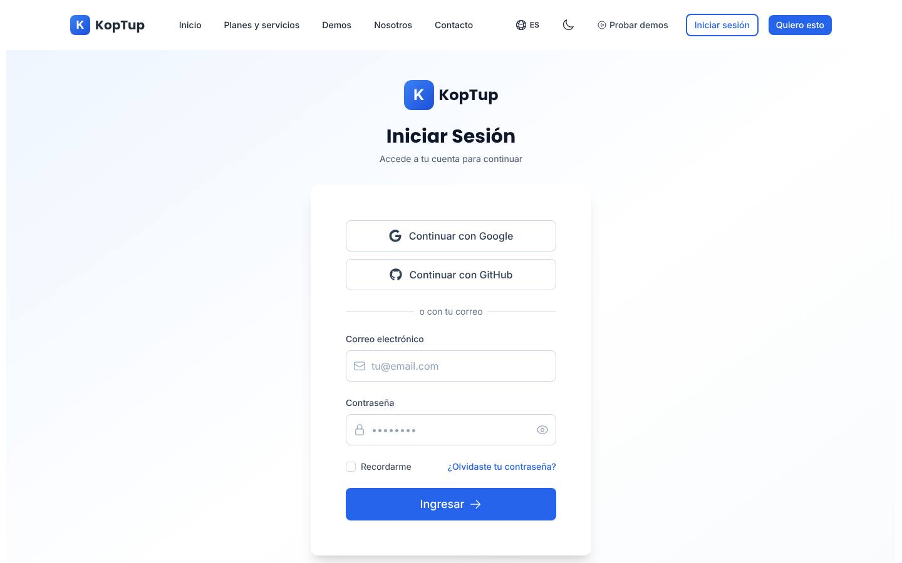
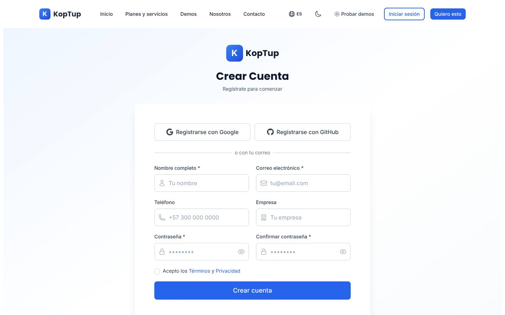
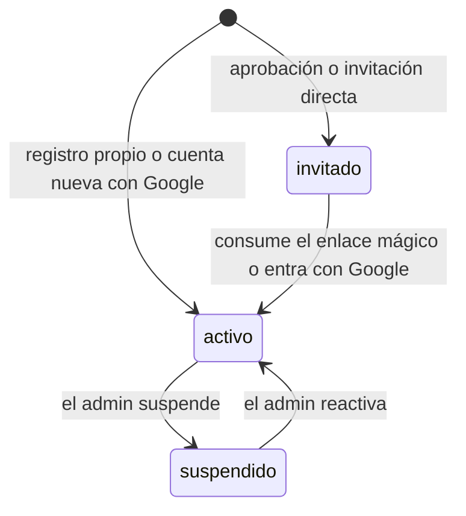
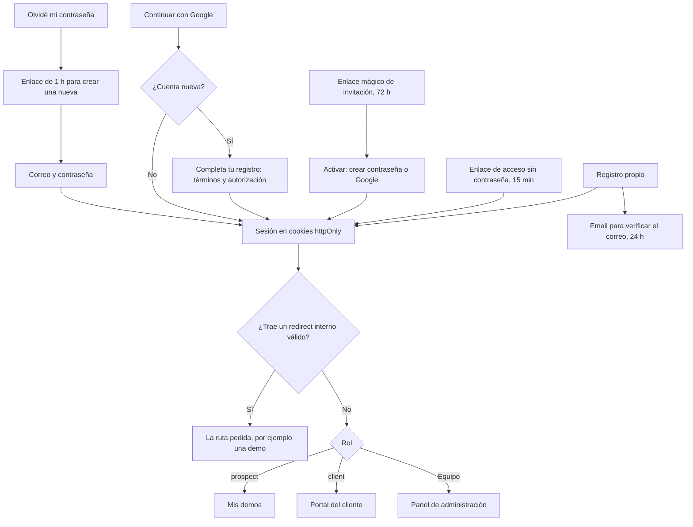
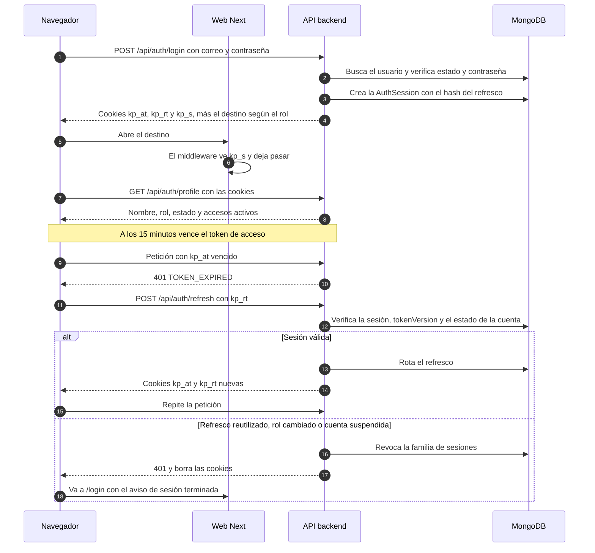
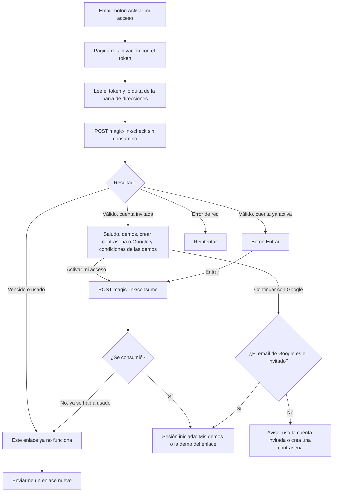

# Autenticación y cuentas

> Rutas: `/login`, `/register`, `/forgot-password`, `/reset-password` y `/auth/callback`, más las nuevas `/acceso/activar` y `/acceso/enlace` (de [Sistema de demos](04-Sistema-de-Demos.md)) y `/acceso/verificar` y `/acceso/completar` (propuestas en esta página) · Archivos principales: web: `apps/web/src/app/{login,register,forgot-password,reset-password}/page.tsx`, `apps/web/src/app/auth/callback/page.tsx`, `apps/web/src/lib/api.ts`, `apps/web/src/components/layout/{Navbar,ConditionalLayout}.tsx`, `apps/web/src/components/dashboard/DashboardLayout.tsx`, `apps/web/src/components/admin/AdminLayout.tsx`, `apps/web/middleware.ts`; backend: `apps/backend/src/routes/auth.routes.ts`, `apps/backend/src/controllers/auth.controller.ts`, `apps/backend/src/middleware/auth.ts`, `apps/backend/src/models/User.ts`, `apps/backend/src/config/passport.ts` · Prioridad: **P0** · Esfuerzo total: **XL** (≈ 43 días-dev, de los cuales ≈ 5 ya están contados en [Sistema de demos](04-Sistema-de-Demos.md); el núcleo P0 son ≈ 12 días)

*Captura de producción (rama `main`). Páginas relacionadas: [Sistema de demos](04-Sistema-de-Demos.md) (roles, enlace mágico y control de acceso), [Portal del cliente](06-Portal-del-Cliente.md), [Panel de administración](05-Panel-de-Administracion.md), [Legal](Seccion-Legal.md), [Contacto](Seccion-Contacto.md), [Seguridad y calidad](10-Seguridad-y-Calidad.md), [Backend y API](09-Backend-y-API.md).*

---

## Objetivo

La cuenta es lo que convierte a un visitante en un prospecto con demos y, después, en un cliente con proyecto. Esta sección tiene que lograr cinco cosas:

1. **Un prospecto aprobado llega a su demo con un clic:** el enlace mágico del email, crear la contraseña (o entrar con Google) y abrir **Mis demos**, sin volver a escribir sus datos.
2. **Una identidad por email que evoluciona** de invitado a prospecto y de prospecto a cliente, sin cuentas duplicadas y sin que nadie pierda su rol.
3. **Una sesión estable y segura:**
   - la barra de navegación no "cierra la sesión" a los 15 minutos;
   - las credenciales viven en cookies httpOnly;
   - se puede cerrar la sesión en todos los dispositivos.
4. **La interfaz depende del rol.** La barra muestra **Iniciar sesión** o, según el caso, **Mis demos**, **Mi portal** o **Panel**, y después de entrar cada rol llega a su lugar.
5. **La autorización se decide en el servidor**, con roles, estado de la cuenta y versión del token (DECISIÓN 5).

| Persona | Cómo obtiene su cuenta | Cómo entra | A dónde llega |
|---|---|---|---|
| Visitante | No la necesita para las demos públicas ni para "Prueba con tu documento" | — | — |
| Prospecto invitado | El comercial aprueba su solicitud o lo invita directamente | Enlace mágico de 72 h → crea su contraseña o entra con Google | `/dashboard/demos` (o la demo del enlace) |
| Prospecto con registro propio | `/register` o "Continuar con Google" | Correo y contraseña, o Google | `/dashboard` en su vista de prospecto: "Solicita tu primera demo" |
| Cliente | Su rol pasa a `client` al convertirse (es la misma cuenta) | Igual que antes | `/dashboard` |
| Equipo (`admin`, `sales`, `manager`, `developer`) | La crea o la asciende un `admin` | Correo y contraseña o Google (con 2FA en la Fase 2) | `/admin` |

---

## Estado actual

Evidencia tomada de la rama `main`.

| Bloque | Qué hay hoy | Evidencia |
|---|---|---|
| Proveedores | Correo y contraseña, y Google (Passport). El botón de GitHub aparece en el inicio de sesión y en el registro, pero no hace nada | `login/page.tsx` líneas 118–124 y 195–202; `register/page.tsx` líneas 149–155 y 218–221; `routes/auth.routes.ts` (sin ruta de GitHub) |
| Registro (backend) | Guarda solo nombre, email y contraseña, con el rol `user`. No envía verificación ni bienvenida | `auth.controller.ts` líneas 22–60 |
| Registro (web) | Pide teléfono y empresa, pero solo los guarda en `localStorage`. Inicia sesión automáticamente | `register/page.tsx` líneas 103–121 |
| Registro: textos | Una sola casilla "Acepto los Términos y Privacidad". Muestra requisitos de mayúscula, minúscula y número que no se exigen (solo se valida el largo). Tarjeta de plan con precios del catálogo viejo (por ejemplo, "Chatbot RAG · Profesional" a COP 489.000) | `register/page.tsx` líneas 28–44, 91, 157–162 y 418–436 |
| Roles y estados | `user`, `admin`, `manager` y `developer`. No existen `sales`, `prospect` ni `client`, ni estado de cuenta, verificación de email o versión de token | `models/User.ts` |
| Sesión en la web | El backend devuelve los tokens en el cuerpo. La web los guarda en cookies legibles desde JavaScript (`js-cookie`) y guarda el usuario en `localStorage` | `lib/api.ts` líneas 158–188 y 225–228; `login/page.tsx` líneas 68–71 |
| Sesión en el backend | El token de refresco vive en Redis con una sola clave por usuario: iniciar sesión en el celular cierra la sesión del portátil. Si Redis no responde, nadie puede iniciar sesión | `auth.controller.ts` líneas 99–100 y 135–140 |
| Invalidar sesiones | El refresco vuelve a leer el rol de la base (bien), pero no existen la suspensión de cuentas ni "cerrar sesión en todos los dispositivos". Hoy, para bloquear a alguien, habría que borrar su cuenta | `auth.controller.ts` líneas 124–165 |
| Destino al entrar | `/admin` si el rol es `admin` o si el email coincide con una regla fija en el código; si no, `/dashboard`. `?redirect=` se guarda en `sessionStorage` | `login/page.tsx` líneas 51–54 y 73–86 |
| Opciones sin efecto | "Recordarme" no cambia nada. "Continuar como invitado y ver demos" lleva a `/demo` | `login/page.tsx` líneas 274–287 y 323–333 |
| Google | Crea cuentas con el rol `user` sin aceptar términos ni autorización de datos, y vincula por email las cuentas que ya existen | `config/passport.ts` (callback de la estrategia) |
| Regreso de Google | `/auth/callback` siempre manda a `/dashboard`, aunque la cuenta sea de admin, e ignora `redirect`. El texto está en inglés ("Completing authentication...") | `auth/callback/page.tsx` líneas 22–56 |
| Error de Google | El backend redirige con `error=google_auth_failed`, pero la página espera `auth_failed`, así que muestra un error genérico | `routes/auth.routes.ts` línea 290; `login/page.tsx` línea 45 |
| Recuperar contraseña | Bien resuelto en lo esencial: responde lo mismo exista o no la cuenta, el token es aleatorio y se guarda en hash, vence en 1 h, es de un solo uso e invalida la sesión. Pero depende de Redis, las páginas no usan i18n y el token queda en la barra de direcciones | `auth.controller.ts` líneas 209–304; `forgot-password/page.tsx`; `reset-password/page.tsx` línea 19 |
| Cambio de contraseña en el perfil | **Simulado.** Muestra "Contraseña actualizada" sin llamar a la API. Guardar el perfil solo escribe en `localStorage` | `dashboard/profile/page.tsx` líneas 146–195 |
| Barra de navegación | Cree que hay sesión solo si existe la cookie del token de acceso, que dura 15 minutos. Después de 15 minutos sin actividad muestra "Iniciar sesión" y borra el usuario, aunque la sesión de 7 días siga vigente | `Navbar.tsx` líneas 53–67 |
| Menú de usuario | El mismo para todos los roles: Dashboard, Mi cuenta, Facturas y Soporte (que lleva a `/contact`). No hay enlace al panel para el equipo | `Navbar.tsx` líneas 256–285 |
| Barra sin sesión | "Probar demos", "Iniciar sesión" y "Quiero esto" (a `/pricing`, que solo redirige) | `Navbar.tsx` líneas 305–317 y 392–401 |
| Protección de páginas | Solo en el navegador, leyendo `localStorage` | `DashboardLayout.tsx` líneas 37–39; `AdminLayout.tsx` líneas 28–38 |
| Doble cabecera | `ConditionalLayout` solo oculta la navegación pública en `/dashboard`, así que `/admin` muestra dos cabeceras | `ConditionalLayout.tsx` líneas 11–16 |
| Middleware de Next | Solo maneja el idioma | `apps/web/middleware.ts` |
| Registros | Cada intento de inicio de sesión escribe el email en los logs | `auth.controller.ts` líneas 70 y 74 |
| Límite de intentos | 5 por minuto por IP, en la memoria de cada instancia | `middleware/rateLimiter.ts` líneas 22–29 |
| Metadata | `/login` y `/register` no tienen metadata propia: usan el título genérico del sitio. `robots.txt` las excluye, pero no tienen `noindex` | `public/robots.txt` líneas 17–18 |

---

## Problemas detectados

1. **No existe el camino del prospecto aprobado.** No hay roles `prospect`, `client` ni `sales`, ni cuentas en estado `invitado`, ni enlace mágico. El flujo de [Sistema de demos](04-Sistema-de-Demos.md) no tiene dónde apoyarse.
2. **La barra de navegación "cierra la sesión" sola.** A los 15 minutos el prospecto ve "Iniciar sesión" aunque su sesión siga vigente, y si vuelve a entrar puede cerrar la sesión de su otro dispositivo.
3. **Una sola sesión por persona.** Entrar desde el celular cierra la sesión del portátil, justo cuando el prospecto le muestra la demo a su jefe.
4. **Las credenciales viven donde JavaScript puede leerlas.** Los tokens están en cookies normales y el usuario en `localStorage`. Pasar a cookies httpOnly ya es una tarea de [Seguridad y calidad](10-Seguridad-y-Calidad.md).
5. **No hay forma de suspender una cuenta ni de cerrar todas sus sesiones.** Si un comercial deja el equipo, la única salida hoy es borrar su cuenta y perder su historial.
6. **El inicio de sesión depende de Redis.** Si Redis falla, nadie entra, ni los clientes ni el equipo.
7. **Las cuentas creadas con Google no aceptan nada:** ni términos ni autorización de datos (ver [Legal](Seccion-Legal.md)).
8. **El registro pierde datos y promete precios viejos.** Empresa y teléfono no llegan al backend, la tarjeta del plan muestra precios que contradicen los planes RAG y los requisitos de contraseña que se muestran no se exigen.
9. **El destino al entrar no respeta el rol ni lo que se pidió:** Google siempre lleva a `/dashboard` y el inicio de sesión decide el panel con una regla de email fija.
10. **Hay funciones simuladas que engañan:** el cambio de contraseña dice "actualizada" sin hacer nada; GitHub y "Recordarme" no funcionan.
11. **La protección de las páginas solo existe en el navegador**, y el equipo ve dos cabeceras en `/admin`.
12. **Textos sin i18n y con voseo:** "Iniciá sesión para continuar", "Creá tu cuenta", "Completing authentication...".
13. **Datos personales en los logs:** el email de cada intento de inicio de sesión.

---

## Plan detallado

### 1. Identidad, roles y estados

El modelo `User` cambia como define la sección 5.2 de [Sistema de demos](04-Sistema-de-Demos.md). Esta página propone tres campos más.

| Campo | Valores | Origen |
|---|---|---|
| `role` | `admin`, `sales`, `manager`, `developer`, `prospect`, `client` (`user` solo durante la migración) | Sistema de demos |
| `accountStatus` | `invitado`, `activo`, `suspendido` | Sistema de demos |
| `tokenVersion` | número | Sistema de demos |
| `emailVerifiedAt` | fecha o nulo | Sistema de demos |
| `leadId`, `company`, `phone` | | Sistema de demos |
| `jobTitle` | texto | **Propuesto aquí** (lo pide el registro) |
| `termsAcceptance` | `{ version, at, ipHash }` | **Propuesto aquí** (ver [Legal](Seccion-Legal.md)) |
| `twoFactor` | `{ enabled, secretEnc, recoveryHashes[] }`, solo para el equipo | **Propuesto aquí** (Fase 2) |

**Cómo cambia el rol**

| Evento | Rol resultante | Regla |
|---|---|---|
| Registro propio o cuenta nueva con Google | `prospect` | Desde la migración, `register` nunca crea `user` |
| Aprobación o invitación directa | `prospect`, si el email no tenía cuenta | Si ya existe, **no se baja el rol**: un `client` o alguien del equipo conserva el suyo (caso borde de la sección 16) |
| Conversión (`POST /api/demo-grants/:id/convert` o propuesta aceptada) | `client` | `tokenVersion++` |
| El admin asigna `admin` o `sales` | El asignado | Solo un `admin` puede hacerlo. Queda en `AuditLog` y hace `tokenVersion++` |
| Migración inicial | `client` si tiene `Project` u `Order`; si no, `prospect` | `scripts/migrate-roles.ts` con `--dry-run` |

Una cuenta `invitado` no tiene contraseña y no puede iniciar sesión. Para eso necesita el enlace. Una cuenta `suspendido` no puede iniciar sesión ni refrescar. La supresión por la Ley 1581 se hace anonimizando el Lead y la cuenta (ver [Legal](Seccion-Legal.md)); no es un estado.

### 2. Formas de entrar

### 3. Destino después de entrar

Una sola función, `lib/auth-redirect.ts` (`destinationFor(user, redirect)`). La usan el inicio de sesión, el regreso de Google, la activación y el enlace de acceso.

| Rol | Destino por defecto |
|---|---|
| `prospect` | `/dashboard/demos` |
| `client` | `/dashboard` |
| `admin`, `sales`, `manager`, `developer` | `/admin` |

**Reglas de `?redirect=`** (`lib/safe-redirect.ts`):
- solo se aceptan rutas internas relativas que empiecen por una de las secciones conocidas: `/demo/`, `/dashboard`, `/admin`, `/productos/` o `/solicitar-demo`;
- todo lo demás se descarta y se usa el destino del rol;
- si la ruta pedida no corresponde al rol (un prospecto que pide `/admin`), también se usa el destino del rol.

Se elimina la regla del email fijo en el inicio de sesión.

### 4. Sesión con cookies httpOnly

Es una tarea de la Fase 0 con prioridad P1: no bloquea el sistema de demos (sección 17 de [Sistema de demos](04-Sistema-de-Demos.md)), pero arregla la barra de navegación, las sesiones múltiples y la dependencia de Redis.

| Elemento | Especificación |
|---|---|
| Dominio de la API | La API se publica en un subdominio propio del dominio principal (dominio personalizado en Railway). Así la web y la API son el mismo sitio y las cookies no cuentan como de terceros, que los navegadores bloquean cada vez más |
| `kp_at` | JWT de acceso de 15 min: `HttpOnly; Secure; SameSite=Lax; Domain=<dominio principal>; Path=/`. Claims: `sub`, `role`, `tv` (versión del token) y `sid` (sesión) |
| `kp_rt` | Token de refresco opaco y aleatorio, del que se guarda solo el hash. Dura 7 días, o 30 con "Recordarme". `HttpOnly; Secure; SameSite=Lax; Path=/api`, así llega tanto a la API como a `/api/demo-pass` de Next. Cambia en cada uso |
| `kp_s` | Indicador sin datos (`1`), legible por la interfaz y con la misma duración que la sesión. Sirve para pintar la barra sin esperar a la API. **Nunca** se usa para autorizar |
| `authenticate` (`middleware/auth.ts`) | Lee `kp_at` de la cookie. Acepta `Authorization: Bearer` solo en llamadas de servidor a servidor, por ejemplo desde `/api/demo-pass` con `INTERNAL_API_KEY` |
| Escrituras | `SameSite=Lax`, verificación del encabezado `Origin` contra la lista permitida en toda petición que escribe, y solo cuerpos JSON |
| `AuthSession` (MongoDB, modelo nuevo) | `userId`, `refreshHash`, `familyId`, `userAgent`, `ipHash`, `remember`, `createdAt`, `lastUsedAt`, `expiresAt` (TTL) y `revokedAt`. Hasta **3 sesiones activas** para `prospect` (sección 15 de Sistema de demos) y 5 para los demás; al abrir una más, se cierra la más antigua. Si se reutiliza un refresco ya rotado, se revoca toda la familia |
| `tokenVersion` | Sube al cambiar el rol, al suspender, al restablecer la contraseña y con "Cerrar sesión en todos los dispositivos". El refresco la compara; las rutas del equipo la verifican contra la base con una caché de 60 s |
| Redis | Deja de ser necesario para iniciar sesión: las sesiones, los enlaces mágicos y el restablecimiento de contraseña pasan a MongoDB. Queda opcional para el rate-limit y la caché |
| Transición | Durante 2 semanas el backend acepta la cookie y el encabezado. La web deja de usar `js-cookie` y `localStorage.user`; los datos del usuario se leen con `useSession()` |

**Cerrar sesión**
- `POST /api/auth/logout` revoca la sesión actual y borra las cookies; después la web lleva a la página de inicio con el aviso "Cerraste sesión".
- En **Mi cuenta**, "Cerrar sesión en todos los dispositivos" llama a `POST /api/auth/logout-all` (endpoint nuevo propuesto), que hace `tokenVersion++` y revoca todas las sesiones.

### 5. Activación por enlace mágico

La secuencia del backend está en la sección 7.2 de [Sistema de demos](04-Sistema-de-Demos.md). Aquí se definen las pantallas de `/acceso/activar?token=`.

| Estado | Qué ve el prospecto (texto propuesto) | Acciones |
|---|---|---|
| Validando | Esqueleto de la tarjeta | — |
| Enlace válido, cuenta `invitado` | **"Hola, {nombre}. Activa tu acceso"** · "Tienes acceso a {demos} hasta el {fecha}." · Correo: {email enmascarado} (solo lectura) | Campo **Crea tu contraseña** (con "Mostrar" y la regla "mínimo 10 caracteres") · **Continuar con Google** · Casilla "Acepto las condiciones de uso de las demos" (enlace a `/terms#demos`) · Si la invitación fue directa y no hay autorización previa: casilla de autorización de datos · Botón **Activar mi acceso** (deshabilitado hasta marcar las casillas obligatorias) |
| Enlace válido, cuenta `activo` (enlace de acceso) | "Hola, {nombre}. Entra a tus demos" | Botón **Entrar** (consume el enlace) |
| Vencido o ya usado | **"Este enlace ya no funciona"** · "Los enlaces duran 72 horas y sirven una sola vez." | Campo de correo + **Enviarme un enlace nuevo** (`POST /api/auth/magic-link/request`, que siempre responde 200) · enlace a **Iniciar sesión** |
| Google con otro email | "La cuenta de Google ({otro email}) no coincide con la invitación ({email enmascarado})." | Volver a intentar con Google · Crear contraseña |
| Error de red | "No pudimos verificar tu enlace. Revisa tu conexión." | **Reintentar** |

**Detalles**
- **El token:** se lee una vez y se reemplaza la URL con `history.replaceState`. La página lleva `Referrer-Policy: no-referrer` y no carga scripts de analítica ni de terceros. Lo mismo aplica a `/reset-password` y `/acceso/verificar`.
- **Abrir el enlace no gasta el token.** Solo lo consume el botón; los filtros de correo abren los enlaces antes que la persona (DECISIÓN 6 de Sistema de demos).
- **Destino:** si el email de invitación es de una sola demo, el enlace puede llevar `next=/demo/<slug>`, que pasa por `safe-redirect` antes de usarse.
- **`/acceso/enlace`:** formulario de un campo, "Escribe tu correo y te enviamos un enlace para entrar". Siempre responde "Si tu correo tiene acceso, te llegará un enlace en unos minutos".

### 6. Inicio de sesión (`/login`)

| Elemento | Texto propuesto |
|---|---|
| H1 | Inicia sesión |
| Subtítulo | Entra a tus demos, propuestas y proyectos. |
| Con `?redirect=/demo/<slug>` | Aviso: "Inicia sesión para abrir la demo de {nombre de la demo}". Se muestra el nombre del catálogo, no la ruta |
| Botón social | Continuar con Google (se quita GitHub) |
| Separador | o con tu correo |
| Campos | Correo electrónico · Contraseña (con "Mostrar") |
| Casilla | Recordarme en este equipo (mantiene la sesión 30 días en lugar de 7) |
| Enlaces | ¿Olvidaste tu contraseña? · Prefiero recibir un enlace de acceso por correo (P2) |
| Botón | Entrar |
| Bloque inferior | "¿Te invitamos a una demo? Usa el botón **Activar mi acceso** del correo o pide un enlace nuevo." · "¿Aún no tienes acceso? **Solicita una demo** · **Prueba la demo sin registro**" (reemplaza "Continuar como invitado y ver demos") |

**Mensajes**

| Caso | Mensaje |
|---|---|
| Credenciales incorrectas, o cuenta `invitado` (no tiene contraseña) | "Correo o contraseña incorrectos. Si te invitamos a una demo y aún no activas tu cuenta, pide un enlace nuevo. Si entraste antes con Google, usa Continuar con Google." Para no revelar qué correos existen, es el mismo mensaje en los tres casos |
| Cuenta `suspendido` (contraseña correcta) | "Tu cuenta está suspendida. Escríbenos a {buzón de soporte}." |
| Muchos intentos | "Hiciste varios intentos. Completa la verificación o inténtalo en 15 minutos." Aparece Turnstile |
| Sin conexión | "No pudimos conectar con el servidor. Revisa tu conexión e inténtalo de nuevo." |
| `?session=expired` | "Tu sesión terminó. Vuelve a entrar para continuar." |
| `?error=google` | "No pudimos entrar con Google. Inténtalo de nuevo o usa tu correo." El backend y la página usan el mismo código |

### 7. Registro (`/register`)

**Se conserva**, pero cambia de papel. La puerta principal para pedir una demo es **Solicitar demo**. El registro sirve a quien quiere una cuenta para pedir demos desde el portal y seguir sus solicitudes.

| Elemento | Texto o regla |
|---|---|
| H1 | Crea tu cuenta |
| Subtítulo | Para pedir demos, seguir tus solicitudes y recibir propuestas. |
| Aviso | "¿Solo quieres probar? La demo del asistente RAG no pide registro." · "¿Quieres que te mostremos un producto? **Solicitar demo**" |
| Campos | Nombre completo\* · Correo de trabajo\* · Empresa\* · Cargo · Teléfono o WhatsApp · Contraseña\* (con "Mostrar"; sin campo de confirmación) |
| Contraseña | Mínimo 10 caracteres y máximo 128, sin reglas de mayúsculas ni símbolos, comparada con una lista de contraseñas comunes. La misma regla en la web y en el backend (`lib/password-policy.ts`) |
| Casillas | "Acepto los **Términos y condiciones**"\* · "Autorizo a KopTup a tratar mis datos personales para crear y administrar mi cuenta y contactarme sobre mis solicitudes, según la **Política de tratamiento de datos**"\* · "Quiero recibir novedades y contenido comercial de KopTup" (opcional). Las tres sin marcar |
| Anti-abuso | Turnstile, honeypot y rate-limit (5 registros por hora por IP) |
| Backend | Rol `prospect`, `accountStatus = activo`, `company`, `phone` y `jobTitle` guardados; upsert del Lead (`source.channel = portal`), `ConsentRecord` (canal `portal`), `termsAcceptance` y email de verificación |
| Después | `/dashboard` en su vista de prospecto, con la lista: 1. Verifica tu correo · 2. Solicita tu primera demo · 3. Agenda una llamada |
| `?producto=` o `?plan=` | Tarjeta lateral con el producto o el plan, leída de la misma constante de precios que `/services` (planes RAG) o de `services-catalog.ts`. Al terminar, el botón **Solicitar la demo de {producto}** sale precargado. Se elimina `PLAN_PREVIEW` con sus precios viejos |

### 8. Continuar con Google

- **Sin credenciales en la URL:**
  - el callback del backend fija las cookies de sesión (sección 4) y redirige al destino que calcula `auth-redirect`;
  - el parámetro `state` de OAuth, firmado, transporta el `redirect` y, si existe, la invitación.
- **Email verificado:** solo se aceptan perfiles de Google con el email verificado.
- **Cuenta nueva:**
  - se crea con `prospect`, `activo` y `emailVerifiedAt` (Google ya lo verificó);
  - antes de entrar al portal pasa por **`/acceso/completar`** (propuesta aquí): "Completa tu registro", con empresa, cargo y teléfono opcional, y las mismas tres casillas del registro;
  - mientras no acepte, `GET /api/auth/profile` responde `needsCompletion: true` y la web lo vuelve a llevar ahí.
- **Email invitado:** si coincide con una cuenta `invitado`, la activa y marca como usados sus enlaces pendientes (caso borde de la sección 16 de [Sistema de demos](04-Sistema-de-Demos.md)).
- **Cuenta local con el mismo email:** se vincula agregando `google_id`, como hoy.
- **`/auth/callback`:** queda como pantalla de paso, en español ("Iniciando sesión…"), y respeta el destino.

### 9. Contraseñas: recuperar, restablecer y cambiar

- **`/forgot-password`:**
  - pasa a i18n y conserva la respuesta única ("Si existe una cuenta con ese correo, te enviamos un enlace");
  - el email que se envía depende de la cuenta:

    | Tipo de cuenta | Email |
    |---|---|
    | Cuenta local | Enlace para restablecer, válido 1 hora |
    | Solo con Google | "Tu cuenta usa Google para entrar" |
    | `invitado` | Una invitación nueva de 72 horas |

- **Tokens:** pasan de Redis a `MagicLinkToken`, con dos propósitos nuevos que esta página propone sumar al enum: `reset` (1 h) y `verificacion` (24 h).
- **`/reset-password`:**
  - el token sale de la URL al leerlo;
  - si falla: "El enlace venció o ya se usó" con **Enviarme uno nuevo**;
  - si funciona: `tokenVersion++`, se revocan todas las sesiones y llega el email "Tu contraseña cambió".
- **Cambio de contraseña en Mi cuenta:**
  - `POST /api/auth/change-password` (nuevo), que pide la contraseña actual y la nueva;
  - opción "Cerrar las otras sesiones";
  - reemplaza el formulario simulado de `dashboard/profile/page.tsx`;
  - guardar el perfil usa la API (`PATCH /api/me/profile`, nuevo) en lugar de `localStorage`.

### 10. Verificación del correo

- **Quién la necesita:** solo las cuentas de registro propio con contraseña. Las que se activan con un enlace mágico o con Google quedan verificadas automáticamente, porque ya demostraron que controlan el correo.
- **Flujo:**
  - email `account_verify` con un enlace de 24 h;
  - `/acceso/verificar?token=` (propuesta aquí) consume el token con un POST y fija `emailVerifiedAt`.
- **En el portal:** banner "Confirma tu correo para pedir demos" con **Reenviar** (máximo 3 por hora).
- **Efecto:** sin verificar, la persona entra al portal, pero `POST /api/me/demo-requests` responde 403 `email_no_verificado` y no recibe comunicaciones comerciales.

### 11. Barra de navegación y menú de usuario

La sesión se lee con `useSession()`:
- usa `GET /api/auth/profile`, ampliado con `accountStatus`, `emailVerified`, `needsCompletion`, `activeGrants`, `expiringGrants` y, para `admin` y `sales`, `pendingDemoRequests`;
- tiene una caché de 60 s;
- `kp_s` evita el parpadeo mientras carga.

La barra deja de mirar la cookie de 15 minutos.

| Estado | Barra (escritorio) | Menú de usuario |
|---|---|---|
| Sin sesión | **Iniciar sesión** (contorno) · **Solicitar demo** (principal). Reemplaza "Probar demos" y "Quiero esto" | — |
| Cargando (`kp_s` presente) | Marcador del mismo ancho que el botón final, para que no se mueva la barra | — |
| `prospect` | **Mis demos**, con el número de accesos activos y un punto ámbar si alguno vence en 3 días o menos | Mis demos · Agendar llamada · Mi cuenta · Mis datos · Cerrar sesión |
| `client` | **Mi portal** | Proyectos · Facturas · Mensajes · Mis demos (si tiene) · Mi cuenta · Mis datos · Cerrar sesión |
| Equipo | **Panel**, con el número de solicitudes pendientes (solo `admin` y `sales`) | Panel · Solicitudes de demo · Mi cuenta · Cerrar sesión |

En móvil se repiten las mismas opciones dentro del menú, a ancho completo. "Soporte" deja de llevar a `/contact`; para un cliente, lleva a **Mensajes**.

Después de entrar, el prospecto llega a **Mis demos**:

### 12. Protección de páginas: interfaz y servidor

- **Middleware de Next** (`apps/web/middleware.ts`):
  - conserva la lógica de idioma y la del pase de demo de la sección 10.2 de [Sistema de demos](04-Sistema-de-Demos.md);
  - para `/dashboard/*` y `/admin/*` sin `kp_s`, redirige a `/login?redirect=<ruta>`;
  - es solo comodidad: la autorización real sigue en la API.
- **Layouts:**
  - `DashboardLayout` y `AdminLayout` dejan de leer `localStorage` y usan `useSession()`;
  - con el rol equivocado muestran "No tienes acceso a esta sección" y un botón al destino de su rol;
  - el menú del panel depende del rol (tarea 23 de Sistema de demos).
- **`ConditionalLayout`:**
  - oculta la navegación pública en `/admin` (se acaba la doble cabecera);
  - en `/acceso/*` muestra una cabecera mínima, solo con el logo.
- **Servidor:** `authenticate` + `requirePermission` en todas las rutas (sección 3 de Sistema de demos), con `accountStatus` y `tokenVersion` verificados.

### 13. Correos de la cuenta

Todos pasan por el outbox (`OutboundMessage`) y viven en `apps/backend/src/templates/account/`. Las invitaciones (`demo_invite_*`, `invite_reminder`, `demo_new_access`) ya están en la sección 11 de [Sistema de demos](04-Sistema-de-Demos.md).

| Plantilla | Cuándo | Asunto |
|---|---|---|
| `account_verify` | Registro propio | Confirma tu correo para empezar |
| `access_link` | "Prefiero recibir un enlace de acceso" | Tu enlace para entrar a KopTup |
| `password_reset` | Olvidé mi contraseña (cuenta local) | Restablece tu contraseña |
| `password_reset_google` | Olvidé mi contraseña (cuenta solo con Google) | Tu cuenta usa Google para entrar |
| `password_changed` | Contraseña restablecida o cambiada | Tu contraseña cambió |
| `new_device_login` (P3) | Inicio de sesión desde un dispositivo nuevo | Nuevo inicio de sesión en tu cuenta |

**`password_changed`** (texto propuesto):
> **Asunto:** Tu contraseña cambió
>
> Hola {{nombre}}:
>
> La contraseña de tu cuenta de KopTup cambió el {{fecha}} a las {{hora}} (hora de Colombia). Por seguridad, cerramos tus otras sesiones.
>
> Si no fuiste tú, restablécela ahora: {{resetUrl}} y escríbenos a {{buzonSoporte}}.

### 14. Anti-abuso y registros

- **Rate-limit con almacén compartido** (tarea transversal de [Seguridad y calidad](10-Seguridad-y-Calidad.md)):

  | Acción | Límite |
  |---|---|
  | Inicio de sesión | Por IP y por correo. Después de 5 intentos fallidos en 15 minutos, se pide Turnstile |
  | Registro | 5 por hora por IP |
  | Olvidé mi contraseña y enlace nuevo | 3 por hora por correo |

- **Respuestas uniformes** en todos los endpoints públicos que tocan cuentas.
- **Logs:**
  - sin correos en claro: se guarda un hash del correo y el resultado;
  - una alerta al admin si hay muchos intentos fallidos sobre cuentas del equipo.
- **2FA para el equipo** (Fase 2): TOTP con códigos de recuperación, obligatorio para `admin` y `sales`, porque son quienes dan acceso a las demos privadas.

### Cambios propuestos en la API

Se suman a los de la sección 8 de [Sistema de demos](04-Sistema-de-Demos.md) y deben agregarse a [Backend y API](09-Backend-y-API.md).

| Método | Ruta | Rol | Descripción |
|---|---|---|---|
| POST | `/api/auth/logout-all` | autenticado | Cierra todas las sesiones (`tokenVersion++`) |
| POST | `/api/auth/change-password` | autenticado | Pide la contraseña actual y la nueva; puede cerrar las otras sesiones |
| POST | `/api/auth/verify-email/request` | autenticado | Reenvía el email de verificación (con rate-limit) |
| POST | `/api/auth/verify-email/consume` | público (token) | Fija `emailVerifiedAt` |
| POST | `/api/auth/complete-profile` | autenticado (`needsCompletion`) | Empresa, cargo, teléfono, términos y autorización para las cuentas nuevas de Google |
| PATCH | `/api/me/profile` | autenticado | Guarda el perfil (reemplaza el guardado en `localStorage`) |
| GET (modificado) | `/api/auth/profile` | autenticado | Agrega estado, verificación, `needsCompletion` y contadores para la barra |
| POST (modificado) | `/api/auth/login`, `/api/auth/refresh`, `/api/auth/logout` | — | Usan cookies httpOnly y `AuthSession` |
| POST (modificado) | `/api/auth/register` | público | Turnstile, campos nuevos, Lead, autorización y verificación |
| POST (modificado) | `/api/auth/forgot-password`, `/api/auth/reset-password` | público | Tokens en `MagicLinkToken` (`reset`), email según el tipo de cuenta, `tokenVersion++` |

---

## Integración con el sistema de demos

| Punto | Comportamiento | Referencia en [Sistema de demos](04-Sistema-de-Demos.md) |
|---|---|---|
| Roles y permisos | `sales`, `prospect` y `client` existen y se verifican en el servidor con `requirePermission` | Sección 3 y tareas 1 y 2 |
| Cuenta al aprobar | La aprobación crea o vincula el usuario `prospect` en estado `invitado`, sin bajar el rol de nadie | Secciones 7.2 y 16 |
| Enlace mágico | `check` no consume el token y `consume` lo gasta una sola vez. Los propósitos `invitacion` y `acceso` se amplían con `reset` y `verificacion` | Secciones 5.1 y 8.2, tarea 12 |
| Activación | `/acceso/activar` y `/acceso/enlace`, con las condiciones de las demos | Sección 9, tarea 21 |
| Inicio de sesión | Rechaza `invitado` y `suspendido`, y redirige por rol | Sección 8.6 |
| Demo sin acceso | `/demo/acceso?motivo=sin_sesion` → **Iniciar sesión** → `/login?redirect=/demo/<slug>` → de vuelta a la demo con el pase emitido | Secciones 10.1 y 10.2 |
| Pase de demo | `/api/demo-pass` lee `kp_at` (y lo renueva con `kp_rt`) del dominio principal | Sección 10.2 |
| Conversión | Pasar a `client` sube `tokenVersion`; en el siguiente refresco la barra muestra **Mi portal** | Sección 8.4 (`convert`) |
| Sesiones compartidas | Hasta 3 sesiones activas por prospecto | Sección 15 |
| Pedir otra demo desde el portal | `POST /api/me/demo-requests` exige el correo verificado | Sección 8.3 |
| Email del equipo | Si alguien solicita una demo con un correo del equipo, el panel avisa y no aprueba | Sección 16 |

---

## SEO · i18n · accesibilidad · rendimiento

**SEO**
- Todas las páginas de autenticación y de `/acceso/*` llevan `robots: noindex, nofollow` en su metadata (no basta con `robots.txt`).
- Títulos propios: "Iniciar sesión | KopTup", "Crear cuenta | KopTup", "Activa tu acceso | KopTup", "Recuperar contraseña | KopTup".

**i18n**
- Todo el texto va en `messages`: `loginPage`, `registerPage` y un namespace nuevo `authPages` para recuperar, restablecer, activar, verificar y completar.
- Español con "tú" (sin "Iniciá" ni "Creá") y textos en inglés.
- Se borran los `TODO: extract to i18n` y el texto en inglés de `/auth/callback`.

**Accesibilidad**
- Etiquetas visibles y `autocomplete`: `email`, `current-password` en el inicio de sesión y `new-password` en el registro, la activación y el restablecimiento.
- Botón "Mostrar" con `aria-pressed` y etiqueta.
- Errores con `aria-live` y foco en el primer campo con error.
- No se bloquea pegar la contraseña, para que funcionen los gestores de contraseñas.
- Contraste AA y foco visible.
- Turnstile en modo gestionado: casi nunca pide interacción.

**Rendimiento**
- Las páginas son cascarones server con formularios client pequeños, y solo reciben sus namespaces de mensajes.
- Sin analítica ni scripts de terceros en `/acceso/*`, `/reset-password` ni `/auth/callback`: es un tema de privacidad y de seguridad, porque esas páginas reciben tokens.

---

## Tareas

| # | Tarea | Fase | Prioridad | Esfuerzo | Criterio de aceptación |
|---|---|---|---|---|---|
| 1 | Roles `sales`, `prospect` y `client`, `accountStatus`, `tokenVersion`, `emailVerifiedAt`, `jobTitle` y `termsAcceptance` en `User`, más la migración. **Es la tarea 1 de [Sistema de demos](04-Sistema-de-Demos.md)** | Fase 1 — Funnel y solicitud de demos | P0 | S | El enum acepta los roles nuevos; `migrate-roles --dry-run` reporta los cambios sin escribir; `register` crea `prospect` |
| 2 | El inicio de sesión rechaza `invitado` y `suspendido` con los mensajes de la sección 6, uniformes para no revelar qué cuentas existen | Fase 1 — Funnel y solicitud de demos | P0 | S | Una cuenta invitada y una contraseña incorrecta reciben el mismo mensaje y el mismo código; una cuenta suspendida con la contraseña correcta ve el aviso de suspensión |
| 3 | `lib/auth-redirect.ts` y `lib/safe-redirect.ts`, usados en el inicio de sesión, Google, la activación y el enlace de acceso; se elimina la regla del email fijo | Fase 1 — Funnel y solicitud de demos | P0 | S | Una prueba con tabla (rol × redirect) pasa; un `redirect` externo o a una sección que no corresponde al rol se ignora |
| 4 | Pantallas `/acceso/activar` y `/acceso/enlace` con todos los estados de la sección 5, el token fuera de la URL y sin scripts de terceros. **Es la tarea 21 de Sistema de demos** (el backend es su tarea 12) | Fase 1 — Funnel y solicitud de demos | P0 | S | Con un token válido se activa la cuenta y se llega a Mis demos en ≤ 2 clics; con uno vencido se ofrece uno nuevo; la URL no conserva el token |
| 5 | Barra de navegación por estado y rol con `useSession()` y `GET /api/auth/profile` ampliado; se quitan "Probar demos" y "Quiero esto" | Fase 1 — Funnel y solicitud de demos | P0 | S | Un prospecto inactivo 20 minutos sigue viendo **Mis demos**; un cliente ve **Mi portal**; el equipo ve **Panel** con el número de pendientes; sin sesión se ve **Iniciar sesión** y **Solicitar demo** |
| 6 | Rate-limit con almacén compartido en inicio de sesión, registro, recuperación y enlaces, y Turnstile después de 5 fallos | Fase 0 — Endurecimiento | P0 | S | El límite por correo funciona aunque cambie la IP y con 2 instancias del backend; después de 5 fallos se exige el captcha |
| 7 | Logs de autenticación sin correos en claro (hash) y alerta por intentos fallidos sobre cuentas del equipo | Fase 0 — Endurecimiento | P1 | S | Los logs de un inicio de sesión de prueba no contienen el correo |
| 8 | Sesión en cookies httpOnly: subdominio propio para la API, cookies `kp_at`, `kp_rt` y `kp_s`, `authenticate` por cookie, verificación de `Origin`, `withCredentials` en la web y retiro de `js-cookie` y `localStorage.user` | Fase 0 — Endurecimiento | P1 | L | Ningún token es legible desde JavaScript; `/api/demo-pass` lee la sesión; una petición de escritura con un `Origin` no permitido responde 403 |
| 9 | `AuthSession` en MongoDB con rotación del refresco, detección de reutilización, máximo 3 sesiones por prospecto, "Recordarme" de 30 días y `POST /api/auth/logout-all` | Fase 0 — Endurecimiento | P1 | M | Entrar desde un segundo dispositivo no cierra el primero; reutilizar un refresco revoca la familia; con Redis apagado se puede iniciar sesión |
| 10 | Google sin credenciales en la URL: el callback fija las cookies, `state` firmado con el redirect y la invitación, emails verificados, `/acceso/completar` para las cuentas nuevas y activación de invitados | Fase 1 — Funnel y solicitud de demos | P1 | M | Un invitado que entra con Google con el mismo email queda activo y llega a Mis demos; una cuenta nueva no entra al portal sin aceptar términos y autorización; el código de error es el mismo en el backend y en la web |
| 11 | Quitar los botones de GitHub del inicio de sesión y del registro | Fase 1 — Funnel y solicitud de demos | P1 | S | No queda ningún botón que no haga nada |
| 12 | Registro rediseñado: campos, contraseña única de mínimo 10 caracteres, casillas separadas, Turnstile, Lead, `ConsentRecord`, `termsAcceptance`, vista de prospecto al terminar y sin `PLAN_PREVIEW` | Fase 1 — Funnel y solicitud de demos | P1 | M | Empresa y teléfono quedan en la base; el Lead tiene canal `portal`; no aparece ningún precio fuera de la constante de planes |
| 13 | Verificación del correo para los registros propios: `MagicLinkToken` con el propósito `verificacion`, `/acceso/verificar`, banner con Reenviar y bloqueo de `POST /api/me/demo-requests` sin verificar | Fase 1 — Funnel y solicitud de demos | P1 | S | Sin verificar, pedir una demo desde el portal responde 403 `email_no_verificado`; al verificar, el banner desaparece |
| 14 | Recuperar y restablecer: i18n, tokens en `MagicLinkToken` (`reset`), email según el tipo de cuenta, token fuera de la URL, `tokenVersion++` y email `password_changed` | Fase 1 — Funnel y solicitud de demos | P2 | S | Restablecer la contraseña cierra todas las sesiones; una cuenta solo de Google recibe el email "Tu cuenta usa Google"; una invitada recibe una invitación nueva |
| 15 | Cambio de contraseña real (`POST /api/auth/change-password`) y perfil guardado con `PATCH /api/me/profile`; se retiran las simulaciones de `dashboard/profile/page.tsx` | Fase 1 — Funnel y solicitud de demos | P1 | S | Cambiar la contraseña con la actual incorrecta falla; con la correcta, la nueva funciona y la vieja no |
| 16 | `ConditionalLayout`: sin navegación pública en `/admin` y con cabecera mínima en `/acceso/*` | Fase 1 — Funnel y solicitud de demos | P2 | S | `/admin` muestra una sola cabecera |
| 17 | Middleware de Next que redirige `/dashboard` y `/admin` sin sesión a `/login?redirect=`, y layouts que usan `useSession()` en lugar de `localStorage` | Fase 1 — Funnel y solicitud de demos | P1 | S | Abrir `/dashboard/demos` sin sesión lleva al inicio de sesión y, al entrar, vuelve a Mis demos; un prospecto en `/admin` ve "No tienes acceso" |
| 18 | Metadata de las páginas de autenticación: títulos propios y `noindex` | Fase 1 — Funnel y solicitud de demos | P2 | S | El HTML de `/login` tiene su título y `robots: noindex`; `npm run check-titles` pasa |
| 19 | Plantillas de cuenta (`account_verify`, `access_link`, `password_reset`, `password_reset_google`, `password_changed`) por el outbox | Fase 1 — Funnel y solicitud de demos | P2 | S | Las pruebas de instantánea pasan; cada email lleva el enlace correcto y el pie con la política |
| 20 | "Prefiero recibir un enlace de acceso" en `/login`, con el propósito `acceso` (15 min) que ya define Sistema de demos | Fase 1 — Funnel y solicitud de demos | P2 | S | El enlace funciona una sola vez y vence a los 15 minutos; la respuesta es igual exista o no la cuenta |
| 21 | Pruebas: unitarias (tokens, roles, redirecciones, política de contraseñas), de integración (login de invitado y suspendido, refresco con `tokenVersion`, rotación) y E2E (invitación → activación → Mis demos; demo sin acceso → login → demo) | Fase 1 — Funnel y solicitud de demos | P0 | M | Las pruebas corren en el CI (cuando la Fase 0 lo repare) y cubren los 6 roles |
| 22 | i18n y "tú" en todas las páginas de autenticación (`authPages`), sin voseo y sin textos en inglés en la versión en español | Fase 1 — Funnel y solicitud de demos | P2 | S | Una búsqueda de voseo en `login`, `register`, `forgot-password`, `reset-password`, `auth` y `acceso` no encuentra resultados |
| 23 | 2FA (TOTP) con códigos de recuperación, obligatorio para `admin` y `sales` | Fase 2 — Demos vendibles | P2 | M | Una cuenta `admin` sin 2FA configurado no puede aprobar solicitudes; un código de recuperación sirve una sola vez |

---

## Métricas de éxito

Metas iniciales, para validar con 8 semanas de datos reales (ver la nota de [Flujo del cliente](03-Flujo-del-Cliente.md)).

| Métrica | Fuente | Meta inicial |
|---|---|---|
| Invitaciones activadas dentro de las 72 h | `MagicLinkToken` (`usedAt`) / invitaciones enviadas | ≥ 70 % |
| Mediana entre el email de invitación y la primera demo abierta | `OutboundMessage.sentAt` → primer `DemoEvent` `open` | ≤ 30 minutos |
| Activaciones que terminan en "enlace vencido o usado" | Eventos de `/acceso/activar` | < 10 % |
| Prospectos que ven "Iniciar sesión" con una sesión vigente | Prueba E2E de inactividad | 0 |
| Recuperaciones de contraseña completadas | Tokens `reset` usados / pedidos | ≥ 60 % |
| Cuentas de registro propio con el correo verificado en 7 días | `User.emailVerifiedAt` | ≥ 80 % |
| Cuentas nuevas de Google con registro completo antes de entrar al portal | `User.termsAcceptance` | 100 % |
| Mensajes de soporte por problemas para entrar | Mensajes etiquetados en el panel | < 5 % de los prospectos activos |
| Cuentas del equipo con 2FA (desde la Fase 2) | `User.twoFactor.enabled` | 100 % de `admin` y `sales` |
