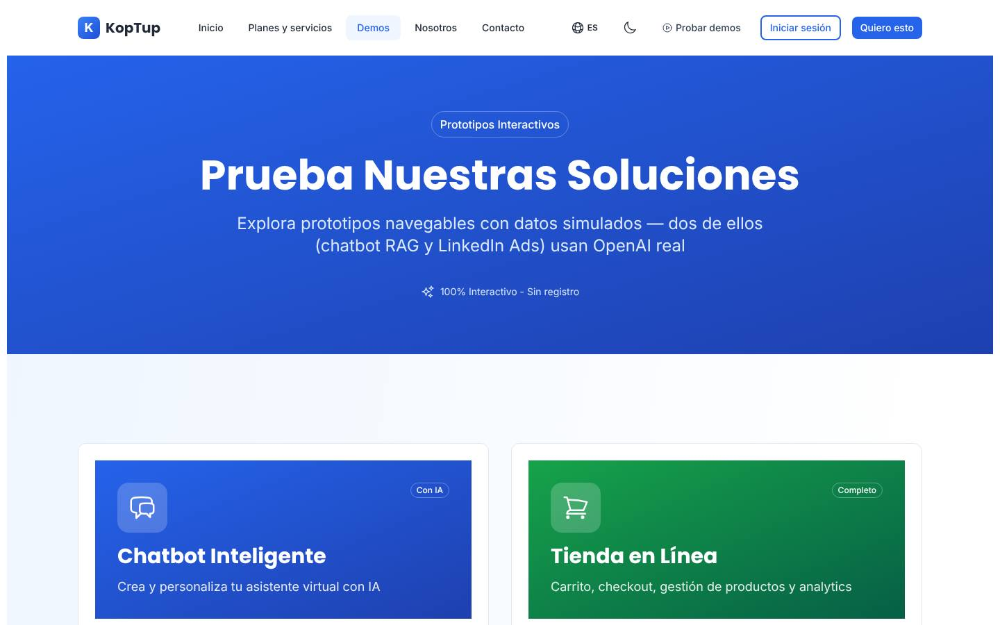
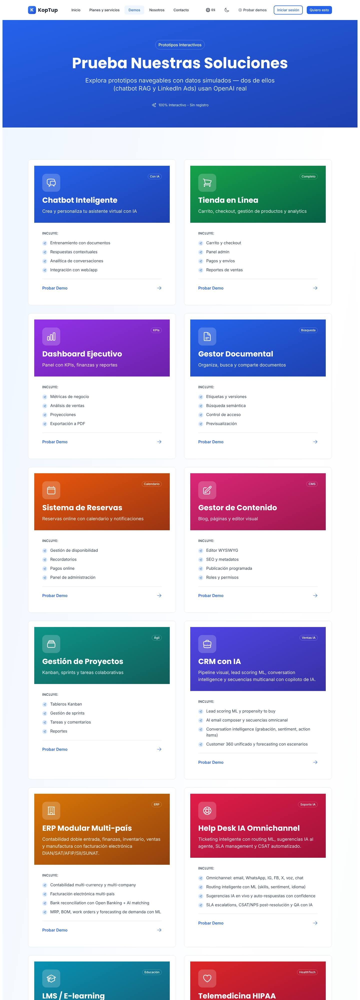
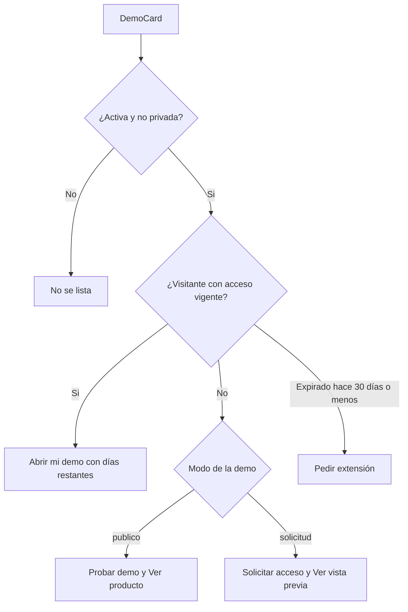
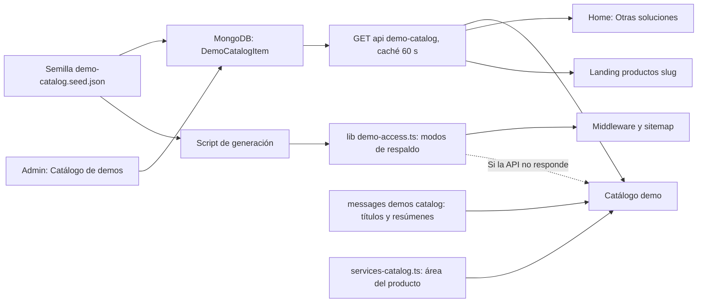

# Catálogo de demos

> Ruta: `/demo` (catálogo) y el envoltorio común de `/demo/<demoSlug>` · Archivos principales: `apps/web/src/app/demo/page.tsx` (436 líneas), `apps/web/src/app/demo/layout.tsx`, `apps/web/src/components/demo/DemoCTA.tsx`, `apps/web/messages/es.json` (`demos.*`), `apps/web/messages/demos/_catalog.{es,en}.json` (`demosExtra.*`), `apps/web/src/lib/seo-config.ts` (entrada `demo`), `apps/web/src/app/sitemap.ts`, `apps/web/src/lib/demos.ts` (rama RAG) · Prioridad: **P0** · Esfuerzo total: **XL** (≈ 22 días-dev en la Fase 1; la corrección de fondo de cada demo se estima en su página de producto)

*Captura de producción antes del reposicionamiento RAG. Páginas relacionadas: [Sistema de demos](04-Sistema-de-Demos.md) (modos de acceso, middleware, pantalla sin acceso), [Flujo del cliente](03-Flujo-del-Cliente.md), [Landing de producto](Seccion-Landing-de-Producto.md), [Servicios y precios](Seccion-Servicios-y-Precios.md), [Panel de administración](05-Panel-de-Administracion.md), [Catálogo de productos](08-Catalogo-de-Productos.md).*

---

## Objetivo

El catálogo `/demo` es la **vitrina**: el lugar al que llega quien quiere "ver antes de hablar con ventas". Tiene que:

1. **Llevar primero a la demo que más vende:** el asistente RAG, con IA real y sin registro (producto principal, ver [Visión de producto](02-Vision-de-Producto.md)).
2. **Ser honesto con lo que muestra:** qué demo usa IA real y cuál es un prototipo con datos de ejemplo; cuál está abierta y cuál se activa por solicitud.
3. **Respetar los modos de acceso** (DECISIÓN 1): las demos `publico` se abren; las `solicitud` muestran vista previa y piden acceso; las `privado` no se listan.
4. **Dar a cada tarjeta un siguiente paso:** probar, solicitar acceso, ver el producto y su precio, o abrir "mi demo" si el prospecto ya tiene acceso.
5. **No mostrar nunca una demo rota.** Una demo que falla en producción resta más de lo que suma.
6. **Retirar el acceso con código fijo** y reemplazarlo por invitaciones personales, verificadas en el servidor y medibles (ver [Sistema de demos](04-Sistema-de-Demos.md), sección 10.5).

| Indicador de negocio | Por qué importa |
|---|---|
| Sesiones del catálogo que abren una demo (`demo_card_click` con `action = probar`) | Mide si la vitrina hace su trabajo |
| Solicitudes de acceso desde el catálogo (`source.page = "/demo"`) | Conversión de las demos `solicitud` |
| Clics del catálogo hacia `/productos/<slug>` | Lleva al visitante al precio y a la propuesta de valor |
| Demos listadas con errores visibles | Debe ser 0 |

---

## Estado actual

Evidencia tomada de la rama `main`. La rama `rag-reposicionamiento` cambia parte de esto (se indica).

| Bloque | Qué hay hoy | Evidencia |
|---|---|---|
| Tipo de página | Client component completo de 436 líneas; la lista de demos se arma en el navegador | `demo/page.tsx` línea 1 (`'use client'`) |
| Fuente de las tarjetas | 26 tarjetas: 7 con textos en `demos.*` de `es.json`, 18 con `demosExtra.*` de `messages/demos/_catalog.*.json` y LinkedIn Ads escrita a mano en español, sin i18n | `demo/page.tsx` líneas 44–214 (LinkedIn Ads en 199–214) |
| Conteo | 28 carpetas de demo; 26 tarjetas; la metadata dice "27 Prototipos". La rama RAG crea `lib/demos.ts` con `DEMO_CATALOG_SLUGS` y `DEMO_COUNT = 26`, y un aviso en desarrollo si la lista y las tarjetas no coinciden | `seo-config.ts` líneas 115–118; rama: `apps/web/src/lib/demos.ts` |
| Hero | Badge "Prototipos Interactivos", H1 "Prueba Nuestras Soluciones", subtítulo con "dos de ellos (chatbot RAG y LinkedIn Ads) usan OpenAI real" y la promesa "100% Interactivo - Sin registro", que deja de ser cierta cuando existan demos `solicitud` | `es.json` → `demos.badge/title/subtitle/interactive`; `demo/page.tsx` línea 243 |
| Rejilla | 2 columnas con tarjetas enormes: cabecera con degradado, título `text-3xl`, descripción y 4 viñetas. Sin capturas, sin búsqueda, sin filtros, sin orden por interés | `demo/page.tsx` líneas 251–318 |
| Tarjeta en móvil | El `Card` conserva su relleno por defecto (`p-6`) y la cabecera de color queda dentro: parece una tarjeta dentro de otra y pierde ancho | `demo/page.tsx` líneas 260–264 (sin `padding="none"`) |
| Viñetas | Muchas en inglés o spanglish ("propensity to buy", "Bank reconciliation", "Customer 360", "SLA escalations"). La de scraping promete "captcha solving" y "anti-bot evasion", que es un riesgo legal y de reputación | `messages/demos/_catalog.es.json` → `demosExtra.*.features` |
| Títulos | Cada tarjeta usa H2 y la sección "Incluye" usa H3: 26 H2 seguidos, sin estructura | `demo/page.tsx` línea 277 |
| Bloque final | "¿Necesitas una demo personalizada?" → `/contact` sin producto, y un botón "Acceder con código" que abre un modal para entrar a la demo privada de cuentas médicas con un código fijo, igual para todos | `demo/page.tsx` líneas 321–352 (bloque) y 354–433 (modal); `es.json` → `demos.accessModal.*` |
| CTA genérico | `app/demo/layout.tsx` agrega `DemoCTA` al final del catálogo y de **todas** las demos: "¿Te gustaría algo así para tu negocio?", "Solicitar Cotización" → `/contact` y "Ver Planes y Precios" → `/pricing` (la rama: `/services#planes-rag`). Acepta `demoName`, pero nadie se lo pasa | `demo/layout.tsx` líneas 1–14; `DemoCTA.tsx` líneas 15–31 |
| SEO | Título "27 Prototipos Interactivos \| Probá Nuestro Trabajo…" (la rama lo cambia a "Prototipos Interactivos: Prueba Antes de Contratar", pero la descripción sigue diciendo 27). Cada demo tiene su propio `layout.tsx` con metadata y migas de pan | `seo-config.ts` líneas 115–118; 28 archivos `demo/<slug>/layout.tsx` |
| Sitemap | Lista todas las demos del catálogo **más** `cuentas-medicas`, `sistema-experto` y `linkedin-ads`; ninguna tiene `noindex` | `sitemap.ts` líneas 17 y 39–45 |
| Medición | Sin analítica ni eventos de uso | — |

**Estado de las demos que se ven desde el catálogo** (capturas de producción, ver [Diagnóstico](01-Diagnostico.md)):

- **Fallan en producción:** `gestor-documentos` (listada en el cuarto lugar: "Error al cargar documentos" y contadores en 0), `cuentas-medicas` y `sistema-experto` (no listadas).
- **Errores de hidratación de React** en al menos 10 demos: automatización, chatbot, facturación, helpdesk, LMS, loyalty, moderación, POS, scraping y WMS.
- **Contenido desactualizado o incoherente:** fechas de 2024 en dashboard ejecutivo, control de proyectos y gestor de contenido; títulos que no coinciden con el H1 (el chatbot se titula "Chatbot Médico").
- **Riesgos de marca y legales:** el e-commerce usa una foto con el logo de una marca deportiva; delivery dice "KopUp" y usa una dirección de Ciudad de México; loyalty saluda con el nombre del fundador; LinkedIn Ads es una herramienta interna de marketing con textos internos.

**Capturas del estado actual**

La cuarta tarjeta del catálogo lleva a una demo que hoy falla:

---

## Problemas detectados

1. **El producto principal no destaca.** El chatbot RAG es una tarjeta más entre 26, al mismo tamaño que demos secundarias.
2. **Promesas que dejan de ser ciertas:** "100 % interactivo, sin registro" choca con el modo `solicitud`, y "27 prototipos" no coincide con nada.
3. **Demos rotas o riesgosas en la vitrina** (gestor documental, scraping con "evasión anti-bot", herramienta interna de LinkedIn).
4. **Acceso con código fijo:** no es personal, no se puede revocar ni medir, y no avisa al comercial (se reemplaza según [Sistema de demos](04-Sistema-de-Demos.md), sección 10.5).
5. **CTA genérico y sin contexto:** "Solicitar cotización" lleva a `/contact` sin producto y "Ver planes" a una página que redirige.
6. **Difícil de recorrer:** 26 tarjetas gigantes en 2 columnas, sin capturas, sin filtros ni búsqueda; en móvil, tarjetas anidadas.
7. **Spanglish y textos de ingeniería** en las viñetas, en un sitio que vende a pymes colombianas.
8. **Demos privadas en el sitemap** y sin `noindex`.
9. **Sin vínculo con el producto:** desde una demo no se llega a su landing ni a su precio.
10. **Sin medición:** no se sabe qué demos atraen ni cuáles llevan a una solicitud.
11. **Todo en el cliente:** el catálogo, que es contenido estático, se arma en el navegador con todos los mensajes del sitio.

---

## Plan detallado

### Principios

1. **Una sola fuente:** el catálogo se arma con `DemoCatalogItem` (modo, activo, orden, capturas) a través de `GET /api/demo-catalog`. Lo que el admin cambia en **Admin › Catálogo de demos** se refleja aquí sin desplegar.
2. **Honestidad visible:** cada tarjeta dice "IA real" o "Datos de ejemplo", y "Demo abierta" o "Demo por solicitud".
3. **Solo se lista lo que pasa el QA de publicación** (ver más abajo). Lo demás queda con `active = false`.
4. **Cada tarjeta tiene un siguiente paso** acorde a su modo y al estado del visitante.
5. **Liviano:** server component con una isla cliente para los filtros y los botones que dependen de la sesión.

### Estructura nueva

| # | Bloque | Componente | Objetivo | CTA |
|---|---|---|---|---|
| 1 | Hero | `DemoHubHero` | Decir qué hay y cómo es cada demo | Probar el asistente RAG · Solicitar demo guiada |
| 2 | Tus demos (solo con sesión `prospect` o `client`) | `MyDemosStrip` | Llevar al prospecto a sus accesos | Ir a Mis demos |
| 3 | Demo destacada | `FeaturedRagDemo` | El producto principal primero | Probar la demo · Ver planes RAG · Qué es RAG |
| 4 | Filtros | `DemoFilters` (isla cliente) | Encontrar la demo de su área | — |
| 5 | Rejilla | `DemoGrid` + `DemoCard` | Elegir y abrir | Según el modo (tabla abajo) |
| 6 | Demos privadas para salud | `PrivateDemosNotice` | Reemplazar el acceso con código | Ver caso de salud · Solicitar demo personalizada |
| 7 | Demo a tu medida | `CustomDemoCta` | No perder a quien no encuentra su caso | Solicitar demo personalizada · Agendar llamada |
| 8 | Preguntas frecuentes | `FaqSection` (compartido) | Resolver dudas de registro, datos y acceso | — |

El catálogo deja de mostrar `DemoCTA` al final (ver [El envoltorio de cada demo](#el-envoltorio-de-cada-demo)).

### 1. Hero

- **Badge:** Demos interactivas
- **H1:** Prueba nuestras soluciones antes de hablar con ventas
- **Subtítulo:** El asistente RAG funciona con IA real y no pide registro. Las demás demos son prototipos navegables con datos de ejemplo: te muestran cómo trabajaría la solución en tu empresa.
- **Datos calculados (no escritos a mano):** "{abiertas} demos abiertas" · "{porSolicitud} por solicitud" · "Datos de ejemplo, nunca datos reales". Los números salen de la respuesta de `GET /api/demo-catalog`.
- **Botones:** **Probar el asistente RAG** → `/demo/chatbot` · **Solicitar demo guiada** → modal (sin producto precargado; el visitante elige).

### 2. Tus demos

Solo si hay sesión `prospect` o `client` y `GET /api/me/demos` devuelve accesos vigentes:

> Tienes {n} demos activas. {Si alguna vence en ≤ 3 días: "Tu acceso a {demo} vence en {días} días."} → **Ir a Mis demos** (`/dashboard/demos`)

Sin sesión no se hace la petición ni se reserva espacio.

### 3. Demo destacada: asistente RAG

| Elemento | Contenido |
|---|---|
| Título | Asistente RAG: pregúntale a tus documentos |
| Texto | Haz preguntas sobre un documento de ejemplo y recibe respuestas con la fuente citada. Si quieres, sube tu propio documento: solo te pedimos tu email. |
| Viñetas | Respuestas con la fuente citada · Prueba con tu documento (PDF, DOCX o TXT, hasta 5 MB) · Tu documento se borra a la hora |
| Insignias | IA real · Demo abierta · Sin registro |
| Visual | Captura real de una respuesta con cita (la misma que usa la home) |
| Botones | **Probar la demo** → `/demo/chatbot` · **Ver planes RAG** → `/services#planes-rag` · enlace **Qué es RAG** → `/rag` |

Los textos coinciden con la demo de la rama `rag-reposicionamiento` (opción "Prueba con tu documento"). Si `DEMO_UPLOAD_ENABLED` está apagada, la viñeta del documento propio no se muestra.

### 4. Filtros

- **Área:** las mismas 6 áreas de negocio de [Servicios y precios](Seccion-Servicios-y-Precios.md) (`ventas`, `finanzas`, `comercio`, `productividad`, `sectores`, `tecnologia`) más "Todas". Las demos sin producto del catálogo (`linkedin-ads`) usan `ventas`.
- **Acceso:** Todas · Abiertas · Por solicitud.
- **Búsqueda:** por nombre y palabras clave, sin distinguir tildes.
- **Estado en la URL:** `/demo?area=finanzas&acceso=abiertas`. Así las campañas y la home pueden enlazar a un filtro.
- **Contador:** "Mostrando {n} de {total} demos", anunciado con `aria-live`.
- **Estado vacío:** "No tenemos una demo para eso todavía. Cuéntanos tu caso y te mostramos cómo lo resolveríamos." → **Solicitar demo personalizada**.

### 5. Tarjeta de demo (`DemoCard`)

Tarjeta compacta, 3 columnas en escritorio, 2 en tableta y 1 en móvil (`padding="none"`, sin anidar).

| Elemento | Contenido | Fuente |
|---|---|---|
| Miniatura 16:10 | Primera captura de la demo, con carga diferida | `DemoCatalogItem.screenshots[0]` |
| Chip de área | "Finanzas, talento humano y cumplimiento" | `area` del producto |
| Insignias | "Demo abierta" o "Demo por solicitud" · "IA real" o "Datos de ejemplo" | `accessMode`; `hasRealBackend` |
| Nombre (H3) | "Facturación electrónica" | `demoCatalog.<demoSlug>.title` |
| Resumen | 1 o 2 líneas, máximo 110 caracteres, en lenguaje de cliente | `demoCatalog.<demoSlug>.summary` |
| Qué vas a ver | 3 viñetas cortas en español | `demoCatalog.<demoSlug>.highlights` |
| Recorrido | "Recorrido guiado de {n} pasos" (cuando existan `onboardingSteps`, Fase 1b) | `DemoCatalogItem.onboardingSteps` |
| Acciones | Según el estado (tabla siguiente) | — |

**Acciones según el modo y el visitante:**

| Situación | Botón principal | Enlace secundario |
|---|---|---|
| `publico`, visitante sin acceso | **Probar demo** → `/demo/<demoSlug>` | Ver producto y precios → `/productos/<offeringSlug>` |
| `solicitud`, sin sesión o sin acceso | **Solicitar acceso** → modal con `demo` y `producto` precargados | Ver vista previa → `/demo/<demoSlug>` (el middleware muestra la pantalla de vista previa de `/demo/acceso`) |
| Acceso vigente (`activo` o `por_expirar`) | **Abrir mi demo** · "te quedan {n} días" | Solicitar propuesta |
| Acceso `expirado` hace 30 días o menos | **Pedir extensión** (crea la tarea para el comercial, `POST /api/me/demos/:grantId/actions`) | Ver producto y precios |
| Staff (`admin`, `sales`, `manager`, `developer`) | **Abrir demo** | Etiqueta "Vista de equipo: modo {accessMode}" |
| `privado` o `active = false` | No se lista | — |
| Demo sin producto (`linkedin-ads`) | Igual que su modo | Sin "Ver producto" |

> [Ver diagrama como imagen](images/diagramas/Seccion-Catalogo-de-Demos-1.png)

El estado del visitante (acceso vigente o expirado) se resuelve en la isla cliente con `GET /api/me/demos` solo si hay sesión. Mientras carga, la tarjeta muestra la acción por modo, sin saltos de diseño.

**Orden por defecto** (`sortOrder` editable en **Admin › Catálogo de demos**): el chatbot va fuera de la rejilla como destacada; luego los productos P1 (`crm-ia`, `helpdesk-ia`, `facturacion-electronica`), después las demos `solicitud` de alto valor (`erp`, `telemedicina`, `voice-ai`) y el resto por área.

### 6. Demos privadas para salud (reemplaza el acceso con código)

- **Título:** Demos privadas para el sector salud
- **Texto:** Tenemos demos de auditoría de cuentas médicas y de sistema experto que trabajan con un backend real. Las mostramos en una sesión guiada o con un acceso personal por invitación.
- **Botones:** **Ver el caso de salud** → `/rag/salud` · **Solicitar demo personalizada** → modal con `demo=cuentas-medicas`.
- **Enlace:** "¿Ya tienes acceso? Inicia sesión" → `/login?redirect=/dashboard/demos`.

Se eliminan el estado del modal, la validación del código, el modal y las claves `demos.accessModal.*` de `es.json` y `en.json`, **en la misma entrega** que activa el control de acceso nuevo (`DEMO_GATE_ENABLED`), y quienes usaban el código reciben una invitación directa. El paso a paso está en [Sistema de demos](04-Sistema-de-Demos.md), sección 10.5.

### 7. Demo a tu medida

- **Título:** ¿No encuentras tu caso?
- **Texto:** Te armamos una demo con un ejemplo de tu sector y te la mostramos en 30 minutos.
- **Botones:** **Solicitar demo personalizada** (modal) · **Agendar llamada** (`NEXT_PUBLIC_BOOKING_URL`).

### 8. Preguntas frecuentes

| Pregunta | Respuesta propuesta |
|---|---|
| ¿Tengo que registrarme? | No para las demos abiertas. Las demos por solicitud se activan con un acceso personal: lo pides en un minuto y te respondemos en máximo 1 día hábil. |
| ¿Los datos son reales? | No. Las demos usan datos de ejemplo. El asistente RAG sí usa IA real sobre un documento de ejemplo o sobre el que tú subas. |
| ¿Qué pasa con lo que escribo o subo? | En la demo RAG, tu documento se borra a la hora. No subas información confidencial. El tratamiento de tus datos está en la política de privacidad (enlace a `/privacy`). |
| ¿Por qué algunas demos piden solicitud? | Porque son soluciones grandes (ERP, telemedicina, logística) que mostramos mejor con acompañamiento y con un ejemplo de tu sector. |
| ¿Puedo ver la demo con los datos de mi empresa? | Sí, en una demo guiada. En la Fase 2 también podrás ver la demo con tu logo y un ejemplo de tu sector. |

El JSON-LD `FAQPage` se genera del mismo arreglo.

### Fuente de datos

> [Ver diagrama como imagen](images/diagramas/Seccion-Catalogo-de-Demos-2.png)

| Dato | De dónde sale | Notas |
|---|---|---|
| Modo, activo, orden, capturas, recorrido, `hasRealBackend` | `GET /api/demo-catalog` (devuelve solo demos activas que no son `privado`) | Petición desde el servidor con `next: { revalidate: 60 }` |
| Título, resumen y viñetas | `messages/demos/_catalog.{es,en}.json`, normalizado en `demoCatalog.<demoSlug>` para las 28 demos | Reemplaza `demos.*` de `es.json` y `demosExtra.*`; se lee en el servidor |
| Área | Campo `area` del producto en `services-catalog.ts`; para demos sin producto, un mapa pequeño en `lib/demo-access.ts` | — |
| Conteos del hero y de la metadata | Largo de la lista que devuelve la API | Reemplaza `DEMO_COUNT` estático de `lib/demos.ts` (rama) cuando el catálogo en base de datos esté en producción |
| Respaldo si la API falla | Mapa estático generado de la semilla: se listan solo las demos que ahí son `publico` o `solicitud` y activas | Nunca se lista una `privado` por un fallo |

Mientras el catálogo en base de datos no esté en producción, la página usa `lib/demos.ts` de la rama RAG como lista, con los mismos componentes.

### QA de publicación: cuándo una demo se lista

Una demo se lista (`active = true`) solo si cumple esta lista. La revisa quien publica, y la prueba E2E de humo (tarea 14) verifica los puntos automatizables.

| # | Criterio | Automatizable |
|---|---|---|
| 1 | Carga sin mensajes de error visibles ni avisos rojos | Sí |
| 2 | Sin errores de hidratación ni excepciones en la consola | Sí |
| 3 | Un solo H1, coherente con el `<title>` de la demo | Sí |
| 4 | Se ve completa a 390 px y a 1440 px, sin columnas cortadas | Parcial (captura) |
| 5 | Textos visibles del primer pantallazo en español, sin spanglish | Revisión |
| 6 | Fechas relativas al año en curso; nada de "Enero 2024" | Revisión |
| 7 | Montos en COP, o con selector de moneda | Revisión |
| 8 | Sin marcas, logos ni nombres de personas o empresas reales; sin afirmaciones de certificaciones | Revisión |
| 9 | Etiqueta "Datos de ejemplo" visible (la pone el envoltorio) | Sí |

**Estado inicial propuesto para la Fase 1** (según las capturas de producción; se confirma con el QA):

| Demo | Modo (semilla) | Decisión inicial | Motivo |
|---|---|---|---|
| `chatbot` | `publico` | Listar como destacada | Corregir título "Chatbot Médico" y las etiquetas del modelo en la rama RAG |
| `crm-ia`, `helpdesk-ia`, `facturacion-electronica` | `publico` | Listar | Mejoras de fondo en la Fase 2 (ver sus páginas de producto) |
| `sistema-reservas`, `automatizacion`, `saas-boilerplate`, `code-review-ia`, `lms`, `pos`, `hrms`, `firma-electronica`, `moderacion-contenido` | `publico` | Listar | Correcciones menores en la Fase 2; quitar insignias de cumplimiento en firma y moderación |
| `ecommerce` | `publico` | Listar **después** de cambiar la imagen del hero | Logo de una marca de terceros |
| `dashboard-ejecutivo`, `control-proyectos`, `gestor-contenido` | `publico` | Listar **después** de una corrección rápida | Fechas de 2024, títulos incoherentes, columna cortada |
| `loyalty` | `publico` | Listar **después** de una corrección rápida | Saluda con el nombre del fundador; bloque vacío |
| `gestor-documentos` | `publico` | **No listar** (`active = false`) | Falla en producción |
| `scraping` | `publico` | **No listar** hasta la limpieza de su página de producto | Nombres de sitios de terceros y "evasión anti-bot" |
| `erp`, `telemedicina`, `voice-ai`, `wms-logistica` | `solicitud` | Listar con vista previa | La vista previa usa capturas que deben pasar el QA |
| `delivery` | `solicitud` | Listar **después** de una corrección rápida | "KopUp" y dirección de otro país |
| `linkedin-ads` | `solicitud` | **No listar** hasta limpiar los textos internos | Es una herramienta interna; ver [Demo LinkedIn Ads](Demo-linkedin-ads.md) |
| `cuentas-medicas`, `sistema-experto` | `privado` | No se listan (modo `privado`) | Además fallan en producción; ver [Demo cuentas médicas](Demo-cuentas-medicas.md) y [Demo sistema experto](Demo-sistema-experto.md) |

Con esto, el catálogo arranca con la destacada y unas 22 tarjetas, y el número del hero se recalcula solo.

### El envoltorio de cada demo

`DemoAccessShell` (tarea 18 de [Sistema de demos](04-Sistema-de-Demos.md)) reemplaza a `DemoCTA` en `app/demo/layout.tsx`. Esta página define sus textos y enlaces:

- **No se renderiza** en `/demo` ni en `/demo/acceso`: esas páginas tienen su propio cierre. El componente lo decide con la ruta actual.
- **Banner de demo `publico` sin acceso** (arriba, se puede cerrar):
  > Estás viendo {producto} con datos de ejemplo. ¿Quieres verlo con tu caso? **Solicitar demo guiada** · **Ver precios** · **Agendar llamada**
- **"Ver precios"** lleva a `/productos/<offeringSlug>#planes`; en el chatbot, a `/services#planes-rag`; en demos sin producto, no se muestra.
- **Cierre al final de la demo** (`DemoFooterCta`, contextual; reemplaza el `DemoCTA` genérico):
  - **Título:** ¿Quieres {producto} para tu empresa?
  - **Texto:** Te lo mostramos con un ejemplo de tu sector y te enviamos una propuesta con precio cerrado.
  - **Botones:** Solicitar demo guiada · Ver precios.
  - **Con acceso vigente** se oculta: lo reemplaza la barra de acceso de [Sistema de demos](04-Sistema-de-Demos.md).
- Todos los "Solicitar demo" abren el modal con `demo=<demoSlug>` y `producto=<offeringSlug>` precargados.

### Eventos

Solo con consentimiento de analítica; sin datos personales.

| Evento | Cuándo | Propiedades |
|---|---|---|
| `demo_hub_filter` | Cambio de área, acceso o búsqueda (con retardo de 1 s) | `area`, `access`, `has_query` |
| `demo_card_click` | Clic en cualquier acción de una tarjeta | `demo_slug`, `access_mode`, `action` (`probar`, `solicitar`, `ver_producto`, `abrir_mi_demo`, `extension`) |
| `demo_request_open` | Se abre el modal desde el catálogo o el envoltorio | `source_page` (`demo_hub`, `demo`), `demo_slug`, `product` |
| `cta_solicitar_demo_click` | Clic en "Solicitar demo guiada" o "personalizada" | `source_page`, `section` |
| `schedule_call_click` | Clic en "Agendar llamada" | `source_page`, `section` |
| `demo_banner_dismiss` | Se cierra el banner de una demo pública | `demo_slug` |

Además, el uso dentro de cada demo se registra como `DemoEvent` (sección 13 de [Sistema de demos](04-Sistema-de-Demos.md)).

---

## Integración con el sistema de demos

| Pieza | Qué toma esta página | Referencia |
|---|---|---|
| `DemoCatalogItem` | Modo, activo, orden, capturas, recorrido | [Sistema de demos](04-Sistema-de-Demos.md), sección 5.1 |
| `GET /api/demo-catalog` | Lista pública, sin demos `privado` ni inactivas | Sección 8.2 |
| `GET /api/me/demos` | Accesos del visitante con sesión | Sección 8.3 |
| Middleware y pase de demo | "Ver vista previa" de una demo `solicitud` lleva a `/demo/<demoSlug>` y el middleware decide | Sección 10.2 |
| `/demo/acceso` | Pantalla de vista previa con la acción según el motivo | Sección 9 |
| Modal Solicitar demo | Precarga `demo` y `producto`; `source.page = /demo` o `/demo/<slug>` | [Flujo del cliente](03-Flujo-del-Cliente.md), etapa 4 |
| **Admin › Catálogo de demos** | Cambiar modo, activar o desactivar y ordenar se ve aquí en ≤ 60 s | [Panel de administración](05-Panel-de-Administracion.md) |

---

## SEO · i18n · accesibilidad · rendimiento

**SEO**
- **Título:** "Demos interactivas de software e IA" (35 caracteres; 44 con " | KopTup").
- **Descripción:** "Prueba gratis el asistente RAG con IA real y demos de CRM, ERP, facturación electrónica y más. Datos de ejemplo y sin registro en las demos abiertas." (149 caracteres).
- **Un solo H1;** cada tarjeta en H3 bajo H2 de sección ("Demo destacada", "Todas las demos").
- **JSON-LD:** `BreadcrumbList`, `ItemList` con las demos listadas (URL de la demo si es `publico`; URL de la landing si es `solicitud`) y `FAQPage`.
- **Sitemap e indexación** (regla de [Sistema de demos](04-Sistema-de-Demos.md), sección 10.2):
  - entran `/demo` y las demos `publico` activas;
  - las demos `solicitud` y `privado` llevan `robots: noindex` y salen del sitemap;
  - se quitan `cuentas-medicas` y `sistema-experto` de `AUX_DEMO_SLUGS` en `sitemap.ts`.
- **Demo frente a landing:** cada demo apunta al término "demo de …" y enlaza a su landing; la landing apunta a la intención comercial ("software de … para empresas", precio). Los títulos de las demos pasan a empezar por "Demo:", por ejemplo "Demo: CRM con IA" (ver [Landing de producto](Seccion-Landing-de-Producto.md)).

**i18n**
- Todo texto visible del catálogo sale de `messages/demos/_catalog.{es,en}.json` (incluida LinkedIn Ads, hoy escrita a mano).
- Español colombiano con "tú"; sin términos en inglés que tengan equivalente claro ("Bank reconciliation" → "Conciliación bancaria", "Customer 360" → "Vista completa del cliente").
- El inglés sigue por cookie hasta la Fase 5.

**Accesibilidad**
- La tarjeta no es un enlace que envuelve todo: título enlazado y botones propios.
- Chips de filtro con `aria-pressed`; contador con `aria-live="polite"`.
- Miniaturas con `alt` descriptivo ("Pantalla del pipeline del CRM con negocios por etapa").
- El efecto `hover:-translate-y-2` respeta `prefers-reduced-motion`.
- Contraste AA en las insignias sobre las miniaturas.

**Rendimiento** (meta: LCP móvil p75 < 2,5 s)
- `page.tsx` server component; islas cliente: `DemoFilters`, `MyDemosStrip` y los botones que dependen de la sesión.
- Miniaturas con `next/image` (AVIF o WebP automáticos), `sizes` por columna y carga diferida, salvo la destacada.
- Los textos del catálogo se leen en el servidor: no se envían los mensajes de todas las demos a cada visita.

---

## Tareas

| # | Tarea | Fase | Prioridad | Esfuerzo | Criterio de aceptación |
|---|---|---|---|---|---|
| 1 | Retirar el acceso con código (estado, validación, modal y claves `demos.accessModal.*`) en la misma entrega que activa `DEMO_GATE_ENABLED`; agregar el bloque "Demos privadas para salud" y "¿Ya tienes acceso?" | Fase 1 — Funnel y solicitud de demos | P0 | S | Una búsqueda de `accessModal` en `apps/web` no da resultados; el bloque nuevo abre el modal con `demo=cuentas-medicas`; los usuarios del código anterior tienen invitación directa |
| 2 | Sacar del catálogo las demos que no pasan el QA (`gestor-documentos`, `scraping`, `linkedin-ads`): hoy, quitándolas de la lista y de `DEMO_CATALOG_SLUGS`; con el catálogo en base de datos, con `active = false` | Fase 1 — Funnel y solicitud de demos | P0 | S | Ninguna tarjeta del catálogo lleva a una demo con mensaje de error; el número del hero coincide con las tarjetas |
| 3 | `page.tsx` como server component con datos de `GET /api/demo-catalog` (`revalidate: 60`) y respaldo estático generado de la semilla; conteos calculados | Fase 1 — Funnel y solicitud de demos | P0 | M | Desactivar una demo en **Admin › Catálogo de demos** la quita del catálogo en ≤ 60 s; con la API caída se listan solo las demos `publico` o `solicitud` del respaldo |
| 4 | Hero nuevo (`DemoHubHero`) y demo destacada del asistente RAG (`FeaturedRagDemo`) | Fase 1 — Funnel y solicitud de demos | P0 | S | El primer bloque tras el hero es el asistente RAG; no aparecen "100% Interactivo - Sin registro" ni "27" |
| 5 | `DemoCard` compacta con miniatura, insignias de modo y de "IA real / Datos de ejemplo", y acciones según la tabla de estados | Fase 1 — Funnel y solicitud de demos | P0 | M | Una demo `solicitud` muestra "Solicitar acceso" y "Ver vista previa"; una `publico`, "Probar demo" y "Ver producto y precios"; en móvil no hay tarjetas anidadas |
| 6 | Todos los "Solicitar…" del catálogo y del envoltorio abren el modal con `demo` y `producto` precargados; "Agendar llamada" usa `NEXT_PUBLIC_BOOKING_URL` | Fase 1 — Funnel y solicitud de demos | P0 | S | Una solicitud enviada desde la tarjeta de `erp` aparece en **Admin › Solicitudes de demo** con la demo `erp`, el producto `erp-modular` y `source.page = /demo` |
| 7 | Textos del envoltorio: banner público con nombre del producto, "Ver precios" hacia la landing y `DemoFooterCta` contextual en lugar de `DemoCTA` (la mecánica es la tarea 18 de [Sistema de demos](04-Sistema-de-Demos.md)) | Fase 1 — Funnel y solicitud de demos | P0 | S | Ninguna demo enlaza a `/pricing` ni a `/contact` sin producto; el catálogo `/demo` y `/demo/acceso` no muestran el banner |
| 8 | Normalizar `messages/demos/_catalog.{es,en}.json` en `demoCatalog.<demoSlug>` para las 28 demos (título, resumen ≤ 110 caracteres, 3 viñetas, `alt`); pasar LinkedIn Ads a i18n; quitar "captcha solving" y "anti-bot evasion" | Fase 1 — Funnel y solicitud de demos | P1 | M | `demo/page.tsx` no contiene textos visibles escritos a mano; las viñetas no tienen términos en inglés con equivalente en español |
| 9 | Correcciones rápidas para poder listar: imagen del e-commerce, "KopUp" y dirección en delivery, saludo de loyalty, fechas de 2024 y títulos incoherentes (coordinado con cada página de producto) | Fase 1 — Funnel y solicitud de demos | P1 | M | Las 6 demos de la tabla marcadas "después de…" (e-commerce, dashboard ejecutivo, control de proyectos, gestor de contenido, loyalty y delivery) pasan los criterios 5 a 8 del QA |
| 10 | Una captura por demo listada (1600×1000, datos de ejemplo, sin marcas de terceros) en `apps/web/public/media/demos/<demoSlug>/` y registrada en `screenshots` de la semilla | Fase 1 — Funnel y solicitud de demos | P1 | M | Cada tarjeta tiene miniatura; ninguna pesa más de 80 KB servida en AVIF o WebP; la misma captura aparece en `/demo/acceso` |
| 11 | Franja "Tus demos" (`MyDemosStrip`) y botón "Abrir mi demo · te quedan N días" en las tarjetas con acceso vigente | Fase 1 — Funnel y solicitud de demos | P1 | S | Un prospecto con 2 accesos ve "Tienes 2 demos activas" y el botón correcto en esas 2 tarjetas; un visitante sin sesión no dispara la petición |
| 12 | SEO: título y descripción nuevos, `ItemList` + `FAQPage` + `BreadcrumbList`, H1 único y H3 en tarjetas; `noindex` y fuera del sitemap para `solicitud` y `privado`; títulos de demo con prefijo "Demo:" | Fase 1 — Funnel y solicitud de demos | P1 | S | `check-titles` pasa; el sitemap no contiene `cuentas-medicas`, `sistema-experto` ni demos `solicitud`; la prueba de resultados enriquecidos no muestra errores |
| 13 | Eventos `demo_hub_filter`, `demo_card_click`, `demo_request_open`, `cta_solicitar_demo_click`, `schedule_call_click` y `demo_banner_dismiss` | Fase 1 — Funnel y solicitud de demos | P1 | S | Con cookies aceptadas los 6 eventos llegan a GA4 DebugView con sus propiedades; con cookies rechazadas no sale ninguno |
| 14 | Prueba E2E de humo de publicación: abre cada demo listada y falla si hay mensaje de error visible, error de hidratación en consola o más de un H1 | Fase 1 — Funnel y solicitud de demos | P1 | M | La prueba corre en CI (cuando la Fase 0 lo repare) y en un despliegue de vista previa; hoy fallaría con `gestor-documentos`, lo que demuestra que detecta el problema |
| 15 | Accesibilidad y móvil: tarjetas sin anidar, título enlazado y botones separados, foco visible, `prefers-reduced-motion`, contraste AA | Fase 1 — Funnel y solicitud de demos | P1 | S | axe-core no reporta errores serios ni críticos en `/demo`; a 390 px las tarjetas ocupan el ancho completo |
| 16 | Filtros por área y acceso y búsqueda sin tildes, con estado en la URL y contador accesible | Fase 1 — Funnel y solicitud de demos | P2 | S | `/demo?area=finanzas&acceso=abiertas` llega filtrado; "facturacion" encuentra la demo de facturación electrónica |
| 17 | Preguntas frecuentes del catálogo (5) con `FAQPage` | Fase 1 — Funnel y solicitud de demos | P2 | S | El JSON-LD es idéntico al texto visible; las respuestas coinciden con la política de privacidad vigente |
| 18 | Orden editable (`sortOrder`) desde **Admin › Catálogo de demos** con el orden inicial propuesto | Fase 1 — Funnel y solicitud de demos | P2 | S | Cambiar el orden en el panel cambia el catálogo en ≤ 60 s sin desplegar |
| 19 | Corregir los errores de hidratación de las demos listadas (fechas y números aleatorios en el render, `Date.now()` en el servidor) | Fase 2 — Demos vendibles | P1 | L | La prueba de humo de la tarea 14 no registra errores de hidratación en ninguna demo listada |
| 20 | Mostrar "Recorrido guiado de N pasos" y el progreso del recorrido cuando exista `onboardingSteps` | Fase 2 — Demos vendibles | P2 | S | Las demos con recorrido muestran el número de pasos; un prospecto ve su progreso en la tarjeta |
| 21 | Catálogo en inglés indexable (`/en/demo`) con `hreflang` | Fase 5 — Escala | P3 | M | La versión EN tiene canónico propio y `hreflang` recíproco; ninguna tarjeta queda en español |

---

## Métricas de éxito

Metas iniciales a validar con 8 semanas de datos reales (ver la nota de [Flujo del cliente](03-Flujo-del-Cliente.md)).

| Métrica | Fuente | Meta inicial |
|---|---|---|
| Sesiones del catálogo que abren una demo | GA4 (`demo_card_click` con `action = probar`) | ≥ 45 % |
| Sesiones del catálogo que abren la demo del asistente RAG | GA4 | ≥ 25 % |
| Solicitudes de acceso y demos guiadas con `source.page` en `/demo` o `/demo/<slug>` | **Admin › Métricas** | Línea base el primer mes; +30 % al tercer mes |
| Clics del catálogo hacia `/productos/<slug>` | GA4 (`action = ver_producto`) | ≥ 10 % de las sesiones |
| Demos listadas con errores visibles o de hidratación | Prueba E2E de humo | 0 |
| Diferencia entre el número del hero y las tarjetas | Prueba E2E | 0 |
| Demos `privado` o `solicitud` en el sitemap | Revisión del sitemap | 0 |
| LCP móvil p75 de `/demo` | Search Console | < 2,5 s |
