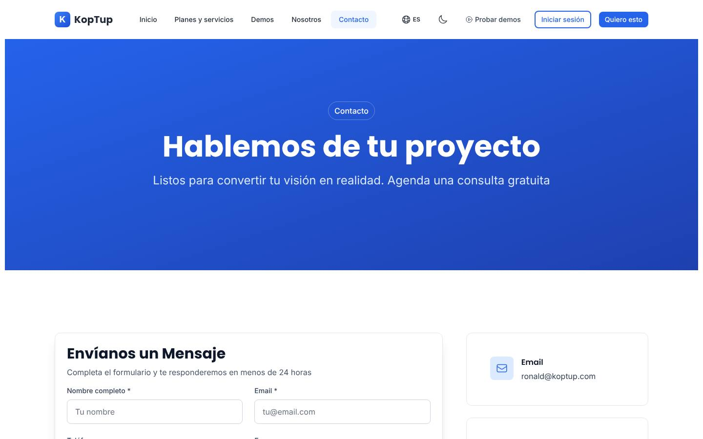
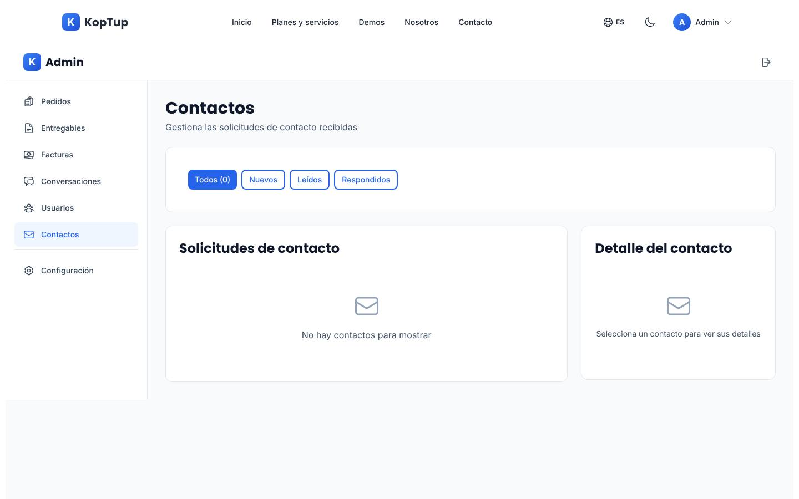
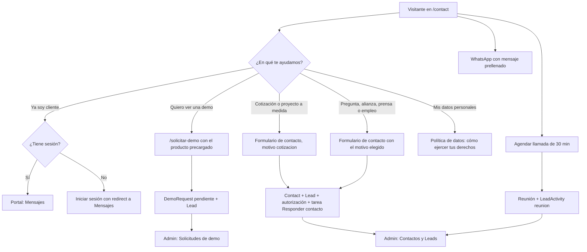
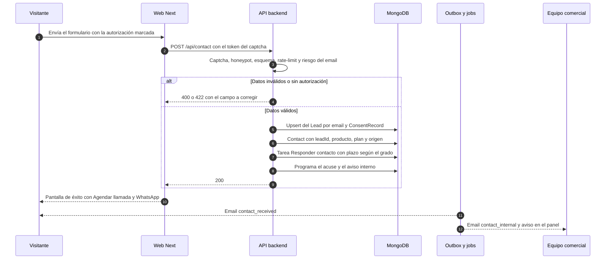

# Contacto

> Ruta: `/contact`, más los canales que la acompañan (agenda en línea, WhatsApp y correo) · Archivos principales: `apps/web/src/app/contact/{page,layout}.tsx`, `apps/web/messages/{es,en}.json` (namespace `contactPage`), `apps/web/src/lib/api.ts` (`submitContactForm`), `apps/web/src/types/api.types.ts`, `apps/backend/src/routes/contact.routes.ts`, `apps/backend/src/controllers/contact.controller.ts`, `apps/backend/src/models/Contact.ts`, `apps/backend/src/services/{email,whatsapp}.service.ts` · Prioridad: **P0** (autorización de datos, Lead y producto preseleccionado); **P1** (lo demás) · Esfuerzo total: **XL** (≈ 27 días-dev, de los cuales ≈ 6 ya están contados en [Sistema de demos](04-Sistema-de-Demos.md) y en [Panel de administración](05-Panel-de-Administracion.md); el núcleo P0 son ≈ 9 días)



*Captura de producción (rama `main`). Páginas relacionadas: [Flujo del cliente](03-Flujo-del-Cliente.md), [Sistema de demos](04-Sistema-de-Demos.md), [Panel de administración](05-Panel-de-Administracion.md), [Legal](Seccion-Legal.md), [Autenticación](Seccion-Autenticacion.md), [Home](Seccion-Home.md), [Servicios y precios](Seccion-Servicios-y-Precios.md).*

---

## Objetivo

`/contact` recibe a quien todavía no sabe qué demo pedir o necesita algo distinto de una demo. Tiene que lograr tres cosas:

1. **Mandar a cada persona al canal correcto en un clic:** demo, cotización, llamada, WhatsApp, soporte de cliente o datos personales.
2. **No perder contexto.** Producto, plan, modalidad, página de origen y campaña deben llegar completos al equipo.
3. **Convertir cada mensaje en un Lead.** El Lead lleva la autorización de la Ley 1581, un responsable y un plazo de respuesta, igual que una solicitud de demo (DECISIÓN 1 de [Sistema de demos](04-Sistema-de-Demos.md)).

### Contacto general frente a "Solicitar demo"

La diferencia tiene que quedar clara para el visitante y para el equipo:

| Canal | Cuándo usarlo | Qué crea en el sistema | Quién responde y cuándo |
|---|---|---|---|
| **Solicitar demo** (`/solicitar-demo`) | Quiere ver o probar un producto concreto | `DemoRequest` + `Lead` + `ConsentRecord`, con puntaje y SLA | El comercial aprueba o rechaza en ≤ 1 día hábil. Si aprueba, llega un enlace mágico |
| **Contacto** (`/contact`) | Quiere una cotización o un proyecto a medida sin demo, tiene una pregunta general, o escribe por alianzas, prensa o empleo | `Contact` + `Lead` (`source.channel = contacto`) + `ConsentRecord` + tarea "Responder contacto" | Respuesta humana en ≤ 1 día hábil |
| **Agendar llamada** (agenda en línea) | Prefiere hablar ya | Reunión en el calendario y, con el webhook, una `LeadActivity` de tipo `reunion` | Confirmación inmediata |
| **WhatsApp** | Tiene una pregunta rápida | Conversación en WhatsApp Business. Si hay interés, el comercial registra el Lead | Lunes a viernes, de 8:00 a 17:00 |
| **Soporte de cliente** | Ya es cliente y tiene proyecto | Mensaje en el portal (`/dashboard/messages`) | Según su plan |
| **Mis datos personales** | Quiere ejercer sus derechos (Ley 1581) | `PrivacyRequest` | Plazos legales, ver [Legal](Seccion-Legal.md) |

**Regla para el equipo:** si alguien pide una demo por el formulario de contacto, no se le pide que llene otro formulario. El comercial le envía una **invitación directa** desde el panel (`POST /api/demo-grants`).

| Indicador de negocio | Por qué importa |
|---|---|
| Mensajes válidos por semana, por motivo y por producto | Volumen y calidad del canal |
| Mediana de la primera respuesta humana | Es la promesa de "1 día hábil" |
| Contactos que pasan a `calificado` o a solicitud de demo | Muestra si el canal genera negocio o solo preguntas |
| Llamadas agendadas y realizadas | Es el canal de cierre más corto |

---

## Estado actual

Evidencia tomada de la rama `main`.

| Bloque | Qué hay hoy | Evidencia |
|---|---|---|
| Tipo de página | Toda la página es un client component envuelto en `Suspense` | `contact/page.tsx` líneas 1 y 584–596 |
| Mensaje | H1 "Hablemos de tu proyecto"; subtítulo "Agenda una consulta gratuita". La metadata dice "Solicita tu Cotización de Software Gratis" y "Respondemos en menos de 24 horas" | `es.json` → `contactPage.hero`; `lib/seo-config.ts` líneas 80–94 |
| Precarga desde el catálogo | Lee solo `service` y `plan` de la URL. Traduce el slug con un mapa de 6 entradas, de las que 4 no existen en el catálogo (`agente-ia-ventas`, `desarrollo-web`, `auditoria-cups`, `liquidacion`) | `contact/page.tsx` líneas 25–42 |
| Lo que envía el catálogo | `/services` enlaza a `/contact?service=<slug>&tier=<plan>&modality=<compra o saas>`, así que el plan y la modalidad se pierden porque la página lee `plan` | `components/offerings/OfferingsCatalog.tsx` línea 514 |
| Selector de servicio | 8 opciones genéricas (E-Commerce, Chatbot con IA, Desarrollo Web…) que no corresponden a los 27 productos ni a los planes RAG. El campo es obligatorio. El producto precargado no coincide con ninguna opción, así que el navegador obliga a elegir otra y el producto original se pierde. El plan queda solo como texto dentro del mensaje | `contact/page.tsx` líneas 156–165 y 346–365; `es.json` → `contactPage.services` |
| Campos | Nombre*, email*, teléfono, empresa, servicio*, presupuesto, "¿Cuándo querés empezar?" y mensaje*. No hay autorización de datos, aviso de privacidad, captcha ni honeypot | `contact/page.tsx` líneas 283–422 |
| Presupuesto | Rangos en dólares sin moneda ("Menos de $1,000"…"Más de $25,000") en un sitio que vende en COP | `es.json` → `contactPage.budgetRanges` |
| Plazo | El campo `timeline` se envía, pero el backend no lo guarda | `contact.controller.ts` línea 15; `models/Contact.ts` |
| Éxito | El formulario se borra a los 6 segundos y ofrece "Creá tu cuenta para hacer seguimiento" (voseo), aunque la cuenta no muestra ese mensaje | `contact/page.tsx` líneas 81–96 y 260–272 |
| Agendar llamada | Botón que abre un `mailto:` con asunto y cuerpo prellenados | `contact/page.tsx` líneas 112–127 y 509–529 |
| Datos de contacto | Correo con nombre de persona, móvil y dirección escritos en el código. Se repiten en `/privacy`, `/terms` y `/cookies` | `contact/page.tsx` líneas 129–154 y 487–495 |
| Horario | "Lun - Vie: 8am - 6pm". `/services` dice 8 a. m.–5 p. m. y el SLA de demos usa 8:00–17:00 | `es.json` → `contactPage.info.hours.value` |
| Preguntas frecuentes | "Respondemos en menos de 24 horas hábiles" (el subtítulo del formulario dice "24 horas"). "30 días de garantía", mientras que `/terms` dice 30–90 días | `es.json` → `contactPage.faq`, `contactPage.form.subtitle`, `termsPage.s7` |
| Mapa | `iframe` de Google Maps genérico que se carga al abrir la página, sin consentimiento | `contact/page.tsx` líneas 565–579 |
| Backend | Validación con `express-validator` (nombre, email, servicio y mensaje) y límite de 5 envíos por minuto por IP en la memoria de cada instancia. Guarda `Contact` y dispara email y WhatsApp al equipo sin esperar la respuesta | `contact.routes.ts` líneas 8–18; `contact.controller.ts` líneas 9–75; `middleware/rateLimiter.ts` líneas 22–29 |
| Lead | No existe. `Contact` es un buzón con estados `new`, `read` y `responded`, sin responsable, origen, puntaje ni historial | `models/Contact.ts` |
| Acuse al remitente | No hay. Solo se avisa al equipo | `contact.controller.ts` líneas 37–69 |
| Datos personales en registros | El controlador escribe en los logs el nombre, el email y el teléfono. El WhatsApp interno lleva todos los datos del prospecto | `contact.controller.ts` líneas 17–21; `whatsapp.service.ts` (`formatContactMessage`) |
| Panel | `/admin/contacts` lista los contactos con la API de `/api/admin`, que solo admite `admin` y `manager`, así que un comercial (`sales`) no los vería | `routes/admin.routes.ts` líneas 21 y 45–46 |
| Portal | "Nuevo proyecto" en el portal del cliente lleva a `/contact?type=new-project`, un parámetro que la página ignora | `dashboard/projects/page.tsx` líneas 133 y 148 |
| Medición | No hay ningún evento | — |

**El mismo contacto visto desde el panel**: lista vacía, doble cabecera y sin datos de origen ni de producto.



---

## Problemas detectados

1. **Se pierde el producto elegido.** Quien llega desde `/services` con un producto, un plan y una modalidad termina eligiendo "Chatbot con IA" o "Desarrollo Web" en una lista genérica. El comercial no sabe qué cotizar.
2. **No hay autorización de tratamiento de datos.** El formulario recoge nombre, email, teléfono y empresa sin casilla de autorización ni aviso de privacidad. Eso incumple la Ley 1581 de 2012 y deja al Lead sin prueba de consentimiento (ver [Legal](Seccion-Legal.md)).
3. **"Agendar llamada" no agenda nada.** Abre el cliente de correo, si es que hay uno configurado; en el celular casi nunca lo hay. Para el visitante más listo para comprar, es el paso con más fricción.
4. **Las promesas no coinciden entre páginas.** El horario dice 8–18 en un sitio y 8–17 en otro. El tiempo de respuesta es "24 horas" en un lugar y "24 horas hábiles" en otro. La garantía es de 30 días o de 30–90 días según la página. Un comprador B2B compara esos detalles.
5. **Los datos de contacto tienen nombre de persona y están escritos a mano en 4 páginas.** Cambiar de buzón obliga a editar código, y el correo depende de una sola persona.
6. **El contacto no es un Lead.** No tiene responsable, plazo, puntaje ni historial. El comercial no lo ve y nada mide si se respondió a tiempo.
7. **El remitente no recibe confirmación.** No sabe si el mensaje llegó ni cuándo le responderán.
8. **Las opciones no corresponden a lo que se vende.** La lista de servicios no tiene los planes RAG ni los productos del catálogo, y los rangos de presupuesto están en dólares sin decirlo.
9. **La protección anti-spam es débil.** Solo hay un límite por IP guardado en la memoria de cada instancia: sin captcha, sin honeypot y sin control de correos desechables.
10. **Hay más datos personales de los necesarios.** Los logs y el WhatsApp interno copian nombre, email y teléfono (principio de minimización).
11. **El mapa de un tercero carga al abrir la página.** Hace peticiones a Google antes de cualquier consentimiento y no apunta a un lugar verificado.
12. **Hay voseo y textos fuera de i18n:** "Creá tu cuenta", "¿Cuándo querés empezar?", "Seleccioná una opción", "Estás cotizando".
13. **No se mide nada.** No se sabe cuántos empiezan el formulario, cuántos lo envían ni de qué página vienen.
14. **Los clientes con proyecto terminan en el formulario público** cuando piden un proyecto nuevo desde su portal.

---

## Plan detallado

### Orden de la página

| # | Bloque | Componente | Propósito |
|---|---|---|---|
| 1 | Hero corto | `ContactHero` (server) | Decir qué pasa al escribir y en cuánto tiempo |
| 2 | ¿En qué te ayudamos? | `ContactIntentPicker` (client) | Llevar a cada persona a su canal |
| 3 | Formulario + canales | `ContactForm` (client) + `ContactChannels` (server) | Capturar el mensaje con contexto y autorización; mostrar agenda, WhatsApp, correo y horario |
| 4 | Agenda | `BookingInline` (client, se carga al pulsar) | Agendar sin salir de la página |
| 5 | Preguntas frecuentes | `FaqSection` (compartido con la home y las landings) | Resolver dudas y aportar al SEO |
| 6 | Datos de la empresa | `CompanyInfo` (server, lee `lib/company.ts`) | Ciudad, horario, buzones de rol y, si existe, la oficina |



### 1. Hero

| Elemento | Texto propuesto |
|---|---|
| Etiqueta | Contacto |
| H1 | ¿En qué te ayudamos? |
| Subtítulo | Te respondemos en máximo 1 día hábil (lunes a viernes, de 8:00 a. m. a 5:00 p. m., hora de Colombia). Si quieres ver un producto funcionando, solicita una demo. Si prefieres hablar ya, agenda 30 minutos. |

Se quita "consulta gratuita" del subtítulo y de la metadata. La llamada de 30 minutos sí es gratuita, y eso se dice en el botón de la agenda, no como promesa general.

### 2. Selector "¿En qué te ayudamos?"

Son tarjetas tipo radio, en un `fieldset` con `legend`. La opción que se elige cambia el formulario o lleva a otra página.

| Opción (texto) | Destino | Qué precarga | Evento |
|---|---|---|---|
| **Quiero ver una demo** · "Te damos acceso a la demo interactiva y un recorrido guiado" | `/solicitar-demo?producto=<slug>&plan=<plan>` | El producto y el plan de la URL, si vienen | `contact_intent_select` (`intent: demo`) |
| **Cotización o proyecto a medida** · "Cuéntanos qué necesitas y te enviamos una propuesta" | Formulario, motivo `cotizacion` | Producto, plan y modalidad | `contact_intent_select` |
| **Ya soy cliente** · "Escríbenos desde tu portal para que quede en tu proyecto" | `/dashboard/messages`, o `/login?redirect=/dashboard/messages` si no hay sesión | — | `contact_intent_select` |
| **Otra consulta** · "Preguntas generales, alianzas, prensa o empleo" | Formulario con el motivo elegido en una lista | — | `contact_intent_select` |
| **Mis datos personales** · "Conocer, actualizar o suprimir tus datos" | `/privacy#tus-derechos` (o `/dashboard/privacidad` con sesión) | — | `contact_intent_select` |

**Selección por defecto:**
- Si la URL trae `producto`, la tarjeta preseleccionada es **Cotización** y aparece arriba un enlace: "¿Prefieres probarlo primero? Solicitar la demo de {producto}".
- Si trae `motivo=demo` (por ejemplo, desde el aviso "Agenda una demo con nosotros" de la demo RAG cuando se agota el cupo), se muestra un aviso con el botón **Solicitar demo**. El formulario sigue disponible por si la persona prefiere escribir.

### 3. Formulario de contacto

**Campos**

| Campo | Tipo | Obligatorio | Notas |
|---|---|---|---|
| Motivo | Radio (`cotizacion`, `pregunta`, `alianza`, `prensa`, `empleo`, `otro`) | Sí | Viene del selector |
| Nombre completo | Texto, `autocomplete="name"` | Sí | |
| Email | Email, `autocomplete="email"` | Sí | Se valida el formato y el riesgo del dominio en el servidor. Gmail no bloquea (DECISIÓN 12) |
| Empresa | Texto, `autocomplete="organization"` | Sí si el motivo es `cotizacion` | |
| Teléfono o WhatsApp | Selector de país (CO +57 por defecto) + número, `autocomplete="tel"` | No | Se guarda en E.164 |
| Producto de interés | Chip "Estás cotizando: {producto} · Plan {plan} · {modalidad}" con botón **Cambiar** | No | **Cambiar** abre una lista agrupada: *Planes RAG* (Piloto, Esencial, Profesional, Empresarial) y *Otras soluciones a medida* (los productos de `services-catalog.ts`). El nombre sale de los mensajes de `offerings`, no de un mapa escrito a mano |
| Presupuesto aproximado | Lista: Menos de COP 5 millones · COP 5 a 15 millones · COP 15 a 40 millones · COP 40 a 100 millones · Más de COP 100 millones · Aún no lo sé | No | Ayuda: "Valores antes de IVA. Como referencia, el Piloto RAG cuesta COP 3.900.000". Con el selector de moneda en USD se muestran los rangos equivalentes con `TRM_REFERENCIA` |
| ¿Cuándo quieres empezar? | Lista: Lo antes posible · En 1 a 3 meses · En 3 a 6 meses · Solo estoy explorando | No | Valores `inmediata`, `1_3_meses`, `3_6_meses`, `explorando`, los mismos que `DemoRequest.urgency` |
| Mensaje | Área de texto, de 20 a 2.000 caracteres, con contador | Sí | Debajo: "No incluyas datos de pacientes, datos financieros ni información confidencial" |
| Autorizaciones | Casillas sin marcar (texto abajo) | La primera sí | Componente `ConsentCheckboxes`, el mismo de "Solicitar demo" |
| Captcha | Cloudflare Turnstile (modo gestionado, casi siempre invisible) | Sí | Componente `Turnstile` |
| Honeypot | Campo oculto `website` | — | Si llega lleno, se descarta en silencio |

**Textos de autorización** (iguales a los del formulario "Solicitar demo"; versión y hash en `config/legal.ts`, ver [Legal](Seccion-Legal.md)):

- [ ] **Autorizo a KopTup a tratar mis datos personales para gestionar esta solicitud y contactarme sobre ella, según la Política de tratamiento de datos (Ley 1581 de 2012).** \* *("Política de tratamiento de datos" enlaza a `/privacy`.)*
- [ ] Quiero recibir novedades y contenido comercial de KopTup (opcional).
- [ ] Acepto recibir mensajes por WhatsApp sobre esta solicitud (opcional; aparece solo si el visitante escribe un teléfono).

**Aviso de privacidad corto**, debajo del botón (componente `PrivacyNotice`):
> KopTup trata tus datos para responder tu mensaje. Puedes conocerlos, actualizarlos, rectificarlos o pedir que los borremos escribiendo a nuestro buzón de privacidad. Política de tratamiento de datos *(enlace a `/privacy`)*.

**Precarga desde la URL** (`lib/contact-prefill.ts`):

| Parámetro | Ejemplo | Efecto |
|---|---|---|
| `motivo` | `cotizacion`, `demo` | Selecciona la tarjeta del selector |
| `producto` | `crm-ia`, `chatbot-rag-ia` | Muestra el chip "Estás cotizando". Si el slug no existe, no muestra nada y registra `contact_prefill_unknown` |
| `plan` | `profesional`, `piloto` | Agrega el plan al chip. Para el producto RAG los valores son `piloto`, `esencial`, `profesional` y `empresarial` |
| `modalidad` | `compra`, `saas` | Agrega la modalidad. Si el producto no tiene SaaS real, el chip dice "SaaS: lista de espera" (DECISIÓN 7) |
| `service`, `tier`, `modality`, `plan` heredados | `?service=crm-ia&tier=avanzado&modality=saas` | Se traducen a `producto`, `plan` y `modalidad` para no romper los enlaces que ya existen |
| `type=new-project` (heredado) | | Con sesión `client`, lleva a Mensajes del portal; sin sesión, equivale a `motivo=cotizacion` |
| `utm_*`, `ref` | | Se guardan en `attribution` con el primer contacto de la sesión (`lib/attribution.ts`, `sessionStorage`) |

**Al enviar con éxito** (no se borra solo):

> **¡Listo, {nombre}! Recibimos tu mensaje.**
> Te responderemos a {email} en máximo 1 día hábil (lunes a viernes, de 8:00 a. m. a 5:00 p. m., hora de Colombia). También te enviamos una copia a tu correo.
> **¿Prefieres hablar ya?** [Agendar llamada de 30 min] · [Escribir por WhatsApp]

- Si el producto tiene demo `publico`, se agrega **[Probar la demo de {producto}]**; si es `solicitud`, **[Solicitar la demo de {producto}]**.
- Se quita la invitación a "crear tu cuenta". La cuenta llega con la aprobación de una demo (ver [Autenticación](Seccion-Autenticacion.md)).

**Errores**
- Por campo, con `aria-describedby` y un resumen arriba que enlaza a cada error.
- Error de red: "No pudimos enviar tu mensaje. Revisa tu conexión e inténtalo de nuevo, o escríbenos por WhatsApp". Lo escrito se conserva.
- Correo desechable (422): "Usa un correo al que podamos responderte".
- Límite de envíos (429): "Recibimos varios mensajes desde tu conexión. Espera unos minutos o escríbenos por WhatsApp".

### 4. API y datos

**`POST /api/contact` modificado** (coherente con la sección 8.6 de [Sistema de demos](04-Sistema-de-Demos.md)). Validación con `zod`, como el resto de la API nueva.

```json
{
  "reason": "cotizacion",
  "name": "Ana Gómez",
  "email": "ana@logisticaandina.co",
  "company": "Logística Andina S.A.S. (ejemplo)",
  "phone": "+573000000000",
  "offeringSlug": "wms-logistica",
  "plan": "profesional",
  "modality": "compra",
  "budgetRange": "15_40m",
  "timeline": "1_3_meses",
  "message": "Tenemos 2 bodegas y hoy controlamos el inventario en Excel...",
  "consent": { "gestionSolicitud": true, "marketing": false, "whatsapp": true, "policyVersion": "1.0", "textHash": "..." },
  "turnstileToken": "...",
  "website": "",
  "fillMs": 41000,
  "attribution": { "page": "/services", "landingPath": "/rag", "referrer": "https://www.google.com/", "utm": { "source": "google", "medium": "cpc", "campaign": "rag-salud" } }
}
```

**Procesamiento**, en este orden:

1. Turnstile (token, hostname y acción), honeypot y tiempo mínimo de llenado (3 s).
2. Esquema `zod`, rate-limit con almacén compartido (por IP y por email) y riesgo del email (`utils/email-risk.ts`).
3. Upsert del `Lead` por email:
   - `source.channel = contacto`, o `demo_rag` cuando llega desde "Prueba con tu documento";
   - `source.landingPath` y `utm` solo si el Lead es nuevo (primer contacto).
4. `ConsentRecord` con canal `contacto` (o `demo_rag`), versión, hash del texto, IP en hash y user agent. Sin la autorización obligatoria responde **400**.
5. `Contact` con `leadId` y los campos nuevos.
6. Puntaje con `lead-scoring.service.ts`, con los datos disponibles.
7. `LeadActivity` de tipo `tarea` llamada "Responder contacto", con `dueAt` calculado por `sla.service.ts` según el grado.
8. `OutboundMessage`: acuse al remitente (`contact_received`) y aviso al equipo (`contact_internal`), con clave de idempotencia.
9. Responde `200 {success: true}` sin esperar al proveedor de correo ni al de WhatsApp.

**Cambios en `Contact`**: la sección 5.2 de [Sistema de demos](04-Sistema-de-Demos.md) ya define `leadId`, `source`, `offeringSlug` y `plan`. Esta página propone agregar, además:

| Campo | Tipo | Para qué |
|---|---|---|
| `reason` | `cotizacion` · `pregunta` · `alianza` · `prensa` · `empleo` · `otro` | Filtrar y asignar en el panel |
| `modality` | `compra` · `saas` | Saber qué cotizar |
| `budgetRange`, `timeline` | enums de arriba | Calificar. Hoy `timeline` se pierde |
| `attribution` | `{ page, landingPath, referrer, utm }` | Saber qué página y qué campaña generan contactos |
| `consentRecordId` | → `ConsentRecord` | Prueba de la autorización |
| `antiAbuse` | `{ captchaOk, ipHash, fillMs, emailRisk }` | Auditar el spam |
| `service` | deja de ser obligatorio | Se conserva solo por compatibilidad con los registros viejos |



**Plantillas nuevas.** Se suman a las de la sección 11 de [Sistema de demos](04-Sistema-de-Demos.md) y viven en `apps/backend/src/templates/contact/`. Todo texto que venga del usuario se escapa.

**`contact_received`**: email al remitente, inmediato.
> **Asunto:** Recibimos tu mensaje
>
> Hola {{nombre}}:
>
> Gracias por escribirnos sobre {{producto o "tu proyecto"}}. Te responderemos en máximo 1 día hábil (lunes a viernes, de 8:00 a. m. a 5:00 p. m., hora de Colombia).
>
> Si quieres adelantar la conversación, agenda 30 minutos con nosotros: {{agendaUrl}}
>
> Copia de tu mensaje: "{{mensaje}}" (primeros 500 caracteres).
>
> Si no nos escribiste tú, ignora este correo.
>
> Equipo KopTup · Tratamos tus datos según nuestra política: {{politicaUrl}}

**`contact_internal`**: email y aviso en el panel.
> **Asunto:** [{{grado}}] Nuevo contacto · {{motivo}} · {{empresa}}
>
> {{nombre}}, {{empresa}}. Producto: {{producto}} · Plan: {{plan}} · Modalidad: {{modalidad}} · Presupuesto: {{presupuesto}} · Plazo: {{plazo}}
> Origen: {{pagina}} · Campaña: {{utm}}
> Mensaje: {{mensaje}} (primeros 300 caracteres)
> Responder antes de: {{venceEl}} · Ver: {{adminUrl}}

**WhatsApp al equipo**, sin email ni teléfono del prospecto:
> Nuevo contacto ({{motivo}}, {{producto}}, grado {{grado}}). Responder antes de {{venceEl}}. Ver: {{adminUrl}}

### 5. Agendar llamada

Reemplaza el `mailto:`. Se usa en `/contact`, en `/solicitar-demo/gracias`, en las landings, en la barra de acceso de las demos y en **Mis demos**. La URL vive en `NEXT_PUBLIC_BOOKING_URL` (ya definida en [Sistema de demos](04-Sistema-de-Demos.md)).

**Herramienta recomendada: Cal.com.**

| Criterio | Cal.com | Calendly |
|---|---|---|
| Para empezar | Plan gratuito para una persona | Plan gratuito limitado a un tipo de evento |
| Webhooks (para registrar la reunión en el Lead) | Incluidos | Solo en planes pagos |
| Inserción en el sitio | En línea, ventana emergente o botón flotante | En línea, ventana emergente o widget |
| Preguntas propias y prellenado por URL | Sí | Sí |
| Código abierto y opción de autoalojarlo | Sí | No |
| Google Calendar, Meet y recordatorios | Sí | Sí |

*Las condiciones de los planes cambian: verificarlas antes de contratar.*

**Tipos de evento**

| Evento | Duración | Quién lo usa | Dónde aparece |
|---|---|---|---|
| Conocer tu caso | 30 min | Visitantes y prospectos | `/contact`, página de gracias, landings, barra de acceso y Mis demos |
| Demo guiada | 45 min | El comercial la agenda al aprobar en modo guiado (`DemoGrant.meeting`) | Email de invitación y Mis demos |
| Arranque del Piloto RAG | 60 min | Clientes que contrataron el Piloto | Propuesta aceptada (Fase 3) |

**Formulario de la agenda:**
- Preguntas: nombre, email, empresa, producto de interés (precargado) y "¿Qué quieres resolver?".
- Al final, el aviso de privacidad con enlace a la política. La herramienta actúa como encargada del tratamiento y aparece en la lista de encargados de la política ([Legal](Seccion-Legal.md)).

**Prellenado:** con sesión o con el formulario ya enviado, la web pasa el nombre, el email, el producto y las UTM con los parámetros de prellenado de la herramienta. Así nadie escribe dos veces lo mismo.

**Carga diferida:** el componente `BookingInline` (y `BookingButton`, en ventana emergente) solo carga el script de la herramienta cuando la persona pulsa **Ver horarios**. Así no hay peticiones a terceros sin que nadie las pida.

**Registro en el Lead** (P2): `POST /api/webhooks/booking`, un endpoint nuevo propuesto en esta página que debe agregarse a [Backend y API](09-Backend-y-API.md).
- Verifica la firma del webhook con `BOOKING_WEBHOOK_SECRET` y es idempotente por el identificador de la reserva.
- **Reserva creada:**
  - upsert del Lead por email, con un canal nuevo `agenda` en `source.channel`;
  - `LeadActivity` de tipo `reunion` con la fecha;
  - aviso al comercial responsable;
  - detiene las secuencias automáticas, como ya establece la sección 11 de [Sistema de demos](04-Sistema-de-Demos.md).
- **Reserva reprogramada o cancelada:** actualiza la misma actividad.

### 6. WhatsApp

- **Número:**
  - un solo número de **WhatsApp Business** de la empresa, nunca uno personal;
  - vive en `lib/company.ts` (`whatsappNumber`) y lo usan todas las páginas.
- **Componente `WhatsAppButton`:**
  - recibe `context` (página) y `product` (opcional);
  - arma el enlace `wa.me` con un mensaje prellenado sin datos personales: "Hola, vengo de {página} y quiero saber más sobre {producto}".
- **Dónde aparece:**
  - en `/contact` (columna de canales), en las landings y en `/rag` como CTA secundario, y en las pantallas de éxito;
  - en móvil, como botón flotante solo en las landings;
  - nunca en `/dashboard`, `/admin` ni `/acceso`.
- **Horario visible:** "Respondemos de lunes a viernes, de 8:00 a. m. a 5:00 p. m.".
- **Mensajes automáticos de WhatsApp Business:**
  - Bienvenida: "Hola, gracias por escribir a KopTup. Te respondemos de lunes a viernes, de 8:00 a. m. a 5:00 p. m. Al continuar, aceptas que tratemos tus datos para atender tu consulta según nuestra política: {url de /privacy}".
  - Ausencia, fuera del horario: el mismo texto más el enlace a la agenda.
- **Registro:**
  - Si hay interés, el comercial crea el Lead desde **Admin › Leads** (`source.channel = manual`, etiqueta `whatsapp`).
  - En la Fase 5, la API de WhatsApp Cloud crea el Lead automáticamente.
- **Mensajes de KopTup al prospecto por WhatsApp:** solo con su autorización y con plantillas aprobadas por Meta (sección 11 de [Sistema de demos](04-Sistema-de-Demos.md)).
- **Evento:** `whatsapp_click` con `source_page` y `product`, ya definido en la rama `rag-reposicionamiento`.

### 7. Preguntas frecuentes

Un arreglo en `messages`, que sirve a la vez para la vista y para el JSON-LD `FAQPage`.

| Pregunta | Respuesta propuesta |
|---|---|
| ¿En cuánto tiempo responden? | En máximo 1 día hábil, de lunes a viernes de 8:00 a. m. a 5:00 p. m. (hora de Colombia). Si agendas una llamada, la confirmación es inmediata. |
| ¿Cuál es la diferencia entre escribirles y solicitar una demo? | Con **Solicitar demo** te damos acceso a la demo interactiva de un producto y un recorrido guiado. Con **Contacto** nos cuentas un proyecto o una duda y te respondemos por correo o por teléfono. |
| ¿Cuánto cuesta? | Los sistemas RAG empiezan con el **Piloto RAG** de 2 semanas: COP 3.900.000 o USD 1.200, más IVA si aplica. Si contratas un plan en los 30 días siguientes, se descuenta completo. Los demás productos tienen precios de referencia en Servicios (`/services`) y se ajustan en una propuesta. |
| ¿Qué garantía tienen? | Corregimos sin costo los errores de lo entregado durante la garantía de tu contrato, de 30 a 90 días según el plan. *(El valor debe ser el mismo de los [Términos](Seccion-Legal.md).)* |
| ¿Trabajan con empresas fuera de Colombia? | Sí. Trabajamos de forma remota y cotizamos en COP o en USD. |
| ¿Puedo enviar documentos de mi empresa? | No por este formulario. Si quieres probar el asistente con un documento, usa "Prueba con tu documento" en la demo, que lo borra a la hora. Para un proyecto, te pediremos los documentos por un canal seguro después de la primera llamada. |

### 8. Datos de la empresa y ubicación

- Todo sale de `lib/company.ts` (ver [Nosotros](Seccion-Nosotros.md)). Esta página propone agregar estos campos:

  | Campo | Para qué |
  |---|---|
  | `salesEmail` | Buzón de rol para ventas |
  | `privacyEmail` | Buzón de rol para datos personales |
  | `whatsappNumber` | Número de WhatsApp Business |
  | `booking.base`, `booking.events` | Agenda en línea y tipos de evento |
  | `supportHours` | Lun–Vie 8–17 |
  | `office` | `{ address, publicAttention: boolean }` |

- **Ubicación:**
  - Si `office.publicAttention = false`, la página muestra "Bogotá, Colombia · Atención remota" y no muestra el mapa.
  - Si hay oficina abierta al público, se muestra la dirección con un enlace "Ver en Google Maps", sin `iframe`. El mapa embebido solo se carga si el visitante pulsa "Mostrar mapa".
- **Correos:** en ningún lugar del sitio queda un correo con nombre de persona. Se usan buzones de rol del dominio de la empresa.

### 9. Gestión en el panel

Coherente con la sección 8.6 de [Sistema de demos](04-Sistema-de-Demos.md) (`GET /api/admin/contacts` con permisos por ruta). El detalle de la pantalla está en [Panel de administración](05-Panel-de-Administracion.md).

- **Permisos:** `admin` y `sales` gestionan; `manager` solo lee.
- **Columnas:**
  - fecha;
  - nombre y empresa;
  - motivo;
  - producto, plan y modalidad;
  - origen (`contacto`, `demo_rag`, `agenda`) y campaña;
  - grado del Lead;
  - plazo de respuesta (verde, ámbar o rojo);
  - responsable;
  - estado.
- **Acciones:**
  - **Abrir Lead:** la ficha con la línea de tiempo.
  - **Invitar a demo:** abre la invitación directa (`POST /api/demo-grants`) con el producto ya seleccionado. Las demos `privado` solo las puede dar un admin.
  - **Registrar respuesta:** crea una `LeadActivity` (`email`, `llamada` o `whatsapp`) y cierra la tarea "Responder contacto". Cuenta como primera respuesta.
  - **Marcar como spam:** solo cambia el estado. Nunca se avisa al remitente.
- **Filtros:** motivo, producto, origen, grado, "sin responder" y "plazo vencido".

---

## Integración con el sistema de demos

| Punto | Comportamiento | Referencia |
|---|---|---|
| Un solo Lead por persona | Un mismo email que llega por contacto, por "Prueba con tu documento" y por "Solicitar demo" queda en un solo Lead, con una actividad por canal | [Sistema de demos](04-Sistema-de-Demos.md), DECISIÓN 1 y tarea 4 |
| "Prueba con tu documento" | La demo RAG envía el email por `POST /api/contact` con `source = demo_rag`, sin servicio ni mensaje obligatorios, con su propio texto de autorización | Rama `rag-reposicionamiento`; [Legal](Seccion-Legal.md) |
| Pedir una demo desde contacto | El selector lleva a `/solicitar-demo` con el producto. Si la persona ya escribió por contacto, el comercial la invita directamente | Sección 8.4, `POST /api/demo-grants` |
| Cupo de la demo RAG agotado | "Agenda una demo con nosotros" lleva a `/solicitar-demo?producto=chatbot-rag-ia` cuando el formulario exista. Mientras tanto, a `/contact?motivo=demo&producto=chatbot-rag-ia` | Rama RAG, Fase 6 |
| "Agenda un piloto" (home y `/rag`) | `/solicitar-demo?producto=chatbot-rag-ia&plan=piloto`. Mientras no exista, `/contact` con los mismos parámetros, que ahora sí se conservan | [Home](Seccion-Home.md) |
| Prospectos y clientes con sesión | El formulario sale prellenado y sin captcha. "Quiero ver una demo" usa `POST /api/me/demo-requests` | Sección 8.3 |
| Plazos | La tarea "Responder contacto" usa el mismo `sla.service.ts` (horas hábiles en Bogotá) que las solicitudes de demo, así que el comercial ve un solo tipo de plazo | Sección 5.4 |
| Agenda | Una reserva detiene las secuencias de seguimiento del Lead y queda en su línea de tiempo | Sección 11 |
| Métricas | **Admin › Métricas** desglosa los Leads por canal (`contacto`, `demo_rag`, `agenda`) y por motivo | `GET /api/metrics/demo-funnel` |

---

## SEO · i18n · accesibilidad · rendimiento

**SEO**
- Título: "Contacto | KopTup" (≤ 60 caracteres, plantilla de la rama RAG).
- Descripción: "Escríbenos, agenda una llamada de 30 minutos o habla por WhatsApp. Respondemos en máximo 1 día hábil. Equipo en Bogotá, Colombia."
- Se quitan "Cotización de Software Gratis" y las `keywords`. La rama RAG ya elimina las meta `keywords` del sitio.
- JSON-LD:
  - `ContactPage`, con un `Organization.contactPoint` que usa el buzón de rol, el horario (`hoursAvailable`) y los idiomas;
  - `FAQPage`, generado desde el mismo arreglo de la sección 7;
  - el `BreadcrumbList` actual se conserva.

**i18n**
- Todo texto vive en `contactPage` (es y en), con "tú" y español colombiano.
- Se eliminan los comentarios `TODO: extract to i18n`, el voseo y el mapa `SERVICE_NAME_BY_SLUG`.

**Accesibilidad**
- Selector de intención como `fieldset` con `legend` y radios reales.
- Etiquetas visibles y atributos `autocomplete`.
- Errores con `aria-describedby`, resumen de errores con foco al enviar y éxito anunciado con `aria-live="polite"`.
- Las casillas de autorización tienen el texto completo como etiqueta (se puede hacer clic en el texto).
- Contraste AA y foco visible.
- El captcha no bloquea a quien navega con teclado; en modo gestionado casi nunca pide interacción.

**Rendimiento**
- `page.tsx` pasa a server component. Solo son client el selector, el formulario y la agenda (que carga al pulsar).
- Sale el `iframe` del mapa de la carga inicial.
- Al cliente solo se envía el namespace `contactPage`, no los ≈ 440 KB de mensajes de todo el sitio.

---

## Tareas

| # | Tarea | Fase | Prioridad | Esfuerzo | Criterio de aceptación |
|---|---|---|---|---|---|
| 1 | Crear o ampliar `lib/company.ts` con `salesEmail`, `privacyEmail`, `whatsappNumber`, `booking`, `supportHours` y `office`, y usarlo en `/contact`, el footer y las páginas legales | Fase 1 — Funnel y solicitud de demos | P0 | S | Una búsqueda en `apps/web/src` no encuentra correos con nombre de persona ni números escritos a mano; el horario es igual en `/contact`, `/services` y los emails |
| 2 | Conservar el contexto: `lib/contact-prefill.ts` lee `motivo`, `producto`, `plan`, `modalidad` y los parámetros heredados (`service`, `tier`, `modality`, `type`), y muestra el chip "Estás cotizando" con **Cambiar** | Fase 1 — Funnel y solicitud de demos | P0 | S | Desde una tarjeta de `/services` con plan Avanzado en SaaS, el contacto llega al panel con `offeringSlug`, `plan = avanzado` y `modality = saas`, sin pedir de nuevo el servicio |
| 3 | Actualizar los enlaces que llegan a contacto: `OfferingsCatalog.tsx` (botones Cotizar y Solicitar demo), `DemoCTA.tsx`, "Nuevo proyecto" del portal y los CTA de las landings | Fase 1 — Funnel y solicitud de demos | P1 | S | Ningún enlace del sitio usa `?service=` ni `?type=new-project`; una prueba E2E recorre los CTA y verifica los parámetros |
| 4 | Selector "¿En qué te ayudamos?" (`ContactIntentPicker`) con las 5 opciones y sus destinos | Fase 1 — Funnel y solicitud de demos | P1 | S | Cada opción lleva al destino de la tabla; con `?producto=` se preselecciona Cotización y aparece el enlace a la demo; funciona con teclado |
| 5 | Nuevo `ContactForm`: campos, chip de producto, presupuesto en COP, autorizaciones (`ConsentCheckboxes`), aviso corto (`PrivacyNotice`), advertencia de datos sensibles, Turnstile, honeypot, errores accesibles y pantalla de éxito que no se borra sola | Fase 1 — Funnel y solicitud de demos | P0 | M | Sin la autorización obligatoria no se puede enviar; el éxito muestra Agendar llamada y WhatsApp; axe-core sin errores serios |
| 6 | Backend de `POST /api/contact`: `zod`, Turnstile, honeypot, rate-limit compartido, upsert de `Lead`, `ConsentRecord`, `Contact` ampliado, puntaje, tarea "Responder contacto" y outbox. **Comparte trabajo con la tarea 4 de [Sistema de demos](04-Sistema-de-Demos.md)** | Fase 1 — Funnel y solicitud de demos | P0 | M | Sin autorización responde 400 y no guarda nada; un mismo email por contacto y por `demo_rag` produce un solo Lead con 2 actividades; responde en < 500 ms aunque el correo falle |
| 7 | Plantillas `contact_received` y `contact_internal`, y WhatsApp al equipo sin datos de contacto del prospecto | Fase 1 — Funnel y solicitud de demos | P1 | S | El remitente recibe el acuse en < 1 min; el WhatsApp interno no contiene email ni teléfono; las pruebas de instantánea pasan |
| 8 | Minimización: quitar nombre, email y teléfono de los logs de `contact.controller.ts`, y escapar todo texto libre en las plantillas de `email.service.ts` | Fase 0 — Endurecimiento | P1 | S | Los logs de un envío de prueba no contienen datos personales; un mensaje con etiquetas HTML se ve como texto en el email |
| 9 | Proteger o retirar en producción las rutas de prueba de notificaciones (tarea transversal de [Seguridad y calidad](10-Seguridad-y-Calidad.md)) | Fase 0 — Endurecimiento | P0 | S | En producción no queda ninguna ruta de prueba accesible sin rol `admin` |
| 10 | Agenda real con Cal.com: tipos de evento, `BookingInline` y `BookingButton` con carga al pulsar, prellenado y evento `schedule_call_click`; se elimina el `mailto:` | Fase 1 — Funnel y solicitud de demos | P1 | S | No queda ningún `mailto:` de agendamiento en el sitio; antes de pulsar "Ver horarios" no hay peticiones a la herramienta; el formulario de la agenda llega prellenado con sesión |
| 11 | Webhook de la agenda `POST /api/webhooks/booking` con firma, idempotencia, `LeadActivity` de tipo `reunion`, canal `agenda` y parada de secuencias | Fase 1 — Funnel y solicitud de demos | P2 | M | Una reserva de prueba aparece en la ficha del Lead en < 1 min; un webhook repetido no duplica la actividad; una firma inválida da 401 |
| 12 | `WhatsAppButton` con mensaje prellenado por página y producto, horario visible, evento `whatsapp_click` y mensajes automáticos de bienvenida y ausencia en WhatsApp Business | Fase 1 — Funnel y solicitud de demos | P1 | S | El enlace abre el chat con el texto de la página; el evento llega a GA4 solo con consentimiento; la bienvenida enlaza a `/privacy` |
| 13 | Preguntas frecuentes reescritas (sección 7) y `FAQPage` generado del mismo arreglo | Fase 1 — Funnel y solicitud de demos | P2 | S | El texto del JSON-LD es idéntico al visible; la garantía coincide con `/terms` |
| 14 | Quitar el `iframe` del mapa; mostrar la ubicación según `office.publicAttention` y un mapa que solo carga al pulsar | Fase 1 — Funnel y solicitud de demos | P2 | S | Al abrir `/contact` no hay peticiones a dominios de Google Maps |
| 15 | `page.tsx` como server component con islas client, mensajes por namespace y metadata nueva (título, descripción, `ContactPage`) | Fase 2 — Demos vendibles | P2 | S | El JS de primera carga de `/contact` baja al menos un 30 % (salida de `next build`); la prueba de resultados enriquecidos no muestra errores |
| 16 | Panel de contactos: permisos por ruta, columnas de motivo, producto, origen, grado y plazo, y acciones Abrir Lead, Invitar a demo, Registrar respuesta y Spam. **Comparte trabajo con [Panel de administración](05-Panel-de-Administracion.md)** | Fase 1 — Funnel y solicitud de demos | P1 | M | Un usuario `sales` ve y responde contactos; un `manager` solo los lee; Invitar a demo abre la invitación con el producto ya elegido |
| 17 | i18n completo de `contactPage` en es y en, con "tú" (sin voseo) y sin comentarios `TODO: extract to i18n` | Fase 1 — Funnel y solicitud de demos | P2 | S | Con `locale=en` no queda texto en español; una búsqueda de voseo en `contact/` no encuentra resultados |
| 18 | Medición: `contact_intent_select`, `contact_form_start`, `generate_lead` (con `lead_source = contacto` y `reason`), `schedule_call_click` y `whatsapp_click`, solo con consentimiento | Fase 1 — Funnel y solicitud de demos | P1 | S | Con cookies rechazadas no sale ninguna petición de analítica; con cookies aceptadas los eventos aparecen en DebugView con sus propiedades |
| 19 | Pruebas: unitarias (esquema, precarga, upsert del Lead) y E2E (de `/services` al panel con producto y plan; envío sin autorización; error de red que conserva lo escrito) | Fase 1 — Funnel y solicitud de demos | P1 | S | Las pruebas corren en el CI (cuando la Fase 0 lo repare) y fallan si se pierde el producto preseleccionado |
| 20 | Clientes con sesión: `/contact` detecta el rol `client`, prellena los datos y propone escribir desde **Mensajes** para que el mensaje quede en su proyecto | Fase 2 — Demos vendibles | P2 | S | Un cliente con sesión ve el aviso y su mensaje llega a `Conversation`, no a un Lead nuevo |

---

## Métricas de éxito

Metas iniciales, para validar con 8 semanas de datos reales (ver la nota de [Flujo del cliente](03-Flujo-del-Cliente.md)).

| Métrica | Fuente | Meta inicial |
|---|---|---|
| Envíos válidos sobre visitas a `/contact` | GA4 (`generate_lead` con `lead_source = contacto`) | ≥ 8 % |
| Abandono del formulario (empiezan y no envían) | GA4 (`contact_form_start` frente a `generate_lead`) | ≤ 50 % |
| Contactos que llegan desde el catálogo con producto y plan | **Admin › Contactos** | 100 % |
| Mediana de la primera respuesta humana | Tarea "Responder contacto" (`doneAt` − creación) | ≤ 4 h hábiles |
| Contactos respondidos dentro del plazo | Tareas cerradas a tiempo | ≥ 90 % |
| Contactos que pasan a `calificado`, a solicitud de demo o a invitación | Etapas del Lead | ≥ 30 % de los contactos de motivo `cotizacion` |
| Llamadas agendadas y asistencia | Webhook de la agenda | Línea base el primer mes; ≥ 70 % de asistencia |
| Spam que llega a la bandeja | Contactos marcados como spam | < 5 % |
| Contactos con prueba de autorización (`ConsentRecord`) | Base de datos | 100 % |
