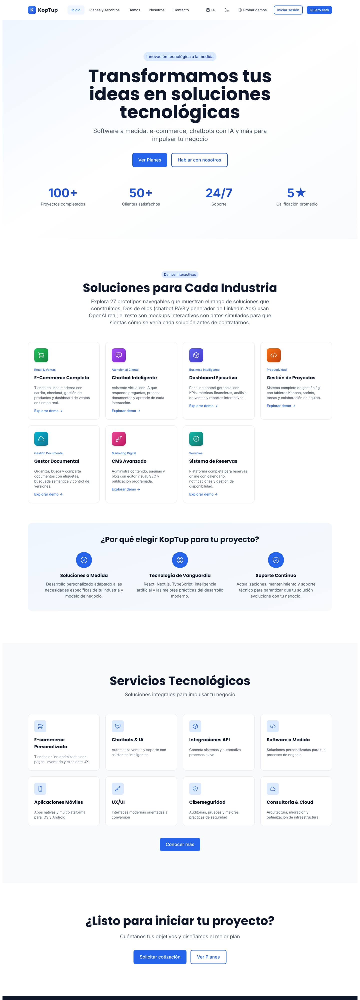
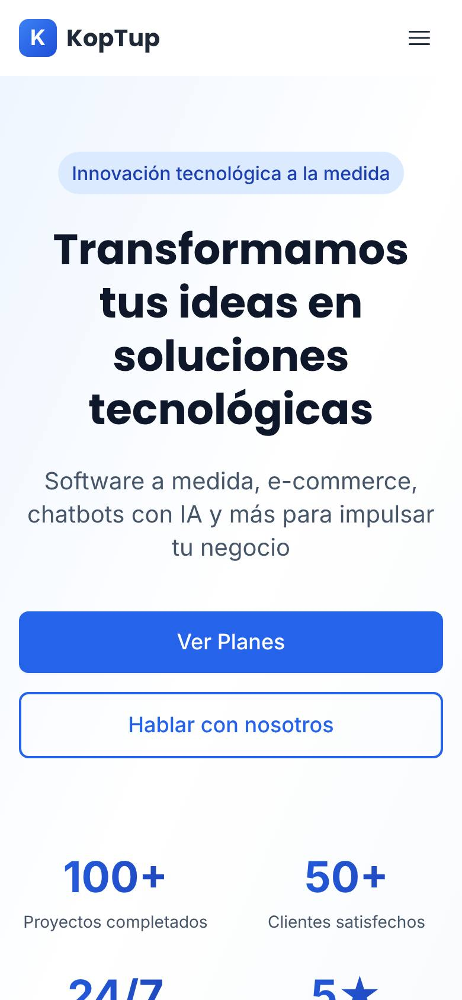
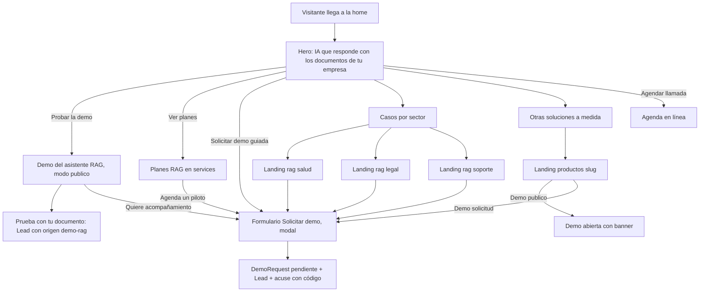

# Página de inicio (Home)

> Ruta: `/` · Archivos principales: `apps/web/src/app/page.tsx`, `apps/web/src/app/layout.tsx`, `apps/web/src/components/seo/StructuredData.tsx`, `apps/web/messages/{es,en}.json` (namespaces `hero`, `homePage`, `services`), `apps/web/src/app/opengraph-image.tsx` · Prioridad: **P0** · Esfuerzo total: **XL** (≈ 18 días-dev en la Fase 1, la mayoría tareas S de medio día a un día; el resto en las Fases 2 y 5)

*Captura de producción antes del reposicionamiento RAG. Páginas relacionadas: [Flujo del cliente](03-Flujo-del-Cliente.md), [Sistema de demos](04-Sistema-de-Demos.md), [Nosotros](Seccion-Nosotros.md), [Landings SEO y de campaña](Seccion-Landings-SEO.md), [Servicios y precios](Seccion-Servicios-y-Precios.md), [Plan por sección](07-Plan-por-Seccion.md).*

---

## Objetivo

La home es la puerta de entrada de la mayoría de las visitas (tráfico directo, marca, referidos y parte de la pauta). Tiene que lograr cuatro cosas en menos de 10 segundos de lectura:

1. **Decir qué vende KopTup:** sistemas RAG, es decir, IA que responde con los documentos de cada empresa y cita la fuente. No "software para todo".
2. **Llevar a la prueba sin fricción:** el botón principal abre la demo pública del asistente (`/demo/chatbot`, modo `publico`), donde está "Prueba con tu documento".
3. **Mostrar precio y siguiente paso:** planes RAG visibles (`/services#planes-rag`) y una forma clara de pedir acompañamiento: **Solicitar demo guiada** o **Agendar llamada**.
4. **Dar confianza con hechos verificables:** casos reales, lo que el producto hace hoy, equipo en Colombia. Ninguna cifra que no se pueda respaldar.

Las demás soluciones (CRM, ERP, facturación, etc.) siguen visibles, pero en un bloque secundario, "Otras soluciones a medida", que lleva a la landing de cada producto (`/productos/<slug>`).

| Indicador de negocio | Por qué importa |
|---|---|
| Clic en un CTA principal desde la home | Mide si el mensaje se entiende |
| Sesiones con origen en la home que inician la demo (`demo_start`) | Primer paso del camino RAG (ver [Flujo del cliente](03-Flujo-del-Cliente.md)) |
| Solicitudes de demo y leads con `source.landingPath = "/"` | Conversión real de la home |

---

## Estado actual

Evidencia tomada de la rama `main`. La rama `rag-reposicionamiento` ya cambia parte de esto (se indica en cada fila).

| Bloque | Qué hay hoy | Evidencia |
|---|---|---|
| Tipo de componente | Toda la home es un client component | `page.tsx` línea 1 (`'use client'`). En la rama, `page.tsx` pasa a server component con la metadata y el contenido se mueve a `components/home/HomeContent.tsx` |
| Metadata | Título "KopTup - Desarrollo de Software a Medida \| Demos Interactivas"; OG y Twitter dicen "Prueba 27 prototipos interactivos" | `layout.tsx` líneas 21–24, 46–48 y 60–62. La rama define `HOME_TITLE` y `HOME_DESCRIPTION` en `lib/site.ts` |
| Hero | H1 "Transformamos tus ideas en soluciones tecnológicas"; botones "Ver Planes" (a `/pricing`, que solo redirige) y "Hablar con nosotros" (a `/contact`) | `page.tsx` líneas 158–174; textos en `es.json` → `hero` |
| Cifras | 100+ proyectos, 50+ clientes, 24/7 soporte, 5★ | `page.tsx` líneas 77–82. Contradicen `/about` (fundación 2026, 1 cliente nombrado) y el horario Lun–Vie de `/services`. La rama las reemplaza por 4 frases verificables |
| Demos destacadas | 7 tarjetas; la primera es e-commerce. Incluye `gestor-documentos`, que hoy falla en producción, y `dashboard-ejecutivo` y `control-proyectos`, con fechas de 2024 | `page.tsx` líneas 85–142. La rama pone el chatbot primero |
| Rejilla de demos | `lg:grid-cols-4` con 7 tarjetas: queda un hueco en la segunda fila | `page.tsx` línea 209; ver `home-completa.jpg` |
| Texto de la sección | "Explora 27 prototipos navegables…" (hay 28 rutas de demo y 26 tarjetas en `/demo`) | `es.json` → `homePage.demos.sectionSubtitle`. La rama lo calcula con `DEMO_COUNT` (`lib/demos.ts`) |
| "Servicios Tecnológicos" | 8 tarjetas genéricas que enlazan a `/services#ecommerce`, `#chatbots`, `#integrations`, etc. Esas anclas no existen en `/services` | `page.tsx` líneas 26–75 y 288–331 |
| CTA final | "Solicitar cotización" (a `/contact`) y "Ver Planes" (a `/pricing`) | `page.tsx` líneas 334–351 |
| JSON-LD | 5 bloques: Organization, WebSite, SoftwareApplication, LocalBusiness y FAQPage. Incluyen `aggregateRating` sin reseñas, `foundingDate: 2019`, `numberOfEmployees: 5`, un `SearchAction` a `/search` (no existe), un `AggregateOffer` de 500 a 50.000 USD y un FAQ que no se ve en la página ("desde $499 USD", "27 prototipos") | `StructuredData.tsx` líneas 61–62, 96–102, 113–120, 129–135, 148–153, 257–263 y 303–357. La rama ya quitó `aggregateRating` y `SearchAction` |
| Imagen OG | Texto "Desarrollo de Software a Medida" | `opengraph-image.tsx` líneas 4 y 85 |
| Mensajes i18n | El layout envía a cada página todos los mensajes: base, demos y ofertas (≈ 440 KB entre `es.json`, `_demos.es.json` y `_offerings.es.json`) | `layout.tsx` líneas 97–116 y 156 |
| Medición | No hay analítica. La rama agrega GA4, Google Ads y LinkedIn con banner de consentimiento (Fase 7 de su especificación) | — |

**Capturas del estado actual**

La home enlaza hoy a una demo que no carga sus datos en producción:

---

## Problemas detectados

1. **Mensaje genérico.** "Transformamos tus ideas en soluciones tecnológicas" no dice qué se vende ni a quién. Contradice el reposicionamiento RAG ([Visión de producto](02-Vision-de-Producto.md)).
2. **Cifras sin respaldo.** 100+ proyectos, 50+ clientes y 5★ no se pueden demostrar y chocan con `/about`. "24/7" contradice el horario Lun–Vie 8–17 de `/services`. Para un comprador B2B, una cifra inflada resta más confianza de la que suma.
3. **Datos estructurados inventados o falsos:** calificaciones sin reseñas, año de fundación distinto al de `/about`, búsqueda interna inexistente, rango de precios que no coincide con ningún plan y un FAQ que no aparece en la página. Además de engañar, puede acarrear acciones manuales de Google.
4. **Enlaces a demos rotas o desactualizadas** (gestor documental, dashboard con "Enero 2024", Kanban con fechas de 2024). La primera impresión de una demo pesa más que su descripción.
5. **Anclas muertas:** las 8 tarjetas de "Servicios Tecnológicos" llevan a `/services` sin posicionarse en nada.
6. **No hay camino a "Solicitar demo".** Los únicos CTA de contacto llevan a `/contact`, que además pierde el servicio o plan preseleccionado (ver [Contacto](Seccion-Contacto.md)).
7. **"Agendar llamada" no existe en la home.** En el resto del sitio es un `mailto:`.
8. **Sin prueba social.** No se menciona ningún caso real, aunque `/about` sí tiene uno (SoSalud).
9. **Rendimiento:** página entera en el cliente y ≈ 440 KB de mensajes enviados a cada visita. La home no necesita casi nada de eso.
10. **Contador de demos inconsistente** (27 en textos, 26 en el catálogo `/demo`, 28 rutas). Cualquier número escrito a mano se desactualiza.

---

## Plan detallado

### Orden de secciones propuesto

| # | Sección | Componente | Propósito | CTA principal |
|---|---|---|---|---|
| 1 | Hero RAG + 4 frases verificables | `HomeHero` (en `HomeContent.tsx` de la rama) | Qué vendemos y primer paso | Probar la demo · Ver planes · enlace "Solicitar demo guiada" |
| 2 | Cómo funciona en 3 pasos | `HowRagWorks` (nuevo) | Que un gerente lo entienda | Enlace "Ver cómo funciona" → `/rag` |
| 3 | Pruébalo ahora | `TryDemoBlock` (nuevo) | Llevar a la demo con una pregunta ya escrita | Probar la demo · Prueba con tu documento |
| 4 | Casos por sector | `SectorCards` (nuevo) | Que cada visitante se vea reflejado | `/rag/salud`, `/rag/legal`, `/rag/soporte` |
| 5 | Planes RAG (resumen) | `RagPlansTeaser` (nuevo, mismos datos que `/services`) | Precio claro, sin sorpresas | Ver planes · Agenda un piloto |
| 6 | Lo que ya construimos (prueba social real) | `CaseStudyCard` (nuevo, compartido con `/about`) | Confianza con hechos | Probar la demo · Ver el caso |
| 7 | Tus documentos, protegidos | `TrustStrip` (nuevo) | Responder la objeción de seguridad | Enlace a `/rag` (sección seguridad) y `/privacy` |
| 8 | Otras soluciones a medida | `OtherSolutionsGrid` (reemplaza "Soluciones para cada industria" y "Servicios tecnológicos") | No perder a quien busca otra cosa | Botón según el modo de acceso de cada demo |
| 9 | Preguntas frecuentes | `FaqSection` (nuevo, compartido con las landings) | Resolver dudas y SEO | Enlace a las FAQ de `/rag` |
| 10 | CTA final | `FinalCta` | Cierre | Solicitar demo guiada · Agendar llamada · WhatsApp |

### 1. Hero

El texto lo fija la especificación del reposicionamiento RAG (rama `rag-reposicionamiento`, Fase 2). Este plan lo adopta tal cual y le agrega el enlace a la demo guiada.

| Elemento | Copy | Destino o dato |
|---|---|---|
| Title | **KopTup \| IA que responde con los documentos de tu empresa** | `HOME_TITLE` en `lib/site.ts` (rama) |
| Description | Sistemas RAG para empresas en Colombia: IA que responde con tus manuales, contratos y políticas, cita la fuente y protege tus datos. Prueba la demo gratis. | `HOME_DESCRIPTION` |
| Insignia | Sistemas RAG para empresas | `hero.badge` (si la rama ya definió otro texto, se conserva el de la rama) |
| H1 | **IA que responde con los documentos de tu empresa** | `hero.title` |
| Subtítulo | Sistemas RAG con respuestas citadas sobre tus manuales, contratos y políticas. Piloto con tus documentos en 2 semanas. | `hero.subtitle` |
| Botón principal | **Probar la demo** | `/demo/chatbot` |
| Botón secundario | **Ver planes** | `/services#planes-rag` |
| Enlace terciario (nuevo) | ¿Prefieres que te lo mostremos con tus casos? **Solicita una demo guiada** | Abre el modal Solicitar demo con `?producto=chatbot-rag-ia` |
| 4 frases | Demo con IA real, sin registro · Respuestas con fuente citada · Piloto en 2 semanas · Equipo en Colombia | `homePage.stats.*` (rama), en `<ul>` con íconos |
| Visual (Fase 2) | Captura real de una respuesta con cita (pregunta, respuesta, "Fuente: Manual, pág. 12") | `next/image` con `priority`, AVIF/WebP, ancho máximo 640 px |

Reglas del hero:
- **Una sola acción dominante** (Probar la demo). "Ver planes" va como botón secundario y la demo guiada como enlace de texto, para no tener tres botones iguales.
- La captura del visual sale de la demo real **después** de las mejoras de la Fase 2 del [Chatbot RAG](Producto-chatbot-rag-ia.md). Hasta entonces el hero queda sin imagen, que es mejor que mostrar una respuesta en inglés o con métricas simuladas.

### 2. Cómo funciona en 3 pasos

| Paso | Título | Texto |
|---|---|---|
| 1 | Conectas tus documentos | PDF, Word, Google Drive o SharePoint. Tú decides qué fuentes usa el asistente. |
| 2 | Tu equipo o tus clientes preguntan | En tu web o en WhatsApp, con sus propias palabras. |
| 3 | Responde y cita la fuente | Cada respuesta muestra el documento y la página. Si la información no está en tus documentos, lo dice. |

Enlace al pie: "Mira cómo funciona por dentro" → `/rag` (sección "Cómo funciona"). WhatsApp está disponible desde el plan Profesional; la tarjeta 2 lo aclara con una nota pequeña.

### 3. Pruébalo ahora

- **Título:** Pruébalo ahora, sin registro.
- **Texto:** Haz una pregunta sobre el documento de ejemplo o sube el tuyo (PDF, DOCX o TXT de hasta 5 MB). Lo borramos a la hora. No subas información confidencial.
- **Chips de preguntas** (3 o 4). Cada chip abre `/demo/chatbot?q=<pregunta>` con la pregunta escrita. Las preguntas deben salir del documento de ejemplo que use la demo. Ejemplos, si la demo usa las plantillas por sector de la Fase 2: "¿Qué documentos necesito para una autorización?" (salud), "¿Cuántos días de vacaciones me corresponden?" (RR. HH.), "¿Qué cubre la garantía?" (soporte).
- **Botones:** Probar la demo · Prueba con tu documento (`/demo/chatbot?modo=documento`).
- **Fase 1:** el bloque usa enlaces simples. **Fase 2:** la demo acepta el parámetro `q` y el bloque muestra una animación corta (sin video pesado) de una respuesta con cita.

### 4. Casos por sector

Tres tarjetas, con el texto de la especificación RAG:

| Tarjeta | Texto | Destino |
|---|---|---|
| Salud | Protocolos clínicos, normativa del sector y auditoría de cuentas médicas. | `/rag/salud` |
| Legal | Contratos, conceptos jurídicos internos y normativa. | `/rag/legal` |
| Soporte | Manuales, políticas y base de conocimiento para tus agentes. | `/rag/soporte` |

La demo de **auditoría de cuentas médicas** es `privado` ([Sistema de demos](04-Sistema-de-Demos.md), sección 4). La home **no** enlaza directo a `/demo/cuentas-medicas`: la tarjeta de salud lleva a `/rag/salud`, que tiene el botón "Solicitar demo personalizada". Así se cumple el "enlázala desde el inicio" de la especificación RAG sin abrir una demo privada, y sin mostrar una demo que hoy falla en producción ([Demo cuentas médicas](Demo-cuentas-medicas.md)).

### 5. Planes RAG (resumen)

Cuatro tarjetas compactas. **Los datos salen de la misma constante que usa `/services#planes-rag`**, nunca escritos a mano en la home.

| Plan | Precio en la tarjeta | Línea de apoyo | CTA |
|---|---|---|---|
| Piloto RAG | COP 3.900.000 · USD 1.200 | 2 semanas con tus documentos. Se descuenta el 100 % si contratas en 30 días. | **Agenda un piloto** |
| Esencial | Setup COP 9.900.000 + COP 1.490.000/mes | Una fuente, hasta 1.000 documentos, widget web. | Ver plan |
| Profesional | Setup COP 24.900.000 + COP 2.990.000/mes | Hasta 3 fuentes, web y WhatsApp, permisos por rol. | Ver plan |
| Empresarial | Desde COP 59.900.000 | Tu nube u on-premise, SSO, auditoría y código fuente. | Hablar con ventas |

- Pie: "Precios en COP más IVA si aplica. USD fijos para clientes fuera de Colombia." y enlace "Ver todos los detalles" → `/services#planes-rag`.
- "Agenda un piloto" abre el formulario Solicitar demo con `?producto=chatbot-rag-ia&plan=piloto`. Mientras el formulario no exista, va a `/contact` con esos mismos parámetros (el formulario de contacto debe conservarlos; ver [Contacto](Seccion-Contacto.md)).
- Evento `plan_click` con `plan` y `source_page = home`.

### 6. Lo que ya construimos (prueba social real)

Título: **Lo que ya construimos**. Subtítulo: *Sin cifras infladas: esto es lo que puedes verificar.*

Cada tarjeta lleva una etiqueta que dice qué tipo de evidencia es. Así nadie confunde un producto propio con un cliente.

| Tarjeta | Etiqueta | Texto propuesto | Enlace | Condición para publicarla |
|---|---|---|---|---|
| SoSalud: VPN empresarial | **Cliente** · Salud · Bogotá | Implementamos una VPN empresarial para el trabajo remoto seguro del equipo administrativo de SoSalud, con 2 meses de soporte incluidos. | Caso en `/about` (Fase 1) y página de caso (Fase 5) | Autorización escrita del cliente para usar su nombre. Sin ella: "Operador administrativo del sector salud, Bogotá" |
| Asistente RAG de KopTup | **Producto propio** · en línea | El mismo motor que ofrecemos: responde con documentos y cita la página. No te lo contamos: pruébalo. | Probar la demo | Que la demo pase el QA de la Fase 2 (respuestas en español, sin métricas simuladas) |
| Generador de contenido para LinkedIn | **Uso interno** · Marketing | Herramienta con IA que usamos para planear y redactar nuestras propias publicaciones. | Solicitar demo (la demo es `solicitud`) | Quitar de la demo los textos internos antes de mostrarla (ver [Demo LinkedIn Ads](Demo-linkedin-ads.md)) |

Reglas:
- **No publicar** los casos "Chatbot WhatsApp para empresa de productos (+3x)" ni "Dashboard ejecutivo (−60 %)" que hoy están en `/about`: no hay cliente identificable ni fuente de la cifra (ver [Nosotros](Seccion-Nosotros.md)).
- Montos de contratos: solo con permiso del cliente. En la home no se muestran.
- **Fase 5:** cuando haya Pilotos RAG cerrados, la primera tarjeta pasa a ser un caso RAG con una métrica medida (por ejemplo, "% de respuestas correctas en el informe de 50 preguntas") y una cita del cliente con autorización. Plantilla de caso en [Comercial, marketing y legal](11-Comercial-Marketing-y-Legal.md).

### 7. Tus documentos, protegidos

Franja corta, 3 puntos. El texto debe describir **lo que el código hace**, igual que la sección de seguridad de `/rag`. Se revisa contra esa sección antes de publicar.

- En la demo, tu documento se borra a la hora.
- Tratamos tus datos según la Ley 1581 de 2012. Lee nuestra política de privacidad (enlace a `/privacy`).
- En el plan Empresarial, el sistema puede correr en tu nube o en tus servidores.

Enlace: "Cómo manejamos la seguridad" → `/rag` (sección "Seguridad y privacidad"). Sin sellos ni certificaciones que no existan.

### 8. Otras soluciones a medida

Reemplaza las secciones "Soluciones para cada industria" (7 demos) y "Servicios tecnológicos" (8 tarjetas con anclas muertas).

- **Título:** ¿Buscas otra solución a medida?
- **Texto:** También construimos CRM, ERP, facturación electrónica, mesas de ayuda y más. Algunas demos están abiertas; otras se activan cuando las solicitas.
- **6 tarjetas de producto.** Cada una lleva a `/productos/<slug>`, no directo a la demo. Etiqueta y botón según `accessMode`:
  - `publico`: etiqueta "Demo abierta", botón **Probar la demo**.
  - `solicitud`: etiqueta "Demo por solicitud", botón **Solicitar demo**.
  - `privado`: no se muestra.
- **Fuente de datos:**
  - **Fase 1, antes del catálogo en base de datos:** lista fija en `lib/demos.ts` (rama).
  - **Con el catálogo:** `GET /api/demo-catalog`. Se toman las 6 primeras demos activas no privadas según `sortOrder`. No hace falta ningún campo nuevo en `DemoCatalogItem`.
  - **Regla:** solo entran demos que pasaron el QA de "demo vendible" de la Fase 2. Una demo con errores se marca `active = false` desde **Admin › Catálogo de demos** y sale sola de la home.
- **Selección inicial sugerida** (a confirmar con el QA): CRM con IA, Mesa de ayuda con IA, Facturación electrónica, ERP modular (`solicitud`), Voice AI para call center (`solicitud`) y LMS. **No** van gestor documental, dashboard ejecutivo ni control de proyectos hasta que se corrijan.
- **Botones al pie:** "Ver todas las soluciones" → `/services#otras-soluciones` (ancla que se crea en [Servicios y precios](Seccion-Servicios-y-Precios.md)) y "Ver catálogo de demos" → `/demo`.
- La rejilla usa `md:grid-cols-2 lg:grid-cols-3` para 6 tarjetas, sin huecos.

### 9. Preguntas frecuentes

Cuatro preguntas visibles. El JSON-LD `FAQPage` **se genera del mismo arreglo** que se muestra (componente `FaqSection`, compartido con las landings).

| Pregunta | Respuesta propuesta |
|---|---|
| ¿Qué es un sistema RAG? | Es una IA que, antes de responder, busca en tus documentos y responde solo con lo que encuentra, citando la fuente. Por eso no inventa políticas ni precios. |
| ¿Cuánto cuesta? | Puedes empezar con un Piloto de 2 semanas por COP 3.900.000 (USD 1.200), que se descuenta si contratas. Los planes mensuales empiezan en COP 1.490.000 más el setup. Enlace "Ver planes" → `/services#planes-rag`. |
| ¿Cuánto tarda? | El piloto toma 2 semanas. El plan Esencial se implementa en 3 a 4 semanas; el Profesional, en 6 a 8. |
| ¿También hacen otros desarrollos a medida? | Sí. Tenemos soluciones de CRM, ERP, facturación electrónica y más, con demo para que las veas antes de contratar. |

Pie: "Más preguntas sobre RAG" → `/rag` (sección de preguntas frecuentes).

### 10. CTA final

- **Título:** ¿Hablamos de tus documentos?
- **Texto:** Cuéntanos qué preguntas responde hoy tu equipo una y otra vez, y te mostramos cómo lo haría un sistema RAG con tus propios documentos.
- **Botones:**
  - **Solicitar demo guiada** (principal): abre el modal.
  - **Agendar llamada**: `NEXT_PUBLIC_BOOKING_URL`. Reemplaza el `mailto:`.
  - Enlace "Escríbenos por WhatsApp", si existe el número comercial, con evento `whatsapp_click`.

### Componentes globales que afectan la home

No son de la home, pero la home es donde más se ven. El detalle está en [Plan por sección](07-Plan-por-Seccion.md):

- **Navbar.** El botón "Quiero esto" (hoy a `/pricing`) pasa a ser **Solicitar demo** y abre el modal. El menú agrega "RAG" (especificación RAG).
- **Footer.** Agrega la columna RAG (`/rag` y los 3 sectores) y cambia los enlaces a anclas inexistentes de `/services` por enlaces a `/productos/<slug>`.
- **Banner de consentimiento de cookies** (rama RAG). Debe salir abajo y sin tapar los botones del hero en móvil.

### Datos y fuentes únicas

| Dato que muestra la home | Fuente única | Nunca |
|---|---|---|
| Número de demos | `DEMO_COUNT` en `lib/demos.ts` (rama). Con el catálogo: conteo de `DemoCatalogItem` activos no privados | Escribir "27" o "25" en textos |
| Precios de planes RAG | Constante de planes de `/services#planes-rag` | Copiarlos en `es.json` |
| Datos de empresa (año, ciudad, contacto) | `lib/company.ts` (ver [Nosotros](Seccion-Nosotros.md)) | Repetirlos en JSON-LD, footer y textos |
| Casos | Arreglo `CASES` en `lib/company.ts`, con el campo `authorized: boolean` | Publicar un caso con `authorized = false` |

---

## Integración con el sistema de demos

| Punto de la home | Comportamiento | Referencia |
|---|---|---|
| "Probar la demo" | `/demo/chatbot` es `publico`: entra sin sesión y ve el banner "Solicita tu demo guiada" | [Sistema de demos](04-Sistema-de-Demos.md), sección 4 |
| "Solicitar demo guiada" (hero, planes, CTA final) | Abre el formulario de 2 pasos con `?producto=chatbot-rag-ia` (y `plan` si viene de una tarjeta de plan). `DemoRequest.source.page = "/"` y se conservan las UTM en `source.utm` | `POST /api/demo-requests` |
| Tarjetas "Otras soluciones" | Botón según `accessMode`, leído de `GET /api/demo-catalog`. Las demos `privado` no se listan | Sección 9 de [Sistema de demos](04-Sistema-de-Demos.md) |
| Visitante con sesión `prospect` o `client` | Franja bajo el hero: "Tienes N demos activas. Ir a Mis demos" (`GET /api/me/demos`). Si alguna vence en ≤ 3 días: "Tu acceso a X vence en N días" | [Portal del cliente](06-Portal-del-Cliente.md) |
| Staff con sesión | Sin cambios en la home. El enlace al panel va en el menú de usuario | — |
| Lead desde la home | `Lead.source.landingPath = "/"` cuando la home fue la primera página de la sesión | Modelo `Lead`, sección 5.1 |
| Métricas | **Admin › Métricas** desglosa solicitudes y leads por `landingPath`. La home aparece como una fila más del embudo | `GET /api/metrics/demo-funnel` |

**Eventos de la home** (solo con consentimiento de analítica; propiedades sin datos personales):

| Evento | Cuándo | Propiedades |
|---|---|---|
| `cta_solicitar_demo_click` | Clic en cualquier "Solicitar demo" | `source_page: home`, `section` (`hero`, `planes`, `cta_final`, `otras_soluciones`), `product` |
| `demo_request_open` | Se abre el modal | `source_page`, `product`, `plan` |
| `plan_click` | Clic en una tarjeta de plan | `plan`, `source_page` |
| `schedule_call_click` | Clic en "Agendar llamada" | `source_page`, `section` |
| `whatsapp_click` | Clic en WhatsApp | `source_page` |
| `home_demo_chip_click` (nuevo) | Clic en un chip de pregunta | `chip_id` |

---

## SEO · i18n · accesibilidad · rendimiento

**SEO**
- Título y descripción según la especificación RAG (arriba). Verificar con `npm run check-titles` (script de la rama).
- **Un solo H1.** Los títulos de sección van en H2 y las tarjetas en H3.
- **JSON-LD de la home:**
  - Se queda: `Organization`, con datos de `lib/company.ts`, `foundingDate` confirmado por el dueño, `sameAs` solo con perfiles que existan, y sin `aggregateRating` ni `numberOfEmployees` inventados.
  - Se queda: `WebSite`, sin `SearchAction`.
  - Se genera del FAQ visible: `FAQPage`.
  - Se quitan: `SoftwareApplication`, que tiene un `AggregateOffer` inventado (el `Service` con los planes reales va en `/rag`), y `LocalBusiness`, salvo que haya una oficina con atención al público. Si no la hay, la dirección va dentro de `Organization`.
  - El contacto del JSON-LD usa un **buzón de rol** (por ejemplo, ventas) y no el correo personal de nadie.
- **Imagen OG nueva** (`opengraph-image.tsx`): "IA que responde con los documentos de tu empresa", logo y fondo de marca.
- La home enlaza a `/rag` en las secciones 2, 4 y 9: refuerza la página pilar (ver [Landings SEO](Seccion-Landings-SEO.md)).

**i18n**
- Todo el texto nuevo en `messages/es.json` y `messages/en.json` (namespaces `hero` y `homePage`), en español colombiano con "tú".
- Se borran las claves que dejan de usarse (`services.*` de las 8 tarjetas, `homePage.demos.*` viejas). Así se reduce el peso de los mensajes.
- La versión en inglés indexable (`/en`) es de la Fase 5 ([Roadmap](12-Roadmap.md)). Mientras tanto el inglés va por cookie y no se declara `hreflang`.

**Accesibilidad**
- Íconos decorativos con `aria-hidden="true"` (la rama ya lo hace en las 4 frases).
- Las tarjetas que son enlaces completos tienen un único texto de enlace descriptivo. Se quita el "Explorar demo →" redundante dentro de un enlace que ya envuelve la tarjeta.
- `animate-fade-in-up` respeta `prefers-reduced-motion`.
- Contraste AA en los textos pequeños `text-secondary-500` sobre fondos claros.
- Foco visible en botones y chips. El modal atrapa el foco y se cierra con Esc.

**Rendimiento** (meta: LCP móvil p75 < 2,5 s, CLS < 0,1, INP < 200 ms)
- **Server components:** `page.tsx` server (rama) y secciones estáticas como server components. Solo son client los chips, el modal y la franja de "Mis demos".
- **Mensajes:** pasar a `NextIntlClientProvider` solo los namespaces que usan los componentes client de la página. Hoy se envían ≈ 440 KB a cada visita. Es una tarea transversal ([Seguridad y calidad](10-Seguridad-y-Calidad.md)); la home es la primera página que se mide.
- La imagen del hero con `next/image`, `priority` y dimensiones fijas (evita CLS).
- Los scripts de analítica cargan solo después del consentimiento y con `afterInteractive` (rama RAG).

---

## Tareas

| # | Tarea | Fase | Prioridad | Esfuerzo | Criterio de aceptación |
|---|---|---|---|---|---|
| 1 | Fusionar en `main` la Fase 2 de la rama `rag-reposicionamiento` (title y description, H1, subtítulo, botones "Probar la demo" y "Ver planes", 4 frases verificables, chatbot primero, `page.tsx` server + `HomeContent.tsx`, `DEMO_COUNT`) | Fase 1 — Funnel y solicitud de demos | P0 | S | En producción el H1 es "IA que responde con los documentos de tu empresa"; no aparecen "100+", "50+", "5★" ni "24/7"; `npm run check-titles` pasa |
| 2 | Quitar de la home los enlaces a demos que fallan o están desactualizadas (gestor documental, dashboard ejecutivo, control de proyectos) hasta que pasen el QA de la Fase 2 | Fase 1 — Funnel y solicitud de demos | P0 | S | Una prueba E2E recorre todos los enlaces de la home y ninguno termina en una pantalla con error o con datos de 2024 |
| 3 | Reescribir el JSON-LD de la home: quitar `FAQStructuredData` actual, `SoftwareApplication` y `LocalBusiness` (si no hay oficina con atención al público); `Organization` con datos de `lib/company.ts`, buzón de rol y `sameAs` verificados | Fase 1 — Funnel y solicitud de demos | P0 | S | La prueba de resultados enriquecidos de Google no muestra errores; ningún dato del JSON-LD contradice `/about` (año, cifras, precios) |
| 4 | Reemplazar "Soluciones para cada industria" y "Servicios tecnológicos" por `OtherSolutionsGrid` (6 productos → `/productos/<slug>`, botón según `accessMode`, rejilla sin huecos) | Fase 1 — Funnel y solicitud de demos | P1 | M | No quedan enlaces a `/services#ecommerce` ni a otras anclas inexistentes; con 6 tarjetas no hay huecos en escritorio ni en móvil; una demo con `active = false` desaparece de la home sin desplegar |
| 5 | Sección "Cómo funciona en 3 pasos" (`HowRagWorks`) con enlace a `/rag` | Fase 1 — Funnel y solicitud de demos | P1 | S | Se ve en móvil sin desplazamiento horizontal; el enlace llega a la sección "Cómo funciona" de `/rag` |
| 6 | Sección "Casos por sector" (`SectorCards`) hacia `/rag/salud`, `/rag/legal` y `/rag/soporte` | Fase 1 — Funnel y solicitud de demos | P1 | S | Los 3 enlaces responden 200; la tarjeta de salud no enlaza directo a una demo `privado` |
| 7 | Sección "Planes RAG" (`RagPlansTeaser`) leyendo la misma constante que `/services#planes-rag`, con evento `plan_click` | Fase 1 — Funnel y solicitud de demos | P1 | S | Cambiar un precio en la constante cambia la home y `/services` a la vez; los precios coinciden con la especificación RAG; `plan_click` llega a GA4 con el nombre del plan |
| 8 | Componente `CaseStudyCard` compartido con `/about` y sección "Lo que ya construimos" (SoSalud, asistente RAG, generador de LinkedIn) con etiquetas Cliente, Producto propio y Uso interno | Fase 1 — Funnel y solicitud de demos | P1 | M | Ninguna tarjeta muestra una cifra sin fuente; el caso SoSalud solo sale con nombre si `authorized = true` en `lib/company.ts` |
| 9 | Enlace "Solicitar demo guiada" en hero, planes y CTA final, que abre el modal con `producto` y `plan` precargados y guarda `source.page` y UTM | Fase 1 — Funnel y solicitud de demos | P1 | S | Una solicitud enviada desde la home aparece en **Admin › Solicitudes de demo** con producto, plan, página de origen `/` y UTM |
| 10 | "Agendar llamada" real con `NEXT_PUBLIC_BOOKING_URL` en el CTA final, con evento `schedule_call_click` | Fase 1 — Funnel y solicitud de demos | P1 | S | No queda ningún `mailto:` en la home; el clic abre la agenda y registra el evento |
| 11 | Medición de la home: `cta_solicitar_demo_click`, `demo_request_open`, `plan_click`, `schedule_call_click`, `whatsapp_click` y `home_demo_chip_click` con `source_page = home`, solo con consentimiento | Fase 1 — Funnel y solicitud de demos | P1 | S | Con cookies rechazadas no sale ninguna petición a GA4, Ads ni LinkedIn; con cookies aceptadas los 6 eventos aparecen en DebugView |
| 12 | Prueba E2E de la home (Playwright): H1, destinos de los botones y una lista negra de cifras ("100+", "50+", "27 prototipos", "4.9", "24/7 soporte") | Fase 1 — Funnel y solicitud de demos | P1 | S | La prueba corre en el CI (cuando la Fase 0 lo repare) y falla si alguien reintroduce una cifra prohibida |
| 13 | Botón **Solicitar demo** en la navbar en lugar de "Quiero esto" (global, ver [Plan por sección](07-Plan-por-Seccion.md)) | Fase 1 — Funnel y solicitud de demos | P1 | S | En escritorio y móvil el botón abre el modal; no quedan enlaces a `/pricing` en la navbar |
| 14 | Bloque "Pruébalo ahora" (`TryDemoBlock`) con 3 o 4 preguntas de ejemplo y botón "Prueba con tu documento" | Fase 1 — Funnel y solicitud de demos | P1 | S | Cada chip abre `/demo/chatbot` con la pregunta; las preguntas tienen respuesta con cita en el documento de ejemplo |
| 15 | Que `/demo/chatbot` acepte `?q=` y `?modo=documento` para que los chips lleguen con la pregunta escrita | Fase 2 — Demos vendibles | P2 | S | Abrir `/demo/chatbot?q=…` muestra la pregunta en el campo y la envía al pulsar Enter, sin respuesta provisional inventada |
| 16 | Franja "Tus documentos, protegidos" (`TrustStrip`) con texto revisado contra la sección de seguridad de `/rag` | Fase 1 — Funnel y solicitud de demos | P2 | S | Cada afirmación del bloque corresponde a algo que el código hace hoy (lo revisa el dev del chatbot antes de publicar) |
| 17 | FAQ visible de 4 preguntas con `FAQPage` generado del mismo arreglo (`FaqSection`) | Fase 1 — Funnel y solicitud de demos | P2 | S | El texto de cada pregunta y respuesta del JSON-LD es idéntico al visible; no queda "desde $499 USD" en el repo |
| 18 | Franja para usuarios `prospect` o `client` con sesión: "Tienes N demos activas" (`GET /api/me/demos`) | Fase 1 — Funnel y solicitud de demos | P2 | S | Un prospecto con 2 accesos ve "Tienes 2 demos activas" y el enlace lleva a `/dashboard/demos`; un visitante sin sesión no ve la franja ni dispara la petición |
| 19 | Imagen OG nueva con el mensaje RAG (`opengraph-image.tsx`) | Fase 1 — Funnel y solicitud de demos | P2 | S | Al compartir la home en LinkedIn y WhatsApp, la vista previa dice "IA que responde con los documentos de tu empresa" |
| 20 | Rendimiento: secciones estáticas como server components, mensajes recortados por namespace en la home, imagen del hero con `next/image` y `priority` | Fase 2 — Demos vendibles | P2 | M | Lighthouse móvil ≥ 90 en rendimiento; LCP p75 < 2,5 s en datos de campo; el JS de primera carga de `/` baja al menos un 30 % frente a hoy (salida de `next build`) |
| 21 | Accesibilidad: un solo H1, H2 por sección, `aria-hidden` en íconos, `prefers-reduced-motion`, contraste AA y foco visible | Fase 1 — Funnel y solicitud de demos | P2 | S | axe-core no reporta errores serios ni críticos en `/`; navegación completa con teclado |
| 22 | Visual del hero con una captura real de respuesta con cita, tomada de la demo mejorada | Fase 2 — Demos vendibles | P2 | S | La captura está en español, muestra la fuente con página y pesa menos de 120 KB en AVIF o WebP |
| 23 | Traducción EN de todos los textos nuevos y borrado de claves que ya no se usan en `es.json` y `en.json` | Fase 2 — Demos vendibles | P2 | S | Con la cookie `locale=en` no queda ningún texto en español en la home; un script de claves sin uso no reporta claves de `homePage` |
| 24 | Reemplazar la primera tarjeta de prueba social por un caso RAG con métrica medida y cita autorizada, en cuanto haya pilotos cerrados | Fase 5 — Escala | P2 | M | El caso enlaza a su página `/casos/<slug>` con autorización escrita archivada; la métrica sale del informe de precisión del piloto |
| 25 | Prueba A/B del botón principal (Probar la demo frente a Solicitar demo guiada) y botón fijo en móvil | Fase 5 — Escala | P3 | M | El experimento corre al menos 4 semanas o 1.000 sesiones por variante y se decide con la tasa de leads, no solo con clics |

---

## Métricas de éxito

Metas iniciales a validar con 8 semanas de datos reales (ver la nota de [Flujo del cliente](03-Flujo-del-Cliente.md)).

| Métrica | Fuente | Meta inicial |
|---|---|---|
| Sesiones de la home con clic en un CTA principal (Probar la demo, Ver planes, Solicitar demo) | GA4 | ≥ 20 % |
| Sesiones que empiezan en la home y llegan a `demo_start` | GA4 | ≥ 12 % |
| Leads y solicitudes con `landingPath = "/"` | **Admin › Métricas** | Línea base en el primer mes; +30 % al tercer mes |
| Sesiones con interacción (GA4 *engaged sessions*) | GA4 | ≥ 55 % |
| LCP móvil p75 / CLS / INP | Search Console (Core Web Vitals) | < 2,5 s / < 0,1 / < 200 ms |
| Enlaces rotos o a demos con error desde la home | Prueba E2E | 0 |
| Cifras sin respaldo en la home y su JSON-LD | Prueba E2E + revisión | 0 |
| Errores de datos estructurados en la home | Search Console | 0 |
