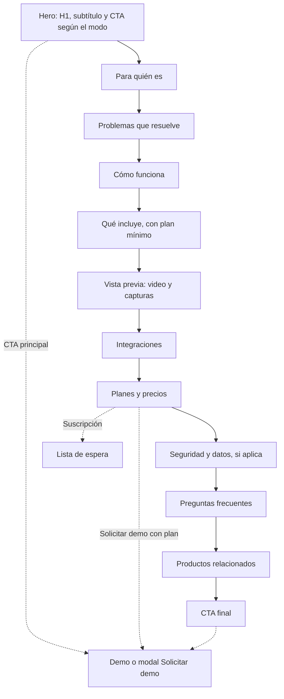
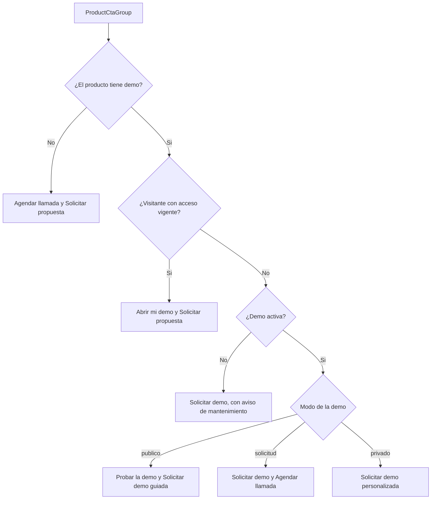
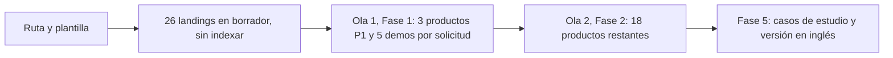
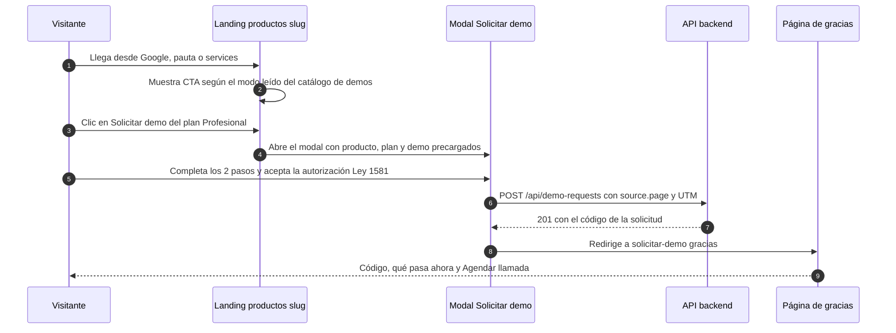

# Landing de producto

> Ruta: `/productos/[slug]` (26 landings; `/productos/chatbot-rag-ia` redirige a `/rag`) · Archivos nuevos: `apps/web/src/app/productos/[slug]/{page,opengraph-image}.tsx`, `apps/web/src/components/product-landing/*`, `apps/web/src/lib/product-landing.ts`, `apps/web/messages/landings/<slug>.{es,en}.json`, `apps/web/scripts/validate-landings.mjs` · Se modifican: `apps/web/src/lib/services-catalog.ts`, `apps/web/src/app/sitemap.ts`, `apps/web/next.config.js` (redirección y CSP) · Prioridad: **P0** (la ruta y la plantilla: son el destino de cada tarjeta de `/services`) · Esfuerzo total: **XL** (≈ 25 días-dev de plantilla y componentes + ≈ 12 días de contenido y capturas de la primera ola en la Fase 1; la segunda ola y los videos en la Fase 2)


*Mockup de la plantilla. Páginas relacionadas: [Servicios y precios](Seccion-Servicios-y-Precios.md), [Catálogo de demos](Seccion-Catalogo-de-Demos.md), [Flujo del cliente](03-Flujo-del-Cliente.md) (etapa 2), [Sistema de demos](04-Sistema-de-Demos.md), [Landings SEO y de campaña](Seccion-Landings-SEO.md), [Catálogo de productos](08-Catalogo-de-Productos.md) y las 27 páginas `Producto-<slug>.md`, que traen el contenido propuesto de cada landing (por ejemplo [CRM con IA](Producto-crm-ia.md)).*

---

## Objetivo

Cada producto de "Otras soluciones a medida" necesita **una página que lo venda sola** (DECISIÓN 2). En menos de un minuto de lectura, el visitante debe poder responder:

1. **¿Es para mí?** Para quién es y qué problema resuelve, con ejemplos de su sector.
2. **¿Qué hace?** Módulos, en qué plan se incluye cada uno, integraciones típicas en Colombia.
3. **¿Cómo se ve?** Capturas reales de la demo y un video corto.
4. **¿Cuánto cuesta?** Planes de compra en COP más IVA si aplica, con USD de referencia; suscripción en lista de espera (DECISIÓN 7).
5. **¿Cómo lo pruebo?** Un CTA principal que depende del modo de acceso de la demo y un "Agendar llamada" siempre visible.

Además, la landing es:
- el **destino de la pauta** de "Otras soluciones" ([Landings SEO y de campaña](Seccion-Landings-SEO.md));
- la página que **posiciona la intención comercial** ("software de … para empresas", "precio de …"), mientras la demo posiciona "demo de …";
- la **fuente de la vista previa** (capturas y video) que usan `/demo/acceso` y el catálogo de demos.

| Indicador de negocio | Por qué importa |
|---|---|
| % de visitas de la landing que hacen clic en el CTA principal | Mide si la propuesta de valor convence |
| Solicitudes de demo y leads con `source.page = "/productos/<slug>"` | Conversión real por producto |
| Clic en planes (`plan_click`) por producto | Interés por plan; ayuda a la propuesta |
| Clics orgánicos a las landings (Search Console) | Tráfico de intención comercial que hoy no existe |

---

## Estado actual

**La ruta `/productos/[slug]` no existe.** Hoy su papel lo cumplen, a medias, tres piezas:

| Pieza actual | Qué hace | Por qué no basta | Evidencia |
|---|---|---|---|
| Modal "Ver más detalles" de `/services` | Planes, precios, "Qué incluye", límites, soporte | No tiene URL, no se indexa, no se puede compartir ni usar en pauta; su CTA pierde plan y modalidad al llegar a `/contact` | `OfferingsCatalog.tsx` líneas 264–531 y 514; `contact/page.tsx` líneas 37–38 |
| La demo `/demo/<demoSlug>` | Tiene metadata comercial propia (28 entradas en `seo-config.ts`) y es lo único indexable por producto | Mezcla la intención "probar" con la de "comprar"; no muestra precio ni para quién es; las demos `solicitud` dejarán de ser indexables | `seo-config.ts` (entradas `demo-*`); `demo/<slug>/layout.tsx` |
| `DemoCTA` al final de cada demo | "Solicitar Cotización" y "Ver Planes y Precios" | Genérico: no nombra el producto ni lo precarga | `components/demo/DemoCTA.tsx` |

**Contenido que ya existe y se reutiliza:**

- `messages/offerings/<slug>.{es,en}.json`: `name`, `tagline`, `categoryLabel`, `tiers.<plan>.{name, description, idealPara, incluye[]}`, `costoNote`. `idealPara` y `costoNote` hoy no se muestran en ningún lado.
- `services-catalog.ts`: precios por plan y modalidad, límites, soporte, horas, semanas de implementación y costos de terceros.
- Las páginas `Producto-<slug>.md` de esta wiki: hero, problemas, cómo funciona, módulos, integraciones y FAQ propuestos para cada producto.
- El mockup `images/mockups/landing-producto.png`, la referencia visual de la plantilla.

**Lo que existe hoy en lugar de una landing:**


---

## Problemas detectados

1. **No hay a dónde mandar a un interesado.** Ni la pauta, ni un correo comercial, ni un mensaje de WhatsApp pueden enlazar a "el CRM de KopTup con su precio".
2. **Google no ve el producto:** solo indexa la demo, que no tiene precio, ni para quién es, ni preguntas frecuentes.
3. **El CTA no sabe de qué producto viene:** el contacto llega sin producto, plan ni modalidad.
4. **El contenido está disperso:** precios en código, textos de plantilla en mensajes, propuestas de valor en la wiki. Nada asegura que coincidan.
5. **Las demos `solicitud` quedan sin vitrina:** cuando se activen los modos de acceso, su única cara pública indexable será la landing.
6. **Dos landings para el mismo producto** si no se decide: el chatbot RAG ya tiene `/rag` y `/chatbots-ia`.

---

## Plan detallado

### 1. Ruta, generación y redirecciones

| Elemento | Especificación |
|---|---|
| Archivo | `apps/web/src/app/productos/[slug]/page.tsx`, **server component** |
| Parámetros | `generateStaticParams()` devuelve los slugs de `OFFERINGS` (26, sin `chatbot-rag-ia`). `export const dynamicParams = false`: un slug desconocido da 404 |
| Revalidación | `export const revalidate = 60`: el modo de acceso y los medios vienen de `GET /api/demo-catalog` y pueden cambiar desde el panel |
| Redirección | `/productos/chatbot-rag-ia` → `/rag` con **301** en `next.config.js` (`redirects()`), y fuera del sitemap. La landing del producto RAG es `/rag` ([Flujo del cliente](03-Flujo-del-Cliente.md) y [Landings SEO](Seccion-Landings-SEO.md)) |
| Contenido | `lib/product-landing.ts` → `getLandingContent(slug, locale)` importa `messages/landings/<slug>.<locale>.json` **solo en el servidor**. No se agrega al proveedor global de mensajes |
| Errores | `app/productos/[slug]/not-found.tsx` con enlace a `/services#otras-soluciones` y al catálogo de demos |

### 2. Las 26 landings

El modo es el de la semilla de [Sistema de demos](04-Sistema-de-Demos.md) (sección 4) y se puede cambiar desde el panel; la landing lo lee en cada revalidación.

| Producto (`slug`) | Demo | Modo inicial | CTA principal | Ola |
|---|---|---|---|---|
| `crm-ia` | `crm-ia` | `publico` | Probar la demo | 1 |
| `helpdesk-ia` | `helpdesk-ia` | `publico` | Probar la demo | 1 |
| `facturacion-electronica` | `facturacion-electronica` | `publico` | Probar la demo | 1 |
| `erp-modular` | `erp` | `solicitud` | Solicitar demo | 1 |
| `telemedicina` | `telemedicina` | `solicitud` | Solicitar demo | 1 |
| `wms-logistica` | `wms-logistica` | `solicitud` | Solicitar demo | 1 |
| `voice-ai-callcenter` | `voice-ai` | `solicitud` | Solicitar demo | 1 |
| `app-delivery` | `delivery` | `solicitud` | Solicitar demo | 1 |
| `ecommerce` | `ecommerce` | `publico` | Probar la demo | 2 |
| `bi-dashboard` | `dashboard-ejecutivo` | `publico` | Probar la demo | 2 |
| `gestor-documental` | `gestor-documentos` | `publico` (hoy `active = false`) | Solicitar demo mientras esté inactiva | 2 |
| `sistema-reservas` | `sistema-reservas` | `publico` | Probar la demo | 2 |
| `cms-headless` | `gestor-contenido` | `publico` | Probar la demo | 2 |
| `gestion-proyectos` | `control-proyectos` | `publico` | Probar la demo | 2 |
| `lms-elearning` | `lms` | `publico` | Probar la demo | 2 |
| `pos-retail` | `pos` | `publico` | Probar la demo | 2 |
| `hrms` | `hrms` | `publico` | Probar la demo | 2 |
| `automatizacion-workflows` | `automatizacion` | `publico` | Probar la demo | 2 |
| `saas-multi-tenant` | `saas-boilerplate` | `publico` | Probar la demo | 2 |
| `firma-electronica` | `firma-electronica` | `publico` | Probar la demo | 2 |
| `scraping-extraccion` | `scraping` | `publico` (hoy `active = false`) | Solicitar demo mientras esté inactiva | 2 |
| `code-review-ia` | `code-review-ia` | `publico` | Probar la demo | 2 |
| `moderacion-contenido` | `moderacion-contenido` | `publico` | Probar la demo | 2 |
| `loyalty-fidelizacion` | `loyalty` | `publico` | Probar la demo | 2 |
| `qa-automatizado-ia` | — (sin demo propia) | — | Agendar llamada | 2 |
| `vpn-empresarial` | — (sin demo propia) | — | Agendar llamada | 2 |

La primera ola junta los 3 productos P1 y las 5 demos `solicitud`, porque para estas últimas la landing es su única vista pública con capturas y video.

### 3. Anatomía de la página

| # | Bloque | Componente (`components/product-landing/`) | Obligatorio | Contenido | Fuente |
|---|---|---|---|---|---|
| 1 | Migas y hero | `ProductHero` + `ProductCtaGroup` | Sí | Etiqueta "{área} · {producto}", H1, subtítulo, CTA según el modo, línea de estado de la demo, 3 frases de confianza, captura principal en marco de navegador con la etiqueta "Datos de ejemplo" | Archivo de la landing + catálogo de demos |
| 2 | Para quién es | `ForWhom` | Sí | 3 o 4 tarjetas de perfil o sector. Variante `FitCheck`: "Es para ti si… / Todavía no, si…" | Archivo de la landing |
| 3 | Problemas que resuelve | `ProblemCards` | Sí | 3 tarjetas con el dolor en palabras del cliente | Archivo de la landing |
| 4 | Cómo funciona | `HowItWorks` | Sí | 3 o 4 pasos | Archivo de la landing |
| 5 | Qué incluye | `ModuleGrid` | Sí | 6 a 10 módulos con la etiqueta "Incluido desde {plan}" | Archivo de la landing (valida el plan contra `services-catalog.ts`) |
| 6 | Vista previa | `MediaGallery` + `VideoFacade` (ancla `#capturas`) | Sí (en ola 1) | Video de 60–90 s y 4 a 6 capturas con pie de foto | `DemoCatalogItem.previewVideoUrl` y `screenshots` |
| 7 | Integraciones | `IntegrationList` | Sí | 5 a 10 integraciones típicas en Colombia (WhatsApp Business, Siigo o Alegra, Wompi o PayU…) | Archivo de la landing |
| 8 | Planes y precios | `ProductPricing` (ancla `#planes`) | Sí | Compra en COP + IVA, USD de referencia, suscripción en lista de espera, límites y costos de terceros | `services-catalog.ts` + `messages/offerings/<slug>` |
| 9 | Seguridad y datos | `TrustBlock` | En salud y finanzas | Qué hace el sistema con los datos, dónde se aloja, roles de responsable y encargado (Ley 1581), sin sellos ni certificaciones que no existan | Archivo de la landing |
| 10 | Preguntas frecuentes | `FaqSection` (compartido con home y `/services`) | Sí, mínimo 4 | Preguntas del producto + "¿El código es mío?" y "¿Qué incluye el mantenimiento?" | Archivo de la landing |
| 11 | Productos relacionados | `RelatedProducts` | No | 2 o 3 productos que se combinan | Archivo de la landing (valida contra `OFFERINGS`) |
| 12 | CTA final | `FinalCta` | Sí | Título contextual, CTA según el modo y "Agendar llamada"; en la ola 1, formulario Solicitar demo incrustado con el producto precargado | — |
| — | Barra fija en móvil | `StickyMobileCta` | Sí | Aparece al pasar el hero: CTA principal + ícono de llamada | — |
| — | Bloques opcionales | `ExtraBlock` por tipo | No | `calculadora` (p. ej. ahorro en delivery), `desarrolladores` (ejemplo de API en facturación), `antes-despues` (QA), `sector` (salud en facturación) | Archivo de la landing + componente específico registrado por slug |


> [Ver diagrama como imagen](images/diagramas/Seccion-Landing-de-Producto-1.png)

**Hero: ejemplo con CRM con IA** (textos de [CRM con IA](Producto-crm-ia.md)):

- **Etiqueta:** Ventas, marketing y atención · CRM con IA
- **H1:** CRM con IA para equipos que venden por WhatsApp
- **Subtítulo:** Pipeline visual, prioridad de leads con IA y mensajes de seguimiento redactados en segundos. El código es tuyo.
- **Botones:** **Probar la demo** · **Solicitar demo guiada** · enlace "Agendar llamada".
- **Línea de estado:** "Demo abierta · sin registro · datos de ejemplo".
- **Frases de confianza:** "El código es tuyo (compra)" · "Precios en COP" · "Equipo en Colombia".

### 4. CTA según el modo de acceso

`ProductCtaGroup` aplica la regla de [Flujo del cliente](03-Flujo-del-Cliente.md) (etapa 2) y la extiende a los demás estados. El mismo grupo se usa en el hero, en la barra móvil y en el CTA final.

| Situación | Botón principal | Botón secundario | Enlace | Línea de estado |
|---|---|---|---|---|
| Demo `publico` | **Probar la demo** → `/demo/<demoSlug>` | **Solicitar demo guiada** → modal (`producto`, `demo`, `preferredMode = guiada`) | Agendar llamada | "Demo abierta · sin registro · datos de ejemplo" |
| Demo `solicitud` | **Solicitar demo** → modal (`producto`, `demo`) | **Agendar llamada** | Ver vista previa → `#capturas` | "Te respondemos en máximo 1 día hábil. Mientras tanto, mira el video." |
| Demo `privado` (ningún producto hoy; soportado) | **Solicitar demo personalizada** → modal | **Agendar llamada** | — | "Demo con acceso personal por invitación" |
| Demo con `active = false` | **Solicitar demo** → modal | **Agendar llamada** | — | "La demo interactiva está en mantenimiento; te la mostramos en una sesión guiada." |
| Visitante con acceso vigente | **Abrir mi demo** · "te quedan {n} días" | **Solicitar propuesta** (`POST /api/me/demos/:grantId/actions`, tipo `propuesta`) | Agendar llamada | "Tu acceso vence el {fecha}" |
| Producto sin demo (`qa-automatizado-ia`, `vpn-empresarial`) | **Agendar llamada** | **Solicitar propuesta** → formulario de contacto con producto y plan precargados (`POST /api/contact`, crea o actualiza el Lead) | — | "Te mostramos casos y el alcance en una llamada de 30 minutos." |


> [Ver diagrama como imagen](images/diagramas/Seccion-Landing-de-Producto-2.png)

Reglas de implementación:

- **Render en el servidor por modo.** El HTML sale con la variante del modo (página estática con revalidación). Solo si existe la cookie de sesión, una isla cliente consulta `GET /api/me/demos` y cambia a la variante "acceso vigente". El espacio de los botones es fijo para no mover el diseño.
- **"Agendar llamada"** usa `NEXT_PUBLIC_BOOKING_URL`. Si la herramienta de agenda acepta parámetros, se envía el producto.
- **Las páginas de producto** que proponen "Solicitar demo" como botón principal para una demo `publico` se leen con esta regla: el texto de su hero se mantiene y `ProductCtaGroup` decide el orden de los botones.
- **El mockup** muestra la variante con "Solicitar demo" primero y "Probar la demo abierta" como enlace. Es la alternativa que se medirá en la prueba A/B de la Fase 5 (tarea 25), no la regla vigente.

### 5. Contenido: un archivo por producto

Los textos de cada landing viven en `apps/web/messages/landings/<slug>.{es,en}.json`. **Ningún precio ni número de plan se escribe en estos archivos:** los montos, semanas, límites y horas salen de `services-catalog.ts`, para que nunca se desalineen.

```json
{
  "slug": "crm-ia",
  "status": "publicada",
  "updatedAt": "2026-11-03",
  "seo": {
    "title": "CRM con IA para pymes en Colombia",
    "description": "Pipeline visual, prioridad de leads con IA y seguimiento por WhatsApp. El código es tuyo. Prueba la demo gratis o pide una demo guiada."
  },
  "hero": {
    "title": "CRM con IA para equipos que venden por WhatsApp",
    "subtitle": "Pipeline visual, prioridad de leads con IA y mensajes de seguimiento redactados en segundos. El código es tuyo.",
    "trust": ["El código es tuyo (compra)", "Precios en COP", "Equipo en Colombia"],
    "imageAlt": "Pipeline del CRM con negocios por etapa y sugerencia de la IA"
  },
  "forWhom": [
    { "title": "Equipos comerciales de 5 a 50 vendedores", "text": "Un solo lugar para el pipeline, las tareas y el seguimiento de cada vendedor." }
  ],
  "problems": [
    { "title": "Leads perdidos en WhatsApp personales", "text": "Cuando un vendedor se va, se lleva las conversaciones." }
  ],
  "howItWorks": [
    { "title": "Conectas tus canales", "text": "WhatsApp Business, correo y formularios web." }
  ],
  "modules": [
    { "title": "Pipeline visual", "text": "Arrastra negocios entre etapas y ve el valor de cada una.", "fromTier": "basico" },
    { "title": "Asistente que redacta correos y WhatsApp", "text": "Borradores con el tono y el contexto del negocio.", "fromTier": "avanzado" }
  ],
  "integrations": ["WhatsApp Business", "Gmail y Outlook", "Google Calendar", "Siigo o Alegra", "Wompi o PayU", "Importación desde Excel"],
  "faq": [
    { "q": "¿El código es mío?", "a": "Sí. En la modalidad de compra te entregamos el código fuente y la documentación." },
    { "q": "¿Puedo migrar desde Excel?", "a": "Sí. Importamos tus contactos y negocios desde Excel o CSV y detectamos duplicados." }
  ],
  "related": ["helpdesk-ia", "voice-ai-callcenter"],
  "pricing": { "recommendedTier": "profesional" },
  "requestQuestions": ["¿Cuántos vendedores tiene tu equipo?", "¿Qué usan hoy para el seguimiento: Excel, otro CRM o WhatsApp?"],
  "blocks": ["hero", "forWhom", "problems", "howItWorks", "modules", "media", "integrations", "pricing", "faq", "related", "finalCta"]
}
```

**Validación** (`apps/web/scripts/validate-landings.mjs`, corre en `prebuild` junto a `merge-messages.mjs`; el build falla si algo no se cumple):

| Regla | Motivo |
|---|---|
| `seo.title` ≤ 51 caracteres (60 con " \| KopTup"); `seo.description` entre 120 y 160 | Plantilla de títulos de la rama RAG (`check-titles`) |
| `hero.title` ≤ 70 caracteres; un solo H1 | Legibilidad y SEO |
| Bloques obligatorios presentes; `faq` con 4 o más preguntas; `modules` entre 6 y 10 | Plantilla completa |
| `modules[].fromTier` ∈ `basico`, `profesional`, `avanzado`, `enterprise` | Coherencia con los planes |
| `related[]` existe en `OFFERINGS` y no es el mismo producto | Sin enlaces rotos |
| Ningún texto contiene montos (`$`, `COP`, `USD` seguidos de cifras) | Los precios salen solo de `services-catalog.ts` |
| Lista negra: voseo (lista de la especificación RAG), "100+", "24/7", "líder", "certificado", "garantizado", "HIPAA", "SOC 2", "ISO 27001" | No inventar cifras ni certificaciones |
| `status` ∈ `borrador`, `publicada`; `updatedAt` con fecha válida | Indexación y sitemap |

**Preguntas extra por producto** (`requestQuestions`): el modal Solicitar demo las muestra como campos opcionales del paso 2. En la Fase 1 sus respuestas se agregan al final de `useCase` de la `DemoRequest`, con el formato "Pregunta: respuesta". Si en la Fase 2 se usan para el puntaje, pasan a un campo propio.

### 6. Capturas y video

**Capturas**

| Regla | Detalle |
|---|---|
| Cantidad | 4 a 6 por producto; la primera es la del hero y la miniatura del catálogo |
| Tamaño | 1600×1000 (16:10), PNG o JPG de origen ≤ 400 KB; `next/image` sirve AVIF o WebP |
| Ubicación | `apps/web/public/media/demos/<demoSlug>/captura-<n>.png`, registrada en `DemoCatalogItem.screenshots[{url, alt}]` de la semilla. En la Fase 2 el admin podrá subirlas a almacenamiento de objetos desde **Admin › Catálogo de demos** |
| Origen | La demo real, después de pasar el QA de publicación ([Catálogo de demos](Seccion-Catalogo-de-Demos.md)) |
| Contenido | Datos de ejemplo colombianos y montos en COP; sin marcas, logos ni nombres de personas o empresas reales; sin fechas viejas |
| Texto alternativo | Describe qué muestra la pantalla ("Bandeja de tickets con prioridad y SLA por cliente"), no "captura 1" |
| Pie de foto | Una línea con el beneficio, como en el mockup |
| Visor | `MediaGallery` abre un visor accesible con `Dialog` de `@headlessui/react` (ya es dependencia): Esc cierra, flechas navegan, el foco vuelve a la miniatura |

**Video**

| Regla | Detalle |
|---|---|
| Duración y formato | 60 a 90 s, 1920×1080, locución en español colombiano y subtítulos (`.vtt`) |
| Guion | El recorrido guiado de 5 pasos de cada página de producto, grabado sobre la demo con datos de ejemplo |
| Alojamiento | YouTube (canal de KopTup) en modo de privacidad mejorada (`youtube-nocookie.com`) |
| Carga | `VideoFacade`: muestra el póster local y el botón de reproducir; el reproductor se carga solo al hacer clic. Cero JS de terceros en la carga inicial |
| CSP | Se agrega `https://www.youtube-nocookie.com` a `frame-src` en `next.config.js` (hoy solo permite el propio sitio y Google) |
| SEO | JSON-LD `VideoObject` con `name`, `description`, `thumbnailUrl`, `uploadDate`, `duration` y `embedUrl` |
| Sin video todavía | La galería muestra solo capturas; nunca un "video próximamente" |

Las mismas capturas y el mismo video alimentan la pantalla de vista previa `/demo/acceso` y la tarjeta del catálogo: un solo origen (`DemoCatalogItem`).

### 7. Planes y precios (`ProductPricing`)

Sigue el mockup: pestañas **Compra (pago único)** y **Suscripción (mensual)**.

**Pestaña Compra** (por defecto):

| Elemento | Contenido | Fuente |
|---|---|---|
| Título | Precios claros, en pesos colombianos | — |
| Texto | Valores en COP más IVA si aplica. El mantenimiento mensual depende del plan y se detalla en la propuesta. | Mientras no exista la política de mantenimiento ([Servicios y precios](Seccion-Servicios-y-Precios.md), sección 7.3) |
| 4 tarjetas de plan | Nombre, "Para quién" (`idealPara`), setup en COP + IVA, "≈ USD de referencia", "+ mantenimiento según plan", 4 a 6 viñetas, semanas de implementación | `services-catalog.ts` + `messages/offerings/<slug>` (viñetas limpias) |
| Plan recomendado | Etiqueta "Recomendado" en el plan que indique `pricing.recommendedTier` (Profesional por defecto). No se escribe "el más elegido" | Archivo de la landing |
| Enterprise | "Desde COP …" (el setup es un piso) | `services-catalog.ts` |
| Botón de cada plan | **Solicitar demo** con `plan` precargado; en productos sin demo, **Solicitar propuesta** | — |
| Límites y soporte | Tabla plegable (`<details>`): usuarios administradores, usuarios finales, cuentas, volumen, almacenamiento, soporte en horario hábil y horas de ajustes | `services-catalog.ts` (`limits`, `soporte`, `mantenimientoHoras`) |
| Costos de terceros | "Costos de terceros estimados (no incluidos): USD {min}–{max} al mes (≈ COP …)", con el detalle por plan | `costosClienteUSD` |
| Enlace | "¿Dudas sobre IVA, moneda o mantenimiento?" → `/services#preguntas` | — |

**Pestaña Suscripción:**

> **Suscripción (mensual): lista de espera.** Estamos preparando la versión hospedada por KopTup. Déjanos tu email y te avisamos cuando abra, sin compromiso.

Campo de email, casilla de autorización Ley 1581 (obligatoria, sin marcar) y botón **Unirme a la lista**. Envía `POST /api/contact` con `offeringSlug`, `modality = saas` y `source.page`; el Lead queda con la etiqueta `saas_lista_espera:<slug>` (regla de [Servicios y precios](Seccion-Servicios-y-Precios.md), sección 7.4). Las cuotas SaaS de `services-catalog.ts` no se muestran.

**Costo estimado del primer año** (Fase 2, cuando exista la política de mantenimiento): para Básico y Profesional, setup + 12 meses de mantenimiento + punto medio de costos de terceros, con la nota "estimado; tu propuesta trae el valor exacto".

### 8. SEO por producto

**Metadata** (`generateMetadata({ params })` en `page.tsx`):

| Campo | Valor |
|---|---|
| `title` | `seo.title` del archivo; la plantilla agrega " \| KopTup" |
| `description` | `seo.description` (120–160 caracteres) |
| Canónico | `absoluteUrl('/productos/<slug>')` (dominio con `www`, `lib/site.ts` de la rama RAG) |
| Open Graph | Título y descripción iguales; `type: website`; `locale: es_CO`; imagen de `opengraph-image.tsx` |
| Robots | `index` si `status = publicada`; `noindex, follow` si `status = borrador` |

**Una intención por página**, para que la landing y la demo no compitan:

| Página | Intención | Consultas típicas | Título de ejemplo |
|---|---|---|---|
| `/productos/crm-ia` | Comercial: comparar y comprar | "software CRM para pymes", "CRM con WhatsApp precio" | CRM con IA para pymes en Colombia |
| `/demo/crm-ia` | Probar | "demo CRM gratis" | Demo: CRM con IA |
| `/services` | Precios en general | "precios software a medida" | Planes y precios de sistemas RAG y software |

**Títulos y descripciones de la primera ola** (los demás se escriben con la misma regla en cada archivo):

| Producto | `seo.title` (caracteres con " \| KopTup") | `seo.description` |
|---|---|---|
| `crm-ia` | CRM con IA para pymes en Colombia (42) | Pipeline visual, prioridad de leads con IA y seguimiento por WhatsApp. El código es tuyo. Prueba la demo gratis o pide una demo guiada. |
| `helpdesk-ia` | Mesa de ayuda con IA para pymes en Colombia (52) | Tickets de correo, web y WhatsApp en una bandeja, con respuestas sugeridas por IA y SLA por cliente. Prueba la demo gratis. |
| `facturacion-electronica` | Facturación electrónica DIAN por API (45) | Emite facturas, notas y documento soporte desde tu sistema por API, con panel para tu contador. Prueba el simulador gratis. |
| `erp-modular` | Software ERP a medida para empresas en Colombia (56) | Ventas, inventario multi-bodega, compras, producción y cartera en un solo sistema, con facturación electrónica DIAN. Solicita tu demo. |

**Datos estructurados (JSON-LD), honestos:**

- **`Product`** con `name`, `description`, `brand` (KopTup), `category`, `image`, `url` y `offers`:
  - `AggregateOffer` con los 4 planes de **compra**: `priceCurrency: "COP"`, `lowPrice` y `highPrice` iguales a lo que se ve, `offerCount: 4`;
  - cada `Offer` con `price`, `priceSpecification.valueAddedTaxIncluded: false`, `priceValidUntil` (fin del trimestre) y `url` a `#planes`.
- **Sin** `aggregateRating` ni `review` hasta que existan reseñas reales y visibles en la página.
- **Sin** ofertas de suscripción mientras estén en lista de espera.
- **`BreadcrumbList`:** Inicio › Soluciones (`/services#otras-soluciones`) › {producto}.
- **`FAQPage`** generado del mismo arreglo visible. Google hoy muestra preguntas frecuentes enriquecidas casi solo en sitios de gobierno y salud: se marca por coherencia, sin esperar el resultado enriquecido.
- **`VideoObject`** cuando haya video.

Ejemplo para `crm-ia` (montos actuales de `services-catalog.ts`):

```json
{
  "@context": "https://schema.org",
  "@type": "Product",
  "name": "CRM con IA",
  "description": "CRM a medida con pipeline visual, prioridad de leads con IA y seguimiento por WhatsApp.",
  "brand": { "@type": "Brand", "name": "KopTup" },
  "category": "Software de ventas (CRM)",
  "url": "https://www.koptup.com/productos/crm-ia",
  "offers": {
    "@type": "AggregateOffer",
    "priceCurrency": "COP",
    "lowPrice": 56000000,
    "highPrice": 720000000,
    "offerCount": 4,
    "offers": [
      {
        "@type": "Offer",
        "name": "Plan Básico, compra con pago único",
        "price": 56000000,
        "priceCurrency": "COP",
        "priceSpecification": { "@type": "PriceSpecification", "price": 56000000, "priceCurrency": "COP", "valueAddedTaxIncluded": false },
        "priceValidUntil": "2026-12-31",
        "url": "https://www.koptup.com/productos/crm-ia#planes",
        "seller": { "@type": "Organization", "name": "KopTup" }
      }
    ]
  }
}
```

(Los otros 3 planes siguen el mismo formato. El JSON-LD se genera desde `services-catalog.ts`: nunca se escribe a mano.)

**Imagen Open Graph por producto** (`app/productos/[slug]/opengraph-image.tsx`, 1200×630 con `ImageResponse`):

- Logo, nombre del producto, la frase del hero, la etiqueta del área y "Demo interactiva" o "Demo por solicitud".
- **Sin precios:** LinkedIn y WhatsApp guardan la vista previa por semanas y un precio viejo confunde.
- Usa el patrón ya corregido en la rama RAG para la imagen de la home (degradados con dirección explícita).
- Texto alternativo: "{producto}: {frase del hero}".

**Sitemap:** `sitemap.ts` agrega las landings con `status = publicada`, `priority: 0.8` y `lastModified` igual a `updatedAt` del archivo (no la fecha del despliegue). `/productos/chatbot-rag-ia` no entra.

**Enlazado interno hacia cada landing:**
- tarjetas de `/services` (botón "Ver producto");
- "Otras soluciones a medida" de la home;
- tarjetas del catálogo `/demo` ("Ver producto y precios");
- banner y cierre de cada demo ("Ver precios" → `#planes`);
- pantalla `/demo/acceso`;
- landings SEO y de sector ([Landings SEO](Seccion-Landings-SEO.md));
- "Productos relacionados" de otras landings.

Cada landing enlaza de vuelta a su demo, a `/services#otras-soluciones` y, si aplica, a `/rag`.

### 9. Estado de publicación y olas

Para que ninguna tarjeta de `/services` lleve a un 404, **las 26 landings existen desde el primer despliegue**:

| Estado | Qué muestra | Indexación |
|---|---|---|
| `borrador` (autogenerado) | Hero con `name`, `tagline` e `idealPara` de `messages/offerings`; CTA según el modo; planes y precios completos; preguntas generales de precios; CTA final | `noindex, follow`; fuera del sitemap |
| `publicada` | Todos los bloques obligatorios con contenido propio, capturas y, en la ola 1, video (video en la Fase 2) | Indexable; en el sitemap |


> [Ver diagrama como imagen](images/diagramas/Seccion-Landing-de-Producto-3.png)

El contenido de cada landing se toma de su página `Producto-<slug>.md` (hero, problemas, cómo funciona, módulos, integraciones y FAQ ya propuestos) y lo revisa el dueño antes de pasar a `publicada`.

---

## Integración con el sistema de demos

| Punto | Qué hace la landing | Referencia |
|---|---|---|
| Modo, estado activo y medios | Los lee de `GET /api/demo-catalog` en el servidor (revalidación de 60 s). Si la API falla, usa el mapa estático de `lib/demo-access.ts`, que ante la duda trata la demo como `privado` | [Sistema de demos](04-Sistema-de-Demos.md), secciones 5.3 y 10.2 |
| Modal Solicitar demo | Precarga `?producto=<slug>&plan=<plan>&demo=<demoSlug>`; guarda `source.page = /productos/<slug>`, `landingPath` y las UTM de la pauta | [Flujo del cliente](03-Flujo-del-Cliente.md), etapa 4 |
| Acceso vigente | Con sesión, `GET /api/me/demos` cambia el CTA a "Abrir mi demo" y "Solicitar propuesta" | Sección 8.3 de [Sistema de demos](04-Sistema-de-Demos.md) |
| Vista previa de demos `solicitud` | `/demo/acceso` muestra las mismas capturas y el video, con un enlace "Ver el producto" hacia la landing | Sección 9 de [Sistema de demos](04-Sistema-de-Demos.md) |
| Banner dentro de la demo | "Ver precios" lleva a `/productos/<slug>#planes` | [Catálogo de demos](Seccion-Catalogo-de-Demos.md) |
| Lista de espera | Lead con etiqueta `saas_lista_espera:<slug>` | [Servicios y precios](Seccion-Servicios-y-Precios.md), sección 7.4 |
| Métricas | **Admin › Métricas** desglosa solicitudes por `source.page` y producto | `GET /api/metrics/demo-funnel` |


> [Ver diagrama como imagen](images/diagramas/Seccion-Landing-de-Producto-4.png)


**Eventos de la landing** (solo con consentimiento de analítica; sin datos personales):

| Evento | Cuándo | Propiedades |
|---|---|---|
| `product_view` | Carga de la landing | `product`, `access_mode`, `status` |
| `cta_solicitar_demo_click` | Clic en "Solicitar demo", "Solicitar demo guiada" o "personalizada" | `source_page: producto`, `product`, `section` (`hero`, `planes`, `cta_final`, `barra_movil`), `plan` |
| `product_demo_click` | Clic en "Probar la demo" o "Abrir mi demo" | `product`, `demo_slug`, `section` |
| `plan_click` | Clic en una tarjeta o botón de plan | `product`, `plan`, `modality` |
| `schedule_call_click` | Clic en "Agendar llamada" | `source_page: producto`, `product`, `section` |
| `saas_waitlist_join` | Envío de la lista de espera | `product` |
| `video_play` | Primer clic en el video | `product` |
| `gallery_open` | Apertura del visor de capturas | `product`, `index` |

---

## SEO · i18n · accesibilidad · rendimiento

El detalle de SEO está en la sección 8. Resumen del resto:

**i18n**
- Español colombiano con "tú" (validado en el build).
- Los archivos `landings/<slug>.en.json` se preparan en la Fase 2, pero el inglés sigue por cookie y no se declara `hreflang` hasta la Fase 5 (`/en/productos/<slug>`).
- El contenido de la landing se lee en el servidor; a las islas cliente solo llegan sus textos.

**Accesibilidad**
- Un H1; H2 por bloque; H3 en tarjetas.
- Pestañas de planes con `role="tablist"`, `aria-selected` y flechas del teclado.
- Precios con texto completo para lectores de pantalla ("56 millones de pesos colombianos más IVA").
- Preguntas frecuentes con `<details>` y `<summary>` nativos: funcionan sin JavaScript y con teclado.
- Video con subtítulos; visor de capturas con manejo de foco y Esc.
- La barra móvil no tapa contenido (se reserva su alto al final de la página) ni el banner de cookies.
- Contraste AA y `prefers-reduced-motion` en carruseles y animaciones.

**Rendimiento** (meta: LCP móvil p75 < 2,5 s, CLS < 0,1, INP < 200 ms)
- Página estática con revalidación. Islas cliente: `ProductCtaGroup` (solo si hay sesión), pestañas de precios, visor, `VideoFacade` y el modal.
- Imagen del hero con `next/image`, `priority` y dimensiones fijas (≤ 120 KB servida).
- Ningún script de YouTube hasta que el visitante pulsa reproducir.
- Sin `fetch` en el navegador para precios ni para el modo de la demo.

---

## Tareas

| # | Tarea | Fase | Prioridad | Esfuerzo | Criterio de aceptación |
|---|---|---|---|---|---|
| 1 | Ruta `/productos/[slug]` (server component, `generateStaticParams` desde `OFFERINGS`, `dynamicParams = false`, `revalidate = 60`, `not-found.tsx`) y redirección 301 de `/productos/chatbot-rag-ia` a `/rag` | Fase 1 — Funnel y solicitud de demos | P0 | S | Los 26 slugs responden 200; un slug inventado responde 404; `/productos/chatbot-rag-ia` responde 301 a `/rag` |
| 2 | Esquema de contenido `messages/landings/<slug>.{es,en}.json`, carga en servidor (`lib/product-landing.ts`) y validación en `prebuild` (`validate-landings.mjs`) con las reglas de la sección 5 | Fase 1 — Funnel y solicitud de demos | P0 | M | Un archivo con un monto escrito, voseo, un `fromTier` inválido o menos de 4 preguntas hace fallar el build; los textos de la landing no aparecen en el JSON de mensajes del cliente |
| 3 | Componentes de bloques (`ProductHero`, `ForWhom`, `ProblemCards`, `HowItWorks`, `ModuleGrid`, `IntegrationList`, `TrustBlock`, `RelatedProducts`, `FinalCta`, `StickyMobileCta`) reutilizando `Card`, `Button` y `Badge` | Fase 1 — Funnel y solicitud de demos | P0 | L | La landing de `crm-ia` reproduce el mockup en 1440 px y 390 px; el orden de bloques sale de `blocks` del archivo |
| 4 | `ProductCtaGroup` con la matriz de la sección 4, variante por modo en el servidor y variante "acceso vigente" en el cliente sin mover el diseño | Fase 1 — Funnel y solicitud de demos | P0 | M | Cambiar `erp` de `solicitud` a `publico` en el panel cambia el CTA en ≤ 60 s; un prospecto con acceso ve "Abrir mi demo"; CLS < 0,1 con y sin sesión |
| 5 | `ProductPricing`: pestaña de compra con precios de `services-catalog.ts`, "+ IVA si aplica", USD de referencia, límites plegables y costos de terceros; pestaña de suscripción con la lista de espera | Fase 1 — Funnel y solicitud de demos | P0 | M | Los montos coinciden con `services-catalog.ts` en las 26 landings (prueba automática); ninguna landing muestra una cuota SaaS; la lista de espera crea el Lead etiquetado |
| 6 | Modal Solicitar demo desde la landing: precarga `producto`, `plan` y `demo`; guarda `source.page`, `landingPath` y UTM; preguntas extra (`requestQuestions`) agregadas a `useCase` | Fase 1 — Funnel y solicitud de demos | P0 | S | Una solicitud enviada desde el plan Profesional de `crm-ia` aparece en **Admin › Solicitudes de demo** con producto, plan, página de origen, UTM y las respuestas extra |
| 7 | Landings en `borrador` autogeneradas para las 26 (hero con `name`, `tagline` e `idealPara`, precios, CTA) con `noindex` | Fase 1 — Funnel y solicitud de demos | P0 | S | Ninguna tarjeta de `/services` lleva a un 404; las landings en borrador tienen `noindex` y no están en el sitemap |
| 8 | SEO por producto: `generateMetadata`, canónico con `www`, robots según `status`; títulos de la ola 1 de la sección 8 | Fase 1 — Funnel y solicitud de demos | P0 | S | `check-titles` pasa con las 26 landings; cada landing publicada tiene canónico propio |
| 9 | Contenido completo de la ola 1 (`crm-ia`, `helpdesk-ia`, `facturacion-electronica`, `erp-modular`, `telemedicina`, `wms-logistica`, `voice-ai-callcenter`, `app-delivery`) desde sus páginas de producto, revisado por el dueño | Fase 1 — Funnel y solicitud de demos | P1 | L | Las 8 landings pasan la validación con `status = publicada` y el dueño aprobó cada texto |
| 10 | Capturas de la ola 1 (4 a 6 por producto) con la lista de reglas de la sección 6, registradas en la semilla del catálogo de demos | Fase 1 — Funnel y solicitud de demos | P1 | M | Cada landing de la ola 1 tiene al menos 4 capturas con `alt` descriptivo; ninguna tiene marcas de terceros ni fechas viejas; las mismas aparecen en `/demo/acceso` |
| 11 | `MediaGallery` con visor accesible (`Dialog` de Headless UI) y `VideoFacade` con `youtube-nocookie`; agregar el dominio a `frame-src` de la CSP | Fase 1 — Funnel y solicitud de demos | P1 | M | Sin clic en reproducir no se carga ningún recurso de YouTube; el visor se usa completo con teclado; la CSP no bloquea el video |
| 12 | JSON-LD por landing: `Product` + `AggregateOffer` de compra generado desde `services-catalog.ts`, `BreadcrumbList`, `FAQPage` y `VideoObject` | Fase 1 — Funnel y solicitud de demos | P1 | S | La prueba de resultados enriquecidos no muestra errores; los precios del JSON-LD son idénticos a los visibles; no hay `aggregateRating` |
| 13 | Sitemap con las landings publicadas y `lastModified` desde `updatedAt` | Fase 1 — Funnel y solicitud de demos | P1 | S | El sitemap lista solo landings `publicada`; cambiar `updatedAt` de un archivo cambia su `lastModified` |
| 14 | Enlazado interno: botones "Ver producto" (services, home, catálogo), "Ver precios" en las demos, "Ver el producto" en `/demo/acceso` y enlaces de vuelta desde la landing | Fase 1 — Funnel y solicitud de demos | P1 | S | Cada landing publicada recibe al menos 3 enlaces internos (verificado con un rastreo del sitio) |
| 15 | Eventos de la landing (`product_view`, `cta_solicitar_demo_click`, `product_demo_click`, `plan_click`, `schedule_call_click`, `saas_waitlist_join`, `video_play`, `gallery_open`) | Fase 1 — Funnel y solicitud de demos | P1 | S | Con cookies aceptadas los 8 eventos llegan a GA4 DebugView con `product`; con cookies rechazadas no sale ninguno |
| 16 | Imagen Open Graph por producto (`opengraph-image.tsx`) sin precios | Fase 1 — Funnel y solicitud de demos | P2 | S | Al compartir una landing en LinkedIn y WhatsApp, la vista previa muestra el nombre y la frase del producto |
| 17 | Prueba E2E de la plantilla: 26 landings con 200, CTA correcto por modo, precios iguales al catálogo, un solo H1 y sin errores en consola | Fase 1 — Funnel y solicitud de demos | P1 | M | La prueba corre en CI (cuando la Fase 0 lo repare) y falla si una landing muestra un precio distinto al de `services-catalog.ts` |
| 18 | Accesibilidad de la plantilla (pestañas, `<details>`, visor, barra móvil, contraste, movimiento reducido) | Fase 1 — Funnel y solicitud de demos | P2 | S | axe-core no reporta errores serios ni críticos en la landing de `crm-ia`; la página se recorre completa con teclado |
| 19 | Videos de 60–90 s de la ola 1, con locución y subtítulos, según el guion de cada página de producto | Fase 2 — Demos vendibles | P1 | M | Las 8 landings de la ola 1 tienen video con subtítulos y `VideoObject` válido |
| 20 | Contenido completo de la ola 2 (18 productos restantes), en el orden de prioridad de sus páginas de producto | Fase 2 — Demos vendibles | P2 | XL | Las 26 landings están en `publicada` y en el sitemap |
| 21 | Bloques opcionales por producto: calculadora de ahorro (delivery), ejemplo de API (facturación), antes y después (QA), bloque de salud (facturación) | Fase 2 — Demos vendibles | P3 | M | Cada bloque opcional se activa desde `blocks` del archivo sin tocar la plantilla |
| 22 | "Costo estimado del primer año" para Básico y Profesional, cuando exista la política de mantenimiento | Fase 2 — Demos vendibles | P2 | S | El estimado usa los mismos valores que la propuesta y lleva la nota "estimado; tu propuesta trae el valor exacto" |
| 23 | Casos de estudio por producto con `CaseStudyCard` (solo con autorización escrita del cliente) | Fase 5 — Escala | P2 | M | La landing muestra el caso solo si `authorized = true` en `lib/company.ts`; ninguna cifra sin fuente |
| 24 | Versión en inglés indexable (`/en/productos/<slug>`) con `hreflang` | Fase 5 — Escala | P3 | L | Cada landing EN tiene canónico propio y `hreflang` recíproco con la ES |
| 25 | Prueba A/B del CTA principal en demos `publico` ("Probar la demo" frente a "Solicitar demo", la variante del mockup) | Fase 5 — Escala | P3 | M | El experimento corre al menos 4 semanas o 1.000 sesiones por variante y se decide por solicitudes y leads, no por clics |

---

## Métricas de éxito

Metas iniciales a validar con 8 semanas de datos reales (ver la nota de [Flujo del cliente](03-Flujo-del-Cliente.md)).

| Métrica | Fuente | Meta inicial |
|---|---|---|
| Clic en el CTA principal por visita de landing | GA4 | ≥ 15 % |
| Conversión landing → solicitud de demo o lead | **Admin › Métricas** (`source.page`) / sesiones GA4 | ≥ 3 % |
| Landings publicadas (ola 1 en la Fase 1, todas en la Fase 2) | Sitemap | 8 / 26 |
| Landings indexadas | Search Console | ≥ 90 % de las publicadas a 8 semanas |
| Clics orgánicos a `/productos/*` | Search Console | Línea base el primer mes; +50 % al tercer mes |
| Precios distintos entre landing, `/services` y JSON-LD | Prueba E2E | 0 |
| LCP móvil p75 / CLS / INP de las landings | Search Console (Core Web Vitals) | < 2,5 s / < 0,1 / < 200 ms |
| Errores de datos estructurados en `/productos/*` | Search Console | 0 |
