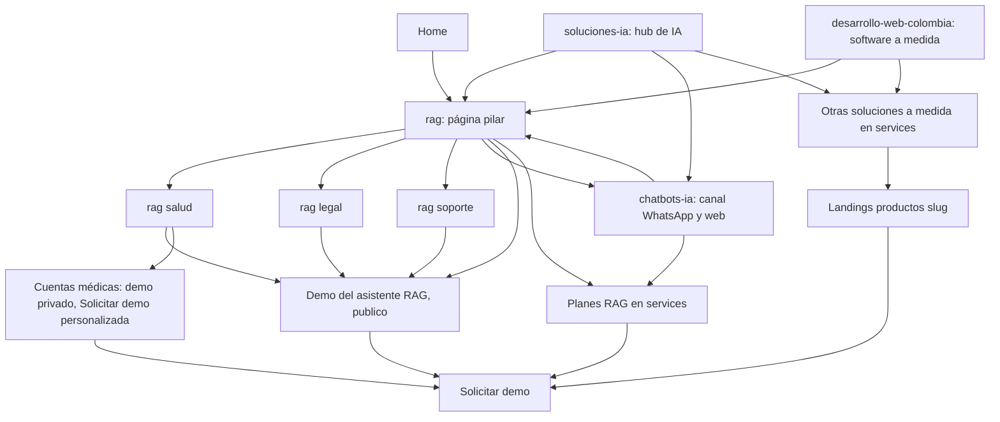
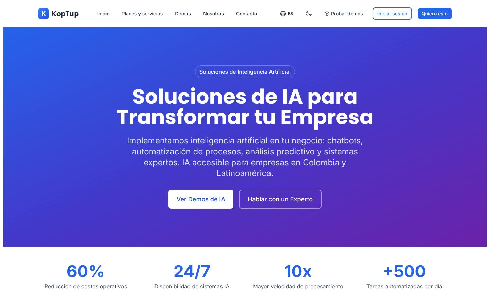
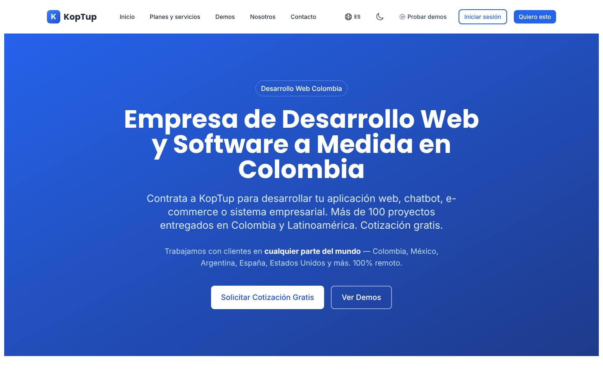
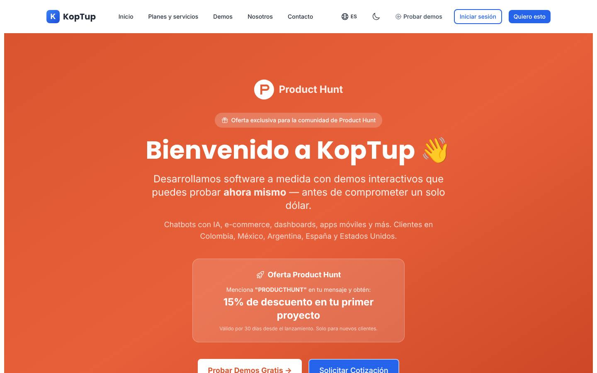
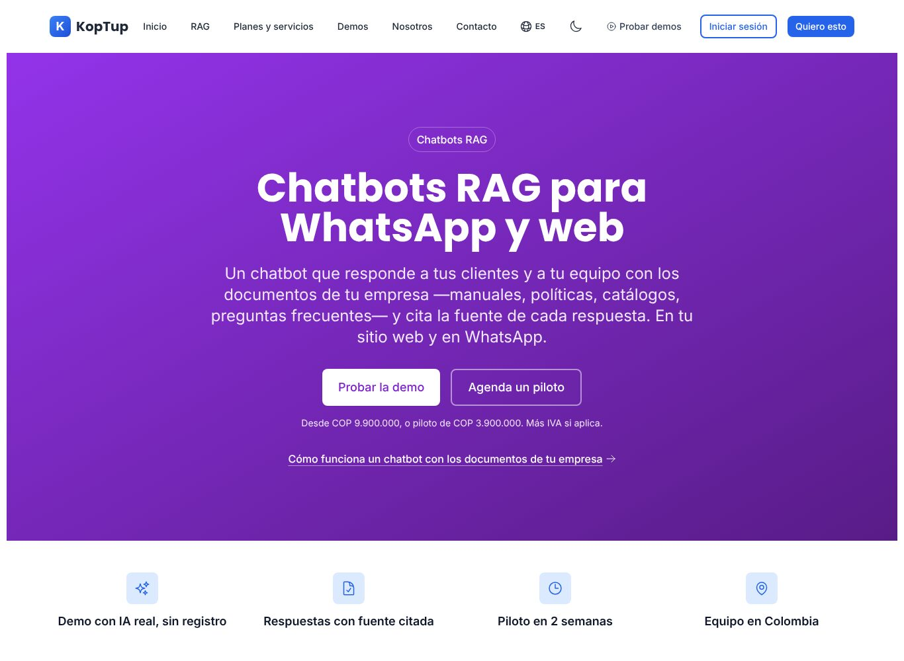
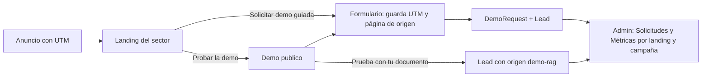

# Landings SEO y de campaña

> Rutas: `/chatbots-ia`, `/soluciones-ia`, `/desarrollo-web-colombia`, `/bienvenido-producthunt`, `/liquidacion` (y subrutas), `/test`; relación con `/rag`, `/rag/salud`, `/rag/legal` y `/rag/soporte` (rama `rag-reposicionamiento`) · Archivos principales: `apps/web/src/app/{chatbots-ia,soluciones-ia,desarrollo-web-colombia,bienvenido-producthunt}/{page,layout}.tsx`, `apps/web/src/app/liquidacion/**`, `apps/web/src/app/test/**`, `apps/web/messages/{es,en}.json` (namespaces `chatbotsPage`, `aiSolutionsPage`, `devWebPage`), `apps/web/src/app/sitemap.ts`, `apps/web/public/{robots.txt,llms.txt}` · Prioridad: **P0** · Esfuerzo total: **XL** (≈ 20–25 días-dev en las Fases 0 y 1, parte ya en curso en la rama `rag-reposicionamiento`; el resto en las Fases 2 y 5)

*Páginas relacionadas: [Home](Seccion-Home.md), [Landing de producto](Seccion-Landing-de-Producto.md), [Servicios y precios](Seccion-Servicios-y-Precios.md), [Sistemas RAG](Producto-chatbot-rag-ia.md), [Flujo del cliente](03-Flujo-del-Cliente.md), [Sistema de demos](04-Sistema-de-Demos.md), [Comercial, marketing y legal](11-Comercial-Marketing-y-Legal.md), [Seguridad y calidad](10-Seguridad-y-Calidad.md).*

---

## Objetivo

Las landings SEO y de campaña son la **puerta de entrada de quien todavía no conoce a KopTup**: llega desde Google, desde un anuncio o desde un enlace externo. Cada una tiene que:

1. **Responder a una intención de búsqueda concreta** ("chatbot con IA para WhatsApp", "IA para empresas", "desarrollo de software a medida en Colombia") sin competir con las demás páginas del sitio.
2. **Llevar al camino de venta que corresponde:**
   - al camino **RAG**: demo pública, "Prueba con tu documento", Piloto RAG;
   - o al de **otras soluciones a medida**: landing de producto y Solicitar demo.

   Ver [Flujo del cliente](03-Flujo-del-Cliente.md).
3. **Decir solo lo que se puede demostrar.** Una landing de pauta con cifras infladas paga clics de gente que luego desconfía.
4. **Dejar rastro:** UTM, página de origen y eventos, para saber qué landing trae solicitudes y no solo visitas.

---

## Decisión por ruta

| Ruta | Hoy | Decisión | Fase | Prioridad |
|---|---|---|---|---|
| `/rag` | No existe en `main`; se construye en la rama | **Página pilar** del clúster RAG. Este plan le agrega el CTA "Solicitar demo guiada" y la medición | Fase 1 | P0 |
| `/rag/salud`, `/rag/legal`, `/rag/soporte` | No existen en `main`; se construyen en la rama | **Landings por sector**, también usadas como destino de la pauta | Fase 1 | P0 |
| `/chatbots-ia` | Chatbots genéricos, "desde $499 USD", cifras sin fuente | **Reescribir** como "Chatbots RAG para WhatsApp y web" (especificación RAG) y conectarla al sistema de demos | Fase 1 | P0 |
| `/soluciones-ia` | Hub genérico de IA con cifras sin fuente y FAQ invisible | **Mantener como hub de IA**, con RAG en primer lugar y cada solución enlazada a su página | Fase 1 | P1 |
| `/desarrollo-web-colombia` | "+100 proyectos", "98 % satisfacción", "garantizamos el resultado" | **Mantener** como puerta del camino "otras soluciones a medida", reescrita con datos reales | Fase 1 | P1 |
| `/bienvenido-producthunt` | Oferta del 15 % vencida (la página se publicó el 18-02-2026 y la oferta duraba 30 días) y cifras sin fuente | **Retirar** con una redirección 301 a la home con UTM de Product Hunt | Fase 1 | P1 |
| `/liquidacion`, `/liquidacion/[id]`, `/liquidacion/reglas` | Herramienta operativa de liquidación de radicados de cuentas médicas dentro del sitio comercial | **Sacarla del sitio comercial:** pasa a ser un módulo de la demo privada de cuentas médicas o del panel interno | Fase 0 | P0 |
| `/test` | Página interna de pruebas manuales de la API. Ya responde 404 en producción y es `noindex` | **Eliminar** del repositorio | Fase 0 | P2 |
| `/productos/chatbot-rag-ia` | No existe (landing por producto, nueva) | **Redirigir 301 a `/rag`**, para que el producto RAG no tenga dos landings que compitan entre sí | Fase 1 | P1 |

---

## Mapa del clúster

`/rag` es la página pilar. Todas las landings enlazan a ella en sus dos primeras secciones, y ella reparte a los sectores, a la demo y a los planes.

> [Ver diagrama como imagen](images/diagramas/Seccion-Landings-SEO-1.png)

### Mapa de palabras clave

Una intención principal por URL. Las de la rama RAG combinan palabras **técnicas** y **de problema**, como pide su especificación.

| URL | Intención | Palabras clave principales | CTA principal |
|---|---|---|---|
| `/` | Marca + qué hace KopTup | "KopTup", "IA con los documentos de la empresa" | Probar la demo |
| `/rag` | Entender y comparar RAG | "sistemas RAG para empresas", "retrieval augmented generation", "base de conocimiento con IA", "chatbot con los documentos de la empresa" | Prueba con tu documento |
| `/rag/salud` | IA para documentos clínicos y administrativos | "IA para protocolos clínicos", "auditoría de cuentas médicas con IA", "normativa en salud con IA" | Probar la demo · Solicitar demo personalizada |
| `/rag/legal` | Buscar en contratos y normativa | "buscar en contratos con IA", "IA para abogados en Colombia", "asistente de normativa" | Probar la demo |
| `/rag/soporte` | Base de conocimiento para agentes | "asistente IA para manuales internos", "base de conocimiento para agentes", "IA para mesa de ayuda" | Probar la demo |
| `/chatbots-ia` | Comprar un chatbot | "chatbot con IA para empresas", "chatbot de WhatsApp con IA", "chatbot para página web" | Probar la demo |
| `/soluciones-ia` | Explorar IA para la empresa | "soluciones de inteligencia artificial para empresas", "implementar IA en mi empresa" | Ver soluciones · Agendar llamada |
| `/desarrollo-web-colombia` | Contratar desarrollo a medida | "desarrollo de software a medida en Colombia", "empresa de desarrollo web en Bogotá" | Solicitar demo · Solicitar cotización |

**Para evitar la canibalización entre `/rag` y `/chatbots-ia`:**
- `/chatbots-ia` habla del **canal**: WhatsApp, web y paso a una persona.
- `/rag` habla de la **tecnología y el resultado**: respuestas con documentos y citas.
- Cada una enlaza a la otra con el texto ancla de su intención.

---

## Estado actual y problemas detectados

Evidencia de la rama `main`. La rama `rag-reposicionamiento` (commit `2df589a`) ya corrigió parte del SEO técnico: dominio canónico con www, títulos de 60 caracteres como máximo, sin meta keywords, sin `aggregateRating`, `robots.txt` y enlaces a `/pricing`.

### Problemas comunes a las cuatro landings de contenido

| Problema | Evidencia |
|---|---|
| Todas son client components, aunque su contenido es estático | Línea 1 de cada `page.tsx` (`'use client'`) |
| Cifras sin fuente en la parte visible | `/chatbots-ia`: 80 %, 3x y 60 % (`es.json` → `chatbotsPage.stats`). `/soluciones-ia`: 60 %, 10x y +500 (`page.tsx` líneas 73–76). `/desarrollo-web-colombia`: +100, +50, 6+ y 98 % (`devWebPage.s1v`…`s4v`). `/bienvenido-producthunt`: +100, +50, 6+ y 4.9★ (`page.tsx` líneas 179–182) |
| Precio "desde $499 USD" que no corresponde a ningún plan | `chatbotsPage.q1a`, `devWebPage.sv2d`, `devWebPage.q1a`, `devWebPage.q3a`; JSON-LD con `AggregateOffer` 499–15.000 USD (`chatbots-ia/layout.tsx` líneas 52–58), 499–50.000 USD (`soluciones-ia/layout.tsx` líneas 57–62) y `priceRange` "$499 - $50,000 USD" (`desarrollo-web-colombia/layout.tsx` línea 78). El Piloto RAG cuesta USD 1.200 y el plan Esencial USD 2.990 de setup |
| FAQ del JSON-LD distinto del FAQ visible, o FAQ que no se ve en la página | `/chatbots-ia`: 4 preguntas en el JSON-LD (`layout.tsx` líneas 75–112) frente a 6 distintas en la página. `/soluciones-ia`: `FAQPage` con 4 preguntas (`layout.tsx` líneas 80–113) y ninguna FAQ visible. `/desarrollo-web-colombia`: 4 en el JSON-LD (`layout.tsx` líneas 88–130) frente a 6 visibles |
| CTA genéricos a `/contact`, que pierde el servicio o plan de origen; ningún camino a "Solicitar demo" | Por ejemplo, `chatbots-ia/page.tsx` líneas 77 y 210; `soluciones-ia/page.tsx` líneas 61 y 184 |
| Textos fuera de i18n | `/soluciones-ia`: cifras y tecnologías (`page.tsx` líneas 73–76 y 157–164). `/desarrollo-web-colombia`: alcance geográfico (`page.tsx` líneas 81–84). `/bienvenido-producthunt`: toda la página |
| Sin medición | No hay analítica en `main`. La rama RAG la agrega con consentimiento |

### `/chatbots-ia`

| Bloque | Hoy | Evidencia |
|---|---|---|
| Hero | "Chatbots con IA para Empresas en Colombia", "Ver Demo Gratis" (a `/demo/chatbot`) y "Solicitar Cotización" (a `/contact`) | `page.tsx` líneas 59–82 |
| Beneficios | Incluye "Aprende y Mejora Solo: la IA aprende de cada conversación", algo que el sistema no hace. Un RAG se actualiza con los documentos | `chatbotsPage.b4t` y `b4d` |
| FAQ | "Garantizamos respuestas naturales y precisas"; "atender miles de conversaciones simultáneas por WhatsApp sin límites" (los planes tienen tope de preguntas) | `chatbotsPage.q4a` y `q3a` |
| Proceso | "Funcionando en 2–4 semanas" y "básico en 1–2 semanas" (los planes dicen piloto en 2, Esencial en 3–4) | `chatbotsPage.processSubtitle` y `q2a` |

### `/soluciones-ia`

| Bloque | Hoy | Evidencia |
|---|---|---|
| Soluciones | 6 tarjetas sin enlace (chatbots, automatización, análisis predictivo, documentos, sistemas expertos, contenido). RAG no aparece como solución | `page.tsx` líneas 25–30 |
| "¿Por qué adoptar IA?" | "Reduce Costos Operativos hasta 60 %" | `aiSolutionsPage.w1t` |
| Tecnologías | GPT-4, Claude, **Gemini, LangChain, TensorFlow, n8n/Make**. En `package.json` solo están `openai`, `@anthropic-ai/sdk` y `@pinecone-database/pinecone`; ninguna de las cuatro en negrita | `page.tsx` líneas 157–164; `apps/backend/package.json` |

### `/desarrollo-web-colombia`

| Bloque | Hoy | Evidencia |
|---|---|---|
| Hero | "Más de 100 proyectos entregados en Colombia y Latinoamérica"; "Trabajamos con clientes en cualquier parte del mundo — Colombia, México, Argentina, España, Estados Unidos" | `devWebPage.hero.subtitle`; `page.tsx` líneas 81–84 |
| "¿Por qué contratar a KopTup?" | "Entrega rápida y garantizada… Garantizamos el resultado" | `devWebPage.w3d` |
| FAQ | "Tenemos clientes en Bogotá, Medellín, Cali, Barranquilla, Bucaramanga y en países como México, Argentina y Chile"; "Tenemos 27 prototipos" | `devWebPage.q4a` y `q6a` |
| CTA final | "Solicitar cotización" a `/pricing`; la rama lo cambió a `/services#planes-rag`, que tampoco es el destino correcto para esta página | `page.tsx` línea 252 |

### `/bienvenido-producthunt`

- **Oferta vencida:** "Válido por 30 días desde el lanzamiento" (`page.tsx` líneas 97–100). La página se agregó el 18-02-2026 (commit `d880b05`), así que la oferta venció en marzo de 2026 y la página no muestra fecha.
- **Cifras sin fuente:** +100, +50, 6+ y 4.9★ (líneas 179–182).
- **Conteo equivocado:** "Ver todas las demos (9 en total)" (línea 168).
- **Bien resuelto:** ya es `noindex` (`layout.tsx` línea 31). La página recibe tráfico solo por enlaces externos.

### `/liquidacion` y `/test`

- **`/liquidacion`** (3 páginas, 1.236 líneas) es una herramienta de operación de cuentas médicas:
  - crea radicados, carga documentos, liquida y descarga Excel (`services/liquidacion.service.ts`);
  - no forma parte de la oferta comercial ni aparece en el menú;
  - `robots.txt` la excluye del rastreo.
- **`/test`** es una consola de pruebas manuales de la API:
  - su `layout.tsx` ya devuelve 404 en producción y la marca `noindex`;
  - aun así, es código de pruebas dentro de la aplicación de producción, con configuración del entorno escrita en el código.

---

## Plan detallado

### Reglas comunes a todas las landings

1. **Estructura base** (corta, enfocada en convertir):
   1. Hero con H1 igual a la promesa del anuncio o de la búsqueda.
   2. 4 frases verificables.
   3. El problema en palabras del cliente.
   4. Cómo lo resolvemos.
   5. Demo (o vista previa).
   6. Planes o rango de precios.
   7. Prueba social real.
   8. FAQ visible.
   9. CTA final.
2. **Tres CTA estándar, siempre con el mismo texto:**
   - **Probar la demo**, si hay demo `publico`;
   - **Solicitar demo guiada** o **Solicitar demo**, que abre el modal con `producto` precargado;
   - **Agendar llamada**, a la agenda en línea.

   "Solicitar cotización" se usa solo en `/desarrollo-web-colombia`, donde la intención es comprar a medida.
3. **Lista negra de afirmaciones:**
   - porcentajes de mejora sin fuente;
   - número de clientes o proyectos;
   - calificaciones;
   - "garantizamos";
   - "sin límites";
   - "24/7 soporte";
   - "aprende solo";
   - "desde $499 USD".

   Una prueba E2E las busca en todas las landings.
4. **Precios desde una sola fuente:** los planes RAG desde la constante de `/services#planes-rag`; los de otras soluciones desde `services-catalog.ts`, con USD calculado con `TRM_REFERENCIA = 3300` (especificación RAG).
5. **FAQ:** componente `FaqSection` compartido con la home. Pinta las preguntas y genera el `FAQPage` desde el mismo arreglo, así el JSON-LD nunca dice algo que la página no muestra.

   > Google hoy muestra resultados enriquecidos de FAQ solo para sitios gubernamentales y de salud con autoridad reconocida. El FAQ se mantiene por su valor para el lector y para los buscadores con IA, no por el fragmento enriquecido.
6. **Enlazado interno:**
   - cada landing enlaza a `/rag` en sus dos primeras secciones;
   - las de "a medida" enlazan además a 3 a 6 `/productos/<slug>`;
   - el footer agrega la columna RAG.
7. **Server components:** el contenido se pinta en el servidor. Solo el modal, los eventos y los acordeones son client.

### `/chatbots-ia`: Chatbots RAG para WhatsApp y web

La reescritura la define la especificación RAG (etapa E5 de la rama). Este plan agrega la conexión con el sistema de demos y el detalle de copy.

*Así quedó el hero en la rama (commit `576d6df`, sin fusionar). La tabla de abajo describe el destino completo, que además conecta la landing con el formulario "Solicitar demo".*

| Elemento | Copy o cambio |
|---|---|
| Title | Chatbots RAG para WhatsApp y web \| KopTup |
| Description | Chatbots que responden con los documentos de tu empresa y citan la fuente, en tu web y en WhatsApp. Piloto en 2 semanas desde COP 3.900.000. |
| H1 | **Chatbots RAG para WhatsApp y web** |
| Subtítulo | Un asistente que responde con tus manuales, políticas y catálogos, cita la fuente y pasa la conversación a una persona cuando no sabe. |
| Botones | **Probar la demo** → `/demo/chatbot` · **Solicitar demo guiada** → modal (`producto=chatbot-rag-ia`) · enlace "Agendar llamada" |
| 4 frases (reemplazan 80 %, 24/7, 3x y 60 %) | Responde con tus documentos · Cita la fuente · Web y WhatsApp (desde el plan Profesional) · Piloto en 2 semanas |
| Beneficio 1 | "Atención 24/7 sin costo adicional" pasa a **"Responde a cualquier hora"**: tus clientes no esperan al horario de oficina; el cupo de preguntas depende de tu plan. |
| Beneficio 4 | "Aprende y mejora solo" pasa a **"Se actualiza cuando agregas o cambias documentos"** (texto de la especificación RAG). |
| Beneficio 2 | WhatsApp con la API oficial de WhatsApp Business, desde el plan Profesional. Las tarifas de Meta se cobran al costo. |
| Casos de uso | Los 6 sectores se reordenan: Salud, Legal y Soporte primero, cada uno con enlace a su `/rag/<sector>`; luego E-commerce, Educación y Servicios financieros, sin enlace hasta que tengan landing |
| Proceso | 1. Diagnóstico (30 min) · 2. Piloto (2 semanas) · 3. Implementación (3–4 semanas en Esencial; 6–8 en Profesional) · 4. Lanzamiento y soporte Lun–Vie |
| Planes | Tarjetas **Esencial** y **Profesional** desde la constante de planes (WhatsApp solo en Profesional), más un enlace "Ver todos los planes" → `/services#planes-rag` |
| Prueba social | Tarjeta "Asistente RAG de KopTup (producto propio)" con **Probar la demo**. Más casos cuando existan pilotos cerrados |
| FAQ | ¿Cuánto cuesta? "Desde COP 9.900.000 de implementación en el plan Esencial, o un Piloto de 2 semanas por COP 3.900.000". ¿En cuánto tiempo? ¿Funciona en WhatsApp? ¿Qué pasa si no sabe la respuesta? ¿Qué IA usan? (según el proveedor que use el código, sin "garantizamos"). ¿Mis documentos se usan para entrenar la IA? (misma respuesta que `/rag`) |
| CTA final | ¿Listo para probarlo con tus documentos? · **Prueba con tu documento** → `/demo/chatbot?modo=documento` · **Agenda un piloto** → modal con `plan=piloto` |
| Enlaces | A `/rag` (hero y "Cómo funciona") y a los 3 sectores |
| JSON-LD | `Service` con los planes RAG como `Offer` (desde la constante), `FAQPage` desde `FaqSection` y `BreadcrumbList`. Se elimina el `SoftwareApplication` con `AggregateOffer` 499–15.000 |

### `/soluciones-ia`: hub de IA

| Elemento | Copy o cambio |
|---|---|
| Title | Soluciones de inteligencia artificial para empresas \| KopTup (60 caracteres; si `check-titles` lo rechaza, "Soluciones de IA para empresas en Colombia \| KopTup") |
| H1 | **Soluciones de inteligencia artificial para tu empresa** |
| Subtítulo | Empezamos por lo que más valor da hoy: IA que responde con los documentos de tu empresa. Y si tu caso necesita más, automatizamos procesos y construimos sistemas a medida. |
| Cifras | Se elimina la franja de 60 %, 24/7, 10x y +500. En su lugar van 3 frases: Demo con IA real, sin registro · Piloto en 2 semanas · Equipo en Colombia |
| Soluciones (6, todas con enlace) | 1. **Sistemas RAG** → `/rag` · 2. **Chatbots RAG para WhatsApp y web** → `/chatbots-ia` · 3. **Procesamiento de documentos** → `/productos/gestor-documental` (solo cuando su demo pase el QA; antes, sin botón de demo) · 4. **Automatización de procesos con IA** → `/productos/automatizacion-workflows` · 5. **Sistemas expertos para salud** → `/rag/salud` (demo privada) · 6. **Generación de contenido con IA** → caso de uso interno con **Solicitar demo** (`linkedin-ads`, modo `solicitud`) |
| Análisis predictivo | Se quita como solución propia. Si se conserva, enlaza a `/productos/crm-ia` y se aclara "prototipo con datos simulados" |
| "¿Por qué adoptar IA?" | Pasa a **"Cómo empezamos sin riesgo"**: diagnóstico de 30 minutos, piloto de 2 semanas con informe de precisión y decisión con datos. Sin "reduce costos hasta 60 %" |
| Tecnologías | Dos grupos: **"En producción hoy"**: OpenAI y búsqueda propia sobre tus documentos. **"Según el proyecto"**: Claude (Anthropic), bases de datos vectoriales y automatizadores como n8n. Se quitan Gemini, LangChain y TensorFlow mientras no se usen |
| FAQ | Visible, con las 4 preguntas que hoy solo están en el JSON-LD, reescritas sin cifras |
| CTA final | **Agendar llamada** (principal) · **Ver demos de IA** → `/demo` |

### `/desarrollo-web-colombia`: software a medida

| Elemento | Copy o cambio |
|---|---|
| Title | Desarrollo de software a medida en Colombia \| KopTup |
| H1 | **Desarrollo de software a medida en Colombia** |
| Subtítulo | Construimos aplicaciones web, integraciones y sistemas a medida para empresas de Colombia y LATAM. Mira cómo funcionan antes de contratar: tenemos demos navegables de cada solución. |
| Alcance | "Trabajamos 100 % remoto desde Bogotá con empresas de Colombia y LATAM." Reemplaza la lista de países de las líneas 81–84 |
| 4 frases (reemplazan +100, +50, 6+ y 98 %) | {`DEMO_COUNT`} demos navegables · Código fuente entregado en la modalidad de compra · Entregas semanales que puedes probar · Equipo en Colombia |
| Servicios (6) | Cada tarjeta enlaza a una landing de producto o a una categoría de `/services#otras-soluciones`. "Chatbots con IA… desde $499 USD" pasa a "Chatbots RAG" → `/chatbots-ia` |
| Banda RAG | "¿Tu empresa tiene muchos documentos? Conoce nuestros sistemas RAG" → `/rag` |
| "¿Por qué KopTup?" | "Entrega rápida y garantizada" pasa a **"Alcance, precio y fechas por escrito antes de empezar"**. "Equipo especializado en Colombia" se conserva |
| FAQ | ¿Cuánto cuesta? Rango real calculado del catálogo ("desde COP X de implementación", usando el menor setup de `services-catalog.ts`). ¿Trabajan fuera de Bogotá? "Sí, de forma remota con empresas de cualquier ciudad de Colombia y de LATAM". ¿Puedo ver ejemplos? Con `DEMO_COUNT` |
| CTA final | **Solicitar demo** → modal (sin producto, con la lista para elegir) · **Solicitar cotización** → `/solicitar-demo` con `preferredMode = guiada`, o `/contact` mientras no exista el formulario · enlace "Ver soluciones" → `/services#otras-soluciones` |
| JSON-LD | `ProfessionalService` sin `priceRange` inventado (o con el rango real del catálogo), datos de empresa desde `lib/company.ts` (ver [Nosotros](Seccion-Nosotros.md)) y `FAQPage` desde `FaqSection` |

### `/rag` y landings por sector: lo que agrega este plan

El contenido (qué es RAG, casos, cómo funciona, seguridad, respuestas no inventadas, integraciones, planes, FAQ con `FAQPage`) lo define la especificación del reposicionamiento y se construye en la rama `rag-reposicionamiento`. Sobre esa base, este plan agrega:

- **CTA secundario "Solicitar demo guiada"** en `/rag` y en cada sector, con `producto=chatbot-rag-ia` y `source.page` de la landing ([Sistema de demos](04-Sistema-de-Demos.md), sección 9).
- **"Agenda un piloto"** abre el formulario con `plan=piloto`. La especificación RAG lo manda a `/contact`; cuando exista `/solicitar-demo`, se cambia allí y `/contact` conserva los parámetros mientras tanto.
- **`/rag/salud` y la demo de cuentas médicas:**
  - La demo es `privado`. La tarjeta "Auditoría de cuentas médicas" muestra capturas o video de vista previa y el botón **Solicitar demo personalizada** → `/solicitar-demo?demo=cuentas-medicas`.
  - Quien intente abrir la demo sin acceso cae en `/demo/acceso?demo=cuentas-medicas&motivo=privado`.
  - Hoy esa demo falla en producción ([Demo cuentas médicas](Demo-cuentas-medicas.md)), así que la tarjeta no debe enlazar a la demo hasta que se corrija.
- **Uso como destino de pauta:** Google Ads y LinkedIn apuntan a `/rag/<sector>` (o a `/rag` en campañas genéricas). El H1 de la landing repite la promesa del anuncio.
- **`/productos/chatbot-rag-ia` → 301 a `/rag`**, porque la tarjeta del chatbot sale del catálogo y su landing es `/rag` ([Flujo del cliente](03-Flujo-del-Cliente.md)). Se confirma en [Landing de producto](Seccion-Landing-de-Producto.md).

### `/bienvenido-producthunt`: retirar

- Agregar `redirects()` en `apps/web/next.config.js`: `/bienvenido-producthunt` → `/?utm_source=producthunt&utm_medium=referral&utm_campaign=lanzamiento-2026`, permanente (301). Así se conservan los enlaces que existan en Product Hunt y se atribuye el tráfico.
- Borrar `apps/web/src/app/bienvenido-producthunt/`.
- Para futuras campañas con oferta se usa el patrón `/lp/[campana]` (Fase 5, más abajo), que oculta la oferta sola cuando vence.

### `/liquidacion`: sacar del sitio comercial

- **Qué es:** una herramienta de operación del sistema de cuentas médicas, no una página de venta.
- **Decisión:**
  - integrarla como módulo de la demo `cuentas-medicas` (modo `privado`, acceso con `DemoGrant` verificado en servidor; ver [Sistema de demos](04-Sistema-de-Demos.md), sección 10), o
  - llevarla al panel interno si la usa el equipo.
- **Mientras se mueve:** la ruta pública responde 404 o redirige a `/demo/acceso?demo=cuentas-medicas&motivo=privado`.
- **Sus endpoints del backend** entran en la tarea general de la Fase 0: auditar y exigir autenticación y autorización en servidor en todas las rutas de la API ([Seguridad y calidad](10-Seguridad-y-Calidad.md)).
- Se quita el valor por defecto `creadoPor` escrito en el formulario. El usuario lo toma de la sesión.

### `/test`: eliminar

Borrar `apps/web/src/app/test/`. Las pruebas manuales de la API se hacen con la documentación OpenAPI en desarrollo local o con una colección de peticiones fuera de la aplicación. Con eso desaparece del repositorio la configuración del entorno escrita en esa página.

### Landings de campaña (pauta)

| Regla | Detalle |
|---|---|
| Destinos | Campañas RAG → `/rag/<sector>` o `/rag`. Campañas de otras soluciones → `/productos/<slug>`. Sin páginas duplicadas solo para pauta mientras el volumen sea bajo |
| UTM obligatorias | `utm_source` (`google`, `linkedin`, `producthunt`, `newsletter`), `utm_medium` (`cpc`, `paid_social`, `referral`, `email`), `utm_campaign` (`rag-salud-2026q4`), `utm_content` (variante del anuncio). Se guardan en `Lead.source.utm` y `DemoRequest.source.utm` |
| Coherencia con el anuncio | El H1 repite la promesa del anuncio; el primer CTA es el mismo que promete el anuncio (demo o piloto) |
| Ofertas con fecha (Fase 5) | Patrón `/lp/[campana]`: `noindex`, contenido en un archivo de datos por campaña con `validUntil`. Al vencer, la oferta se oculta sola y la página queda como landing normal |
| Medición | Conversiones de Google Ads y LinkedIn con `generate_lead` y `demo_request_submit`, solo con consentimiento (rama RAG) |

> [Ver diagrama como imagen](images/diagramas/Seccion-Landings-SEO-2.png)

---

## Integración con el sistema de demos

| Punto | Comportamiento | Referencia |
|---|---|---|
| Botones de demo | Según el `accessMode` del catálogo (`GET /api/demo-catalog`): `publico` → Probar la demo; `solicitud` → Solicitar demo; `privado` → Solicitar demo personalizada. Si el admin cambia el modo, la landing cambia sin desplegar | [Sistema de demos](04-Sistema-de-Demos.md), sección 4 |
| Modal Solicitar demo | Precarga `?producto=&plan=&demo=` y guarda `source.page` (la ruta de la landing), `source.utm` y `referrer` | `POST /api/demo-requests` |
| "Prueba con tu documento" | Desde `/chatbots-ia` y `/rag` lleva a la demo. El lead entra con `source.channel = demo_rag` y `landingPath` de la primera página de la sesión | Modelo `Lead` |
| Demo privada de cuentas médicas | Solo vista previa y "Solicitar demo personalizada"; solo el admin aprueba | Secciones 3 y 4 |
| Métricas | **Admin › Métricas** desglosa solicitudes, aprobadas y clientes por `landingPath` y por `utm_campaign`. Así se compara qué landing trae negocio | `GET /api/metrics/demo-funnel` |
| Eventos | `cta_solicitar_demo_click`, `demo_request_open`, `plan_click`, `schedule_call_click` y `whatsapp_click`, con `source_page` = ruta de la landing | Sección 13 |

---

## SEO · i18n · accesibilidad · rendimiento

**SEO técnico** (al fusionar la rama RAG):
- **Títulos y canonical:**
  - "<título> \| KopTup" con 60 caracteres como máximo (`npm run check-titles`);
  - canonical, `og:url` y sitemap con `https://www.koptup.com`;
  - sin meta keywords;
  - `/rag/*` en el sitemap (`apps/web/src/app/sitemap.ts`).
- **`robots.txt`:**
  - ya sin el grupo de Googlebot que anulaba las exclusiones;
  - **decisión pendiente del dueño:** hoy bloquea `GPTBot` y `CCBot`. Para una empresa de IA que quiere aparecer en asistentes de búsqueda, conviene permitir los rastreadores de búsqueda con IA (por ejemplo, `OAI-SearchBot`) aunque se siga bloqueando el entrenamiento.
- **`llms.txt`:**
  - reescrito con el mensaje RAG, los planes y las landings;
  - sin "desde $499 USD", sin "año de fundación 2019" y sin "opción reconocida" (`public/llms.txt`).
- **Datos estructurados:**
  - `Service` + `Offer` con precios reales solo en `/rag` y `/chatbots-ia`;
  - `FAQPage` solo desde FAQ visibles;
  - `BreadcrumbList` en todas;
  - nunca `aggregateRating` sin reseñas reales verificables.
- **Imagen OG por landing** (`opengraph-image.tsx` por ruta) con su H1. Hoy todas comparten `/og-image.png`.

**i18n**
- Todos los textos en `messages/{es,en}.json`. Hoy hay textos escritos en el código en `/soluciones-ia` y `/desarrollo-web-colombia`.
- Español colombiano con "tú".
- Versiones en inglés indexables (`/en/rag`, `/en/chatbots-ia`) con `hreflang`: Fase 5. Mientras el inglés vaya por cookie, no se declara `hreflang`.

**Accesibilidad**
- Un H1 por página y H2 por sección.
- Las FAQ como `
`/`
` o acordeón con `aria-expanded`.
- Contraste AA del texto claro sobre los gradientes morado, azul y naranja.
- Íconos con `aria-hidden`.

**Rendimiento** (meta: LCP móvil p75 < 2,5 s en todas las landings; las de pauta son las primeras en medirse)
- Server components, sin `'use client'` en las páginas.
- Mensajes recortados por namespace.
- Sin imágenes de banco pesadas.
- Analítica solo después del consentimiento.

---

## Tareas

| # | Tarea | Fase | Prioridad | Esfuerzo | Criterio de aceptación |
|---|---|---|---|---|---|
| 1 | Fusionar en `main` las etapas E1, E3 y E5 de la rama `rag-reposicionamiento` (SEO técnico, `/rag` y sectores, coherencia de `/chatbots-ia` y `/soluciones-ia`, voseo) | Fase 1 — Funnel y solicitud de demos | P0 | M | `npm run check-titles` pasa; `/rag`, `/rag/salud`, `/rag/legal` y `/rag/soporte` responden 200 y están en el sitemap; ninguna página tiene meta keywords |
| 2 | Retirar de todas las landings las cifras sin fuente y las garantías absolutas (lista negra de "Reglas comunes") | Fase 1 — Funnel y solicitud de demos | P0 | S | Una prueba E2E recorre las landings y no encuentra ninguna expresión de la lista negra |
| 3 | Unificar precios: quitar "desde $499 USD", "$2,000–$8,000 USD", los `AggregateOffer` y el `priceRange` inventados; leer de la constante de planes RAG y de `services-catalog.ts` | Fase 1 — Funnel y solicitud de demos | P0 | S | Una búsqueda de "499" en `apps/web/src`, `messages/` y `public/` (fuera de las demos) no devuelve resultados; cambiar un precio en la constante cambia todas las landings |
| 4 | `/liquidacion`: sacarla del sitio comercial e integrarla como módulo de la demo privada de cuentas médicas (acceso con `DemoGrant` verificado en servidor) o del panel interno; incluir sus endpoints en la auditoría de autenticación y autorización de la Fase 0 | Fase 0 — Endurecimiento | P0 | M | La ruta pública `/liquidacion` responde 404 o redirige a `/demo/acceso`; las pruebas de integración confirman que sus endpoints exigen una sesión con permiso |
| 5 | Reescribir `/chatbots-ia` como "Chatbots RAG para WhatsApp y web" con los CTA del sistema de demos, planes Esencial y Profesional y enlaces a `/rag` y sectores | Fase 1 — Funnel y solicitud de demos | P0 | M | El H1 y el title coinciden con este plan; "Aprende y mejora solo" no aparece; una solicitud desde la página llega al panel con `source.page = "/chatbots-ia"` |
| 6 | Componente `FaqSection` (FAQ visible + `FAQPage` del mismo arreglo) en `/chatbots-ia`, `/soluciones-ia` y `/desarrollo-web-colombia`; eliminar los `FAQPage` de los `layout.tsx` | Fase 1 — Funnel y solicitud de demos | P1 | S | En cada landing, el texto de cada pregunta y respuesta del JSON-LD es idéntico al visible; `/soluciones-ia` muestra su FAQ |
| 7 | Reordenar `/soluciones-ia`: RAG primero, las 6 soluciones con enlace, "Cómo empezamos sin riesgo" y tecnologías en dos grupos | Fase 1 — Funnel y solicitud de demos | P1 | S | Cada tarjeta de solución tiene un enlace que responde 200; no se listan Gemini, LangChain ni TensorFlow mientras no estén en el código |
| 8 | Reescribir `/desarrollo-web-colombia`: H1, subtítulo y alcance sin cifras, 4 frases verificables, servicios enlazados, banda RAG y FAQ con datos reales | Fase 1 — Funnel y solicitud de demos | P1 | M | No aparecen "+100", "+50", "6+", "98 %", "garantizamos" ni la lista de ciudades y países; el número de demos sale de `DEMO_COUNT` |
| 9 | Cambiar el destino de "Solicitar cotización" en `/desarrollo-web-colombia` a `/solicitar-demo` (o `/contact` con parámetros mientras no exista) y agregar el ancla `#otras-soluciones` en `/services` | Fase 1 — Funnel y solicitud de demos | P1 | S | Ningún botón de esta página lleva a `/services#planes-rag`; el ancla `#otras-soluciones` existe y posiciona la sección |
| 10 | Retirar `/bienvenido-producthunt` con una redirección 301 a la home con UTM de Product Hunt (`redirects()` en `next.config.js`) y borrar la carpeta | Fase 1 — Funnel y solicitud de demos | P1 | S | `curl -I` a la ruta devuelve 301 con el `Location` esperado; no queda la oferta del 15 % en el repositorio |
| 11 | Agregar a `/rag` y a los 3 sectores el CTA "Solicitar demo guiada", y en `/rag/salud` la tarjeta de cuentas médicas con vista previa y "Solicitar demo personalizada" | Fase 1 — Funnel y solicitud de demos | P1 | S | El modal se abre con `producto=chatbot-rag-ia` (o `demo=cuentas-medicas`); `/rag/salud` no enlaza a la demo privada mientras esta falle |
| 12 | Redirigir `/productos/chatbot-rag-ia` a `/rag` (301) y excluirla del sitemap | Fase 1 — Funnel y solicitud de demos | P1 | S | La ruta devuelve 301 a `/rag`; el sitemap no lista `/productos/chatbot-rag-ia` |
| 13 | JSON-LD por landing: `Service` + `Offer` de planes RAG desde la constante (solo `/rag` y `/chatbots-ia`), `ProfessionalService` con datos de `lib/company.ts` en `/desarrollo-web-colombia`, `BreadcrumbList` en todas | Fase 1 — Funnel y solicitud de demos | P1 | S | La prueba de resultados enriquecidos de Google no muestra errores ni advertencias de precio |
| 14 | Enlazado interno: cada landing enlaza a `/rag` en sus dos primeras secciones; `/rag` enlaza a `/chatbots-ia` y a los sectores; columna RAG en el footer | Fase 1 — Funnel y solicitud de demos | P1 | S | Un rastreo del sitio muestra que `/rag` recibe enlaces de la home y de todas las landings |
| 15 | Convención de UTM documentada y desglose por `landingPath` y `utm_campaign` en **Admin › Métricas** | Fase 1 — Funnel y solicitud de demos | P1 | S | Una solicitud de prueba con UTM aparece en el tablero bajo su landing y su campaña; ≥ 95 % de los leads de pauta llegan con UTM completas |
| 16 | Eventos de las landings (`cta_solicitar_demo_click`, `demo_request_open`, `plan_click`, `schedule_call_click`, `whatsapp_click`) con `source_page`, solo con consentimiento | Fase 1 — Funnel y solicitud de demos | P1 | S | Con cookies rechazadas no sale ninguna petición a GA4, Ads ni LinkedIn; con cookies aceptadas los eventos aparecen en DebugView con la ruta correcta |
| 17 | Prueba E2E de landings: H1, destinos de los CTA (200 o 301 esperado), lista negra de cifras y precios, y ausencia de enlaces a `/pricing` | Fase 1 — Funnel y solicitud de demos | P1 | S | La prueba corre en el CI (cuando la Fase 0 lo repare) y falla si alguien reintroduce una cifra o un precio prohibido |
| 18 | Eliminar `/test` del repositorio y documentar las pruebas manuales de la API fuera de la aplicación | Fase 0 — Endurecimiento | P2 | S | No existe `apps/web/src/app/test/`; el build pasa; el README explica cómo probar la API en local |
| 19 | Reescribir `public/llms.txt` con el mensaje RAG y decidir la política de rastreadores de IA en `robots.txt` | Fase 1 — Funnel y solicitud de demos | P2 | S | `llms.txt` no contiene "$499", "2019" ni cifras sin fuente; la decisión sobre rastreadores de IA queda registrada |
| 20 | Mapa de palabras clave cargado en Search Console (una intención por URL) y revisión mensual de canibalización entre `/rag` y `/chatbots-ia` | Fase 1 — Funnel y solicitud de demos | P2 | S | Hay un informe mensual; ninguna consulta principal reparte clics entre dos URL del sitio por más de 4 semanas seguidas |
| 21 | Convertir las landings en server components con islas client (modal, eventos, acordeón) | Fase 2 — Demos vendibles | P2 | M | Ningún `page.tsx` de landing tiene `'use client'`; Lighthouse móvil ≥ 90 en rendimiento; LCP p75 < 2,5 s |
| 22 | Pasar a i18n los textos escritos en el código (cifras y tecnologías de `/soluciones-ia`, alcance geográfico de `/desarrollo-web-colombia`) | Fase 2 — Demos vendibles | P2 | S | Con la cookie `locale=en` no queda texto en español en esas landings |
| 23 | Imagen OG por landing con su H1 (`opengraph-image.tsx` por ruta) | Fase 2 — Demos vendibles | P3 | S | Al compartir cada landing en LinkedIn, la vista previa muestra su propio título |
| 24 | Patrón `/lp/[campana]` para campañas con oferta: `noindex`, datos por campaña con `validUntil` y ocultamiento automático de ofertas vencidas | Fase 5 — Escala | P2 | M | Una campaña de prueba con `validUntil` en el pasado se ve sin la oferta y sin errores |
| 25 | Versiones en inglés indexables de `/rag` y `/chatbots-ia` (`/en/...`) con `hreflang`, y nuevas landings sectoriales (por ejemplo, educación o recursos humanos) cuando Search Console o la pauta muestren volumen | Fase 5 — Escala | P2 | L | Las páginas `/en/*` aparecen indexadas con `hreflang` recíproco; cada nueva landing sectorial nace con su palabra clave asignada en el mapa |

---

## Métricas de éxito

Metas iniciales a validar con 8 semanas de datos (orgánico) o 4 semanas de pauta.

| Métrica | Fuente | Meta inicial |
|---|---|---|
| Conversión de landing a lead (`generate_lead` o `DemoRequest`), tráfico de pauta | GA4 + **Admin › Métricas** | ≥ 3 % |
| Conversión de landing a lead, tráfico orgánico | GA4 + **Admin › Métricas** | ≥ 1,5 % |
| Solicitudes de demo aprobadas por landing de origen | **Admin › Métricas** (`landingPath`) | Línea base en el primer mes; usarla para repartir el presupuesto de pauta |
| Costo por solicitud aprobada (pauta) | Google Ads y LinkedIn + panel | Línea base a las 4 semanas; −20 % al tercer mes |
| Impresiones y CTR orgánico de `/rag`, sectores y `/chatbots-ia` | Search Console | +50 % de impresiones a los 6 meses; CTR ≥ 2 % |
| Palabras clave de problema en el top 10 | Search Console | Al menos 3 a los 6 meses |
| Leads de pauta con UTM completas | Panel | ≥ 95 % |
| Errores de datos estructurados | Search Console | 0 |
| Cifras sin fuente, precios inventados o enlaces a `/pricing` | Prueba E2E | 0 |
| LCP móvil p75 de cada landing | Search Console (Core Web Vitals) | < 2,5 s |
