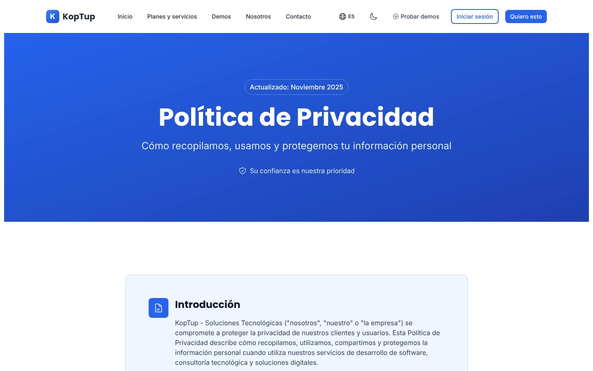
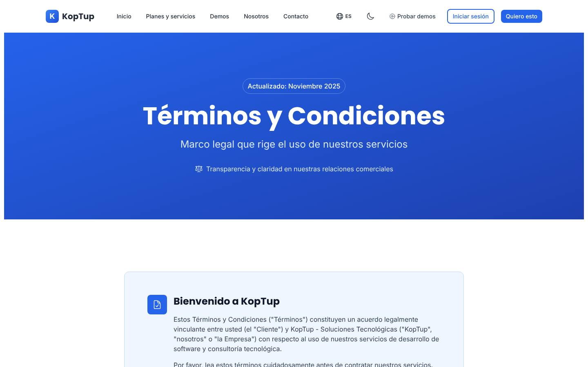
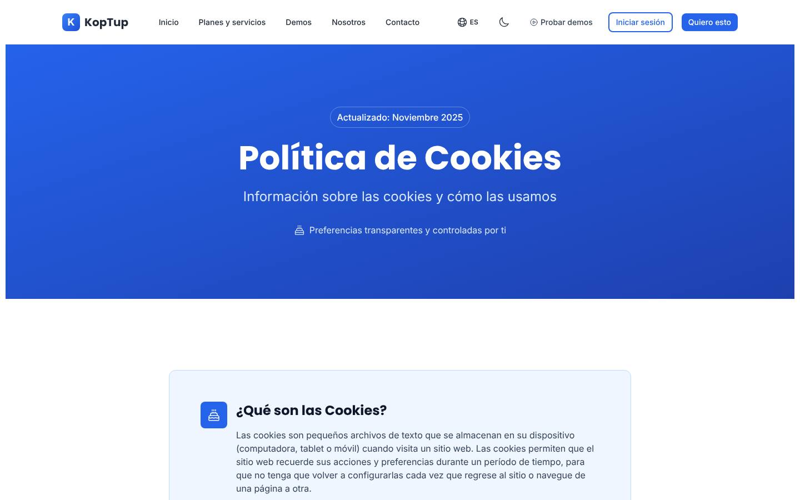
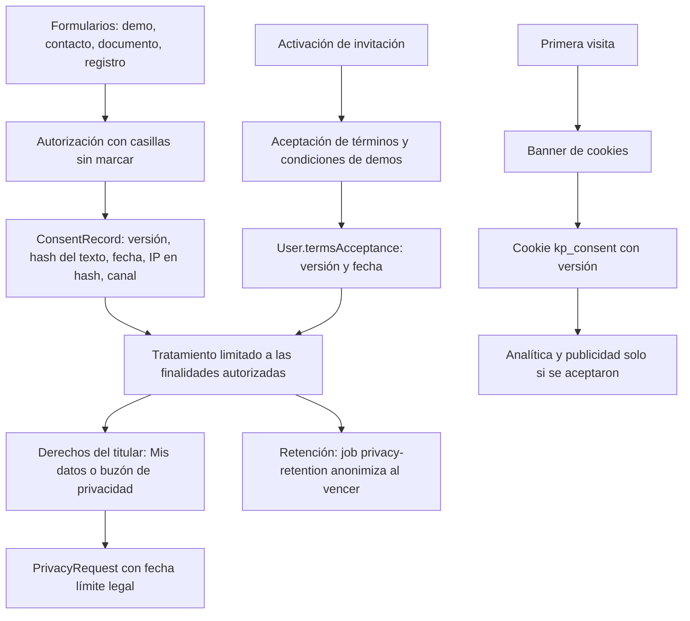
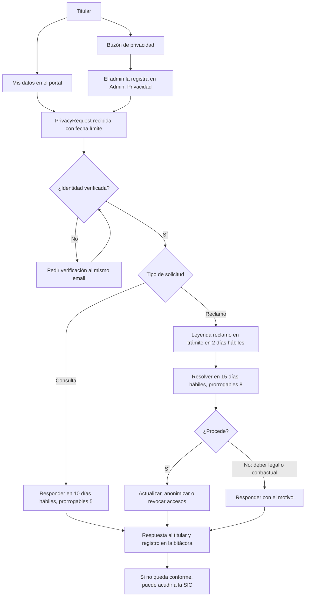
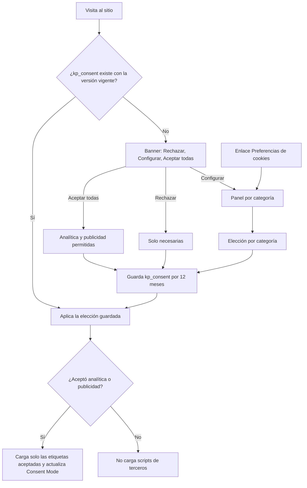

# Legal: datos personales, términos y cookies

> Rutas: `/privacy`, `/terms`, `/cookies`, más los avisos y autorizaciones de cada formulario, el banner de cookies, `/dashboard/privacidad` y `/baja` · Archivos principales: `apps/web/src/app/{privacy,terms,cookies}/{page,layout}.tsx`, `apps/web/messages/{es,en}.json` (namespaces `privacyPage`, `termsPage` y `cookiesPage`), `apps/web/src/lib/seo-config.ts`, `apps/web/src/components/layout/Footer.tsx`, `apps/web/src/app/register/page.tsx`, `apps/web/src/app/contact/page.tsx`, `apps/backend/src/config/passport.ts` · Prioridad: **P0** · Esfuerzo total: **XL** (≈ 25 días entre desarrollo y redacción, más la revisión de un asesor legal externo; el núcleo P0 son ≈ 13 días)

> **Importante:** esta página es un plan de producto, no asesoría jurídica. Antes de publicar cualquier texto legal, lo debe revisar y aprobar un abogado con experiencia en protección de datos en Colombia (tarea 1).

*Captura de producción (rama `main`). Páginas relacionadas: [Sistema de demos](04-Sistema-de-Demos.md) (sección 14, datos personales), [Comercial, marketing y legal](11-Comercial-Marketing-y-Legal.md), [Contacto](Seccion-Contacto.md), [Autenticación](Seccion-Autenticacion.md), [Nosotros](Seccion-Nosotros.md), [Seguridad y calidad](10-Seguridad-y-Calidad.md).*

---

## Objetivo

El funnel nuevo recoge datos personales en más de diez puntos y la demo RAG procesa documentos de los visitantes. Esta sección tiene que:

1. **Cumplir la Ley 1581 de 2012** y su reglamentación (Decreto 1377 de 2013, hoy compilado en el Decreto Único 1074 de 2015). En la práctica:
   - una política de tratamiento completa;
   - aviso de privacidad en cada punto de captura;
   - autorización previa, expresa e informada, con prueba;
   - atención de los derechos dentro de los plazos legales.
2. **Dar confianza al comprador B2B.** Compras y TI de una empresa piden el responsable del tratamiento, la lista de proveedores, el país donde están los datos y un anexo de tratamiento para sus documentos.
3. **Permitir medir y anunciar dentro de la ley.** GA4, Google Ads y LinkedIn solo se cargan después del consentimiento (rama `rag-reposicionamiento`).
4. **Dejar claras las reglas del negocio:** demos y accesos, "Prueba con tu documento", Piloto RAG, planes con mensualidad y desarrollos a medida.

**Dónde recoge KopTup datos personales**

| Punto de captura | Datos | Para qué | Estado hoy |
|---|---|---|---|
| Solicitar demo (`/solicitar-demo`) | Nombre, empresa, cargo, email, teléfono, país, tamaño, caso de uso | Gestionar la solicitud y el contacto comercial | Por construir; diseño con autorización (ver [Sistema de demos](04-Sistema-de-Demos.md)) |
| Contacto (`/contact`) | Nombre, email, teléfono, empresa, mensaje | Responder | **Sin autorización ni aviso** |
| Prueba con tu documento (`/demo/chatbot`) | Email y el documento subido (se borra a la hora) | Responder preguntas sobre el documento y contacto comercial | Rama RAG, con casilla de autorización |
| Registro y "Continuar con Google" | Nombre, email, contraseña, empresa, teléfono | Cuenta | **Una sola casilla mezclada (registro); ninguna con Google** |
| Activación de una invitación (`/acceso/activar`) | Contraseña y aceptación de las condiciones de las demos | Acceso a demos | Por construir |
| Uso de las demos (`DemoEvent`) | Qué abre, cuánto tiempo, qué módulos | Acompañar la evaluación | Por construir |
| Agenda en línea | Nombre, email, empresa | Agendar llamadas | Por construir (ver [Contacto](Seccion-Contacto.md)) |
| WhatsApp | Número y conversación | Atender consultas | Existe, sin aviso |
| Cookies y analítica | Identificadores del navegador | Medir y atribuir campañas | **Sin banner** |
| Portal de cliente | Datos de facturación, proyectos, mensajes | Prestar el servicio contratado | Existe |
| Documentos de clientes en un sistema RAG | Lo que el cliente cargue, que puede incluir datos de terceros | Prestar el servicio (KopTup es **encargado**) | Sin anexo de tratamiento |

---

## Estado actual

Evidencia tomada de la rama `main`.

| Documento o bloque | Qué hay hoy | Evidencia |
|---|---|---|
| `/privacy`: forma | Client component que pinta el namespace `privacyPage` de `es.json`. Título "Política de Privacidad" y "Actualizado: Noviembre 2025" | `privacy/page.tsx` línea 1; `es.json` → `privacyPage.updatedBadge` |
| Responsable | "KopTup - Soluciones Tecnológicas", sin razón social, NIT ni domicilio. El contacto es un correo con nombre de persona y un móvil, escritos en el código | `es.json` → `privacyPage.intro.p1`; `privacy/page.tsx` líneas 205–206 y 280–292 |
| Marco legal | El texto no menciona la Ley 1581 ni su decreto. La meta description, en cambio, dice "Cumplimiento con la Ley 1581 de 2012 (Colombia) y GDPR" | `lib/seo-config.ts` líneas 134–140 |
| Aceptación | Implícita: "Al utilizar nuestros servicios, usted acepta las prácticas descritas" y "usted consiente estas transferencias internacionales" | `privacyPage.intro.p2` y `privacyPage.s7.p2` |
| Derechos | Lista de estilo europeo (acceso, rectificación, eliminación, portabilidad, oposición, limitación). Faltan los de la ley colombiana: pedir prueba de la autorización, ser informado del uso, quejarse ante la SIC y revocar. Plazo de respuesta "30 días hábiles" | `privacyPage.rights` |
| Finalidades | Abiertas ("mejorar nuestros servicios", "optimizar nuestros procesos"). No mencionan demos, accesos, puntaje del lead ni medición de uso | `privacyPage.s2` |
| Datos sensibles | No se mencionan, aunque hay demos de salud y la demo RAG recibe documentos | — |
| Proveedores | "Proveedores de servicios en la nube de confianza como AWS". La plataforma usa otros (hosting web y de API, IA, correo, WhatsApp) y no hay lista | `privacyPage.s3.c3`, `privacyPage.s4.c1` |
| Seguridad | Promete "auditorías de seguridad regulares", afirmación que debe corresponder a un control real | `privacyPage.s3.c1` |
| Tono | Trato de "usted"; el resto del sitio tutea | Captura `privacidad.jpg` |
| `/terms` | Pensado para desarrollo a medida: anticipo del 50 %, mora del 1,5 % mensual, garantía de 30–90 días, propiedad intelectual, confidencialidad por 3 años y jurisdicción en Bogotá. No cubre demos, IA, planes con mensualidad, Piloto RAG ni el tratamiento de documentos de clientes. "Su uso continuado constituye su aceptación de los términos modificados" | `es.json` → `termsPage` (`s1.c3`, `s3`, `s7`) |
| `/cookies`: inventario | Lista cookies que el sitio no usa (`session_id`, `auth_token`, `csrf_token`, `cookie_consent`, `language`, `theme`, `user_preferences`, `_ga`, `_gid`, `_gat`). Las reales son `accessToken`, `refreshToken` y `locale`, más datos en `localStorage` (`user`, `cookie_preferences`, `koptup.clientType`, `chatbot_session_id`, entre otros) | `cookies/page.tsx` líneas 33–63; `lib/api.ts` líneas 144 y 163–164; `Navbar.tsx` línea 124 |
| `/cookies`: preferencias | Botones que guardan `cookie_preferences` en `localStorage` y muestran un `alert()`. Ningún código lee esa preferencia. No hay banner ni categoría de publicidad | `cookies/page.tsx` líneas 65–94 |
| Analítica | `main` no tiene. La rama RAG agrega GA4, Google Ads y LinkedIn "después de aceptar cookies", con un banner simple de aceptar o rechazar | Especificación de la rama, Fase 7 |
| Autorización en formularios | Contacto: ninguna. Registro: una sola casilla "Acepto los Términos y Privacidad". Cuentas con Google: se crean sin aceptar nada | `contact/page.tsx`; `register/page.tsx` (`agreeTerms`); `config/passport.ts` (creación del usuario) |
| Peso | Los textos legales viven en `es.json` (≈ 23,6 KB entre `privacyPage`, `termsPage` y `cookiesPage`) y viajan a todas las páginas con el resto de mensajes | `app/layout.tsx` (carga de mensajes) |
| Pie de página | Enlaces a las 3 páginas legales | `Footer.tsx` líneas 34–36 |
| Año | "© 2025" escrito en los textos legales | `privacyPage.footer`, `termsPage.footer`, `cookiesPage.footer` |

---

## Problemas detectados

1. **La política no cumple el contenido mínimo que exige la reglamentación** (Decreto 1377 de 2013, artículo 13). Faltan:
   - la identificación completa del responsable;
   - finalidades concretas;
   - el área que atiende las peticiones;
   - el procedimiento para ejercer los derechos;
   - la fecha de entrada en vigencia.
2. **La autorización se presume en vez de pedirse.** "Al utilizar nuestros servicios, usted acepta" no es una autorización previa, expresa e informada. Además, ningún formulario de captura la pide hoy.
3. **No hay prueba de la autorización.** La ley exige poder demostrarla. Hoy no se guarda qué texto aceptó cada persona ni cuándo.
4. **Los derechos y los plazos no son los de Colombia.** Los plazos legales son 10 días hábiles para consultas y 15 para reclamos, no 30. Tampoco se menciona la Superintendencia de Industria y Comercio (SIC).
5. **La metadata promete un cumplimiento que el texto no tiene** ("Ley 1581 y GDPR").
6. **La lista de cookies es ficticia y el sitio no tiene banner.** Cuando la rama RAG active GA4, Ads y LinkedIn, hará falta un consentimiento real con categorías.
7. **Los términos no cubren lo que se vende ahora:** demos con acceso temporal, IA que puede equivocarse, planes RAG con mensualidad y topes de preguntas, el Piloto con crédito de 30 días, y el papel de KopTup como encargado de los documentos del cliente.
8. **No se mencionan los datos sensibles.** La demo de cuentas médicas, las landings de salud y "Prueba con tu documento" pueden atraer datos de salud.
9. **Los proveedores no coinciden con la realidad y faltan las transmisiones internacionales** a proveedores fuera de Colombia.
10. **Los datos del responsable tienen nombre de persona, están escritos a mano y se repiten** en 4 páginas.
11. **Las promesas de seguridad son genéricas** y no se pueden verificar.
12. **Los textos son pesados y no tienen versión.** Viajan en el paquete de mensajes de todo el sitio y no existe historial de versiones.

---

## Plan detallado

### 1. Principios

- **Un solo origen de datos:**
  - `lib/company.ts`: responsable, buzones y domicilio (ver [Nosotros](Seccion-Nosotros.md));
  - `config/legal.ts`: versiones, fechas y textos de autorización.
- **Lenguaje claro y con "tú":** cada documento empieza con un resumen de 5 o 6 puntos y debajo va el texto completo. Así lo entiende un gerente y lo valida un abogado.
- **Todo versionado:** cada documento tiene versión y fecha de vigencia. Cada autorización guarda la versión y el hash del texto que vio la persona.
- **No prometer lo que no existe:** la política describe los controles que el código ya tiene. Cuando haya uno nuevo, se actualiza.
- **Separar lo contractual de la autorización de datos:** aceptar los términos es una cosa y autorizar el tratamiento es otra, con casillas distintas.

### 2. Documentos y dónde viven

| Documento | Ruta o componente | Quién lo ve | Cuándo se acepta o se muestra |
|---|---|---|---|
| **Política de tratamiento de datos personales** | `/privacy` (se conserva la URL) | Todos | Enlazada desde cada aviso y cada autorización |
| **Aviso de privacidad** (versión corta) | Componente `PrivacyNotice` | Quien llena un formulario | Debajo de cada formulario |
| **Autorización de tratamiento** | Componente `ConsentCheckboxes` + `ConsentRecord` | Quien envía datos | Casillas sin marcar en cada formulario |
| **Términos y condiciones** | `/terms`, con secciones ancladas | Todos | Se aceptan al registrarse, al activar una invitación y al aceptar una propuesta |
| **Condiciones de uso de las demos** | `/terms#demos` | Prospectos | Casilla en `/acceso/activar` |
| **Política de cookies** | `/cookies` + banner + panel de preferencias | Todos | Banner en la primera visita; enlace "Preferencias de cookies" en el pie |
| **Anexo de tratamiento de datos** (encargo) | Documento contractual adjunto a la propuesta | Clientes de RAG y SaaS | Al aceptar la propuesta (Fase 3) |
| **Historial de versiones** | `/legal/versiones` | Todos | Versiones anteriores con fecha |

### 3. Política de tratamiento de datos personales (`/privacy`)

**Título visible:** "Política de tratamiento de datos personales". Título SEO: "Política de datos personales | KopTup".

**Resumen al inicio** (texto propuesto):

> **En pocas palabras**
> 1. El responsable de tus datos es {razón social}, con domicilio en Bogotá, Colombia. Escríbenos a {buzón de privacidad}.
> 2. Usamos tus datos para atender tus solicitudes de demo y de contacto, darte acceso a las demos, prestarte los servicios que contrates y, solo si lo autorizas, enviarte novedades.
> 3. No te pedimos datos sensibles. No subas datos de salud ni de otras personas a las demos.
> 4. Trabajamos con proveedores de nube, correo e inteligencia artificial, algunos fuera de Colombia, que tratan tus datos por encargo nuestro y con contrato.
> 5. Puedes conocer, actualizar, rectificar y suprimir tus datos, y revocar tu autorización. Respondemos las consultas en máximo 10 días hábiles y los reclamos en máximo 15.
> 6. Si no quedas conforme con nuestra respuesta, puedes acudir a la Superintendencia de Industria y Comercio.

**Estructura del texto completo**

| # | Sección | Contenido | Base |
|---|---|---|---|
| 1 | Responsable del tratamiento | Razón social y NIT (o el nombre de la persona natural responsable, si la sociedad aún no existe), domicilio, dirección, buzón de privacidad y teléfono, desde `lib/company.ts` | Decreto 1377 de 2013, art. 13 |
| 2 | Marco legal y definiciones | Ley 1581 de 2012, Decreto 1377 de 2013 (compilado en el Decreto 1074 de 2015), definiciones de titular, responsable, encargado y tratamiento | Ley 1581, art. 3 |
| 3 | Datos que tratamos | Por categoría y por canal (tabla de la sección Objetivo). Datos de navegación y cookies, con enlace a `/cookies` | Principio de transparencia |
| 4 | Finalidades | Lista cerrada (tabla siguiente) | Ley 1581, art. 4 (finalidad) y art. 12 |
| 5 | Puntaje y medición de uso | Se calcula un puntaje para **priorizar la atención**, no para tomar decisiones con efectos jurídicos. El uso de las demos se mide sin guardar contenido | Transparencia |
| 6 | Datos sensibles y de menores | No se piden. Advertencia sobre documentos y demos de salud. Servicios no dirigidos a menores de edad | Ley 1581, arts. 5 a 7 |
| 7 | Derechos del titular | Los 6 derechos del artículo 8, explicados (sección 5 de esta página) | Ley 1581, art. 8 |
| 8 | Área responsable y canales | Buzón de privacidad, **Mis datos** en el portal y horario de atención. Responsable interno: el rol "Oficial de protección de datos" (sin nombre personal en el sitio) | Decreto 1377, art. 13 |
| 9 | Procedimiento y plazos | Consultas, reclamos, requisitos, prórrogas y requisito de procedibilidad (sección 5) | Ley 1581, arts. 14 a 16 |
| 10 | Encargados y transmisiones internacionales | Tabla de proveedores (abajo) | Ley 1581, art. 26; Decreto 1377, arts. 24 y 25 |
| 11 | Seguridad | Solo controles reales: HTTPS, autorización por rol en el servidor, IP guardadas en hash, borrado a la hora de los documentos de la demo, bitácora de auditoría. Se quitan "AWS" y "auditorías regulares" mientras no existan | Ley 1581, art. 4 (seguridad) |
| 12 | Conservación | Tabla de retención de la sección 14 de [Sistema de demos](04-Sistema-de-Demos.md) | Decreto 1377, art. 11 |
| 13 | Cookies | Resumen y enlace a `/cookies` | — |
| 14 | Vigencia y cambios | Fecha de entrada en vigencia, versión, vigencia de las bases de datos, aviso de cambios por email y nueva autorización si cambian las finalidades | Decreto 1377, art. 13 |

**Finalidades**

| # | Finalidad | Datos | Cómo se autoriza | Conservación |
|---|---|---|---|---|
| 1 | Atender solicitudes de demo y de contacto, y contactarte sobre ellas | Identificación, contacto, empresa, cargo, mensaje, producto de interés | Casilla obligatoria del formulario | Se anonimiza a los 24 meses sin conversión |
| 2 | Crear y administrar tu cuenta y tus accesos a las demos | Cuenta, rol, accesos, sesiones | Casilla del formulario + activación | Mientras la cuenta esté activa; se anonimiza a los 12 meses de inactividad, con aviso previo |
| 3 | Medir el uso de las demos para acompañarte en la evaluación | Eventos de uso sin contenido (`DemoEvent`) | Informada en la autorización | 13 meses |
| 4 | Priorizar la atención comercial (puntaje) | Datos del formulario y uso de la demo | Informada en la autorización | Igual que el Lead |
| 5 | Enviarte novedades y contenido comercial | Nombre y email | Casilla **opcional** | Hasta que la revoques (baja con un clic) |
| 6 | Escribirte por WhatsApp sobre tu solicitud | Teléfono | Casilla **opcional** | Hasta que la revoques |
| 7 | Prestar los servicios contratados, facturar y cobrar | Contacto, facturación, proyecto | Contrato | El plazo que fije la ley contable y tributaria |
| 8 | Prevenir el abuso del sitio y de las demos | IP en hash, user agent, resultado del captcha | Incluida en la finalidad 1 | 90 días |
| 9 | Medir el sitio y las campañas | Identificadores de cookies | Banner de cookies | Según cada cookie |
| 10 | Cumplir obligaciones legales y requerimientos de autoridades | Según el caso | Ley | Según la ley |

**Encargados y transmisiones internacionales.** Es una lista de partida: antes de publicarla hay que confirmarla con los contratos y las regiones reales. Se mantiene en `lib/legal-processors.ts` y se pinta en la política.

| Categoría | Proveedor | País (a confirmar con la región configurada) | Para qué |
|---|---|---|---|
| Alojamiento del sitio | Vercel | EE. UU. | Servir el sitio web |
| Servidor de la API | Railway | EE. UU. | Procesar las solicitudes |
| Base de datos | Proveedor de base de datos en la nube (completar) | Según la región | Guardar los datos |
| Inteligencia artificial | OpenAI | EE. UU. | Responder preguntas en las demos y en los productos RAG |
| Correo transaccional | Proveedor de correo (completar) | Según el proveedor | Acuses, invitaciones y avisos |
| WhatsApp | Twilio o Meta | EE. UU. | Avisos al equipo y mensajes autorizados |
| Captcha | Cloudflare (Turnstile) | EE. UU. | Prevenir el abuso |
| Agenda | Cal.com | EE. UU. | Agendar llamadas |
| Inicio de sesión | Google, si eliges "Continuar con Google" | EE. UU. | Autenticación |
| Analítica y publicidad (solo con consentimiento) | Google (GA4 y Ads) y LinkedIn | EE. UU. e Irlanda | Medir el sitio y las campañas |

Los proveedores actúan como **encargados**: la información no se les entrega para que la usen por su cuenta, sino que la tratan por encargo de KopTup. Esto es una *transmisión* internacional, y la respaldan su contrato o sus cláusulas de tratamiento de datos. Estados Unidos figura en la lista de países con nivel adecuado de protección de la SIC (Circular Externa 005 de 2017). El asesor debe confirmar ambos puntos.

### 4. Aviso de privacidad y autorizaciones

**Aviso de privacidad** (`PrivacyNotice`), debajo de cada formulario, con el contenido mínimo de la reglamentación: responsable, finalidad, derechos y dónde está la política.

> KopTup ({razón social}) trata tus datos para {finalidad del formulario}. Puedes conocerlos, actualizarlos, rectificarlos o pedir que los borremos, y revocar tu autorización, escribiendo a {buzón de privacidad}. Lee la Política de tratamiento de datos *(enlace a `/privacy`)*.

**Autorizaciones por canal.** Las casillas están **sin marcar**, una por finalidad, y las opcionales no condicionan el envío.

| Canal | Casilla obligatoria | Casillas opcionales | `ConsentRecord.channel` |
|---|---|---|---|
| Solicitar demo | "Autorizo a KopTup a tratar mis datos personales para gestionar esta solicitud y contactarme sobre ella, según la Política de tratamiento de datos (Ley 1581 de 2012)." | "Quiero recibir novedades y contenido comercial de KopTup." · "Acepto recibir mensajes por WhatsApp." | `form_demo` |
| Contacto | La misma | Las mismas | `contacto` |
| Prueba con tu documento | "Autorizo a KopTup a tratar mi email para enviarme los resultados de esta prueba y contactarme sobre sus productos, según la Política de tratamiento de datos." | Novedades | `demo_rag` |
| Registro y "Completa tu registro" (Google) | Dos casillas separadas: "Acepto los Términos y condiciones" y la autorización de datos | Novedades | `portal` |
| Activación de una invitación directa sin solicitud previa | Autorización de datos + "Acepto las condiciones de uso de las demos" | Novedades | `portal` |
| Agenda en línea | Aviso con enlace a la política en el formulario de la herramienta | — | Lo registra el webhook (ver [Contacto](Seccion-Contacto.md)) |
| WhatsApp | Mensaje automático de bienvenida con el aviso y el enlace (autorización por conducta inequívoca del titular, Decreto 1377, art. 7) | — | — |

**Advertencia de datos sensibles**, junto a todo campo de texto libre y a toda carga de archivos:
> No incluyas datos de pacientes, datos financieros ni información confidencial.

**Prueba de la autorización**, en `ConsentRecord` (sección 5.1 de [Sistema de demos](04-Sistema-de-Demos.md)):
- qué se autorizó: `purposes` (`gestionSolicitud`, `contactoComercial`, `marketing`), más la propuesta de agregar `whatsapp`;
- con qué texto: `policyVersion` y `textHash`, el SHA-256 del texto exacto que se mostró, calculado desde `config/legal.ts`;
- desde dónde: `channel`, `ipHash` y `userAgent`;
- cuándo: `grantedAt` y `revokedAt`.

**Revocación**
- Marketing:
  - enlace de baja en cada email (`/baja?token=`, `GET /api/unsubscribe/:token`);
  - desde **Mis datos** (`PATCH /api/me/consents`).
- Revocar la autorización obligatoria equivale a pedir la supresión (sección 5).

### 5. Derechos de los titulares

**Los derechos**, en lenguaje claro (Ley 1581, art. 8):

| Derecho | Qué significa |
|---|---|
| Conocer, actualizar y rectificar | Saber qué datos tenemos y corregirlos |
| Pedir prueba de la autorización | Ver cuándo y con qué texto nos autorizaste |
| Ser informado del uso | Saber para qué usamos tus datos |
| Presentar quejas ante la SIC | Una vez hayas acudido primero a nosotros |
| Revocar la autorización o pedir la supresión | Salvo que exista un deber legal o contractual de conservarlos |
| Acceder gratis | A tus datos |

**Canales**
- **Con cuenta:** **Mis datos** (`/dashboard/privacidad`) para ver las autorizaciones, exportar los datos y presentar una solicitud (`POST /api/me/privacy/requests`).
- **Sin cuenta** (la mayoría de los Leads): el buzón de privacidad. El admin registra la solicitud en **Admin › Privacidad**. Para eso esta página propone el endpoint `POST /api/privacy-requests` (admin), que se suma a los de la sección 8.4 de [Sistema de demos](04-Sistema-de-Demos.md).
- **Fase 2:** formulario público con verificación por email.

**Plazos legales.** Los calcula `PrivacyRequest.dueAt` en días hábiles de Colombia y avisa al admin al 70 % del plazo.

| Tipo | Plazo | Prórroga |
|---|---|---|
| Consulta | 10 días hábiles | 5 días hábiles más, informando el motivo |
| Reclamo (corrección, actualización, supresión o revocación) | 15 días hábiles | 8 días hábiles más, informando el motivo |
| Reclamo incompleto | Se pide completarlo dentro de los 5 días siguientes; si pasan 2 meses sin respuesta, se entiende desistido | — |
| Leyenda "reclamo en trámite" | Se marca en el Lead en máximo 2 días hábiles | — |

**Supresión:**
- La hace la acción **Anonimizar Lead**, solo para admin. Revoca los accesos con motivo `supresion` y conserva solo la prueba de la autorización y de la atención (sección 14 de [Sistema de demos](04-Sistema-de-Demos.md)).
- No procede cuando existe un deber legal o contractual de conservar los datos, por ejemplo con facturas emitidas.

### 6. Términos y condiciones (`/terms`)

Un solo documento con secciones ancladas, para enlazar a la parte que aplica en cada pantalla.

| Sección (ancla) | Contenido clave | Qué cambia frente a hoy |
|---|---|---|
| A. Quiénes somos y aceptación (`#aceptacion`) | Datos del responsable, versión y fecha. Los cambios importantes se avisan por email con 15 días de anticipación | Se quita "el uso continuado constituye aceptación" para los cambios importantes |
| B. Uso del sitio (`#sitio`) | Conducta permitida, propiedad del contenido, enlaces a terceros | Nuevo |
| C. Demos y accesos (`#demos`) | Datos simulados, acceso personal, vigencia, revocación, medición de uso, sin garantía de disponibilidad | Nuevo |
| D. Prueba con tu documento e IA (`#ia`) | Límites (5 MB, 30 páginas, 10 preguntas por documento, 3 documentos por día), borrado a la hora, derecho a usar el documento, prohibición de datos sensibles, posibles errores de la IA, proveedor de IA y si usa o no los datos para entrenar (según su política vigente) | Nuevo |
| E. Servicios a medida, modalidad compra (`#a-medida`) | Propuesta, anticipo, pagos, cambios de alcance, entrega, garantía, propiedad intelectual (lo actual, ordenado). La mora se cobra "a la tasa máxima legal permitida" o a una tasa fija que no la supere | Se conserva y se ajusta |
| F. Planes RAG con mensualidad (`#planes-rag`) | Los planes de `/services#planes-rag`, condiciones de pago (abajo), KopTup como encargado de los documentos | Nuevo |
| G. Piloto RAG (`#piloto`) | Alcance, precio y crédito (abajo) | Nuevo |
| H. Confidencialidad, responsabilidad y fuerza mayor (`#responsabilidad`) | Lo actual, con un tope de responsabilidad claro | Se ordena |
| I. Consumidores (`#consumidores`) | Si quien compra es un consumidor, aplica el Estatuto del Consumidor (Ley 1480 de 2011), incluido el derecho de retracto en ventas a distancia cuando proceda | Nuevo; lo valida el asesor |
| J. Ley aplicable, controversias y notificaciones (`#ley`) | Leyes de Colombia, Bogotá, notificaciones por email | Se conserva |

**Condiciones de uso de las demos** (sección C). Se muestran resumidas en `/acceso/activar` con una casilla de aceptación:

> Al activar tu acceso aceptas que:
> - La demo usa datos simulados y no es un sistema en producción.
> - El acceso es personal. Si alguien más de tu empresa quiere probarla, pídenos un acceso para esa persona.
> - No cargarás datos personales de terceros, datos de salud ni información confidencial.
> - Tu acceso vence en la fecha indicada, y podemos revocarlo si se usa de forma indebida.
> - Registramos cómo usas la demo (qué abres y por cuánto tiempo) para acompañarte en la evaluación.
> - Las respuestas generadas con inteligencia artificial pueden tener errores; verifícalas antes de usarlas.

**Planes RAG con mensualidad** (sección F). Los precios salen de la misma constante que `/services#planes-rag`; nunca se escriben a mano en los términos.
- **Pago:**
  - la mensualidad se paga por adelantado, en COP más IVA si aplica, o en USD;
  - incluye hosting, IA hasta el tope del plan (3.000 preguntas en Esencial, 15.000 en Profesional), actualización de documentos y soporte de lunes a viernes de 8:00 a 17:00;
  - cada pregunta sobre el tope cuesta COP 250 o USD 0,08;
  - las tarifas de Meta por mensajes de WhatsApp se cobran aparte, al costo.
- **Disponibilidad:**
  - Esencial y Profesional tienen un objetivo de disponibilidad, sin SLA con penalidades;
  - el plan Empresarial lleva un SLA firmado aparte.
- **Mora:** después del aviso, el servicio se puede suspender a los 15 días de mora.
- **Terminación:**
  - con 30 días de aviso;
  - al terminar, KopTup entrega una copia de los documentos y la configuración si el cliente la pide y borra los datos en 30 días, salvo deber legal.
- **Responsabilidades del cliente:**
  - tener la autorización de los titulares de los datos personales que haya en sus documentos;
  - revisar las respuestas críticas antes de usarlas.
- **Cambios de precio:** se avisan con 30 días de anticipación.

**Piloto RAG** (sección G):
- **Duración:** 2 semanas.
- **Precio:** COP 3.900.000 o USD 1.200, más IVA si aplica.
- **Incluye:**
  - una fuente de documentos, hasta 100 documentos;
  - interfaz web con citas;
  - un informe de precisión con 50 preguntas de prueba.
- **Crédito:** si el cliente contrata un plan dentro de los 30 días siguientes a la entrega del informe, el 100 % del valor del Piloto se descuenta del setup.
- **No incluye:** integraciones adicionales, WhatsApp, permisos por rol ni más fuentes.

### 7. Cookies y banner de consentimiento

**Inventario de partida.** Es lo que el código usa o usará. La versión definitiva sale de un escaneo automático del sitio en producción (tarea 13). Se mantiene en `lib/cookies-inventory.ts`, que es la única fuente para la página y para el banner.

| Nombre | Tipo | Finalidad | Duración | Categoría |
|---|---|---|---|---|
| `locale` | Cookie propia | Recordar el idioma elegido | 1 año | Necesaria |
| `accessToken` y `refreshToken` (hoy); `kp_at` y `kp_rt` (con la sesión httpOnly, ver [Autenticación](Seccion-Autenticacion.md)) | Cookie propia | Mantener la sesión | 15 minutos / 7 días (30 con "Recordarme") | Necesaria |
| `kp_s` | Cookie propia | Indica a la interfaz que hay una sesión. No contiene datos | Igual que la sesión | Necesaria |
| `kp_dp_<demo>` | Cookie propia httpOnly | Pase de demo verificado en el servidor | 15 minutos | Necesaria |
| `kp_consent` | Cookie propia | Guardar tu elección sobre cookies | 12 meses | Necesaria |
| `chatbot_session_id` y estado de las demos | Almacenamiento local | Continuar la conversación y el recorrido de la demo | Hasta que lo borres | Necesaria |
| Atribución (UTM) | Almacenamiento de sesión | Saber de qué campaña vienes si envías un formulario | La sesión | Necesaria (se informa en el aviso del formulario) |
| `_ga`, `_ga_<ID>` | Terceros (Google) | Google Analytics 4 | Hasta 2 años | Analítica |
| `_gcl_au` y similares | Terceros (Google) | Conversiones de Google Ads | Hasta 90 días | Publicidad |
| Cookies de LinkedIn Insight (por ejemplo, `li_fat_id`) | Terceros (LinkedIn) | Conversiones de LinkedIn | Según LinkedIn | Publicidad |

**Se eliminan:**
- `user`, `cookie_preferences` y `koptup.clientType` del almacenamiento local (la sesión deja de guardarse ahí);
- los nombres ficticios de la página actual.

**Banner** (`components/legal/CookieConsent.tsx` + `lib/consent.ts`). Reemplaza el "banner simple" de la especificación RAG con el mismo comportamiento base y le agrega la opción de configurar.

> **Usamos cookies.** Las necesarias hacen funcionar el sitio. Con tu permiso, también usamos cookies de analítica y de publicidad para saber qué funciona y medir nuestras campañas. Política de cookies *(enlace a `/cookies`)*.
>
> [Rechazar] · [Configurar] · [Aceptar todas]

- **Botones:**
  - los tres tienen el mismo tamaño y el mismo peso visual;
  - **Rechazar** está tan a mano como **Aceptar**.
- **Panel "Configurar":**
  - Necesarias: siempre activas, con la lista.
  - Analítica: "Google Analytics nos dice qué páginas se visitan y qué botones se usan".
  - Publicidad: "Google Ads y LinkedIn miden si nuestras campañas generan solicitudes".
  - Ningún interruptor viene activado.
  - Botones: "Guardar mi elección", "Rechazar todas" y "Aceptar todas".
- **Diseño:**
  - no bloquea la navegación (no es un muro de cookies);
  - en móvil es una hoja inferior que no tapa los botones del hero;
  - se puede usar con teclado y con lector de pantalla.
- **Google Consent Mode v2:**
  - empieza con `analytics_storage`, `ad_storage`, `ad_user_data` y `ad_personalization` en `denied`;
  - se usa el **modo básico**: las etiquetas no se cargan hasta que hay consentimiento, así que no sale ninguna petición antes.
- **Guardado:**
  - `kp_consent` = `{ v, analytics, marketing, ts }` por 12 meses;
  - si cambia `COOKIES_POLICY_VERSION`, el banner se muestra de nuevo.
- **Reabrir:** enlace "Preferencias de cookies" en el pie de página, en `/cookies` y en **Mis datos**.
- **Eventos de las demos:** los `DemoEvent` anónimos de las demos públicas solo se envían con consentimiento de analítica (sección 13 de [Sistema de demos](04-Sistema-de-Demos.md)). Los de prospectos con acceso son parte del servicio y están informados en la autorización.
- **Contenido de terceros:** el mapa, los videos y la agenda se cargan solo cuando la persona pulsa (ver [Contacto](Seccion-Contacto.md)). Los videos usan el dominio sin cookies del proveedor.

### 8. Datos sensibles y documentos de los clientes

- **Demos:**
  - las demos de salud (`cuentas-medicas`, `sistema-experto`, en modo `privado`) y las maquetas usan **solo datos simulados**;
  - la barra de acceso y los emails repiten: "Las demos usan datos simulados. No cargues información confidencial".
- **Prueba con tu documento:**
  - aviso visible antes de subir: "No subas información confidencial ni documentos con datos de salud o de otras personas";
  - el documento y sus embeddings se borran a la hora (rama RAG).
- **Clientes de RAG y SaaS:** KopTup trata los documentos del cliente **por encargo**. Por eso cada contrato lleva un **anexo de tratamiento de datos** (contrato de transmisión, Decreto 1377, art. 25) con:
  - objeto, duración e instrucciones documentadas del cliente;
  - confidencialidad del equipo y medidas de seguridad;
  - lista de subencargados (los de la sección 3) y aviso previo si cambian;
  - apoyo al cliente para atender los derechos de sus titulares;
  - aviso de incidentes de seguridad al cliente sin demora injustificada;
  - devolución y borrado al terminar;
  - en salud: el cliente (IPS o aseguradora) responde por la autorización de sus pacientes. KopTup recomienda minimizar datos y ofrece despliegue en la nube del cliente u on-premise (plan Empresarial).
- **IA y datos personales:** antes de vender a salud o a legal, revisar con el asesor las orientaciones de la SIC sobre inteligencia artificial y datos personales (Circular Externa 002 de 2024; validar que siga vigente).

### 9. Cumplimiento operativo

| Obligación | Cómo se cumple | Responsable | Frecuencia |
|---|---|---|---|
| Prueba de la autorización | `ConsentRecord` en cada captura | Sistema | Siempre |
| Atender consultas y reclamos a tiempo | `PrivacyRequest` con alertas | Admin | Continuo |
| Retención | Job `privacy-retention` (sección 12 de [Sistema de demos](04-Sistema-de-Demos.md)) | Sistema | Cada noche |
| Registro Nacional de Bases de Datos | Desde el Decreto 090 de 2018, inscribirse es obligatorio para sociedades y entidades sin ánimo de lucro con activos totales de más de 100.000 UVT y para entidades públicas. Evaluarlo con el asesor | Dueño + asesor | Una vez al año |
| Procedimiento de incidentes de seguridad | Documento interno: detectar, contener, evaluar, avisar a los afectados y a la SIC cuando corresponda | Dueño + dev | Por evento; revisión anual |
| Contacto comercial | Verificar si la Ley 2300 de 2023 (canales y horarios para contactar consumidores) aplica a las secuencias. Mientras tanto, se usan las reglas de envío de la sección 11 de [Sistema de demos](04-Sistema-de-Demos.md) | Asesor | Una vez |
| Inventario de cookies | Escaneo automático en cada despliegue (tarea 13) | Dev | Cada despliegue |
| Lista de encargados | `lib/legal-processors.ts` revisado cuando cambia un proveedor | Dev | Por cambio |
| Revisión de textos | Política, términos y cookies | Asesor | Una vez al año |
| Capacitación del equipo comercial | No compartir datos de prospectos por canales personales, usar solo el panel | Dueño | Cada semestre |

### 10. Implementación técnica

| Pieza | Archivo | Qué hace |
|---|---|---|
| Versiones y textos de autorización | `apps/web/src/config/legal.ts` | `PRIVACY_POLICY_VERSION`, `TERMS_VERSION`, `COOKIES_POLICY_VERSION`, fechas de vigencia y `CONSENT_TEXTS` por canal. El hash de cada texto se calcula en el build. Una prueba compara la versión con la variable `PRIVACY_POLICY_VERSION` del backend |
| Contenido de los documentos | `apps/web/src/content/legal/{privacy,terms,cookies}.es.ts` (y `.en.ts` en la Fase 2) | Secciones estructuradas, fuera de `messages`, que solo carga la página que las usa |
| Página de documento | `apps/web/src/components/legal/LegalDocument.tsx` | Server component con resumen, índice con anclas, texto, versión, fecha y enlace al historial |
| Aviso y autorizaciones | `components/legal/{PrivacyNotice,ConsentCheckboxes}.tsx` | Los usan todos los formularios. `ConsentCheckboxes` es el mismo componente de la tarea 20 de [Sistema de demos](04-Sistema-de-Demos.md), movido a `components/legal/` |
| Cookies | `components/legal/CookieConsent.tsx`, `lib/consent.ts`, `lib/cookies-inventory.ts`, `components/analytics/Analytics.tsx` (rama RAG) | Banner, panel, Consent Mode y carga condicionada de las etiquetas |
| Historial | `apps/web/src/app/legal/versiones/page.tsx` | Lista de versiones con fecha y enlace al texto archivado |
| Aceptación de términos | `User.termsAcceptance = { version, at, ipHash }` (campo nuevo propuesto) | Se guarda al registrarse, al completar el registro con Google y al activar una invitación |
| Backend | `ConsentRecord`, `PrivacyRequest`, `privacy.controller.ts` y el job `privacy-retention` (todos de [Sistema de demos](04-Sistema-de-Demos.md)), más `POST /api/privacy-requests` (admin, propuesto aquí) | Prueba, derechos y retención |
| Escaneo de cookies | `apps/web/scripts/scan-cookies.mjs` (Playwright) | Abre las páginas clave con y sin consentimiento, lista cookies y almacenamiento, y falla si algo no está en el inventario |

---

## Integración con el sistema de demos

| Punto | Comportamiento | Referencia |
|---|---|---|
| Autorización en la solicitud | `POST /api/demo-requests` responde 400 sin la autorización obligatoria y guarda `consentRecordId` en la solicitud | [Sistema de demos](04-Sistema-de-Demos.md), secciones 5.1 y 14 |
| Versión de la política | `PRIVACY_POLICY_VERSION` es la misma en la web (`config/legal.ts`) y en el backend; cada `ConsentRecord` la guarda | Sección 18 (variables) |
| Condiciones de las demos | Se aceptan en `/acceso/activar` antes de consumir el enlace mágico. Sin aceptarlas, el botón **Activar mi acceso** queda deshabilitado | [Autenticación](Seccion-Autenticacion.md) |
| Eventos de uso | Con acceso: informados en la autorización. Anónimos (demos públicas): solo con consentimiento de analítica | Sección 13 |
| Baja de comunicaciones | `/baja?token=` y `GET /api/unsubscribe/:token` detienen las secuencias comerciales, pero no los avisos operativos del acceso (vencimiento, revocación) | Sección 11 |
| Mis datos y Admin › Privacidad | Exportar, ejercer derechos y atender solicitudes con fecha límite | Secciones 8.3 y 8.4 |
| Supresión | Anonimizar el Lead revoca sus accesos (`supresion`) y conserva solo la prueba | Sección 14 |
| Retención | El job `privacy-retention` aplica la tabla de plazos | Sección 12 |
| Datos sensibles | El formulario y las demos de salud muestran la advertencia; las maquetas no llevan datos reales | Sección 10.3 |

---

## SEO · i18n · accesibilidad · rendimiento

**SEO**
- Las tres páginas son indexables, con títulos claros: "Política de datos personales | KopTup", "Términos y condiciones | KopTup" y "Política de cookies | KopTup".
- La descripción de `/privacy` deja de mencionar "GDPR". Solo dice lo que el texto cumple.
- La fecha de "Última actualización" sale de `config/legal.ts`.
- El `BreadcrumbList` actual se conserva y se quitan las `keywords`.

**i18n**
- El español es la versión que rige.
- La versión en inglés (Fase 2) es de cortesía y lo dice al inicio.
- Los textos legales salen de `es.json` y `en.json`: son ≈ 23,6 KB menos en el paquete de mensajes que reciben todas las páginas.

**Accesibilidad**
- Jerarquía de títulos (un H1 y H2 por sección), índice con anclas y ancho de lectura cómodo (≈ 70 caracteres).
- Las tablas tienen encabezados.
- **Banner:** usa `role="region"` con `aria-label="Preferencias de cookies"`, no roba el foco al cargar y se puede recorrer con teclado.
- **Panel de configuración:** es un diálogo con foco atrapado y cierre con Esc. Sus interruptores llevan `role="switch"` y etiqueta.
- Se reemplazan los `alert()` actuales por mensajes en pantalla con `aria-live`.

**Rendimiento**
- Las tres páginas pasan a server components sin JavaScript de cliente, salvo el panel de preferencias.
- El banner pesa menos de 5 KB y no carga nada de terceros hasta que hay consentimiento.

---

## Tareas

| # | Tarea | Fase | Prioridad | Esfuerzo | Criterio de aceptación |
|---|---|---|---|---|---|
| 1 | Contratar a un asesor en protección de datos (Colombia) para revisar la política, el aviso, las autorizaciones, los términos, la política de cookies y el anexo de tratamiento | Fase 1 — Funnel y solicitud de demos | P0 | M (externo) | Los textos versión 1.0 quedan aprobados por escrito y archivados antes de publicarse |
| 2 | Datos del responsable en `lib/company.ts` (razón social y NIT, o persona natural responsable, domicilio, buzón de privacidad de rol y teléfono) y su uso en las páginas legales | Fase 1 — Funnel y solicitud de demos | P0 | S | No queda ningún correo con nombre de persona en las páginas legales; el responsable se ve completo en `/privacy` |
| 3 | `config/legal.ts` con versiones, fechas de vigencia, `CONSENT_TEXTS` y hash por texto, más una prueba de que coincide con la versión del backend | Fase 1 — Funnel y solicitud de demos | P0 | S | Cambiar un texto de autorización cambia su hash; la prueba falla si la web y el backend tienen versiones distintas |
| 4 | Redactar la nueva **Política de tratamiento de datos personales** (resumen + 14 secciones) | Fase 1 — Funnel y solicitud de demos | P0 | M | Cubre el contenido mínimo del Decreto 1377 (art. 13); los plazos son 10 y 15 días hábiles; menciona la SIC; no dice "GDPR" ni "AWS" |
| 5 | Mover los textos legales de `messages` a `content/legal/`, `LegalDocument` como server component con índice y versión, e historial en `/legal/versiones` | Fase 1 — Funnel y solicitud de demos | P1 | M | `es.json` ya no tiene `privacyPage`, `termsPage` ni `cookiesPage`; las tres páginas no envían JS de cliente (salvo el panel de cookies); el historial muestra la versión 1.0 |
| 6 | Componente `PrivacyNotice` en todos los formularios: solicitar demo, contacto, prueba con tu documento, registro, activación y completar registro | Fase 1 — Funnel y solicitud de demos | P0 | S | Una prueba E2E verifica que cada formulario muestra el aviso con el enlace a `/privacy` |
| 7 | `ConsentCheckboxes` en `components/legal/` con casillas separadas sin marcar; en el registro se separan los términos de la autorización de datos; `ConsentRecord` en cada canal. **Comparte trabajo con la tarea 26 de [Sistema de demos](04-Sistema-de-Demos.md)** | Fase 1 — Funnel y solicitud de demos | P0 | S | Ninguna casilla viene marcada; cada envío deja un `ConsentRecord` con canal, versión y hash; sin la casilla obligatoria el backend responde 400 |
| 8 | Lista de encargados y transmisiones (`lib/legal-processors.ts`), confirmada con los contratos y regiones reales y publicada en la política | Fase 1 — Funnel y solicitud de demos | P0 | S | Cada proveedor que recibe datos personales en producción aparece en la lista con país y finalidad |
| 9 | Derechos del titular: sección en la política, canal por buzón, registro manual por admin (`POST /api/privacy-requests`) y leyenda "reclamo en trámite". **Comparte trabajo con la tarea 32 de [Sistema de demos](04-Sistema-de-Demos.md)** | Fase 1 — Funnel y solicitud de demos | P1 | M | Una solicitud registrada calcula su fecha límite en días hábiles de Colombia y avisa al 70 %; un reclamo marca el Lead en ≤ 2 días hábiles |
| 10 | Reestructurar `/terms` en las secciones A a J, quitando la aceptación por uso continuado en cambios importantes | Fase 1 — Funnel y solicitud de demos | P1 | M | Cada sección tiene ancla; las secciones de demos, IA, planes RAG y Piloto existen; la garantía coincide con las preguntas frecuentes de [Contacto](Seccion-Contacto.md) |
| 11 | Condiciones de uso de las demos con casilla en `/acceso/activar` y `User.termsAcceptance` | Fase 1 — Funnel y solicitud de demos | P0 | S | Sin la casilla no se puede activar el acceso; el usuario queda con la versión y la fecha aceptadas |
| 12 | Términos del Piloto RAG y de los planes con mensualidad, leyendo los precios de la misma constante que `/services#planes-rag` | Fase 1 — Funnel y solicitud de demos | P1 | S | Cambiar un precio en la constante lo cambia en `/services` y en `/terms`; los topes, el precio por pregunta adicional y el crédito de 30 días coinciden con la especificación RAG |
| 13 | Inventario real de cookies en `lib/cookies-inventory.ts` y escaneo automático con Playwright (`scripts/scan-cookies.mjs`) | Fase 1 — Funnel y solicitud de demos | P0 | S | El escaneo de producción no encuentra cookies ni claves de almacenamiento fuera del inventario; la página `/cookies` lista solo cookies reales |
| 14 | Banner de consentimiento con panel por categoría, Consent Mode v2 en modo básico, `kp_consent` versionado y enlace "Preferencias de cookies" en el pie. Reemplaza `localStorage` y `alert()` de `/cookies` y se coordina con la Fase 7 de la rama RAG | Fase 1 — Funnel y solicitud de demos | P0 | M | Con el banner sin responder o rechazado no sale ninguna petición a Google ni a LinkedIn (verificado con la tarea 13); aceptar solo analítica carga GA4 y no las etiquetas de publicidad; el banner se puede usar solo con teclado |
| 15 | Contenido de terceros que carga al pulsar: mapa, videos (dominio sin cookies) y agenda | Fase 1 — Funnel y solicitud de demos | P1 | S | Al abrir `/contact`, `/rag` y las landings no hay peticiones a esos terceros hasta que la persona pulsa |
| 16 | Advertencia de datos sensibles en los campos de texto libre, en la carga de documentos y en las demos de salud | Fase 1 — Funnel y solicitud de demos | P0 | S | La advertencia aparece en los 4 formularios y antes de subir un documento en `/demo/chatbot` |
| 17 | Anexo de tratamiento de datos (encargo) para clientes de RAG y SaaS, adjunto a la propuesta | Fase 3 — Propuestas y conversión | P1 | M (externo) | Cada propuesta de un plan RAG lleva el anexo; el texto está aprobado por el asesor e incluye subencargados, incidentes y borrado al terminar |
| 18 | Cumplimiento operativo: decisión documentada sobre el Registro Nacional de Bases de Datos y la Ley 2300 de 2023, y procedimiento interno de incidentes de seguridad | Fase 1 — Funnel y solicitud de demos | P2 | S | Las decisiones quedan escritas en [Comercial, marketing y legal](11-Comercial-Marketing-y-Legal.md) con fecha y firma del asesor |
| 19 | Metadata de las páginas legales: títulos nuevos, sin "GDPR" ni `keywords`, fecha desde `config/legal.ts`, sin "© 2025" escrito a mano | Fase 1 — Funnel y solicitud de demos | P2 | S | `npm run check-titles` (rama RAG) pasa; ningún texto legal tiene un año escrito a mano |
| 20 | Aviso de cambios de la política: email a los usuarios con cuenta y nueva autorización solo cuando cambian las finalidades | Fase 2 — Demos vendibles | P2 | S | Al publicar una versión con finalidades nuevas, los usuarios ven la nueva autorización en su siguiente inicio de sesión |
| 21 | Traducción de cortesía al inglés de los tres documentos, con la nota de que rige la versión en español | Fase 2 — Demos vendibles | P3 | S | Con `locale=en` las tres páginas están en inglés y muestran la nota |
| 22 | Pruebas automatizadas de cumplimiento: ninguna etiqueta de terceros antes del consentimiento, `ConsentRecord` con versión en cada canal y 400 sin autorización | Fase 1 — Funnel y solicitud de demos | P1 | S | Las pruebas corren en el CI (cuando la Fase 0 lo repare) y fallan si alguien agrega una etiqueta sin pasar por `lib/consent.ts` |

---

## Métricas de éxito

| Métrica | Fuente | Meta |
|---|---|---|
| Leads con prueba de autorización (`ConsentRecord` con versión y hash) | Base de datos | 100 % |
| Peticiones a terceros de analítica o publicidad antes del consentimiento | Escaneo automático (tarea 13) | 0 |
| Cookies o claves de almacenamiento fuera del inventario | Escaneo automático | 0 |
| Solicitudes de titulares atendidas dentro del plazo legal | **Admin › Privacidad** | 100 % |
| Mediana de respuesta a consultas de titulares | `PrivacyRequest` | ≤ 5 días hábiles |
| Bajas de comunicaciones procesadas | `/baja` frente a envíos posteriores | 100 % efectivas en < 1 hora |
| Aceptación del banner (analítica) | Contador agregado de elecciones en el servidor, sin identificadores | Solo para seguimiento, sin meta: el banner no se diseña para forzar la aceptación |
| Textos legales aprobados por el asesor y vigentes | Historial de versiones | 100 %, revisados en los últimos 12 meses |
