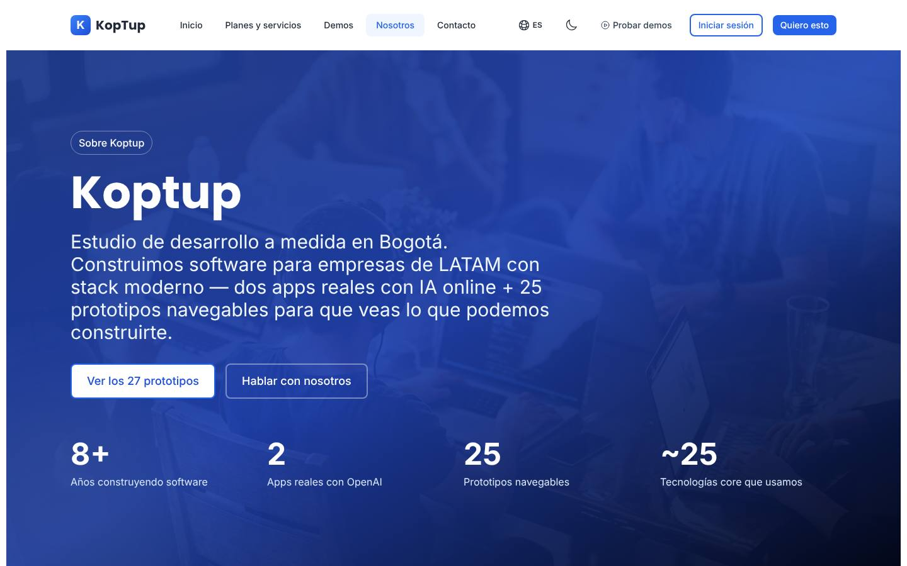
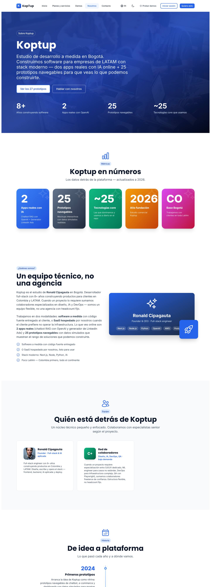
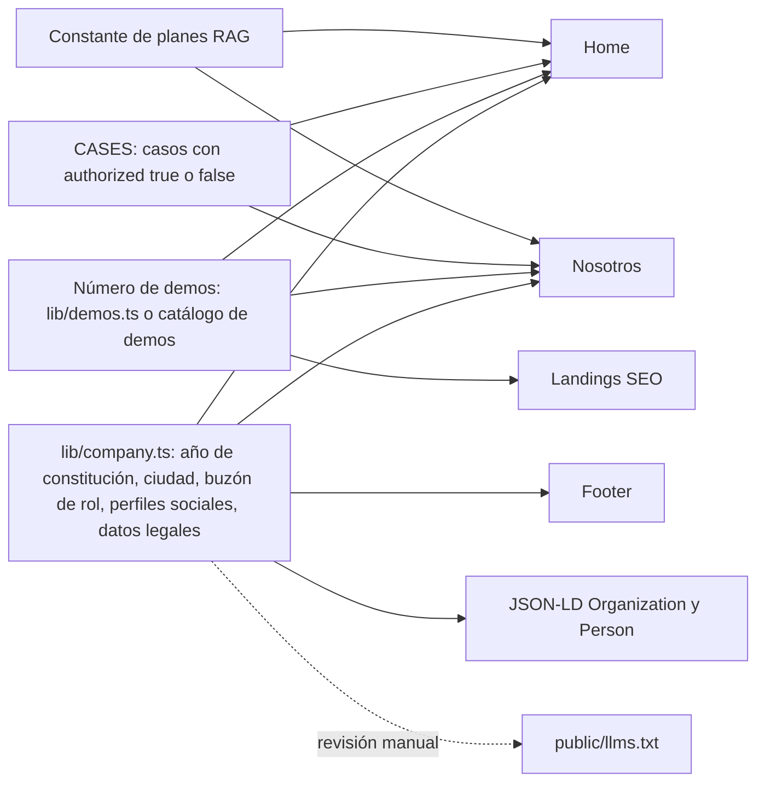
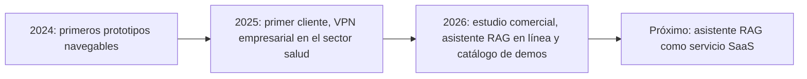

# Nosotros

> Ruta: `/about` · Archivos principales: `apps/web/src/app/about/page.tsx` (902 líneas), `apps/web/src/app/about/layout.tsx`, `apps/web/src/lib/seo-config.ts` (entrada `about`), `apps/web/messages/{es,en}.json` (namespace `aboutPage`, hoy sin uso) · Prioridad: **P1** (con 4 tareas P0 de honestidad) · Esfuerzo total: **L** (≈ 10 días-dev en la Fase 1, más los datos y fotos que aporta el dueño)

*Páginas relacionadas: [Home](Seccion-Home.md), [Landings SEO y de campaña](Seccion-Landings-SEO.md), [Comercial, marketing y legal](11-Comercial-Marketing-y-Legal.md), [Legal](Seccion-Legal.md), [Visión de producto](02-Vision-de-Producto.md).*

---

## Objetivo

Un comprador B2B visita "Nosotros" para responder tres preguntas antes de dar sus datos: **¿quiénes son?, ¿han hecho esto antes? y ¿puedo confiarles mis documentos?** La página tiene que:

1. **Presentar a KopTup como lo que es:** un estudio pequeño y senior en Bogotá, enfocado en sistemas RAG, que también desarrolla software a medida.
2. **Mostrar evidencia verificable:** el fundador con nombre y foto real, casos reales con su etiqueta (cliente, producto propio, uso interno) y una historia coherente con el resto del sitio.
3. **Bajar el riesgo percibido:** cómo trabajamos (piloto de 2 semanas antes de comprometerse), cómo se manejan los datos y quién es el responsable legal.
4. **Devolver al visitante al embudo:** Probar la demo, Solicitar demo guiada o Agendar llamada.

Hoy `/about` es la página **más honesta** del sitio: dice "2 apps reales", "prototipos con datos simulados" y "fundación 2026". El plan conserva ese tono, corrige lo que todavía se exagera y hace que la home, el JSON-LD y las landings cuenten la misma historia.

---

## Estado actual

Evidencia de la rama `main`.

| Bloque | Qué hay hoy | Evidencia |
|---|---|---|
| Tipo de página | Client component sin ninguna interactividad (no usa estado, efectos ni eventos). Textos escritos en el código, sin i18n | `page.tsx` línea 1; no hay `useState`, `useEffect` ni `onClick` |
| Hero | H1 "Koptup" (el resto del sitio escribe "KopTup"); "dos apps reales con IA online + 25 prototipos navegables"; botón "Ver los 27 prototipos"; fondo con foto de banco de imágenes | Líneas 392, 405–415 |
| Cifras del hero | 8+ años · 2 apps reales con OpenAI · 25 prototipos · ~25 tecnologías | `heroStats`, líneas 272–277 |
| "Koptup en números" | 5 tarjetas: 2 apps, 25 prototipos, ~25 tecnologías, 2026 año de fundación, CO | `bigMetrics`, líneas 279–310; título en la línea 440 |
| ¿Quiénes somos? | "Un equipo técnico, no una agencia". Estudio de Ronald Cipagauta, 8+ años, colaboradores bajo demanda; modalidades a medida o SaaS | Líneas 472–490 |
| Equipo | Tarjeta del fundador con una **foto de banco de imágenes** (Unsplash), no una foto propia, y tarjeta "Red de colaboradores" | `team`, líneas 321–338 (foto en la 329) |
| Historia | 2024 prototipos → 2025 primer cliente (SoSalud, con monto) → 2026 vitrina y "27 vistas" → "2027+: alianzas con integradores en México y Argentina" | `timeline`, líneas 347–373 |
| Tecnologías | 47 tecnologías en 3 niveles ("a diario", "familiaridad", "conceptualmente sólidos"). El nivel "a diario" incluye Jest, Playwright y Swagger | `techCategories`, líneas 50–125; título en la 644 |
| Capacidades de IA | Título "Capacidades de IA **en producción**" con 11 capacidades (voz, visión, detección de anomalías, agentes…). Solo el RAG y la generación de contenido existen en el código | `aiCapabilities`, líneas 127–172; título en la 701 |
| Verticales | "Verticales donde tenemos **experiencia real**": 9 sectores. En salud dice "integración HL7/FHIR y HIPAA. Caso reciente: SoSalud", pero el caso SoSalud fue una VPN | `verticals`, líneas 174–220 (178) y 732 |
| Metodología | "Metodología probada en 8+ años"; promete "CI/CD desde día 1" y "tests automáticos en cada PR", pero el CI del propio repositorio hoy no corre ([Seguridad y calidad](10-Seguridad-y-Calidad.md)) | `methodology`, líneas 222–231; título en la 766 |
| Herramientas | 18 herramientas de terceros (Zoom, Slack, Jira, Toggl…) | `tooling`, líneas 233–240 |
| Casos | 3 casos: SoSalud (real, con monto de COP 3.500.000), "Chatbot WhatsApp para empresa de productos" (+3x leads) y "Dashboard ejecutivo mid-market" (−60 %). Los dos últimos no tienen cliente identificable ni fuente de la cifra | `caseStudies`, líneas 242–270; título "Proyectos que ya entregamos" en la 830 |
| CTA final | "¿Empezamos?" con voseo ("Probá… agendá una llamada de 30 minutos"), pero el botón lleva a `/contact`; otra foto de banco de fondo | Líneas 873–895 |
| Voseo | "Si lo ves acá", "Probá", "agendá" | Líneas 56 y 882 |
| Metadata | "Más de 100 proyectos entregados con éxito" (la rama `rag-reposicionamiento` ya lo quitó) | `seo-config.ts`, entrada `about` |
| i18n | El namespace `aboutPage` de `es.json` y `en.json` tiene otro texto ("Transformamos Ideas en Realidad Digital") y no lo usa ningún componente. Con la cookie en inglés, `/about` sale en español | `grep aboutPage apps/web/src` no devuelve resultados |

**Contradicciones con el resto del sitio** (la causa de fondo es que no hay una fuente única de datos de empresa):

| Dato | `/about` | Otras páginas |
|---|---|---|
| Fundación | 2026 | `foundingDate: 2019` en el JSON-LD (`StructuredData.tsx` línea 61) y en `public/llms.txt` |
| Experiencia | 8+ años (del fundador) | "6+ años" en `/desarrollo-web-colombia` y `/bienvenido-producthunt` |
| Proyectos y clientes | 1 cliente nombrado | "100+ proyectos, 50+ clientes" en la home; "+100, +50, 98 %" en `/desarrollo-web-colombia` |
| Número de demos | "25 prototipos" y "27 prototipos" en la misma página | 26 tarjetas en `/demo` y 28 rutas de demo |
| Tamaño del equipo | Fundador + colaboradores bajo demanda | `numberOfEmployees: 5` en el JSON-LD |

---

## Problemas detectados

1. **La foto del fundador no es del fundador.** Es una imagen de banco. Si un prospecto lo nota (por ejemplo, al comparar con LinkedIn), toda la página pierde credibilidad. Es el problema más grave de la página.
2. **Afirmaciones más grandes que la evidencia:** "en producción", "experiencia real" en 9 verticales, casos con cifras sin fuente y una metodología con CI y tests que hoy no corren.
3. **Datos contradictorios** con la home, el JSON-LD, `llms.txt` y las landings (tabla de arriba).
4. **No se menciona el producto principal.** La página habla de "estudio de desarrollo a medida" y "prototipos"; RAG aparece solo como una capacidad entre once.
5. **Ruido:** 47 tecnologías y 18 herramientas no ayudan a decidir a un gerente y distraen de los casos.
6. **Marca inconsistente:** "Koptup" en el H1 y en los títulos; "KopTup" en el resto del sitio.
7. **Sin datos de la empresa** (razón social, NIT, ciudad, responsable del tratamiento de datos). Un comprador corporativo los necesita para registrar al proveedor, y la Ley 1581 exige identificar al responsable (ver [Legal](Seccion-Legal.md)).
8. **Voseo** en una página dirigida al mercado colombiano.
9. **Rendimiento:** página estática entregada como client component, con dos fotos grandes de banco como fondo CSS (sin la optimización de `next/image`).
10. **El CTA promete "agendar una llamada de 30 minutos" y lleva a un formulario.**

---

## Plan detallado

### Principio: una sola fuente de verdad

Se crea `apps/web/src/lib/company.ts` con los datos de la empresa, que confirma el dueño. Lo usan la home, `/about`, el footer, el JSON-LD (`StructuredData.tsx`) y, por revisión manual, `public/llms.txt`.

Campos mínimos de `lib/company.ts`:

| Campo | Ejemplo o regla | Lo confirma |
|---|---|---|
| `legalName`, `taxId` (NIT) | Solo si la sociedad está constituida. Si no, se omite | Dueño |
| `foundedYear` | Año de constitución del estudio comercial (`/about` dice 2026) | Dueño |
| `founder` | `{ name, role, yearsOfExperience, photo, linkedinUrl }`. `yearsOfExperience` es del fundador, no de la empresa | Dueño |
| `city`, `country` | Bogotá, CO | — |
| `salesEmail` | Buzón de rol (por ejemplo, ventas). Nunca un correo personal | Dueño |
| `socialProfiles` | Solo perfiles que existen y están activos (verificar LinkedIn, GitHub, Instagram y X antes de listarlos) | Dueño |
| `supportHours` | Lun–Vie 8–17 (el mismo horario de `/services` y del SLA de [Sistema de demos](04-Sistema-de-Demos.md)) | — |
| `CASES[]` | `{ slug, client, label: 'cliente' \| 'producto_propio' \| 'uso_interno', sector, summary, stack[], metric?, metricSource?, authorized, amountPublic }` | Dueño (y el cliente, para `authorized`) |

### Orden de secciones propuesto

| # | Sección | Reemplaza | Qué cambia |
|---|---|---|---|
| 1 | Hero | Hero actual + "Koptup en números" | Mensaje RAG, foto real o fondo de marca, 4 datos verificables |
| 2 | Quiénes somos | "¿Quiénes somos?" + "Equipo" | Fundador con foto real y bio confirmada; colaboradores con una promesa concreta |
| 3 | Nuestra apuesta: IA que no inventa | "Capacidades de IA en producción" | 3 principios del producto RAG |
| 4 | Lo que ya construimos | "Proyectos que ya entregamos" | 3 casos reales con etiqueta (`CaseStudyCard`, compartido con la home) |
| 5 | Cómo trabajamos | "Metodología" | 4 pasos alineados con los planes y el SLA |
| 6 | Sectores | "Verticales donde tenemos experiencia real" | 3 sectores RAG + enlace a otras soluciones |
| 7 | Tus datos y la empresa | (nuevo) | Manejo de datos, Ley 1581 y datos legales |
| 8 | Tecnología | "Tecnologías que dominamos" + "Herramientas" | Bloque compacto: lo que está en producción y lo que se usa según el proyecto |
| 9 | Historia | "De idea a plataforma" | Fechas reales; el "próximo paso" sale del roadmap |
| 10 | CTA final | "¿Empezamos?" | Probar la demo · Solicitar demo guiada · Agendar llamada |

### 1. Hero

| Elemento | Copy propuesto |
|---|---|
| Insignia | Sobre KopTup |
| H1 | **Somos KopTup, un estudio de software en Bogotá** |
| Subtítulo | Construimos sistemas RAG: IA que responde con los documentos de tu empresa y cita la fuente. Y cuando tu proyecto lo pide, desarrollamos software a medida. |
| Botones | **Probar la demo** → `/demo/chatbot` · **Agendar llamada** → `NEXT_PUBLIC_BOOKING_URL` |
| 4 datos | Constituida en {`foundedYear`} · Bogotá, Colombia · Fundador con {`yearsOfExperience`}+ años en software · {`DEMO_COUNT`} demos navegables, una con IA real sin registro |
| Fondo | Foto propia (fundador trabajando, equipo o espacio de trabajo) con `next/image` y `priority`. Si no hay, gradiente de marca. Se eliminan las fotos de banco |

Se elimina la sección "Koptup en números": repetía las cifras del hero en tarjetas grandes y sumaba datos sin valor para el comprador ("~25 tecnologías").

### 2. Quiénes somos

- **H2:** Un equipo pequeño, senior y directo.
- **Texto:** KopTup es el estudio de Ronald Cipagauta en Bogotá. Diseñamos y construimos el producto nosotros mismos, sin intermediarios: hablas con quien escribe el código. Cuando un proyecto lo necesita, sumamos especialistas de confianza en diseño, QA o infraestructura, y siempre te decimos quién trabaja en tu proyecto.
- **Tarjeta del fundador:**
  - foto real;
  - nombre y rol: "Fundador · Ingeniería de software e IA aplicada";
  - 2 o 3 líneas de bio confirmadas por él (años de experiencia, tipo de productos construidos y, si lo autoriza, empresas o sectores anteriores);
  - enlace a su perfil de LinkedIn.
- **Tarjeta "Red de colaboradores":** se conserva, con el texto actual en "tú" y sin "no headcount fijo" (anglicismo).
- **Chips de tecnologías de la tarjeta:** máximo 4 y con `flex-wrap`. Hoy se desbordan ("Postg…" cortado en la captura).

### 3. Nuestra apuesta: IA que no inventa

Reemplaza "Capacidades de IA en producción" (11 capacidades, la mayoría no existen en el código).

| Principio | Texto |
|---|---|
| Responde con tus documentos | El asistente busca en tus fuentes antes de responder y no completa con información de internet. |
| Cita la fuente | Cada respuesta muestra el documento y la página, para que cualquiera pueda verificarla. |
| Dice cuando no sabe | Si la respuesta no está en tus documentos, lo dice y puede pasar la conversación a una persona. |

Al pie: "Así funciona por dentro" → `/rag`. Las demás capacidades (voz, visión, automatización) se mencionan en una línea como "también construimos a medida", con enlace a `/services#otras-soluciones`. No se llaman "en producción".

### 4. Lo que ya construimos

Mismo componente y mismos datos que la home (`CaseStudyCard` + `CASES`). Aquí se muestra la versión ampliada: contexto, qué hicimos, resultado y stack.

| Caso | Etiqueta | Contenido | Acción |
|---|---|---|---|
| SoSalud: VPN empresarial | Cliente · Salud · Bogotá · 2025 | **Contexto:** equipo administrativo que necesitaba trabajar de forma remota y segura. **Qué hicimos:** implementación de VPN empresarial y endurecimiento de la configuración. **Resultado:** entrega con 2 meses de soporte incluidos. | Monto solo si `amountPublic = true` (hoy el sitio lo publica; confirmar con el cliente). Nombre solo con `authorized = true`; si no, "Operador administrativo del sector salud" |
| Asistente RAG de KopTup | Producto propio · En línea | Motor RAG con búsqueda por palabras clave, respuesta con cita y modo "no encontré esa información". Es la base del Piloto RAG. | **Probar la demo** |
| Generador de contenido para LinkedIn | Uso interno · Marketing | Herramienta con IA que usamos para planear y redactar nuestras publicaciones. | **Solicitar demo** (la demo es `solicitud`; ver [Demo LinkedIn Ads](Demo-linkedin-ads.md)) |

**Se retiran:** "Chatbot WhatsApp para empresa de productos (+3x leads)" y "Dashboard ejecutivo mid-market (−60 % tiempo de cierre)". Solo vuelven si existe un cliente que autorice el caso y una fuente de la cifra (regla del dueño: no inventar clientes, testimonios ni cifras).

**Título de la sección:** "Lo que ya construimos" (no "Proyectos que ya entregamos", porque dos de las tres tarjetas no son entregas a clientes).

**Fase 5:** cada caso tiene su página `/casos/<slug>` con la plantilla de [Comercial, marketing y legal](11-Comercial-Marketing-y-Legal.md). Los Pilotos RAG cerrados entran primero.

### 5. Cómo trabajamos

Reemplaza la metodología de 8 pasos. Sale de los planes RAG y del SLA del [Sistema de demos](04-Sistema-de-Demos.md), así que lo que se promete es lo que se vende.

| Paso | Título | Texto |
|---|---|---|
| 1 | Conversación de diagnóstico | 30 minutos para entender qué preguntas responde hoy tu equipo y con qué documentos. Te respondemos en máximo 1 día hábil. |
| 2 | Piloto de 2 semanas | Con tus documentos reales: una fuente, hasta 100 documentos e informe de precisión con 50 preguntas de prueba. Si contratas en 30 días, se descuenta. |
| 3 | Implementación | De 3 a 4 semanas en el plan Esencial y de 6 a 8 en el Profesional, con entregas semanales que puedes probar. |
| 4 | Operación y soporte | Hosting, actualización de documentos y soporte de lunes a viernes, de 8 a 17. Revisión mensual de calidad en el plan Profesional. |

"CI/CD desde el día 1" y "tests en cada PR" se quitan **hasta que el CI del repositorio funcione** (tarea de la Fase 0). Después pueden volver como "Cada cambio pasa por pruebas automáticas antes de llegar a producción", porque será cierto.

### 6. Sectores

Reemplaza las 9 "verticales con experiencia real".

| Sector | Texto | Enlace |
|---|---|---|
| Salud | Protocolos clínicos, normativa y auditoría de cuentas médicas. Nuestro primer cliente es del sector. | `/rag/salud` |
| Legal | Contratos, conceptos jurídicos internos y normativa. | `/rag/legal` |
| Soporte | Manuales, políticas y base de conocimiento para tus agentes. | `/rag/soporte` |

Al pie: "¿Otro sector? También construimos CRM, ERP, facturación electrónica y más" → `/services#otras-soluciones`. Se quita la asociación de SoSalud con HL7/FHIR y HIPAA: no corresponde al proyecto entregado.

### 7. Tus datos y la empresa

Bloque nuevo, en dos columnas.

- **Cómo manejamos tus datos.** Tres frases que describan lo que el código hace hoy, iguales a las de la home y a la sección de seguridad de `/rag`:
  - documentos de la demo borrados a la hora;
  - tratamiento según la Ley 1581 de 2012;
  - opción de correr en tu nube en el plan Empresarial.
  - Enlaces a `/privacy` y `/rag`.
- **Datos de la empresa:** razón social, NIT, ciudad, buzón comercial y horario, desde `lib/company.ts`. Sirven para registrar a KopTup como proveedor y son el "responsable del tratamiento" de la política de privacidad ([Legal](Seccion-Legal.md)). Si la sociedad aún no está constituida, el bloque muestra solo ciudad, buzón y horario.

### 8. Tecnología

Bloque compacto, en dos listas. Se elimina la sección "Herramientas de trabajo" (Zoom, Slack, Toggl…): no ayuda a decidir.

- **En producción hoy:** Next.js, React, TypeScript, Node.js con Express, MongoDB, OpenAI, Vercel y Railway.
- **Según el proyecto:** Python, PostgreSQL, Redis, Claude (Anthropic), React Native, WhatsApp Business API, integraciones con DIAN.
- Un desplegable "Ver todo el stack" conserva la lista larga para el perfil técnico, **sin** el nivel "conceptualmente sólidos", y con Jest y Playwright movidos a "según el proyecto" hasta que corran en el CI.

### 9. Historia

- **2024:** primeros prototipos navegables de chatbot, e-commerce y tableros, con datos simulados.
- **2025:** primer cliente: VPN empresarial para SoSalud (nombre según `authorized`).
- **2026:** se constituye el estudio comercial (confirmar), sale el asistente RAG con IA real y se publica el catálogo de demos con acceso por solicitud.
- **Próximo:** el asistente RAG como servicio SaaS con cobro recurrente (Fase 4 del [Roadmap](12-Roadmap.md)).

Se quita "2027+: alianzas con integradores en México y Argentina" mientras no exista un acuerdo. El texto de 2026 deja de decir "27 vistas" y usa `DEMO_COUNT`.

### 10. CTA final

- **Título:** ¿Empezamos por tus documentos?
- **Texto:** Pruébalo sin registro o cuéntanos tu caso y te mostramos una demo guiada.
- **Botones:**
  - **Probar la demo** (principal) → `/demo/chatbot`.
  - **Solicitar demo guiada** → modal con `?producto=chatbot-rag-ia`.
  - **Agendar llamada** → agenda en línea.
- **Fondo:** gradiente de marca, sin foto de banco.

---

## Integración con el sistema de demos

| Punto | Comportamiento |
|---|---|
| Número de demos | `DEMO_COUNT` (rama). Con el catálogo en base de datos: demos activas no privadas de `GET /api/demo-catalog`. Nunca un número escrito a mano |
| "Solicitar demo guiada" | Mismo modal que la home, con `DemoRequest.source.page = "/about"` y UTM |
| Caso "Generador de contenido para LinkedIn" | Botón **Solicitar demo** porque su `accessMode` es `solicitud`. Si el admin lo cambia a `publico` en **Admin › Catálogo de demos**, el botón pasa a "Probar la demo" sin desplegar (lo lee del catálogo) |
| Caso "Asistente RAG" | Botón **Probar la demo** (`publico`) |
| Sector salud | Enlaza a `/rag/salud`, que tiene "Solicitar demo personalizada" para la demo privada de cuentas médicas. `/about` no enlaza a demos `privado` |
| Medición | `cta_solicitar_demo_click` y `schedule_call_click` con `source_page = about`. En **Admin › Métricas**, los leads con `landingPath = "/about"` muestran si la página ayuda a convertir |

---

## SEO · i18n · accesibilidad · rendimiento

**SEO**
- **Title:** "Sobre nosotros: estudio de sistemas RAG en Bogotá \| KopTup" (58 caracteres; verificar con `npm run check-titles`).
- **Description:** "Conoce a KopTup, estudio de software en Bogotá que construye sistemas RAG: IA que responde con los documentos de tu empresa. Equipo, casos reales y forma de trabajo."
- **JSON-LD:**
  - `AboutPage` con `mainEntity` apuntando al `Organization` de la home (mismo `@id`).
  - `Person` para el fundador, con `sameAs` a su LinkedIn.
  - Se conserva el `BreadcrumbList` de `layout.tsx`.
  - Ningún dato del JSON-LD sale de un lugar distinto a `lib/company.ts`.
- `alt` real en la foto del fundador ("Ronald Cipagauta, fundador de KopTup"); hoy el `alt` es solo el nombre.

**i18n**
- Mover los textos a `messages/{es,en}.json`, reescribiendo el namespace `aboutPage`, hoy muerto. Se borran sus claves viejas.
- Español colombiano con "tú": sin "acá", "Probá" ni "agendá". La rama `rag-reposicionamiento` corrige el voseo de todo el sitio; esta página se revisa al fusionarla.
- Marca escrita siempre **KopTup**.

**Accesibilidad**
- Un solo H1 y H2 por sección.
- Los íconos decorativos de cada sección (`ChartBarIcon`, `UsersIcon`…) con `aria-hidden`.
- La historia como lista ordenada (`<ol>`), no solo como posiciones visuales.
- Contraste AA del texto blanco sobre los gradientes.

**Rendimiento**
- Quitar `'use client'`: la página no tiene interactividad y puede ser un server component. Solo el desplegable del stack necesita JS, y puede ser un `
` nativo.
- Imágenes propias con `next/image`, `sizes` y `priority` solo en el hero. Se elimina `images.unsplash.com` de `next.config.js` si ninguna otra página lo usa.
- Meta: LCP móvil p75 < 2,5 s y CLS < 0,1.

---

## Tareas

| # | Tarea | Fase | Prioridad | Esfuerzo | Criterio de aceptación |
|---|---|---|---|---|---|
| 1 | Reunión con el dueño para confirmar los datos de empresa: año de constitución, razón social y NIT (si aplica), años de experiencia del fundador, perfiles sociales activos, buzón comercial de rol y autorización de SoSalud | Fase 1 — Funnel y solicitud de demos | P0 | S | Queda un acta con cada dato confirmado o marcado "no publicar"; sin ella no se fusiona la tarea 2 |
| 2 | Crear `apps/web/src/lib/company.ts` (datos de empresa y `CASES`) y usarlo en `/about`, home, footer y `StructuredData.tsx`; actualizar `public/llms.txt` a mano | Fase 1 — Funnel y solicitud de demos | P0 | S | Una búsqueda en `apps/web/src` y `public/` no encuentra "2019", "6+ años", "100+", "+50" ni "98%" fuera de las demos; el año de fundación es el mismo en `/about`, JSON-LD y `llms.txt` |
| 3 | Reemplazar la foto de banco del fundador por una foto real y los fondos de banco del hero y del CTA por imagen propia o gradiente de marca | Fase 1 — Funnel y solicitud de demos | P0 | S | Ninguna imagen de `/about` se carga desde `images.unsplash.com`; la foto del fundador coincide con su perfil público |
| 4 | Retirar los casos "Chatbot WhatsApp (+3x)" y "Dashboard ejecutivo (−60 %)" y mostrar los 3 casos reales con `CaseStudyCard` y su etiqueta | Fase 1 — Funnel y solicitud de demos | P0 | S | La sección se titula "Lo que ya construimos"; cada tarjeta muestra su etiqueta (Cliente, Producto propio, Uso interno); no hay cifras sin `metricSource` |
| 5 | Nuevo hero: H1, subtítulo RAG, botones "Probar la demo" y "Agendar llamada", 4 datos desde `lib/company.ts` y `DEMO_COUNT`; eliminar "Koptup en números" | Fase 1 — Funnel y solicitud de demos | P0 | S | No aparecen "25 prototipos", "27 prototipos" ni "~25 tecnologías"; el número de demos coincide con las tarjetas de `/demo` |
| 6 | Unificar la marca "KopTup" en `/about` (H1, títulos, textos y metadata) | Fase 1 — Funnel y solicitud de demos | P1 | S | Una búsqueda de "Koptup" (con t minúscula) en `about/` y en la entrada `about` de `seo-config.ts` no devuelve resultados |
| 7 | Sección "Quiénes somos" con bio confirmada, foto real, enlace a LinkedIn y chips que no se desbordan | Fase 1 — Funnel y solicitud de demos | P1 | S | En 390 px de ancho ningún chip queda cortado; la bio tiene el visto bueno del fundador |
| 8 | Reemplazar "Capacidades de IA en producción" por "Nuestra apuesta: IA que no inventa" (3 principios) con enlace a `/rag` | Fase 1 — Funnel y solicitud de demos | P1 | S | La página no dice "en producción" de ninguna capacidad que no exista en el código |
| 9 | Reemplazar "Verticales donde tenemos experiencia real" por 3 sectores RAG con enlace a `/rag/<sector>` y a otras soluciones | Fase 1 — Funnel y solicitud de demos | P1 | S | Los 3 enlaces responden 200; SoSalud no aparece asociado a HL7, FHIR ni HIPAA |
| 10 | Reescribir "Cómo trabajamos" en 4 pasos alineados con los planes RAG y el horario Lun–Vie 8–17; quitar "CI/CD desde día 1" y "tests en cada PR" hasta que el CI funcione | Fase 1 — Funnel y solicitud de demos | P1 | S | Los plazos y el horario coinciden con `/services#planes-rag`; no hay promesas de proceso que el repositorio no cumpla |
| 11 | Bloque "Tus datos y la empresa" con datos legales desde `lib/company.ts` y enlaces a `/privacy` y `/rag` | Fase 1 — Funnel y solicitud de demos | P1 | S | Razón social y NIT (si existen) coinciden con los de `/privacy`; el texto de datos coincide con la home |
| 12 | Historia con fechas reales y "Próximo" tomado del roadmap; quitar "alianzas en México y Argentina" | Fase 1 — Funnel y solicitud de demos | P1 | S | Cada hito tiene fecha confirmada por el dueño; la lista es un `<ol>` accesible |
| 13 | CTA final con "Probar la demo", "Solicitar demo guiada" (modal con `source.page = "/about"`) y "Agendar llamada" real | Fase 1 — Funnel y solicitud de demos | P1 | S | Una solicitud enviada desde `/about` llega al panel con origen `/about`; no hay `mailto:` ni promesas de llamada que lleven a un formulario |
| 14 | Corregir el voseo de la página ("acá", "Probá", "agendá") al fusionar la rama `rag-reposicionamiento` | Fase 1 — Funnel y solicitud de demos | P1 | S | La búsqueda de las formas de voseo de la especificación RAG no encuentra nada en `about/` |
| 15 | Convertir `/about` en server component y servir imágenes con `next/image` | Fase 1 — Funnel y solicitud de demos | P2 | S | `about/page.tsx` no tiene `'use client'`; Lighthouse móvil ≥ 90 en rendimiento; LCP p75 < 2,5 s |
| 16 | JSON-LD `AboutPage` + `Person` (fundador) enlazados al `Organization` por `@id` | Fase 1 — Funnel y solicitud de demos | P2 | S | La prueba de resultados enriquecidos no muestra errores; el `@id` del `Organization` es el mismo que en la home |
| 17 | Tecnología compacta (2 listas + desplegable `
`) y eliminación de "Herramientas de trabajo" | Fase 2 — Demos vendibles | P2 | S | La página tiene como máximo 16 tecnologías visibles sin abrir el desplegable; no queda la sección de herramientas |
| 18 | Mover todos los textos a `messages/{es,en}.json` (namespace `aboutPage` reescrito) y borrar las claves muertas | Fase 2 — Demos vendibles | P2 | M | Con la cookie `locale=en` la página sale completa en inglés; no quedan claves de `aboutPage` sin uso |
| 19 | Páginas de caso `/casos/<slug>` enlazadas desde `/about` y la home, empezando por el primer Piloto RAG cerrado | Fase 5 — Escala | P2 | M | Cada caso tiene autorización escrita archivada, una métrica con fuente y una cita del cliente |
| 20 | Fotos propias del equipo y del espacio de trabajo, y video corto del fundador (60 s) explicando el enfoque RAG | Fase 5 — Escala | P3 | M | El video carga solo al hacer clic (sin afectar el LCP) y tiene subtítulos en español |

---

## Métricas de éxito

Metas iniciales a validar con 8 semanas de datos.

| Métrica | Fuente | Meta inicial |
|---|---|---|
| Visitas a `/about` que luego hacen clic en Probar la demo, Solicitar demo o Agendar llamada | GA4 | ≥ 10 % |
| Leads o solicitudes que visitaron `/about` antes de convertir | GA4 (ruta de la sesión) | Línea base en el primer mes; medir el efecto de la página en la conversión |
| Contradicciones de datos entre home, `/about`, JSON-LD y `llms.txt` | Prueba automática sobre `lib/company.ts` y la lista negra de cifras | 0 |
| Imágenes de banco presentadas como personas o lugares reales | Revisión | 0 |
| Casos publicados con autorización escrita | `CASES` con `authorized = true` | 100 % de los que muestran nombre |
| LCP móvil p75 de `/about` | Search Console | < 2,5 s |
