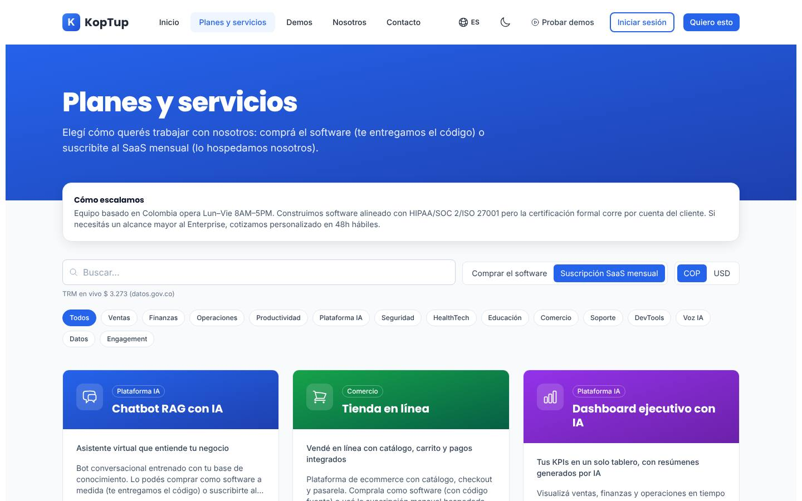
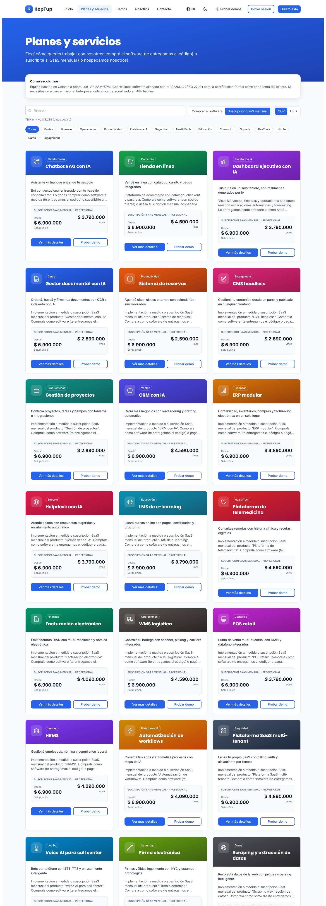
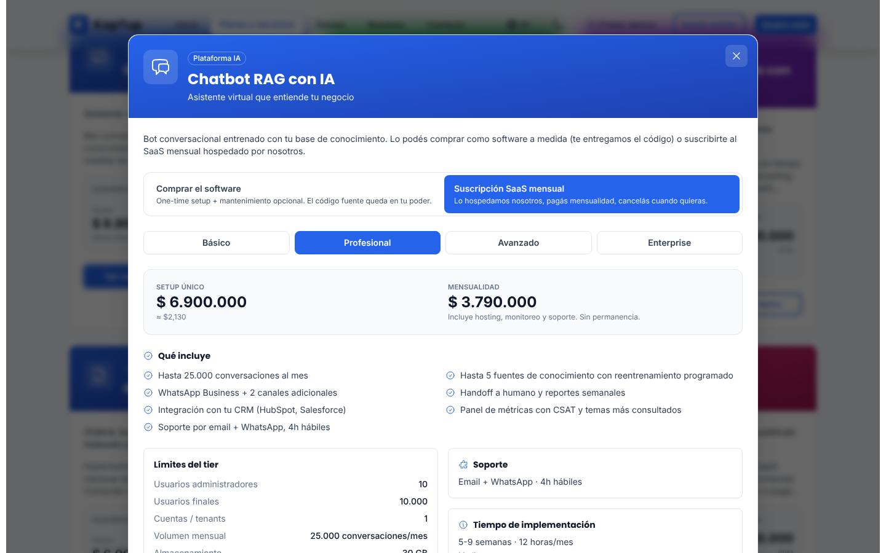
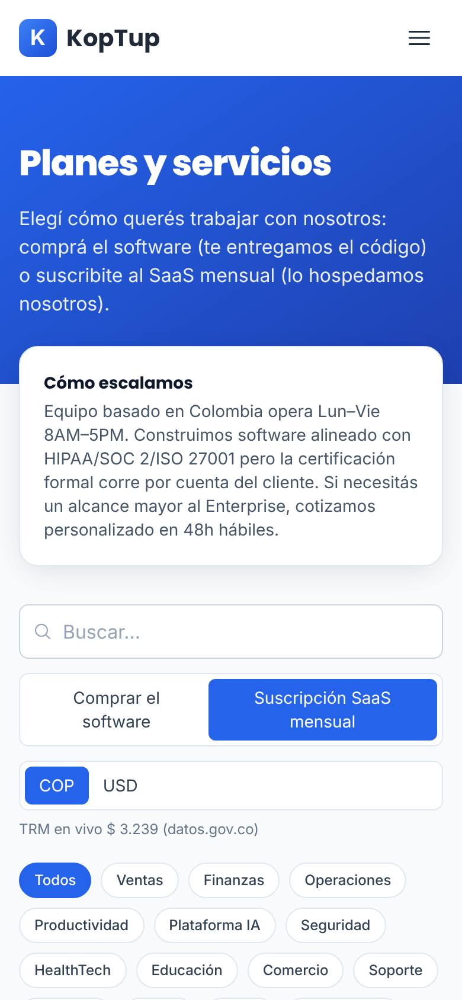
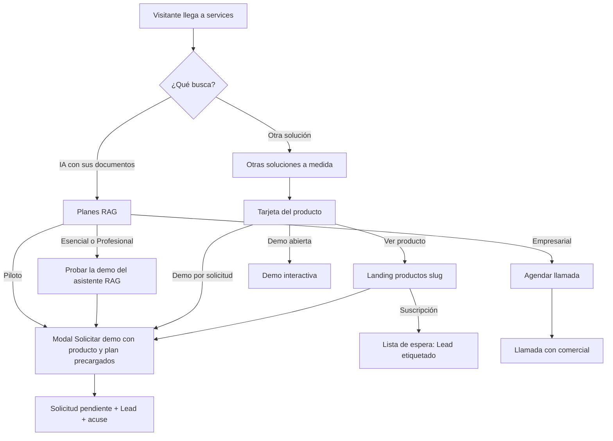
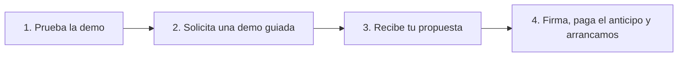
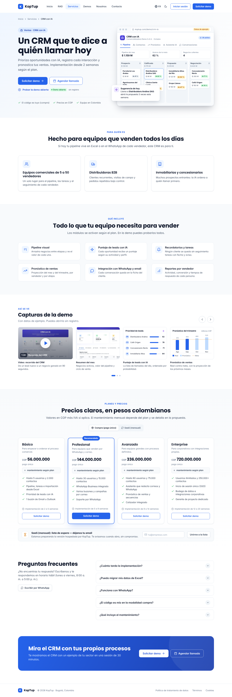
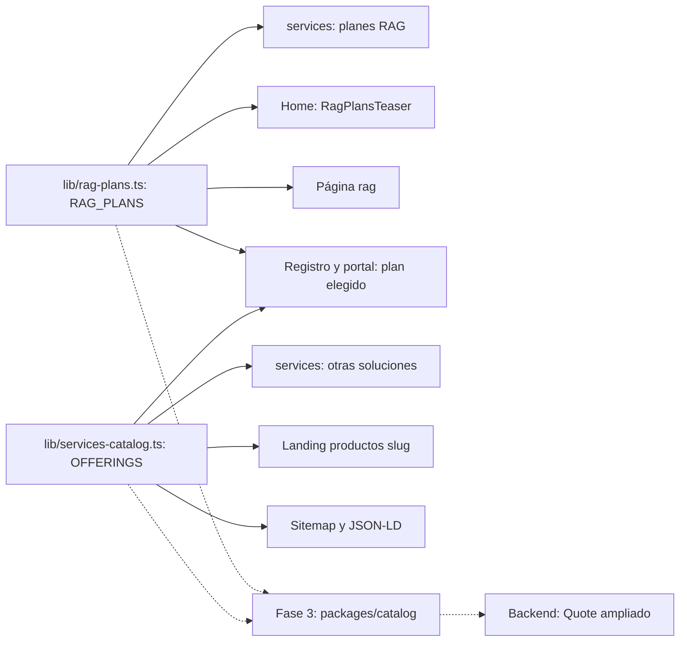

# Servicios y precios

> Rutas: `/services` (y `/pricing`, que solo redirige) · Archivos principales: `apps/web/src/app/services/{page,layout}.tsx`, `apps/web/src/components/offerings/OfferingsCatalog.tsx`, `apps/web/src/lib/services-catalog.ts`, `apps/web/messages/offerings/*.{es,en}.json` (incluye `_page.*.json`), `apps/web/src/app/api/trm/route.ts`, `apps/web/src/app/pricing/*` · Prioridad: **P0** · Esfuerzo total: **XL** (≈ 30 días-dev en la Fase 1, de los cuales ≈ 4 ya avanzan en la rama `rag-reposicionamiento`; el resto en las Fases 2 a 5)



*Captura de producción antes del reposicionamiento RAG. Páginas relacionadas: [Landing de producto](Seccion-Landing-de-Producto.md), [Catálogo de demos](Seccion-Catalogo-de-Demos.md), [Flujo del cliente](03-Flujo-del-Cliente.md), [Sistema de demos](04-Sistema-de-Demos.md), [Catálogo de productos](08-Catalogo-de-Productos.md), [Comercial, marketing y legal](11-Comercial-Marketing-y-Legal.md), [Home](Seccion-Home.md).*

---

## Objetivo

`/services` es la página donde el visitante resuelve **"¿cuánto cuesta y qué compro exactamente?"**. Es el destino de "Ver planes" en la home, en `/rag` y en las demos. Tiene que lograr cinco cosas:

1. **Mostrar el producto principal primero.** Los planes RAG (Piloto, Esencial, Profesional y Empresarial) con su precio exacto en COP y en USD fijos, en la sección `#planes-rag`.
2. **Explicar en 30 segundos la diferencia entre comprar y suscribirse**, y decir sin rodeos qué se puede contratar hoy: la suscripción hospedada existe para RAG; para las demás soluciones está en **lista de espera** (DECISIÓN 7).
3. **Llevar cada producto a su landing** (`/productos/<slug>`, DECISIÓN 2) en lugar de abrir un modal sin URL.
4. **Quitar las sorpresas:** IVA, moneda, qué incluye cada plan, qué cuesta mantenerlo y qué se paga aparte a terceros (nube, IA, mensajería).
5. **Dar un siguiente paso por plan:** probar la demo, solicitar demo guiada, agendar llamada o unirse a la lista de espera.

| Indicador de negocio | Por qué importa |
|---|---|
| Clic en un plan (`plan_click`) por sesión de `/services` | Mide si los precios se entienden y atraen |
| Solicitudes de demo y leads con `source.page = "/services"` | Conversión real de la página de precios |
| Clic de `/services` hacia `/productos/<slug>` | Mide si el catálogo cumple su papel de índice de productos |
| Preguntas de precio que llegan al comercial ("¿incluye IVA?", "¿cuánto cuesta mantenerlo?") | Si bajan, la página está respondiendo sola |

---

## Estado actual

Evidencia tomada de la rama `main`. La rama `rag-reposicionamiento` ya cambia parte de esto (se indica en cada fila).

| Bloque | Qué hay hoy | Evidencia |
|---|---|---|
| Página | `page.tsx` (10 líneas) solo renderiza `OfferingsCatalog`, un client component de 760 líneas | `services/page.tsx`; `OfferingsCatalog.tsx` línea 1 (`'use client'`) |
| Hero | "Planes y servicios" y un subtítulo con voseo ("Elegí cómo querés…, comprá…, suscribite…") | `messages/offerings/_page.es.json` → `offeringsCatalog.hero` |
| Caja "Cómo escalamos" | Horario Lun–Vie 8–17 y "software alineado con HIPAA/SOC 2/ISO 27001", una afirmación de cumplimiento sin respaldo | `_page.es.json` → `offeringsCatalog.banner.body` |
| Modalidad por defecto | El selector arranca en **SaaS**, aunque ningún producto tiene hoy cobro recurrente ni base multi-tenant | `OfferingsCatalog.tsx` línea 575 (`useState<Modality>('saas')`) |
| Precio de cada tarjeta | Muestra el plan **Profesional** con la etiqueta "Desde" (el más barato es Básico). En modo SaaS el setup sale de una constante igual para todos los productos, por eso las 27 tarjetas dicen "Desde $6.900.000" | `OfferingsCatalog.tsx` línea 179 (`offering.tiers[1]`) y línea 224; `services-catalog.ts` línea 226 (`SAAS_SETUP_BY_TIER`) |
| Buscador | Solo compara con el slug y la clave interna de la categoría. "facturación" (con tilde), "inventario" o "nómina" no encuentran nada | `OfferingsCatalog.tsx` línea 585 |
| Categorías | 14 chips más "Todos" para 27 productos; 4 categorías tienen un solo producto. Clasificaciones raras: HRMS en Ventas, SaaS multi-tenant y VPN en Seguridad, BI en Plataforma IA | `OfferingsCatalog.tsx` línea 94; campo `category` en `services-catalog.ts` |
| Moneda | Selector COP/USD con "TRM en vivo … (datos.gov.co)". La ruta `/api/trm` usa un proveedor de respaldo cuando el oficial falla, pero la etiqueta sigue diciendo datos.gov.co; por eso las capturas muestran 3.273 y 3.239 en dos cargas. El valor de reserva es 4.000 | `OfferingsCatalog.tsx` líneas 118–140 (`useLiveTRM`, `fetch('/api/trm')`); `api/trm/route.ts` (`FALLBACK_TRM = 4000`); `_page.es.json` → `currency.trmLive` |
| Formato de "sin precio" | `formatCOP(0)` muestra "Personalizado" y `formatUSD(0)` muestra "Custom" (en inglés) | `services-catalog.ts` líneas 122–137 |
| Detalle del producto | Botón "Ver más detalles" abre un **modal** con planes, toggle, "Qué incluye", límites, soporte, implementación y "Costos que paga el cliente". No tiene URL propia, no cierra con Esc, no atrapa el foco y no tiene `aria-labelledby`. Su contenido no existe para Google | `OfferingsCatalog.tsx` líneas 264–531 (`role="dialog"` en la línea 312) |
| "Qué incluye" | Se recorre un número fijo de viñetas por plan (5/7/8/9) en vez del arreglo real; para cuadrar ese número los textos repiten viñetas ("Reportes mensuales del tier") | `OfferingsCatalog.tsx` línea 441; `services-catalog.ts` línea 247 (`INCLUYE_COUNT_BY_TIER`) |
| Botón "Cotizar este tier" | Envía `/contact?service=<slug>&tier=<plan>&modality=<modo>`. `/contact` solo lee `service` y `plan`: **el plan y la modalidad se pierden**, y el selector de servicio de `/contact` tiene 8 opciones genéricas que no coinciden con el producto | `OfferingsCatalog.tsx` línea 514; `contact/page.tsx` líneas 37–38 y 156–165 |
| Botón "Probar demo" | Lleva a `/demo/<demoSlug>`. "QA automatizado con IA" abre la demo del chatbot y "VPN empresarial" la del SaaS boilerplate | `services-catalog.ts`, entradas `qa-automatizado-ia` y `vpn-empresarial` |
| Textos de los productos | 24 de 27 descripciones son la plantilla "Implementación a medida o suscripción SaaS mensual del producto…"; 23 de 27 archivos tienen viñetas repetidas; los 27 tienen voseo ("Cerrá", "Comprala", "Gestioná") | `messages/offerings/<slug>.es.json` |
| Datos que no se usan | `tiers.<plan>.name`, `description`, `idealPara` y `costoNote` existen en los 27 archivos pero ningún componente los muestra | Búsqueda en `apps/web/src`: 0 usos |
| Estructura de precios | 27 productos × 4 planes × 2 modalidades. Setup de compra Básico entre COP 21 M y 60 M; Enterprise hasta COP 765 M. El **mantenimiento mensual de la compra es ≈ 9 % del setup** (≈ 108–110 % al año) y cuesta **2,6 a 2,8 veces la cuota SaaS**, que además incluye hosting | `services-catalog.ts` líneas 310–1066 |
| Ciclos con descuento | `BILLING_CYCLES` (semestral −10 %, anual −20 %) y `calcularCicloPago` están definidos y no se usan en ninguna parte | `services-catalog.ts` línea 171 |
| Precios duplicados en otras pantallas | El registro y el portal muestran planes del chatbot que no existen en el catálogo (Starter 249.000, Profesional 489.000/mes, "SLA y soporte 24/7") y un "Agente IA de Ventas" que no se vende. El panel admin usa 489.000 como dato simulado. Hay **tres precios distintos** para el mismo chatbot | `register/page.tsx` líneas 28–44; `dashboard/page.tsx` líneas 667–690; `admin/page.tsx` línea 29 |
| `/pricing` | `page.tsx` redirige a `/services` (la rama: a `/services#planes-rag`). `page_new.tsx` (440 líneas) es código muerto con planes viejos "desde 499 USD"; `seoConfig.pricing` repite esa cifra. La navbar enlaza "Quiero esto" a `/pricing` | `pricing/page.tsx`, `pricing/page_new.tsx`, `seo-config.ts` líneas 62–76, `Navbar.tsx` líneas 316 y 400 |
| SEO | Título "Servicios de Desarrollo de Software \| E-commerce, IA, Apps Móviles". El JSON-LD `ProfessionalService` lista 6 servicios (apps móviles, diseño UX/UI, integración de sistemas…) que no son los productos del catálogo | `seo-config.ts` líneas 40–58; `services/layout.tsx` líneas 6–31 |
| CTA final | "¿No sabés cuál elegir?" → "Hablar con un experto" → `/contact` sin producto | `OfferingsCatalog.tsx` línea 740 |
| Peso de mensajes | Los textos de los 27 productos (`_offerings.es.json`, 79 KB) viajan a **todas** las páginas del sitio dentro del proveedor global de i18n | `app/layout.tsx` (`getMessages`), `i18n/request.ts` |
| Rama `rag-reposicionamiento` | Ya hecho: `/pricing` → `/services#planes-rag`, canónico con `www`, botones a `/pricing` corregidos. Pendiente (su Fase 4): sección `#planes-rag`, quitar la tarjeta del chatbot, `TRM_REFERENCIA = 3300` y quitar el botón de demo de QA y VPN | `git diff main...rag-reposicionamiento` |

**Capturas del estado actual**







---

## Problemas detectados

1. **El producto principal no se ve.** RAG es lo que KopTup vende primero, pero aquí es una tarjeta más entre 27, con precios del catálogo viejo que ya no aplican (los planes RAG los reemplazan).
2. **Se ofrece algo que no se puede vender.** El selector arranca en SaaS y muestra cuotas mensuales para 27 productos, cuando no hay cobro recurrente ni base multi-tenant (DECISIÓN 7).
3. **El precio "Desde" engaña dos veces:** usa el plan Profesional (no el más barato) y en SaaS repite el mismo número en todas las tarjetas.
4. **El mantenimiento no se entiende.** Mantener el software comprado cuesta al año más que comprarlo, y más que la suscripción que incluye hosting. Ningún comprador acepta eso sin una explicación.
5. **No se dice nada del IVA** ni de qué incluye el mantenimiento, ni de cómo se factura en USD.
6. **La TRM "en vivo" genera desconfianza:** el precio en USD cambia entre cargas y la etiqueta atribuye el valor a una fuente que a veces no es la real.
7. **El detalle del producto vive en un modal** sin URL: no se puede compartir, no se indexa, no es accesible y su CTA pierde el plan y la modalidad al llegar a `/contact`.
8. **Textos de plantilla, viñetas repetidas y voseo** en los 27 productos. Para un comprador colombiano, el voseo suena a proveedor extranjero.
9. **Afirmaciones sin respaldo** ("alineado con HIPAA/SOC 2/ISO 27001", "SLA y soporte 24/7" en el registro) que contradicen el horario Lun–Vie publicado.
10. **Tres precios distintos para el mismo producto** en catálogo, registro/portal y especificación RAG.
11. **Navegación pobre del catálogo:** 15 chips, categorías de un solo producto y un buscador que no encuentra palabras en español.
12. **Restos de la página vieja de precios** (`page_new.tsx`, metadata "desde 499 USD") que pueden volver a publicarse por error.

---

## Plan detallado

### Estructura nueva de `/services`

La página pasa a ser un **server component** con pocas islas cliente (filtros, selector de moneda, botones con sesión). El orden de secciones es:

| # | Sección | Ancla | Componente | Objetivo | CTA |
|---|---|---|---|---|---|
| 1 | Hero compacto | — | `PricingHero` | Decir qué hay en la página en una línea | Ver planes RAG · Ver otras soluciones |
| 2 | Planes RAG | `#planes-rag` | `RagPlans` (rama RAG) | Precio exacto del producto principal | Por plan (ver abajo) |
| 3 | Cómo comprar | `#como-comprar` | `BuyingSteps` | Mostrar el camino: demo → propuesta → arranque | Solicitar demo guiada |
| 4 | Compra o suscripción | `#modalidades` | `ModalityExplainer` | Explicar las dos modalidades y qué está disponible hoy | — |
| 5 | Otras soluciones a medida | `#otras-soluciones` | `SolutionsCatalog` + `SolutionCard` | Índice de los 26 productos, cada uno hacia su landing | Ver producto · Probar demo o Solicitar demo |
| 6 | Qué incluye cada plan a medida | `#planes-a-medida` | `TierComparison` | Explicar Básico, Profesional, Avanzado y Enterprise una sola vez | — |
| 7 | Preguntas sobre precios | `#preguntas` | `FaqSection` (compartido con home y landings) | Resolver IVA, moneda, mantenimiento, pagos | — |
| 8 | CTA final | — | `FinalCta` | Cierre | Solicitar demo guiada · Agendar llamada |

El ancla `#otras-soluciones` la usa la home ("Ver todas las soluciones", ver [Home](Seccion-Home.md)) y `#planes-rag` la usan la home, `/rag`, las demos y `/pricing`.



### 1. Hero compacto

La rama RAG pide la sección de planes "arriba de todo". El hero queda en una sola franja para que los planes se vean sin desplazarse en escritorio.

- **H1:** Planes y precios
- **Subtítulo:** Empieza con un Piloto RAG de 2 semanas o elige una solución a medida. Los precios están en pesos colombianos más IVA si aplica; para empresas fuera de Colombia cotizamos en dólares.
- **Tres chips verificables:** "Demo antes de comprar" · "Respuesta en máximo 1 día hábil" (promesa de [Flujo del cliente](03-Flujo-del-Cliente.md)) · "Equipo en Colombia".
- **Enlaces:** "Ver planes RAG" (`#planes-rag`) y "Ver otras soluciones" (`#otras-soluciones`).

### 2. Planes RAG (`#planes-rag`)

Se implementa en la rama `rag-reposicionamiento` (su Fase 4). Los datos viven en **una sola constante**, `RAG_PLANS` en `apps/web/src/lib/rag-plans.ts`, que también usan `RagPlansTeaser` en la home y la tabla de `/rag`.

| Plan | Precio | Implementación | Qué incluye | CTA principal | CTA secundario |
|---|---|---|---|---|---|
| **Piloto RAG** | COP 3.900.000 / USD 1.200 | 2 semanas | Una fuente, hasta 100 documentos, interfaz web con citas, informe de precisión con 50 preguntas de prueba. Se descuenta 100 % del setup si contratas en los 30 días siguientes | **Agenda un piloto** (modal Solicitar demo con `producto=chatbot-rag-ia&plan=piloto`) | Probar la demo |
| **Esencial** | Setup COP 9.900.000 / USD 2.990 + COP 1.490.000 / USD 450 al mes | 3–4 semanas | Una fuente (Drive, SharePoint o carga manual), hasta 1.000 documentos, widget web, respuestas con cita. La mensualidad incluye hosting, IA hasta 3.000 preguntas al mes, actualización de documentos y soporte Lun–Vie | **Solicitar demo guiada** (`plan=esencial`) | Probar la demo |
| **Profesional** | Setup COP 24.900.000 / USD 7.490 + COP 2.990.000 / USD 890 al mes | 6–8 semanas | Hasta 3 fuentes, 10.000 documentos, web y WhatsApp, permisos por rol, panel de métricas, hasta 15.000 preguntas al mes, soporte prioritario y revisión mensual de calidad | **Solicitar demo guiada** (`plan=profesional`) | Probar la demo |
| **Empresarial** | Desde COP 59.900.000 / USD 17.900; mensualidad según SLA | 10–14 semanas | Fuentes ilimitadas, nube del cliente u on-premise, SSO, auditoría, código fuente incluido | **Agendar llamada** | Solicitar propuesta |

Notas visibles debajo de la tabla:

- "Pregunta adicional sobre el tope del plan: COP 250 / USD 0,08."
- "Los mensajes de WhatsApp se cobran aparte, a la tarifa de Meta, sin margen."
- "Precios en COP más IVA si aplica. Los precios en USD son fijos y aplican a empresas fuera de Colombia."

Reglas:

- Los USD de los planes RAG son **fijos**: no se calculan con TRM.
- Mientras no exista el cobro recurrente (Fase 4), la mensualidad se factura manualmente cada mes. La página no menciona "cobro automático" ni "cancela cuando quieras".
- Hasta que el formulario de la Fase 1 esté en producción, "Agenda un piloto" va a `/contact` (como pide la especificación RAG). Después abre el modal **Solicitar demo** con el plan precargado.
- "Recomendado" en Profesional es una recomendación comercial, no un dato de ventas: no se escribe "el más elegido".
- Cada clic en una tarjeta o botón de plan envía `plan_click` con `plan` y `source_page = services`.

### 3. Cómo comprar (`BuyingSteps`)



| Paso | Texto propuesto |
|---|---|
| 1. Prueba la demo | El asistente RAG funciona con IA real y sin registro. Las demás soluciones tienen demo abierta o por solicitud. |
| 2. Solicita una demo guiada | Te respondemos en máximo 1 día hábil y te mostramos la solución con un caso de tu sector. |
| 3. Recibe tu propuesta | Con plan, modalidad, montos en COP o USD, cronograma y qué incluye el mantenimiento. |
| 4. Firma y arrancamos | Con el anticipo pagado creamos tu proyecto y lo sigues en tu portal de cliente. |

El paso 4 enlaza a la explicación del portal en [Portal del cliente](06-Portal-del-Cliente.md) solo cuando la Fase 3 (propuesta y anticipo en línea) esté lista; antes el texto dice "con el anticipo acordado en la propuesta".

### 4. Compra o suscripción (`ModalityExplainer`)

Reemplaza el selector global Comprar/SaaS de las tarjetas. Es una tabla corta y honesta:

| | Compra / a medida | Suscripción hospedada |
|---|---|---|
| Qué pagas | Setup único y, si lo quieres, mantenimiento mensual | Setup y una mensualidad |
| Código fuente | Es tuyo | Lo opera KopTup (en el plan Empresarial de RAG, el código se entrega) |
| Dónde corre | En tu nube o la que elijas; podemos operarla por ti con el mantenimiento | En la infraestructura de KopTup |
| Nube, IA y mensajería | Las paga tu empresa directamente a cada proveedor | Incluidas hasta el tope del plan |
| Disponible hoy para | Las 26 soluciones a medida | **Sistemas RAG**. Las demás soluciones: **lista de espera** |

Texto bajo la tabla: "¿Quieres una solución a medida como suscripción? Únete a la lista de espera desde la página del producto y te avisamos cuando esté disponible."

### 5. Otras soluciones a medida (`#otras-soluciones`)

**Título:** Otras soluciones a medida
**Subtítulo:** CRM, ERP, facturación electrónica, mesas de ayuda y más. Cada solución se construye sobre una base probada y se adapta a tu proceso. El código es tuyo.

**Controles** (isla cliente `CatalogFilters`, estado en la URL: `?area=ventas&q=factura`):

- Buscador con etiqueta visible "Buscar solución". Busca en nombre, frase corta, área y una lista de palabras clave por producto (`searchKeywords` en `messages/offerings/<slug>.*.json`), **sin distinguir tildes ni mayúsculas**. Ejemplo: "nomina" encuentra HRMS y Facturación electrónica.
- 6 chips de área más "Todas" (tabla abajo).
- Selector **COP / USD de referencia**. Sin "TRM en vivo".
- Contador accesible: "Mostrando 5 de 26 soluciones" (`aria-live="polite"`).
- Estado vacío: "No encontramos esa solución. Cuéntanos qué necesitas y te decimos si la podemos construir." con botón **Solicitar demo personalizada**.

**Áreas de negocio** (campo nuevo `area` en `services-catalog.ts`; reemplaza las 14 categorías como filtro):

| Área (`area`) | Etiqueta | Productos |
|---|---|---|
| `ventas` | Ventas, marketing y atención | `crm-ia`, `helpdesk-ia`, `voice-ai-callcenter`, `loyalty-fidelizacion` |
| `finanzas` | Finanzas, talento humano y cumplimiento | `erp-modular`, `facturacion-electronica`, `hrms`, `firma-electronica` |
| `comercio` | Comercio y logística | `ecommerce`, `pos-retail`, `wms-logistica`, `app-delivery`, `sistema-reservas` |
| `productividad` | Datos, documentos y productividad | `bi-dashboard`, `gestor-documental`, `automatizacion-workflows`, `scraping-extraccion`, `cms-headless`, `gestion-proyectos` |
| `sectores` | Salud y educación | `telemedicina`, `lms-elearning` |
| `tecnologia` | Equipos de tecnología | `code-review-ia`, `qa-automatizado-ia`, `saas-multi-tenant`, `vpn-empresarial`, `moderacion-contenido` |

Son 26 productos: el catálogo de 27 sin `chatbot-rag-ia`, cuya tarjeta sale de aquí porque la reemplazan los planes RAG (especificación RAG) y cuya landing es `/rag`. La misma área se usa como filtro en el [Catálogo de demos](Seccion-Catalogo-de-Demos.md).

**Tarjeta `SolutionCard`** (sin modal):

| Elemento | Contenido | Fuente |
|---|---|---|
| Ícono y chip de área | Ícono actual del producto y la etiqueta del área | `services-catalog.ts` (`icon`, `area`) |
| Nombre (H3, enlace a la landing) | "CRM con IA" | `messages/offerings` → `name` |
| Frase corta | Una línea en tuteo: "Prioriza oportunidades y haz seguimiento por WhatsApp" | `tagline` reescrita |
| Precio | **Desde COP 56.000.000 + IVA** · "pago único, plan Básico" · "≈ USD 17.000 de referencia" | Mínimo `compra.setupCOP` de los 4 planes; USD con `TRM_REFERENCIA` |
| Implementación | "Implementación desde 2 semanas" | `implementacionSemanas.min` del plan Básico |
| Insignias | "Demo abierta" / "Demo por solicitud" / "Sin demo pública" · "Suscripción: lista de espera" | `accessMode` del catálogo de demos; `saasStatus` |
| Botón principal | **Ver producto** → `/productos/<slug>` | DECISIÓN 2 |
| Botón secundario | Según el modo de la demo (ver [Integración con el sistema de demos](#integración-con-el-sistema-de-demos)) | `GET /api/demo-catalog` |

- La tarjeta no es un enlace gigante: tiene un enlace en el título y dos botones, así cada acción se anuncia bien a lectores de pantalla.
- **Orden por defecto:** área y, dentro de cada área, `sortOrder` del catálogo de demos; los productos con prioridad P1 (`crm-ia`, `helpdesk-ia`, `facturacion-electronica`) van primero en su área.
- `qa-automatizado-ia` y `vpn-empresarial` no muestran botón de demo (especificación RAG): su `demoSlug` pasa a `''` en `services-catalog.ts`.
- Rejilla `sm:grid-cols-2 lg:grid-cols-3`. En móvil, una columna sin tarjetas anidadas.



### 6. Qué incluye cada plan a medida (`TierComparison`)

Los 26 productos comparten la misma escalera de planes. Se explica **una sola vez** aquí, con los valores que ya están en `services-catalog.ts` (`IMPL_SEMANAS_BY_TIER`, `MANT_HORAS_BY_TIER`, `SUPPORT_BY_TIER`, `INTEG_BY_TIER`). Los límites de cada producto (usuarios, volumen, almacenamiento) van en su landing.

| | Básico | Profesional | Avanzado | Enterprise |
|---|---|---|---|---|
| Para quién | Validar con un alcance acotado | Equipos con uso diario | Varias áreas y alto volumen | Corporativos con requisitos de seguridad y auditoría |
| Implementación | 2–5 semanas | 5–9 semanas | 9–14 semanas | 12–20 semanas |
| Horas de ajustes al mes (con mantenimiento) | 5 | 12 | 25 | 50 |
| Soporte (Lun–Vie, 8:00 a. m. a 5:00 p. m.) | Correo, respuesta en 24 h hábiles | Correo y WhatsApp, 4 h hábiles | Correo, WhatsApp y Slack, 2 h hábiles | Mesa de tickets con auditoría, 1 h hábil para incidentes críticos |
| Integraciones | Básicas (correo, hojas de cálculo, pagos) | Medias (WhatsApp, CRM, contabilidad) | Avanzadas (ERP, telefonía, bodegas de datos) | Corporativas (SSO, sistemas propios) |
| Código fuente | Tuyo | Tuyo | Tuyo | Tuyo |

La fila de soporte dice "hábiles" en todos los planes: hoy el plan Enterprise dice "1h crítico" sin aclarar horario, y eso choca con el horario publicado. Si el dueño decide ofrecer atención fuera de horario en Enterprise, se escribe como "según el SLA de tu contrato".

### 7. Reglas de precios

#### 7.1 Moneda y tasa de cambio

- **COP es la moneda base.** Se factura en COP a empresas colombianas.
- **Planes RAG:** USD fijos de la especificación.
- **Otras soluciones:** USD **de referencia** = COP ÷ `TRM_REFERENCIA` (3.300), redondeado a la centena (≥ USD 1.000) o a la decena (< USD 1.000). Ejemplo: COP 56.000.000 → USD 17.000.
- **Etiqueta visible:** "USD de referencia (1 USD = COP 3.300). Para empresas fuera de Colombia, la propuesta fija el precio en USD."
- Se quitan del catálogo público `useLiveTRM`, `TRM_FALLBACK` y la etiqueta "TRM en vivo". La ruta `/api/trm` se conserva para el armador de propuestas (Fase 3, campo `fxRate` del `Quote`), y debe devolver y mostrar el proveedor real que respondió.

#### 7.2 IVA

- **Etiqueta junto a cada precio en COP:** "+ IVA si aplica".
- **Respuesta en la FAQ:** "Los precios están en pesos colombianos antes de IVA. El IVA (19 %) se agrega en la factura cuando aplica. Algunos conceptos, como el hosting y los servicios en la nube, pueden estar excluidos según el Estatuto Tributario; tu propuesta detalla cada concepto. Para empresas fuera de Colombia, el tratamiento lo define la propuesta."
- El texto lo valida el contador de KopTup antes de publicarse (tarea 12). La wiki no fija un tratamiento tributario.

#### 7.3 Mantenimiento de la compra (decisión del dueño)

Hoy el mantenimiento cuesta ≈ 9 % del setup **cada mes**. Ejemplo, CRM con IA Básico: setup COP 56.000.000 y mantenimiento COP 5.100.000/mes = COP 61.200.000 al año (109 % del setup), 2,7 veces la cuota SaaS del mismo plan.

| Opción | Cómo se ve en el CRM Básico | Ventaja | Riesgo |
|---|---|---|---|
| A. Porcentaje anual del setup (referencia de mercado 15–20 %) | 18 % anual = COP 10.080.000/año ≈ COP 840.000/mes, con las 5 h de ajustes | Fácil de explicar y de comparar | Menos ingreso recurrente por cliente |
| B. Bolsas de horas | Bolsa de 10, 20 o 40 h al mes con tarifa por hora publicada | El cliente paga lo que usa | Más difícil de presupuestar para el cliente |
| C. Mantener el valor actual | Sin cambios de precio | Ninguna en claridad | Seguirá generando objeciones |

**Mientras el dueño decide,** las tarjetas y las landings muestran "+ mantenimiento según plan (se detalla en tu propuesta)", como en el mockup de la landing, y nunca un número que contradiga la propuesta. La decisión queda registrada en [Comercial, marketing y legal](11-Comercial-Marketing-y-Legal.md).

#### 7.4 Suscripción (DECISIÓN 7)

- **Campo nuevo `saasStatus`** en cada producto de `services-catalog.ts`: `disponible` o `lista_espera`. Hoy solo los planes RAG cuentan como disponibles; las 26 soluciones van en `lista_espera`.
- **Los precios SaaS de las 26** se conservan en el código para el futuro, pero **no se muestran** como contratables.
- **"Unirme a la lista de espera"** (en la landing y en la ficha) pide email y autorización Ley 1581 y llama a `POST /api/contact` con `offeringSlug`, `plan` y `modality = saas`:
  - el backend hace upsert del **Lead** (ver [Sistema de demos](04-Sistema-de-Demos.md), modelo `Lead`) y le agrega la etiqueta `saas_lista_espera:<slug>`;
  - `modality` es un campo menor que se suma a los cambios de `Contact` de la sección 5.2 de esa página.
- Cuando un producto pase a `disponible` (Fase 4), **Admin › Leads** filtra por esa etiqueta y el comercial avisa a la lista.

#### 7.5 Costos de terceros

- Se renombran a **"Costos de terceros estimados (no incluidos en la compra)"**: rango en USD/mes, con referencia en COP y el detalle actual (nube, base de datos, IA, mensajería).
- **Texto:** "Los factura cada proveedor directamente a tu empresa; KopTup no les suma margen. En la suscripción hospedada están incluidos hasta el tope del plan."
- Se elimina la frase actual en voseo y la mezcla "One-time setup".

#### 7.6 Valores especiales

- `0` se muestra como **"A convenir"** en COP y en USD (hoy: "Personalizado" y "Custom").
- El plan Enterprise usa "Desde" cuando el setup es un piso y no un precio cerrado.

#### 7.7 Fuente única de precios



- Se eliminan los precios escritos a mano en `register/page.tsx` (`PLAN_PREVIEW`), `dashboard/page.tsx` (`EmptyView`) y `admin/page.tsx`. El registro y el portal leen el plan desde `RAG_PLANS` u `OFFERINGS`; el panel admin usa datos reales (ver [Panel de administración](05-Panel-de-Administracion.md)).
- **Fase 3:** las dos fuentes se mueven a un paquete compartido del monorepo, `packages/catalog` (ya existe la carpeta `packages/`), para que el `Quote` ampliado del backend use exactamente los mismos montos que la web.

#### 7.8 Cambios en `services-catalog.ts`

```ts
export type BusinessArea = 'ventas' | 'finanzas' | 'comercio' | 'productividad' | 'sectores' | 'tecnologia';
export type SaasStatus = 'disponible' | 'lista_espera';

export interface Offering {
  slug: string;
  demoSlug: string;          // '' en qa-automatizado-ia y vpn-empresarial
  area: BusinessArea;        // nuevo: reemplaza a category como filtro
  saasStatus: SaasStatus;    // nuevo: DECISIÓN 7
  icon: string;
  gradient: string;
  tiers: Tier[];
}

export const TRM_REFERENCIA = 3300;                     // reemplaza a TRM_FALLBACK
export function minSetupCOP(o: Offering): number { /* mínimo de compra.setupCOP */ }
export function formatUsdReference(cop: number): string { /* COP / TRM_REFERENCIA, redondeo 100 o 10 */ }
```

- `incluyeCount` se elimina: el componente recorre el arreglo real `tiers.<plan>.incluye`.
- `BILLING_CYCLES` y `calcularCicloPago` se eliminan, o se dejan documentados para la Fase 4. No se publican descuentos que no se pueden cobrar.
- El arreglo `OFFERINGS` deja de incluir `chatbot-rag-ia`. Sus datos viejos se borran: los precios del chatbot son los de `RAG_PLANS`.

### 8. Preguntas sobre precios (`#preguntas`)

Componente `FaqSection`; el JSON-LD `FAQPage` se genera del mismo arreglo visible.

| Pregunta | Respuesta propuesta |
|---|---|
| ¿Los precios incluyen IVA? | Texto de la sección 7.2, validado por el contador. |
| ¿En qué moneda facturan? | En pesos colombianos a empresas en Colombia. A empresas del exterior, en dólares: los planes RAG tienen precio fijo en USD y las demás soluciones se cotizan en USD en la propuesta. |
| ¿Qué es el setup? | Es el pago único por implementar la solución: configuración, ajustes a tu proceso, migración inicial de datos, capacitación y puesta en marcha. |
| ¿Qué incluye el mantenimiento? | Horas de ajustes al mes según el plan, actualizaciones de seguridad, monitoreo y soporte en horario hábil. El valor exacto va en tu propuesta. (Se actualiza cuando el dueño decida la política de la sección 7.3.) |
| ¿Quién paga la nube y la IA? | En la compra, tu empresa paga directamente a cada proveedor y te mostramos un estimado mensual. En la suscripción RAG están incluidas hasta el tope del plan; cada pregunta adicional cuesta COP 250 / USD 0,08. |
| ¿Puedo empezar pequeño? | Sí. En RAG, con el Piloto de 2 semanas, que se descuenta si contratas en 30 días. En las demás soluciones, con el plan Básico, y creces de plan cuando lo necesites. |
| ¿Cómo se paga? | Con un anticipo al aceptar la propuesta y el saldo por entregas. Los porcentajes y las fechas van en la propuesta. |
| ¿Por qué no puedo contratar la suscripción de otras soluciones? | Porque solo ofrecemos suscripción donde tenemos la plataforma lista para operarla y cobrarla. Hoy es RAG; para las demás puedes unirte a la lista de espera. |

### 9. CTA final

- **Título:** ¿No sabes qué plan te conviene?
- **Texto:** Cuéntanos qué quieres resolver y en una demo guiada te recomendamos el plan y la modalidad, con números.
- **Botones:** **Solicitar demo guiada** (modal, `source.page = /services`) · **Agendar llamada** (`NEXT_PUBLIC_BOOKING_URL`, reemplaza el `mailto:`).

### 10. `/pricing`

- Se reemplaza `app/pricing/page.tsx` por una redirección **permanente** en `next.config.js` (`redirects()`, código 301) hacia `/services#planes-rag`. Así no se ejecuta ningún componente.
- Se borran `pricing/page.tsx`, `pricing/page_new.tsx`, `pricing/layout.tsx` y la entrada `seoConfig.pricing` (que dice "desde 499 USD").
- La navbar cambia "Quiero esto" (hoy a `/pricing`) por **Solicitar demo**, que abre el modal. Es un cambio global descrito en [Home](Seccion-Home.md) y en [Plan por sección](07-Plan-por-Seccion.md).

---

## Integración con el sistema de demos

| Punto | Qué hace | Referencia |
|---|---|---|
| Botón secundario de cada tarjeta | `publico` → **Probar demo** (`/demo/<demoSlug>`). `solicitud` → **Solicitar demo** (modal con `?producto=<slug>&demo=<demoSlug>`). Sin demo o demo `active = false` → sin botón de demo. `privado` → no aplica a ningún producto del catálogo | Sección 4 de [Sistema de demos](04-Sistema-de-Demos.md) |
| Datos del modo | `GET /api/demo-catalog` desde el servidor, con `revalidate: 60`. Si falla, el mapa estático `lib/demo-access.ts` generado de la semilla | Sección 5.3 de [Sistema de demos](04-Sistema-de-Demos.md) |
| Prospecto con acceso | Si hay sesión `prospect` o `client` con un acceso vigente a la demo del producto, el botón cambia a **Abrir mi demo · te quedan N días** (`GET /api/me/demos`, en la isla cliente) | [Portal del cliente](06-Portal-del-Cliente.md) |
| Modal Solicitar demo | Precarga `producto`, `plan` (desde un plan RAG) y `demo`; guarda `source.page = /services` y las UTM | Formulario de [Flujo del cliente](03-Flujo-del-Cliente.md), etapa 4 |
| Lista de espera SaaS | Lead con etiqueta `saas_lista_espera:<slug>` vía `POST /api/contact` | Sección 7.4 de esta página |
| Métricas | **Admin › Métricas** desglosa solicitudes y leads por `source.page`; `/services` aparece como una fila del embudo | `GET /api/metrics/demo-funnel` |

**Eventos de la página** (solo con consentimiento de analítica; sin datos personales):

| Evento | Cuándo | Propiedades |
|---|---|---|
| `plan_click` | Clic en una tarjeta o botón de plan RAG | `plan`, `source_page: services` |
| `catalog_filter` | Cambio de área o búsqueda (con retardo de 1 s) | `area`, `has_query` |
| `catalog_card_click` | Clic en "Ver producto" o en el botón de demo | `product`, `action` (`ver_producto`, `probar_demo`, `solicitar_demo`), `access_mode` |
| `cta_solicitar_demo_click` y `demo_request_open` | Clic en cualquier "Solicitar demo" | `source_page: services`, `section`, `product`, `plan` |
| `schedule_call_click` | Clic en "Agendar llamada" | `source_page`, `section` |
| `saas_waitlist_join` | Envío de la lista de espera | `product` |
| `currency_toggle` | Cambio COP / USD | `currency` |

---

## SEO · i18n · accesibilidad · rendimiento

**SEO**
- **Título:** "Planes y precios de sistemas RAG y software" (43 caracteres; 52 con " | KopTup"). Se verifica con `npm run check-titles` (rama RAG).
- **Descripción:** "Precios en COP y USD: Piloto RAG de 2 semanas, planes de IA con tus documentos y 26 soluciones a medida. IVA, mantenimiento y costos de terceros, claros." (153 caracteres).
- **Canónico:** `https://www.koptup.com/services` (rama RAG).
- **JSON-LD:**
  - Se quita: el `ProfessionalService` actual con servicios que no existen en el catálogo.
  - Se agrega: `BreadcrumbList`, `ItemList` con los 26 productos (cada `ListItem` con la URL de su landing) y `FAQPage` generado de la sección 8.
  - Los `Offer` con precio viven en `/rag` (planes RAG, `Service`, ver [Landings SEO](Seccion-Landings-SEO.md)) y en cada landing (`Product`, ver [Landing de producto](Seccion-Landing-de-Producto.md)). Así cada precio está una sola vez en los datos estructurados.
- **Un solo H1.** Secciones en H2 y nombres de producto en H3.
- Las 26 tarjetas se renderizan en el HTML del servidor con enlaces normales a `/productos/<slug>`: es el principal enlazado interno hacia las landings.

**i18n**
- Todos los textos en español colombiano con "tú": se reescriben `_page.es.json` y los 26 `messages/offerings/<slug>.es.json` (descripciones propias, viñetas sin duplicados, sin "tier").
- El inglés sigue por cookie hasta la Fase 5. Los textos EN se actualizan en la misma tarea para que no queden desalineados.
- Las tarjetas solo necesitan `name`, `tagline` y `searchKeywords`. El resto del contenido del producto (planes, viñetas, FAQ) se lee en el servidor de la landing y deja de viajar a todas las páginas.

**Accesibilidad**
- El selector de moneda es un grupo de radio (`role="radiogroup"`, flechas para moverse); los chips de área usan `aria-pressed`.
- El buscador tiene `<label>` visible y el contador de resultados se anuncia con `aria-live`.
- Los precios se leen completos: "Desde 56 millones de pesos colombianos más IVA" (texto `sr-only` junto al número formateado).
- Contraste AA en los textos blancos sobre degradados de las tarjetas (hoy `text-white/90` sobre tonos claros).
- Foco visible en chips, botones y enlaces. Al desaparecer el modal, desaparecen también sus problemas de foco y Esc.

**Rendimiento** (meta: LCP móvil p75 < 2,5 s, CLS < 0,1, INP < 200 ms)
- `page.tsx` server component. Islas cliente: `CatalogFilters`, selector de moneda y botones con sesión.
- Sin `fetch('/api/trm')` en el navegador.
- Íconos de Heroicons importados por producto, no un mapa con 27 íconos dentro del bundle cliente.

---

## Tareas

| # | Tarea | Fase | Prioridad | Esfuerzo | Criterio de aceptación |
|---|---|---|---|---|---|
| 1 | Fusionar la Fase 4 de la rama `rag-reposicionamiento`: sección `#planes-rag` (`RagPlans` + `lib/rag-plans.ts`), quitar la tarjeta del chatbot, `TRM_REFERENCIA = 3300` y quitar el botón de demo de QA y VPN | Fase 1 — Funnel y solicitud de demos | P0 | M | En producción `/services#planes-rag` muestra los 4 planes con los montos exactos de la especificación y USD fijos; no aparece la tarjeta "Chatbot RAG con IA"; QA y VPN no tienen botón de demo |
| 2 | Fuente única de precios: borrar `PLAN_PREVIEW` de `register/page.tsx`, las recomendaciones con precio de `dashboard/page.tsx` y los montos simulados de `admin/page.tsx`; leer de `RAG_PLANS` u `OFFERINGS` | Fase 1 — Funnel y solicitud de demos | P0 | S | Una búsqueda de "489000", "249000", "Starter" y "agente-ia-ventas" en `apps/web/src` no da resultados; el registro con `?plan=` muestra un plan que existe en `/services` |
| 3 | Regla SaaS (DECISIÓN 7): campo `saasStatus`, ocultar las cuotas SaaS de las 26 soluciones, insignia "Suscripción: lista de espera" y formulario de lista de espera hacia `POST /api/contact` con `modality = saas` | Fase 1 — Funnel y solicitud de demos | P0 | M | Ninguna tarjeta ni landing de "Otras soluciones" muestra una cuota mensual; unirse a la lista crea o actualiza un Lead con la etiqueta `saas_lista_espera:<slug>` visible en **Admin › Leads** |
| 4 | `SolutionsCatalog` y `SolutionCard` como server component: "Desde" con el setup mínimo de compra, USD de referencia, insignias por modo, botón "Ver producto" a la landing, sin modal; ancla `#otras-soluciones` | Fase 1 — Funnel y solicitud de demos | P0 | M | Las 26 tarjetas enlazan a `/productos/<slug>` (respuesta 200); ninguna dice "Desde $6.900.000"; el precio de cada tarjeta coincide con el plan Básico de compra de `services-catalog.ts` |
| 5 | Texto de IVA validado por el contador y etiqueta "+ IVA si aplica" junto a cada precio en COP (tarjetas, planes RAG, landings) | Fase 1 — Funnel y solicitud de demos | P0 | S | El contador aprueba por escrito el texto de la FAQ; ningún precio en COP aparece sin la etiqueta |
| 6 | `/pricing`: redirección permanente en `next.config.js` a `/services#planes-rag`; borrar `page.tsx`, `page_new.tsx`, `layout.tsx` y `seoConfig.pricing` | Fase 1 — Funnel y solicitud de demos | P1 | S | `curl -I /pricing` responde 301 hacia `/services#planes-rag`; el repo no contiene "desde $499" ni `page_new.tsx` |
| 7 | Reescribir el hero, la caja "Cómo escalamos" (sin HIPAA/SOC 2/ISO) y el CTA final en tuteo; CTA final con "Solicitar demo guiada" y "Agendar llamada" | Fase 1 — Funnel y solicitud de demos | P1 | S | `_page.es.json` no tiene voseo ni menciones de certificaciones; no queda enlace a `/contact` sin producto en la página |
| 8 | Secciones "Cómo comprar" (`BuyingSteps`) y "Compra o suscripción" (`ModalityExplainer`) | Fase 1 — Funnel y solicitud de demos | P1 | S | Las dos secciones se ven en móvil sin desplazamiento horizontal; el texto dice qué modalidad está disponible para cada tipo de producto |
| 9 | Campo `area` con las 6 áreas de negocio y chips de filtro; reclasificar HRMS, BI y SaaS multi-tenant; el mismo campo lo usa el catálogo de demos | Fase 1 — Funnel y solicitud de demos | P1 | S | Hay 7 chips (6 áreas + Todas); ningún área tiene menos de 2 productos; `?area=finanzas` filtra al cargar la página |
| 10 | Formatos: "A convenir" en lugar de "Personalizado" y "Custom"; `formatUsdReference` con redondeo; quitar `useLiveTRM` y la etiqueta "TRM en vivo" del catálogo; `/api/trm` devuelve el proveedor real | Fase 1 — Funnel y solicitud de demos | P1 | S | La página no hace peticiones a `/api/trm`; COP 56.000.000 se muestra como "≈ USD 17.000 de referencia"; la palabra "Custom" no aparece en español |
| 11 | Política de mantenimiento de la compra (decisión del dueño, sección 7.3) y su visualización; mientras tanto, "+ mantenimiento según plan" | Fase 1 — Funnel y solicitud de demos | P1 | S | La decisión queda escrita en [Comercial, marketing y legal](11-Comercial-Marketing-y-Legal.md); ningún precio público de mantenimiento contradice esa decisión |
| 12 | Limpiar los textos de las 26 ofertas: descripción propia, viñetas sin duplicados ni "tier", tuteo, `searchKeywords`; eliminar `incluyeCount` y recorrer el arreglo real | Fase 1 — Funnel y solicitud de demos | P1 | M | Un script sobre `messages/offerings/*.es.json` no encuentra la frase de plantilla, viñetas repetidas dentro de un plan ni formas de voseo de la lista de la especificación RAG |
| 13 | Preguntas sobre precios (`FaqSection`, 8 preguntas) con `FAQPage` generado del mismo arreglo | Fase 1 — Funnel y solicitud de demos | P1 | S | El texto del JSON-LD es idéntico al visible; la prueba de resultados enriquecidos no muestra errores |
| 14 | SEO de `/services`: título y descripción nuevos, `ItemList` + `BreadcrumbList`, quitar el `ProfessionalService` con servicios inexistentes | Fase 1 — Funnel y solicitud de demos | P1 | S | `check-titles` pasa; el JSON-LD no menciona apps móviles ni diseño UX/UI; cada `ListItem` apunta a una landing que responde 200 |
| 15 | Botones según `accessMode` desde `GET /api/demo-catalog` (con fallback estático) y "Abrir mi demo" para prospectos con acceso vigente | Fase 1 — Funnel y solicitud de demos | P1 | S | Cambiar el modo de `erp` en **Admin › Catálogo de demos** cambia su botón a "Solicitar demo" en ≤ 60 s sin desplegar; un prospecto con acceso a `erp` ve "Abrir mi demo · te quedan N días" |
| 16 | Eventos de la página (`plan_click`, `catalog_filter`, `catalog_card_click`, `cta_solicitar_demo_click`, `schedule_call_click`, `saas_waitlist_join`, `currency_toggle`) | Fase 1 — Funnel y solicitud de demos | P1 | S | Con cookies rechazadas no sale ninguna petición de analítica; con cookies aceptadas los 7 eventos aparecen en GA4 DebugView con sus propiedades |
| 17 | Prueba E2E de `/services`: montos RAG iguales a la constante, ninguna tarjeta con "Personalizado", "Custom" o "Desde $6.900.000", enlaces a landings con 200, sin enlaces a `/pricing` | Fase 1 — Funnel y solicitud de demos | P1 | S | La prueba corre en CI (cuando la Fase 0 lo repare) y falla si alguien cambia un precio solo en un lugar |
| 18 | Tabla "Qué incluye cada plan a medida" (`TierComparison`) con soporte en horario hábil explícito | Fase 1 — Funnel y solicitud de demos | P2 | S | Los valores salen de las constantes de `services-catalog.ts`; la fila de soporte dice "hábiles" en los 4 planes |
| 19 | Buscador sin tildes por nombre, frase, área y palabras clave, con estado en la URL y contador accesible | Fase 1 — Funnel y solicitud de demos | P2 | S | "nomina", "inventario" y "facturacion" devuelven resultados; `?q=crm` se conserva al recargar; el contador se anuncia en lector de pantalla |
| 20 | Accesibilidad: grupo de radio para la moneda, `aria-pressed` en chips, precios con texto completo para lectores, contraste AA y foco visible | Fase 1 — Funnel y solicitud de demos | P2 | S | axe-core no reporta errores serios ni críticos en `/services`; la página se recorre completa con teclado |
| 21 | Rendimiento: `/services` como server component y los textos completos de los productos fuera del proveedor global de mensajes | Fase 2 — Demos vendibles | P2 | M | El JS de primera carga de `/services` baja al menos un 40 % frente a hoy (salida de `next build`); `_offerings` deja de enviarse completo a páginas que no lo usan |
| 22 | Paquete compartido `packages/catalog` con `OFFERINGS`, `RAG_PLANS` y los formatos, usado por la web y por el `Quote` ampliado del backend | Fase 3 — Propuestas y conversión | P1 | M | Una propuesta creada en el panel toma el precio del plan desde el paquete; cambiar un precio en el paquete cambia la web y el armador de propuestas |
| 23 | Ciclos de pago con descuento (`BILLING_CYCLES`): eliminarlos o activarlos junto con el cobro recurrente | Fase 4 — Productos SaaS reales | P3 | S | No existe en el repo una tabla de descuentos que la página no aplique |
| 24 | `/en/services` indexable con precios USD (fijos en RAG, de referencia en el resto) y `hreflang` | Fase 5 — Escala | P3 | M | La versión EN tiene canónico propio y `hreflang` recíproco; ningún texto de la versión EN queda en español |

---

## Métricas de éxito

Metas iniciales a validar con 8 semanas de datos reales (ver la nota de [Flujo del cliente](03-Flujo-del-Cliente.md)).

| Métrica | Fuente | Meta inicial |
|---|---|---|
| Sesiones de `/services` con `plan_click` | GA4 | ≥ 25 % |
| Sesiones de `/services` que hacen clic hacia una landing `/productos/<slug>` | GA4 (`catalog_card_click`) | ≥ 15 % |
| Solicitudes de demo y leads con `source.page = "/services"` | **Admin › Métricas** | Línea base en el primer mes; +30 % al tercer mes |
| Inscritos en listas de espera SaaS por producto | **Admin › Leads** (etiqueta `saas_lista_espera`) | Dato para priorizar la Fase 4 (sin meta) |
| Precios distintos para un mismo plan en el sitio | Prueba E2E + búsqueda en el repo | 0 |
| Preguntas repetidas sobre IVA, moneda o mantenimiento registradas por el comercial | Notas de `LeadActivity` | −50 % a los 3 meses |
| LCP móvil p75 / CLS / INP de `/services` | Search Console (Core Web Vitals) | < 2,5 s / < 0,1 / < 200 ms |
| Errores de datos estructurados en `/services` | Search Console | 0 |
